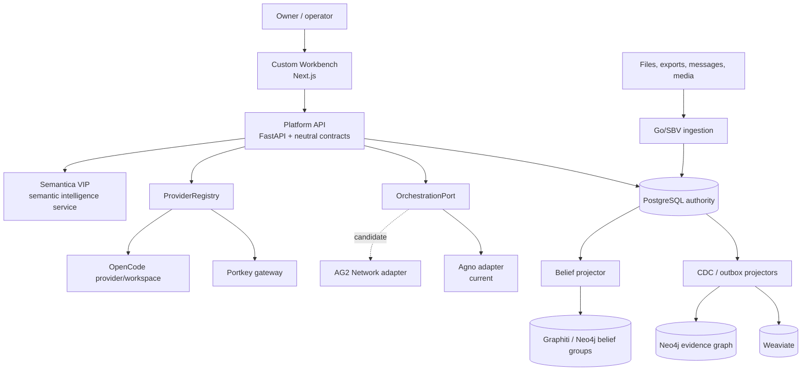
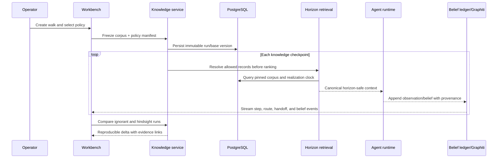
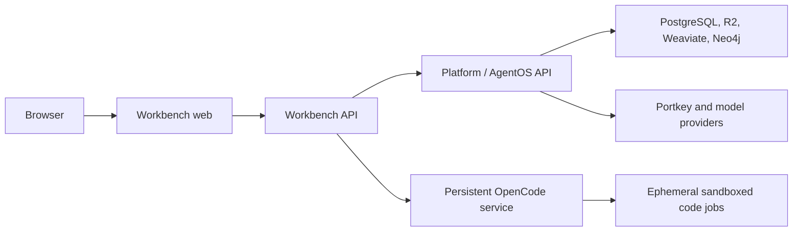

# Architecture Blueprint

> _Byline: Codex · GPT-5 · 2026-08-15_

## System context

_Figure 1 — Target system context. Solid edges include observed current surfaces; dotted AG2 edge is candidate. Provenance: `server/api/main.py:225-408`, `workbench/api/main.py:44-106`, `compose.yaml:39-257`, and `docs/ARCHITECTURE-BLUEPRINT-2026-08-15.md`._

## Trust and authority boundaries

| Boundary | Authority | Rule |
|---|---|---|
| Evidence/custody | PostgreSQL + originals/R2 | Append or supersede; never let projections become truth. |
| Horizon policy | Platform domain service | Resolve before retrieval and before context assembly. |
| Belief history | Append-only PostgreSQL `belief_event` (planned) | Graphiti is a run-scoped projection, not evidence. |
| Provider policy | Platform `ProviderRegistry` (planned) | Resolve route/capability/policy before invoking a runtime. |
| Coordination | Adapter-owned runtime state | May replay handoffs, but not redefine evidence, approval, or identity. |
| Browser | Untrusted client | Receives redacted route/health data, never provider secrets. |
| Code jobs | Isolated execution | No host socket, implicit secrets, or evidence mounts. |

Semantica is a **VIP component**: integrate it as the platform's full semantic-intelligence and extraction service; never replace, dilute, or fork around it (`docs/PROJECT_CANON.md:224`; `docs/INVENTORY-2026-08-09.md:128`). “Candidate-only” describes the governed boundary by which Semantica proposes changes to canonical platform knowledge—it is not the identity or product scope of the service.

## Knowledge-to-experience data flow

_Figure 2 — Planned horizon-walk sequence. Provenance: `sql/0026_realization_event.sql:68-211`, `sql/0027_walk_ledger.sql:74-202`, `docs/HANDOFF-2026-08-15-R0-wave1-audit.md`, and `docs/HANDOFF-2026-08-15-R2-horizon-engine.md`._

## Deployment topology

_Figure 3 — Logical self-hosted topology. Provenance: current FastAPI/Next.js repositories plus planned OpenCode isolation in `docs/HANDOFF-2026-08-15-R7-opencode-workspace.md`. Vercel Functions/Sandbox are not assumed self-hostable._

Repository deployment definitions describe more than one legitimate topology: root `compose.yaml:202-259` uses Neo4j Community plus `zepai/knowledge-graph-mcp:latest`, while `deploy/data-neo4j.yaml:35-64` and `deploy/data-graphiti-case.yaml:55-105` describe DozerDB plus a pinned case Graphiti image and sidecars. These must remain separate diagrams until a live inventory identifies which definition owns each deployment. `%% UNVERIFIED`

## Runtime replacement strategy

Use a strangler: freeze `OrchestrationPort`, `ProviderRegistry`, `BeliefMemoryPort`, approval, and event contracts; wrap current Agno; run one AG2 shadow/spike; cut over only workflows that pass parity gates. AgentOS remains until schedules, approvals, registry, traces, service accounts, and knowledge administration have explicit replacements (`server/api/main.py:264-278`, `:381-408`).

## Open questions

- `%% UNVERIFIED` Current live topology, image digests, and Coolify watch paths need a read-only deployment inventory.
- `%% UNVERIFIED` Graphiti MCP currently uses a floating image in repository configuration; actual deployed release must be discovered.
- Deployment files still contain retired `100.119.96.29` host defaults (`deploy/data-weaviate.yaml:18`, `deploy/data-graphiti-case.yaml:68`); confirm live overrides before correction.
- Final data residency and credential policy for subscription-backed OpenCode providers is undecided.
- Exact PostgreSQL schema for `belief_event`, neutral event stream, and route audit awaits ADRs.
