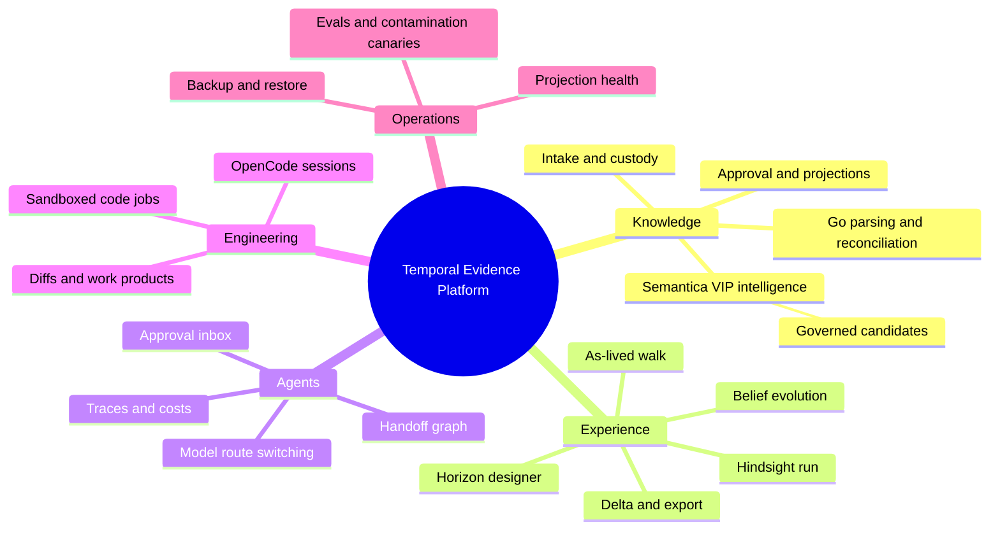
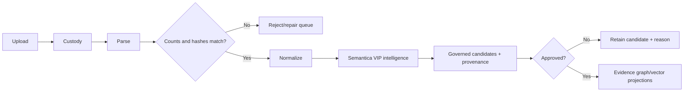
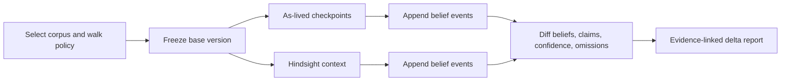
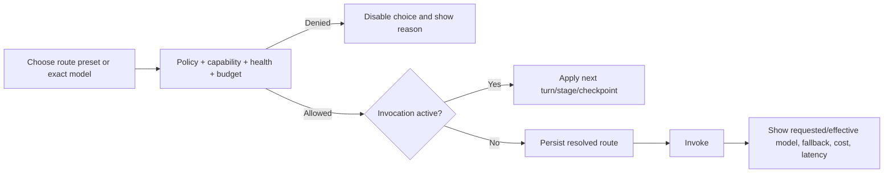
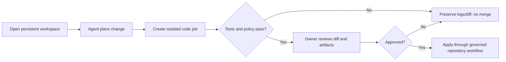

# Feature Blueprint

> _Byline: Codex · GPT-5 · 2026-08-15_
> _Current-entry-point repair: Codex · GPT-5 · 2026-08-15._

## Capability hierarchy



_Figure 1 — Planned product capability tree. Provenance: `docs/PRODUCT-BLUEPRINT-2026-08-15.md` and handoffs R1–R8._

## Observed versus planned surfaces

| Surface | State | Evidence / target |
|---|---|---|
| Runs, Records, Tools, Repair Lab, Intake, Evidence Queue, Schemas | Observed | `workbench/web/src/components/layout/app-sidebar.tsx:27-35` |
| Classification Lab | Observed, uncommitted | Same sidebar plus `workbench/web/src/app/classification-test/` |
| Copilot/OpenCode chat | Observed | `workbench/web/src/app/copilot/page.tsx`, `workbench/api/app/service/copilot.py` |
| Knowledge page | Observed in working tree; locally built | `workbench/web/src/app/knowledge/page.tsx`; not deployed/live-proven |
| Matter workspace + Knowledge-to-Evidence | Observed in working tree; held | `workbench/web/src/app/matter/page.tsx`, neutral spine/Workbench adapters, migration `0030`; unapplied and undeployed |
| Copilot | Page and API observed; absent from sidebar | `workbench/web/src/app/copilot/page.tsx`; sidebar lines 26-36 |
| Horizon designer and delta viewer | Planned, highest product priority | Handoff R8 |
| Belief provenance and memory operations | Planned | Handoff R4 |
| Handoff graph and provider routing console | Planned | Handoffs R5/R6 |
| OpenCode workspace/job manager | Planned expansion | Handoff R7 |

## Flow 1 — Intake to governed knowledge



_Figure 2 — Intake flow with failure paths. Provenance: `vendored/sbv/internal/custody.go:33-75`, `server/evidence/store.py:268-338`, and Handoffs R1/R3._

## Flow 2 — Build and compare knowledge horizons



_Figure 3 — Core product flow. Provenance: `docs/PROJECT_CANON.md:55-76` and Handoff R2. Current Wave-1 implementation is partial and must pass R0 replay/clock audits._

## Flow 3 — Safe provider switch



_Figure 4 — Planned request-scoped provider switching. Provenance: Handoff R6._

## Flow 4 — Coding workspace and sandbox



_Figure 5 — Planned OpenCode execution flow. Provenance: Handoff R7._

## Core screen wireframe — Horizon comparison

```text
+--------------------------------------------------------------------------------+
| Case / Corpus v17 | Walk: As-lived v3 | Step 12/44 | Route: analysis-balanced |
+----------------------+--------------------------+------------------------------+
| AS-LIVED             | DELTA                    | HINDSIGHT                    |
| Known at checkpoint  | newly contradicted       | all approved knowledge       |
| Agent belief         | hidden assumption        | agent belief                 |
| Confidence + sources | manipulation pattern     | confidence + sources         |
+----------------------+--------------------------+------------------------------+
| Evidence provenance | belief history | handoffs | model attempts | export      |
+--------------------------------------------------------------------------------+
```

_Figure 6 — Planned desktop comparison surface. Provenance: product promise and Handoff R8._

## Operational screen wireframe

```text
+-------------------------------------------------------------------------------+
| Health: PG OK | Weaviate OK | Graphiti ? | CDC lag 14s | Backup age 3h       |
+----------------------+-----------------------+--------------------------------+
| Approval inbox       | Active runs           | Provider routes                |
| 3 evidence candidates| 2 horizon walks       | strict-extract -> model X      |
| 1 protected tool     | 1 stalled handoff     | fallback used: 1               |
+----------------------+-----------------------+--------------------------------+
| Alerts: contamination canary / projection mismatch / restore verification     |
+-------------------------------------------------------------------------------+
```

_Figure 7 — Planned operator overview. Provenance: R4/R5/R6/R8 operational gaps._

## Traceability and acceptance

| Outcome | Feature | Proof |
|---|---|---|
| No future-fact contamination | Horizon designer + prefiltered retrieval | Planted future canary absent from prompt, retrieval, traces, beliefs, and Graphiti before activation. |
| Replay | Frozen corpus + walk ledger | Old run reproduces after later ingestion. |
| Custody equivalence | Go ordered commit | Sequential and parallel imports have identical H1/H2/H3 and reconciliation. |
| Runtime neutrality | Orchestration port | Same Workbench contract runs one workflow through Agno and AG2. |
| Provider transparency | Route console | Requested/effective route, attempts, cost, tokens, and reason are visible. |
| Memory integrity | Belief ledger + Graphiti projection | Graph restores from ledger and preserves per-run isolation/provenance. |

## Open questions

- Final responsive/mobile behavior and WCAG target.
- Which court-export templates and signature/manifest requirements are in MVP?
- Whether the classification lab becomes a general evaluation lab or remains a specialist tool.
- Exact owner controls for rewalk, rebatch, retroactive realization corrections, and supersession.
- The Classification Lab client prepends `/api` while the new FastAPI routers mount `/classification`, `/sentiment`, and `/comparison` directly (`workbench/web/src/lib/classification-api.ts:3,147-198`; runtime router lines 16/16/19). Verify or correct this likely route mismatch before calling the lab functional.
