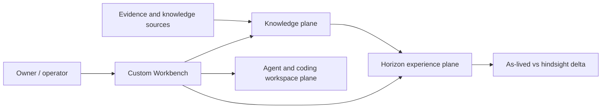

# Application Blueprint — Temporal Evidence and Agent Experience Platform

> _Byline: Codex · GPT-5 · 2026-08-15_
> _Current-entry-point repair: Codex · GPT-5 · 2026-08-15._

## Purpose

This hybrid blueprint records both the application that exists and the product being built. The governing product is not a generic agent studio: it ingests knowledge once, lets agents experience controlled knowledge horizons, and produces the difference between the as-lived and hindsight interpretations.

## Blueprint map

| Document | Question answered |
|---|---|
| [architecture.md](architecture.md) | What runs, trusts, stores, and communicates? |
| [structure.md](structure.md) | How are code, data, agents, and memory organized? |
| [features.md](features.md) | What can an operator do, and what must the UI expose? |

## State legend

- **Observed** — confirmed in repository source cited inline.
- **Planned** — approved direction captured in the 2026-08-15 plan/blueprints; not a claim of implementation.
- **Candidate** — requires a spike or owner decision.
- `%% UNVERIFIED` — requires a live service, runtime, or deployment probe.

## Product boundary

_Figure 1 — The three product planes and their shared Workbench. Provenance: planned synthesis from `docs/PROJECT_CANON.md:55-76`, `docs/PRODUCT-BLUEPRINT-2026-08-15.md`, and `docs/HANDOFF-2026-08-15-R8-workbench.md`._

## Non-negotiable invariants

1. One authored knowledge corpus; a pass is a retrieval permission/horizon, not a duplicate truth store (`AGENTS.md`, “WHY THIS EXISTS”; `docs/PROJECT_CANON.md:55-76`).
2. Extraction may see the corpus but must not form the agent’s beliefs (`AGENTS.md`, “Consequences”).
3. Every retrieval substrate must filter the horizon before ranking (`AGENTS.md`, “Enforce the horizon as a PRE-filter”).
4. PostgreSQL remains canonical; vector and graph stores are rebuildable projections (`docs/adr/0043-semantica-governed-extraction-worker.md`).
5. Go routing is decoder-coverage based, never file-size based (`AGENTS.md`, “Session Learnings 2026-08-12”).
6. Frameworks consume platform contracts; Agno, AG2, AI SDK, OpenCode, and Graphiti do not own product truth (`docs/ARCHITECTURE-BLUEPRINT-2026-08-15.md`).

## Current adapter versus target

- **Current:** Agno 2.8.7/AgentOS adapter, custom Workbench, static provider construction,
  incomplete Graphiti integration.
- **Target:** neutral ports with request-scoped routes, PostgreSQL belief ledger, run-scoped
  Graphiti projection, persistent OpenCode control, and adapter-by-adapter cutover.
- **Held local slice:** Matter/CourtCase and Knowledge-to-Evidence code/migration are built and
  tested in the working tree, but are uncommitted, unapplied, and undeployed.

## Open questions

- Which AgentOS administrative features must be rebuilt before Agno can be removed?
- Does the AG2 v1 spike pass persisted approval, replay, idempotency, and horizon-contamination gates?
- Should the neutral event stream translate AG-UI internally or remain native SSE?
- What is the verified deployed Graphiti version and tool inventory? `%% UNVERIFIED`
- Which existing Workbench screens are retained, merged, or quarantined?
