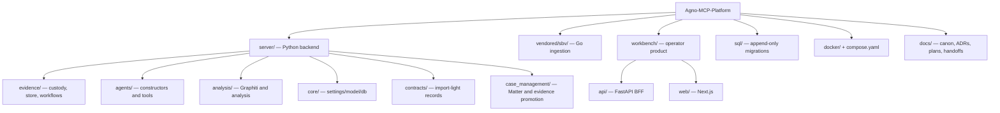
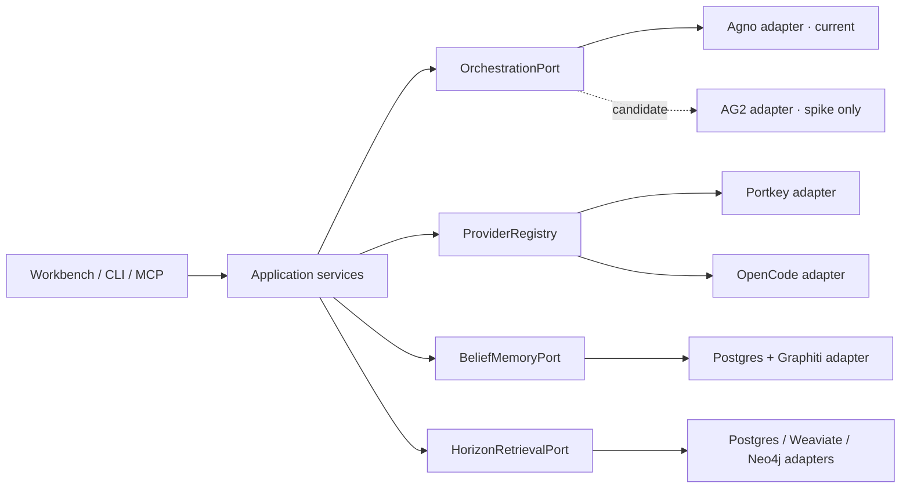
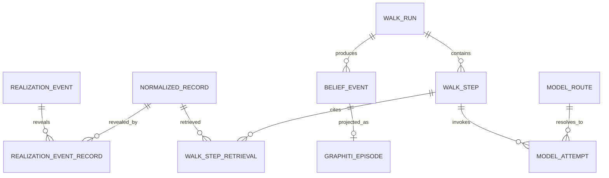

# Structure Blueprint

> _Byline: Codex · GPT-5 · 2026-08-15_
> _Current-entry-point repair: Codex · GPT-5 · 2026-08-15._

## Repository component map

_Figure 1 — Observed repository structure, including locally built held files. Provenance: root `AGENTS.md` repository-layout table, `workbench/api/main.py`, and `workbench/web/src/app/**`._

The repository is polyglot but not a package-manager workspace: the root Python project discovers `server*`/`evals*`, `workbench/web` is a standalone npm package, and `vendored/sbv` is a separate Go module (`pyproject.toml:2-7,106-112`; `workbench/web/package.json:1-9`; `vendored/sbv/go.mod:1-8`). Workbench itself follows `types → config → repo → service → runtime` (`workbench/api/README.md:12-23`).

## Hexagonal target

_Figure 2 — Planned anti-corruption structure. Provenance: `docs/HANDOFF-2026-08-15-R4-graphiti-zep-memory.md`, R5, and R6._

## Core data relationships

_Figure 3 — Mixed observed/planned domain ERD. `NORMALIZED_RECORD`, realization, and walk tables are observed in `server/contracts/records.py:43`, `sql/0026_realization_event.sql:75-172`, and `sql/0027_walk_ledger.sql:74-202`; belief/model entities are planned._

## Data-store linkage

| Store | Content | Write source | Rebuild rule |
|---|---|---|---|
| PostgreSQL | Normalized records, realization events, walk ledger, approvals, audit | Domain services and ordered ingestion | Canonical; restore from backups/originals, not projections. |
| R2/object storage | Originals and created work products | Intake/export services | Content-address and manifest. |
| Weaviate | Searchable evidence chunks | CDC/outbox projector | Rebuild from approved canonical records; dict prefilters required. |
| Neo4j evidence | Approved entity/claim projection | Governed projector | Rebuild from candidate approvals. |
| Graphiti belief graph | One agent run’s accumulated beliefs | Belief projector | Rebuild from PostgreSQL belief events. |

## Agent and memory pattern

Current Agno teams are constructed in `server/agents/factory.py:238,390,430`; the model is selected through `server/core/settings.py:242`. The target replaces shared construction-time model ownership with request-scoped route resolution. A handoff packet carries objective, scoped inputs by reference, completed work, unresolved items, expected schema, horizon ID, and provenance. Only the neutral packet is durable across runtimes.

Graphiti’s current client accepts a group ID and calls `add_memory` (`server/analysis/graphiti_case_client.py:47-49,144-161`), but the target group is per run: `belief:{case}:{workflow}:{run}:{role}`. Authorization is enforced outside Graphiti.

## Open questions

- Which neutral contracts belong in `server/contracts/` versus a new platform API package?
- Should Semantica communicate over a scoped HTTP API, queue, or PostgreSQL work table?
- Should Graphiti agents use native `graphiti-core` while Workbench retains MCP?
- How should a run pin content snapshots so an old run remains replayable after later ingestion?
