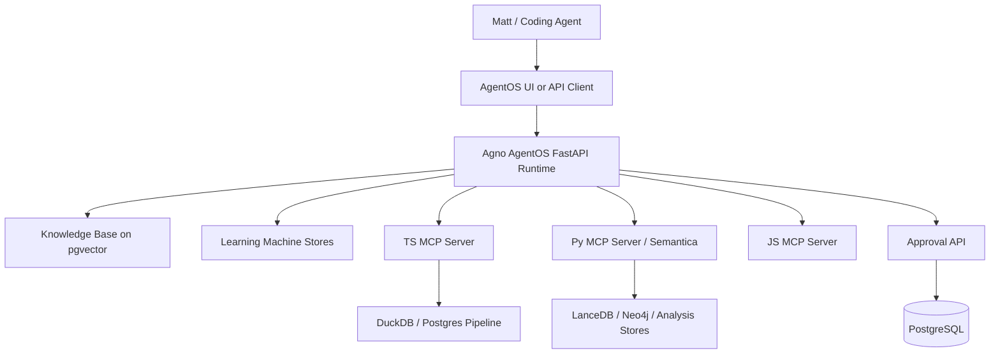
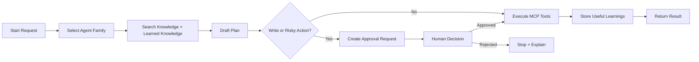
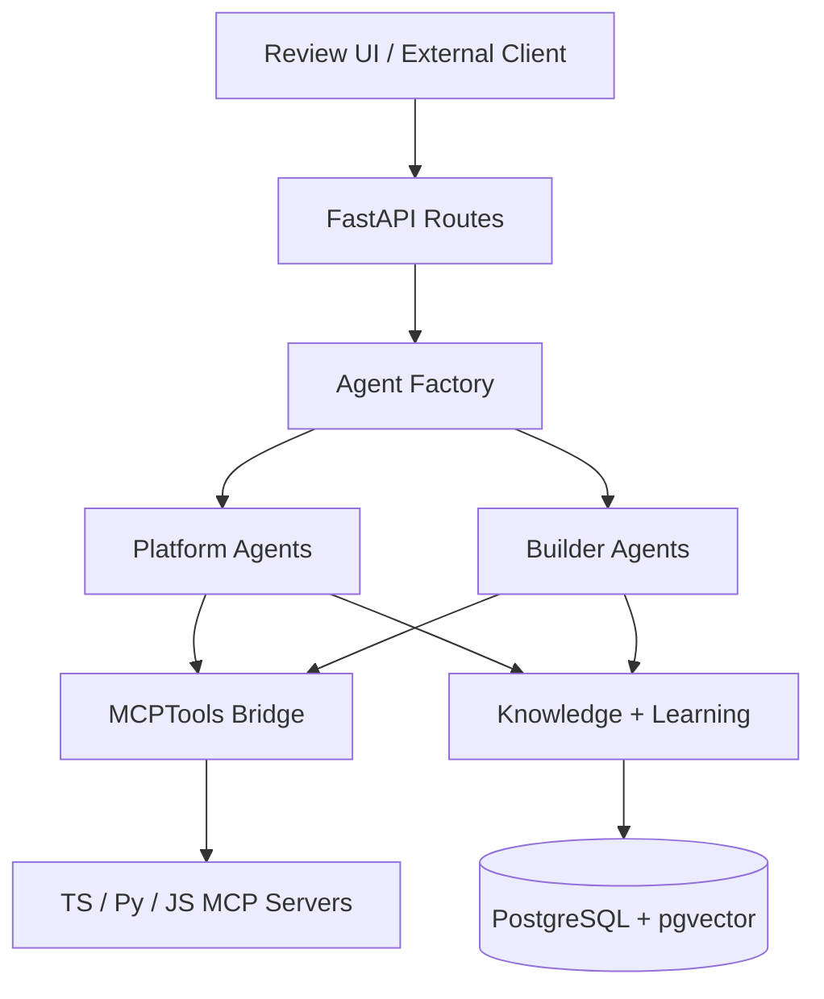
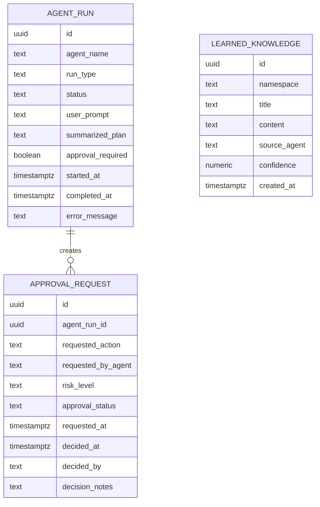
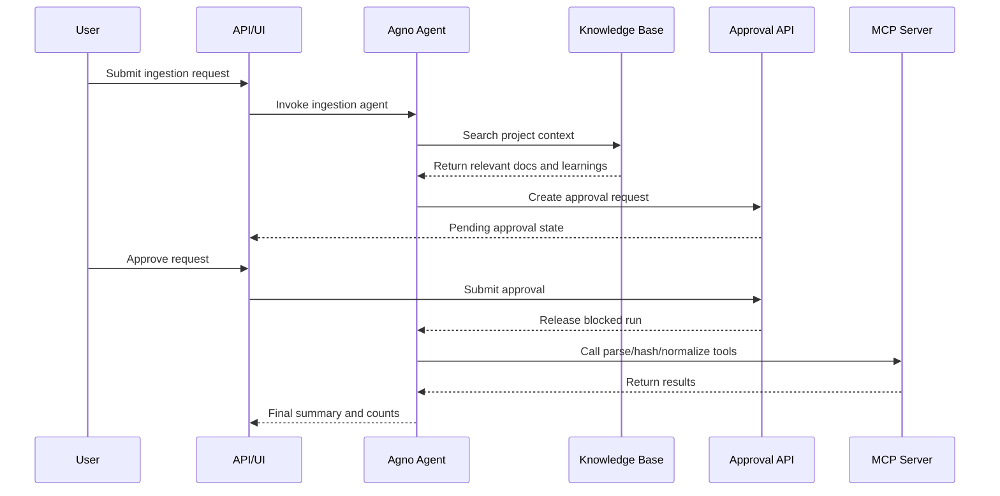

# Agno MCP Platform MVP Handoff Guide

## 1. Purpose and Scope

This document defines the implementation handoff for an Agno-based assistant layer for the MCP Platform. It is designed for a coding agent or developer who must build an MVP that can ingest project context, reason over nine months of documentation and AI conversations, orchestrate existing MCP tools, maintain strong human-in-the-loop controls, and improve over time through learned knowledge.[cite:96][cite:157][cite:158]

The intended MVP does **not** replace the underlying TS, Py, or JS MCP servers. It adds an Agno-driven control layer that can do two kinds of work:
- Platform operation work, such as coordinating ingestion, normalization, review, and analysis through existing MCP tools.[cite:157]
- Platform development work, such as helping continue the build, preserving context, proposing implementation changes, and recording durable project learnings through AgentOS, knowledge, and learning-machine patterns.[cite:96][cite:154][cite:158]

The default runtime choice in this handoff is Agno AgentOS exposed through FastAPI, backed by PostgreSQL plus pgvector for storage and retrieval. That is the most direct path because AgentOS is Agno’s FastAPI runtime, Agno supports multi-agent systems with memory, knowledge, tools, and workflows, and the official examples already assume a FastAPI plus Postgres deployment pattern.[cite:96][cite:143][cite:155][cite:159][cite:161]

## 2. Target Outcome

The MVP should provide the following immediately useful behavior:
- Load local project documentation, exported AI conversations, notes, and architecture files into an Agno knowledge base so the system has durable project context.[cite:135][cite:139]
- Expose two families of agents: platform agents and builder agents.[cite:96][cite:158]
- Connect to existing MCP servers through `MCPTools`, using command-based startup first and HTTP/SSE only after local command execution is stable.[cite:104][cite:157]
- Require explicit approval for any write action affecting ingestion, normalization, evidence handling, production configuration, or database mutation.
- Save learned knowledge that captures stable patterns, best practices, and fixes so the system becomes more useful over time.[cite:158][cite:141]
- Expose a usable HTTP API and Swagger docs through FastAPI/AgentOS so another UI or coding agent can call the service.[cite:143][cite:154][cite:155][cite:159]

## 3. Default Architecture

### System Composition

- Agno AgentOS is the runtime shell for serving agents and workflows over FastAPI.[cite:154][cite:155][cite:161]
- PostgreSQL with pgvector stores session state, approvals, learned knowledge, and document embeddings.[cite:143][cite:158]
- Existing TS MCP server remains the source of parsing, hashing, custody, normalization, and queue actions.
- Existing Py MCP server remains the source of Semantica, embeddings, graph-related analysis, and document intelligence routing.
- Existing JS MCP server remains optional in MVP and should be connected only if it exposes useful tools beyond ping.
- Project documents and chat exports live in a filesystem knowledge directory and are indexed into the Agno knowledge base.[cite:135][cite:139]

### Design Principles

- Use existing MCP tools first; do not rewrite working backend capabilities into Agno agents.
- Keep agents thin and policy-driven; keep backend data handling in MCP servers.
- Separate operational agents from builder agents to reduce accidental cross-contamination of duties.
- Make human approval a first-class state, not an afterthought.
- Capture reusable lessons as learned knowledge, not as brittle prompt stuffing.[cite:158]

## 4. File and Folder Scaffold

The coding agent should create and maintain this structure.

```text
agno_mvp_skeleton/
├── .env.example
├── docker-compose.yml
├── README.md
├── HANDOFF_INSTRUCTIONS.md
├── app/
│   └── main.py
├── agents/
│   ├── factory.py
│   └── instructions.py
├── config/
│   └── settings.py
├── knowledge/
│   └── platform/
│       ├── conversations/
│       ├── docs/
│       └── notes/
├── prompts/
├── scripts/
│   └── ingest_knowledge.py
├── sql/
│   └── schema.sql
├── tests/
│   ├── e2e/
│   ├── integration/
│   └── unit/
└── ui/
    └── review_schema.ts
```

### Folder Responsibilities

- `app/` contains the AgentOS runtime entry point and route mounting logic.
- `agents/` contains agent construction, instructions, tool registration, and team definitions.
- `config/` contains environment-derived settings and model/provider selection rules.
- `knowledge/platform/` contains imported chats, documents, specs, and normalized notes to be embedded.[cite:135][cite:139]
- `scripts/` contains deterministic scripts for indexing, migration, or batch prep.
- `sql/` contains durable SQL schema and indexes.
- `ui/` contains the front-end state contracts for any review panel or approval UI.

## 5. Agent Topology

### Platform Agents

1. **Ingestion Orchestrator**
- Purpose: receive plain-language instructions, search project knowledge, inspect available tools, and call the TS/Py MCP tools needed to hash, parse, normalize, and route data.
- Allowed writes: yes, but only after explicit approval is recorded.
- Required outputs: tool plan, selected parser, hash status, normalized record counts, destination stores, anomalies, and rollback notes.

2. **Analysis Orchestrator**
- Purpose: run Semantica-related analysis and generate structured analytical outputs after data exists in storage.
- Allowed writes: only for derived analysis artifacts after approval.
- Required outputs: facts, inferences, confidence notes, provenance summary, and review recommendation.

3. **Review Gatekeeper**
- Purpose: translate technical actions into plain-English approval requests; persist the approval decision; release or block the next step.
- Allowed writes: only to approval tables and audit notes.
- Required outputs: human-readable approval prompt, risk rating, impact summary, affected systems, and rejection reason if blocked.

### Builder Agents

1. **Dev Copilot**
- Purpose: use project knowledge and learned knowledge to propose repo changes, migration strategies, interface contracts, and tests.
- Allowed writes: no production writes; code suggestions only unless explicitly switched into assisted coding mode.
- Required outputs: file list, interfaces, assumptions, migration impact, testing plan, and implementation order.

2. **Project PAL**
- Purpose: maintain a rolling memory of goals, blockers, decisions, preferences, and session context in a PAL-style personal assistant shape.[cite:51][cite:56][cite:131][cite:141]
- Allowed writes: yes, to learning/user/session memory only.
- Required outputs: concise progress summary, active blockers, next actions, and newly learned durable knowledge.

3. **Forensic Data Agent**
- Purpose: explain schemas, query data through approved interfaces, and retain valid query patterns similar to Dash’s “schema gotchas and validated patterns” behavior.[cite:51][cite:56][cite:140]
- Allowed writes: no schema writes in MVP.
- Required outputs: query rationale, safe query shape, result summary, and any confidence caveats.

## 6. Data Models and Schema Definitions

### SQL Tables

The MVP should create these tables in PostgreSQL.

#### `agent_run`
Tracks every agent execution.

```sql
CREATE TABLE agent_run (
  id UUID PRIMARY KEY,
  agent_name TEXT NOT NULL,
  run_type TEXT NOT NULL CHECK (run_type IN ('platform','builder')),
  status TEXT NOT NULL CHECK (status IN ('queued','running','awaiting_approval','completed','failed','cancelled')),
  user_prompt TEXT NOT NULL,
  summarized_plan TEXT,
  approval_required BOOLEAN NOT NULL DEFAULT TRUE,
  started_at TIMESTAMPTZ NOT NULL DEFAULT NOW(),
  completed_at TIMESTAMPTZ,
  error_message TEXT
);
```

#### `approval_request`
Tracks human approval checkpoints.

```sql
CREATE TABLE approval_request (
  id UUID PRIMARY KEY,
  agent_run_id UUID NOT NULL REFERENCES agent_run(id) ON DELETE CASCADE,
  requested_action TEXT NOT NULL,
  requested_by_agent TEXT NOT NULL,
  risk_level TEXT NOT NULL CHECK (risk_level IN ('low','medium','high','critical')),
  approval_status TEXT NOT NULL CHECK (approval_status IN ('pending','approved','rejected','expired')),
  requested_at TIMESTAMPTZ NOT NULL DEFAULT NOW(),
  decided_at TIMESTAMPTZ,
  decided_by TEXT,
  decision_notes TEXT
);
```

#### `learned_knowledge`
Stores reusable patterns and lessons for cross-agent improvement.[cite:158][cite:141]

```sql
CREATE TABLE learned_knowledge (
  id UUID PRIMARY KEY,
  namespace TEXT NOT NULL,
  title TEXT NOT NULL,
  content TEXT NOT NULL,
  source_agent TEXT NOT NULL,
  confidence NUMERIC(5,4) NOT NULL DEFAULT 0.8000,
  created_at TIMESTAMPTZ NOT NULL DEFAULT NOW(),
  embedding VECTOR(1536)
);
```

### Representative Indexes

```sql
CREATE INDEX idx_agent_run_status ON agent_run(status, started_at DESC);
CREATE INDEX idx_approval_request_status ON approval_request(approval_status, requested_at DESC);
CREATE INDEX idx_learned_knowledge_namespace ON learned_knowledge(namespace, created_at DESC);
```

### Data Contracts

#### Approval request UI model

```ts
export interface ApprovalRequestViewModel {
  id: string;
  agentRunId: string;
  requestedAction: string;
  requestedByAgent: string;
  riskLevel: 'low' | 'medium' | 'high' | 'critical';
  approvalStatus: 'pending' | 'approved' | 'rejected' | 'expired';
  requestedAt: string;
  decidedAt?: string;
  decidedBy?: string;
  decisionNotes?: string;
}
```

## 7. Function Signatures and Service Interfaces

These signatures are the expected implementation contract.

### Python service interfaces

```python
def build_knowledge_base(base_path: str, db_url: str, table_name: str):
    """Create or return the Agno Knowledge object bound to pgvector."""

async def build_mcp_tools(command: str, timeout_seconds: int):
    """Create a connected MCPTools instance using command-based startup."""

async def build_agent_team(settings) -> dict:
    """Return all agents keyed by stable public name."""

async def start_agentos(settings):
    """Construct AgentOS, mount agents, and return the FastAPI app."""

async def create_approval_request(agent_run_id: str, action: str, risk_level: str) -> str:
    """Persist a pending approval request and return its id."""

async def record_approval_decision(approval_id: str, decision: str, actor: str, notes: str) -> None:
    """Update approval_request and release or terminate the blocked workflow."""

async def store_learned_knowledge(namespace: str, title: str, content: str, source_agent: str, confidence: float) -> str:
    """Persist a durable lesson and embed it for retrieval."""
```

### HTTP route shapes

Use AgentOS where possible, but add custom approval routes through FastAPI.[cite:154][cite:155]

#### `POST /v1/approval-requests`
Request body:

```json
{
  "agentRunId": "7f8d8c6a-3f74-4be7-9659-4f1bf8d1a0ef",
  "requestedAction": "Run Facebook parser and write normalized records to PostgreSQL",
  "riskLevel": "high"
}
```

Response body:

```json
{
  "id": "0d14d8ef-b3fe-4389-a0c2-5fd8f0d21163",
  "approvalStatus": "pending",
  "requestedAt": "2026-05-23T18:00:00Z"
}
```

#### `POST /v1/approval-requests/{id}/decision`
Request body:

```json
{
  "decision": "approved",
  "decidedBy": "Matt Salem",
  "decisionNotes": "Proceed with ingestion only, no analysis yet."
}
```

Response body:

```json
{
  "id": "0d14d8ef-b3fe-4389-a0c2-5fd8f0d21163",
  "approvalStatus": "approved",
  "decidedAt": "2026-05-23T18:03:00Z"
}
```

#### `POST /v1/knowledge/reindex`
Request body:

```json
{
  "basePath": "/workspace/knowledge/platform",
  "recreate": false
}
```

Response body:

```json
{
  "indexedDocumentCount": 482,
  "status": "completed"
}
```

## 8. Validation, Normalization, and Regex Logic

### File ingestion normalization defaults

Use these filesystem rules before indexing documents into knowledge:
- Accept `.md`, `.txt`, `.json`, `.csv`, `.pdf`, `.docx`.
- Reject binary executables, archives, and media files from knowledge ingestion.
- Normalize filenames to lowercase kebab-case.
- Preserve original source path in metadata.
- Store category from parent folder name: `conversations`, `docs`, `notes`.
- Reject files larger than 50 MB from default ingestion path; queue them for manual inspection.

### Regex and validation rules

#### Safe filename
```regex
^[a-z0-9][a-z0-9\-_.]{0,127}$
```

#### UUID validation
```regex
^[0-9a-fA-F]{8}\-[0-9a-fA-F]{4}\-[1-5][0-9a-fA-F]{3}\-[89abAB][0-9a-fA-F]{3}\-[0-9a-fA-F]{12}$
```

#### Approval decision enum
- Allowed values: `approved`, `rejected`.
- Any other value should return HTTP 422.

### Normalization pseudocode

```text
FOR each file in knowledge/platform recursively:
  IF extension not in allowlist:
    skip
  IF file size > 50MB:
    mark as manual_review
    continue
  read metadata
  derive category from parent folder
  normalize filename to kebab-case
  build manifest entry
  pass file path + metadata into Agno Knowledge loader
END FOR
```

## 9. Pseudocode for Core Algorithms

### Algorithm: approval-gated platform execution

```text
INPUT: user request, target agent
1. Create agent_run(status='queued')
2. Search knowledge base for project context relevant to the request
3. Build plan with intended MCP tool calls
4. If any step writes evidence, storage, config, or schemas:
   a. summarize plan in plain English
   b. create approval_request(status='pending')
   c. set agent_run(status='awaiting_approval')
   d. stop execution
5. If approved:
   a. reconnect to needed MCP servers
   b. execute tool calls in order
   c. collect results, counts, errors, anomalies
   d. save learned knowledge only if the finding is reusable
   e. set agent_run(status='completed')
6. If rejected or expired:
   a. set agent_run(status='cancelled')
   b. return plain-English explanation
```

### Algorithm: learned knowledge capture

```text
INPUT: conversation summary, tool outcomes, agent judgment
1. Identify whether the observation is stable and reusable
2. Reject case-specific trivia, one-off errors, or sensitive raw evidence content
3. If reusable:
   a. write a concise title
   b. write a generalizable content note
   c. assign namespace ('platform', 'queries', 'parsers', 'ops')
   d. save row in learned_knowledge
   e. embed content for retrieval
4. Attach learned knowledge id to run summary
```

### Algorithm: builder-agent planning flow

```text
INPUT: implementation request
1. Search knowledge and learned knowledge first
2. Identify existing MCP tools, docs, schemas, and constraints
3. Output smallest safe implementation plan
4. Include files to change, interfaces, tests, and rollback notes
5. Ask for approval before code-writing mode if the request affects production behavior
```

## 10. Docker, Config, Env, and Runtime Skeletons

### Docker defaults

Use a two-service local stack first:
- `postgres` using `pgvector/pgvector:pg16`.
- `agentos` using `python:3.11-slim` and installing Agno, FastAPI, Uvicorn, SQLAlchemy, Psycopg, and dotenv at startup.

That is not the final production shape, but it is the most debuggable local starting point and matches Agno’s FastAPI-oriented examples.[cite:143][cite:155][cite:159]

### Required environment variables

- `DEFAULT_MODEL_PROVIDER`
- `DEFAULT_MODEL_ID`
- At least one provider key, such as `OPENAI_API_KEY`
- `PLATFORM_DB_URL`
- `KNOWLEDGE_BASE_PATH`
- `TS_MCP_COMMAND`
- `PY_MCP_COMMAND`
- `JS_MCP_COMMAND`
- `HITL_REQUIRE_APPROVAL`
- `HITL_APPROVAL_TIMEOUT_SECONDS`

### Model/provider defaults

The coding agent should implement a provider factory with this priority order:
1. `OPENAI_API_KEY`
2. `ANTHROPIC_API_KEY`
3. `GOOGLE_API_KEY`
4. `GROQ_API_KEY`
5. local `OLLAMA_BASE_URL`

This keeps the runtime flexible because Agno is model-agnostic and intended for multi-provider use.[cite:96][cite:30]

## 11. Diagrams

### System Overview


### User Flow


### Component or Module Diagram


### Data Model / ER Diagram


### Sequence Diagram


## 12. Key Development Stages & Debugging History

- **Stage 1 — Context Foundation (v0.1.0):** Build the knowledge ingestion path, verify document discovery, and confirm the system can answer repo-context questions grounded in imported files.
- **Stage 2 — MCP Connectivity (v0.2.0):** Connect TS and Py MCP servers using `MCPTools(command=...)`, validate tool discovery, and prove command-based startup is stable before experimenting with HTTP/SSE transports.[cite:157]
- **Stage 3 — Approval Workflow (v0.3.0):** Add approval tables, plain-English approval prompts, and a pause/resume pattern around risky actions.
- **Stage 4 — Learning and Builder Agents (v0.4.0):** Turn on learned-knowledge capture for reusable patterns and introduce Dev Copilot and Project PAL so the system can both operate and continue helping with development.[cite:158][cite:141]

## 13. Current State of Primary File(s)

- **`app/main.py` (v0.1.0)** contains the entry-point contract and service summary stub. It currently defines what the runtime must expose, but it does not yet instantiate real AgentOS objects. That is deliberate so the coding agent can wire real Agno imports based on the current installed version without inheriting stale code assumptions.
- **`agents/factory.py` (v0.1.0)** contains the stable public agent names and their intended roles. It is currently a specification file more than an executable implementation, which keeps the responsibilities visible while avoiding fake behavior.
- **`agents/instructions.py` (v0.1.0)** contains guardrails and role instructions. It is the authoritative place to preserve behavior and safety language across future code changes.
- **`config/settings.py`** contains the environment contract and runtime defaults. It should remain the only place where raw environment variables are read.
- **`sql/schema.sql`** contains the MVP persistence contract for runs, approvals, and learnings. It should remain append-only once environments exist.

## 14. Instructions for Future Developers / Maintainers

- **Primary Focus:** `app/main.py`, `agents/factory.py`, and `scripts/ingest_knowledge.py`
- **Do Not Break:** command-based MCP connectivity, approval gating for write actions, knowledge-first retrieval, and separation between platform agents and builder agents.[cite:157][cite:158]
- **Running the Application:** copy `.env.example` to `.env`, fill provider and database values, run `docker compose up -d`, then visit `http://localhost:8000/docs` once the implementation is complete.[cite:143][cite:155][cite:159]
- **Debugging Guidance:** inspect FastAPI logs first, then MCP startup errors, then Postgres connection issues, then knowledge-ingestion manifest output.
- **Known Fragile Areas:** MCP server reconnection, multiple MCP servers in one runtime, approval resume state, and mounted-FastAPI lifecycle interactions.[cite:149][cite:151][cite:163]
- **Development Process:** implement one layer at a time in this order: settings → database → knowledge → MCP connection → single platform agent → approval flow → builder agents → learned knowledge.
- **User/Stakeholder Preferences:** plain-English outputs, safe defaults, no coding burden on the owner, strict human approval for impactful actions, and preservation of project context across sessions.

### Per-File Guidance

- **`app/main.py`:** replace the stub with a real AgentOS object and custom FastAPI routes for approvals and reindexing. Keep route creation centralized here.
- **`config/settings.py`:** extend only through new typed fields. Do not scatter `os.getenv()` calls across the codebase.
- **`agents/factory.py`:** turn the specs into executable constructors. Keep stable agent keys because UI and tests should depend on them.
- **`agents/instructions.py`:** preserve safety language and keep prompts short, direct, and role-specific.
- **`scripts/ingest_knowledge.py`:** keep this deterministic and side-effect-light so it can be used during debugging without touching runtime state.
- **`sql/schema.sql`:** use migrations for all changes once initialized; do not rewrite history.
- **`ui/review_schema.ts`:** keep in sync with FastAPI response shapes.

## 15. Testing Strategy

- **Unit Tests:** validate settings parsing, manifest generation, filename normalization, risk classification, approval status transitions, and learned-knowledge filtering logic.
- **Integration Tests:** verify Postgres connectivity, schema initialization, knowledge indexing, Agno agent creation, and successful MCP tool discovery for each configured server.[cite:157]
- **E2E / Workflow Tests:** run a full approval-gated ingestion simulation from API request to approval to MCP tool execution to stored run summary.
- **Regression Risks:** MCP reconnection bugs, include/exclude tool filtering, lifecycle issues when mounting AgentOS into custom FastAPI apps, and transport instability with streamable HTTP/SSE.[cite:146][cite:151][cite:163]
- **Acceptance Criteria:** one platform agent can answer grounded questions from imported docs; one approval-gated tool action can complete end to end; one learned-knowledge item can be stored and later retrieved by a builder agent.

## 16. Deployment / Runtime Notes

- **Environment Assumptions:** Python 3.11, Docker available, Postgres available, at least one model API key configured, existing MCP server commands runnable from the host or container.[cite:143][cite:155]
- **Secrets/Config:** use only environment variables; no secrets in source files. Start with `.env` locally and migrate to managed secret storage later.
- **Build/Run Commands:** `docker compose up -d` for local runtime, `python app/main.py` for lightweight smoke testing, and `python scripts/ingest_knowledge.py knowledge/platform` to verify import manifests.[cite:143][cite:155]
- **Monitoring/Logs:** monitor FastAPI startup, Postgres health, MCP server startup logs, approval queue size, and the ratio of failed to completed `agent_run` entries.
- **Rollback or Recovery Notes:** if MCP servers become unavailable, fail closed, preserve the pending run record, and require a fresh approval if the original context or requested action materially changed.

## 17. Open Questions

- **Q1:** Which model provider should be the production default after MVP: OpenAI, Anthropic, or local Ollama?
- **Q2:** Should learned knowledge be stored only in Postgres/pgvector for MVP, or also mirrored into Semantica after the first stable release?

## 18. Next Steps (Potential)

- **Semantica Direct Integration:** after the MVP is stable, add the Semantica Agno integration layer so graph-backed context and decision intelligence can be used directly by builder and analysis agents.[cite:35]
- **Performance Improvement:** move Python dependency installation out of container startup into a custom image build once the dependency set stabilizes.
- **Feature Expansion:** add a small web review panel that reads `approval_request` records and lets the owner approve or reject without using raw API docs.
- **Stretch Goal:** add a routing agent that decides whether a request belongs to platform operations or platform development before delegating to the correct agent family.

## 19. Summary of Updates to This Handoff Document

**Updates (none to v0.1.0):**
- **Version Number:** initial complete handoff for Agno-based MVP skeleton.
- **Core Functionality:** established agent families, approval gating, knowledge ingestion, and learned-knowledge storage.
- **Architecture:** chose AgentOS + FastAPI + Postgres/pgvector + MCPTools as the default baseline.[cite:154][cite:155][cite:157][cite:158]
- **Instructions:** added concrete file scaffold, interfaces, APIs, diagrams, tests, and runtime notes.
- **Roadmap:** defined four implementation stages that a separate coding agent can begin immediately.
