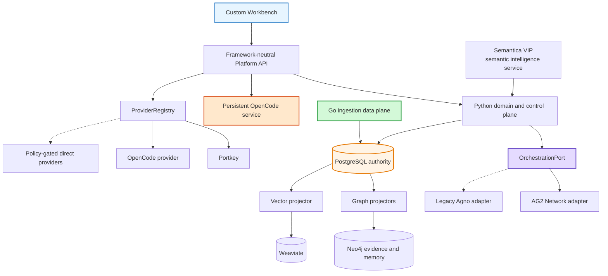
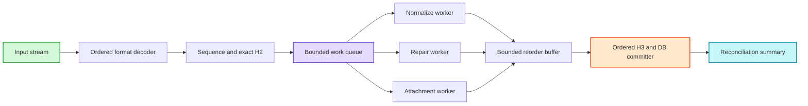
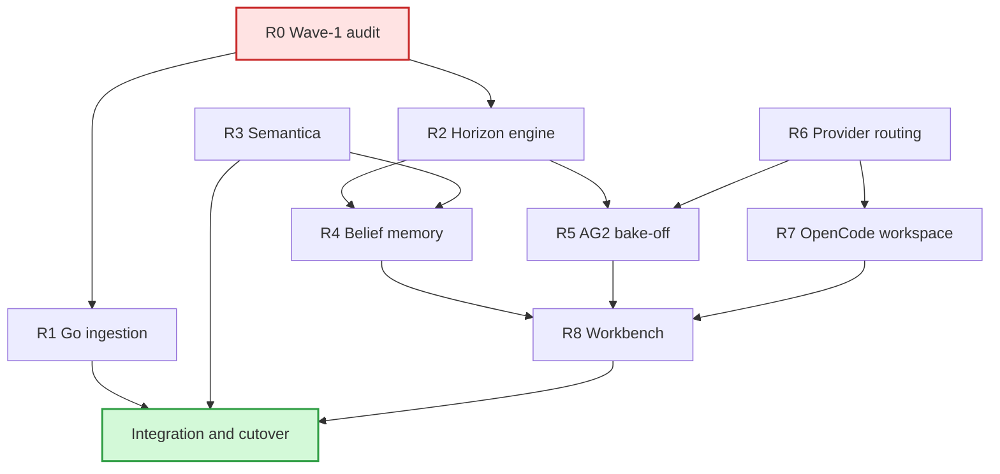

# Development and Migration Diagrams

> _Byline: Codex · GPT-5 · 2026-08-15_

## Target architecture



## Knowledge and experience separation

```mermaid
graph LR
    SRC["Original sources"] --> CUST["Custody and Go parsing"]
    CUST --> CANON["Canonical normalized knowledge"]
    CANON --> EXT["Horizon-blind extraction"]
    EXT --> CAND["Reviewed candidates"]
    CAND --> PROJ["Graph and vector projections"]
    CANON --> MAN["Immutable horizon manifest"]
    PROJ --> RET["Pre-filtered retrieval"]
    MAN --> RET
    RET --> AGENT["Horizon-bound agent"]
    AGENT --> BEL["PostgreSQL belief events"]
    BEL --> GRAPH["Run-scoped Graphiti belief graph"]
    BEL --> DELTA["Ignorant and hindsight delta"]
    style CANON fill:#fff4e6,stroke:#e67700,stroke-width:2px
    style MAN fill:#ffe3e3,stroke:#c92a2a,stroke-width:2px
    style BEL fill:#e5dbff,stroke:#5f3dc4,stroke-width:2px
    style DELTA fill:#c5f6fa,stroke:#0c8599,stroke-width:2px
```



## Strangler migration

```mermaid
graph TB
    START["Current Agno and AgentOS"] --> PORTS["Freeze platform ports"]
    PORTS --> ROUTE["Add provider routing facade"]
    ROUTE --> BELIEF["Add belief ledger and Graphiti adapter"]
    BELIEF --> SPIKE["Run AG2 coordination spike"]
    SPIKE --> DEC{ "Spike gates pass" }
    DEC -->|No| KEEP["Keep Agno adapter and repair gaps"]
    DEC -->|Yes| SHADOW["Shadow AG2 per workflow"]
    SHADOW --> CUT["Cut over agent by agent"]
    CUT --> QUAR["Quarantine superseded Agno surfaces"]
    QUAR --> DONE["Custom platform runtime"]
    style START fill:#f8f9fa,stroke:#868e96,stroke-width:2px
    style DEC fill:#ffe3e3,stroke:#c92a2a,stroke-width:2px
    style DONE fill:#d3f9d8,stroke:#2f9e44,stroke-width:2px
```

## Go bounded parallel pipeline



## Research and implementation dependencies


