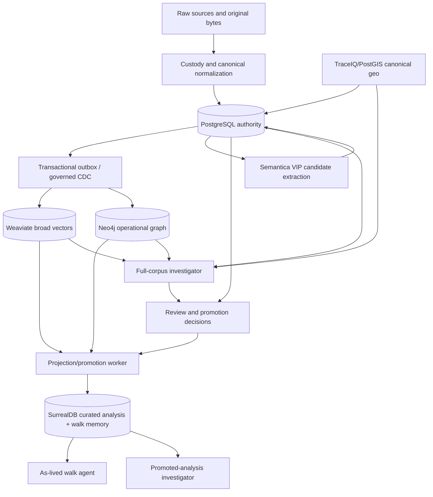
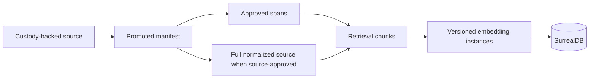
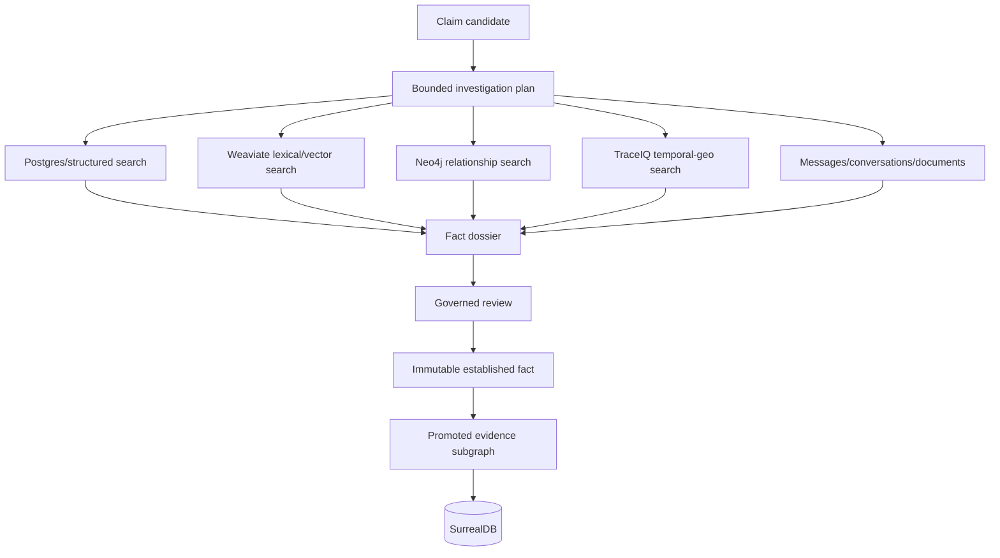

# Blueprint — Surreal Analytical Surface, Investigation, and Temporal Memory

> _Byline: Codex · GPT-5 · 2026-08-15 · updated 2026-08-16 (Codex · GPT-5)_
>
> **Status:** Accepted architecture boundaries; Phase-0 logical contracts/evaluation package
> complete for owner review 2026-08-16.
> **Build status:** Research/design only; no Surreal activation, schema, or deploy claim.

## 1. Governing boundaries

- PostgreSQL is authoritative.
- Object storage retains original bytes and custody bindings.
- Go routing is decoder-coverage based, never size based.
- Semantica is a VIP candidate-extraction/intelligence service, never truth or belief authority.
- Weaviate is the broad vector reservoir; Neo4j is an operational semantic projection.
- Graphiti is the current accumulating belief-memory baseline.
- SurrealDB is a governed analytical projection and experimental walk-memory runtime.
- A pass is a retrieval policy/horizon bound to an agent, never a table or second corpus.

## 2. Target topology

Approval transitions originate in PostgreSQL. Neo4j may display governance state but cannot
author it. The full-corpus investigator and as-lived walk agent are separate roles.

## 3. Two complementary promotion flows

### Source-centered promotion

Promotion scopes are `manifest_only`, `selected_spans`, `full_text`, and optional
`full_source`. Binary replication does not confer authority or access.

### Claim-centered assembly

## 4. Canonical identity layers

| Layer | Purpose | Identity rule |
|---|---|---|
| Source | Custody-backed original | Canonical PG ID + H1/SHA-256 |
| Structural atom | Parser-emitted page/message/clause/function/row/observation | Stable within parser/source revision |
| Retrieval chunk | Versioned grouping of structural atoms | New instance for changed boundaries |
| Embedding instance | One profile representation of one chunk generation | Profile/model/revision/dimension/content hash |
| Claim candidate | Extracted proposition requiring governance | Append-only, never truth by configuration |
| Established fact | Reviewed atomic assertion | Immutable; corrections relate/supersede |
| Source span | Fact-to-evidence relationship | Exact locator, quote/structure, role, custody binding |

Do not force one deterministic UUID to mean all six identities. Rechunking creates new
projection generations linked to predecessors; it never changes original evidence.

## 5. Chunking and routing

Go parsers stream structural atoms for every format they cover at every size. Retrieval
chunking is source-specific: sections/paragraphs for legal documents, clauses/articles for
contracts, turns/segments for conversations, message boundaries for email, AST symbols for
code, table-aware structures, and observation records for TraceIQ data. Retrieval enrichment
never replaces exact source locators.

Routing uses independent axes:

- structural lane;
- semantic domains (multi-label);
- source kind and modality;
- language;
- authority/review state;
- sensitivity;
- temporal/horizon scope;
- parser/chunker/classifier/embedding/reranker profile.

Rules and parser signals run first, calibrated classifiers handle ambiguity, and LLM routing
is a bounded verifier. Every tier may abstain. Authority and horizon determine eligibility,
not the embedding model.

## 6. Embedding-space contract

Every vector carries `embedding_profile_id`, provider/model/revision, input task, dimension,
numeric type, normalization, truncation, content-binding hash, chunk-policy version,
timestamp, and source collection/index. Incompatible spaces are physically/logically isolated.
Cross-space retrieval uses rank fusion (for example RRF) followed by a reranker; raw cosine
scores are never averaged across models.

Model names, availability, privacy, and pricing are dynamic catalog data. The research packet's
static table is not configuration. Current official documentation already superseded its
`voyage-3-large` flagship claim with the Voyage 4 family. Model choice requires a gold-corpus
bake-off, including legal and self-hosted candidates.

## 7. Investigation Search

Three intents share one saved `InvestigationRun` contract:

1. **Find Evidence** — locate known or suspected material.
2. **Reconstruct Event** — assemble people, time, place, communication, geo, and graph context.
3. **Discover Patterns** — surface recurrence, contradiction, escalation, missing expected
   evidence, co-occurrence, and previously disconnected relationships.

The query trace records decomposition, stages, filters, returned IDs, dedupe, grading, retries,
cost, and final context. Every loop has hop, result, time, context, and cost limits. Results show
why they surfaced, independent-source count, alternatives, and disconfirming material.

## 8. Behavioral Analysis Agent

An immutable `AnalysisScope` contains Matter, subjects/roles, non-contiguous time ranges,
events, conversation groups, sources, locations, exclusions, mode, source revisions, and
expansion budgets. Stage 1 analyzes only this closed set. Stage 2 converts observed patterns
into bounded discovery queries; additions remain separate until the owner accepts a scope revision.

Modes:

- `as_lived_so_far(horizon_id)`: visible material alone may influence analysis or query generation;
- `hindsight`: all authorized current evidence;
- `paired_delta`: identical policy in both modes, then compare realizations.

Internal behavioral lenses may use narcissistic-pattern, borderline-pattern, gaslighting,
DARVO, triangulation, splitting, coercive-control, and reactive-behavior vocabulary. Output
separates lens, observation, repetition, source strength, functional impact, alternatives,
limitations, and authenticated diagnostic status. Case Prep renders conduct-first language.

## 9. Spectron-compatible memory contract

The platform-owned adapter must support contexts/scopes; episodic, identity, knowledge,
context, instruction, and uncertainty memory; reconciliation/supersession; state/diffs;
retrieval/decision/response traces; and hybrid graph/vector/lexical retrieval. Temporal fields
must distinguish world validity, subject discovery/realization, system recording, decision,
and walk observation. Spectron compatibility is behavior/API compatibility, not copied branding
or an assumption that private internals are known.

## 10. Evaluation and gates

Report metrics per domain and question type: Recall@k, Precision@k, MRR, nDCG, locator accuracy,
route accuracy, calibration, abstention, latency, cost, storage amplification, reindex cost,
and horizon contamination. Planted future facts must produce zero leakage. Graphiti/Surreal
comparisons cover temporal reconstruction, contradiction, supersession, provenance, namespace
isolation, invalidation, replay, latency, and resources.

The executable Phase-0 contract canary and full gate specification are in
`tests/test_surreal_investigation_phase0_contract.py` and
`docs/EVALUATION-2026-08-16-surreal-investigation-phase0.md`. Its 14 passing synthetic tests are
not live adapter proof.

## 11. Verified corrections to research packets

- The two Spectron reports are complementary, not duplicates.
- Official Spectron availability remains gated/unknown; self-host topology is documented.
- Current published Spectron schema examples use 1536-dimensional vectors; dimensions remain
  profile/schema versions, not a global constant.
- Spectron publishes hybrid retrieval/RRF behavior and a default reconciliation confidence floor;
  those are not wholly unknown.
- PostgreSQL MVCC alone is not durable historical system time after vacuum; explicit history,
  event sourcing, or audited CDC remains necessary.
- Snapshot visibility is not bit-for-bit agent replay; reproducibility also pins model, prompts,
  tools, retrieval/index revisions, settings, workflow, and state.
- Candidate material is barred from canonical walk conclusions, not from explicitly labeled
  extraction/review/investigation agents.

## 12. Open design decisions

1. Exclusive Surreal retrieval for the as-lived walk agent.
2. Surreal namespace/database/context isolation.
3. Physical schemas and API versioning.
4. Weaviate named-vector versus collection lifecycle policy.
5. Memory embedding profiles versus promoted corpus profiles.
6. TraceIQ geo precision, uncertainty, and retention contract.
7. Behavioral taxonomy, expansion budgets, and Case Prep transformation approvals.

The complete routed inventory is
`UNRESOLVED-QUESTIONS-2026-08-16-surreal-investigation-phase0.md`; only six immediate choices are
presented in `PENDING-OWNER-DECISIONS-SURREAL-INVESTIGATION-2026-08-16.md`. No recommendation is
accepted until the owner rules.

## 13. Implementation order

Contracts and evaluation precede infrastructure. Build a disposable vertical slice with a few
promoted sources, one candidate claim, one cross-source dossier, one reviewed fact, and one
as-lived scope. Do not reactivate the parked deployment, bulk-copy the corpus, or replace Graphiti
until the slice passes contamination, provenance, reconciliation, and reproducibility gates.
