# ADR-0060: Maintained Timesketch fork for the personal-case timeline

- Status: **Accepted**
- Date: 2026-08-26
- Decision: D-084, amended by D-085
- Related: D-082, D-083, ADR-0053, ADR-0057, ADR-0058, ADR-0059

## Context

The platform needs an investigation-grade chronology surface for life events, relationship history,
communications, locations, court/procedural events, gaps, annotations, dense review, and narrative
preparation. The owner evaluated Timesketch as more than a serialization target: its OpenSearch-backed
event exploration, annotations, analyzer and aggregator extension points, and Vue application provide
the working shell for a dedicated personal-case timeline application.

Timeline material can originate in any context source. A message, AI chat, document, calendar export,
location history, created work, or manual lead may cause an event candidate to be investigated. Source
class and factual authority must remain separate: an event extracted from an AI chat is a lead, not
evidence, while an event established from custody-backed sources may be presented as a governed fact.

## Decision

Maintain a fork of `google/timesketch` for the singleton personal case. This is a real application fork,
not only an adapter and not a replacement for PostgreSQL authority.

The fork will:

1. retain the Timesketch timeline/search, annotations, analyzer/aggregator interfaces, OpenSearch index,
   and Vue shell;
2. replace or disable DFIR-specific vocabulary, importers, analyzers, and default views through isolated
   extension modules wherever possible so upstream merges remain tractable;
3. add relationship/life-event, party/entity, verification/dispute, evidence-gap, legal-factor,
   dense-timeline, narrative, and review experiences;
4. accept only versioned PostgreSQL projection envelopes through an authenticated importer/projector;
5. provide individual and bulk curation, with annotations, tags, classifications, temporal proposals,
   entity links, grouping, inclusion, display summaries, dispute/verification labels, redaction
   markings, manual corrections, and analyzer observations returned through governed PostgreSQL
   commands; and
6. deploy as an independently observable Coolify application with its own OpenSearch/metadata/runtime
   dependencies and a tested rebuild path.

The deletion policy applies to the fork. Upstream DFIR files are disabled or retained. If removal is
needed, files move to the repository's `to_be_deleted` directory; only the owner deletes them.

## Canonical timeline contract

PostgreSQL keeps distinct authored objects and exposes a versioned derived projection rather than one
mutable universal event table:

- `event_candidate`: an event suggested by any context source or extractor;
- `fact_assertion`: the governed factual proposition, when independent custody-backed evidence supports
  it;
- court/procedural and source-native event records where their own lifecycle requires separate identity;
- `timeline_collection` and `timeline_member`: curated membership and ordering/grouping without copying
  source authority;
- `timeline_projection_generation` and `timeline_projection_member`: immutable, hashed export membership;
- `timeline_projection_receipt`: append-only delivery/read-back/reconciliation state;
- `timeline_curation_batch` and `timeline_curation_item`: attributable individual/bulk edits with
  expected versions, before/after hashes, typed operation, rationale, validation and item-level result;
- `context_annotation`, typed entity-resolution/grouping assertions, candidate review decisions, and
  successor derived-context versions: the canonical results of accepted edits;
- `timeline_annotation_candidate`: fork-originated analyzer proposals awaiting governed review; and
- `timeline_amendment_candidate`: any proposed change to an evidence-approved/governed timeline member,
  linked to the exact approved member, fact/assertion version, citations, and curation batch; and
- `timeline_curation_reversal`: a compensating batch link; no edit history is deleted or overwritten.

Each projection member has a deterministic stable ID and maps to Timesketch as follows:

| PostgreSQL projection field | Timesketch field | Rule |
|---|---|---|
| `display_at_utc` | `datetime` | Required projection/display point; never overwrites the source time or defended interval |
| `display_summary` | `message` | Source-faithful or visibly analytical; never hides nuance or authority state |
| `event_type` | `timestamp_desc` | Versioned controlled vocabulary |
| stable source/version IDs | bounded attributes | Required for replay, reconciliation, and source opening |
| `occurred_at`, `valid_from`, `valid_to`, temporal confidence | bounded attributes | Preserve point/range/uncertainty separately from `datetime` |
| entity/participant/location refs | bounded attributes | References only; Neo4j/PG remain graph/entity authority |
| source class, authority, verification, dispute, privacy, privilege | bounded attributes | Required filters/badges; fail closed if missing |
| projection generation/hash | bounded attributes | Required for read-back reconciliation and stale-generation rejection |

An imprecise or interval event is never coerced into a falsely precise canonical timestamp. A versioned
projection policy may select a display anchor for Timesketch while retaining the defended interval and
confidence as explicit attributes and UI badges.

## Source and authority flow

```mermaid
flowchart LR
  C[Any context source] --> X[versioned extraction run]
  X --> E[event candidate]
  E --> T[claim chart / investigation register]
  T --> S[independent evidence search]
  S --> F[custody-backed governed fact]
  E --> P[PG timeline projection generation]
  F --> P
  P --> O[outbox + change detection]
  O --> K[Timesketch fork / OpenSearch]
  K --> A[individual or bulk curation batch]
  A --> Q[authenticated PG context command]
  Q --> V[validate version, authority and operation]
  V --> C2[append context annotation/assertion/revision]
  C2 --> O
```

Candidate and established items may coexist in the investigation timeline only when the UI makes their
authority unmistakable. Court/narrative export consumes governed R12 products and citations, not raw
Timesketch rows.

Evidence-approved/governed timeline entries are visible and reviewable in the fork. They are immutable
at their authority level. Any attempted modification—individually or through a bulk operation—returns
to PostgreSQL as a context-layer `timeline_amendment_candidate` linked to the exact approved version and
its evidence/fact lineage. The approved entry remains active and unchanged while the candidate is
re-reviewed and reconciled. If accepted through the appropriate evidence/fact governance, a new governed
successor is appended and then projected; rejection leaves the approved version untouched.

## Governed round-trip editing

The fork is an operational context-review service, not a read-only dashboard. The owner may filter a
set, preview a bulk operation, apply it to all or selected members, inspect item-level validation, and
submit one immutable batch. Supported operations include:

- add/remove/supersede tags and classifications;
- propose/correct a derived display summary without altering verbatim source content;
- propose a point time or defended interval while retaining the original time value and clock source;
- assert, reject, merge, split, or supersede entity and conversation/group links;
- include/exclude/group/order timeline members and mark importance;
- set candidate review, dispute, verification-display, privacy, privilege, and redaction states within
  the caller's authority; and
- accept/reject/qualify analyzer observations or create investigation/claim-chart leads.

Every command targets an exact PG object/version and supplies an expected projection generation. The
API validates each item independently and returns `accepted`, `rejected`, `conflict`, or `no_op` plus a
receipt. Partial success is allowed only when item results are explicit and the batch summary cannot be
mistaken for total success. A strict atomic mode is also available when all-or-nothing behavior is
required.

Accepted context edits never mutate raw messages or original assets. They append typed
annotations/assertions/decisions or create a successor derived-context version. Changes proposed against
evidence-approved entries remain context amendment candidates until independently re-reviewed and
reconciled; only the evidence/fact workflow may append a governed successor. PostgreSQL then emits the
authoritative change; the projector updates the fork from that event. The fork does not optimistically
treat its local OpenSearch mutation as accepted truth.

Undo creates a compensating batch that references the original batch and current versions. Stale edits,
concurrent changes, prohibited authority transitions, and attempts to turn AI-chat lineage into evidence
fail closed and remain visible in the batch ledger.

## Change detection and reconciliation

- Compare immutable projection members and accepted context revisions, not raw file timestamps or
  mutable UI rows.
- Distinguish core-event changes, annotation/entity enrichment changes, revocation/staleness, and no-op
  operational changes.
- Preserve old/new hashes, changed fields, actor/policy/generation, and supersession history.
- Reindex core changes; refresh governed annotations for analysis-only changes; skip no-ops.
- Never hard-delete projected history. Revoked/superseded members become hidden or visibly stale according
  to policy while receipts remain.
- R09 reconciles expected membership and read-back hashes. R14 proves production deployment, replay,
  negative authority tests, and rollback.

## Consequences

- The project owns a maintained upstream fork and its upgrade/security burden.
- PostgreSQL remains the only canonical truth, custody, review, and projection-control authority.
- OpenSearch and Timesketch metadata are rebuildable serving state.
- The fork is a full bulk-curation client, while PostgreSQL remains the authoritative edit ledger and
  context state.
- All context sources can contribute timeline candidates without laundering context into evidence.
- Timesketch compatibility is designed into the PG projection contract instead of forcing source tables
  to imitate an external index.
- Visual experiments such as dense-label views, relationship graphs, narrative timelines, and schedule
  planning may extend the fork, but they do not change canonical authority.

## Alternatives considered

- **Adapter only to stock Timesketch:** rejected by owner; it does not deliver the required personal-case
  vocabulary, workflows, review surfaces, and maintained product experience.
- **Generic embedded timeline library only:** rejected as the primary direction; useful components may be
  embedded later, but they do not replace the investigation application shell.
- **Make Timesketch/OpenSearch canonical:** rejected because it would split authority, weaken custody and
  replay guarantees, and allow UI/analyzer state to masquerade as governed truth.
- **Export only evidence-backed facts:** rejected for investigation use. Context-derived candidates must be
  visible, but explicitly labeled and barred from evidentiary/factual authority.

## Acceptance gates

1. A candidate extracted from every supported context family maps into the fork with stable lineage and
   an unmistakable candidate/context-only badge.
2. An AI-chat-derived event cannot be promoted, cited, or counted as evidence through any fork/API path.
3. A custody-backed established event opens its exact governed source/citation path.
4. Point, interval, uncertain, disputed, revoked, and superseded events round-trip without authority or
   clock loss.
5. Fork annotations/analyzer results return as candidates and cannot write established facts/evidence.
6. Every modification to an evidence-approved member creates a linked context amendment candidate;
   the approved member remains byte-for-byte/version-identical until governed successor approval.
7. Mixed-validity bulk edits return itemized accepted/rejected/conflict/no-op results; accepted edits
   reappear only after PG outbox projection, and strict atomic mode rolls back the whole batch.
8. Concurrent/stale-version edits fail closed; compensating reversal preserves both the original and
   reversal audit trails.
9. Projection generations reconcile by count, membership, content hash, policy, and read-back receipt.
10. A clean rebuild reproduces the active generation, saved governed annotations, and source-opening links.
11. The Coolify deployment passes authentication, privilege/redaction, direct-store denial, replay,
   rollback, and current-revision verification.
