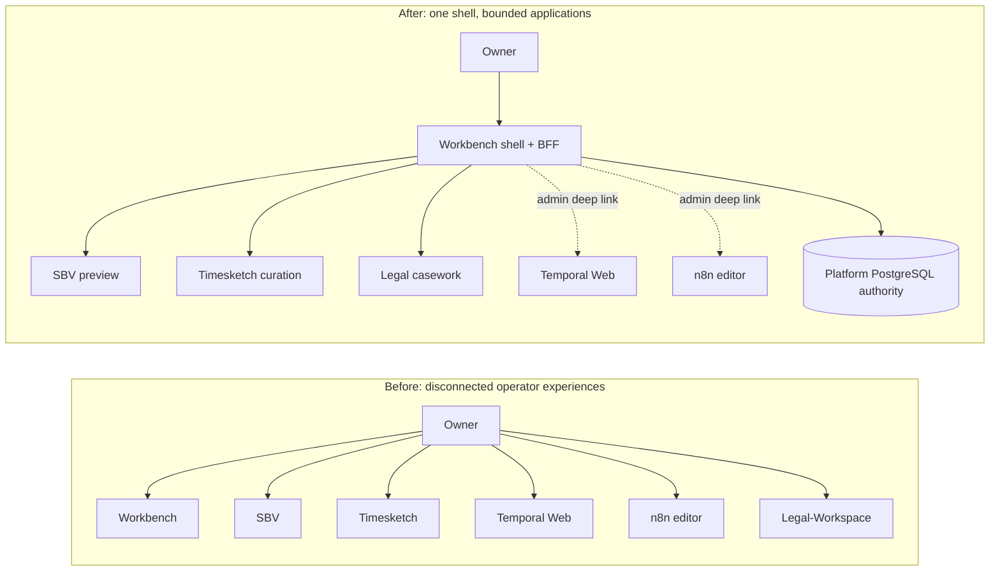
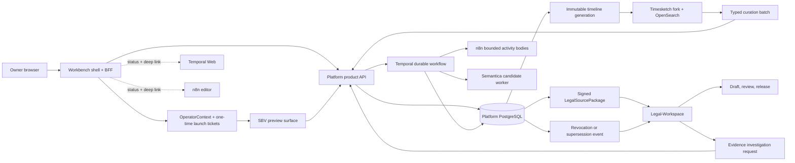

# ADR-0061: Unified operator shell with bounded capability surfaces

> _Byline: Codex · GPT-5 · 2026-08-27._

**Design Spec**: [Implementation Spec](/docs/design/0061-unified-operator-surface/spec.md)

- Status: **Proposed**
- Date: 2026-08-27
- Extends: ADR-0048, ADR-0049, ADR-0052, ADR-0053, ADR-0054, ADR-0055, ADR-0057, ADR-0060

## Context

The owner currently has separate surfaces for evidence intake and review, parsing, timeline curation,
workflow administration, candidate extraction, and legal work. Their boundaries are useful, but the
separate navigation, scope selection, credentials, and status models make the system feel like several
unrelated applications. The owner needs one manual operating experience without allowing a user-interface
integration to create another evidence authority, another legal-work-product store, or a shared browser
credential with fleet-wide power.

The desired state is one front door and one visible operating context. It is not one codebase, one
database, or one runtime. SBV, the Timesketch fork, and Legal-Workspace have distinct deploy and domain
boundaries. Temporal Web and the n8n editor are engineering consoles, not product surfaces. Semantica is
a candidate-producing capability rather than an authority or required standalone application.

## Decision

Adopt Workbench as the unified product shell and backend-for-frontend. Keep SBV, the Timesketch fork,
and Legal-Workspace independently deployable behind versioned contracts. Present Temporal and n8n run
status natively in Workbench and deep-link to their engineering consoles. Present Semantica outputs as
governed candidate queues in Workbench; do not make its runtime or any visualization a source of truth.

This proposal becomes implementation authority only after owner acceptance. Until then, it is the
blocking preflight record for new unified-surface code.

### Authority invariants

1. Workbench routes, authorizes launches, and summarizes status; it does not own evidence, candidate
   promotion, parser truth, timeline truth, or legal work-product truth.
2. PostgreSQL remains canonical for custody, governed context, evidence, review decisions, projection
   generations, receipts, and legal-package issuance.
3. SBV parses and previews. A confirmed preview starts the same headless Temporal import workflow; no
   direct surface path may bypass that gate.
4. Timesketch/OpenSearch is a rebuildable projection and curation client. Accepted changes exist only
   after PostgreSQL validates the command and emits a successor projection generation.
5. Legal-Workspace owns research, legal theories, drafts, reviews, releases, and filing readiness. It
   consumes immutable, version-pinned `LegalSourcePackage` references and cannot write evidence.
6. AI-chat content and Semantica observations remain context/candidates. No surface interaction promotes
   them to evidence without the existing governed evidence path.
7. Canonical ingestion and ordinary query paths do not redact. Redaction remains an explicit derived
   court-export operation.

## Architecture

The cross-surface contract is a versioned `OperatorContext` containing the selected matter/case,
source and custody references when applicable, run/correlation IDs, projection or package versions,
requested capability, audience, expiry, and nonce. Workbench mints a short-lived, audience-bound,
single-use launch ticket. Each target exchanges it server-side for its own HttpOnly session and
revalidates scope against its authoritative backend. Raw identifiers in URLs are display/navigation
hints only and never sufficient authorization.

Use a same-origin reverse proxy and bounded iframe/full-page launch for the first composition of SBV,
Timesketch, and Legal-Workspace. Do not use module federation. Native Workbench routes own shared status,
approval queues, and source opening; domain-heavy editors remain owned by their applications.

## Graph-thinking findings

- **Highest-centrality human node:** Workbench shell/BFF. Its failure should degrade navigation, not
  destroy direct tailnet/operator access to bounded applications.
- **Highest-integrity node:** Platform PostgreSQL. Every reverse edit path terminates at a typed command
  gate there before becoming accepted state.
- **Critical semantic bridge:** versioned Matter/CourtCase, source, run, projection, and package context.
- **Critical paths:** preview-to-import; projection-to-curation-to-successor-generation; approved-source
  package-to-legal-release; revocation-to-legal-stale; launch-ticket-to-local-session.
- **Required feedback loops:** preview correction, timeline reconciliation, legal missing-proof
  investigation, and evidence-revocation revalidation.

## Consequences

### Positive

- The owner gets one coherent operating experience while each domain remains independently deployable.
- Runtime execution remains API-driven and headless; an incomplete or unavailable UI does not stop
  parsing, hashing, normalization, or durable workflow execution.
- Cross-domain actions become auditable through shared correlation IDs without sharing authority.
- Mature upstream applications can be maintained and upgraded behind adapters rather than rewritten.

### Costs and obligations

- Workbench becomes a practical navigation/auth availability dependency and needs graceful degradation.
- The gateway must correctly handle cookies, CSP, frame ancestry, deep links, and audience isolation.
- Every bounded application needs a launch-exchange adapter and negative scope tests.
- TimeSketch and Legal-Workspace require explicit read-back/staleness loops; optimistic UI state cannot
  be represented as accepted platform truth.

## Second-order decision check

**Decision:** centralize product navigation and launch authorization in Workbench while preserving
bounded applications and canonical authority.

**First order:** the owner can enter once, retain the same matter/run context, and operate all major
capabilities from one surface.

| Order | Effect | Actors | Probability | Timing | Feedback |
|---|---|---|---|---|---|
| 2 | Shared context can silently cross matter/package scope if a downstream app trusts browser IDs. | Workbench and adapter owners | medium-high | first cross-surface launch | reinforces authority risk |
| 3 | A compromised or stale surface could then submit commands against the wrong governed object. | owner, platform API, bounded app | medium without guards | repeated use | reinforces scope drift |
| 2 | Shell convenience encourages every tool to ask for embedding and turns Workbench into a fragile monolith. | product and domain maintainers | medium | next delivery cycles | reinforces coupling |
| 3 | Independent upgrades slow and shell downtime blocks routine operations. | platform operations | medium | at scale | reinforces central dependency |
| 2 | Governed round trips make local TimeSketch/Legal state visibly pending rather than instantly accepted. | owner | high | first curation/release cycle | balances authority risk but adds friction |
| 3 | Consistent receipts and successor generations improve trust and make failed/stale work recoverable. | owner and reviewers | high | repeated use | balances initial friction |

**Scale test:** at ten times the sources, runs, timeline edits, and legal versions, browser-carried state,
shared credentials, or synchronous cross-app calls would amplify stale-scope and availability failures.
Opaque references, asynchronous receipts, local sessions, and independently rebuildable projections
continue to work at that scale.

**Revised decision:** proceed with the bounded-shell design, but make signed scope, one-time exchange,
typed command gates, asynchronous receipts, direct fallback routes, and successor read-back mandatory
foundation work rather than later hardening.

## Alternatives considered

- **Merge all code and UIs into Workbench:** rejected. It collapses domain and deployment boundaries and
  makes upstream maintenance harder without improving canonical authority.
- **Module federation:** rejected. The unused integration is incompatible with the Next.js App Router
  direction and would couple independently built applications at runtime.
- **Keep every application separate with only bookmarks:** rejected. It does not solve shared scope,
  source opening, approval continuity, or correlated status.
- **Embed Temporal Web and n8n as product applications:** rejected. They expose engineering concepts and
  mutation capabilities that are broader than the owner-facing task.
- **Make Timesketch, Semantica, or Legal-Workspace canonical:** rejected. Each would split custody,
  evidence, or legal-work authority.

## Acceptance gates

1. One authenticated Workbench session launches each bounded product surface with the same verified
   matter/case context and no shared browser secret.
2. Replayed, expired, wrong-audience, wrong-matter, and wrong-capability launch tickets fail closed.
3. SBV preview approval binds exact source, parser, configuration, and preview hashes before Temporal run
   start; rejection creates no canonical import rows.
4. Timesketch changes remain pending until per-item PostgreSQL receipts and a successor projection are
   read back; evidence-approved members create amendment candidates only.
5. Legal-Workspace imports only issuer-verified, manifest-hashed, version-pinned packages and cannot
   mutate evidence; revocation makes dependent work stale/revalidation-required.
6. Workbench shows native run/candidate/status summaries and deep-links to Temporal/n8n without sharing
   their administrative credentials.
7. Direct bounded-app operator routes remain available when Workbench is unavailable.
8. Live Coolify tests prove CSP/cookie/deep-link behavior, negative authorization, replay/idempotency,
   reconciliation, rollback, and current revision for every implemented package.
