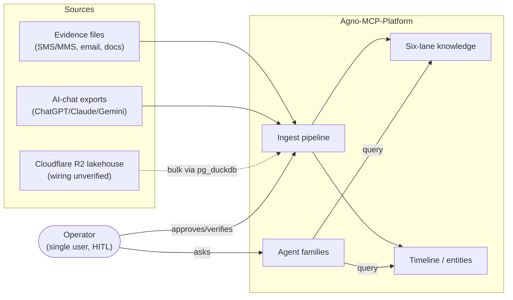
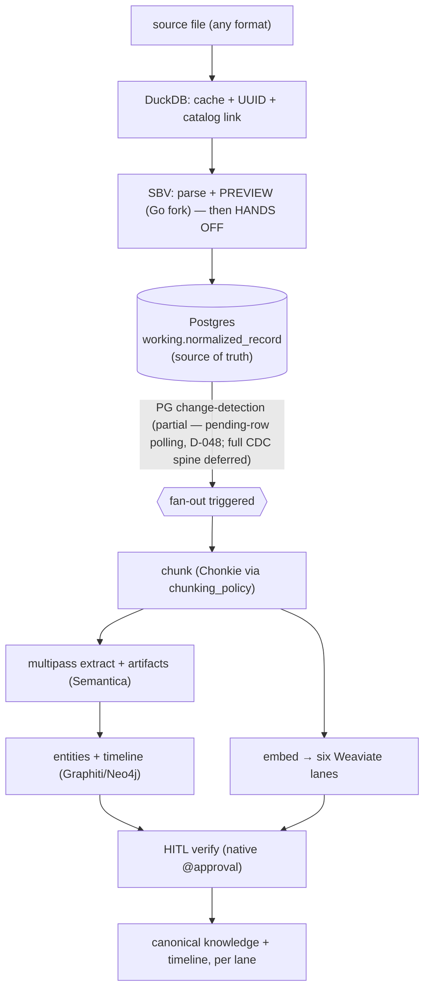
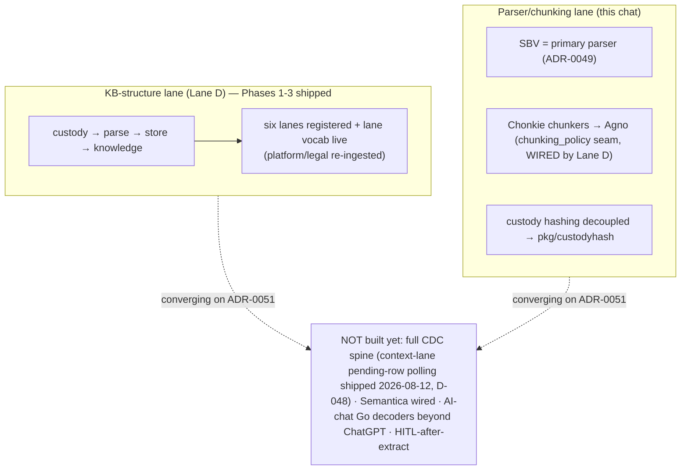
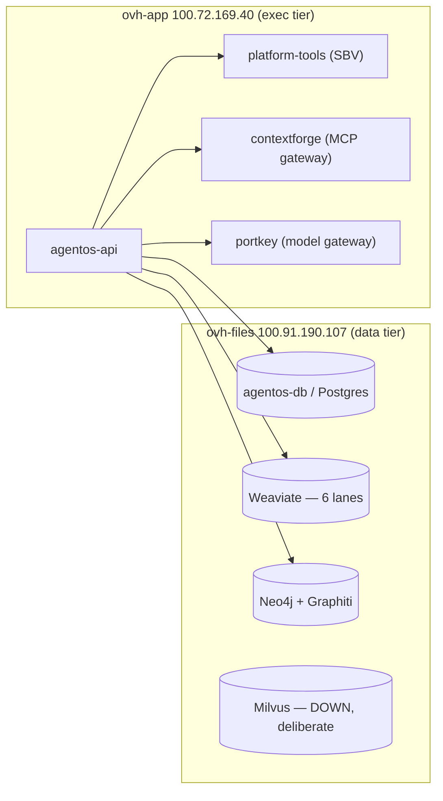

# Layer 1 — Architecture

> _Byline: Claude Code · Opus 4.8 · 2026-08-11 · reverse+forward, hybrid;
> drift-fix 2026-08-12 (Claude Code · Kimi K3): "PG change-detection not built" claims updated — partially built per D-048._
> Stable architecture (ADR-0051 target, ADR-0050 lanes, deploy topology) is drawn as the primary
> view. Build STATUS moves daily — for live phase status see `docs/COORDINATION.md` (war-room) and
> `docs/DECISION_LOG.md`, not this diagram.

## 1. System context

Who and what feeds the platform, and what it produces.

## 2. Data-flow — TARGET pipeline (ADR-0051)

The intended flow. One pipeline for everything; custody tier is the only evidence/context branch.

## 3. Data-flow — CURRENT state (dated snapshot 2026-08-11)

What exists today differs from the target: two lanes of work, converging. **Live status is in the
war-room, not here.**

## 4. Deployment topology (live 2026-08-11)

Two OVH boxes over Tailscale + Coolify. ⚠ statuses change — verify against Coolify/`COORDINATION.md`.

## Open Questions
- `%% UNVERIFIED` R2 lakehouse → PG/DuckDB wiring mechanism (owner-stated; not confirmed in code).
- ~~`%% UNVERIFIED` PG change-detection — does not exist yet; forward-only (ADR-0051).~~ **Updated 2026-08-12 (D-048):** partially built — the context lane's projection is change-detection-SHAPED (`ingest.context-drain` reads rows `WHERE <sink>_synced_at IS NULL` and stamps them; CLI + registered tool). The generic trigger/outbox/cursor spine for ALL paths remains DEFERRED (ADR-0051 invariant 4; spine design = ADR-0052, queued/not yet drafted).
- exec-tier (ovh-app) was DOWN 2026-08-10 (VPS/bill) — topology shows intended state; verify live.
