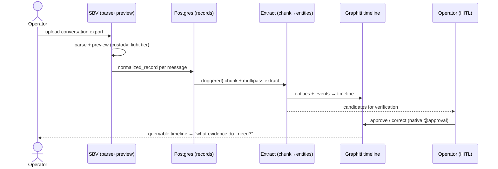
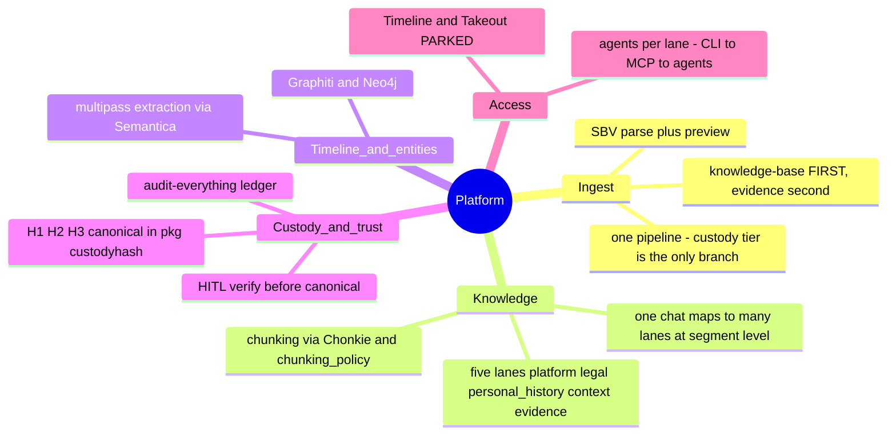
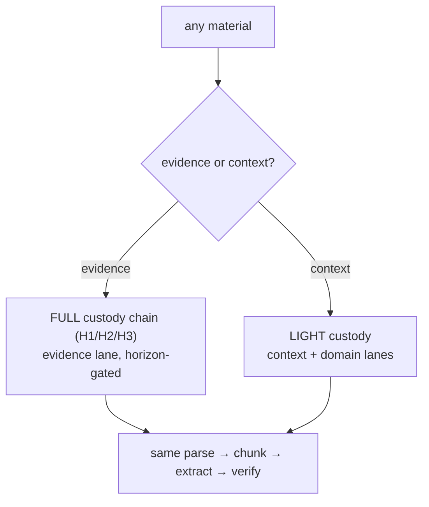

# Layer 3 — Features

> _Byline: Claude Code · Opus 4.8 · 2026-08-11; ADR-0053 amendment Codex · GPT-5 ·
> 2026-08-13._ User-facing flows + feature hierarchy. Backend
> platform (SBV has its own GUI); no wireframes. Knowledge-base-first is the sequencing (ADR-0051).

## 1. Primary flow — one conversation becomes a timeline

The owner's north star: process a conversation → build the timeline → learn what evidence to find.

## 2. Feature hierarchy

## 3. The evidence/context branch (custody tier)

The single fork in the pipeline — everything else is shared.

## Open Questions
- HITL-after-extraction gate — the extraction stage it verifies is not built yet (ADR-0051).
- Segment→lane classification (the multipass step that makes "one chat → many lanes" real) is the
  gap the current single-lane context ingest still has (D-045). It consumes the chunks from the
  `chunking_policy` seam.
