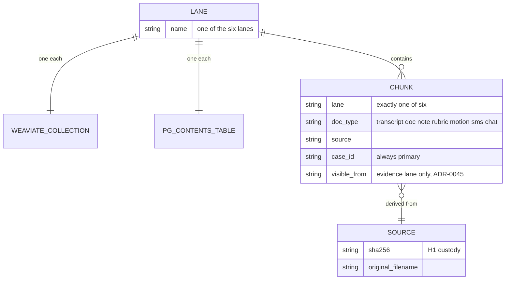
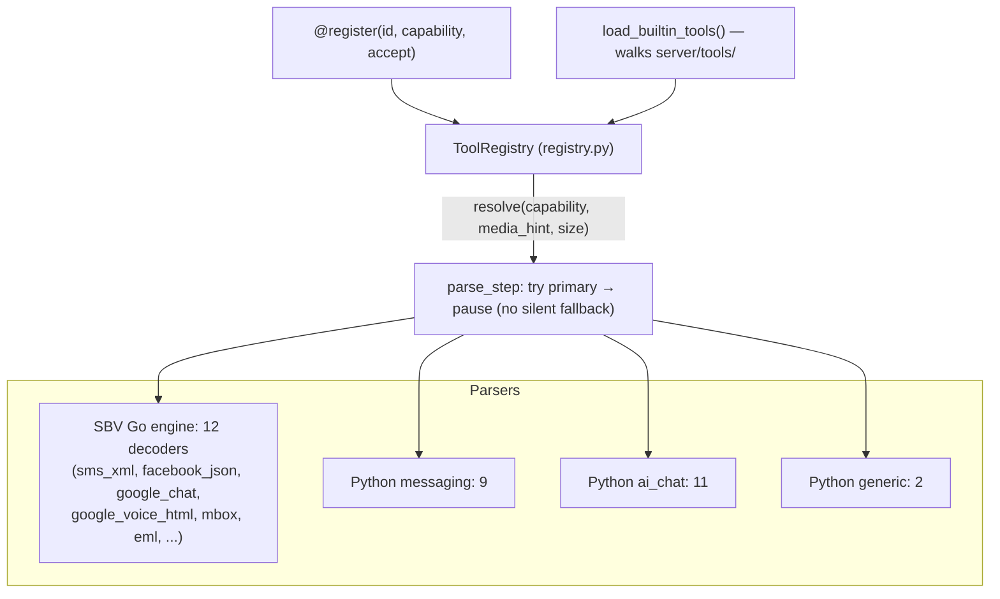
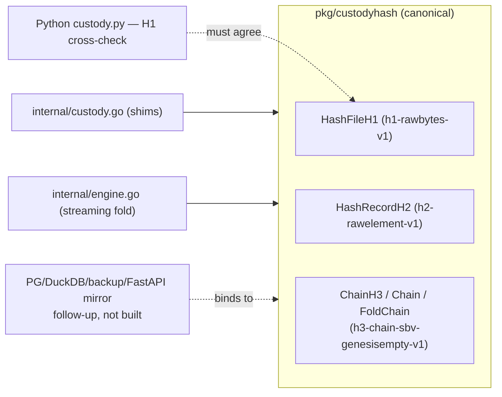
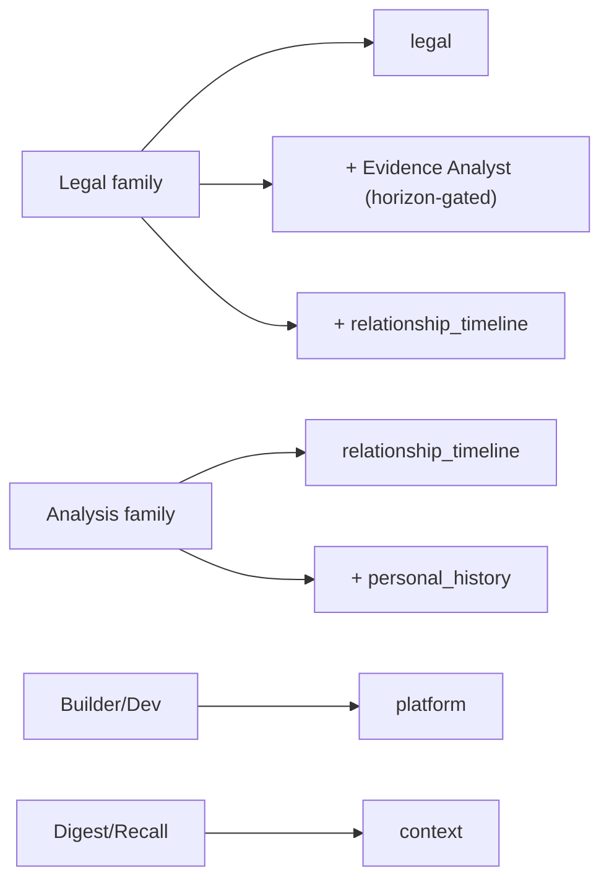

# Layer 2 — Structure

> _Byline: Claude Code · Opus 4.8 · 2026-08-11._ Data model + component structure. Sources:
> ADR-0050 (six-lane KB), `server/tools/registry.py` (parser registry), `vendored/sbv/` (Go engine
> + `pkg/custodyhash`), ADR-0050 §7 (agent→lane).

## 1. Six-lane knowledge model (ADR-0050)

Each lane is its OWN Weaviate collection + Postgres contents table (schema `ai`) — isolation is
structural, not filter-dependent. One embedder for now (`nv-embed-v1`, 4096-d).

Evidence lane is special: written ONLY by custody-approved records; read ONLY through the
horizon-gated seam (`server/evidence/retrieval.py`); no agent holds its raw handle.

## 2. Parser registry + dispatch

No central list — parsers self-register on import; the workflow resolves by capability.

## 3. Custody hashing (decoupled — `pkg/custodyhash`)

One canonical construction; every caller binds to it (D-047).

## 4. Agent → lane wiring (ADR-0050 §7)

One primary lane per family; cross-lane via team members, not custom retrievers.

## Open Questions
- `%% UNVERIFIED` non-Go custodyhash callers (PG/DuckDB/FastAPI mirror) — follow-up, not built.
- Agent→lane wiring is ADR-0050 Phase 4 — verify against `server/agents/factory.py` when shipped.
