# Forensic Evidence Database Architecture

### SPEC-1 · MCP Forensic-Evidence Agent Platform — Master Architecture Document

> _Byline: Claude Code · Opus 4.8 (1M) · 2026-06-30_

---

> ## ⚠️ DRAFT — HUMAN-IN-THE-LOOP REVIEW REQUIRED ⚠️
>
> **This is a DRAFT architecture for human review. It is NOT a ratified specification and NOT a court-facing artifact.**
> It describes how a forensic-evidence database *should* be built; it does not assert any fact about any person.
> Nothing in this document may be exported, filed, or treated as an established finding without explicit human
> review (HITL). Where the document names data fields, enum values, or worked examples that could read as
> allegations or conclusions about a real person, those are **schema illustrations only** — see the
> *Appendix: Open critic findings still requiring human attention* before relying on any of them. Several
> court-safety items (conclusory vocabulary baked into enums, a person-level `is_flagged` attribute,
> both-parties parity, real-identifier scrubbing) are **flagged unresolved** and must be addressed by a human
> before this design produces any output about an actual case.

---

### Provenance of this document

This master document was **assembled by a multi-agent workflow**, not written in a single pass. The pipeline ran:
discovery agents (A1 capabilities/liveness, A2 SSOT/ADR drift, A3 prior-work crosswalk, A4 prior-reports
triage, A5 conversation-log mining) → a compacted context pack → 21 parallel section drafters → three
independent critics (completeness, court-safety/blank-slate, gap/staleness) → this synthesis/assembly pass.
Every section is **grounded in the discovery and gap artifacts** and cites the governing ADRs; on any conflict
the SSOT docs (`Agno-MCP-Platform/docs/PROJECT_CANON.md` + ADRs) win over this draft.

Grounding artifacts (all under `scratchpad/forensic-db-arch/`):

- Context pack (carry-forward digest): `discovery/CONTEXT_PACK.md`
- Gap, blind-spot & staleness report: `discovery/GAP_AND_STALENESS_REPORT.md`
- Discovery source reports (A1–A5): `discovery/` (referenced in the two artifacts above)
- Critic findings folded into this assembly: `review/completeness.md`, `review/court_safety.md`, `review/gap_staleness.md`
- The 21 source section drafts: `sections/01-…` through `sections/21-…`

**What the assembler changed vs. the section drafts:** sections are concatenated essentially verbatim (the
synthesis pass does not rewrite analytical content). The only inline edits applied are safe, mechanical fixes
flagged by the critics — e.g. scrubbing a real child's name from one illustrative string in §3 to
`[MINOR_1]`/`[PARTY_B]`. Everything substantive a critic raised is **left in place and catalogued in the
closing appendix** rather than silently rewritten or invented.

---

## Table of Contents

- [Provenance of this document](#provenance-of-this-document)
- [Pre-Scan & Existing-Work Reconciliation (Post-Scan Merge Report)](#pre-scan--existing-work-reconciliation-post-scan-merge-report)
  - [Staleness summary](#staleness-summary)

**Architecture sections (21):**

1. [Title, Executive Summary, and Goals & Non-Goals](#1-title-executive-summary-and-goals--non-goals)
2. [Core Data Domains](#core-data-domains)
3. [Canonical Data Model (the big one)](#canonical-data-model-the-big-one)
4. [PostgreSQL / DuckDB / PostGIS Schema Strategy](#postgresql--duckdb--postgis-schema-strategy)
5. [Milvus Vector Schema (Collections)](#milvus-vector-schema-collections)
6. [Neo4j / Graphiti / Semantica Graph Model](#neo4j--graphiti--semantica-graph-model)
7. [SurrealDB Consolidated Analysis Model](#surrealdb-consolidated-analysis-model)
8. [Temporal reasoning model (bitemporal)](#temporal-reasoning-model-bitemporal)
9. [Provenance & Chain-of-Custody Model](#provenance--chain-of-custody-model)
10. [Extraction Ontology per Source Type](#extraction-ontology-per-source-type)
11. [Multi-pass analysis workflow (19 phases)](#multi-pass-analysis-workflow-19-phases)
12. [Evidence-Gathering Plan Model](#evidence-gathering-plan-model)
13. [Confidence, Scoring & Human Review Framework](#confidence-scoring--human-review-framework)
14. [Security, Privacy & Safety Constraints](#security-privacy--safety-constraints)
15. [Risks, Assumptions & Open Questions](#risks-assumptions--open-questions)
16. [Implementation roadmap (MVP + Phases 1-8)](#implementation-roadmap-mvp--phases-1-8)
17. [Testing Strategy](#testing-strategy)
18. [Diagrams](#diagrams)
19. [Final Execution-Ready Plan](#final-execution-ready-plan)
20. [Persistent Work-Product Ledger & Micro-Memory Design](#persistent-work-product-ledger--micro-memory-design)
21. [Final Verdict](#final-verdict)

- [Appendix: Open critic findings still requiring human attention](#appendix-open-critic-findings-still-requiring-human-attention)

> _Note on count: the master prompt specified 23 deliverables; **21** architecture sections were produced.
> The Post-Scan Merge Report (below) and this appendix supply two cross-cutting deliverables; the residual
> count discrepancy is logged in the appendix (item C-1) for orchestrator reconciliation._

---

## Pre-Scan & Existing-Work Reconciliation (Post-Scan Merge Report)

This project is **not a blank slate**. Before any new design, the discovery agents scanned the user's prior
work — the `salem_v3` case knowledge graph, the TraceIQ timeline/geo schemas (R5/R10/R12), the salvaged
parser/ontology corpus in `extracted-code/MANIFEST.md`, the alpha forensic-DB schemas, the doc-intelligence
tables, and the Jan-era status/audit reports — and the locked ADR stack. The table below reconciles every
material prior asset into one of nine dispositions. It is distilled from the A3 crosswalk, the
`GAP_AND_STALENESS_REPORT.md`, and the three critic reviews. **Items in _Lost_, _Conflicting_, and
_Needs-Review_ are the ones that still require a human decision** and are expanded in the closing appendix.

| Disposition | Prior asset(s) | Reconciliation note | Where landed / ref |
|---|---|---|---|
| **Preserved** (as-hypothesis / as-note) | salem_v3 `USED_TACTIC`, `EXPLOITED_VULNERABILITY` (was `TARGETED_WOUND`), `DISPARAGES` (was `SPREADS_RUMOR`); prior human interpretations | Kept verbatim as **hypotheses**, never promoted to fact; HITL before any court use; append-only so prior interpretations are never overwritten | §6, §9, §13 |
| **Preserved** (pipeline-only note) | `temporal_alignment`, `enrichment_queue` | Operational/pipeline constructs — intentionally not in the canonical schema; recorded so the omission is explicit, not silent | §11 |
| **Adopted** (as-is) | salem_v3 core entities `Person`/`Incident`(`Event`)/`Location`/`Statement`/`Evidence`; edges `WAS_AT`/`PARTICIPATED_IN`/`MADE_STATEMENT`/`CONTRADICTS`; UUIDv7+SHA-256 chain-of-custody column contract; doc-intelligence `sections/chunks/spans/entities/findings/approvals`; Semantica PROV-O provenance/conflict pattern; Google raw-export JSON shape (raw-evidence contract); `positive_behaviors.ttl`, `behavioral_patterns.ttl`, `mcl_722_23.ttl` (12 MCL factors), `detection_patterns.py` (256-pattern/DARVO), `seed-patterns.ts ~303`, `hurtlex_loader`; parsers `enhanced-xml-chunker.py`, `sms_backup_parser`, `schema-resolver.ts` | Direct reuse; `positive_behaviors.ttl` adopted specifically to satisfy the both-parties / full-cycle guardrail (do **not** invent new node types) | §2, §3, §6, §9, §10 |
| **Adopted** (live infra) | Milvus (single vector store), Neo4j+Graphiti (bitemporal cognition), R2 object store, ContextForge MCP gateway, custom `agno-postgres:18-duckdb` image | Already LIVE; reused, not rebuilt | §4–§6, ADRs 0007/0013/0014/0026/0027 |
| **Adapted** (reshaped) | TraceIQ `timeline_enriched` → `timeline_event` (split raw vs enriched; TEXT timestamps → `timestamptz` **+ new precision class**); custody edge → `AFFECTED_PARENTING_ACCESS`/`EXPOSED_CHILD` (renamed); `Vulnerability`, `Tactic`/`BehavioralPattern` (sensitive → HITL); `vw_forensic_evidence_package` (HIGH/MED/LOW tiers); `is_private` → review gate; pgvector role → Milvus | Shape adapted to lane discipline, the timestamp-precision requirement, and the live stack | §3, §6, §8, §10, §13 |
| **Merged** | TraceIQ `people` ↔ salem `Person`; multiple timeline sources → unified `timeline_event`; geocode results ↔ caches → `geocode_resolution`; `normalized_messages` raw-JSON landing **+** TraceIQ typed `messages` → "raw landing → typed projection" | Identity/entity reconciliation; the messages merge is adopted in principle but its **field-merge rules remain open** (see Conflicting / Needs-Review) | §3, §10 |
| **Split** | salem `RELATED_TO` → typed causal/temporal/topical edges; `timeline_enriched` → raw vs enriched layers; `problematic_locations_contacts` → evidence-gathering **task**, not a person denylist (per court-safety F5) | Vague/over-broad constructs decomposed into typed, lane-correct ones | §6, §8, §12 |
| **Deprecated** (superseded — ignore as authority) | ADR-0003 (PG18 pgvector-only, NO DuckDB); standalone DuckDB; FalkorDB; Multicorn2/neo4j-fdw federation; Supabase/Chroma/LanceDB/pgvector target stack; flat `timeline_events`, stub tables, redundant caches, markdown report template; pgvector **vector role** (legacy-resident) | Clean supersession chain (0003→0013/0014/0027); the README still mislabels 0003 "Accepted" — **drift to fix** (see Conflicting) | §4, §15, §21, ADR-0013/0027/0032 |
| **Lost** (dropped — no section incorporated; human decision needed) | TraceIQ DuckDB analytical views `vw_place_analytics`, `vw_route_patterns`, `vw_bouncy_trips`, `vw_overnight_activity`, `vw_city_summary`; `data_quality_metrics` + `trig_quality_check`; SBV cluster parser + 4GB streaming-XML ingest design; doc-intelligence `summaries`/`keywords` tables; alpha tables `bertConfigs`/`severityWeights`/`schemaResolvers`/`forensicResults`; **Email** as a first-class source; weakly-covered `flagged_entity`, `multi_device` attribution, named raw-export JSON schema contracts | Genuinely dropped or only incidentally touched (critic-verified 0–2 hits). Several are easy re-adopts (the analytical views, `data_quality_metrics`); Email and streaming-XML are real capability gaps | Appendix items A-1…A-6 |
| **Conflicting** (open, needs decision) | `normalized_messages` raw-JSON vs typed `messages` field-merge rules; ADR-0003 README "Accepted" label; R6 "85% done" vs R7/R8 "40%" status; pg_duckdb-embedded vs standalone DuckDB; **no as-built DDL verification** (paper design vs unverified live stack) | Most are *resolved in principle* (embedded DuckDB wins; trust ADRs+probes over reports) but carry a concrete to-do (lock merge rules; fix README label; run a live-DDL reconciliation) | §4, §15, §21; Appendix B |
| **Needs-Review** (court-safety / scope — human required before use) | `is_flagged` person attribute; conclusory enum vocabulary (`pattern_category`, `reactive_context` field names); `love_bombing`/`escalation` as extracted-tier `event_type`; both-parties parity (positive lane is promissory); real identifiers in examples; XLSX/Snapchat-source/Instagram/Email ingest lanes; R5 two-copy dedupe + model extraction; 21-vs-23 deliverable count | These survive HITL-on-export but are **structural** court-safety or scope gaps; do not treat the design as court-ready until closed | Appendix items F1–F5, A-1…A-6, C-1 |

### Staleness summary

The discovery pass verified the currency of every resource it relied on (full table in
`discovery/GAP_AND_STALENESS_REPORT.md`, Part 2). Headlines:

- **Current / trust:** ADR-0013 (the `agno-postgres:18-duckdb` SSOT) and ADRs 0014/0024/0027/0030/0031/0032 +
  `PROJECT_CANON §5`; the A1 live probes (graphiti, coolify, agno-gateway, opencode all LIVE 2026-06-30);
  `extracted-code/MANIFEST.md` (deduped, provenance-tracked salvage — the canonical prior-art source);
  `casebible.duckdb` (Jun 23, local catalog/prototype); memsearch memory digests (≤ Jun 27).
- **Aging / re-target before reuse:** the Jan-era reports R5–R12 — richest on the *data model* (R5) and the
  TraceIQ *timeline* design (R10/R12), but they assume a **dead stack** (Supabase + Chroma + LanceDB +
  pgvector) that must be re-targeted to PG(+pg_duckdb+PostGIS)/Milvus/R2. R5 also exists as two byte-identical
  copies (dedupe pending).
- **Superseded — ignore as authority:** ADR-0003 (every axis); the README "Accepted" label for it (fix to
  "Superseded by 0013/0014/0027"); MIGRATION_PLAN_v8 / `docs/planning/*` (PG16, pgvector-hybrid,
  `uuid_generate_v4`).
- **Stale / last-resort only:** 78 `Workspace_Manifest_*.json` snapshots (Feb–Mar); the memsearch turn DB
  (Jun 11 metadata only); the `claude-context` index (unindexed for the workspace root — re-index before any
  code search).
- **Dead pointers:** the `TheBigOne` tree is **gone from all three disk roots** — every transcript absolute
  path is dead; resolve via `extracted-code/MANIFEST.md`. `osgrep` was uninstalled (06-11) — ignore.
- **Critic verdict on staleness contamination:** *clean.* The gap/staleness critic confirmed **no stale
  decision is silently inherited** — every superseded resource is treated as inventory-only and the live ADR
  is cited instead.

---


## 1. Title, Executive Summary, and Goals & Non-Goals

> _Byline: Claude Code · Opus 4.8 (1M) · 2026-06-30_
> _Part of: SPEC-1-MCP-Forensic-Evidence-Agent-Platform — Forensic Evidence Database Architecture package._
> _Authority note: Where this section touches locked decisions it cites the governing ADR. On any conflict, the SSOT docs win (`Agno-MCP-Platform/docs/PROJECT_CANON.md` + ADRs)._

---

### 1.1 Title

**SPEC-1 — Forensic Evidence Database Architecture**
**A Provenance-First, Bitemporal, Human-in-the-Loop Data Layer for a Pro Se Family-Law Custody Matter**

Subtitle (operational): *A four-resource persistence design — a unified PostgreSQL + PostGIS + embedded-DuckDB (pg_duckdb) store for relational / analytical / spatial data, Milvus for vectors, Neo4j (Graphiti + Semantica) for graph cognition, and SurrealDB as a deferred analysis sink — that ingests raw evidence under chain-of-custody, normalizes it into auditable canonical records, separates fact from inference from legal conclusion, and produces court-safe, fully-traceable evidence packages with human review gating every sensitive output.*

This is the data-layer specification for **Phase 1 (Evidence custody & normalization)** of the platform, designed forward-compatibly for **Phase 2 (multi-pass behavioral / abuse-pattern analysis)** and **Phase 3 (AI Legal Team reasoning)** described in the platform background (MP §Platform Background). It is **not a green-field design**: it adopts, adapts, and merges the owner's existing ontologies, partial schemas, and prior AI-analysis outputs per the discovery crosswalk (CONTEXT_PACK §3).

---

### 1.2 Executive Summary (plain-language, for a non-technical stakeholder)

**What this is, in one sentence.** This is the blueprint for the "filing cabinet, evidence locker, and timeline board" that sits underneath an AI-assisted system you control, helping you organize the evidence in your custody case so that anything you might one day hand to a court can be trusted, traced back to its original source, and explained.

**Why it exists.** A custody matter generates an overwhelming pile of digital material: text messages, call logs, social-media posts, screenshots, photos with GPS data, location history, emails, PDFs, and notes. Scattered across phones, exports, and cloud accounts, that material is impossible to reason about reliably and dangerous to present in court if you cannot prove where each piece came from or whether a claim is established fact versus your own interpretation. This database is the disciplined, auditable home for all of it.

**The core idea: keep five kinds of "truth" in separate drawers.** The single most important design rule is that the system never blurs these five layers together (Constraints; CONTEXT_PACK §6):

| Layer | Plain-language meaning | Example |
|---|---|---|
| **Raw evidence** | The original, untouched item, byte-for-byte, with a digital fingerprint | The actual SMS-backup XML file, exactly as exported |
| **Extracted fact** | Something a tool pulled *out of* the raw item | The text and timestamp read from inside that SMS file; OCR text from a screenshot; a geocoded address |
| **Inferred fact** | Something the system *calculated* but no one stated directly | "She was likely home that night," derived from GPS clustering |
| **Analytical finding** | A pattern or interpretation produced by analysis | "These messages show a repeating conflict-then-repair cycle" |
| **Legal conclusion** | A claim with legal weight | "This is relevant to the best-interest factors" |

Each higher layer must point back, in writing, to the layer beneath it. Nothing on a higher shelf is ever allowed to quietly become "fact" on a lower one.

**It remembers two kinds of time.** The system is *bitemporal* (MP §Platform Background; ADR-0014/0018/0031). It records both **when something happened** and **when you found out about it**. That lets the system honestly answer "what did I reasonably know at the time?" versus "what only became clear later?" — and preserve how a later discovery changes the meaning of an earlier event, without rewriting history.

**It is fair on purpose.** The design deliberately captures the **whole relationship**, not just the bad moments — affectionate, ordinary, neutral, repair, and "love-bombing"-style interactions are recorded too, because the *contrast and cycling over time* is what makes a pattern meaningful and credible (Constraints). It also records **your own** mistakes, escalations, apologies, and repair attempts in context, so the picture is not one-sided. The goal framing is **"structure, safety, clarity, and child stability,"** not punishment or blame.

**Nothing sensitive ships without a human.** The system can *suggest* sensitive interpretations — words like gaslighting, coercive control, alienation, or weaponization — but it will never put them into a court-facing output on its own. A person (you) must review and approve. Likewise, anything that leaves your control or moves money is gated behind explicit approval (CONTEXT_PACK §4, §6).

**It keeps your originals safe and stays on your own infrastructure.** Every raw file is hashed (a SHA-256 fingerprint) and preserved unchanged; records are append-only and versioned, so earlier interpretations are never overwritten, only superseded (ADR contract; CONTEXT_PACK §3). All evidence stays on owner-controlled infrastructure; raw forensic/abuse content is **never** sent to external cloud AI services (CONTEXT_PACK §4). Local analysis runs on small CPU-only models; large reasoning uses cloud models **only** on non-sensitive material via the gateway (ADR-0015).

**Where it lives (the four lockers), in plain terms.** The data is split into four independent storage systems so that if one breaks, the others keep running (owner-mandated hard constraint; CONTEXT_PACK §1):

| # | The "locker" | What it holds (plain language) |
|---|---|---|
| 1 | **One PostgreSQL database** (with mapping/PostGIS and an embedded analytics engine, pg_duckdb) | The structured records: evidence catalog, messages, events, people, places, claims, the timeline, and the chain-of-custody log |
| 2 | **Milvus** | The "search by meaning" index, so you can find related messages or documents by content, not just keywords |
| 3 | **Neo4j (with Graphiti + Semantica)** | The "who-did-what-to-whom-and-when" relationship map, including how knowledge changed over time |
| 4 | **SurrealDB** *(planned, not yet built)* | A future consolidated analysis workspace |

**Bottom line.** When this is built, you will be able to take any sentence in a future court summary and walk it back — step by step — to the exact original file it came from, the tool and prompt version that processed it, and the human who approved it. That traceability, plus the fact/inference/conclusion separation and the human-review gates, is the entire point.

#### Plain-language data-flow overview

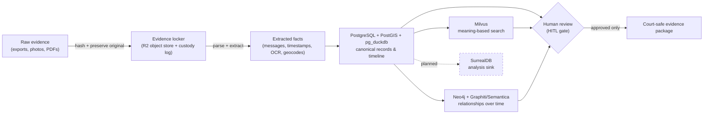

---

### 1.3 Goals and Non-Goals

#### 1.3.1 Goals — what this database system is supposed to do

| # | Goal | Grounding |
|---|---|---|
| G1 | **Ingest raw evidence under chain-of-custody**: accept exports (SMS/MMS/call logs, iMessage/GVoice/Facebook, Snapchat, ChatGPT/Claude transcripts, Google Takeout/location, screenshots, photos, PDFs, emails), hash each raw file (SHA-256), and **preserve the original byte-for-byte**. | MP Phase 1; CONTEXT_PACK §3 (parsers, UUIDv7+SHA-256 custody contract), §6 |
| G2 | **Parse & extract structured data** from raw items using the salvaged parser suite (`enhanced-xml-chunker`, `sms_backup_parser`, GVoice/iMessage-PDF/FB, `chat-export`, location/Takeout, Snapchat, `schema-resolver.ts` for unknown formats). | CONTEXT_PACK §3 |
| G3 | **Normalize into canonical records** across the core domains (evidence, messages, events, people/entities, locations, GPS tracks, claims, relationships, abuse-pattern indicators, legal issues, analysis findings, evidence-gathering tasks, court export packages). | MP §4 Core Data Domains |
| G4 | **Maintain strict layer separation** between raw evidence, extracted facts, inferred facts, analytical findings, and legal conclusions — as distinct, linked record types, never collapsed. | Constraints; CONTEXT_PACK §6 |
| G5 | **Record timestamp precision** for every time value as a class — exact / approximate / inferred / uncertain — a field **missing from all prior schemas** and explicitly added here. | Constraints; CONTEXT_PACK §3 |
| G6 | **Be bitemporal**: capture both valid-time (when it happened) and knowledge-time (when it was learned), and preserve how later discoveries re-interpret earlier events without overwriting. | MP §Platform Background; ADR-0014/0018/0031; CONTEXT_PACK §2 |
| G7 | **Preserve full provenance & lineage** for every derived object back to source evidence, processing run, prompt version, ontology version, schema version, and human-review decision. | Constraints; CONTEXT_PACK §3 (Semantica PROV-O, `source_hash`; doc-intelligence tables incl. `approvals`) |
| G8 | **Model the full relational cycle and both parties' conduct**: positive / neutral / affectionate / ordinary / repair / love-bombing phases, plus the user's own mistakes, escalations, apologies, and repair attempts in temporal context. Track surface tone, inferred intent, relational function, and cycle phase **separately**. | Constraints; CONTEXT_PACK §3 (`positive_behaviors.ttl`), §6 |
| G9 | **Support meaning-based retrieval** via Milvus (one collection per embedder; raw docs remain source of truth) over message bodies, documents, and evidence text. | ADR-0027/0010/0011/0026; CONTEXT_PACK §2, §3 |
| G10 | **Represent entities & relationships over time** in Neo4j via the adopted salem_v3 ontology (Person, Incident/Event, Location, Statement, Evidence; edges WAS_AT, PARTICIPATED_IN, MADE_STATEMENT, CONTRADICTS, etc.), mirrored into PostgreSQL. | CONTEXT_PACK §3 (salem_v3); ADR-0014 |
| G11 | **Persist intermediate work products** — scans, drafts, indexes, classifications, prompt versions, tool-call outputs, generated artifacts — as append-only / versioned records, not just final outputs. | Constraints |
| G12 | **Keep originals & history immutable**: append-only logs or versioned records for anything that may later affect evidence interpretation; never overwrite raw evidence or earlier interpretations. | Constraints; CONTEXT_PACK §6 |
| G13 | **Produce court-ready evidence packages** as review-ready *factual* summaries with confidence tiers (adopting TraceIQ `vw_forensic_evidence_package` HIGH/MED/LOW tiers), each item traceable to source. | CONTEXT_PACK §3; MP Phase 1 |
| G14 | **Enable cross-session resumable memory** so project context (decisions, open questions, prior interpretations) survives across working sessions. | Constraints; CONTEXT_PACK §4 |
| G15 | **Keep all evidence on owner-controlled infrastructure** (PostgreSQL, Milvus, Neo4j, Cloudflare R2), with local CPU-only processing for sensitive content. | CONTEXT_PACK §1, §2, §4; ADR-0007/0015/0030 |
| G16 | **Adopt/adapt the owner's prior work, not start blank**: integrate existing ontologies, partial schemas, case-specific labels, message categories, abuse-pattern notes, event drafts, and prior AI outputs — classified by confidence, usefulness, and review status. | Constraints; CONTEXT_PACK §3 |
| G17 | **Deploy as four independent resources** with no shared lifecycle (separate bind-mounted volumes; one store's crash/restart never tears down the others). | CONTEXT_PACK §1 (owner hard constraint) |

#### 1.3.2 Non-Goals — what this system is *not* supposed to do

| # | Non-Goal | Rationale / grounding |
|---|---|---|
| N1 | **Not a legal-advice engine.** It organizes evidence, builds review workflows, and drafts review-ready factual summaries; it does not give legal advice or make legal determinations. | Constraints ("Avoid legal advice"); MP Phase 3 keeps a human in the loop |
| N2 | **Not an autonomous accuser.** It never presents allegations as established fact and never auto-generates accusations, filings, or court-facing conclusions without human approval. | Constraints; CONTEXT_PACK §6 |
| N3 | **Not a one-sided advocacy tool.** It will not portray the user as perfect/automatically justified, nor the partner as abusive/manipulative without evidence-linked support. | Constraints; CONTEXT_PACK §6 |
| N4 | **Not a fact-promotion machine.** It never silently promotes a hypothesis/inference into a fact, and never overwrites prior evidence or interpretations. | Constraints; CONTEXT_PACK §6 |
| N5 | **Not a negativity-only model.** It does not model only abusive/negative incidents; positive, neutral, and repair interactions are first-class. | Constraints |
| N6 | **Not a single-sentiment classifier.** It does not flatten messages into one tone score; surface tone, inferred intent, relational function, and cycle phase are stored separately. | Constraints |
| N7 | **Not a standalone-DuckDB or standalone-PostGIS deployment.** DuckDB lives only as the pg_duckdb extension inside the single Postgres resource; PostGIS lives inside that same resource. | CONTEXT_PACK §1, §2; ADR-0013 |
| N8 | **Not a shared-lifecycle monolith.** Milvus, Neo4j, and SurrealDB are never co-located into one coupled app. | CONTEXT_PACK §1 |
| N9 | **Not an external-cloud evidence processor.** Raw forensic/abuse evidence is never fed to external/cloud LLM-extracting services (exa, Drive, Lucid, M365, or cloud entity-extraction); large cloud models touch only non-sensitive material. | CONTEXT_PACK §4; ADR-0015 |
| N10 | **Not a from-scratch schema.** It does not ignore or discard the owner's existing ontologies, schemas, labels, and prior AI outputs. | Constraints; CONTEXT_PACK §6 |
| N11 | **Not a destructive store.** No hard deletes of evidence/interpretations; superseded items are versioned/archived with a reason, never erased (mirrors the never-delete→`_stale/` rule). | Constraints; CONTEXT_PACK §2; user global rule |
| N12 | **Not (in this scope) the Phase-2 analysis engine or Phase-3 Legal Team.** This spec is the *data layer*; analysis and legal reasoning consume it but are out of scope here (designed for, not built by, this document). | MP §Platform Background phasing |
| N13 | **Not a real-time / high-frequency transactional system.** It is an evidence-of-record store optimized for auditability and provenance, not low-latency OLTP at scale. | Constraints ("auditability matters"; "normalized, auditable records over vague summaries") |

#### 1.3.3 What should require human review (HITL)

These produce *suggestions/drafts* that a human must explicitly approve before they become canonical or court-facing. Approvals are recorded as first-class, append-only records (doc-intelligence `approvals` table; CONTEXT_PACK §3).

| Trigger | What is gated | Grounding |
|---|---|---|
| **Sensitive labels** — gaslighting, coercive control, alienation, manipulation, weaponization, reactive abuse | Cannot enter court-facing output without review/approval | Constraints; CONTEXT_PACK §6 |
| **Abuse-pattern indicators** (DARVO, MCL A–L patterns from `detection_patterns.py`, `behavioral_patterns.ttl`, `seed-patterns`) | Detector output is a *hypothesis*; review required before relied-upon use | CONTEXT_PACK §3 |
| **Adapted sensitive ontology** — `Vulnerability`, `Tactic`/`BehavioralPattern` nodes | HITL on creation/labeling | CONTEXT_PACK §3 |
| **Hypothesis edges** — `USED_TACTIC`, `EXPLOITED_VULNERABILITY`, `DISPARAGES` | Preserved as hypotheses; HITL before any court use | CONTEXT_PACK §3 |
| **Promotion across layers** — inferred fact → fact, finding → legal conclusion | Each promotion is an explicit, reviewed, logged event | Constraints; CONTEXT_PACK §6 |
| **Legal-relevance / best-interest (MCL 722.23) labels** | Reviewed before attached to evidence for court use | CONTEXT_PACK §3 (`mcl_722_23.ttl`, mcl-factor-mapper) |
| **Court-facing evidence packages & narrative drafts** | Reviewed as factual summaries (not advice) before export | Constraints; G13 |
| **The user's own conduct framing** | Reviewed for fair temporal context (explanation ≠ excuse; contextual harm ≠ proven causation) | Constraints |
| **Private/sensitive message exposure** (`is_private` → review gate) | Reviewed before inclusion | CONTEXT_PACK §3 (V4.1 `messages`) |
| **Geocode disagreements** (dual-provider `disagreement_flag` / `tie_break_reason`) | Surfaced for human tie-break | CONTEXT_PACK §3 (TraceIQ) |
| **Unknown-format field mappings** (`schema-resolver.ts` AI mapping) | AI-proposed mappings reviewed before normalization is trusted | CONTEXT_PACK §3 |

#### 1.3.4 What should never be automated without explicit approval

| # | Action | Why gated | Grounding |
|---|---|---|---|
| A1 | **Any write through the agno-gateway** to canonical/evidence stores | Route via the review-gatekeeper agent; no unattended writes | CONTEXT_PACK §4 |
| A2 | **Any rclone / R2 / bulk cloud transfer** | Cost + data-sweep risk: dry-run + sign-off first; state object count, size, source→dest, $ impact | CONTEXT_PACK §4; user global hard rule |
| A3 | **Coolify deploys / git push / infra changes** to the four data resources | Production data-tier; explicit approval | CONTEXT_PACK §4; user global rule |
| A4 | **Source-code edits** via morph/opencode to schema or pipeline | Reviewed before applying | CONTEXT_PACK §4 |
| A5 | **Sending any raw forensic/abuse evidence to external/cloud LLM tools** | Strictly prohibited — keep evidence local (CPU-only ≤4B) | CONTEXT_PACK §4; ADR-0015 |
| A6 | **Export / release of a court-facing package** | Final human sign-off; nothing leaves without approval | Constraints; G13 |
| A7 | **Generating accusations, filings, or sensitive legal conclusions** | Human approval mandatory (Phase-3 HITL model) | MP §Platform Background |
| A8 | **Deleting or overwriting** raw evidence or prior interpretations | Never automated; supersede/version with reason instead | Constraints; N11 |
| A9 | **Auto-promoting hypotheses to facts / applying sensitive labels** to court output | Requires the §1.3.3 review gate | Constraints; CONTEXT_PACK §6 |

#### 1.3.5 Confidence / risk flags carried on records (design intent)

To satisfy the constraints that the system make explicit "what needs corroboration," "what is emotionally important but maybe not legally useful," and "what could be strategically dangerous without context," every analytical/finding-layer record is designed to carry advisory flags (detailed in later schema sections):

| Flag | Meaning |
|---|---|
| `needs_corroboration` | Not safe to rely on until independently supported |
| `emotionally_important_low_legal_value` | Matters to the user; limited court usefulness |
| `strategically_sensitive` | Could be damaging if presented without surrounding context |
| `selectively_framed_risk` | May have been quoted/framed/weaponized out of context |
| `review_status` | unreviewed / in-review / approved / rejected (links to `approvals`) |
| `confidence_tier` | HIGH / MED / LOW (aligns with TraceIQ evidence-package tiers) |

---

### 1.4 Needs-human-review / open items flagged by this section

- **SurrealDB scope (G-list / locker #4):** ratified but **not deployed** (Phase D; ADR-0024). Stated here as planned-not-built to avoid implying it exists. Confirm whether SPEC-1 court-package outputs may depend on it or must work without it.
- **Cross-section consistency:** the §1.3.5 confidence/risk flag set and the timestamp-precision class (G5) are asserted here as design intent; they must be carried consistently into the canonical-data-model and schema sections so the "what needs corroboration / emotionally-but-not-legally-useful / strategically-dangerous" constraints are actually implemented, not just promised.


---


## Core Data Domains

> _Byline: Claude Code · Opus 4.8 (1M) · 2026-06-30_
> Scope of this section: identify and bound the **major data domains** the forensic-evidence
> system must hold — what each domain *is*, the prior work it adopts/adapts, which store owns it,
> its evidentiary **lane** (raw → extracted → inferred → analytical → legal-conclusion), and its
> provenance/temporal characteristics. Concrete tables, columns, keys, and indexes are specified in
> the next section (**Canonical Data Model**); PostgreSQL/DuckDB/PostGIS placement rules are in the
> **Schema Strategy** section. This section is the domain map those build on. Grounded in
> `CONTEXT_PACK.md` (A1–A5 discovery); SSOT docs (`PROJECT_CANON.md`, ADRs) win on any conflict.

---

### 4.0 How to read this section

A **data domain** is a coherent cluster of facts that share an owner, a lifecycle, and a set of
guardrails — not a single table. One domain typically spans several tables (and sometimes more than
one store). The whole design is governed by two cross-cutting axes that every domain must respect.

**Axis 1 — the evidentiary lane** (CONTEXT_PACK §3, §6 and global Constraints 2420). Every record
carries an explicit lane so that raw fact, machine inference, and human/legal judgment are never
silently merged:

| Lane | Meaning | Mutability | Example |
|---|---|---|---|
| **RAW** | Original evidence, byte-preserved, never edited | Immutable / append-only | A `messages.xml` export, a Google Takeout JSON, a screenshot file |
| **EXTRACTED** | Deterministically derived from raw (OCR, parse, geocode, hash) | Append-only, re-derivable | OCR text of a screenshot, geocoded lat/long, parsed SMS rows |
| **INFERRED** | Machine/model-derived, probabilistic | Append-only, versioned by run | "home_base" cluster, overnight stays, anomaly flags, NER entities |
| **ANALYTICAL** | Curated findings/views over the above | Versioned | Confidence-tiered evidence package view, pattern findings |
| **LEGAL-CONCLUSION** | Court-relevance / sensitive labels | HITL-gated, versioned | "MCL 722.23(b) factor", "coercive control" label |

**Axis 2 — the temporal model** (Neo4j/Graphiti bitemporal substrate ADR-0014/0018/0031; SurrealDB
sink ADR-0024) plus a **timestamp precision class** that *every* prior schema was missing
(CONTEXT_PACK §3, §5):

- **valid_time** — when the fact was true in the world (event occurred, message sent).
- **knowledge_time** — when the system learned/recorded it (ingest/run time).
- **precision_class** — `exact | approximate | inferred | uncertain` (Constraints 2421). Stored
  alongside *every* timestamp, never folded into the timestamp itself.

**Provenance is mandatory** for every non-raw object: each EXTRACTED/INFERRED/ANALYTICAL/LEGAL record
links back to its source raw evidence, the processing run, the prompt version, the ontology version,
the schema version, and any human-review decision (Constraints 2422, 2436, 2452). This is the
`UUIDv7 + SHA-256 chain-of-custody` column contract and the Semantica PROV-O model (CONTEXT_PACK §3),
realized via the **Provenance & Chain-of-Custody** domain (D18) that threads through all others.

---

### 4.1 Domain map (overview)

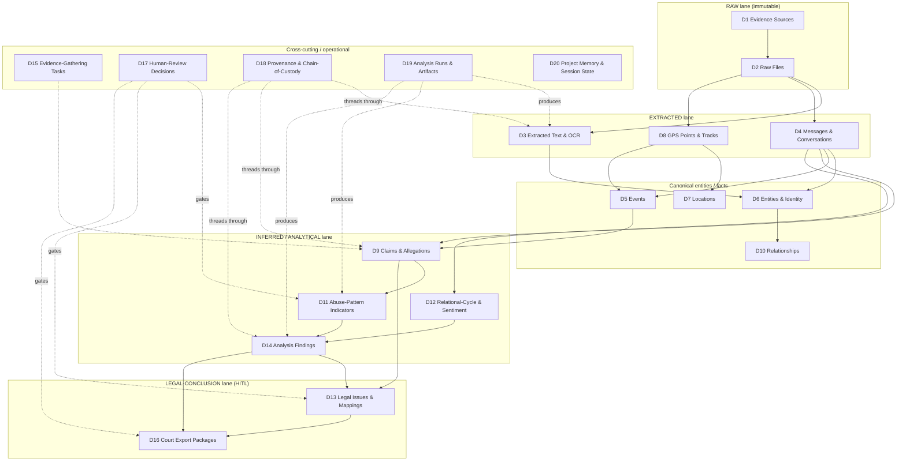

**Store ownership at a glance** (detail in Schema Strategy section; topology is the four-resource
HARD CONSTRAINT, CONTEXT_PACK §1):

| Store (resource) | Domains it primarily owns |
|---|---|
| **PostgreSQL + PostGIS + pg_duckdb** (one unified resource) | D1–D10, D13–D20 system-of-record rows; PostGIS owns geometry in D7/D8; pg_duckdb does analytical scans over R2 raw for D3/D8/D14/D16 |
| **Milvus** (vector, separate resource) | Embeddings/ANN for D3 text, D4 message bodies, D11 patterns, code/KB — 1 collection per embedder (ADR-0026/0027) |
| **Neo4j + Graphiti/Semantica** (graph, separate resource) | Cognition/traversal view of D5/D6/D7/D9/D10 + bitemporal facts; salem_v3 nodes/edges live here, mirrored in PG |
| **SurrealDB** (separate resource, Phase D, ADR-0024) | Consolidated bitemporal analysis sink downstream of PG for D14/D12 (RATIFIED, not yet deployed) |
| **Cloudflare R2** (`nexus`, `casebible-*`, ADR-0007/0030) | The actual bytes for D2 raw files; pg_duckdb/rclone reach |

---

### 4.2 Domain catalog

Each domain below follows: **what it is → lane → prior work adopted (crosswalk) → primary store →
key relationships → confidence/provenance/temporal notes → guardrails.**

#### D1 — Evidence Sources
- **What it is.** The *origin* of evidence: a device, account, export, custodian, or platform from
  which raw files came (e.g., "Pixel SMS backup", "Google Takeout 2024-11", "Facebook DYI archive",
  "screenshot batch from counsel"). One source produces many raw files.
- **Lane.** RAW (descriptive provenance metadata).
- **Adopts.** Semantica `source_hash` provenance model; the chain-of-custody column contract
  (CONTEXT_PACK §3). Google raw-export JSON shape preserved verbatim as the RAW EVIDENCE contract.
- **Store.** PostgreSQL (system of record). Bytes referenced in R2.
- **Relationships.** `1 Source → N Raw Files (D2)`; every downstream object traces here via D18.
- **Confidence/provenance/temporal.** Capture custodian, acquisition method, acquisition timestamp
  (with precision_class — exports often give only a date), tool/version used, and an integrity hash
  of the export container. knowledge_time = ingest.
- **Guardrails.** Source authenticity feeds MRE-authentication later; never overwrite an acquisition
  record — re-acquisitions create a new source version.

#### D2 — Raw Files
- **What it is.** The immutable, byte-preserved artifacts: XML/JSON exports, PDFs, images, audio,
  call-log dumps, chat-export JSONL. The forensic anchor everything else derives from.
- **Lane.** RAW (immutable).
- **Adopts.** `UUIDv7 + SHA-256 chain-of-custody`; `normalized_messages` universal raw-JSON-landing
  design (raw XML → `raw_data` JSON) so any format lands losslessly before typing (CONTEXT_PACK §3).
- **Store.** Bytes in **R2** (ADR-0007/0030); metadata + SHA-256 + pointer rows in **PostgreSQL**;
  pg_duckdb reads file contents directly from R2 for analytical extraction.
- **Relationships.** `N Raw Files → 1 Source (D1)`; `1 Raw File → N Extracted Text / Messages / GPS`.
- **Confidence/provenance/temporal.** SHA-256 at ingest = tamper seal; store MIME, byte size, original
  filename/path, embedded timestamps (EXIF/file mtime) each with precision_class. valid_time often
  absent on a file; knowledge_time = ingest.
- **Guardrails.** Never edit or re-encode; derived/cleaned copies are EXTRACTED, not raw. Never-delete
  → `_stale/`. Raw forensic/abuse bytes stay local / CPU-only — never sent to external cloud
  extractors (CONTEXT_PACK §4).

#### D3 — Extracted Text & OCR
- **What it is.** Deterministic text pulled from raw files: OCR of screenshots, PDF text layers,
  parsed message bodies, transcript text; plus document-intelligence chunking
  (sections/chunks/spans).
- **Lane.** EXTRACTED (re-derivable; OCR confidence carried).
- **Adopts.** `screenshots` (OCR = extracted) from TraceIQ V4.1; **doc-intelligence tables**
  (sections/chunks/spans/entities/findings/approvals); parsers (enhanced-xml-chunker with base64
  images, iMessage/GVoice/FB-PDF parsers, chat-export JSONL) from `extracted-code/MANIFEST.md`.
- **Store.** Text + chunk rows in **PostgreSQL**; **Milvus** holds chunk/body embeddings (1 collection
  per embedder); pg_duckdb may bulk-extract from R2.
- **Relationships.** `N → 1 Raw File (D2)`; feeds D6 entities, D4 messages, D9 claims.
- **Confidence/provenance/temporal.** Carry OCR/parse confidence score, extractor name+version,
  prompt/model version if a model assisted. precision_class on any timestamps recovered from text
  (often `inferred`/`uncertain`). knowledge_time = run time.
- **Guardrails.** Keep extracted text separate from the raw image; preserve the exact extractor
  version so re-runs are comparable, never overwritten (Constraints 2438/2470).

#### D4 — Messages & Conversations
- **What it is.** Normalized communications across platforms (SMS/MMS, iMessage, FB/Messenger, Google
  Voice, Snapchat, chat exports) and the threads/conversations grouping them. Highest-volume,
  highest-value evidentiary domain in this case.
- **Lane.** EXTRACTED (from raw exports) — message *content* is fact; tone/intent is INFERRED (D12).
- **Adopts.** TraceIQ V4.1 `messages` (link to timeline; `is_private` → review gate) + Milvus body
  embeddings; `social_action`. Reconcile typed `messages` with the `normalized_messages`
  universal-landing design (raw XML → `raw_data` JSON, platform-hop reconstruction).
  `sms_backup_parser` blocked-call type 5/6 handling preserved.
- **Store.** Rows in **PostgreSQL**; body embeddings in **Milvus**; thread/contact graph view in Neo4j.
- **Relationships.** `N Messages → 1 Conversation`; `→ 1 Raw File (D2)`; participants → D6 entities;
  links to D5 events and D9 claims; `is_private` flag → D17 review gate.
- **Confidence/provenance/temporal.** Sent/received timestamps with precision_class and source
  timezone; platform-hop provenance (a message forwarded/exported across apps). valid_time = send
  time; knowledge_time = ingest. Direction (inbound/outbound) is a fact, not an inference.
- **Guardrails.** `is_private`/intimate content gated for review before export. Model BOTH parties'
  messages including the user's own; do not pre-filter to one side (Constraints 2431–2433, 2456). Body
  embeddings computed locally (≤4B) for sensitive content.

#### D5 — Events
- **What it is.** Time-anchored occurrences: incidents, visits, calls, meetings, exchanges of the
  child, trips. The temporal spine that messages, locations, and claims attach to.
- **Lane.** Mixed — RAW/EXTRACTED for logged events (a call-log entry), INFERRED for reconstructed
  events (an "overnight stay" inferred from GPS).
- **Adopts.** salem_v3 `Incident`/`Event` (mirrored PG↔Neo4j); TraceIQ `timeline_enriched` →
  **split** into `timeline_event` (raw vs enriched) with TEXT timestamps → `timestamptz` +
  precision_class; raw `visits/activities/paths/trips`.
- **Store.** **PostgreSQL** system-of-record; **Neo4j** for traversal/causal-temporal reasoning;
  SurrealDB downstream for bitemporal analysis (Phase D).
- **Relationships.** Events ↔ D4 messages, ↔ D7 locations, ↔ D8 GPS, ↔ D6 participants, ↔ D9 claims;
  salem edges `WAS_AT`, `PARTICIPATED_IN`.
- **Confidence/provenance/temporal.** Strict split of **raw event** vs **enriched event**; every event
  timestamp carries precision_class; inferred events carry the run + method that produced them.
- **Guardrails.** Inferred events (overnight/home_base/anomaly) must never be presented as logged
  facts; keep the inference lane visible.

#### D6 — Entities & Identity Resolution
- **What it is.** People, organizations, accounts, devices, phone numbers, handles — plus the
  identity-resolution records that merge aliases into a canonical entity (three phone numbers + two FB
  handles = one person).
- **Lane.** EXTRACTED (observed identifiers) + INFERRED (the merge is a model/human judgment).
- **Adopts.** salem_v3 `Person` (MERGE with TraceIQ `people`); `map-entities`/`ontology` skills;
  Semantica NER. Entity aliases + identity-resolution records (CONTEXT_PACK §5).
- **Store.** **PostgreSQL** canonical rows; **Neo4j** as the entity graph (Graphiti substrate);
  optional name embeddings in Milvus for fuzzy match.
- **Relationships.** `1 Entity → N Aliases`; identity-resolution record links N observed identifiers →
  1 canonical entity with a confidence + reviewer; participants join entities to messages/events.
- **Confidence/provenance/temporal.** Merge confidence + method (deterministic key vs model);
  bitemporal — an alias can be valid for a period; merges are versioned, never destructive.
- **Guardrails.** A wrong merge mis-attributes statements; merges above a confidence threshold and any
  merge affecting court output go through D17 review.

#### D7 — Locations
- **What it is.** Canonical places (home, school, the other parent's residence, exchange points) with
  geometry and a dedup key — distinct from raw GPS pings.
- **Lane.** EXTRACTED (geocoded) + canonicalized.
- **Adopts.** salem_v3 `Location` (PostGIS geom); TraceIQ `geocode_resolution` (dual-provider
  `disagreement_flag`/`tie_break_reason`), append-only `geocode_audit`, `location_key` dedup.
- **Store.** **PostgreSQL + PostGIS** (geometry, spatial index); geocode audit append-only in PG.
- **Relationships.** `1 Location → N GPS points (D8)`, ↔ events, ↔ entities (residence-of).
- **Confidence/provenance/temporal.** Dual-provider geocode with disagreement flag + tie-break reason;
  precision_class on coordinates (rooftop vs centroid vs inferred); append-only geocode_audit preserves
  every resolution attempt.
- **Guardrails.** Never collapse a disagreement silently; keep both providers' results.

#### D8 — GPS Points & Tracks
- **What it is.** Raw location pings and the tracks/paths/trips reconstructed from them.
- **Lane.** RAW (the ping) → EXTRACTED (geocoded) → INFERRED (track/trip/home-base/overnight).
- **Adopts.** TraceIQ raw `paths/trips/visits/activities`; Google Takeout JSON shape verbatim;
  inferred `home_base`/overnight/anomaly logic kept in the INFERRED lane.
- **Store.** **PostgreSQL + PostGIS** (point + linestring geometry, GiST index); pg_duckdb for
  large-scan analytics over R2-stored raw location dumps.
- **Relationships.** `N points → 1 track`; tracks → events (D5), → locations (D7).
- **Confidence/provenance/temporal.** Each ping carries accuracy radius + precision_class; tracks carry
  the inference run + parameters; valid_time = ping time, knowledge_time = ingest.
- **Guardrails.** Inferred stays/overnights are hypotheses, not proof of presence; corroboration status
  tracked. Location data is highly sensitive — local processing only.

#### D9 — Claims & Allegations
- **What it is.** Assertions about what happened — both **claims** (a stated fact, by either party,
  with support status) and **allegations** (a contested assertion; allegation ≠ fact). The bridge
  between evidence and legal relevance.
- **Lane.** INFERRED/ANALYTICAL — explicitly *not* fact until corroborated.
- **Adopts.** salem_v3 `Statement` + `MADE_STATEMENT`, and the impeachment edge `CONTRADICTS`;
  PRESERVE-AS-HYPOTHESIS posture for `USED_TACTIC`/`EXPLOITED_VULNERABILITY`/`DISPARAGES`.
- **Store.** **PostgreSQL** rows; **Neo4j** for contradiction/support graph traversal.
- **Relationships.** Claim → supporting/contradicting evidence (D2/D3/D4); claim → events (D5); claim →
  legal issues (D13); `CONTRADICTS` links claims to each other.
- **Confidence/provenance/temporal.** Support status (`unsupported | corroborated | contradicted`), who
  asserted it, when asserted (valid_time) vs when recorded (knowledge_time); every claim links to its
  evidence basis (or explicitly records "no corroboration yet").
- **Guardrails.** Never promote a claim to a fact (Constraints 2469); flag what *requires corroboration
  before use* and what is *emotionally important but may not be legally useful* (2471–2472). Model the
  user's own claims/accountability items too, in temporal context.

#### D10 — Relationships (Relationship Assertions)
- **What it is.** Typed relationships between entities and between facts: parent-of, co-parent,
  resides-with, was-at, participated-in, and the *asserted* relational dynamics.
- **Lane.** EXTRACTED for structural relations (parent-of); INFERRED/HYPOTHESIS for dynamic ones.
- **Adopts.** salem_v3 edges — ADOPT `WAS_AT`, `PARTICIPATED_IN`, `MADE_STATEMENT`, `CONTRADICTS`,
  `EXPOSED_CHILD`, `AFFECTED_PARENTING_ACCESS` (custody, renamed); **SPLIT** vague `RELATED_TO` into
  typed causal/temporal/topical edges; PRESERVE-AS-HYPOTHESIS the sensitive edges.
- **Store.** **Neo4j** (native graph) as primary; mirrored relationship-assertion rows in **PostgreSQL**.
- **Relationships.** Connects D6 entities, D5 events, D9 claims; bitemporal edges in the Graphiti
  substrate.
- **Confidence/provenance/temporal.** Each assertion carries confidence, a valid_time interval (a
  relationship can start/end), and provenance; structural vs dynamic relations kept in separate lanes.
- **Guardrails.** Sensitive/dynamic edges are hypotheses requiring HITL before court use; structural
  edges (parent-of) are facts.

#### D11 — Abuse-Pattern Indicators
- **What it is.** Detected behavioral indicators across messages/events — the *signal* layer beneath
  any sensitive label (DARVO turns, control indicators, MCL-relevant behaviors).
- **Lane.** INFERRED (detector output) → never auto-promoted to LEGAL-CONCLUSION.
- **Adopts.** **The real prior art** from `extracted-code/MANIFEST.md`: `detection_patterns.py`
  (256-pattern, MCL A–L, 18 categories, DARVO), `behavioral_patterns.ttl`, `seed-patterns.ts (~303)` +
  patterns-schema, `hurtlex_loader`; salem `Vulnerability`/`Tactic`/`BehavioralPattern` (ADAPT,
  sensitive). **`positive_behaviors.ttl`** is adopted here too, to satisfy the both-parties /
  full-relational-cycle guardrail — do NOT invent new node types.
- **Store.** **PostgreSQL** finding rows; **Milvus** for pattern-similarity search over message bodies.
- **Relationships.** Indicator → message/event evidence; indicator → pattern finding (D14) → legal
  issue (D13); both negative *and* positive indicators.
- **Confidence/provenance/temporal.** Detector name+version, pattern/ontology version, match confidence,
  exact evidence span; append-only so re-runs with newer detectors are comparable.
- **Guardrails.** Indicators are not labels. The label-promotion step (gaslighting, coercive control,
  alienation, reactive abuse, weaponization) is a **separate LEGAL-CONCLUSION** requiring D17 review
  (Constraints 2448/2464). Must include positive/neutral/affectionate/love-bombing indicators, not only
  abusive ones (2431–2433).

#### D12 — Relational-Cycle & Sentiment (multi-lane tone model)
- **What it is.** The relationship-cycle and tone model: surface tone, inferred intent, relational
  function, and cycle phase (positive / neutral / affectionate / ordinary / love-bombing / tension /
  incident / repair) — modeled **separately**, not as one sentiment score.
- **Lane.** INFERRED/ANALYTICAL.
- **Adopts.** `positive_behaviors.ttl` (full-cycle), behavioral-pattern-analyzer skill; directly
  realizes Constraints 2432–2433 ("support surface tone, inferred intent, relational function, cycle
  phase, and surrounding temporal context separately"). Promoted to its own domain — **flagged**, §4.4.
- **Store.** **PostgreSQL**; SurrealDB downstream for cycle-over-time analysis (Phase D).
- **Relationships.** Attaches to D4 messages and D5 events; feeds D14 findings.
- **Confidence/provenance/temporal.** Each axis scored independently with its own confidence; phase
  assignment carries surrounding temporal-context window; valid_time = message/event time.
- **Guardrails.** Avoid one-sided sentiment; never reduce to a single positive/negative number;
  preserve contrast over time as analytically important.

#### D13 — Legal Issues & Mappings
- **What it is.** The legal-relevance layer: MCL best-interest factors (722.23 A–L), custody/parenting
  issues, and the mapping of evidence/claims/findings → those issues.
- **Lane.** LEGAL-CONCLUSION (HITL-gated).
- **Adopts.** `mcl_722_23.ttl` (12 MCL factors), `mcl-factor-mapper` + `irac-formatter` skills; salem
  `AFFECTED_PARENTING_ACCESS`/`EXPOSED_CHILD` as inputs.
- **Store.** **PostgreSQL** mapping rows; Neo4j for issue↔evidence traversal.
- **Relationships.** Legal issue ← claims (D9), findings (D14), patterns (D11), events (D5); → export
  packages (D16).
- **Confidence/provenance/temporal.** Each mapping records the human reviewer, the rationale, the
  ontology version of the factor set, and the strength of support; versioned.
- **Guardrails.** No factor mapping reaches court output without D17 review; avoid legal advice —
  organize evidence-to-issue, do not opine on outcomes (Constraints 2426/2466). Frame toward
  "structure, safety, clarity, child stability" over blame (2468).

#### D14 — Analysis Findings
- **What it is.** Curated, higher-order findings synthesized from claims, patterns, cycle, and timeline
  — the analyst-facing conclusions (e.g., "pattern of access pressure around exchanges, Q3 2024",
  contradiction clusters, timeline gaps).
- **Lane.** ANALYTICAL.
- **Adopts.** TraceIQ `vw_forensic_evidence_package` (HIGH/MED/LOW confidence tiers); Semantica
  conflict-detection; doc-intelligence `findings`.
- **Store.** **PostgreSQL** (views + materialized finding rows); pg_duckdb for the analytical scans;
  **SurrealDB** as the consolidated bitemporal analysis sink (Phase D, ADR-0024).
- **Relationships.** Finding ← (claims, patterns, cycle, events); finding → legal issue (D13) → export
  (D16); each finding cites its evidence basis.
- **Confidence/provenance/temporal.** HIGH/MED/LOW confidence tier; full lineage to source evidence,
  run, prompt+ontology+schema versions; versioned (re-analysis creates a new version, prior preserved).
- **Guardrails.** Findings are analytical, not legal conclusions; corroboration status explicit;
  preserve prior interpretations, never overwrite (Constraints 2470).

#### D15 — Evidence-Gathering Tasks
- **What it is.** The work-tracking domain: open questions, "need to obtain X", corroboration to-dos,
  follow-ups generated by analysis ("this claim is uncorroborated — obtain the call log").
- **Lane.** Operational (ANALYTICAL-adjacent).
- **Adopts.** New, but driven by D9 corroboration-status and D14 gaps; integrates with the
  casebible-coordination board / autonomy protocol (MEMORY index).
- **Store.** **PostgreSQL**.
- **Relationships.** Task → the claim/finding/gap that spawned it; task → resulting new source (D1).
- **Confidence/provenance/temporal.** Task status, created-by (human/agent + run), due/priority;
  append-only status history.
- **Guardrails.** Tasks capture *what still needs corroboration before use* (Constraints 2471) so gaps
  are explicit rather than silently filled.

#### D16 — Court Export Packages
- **What it is.** Assembled, review-ready, court-facing evidence packages — the system's terminal
  deliverable. A package bundles selected evidence, claims, findings, and legal mappings into a
  citable, provenance-complete export.
- **Lane.** LEGAL-CONCLUSION (HITL-gated, strictest gate).
- **Adopts.** TraceIQ `vw_forensic_evidence_package` (confidence-tiered, HITL); evidence-review /
  mre-authentication / source-audit skills for assembly + authentication checks.
- **Store.** **PostgreSQL** package + manifest rows; rendered artifacts (PDF/bundle) in **R2**.
- **Relationships.** Package ← selected D2/D3/D4/D5/D9/D14/D13 items; every included item must carry
  full D18 provenance and a D17 approval.
- **Confidence/provenance/temporal.** Immutable, versioned snapshot at export time; manifest records
  every included object's hash + lineage; a package is reproducible from its manifest.
- **Guardrails.** Every export passes through the **review-gatekeeper** agent (CONTEXT_PACK §4) and D17
  approval; court-safe language only; no allegation presented as fact; flags what *could be
  strategically dangerous if presented without context* (Constraints 2473). Generated as factual
  summaries, not legal advice (2466).

#### D17 — Human-Review Decisions
- **What it is.** The append-only record of every HITL decision: approvals, rejections, sensitive-label
  sign-offs, identity-merge confirmations, export releases. The audit backbone of every gate.
- **Lane.** Cross-cutting (governs LEGAL/sensitive lanes).
- **Adopts.** doc-intelligence **`approvals`** table; review-gatekeeper agent flow; casebible
  `APPROVALS.md` gating model.
- **Store.** **PostgreSQL** (append-only).
- **Relationships.** A decision references the exact object+version it approved (pattern label, merge,
  factor mapping, export) and the reviewer identity.
- **Confidence/provenance/temporal.** Reviewer, timestamp, decision, rationale, the object version
  reviewed; never updated in place — a reversal is a new decision.
- **Guardrails.** Required before any sensitive label, legal mapping, or court export becomes releasable
  (Constraints 2427/2448). Decisions are themselves evidence of process integrity.

#### D18 — Provenance & Chain-of-Custody
- **What it is.** The connective tissue: every derived object's link back to source evidence, processing
  run, prompt version, ontology version, schema version, and review decision; plus the SHA-256 custody
  chain on raw bytes.
- **Lane.** Cross-cutting (mandatory on all non-RAW objects).
- **Adopts.** `UUIDv7 + SHA-256 chain-of-custody` column contract; Semantica PROV-O model +
  `source_hash` (CONTEXT_PACK §3).
- **Store.** **PostgreSQL** (provenance edges/columns); mirrored as PROV-O in **Neo4j** via Semantica.
- **Relationships.** Threads through D3, D4, D9, D11, D12, D14, D16 — anything derived.
- **Confidence/provenance/temporal.** Append-only lineage; bitemporal (valid + knowledge time); enables
  "trace any final output back to source" (Constraints 2436/2452).
- **Guardrails.** No derived object may exist without provenance; lineage is immutable.

#### D19 — Analysis Runs & Artifacts (intermediate work products)
- **What it is.** Every processing run and its intermediate outputs: scans, drafts, indexes,
  classifications, prompt versions, tool-call outputs, generated artifacts — kept, not discarded.
- **Lane.** Cross-cutting (the "rough work" lane, kept separate from canonical facts).
- **Adopts.** Constraints 2434–2438 / 2450–2455 (persist intermediate work products); analysis-runs +
  artifact-lineage; ties to prompt/ontology/schema-version registries.
- **Store.** **PostgreSQL** run+artifact metadata; large artifacts in **R2**; embeddings (if any) in
  Milvus.
- **Relationships.** Run → the extracted/inferred/analytical objects it produced (D3/D11/D14); artifact
  → its run; run → prompt/ontology/schema versions.
- **Confidence/provenance/temporal.** Run id (UUIDv7), inputs, parameters, model/prompt version,
  start/end, status; append-only.
- **Guardrails.** Do not discard artifacts unless intentionally archived with a reason (Constraints
  2435/2451); keep model-generated interpretations separate from canonical evidence facts (2437/2453).

#### D20 — Project Memory & Session State
- **What it is.** The cross-session memory layer so work resumes without losing context: project facts,
  decisions, handoffs, the recall index — distinct from case evidence.
- **Lane.** Operational (NOT evidence; never mixed into evidentiary lanes).
- **Adopts.** Graphiti KG memory (Neo4j), `.remember` handoffs, auto-memory `MEMORY.md`,
  casebible-coordination board (CLAUDE.md / MEMORY index, CONTEXT_PACK §4).
- **Store.** **Neo4j** (Graphiti) + PostgreSQL/markdown indexes; per the Memory Architecture doc.
- **Relationships.** References decisions/ADRs/sessions; intentionally *isolated* from D1–D18 case data.
- **Confidence/provenance/temporal.** Bitemporal in Graphiti; SSOT docs win on conflict.
- **Guardrails.** Project memory may use the graph cognition substrate, but **raw case evidence is never
  fed to external/cloud entity extractors** (CONTEXT_PACK §4) — keep the memory lane and the evidence
  lane separate.

---

### 4.3 Domain → lane → store → crosswalk summary

| # | Domain | Primary lane(s) | Primary store | Key prior work adopted |
|---|---|---|---|---|
| D1 | Evidence Sources | RAW | PostgreSQL (+R2) | Semantica source_hash; custody contract |
| D2 | Raw Files | RAW (immutable) | R2 bytes + PG meta | UUIDv7+SHA-256; normalized_messages landing |
| D3 | Extracted Text & OCR | EXTRACTED | PG + Milvus | screenshots/OCR; doc-intel; parsers |
| D4 | Messages & Conversations | EXTRACTED | PG + Milvus + Neo4j | TraceIQ V4.1 messages; sms/GVoice/FB parsers |
| D5 | Events | RAW/EXTRACTED/INFERRED | PG + Neo4j | salem Incident/Event; timeline_event split |
| D6 | Entities & Identity | EXTRACTED + INFERRED | PG + Neo4j (+Milvus) | salem Person; TraceIQ people; map-entities |
| D7 | Locations | EXTRACTED | PG + PostGIS | salem Location; geocode_resolution/audit |
| D8 | GPS Points & Tracks | RAW→EXTRACTED→INFERRED | PG + PostGIS (+pg_duckdb) | TraceIQ paths/trips/visits; Takeout shape |
| D9 | Claims & Allegations | INFERRED/ANALYTICAL | PG + Neo4j | salem Statement/CONTRADICTS; hypothesis posture |
| D10 | Relationships | EXTRACTED + HYPOTHESIS | Neo4j + PG | salem edges; SPLIT RELATED_TO |
| D11 | Abuse-Pattern Indicators | INFERRED | PG + Milvus | detection_patterns.py; *.ttl; positive_behaviors |
| D12 | Relational-Cycle & Sentiment | INFERRED/ANALYTICAL | PG (+SurrealDB) | positive_behaviors.ttl; behavioral-pattern-analyzer |
| D13 | Legal Issues & Mappings | LEGAL-CONCLUSION (HITL) | PG + Neo4j | mcl_722_23.ttl; mcl-factor-mapper; irac |
| D14 | Analysis Findings | ANALYTICAL | PG + pg_duckdb + SurrealDB | vw_forensic_evidence_package; Semantica conflict |
| D15 | Evidence-Gathering Tasks | Operational | PostgreSQL | corroboration-driven; coordination board |
| D16 | Court Export Packages | LEGAL-CONCLUSION (HITL) | PG + R2 | vw_forensic_evidence_package; evidence-review |
| D17 | Human-Review Decisions | Cross-cutting (gate) | PostgreSQL (append-only) | doc-intel approvals; review-gatekeeper |
| D18 | Provenance & Chain-of-Custody | Cross-cutting (mandatory) | PG + Neo4j (PROV-O) | UUIDv7+SHA-256; Semantica PROV-O |
| D19 | Analysis Runs & Artifacts | Cross-cutting (rough work) | PG + R2 (+Milvus) | intermediate-work constraints; lineage registry |
| D20 | Project Memory & Session State | Operational (non-evidence) | Neo4j/Graphiti + PG | Graphiti; .remember; MEMORY.md |

**Lane-flow invariant (must hold across all domains):**

```mermaid
flowchart LR
  RAW["RAW<br/>D1 D2 (+D5/D8 logged)"] --> EXTRACTED["EXTRACTED<br/>D3 D4 D6 D7 D8"]
  EXTRACTED --> INFERRED["INFERRED<br/>D5* D9 D10* D11 D12"]
  INFERRED --> ANALYTICAL["ANALYTICAL<br/>D14"]
  ANALYTICAL --> LEGAL["LEGAL-CONCLUSION (HITL)<br/>D13 D16"]
  HITL["D17 Human Review"] -. gates .-> LEGAL
  HITL -. gates .-> INFERRED
  PROV["D18 Provenance"] -. attaches to every non-raw .-> EXTRACTED
  PROV -. .-> INFERRED
  PROV -. .-> ANALYTICAL
  PROV -. .-> LEGAL
```

A record may move *up* lanes only by creating a new, higher-lane object that cites the lower one —
**never** by mutating the original (Constraints 2469/2470).

---

### 4.4 Needs-human-review / gaps flagged in this section

1. **D12 (Relational-Cycle & Sentiment) is promoted to a first-class domain** even though the master
   prompt's domain bullet list (offset 1929) does not name it explicitly. Justification: global
   Constraints 2432–2433 *require* separate modeling of surface tone, inferred intent, relational
   function, and cycle phase, and CONTEXT_PACK §3/§6 require modeling the full relational cycle with
   `positive_behaviors.ttl`. **Reviewer: confirm D12 should stand alone vs. fold into D11.**
2. **`normalized_messages` (universal raw-JSON landing) vs. typed `messages` (TraceIQ V4.1)** must be
   reconciled in the Canonical Data Model — CONTEXT_PACK §3 explicitly leaves this open ("reconcile vs
   typed messages"). Flagged here so the next section resolves it; both are referenced in D2/D4.
3. **SurrealDB-owned domains (parts of D12/D14) are Phase-D / RATIFIED-not-deployed** (ADR-0024). Until
   deployed, those analyses live in PostgreSQL/pg_duckdb; this section assigns ownership but the build
   sequence must not assume SurrealDB is available at MVP.


---


## Canonical Data Model (the big one)

> _Byline: Claude Code · Opus 4.8 (1M) · 2026-06-30_
>
> This is the implementation-grade relational schema for the forensic-evidence DB. It is the
> **single largest deliverable** and the spine the rest of the package hangs from. It lives in the
> **unified relational/analytical/spatial resource** — PostgreSQL 18 + PostGIS + embedded DuckDB via
> `pg_duckdb`, the custom image `agno-postgres:18-duckdb` (**ADR-0013**, supersedes ADR-0003; LIVE).
> Vector bodies/OCR go to **Milvus** (ADR-0027), cognition/edges to **Neo4j+Graphiti** (ADR-0014/0018/0031),
> downstream consolidated analysis to **SurrealDB** (ADR-0024, Phase D). Those projections are described
> in sections 05/06/07; PG is the **system of record** and the only court-export source of truth.
>
> **Not a blank slate.** Every table below adopts/adapts the user's prior work per the A3 crosswalk —
> `salem_v3.py` (Salem v. Kinzel KG ontology), TraceIQ V4.1 (`timeline_enriched`, `messages`, `people`,
> `screenshots`, geocode stack), `normalized_geo_schema_v5`, the chunker parser configs, and the
> Semantica/doc-intelligence provenance pattern. Adoption is cited inline and consolidated in §12.

---

### 0. Design contract (binds every table in this section)

These conventions are assumed in every DDL block; they are stated once here, not repeated per table.

| # | Convention | Rule | Source / rationale |
|---|---|---|---|
| C1 | **Schemas (namespaces)** | Ten PostgreSQL schemas, one per concern: `custody`, `evidence`, `entity`, `timeline`, `temporal`, `geo`, `multimodal`, `analysis`, `legal`, `provenance`. | Mirrors §02 domain catalog D1–D20; one home per concern. |
| C2 | **Primary keys** | Every table PK is `id uuid PRIMARY KEY DEFAULT uuidv7()` (time-ordered, native to the PG18 image). | ADR-0013 native `uuidv7()`; adopts the "UUIDv7 + SHA-256 chain-of-custody column contract" (A3/MANIFEST). |
| C3 | **Evidence-lane tier** | Most rows carry `data_tier evidence_tier NOT NULL`. Enum `evidence_tier = ('raw','extracted','inferred','analytical','legal_conclusion')`. The tier is **structurally enforced** — raw tables only hold `raw`; findings only hold `inferred`/`analytical`/`legal_conclusion`. | Guardrail (CONTEXT_PACK §6; MP Constraints 2420). Lane discipline from A3 §149. |
| C4 | **Timestamp-precision class** | Every business timestamp pairs with `ts_precision precision_class` = `('exact','approximate','inferred','uncertain')` plus an interval window. **This was missing from ALL prior schemas (A3 §152) and is mandatory.** Deep mechanics in §08. | MP 2421; CONTEXT_PACK §3. |
| C5 | **Bitemporal columns** | Interpretable rows carry **valid time** (`valid_from`, `valid_to`) and **transaction time** (`sys_period tstzrange DEFAULT tstzrange(now(),NULL)`), maintained append-only via `temporal.*` (§5) and the `provenance` audit (§10). Never overwrite an interpretation; supersede it. | MP 1659–1663, 592–622; guardrail "preserve prior interpretations." |
| C6 | **Provenance FK** | Every derived (non-`raw`) row has `provenance_id uuid NOT NULL REFERENCES provenance.provenance(id)`. Raw rows anchor provenance through `custody.source`. Nothing derived exists without a traceable chain back to source evidence. | MP 1853, 2422; Semantica `source_hash` pattern (A3 §58). |
| C7 | **Confidence is multi-axis, never one number** | Where relevant a row carries separate `temporal_confidence`, `spatial_confidence`, `evidence_confidence`, `analysis_confidence` (`numeric(4,3)` in `[0,1]`), plus `evidence_strength strength_class`. | MP 1636–1638, 1811, 1863. |
| C8 | **HITL gates** | Sensitive rows carry `requires_human_review boolean`, `review_status review_state` = `('unreviewed','in_review','approved','rejected','needs_more_evidence')`, and `safe_for_legal_use boolean DEFAULT false`. No abuse-label/legal-conclusion row is court-eligible until `review_status='approved' AND safe_for_legal_use`. | MP 1818–1820, 2427/2448; CONTEXT_PACK §6. |
| C9 | **Balanced modeling is built into the model, not a flag** | The relational-cycle (§8.1) and reactive-context (§8.2) tables are **first-class**, not optional add-ons, so positive/neutral/love-bombing/repair and the user's own conduct are representable everywhere a message or event is. | MP 404–497, 500–685; guardrail "model BOTH parties / FULL relational cycle." |
| C10 | **Append-only history** | Anything that can change interpretation (geocode decisions, findings, interpretations, redactions, exports, custody) is append-only / versioned, never updated-in-place. Adopts TraceIQ `geocode_audit` and `original_json` patterns. | MP 2438; A3 §116/§154. |
| C11 | **Raw payload preserved verbatim** | Raw tables keep the untouched source blob in `raw_data jsonb` (or object-store URI for binaries). Google Takeout JSON shape and message-export XML are kept **byte-faithful**. | A3 §126 (Google raw = RAW EVIDENCE contract); CONTEXT_PACK §3. |
| C12 | **Naming** | `snake_case`; tables singular; FK columns `<referent>_id`; enums `*_class`/`*_state`/`*_type`; PostGIS columns `geom`/`geog`. | house style. |

#### 0.1 Shared enumerated types (created once)

```sql
CREATE TYPE evidence_tier   AS ENUM ('raw','extracted','inferred','analytical','legal_conclusion');
CREATE TYPE precision_class AS ENUM ('exact','approximate','inferred','uncertain');
CREATE TYPE strength_class  AS ENUM ('none','weak','moderate','strong','conclusive');
CREATE TYPE review_state    AS ENUM ('unreviewed','in_review','approved','rejected','needs_more_evidence');
CREATE TYPE conduct_party   AS ENUM ('user','partner','child','third_party','institution','unknown'); -- whole-record (MP 518-529)
CREATE TYPE cycle_phase     AS ENUM ('calm','tension_building','conflict','repair','reconciliation',
                                     'love_bombing','withdrawal','escalation','de_escalation','unknown'); -- MP 432-444
```

#### 0.2 Schema-at-a-glance (entity-relationship overview)

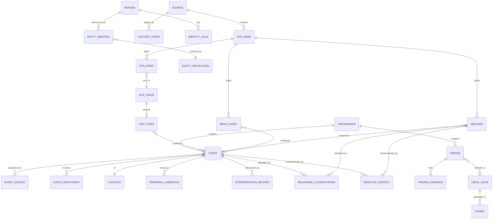

> Read order: **acquisition** (`custody`) → **extracted facts** (`evidence`, `geo`, `multimodal`, `entity`)
> → **events + time** (`timeline`, `temporal`) → **inferred/analytical** (`analysis`) → **legal/delivery**
> (`legal`) → **provenance cross-cuts all** (`provenance`). This matches the five lanes in §02.

---

### 1. `custody` — Sources & Chain of Custody (raw-evidence tier)

#### 1.1 `custody.source` — one row per acquired source item

**Purpose.** The custody anchor for every piece of evidence. Adopts/normalizes the provenance fields scattered across TraceIQ (`data_source`, `original_json`, `processed_at`) and the UUIDv7+SHA-256 custody contract (A3 §61). Everything downstream traces here.

| Column | Type | Notes |
|---|---|---|
| `id` | `uuid PK uuidv7()` | Source ID (MP 1549). |
| `source_type` | `text NOT NULL` | MP 1550 — e.g. `google_takeout`, `sms_xml_backup`, `fb_messenger_html`, `imessage_pdf`, `gvoice`, `snapchat`, `screenshot_set`, `security_cam`, `ai_transcript`, `device_extraction`. |
| `original_path` | `text` | Original file path **or** R2/S3 object URI (MP 1551). pg_duckdb reads S3 via account-wide secret (ADR-0030). |
| `object_uri` | `text` | Canonical R2 URI (`r2://nexus/...` or `casebible-*`). |
| `hash_sha256` | `bytea NOT NULL` | Primary content hash (chain-of-custody contract). |
| `hash_md5`, `hash_blake3` | `bytea` | Secondary hashes (MD5 matches Case Bible catalog; A1). |
| `byte_size` | `bigint` | |
| `ingested_at` | `timestamptz NOT NULL DEFAULT now()` | Ingestion timestamp (MP 1553). **Distinct** from evidence-creation time (MP 1658). |
| `evidence_created_at` | `timestamptz` | When the evidence itself was created (capture time). |
| `evidence_created_precision` | `precision_class` | Precision of capture time (C4). |
| `acquisition_method` | `text` | MP 1554 — `manual_export`, `adb_pull`, `cloud_api`, `physical_image`, `screenshot`, `subpoena_return`. |
| `device_origin_id` | `uuid REFERENCES entity.device(id)` | Device of origin (MP 1555). |
| `account_origin_id` | `uuid REFERENCES entity.account(id)` | Account of origin (MP 1555). |
| `custodian_id` | `uuid REFERENCES entity.person(id)` | Custodian (MP 1556). |
| `custody_status` | `text NOT NULL DEFAULT 'acquired'` | MP 1557 — `acquired`→`verified`→`processing`→`held`→`released`. |
| `legal_sensitivity` | `text` | MP 1558 — `none`/`work_product`/`privileged`/`sealed`. |
| `privacy_sensitivity` | `text` | MP 1559 — `none`/`pii`/`minor`/`health`/`intimate`. Drives redaction (§10). |
| `extraction_status` | `text DEFAULT 'pending'` | MP 1560. |
| `processing_status` | `text DEFAULT 'pending'` | MP 1561. |
| `review_status` | `review_state DEFAULT 'unreviewed'` | MP 1562. |
| `export_status` | `text DEFAULT 'not_exported'` | MP 1563. |
| `original_metadata` | `jsonb` | MP 1564 — verbatim source metadata. |
| `derived_metadata` | `jsonb` | MP 1565 — parser/tool-derived metadata. |
| `raw_data` | `jsonb` | C11 verbatim payload when small/JSON; large binaries live in object store. |
| `data_tier` | `evidence_tier NOT NULL DEFAULT 'raw'` | Always `raw` here. |

- **PK:** `id`.
- **FKs:** `device_origin_id`, `account_origin_id`, `custodian_id` → `entity.*`.
- **Indexes:** `UNIQUE(hash_sha256)` (dedup vs Case Bible catalog before ingest); `btree(source_type)`; `btree(ingested_at)`; `gin(original_metadata)`, `gin(derived_metadata)`.
- **Provenance/temporal:** this row *is* the raw-evidence custody anchor; `ingested_at` vs `evidence_created_at` enforce MP 1658.

#### 1.2 `custody.file_node` — recursive file/page/frame/OCR/message tree

**Purpose.** Models MP 1566's "parent-child relationships between files, pages, frames, screenshots, OCR text, messages, and extracted events." A single self-referencing tree so a Takeout zip → JSON file → segment → screenshot → OCR-text node → extracted message → extracted event chain is one navigable hierarchy.

| Column | Type | Notes |
|---|---|---|
| `id` | `uuid PK uuidv7()` | |
| `source_id` | `uuid NOT NULL REFERENCES custody.source(id)` | Root source. |
| `parent_id` | `uuid REFERENCES custody.file_node(id)` | Self-FK; NULL = top-level container. |
| `node_type` | `text NOT NULL` | `archive`/`file`/`page`/`frame`/`screenshot`/`ocr_text`/`segment`/`attachment`/`derived`. |
| `node_role` | `evidence_tier NOT NULL` | `raw` for files/pages/frames; `extracted` for OCR/segment nodes. |
| `relative_path` | `text` | Path within container. |
| `hash_sha256` | `bytea` | Per-node hash where applicable. |
| `mime_type` | `text` | |
| `page_or_frame_no` | `integer` | Page/frame ordinal. |
| `extracted_by_run_id` | `uuid REFERENCES provenance.processing_run(id)` | Which run produced an extracted node. |
| `payload_ref` | `text` | Object-store URI for binary children. |
| `meta` | `jsonb` | |

- **PK:** `id`. **FKs:** `source_id`, `parent_id` (self), `extracted_by_run_id`.
- **Indexes:** `btree(source_id)`; `btree(parent_id)`; `btree(node_type)`. Subtree queries via recursive CTE (or `ltree` materialized path if depth-heavy).
- **Provenance/temporal:** OCR/segment nodes carry `node_role='extracted'` and FK to the run — keeps raw frame distinct from extracted text (lane discipline).

#### 1.3 `custody.custody_event` — append-only chain-of-custody log

**Purpose.** Immutable audit of every custody action (acquire, hash-verify, transfer, hold, redact, export). Append-only (C10).

| Column | Type | Notes |
|---|---|---|
| `id` | `uuid PK uuidv7()` | |
| `source_id` | `uuid NOT NULL REFERENCES custody.source(id)` | |
| `action` | `text NOT NULL` | `acquired`/`hash_verified`/`transferred`/`held`/`redacted`/`exported`/`integrity_failed`. |
| `actor_id` | `uuid REFERENCES entity.person(id)` | Human or service principal. |
| `actor_kind` | `text` | `human`/`service`/`agent`. |
| `hash_before`,`hash_after` | `bytea` | Integrity proof across the action. |
| `occurred_at` | `timestamptz NOT NULL DEFAULT now()` | |
| `note` | `text` | |
| `provenance_id` | `uuid REFERENCES provenance.provenance(id)` | |

- **PK:** `id`. **FK:** `source_id`. **Indexes:** `btree(source_id, occurred_at)`. **Append-only** (no UPDATE/DELETE grants; enforced by trigger + role).

---

### 2. `evidence` — Message-Level Normalization (raw + extracted tiers)

#### 2.1 `evidence.message` — the normalized communication row

**Purpose.** One row per message / serialized communication item across SMS, FB Messenger, iMessage, Google Voice, Snapchat, GChat, email. **Adopts** TraceIQ V4.1 `messages` (A3 §97) and **reconciles** with the `normalized_messages` universal raw-JSON-landing design (A3 §60): the raw export payload is preserved verbatim in `raw_data`, the typed columns are the extracted normalization. Satisfies MP 1568–1602 in full.

| Column | Type | Notes / MP line |
|---|---|---|
| `id` | `uuid PK uuidv7()` | Message ID (1570). |
| `thread_id` | `uuid NOT NULL REFERENCES evidence.thread(id)` | Conversation/thread ID (1571). |
| `platform` | `text NOT NULL` | (1572) `sms`,`fb`,`imessage`,`gvoice`,`snapchat`,`gchat`,`email`. |
| `sender_entity_id` | `uuid REFERENCES entity.person(id)` | Sender (1573) — resolved identity. |
| `sender_raw` | `text` | Verbatim sender token before resolution (handle/number). |
| `source_id` | `uuid NOT NULL REFERENCES custody.source(id)` | Source file (1583). |
| `file_node_id` | `uuid REFERENCES custody.file_node(id)` | Exact node in the custody tree. |
| `screenshot_asset_id` | `uuid REFERENCES multimodal.media_asset(id)` | Screenshot reference if message came from an image (1584). |
| `raw_ts` | `text` | Verbatim timestamp string from export (1578) — never discarded (TraceIQ stores TEXT; A3 §30). |
| `ts_utc` | `timestamptz` | Normalized timestamp (1579). |
| `ts_precision` | `precision_class NOT NULL DEFAULT 'exact'` | (1581) C4. |
| `ts_earliest`,`ts_latest` | `timestamptz` | Window bounds for non-exact (→ §08). |
| `tz` | `text` | Timezone (1580); ambiguity handled per §08.6. |
| `temporal_confidence` | `numeric(4,3)` | (1581). |
| `relative_time_refs` | `jsonb` | Captured "last night"/"that weekend" phrases (1582) → resolved in `temporal.relative_time_expr`. |
| `body` | `text` | Message body (1586). |
| `ocr_text` | `text` | OCR text if from screenshot (1587), `data_tier='extracted'`. |
| `language` | `text` | (1588). |
| `surface_sentiment` | `text` | (1589 / 470) — surface tone ONLY; intent modeled separately. |
| `inferred_intent` | `text` | (1590) — distinct from surface sentiment (MP 456). |
| `topic` | `text` | (1591). |
| `domain_type` | `text` | (1592) — e.g. `parenting`,`finance`,`logistics`,`legal`. |
| `relevance` | `text` | (1593). |
| `custody_relevance` | `text` | (1594). |
| `abuse_pattern_relevance` | `text` | (1595) — **pointer only**; labels live in `analysis.finding` behind HITL. |
| `evidence_strength` | `strength_class` | (1596). |
| `extraction_confidence` | `numeric(4,3)` | (1597). |
| `is_private` | `boolean DEFAULT false` | Adopts TraceIQ `is_private` → **judicial/sensitive-review gate** (A3 §97). |
| `review_status` | `review_state DEFAULT 'unreviewed'` | (1598). |
| `data_tier` | `evidence_tier NOT NULL DEFAULT 'extracted'` | Body from a digital export can be `raw`; from OCR it is `extracted`. |
| `raw_data` | `jsonb` | C11 verbatim export object (normalized_messages landing). |
| `provenance_id` | `uuid NOT NULL REFERENCES provenance.provenance(id)` | C6. |
| `body_embedding_ref` | `text` | Milvus PK for body/OCR vector (ADR-0027); vector NOT stored in PG. |

**Balanced-cycle + reactive-context fields (MP 468–483, 625–656).** Rather than bolt ~40 sparse columns onto `message`, the per-message balanced classification and reactive context are **normalized into `analysis.relational_classification` (§8.1) and `analysis.reactive_context` (§8.2)**, both keyed by a polymorphic `(subject_type,subject_id)` so a message can carry *multiple* simultaneous classifications (MP 446–454: "positive in surface tone, manipulative in inferred intent, relevant to a reconciliation cycle"). The small always-single-valued hints (`surface_sentiment`, `inferred_intent`) stay inline above; everything multi-valued or sensitive is normalized + HITL-gated.

- **PK:** `id`.
- **FKs:** `thread_id`, `sender_entity_id`, `source_id`, `file_node_id`, `screenshot_asset_id`, `provenance_id`.
- **Indexes:** `btree(thread_id, ts_utc)`; `btree(platform)`; `btree(sender_entity_id)`; `btree(ts_utc)`; `gin(to_tsvector('english', coalesce(body,'')||' '||coalesce(ocr_text,'')))` (FTS) + `pg_trgm`; `gin(raw_data)`; partial `btree(id) WHERE is_private` (review queue).
- **Provenance/temporal:** `raw_ts` preserved verbatim alongside normalized `ts_utc`+`ts_precision`; OCR-sourced text flagged `extracted`.

#### 2.2 Supporting message tables

| Table | Purpose | Key fields | PK / FK / index |
|---|---|---|---|
| `evidence.thread` | Conversation/thread registry (1571). | `id`, `platform`, `external_thread_key`, `title`, `participant_count`, `source_id` | PK `id`; FK `source_id`; `UNIQUE(platform, external_thread_key)`. |
| `evidence.message_recipient` | Recipients + third-party participants (1574–1575), many-to-many. | `message_id`, `entity_id`, `role` (`to`/`cc`/`group`/`third_party`) | PK `(message_id,entity_id,role)`; FKs both. |
| `evidence.message_attachment` | Attachment references (1585). | `id`, `message_id`, `media_asset_id`, `attachment_type`, `filename` | PK `id`; FK `message_id`, `media_asset_id`. |
| `evidence.message_link` | Links to inferred events / entities / legal issues / contradictions / corroboration (1599–1602). | `id`, `message_id`, `target_type`, `target_id`, `link_kind` (`evidences`/`contradicts`/`corroborates`/`mentions`/`relevant_to`), `confidence`, `provenance_id` | PK `id`; FK `message_id`; `btree(target_type,target_id)`. **Polymorphic** edge table. |
| `evidence.call_log` | Call & block logs incl. blocked-call type 5/6 from `sms_backup_parser` (A3/D10, MANIFEST). | `id`, `source_id`, `from_entity_id`, `to_entity_id`, `call_type` (`incoming`/`outgoing`/`missed`/`rejected`/`blocked_incoming`/`blocked_outgoing`), `started_at`, `duration_s`, `raw_data` | PK `id`; FK `source_id`; `btree(started_at)`. |
| `evidence.social_action` | Social actions (FRIEND_ADD/FOLLOW/UNFRIEND/BLOCK) — adopts TraceIQ `actions` (A3 §100). | `id`, `actor_entity_id`, `target_entity_id`, `action_type`, `platform`, `occurred_at`, `requires_human_review`, `provenance_id` | PK `id`; FK actor/target; `btree(target_entity_id)`. Behavioral signal → HITL. |

> **Parser provenance.** Bodies arrive via the salvaged parsers (enhanced-xml-chunker, sms_backup_parser, GVoice/iMessage-PDF/FB, Snapchat, schema-resolver.ts for unknown formats — A3 §59). Each parser run is a `provenance.processing_run` row; the chunker `parser_config.{facebook,snapchat,generic}` (A3 §F) is stored as pipeline config, not canonical evidence, because the FB/Snapchat CSS selectors rot.

---

### 3. `entity` — Entity Extraction & Identity Resolution

#### 3.1 Core entity tables

**Purpose.** The canonical registry for every entity type in MP 1665–1694. `entity.person` **merges** TraceIQ `people` with the salem_v3 `Person` node (A3 §98) — the PG row is the system-of-record identity; the Neo4j node mirrors it (same `id`), per CONTEXT_PACK §3.

`entity.entity` is a thin supertype (so polymorphic links and findings can point at "any entity") with typed satellite tables sharing its PK:

| Table | Covers (MP) | Notable fields |
|---|---|---|
| `entity.entity` | supertype for all | `id`, `entity_kind` (`person`/`org`/`court`/`attorney`/`school`/`doctor`/`child_institution`/`device`/`account`/`vehicle`/`address`/`location`/`platform`/`ai_system`/`evidence_source`/`event`/`claim`/`allegation`/`topic`/`legal_issue`/`custody_factor`/`abuse_concept`), `display_name`, `data_tier`, `provenance_id` |
| `entity.person` | People (1669) | `id`→entity, `canonical_name`, `is_minor`, `relationship_type` (adopts TraceIQ), `role_in_case` (`user`/`partner`/`child`/`witness`/`evaluator`/`third_party`), `is_flagged` |
| `entity.phone` | Phone numbers (1671) | `id`, `e164`, `owner_entity_id`, `active_from`,`active_to` (changed numbers) |
| `entity.email` | Emails (1672) | `id`, `address`, `owner_entity_id` |
| `entity.handle` | Social handles / usernames (1673, 1705) | `id`, `platform`, `handle`, `owner_entity_id`, `is_blocked` |
| `entity.device` | Devices (1674) | `id`, `make_model`, `os`, `imei_or_serial`, `owner_entity_id` |
| `entity.account` | Accounts (1675) | `id`, `platform`, `account_key`, `owner_entity_id` |
| `entity.vehicle` | Vehicles (1676) | `id`, `plate`, `make_model`, `owner_entity_id` |
| `entity.organization` | Orgs/courts/schools/doctors/child-institutions/platforms/AI-systems (1679–1686) | `id`, `org_type`, `name`, `jurisdiction` |

- **PK:** each `id`; satellites FK `id → entity.entity(id)` (shared-PK subtype) so any entity is addressable uniformly.
- **Indexes:** `gin(display_name gin_trgm_ops)` for fuzzy lookup (nicknames/misspellings, MP 1698–1707); `btree(entity_kind)`; `UNIQUE(e164)`, `UNIQUE(address)`, `UNIQUE(platform,handle)` where natural.
- **Provenance/temporal:** phones/handles carry `active_from/active_to` so a changed/blocked number is preserved with validity (MP 1701–1702), never overwritten.

#### 3.2 Identity resolution (HITL, with merge/split history)

**Purpose.** Resolve inconsistent references (nicknames, misspellings, changed numbers, blocked accounts, metadata-less screenshots, AI-transcript references, third-party references, partial/ambiguous names — MP 1696–1707) into canonical entities, **with full merge/split history and human approval** (MP 1709–1719).

| Table | Purpose | Key fields | PK / FK / index |
|---|---|---|---|
| `entity.entity_mention` | A raw, unresolved reference as it literally appeared. | `id`, `surface_text`, `mention_kind` (`name`/`phone`/`handle`/`email`/`pronoun`/`partial`), `source_id`, `file_node_id`, `message_id`, `context_snippet`, `data_tier='extracted'` | PK `id`; FK source/file/message; `gin(surface_text gin_trgm_ops)`. |
| `entity.entity_resolution` | A proposed/approved mapping mention→canonical entity. | `id`, `mention_id`, `canonical_entity_id`, `source_specific_id`, `confidence numeric(4,3)`, `requires_human_review`, `review_status`, `resolved_by` (`rule`/`model`/`human`), `provenance_id` | PK `id`; FK `mention_id`,`canonical_entity_id`; `btree(canonical_entity_id)`; `btree(review_status)`. |
| `entity.resolution_evidence` | Evidence **for and against** a merge (MP 1715–1716). | `id`, `resolution_id`, `polarity` (`supports`/`contradicts`), `evidence_ref_type`, `evidence_ref_id`, `weight`, `note` | PK `id`; FK `resolution_id`; `btree(resolution_id,polarity)`. |
| `entity.merge_event` | Append-only merge/split log (MP 1718–1719). | `id`, `op` (`merge`/`split`), `surviving_entity_id`, `merged_entity_id`, `actor_id`, `actor_kind`, `rationale`, `occurred_at`, `reversible_to` | PK `id`; FK both entities; **append-only**. A split records the inverse so any merge is auditable/reversible. |
| `entity.alias` | Canonical alias records per entity (MP 1698, 1713). | `id`, `entity_id`, `alias_text`, `alias_kind`, `confidence` | PK `id`; FK `entity_id`; `gin(alias_text gin_trgm_ops)`. |

- **Provenance/temporal:** resolution is never destructive — `entity_resolution` rows are versioned and `merge_event` is append-only, so identity decisions can be replayed and reversed. Sensitive merges (e.g. attributing an anonymous account to the partner) gate on HITL.
- **Graph projection:** approved resolutions/merges flow to Neo4j; ambiguous ones stay PG-side until reviewed (§06).

---

### 4. `timeline` — Event-Level Timeline (extracted / inferred / finding tiers)

#### 4.1 `timeline.event` — the universal event row

**Purpose.** One model for every event class in MP 1606–1620: exact, approximate, inferred, composite, recurring, disputed, contradictory, multi-source, order-known/date-unknown, anchored, and **events whose interpretation changes after later evidence** (handled by `temporal.interpretation_record`, §5.3). **Adapts** TraceIQ `timeline_enriched` → split into raw segments (§6 raw tables) vs this enriched `timeline_event` (A3 §75), **merges** `normalized_geo_schema_v5.timeline_master` (A3 §110), and **adopts** the V4.1 unified `event_id`/`serial_id` design (A3 §76).

| Column | Type | Notes / MP line |
|---|---|---|
| `id` | `uuid PK uuidv7()` | Event ID (1623). |
| `serial_id` | `bigint GENERATED ALWAYS AS IDENTITY` | Stable ordered serial (adopts TraceIQ `serial_id`). |
| `event_type` | `text NOT NULL` | (1624) — incl. raw-derived (`VISIT`,`ACTIVITY`,`PATH`,`TRIP`) and semantic (`message_exchange`,`exchange_handoff`,`court_date`,`positive_interaction`,`repair_attempt`,`love_bombing`,`escalation`). |
| `event_class` | `text NOT NULL` | `exact`/`approximate`/`inferred`/`composite`/`recurring`/`disputed`/`contradictory` (1606–1615). |
| `description` | `text` | (1625). |
| `location_id` | `uuid REFERENCES geo.location(id)` | Location (1629). |
| `start_ts`,`end_ts` | `timestamptz` | Start/End (1631–1632). |
| `earliest_ts`,`latest_ts` | `timestamptz` | Earliest/latest possible (1633–1634) — window for non-exact. |
| `temporal_precision` | `precision_class NOT NULL` | (1635) C4. |
| `temporal_confidence` | `numeric(4,3)` | (1636). |
| `spatial_confidence` | `numeric(4,3)` | (1637). |
| `evidence_confidence` | `numeric(4,3)` | (1638). |
| `analysis_confidence` | `numeric(4,3)` | (1638). |
| `known_at_time` | `boolean` | Known-at-time status (1639) — what the user knew then. |
| `later_discovered` | `boolean` | Later-discovered status (1640). |
| `device_id` | `uuid REFERENCES entity.device(id)` | Multi-device attribution (adopts TraceIQ `device`,`multi_device_split`). |
| `multi_device_split` | `boolean` | Adopts forensic split signal (A3 §77). |
| `recurrence_rule` | `text` | iCal RRULE for recurring events (1610). |
| `parent_event_id` | `uuid REFERENCES timeline.event(id)` | Composite/anchor parent (1617, 1609). |
| `anchor_event_id` | `uuid REFERENCES timeline.event(id)` | "Anchored to other events" (1617) → §08 anchors. |
| `custody_factor_id` | `uuid REFERENCES legal.custody_factor(id)` | Relevant custody factor/legal issue (1641). |
| `abuse_pattern_finding_id` | `uuid REFERENCES analysis.finding(id)` | Abuse-pattern category pointer (1642) — label lives in `analysis.finding`, HITL-gated. |
| `human_reviewed` | `boolean DEFAULT false` | (1645). |
| `court_export_status` | `text DEFAULT 'not_exported'` | (1646). |
| `data_tier` | `evidence_tier NOT NULL` | `extracted` (parsed from a record) or `inferred` (reconstructed). |
| `original_json` | `jsonb` | Adopts TraceIQ `original_json` raw payload (A3 §83). |
| `provenance_id` | `uuid NOT NULL REFERENCES provenance.provenance(id)` | C6. |

- **PK:** `id`. **FKs:** `location_id`, `device_id`, `parent_event_id`/`anchor_event_id` (self), `custody_factor_id`, `abuse_pattern_finding_id`, `provenance_id`.
- **Indexes:** `btree(start_ts)`; `gist(tstzrange(earliest_ts,latest_ts))` (window-overlap queries); `btree(event_type)`, `btree(event_class)`; `btree(parent_event_id)`; `btree(anchor_event_id)`.
- **Provenance/temporal:** absolute timing is delegated to `temporal.temporal_assertion`/`interpretation_record` (§5) so a single event can hold competing time interpretations without overwriting; `event_class='disputed'/'contradictory'` is reconciled through `timeline.event_source` polarity below.

#### 4.2 Event association tables

| Table | Purpose (MP) | Key fields | PK / FK / index |
|---|---|---|---|
| `timeline.event_source` | Multi-source support + corroboration/contradiction (1615, 1643–1644). | `id`, `event_id`, `source_ref_type` (`message`/`media`/`gps`/`transcript`/`document`), `source_ref_id`, `polarity` (`supports`/`contradicts`), `weight`, `provenance_id` | PK `id`; FK `event_id`; `btree(event_id,polarity)`. **This is how an event is "supported by multiple sources" and how contradictions are recorded.** |
| `timeline.event_participant` | Participants + third-party participants (1626–1627). | `id`, `event_id`, `entity_id`, `role` (`actor`/`subject`/`witness`/`third_party`/`child`), `conduct_party conduct_party` | PK `id`; FK `event_id`,`entity_id`; `btree(entity_id)`. `conduct_party` enables whole-record (both-parties) analysis (MP 518). |
| `timeline.event_sequence` | "Unclear date but known sequence" (1616) + "anchored to other events" (1617). | `id`, `before_event_id`, `after_event_id`, `relation` (`before`/`immediately_before`/`anchored_to`/`same_episode`), `confidence` | PK `id`; FK both events; `btree(before_event_id)`,`btree(after_event_id)`. Powers partial-order reconstruction (§08.4). |
| `timeline.event_inference` | "Events inferred from GPS/messages/photos/AI transcripts" (1618). | `id`, `event_id`, `inferred_from_type`, `inferred_from_id`, `method`, `rationale`, `confidence`, `provenance_id` | PK `id`; FK `event_id`; data_tier of event must be `inferred`. |

---

### 5. `temporal` — Temporal Reconstruction & Bitemporal Interpretation

> The deep mechanics (four clocks, anchor grammar, window arithmetic, worked examples) are in **§08 — Temporal reasoning model**. This subsection defines the **tables** that live in the canonical model and that §08 operates on. They are summarized here so §03 is self-contained; §08 is authoritative on resolution algorithms.

#### 5.1 `temporal.temporal_assertion` — one per timed thing

**Purpose.** A reusable, polymorphic temporal claim attachable to any subject (event, message, finding). Holds the bitemporal valid-time window + precision + the *reason* the estimate was made (MP 1655). Adds the timestamp-precision class missing from all prior schemas (A3 §152).

| Column | Type | Notes / MP |
|---|---|---|
| `id` | `uuid PK uuidv7()` | |
| `subject_type`,`subject_id` | `text`,`uuid` | Polymorphic target (event/message/media/finding). |
| `valid_from`,`valid_to` | `timestamptz` | Valid time — when it was true (1660). |
| `earliest`,`latest` | `timestamptz` | Estimated window (1654). |
| `precision` | `precision_class NOT NULL` | exact/approximate/inferred/uncertain (1656, MP 2421). |
| `temporal_confidence` | `numeric(4,3)` | (1656). |
| `estimation_reason` | `text` | **Why** the estimate was made (1655). |
| `anchor_id` | `uuid REFERENCES temporal.anchor(id)` | Anchoring vague date to a known event (1653). |
| `discovery_ts` | `timestamptz` | Event time vs **discovery time** distinction (1657). |
| `sys_period` | `tstzrange DEFAULT tstzrange(now(),NULL)` | Transaction time (1661) — append-only. |
| `provenance_id` | `uuid NOT NULL REFERENCES provenance.provenance(id)` | |

- **PK:** `id`. **Indexes:** `btree(subject_type,subject_id)`; `gist(tstzrange(earliest,latest))`; `gist(sys_period)`.
- **Provenance/temporal:** superseding an assertion closes the prior `sys_period` (`upper=now()`) and inserts a new row — prior estimate preserved (C5/C10).

#### 5.2 `temporal.anchor` + `temporal.relative_time_expr`

| Table | Purpose | Key fields |
|---|---|---|
| `temporal.anchor` | Registry of known reference events ("court date", "when [PARTY_B] moved", "Thanksgiving", "when [MINOR_1] was sick") — illustrative placeholders only; see assembler appendix note on scrubbing real identifiers from schema examples used to resolve vague dates (MP 1652–1653). | `id`, `anchor_label`, `anchor_event_id`, `anchor_ts`, `anchor_precision`, `provenance_id` |
| `temporal.relative_time_expr` | Captured vague phrases → resolved windows, with audit (MP 1652, 1655). | `id`, `subject_type`, `subject_id`, `raw_phrase` (e.g. "last night","that weekend","after court"), `resolved_earliest`, `resolved_latest`, `resolution_method`, `anchor_id`, `confidence`, `provenance_id` |

- **Indexes:** `btree(anchor_label)`; `btree(subject_type,subject_id)`; `gin(raw_phrase gin_trgm_ops)`.

#### 5.3 `temporal.interpretation_record` (+ `interpretation_version`) — bitemporal, append-only

**Purpose.** The heart of the gaslighting/self-blame/reinterpretation requirement (MP 592–622). Models *how the meaning of an event changed over time* — what the user believed then vs what later evidence revealed — **preserving every prior interpretation side by side**, never overwriting. Directly implements MP 596–609 and the interpretation-state vocabulary (MP 613–621).

`interpretation_record` (the stable subject) + `interpretation_version` (append-only revisions):

| Column (`interpretation_version`) | Type | Notes / MP |
|---|---|---|
| `id` | `uuid PK uuidv7()` | |
| `record_id` | `uuid NOT NULL REFERENCES temporal.interpretation_record(id)` | Stable subject. |
| `subject_type`,`subject_id` | `text`,`uuid` | Event/message/finding being interpreted. |
| `version_no` | `integer NOT NULL` | Monotonic per record. |
| `interpretation_state` | `text NOT NULL` | (613–621) `believed_self_at_fault`/`later_questioned`/`partially_supported`/`manipulation_hypothesis`/`evidence_supported_reframe`/`needs_corroboration`/`human_reviewed`. |
| `believed_at_time` | `text` | What the user believed at the time (598, 615). |
| `later_discovered` | `text` | What was discovered later (599). |
| `interpretation_summary` | `text` | The current reading. |
| `belief_supported` | `text` | Whether prior self-blame appears supported/unsupported/manipulated/exaggerated/partly-accurate (602). |
| `partner_encouraged_self_blame` | `boolean` | (603) — HITL-gated hypothesis. |
| `alternative_interpretations` | `jsonb` | Multiple readings preserved side by side (605, 654). |
| `valid_time` | `tstzrange` | When this interpretation was/is held to be true. |
| `sys_period` | `tstzrange DEFAULT tstzrange(now(),NULL)` | Transaction time — when the system recorded/changed it (1661). |
| `data_tier` | `evidence_tier` | `inferred`/`analytical`; never `raw`. |
| `requires_human_review` | `boolean DEFAULT true` | Reinterpretation of conduct is sensitive (658). |
| `review_status` | `review_state` | Gates court use. |
| `provenance_id` | `uuid NOT NULL REFERENCES provenance.provenance(id)` | Incl. model/prompt version (§10). |

- **PK:** `id`. **FK:** `record_id`, `provenance_id`. **Indexes:** `btree(record_id, version_no)`; `btree(subject_type,subject_id)`; `gist(sys_period)`.
- **Provenance/temporal:** the **append-only** version chain means a later reframe (e.g. "I thought I was the problem → records show blame was shifted") creates a *new* version while the original `believed_self_at_fault` version is retained forever — satisfying MP 609 "preserve earlier interpretations rather than overwrite them" and the bitemporal mandate (MP 1659–1663, 607).

---

### 6. `geo` — Location & GPS (PostGIS, raw + extracted + inferred tiers)

**Purpose.** Extensive GPS tracks and spatial reasoning (MP 1721–1743). **Adopts** the `normalized_geo_schema_v5` stack wholesale (A3 §D): `location_key` dedup, dual-provider `geocode_resolution` with `disagreement_flag`/`tie_break_reason`, append-only `geocode_audit`; **adopts** TraceIQ raw `visits`/`activities`/`timeline_paths`/`memories_trips`; and replaces manual geohash with PostGIS generated columns (A3 §111). PostGIS is **inside** the single PG resource (never standalone — CONTEXT_PACK §1).

| Table | Tier | Purpose (MP) | Key fields | PK / FK / index |
|---|---|---|---|---|
| `geo.gps_point` | raw | Raw GPS points (1727). | `id`, `source_id`, `device_id`, `geog geography(Point,4326)`, `captured_at`, `accuracy_m`, `raw_data jsonb` | PK `id`; FK source/device; `gist(geog)`; `btree(device_id,captured_at)`. |
| `geo.gps_track` | extracted | GPS tracks (1728). Adopts `timeline_paths`. | `id`, `device_id`, `geog geography(LineString)`, `started_at`,`ended_at`, `point_count` | PK `id`; `gist(geog)`. |
| `geo.stay_point` | inferred | Stay points / dwell (1729). | `id`, `track_id`, `location_id`, `geog`, `arrived_at`,`departed_at`, `dwell_s`, `confidence`, `provenance_id` | PK `id`; FK track/location; `gist(geog)`. **Inferred** — labeled as such. |
| `geo.trip` | extracted | Trips (1730). Adopts `memories_trips`. | `id`, `device_id`, `from_location_id`,`to_location_id`, `geog`, `started_at`,`ended_at`, `distance_m` | PK `id`; `gist(geog)`. |
| `geo.geofence` | analytical | Geofences (1731). | `id`, `name`, `geog geography(Polygon)`, `purpose` | PK `id`; `gist(geog)`. |
| `geo.location` | extracted | Significant/canonical places (1732) — adopts `location_key` dedup. | `id`, `name`, `geom geometry(Point,4326)`, `geog`, `geohash9` (generated via PostGIS), `address`, `place_type`, `is_fuzzed` (TraceIQ `location_fuzzy`), `data_tier`, `provenance_id` | PK `id`; `UNIQUE(geohash9, coalesce(name,''))` dedup; `gist(geom)`. |
| `geo.home_base` | inferred | Detected home/base (adopts TraceIQ `home_base`). | `id`, `entity_id`, `location_id`, `confidence`, `typical_schedule jsonb` | PK `id`; FK entity/location. |
| `geo.location_assertion` | inferred/analytical | Location assertions + confidence + provenance + event/message/device linking (1733–1738). | `id`, `subject_type` (`event`/`message`/`person`/`device`), `subject_id`, `location_id`, `asserted_at_ts`, `spatial_confidence`, `assertion_source` (`gps`/`claimed`/`exif`/`ip`/`witness`), `provenance_id` | PK `id`; FK location; `btree(subject_type,subject_id)`. **Polymorphic spatial link.** |
| `geo.location_contradiction` | analytical | Claimed vs observed location conflict (1739) + proximity between participants (1740). | `id`, `claimed_assertion_id`, `observed_assertion_id`, `distance_m`, `disagreement_flag`, `tie_break_reason`, `requires_human_review`, `provenance_id` | PK `id`; FK both assertions. Adopts dual-provider `geocode_resolution` model. |
| `geo.geocode_request` | extracted | Geocode request log (A3 §113). | `id`, `query`, `provider`, `status`, `requested_at` | append-only. |
| `geo.geocode_result` | extracted | Per-provider result (merges TraceIQ caches + v5 results, A3 §114). | `id`, `request_id`, `provider` (`google`/`radar`), `place_id`, `address`, `geom`, `confidence`, `bounds`, `raw_json` | PK `id`; FK request. |
| `geo.geocode_resolution` | extracted | Dual-provider tie-break (A3 §115). | `id`, `request_id`, `preferred_provider`, `distance_m`, `disagreement_flag`, `tie_break_reason` | PK `id`. **Excellent disagreement model — adopted verbatim.** |
| `geo.geocode_audit` | extracted | Append-only geocode action log (A3 §116). | `id`, `request_id`, `action`, `actor_kind`, `occurred_at`, `detail jsonb` | append-only (C10). |

- **Provenance/temporal:** raw `gps_point` vs extracted `gps_track`/`location` vs inferred `stay_point`/`home_base` kept in distinct tables (lane discipline). "Timeline reconstruction using location evidence" (1741) = join `location_assertion` ↔ `timeline.event` via `event_source`. `is_fuzzed` preserves TraceIQ privacy-fuzzed coordinates as such.

---

### 7. `multimodal` — Images, Video, Audio, OCR, Transcripts

**Purpose.** MP 1745–1773. **Adopts** TraceIQ `screenshots` (image + OCR + extracted entities, A3 §99). Preserves original file, extracted text, derived + model-generated descriptions, confidences, review status, and links to events/people/places/claims. Binary bytes live in R2; PG holds metadata + URIs + extracted text; vectors (image/OCR/transcript embeddings) live in Milvus.

| Table | Purpose (MP) | Key fields | PK / FK / index |
|---|---|---|---|
| `multimodal.media_asset` | Images/screenshots/videos/audio/security-cam (1749–1753). Original file preserved (1766). | `id`, `source_id`, `file_node_id`, `media_type` (`image`/`screenshot`/`video`/`audio`/`security_cam`), `object_uri`, `hash_sha256`, `duration_s`, `width`,`height`, `exif jsonb` (1761), `data_tier='raw'`, `provenance_id` | PK `id`; FK source/file; `btree(media_type)`; `gin(exif)`. |
| `multimodal.frame` | Frame-level metadata (1755), video/cam frames. | `id`, `media_asset_id`, `frame_no`, `ts_offset_ms`, `thumbnail_uri`, `geog` (if geotagged) | PK `id`; FK asset; `btree(media_asset_id,frame_no)`. |
| `multimodal.ocr_text` | OCR text (1754) — extracted. | `id`, `media_asset_id`, `frame_id`, `text`, `ocr_engine`, `confidence`, `bbox jsonb`, `data_tier='extracted'`, `provenance_id`, `embedding_ref` (Milvus) | PK `id`; FK asset; `gin(to_tsvector(text))`. |
| `multimodal.transcript` | Audio/video transcripts (1755) — extracted. | `id`, `media_asset_id`, `text`, `language`, `diarization jsonb`, `model`, `confidence`, `data_tier='extracted'`, `provenance_id`, `embedding_ref` | PK `id`; FK asset; `gin(to_tsvector(text))`. |
| `multimodal.detection` | Object/face/person detection refs + scene descriptions (1756–1758). | `id`, `media_asset_id`, `frame_id`, `detection_type` (`object`/`face`/`person`/`scene`), `label`, `model_description` (1769), `confidence`, `entity_id` (if face→person, HITL), `requires_human_review`, `data_tier='inferred'`, `provenance_id` | PK `id`; FK asset; `btree(detection_type)`. **Face/person→identity gates on HITL.** |
| `multimodal.media_link` | Linkage to events/people/places/claims (1773). | `id`, `media_asset_id`, `target_type`, `target_id`, `link_kind`, `confidence`, `provenance_id` | PK `id`; polymorphic. |
| `multimodal.redaction` | Redaction status (1762) + court-export versions (1763, 1770). | `id`, `media_asset_id`, `redaction_type`, `redacted_uri`, `reason`, `applied_by`, `applied_at`, `for_export_id` | PK `id`; FK asset; **append-only** (redaction history, §10). |

- **Provenance/temporal:** original (`raw`) asset, OCR/transcript (`extracted`), detections/scene-descriptions (`inferred`) and redacted court versions are separate rows/tables — the original is **never** mutated (C11; MP 2470). Model-generated descriptions carry `model`+`provenance_id` so machine output is never mistaken for fact.

---

### 8. `analysis` — Balanced-Cycle, Reactive Context, Abuse-Pattern Findings, Claims

> This is where the package's hardest guardrails become schema. All tables below are **inferred/analytical/legal_conclusion tier**, all are **HITL-gated**, and all keep hypotheses separate from facts (MP 2437, 2469).

#### 8.1 `analysis.relational_classification` — the balanced relationship-cycle table (MP 404–497)

**Purpose.** Makes the **full relational cycle** first-class so the model is not one-sidedly negative (MP 430, 2431–2433). Polymorphic (`subject_type` ∈ message/event), **multi-label** (a message can be positive-surface + manipulative-intent + reconciliation-cycle simultaneously, MP 446–454), separating surface tone, inferred intent, relational function, cycle position, and temporal context (MP 456–465). Implements the recommended field list (MP 468–483) verbatim.

| Column | Type | MP line |
|---|---|---|
| `id` | `uuid PK uuidv7()` | |
| `subject_type`,`subject_id` | `text`,`uuid` | message/event. |
| `event_category` | `text` | (434–444) `positive`/`neutral`/`ambiguous`/`negative`/`repair_attempt`/`love_bombing`/`cycle_transition`/`escalation`/`de_escalation`. |
| `surface_sentiment` | `text` | (470). |
| `emotional_tone` | `text` | (471). |
| `relational_function` | `text` | (472). |
| `cycle_phase` | `cycle_phase` | (473). |
| `cycle_transition_type` | `text` | (474). |
| `love_bombing_indicator` | `boolean` | (475). |
| `repair_attempt_indicator` | `boolean` | (476). |
| `cooperation_indicator` | `boolean` | (477). |
| `neutral_context_indicator` | `boolean` | (478). |
| `ordinary_family_life_indicator` | `boolean` | (479). |
| `contrast_with_prior_event` | `uuid REFERENCES timeline.event(id)` | (480). |
| `contrast_with_later_event` | `uuid REFERENCES timeline.event(id)` | (481). |
| `temporal_proximity_to_conflict_s` | `bigint` | (462) — seconds to nearest conflict event. |
| `precedes_concerning_event` / `follows_concerning_event` | `boolean` | (463). |
| `changes_nearby_interpretation` | `boolean` | (464) → may spawn a `temporal.interpretation_version`. |
| `corroborated` | `boolean` | (465). |
| `pattern_relevance` | `text` | (482). |
| `classified_by` | `text` | `rule`/`model`/`human`. |
| `requires_human_review` | `boolean DEFAULT true` | (483, 466). |
| `review_status` | `review_state` | gates use. |
| `data_tier` | `evidence_tier` | `analytical`. |
| `provenance_id` | `uuid NOT NULL` | model/prompt version. |

- **PK:** `id`. **Indexes:** `btree(subject_type,subject_id)`; `btree(event_category)`; `btree(cycle_phase)`. Multiple rows per subject = multi-label.
- **Why a table, not flags:** answers MP 485–494 (what preceded a sudden affectionate period; did apology follow parenting-time obstruction; recurring cycles around court dates/exchanges/holidays) via joins on `timeline.event_sequence` + `temporal_proximity_to_conflict_s`. Ordinary/positive/neutral history is **preserved** because it is contrast/corroboration (MP 496). Detector seeded from `positive_behaviors.ttl` (A3 §56) so positive/repair categories aren't invented.

#### 8.2 `analysis.reactive_context` — whole-record accountability (MP 500–685)

**Purpose.** Models BOTH parties' conduct and the user's reactions **in temporal context** (MP 502–508). Distinguishes what happened / who did what / what happened first / what the user believed / what was discovered later / what is uncertain / explainable-not-excusable / evidence-supported / needs-review (MP 1894–1905, 512–531). Implements the suggested field list (MP 629–656) verbatim and the reactive-conduct timeline (MP 535–565). Sensitive — HITL by default.

| Column | Type | MP line |
|---|---|---|
| `id` | `uuid PK uuidv7()` | |
| `subject_type`,`subject_id` | `text`,`uuid` | message/event (the reaction/conduct). |
| `actor_role` | `text` | (629). |
| `conduct_party` | `conduct_party` | (518–520) user/partner/child/third_party. |
| `user_conduct_flag` | `boolean` | (631). |
| `partner_conduct_flag` | `boolean` | (632). |
| `child_impact_flag` | `boolean` | (633). |
| `triggering_event_ids` | `uuid[]` | (633, 521) → checked against `timeline.event`. |
| `preceding_context_summary` | `text` | (634, 539–541). |
| `following_context_summary` | `text` | (635). |
| `reactive_behavior_indicator` | `boolean` | (636, 522). |
| `defensive_behavior_indicator` | `boolean` | (637, 523). |
| `escalation_indicator` / `deescalation_indicator` | `boolean` | (638–639, 524). |
| `repair_attempt_indicator` | `boolean` | (640, 525). |
| `accountability_required` | `boolean` | (641, 529). |
| `accountability_note` | `text` | (642). |
| `weaponized_reaction_indicator` | `boolean` | (643, 526, 547) — reaction later quoted out of context. |
| `selective_context_risk` / `context_omission_risk` | `boolean` | (644–645). |
| `vulnerability_trigger_type` | `text` | (646, 569–583) e.g. `deceased_mother_reference`/`parental_identity_attack`/`child_as_leverage`. |
| `grief_trigger_indicator` | `boolean` | (647). |
| `parental_identity_attack_indicator` | `boolean` | (648). |
| `child_access_pressure_indicator` | `boolean` | (649). |
| `alienation_context_indicator` | `boolean` | (650). |
| `gaslighting_context_indicator` | `boolean` | (651) — **possible contextual harm indicator, not proven (586)**. |
| `self_blame_indicator` | `boolean` | (652). |
| `later_reinterpretation_indicator` | `boolean` | (653) → links to `temporal.interpretation_record`. |
| `alternative_interpretations` | `jsonb` | (654). |
| `explanation_vs_excuse` | `text` | `explanation`/`unsupported_excuse` (527–528, 2444). |
| `human_review_required` | `boolean DEFAULT true` | (655). |
| `safe_for_legal_use` | `boolean DEFAULT false` | (656). |
| `data_tier` | `evidence_tier` | `analytical`. |
| `provenance_id` | `uuid NOT NULL` | |

- **PK:** `id`. **Indexes:** `btree(subject_type,subject_id)`; `gin(triggering_event_ids)`; `btree(conduct_party)`.
- **Provenance/temporal:** the reactive-conduct chain (Prior Context → Trigger → User Reaction → Consequence → Partner Response → Later Weaponization → Human Review → Contextual Finding, MP 554–563) is reconstructed by joining `triggering_event_ids` + `timeline.event_sequence`; nothing here is court-eligible until reviewed (MP 2440–2448). Explicitly supports MP 662–684 balanced-accountability (records both "user reacted poorly / looks bad without context" AND "occurred after prolonged obstruction").

#### 8.3 `analysis.finding` (+ `finding_version`, `finding_evidence`, `finding_person`) — abuse-pattern & general findings (MP 1775–1821)

**Purpose.** Cautious, evidence-based abuse-pattern analysis. **Adapts** salem_v3 `Tactic`/`Vulnerability` and the salvaged abuse-pattern prior art — `detection_patterns.py` (256-pattern, MCL A–L, 18 categories, DARVO), `behavioral_patterns.ttl`, `seed-patterns.ts (~303)`, `hurtlex_loader` (A3/CONTEXT_PACK §3.57). **All allegations preserved as hypotheses, never facts** (MP 1779, 2469).

| Column (`finding`) | Type | MP |
|---|---|---|
| `id` | `uuid PK uuidv7()` | (1806). |
| `pattern_category` | `text NOT NULL` | (1807) — `coercive_control`/`gatekeeping`/`alienation_indicator`/`gaslighting`/`stonewalling`/`triangulation`/`threats`/`intimidation`/`deception`/`character_assassination`/`isolation`/`financial_or_housing_manipulation`/`substance_child_safety`/`medical_neglect`/`parenting_time_interference`/`false_claims_third_parties`/`court_order_manipulation`/`communication_obstruction`/`pattern_escalation`/`statement_behavior_contradiction` (MP 1783–1802). Mapped to MCL factors via `mcl_722_23.ttl`. |
| `description` | `text` | (1808) — court-safe wording (2449). |
| `confidence` | `numeric(4,3)` | (1811). |
| `severity` | `text` | (1812). |
| `recurrence_count` | `integer` | (1813). |
| `time_span` | `tstzrange` | (1814). |
| `legal_relevance` | `text` | (1816). |
| `custody_relevance` | `text` | (1817). |
| `finding_kind` | `text` | `hypothesis`/`supported`/`legal_conclusion` — keeps hypothesis ≠ fact. |
| `requires_human_review` | `boolean DEFAULT true` | (1818). |
| `review_status` | `review_state` | (1818). |
| `safe_for_legal_use` | `boolean DEFAULT false` | (1819). |
| `more_evidence_needed` | `boolean` | (1820). |
| `followup_steps` | `jsonb` | (1821) — feeds the evidence-gathering plan (§9). |
| `data_tier` | `evidence_tier` | `inferred`/`analytical`/`legal_conclusion`. |
| `detector_provenance_id` | `uuid` | which pattern lib/version flagged it (detection_patterns.py rule id). |
| `provenance_id` | `uuid NOT NULL` | |

| Companion table | Purpose | Key fields |
|---|---|---|
| `analysis.finding_evidence` | Supporting **and contradicting** evidence (1809–1810). | `id`, `finding_id`, `polarity` (`supports`/`contradicts`), `evidence_ref_type`, `evidence_ref_id`, `weight`, `note` |
| `analysis.finding_person` | Affected persons (1815). | `id`, `finding_id`, `entity_id`, `role` (`subject`/`perpetrator_hypothesis`/`affected_child`) |
| `analysis.finding_version` | Append-only revision — preserves prior interpretations (C5/C10). | `id`, `finding_id`, `version_no`, `snapshot jsonb`, `changed_by`, `change_reason`, `sys_period` |

- **Indexes:** `btree(pattern_category)`; `btree(review_status)`; `gist(time_span)`; `btree(finding_id,polarity)` on `finding_evidence`.
- **Provenance/temporal:** every finding cites both-polarity evidence; the `finding_version` chain preserves earlier readings when later evidence shifts the analysis (MP 1619, 2470).

#### 8.4 `analysis.claim_verification` — claimed vs observed (adapts TraceIQ `expected_schedule`)

**Purpose.** Verify assertions ("I was at X", "I had the child that weekend") against observed evidence (GPS, messages, media). **Adapts** TraceIQ `expected_schedule` (claimed vs actual, A3 §102). "Claimed" is allegation until verified — HITL.

| Column | Type | Notes |
|---|---|---|
| `id` | `uuid PK uuidv7()` | |
| `claim_text` | `text` | The assertion. |
| `claimant_entity_id` | `uuid REFERENCES entity.person(id)` | |
| `claim_type` | `text` | `location`/`time`/`custody_time`/`conduct`. |
| `claimed_value` | `jsonb` | |
| `observed_value` | `jsonb` | |
| `verification_result` | `text` | `corroborated`/`contradicted`/`indeterminate`. |
| `discrepancy` | `text` | |
| `confidence` | `numeric(4,3)` | |
| `requires_human_review` | `boolean DEFAULT true` | |
| `provenance_id` | `uuid NOT NULL` | |

- **Indexes:** `btree(claimant_entity_id)`; `btree(verification_result)`. Contradictions surface to `timeline.event_source`/`geo.location_contradiction`.

---

### 9. `legal` — Legal & Custody Relevance, Exhibits, Evidence-Gathering Plan (MP 1823–1849)

**Purpose.** Map evidence to custody-case needs and **output an evidence-gathering plan, not just a timeline** (MP 1849). Custody factors adopt `mcl_722_23.ttl` (the 12 MCL 722.23 best-interest factors, A3/CONTEXT_PACK). Court-facing → HITL throughout.

| Table | Purpose (MP) | Key fields | PK / FK / index |
|---|---|---|---|
| `legal.legal_issue` | Legal issues registry (1825). | `id`, `issue_label`, `issue_type`, `description`, `data_tier='legal_conclusion'`, `provenance_id` | PK `id`. |
| `legal.custody_factor` | Best-interest / MCL 722.23 factors (1830, 1832). | `id`, `factor_code` (`A`..`L`), `factor_name`, `mcl_ref` | PK `id`; `UNIQUE(factor_code)`. Seeded from `mcl_722_23.ttl`. |
| `legal.relevance_map` | Evidence → issue/factor mapping (1825–1832). | `id`, `evidence_ref_type`, `evidence_ref_id`, `legal_issue_id`, `custody_factor_id`, `relevance_kind` (`parenting_time_interference`/`child_safety`/`communication_barrier`/`established_custodial_env`), `usefulness_rating`, `prejudice_risk`, `litigation_risk`, `privacy_redaction_need`, `requires_human_review`, `provenance_id` | PK `id`; polymorphic evidence ref; `btree(legal_issue_id)`,`btree(custody_factor_id)`. Captures MP 1844–1847 (usefulness/prejudice/litigation-risk/redaction). |
| `legal.witness` | Witnesses (1840). | `id`, `entity_id`, `relevance`, `contactability` | PK `id`; FK entity. |
| `legal.discovery_item` | Subpoenas/RFAs/RFPs/Admissions (1841–1843). | `id`, `discovery_type` (`subpoena`/`rfa`/`rfp`/`admission`), `target_entity_id`, `description`, `status`, `provenance_id` | PK `id`. |
| `legal.exhibit` | Court-ready exhibits + evidence packets (1840–1841, 1849). | `id`, `title`, `legal_issue_id`, `draft_factual_assertion` (1842), `required_corroboration` (1843), `court_ready_status`, `redacted_export_id`, `requires_human_review`, `safe_for_legal_use`, `provenance_id` | PK `id`; FK issue/export. |
| `legal.evidence_gathering_task` | The **plan** output (1849, 1821). | `id`, `finding_id`, `legal_issue_id`, `task_description`, `priority`, `status`, `expected_evidence`, `assigned_to` | PK `id`; FK finding/issue. Fed by `analysis.finding.followup_steps`. |

- **Provenance/temporal:** `draft_factual_assertion` rows are explicitly review-ready summaries, **not legal advice** (MP 2426, 2466); they separate emotional truth / factual support / legal usefulness / court-safe wording (MP 2467). Nothing is `court_ready` until `safe_for_legal_use` AND HITL approved.

---

### 10. `provenance` — Provenance, Confidence, Review, Audit, Version, Redaction, Export (MP 1851–1870)

**Purpose.** The cross-cutting traceability spine: every extracted fact/event/relationship/finding traces to source evidence (MP 1853). **Adopts** the Semantica PROV-O / `source_hash` model and the doc-intelligence approvals tables (A3 §58, §61). Deep mechanics in §09; the tables are defined here as part of the canonical model.

| Table | Purpose (MP) | Key fields | PK / FK / index |
|---|---|---|---|
| `provenance.provenance` | The universal provenance record FK'd by every derived row (C6). Source + extraction + model + prompt/version + human-review provenance (1857–1861). | `id`, `derived_ref_type`, `derived_ref_id`, `source_id`, `processing_run_id`, `model_id`, `prompt_version_id`, `method` (`rule`/`model`/`human`/`import`), `source_hash` (bytea), `created_at` | PK `id`; FK source/run/model/prompt; `btree(derived_ref_type,derived_ref_id)`. |
| `provenance.processing_run` | Every scan/run/tool-call (1881–1882; work-product persistence). | `id`, `run_type`, `tool`, `parameters jsonb`, `started_at`,`ended_at`, `status`, `input_refs jsonb`, `output_refs jsonb` | PK `id`. |
| `provenance.model_version` | Model provenance (1859). | `id`, `model_name`, `provider`, `version`, `params jsonb` | PK `id`. e.g. local ≤4B extractor; `glm-5.1` gateway for non-evidence only (CONTEXT_PACK §4). |
| `provenance.prompt_version` | Prompt/version provenance (1860). | `id`, `prompt_name`, `version`, `template`, `hash` | PK `id`. |
| `provenance.review_decision` | Human-review provenance + approvals (1861; doc-intelligence `approvals`). | `id`, `subject_type`, `subject_id`, `reviewer_id`, `decision` (`approve`/`reject`/`needs_more`), `rationale`, `decided_at` | PK `id`; **append-only**; `btree(subject_type,subject_id)`. |
| `provenance.confidence_score` | Multi-axis confidence + evidence-strength (1862–1863). | `id`, `subject_type`, `subject_id`, `axis` (`temporal`/`spatial`/`evidence`/`analysis`), `score numeric(4,3)`, `strength strength_class`, `scored_by`, `provenance_id` | PK `id`. |
| `provenance.contradiction` / `provenance.corroboration` | Contradiction + corroboration tracking (1864–1865) across any two refs. | `id`, `a_ref_type`,`a_ref_id`, `b_ref_type`,`b_ref_id`, `relation`, `confidence`, `note` | PK `id`; `btree(a_ref_type,a_ref_id)`. |
| `provenance.audit_log` | Immutable audit of every write (1866). | `id`, `actor`, `actor_kind`, `action`, `target_type`, `target_id`, `before jsonb`, `after jsonb`, `at` | append-only. |
| `provenance.version_history` | Generic version history for versioned rows (1867). | `id`, `subject_type`, `subject_id`, `version_no`, `snapshot jsonb`, `valid_period`, `sys_period` | bitemporal. |
| `provenance.redaction_history` | Redaction history (1868). | `id`, `subject_type`, `subject_id`, `redaction_type`, `reason`, `applied_by`, `applied_at` | append-only. |
| `provenance.export_history` | Export history + court-readiness (1869–1870). | `id`, `export_id`, `subject_refs jsonb`, `format`, `exported_by`, `exported_at`, `court_ready boolean`, `redaction_applied boolean` | append-only. |

#### 10.1 Work-product persistence (MP 1878–1886, 2434–2439)

Persist the project's **own work product**, not only evidence. `provenance.processing_run` + `provenance.version_history` + the **project/session memory domain (§02 D20)** store every scan, draft, classification, tool result, prompt version, schema version, ontology version, artifact, decision, and review action. Intermediate artifacts are **preserved even when superseded** (status flag, not delete — never-delete→`_stale/` rule). This is what lets work **resume across sessions without losing context** (MP 1884) and lets a final output be traced back to the runs/prompts/schema/ontology versions that produced it (MP 2436). Durable cross-session memory also projects to Graphiti/Neo4j (decisions, owner preferences) per the workspace memory architecture — but PG is the auditable system of record.

---

### 11. Existing-Work Merge & Import Lane (MP 1872–1876, 2428–2430)

**Purpose.** A formal import-and-review pipeline for the user's prior ontologies/schemas/timeline fragments/message labels/abuse categories/case-language notes/prior AI analysis — treated as **valuable domain knowledge, not auto-verified fact**, and supporting preserve / map / adapt / merge / split / deprecate / review before finalizing (MP 1876).

| Table | Purpose | Key fields |
|---|---|---|
| `provenance.import_artifact` | One row per imported prior-work artifact (salem_v3.py, TraceIQ schema, .ttl files, parser configs). | `id`, `artifact_name`, `artifact_type`, `origin_path`, `hash`, `imported_at`, `classification` (`adopt`/`adapt`/`preserve_note`/`preserve_hypothesis`/`merge`/`split`/`deprecate`/`needs_review`), `usefulness`, `confidence`, `review_status`, `staleness_note` |
| `provenance.import_mapping` | Per-field crosswalk row (the A3 crosswalk, made queryable). | `id`, `artifact_id`, `original_name`, `proposed_canonical`, `target_schema_table`, `classification`, `requires_human_review`, `notes` |

- This makes the A3 crosswalk a **live, auditable table**, so adoption decisions are themselves provenance-tracked and reviewable (MP 2430: "classify by confidence, usefulness, and review status").

---

### 12. Field-mapping crosswalk — adopted salem_v3 / TraceIQ → canonical (condensed)

Full crosswalk in `discovery/A3_crosswalk.md`; the schema-relevant adoptions:

| Prior artifact / field | Source | Class | Canonical target (this section) |
|---|---|---|---|
| `Person` entity | salem_v3.py | Adopt | `entity.person` (PG SoR) + Neo4j node §06 |
| `Incident`/`Event` | salem_v3.py | Adopt | `timeline.event` |
| `Location` | salem_v3.py | Adopt | `geo.location` (PostGIS) |
| `Statement` | salem_v3.py | Adopt | `evidence.message` / a `statement` view + Neo4j node |
| `Evidence` (provenance anchor) | salem_v3.py | Adopt | `custody.source` + `provenance.provenance` |
| `Vulnerability`,`Tactic` | salem_v3.py | Adapt (HITL) | `analysis.finding` (sensitive, gated) |
| `USED_TACTIC`,`TARGETED_WOUND`→`EXPLOITED_VULNERABILITY`,`SPREADS_RUMOR`→`DISPARAGES` | salem_v3.py | Preserve-as-Hypothesis | `analysis.finding (finding_kind='hypothesis')` + Neo4j §06 |
| `CONTRADICTS`,`WAS_AT`,`PARTICIPATED_IN`,`MADE_STATEMENT`,`EXPOSED_CHILD`,`AFFECTED_PARENTING_ACCESS` | salem_v3.py | Adopt | `timeline.event_source`/`event_participant`/`geo.location_assertion` + Neo4j edges |
| `RELATED_TO` | salem_v3.py | Split | typed `timeline.event_sequence` + finding links |
| `timeline_enriched` | TraceIQ | Adapt | `timeline.event` (+ raw split §6) |
| `messages` (`is_private`) | TraceIQ V4.1 | Adopt | `evidence.message` (`is_private`→review gate) |
| `people` | TraceIQ V4.1 | Merge | `entity.person` |
| `screenshots` (+OCR) | TraceIQ V4.1 | Adopt | `multimodal.media_asset` + `multimodal.ocr_text` |
| `actions` (FRIEND/BLOCK) | TraceIQ V4.1 | Adopt | `evidence.social_action` + Neo4j edges |
| `home_base`,`expected_schedule` | TraceIQ V4.1 | Adapt | `geo.home_base`, `analysis.claim_verification` |
| `location_key` | geo_v5 | Adopt | `geo.location` dedup |
| `geocode_resolution`/`geocode_audit` | geo_v5 | Adopt | `geo.geocode_resolution`/`geo.geocode_audit` |
| `visits/activities/paths/trips` | TraceIQ | Adopt | `geo.gps_*`/`geo.trip` raw layer |
| `vw_forensic_evidence_package` | TraceIQ | Adopt | `legal.exhibit` + confidence tiers (§13) |
| Google Takeout JSON shape | geo_v5 | Adopt (verbatim) | `custody.source.raw_data` ingestion contract |
| `detection_patterns.py`/`*.ttl`/`seed-patterns.ts`/`hurtlex` | MANIFEST | Adapt | `analysis.finding` detector libs (`detector_provenance_id`) |
| `positive_behaviors.ttl` | MANIFEST | Adopt | `analysis.relational_classification` (positive/repair categories) |
| doc-intelligence `approvals` / Semantica `source_hash` | MANIFEST | Adopt | `provenance.review_decision` / `provenance.provenance.source_hash` |
| chunker `parser_config.*` | Chunker | Adapt | pipeline config (not canonical) |

---

### 13. Confidence tiering, court-export gate, and the lane invariant

- **Confidence → court tier** adopts TraceIQ `vw_forensic_evidence_package` (prob>0.6 HIGH/MED/LOW): a row is court-eligible only when `evidence_confidence` clears the tier threshold **AND** `review_status='approved'` **AND** `safe_for_legal_use` **AND** required corroboration is present. Implemented as a `legal.vw_court_export` view (materialized via pg_duckdb for analytics) over `legal.exhibit`+`legal.relevance_map`+`provenance.confidence_score`.
- **Lane invariant (enforced):** `raw` rows have no `model_id` in provenance; `legal_conclusion` rows MUST have an approved `provenance.review_decision`. A CHECK/trigger pair makes "silently promoting a hypothesis to a fact" (MP 2469) structurally impossible.

---

### 14. Notes, open items, and needs-human-review flags

1. **Ontology gap (carried from A3 §63–67, HITL required):** `salem_v3` models **only adversarial conduct**. The balanced-cycle (`analysis.relational_classification`) and reactive-context (`analysis.reactive_context`) tables here *fill* that gap per MP 404–685 — but the corresponding **Neo4j node/edge additions** (`PositiveInteraction`/`RepairAttempt`/`LoveBombing`, `conduct_party` attribute) must be confirmed with the owner before court-facing graph output (§06). Flagged: do not auto-extend the VIP ontology.
2. **Polymorphic FKs** (`subject_type,subject_id` in `temporal.*`, `analysis.*`, `geo.location_assertion`, `*_link`) trade declarative FK integrity for flexibility. Recommend enforcing via per-target partial FKs or trigger-based referential checks. **Needs-human-review:** acceptable for v1, revisit if integrity drift appears.
3. **Dedup before ingest:** A3 warns prior artifacts exist in 3–7 near-identical copies and `*_api_cache` vs `geocode_result` overlap; `custody.source UNIQUE(hash_sha256)` + the Case Bible catalog dedup must run before bulk load (cost/sweep guardrail).
4. **Timestamp-precision class** is added everywhere (C4) because it was missing from ALL prior schemas (A3 §152) — net-new; validate against real exports.
5. **`normalized_messages` vs typed `message`:** reconciled by keeping verbatim `raw_data` on `evidence.message` (raw landing) + typed columns (extracted). Confirm no platform's payload is lossily dropped.
6. **SurrealDB projection** (§07) of `analysis.*` is Phase D (ADR-0024 ratified, not deployed); PG remains SoR. No analytical finding is court-exported from Surreal.
7. **No raw forensic/abuse evidence to cloud extractors** (CONTEXT_PACK §4): `provenance.model_version` must record local ≤4B models for evidence extraction; `glm-5.1`/cloud only for non-evidence orchestration.


---


## PostgreSQL / DuckDB / PostGIS Schema Strategy

> _Byline: Claude Code · Opus 4.8 (1M) · 2026-06-30_
> Grounded in CONTEXT_PACK §1–§6, ADR-0013 (supersedes 0003), ADR-0027/0030/0032, the `salem_v3` ontology, the TraceIQ timeline schema, and the already-salvaged `extracted-code/MANIFEST.md` assets. On conflict, SSOT (`Agno-MCP-Platform/docs/PROJECT_CANON.md` + ADRs) wins.

### 0. The non-negotiable shape of this tier (read this first)

This entire section lives inside **ONE** of the platform's four independently-deployable persistence resources. The owner-mandated data-tier topology (CONTEXT_PACK §1, §6) is a **HARD CONSTRAINT**, restated here so nothing below contradicts it:

| # | Resource | What it contains | Lifecycle |
|---|---|---|---|
| **1** | **Relational / Analytical / Spatial** — *this section* | **PostgreSQL 18** + **PostGIS** + **embedded DuckDB via `pg_duckdb`**, all in a **single service/container** (image `agno-postgres:18-duckdb`) | One bind-mounted volume; starts/stops/rebuilds as a unit |
| 2 | Vector / ANN | **Milvus** (ADR-0027) | Separate resource, own volume |
| 3 | Graph cognition | **Neo4j community + Graphiti** (ADR-0014/0018/0031); Semantica is a writer into it | Separate resource, own volume |
| 4 | Analysis sink (Phase D, ratified) | **SurrealDB** (ADR-0024) | Separate resource, own volume |

**Therefore, in this tier:**

- **DuckDB is NOT a standalone deployable.** It is the `pg_duckdb` extension *loaded inside Postgres*. There is no separate DuckDB server, no separate DuckDB container, no separate volume. DuckDB is an in-process **analytical-read execution engine** for the same Postgres process. (This is the correct resolution of the ADR-0003-vs-ADR-0013 conflict: **pg_duckdb-embedded wins**; standalone DuckDB is *not* blessed. The local `casebible.duckdb` file on D: is a pre-existing personal cataloguing tool, not part of this server tier.)
- **PostGIS is NOT a standalone deployable.** It is an extension inside the *same* Postgres. All geometry/geography lives in Postgres tables.
- A crash or restart of Milvus / Neo4j / SurrealDB must never tear down this resource, and vice-versa. Cross-resource reach is by reference (IDs), never by shared lifecycle: `pg_duckdb` reaches **files/S3/relational** (ADR-0030/0032), native **Cypher** reaches Neo4j, the **Milvus SDK** reaches vectors, and a **PG→Surreal** pipeline feeds the analysis sink (ADR-0032).

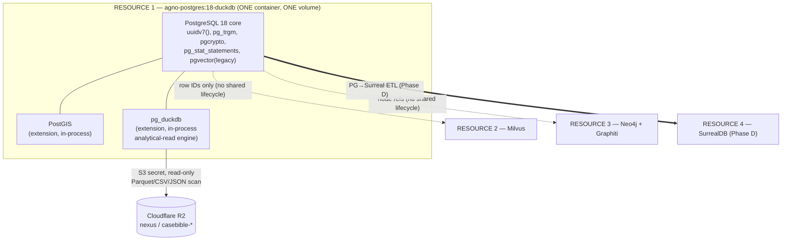

### 1. Division of labor: PG vs embedded DuckDB vs PostGIS

The master prompt's stack list (MP 1427–1456) assigns *all* of canonical records, source metadata, message/item/event/timeline records, entity references, temporal assertions, location/GPS, provenance, extraction runs, confidence, chain-of-custody, review status, export status, and legal tagging to this one "Relational/Analytical Store." Below is the precise allocation of each concern to PG core, PostGIS, or the pg_duckdb engine.

| Concern | Lives in | Why |
|---|---|---|
| Canonical normalized records (people, messages, items, events, timeline, evidence) | **PG core tables** (row store, ACID, FKs, RLS) | Authoritative system-of-record; needs constraints, transactions, append-only triggers |
| Source / device / extraction-run metadata | **PG core tables** | Provenance must be transactional and FK-referenced by every derived row |
| Temporal assertions (valid-time / knowledge-time + **precision class**) | **PG core tables** (`tstzrange`, enum precision) | Bitemporal correctness; the precision class is missing from ALL prior schemas and is added here |
| Location data, GPS tracks, geocode results, home-base/anomaly geofences | **PostGIS** columns inside PG core tables (`geometry`/`geography`) | Spatial indexing (GiST/SP-GiST) + distance/containment operators |
| Confidence scoring, chain-of-custody (UUIDv7 + SHA-256), review status, export status, legal/evidentiary tags | **PG core tables** | Auditability, RLS gating, append-only history |
| Raw-export payloads (Google Takeout JSON, XML call-logs, message backups) | **PG `JSONB`** column `raw_data` **+** the original file in **R2** | Keep verbatim raw evidence; query shape without reshaping it (RAW EVIDENCE contract) |
| Heavy analytical reads, cross-corpus rollups, ad-hoc OLAP, reading large Parquet/CSV/JSON from R2 | **pg_duckdb engine** (in-process), reading PG tables and/or R2 objects | Vectorized columnar scans + direct S3 reach (ADR-0030/0032) without a second deployable |
| Vector embeddings (message bodies, evidence text, OCR) | **Milvus (Resource 2)** — *not here*; PG stores only the `milvus_pk` reference | ADR-0027: Milvus is the single platform-wide vector store; legacy pgvector stays resident only for migration |
| Entity/relationship cognition, contradiction/causal graph, bitemporal reasoning | **Neo4j+Graphiti (Resource 3)** — mirrored *from* PG | ADR-0014/0031: graph is the cognition substrate; PG holds the source-of-truth rows that are mirrored as nodes |

**Rule of thumb for developers:** *write* through PostgreSQL (ACID, triggers, RLS). *Read big* through `pg_duckdb` (`duckdb.query(...)` / `SET duckdb.force_execution`). *Search vectors* in Milvus by PK. *Reason over relationships* in Neo4j. Geometry never leaves PostGIS.

### 2. Schemas / namespaces

Use PostgreSQL **schemas** as the lane-discipline boundary demanded by the guardrails (raw evidence vs extracted vs inferred vs analytical vs legal-conclusion — CONTEXT_PACK §3, §6). Schemas, not table-name prefixes, so RLS, grants, and `search_path` can enforce the lanes mechanically.

| Schema | Lane | Contents | Mutability |
|---|---|---|---|
| `raw` | **Raw evidence** | Ingested artifacts verbatim: `source_file`, `raw_message`, `raw_export`, `screenshot`, device dumps, `raw_data` JSONB. Original bytes also in R2. | **Append-only**; never updated, never deleted |
| `core` | **Canonical normalized facts** | `person`, `message`, `item`, `event`, `timeline_event`, `evidence`, `location`, `gps_track`, `statement`, temporal assertions | Insert + controlled correction (new version row), append-only history table |
| `extracted` | **Extracted facts** (OCR, geocode, parse) | `ocr_text`, `geocode_resolution`, `geocode_audit`, `message_parsed`, `entity_mention` | Append-only, each tied to an `extraction_run` |
| `inferred` | **Inferred facts** (machine-derived, not observed) | `overnight_stay`, `home_base`, `anomaly`, `trip`, `cycle_phase_assignment`, model-tagged sentiment/intent | Append-only; **HITL** before promotion |
| `analysis` | **Analytical findings / work products** | materialized views, `forensic_evidence_package`, contradiction candidates, pattern hits (DARVO/MCL), rollups | Derived; rebuildable; provenance-stamped |
| `legal` | **Legal-conclusion lane** | `legal_tag`, `relevance_label`, `mcl_factor_link`, export bundles, court-facing drafts | **HITL-gated**, append-only, every row carries reviewer + decision |
| `prov` | **Provenance / lineage / runs** | `extraction_run`, `prompt_version`, `ontology_version`, `schema_version`, `tool_call`, `processing_run`, `artifact_lineage` | Append-only |
| `audit` | **Chain-of-custody & change log** | `custody_event`, `row_history` (per-table), `review_decision`, `access_log` | Append-only, write-once |
| `staging` | Ephemeral landing / dedup scratch | `normalized_messages` universal landing, schema-resolver output, import batches | Truncatable scratch (but never silently drop unarchived work — move to `audit.discarded_artifact` with a reason) |
| `ext` | Extensions home | `pg_duckdb`, `postgis`, `pg_trgm`, `pgcrypto`, `vector` objects | n/a |

`search_path` for application roles = `core, extracted, public`; the `raw`, `legal`, `audit`, `prov` schemas are reached only with explicit qualification and role grants. **RLS** is enabled on `legal`, `inferred`, and any table with an `is_private` / disclosure-tier column (the salvaged `messages.is_private` review gate, CONTEXT_PACK §3).

### 3. Table groupings (adopt/adapt from prior work — not a blank slate)

Citations below mark where each table is **ADOPTED** (kept as-is), **ADAPTED** (modified), or **NEW** (gap filled here). Source-of-truth rows in `core` are *mirrored* into Neo4j nodes (Resource 3) — the column contract is shared so the mirror is mechanical.

#### 3.1 Entity & statement group (`core`) — from `salem_v3`

| Table | Source | Notes |
|---|---|---|
| `core.person` | ADOPT `salem_v3.Person` + MERGE TraceIQ V4.1 `people` | Single person identity; `merge_of UUID[]` to track de-dupes; mirrored to Neo4j `Person` |
| `core.event` (`incident`) | ADOPT `salem_v3.Incident`/`Event` | Generic occurrence; PostGIS `location_id`; links to `timeline_event` |
| `core.statement` | ADOPT `salem_v3.Statement` | Who said what, when, where-recorded; impeachment value via `CONTRADICTS` edge in Neo4j |
| `core.evidence` | ADOPT `salem_v3.Evidence` (**central provenance anchor**) | Every extracted/inferred row FK-references an `evidence_id`; ties to `raw.source_file` + R2 key + SHA-256 |
| `core.location` | ADOPT `salem_v3.Location` | Holds PostGIS `geom`/`geog` (see §6); `location_key` dedup from TraceIQ |

Edges (`WAS_AT`, `PARTICIPATED_IN`, `MADE_STATEMENT`, `CONTRADICTS`, `EXPOSED_CHILD`, `AFFECTED_PARENTING_ACCESS`) live in **Neo4j**; PG keeps an optional `core.relationship_assertion` shadow table (typed, append-only) so relationship history is auditable in the relational lane too. Sensitive/hypothesis edges (`USED_TACTIC`, `EXPLOITED_VULNERABILITY`, `DISPARAGES`, `Vulnerability`, `Tactic`) are **PRESERVE-AS-HYPOTHESIS** → they land in `inferred`/`analysis` with `status='hypothesis'` and never auto-promote (CONTEXT_PACK §3, guardrails MP 2469).

#### 3.2 Message & communication group — TraceIQ V4.1 + salvaged parsers

| Table | Source | Notes |
|---|---|---|
| `raw.raw_export` | ADOPT (Google raw-export JSON contract, keep verbatim) | `raw_data JSONB`, `platform`, `source_file_id`, SHA-256 |
| `staging.normalized_messages` | ADOPT salvaged universal landing design | raw XML→`raw_data` JSON; platform-hop reconstruction; reconcile into typed `core.message` |
| `core.message` | ADAPT TraceIQ V4.1 `messages` | typed canonical message; `is_private`→RLS review gate; body text embedded in **Milvus** (store `milvus_pk` only) |
| `extracted.message_parsed` | NEW (wraps salvaged parsers) | output of enhanced-xml-chunker / sms_backup_parser (blocked-call type 5/6) / GVoice / iMessage-PDF / FB / chat-export; carries `parser_name`, `parser_version` |
| `raw.screenshot` | ADOPT TraceIQ `screenshots` | OCR result → `extracted.ocr_text` (extracted lane) |
| `core.social_action` | ADOPT TraceIQ `social_action` | typed social events |

#### 3.3 Timeline / movement group — TraceIQ B/C/D

| Table | Source | Notes |
|---|---|---|
| `raw.visit`, `raw.activity`, `raw.path`, `raw.trip` | ADOPT TraceIQ raw `visits/activities/paths/trips` | verbatim from Takeout; PostGIS geometry |
| `core.timeline_event` | ADAPT TraceIQ `timeline_enriched` | **SPLIT raw vs enriched**; TEXT timestamps → `timestamptz` + **precision class** (§7); FK to `evidence` |
| `extracted.geocode_resolution` | ADOPT TraceIQ (dual-provider) | `disagreement_flag`, `tie_break_reason`; PostGIS point |
| `extracted.geocode_audit` | ADOPT (append-only) | one row per provider call |
| `inferred.overnight_stay`, `inferred.home_base`, `inferred.anomaly` | ADOPT TraceIQ inferred lane | machine-derived, HITL before legal use |
| `core.location` ←`location_key` | ADOPT TraceIQ dedup | canonical place identity |

#### 3.4 Abuse-pattern / behavioral lane — salvaged TTL/py (CONTEXT_PACK §3)

These satisfy the **both-parties / full-relational-cycle** guardrail (MP 2431–2433). Do **not** invent new node types — adopt the salvaged ontologies.

| Table | Source | Notes |
|---|---|---|
| `analysis.pattern_definition` | ADOPT `behavioral_patterns.ttl`, `positive_behaviors.ttl`, `seed-patterns.ts (~303)`, `detection_patterns.py` (256-pattern, MCL A–L, 18 cat, DARVO) | versioned via `ontology_version`; **includes positive/neutral/love-bombing/repair** phases, not only negative |
| `inferred.pattern_hit` | NEW | a detected instance: `pattern_id`, `evidence_id`, `surface_tone`, `inferred_intent`, `relational_function`, `cycle_phase` (modeled **separately**, MP 2433), `confidence`, `status='hypothesis'` |
| `legal.mcl_factor_link` | ADOPT `mcl_722_23.ttl` (12 MCL factors) | links findings → statutory factor; **HITL-gated** |
| `analysis.cycle_phase_assignment` | NEW | per-interaction phase (positive/neutral/love-bombing/repair/conflict) for relationship-cycling analysis |

#### 3.5 Provenance, custody, doc-intelligence (`prov` / `audit`) — salvaged contract

| Table | Source | Notes |
|---|---|---|
| `prov.extraction_run`, `prov.processing_run` | ADOPT salvaged doc-intelligence | every derived row FK→a run |
| `prov.prompt_version`, `prov.ontology_version`, `prov.schema_version`, `prov.tool_call` | ADOPT/NEW (Constraints MP 2436/2452) | full artifact lineage; prompt/ontology/schema versions persisted |
| `prov.artifact_lineage` | NEW | edge table: `output_id → (source_evidence, run, prompt_ver, ontology_ver, schema_ver, review_decision)` |
| `audit.custody_event` | ADOPT UUIDv7 + SHA-256 chain-of-custody column contract | append-only, write-once |
| `extracted.doc_section`/`chunk`/`span`/`entity_mention`/`finding`/`audit.approval` | ADOPT salvaged doc-intelligence tables | section/chunk/span/entity/finding/**approvals** |

### 4. Partitioning strategy

| Table family | Partition scheme | Key | Rationale |
|---|---|---|---|
| `core.message`, `core.timeline_event`, `raw.visit/activity/path` | **RANGE** by event time | `occurred_at` (or `valid_from`) monthly/quarterly | Time-bounded forensic queries; cheap pruning; old partitions go read-only |
| `raw.raw_export`, `raw.screenshot` | **LIST** by `platform` then RANGE by ingest month | `platform`, `ingested_at` | Per-corpus retention + per-platform parser routing |
| `audit.*`, `prov.*` | **RANGE** by `created_at` (monthly) | — | append-only growth; ancient partitions archivable to R2 Parquet (read back via pg_duckdb) |
| `extracted.geocode_audit` | **RANGE** by month | `created_at` | high-volume append-only |
| `analysis.*` (matviews) | not partitioned | — | rebuildable derivations |

Use **native declarative partitioning** (PG18). Default partition catches stray rows for review (never silently drop). For very large, mostly-cold raw corpora, the recommended pattern is **hot rows in PG partitions, cold partitions detached and exported to R2 Parquet**, then transparently re-read through `pg_duckdb` (§8) — this keeps the single resource's volume bounded without a second deployable.

### 5. Indexing strategy

| Need | Index | Where |
|---|---|---|
| PK / FK joins | B-tree on `id` (UUIDv7 — time-ordered, index-friendly) and on every FK | all tables |
| Time-range scans | B-tree on `occurred_at`, `valid_from`; **BRIN** on append-only time-ordered partitions (`audit`, `geocode_audit`, `raw.*`) | per §4 |
| Fuzzy name/text match | **GIN `pg_trgm`** on `person.name`, message snippets, file names | `core`, `raw` |
| JSONB containment / path | **GIN (jsonb_path_ops)** on `raw_data`, plus targeted **expression B-tree** on hot extracted paths (e.g. `(raw_data->>'thread_id')`) | `raw`, `staging` |
| Full-text search | **GIN on `tsvector`** (generated column) | §7 — `core.message`, `extracted.ocr_text`, `core.statement` |
| Spatial | **GiST** (general geom/geog), **SP-GiST** for point-dense GPS, partial GiST for active geofences | §6 |
| Bitemporal range overlap | **GiST on `tstzrange`** valid-time / knowledge-time | temporal assertion tables |
| Confidence / status filters | partial B-tree (`WHERE status='hypothesis'`, `WHERE review_status='pending'`) | `inferred`, `legal` |
| Vectors | **none in PG** — vectors live in Milvus (ADR-0027); legacy pgvector HNSW remains only on the migration-resident column | n/a |

DuckDB does not need separate indexes — its analytical reads are vectorized full/columnar scans; for repeat heavy reads, materialize (see §9) rather than index.

### 6. PostGIS geometry / geography usage

PostGIS is in-process in this one resource (never standalone). Convention:

| Use | Type | SRID | Index |
|---|---|---|---|
| Canonical place point, geocode result, GPS fix | `geometry(Point, 4326)` for storage/joins | 4326 | GiST |
| Distance / "within N meters" / overnight-stay clustering / home-base | `geography(Point/Polygon, 4326)` (meters, true on-sphere) | 4326 | GiST |
| GPS tracks / paths / trips | `geometry(LineString, 4326)` (+ optional `M` for time-parameterized) | 4326 | GiST |
| Geofences (home_base, anomaly zones, "near child's school") | `geometry(Polygon, 4326)` | 4326 | partial GiST on active zones |

Patterns: dual-provider `geocode_resolution` stores both candidate points + a chosen `geom` with `disagreement_flag` (ADOPT TraceIQ); overnight-stay/home-base inference uses `ST_DWithin`(geography) + temporal clustering and writes to `inferred.*` (HITL). Store SRID 4326 canonically; project to a local UTM/equal-area SRID only inside analytical queries when planar area/length is required. `ST_MakeLine` over time-ordered fixes reconstructs `raw.path`. All spatial inference rows carry `confidence` + `precision class` and link to `evidence`.

### 7. JSONB, full-text search, and timestamp precision

**JSONB** — used for the *RAW EVIDENCE contract*: ingest payloads verbatim into `raw_data JSONB` (Google Takeout, XML call-logs with base64 images, message backups). Never reshape raw; normalize *forward* into typed `core` tables, keeping the JSONB as the immutable witness. `schema-resolver.ts` (AI field-mapping for unknown formats) reads JSONB and proposes a mapping into `staging.normalized_messages` → `core.message`. GIN-index for containment; promote hot paths to generated columns only when query-proven.

**Full-text search (FTS)** — Postgres native `tsvector` for *evidentiary keyword search inside this resource* (semantic/vector search is Milvus's job, ADR-0027; the two are complementary). Pattern: a **generated `tsvector` column** (`to_tsvector('english', coalesce(body,'')||' '||coalesce(ocr_text,''))`) + GIN index on `core.message`, `extracted.ocr_text`, `core.statement`. Use `websearch_to_tsquery` for analyst queries; rank with `ts_rank_cd`. FTS hits feed the contradiction/impeachment workflow; they never auto-label.

**Timestamp precision class (NEW — the gap in ALL prior schemas, CONTEXT_PACK §3, Constraints MP 2421).** Every temporal column is paired with a precision enum so exact/approximate/inferred/uncertain are never conflated:

```sql
CREATE TYPE core.ts_precision AS ENUM
  ('exact','approximate','inferred','uncertain','unknown');
-- e.g. core.timeline_event
--   occurred_at      timestamptz,
--   occurred_at_prec core.ts_precision NOT NULL DEFAULT 'unknown',
--   occurred_tz      text,         -- original-source timezone, preserved
--   valid_time       tstzrange,    -- bitemporal valid-time
--   knowledge_time   tstzrange     -- when we learned/asserted it
```

This mirrors the Neo4j+Graphiti bitemporal model (valid-time + knowledge-time, ADR-0014/0031) so PG and the graph agree on time semantics.

### 8. Analytical-read strategy using embedded DuckDB (`pg_duckdb`)

DuckDB here is **the read engine, not a store** (CONTEXT_PACK §1; ADR-0013/0030/0032). It runs **inside** the Postgres process. Three read paths:

1. **Heavy reads over PG tables** — vectorized OLAP (cross-corpus rollups, timeline aggregations, confidence histograms) via `SET duckdb.force_execution = on` or `duckdb.query($$ ... $$)`. Faster than the PG row executor for scan-heavy analytics; same data, same transaction-visible rows.
2. **Direct R2/S3 reads** — `pg_duckdb` uses the account-wide S3 secret (ADR-0030) to scan Parquet/CSV/JSON in R2 (`nexus`, `casebible-*`) **without** moving data into PG and **without** a second deployable. This is how detached/cold partitions exported to R2 (§4) are re-read transparently, and how the `casebible` corpus is queried in place.
3. **File-federation reach** — per ADR-0032, federation = `pg_duckdb` (files/S3/relational) + native Cypher (Neo4j) + Milvus SDK (vectors). No Multicorn2/neo4j-fdw. So "join a PG timeline against a Parquet export in R2" is a single `pg_duckdb` query; "join against the graph or vectors" is done in the application layer by ID, respecting the no-shared-lifecycle rule.

**Guardrail:** R2/S3 reads via pg_duckdb are reads only; any *transfer* (rclone copy/move/sync) stays approval-gated + dry-run (CONTEXT_PACK §4, global cost rule). Raw forensic/abuse evidence is **never** routed to external LLM-extracting tools — pg_duckdb reads stay inside this resource.

### 9. Materialized views (`analysis` schema)

Materialized views are the **analytical-finding lane** — derived, rebuildable, provenance-stamped, and clearly *not* canonical evidence (Constraints MP 2437).

| Matview | Source | Purpose |
|---|---|---|
| `analysis.mv_forensic_evidence_package` | ADOPT TraceIQ `vw_forensic_evidence_package` | per-event bundle with **HIGH/MED/LOW confidence tiers**; **HITL** before export |
| `analysis.mv_timeline_master` | join `core.timeline_event` + `extracted.geocode_resolution` + `evidence` | unified court-review timeline with precision class shown |
| `analysis.mv_message_thread` | `core.message` + `extracted.message_parsed` | reconstructed threads incl. platform-hops |
| `analysis.mv_pattern_rollup` | `inferred.pattern_hit` + `analysis.pattern_definition` | per-person, per-cycle-phase counts (**both parties**, positive+negative) |
| `analysis.mv_contradiction_candidates` | FTS + statement overlap | impeachment leads (hypothesis status; HITL) |
| `analysis.mv_movement_summary` | PostGIS over `raw.path`/`inferred.overnight_stay` | place-time summary |

Refresh `CONCURRENTLY` on a schedule or post-ingest trigger; each matview row carries `built_from_run_id`, `ontology_version`, `schema_version`, `refreshed_at` so a finding traces back to source. For very large rebuilds, the refresh query can run through `pg_duckdb` (§8). Matviews are **never** treated as evidence; promotion of any matview row into `legal` requires a `audit.review_decision`.

### 10. Audit & versioning strategy

This is the spine of court-safe auditability (Constraints MP 2422–2424, 2434–2438, 2470). Everything is **append-only** or **versioned**; nothing is overwritten or hard-deleted (HARD RULE: never delete → move to `_stale`/`audit.discarded_artifact` with a reason).

| Mechanism | Implementation |
|---|---|
| **Chain of custody** | `audit.custody_event` (append-only): `evidence_id`, `actor`, `action` (ingest/hash/access/export), `sha256`, `prev_hash`, `created_at` — SHA-256 hash chain over UUIDv7 rows (ADOPT salvaged contract) |
| **Row history** | per-table `audit.row_history_*` written by `AFTER INSERT/UPDATE/DELETE` triggers; stores full prior row as JSONB + `op`, `txid`, `changed_by`, `changed_at`. **Corrections create a new version row; the prior interpretation is preserved** (guardrail MP 2470) |
| **Bitemporal versioning** | `valid_time` + `knowledge_time` ranges on assertion tables; supersede by closing `knowledge_time` and inserting the new assertion — never UPDATE-in-place |
| **Soft-delete only** | `deleted_at` + `deleted_reason`; views filter it out; data stays for audit |
| **Artifact lineage** | `prov.artifact_lineage` ties every output → source evidence, run, prompt version, ontology version, schema version, review decision (Constraints MP 2436/2452) |
| **Review / HITL gating** | `audit.review_decision` + `audit.approval`: required before any `inferred`→`legal` promotion, any sensitive label (gaslighting/coercive-control/alienation/weaponization/reactive-abuse), any legal-relevance label, any court-facing export. Enforced by RLS + a `legal.*` BEFORE-INSERT trigger that demands a matching approval row |
| **Schema/ontology/prompt versioning** | `prov.schema_version` (DDL migrations recorded), `prov.ontology_version` (the salvaged TTL/py ontologies are versioned, not edited in place), `prov.prompt_version` (every model prompt persisted) |
| **Intermediate work persisted** | scans, drafts, indexes, classifications, tool-call outputs persist in `staging`/`prov.tool_call`; discarding requires an `audit.discarded_artifact` row with a reason (Constraints MP 2435/2451) |
| **RLS / disclosure tiers** | `is_private` / disclosure-tier columns gate `core.message`, `inferred`, `legal`; mirrors the Neo4j disclosure-tier multi-pass (ADR-0031) |

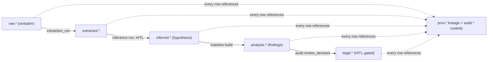

### 11. Build notes, citations, and flags

- **ADR alignment:** image `agno-postgres:18-duckdb` already ships `uuidv7()`, `pg_duckdb`, PostGIS, pg_trgm, pgcrypto, pg_stat_statements (ADR-0013, LIVE). No new extension deployable is introduced. Vectors → Milvus (0027), graph → Neo4j/Graphiti (0014/0031), S3 reach → pg_duckdb account secret (0030), federation per 0032.
- **Adopted prior work:** `salem_v3` (entities/edges), TraceIQ (timeline/movement/geocode/messages/screenshots/social_action/`vw_forensic_evidence_package`), salvaged TTL/py ontologies (`positive_behaviors`, `behavioral_patterns`, `mcl_722_23`, `detection_patterns.py`, `seed-patterns.ts`), salvaged parsers, `normalized_messages` landing, doc-intelligence tables, UUIDv7+SHA-256 custody contract — all per `extracted-code/MANIFEST.md` (prefer over `Archives/**`).
- **NEW (gaps filled here):** the `core.ts_precision` timestamp-precision class (missing from ALL prior schemas), the schema-as-lane partitioning, `prov.artifact_lineage`, `inferred.pattern_hit` with separated surface-tone/intent/relational-function/cycle-phase, cold-partition→R2-Parquet→pg_duckdb re-read pattern.

**Needs-human-review / gaps:** Reconcile the salvaged universal `normalized_messages` raw-JSON landing design against TraceIQ's *typed* `messages`. This section routes raw→`staging.normalized_messages`→typed `core.message`, but the exact field-merge rules (especially blocked-call type 5/6 and platform-hop reconstruction) need a human pass against the live R5 data model (the richest, but stored as two byte-identical copies — dedupe first) before locking the message DDL.


---


## Milvus Vector Schema (Collections)

> _Byline: Claude Code · Opus 4.8 (1M) · 2026-06-30_
> Scope: the semantic-retrieval (ANN) layer of the forensic-evidence DB. Milvus is the **index, not the source of truth** — raw bytes and canonical rows live in **PostgreSQL** (`agno-postgres:18-duckdb`, ADR-0013) and **Cloudflare R2** (ADR-0007). Every Milvus entity points back to a canonical PG row via a stable join key. This honors ADR-0010's surviving shape rule ("raw docs = truth; one embedding space per embedder"), whose *storage location* moved from pgvector to Milvus per ADR-0027.

### 0. Plain-language summary (for the non-developer)

Milvus is the system's **"search by meaning" engine**. PostgreSQL holds the authoritative, court-quality records; Milvus holds compact mathematical fingerprints ("embeddings") of the *text and pictures* in those records so you can ask questions like *"find every apology message in March"* or *"show photos of that backyard"* and get ranked hits — even when the exact words differ. Three rules make it safe for evidence work:

1. **Milvus never decides truth.** It returns pointers; the real record is always re-fetched from PostgreSQL. If Milvus were deleted tomorrow, it could be fully rebuilt from PostgreSQL.
2. **Nothing is overwritten.** A re-analysis adds a *new* fingerprint and marks the old one `superseded` (kept for audit) — prior interpretations are preserved (Constraints; ADR-0010/0014).
3. **Sensitive labels are gated.** A search by a court-facing user only sees rows a human has approved; abuse-pattern and legal-relevance labels stay hidden until reviewed (HITL).

---

### 1. Design basis — what is locked vs. what this section decides

| Locked input | Source | How it constrains this schema |
|---|---|---|
| Milvus = single platform-wide vector store; **one embedding space per collection**; **hybrid dense + sparse/BM25** | ADR-0026 / ADR-0027 | Every forensic *text* collection uses the **same** dense space (the 2048-d text embedder) so vectors are mutually comparable; a 2048-d and a 4096-d vector never share one collection. |
| **NIM dimension contract** (ADR-0011): text **2048-d** (`nemotron-embed-vl-1b-v2`), code **4096-d** (`nv-embedcode-7b`), CaseBible/code **1536-d** (OpenRouter `codestral-embed-2505`) | ADR-0011 / ADR-0026 | Dimensions are a hard contract — parameterized below as `D_TEXT=2048`, `D_IMG=2048`, `D_CODE=4096`, `D_CB=1536`. A re-dim is a **breaking change** → new ADR + full re-embed, never a silent config tweak. |
| **CPU-only / cloud-primary** (no GPU; local models ≤ 4B; **evidence content stays local**) | ADR-0015 / Hardware memory | Forces the embedder choice in §2: the **1B** text/VL model is small enough to run **locally on CPU** for sensitive evidence; cloud NIM/OpenRouter is reserved for non-sensitive corpora. |
| Index = pointers; **raw docs = truth, in PG** | ADR-0010 | Every Milvus entity carries a PG foreign-key triple (`pg_schema`,`pg_table`,`pg_pk`) + `source_id` (custody anchor). Milvus stores only what filtering/snippet/re-rank needs. |
| Bitemporal, disclosure-tier, multi-pass cognition | ADR-0014/0018/0031 (Neo4j+Graphiti) | `disclosure_tier` is a first-class filterable scalar on every collection; Milvus is **not** the temporal authority (Neo4j/Graphiti + SurrealDB are). |
| Cross-cutting guardrails | Context Pack §6 / MP Constraints | `assertion_type`, `confidence`, `timestamp_certainty`, `review_status`, append-only re-embeds, full relational cycle (not only negatives), HITL before sensitive labels surface, both-parties modeling. |
| Canonical PG tables to link to | Section 03 (Canonical Data Model) | Linkage targets below use the **real** canonical names (`evidence.message`, `multimodal.image`, `analysis.finding`, `legal.legal_issue`, `provenance.work_artifact`, …) — not invented ones. |

**Net rule for this layer:** collections are split by **content type** (for lifecycle, partitioning, retrieval scoping, and HITL policy), but every text collection shares the **same 2048-d dense space**, so the platform's "one embedding space per collection" invariant holds — no collection ever holds two incompatible vector geometries. Cross-modal image vectors reuse the same 2048-d VL space so a *text* query can retrieve *images*. (See §9 reconciliation — flagged for owner sign-off.)

---

### 2. Embedder & the CPU-only / "evidence-stays-local" resolution (ADR-0011 + ADR-0015)

There is a genuine tension between *"NIM = embed/rerank"* (cloud, ADR-0011/0026) and *"evidence content stays local"* (ADR-0015). Resolution adopted here:

| Corpus | Embedder | Dim | Where it runs | Rationale |
|---|---|---|---|---|
| **Forensic evidence text** (messages, OCR, transcripts, event/claim summaries, findings, legal issues, captions) | `nemotron-embed-vl-1b-v2` (**text mode**) | `D_TEXT=2048` | **LOCAL CPU** (1B ≤ 4B cap) | Keeps raw/derived evidence text **off cloud** → satisfies ADR-0015 "stays local" AND the ≤4B CPU limit. Throughput is low → batch/async ingest (§8). |
| **Forensic images** (cross-modal) | `nemotron-embed-vl-1b-v2` (**vision mode**) | `D_IMG=2048` (assumed = `D_TEXT`) | LOCAL CPU | Same VL model maps image pixels into the **same 2048-d space** → text↔image cross-modal retrieval with no second space. |
| Non-sensitive CaseBible / knowledge corpora | OpenRouter `codestral-embed-2505` | `D_CB=1536` | Cloud | Not case-private; cloud is fine. **Symmetric** model (per global rule — avoid NIM asymmetric `input_type`→400s). Out of forensic scope; listed for completeness. |
| Platform code search | `nv-embedcode-7b` | `D_CODE=4096` | Cloud NIM | Out of forensic scope; separate collection, never mixed with evidence. |

> **NEEDS HUMAN REVIEW — BLOCKING.** Confirm whether `nemotron-embed-vl-1b-v2` is actually served **locally on CPU** vs. **only via cloud NIM**. If cloud-only is the sole path, sensitive evidence text MUST instead use a locally hosted symmetric model (e.g., `bge-m3`, 1024-d) and `D_TEXT` re-pinned accordingly — an **ADR-0011 amendment**, not a config change. **Do not ship raw evidence text to a cloud embedder without explicit owner approval** (Context Pack §4: "never feed raw forensic/abuse evidence to external/cloud LLM-extracting tools").

---

### 3. Common entity envelope (every collection inherits this)

All eight collections share one field contract so retrieval, filtering, provenance, and HITL gating behave identically. Type names are Milvus 3.0 field types. **Lean-payload rule:** anything not used for *filtering, snippet display, or re-rank* stays in PG and is fetched on hydrate.

| Field | Milvus type | Role | Notes / lane discipline |
|---|---|---|---|
| `pk` | `VARCHAR` (PK, ≤ 64) | Primary key | The **UUIDv7** of the canonical PG row (ADR-0013 `uuidv7()`), 1:1 with PG. No Milvus auto-id → stable cross-store join. For chunked rows, `pk = "{parent_uuid}:{chunk_seq}"`. |
| `dense` | `FLOAT_VECTOR(D_TEXT)` / `(D_IMG)` | Dense ANN | HNSW, metric `COSINE` (§8). |
| `sparse` | `SPARSE_FLOAT_VECTOR` | Lexical ANN | Produced by a Milvus **BM25 `Function`** over `text` (§8) — no external sparse encoder, CPU-friendly. |
| `text` | `VARCHAR` (≤ 65535, `enable_analyzer=True`) | BM25 input + snippet | The chunk/derived text. Stored for highlight & re-rank; full record stays in PG. |
| `case_id` | `VARCHAR` | **Partition key** | Generalized from the salem_v3 "Salem v. Kinzel" caption → case-scoped (Context Pack §3; §03 note). |
| `disclosure_tier` | `INT8` | Multi-pass filter | Bitemporal disclosure tier (ADR-0018/0031). |
| `assertion_type` | `INT8` (enum) | **Evidence-class guard** | `0 raw_evidence · 1 extracted_fact · 2 inferred_fact · 3 analytical_finding · 4 legal_conclusion` (mirrors PG `assertion_type` enum, §03). |
| `confidence` | `FLOAT` | Ranking / gate | 0–1, re-derived transparently; **never** a hard-coded 0.6 (crosswalk). |
| `timestamp_certainty` | `INT8` (enum) | **Time-trust guard** | `0 exact · 1 approximate · 2 inferred · 3 uncertain` (the precision class missing from ALL prior schemas — Context Pack §3). |
| `event_time_utc` | `INT64` | Valid-time range filter | Epoch ms; `-1` sentinel for non-temporal rows. Full `_raw`+`tz_offset`+precision triple held in PG. |
| `ingested_at_utc` | `INT64` | Knowledge-time | When this vector was written (bitemporal "knowledge time"). |
| `source_id` | `VARCHAR` | Provenance | UUIDv7 of the originating `custody.source` (SHA-256 + UUIDv7 chain, §03 §1.1). |
| `pg_schema` / `pg_table` / `pg_pk` | `VARCHAR` ×3 | **PG linkage triple** | Exact canonical row to re-hydrate. |
| `provenance_id` | `VARCHAR` | Provenance join | → `provenance.provenance` (run/parser/model/prompt/review bundle, §03 §9). |
| `embedding_model` / `embedding_dim` / `embedding_version` | `VARCHAR` / `INT16` / `VARCHAR` | Lineage | Re-embed = new vector + version bump (append-only, §6). |
| `prompt_version` / `ontology_version` / `schema_version` / `run_id` | `VARCHAR` ×4 | Artifact lineage | Trace any derived vector back to the run/prompt/ontology/schema that made it (Constraints). |
| `review_status` | `INT8` (enum) | **HITL gate** | `0 pending · 1 approved · 2 rejected · 3 needs_review`. Court-facing retrieval forces `review_status==1`. |
| `is_sensitive` | `BOOL` | HITL / in-camera | From `is_sensitive` / `requires_in_camera_review` (crosswalk). |
| `is_hypothesis` | `BOOL` | Hypothesis guard | Model-generated interpretation flag — never auto-promoted to fact (Constraints; salem_v3 Preserve-as-Hypothesis edges). |
| `subject_party` | `INT8` (enum) | Both-parties guard | `0 unknown · 1 user · 2 counterparty · 3 child · 4 third_party` — supports modeling the **user's own conduct/reactions**, not only the counterparty's (Constraints; A3 ontology gap). |
| `superseded` | `BOOL` | Soft-delete | Append-only correction: old vector flagged, never overwritten (§6). |

> **Reference field schema (pymilvus 3.x) — the shared envelope.** Per-collection extra scalars (§4) are appended to this base.

```python
from pymilvus import FieldSchema, CollectionSchema, DataType, Function, FunctionType

D_TEXT = 2048  # ADR-0011 text contract — re-pin only via ADR amendment

base_fields = [
    FieldSchema("pk", DataType.VARCHAR, is_primary=True, max_length=64),
    FieldSchema("dense", DataType.FLOAT_VECTOR, dim=D_TEXT),
    FieldSchema("sparse", DataType.SPARSE_FLOAT_VECTOR),                 # filled by BM25 Function
    FieldSchema("text", DataType.VARCHAR, max_length=65535, enable_analyzer=True),
    FieldSchema("case_id", DataType.VARCHAR, max_length=64, is_partition_key=True),
    FieldSchema("disclosure_tier", DataType.INT8),
    FieldSchema("assertion_type", DataType.INT8),
    FieldSchema("confidence", DataType.FLOAT),
    FieldSchema("timestamp_certainty", DataType.INT8),
    FieldSchema("event_time_utc", DataType.INT64),
    FieldSchema("ingested_at_utc", DataType.INT64),
    FieldSchema("source_id", DataType.VARCHAR, max_length=64),
    FieldSchema("pg_schema", DataType.VARCHAR, max_length=32),
    FieldSchema("pg_table", DataType.VARCHAR, max_length=64),
    FieldSchema("pg_pk", DataType.VARCHAR, max_length=64),
    FieldSchema("provenance_id", DataType.VARCHAR, max_length=64),
    FieldSchema("embedding_model", DataType.VARCHAR, max_length=64),
    FieldSchema("embedding_dim", DataType.INT16),
    FieldSchema("embedding_version", DataType.VARCHAR, max_length=24),
    FieldSchema("prompt_version", DataType.VARCHAR, max_length=24),
    FieldSchema("ontology_version", DataType.VARCHAR, max_length=24),
    FieldSchema("schema_version", DataType.VARCHAR, max_length=24),
    FieldSchema("run_id", DataType.VARCHAR, max_length=64),
    FieldSchema("review_status", DataType.INT8),
    FieldSchema("is_sensitive", DataType.BOOL),
    FieldSchema("is_hypothesis", DataType.BOOL),
    FieldSchema("subject_party", DataType.INT8),
    FieldSchema("superseded", DataType.BOOL),
]

bm25 = Function(name="bm25_text_to_sparse", function_type=FunctionType.BM25,
                input_field_names=["text"], output_field_names=["sparse"])
```

---

### 4. The eight collections

All names are case-agnostic (`partition_key=case_id`) and use the text/VL 2048-d space unless noted. The **PG source table** column gives the authoritative `pg_table` for the linkage triple, reconciled to the §03 canonical model.

#### 4.1 `ev_message` — Messages
| Attr | Value |
|---|---|
| **Purpose** | Semantic + lexical search over chat / SMS / DM / call-note message bodies across platforms (FB, Snapchat, SMS, iMessage, GVoice, etc.). |
| **Embedding target** | Message body text (one entity per message; long messages chunked → `chunk_seq`, `parent_pk`). `D_TEXT`. |
| **PG linkage** | `evidence.message` (PK `message_id`; adopted from TraceIQ V4.1 `messages`). `pg_schema='evidence'`, `pg_table='message'`. OCR-derived bodies set `assertion_type=extracted_fact`. |
| **Extra scalars** | `platform`, `direction` (`in/out`), `sender_identity_id`, `thread_id`, `device_id` (multi-device attribution), `linked_location_event_id`, `tone_surface`, `inferred_intent`, `relational_function`, `cycle_phase` (full-cycle: positive / neutral / love-bombing / repair / conflict — **NOT only negatives**). |
| **Partitioning** | Partition key `case_id`; logical sub-scope by `thread_id` via filter. |
| **Hybrid search** | dense(`D_TEXT`) + BM25 sparse(`text`); RRF fuse. Filters: `platform`, `direction`, `event_time_utc` range, `cycle_phase`, `subject_party`. |
| **Use cases** | "find apology/repair messages in window X"; impeachment-context retrieval (pair with graph `CONTRADICTS`); contrast affectionate vs hostile phases over time; locate selectively-quoted lines for re-contextualization (Constraints: weaponization-without-context). |

#### 4.2 `ev_ai_transcript` — AI chat transcript chunks
| Attr | Value |
|---|---|
| **Purpose** | Search prior **AI-analysis sessions / chat transcripts** (intermediate work products) so work resumes across sessions and prior interpretations stay recoverable (Constraints: persist intermediate work; resumable memory layer). |
| **Embedding target** | Transcript **chunks** (token-windowed; `chunk_seq`, `parent_pk` = session id). `D_TEXT`. |
| **PG linkage** | `provenance.work_artifact` (`artifact_kind='ai_transcript'`; §03 §9) joined to `provenance.processing_run` / `provenance.model_run`. `pg_schema='provenance'`, `pg_table='work_artifact'`. **Kept strictly separate from canonical evidence facts.** |
| **Extra scalars** | `model_name`, `prompt_version`, `tool_call_ref`, `session_id`. `is_hypothesis=true` by default (model output). |
| **Partitioning** | Partition key `case_id`; filter by `session_id`. |
| **Hybrid search** | dense + sparse; default filter `assertion_type IN (inferred_fact, analytical_finding)`; results surface with a "model-generated, unverified" badge. |
| **Use cases** | Cross-session memory recall; "did we already analyze this?"; lineage — trace a finding back to the transcript+prompt that produced it; avoid re-deriving. **Never promoted to fact without HITL.** |

#### 4.3 `ev_ocr_text` — OCR text
| Attr | Value |
|---|---|
| **Purpose** | Search text **extracted from screenshots/images** (OCR = *extracted fact*, not raw pixels). |
| **Embedding target** | OCR text span(s) per image region. `D_TEXT`. |
| **PG linkage** | `multimodal.image` (`ocr_text`, `ocr_confidence`) + `multimodal.image_entity` (OCR→source-span link; §03 §7). `pg_schema='multimodal'`, `pg_table='image'`; span via `region_ref` → `image_entity.source_span`. |
| **Extra scalars** | `region_ref`, `ocr_engine`, `ocr_confidence`, `perceptual_hash` (near-dupe screenshots), `linked_message_id`. |
| **Partitioning** | Partition key `case_id`. |
| **Hybrid search** | dense + sparse (**BM25 strong here** — OCR carries names/handles/dates/phone numbers). Filters: `ocr_confidence`, `is_sensitive`. |
| **Use cases** | Find a screenshot by its visible text; corroborate a message with its screenshot; flag low-OCR-confidence rows for human re-read. `assertion_type=extracted_fact`; `timestamp_certainty` usually `approximate`/`inferred` (screenshot capture ≠ original send time). |

#### 4.4 `ev_event_summary` — Event summaries
| Attr | Value |
|---|---|
| **Purpose** | Search the **timeline event spine** by natural-language summary of what happened. |
| **Embedding target** | The human/model summary string of a timeline event. `D_TEXT`. |
| **PG linkage** | `timeline.event` (adapted from TraceIQ `timeline_enriched`; keeps `start_utc`+`_raw`+`tz_offset`+precision; §03 §6). `pg_schema='timeline'`, `pg_table='event'`. |
| **Extra scalars** | `event_type`, `device_id`, `location_id` (→ `geo.location`), `summary_author` (human vs model), `is_inferred`, `multi_device_split`. |
| **Partitioning** | Partition key `case_id`; heavy `event_time_utc` range use. |
| **Hybrid search** | dense + sparse; nearly always combined with a time-range and `event_type` filter. |
| **Use cases** | "what happened around &lt;date&gt; near &lt;place&gt;"; build chronology drafts; anchor messages/images/claims to events. Distinguish exact vs inferred event times via `timestamp_certainty`. |

#### 4.5 `ev_claim` — Claims
| Attr | Value |
|---|---|
| **Purpose** | Search **claimed-vs-observed** assertions (a party's stated claim about where/when/what). |
| **Embedding target** | The claim text (claimed side) and, separately, the observed side — paired via `pair_id`. `D_TEXT`. |
| **PG linkage** | `analysis.claim_verification` (adapted from TraceIQ `expected_schedule`, paired `claimed_*`/`observed_*`; §03 §8). `pg_schema='analysis'`, `pg_table='claim_verification'`. |
| **Extra scalars** | `pair_id`, `claim_side` (`claimed`/`observed`), `claimant_identity_id`, `is_anomaly` (analytical finding, **gated**), `tolerance_ref`, `subject_party`. |
| **Partitioning** | Partition key `case_id`. |
| **Hybrid search** | dense + sparse; filters `claim_side`, `is_anomaly`. |
| **Use cases** | "find claims contradicted by location data"; surface **both sides** for fair presentation (raw claim vs observed); feed graph `CONTRADICTS` with evidence-linked support. Anomaly label never shown court-facing until `review_status==approved` (explanation ≠ proven causation). |

#### 4.6 `ev_pattern_finding` — Pattern findings
| Attr | Value |
|---|---|
| **Purpose** | Search **behavioral-pattern findings** (the ~303-pattern library + the positive-behavior taxonomy), including sensitive abuse-pattern labels. |
| **Embedding target** | Finding description + matched-pattern rationale. `D_TEXT`. |
| **PG linkage** | `analysis.finding` (+ `analysis.finding_version` for append-only history; §03 §8). Seeded from `seed-patterns.ts` (~303), `behavioral_patterns.ttl`, `detection_patterns.py` (256-pattern, MCL A–L, DARVO) **and `positive_behaviors.ttl`** (full-cycle, both parties — Context Pack §3). `pg_schema='analysis'`, `pg_table='finding'`. |
| **Extra scalars** | `pattern_id`, `pattern_polarity` (`negative`/`neutral`/`positive`/`love_bombing`/`repair`), `subject_party` (models the **user's own conduct** too), `cycle_phase`, `sensitive_label` (e.g., `coercive_control` — VARCHAR, **NULL until approved**), `evidence_cite_count` (≥ 1 required). |
| **Partitioning** | Partition key `case_id`. |
| **Hybrid search** | dense + sparse; **court-facing profile forces `review_status==1 AND sensitive_label IS NOT NULL`**; analyst profile additionally shows `pending`/`needs_review`. |
| **Use cases** | Pattern recall across the corpus; **cycle-contrast** analysis (positive vs negative phases); impeachment prep. **HARD HITL:** gaslighting / coercive-control / alienation / weaponization / reactive-abuse labels never reach court-facing output until human-approved (Constraints; Context Pack §6). |

#### 4.7 `ev_legal_issue` — Legal issue summaries
| Attr | Value |
|---|---|
| **Purpose** | Search **legal-issue / best-interest-factor summaries** (e.g., MCL 722.23 factors A–L) and map evidence to issues. |
| **Embedding target** | Issue/factor summary text. `D_TEXT`. |
| **PG linkage** | `legal.legal_issue` (+ `legal.evidence_relevance` for evidence↔issue mapping; §03 §legal). Seeded from `mcl_722_23.ttl` (12 factors). `pg_schema='legal'`, `pg_table='legal_issue'`. |
| **Extra scalars** | `factor_code` (A–L / statute ref), `issue_type`, `legal_relevance_label` (**HITL-gated**), `is_legal_conclusion` (BOOL → `assertion_type=legal_conclusion`). |
| **Partitioning** | Partition key `case_id`. |
| **Hybrid search** | dense + sparse; filter `factor_code`. |
| **Use cases** | "which evidence supports factor C (child's home/school/community record)?"; assemble factor-mapped packages; keep legal-relevance labels as HITL items, never auto-asserted. These are **organizational** summaries, **not legal advice** (Constraints). |

#### 4.8 `ev_multimodal_desc` — Multimodal descriptions
| Attr | Value |
|---|---|
| **Purpose** | Search **natural-language descriptions of non-text media** (image / video-frame / audio captions) AND **cross-modal image retrieval** (text query → image hit). |
| **Embedding target** | Up to **two vectors per item**: (a) the caption/description text → `D_TEXT` (in this collection); (b) the media itself via VL/image mode → `D_IMG` (same 2048-d space). See note below on the two-vector layout. |
| **PG linkage** | `multimodal.scene_description` (model descriptions, `assertion_type='analytical_finding'`) + `multimodal.media`/`image` (raw). `pg_schema='multimodal'`, `pg_table='scene_description'`. The image vector also references `multimodal.media.media_id` via `media_id`. |
| **Extra scalars** | `media_type` (`image`/`screenshot`/`video_frame`/`audio_caption`), `caption_author` (human/model), `media_id`, `frame_ts`, `is_sensitive`, `region_ref`. |
| **Partitioning** | Partition key `case_id`; optional second partition by `media_type` if volume is skewed. |
| **Hybrid search** | dense(text) + BM25 sparse(caption); **dense(image) cross-modal** as a separate request fused by RRF when both are wanted. |
| **Use cases** | "find photos of &lt;scene/object&gt;"; caption-based recall; corroborate event summaries with media. `caption_author=model` ⇒ `assertion_type=inferred_fact`/`analytical_finding`, never asserted as raw (HITL for scene descriptions, §03 §7). |

> **Cross-modal layout decision (needs sign-off, §9):** because Milvus 3.x supports **multiple vector fields per collection**, the cleanest implementation is a single `ev_multimodal_desc` with two `FLOAT_VECTOR` fields — `dense` (caption text, `D_TEXT`) and `dense_img` (image pixels, `D_IMG`) — both `COSINE`, both 2048-d. A text query can search either field; a `hybrid_search` can fuse caption-text + image hits. Alternative (a separate `ev_image` collection) is also viable if image volume dwarfs captions. Default = single collection, two vector fields.

#### Collection summary

| Collection | PG source (`pg_schema.pg_table`) | Dense dim | Primary `assertion_type` | HITL criticality |
|---|---|---|---|---|
| `ev_message` | `evidence.message` | `D_TEXT` 2048 | raw_evidence | in-camera flag |
| `ev_ai_transcript` | `provenance.work_artifact` | `D_TEXT` 2048 | inferred / analytical | **always (model output)** |
| `ev_ocr_text` | `multimodal.image` | `D_TEXT` 2048 | extracted_fact | sensitive flag |
| `ev_event_summary` | `timeline.event` | `D_TEXT` 2048 | raw / extracted | low |
| `ev_claim` | `analysis.claim_verification` | `D_TEXT` 2048 | extracted + analytical | anomaly label |
| `ev_pattern_finding` | `analysis.finding` | `D_TEXT` 2048 | analytical_finding | **HARD (sensitive labels)** |
| `ev_legal_issue` | `legal.legal_issue` | `D_TEXT` 2048 | legal_conclusion | relevance label |
| `ev_multimodal_desc` | `multimodal.scene_description` | `D_TEXT` + `D_IMG` 2048 | inferred (caption) | sensitive media |

---

### 5. PostgreSQL ↔ Milvus linkage

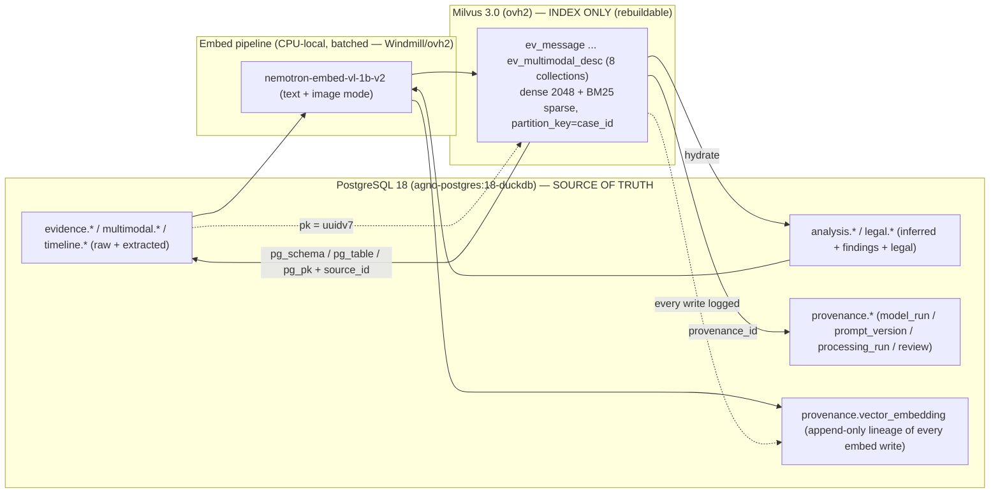

- **Join key:** Milvus `pk` == PG row `uuidv7` (ADR-0013). Retrieval returns `pk` + scalars + snippet; the app **re-hydrates the authoritative record** from PG via `pg_schema/pg_table/pg_pk`, and the originating raw artifact via `source_id` (SHA-256 custody chain, §03 §1).
- **Lineage table — `provenance.vector_embedding` (append-only), aligned to the §03 `provenance` schema** (not a stray `public` table):

  | Column | Purpose |
  |---|---|
  | `vector_embedding_id PK (uuidv7)` | one row per embedding write |
  | `pk` | the Milvus entity pk it produced |
  | `collection` | which collection |
  | `pg_schema/pg_table/pg_pk` | the source canonical row |
  | `embedding_model / embedding_dim / embedding_version` | embedder lineage (ADR-0011) |
  | `model_run_id FK → provenance.model_run` | run that produced it |
  | `prompt_version_id / ontology_version_id / schema_version_id FK` | the prompt/ontology/schema in force |
  | `processing_run_id FK → provenance.processing_run` | batch/run |
  | `ingested_at_utc` | knowledge-time |
  | `superseded_by (nullable)` | the row that replaced it (never overwrite) |

  This lets any retrieval be traced to the **exact** run/model/prompt/ontology/schema that produced it (Constraints: artifact lineage).
- **Consistency model:** PG is authoritative; Milvus is **fully rebuildable** from PG + the embed pipeline (disposable index). A nightly reconcile job diffs PG PKs vs Milvus PKs (per collection, per `case_id`) and re-embeds only the delta. The §03 note "embedding vectors held in Milvus by `embedding_ref`" is satisfied: the PG row's `embedding_ref` = the Milvus `pk`.

---

### 6. Append-only / corrections (never overwrite)

Milvus `upsert` overwrites — which violates *"preserve prior interpretations."* Pattern enforced at the pipeline layer:

1. A correction / re-embed **inserts a NEW entity** with a fresh `embedding_version` (and, for re-derived findings, a fresh `pk` when the PG row itself versioned via `analysis.finding_version`).
2. The prior entity is **soft-deleted**: `superseded=true` (kept queryable for audit), never physically deleted.
3. Default retrieval filters `superseded==false`; an explicit "audit / history" mode includes superseded vectors.
4. Physical deletes only via the never-delete→`_stale` governance, only for true duplicates, with a logged `archived_reason` (`provenance.work_artifact.archived_reason`).

This mirrors the bitemporal substrate (knowledge-time = `ingested_at_utc`; valid-time = `event_time_utc`) **without making Milvus the temporal authority** — Neo4j/Graphiti + SurrealDB remain the bitemporal SSOT (ADR-0014/0024).

---

### 7. Worked hybrid-search example (court-facing profile)

```python
from pymilvus import AnnSearchRequest, RRFRanker

# Court-facing profile = only approved, non-superseded, fact-or-evidence rows.
SAFE = ("review_status == 1 and superseded == false "
        "and assertion_type in [0,1] ")      # raw_evidence | extracted_fact only

dense_req  = AnnSearchRequest(data=[q_vec], anns_field="dense",
                             param={"metric_type": "COSINE", "params": {"ef": 128}},
                             limit=50, expr=SAFE)
sparse_req = AnnSearchRequest(data=[query_text], anns_field="sparse",
                             param={"metric_type": "BM25"}, limit=50, expr=SAFE)

hits = client.hybrid_search(
    collection_name="ev_message",
    reqs=[dense_req, sparse_req],
    ranker=RRFRanker(k=60),              # RRF default; WeightedRanker when dense should dominate
    limit=20,
    partition_names=[case_id],            # physical per-case isolation
    output_fields=["pk","text","pg_schema","pg_table","pg_pk","source_id",
                   "assertion_type","confidence","timestamp_certainty","event_time_utc"],
)
# Every hit returns assertion_type + confidence + timestamp_certainty so the caller
# can never render a hypothesis as established fact. Re-hydrate the authoritative row from PG.
```

- **Analyst profile** drops the `assertion_type`/`review_status` clamp and shows `pending`/`needs_review`/`is_hypothesis` rows, each clearly badged.
- **Sensitive-label search** (`ev_pattern_finding`) additionally forces `sensitive_label IS NOT NULL AND review_status == 1` before any court-facing surface.

---

### 8. Indexing, hybrid retrieval & ops

| Concern | Decision |
|---|---|
| **Dense index** | `HNSW` (`M=16`, `efConstruction=256` as starting point) for the small/medium forensic corpus; metric `COSINE`. Fall back to `IVF_FLAT`/`SCANN` only if RAM-bound. (CPU-only host → keep `ef` modest at query time.) |
| **Sparse index** | `SPARSE_INVERTED_INDEX` driven by the Milvus **BM25 `Function`** over `text` — no external sparse encoder, CPU-friendly, no extra model to host. |
| **Hybrid fusion** | `hybrid_search` with **`RRFRanker`** default; `WeightedRanker` when dense should dominate. Re-rank top-k with the platform reranker (NIM rerank for **non-sensitive**; for **sensitive** evidence keep re-rank **local or skip** — §9). |
| **Partition key** | `case_id` on every collection (Milvus partition-key feature) → physical isolation + fast per-case scoping; multi-case-safe. |
| **Standard filter set** | `disclosure_tier`, `assertion_type`, `review_status`, `event_time_utc` range, `is_sensitive`, `is_hypothesis`, `subject_party`, `superseded`. |
| **Court-facing retrieval profile** | Forced: `review_status==1 AND superseded==false`; sensitive labels require approval; results always carry `assertion_type` + `confidence` + `timestamp_certainty`. |
| **Ingest throughput** | CPU-local 1B embedder is slow → **async / batched** ingest workers (Windmill on ovh2 per memory). Back-pressure acceptable since Milvus is a rebuildable index. |
| **Consistency level** | `Bounded` (default) for analyst search; `Strong` only for the post-write reconcile check. |
| **Hosting** | Self-hosted **Milvus 3.0** (embedded + WoodPecker) + **Attu v3**, on Coolify / **ovh2** (ADR-0026). **Bind-mounted volumes** (owner mandate — never named volumes); Milvus = its **own independently-deployable resource** (Context Pack §1 — a Milvus crash must not affect PG/Neo4j/SurrealDB). |
| **Backup** | Backed up via host bind-mount dirs (owner backup pattern); but since Milvus is rebuildable from PG, the canonical-recovery path is "re-embed from PG", not "restore Milvus volume". |

---

### 9. Reconciliation, gaps & needs-human-review

| # | Item | Status / action |
|---|---|---|
| 1 | **Embedder locality (BLOCKING)** | Verify `nemotron-embed-vl-1b-v2` runs **locally on CPU**, not cloud-only NIM, before any sensitive evidence is embedded. If cloud-only → switch to a local symmetric model (e.g., `bge-m3` 1024-d) and re-pin `D_TEXT` via an **ADR-0011 amendment**. (§2) |
| 2 | **"One embedding space per embedder" vs. eight collections** | RECONCILED, confirm: all eight text collections share the *same* 2048-d space; we split by **content type** for partitioning/lifecycle/HITL — no incompatible geometry is ever co-located. **Confirm the platform team accepts content-type splits within one embedding space.** |
| 3 | **`D_IMG` placeholder** | Assumed = `D_TEXT` (2048) because the VL model shares one space. **Verify the image-mode output dim** before building `ev_multimodal_desc`. |
| 4 | **Two-vector multimodal layout** | Default = single collection with `dense` (text) + `dense_img` (image) fields; alternative = separate `ev_image` collection. **Owner pick** if image volume dominates. (§4.8) |
| 5 | **As-built unknown** | Context Pack §5: no prior report reflects Milvus-as-deployed. Treat **all** dims/index params (`M`, `efConstruction`, `ef`) as placeholders until verified against the live ovh2 instance + Attu. |
| 6 | **Reranker on sensitive content** | NIM rerank is cloud → for sensitive evidence keep re-rank **local or omit**. Owner decision. |
| 7 | **`provenance.vector_embedding` table** | New lineage table proposed here (aligned to §03 `provenance` schema) — confirm it is added to the canonical model rather than a stray `public.vector_lineage`. |
| 8 | **CaseBible/code collections** | Out of forensic scope but share the Milvus instance (ADR-0026/0027). Keep them in **separate collections** with their own dims (1536/4096) — never mix with evidence collections. Documented for completeness only. |

> _Lane discipline carried into this layer (Context Pack §3/§6):_ raw evidence (`ev_message` bodies, image pixels) vs extracted (`ev_ocr_text`, OCR) vs inferred (`is_inferred`, anomalies) vs analytical (`ev_pattern_finding`, scene descriptions) vs legal-conclusion (`ev_legal_issue`) stay distinguishable via `assertion_type` on every entity; timestamp precision via `timestamp_certainty`; both-parties + full-cycle via `subject_party` + `cycle_phase`/`pattern_polarity`; HITL via `review_status` + `sensitive_label` gating.


---


## Neo4j / Graphiti / Semantica Graph Model

> _Byline: Claude Code · Opus 4.8 (1M) · 2026-06-30_
>
> The graph layer is the **relationship and reasoning lane** of the forensic-evidence system. It is **not** the source of truth. The authoritative store is the unified PostgreSQL 18 resource (`agno-postgres:18-duckdb`, ADR-0013) defined in the Canonical Data Model section; Milvus (ADR-0026/0027) holds vectors; SurrealDB (ADR-0024, Phase D) is the consolidated analysis sink. **Neo4j is a derivation/projection** of those stores, optimized for traversal, path explanation, network analysis, contradiction mapping, and evidence-to-issue routing. If Neo4j were wiped, it could be fully rebuilt from PostgreSQL. This is a hard architectural rule: *the graph reads from the relational SSOT and writes nothing the relational store does not already own.*
>
> **Topology (owner-mandated, Context Pack §1).** Neo4j is its **own independently-deployable resource** — separate container, separate bind-mounted volume, independent start/stop/rebuild. A crash of Neo4j must never tear down PostgreSQL, Milvus, or SurrealDB, and vice-versa. Graphiti and Semantica are **writers into** this one Neo4j; they are not separate datastores.
>
> **Two writers, one graph (MP 1478–1520).** Per the master prompt, Neo4j is written by at least two graph-oriented applications:
> 1. **Graphiti** — agent memory, temporal awareness, evolving facts, episode-based construction, provenance-aware context graph (ADR-0014/0018/0031, VIP — never forked, never replaced).
> 2. **Semantica** (the user's Semantica / Hawksight / HawkSite knowledge-graph application) — knowledge-graph construction, context graphs, explainable reasoning, provenance & governance, graph analysis/traversal. **Semantica runs seed-first hybrid and writes OUR Neo4j + Milvus** (ADR ~0035).
>
> Because the exact Semantica implementation may differ from this assumption (MP 1519), all writes flow through a single **Graph Write Adapter** so that Graphiti-origin and Semantica-origin writes stay **traceable, separable, and reversible**.

---

### 1. Lane separation — two graphs sharing one Neo4j instance

The single Neo4j resource carries **two logically distinct lanes**, kept apart by Graphiti's native `group_id` partition key and by a `lane` property on every node and edge. They never silently bleed into each other.

| Lane | Writer | `group_id` namespace | Purpose | Court-grade? | LLM extraction allowed? |
|---|---|---|---|---|---|
| **Case Knowledge Graph (KG)** | Semantica (seed-first) + adapter | `case:<case_id>:kg` | The canonical, evidence-linked case graph: people, events, places, messages, claims, contradictions, patterns, legal issues. A faithful projection of PG canonical facts. | **Yes** — evidence-linked, fully provenanced, HITL-gated | **No cloud LLM on evidence.** Seed phase is deterministic; hybrid enrichment uses a **local ≤4B model only** (Context Pack §4 guardrail) and writes only hypotheses |
| **Agent Cognition / Memory** | Graphiti | `agent:mem`, `agent:session:<id>`, `ingest:run:<id>` | Working memory for the platform's agents: decisions, owner preferences, infra facts, session handoffs, processing-run state, evolving operational facts. | **No** — operational, never an exhibit | Local model only for any content touching the case; cloud extraction permitted **only** for non-case operational chit-chat |

> **CRITICAL guardrail (Context Pack §4).** Graphiti's default pipeline extracts entities/edges with a **cloud LLM**. Raw forensic/abuse evidence and any case-sensitive text **must never** be sent to a cloud extractor. Therefore: (a) the Case KG lane uses **seed-first deterministic projection** (no inference) for canonical facts, and **structured-JSON episodes with pre-resolved entities** when Graphiti machinery is used at all; (b) any inferential enrichment over case content runs on the **local CPU-only ≤4B model**; (c) Graphiti's cloud extractor is reserved for the non-sensitive operational memory lane. This is enforced in the adapter (see §8), not left to operator discipline.

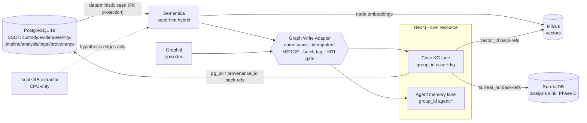

---

### 2. What goes to Neo4j vs. what stays relational

The decision rule: **Neo4j stores the *shape of relationships* and the *identity keys* needed to traverse them; PostgreSQL stores the *content, the bytes, the full provenance record, and the versioned history*.** The graph holds pointers, not payloads.

| Data | Home of record | In Neo4j? | Form in graph |
|---|---|---|---|
| Raw evidence bytes, message bodies, OCR text, GPS points, file custody chain, SHA-256 hashes | **PostgreSQL** (`custody.*`, `evidence.*`, `geo.gps_point`, `multimodal.*`) | No (payload) | Referenced by `pg_pk` from `:Message`/`:Evidence` nodes |
| Embedding vectors (message body, OCR, scene, **node embeddings**) | **Milvus** | No | Referenced by `vector_id` |
| Full provenance record (parser/config/model_run/prompt_version/review) | **PostgreSQL** `provenance.provenance` | No (record) | Each node/edge carries `provenance_id` pointer + a flattened provenance subset |
| Versioned interpretations & finding revisions | **PostgreSQL** `temporal.interpretation_*`, `analysis.finding_version` (append-only) | Current version only, as node props + `version_no` | History stays relational |
| People, organizations, children | PG `entity.person` (SSOT) | **Yes** | `:Person` (+`:Child`) nodes |
| Devices, accounts, identifiers, platforms | PG `entity.device/account/identifier/platform` | **Yes** | `:Device`/`:Account`/`:Identifier`/`:Platform` nodes |
| Person↔person relationships, co-parenting, communication ties | derived | **Yes** | typed edges |
| Events / incidents, participation, event↔event temporal anchors | PG `timeline.event`, `event_participant`, `event_relation` | **Yes** | `:Event` nodes + edges |
| Locations (significant places) | PG `geo.location` (PostGIS geom is SSOT) | **Yes** (label + geohash + ref; **no geometry math in graph**) | `:Location` nodes |
| Statements, claims, allegations | PG `analysis.*` / `evidence.*` | **Yes** | `:Statement`/`:Claim` nodes |
| Contradictions (impeachment) | PG `analysis.contradiction` | **Yes** | `:Contradiction` node **and** `:CONTRADICTS` edge |
| Abuse patterns / tactics / behavioral patterns | PG `analysis.finding`, pattern catalogs (`detection_patterns.py`, `*.ttl`) | **Yes** (HITL-gated, hypothesis) | `:Pattern`/`:Tactic` nodes |
| Vulnerabilities (sensitive) | PG `analysis.*` | **Yes** (HITL, `safe_for_legal_use=false`) | `:Vulnerability` nodes |
| Legal issues, custody factors, evidence-relevance mapping | PG `legal.*` | **Yes** | `:LegalIssue`/`:CustodyFactor` nodes + `:RELEVANT_TO` |
| Relationship/cycle phases (positive/neutral/love-bombing/repair) | PG `analysis.relationship_phase` | **Yes** | `:CyclePhase` nodes (full-cycle modeling, MP 2431–2433) |
| Analytical findings / consolidated cross-store analysis | **SurrealDB** (Phase D) + PG `analysis.finding` | **Yes** (current finding as node; `surreal_rid` back-ref) | `:Finding` nodes |
| Bulk timeline rows, raw visits/activities/paths/trips | **PostgreSQL** (raw layer) | No | Only *significant* events promoted to `:Event` |

**Rule of thumb for promotion to the graph:** a relational row is projected into Neo4j only when it (a) participates in a relationship a human or agent will traverse, or (b) needs network/path/contradiction analysis. High-volume raw rows (every GPS ping, every raw activity segment) stay in PG/DuckDB; only **stay-points, significant events, and resolved entities** reach the graph.

---

### 3. Node labels

Node labels adopt the **salem_v3** case ontology (Context Pack §3 A — HIGHEST VALUE; `salem_v3.py`) and merge it with the canonical PG entity model. salem_v3-origin labels are cited; canonical-PG additions are marked. Sensitive labels carry mandatory HITL gating.

| Label | Origin | Links to PG (`pg_table` · `pg_pk`) | Tier | Notes |
|---|---|---|---|---|
| `:Person` | salem_v3 `Person` (Adopt) + merge TraceIQ `people` | `entity.person` · `person_id` | extracted_fact | `entity_role`, `is_minor`; user + partner + child + third parties |
| `:Child` (co-label `:Person:Child`) | salem_v3 (custody scope) | `entity.person` · `person_id` | extracted_fact | `is_minor=true`; gates custody edges |
| `:Organization` | canonical PG | `entity.person/org` | extracted_fact | agencies, employers, courts, professionals |
| `:Device` | TraceIQ multi-device (Adopt) | `entity.device` · `device_id` | extracted_fact | phones, GrayKey-extracted devices |
| `:Account` | canonical PG | `entity.account` · `account_id` | extracted_fact | platform accounts |
| `:Identifier` | TraceIQ V4.1 (Adopt) | `entity.identifier` · `identifier_id` | extracted_fact | phone/email/handle; bridges raw senders → `:Person` |
| `:Platform` / `:CommunicationChannel` | TraceIQ `platform` | `entity.platform` · `platform_id` | raw_evidence | iMessage, SMS, FB, Snapchat, email, GVoice |
| `:Event` (a.k.a. `:Incident`) | salem_v3 `Incident` (Adopt) + TraceIQ `timeline_enriched` | `timeline.event` · `event_id` | extracted/inferred | `event_type`, `assertion_type`, certainty quintuple via temporal node |
| `:Location` | salem_v3 `Location` (Adopt) + TraceIQ geo | `geo.location` · `location_id` | extracted_fact | holds `geohash8/9`, `place_kind`; **PostGIS geometry stays in PG** |
| `:Statement` | salem_v3 `Statement` (Adopt) | `analysis.statement`/`evidence.*` | raw vs extracted (flagged) | a declaration by a person |
| `:Message` | TraceIQ V4.1 `messages` (Adopt) | `evidence.message` · `message_id` | raw_evidence | body stays in PG; node = pointer + metadata |
| `:Claim` / `:Allegation` | canonical (MP 1507–1509) | `analysis.*` claim rows | extracted/hypothesis | `:Allegation` co-label when not yet corroborated |
| `:Evidence` / `:EvidenceItem` | salem_v3 `Evidence` (Adopt) | `evidence.*` / `custody.file_node` · `evidence_id` | raw_evidence | **central provenance anchor** |
| `:Contradiction` | salem_v3 `CONTRADICTS` reified | `analysis.contradiction` · `contradiction_id` | analytical_finding | reified for n-ary impeachment + review state |
| `:Pattern` / `:BehavioralPattern` | salem_v3 `Tactic` (Adapt) + `behavioral_patterns.ttl`, `detection_patterns.py`, `mcl_722_23.ttl` | `analysis.finding` + pattern catalog | analytical_finding (sensitive) | **HITL**; MCL A–L, DARVO, hurtlex lanes |
| `:Tactic` | salem_v3 `Tactic` (Adapt) | `analysis.finding` | analytical (sensitive) | **HITL** |
| `:Vulnerability` | salem_v3 `Vulnerability` (Adapt) | `analysis.*` | inferred (sensitive) | **HITL**; grief/parental-identity triggers only where evidence supports |
| `:CyclePhase` / `:RelationshipPhase` | salem_v3 extension (Context Pack §3) | `analysis.relationship_phase` · `phase_id` | analytical_finding | calm/tension/escalation/reconciliation/**love_bombing**/separation — full-cycle (MP 2431–2433) |
| `:Finding` | canonical PG | `analysis.finding` · `finding_id` (+`surreal_rid`) | analytical_finding | general analytical output |
| `:LegalIssue` | canonical (MP 1507/1515) | `legal.legal_issue` · `legal_issue_id` | legal_conclusion | review-gated |
| `:CustodyFactor` | `mcl_722_23.ttl` (12 MCL factors) | `legal.custody_factor` | legal_conclusion | best-interest factors A–L |
| `:Exhibit` | canonical PG | `legal.exhibit` · `exhibit_id` | legal_conclusion | court-ready, export-gated |

**Graphiti-managed structural labels** (the agent-memory lane uses Graphiti's native node model; we do not redefine it):

| Label | Managed by | Role |
|---|---|---|
| `:Episodic` | Graphiti | an ingested episode (text / message / json unit) — the provenance unit of agent memory |
| `:Entity` | Graphiti | LLM-or-seed-extracted entity node (local model only for case content) |
| `:Community` | Graphiti | clustered entity community (network-analysis aid) |

> Case-KG-lane nodes carry **both** a domain label (e.g. `:Person`) **and** Graphiti's `:Entity` label when written through Graphiti's JSON-episode path, so Graphiti's bitemporal bookkeeping and our domain ontology coexist on the same node.

---

### 4. Relationship (edge) types

Edges adopt salem_v3 edges (Context Pack §3 A) with the mandated renames and the **`RELATED_TO` split** into typed causal/temporal/topical subtypes. Sensitive/allegation edges are **Preserve-as-Hypothesis**: written with `hypothesis=true` and `safe_for_legal_use=false`, never promoted to fact without HITL (MP 2419/2469, Constraint 2448).

| Edge type | Direction | Origin / classification | Key properties | Tier / gate |
|---|---|---|---|---|
| **Person ↔ Person** | | | | |
| `:RELATED_TO` (abstract — always use a subtype below) | Person→Person | salem_v3 `RELATED_TO` **Split** | `relation_subtype` | — |
| `:PARENT_OF` | Person→Child | canonical | `valid_from/valid_to` | fact |
| `:CO_PARENT_OF` | Person↔Person | canonical (custody) | bitemporal | fact |
| `:PARTNER_OF` / `:FORMER_PARTNER_OF` | Person↔Person | canonical | `valid_from/valid_to` (relationship change, MP 1514) | fact |
| `:FAMILY_OF`, `:PROFESSIONAL_FOR` | Person↔Person | canonical | `role` | fact |
| `:COMMUNICATED_WITH` | Person↔Person | derived from messages | `channel`, `count`, `first_at`, `last_at` | extracted |
| **Person ↔ Event** | | | | |
| `:PARTICIPATED_IN` | Person→Event | salem_v3 (Adopt) | `role` (actor/subject/witness/third_party/child), `confidence` | extracted |
| `:WITNESSED`, `:SUBJECT_OF` | Person→Event | canonical (role refinement) | `confidence` | extracted |
| `:WAS_AT` | Person→Location | salem_v3 (Adopt) | `temporal_assertion_id`, `location_confidence`, `source_provenance` | extracted/inferred |
| **Person ↔ Device / Account** | | | | |
| `:USES_DEVICE` / `:OWNS_DEVICE` | Person→Device | canonical | `valid_from/valid_to`, `confidence` | extracted |
| `:HAS_ACCOUNT` / `:CONTROLS_ACCOUNT` | Person→Account | canonical | `confidence` | extracted |
| `:IDENTIFIED_BY` | Person→Identifier | TraceIQ V4.1 | `confidence`, `valid_from/valid_to` (changed numbers) | extracted; identity-resolution HITL |
| `:HOSTED_ON` | Account→Platform | canonical | — | fact |
| **Message ↔ Claim / Statement** | | | | |
| `:AUTHORED` / `:MADE_STATEMENT` | Person→Message/Statement | salem_v3 `MADE_STATEMENT` (Adopt) | `confidence` | extracted |
| `:ASSERTS` / `:CONTAINS_CLAIM` | Message/Statement→Claim | canonical (MP 2052) | `confidence`, `span` (char offsets into PG body) | extracted |
| `:SENT_TO` / `:RECEIVED_BY` | Message→Person | TraceIQ message_party | `role` | raw |
| **Event ↔ Location** | | | | |
| `:OCCURRED_AT` | Event→Location | canonical (MP 2053) | `location_confidence`, `source_provenance` (gps/message/photo_exif/claim) | extracted/inferred |
| **Event ↔ Event (temporal anchors)** | | | | |
| `:PRECEDED` / `:FOLLOWED` | Event→Event | salem_v3 `RELATED_TO` **Split** (temporal) | `gap_seconds`, `t_certainty` | extracted/inferred |
| `:ANCHORED_TO` | Event→Event | canonical (MP 2054, "known sequence") | `anchor_kind` (before/after/during) | inferred |
| `:CO_OCCURRED` / `:PART_OF` | Event→Event | salem_v3 Split (topical/composite) | `confidence` | inferred |
| `:CAUSED` | Event→Event | salem_v3 Split (causal) | `hypothesis=true` | **hypothesis, HITL** (causation ≠ correlation, Constraint 2445) |
| **Claim ↔ Evidence** | | | | |
| `:SUPPORTED_BY` / `:CORROBORATED_BY` | Claim/Finding→Evidence | salem_v3 + canonical (MP 2055) | `weight`, `corroboration_status` | analytical |
| `:ORIGINATES_FROM` | Claim/Event→Evidence | TraceIQ event_source `origin` | — | raw link |
| **Claim ↔ Contradiction** | | | | |
| `:CONTRADICTS` | Statement/Claim→Statement/Claim | salem_v3 `CONTRADICTS` (Adopt — impeachment) | `basis`, `confidence`, `safe_for_legal_use=false` | analytical, **HITL** |
| `:IMPEACHED_BY` | Person/Claim→Contradiction | canonical reification | — | analytical |
| `:INVOLVES` | Contradiction→Statement | reification edge | `role` (a/b) | analytical |
| **Pattern ↔ Event / Person** | | | | |
| `:INSTANTIATED_BY` / `:EVIDENCED_BY` | Pattern→Event/Message | canonical (MP 2057) | `confidence`, `detector` (e.g. `detection_patterns.py` rule id) | analytical, **HITL** |
| `:EXHIBITS_PATTERN` | Person→Pattern | canonical | `confidence`, `hypothesis=true` | **hypothesis, HITL** |
| `:USED_TACTIC` | Person→Tactic | salem_v3 (**Preserve-as-Hypothesis**) | `hypothesis=true`, `safe_for_legal_use=false`, `target_person_id` | **HITL before court** |
| `:EXPLOITED_VULNERABILITY` (was `TARGETED_WOUND`) | Person→Vulnerability | salem_v3 (**Preserve-as-Hypothesis**, renamed) | `hypothesis=true`, `confidence` (low) | **HITL** |
| `:DISPARAGES` (was `SPREADS_RUMOR`) | Statement→Person | salem_v3 (**Preserve-as-Hypothesis**, renamed) | `hypothesis=true` | **HITL** |
| **Custody-relevant (sensitive)** | | | | |
| `:EXPOSED_CHILD` | Event→Child | salem_v3 (Adopt) | `confidence`, verify `:Child.is_minor` | **HITL** |
| `:AFFECTED_PARENTING_ACCESS` (was `AFFECTED_ACCESS`) | Event→Person | salem_v3 (Adopt, renamed) | `confidence`, `direction` | **HITL** |
| **Legal-issue ↔ Evidence** | | | | |
| `:RELEVANT_TO` | Evidence/Finding/Claim→LegalIssue/CustodyFactor | canonical (MP 2058, 1515) | `usefulness_rating`, `prejudice_risk`, `required_corroboration` | legal, **review-gated** |
| `:SUPPORTS_FACTOR` | Finding→CustodyFactor | `mcl_722_23.ttl` | `confidence` | legal, **review-gated** |
| **Cycle / accountability (both-parties, full-cycle)** | | | | |
| `:DURING_PHASE` | Event→CyclePhase | canonical (MP 2431–2433) | — | analytical |
| `:REACTION_TO` | Event→Event | canonical (reactive context) | `actor_party`; preserves user's own reactions in temporal context (Constraint 2442–2444) | analytical, **HITL** |
| `:CONTRASTS_WITH` | Event→Event | canonical | links positive→later-contradicting conduct (MP 491) | analytical |

> **Both-parties / full-cycle (Constraint 2431–2433, 2440–2444).** The ontology must not be one-sided. `:CyclePhase` (incl. `love_bombing`, `reconciliation`, `calm`), `:REACTION_TO`, and `:CONTRASTS_WITH` exist specifically so the user's own mistakes, escalations, apologies, and repair attempts are modeled with the **same fidelity** as adverse conduct, always with surrounding temporal context. A node/edge that asserts adverse conduct by either party must carry evidence support or it is a `hypothesis`.

---

### 5. Key properties (every node and edge)

A uniform property contract makes the graph auditable and reversible. **Every node and every edge** in either lane carries the following property block (in addition to its domain-specific props above). These mirror the PG `provenance.provenance` and the §0 design contract of the Canonical Data Model.

| Property | Type | Meaning |
|---|---|---|
| `uid` | string | deterministic graph key = `"<Label>:<pg_pk>"` → makes projection **idempotent** (MERGE on `uid`) and reversible |
| `pg_table` | string | source table in PostgreSQL SSOT |
| `pg_pk` | string (uuid) | primary key in that table → the link back to relational truth |
| `provenance_id` | string (uuid) | → `provenance.provenance` (full provenance record stays in PG) |
| `source_id` | string (uuid) | → `custody.source` (root of the custody chain) |
| `surreal_rid` | string (nullable) | → SurrealDB record id for analytical projections (Phase D) |
| `vector_id` | string (nullable) | → Milvus vector (node/body embedding) |
| `assertion_type` | enum | `raw_evidence \| extracted_fact \| inferred_fact \| analytical_finding \| legal_conclusion` (five-tier epistemics — never conflated) |
| `confidence` | float 0–1 | calibrated confidence |
| `hypothesis` | bool | `true` = allegation/inference, **not** an established fact (Constraint 2419/2469) |
| `safe_for_legal_use` | bool | default **false**; only a passed review flips it true |
| `review_status` | enum | `unreviewed \| in_review \| approved \| rejected \| needs_more` |
| `human_review_id` | string (nullable) | → the review decision that gated it |
| `writer` | enum | `semantica_seed \| semantica_hybrid \| graphiti \| adapter_manual` (separability) |
| `write_batch_id` | string (uuid) | the projection/episode batch → **reversibility** (delete by batch) |
| `lane` | enum | `case_kg \| agent_mem` |
| `group_id` | string | Graphiti partition (`case:<case_id>:kg`, `agent:mem`, …) |
| `ontology_version` / `schema_version` / `prompt_version` / `model_run_id` | string | artifact lineage (Constraint 2436) so output traces to ontology/schema/prompt/model versions |
| `valid_from` / `valid_to` | datetime (nullable) | **valid time** — when the fact is/was true in the world |
| `recorded_at` / `invalidated_at` | datetime | **transaction/knowledge time** — when the system learned / stopped believing it |
| `t_precision` / `t_certainty` | enum | timestamp precision class — `exact \| approximate \| inferred \| uncertain` (Constraint 2421; missing from ALL prior schemas, added here) |

---

### 6. Temporal relationship strategy (bitemporal)

The graph is **bitemporal**, aligned with Graphiti's native temporal model and ADR-0014/0018/0031 ("valid + knowledge-time + disclosure-tier multi-pass"). Two independent time axes live on every fact-bearing edge:

| Axis | Properties | Question it answers |
|---|---|---|
| **Valid time** (world time) | `valid_from`, `valid_to` | *When was this true in reality?* (e.g. a phone number belonged to a person Jan–Aug; a `:PARTNER_OF` relationship held over a span) |
| **Transaction / knowledge time** | `recorded_at`, `invalidated_at` | *When did the system come to believe it, and when (if ever) did it stop?* |

Rules:

1. **Append-only, never destructive.** Superseding a fact does **not** delete the old edge; it sets `invalidated_at` on the superseded edge and creates a new edge with a fresh `valid_from`/`recorded_at`. Prior interpretations are preserved side-by-side (Constraint 2470; mirrors PG `temporal.interpretation_version` and `analysis.finding_version`). This is exactly how `:CONTRADICTS` and reinterpretation (the gaslighting/self-blame engine) are represented without rewriting history.
2. **Certainty is first-class.** Every temporal property group carries `t_precision`/`t_certainty`. An event whose time is "sometime that spring" is `inferred`/`uncertain`, anchored via an `:ANCHORED_TO` edge to a known event rather than given a false-precise timestamp. Relative-time expressions resolve through PG `temporal.relative_time_expr` and its `anchor_event_id`.
3. **Event-to-event anchoring.** When absolute time is unknown, order is still captured: `:PRECEDED`/`:FOLLOWED`/`:ANCHORED_TO` edges encode known sequence (MP 2054) with `gap_seconds` where derivable. This lets timeline reasoning proceed on partial information.
4. **Relationship change over time** (MP 1514). `:PARTNER_OF` → `:FORMER_PARTNER_OF`, custody arrangements, changed phone numbers — all modeled as valid-time-bounded edges, so a point-in-time query ("who controlled this account in March?") is answerable.
5. **Graphiti compatibility.** Graphiti already stamps edges with `valid_at`/`invalid_at` (valid time) and `created_at`/`expired_at` (transaction time). The adapter maps our `valid_from/valid_to` ↔ Graphiti `valid_at/invalid_at` and `recorded_at/invalidated_at` ↔ `created_at/expired_at`, so both writers produce one consistent bitemporal model.

```cypher
// Superseding a fact (append-only): old number invalidated, new asserted — nothing deleted
MATCH (p:Person {uid:'Person:...'})-[r:IDENTIFIED_BY]->(old:Identifier {uid:'Identifier:OLD'})
WHERE r.valid_to IS NULL
SET   r.valid_to = date('2025-08-01'), r.invalidated_at = datetime()
WITH  p
MATCH (new:Identifier {uid:'Identifier:NEW'})
MERGE (p)-[r2:IDENTIFIED_BY {write_batch_id:$batch}]->(new)
SET   r2.valid_from = date('2025-08-01'), r2.recorded_at = datetime(),
      r2.confidence = 0.95, r2.t_certainty = 'exact', r2.assertion_type='extracted_fact';
```

---

### 7. Provenance strategy

**Principle: PostgreSQL `provenance.provenance` is the system of record for provenance; the graph carries pointers plus a flattened, queryable subset.** Every derived object traces to source evidence (Constraint 2422, MP 1851–1871).

- **Pointer + flatten.** Each node/edge holds `provenance_id` (→ full PG record) *and* a flattened subset (`source_id`, `model_run_id`, `prompt_version`, `ontology_version`, `schema_version`, `writer`, `confidence`) so common "where did this come from?" queries run in-graph without a PG round-trip, while the canonical record stays relational and append-only.
- **Evidence anchoring.** `:Evidence`/`:EvidenceItem` is the central provenance anchor (salem_v3). Every fact-bearing edge is reachable to evidence via `:SUPPORTED_BY` / `:ORIGINATES_FROM`, so any claim can produce its support path (see explainable reasoning, §10). A `:Finding` or `:Claim` with **no** path to `:Evidence` is, by construction, a `hypothesis`.
- **PROV-O alignment (Semantica governance).** Semantica's writes are modeled on W3C PROV-O: domain nodes map to `prov:Entity`, processing runs to `prov:Activity`, models/people/parsers to `prov:Agent`, related by `prov:wasDerivedFrom` (→ `:ORIGINATES_FROM`), `prov:wasGeneratedBy` (→ `model_run_id`), `prov:wasAttributedTo` (→ `writer`/`human_review_id`). This matches the salvaged **Semantica pipeline** (NER, temporal KG, conflict detection, PROV-O, `source_hash`; Context Pack §3).
- **Artifact lineage** (Constraint 2436). Final court-facing nodes (`:Exhibit`, approved `:Finding`) trace back through `model_run_id` → `prompt_version` → `ontology_version` → `schema_version` → `human_review_id` → `source_id`. Intermediate work products (scans, drafts, classifications, tool outputs) are persisted in PG `provenance.work_artifact` and referenced, never silently discarded (Constraint 2434–2435).
- **No silent promotion.** A `hypothesis=true` edge can only become `hypothesis=false` / `safe_for_legal_use=true` through a logged `human_review_id`; the adapter rejects any write that flips these without one (Constraint 2469).

---

### 8. The Graph Write Adapter (traceable · separable · reversible)

MP 1519 mandates an adapter layer so Graphiti and Semantica-style writes "remain traceable, separable, and reversible." **All** writes to Neo4j — from Graphiti, from Semantica, from manual tooling — pass through one `GraphWriteAdapter`. It is the single chokepoint that enforces the property contract, the lane separation, the privacy guardrail, and the HITL gate.

Adapter responsibilities:

| Concern | Mechanism |
|---|---|
| **Traceability** | Stamps every node/edge with the full §5 property block; refuses writes missing `provenance_id` + `source_id` + `assertion_type` + `writer` |
| **Separability** | Tags `writer` and `group_id`/`lane` on every element; Graphiti-origin vs Semantica-origin vs manual are always distinguishable and queryable |
| **Reversibility** | Tags `write_batch_id` on every element; any batch (a seed run, a Semantica enrichment pass, a Graphiti episode) can be rolled back with one `MATCH ()-[r{write_batch_id:$b}]-() DELETE r` + orphan cleanup — without touching other batches |
| **Idempotency** | `MERGE` on deterministic `uid = "<Label>:<pg_pk>"`; re-projecting the same PG state is a no-op, so PG→graph sync can run repeatedly/safely |
| **Privacy guardrail** | Routes any case-content extraction to the **local ≤4B model**; blocks cloud-LLM extraction on `lane=case_kg`; cloud extraction permitted only for non-case operational memory |
| **HITL gate** | Sensitive labels/edges (`:Tactic`, `:Vulnerability`, `:USED_TACTIC`, `:CONTRADICTS`, `:RELEVANT_TO`, custody edges) are written with `safe_for_legal_use=false`; promotion requires the `agno-gateway` **review-gatekeeper** agent's approval (Context Pack §4 — agno writes route via review-gatekeeper) |
| **Reconciliation with PG** | On project, validates `pg_pk` exists in the named `pg_table`; writes `neo4j_uid` back onto the PG row (optional convenience column) for bidirectional lookup |

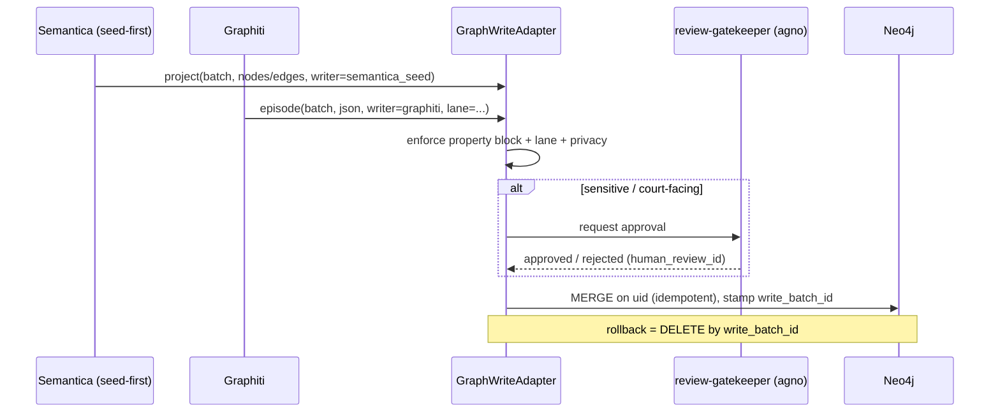

Because the adapter is the only writer, **if the real Semantica implementation differs** from the seed-first-hybrid assumption (MP 1519), only the adapter's Semantica binding changes — the graph contract, the PG SSOT, and Graphiti are untouched. This is the reversibility/portability hedge the master prompt asks for.

---

### 9. Graphiti episode strategy

Graphiti is **episode-driven**: every write is an *episode* (a content snippet) from which Graphiti derives entity nodes and fact edges, each stamped with bitemporal metadata and grouped by `group_id`. We use Graphiti two ways, split by lane.

**A. Agent-memory lane (`group_id = agent:*`).** This is Graphiti's home turf and how it is already wired as the `graphiti` MCP server (CLAUDE.md). Episodes record durable operational facts as they are established — decisions, owner preferences, infra/endpoint changes, "X is now Y" corrections, session handoffs, processing-run state. Episode types:

| Episode type | Use | Example |
|---|---|---|
| `text` | free-form agent observation / decision | "Decided Semantica runs seed-first; writes our Neo4j+Milvus (ADR-0035)." |
| `message` | conversation turns (agent ↔ owner) | session handoffs |
| `json` | structured operational state | ingestion-run summary `{run_id, files, status}` |

These episodes power **cross-session resume** (Constraint 2439, 2455): the memory layer reconstructs project context without re-reading everything. This lane may use Graphiti's standard extractor **only** because it contains no raw case evidence.

**B. Case-KG lane (`group_id = case:<case_id>:kg`) — structured-JSON episodes ONLY.** For any case content, we **do not** let Graphiti's LLM infer entities from raw text (privacy guardrail). Instead the adapter feeds Graphiti **`json` episodes whose entities and edges are already resolved in PostgreSQL** — Graphiti is used for its **bitemporal bookkeeping and episode provenance**, not for extraction. Each episode:

- corresponds to one ingestion/projection unit and carries `source_id` + `provenance_id`;
- defines the `valid_at` (valid time) of the facts it asserts and is itself the `:Episodic` provenance node, so every derived edge is traceable to the episode that produced it;
- is append-only — a correction is a **new** episode that invalidates prior facts (never an edit), preserving the audit trail.

> **Episode = provenance unit.** Treating each episode as the atom of provenance is what lets Graphiti's "evolving facts / fact invalidation" feature implement our append-only reinterpretation requirement natively, while the actual evidence and full provenance record remain in PG.

---

### 10. Semantica context-graph strategy (seed-first hybrid)

Semantica is the **case knowledge-graph builder** and runs **seed-first hybrid** (ADR ~0035), writing **our Neo4j + Milvus**. Two phases:

**Phase 1 — SEED (deterministic, no LLM, court-grade).**
The canonical case graph is **projected directly from PostgreSQL foreign keys** — zero inference, zero LLM. Every structural fact already proven in the relational SSOT becomes a node/edge:

| PG source | → Graph |
|---|---|
| `entity.person` / `device` / `account` / `identifier` / `platform` | `:Person`/`:Device`/`:Account`/`:Identifier`/`:Platform` nodes |
| `entity.identity_resolution` (HITL-approved merges) | `:IDENTIFIED_BY` edges |
| `timeline.event` + `event_participant` | `:Event` + `:PARTICIPATED_IN` |
| `timeline.event_relation` (typed) | `:PRECEDED`/`:PART_OF`/`:CAUSED?` |
| `geo.location` + `geo.location_assertion` | `:Location` + `:OCCURRED_AT`/`:WAS_AT` |
| `evidence.message` + `message_party` | `:Message` + `:AUTHORED`/`:SENT_TO` |
| `timeline.event_source` (corroborates/contradicts/origin) | `:SUPPORTED_BY`/`:CONTRADICTS`/`:ORIGINATES_FROM` |
| `analysis.contradiction` | `:Contradiction` + `:CONTRADICTS`/`:INVOLVES` |
| `analysis.relationship_phase` | `:CyclePhase` + `:DURING_PHASE` |
| `legal.evidence_relevance` (approved) | `:RELEVANT_TO`/`:SUPPORTS_FACTOR` |

This phase is fully provenanced, idempotent (MERGE on `uid`), and re-runnable — the graph is always reconstructable from PG.

**Phase 2 — HYBRID (local-model enrichment, hypotheses only).**
On top of the deterministic seed, Semantica proposes **candidate** structure using the **local ≤4B model** and the salvaged abuse-pattern prior art (`detection_patterns.py` 256 patterns / MCL A–L / DARVO, `behavioral_patterns.ttl`, `seed-patterns.ts`, `hurtlex_loader`; Context Pack §3): typed `RELATED_TO` splits, `:EXHIBITS_PATTERN`, `:USED_TACTIC`, contradiction candidates, vulnerability/tactic inferences. **Every Phase-2 write is `hypothesis=true`, `safe_for_legal_use=false`, review-gated.** Nothing here is a fact until a human approves it.

**Context graphs & explainable reasoning (MP 1494–1496, 1517).**
Semantica's value is *explainable* reasoning: for any claim, it returns the **context subgraph** — the minimal evidence path supporting it. Example: "Why does the system associate Event E with custody factor MCL-(c)?" returns `(:CustodyFactor)<-[:SUPPORTS_FACTOR]-(:Finding)-[:INSTANTIATED_BY]->(:Event E)-[:SUPPORTED_BY]->(:Evidence)-[pg_pk]->custody.source`. This is exactly what makes output court-defensible: no conclusion without a visible, provenanced path back to raw evidence.

**Node embeddings → Milvus (ADR ~0035).** Semantica writes node embeddings to Milvus (`vector_id` back-ref on the node) for graph-aware hybrid retrieval (find structurally + semantically similar people/events/messages). Embeddings of case content use the **local/approved embedder** per the embedding contract (ADR-0010/0011/0026); raw evidence never leaves local for embedding.

```cypher
// Explainable support path for a court-facing claim (read-only, returns provenance trail)
MATCH path = (i:LegalIssue {uid:$issue})<-[:RELEVANT_TO]-(f:Finding)
             -[:INSTANTIATED_BY|EVIDENCED_BY]->(e:Event)
             -[:SUPPORTED_BY|ORIGINATES_FROM]->(ev:Evidence)
WHERE f.safe_for_legal_use = true
RETURN path, f.confidence, ev.pg_pk AS evidence_pg_pk, ev.source_id;
```

---

### 11. Required graph-modeling patterns (MP 2049–2059)

Each required relationship pattern, with its concrete graph encoding and the link back to relational truth.

| # | Pattern (MP) | Graph encoding | Notes / gate |
|---|---|---|---|
| 1 | **Person-to-person** | `(:Person)-[:CO_PARENT_OF\|PARTNER_OF\|FORMER_PARTNER_OF\|FAMILY_OF\|COMMUNICATED_WITH]->(:Person)` | bitemporal (`valid_from/valid_to`) for relationship change (MP 1514) |
| 2 | **Person-to-event participation** | `(:Person)-[:PARTICIPATED_IN {role,confidence}]->(:Event)` | role enum incl. `witness`/`child`; from PG `event_participant` |
| 3 | **Person-to-device/account** | `(:Person)-[:USES_DEVICE\|OWNS_DEVICE]->(:Device)`, `(:Person)-[:HAS_ACCOUNT\|CONTROLS_ACCOUNT]->(:Account)`, `(:Person)-[:IDENTIFIED_BY]->(:Identifier)-[:HOSTED_ON]->(:Platform)` | identity resolution is HITL; multi-device attribution preserved |
| 4 | **Message-to-claim** | `(:Person)-[:AUTHORED]->(:Message)-[:ASSERTS {span}]->(:Claim)` | `span` = char offsets into PG message body (body stays in PG) |
| 5 | **Event-to-location** | `(:Event)-[:OCCURRED_AT {location_confidence,source_provenance}]->(:Location)` | geometry math in PostGIS; graph holds geohash + ref |
| 6 | **Event-to-event temporal anchors** | `(:Event)-[:PRECEDED\|FOLLOWED\|ANCHORED_TO\|CO_OCCURRED\|PART_OF]->(:Event)`; `:CAUSED` only as `hypothesis` | enables ordering under uncertain time (causation≠correlation, Constraint 2445) |
| 7 | **Claim-to-evidence support** | `(:Claim\|:Finding)-[:SUPPORTED_BY\|CORROBORATED_BY {weight}]->(:Evidence)` | no support path ⇒ `hypothesis=true` by construction |
| 8 | **Claim-to-contradiction** | `(:Statement\|:Claim)-[:CONTRADICTS {basis,confidence}]->(:Statement\|:Claim)`; reified `(:Contradiction)-[:INVOLVES]->(:Statement)` | impeachment value; `safe_for_legal_use=false`, **HITL** |
| 9 | **Pattern-to-event** | `(:Pattern)-[:INSTANTIATED_BY {detector,confidence}]->(:Event\|:Message)`; `(:Person)-[:EXHIBITS_PATTERN]->(:Pattern)` | abuse-pattern lane; **all HITL**, sensitive-label review before court |
| 10 | **Legal-issue-to-evidence** | `(:Evidence\|:Finding\|:Claim)-[:RELEVANT_TO {usefulness,prejudice_risk,required_corroboration}]->(:LegalIssue\|:CustodyFactor)` | review-gated; carries litigation-risk + corroboration flags (MP 1830–1847) |

Worked seed example (deterministic, court-grade — Person↔Event↔Location with provenance):

```cypher
MERGE (p:Person {uid:'Person:'+$person_id})
  ON CREATE SET p.pg_table='entity.person', p.pg_pk=$person_id,
                p.provenance_id=$prov, p.assertion_type='extracted_fact',
                p.writer='semantica_seed', p.lane='case_kg',
                p.group_id=$gid, p.write_batch_id=$batch
MERGE (e:Event {uid:'Event:'+$event_id})
  ON CREATE SET e.pg_table='timeline.event', e.pg_pk=$event_id,
                e.provenance_id=$prov, e.assertion_type='extracted_fact',
                e.writer='semantica_seed', e.write_batch_id=$batch
MERGE (l:Location {uid:'Location:'+$location_id})
  ON CREATE SET l.pg_table='geo.location', l.pg_pk=$location_id, l.geohash9=$gh9
MERGE (p)-[pi:PARTICIPATED_IN {write_batch_id:$batch}]->(e)
  SET pi.role='subject', pi.confidence=$pc, pi.provenance_id=$prov, pi.assertion_type='extracted_fact'
MERGE (e)-[oa:OCCURRED_AT {write_batch_id:$batch}]->(l)
  SET oa.location_confidence=$lc, oa.source_provenance='gps',
      oa.valid_from=$vfrom, oa.recorded_at=datetime(),
      oa.t_certainty=$tcert, oa.assertion_type=CASE WHEN $lc>=0.6 THEN 'extracted_fact' ELSE 'inferred_fact' END;
```

---

### 12. How graph records link back to PostgreSQL and SurrealDB

| Direction | Mechanism |
|---|---|
| **Graph → PostgreSQL** | Every node/edge carries `pg_table` + `pg_pk` (+ `provenance_id`, `source_id`). Resolve full content/provenance with a keyed lookup. `uid = "<Label>:<pg_pk>"` guarantees a 1:1 deterministic map |
| **PostgreSQL → Graph** | Optional convenience column `neo4j_uid` written back on project; otherwise the graph node is found by constructing `"<Label>:<pk>"`. No data duplicated — just a join key |
| **Graph → SurrealDB** | Analytical nodes/edges (`:Finding`, `:Contradiction`, hybrid hypotheses) carry `surreal_rid` → the SurrealDB record holding the consolidated cross-store analysis (Phase D). Heavy analytical computation lives in SurrealDB/DuckDB, not in graph traversal |
| **Graph → Milvus** | `vector_id` on nodes/messages → Milvus vectors (node + body embeddings) for hybrid graph+semantic retrieval |
| **Rebuild contract** | PG is SSOT. Neo4j = `project(PG)`. SurrealDB = `pipeline(PG)`. Milvus = `embed(PG raw)`. All three are reconstructable from PostgreSQL; none holds an un-backed fact |

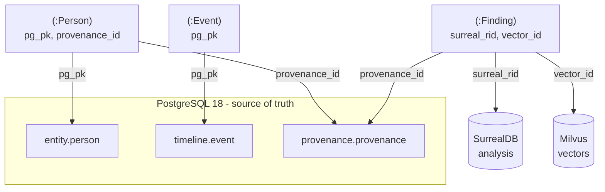

---

### 13. Constraints, indexes & operational notes

- **Uniqueness:** `CREATE CONSTRAINT FOR (n:Person) REQUIRE n.uid IS UNIQUE;` (repeat per domain label) — enforces idempotent projection and prevents duplicate identity.
- **Lookup indexes:** btree on `pg_pk`, `provenance_id`, `source_id`, `group_id`, `write_batch_id`, `review_status`, `safe_for_legal_use`, `valid_from`/`valid_to` for time-slice and rollback queries.
- **Graphiti reserved space:** Graphiti owns `:Episodic`/`:Entity`/`:Community` and its own indexes; our domain constraints attach to domain labels only, so the two coexist.
- **Court-facing query default:** any export/exhibit query filters `WHERE n.safe_for_legal_use = true AND n.hypothesis = false` — hypotheses are invisible to court-facing paths until reviewed (Constraint 2427/2469).
- **Backup:** Neo4j on its own bind-mounted volume (Docker mapped-volumes preference, Context Pack §1); rebuildable from PG regardless, but snapshotted independently.
- **Community edition:** Neo4j Community + Graphiti (ADR-0014/0018/0031) — no Enterprise features assumed; multi-database is emulated via `group_id`/`lane` partitioning, not separate Neo4j DBs.

---

### 14. Needs-human-review / open items

1. **salem_v3 is one-sided.** It models only adversarial conduct (`Tactic`, `Vulnerability`, `USED_TACTIC`, `TARGETED_WOUND`). MP 2431–2433/2440–2444 require modeling **both parties**, the **full relational cycle**, and the **user's own reactions in temporal context**. This section adds `:CyclePhase` (incl. `love_bombing`/`reconciliation`/`calm`), `:REACTION_TO`, `:CONTRASTS_WITH`, and a `conduct_party` property — **these additions need owner sign-off** before use (they extend, not replace, the VIP salem_v3 ontology).
2. **Semantica implementation is assumed, not confirmed (ADR ~0035 not yet read in full).** The seed-first-hybrid + writes-our-Neo4j+Milvus model is taken from the Context Pack and the task brief; the adapter layer (§8) is the deliberate hedge so a different real Semantica wiring changes only the adapter binding. **Confirm ADR-0035 specifics.**
3. **Graphiti default extractor is cloud-LLM.** The privacy-safe design here (seed-first + structured-JSON episodes + local ≤4B for any case content) **must be enforced in the adapter and in the Graphiti server config**, not assumed. Verify the deployed `graphiti` MCP server's model binding before any case content is ingested — otherwise raw evidence could be sent to a cloud model (Context Pack §4 hard guardrail).
4. **`:CAUSED` and all hypothesis edges** stay `safe_for_legal_use=false` pending review; causation-vs-correlation and selective-framing checks (Constraint 2445–2446) are review-gatekeeper responsibilities, not encoded in the graph alone.


---


## SurrealDB Consolidated Analysis Model

> _Byline: Claude Code · Opus 4.8 (1M) · 2026-06-30_
>
> **Status banner — read before implementing.** SurrealDB is the *consolidated analysis store* in the SPEC-1 design (MP 1521–1539; section requirement MP 2060–2077). Per the context pack, it is **RATIFIED in principle (ADR-0024, amended by ADR-0027/0032) but NOT YET DEPLOYED — Phase D.** The orchestration brief asks this section to treat SurrealDB as a *proposal* and rule on **adopt vs defer**; that is consistent with the context pack, because the architectural *intent* is locked but the *deployment* decision is still open. This section therefore presents SurrealDB as a **Phase-D proposal whose go/no-go is decided here**, analyzes the duplication and synchronization risk against the cheaper alternative (PostgreSQL materialized views + JSONB), and gives an explicit, conditional recommendation. **Nothing in this section blesses a second system of record** — that would violate the locked stack and the "minimize custom code / off-the-shelf-first" principle.

---

### 1. What this layer is (and is not)

SurrealDB is proposed as a **derived, read-optimized analysis-and-workspace store** that sits *downstream* of the canonical evidence stack. It is the place where already-extracted, already-normalized facts are **re-projected into agent- and human-friendly shapes**: cross-source timelines, multi-pass pattern findings, legal-strategy scratchpads, evidence-gathering plans, and human-review queues.

| It IS | It is NOT |
|---|---|
| A consolidation / projection layer (an **analysis sink**, per ADR-0024) | A system of record for evidence |
| A workspace for hypotheses, drafts, plans, review state | A replacement for PostgreSQL, Milvus, or Neo4j |
| A single multi-model surface (document + graph + KV + live queries) for *agents* | A new place to first-ingest raw evidence |
| Rebuildable from upstream at any time | A store anyone may treat as authoritative on conflict |

**Hard rule (data-classification firewall).** Per cross-cutting guardrails, SurrealDB holds **inferred facts, analytical findings, hypotheses, drafts, and legal conclusions** — it is the natural home for the "softer" tiers. **Raw evidence and extracted facts remain canonical in PostgreSQL** (`agno-postgres:18-duckdb`, ADR-0013) and Neo4j/Graphiti (ADR-0014/0031). Every SurrealDB record that asserts anything about the world MUST carry `assertion_type ∈ {raw, extracted, inferred, analytical, legal_conclusion}`, `confidence`, `timestamp_certainty ∈ {exact, approximate, inferred, uncertain}`, and ≥1 federated evidence citation. This mirrors the salem_v3 extension mandate (context pack §2) and the global Constraints (MP 2420–2421, 2436–2438).

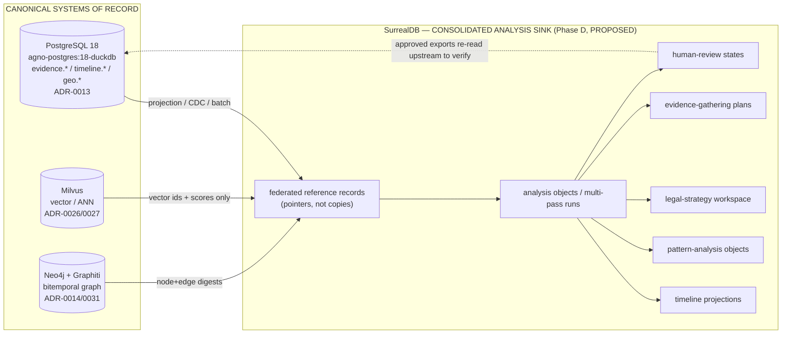

---

### 2. Why SurrealDB is useful here (the case FOR)

1. **Agno-native session/memory + analysis in one engine (ADR-0024).** Agno already targets SurrealDB for store/session/memory. Co-locating the *analysis sink* with agent memory means the 6 forensic agents (agno-gateway, context pack §3) read working state and analysis projections from one place, with one driver, instead of fanning queries across three engines per turn.
2. **Multi-model fit for a multi-shape problem.** The analysis layer is genuinely document-shaped (multi-pass JSON findings, prompt versions, tool-call outputs), graph-shaped (narrative reconstruction, contradiction chains), and KV-shaped (session/resume state). SurrealDB does all three natively, so agents avoid impedance-mismatch glue.
3. **Native bitemporality (ADR-0024) for the workspace tier.** The analysis layer needs *valid time* (when something was true in the relationship) vs *knowledge time* (when we concluded it) — exactly the multi-pass, "preserve prior interpretations, never overwrite" requirement (MP 2438, 2470). This complements (does not replace) Graphiti's bitemporal graph, which remains the substrate for entity/relationship truth (context pack §1).
4. **`LIVE SELECT` for human-review queues.** SurrealDB live queries let the review UI and gatekeeper agent subscribe to changes in the human-review queue without polling — a clean fit for the HITL-on-every-write guardrail.
5. **Record links + graph edges for cross-source narrative.** `RELATE` edges plus record links let a narrative pass stitch a PG message, a Neo4j `CONTRADICTS` edge, and a Milvus-surfaced near-duplicate into one reviewable "narrative beat" object.

**But none of these are free.** §6 quantifies the cost; §7 rules.

---

### 3. Record types (tables)

SurrealDB tables (`DEFINE TABLE ... SCHEMAFULL` recommended for auditability — schemaless is rejected for a court-facing system). Naming uses `surreal.*` conceptually; physical namespace/db = `forensic:analysis`. **All record IDs are stable and traceable**; where a record projects an upstream row it stores the upstream key, never a renumbered surrogate.

#### 3.1 Common envelope (mixin on every assertion-bearing record)

Every analysis/finding/plan record embeds this provenance + classification envelope (enforced via `DEFINE FIELD`):

| Field | Type | Meaning |
|---|---|---|
| `assertion_type` | `string` (enum) | raw / extracted / inferred / analytical / legal_conclusion |
| `confidence` | `float` 0–1 + `confidence_band` enum (HIGH/MED/LOW) | re-derivable, **never hard-coded 0.6** (crosswalk: `vw_forensic_evidence_package` lesson) |
| `timestamp_certainty` | `string` (enum) | exact / approximate / inferred / uncertain |
| `valid_time` | `{start, end}` datetime | when true in the world (bitemporal) |
| `knowledge_time` | `datetime` (set on insert, append-only) | when we asserted it |
| `evidence_refs` | `array<record(fed_ref)>` | ≥1 federated citation (§4); MUST be non-empty for inferred+ tiers |
| `provenance` | `object` | `{run_id, prompt_version, ontology_version, schema_version, model_id, tool_call_id}` (artifact lineage, MP 2436/2452) |
| `review` | `record(review_state)` | link to human-review state (§3.7) |
| `supersedes` | `option<record>` | prior version this revises (append-only; never overwrite, MP 2470) |
| `case_id` | `string` | scope (salem_v3 caption generalized to `case_id`, context pack §2) |

#### 3.2 Core analysis tables

| Table | Purpose | Key fields (beyond envelope) | Adopted/adapted from |
|---|---|---|---|
| `fed_ref` | Federated pointer to a canonical record (no payload copy) | `target_system` (postgres/milvus/neo4j), `target_locator`, `digest` (sha256 of cited content for tamper-evidence), `snapshot_at` | New (federation primitive); custody hash aligns w/ ADR-0013 uuidv7 + SHA-256 chain |
| `analysis_run` | One pass of analysis (multi-pass support) | `pass_no`, `pass_type` (extraction/correlation/pattern/narrative/legal), `inputs[]`, `prompt_version`, `model_id`, `status`, `started/ended`, `parent_run` | New; satisfies "multi-pass analysis records" (MP 2071, 1532) |
| `finding` | An analytical finding produced by a run | `claim`, `finding_type`, `subject` (person/event/location refs), `support[]`→`fed_ref`, `contradicts[]`, `cycle_phase` | salem_v3 findings; `expected_schedule`→claim-vs-evidence (crosswalk ADAPT) |
| `narrative_beat` | A unit of cross-source narrative reconstruction | `summary`, `ordered_refs[]`, `tone_surface`, `inferred_intent`, `relational_function`, `cycle_phase`, `context_before/after` | New; satisfies MP 1531 + sentiment-separation (MP 2433) |
| `timeline_view` | A saved, parameterized timeline projection | `lens` (party/topic/location/device), `event_refs[]`, `interval`, `gap_flags[]` | `timeline_enriched` spine (crosswalk ADOPT) |
| `pattern` | A pattern-analysis object (instance of a library pattern) | `pattern_key` (→303-lib), `phase`, `polarity` (positive/neutral/negative/love-bombing/repair), `instances[]`→`fed_ref`, `recurrence` | 303-pattern lib + `positive_behaviors.ttl` (context pack §2) |
| `legal_strategy` | Legal-strategy workspace object | `issue`, `mcl_factor` (722.23 A–L), `theory`, `supporting_findings[]`, `risks[]`, `court_safe_wording`, `emotional_vs_legal_split` | `mcl_722_23.ttl`; MP 2466–2473 |
| `evidence_plan` | Evidence-gathering plan object | `gap`, `hypothesis_ref`, `needed_evidence`, `source_hint`, `priority`, `status`, `corroboration_target` | New; "make clear what requires corroboration" (MP 2471) |
| `review_state` | Human-review / approval state machine | `state`, `reviewer`, `decision`, `decided_at`, `notes`, `sensitive_label_gate` (bool), `history[]` | review-gatekeeper agent (context pack §3); HITL guardrail |
| `work_product` | Persisted intermediate artifact | `kind` (scan/draft/index/classification/prompt/tool_output), `blob_ref` (R2), `archived` + `archive_reason` | MP 2434–2435 (persist intermediate work) |
| `session_memory` | Cross-session resume state (Agno-native) | `agent`, `task`, `context_blob`, `open_threads[]` | ADR-0024 store/session/memory |

#### 3.3 Sensitive-label gating

`pattern.polarity ∈ {coercive_control, gaslighting, alienation, weaponization, reactive_abuse}` and any `legal_strategy.theory` using those labels **cannot** reach `assertion_type = legal_conclusion` or a court-facing export until `review_state.sensitive_label_gate = true` AND `review_state.state = approved`. Enforced by a `DEFINE EVENT`/permission rule, not just convention (MP 2448, 2464; cross-cutting guardrail). This is the database-level expression of the HITL mandate.

---

### 4. Federated references to PostgreSQL, Milvus, Neo4j

SurrealDB does **not** have production cross-database query federation to PG/Milvus/Neo4j; per ADR-0032 the platform explicitly **dropped FDW-style federation** (Multicorn2/neo4j-fdw) in favor of reach via pg_duckdb + native Cypher + Milvus SDK. Therefore federation here is **reference-by-pointer + orchestrated fetch**, not live join.

The `fed_ref` record is the contract:

| `target_system` | `target_locator` shape | Resolved by | Notes |
|---|---|---|---|
| `postgres` | `{schema, table, pk (uuidv7), as_of}` | forensic-data-agent (validated queries, context pack §3) via pg_duckdb | `as_of` enables point-in-time re-read for audit |
| `neo4j` | `{label/edge, element_id, valid_time, knowledge_time}` | native Cypher (ADR-0032) | bitemporal coords preserved so Graphiti tier stays truth |
| `milvus` | `{collection, embedder, vector_id, score, query_hash}` | Milvus SDK | store id+score only; **never copy vectors** (one collection/embedder, ADR-0010/0026) |
| `r2` | `{bucket, key, sha256, version_id}` | rclone mount / pg_duckdb S3 secret (ADR-0030) | for `work_product` blobs / Iceberg time-travel |

**Tamper-evidence:** `fed_ref.digest` stores the SHA-256 of the cited content at `snapshot_at`. At export time the gatekeeper re-reads upstream and compares digests; a mismatch flags the citation as **stale/changed** rather than silently exporting. This is the chain-of-custody backbone (crosswalk ADOPT: SHA-256 + UUIDv7) projected into the analysis layer.

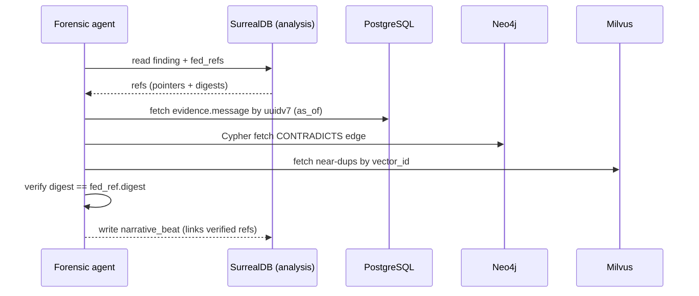

---

### 5. Edges / graph-like relationships, timeline & analysis views

SurrealDB `RELATE` edges express *analysis-layer* relationships (the entity-truth graph stays in Neo4j/salem_v3). Edges carry the same envelope (assertion_type/confidence/evidence_refs).

| Edge (`RELATE a->edge->b`) | Connects | Meaning | Source |
|---|---|---|---|
| `supports` | `fed_ref → finding` | evidence backs a finding | core |
| `contradicts` | `finding → finding` / `fed_ref → finding` | impeachment / conflict | salem_v3 `CONTRADICTS` (HITL) |
| `instantiates` | `fed_ref → pattern` | an event is an instance of a pattern | 303-lib |
| `preceded` / `part_of` / `caused?` | `narrative_beat → narrative_beat` | temporal/causal (salem `RELATED_TO` split; `caused?` always hypothesis) | crosswalk §2 |
| `reacts_to` | `narrative_beat → narrative_beat` | user's reaction modeled in context (explanation≠excuse) | full-cycle mandate (MP 2442–2444) |
| `repair_attempt` / `love_bombing` | beats | full relational cycle, both parties | full-cycle guardrail |
| `informs` | `finding → legal_strategy` | finding feeds strategy | core |
| `gap_for` | `evidence_plan → finding` | plan addresses a weak/uncorroborated finding | core |
| `gates` | `review_state → (finding/pattern/legal_strategy)` | review controls promotion | HITL |

**Timeline views (MP 2070, 1533).** `timeline_view` records are saved projections (materialized in Surreal, rebuildable from PG `timeline.event` spine). Each event reference keeps the `start_timestamp_raw` + `_utc` + `offset` triple (crosswalk ADOPT) so timestamp-certainty is visible per row; `gap_flags` mark inferred/uncertain intervals. Lenses: per-party, per-topic, per-location, per-device (multi-device attribution, context pack §5 gap). User-facing timelines render *only* approved beats; rough/hypothesis beats are filtered by `review_state`.

**Pattern-analysis objects (MP 2071).** `pattern` records bind to the 303-pattern behavioral library and **`positive_behaviors.ttl`** so the layer models positive/neutral/love-bombing/repair, not just adversarial conduct (full-cycle guardrail, MP 2431–2433). `polarity` + `cycle_phase` are first-class so contrast-over-time is queryable.

---

### 6. The core risk: duplication & synchronization vs PG + views

This is the decisive analysis the brief asks for. SurrealDB introduces a **second engine that holds projections of canonical data**. That is a classic dual-write / cache-coherence problem, and for a *court-facing* system, drift between the analysis store and the system of record is not just a bug — it is an **evidentiary integrity risk** (an export could cite a finding whose underlying PG row has since changed).

#### 6.1 Risk register

| Risk | Mechanism | Severity (court-facing) | Mitigation |
|---|---|---|---|
| **Stale projection** | PG/Neo4j row updated; Surreal copy not refreshed | HIGH | `fed_ref.digest` re-verify at export; reference-by-pointer (don't copy payloads); `as_of` reads |
| **Dual source of truth** | Analysts start treating Surreal as authoritative | HIGH | Firewall (§1): raw/extracted truth lives upstream; Surreal flagged read-derived; "SSOT docs win" |
| **Sync complexity / custom code** | Bespoke ETL/CDC PG→Surreal violates "minimize custom code" | MED | Prefer Agno-native sync; batch projection over real-time; small, declarative jobs |
| **Bitemporal double-bookkeeping** | valid/knowledge time tracked in both Graphiti and Surreal, diverge | MED | Graphiti = entity-truth timeline; Surreal = analysis-workspace timeline; do not duplicate the same facts |
| **Operational surface** | A 4th DB to deploy/back up/secure (no GPU, lean infra, context pack) | MED | Bind-mount volumes (owner rule); defer until Phase D capacity confirmed |
| **Vector duplication** | Copying embeddings into Surreal | HIGH (cost + drift) | Store vector_id+score only; Milvus stays single vector store (ADR-0026) |
| **Maturity** | SurrealDB less battle-tested than PG for forensic guarantees | MED | Keep it derived & rebuildable; never the only copy |

#### 6.2 The cheaper alternative — PostgreSQL views + JSONB

Almost everything in §3–§5 can be built **inside the already-LIVE `agno-postgres:18-duckdb`** with zero new infrastructure:

| SurrealDB feature | PG-native equivalent | Adequacy |
|---|---|---|
| Document/multi-pass JSON | `JSONB` columns + `analysis_run`/`finding` tables | Strong |
| Federated reach | **pg_duckdb** (files/S3/relational) + Cypher + Milvus SDK (ADR-0032) — already the blessed reach | Strong (this is the *current* design) |
| Graph edges | recursive CTEs / `ltree` / pg_trgm; or just keep graph in Neo4j | Adequate for analysis edges |
| Timeline views | materialized views over `timeline.event` | Strong |
| Bitemporality | range types + append-only history tables; or Graphiti for the graph tier | Adequate |
| Vector | Milvus SDK (unchanged) | Identical |
| Live review queue | `LISTEN/NOTIFY` | Adequate (vs Surreal `LIVE SELECT`) |
| Session/memory | agno-gateway is **already Postgres-backed** (context pack §3) | Strong |

**Net:** PG+views covers the functional requirement today with **one fewer engine, no sync layer, and no drift class**. SurrealDB's genuine advantages narrow to: (a) Agno-native single-surface ergonomics for agents, (b) native multi-model + `LIVE SELECT`, (c) native bitemporality for the *workspace* tier. Those are *ergonomic/velocity* wins, not *capability* wins.

---

### 7. Recommendation — DEFER deployment; build the analysis layer in PostgreSQL now, adopt SurrealDB only on a triggered, gated promotion

**Recommendation: DEFER (conditional adopt).** Concretely:

1. **Phase A–C: build the entire consolidated-analysis model (§3–§5) inside `agno-postgres:18-duckdb`** using JSONB + materialized views + the existing pg_duckdb/Cypher/Milvus reach (ADR-0032). This delivers every section-required object (analysis runs, findings, timelines, patterns, legal strategy, evidence plans, review states) with **no new infrastructure, no sync layer, and no drift risk**, honoring off-the-shelf-first / minimize-custom-code.
2. **Design the schema "SurrealDB-shaped" from day one** — the envelope (§3.1), `fed_ref` pointer contract (§4), and edge vocabulary (§5) are deliberately portable. This keeps the ADR-0024 intent alive (SurrealDB stays *ratified*) without paying for it before it pays back.
3. **Promote to SurrealDB in Phase D only if a trigger fires**, e.g.: (a) agent query latency/complexity across 3 engines becomes the bottleneck; (b) Agno's SurrealDB-native session/memory delivers a measurable ergonomic win the PG path can't; (c) `LIVE SELECT` materially improves the review-queue UX. Until then, the cost (4th engine + sync) exceeds the benefit.
4. **If/when adopted, adopt as a pure derived sink only** — reference-by-pointer (never copy payloads/vectors), digest-verified citations, batch projection (not chatty dual-write), rebuildable from upstream, and **never** authoritative on conflict. Require a fresh confirming note on ADR-0024 that records the Phase-D trigger that fired.

This reconciles the locked-but-undeployed status: the *architecture* keeps SurrealDB as the named consolidated analysis store (ADR-0024); the *engineering* avoids standing up a second system of record and its sync tax until there is a demonstrated need — which is exactly the "reversible / re-doable" and "minimize custom code" posture.

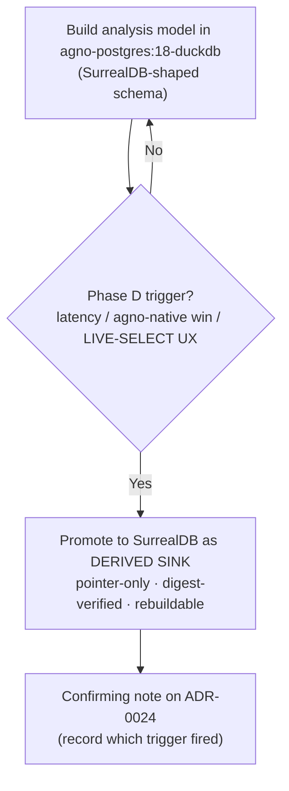

---

### 8. Agent-facing query patterns (MP 2075)

Whether backed by PG-now or Surreal-later, agents use the same logical patterns (Surreal `SQL` shown; PG equivalents are direct):

| Pattern | Intent | Sketch |
|---|---|---|
| Resolve findings + verify citations | get a finding and re-check its evidence | `SELECT *, evidence_refs.*.digest FROM finding WHERE case_id=$c AND review.state='approved'` → agent re-reads upstream, compares digest |
| Cross-source narrative | reconstruct a beat across sources | traverse `narrative_beat->preceded->narrative_beat`; expand `ordered_refs` via fed-fetch |
| Cycle/contrast view | show positive vs negative over time | `SELECT cycle_phase, polarity, count() FROM pattern WHERE case_id=$c GROUP BY cycle_phase, polarity` |
| Contradiction sweep | impeachment candidates (HITL) | edges `->contradicts->`; force `review.sensitive_label_gate` before court use |
| Review queue (live) | gatekeeper subscribes to pending items | `LIVE SELECT * FROM review_state WHERE state='pending'` (PG: `LISTEN review_pending`) |
| Evidence-gap plan | what still needs corroboration | `SELECT * FROM evidence_plan WHERE status!='closed' ORDER BY priority` |
| Resume session | rebuild context across sessions | `SELECT * FROM session_memory WHERE agent=$a AND task=$t` |
| Export pre-flight | block unsafe court output | reject if any cited `finding` is `legal_conclusion` with sensitive label and `review.state!='approved'` |

All write patterns are **append-only** (`supersedes` link, never overwrite — MP 2470) and pass through `review_state` before any sensitive promotion or court-facing export (HITL guardrail).

---

### 9. Implementation checklist (developer-facing)

- [ ] Define envelope (§3.1) as a reusable field set; enforce non-empty `evidence_refs` for `assertion_type >= inferred`.
- [ ] Implement `fed_ref` + digest verify against PG (uuidv7), Neo4j (element_id + bitemporal coords), Milvus (vector_id+score), R2 (sha256+version_id).
- [ ] Build §3.2 tables as PG tables/JSONB + materialized views first; keep DDL SurrealDB-portable.
- [ ] Wire `review_state` to the agno-gateway **review-gatekeeper** agent; gate sensitive labels at the DB layer.
- [ ] Persist `work_product` (scans/drafts/prompts/tool outputs) with `archive_reason` — never silent-discard (MP 2434–2435).
- [ ] Carry `prompt_version` + `ontology_version` + `schema_version` on every `analysis_run` for artifact lineage (MP 2436/2452).
- [ ] Add a Phase-D trigger metric dashboard (cross-engine query latency) to inform the adopt decision.

---

### 10. Needs-human-review / open items

- **Status reconciliation (FLAG):** the master prompt and the orchestration brief frame SurrealDB as *new/unratified*, but the context pack says **ratified (ADR-0024) yet undeployed**. Treated here as ratified-intent + open-deployment. An owner should confirm whether ADR-0024's deployment is still genuinely open before Phase D spend.
- **Sync mechanism unspecified (GAP):** no live DDL or PG→Surreal projection job exists yet (context pack §4 "schema-as-DEPLOYED" blind spot). If SurrealDB is adopted, the batch-projection/CDC design needs its own ADR; do not improvise dual-write.
- **Bitemporal boundary (FLAG):** the exact split between Graphiti's bitemporal entity-truth graph and SurrealDB's workspace bitemporality must be drawn explicitly to avoid double-bookkeeping (§6.1) — recommend a short ADR amendment.


---


## Temporal reasoning model (bitemporal)

> _Byline: Claude Code · Opus 4.8 (1M) · 2026-06-30_
> Grounded in CONTEXT_PACK §1 (locked stack), §2 (crosswalk), §5 (guardrails). Adopts the `timeline_enriched` raw/UTC/offset triple, the Graphiti bitemporal substrate (ADR-0014/0018/0031), the SurrealDB native-bitemporal analysis sink (ADR-0024), and the Semantica decision/provenance substrate (CANON §5). Nothing here is a blank slate.

### 0. Why temporal modeling is a first-class concern, not a column

In a forensic family-law corpus, **when** something happened is contested as often as **whether** it happened. A message export's timestamp may be in the exporter's phone timezone, not the sender's. A screenshot has no embedded time at all. A witness ("she") describes events as "the weekend after court" or "around Thanksgiving." GPS may place a device somewhere the person swears they were not. And — critically — **our own interpretation of when an event occurred changes over time** as new evidence arrives. A naive `timestamp` column silently overwrites all of that nuance and is fatal to auditability.

The model below therefore separates **four independent clocks** (bitemporal, extended to four time axes) and represents every temporal assertion as a **range with explicit certainty and provenance**, never as a single instant we pretend to know. This directly satisfies the global Constraints: distinguish exact / approximate / inferred / uncertain timestamps; preserve provenance; never overwrite earlier interpretations; keep hypotheses separate from facts.

#### Layering against the locked stack

| Concern | Lives in | Rationale |
|---|---|---|
| Canonical event spine + temporal ranges + certainty | **PostgreSQL 18** (`agno-postgres:18-duckdb`), `timeline.event` | ADR-0013; relational + `range` types + PostGIS for the geo-time join |
| Knowledge-graph time (valid + knowledge/transaction) for entity/edge facts | **Neo4j + Graphiti MCP** | ADR-0014/0018/0031 — bitemporal substrate is the whole point of Graphiti |
| Decision / interpretation provenance (interpretation revision history) | **Semantica** (seed-first) | CANON §5 — decision/provenance bitemporal substrate |
| Analysis sink with native bitemporal store/session memory | **SurrealDB** (Phase D, ratified ADR-0024) | native bitemporal; PG → Surreal analysis sink |
| Raw payloads, append-only audit, time-travel custody | R2 / Iceberg + append-only PG tables | ADR-0007/0030 |

PostgreSQL holds the **authoritative, court-defensible** temporal record (it is LIVE today); Graphiti holds the **graph-native** valid/knowledge-time view for cognition; Semantica/SurrealDB are the Phase-D bitemporal extensions. The Postgres model is the SSOT; the others project from it.

---

### 1. The four clocks (bitemporal+)

Classic bitemporal modeling tracks **valid time** (when a fact was true in the world) and **transaction time** (when the database believed it). Forensic ingestion needs two more, because "when we learned it" and "when we filed it into the system" are themselves evidentiary and frequently differ by months.

| Clock | Definition | Who sets it | Mutable? | Example |
|---|---|---|---|---|
| **Valid time** (`valid_from`, `valid_to`) | When the event/fact was true in the real world | Derived from evidence + reasoning | Re-asserted via new rows, never overwritten | The argument occurred 2024-11-27 evening |
| **Discovery time** (`discovered_at`) | When the *case team* first became aware of the fact (independent of when it entered the DB) | Reviewer / extraction run | No (immutable per assertion) | We learned about the argument when she testified 2025-09-12 |
| **Ingestion time** (`ingested_at`) | When the source artifact was loaded into the platform | Pipeline | No | The chat export was ingested 2026-02-14 03:11 UTC |
| **Transaction time** (`tx_from`, `tx_to` / `asserted_at`, `retracted_at`) | When *this database row* was the believed-current assertion | DB (append-only) | System-versioned; closed by superseding row | We recorded "Nov 27" 2026-02-14; revised to "Nov 26–27 window" 2026-03-02 |

> **Discovery vs ingestion vs transaction** are routinely conflated. Keep them distinct: a fact can be *discovered* (deposition) long before its *ingestion* (we get the transcript file) and before any *transaction* (we write the structured row). Each is independently relevant — e.g. "when did the party first know X" is a litigation question that only the discovery clock answers.

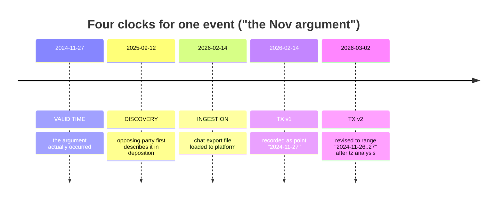

**Append-only rule (CONTEXT_PACK §5):** transaction-time history is *never* mutated in place. A revision inserts a new assertion row and closes the prior one's `tx_to` / sets `retracted_at`; the old row is preserved verbatim. This is how "interpretation revision history" is realized physically.

---

### 2. Valid-time as a range with certainty, never a point

Every temporal assertion stores a **bounded interval** plus a **point estimate** plus a **certainty class**. Even an "exact" timestamp is a (degenerate) range with tight bounds and a known offset.

#### 2.1 Timestamp certainty enum

Adopts the global Constraint vocabulary verbatim (exact / approximate / inferred / uncertain) and extends the `timeline_enriched` raw/UTC/offset triple (CONTEXT_PACK §2).

| `timestamp_certainty` | Meaning | Typical source | Bounds behavior |
|---|---|---|---|
| `exact` | Trustworthy instant with known timezone/offset | EXIF `DateTimeOriginal`+offset, server message ts, GPS fix | `earliest == latest == point` (± device clock skew) |
| `approximate` | Real time known to a coarse window | "around Thanksgiving", export with tz ambiguity | bounds span the window; point = window midpoint or mode |
| `inferred` | No stated time; derived from anchors/ordering | screenshot placed by adjacent messages | bounds = anchor-derived; flagged inferred |
| `uncertain` | Conflicting or unresolved evidence | GPS vs stated location; two exports disagree | bounds = union of candidates; **conflict flag set** |

Plus orthogonal flags carried on every event (per CONTEXT_PACK §5 "assertion lanes"):

- `assertion_type ∈ {raw_evidence, extracted_fact, inferred_fact, analytical_finding, legal_conclusion}`
- `confidence ∈ [0,1]` (calibrated, *not* a hard-coded 0.6 — see `evidence_export` crosswalk)
- `requires_human_review boolean` (HITL gate for sensitive/low-confidence temporal claims)

#### 2.2 Core schema (PostgreSQL 18)

```sql
-- Valid-time + certainty live on the canonical event spine (timeline.event).
-- Bitemporal/transaction history is in a sibling assertion table (append-only).

CREATE TYPE temporal.certainty AS ENUM ('exact','approximate','inferred','uncertain');
CREATE TYPE temporal.assertion_kind AS ENUM
  ('raw_evidence','extracted_fact','inferred_fact','analytical_finding','legal_conclusion');

-- One row = one *interpretation* of when an event occurred (append-only; never UPDATEd).
CREATE TABLE temporal.time_assertion (
  assertion_id      uuid PRIMARY KEY DEFAULT uuidv7(),     -- ADR-0013 native uuidv7
  event_id          uuid NOT NULL REFERENCES timeline.event(event_id),

  -- VALID TIME (real world) — always a range; point is the working best estimate
  valid_earliest    timestamptz NOT NULL,                  -- "no earlier than"
  valid_latest      timestamptz NOT NULL,                  -- "no later than"
  valid_point       timestamptz,                           -- best single estimate (nullable)
  valid_range       tstzrange GENERATED ALWAYS AS
                      (tstzrange(valid_earliest, valid_latest, '[]')) STORED,

  -- raw/UTC/offset triple adopted from timeline_enriched (CONTEXT_PACK §2)
  ts_raw            text,            -- string exactly as it appeared in the source
  ts_utc            timestamptz,     -- normalized to UTC if/when offset is known
  tz_offset_minutes integer,         -- NULL = offset unknown (drives tz-ambiguity logic)
  tz_source         text,            -- 'exif_offset' | 'export_header' | 'assumed_local' | 'unknown'

  -- certainty + assertion lane + confidence (CONTEXT_PACK §5)
  certainty         temporal.certainty NOT NULL,
  assertion_type    temporal.assertion_kind NOT NULL DEFAULT 'extracted_fact',
  confidence        numeric(4,3) CHECK (confidence BETWEEN 0 AND 1),
  is_conflicted     boolean NOT NULL DEFAULT false,        -- set when sources disagree
  requires_human_review boolean NOT NULL DEFAULT false,

  -- DISCOVERY + INGESTION clocks
  discovered_at     timestamptz,        -- when case team first knew
  discovery_source  uuid,               -- evidence/source that triggered discovery
  ingested_at       timestamptz NOT NULL DEFAULT now(),
  ingest_run_id     uuid,               -- processing-run lineage (provenance)

  -- TRANSACTION TIME (system-versioned, append-only)
  asserted_at       timestamptz NOT NULL DEFAULT now(),
  retracted_at      timestamptz,        -- NULL = currently-believed assertion
  superseded_by     uuid REFERENCES temporal.time_assertion(assertion_id),

  -- PROVENANCE + reasoning trail
  derived_from      uuid[] DEFAULT '{}',          -- source evidence/anchor ids
  anchor_refs       uuid[] DEFAULT '{}',          -- temporal.anchor ids used
  reasoning         text,                         -- how the window was computed
  prompt_version    text,                         -- if model-derived (artifact lineage)
  ontology_version  text,
  schema_version    text,
  author            text NOT NULL,                -- 'pipeline:tz-resolver' | 'human:matt' | 'agent:forensic-data'
  CONSTRAINT valid_ordering CHECK (valid_earliest <= valid_latest)
);

-- Exactly one current assertion per event (the believed-now interpretation).
CREATE UNIQUE INDEX one_current_per_event
  ON temporal.time_assertion(event_id) WHERE retracted_at IS NULL;

CREATE INDEX ON temporal.time_assertion USING gist (valid_range);
CREATE INDEX ON temporal.time_assertion (event_id, asserted_at);
```

Notes:
- `valid_range` as a GiST-indexed `tstzrange` makes **overlap / containment / "what else happened that weekend"** queries native (`&&`, `@>`).
- The partial unique index enforces "one current truth, infinite history" — the physical guarantee behind the append-only / never-overwrite constraint.
- `tz_offset_minutes IS NULL` is the single most important signal flag: it routes the row through the timezone-ambiguity workflow (§6.6).

---

### 3. Anchors and relative-time resolution

Relative expressions ("the weekend after court", "after she moved") cannot be resolved without **anchors** — datable reference events. We maintain an explicit anchor registry so resolution is reproducible and auditable, never a one-off model guess.

#### 3.1 Anchor registry

```sql
CREATE TABLE temporal.anchor (
  anchor_id     uuid PRIMARY KEY DEFAULT uuidv7(),
  anchor_key    text UNIQUE,           -- 'court_hearing_2024_11_22', 'move_out_2024'
  label         text NOT NULL,         -- human description
  anchor_type   text NOT NULL,         -- 'docketed_event'|'recurring_holiday'|'life_event'|'derived'
  valid_earliest timestamptz NOT NULL,
  valid_latest   timestamptz NOT NULL,
  certainty     temporal.certainty NOT NULL,
  confidence    numeric(4,3),
  derived_from  uuid[] DEFAULT '{}',   -- evidence backing the anchor itself
  requires_human_review boolean DEFAULT false,
  author        text NOT NULL,
  asserted_at   timestamptz DEFAULT now(),
  retracted_at  timestamptz
);
```

| Anchor type | Examples | Date source |
|---|---|---|
| `docketed_event` | court hearings, filings, service of process | court docket (high certainty, `exact`) |
| `recurring_holiday` | Thanksgiving, Christmas, school breaks | calendar rule per year (US Thanksgiving = 4th Thu Nov) |
| `life_event` | "she moved", "started new job", grief anniversary | corroborated evidence; often `approximate` |
| `derived` | "the argument" referenced relative to other events | computed from another assertion |

> **Guardrail:** an anchor is only as certain as its own evidence. "She moved" used as an anchor must itself carry a valid-time range and confidence; resolving a relative expression against a fuzzy anchor *propagates* that fuzziness into the result (§4). Anchors backing sensitive inferences set `requires_human_review`.

#### 3.2 Relative-expression grammar → window arithmetic

A small, auditable rule table maps natural-language temporal phrases to interval arithmetic over anchors. Phrases are extracted (NER/temporal tagger; spaCy + rules) into a normalized form, then resolved.

| Phrase pattern | Resolution | Resulting certainty |
|---|---|---|
| "the weekend after X" | next Sat 00:00 → next Sun 23:59 (local) following `anchor(X).valid_latest` | `approximate` (2-day window) |
| "after X" (open-ended) | `valid_earliest = anchor(X).valid_latest`; `valid_latest = +∞` (or next bounding event) | `inferred`, wide |
| "around / near Y" (holiday) | `Y ± 3 days` (configurable) | `approximate` |
| "the night before Z" | `[anchor(Z).valid_earliest − 1 day @ 18:00, anchor(Z).valid_earliest @ 06:00)` | `approximate` |
| "a few weeks after X" | `anchor(X).valid_latest + [2w, 5w]` | `uncertain`, wide |
| "last summer" | season window for inferred year | `uncertain` |

The window-arithmetic rules live in a versioned config (`temporal.relative_rules`, `prompt_version`/`ontology_version` stamped) so a later audit can reproduce exactly how "around Thanksgiving" became a specific range.

---

### 4. Earliest/latest windows, event ordering, confidence

#### 4.1 Window propagation (interval arithmetic)

When an event's time derives from anchors, we propagate bounds, not points. Given anchor A with `[a_lo, a_hi]` and an offset rule `+Δ`:

```
result.valid_earliest = a_lo + Δ_min
result.valid_latest   = a_hi + Δ_max
result.valid_point    = midpoint (or mode if a distribution is known)
result.confidence     = f(anchor.confidence, rule.tightness, corroboration_count)
```

`confidence` is a calibrated score (NOT the legacy hard-coded 0.6 — see `vw_forensic_evidence_package` → `evidence_export` crosswalk, which mandates transparent re-derivation). A worked formula we adopt:

```
confidence = clamp01( base[certainty]
                    * anchor.confidence
                    * (1 − window_penalty(valid_latest − valid_earliest))
                    + corroboration_bonus(n_independent_sources) )
```
where `base = {exact:1.0, approximate:0.75, inferred:0.55, uncertain:0.35}`, `window_penalty` grows with window width, and each independent corroborating source adds a diminishing bonus. The function and its constants are versioned and logged in `reasoning`, so any number in a court export can be explained.

#### 4.2 Event ordering (when absolute time is unknown but order is known)

Sometimes we know **A happened before B** ("the night before the argument") without confident absolute times. We model order as graph edges so ordering survives even when timestamps are fuzzy.

- In **PostgreSQL**: an explicit precedence table.
- In **Neo4j/Graphiti**: the `PRECEDED` edge (CONTEXT_PACK §2 — `RELATED_TO` is split into typed `PRECEDED`/`PART_OF`/`CAUSED?`). Graphiti's valid/knowledge time carries the ordering assertion's own history.

```sql
CREATE TABLE temporal.ordering (
  ordering_id uuid PRIMARY KEY DEFAULT uuidv7(),
  before_event uuid NOT NULL REFERENCES timeline.event(event_id),
  after_event  uuid NOT NULL REFERENCES timeline.event(event_id),
  relation     text NOT NULL DEFAULT 'preceded',  -- preceded|same_day|overlaps|caused_hypothesis
  basis        text NOT NULL,                      -- 'narrative:"night before"' | 'timestamp' | 'reasoning'
  confidence   numeric(4,3),
  requires_human_review boolean DEFAULT false,
  derived_from uuid[] DEFAULT '{}',
  author       text NOT NULL,
  asserted_at  timestamptz DEFAULT now(),
  retracted_at timestamptz
);
```

A **topological sort** over `preceded` edges yields a partial order; where absolute windows exist they constrain it (Allen's interval relations: `before`, `meets`, `overlaps`, `during`, `equals`). Contradictions (a cycle, or order conflicting with timestamps) raise a conflict for HITL — they are *signals*, not errors to silently resolve. `caused_hypothesis` is never auto-promoted to fact (matches the `CAUSED?` guardrail).

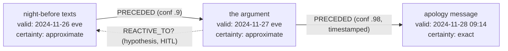

> The dotted `REACTIVE_TO?` edge models the user's *own* reaction in temporal context (CONTEXT_PACK §5: model both parties; explanation ≠ excuse) — held as a hypothesis pending human review, never asserted as fact.

---

### 5. Interpretation revision history (the heart of the bitemporal model)

Every change of mind about *when* (or *what*) an event was is a new assertion row; the prior row is closed, not deleted. The current view is `WHERE retracted_at IS NULL`; the full history is the unfiltered table. This is reinforced in three places:

1. **PostgreSQL** `temporal.time_assertion` (append-only, system-versioned via `asserted_at`/`retracted_at`).
2. **Graphiti** — facts carry temporal metadata and an *invalidation* mechanism: a superseded fact is marked invalid (knowledge-time), not erased. This is the native graph analogue.
3. **Semantica** (CANON §5) — the decision/provenance substrate records *why* the interpretation changed (which evidence, which reviewer, which prompt version), giving a defensible chain.

#### 5.1 Revision example (transaction-time travel)

| `asserted_at` | `valid_earliest..latest` | `certainty` | `confidence` | `reasoning` | `retracted_at` |
|---|---|---|---|---|---|
| 2026-02-14 03:11 | 2024-11-27 00:00 .. 2024-11-27 23:59 | approximate | 0.60 | initial: export local date only | 2026-03-02 |
| 2026-03-02 10:40 | 2024-11-26 18:00 .. 2024-11-27 23:59 | approximate | 0.72 | export tz = America/Detroit confirmed; "night before" narrative widens lower bound | 2026-04-10 |
| 2026-04-10 14:05 | 2024-11-27 19:30 .. 2024-11-27 21:00 | exact | 0.94 | corroborated by GPS fix + timestamped photo | *(current)* |

**As-of queries** answer "what did we believe on date D?" — essential for explaining a prior court filing:

```sql
-- What was our belief about this event on 2026-03-15?
SELECT valid_earliest, valid_latest, certainty, confidence, reasoning
FROM temporal.time_assertion
WHERE event_id = :id
  AND asserted_at  <= TIMESTAMPTZ '2026-03-15'
  AND (retracted_at > TIMESTAMPTZ '2026-03-15' OR retracted_at IS NULL)
ORDER BY asserted_at DESC
LIMIT 1;
```

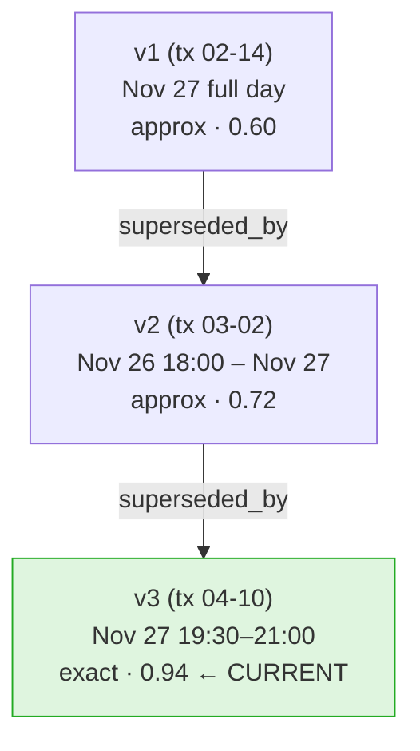

> Nothing is overwritten. A non-developer reads this as: "We first thought it was sometime on the 27th; later we narrowed it to that evening as photos and GPS came in — and every step is on the record with the reason."

---

### 6. Worked examples

Each example shows the natural-language input, the source artifact, the resolved assertion row (key fields), and the review disposition. All are illustrative scaffolds, not established facts.

#### 6.1 "The weekend after court"
- **Anchor:** `court_hearing_2024_11_22` (docketed, `exact`, conf 1.0), Fri 2024-11-22.
- **Rule:** "weekend after X" → next Sat 00:00 → Sun 23:59 local.

| Field | Value |
|---|---|
| valid_earliest / latest | 2024-11-23 00:00 −05:00 / 2024-11-24 23:59 −05:00 |
| valid_point | 2024-11-23 12:00 (midpoint) |
| certainty | `approximate` |
| assertion_type | `inferred_fact` |
| confidence | 0.80 |
| anchor_refs | `{court_hearing_2024_11_22}` |
| reasoning | "weekend-after rule applied to docketed hearing 2024-11-22" |
| requires_human_review | false (anchor is hard-docketed) |

#### 6.2 "After she moved"
- **Anchor:** `move_out_2024` is itself fuzzy — corroborated only to "sometime September 2024" (`approximate`, conf 0.55).
- **Rule:** "after X" → `valid_earliest = anchor.valid_latest`, `valid_latest = +∞` (or next bounding event).

| Field | Value |
|---|---|
| valid_earliest / latest | 2024-09-30 23:59 / *(open, +∞)* |
| certainty | `inferred` (open-ended, low precision) |
| assertion_type | `inferred_fact` |
| confidence | 0.45 |
| reasoning | "open-ended 'after' anchored to move-out; upper bound unbounded → flag for narrowing" |
| requires_human_review | **true** (open upper bound + fuzzy anchor) |

> The fuzziness of the "move" anchor propagates: the result is deliberately wide and flagged. We do **not** manufacture precision we don't have.

#### 6.3 "Around Thanksgiving"
- **Anchor:** `recurring_holiday` rule → US Thanksgiving 2024 = 4th Thursday Nov = **2024-11-28**.
- **Rule:** "around Y" → `Y ± 3 days`.

| Field | Value |
|---|---|
| valid_earliest / latest | 2024-11-25 00:00 / 2024-12-01 23:59 |
| valid_point | 2024-11-28 |
| certainty | `approximate` |
| confidence | 0.65 |
| reasoning | "holiday rule: 4th Thu Nov 2024; ±3 day window" |

> **Year-ambiguity trap:** if the speaker's year is unknown, the system enumerates candidate years (2023/2024/2025), sets `certainty = uncertain`, `is_conflicted = true` until a corroborating anchor disambiguates, and flags for review. Never silently pick a year.

#### 6.4 "The night before the argument"
- **Anchor:** `the_argument` (derived) currently valid 2024-11-27 evening.
- **Rule:** "night before Z" → `[Z.valid_earliest − 1 day @ 18:00, Z.valid_earliest @ 06:00)`.

| Field | Value |
|---|---|
| valid_earliest / latest | 2024-11-26 18:00 / 2024-11-27 06:00 |
| certainty | `approximate` |
| confidence | 0.70 |
| ordering | `PRECEDED(this → the_argument)` conf 0.9 |
| reasoning | "night-before rule on derived anchor 'the_argument'; ordering edge added" |

> If `the_argument` is later re-dated (revision §5), this dependent assertion is **recomputed** as a *new* row (old preserved). Dependency is tracked via `derived_from`/`anchor_refs` so cascades are auditable.

#### 6.5 Screenshot with no timestamp
- **Source:** PNG, no EXIF `DateTimeOriginal`, no embedded chat time.
- **Strategy:** triangulate from anchors — filename/export-folder date, surrounding messages whose times *are* known, file system mtime (weak), and any visible UI clock OCR'd from the image.

| Field | Value |
|---|---|
| ts_raw | *(none)* |
| valid_earliest / latest | bounded by nearest known-timestamped neighbors in same thread |
| certainty | `inferred` |
| assertion_type | `inferred_fact` (the *image* is `raw_evidence`; its *time* is inferred) |
| confidence | 0.40–0.60 depending on neighbor tightness |
| derived_from | `{prev_msg_id, next_msg_id, ocr_clock_span_id}` |
| reasoning | "no EXIF; bracketed by msgs at 14:02 and 14:19; OCR UI clock '2:1?' supports" |
| requires_human_review | **true** |

> Separation of lanes (Constraints): the screenshot *content* is raw evidence; the *OCR text* is an extracted fact linked to its source span; the *time* is an inferred fact. File-system mtime is recorded but explicitly down-weighted (it reflects copy/download, not capture).

#### 6.6 Message export with timezone ambiguity
- **Source:** chat export where header timezone is absent; timestamps are wall-clock with **no offset** (`tz_offset_minutes IS NULL`, `tz_source='unknown'`).
- **Risk:** the same wall-clock string is a different real instant in Detroit vs UTC vs the exporter's travel timezone — a window of up to ±some hours, enough to flip "night before" vs "day of."

| Field | Value |
|---|---|
| ts_raw | "11/27/24 9:14 PM" |
| ts_utc | *(NULL until offset resolved)* |
| tz_offset_minutes | NULL |
| valid_earliest / latest | union over candidate offsets: 2024-11-27 21:14 −05:00 .. same wall-clock at the widest plausible offset |
| certainty | `uncertain` (downgraded from any apparent exactness) |
| is_conflicted | true |
| reasoning | "export lacks tz header; candidate zones {America/Detroit, UTC, device-travel}; widened" |
| requires_human_review | **true** |

**Resolution path (logged as revisions):** infer the export device's timezone from device settings / other timestamped artifacts / DST rules; once `tz_source='export_header'` or `'exif_offset'` is established, compute `ts_utc`, set `tz_offset_minutes`, narrow bounds, upgrade `certainty` → `approximate`/`exact`, and **append** a new assertion (old uncertain row retained). DST boundary dates get explicit handling (a wall-clock near a spring-forward/fall-back instant is ambiguous even within one zone).

#### 6.7 GPS evidence contradicting a stated location
This is a **two-dimensional conflict** (space *and* time) and the marquee case for treating contradiction as a first-class uncertainty signal, not an error to paper over. It adopts the geo conflict primitives from the crosswalk: `geocode_resolution`, `disagreement_flag`/`address_mismatch_flag`, and the append-only `geocode_audit` (CONTEXT_PACK §2), joined to time via PostGIS.

- **Stated fact (extracted from a message):** "I was at home all evening" on 2024-11-27 (a *claim* — `analysis.claim_verification`, paired claimed_/observed_, per crosswalk).
- **GPS fact (raw):** device fix at coordinates ~12 km from `home_base`/`analysis.anchor_location` at 2024-11-27 20:48, certainty `exact` (HW timestamp + offset).

| Aspect | Modeling |
|---|---|
| Stated location | `claimed_location = home`, `claimed_time = "evening 11/27"`, assertion_type `extracted_fact` (it's a claim, not proven truth) |
| GPS location | `observed_location = (lat,lon)`, `observed_time = 2024-11-27 20:48`, assertion_type `raw_evidence`, certainty `exact` |
| Spatio-temporal overlap | `valid_range` of claim `&&` GPS fix time → overlap = true |
| Conflict detection | PostGIS distance(home, gps) ≫ plausible radius **AND** times overlap → `is_anomaly = true`, `is_conflicted = true` |
| Disposition | Recorded as **`analytical_finding`** ("claim and GPS are inconsistent for the 11/27 evening window"), confidence from data quality; `requires_human_review = true` |

> **Court-safety (Constraints):** the system does **not** assert "she lied." It records two evidence-linked facts and a finding that they conflict, with the time/space math shown. Before any sensitive framing reaches a court-facing export it passes the review-gatekeeper agent (HITL). Possible innocent explanations (device left at another location, clock skew, geocoding error → `disagreement_flag`) are enumerated, not dismissed — distinguishing *contextual harm* from *proven causation*.

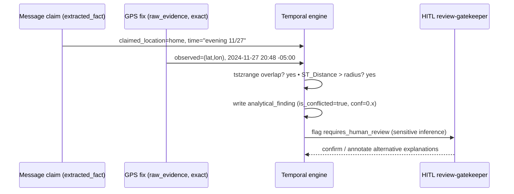

---

### 7. Resolution pipeline (end to end)

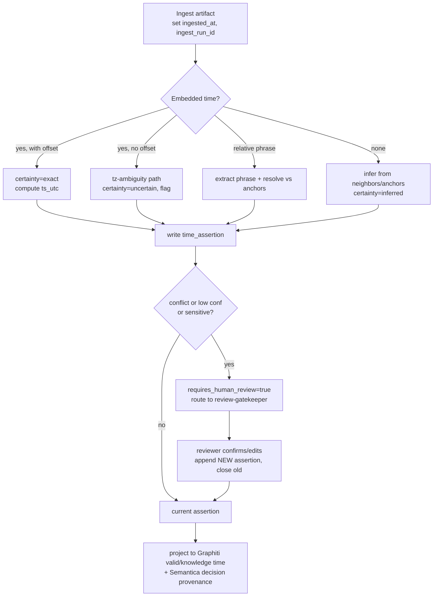

Each pipeline run stamps `prompt_version`, `ontology_version`, `schema_version`, and `ingest_run_id` so any assertion traces to the exact processing run and config that produced it (Constraints: artifact lineage; resume across sessions).

---

### 8. Projection to graph + analysis sinks

| Target | What projects | Time semantics |
|---|---|---|
| **Neo4j / Graphiti** | event nodes + `PRECEDED`/`PART_OF`/`CAUSED?` edges, entity facts | valid time + knowledge (transaction) time native; superseded facts marked invalid, not deleted |
| **Semantica** | interpretation revisions, reviewer decisions, why-changed | decision/provenance bitemporal (CANON §5) |
| **SurrealDB** (Phase D) | analysis-sink copy of current assertions + session memory | native bitemporal store; PG→Surreal sink (ADR-0024) |
| **R2 / Iceberg** | raw payloads, append-only `geocode_audit`, snapshots | time-travel custody (ADR-0007/0030) |

PostgreSQL remains SSOT; on any conflict between projections, **PG (and the SSOT docs) win** (CONTEXT_PACK header rule).

---

### 9. Guardrail compliance checklist (this section)

| Guardrail (Constraints / CONTEXT_PACK §5) | How satisfied |
|---|---|
| Distinguish exact/approximate/inferred/uncertain | `temporal.certainty` enum on every assertion |
| Distinguish evidence lanes | `assertion_type` enum; screenshot/OCR/time split in §6.5 |
| Never overwrite earlier interpretations | append-only `time_assertion`; partial unique index; §5 revision history |
| Preserve provenance + lineage | `derived_from`, `anchor_refs`, `ingest_run_id`, `prompt/ontology/schema_version`, `author` |
| Never promote hypothesis to fact | `caused_hypothesis`/`REACTIVE_TO?`/`CAUSED?` held as hypotheses; HITL gate |
| Confidence not hard-coded | calibrated formula §4.1; replaces legacy 0.6 (`evidence_export` crosswalk) |
| Model both parties / user's own reactions in context | ordering edges + `REACTIVE_TO?`; explanation ≠ excuse (§4.2) |
| Court-safe; HITL on sensitive inferences | `requires_human_review`; review-gatekeeper agent on conflicts/sensitive findings |
| Conflict = signal, not error | `is_conflicted`; GPS-vs-stated (§6.7), tz-ambiguity (§6.6), ordering contradictions |
| Resume across sessions | run/version stamping + Semantica/SurrealDB memory projection |

---

### 10. Needs-human-review / gaps flagged

- **Calibration of the confidence formula (§4.1) is unvalidated** — the `base[]` constants and `window_penalty` shape are reasonable defaults, not empirically calibrated against this corpus; a reviewer should tune them before any number appears in a court-facing export.
- **Timezone inference for offset-less exports (§6.6)** depends on device-setting evidence we have not confirmed is present in the corpus; until then those rows stay `uncertain` and flagged.
- **SurrealDB/Semantica bitemporal projection is Phase D (not yet deployed)** — today the bitemporal SSOT is the PostgreSQL `time_assertion` table plus Graphiti; the Surreal/Semantica columns in §8 are forward-looking per ADR-0024 / CANON §5 and should be validated against the as-deployed schema when those substrates land.


---


## Provenance & Chain-of-Custody Model

> _Byline: Claude Code · Opus 4.8 (1M) · 2026-06-30_
> Implements master-prompt §11 (Provenance & Chain-of-Custody) and §10 (Provenance, Confidence, and Review). Grounded in CONTEXT_PACK locked stack (ADR-0013 PG18 `uuidv7()`, ADR-0007/0030 R2/pg_duckdb, ADR-0014/0018/0031 Graphiti bitemporal, ADR-0024 SurrealDB sink) and the salem_v3 / TraceIQ V4.1 / `DuckDbVault/duckdb.ts` SHA-256+UUIDv7 custody backbone adopted in the crosswalk.

This section defines how every byte of source evidence and every object derived from it is identified, tracked, hashed, reviewed, redacted, and exported **without ever altering or losing an original**. It is the backbone that makes a court-facing export defensible: from any final sentence in a narrative we can walk a chain of typed, append-only records back to the exact source file, its hash, the processing run that touched it, the prompt/model version that interpreted it, and the human who approved it.

### 0. Plain-language summary (for the non-developer)

Think of the system as an **evidence locker with a logbook that can never be erased**.

- Every file that comes in (a chat export, a screenshot, a call log, a PDF) is photographed, weighed, and fingerprinted the moment it arrives, then sealed. Nothing ever writes back over that sealed copy.
- Everything we *make* from that file — text pulled out of a screenshot, a transcription of a voicemail, an AI summary, a redacted copy for the other side — is a **separate** item in the locker, tagged with a pointer back to exactly what it came from and how it was made.
- The logbook (audit log) records *who/what/when/why* for every action, and it is **append-only**: corrections are added as new lines, never by scribbling out an old line.
- Sensitive interpretations ("this looks like coercive control") are kept in a separate, clearly-labelled drawer marked *hypothesis* and cannot move to the *fact* drawer or into a court export until a human reviewer signs off.

The rest of this section is the technical specification of that locker and logbook.

### 1. Design principles (non-negotiable)

| # | Principle | Mechanism |
|---|---|---|
| P1 | **Originals are immutable.** | Raw objects are content-addressed, write-once; R2 object-lock + DB `CHECK`/trigger forbidding `UPDATE`/`DELETE` on `evidence.raw_object`. |
| P2 | **Everything derived is a first-class, separately-stored object.** | `provenance.artifact` rows + their own R2/DB storage; never an in-place mutation of a parent. |
| P3 | **Lineage is total and queryable.** | `provenance.lineage_edge` DAG links every artifact to its parent(s), the run that produced it, and the prompt/model/schema/ontology versions in force. |
| P4 | **Append-only history; never overwrite an interpretation.** | All mutable-looking tables are versioned (supersession chains) or event-sourced; audit log is insert-only and hash-chained. |
| P5 | **sha256 = identity; md5 = pre-filter only.** | sha256 is the canonical evidence identity and custody hash; md5 is computed only to cheaply dedupe/cross-reference (e.g. against the CaseBible R2 catalog) and is **never** used as proof of integrity. |
| P6 | **Classify, never conflate.** | Every artifact carries `assertion_type` ∈ {raw_evidence, extracted_fact, inferred_fact, analytical_finding, legal_conclusion} and `confidence`/`evidence_strength`/`timestamp_certainty`. |
| P7 | **HITL gates sensitive promotion & export.** | `provenance.review` records + `court_readiness` status; sensitive labels and exports blocked until reviewed (routed through agno-gateway `review-gatekeeper`). |
| P8 | **Provenance survives the model.** | Sensitive evidence content is processed by local ≤4B / on-prem paths where required (CONTEXT_PACK §3); cloud LLM (Ollama `glm-5.1`) runs are themselves logged as provenance with their inputs hashed, so any cloud exposure is itself auditable. |

### 1.1 Naming reconciliation with the canonical data model (§3)

This section is the **deep-dive on the provenance & custody *mechanism***; the canonical-data-model section (03) already declares the namespaced tables. They describe **one** design — the mapping below keeps the package internally consistent. Where this section writes `evidence.raw_object` for readability, it is the **same logical object** as §3's `custody.source`; the recursive file→page→frame→screenshot→OCR→message→event decomposition (MP 1566) lives in `custody.file_node`; the append-only custody-action log is `custody.custody_event`.

| This section (§9) | Canonical model (§3) | Role |
|---|---|---|
| `evidence.raw_object` | `custody.source` (+ `custody.file_node` for the parent-child tree) | sealed write-once original + decomposition |
| `provenance.custody_hash` (H1/H2/H3) | per-node `sha256` on `custody.source`/`custody.file_node` + this hash ledger | tamper-evident hashing |
| `provenance.run` | the act behind `provenance.model_run` + extraction/ocr/asr runs | processing event |
| `provenance.artifact` / `lineage_edge` | the universal `provenance.provenance` record + derived rows' `provenance_id` | derivation graph |
| `provenance.review` | `provenance.review` | HITL decisions |
| `provenance.redaction` | `provenance.redaction_history` | redaction lineage |
| `provenance.export` | `provenance.export` | court-package history |
| `provenance.audit_log` | `provenance.audit_log` | append-only spine |

### 1.2 Coverage matrix — every master-prompt §11 (and §10) requirement

| MP requirement | Where satisfied |
|---|---|
| Raw evidence tracking (§11) + Source custody fields (MP 1545–1566) | §4, `evidence.raw_object`/`custody.source` (§4.3 status quintet) |
| Hashing (§11) | §3 (sha256 canonical, md5 pre-filter, H1/H2/H3) |
| Derived artifact tracking (§11) | §5, `provenance.artifact` + `lineage_edge` |
| Extraction / OCR / Transcription / Embedding / Model-analysis runs (§11) | §5.1 run taxonomy, `provenance.run` |
| Human review records (§11) + Human-review provenance (§10) | §7, `provenance.review` (HITL gate via review-gatekeeper) |
| Redaction records (§11) + Redaction history (§10) | §8, `provenance.redaction` |
| Export records (§11) + Export history / Court-readiness (§10) | §9, `provenance.export` + manifest |
| Audit logs (§11/§10) | §10, hash-chained `provenance.audit_log` |
| Avoid overwriting original evidence (§11) | §4.2 (write-once triggers, R2 object-lock, supersession) |
| Source/Extraction/Model/Prompt-version provenance (§10) | §5.2 envelope + §6.3 version registries + `lineage_edge` |
| Confidence / evidence-strength / contradiction / corroboration (§10) | §5–§7 (`confidence`/`evidence_strength`; `corroborates`/`contradicts` edges) — scoring detail in §13 *Confidence & Review* |
| Version history (§10) | §11 supersession chains |

### 2. The two-axis model: identity (custody) × lineage (derivation)

Two orthogonal structures carry all provenance:

1. **Custody axis (hashing & storage):** answers *"is this the exact thing it claims to be, and where does the unaltered original live?"* → §3–§4.
2. **Lineage axis (derivation graph):** answers *"what produced this, from what, with which model/prompt/schema, and who approved it?"* → §5–§7.

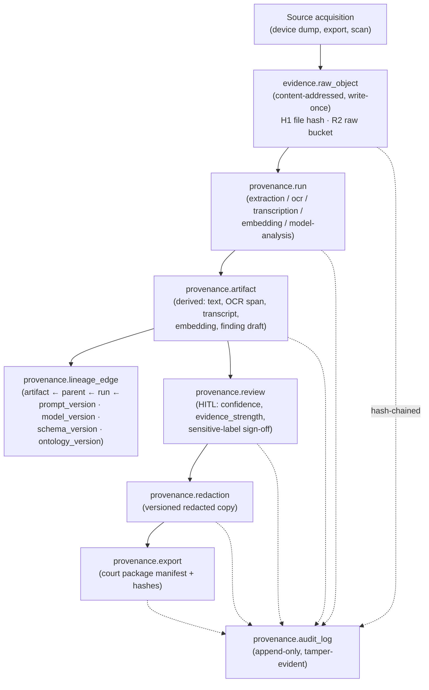

### 3. Hashing model — sha256 canonical, md5 pre-filter, 3-level custody

#### 3.1 Algorithm roles

| Hash | Role | Usage rule | Where stored |
|---|---|---|---|
| **sha256** | **Canonical identity + integrity** | The evidence's permanent identity. All custody assertions, dedupe-of-record, and integrity verification use sha256. Recomputed on read-back to detect drift. | `raw_object.sha256`, `artifact.sha256`, every custody/hash level |
| **md5** | **Pre-filter / cross-reference ONLY** | Cheap first-pass dedupe and matching against the existing CaseBible R2 catalog (which already stores per-object MD5; see `casebible-catalog`). **Never** cited as proof of integrity or identity in any export. | `raw_object.md5_prefilter` (nullable) |
| blake3 (optional, future) | fast streaming verification of large media | additive column `sha256` stays canonical; needs an ADR before becoming load-bearing | reserved |

> **Why this split:** md5 is collision-broken and unfit for custody, but it is fast and is the join key we already have against the CaseBible corpus, so it earns its keep purely as a "have we likely seen this before?" pre-filter. The moment a decision matters (identity, integrity, export), sha256 is authoritative.

#### 3.2 Three-level custody hashing (H1 / H2 / H3)

Per project memory and the `DuckDbVault/duckdb.ts` adopted backbone, custody is hashed at three nested granularities so integrity can be proven at the file level, the individual-record level, and the whole-collection level independently.

| Level | Name | Scope | Definition | Purpose |
|---|---|---|---|---|
| **H1** | **File hash** | one ingested file/blob | sha256 of the exact raw bytes as received (the sealed original) | Proves the stored original is byte-identical to what was acquired. Content-address / dedupe key. |
| **H2** | **Message / record hash** | one logical unit *inside* a file (a single chat message, a call-log row, one screenshot region, one timeline event) | sha256 over the **canonicalized** record payload (stable field ordering + normalized encoding), with its parent H1 and source byte-span/offset folded in | Proves an individual extracted record was not altered and binds it to its exact position in the original. Survives re-export of the parent. |
| **H3** | **Chain / collection hash** | an ordered set (a full conversation thread, a device's timeline, an export package) | A **Merkle-style** root: H3 = sha256 over the ordered list of member H2s (and nested H3s), so any change to any member changes the root | Proves a *collection* is complete and unaltered (no message inserted, deleted, or reordered). This is the chain in "chain of custody." |

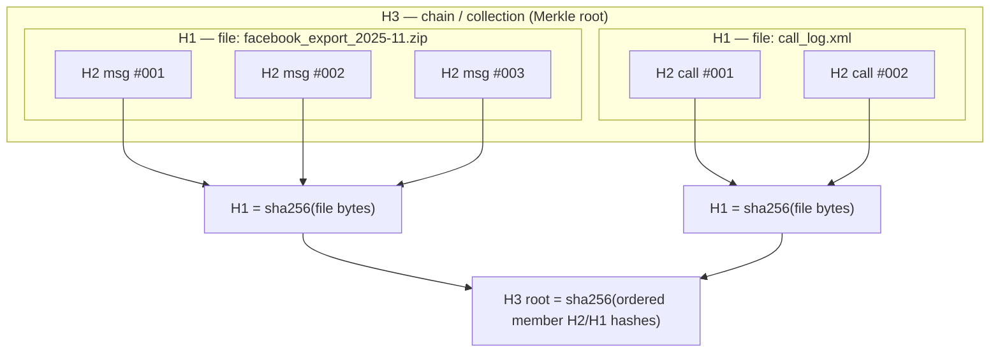

**Canonicalization rule (critical for H2/H3 reproducibility):** H2 is computed over a deterministic serialization (e.g. canonical JSON: sorted keys, UTF-8 NFC, fixed timestamp serialization to the `_raw`/`_utc`/`offset` triple, no whitespace). The canonicalization recipe is itself version-stamped (`hash_canon_version`) so a hash can always be reproduced and disputes about "you computed it differently" are resolved by replaying the named recipe. H1 is over **raw bytes** and needs no canonicalization.

#### 3.3 Verification cadence

- **On ingest:** compute H1 (sha256 + md5 pre-filter), then H2 for each parsed record, then H3 for each collection; store all.
- **On read-back / before any run consumes an object:** recompute sha256 and assert `== stored`; mismatch → quarantine + `audit_log` integrity-violation event, run aborts.
- **On export:** recompute H1/H2/H3 for every included object and embed them in the export manifest (§9). The manifest itself is hashed and signed.
- **Scheduled sweep:** periodic background job re-hashes a rolling sample of R2 raw objects to detect silent storage corruption (bit-rot), logging results.

### 4. Raw evidence tracking & the "never overwrite originals" guarantee

#### 4.1 raw(R2) vs D:/Backup provenance rule

There are two physical homes for an original, and the rule about which is authoritative is itself recorded provenance:

| Tier | Location | Role | Authority |
|---|---|---|---|
| **raw (R2)** | Cloudflare R2 `casebible-raw` / `nexus` (ADR-0007/0030), **object-lock / immutable** | The **canonical, version-of-record original** once ingested. Reads via pg_duckdb account-wide S3 secret; file ingest via rclone mount. | **Authoritative.** All custody assertions reference the R2 object. |
| **backup** | `D:/Backup`, `D:/casebible` (local scaffold/cold copy) | Local working/cold-storage copy and pre-ingest staging. Per project memory, local D: is **scaffold only**; the R2 sorted/raw bucket is canonical. | **Corroborating only.** Used to re-seed R2 or verify, never cited as the original-of-record. |

`raw_object.provenance_tier` records whether a given stored original is the R2 canonical copy or a `D:/Backup` corroborating copy, and `raw_object.acquisition_source` records the true upstream origin (device dump, OneDrive/GDrive pull, manual scan). When both exist, sha256 must match across tiers; a mismatch is an integrity event, and **R2 wins** unless a human review explicitly rules the local copy is the true original (recorded as a `review` decision).

#### 4.2 Source-custody fields (MP 1545–1566) carried on every original

Beyond hashes and storage tier, each `evidence.raw_object` / `custody.source` row carries the full custody descriptor required by MP 1545–1566. The four **status** columns are *lifecycle flags maintained by runs* (each transition is an audit event); they never mutate the bytes, only the row's processing state, and a `BEFORE UPDATE` exception is relaxed **only** for these whitelisted status columns (content/hash/storage columns stay write-once).

| Field | Column | Values / note |
|---|---|---|
| Source type | `source_type` | `device_dump \| chat_export \| screenshot \| call_log \| pdf \| media \| takeout \| social_export` |
| Custodian | `custodian` | who holds/controls the original (person or role) |
| Acquisition method | `acquisition_method` | `forensic_image \| manual_export \| cloud_pull \| photograph \| scan` |
| Device / account of origin | `origin_device_id` / `origin_account` | upstream provenance |
| Chain-of-custody status | `custody_status` | `collected \| sealed \| in_processing \| verified \| disputed \| released` (mirrors §3 `custody.source`) |
| Legal sensitivity | `legal_sensitivity` | `none \| privileged \| confidential \| in_camera` |
| Privacy sensitivity | `privacy_sensitivity` | `none \| pii \| minor \| sensitive_pii` (drives redaction need) |
| Extraction status | `extraction_status` | `pending \| running \| done \| failed \| n/a` |
| Processing status | `processing_status` | `pending \| enriched \| analyzed \| failed` |
| Review status | `review_status` | `not_reviewed \| in_review \| reviewed \| flagged` |
| Export status | `export_status` | `not_exported \| in_package \| exported \| withdrawn` |
| Original metadata | `original_metadata jsonb` | as-received (EXIF, headers, export manifest) — never edited |
| Derived metadata | `derived_metadata jsonb` | system-computed (mime sniff, page count) — clearly separated from original |

These status flags are **denormalized convenience state**; the *authoritative* history of each transition is the append-only `provenance.run` + `provenance.audit_log` (§10), so the flags can always be rebuilt from the log if they ever drift.

#### 4.3 How overwriting is structurally impossible

| Threat | Control |
|---|---|
| App code mutates a raw row | `evidence.raw_object` is write-once: a `BEFORE UPDATE OR DELETE` trigger raises an exception; only INSERT permitted. Role-level: app role has `INSERT, SELECT` only. |
| Re-ingest of the same file overwrites | Content-addressed by H1 sha256: re-ingest of identical bytes is a no-op de-dupe (links a new `acquisition` event to the existing object). |
| A "corrected"/re-exported version of source replaces the old | Treated as a **new** raw object with its own H1, linked to the prior via `supersedes_raw_id` + an `assertion`-typed note; both remain. Never an in-place edit. |
| Object-store overwrite/delete | R2 **object-lock (immutable retention)**; lifecycle policy forbids delete within retention; never-delete → move-to-`_stale` org rule applies. |
| Derived edits leak into source | Derived artifacts live in `provenance.artifact` with separate storage; there is **no FK path** by which a derived write can target a raw row. |
| Silent storage corruption | Scheduled re-hash sweep (§3.3) + on-read verification. |

> **Net guarantee:** the only legal operation against an original is *append a new, separately-identified object and link to it*. Originals are read-only for the life of the system.

### 5. Derived-artifact & run model

Every transformation is recorded as a **run** (the *act* of processing) that consumes input artifacts and produces output artifacts, with **lineage edges** binding outputs to inputs and to the exact versions of everything that shaped the result.

#### 5.1 Run taxonomy (master-prompt §11 bullets)

| `run_type` | Produces | Key recorded params (beyond common envelope) | Notes |
|---|---|---|---|
| `extraction` | parsed records (messages, call events, timeline events, social actions) | parser id + `parser.*_html` config version, export-vintage, selector fallback used | Parsers brittle → pin to export vintage (crosswalk). Output timestamps = approximate unless corroborated. |
| `ocr` | text spans from `evidence.image`/screenshots | OCR engine+version, language, DPI, confidence per span | OCR text = `extracted_fact`, linked to source image region (bbox) and parent H2. |
| `transcription` | text from audio/video (voicemail, call recording) | ASR model+version, diarization on/off, language, segment timestamps + confidence | Transcript segments are `extracted_fact`; speaker attribution is `inferred_fact` until reviewed. |
| `embedding` | vectors → Milvus (one collection per embedder) | embedder model+dims (text 2048-d nemotron / code 4096-d / CaseBible 1536-d codestral), normalization, chunker version | Vector rows carry back-pointer to source artifact + run id (ADR-0026/0027). |
| `model_analysis` | drafts: summaries, claim-vs-evidence checks, pattern labels, narrative drafts | LLM id (`glm-5.1` etc.), prompt_version, temperature/seed, tool-call trace, input-hash set | Output `assertion_type` ≥ `analytical_finding`; sensitive labels start as **hypothesis**, never auto-promoted (P7). Cloud exposure logged (P8). |
| `redaction` | redacted copies | redaction policy version, rule set, reviewer | See §8. |
| `export` | court packages | package spec, included-artifact set, manifest hash | See §9. |
| `ingest`/`acquisition` | raw objects | source, tier, hashing recipe version | See §4. |
| `review` (human) | review decisions | reviewer identity, decision, label sign-off | See §7. |

#### 5.2 Common run envelope (every run records)

`run_id (uuidv7)`, `run_type`, `status` (queued/running/succeeded/failed/superseded), `started_at`/`ended_at`, `actor` (service account or human), `code_version` (git SHA of the platform), `input_artifact_ids[]` + their sha256 at consume-time, `params` (jsonb), `prompt_version_id?`, `model_version_id?`, `schema_version`, `ontology_version`, `tool_call_trace` (jsonb, append-only), `cost/cloud_exposure_flag`. A failed or superseded run is **never deleted** — it stays as lineage (P4); a re-run produces new artifacts that *supersede* (not replace) the old via `lineage_edge`.

#### 5.3 Lineage DAG

```mermaid
flowchart LR
    R0[(raw_object H1)] -->|input| RX["run: extraction\nparser v / vintage"]
    RX -->|output| A1["artifact: message\nextracted_fact · H2"]
    A1 -->|input| RE["run: embedding\nnemotron 2048-d"]
    RE -->|output| V1["artifact: vector → Milvus"]
    A1 -->|input| RM["run: model_analysis\nglm-5.1 · prompt v12"]
    RM -->|output| F1["artifact: finding draft\nanalytical_finding · HYPOTHESIS"]
    F1 -->|input| HR["run: review (human)"]
    HR -->|decision| F2["finding: reviewed\nconfidence set · label approved"]
    F2 -->|input| RR["run: redaction policy v3"]
    RR -->|output| RD["artifact: redacted copy"]
    RD -->|input| EX["run: export"]
    EX -->|output| PKG["export package + manifest"]
    classDef hyp fill:#fde,stroke:#a33;
    class F1 hyp;
```

Each edge carries `(child_artifact_id, parent_artifact_id|raw_id, producing_run_id, role)` so the graph is fully traversable in both directions: *forward* (impact analysis: "if this source is excluded, what downstream findings/exports are affected?") and *backward* (court trace: "show me everything behind this sentence"). Lineage is mirrored into Graphiti (bitemporal substrate, ADR-0014/0018/0031) for valid-time/knowledge-time reasoning and disclosure-tier multi-pass, while the SQL tables remain the authoritative store.

### 6. Schema (PostgreSQL 18, `agno-postgres:18-duckdb`)

DDL is implementation-grade and uses native `uuidv7()` (ADR-0013), `pgcrypto`, and append-only constraints. `provenance` is its own schema; it references `evidence.*` and `analysis.*` from the other sections.

```sql
CREATE SCHEMA IF NOT EXISTS provenance;

-- ── 6.1 Raw originals (write-once) ─────────────────────────────────────────
CREATE TABLE evidence.raw_object (
    raw_id            uuid PRIMARY KEY DEFAULT uuidv7(),
    sha256            bytea NOT NULL,                 -- H1 canonical identity
    md5_prefilter     bytea,                          -- pre-filter / CaseBible join ONLY
    byte_size         bigint NOT NULL,
    mime_type         text,
    original_filename text,
    -- storage / custody location
    r2_bucket         text,                           -- e.g. casebible-raw
    r2_key            text,                           -- content-addressed key
    provenance_tier   text NOT NULL                   -- 'r2_canonical' | 'backup_corroborating'
                      CHECK (provenance_tier IN ('r2_canonical','backup_corroborating')),
    local_path        text,                           -- D:/Backup corroborating copy, if any
    acquisition_source text NOT NULL,                 -- device dump | onedrive | gdrive | scan | ...
    acquired_at_raw   text,                           -- as-reported
    acquired_at_utc   timestamptz,                    -- normalized
    acquired_tz_offset text,                          -- timestamp-certainty triple
    hash_canon_version text NOT NULL,                 -- canonicalization recipe id
    supersedes_raw_id uuid REFERENCES evidence.raw_object(raw_id),  -- corrected re-export lineage
    ingested_at       timestamptz NOT NULL DEFAULT now(),
    UNIQUE (sha256)                                   -- content-addressed dedupe
);
-- write-once enforcement
CREATE OR REPLACE FUNCTION provenance.forbid_mutation() RETURNS trigger
  LANGUAGE plpgsql AS $$ BEGIN
    RAISE EXCEPTION 'Originals/append-only rows are immutable (P1/P4): % on %', TG_OP, TG_TABLE_NAME;
  END $$;
CREATE TRIGGER raw_object_immutable BEFORE UPDATE OR DELETE ON evidence.raw_object
  FOR EACH ROW EXECUTE FUNCTION provenance.forbid_mutation();

-- ── 6.2 Custody hashes (H1/H2/H3) ──────────────────────────────────────────
CREATE TABLE provenance.custody_hash (
    hash_id        uuid PRIMARY KEY DEFAULT uuidv7(),
    level          text NOT NULL CHECK (level IN ('H1','H2','H3')),
    sha256         bytea NOT NULL,
    -- subject pointers (exactly one of raw_id / artifact_id; collections via member_set)
    raw_id         uuid REFERENCES evidence.raw_object(raw_id),
    artifact_id    uuid,                              -- FK added after artifact table
    record_locator jsonb,                             -- H2: source byte-span / bbox / offset
    member_hash_ids uuid[],                           -- H3: ordered member H1/H2 ids (Merkle input)
    canon_version  text NOT NULL,
    computed_at    timestamptz NOT NULL DEFAULT now(),
    computed_by_run uuid
);
CREATE TRIGGER custody_hash_immutable BEFORE UPDATE OR DELETE ON provenance.custody_hash
  FOR EACH ROW EXECUTE FUNCTION provenance.forbid_mutation();
CREATE INDEX ON provenance.custody_hash (sha256);
CREATE INDEX ON provenance.custody_hash (level, raw_id);

-- ── 6.3 Version registries (prompt / model / schema / ontology) ────────────
CREATE TABLE provenance.prompt_version (
    prompt_version_id uuid PRIMARY KEY DEFAULT uuidv7(),
    name text NOT NULL, version text NOT NULL,
    body_sha256 bytea NOT NULL, body text NOT NULL,
    created_at timestamptz NOT NULL DEFAULT now(),
    UNIQUE (name, version));
CREATE TABLE provenance.model_version (
    model_version_id uuid PRIMARY KEY DEFAULT uuidv7(),
    provider text, model_id text NOT NULL,           -- glm-5.1, nemotron-embed, nv-embedcode, codestral
    role text NOT NULL,                              -- llm | embedder | reranker | ocr | asr
    dims int, params jsonb, created_at timestamptz NOT NULL DEFAULT now(),
    UNIQUE (model_id, role, version));
-- schema_version / ontology_version registries analogous (salem_v3 graph seed version, MCL ttl version)

-- ── 6.4 Runs ───────────────────────────────────────────────────────────────
CREATE TABLE provenance.run (
    run_id          uuid PRIMARY KEY DEFAULT uuidv7(),
    run_type        text NOT NULL CHECK (run_type IN
        ('acquisition','extraction','ocr','transcription','embedding',
         'model_analysis','redaction','export','review')),
    status          text NOT NULL DEFAULT 'queued',
    actor           text NOT NULL,                    -- service account or person id
    code_version    text,                             -- platform git SHA
    prompt_version_id uuid REFERENCES provenance.prompt_version(prompt_version_id),
    model_version_id  uuid REFERENCES provenance.model_version(model_version_id),
    schema_version  text, ontology_version text,
    params          jsonb,
    input_digest    jsonb,                            -- [{artifact_id, sha256_at_consume}]
    tool_call_trace jsonb,                            -- append-only model tool calls / outputs
    cloud_exposure  boolean NOT NULL DEFAULT false,   -- P8: did inputs leave on-prem?
    supersedes_run  uuid REFERENCES provenance.run(run_id),
    started_at timestamptz, ended_at timestamptz,
    created_at timestamptz NOT NULL DEFAULT now());

-- ── 6.5 Derived artifacts ──────────────────────────────────────────────────
CREATE TABLE provenance.artifact (
    artifact_id     uuid PRIMARY KEY DEFAULT uuidv7(),
    artifact_kind   text NOT NULL,                    -- message|ocr_span|transcript_seg|vector|
                                                      -- summary|finding|narrative_draft|redacted|export_pkg|index
    sha256          bytea NOT NULL,                   -- artifact content hash
    storage_uri     text,                             -- R2/db pointer to artifact bytes
    producing_run   uuid NOT NULL REFERENCES provenance.run(run_id),
    assertion_type  text NOT NULL CHECK (assertion_type IN
        ('raw_evidence','extracted_fact','inferred_fact','analytical_finding','legal_conclusion')),
    confidence      numeric(4,3),                     -- 0..1, NULL until set by run/review
    evidence_strength text,                           -- weak|moderate|strong (re-derivable, no hardcoded 0.6)
    timestamp_certainty text CHECK (timestamp_certainty IN
        ('exact','approximate','inferred','uncertain')),
    is_sensitive    boolean NOT NULL DEFAULT false,   -- requires_in_camera_review / sensitive label
    lifecycle       text NOT NULL DEFAULT 'active',   -- active | superseded | archived(_stale)
    archive_reason  text,                             -- required if archived (no silent discard)
    created_at      timestamptz NOT NULL DEFAULT now());
ALTER TABLE provenance.custody_hash
  ADD CONSTRAINT custody_hash_artifact_fk FOREIGN KEY (artifact_id)
  REFERENCES provenance.artifact(artifact_id);

-- ── 6.6 Lineage DAG ─────────────────────────────────────────────────────────
CREATE TABLE provenance.lineage_edge (
    edge_id        uuid PRIMARY KEY DEFAULT uuidv7(),
    child_artifact uuid NOT NULL REFERENCES provenance.artifact(artifact_id),
    parent_artifact uuid REFERENCES provenance.artifact(artifact_id),
    parent_raw     uuid REFERENCES evidence.raw_object(raw_id),
    producing_run  uuid NOT NULL REFERENCES provenance.run(run_id),
    role           text NOT NULL,                     -- derived_from | supersedes | corroborates | contradicts
    created_at timestamptz NOT NULL DEFAULT now(),
    CHECK (parent_artifact IS NOT NULL OR parent_raw IS NOT NULL));
CREATE INDEX ON provenance.lineage_edge (child_artifact);
CREATE INDEX ON provenance.lineage_edge (parent_artifact);
CREATE TRIGGER lineage_immutable BEFORE UPDATE OR DELETE ON provenance.lineage_edge
  FOR EACH ROW EXECUTE FUNCTION provenance.forbid_mutation();
```

> `contradicts`/`corroborates` lineage roles directly back the master-prompt §10 contradiction/corroboration tracking and the salem_v3 `CONTRADICTS` impeachment primitive (HITL) — modeled as evidence-linked edges, never as auto-promoted fact.

### 7. Human-review records (HITL)

Reviews are runs (`run_type='review'`) that emit immutable decision records. No artifact may change `assertion_type` toward `legal_conclusion`, gain a sensitive label, or enter an export without a passing review.

```sql
CREATE TABLE provenance.review (
    review_id      uuid PRIMARY KEY DEFAULT uuidv7(),
    review_run     uuid NOT NULL REFERENCES provenance.run(run_id),
    artifact_id    uuid NOT NULL REFERENCES provenance.artifact(artifact_id),
    reviewer       text NOT NULL,                     -- human identity (never a model)
    decision       text NOT NULL CHECK (decision IN
        ('approved','rejected','needs_changes','escalated','hold')),
    -- scored at review time (master-prompt §10)
    set_confidence numeric(4,3),
    set_evidence_strength text,
    sensitive_label_decision jsonb,                   -- {label: gaslighting|coercive_control|...,
                                                      --  status: approved|denied|insufficient_evidence}
    court_readiness text NOT NULL DEFAULT 'not_reviewed' CHECK (court_readiness IN
        ('not_reviewed','draft','needs_corroboration','review_passed',
         'court_ready','excluded','strategically_sensitive')),
    requires_corroboration boolean NOT NULL DEFAULT false,
    rationale      text,                              -- court-safe language; explanation != excuse
    reviewed_at    timestamptz NOT NULL DEFAULT now());
CREATE TRIGGER review_immutable BEFORE UPDATE OR DELETE ON provenance.review
  FOR EACH ROW EXECUTE FUNCTION provenance.forbid_mutation();
```

Review workflow is routed through the live **agno-gateway `review-gatekeeper`** agent (CONTEXT_PACK §3) which *enforces the gate* but cannot itself approve sensitive labels — only a human `reviewer` value is accepted. A later re-review is a **new** `review` row (append-only); the artifact's effective status is the latest review by `reviewed_at`, but every prior decision remains visible (P4: "preserve prior interpretations, never overwrite").

| `court_readiness` | Meaning | Gate effect |
|---|---|---|
| `not_reviewed` | freshly produced (often a hypothesis) | blocked from export |
| `draft` / `needs_corroboration` | usable internally; not court-facing | blocked from export |
| `review_passed` | human-approved factual content | exportable as factual summary |
| `court_ready` | approved for court-facing package | exportable |
| `strategically_sensitive` | true but dangerous without context | export only with explicit override + context note |
| `excluded` | deliberately withheld | never exported; reason recorded |

### 8. Redaction records (versioned, non-destructive)

Redaction **never** edits an artifact in place. A redaction run reads a source artifact and produces a **new** redacted artifact (its own sha256, its own H2), linked by `derived_from`. The mapping of what was hidden is stored so redactions are reversible by authorized review and auditable.

```sql
CREATE TABLE provenance.redaction (
    redaction_id    uuid PRIMARY KEY DEFAULT uuidv7(),
    redaction_run   uuid NOT NULL REFERENCES provenance.run(run_id),
    source_artifact uuid NOT NULL REFERENCES provenance.artifact(artifact_id),
    redacted_artifact uuid NOT NULL REFERENCES provenance.artifact(artifact_id),
    policy_version  text NOT NULL,                    -- redaction rule-set version
    redaction_map   jsonb NOT NULL,                   -- [{span/bbox, category: PII|minor|in_camera, reason}]
    reversible      boolean NOT NULL DEFAULT true,
    authorized_by   text NOT NULL,                    -- reviewer who approved the policy application
    created_at timestamptz NOT NULL DEFAULT now());
CREATE TRIGGER redaction_immutable BEFORE UPDATE OR DELETE ON provenance.redaction
  FOR EACH ROW EXECUTE FUNCTION provenance.forbid_mutation();
```

The unredacted original remains the version-of-record; the redacted copy is what flows into exports. DB-layer PII/RLS/redaction at scale is flagged in CONTEXT_PACK §4 as a blind spot — this table is the provenance hook; the enforcement (row-level security, masked views) is specified in the access-control section.

### 9. Export records & court-package manifest

An export is a run that assembles an immutable package of (redacted) `court_ready`/`review_passed` artifacts plus a **manifest** that re-states every included object's H1/H2/H3 and the full lineage so a recipient (or court) can independently verify.

```sql
CREATE TABLE provenance.export (
    export_id      uuid PRIMARY KEY DEFAULT uuidv7(),
    export_run     uuid NOT NULL REFERENCES provenance.run(run_id),
    package_uri    text NOT NULL,                     -- R2 immutable package object
    manifest_sha256 bytea NOT NULL,                   -- hash of the manifest itself
    signature      bytea,                             -- detached signature over manifest (pgcrypto/ext key)
    included_artifacts uuid[] NOT NULL,
    purpose        text,                              -- disclosure | exhibit | client_review
    requested_by   text NOT NULL,
    approved_by    text NOT NULL,                     -- human approver (court-facing gate)
    created_at timestamptz NOT NULL DEFAULT now());
CREATE TRIGGER export_immutable BEFORE UPDATE OR DELETE ON provenance.export
  FOR EACH ROW EXECUTE FUNCTION provenance.forbid_mutation();
```

**Manifest contents (JSON, embedded in package + hashed):** for each included artifact — artifact_id, kind, sha256, H1/H2/H3 chain with `canon_version`, the full backward lineage (run ids + prompt/model/schema/ontology versions), `assertion_type`, final `confidence`/`evidence_strength`/`timestamp_certainty`, `court_readiness`, redaction policy version, and the approving reviewer(s). A verifier recomputes hashes from the package bytes and checks them against the manifest; the manifest hash + signature detect any tampering with the manifest itself. This re-derives the `vw_forensic_evidence_package` HIGH/MED/LOW transparently (crosswalk: no hard-coded 0.6 — strength is recomputed and shown).

### 10. Audit log (append-only, tamper-evident, hash-chained)

Every state-changing operation writes one audit row. The log is insert-only and **hash-chained**: each row includes the sha256 of the prior row, so any deletion or edit of history breaks the chain and is detectable.

```sql
CREATE TABLE provenance.audit_log (
    seq            bigint GENERATED ALWAYS AS IDENTITY PRIMARY KEY,
    event_time     timestamptz NOT NULL DEFAULT now(),
    actor          text NOT NULL,                     -- person or service account
    action         text NOT NULL,                     -- ingest|run_start|run_end|review|redact|export|
                                                      -- integrity_violation|supersede|archive|access
    object_type    text NOT NULL,
    object_id      uuid,
    detail         jsonb,                             -- before/after refs, input hashes, reason
    prev_row_sha256 bytea,                            -- hash of previous audit row (chain)
    row_sha256     bytea NOT NULL);                   -- sha256 of this row's canonical content
CREATE TRIGGER audit_immutable BEFORE UPDATE OR DELETE ON provenance.audit_log
  FOR EACH ROW EXECUTE FUNCTION provenance.forbid_mutation();
```

The audit log records, at minimum: ingestion of each raw object (with H1/tier/source), start/end of every run (with input hashes + cloud_exposure), every review decision and label sign-off, every redaction, every export (with manifest hash + approver), every access to sensitive/`in_camera` artifacts, and every integrity violation. Periodic checkpoints anchor the chain head's hash into Graphiti and/or a signed external note so the whole log is tamper-evident end-to-end. This satisfies master-prompt §10's audit-logs + version-history + redaction-history + export-history requirements as **one** append-only spine.

### 11. Versioning, supersession & "no silent discard"

| Requirement (MP §10/§11) | Mechanism |
|---|---|
| Version history | Every interpretation-bearing object is versioned via `supersedes_*` chains; latest-by-time is "current", all prior remain queryable. |
| Never overwrite an interpretation | No UPDATE on findings/reviews/lineage — corrections are new superseding rows (P4). |
| Persist intermediate work products | Drafts, indexes, classifications, prompt versions, tool-call traces, OCR spans are all `provenance.artifact` rows; nothing transient is dropped. |
| No discard unless intentionally archived with a reason | `artifact.lifecycle='archived'` requires `archive_reason`; physical files move to `_stale/` (never deleted) per org rule; archive is itself an audit event. |
| Hypothesis ≠ fact | `assertion_type` + `is_sensitive` keep model interpretations in the hypothesis lane until a `review` promotes them; promotion is logged. |
| Cross-session resume | The run/artifact/review state IS the resumable project memory; layered with `.remember` handoffs, MEMORY.md index, and Graphiti (MEMORY_ARCHITECTURE.md). SurrealDB analysis sink (ADR-0024, Phase D) will mirror bitemporal state. |

### 12. Worked end-to-end trace (illustrative)

1. A Facebook export `.zip` arrives → `acquisition` run → `raw_object` (H1 sha256, md5 pre-filter matched against CaseBible catalog → not previously seen → ingested to R2 `casebible-raw`, tier `r2_canonical`; `D:/Backup` copy noted as corroborating).
2. `extraction` run (parser `facebook_html` v, vintage 2025-11) → 412 `message` artifacts (`extracted_fact`, each with H2 bound to byte-span); thread H3 root computed.
3. `embedding` run (nemotron 2048-d) → vectors to Milvus, each lineage-linked.
4. `model_analysis` run (`glm-5.1`, prompt v12) drafts a finding: *"pattern consistent with love-bombing→devaluation cycle"* → `analytical_finding`, `is_sensitive=true`, **hypothesis**, `court_readiness='not_reviewed'`; cloud_exposure logged.
5. `review` run: human reviewer marks `needs_corroboration`, denies the "coercive control" label as `insufficient_evidence`, sets `confidence=0.4`. Recorded immutably; the draft is **not** promoted.
6. After corroborating messages are linked (`corroborates` edges), a re-review → `review_passed`, `evidence_strength='moderate'`, court-safe rewording.
7. `redaction` run (policy v3) produces a redacted copy hiding a minor's name.
8. `export` run assembles the redacted artifact into a disclosure package; manifest re-states H1/H2/H3 + lineage + reviewer; manifest hashed + signed. Every step is one audit-log row in the hash chain.

### 13. Needs-human-review / gaps flagged

- **DDL is schema-design, not as-deployed.** CONTEXT_PACK §4 flags live DDL as the highest unknown — this `provenance.*` schema must be reconciled against the actual deployed PG18 catalog before migration (verify `uuidv7()`, trigger privileges, R2 object-lock retention settings).
- **Signing key custody** for export manifests (§9) and audit checkpoint anchoring (§10) is unspecified here — needs an ADR (where the private key lives; HSM vs pgcrypto; rotation).
- **H2 canonicalization recipe** must be authored and version-pinned per source type (FB/Snapchat/call-log/XLSX); brittle parsers mean the recipe and parser-vintage pinning are coupled — owner sign-off needed on the canonical-JSON spec.
- **DB-layer PII/RLS enforcement** (the redaction *enforcement*, not the provenance hook) is a cross-section blind spot deferred to the access-control section.


---


## Extraction Ontology per Source Type

> _Byline: Claude Code · Opus 4.8 (1M) · 2026-06-30_
>
> This section defines **what must be pulled out of each kind of evidence**, how confident the system is allowed to be about each pulled-out fact, and how every extracted value traces back to the original file. It is **not a blank slate**: it adopts and extends the user's prior schemas — TraceIQ V4.1 (`messages`, `screenshots`, `people`, `timeline_event`, `geocode_resolution`), the **salem_v3** case knowledge graph (`Person`/`Incident`/`Location`/`Statement`/`Evidence` + typed edges), the **Semantica** provenance/conflict pipeline (PROV-O, `source_hash`), and the salvaged abuse-pattern corpus (`detection_patterns.py` 256-pattern / DARVO, `behavioral_patterns.ttl`, `positive_behaviors.ttl`, `mcl_722_23.ttl`). Crosswalk authority: A3 + the gap report; stack authority: ADR-0013/0027/0014/0024/0030/0032 (see Context Pack §2). On any conflict the SSOT docs win.

---

### 1. How to read this section (the five-lane rule)

Every value the system records about a piece of evidence is stamped with a **lane** so that, at court time, no one can confuse a machine guess for a fact. The lanes (verbatim from the cross-cutting guardrails, Context Pack §6) are:

| Lane | Meaning | Example | Who may write it |
|---|---|---|---|
| **`raw`** | The byte-exact original, never altered | the `.html` iMessage export, the JPEG, the `.mp4` | ingestion only (append-only) |
| **`extracted`** | Deterministically read out of the raw file | OCR text, EXIF GPS, a parsed `<message>` row, an ASR transcript | parsers / OCR / ASR |
| **`inferred`** | Computed/guessed by a model or heuristic | "overnight stay", "home base", sentiment, sender-of-unknown-number | analysis agents |
| **`analytical`** | A view/finding built from many records | a timeline cluster, a contradiction set, a pattern hit | analysis agents (HITL) |
| **`legal`** | A relevance / abuse-pattern / MCL conclusion | "supports MCL 722.23(b)", "coercive-control candidate" | **human-reviewed only** |

The lane is a **mandatory column on every extracted object** (`evidence_lane ENUM`). The same physical file can produce rows in several lanes; they are never merged. This realizes the "raw vs extracted vs inferred vs analytical vs legal-conclusion" discipline the Context Pack flags as missing from all prior schemas.

#### 1.1 Universal extraction envelope (shared by ALL source types)

Before the per-source tables, these fields are attached to **every** extracted record regardless of source. Per-source tables below list only the *additional* fields and do not repeat these.

| Field | Lane | Type | Required | Notes / prior art |
|---|---|---|---|---|
| `extract_id` | extracted | `uuid` (uuidv7) | ✅ | uuidv7 native (`agno-postgres:18-duckdb`, ADR-0013); time-ordered |
| `evidence_id` | raw | `uuid` FK→`evidence` | ✅ | central provenance anchor = salem_v3 `Evidence` node |
| `evidence_lane` | — | enum(`raw`,`extracted`,`inferred`,`analytical`,`legal`) | ✅ | the five-lane rule |
| `source_type` | — | enum (11 types below) | ✅ | dispatch key for parser/agent |
| `source_sha256` | raw | `char(64)` | ✅ | chain-of-custody hash (UUIDv7+SHA-256 contract, A3); = Semantica `source_hash` |
| `source_uri` | raw | `text` | ✅ | R2 key (`r2://casebible-sorted/...`) reached via pg_duckdb S3 secret (ADR-0030) |
| `ingested_at` | extracted | `timestamptz` | ✅ | knowledge-time (when WE learned it) |
| `extractor_name` | extracted | `text` | ✅ | e.g. `imessage-exporter-html@owner`, `enhanced-xml-chunker.py` |
| `extractor_version` | extracted | `text` | ✅ | artifact-lineage requirement (Constraints) |
| `ontology_version` | extracted | `text` | ✅ | which version of THIS ontology produced the row |
| `prompt_version` | inferred | `text` | ◻ | only when an LLM produced the field (lineage) |
| `model_id` | inferred | `text` | ◻ | e.g. local ≤4B extractor; never external for evidence (Context Pack §4) |
| `processing_run_id` | extracted | `uuid` FK→`processing_run` | ✅ | groups all outputs of one batch (re-run safety) |
| `confidence` | — | `numeric(4,3)` 0–1 | ✅* | required for every `inferred`/`analytical`/`legal` field; `1.000` for deterministic `extracted` |
| `confidence_method` | — | enum(`deterministic`,`model_score`,`heuristic`,`human`) | ✅ | how the number was set |
| `review_status` | — | enum(`unreviewed`,`accepted`,`rejected`,`needs_corroboration`) | ✅ | HITL gate; default `unreviewed` |
| `reviewed_by` / `reviewed_at` | — | `text` / `timestamptz` | ◻ | populated on human review |
| `supersedes_id` | — | `uuid` self-FK | ◻ | append-only correction chain; never overwrite (Context Pack §6) |

`*` `confidence` is always present; for pure `extracted` deterministic reads it is `1.000` with `confidence_method='deterministic'`.

#### 1.2 Timestamp-precision class (mandated addition — missing from ALL prior schemas)

Every temporal value carries a **precision class** alongside the value, so "exact / approximate / inferred / uncertain" (Constraints) is queryable, not prose:

| `ts_precision` | Meaning | Typical source |
|---|---|---|
| `exact` | sub-second/second from the source | EXIF, message DB epoch, ASR frame |
| `approximate` | known to a window (±minutes/hours/day) | "morning", date-only court stamp |
| `inferred` | computed from other evidence | overnight inferred from last+first ping |
| `uncertain` | conflicting or unparseable | two timestamps disagree |

Stored as `(ts_value timestamptz, ts_precision enum, ts_tz_source enum, ts_raw text)` — `ts_raw` preserves the original literal string (TraceIQ stored timestamps as TEXT; we keep that verbatim and ADD the typed/precision pair, per A3).

```mermaid
flowchart LR
  RAW[("raw file<br/>(R2, sha256, append-only)")] --> P{parser /<br/>extractor}
  P -->|deterministic| EX["extracted facts<br/>conf=1.000"]
  P -->|unknown format| SR["schema-resolver.ts<br/>AI field-map then HITL"]
  EX --> INF["inferred facts<br/>model/heuristic + conf"]
  INF --> AN["analytical findings<br/>(views, clusters)"]
  AN --> LEG["legal / abuse-pattern<br/>labels (HUMAN REVIEW)"]
  SR --> EX
  classDef human fill:#fde,stroke:#a05;
  class LEG human;
```

#### 1.3 Six standard extraction *target* groups

For each source the prompt asks for five target families. We implement them as standard, cross-source target tables so the same entity/timeline/place is reused regardless of which source surfaced it:

| Target family | Resolves into | Prior art adopted |
|---|---|---|
| **Entity targets** | `people` ⇄ salem_v3 `Person` (MERGE), `org`, `device`, `account/handle`, `phone`, `child` | TraceIQ `people`; salem `Person` |
| **Temporal targets** | `timeline_event` (split raw vs enriched) + `ts_precision` | TraceIQ `timeline_event`; ADR-add precision |
| **Location targets** | `location_key` (dedup) + PostGIS `geometry`, `geocode_resolution` (dual-provider disagreement) | TraceIQ `geocode_resolution`/`geocode_audit` |
| **Legal-relevance targets** | `mcl_factor_link` → `mcl_722_23.ttl` (12 factors A–L), `relevance_tag` | `mcl_722_23.ttl`, mcl-factor-mapper skill |
| **Abuse-pattern targets** | `pattern_candidate` → `detection_patterns.py` (256, DARVO), `behavioral_patterns.ttl` | detection_patterns.py, seed-patterns ~303 |
| **Relational-cycle targets** (added) | `cycle_phase` (positive/neutral/love-bomb/repair/escalation), `surface_tone`, `inferred_intent`, `relational_function` | `positive_behaviors.ttl`; Constraints (model BOTH parties + full cycle) |

The **relational-cycle** family is a first-class extraction target (not optional decoration) because the Constraints forbid one-sided sentiment modeling and require positive/neutral/love-bombing phases and BOTH parties' conduct, including the user's own reactions, to be modeled in temporal context. **Sentiment is decomposed into four separate stored fields** — `surface_tone`, `inferred_intent`, `relational_function`, `cycle_phase` — never collapsed into one "abusive/not" score.

> **Universal HITL gate:** any value in the **Legal** or **Abuse-pattern** families, and any sensitive label (`gaslighting`, `coercive_control`, `alienation`, `weaponization`, `reactive_abuse`), is written as a *candidate* with `review_status='unreviewed'` and is **blocked from court-facing export** until a human sets `accepted`. This is enforced by the review-gatekeeper agent (Context Pack §4), not by convention.

---

### 2. Per-source extraction ontology

Each subsection lists: **Required extracted fields**, **Optional extracted fields**, **Confidence fields**, **Provenance fields** (beyond the universal envelope), and the five/six **target families**. Owner-custom formats and known GAPS are flagged inline with a ⚠ marker.

---

#### 2.1 Messages (SMS / MMS / iMessage / Google Voice / Facebook / Snapchat / **call logs**)

Adopts TraceIQ V4.1 `messages` (link to `timeline_event`; `is_private`→review gate) + Milvus body embeddings + `social_action`. Parser corpus: `enhanced-xml-chunker.py` (SMS-vs-calls detection, blocked-call type 5/6, base64 images), `sms_backup_parser`, GVoice / pdf-imessage / facebook(TS) parsers, and ⚠ the **owner-custom `imessage-exporter` HTML format**.

| Class | Field | Lane | Type | Notes |
|---|---|---|---|---|
| **Required** | `thread_key`, `direction`(in/out), `sender_handle`, `recipient_handles[]`, `body_text`, `sent_ts`(+`ts_precision`), `platform`, `is_private` | extracted | — | `is_private` triggers review gate (TraceIQ) |
| **Required** | `message_kind` enum(`sms`,`mms`,`imessage`,`gvoice`,`fb`,`snap`,`call`,`blocked_call`) | extracted | enum | **call-logs are a first-class kind** (gap closed) |
| **Optional** | `subject`, `attachment_refs[]`(→Photos/Video rows), `reaction/tapback`, `edited_flag`, `read_ts`, `delivered_ts`, `group_title`, `call_duration_s`, `call_result`(answered/missed/blocked) | extracted | — | call fields apply to `call`/`blocked_call` |
| **Optional** | `body_embedding_ref` | inferred | Milvus id | one collection/embedder (ADR-0027); body stored raw, embedded for recall |
| **Confidence** | `sender_resolution_conf`, `thread_merge_conf`, `ocr_conf`(image-of-text), `lang_detect_conf` | inferred | 0–1 | unknown-number→person is inferred, never asserted |
| **Provenance** | `raw_record_json` (verbatim source row), `platform_hop_chain` (e.g. GV→SMS), `source_line_no`, `export_tool` | extracted | jsonb | `normalized_messages` raw-JSON landing (see §3) |
| **Entity** | sender/recipient → `people`/`Person` (MERGE); phone/handle/account; device | | | salem `Person` MERGE |
| **Temporal** | `sent/read/delivered` → `timeline_event`; gaps/bursts | | | link to timeline (TraceIQ) |
| **Location** | inline shared-location, "I'm at…" mentions → `location_key` (inferred, low conf) | | | |
| **Legal** | per-message `relevance_tag`, `mcl_factor_link` candidate | legal | | HITL |
| **Abuse-pattern** | `pattern_candidate` (DARVO, threats, monitoring, contact-flooding) + `cycle_phase`/`surface_tone`/`inferred_intent`/`relational_function` | inferred→legal | | model BOTH parties incl. user's own messages |

⚠ **GAP — owner-custom imessage-exporter HTML:** the user runs `imessage-exporter` (ReagentX) into a **custom HTML layout**, not the stock txt/HTML. There is **no parser in `extracted-code/` for this exact layout**. Needs: a dedicated `imessage-exporter-html@owner` extractor (DOM selector map, like the Chunker HTML configs but for this template) producing the rows above. Tapbacks/edits/attachments/threading must be recovered from the HTML structure. **needs-human-review: confirm the exact HTML template + sample file before building selectors.**

⚠ **GAP — Snapchat:** A3 only has the brittle HTML-selector Chunker config; the real source parser (`dial-stack/utilities/parsers/snapchat/`, 112 MB w/ exe) was skipped in salvage. Plan must ingest **Snapchat JSON** natively, not via CSS scraping.

⚠ **GAP — call logs / blocked calls:** absent from the prior `messages` model; recovered via `enhanced-xml-chunker.py` (type 5/6 blocked-call indicators). Now modeled as `message_kind in (call, blocked_call)`.

---

#### 2.2 AI chat transcripts (ChatGPT / Claude / Gemini exports, incl. ⚠ owner transcript-CSV)

Adopts the `chat-export` parser (ChatGPT/Claude JSONL). These are the user's own prior AI-analysis sessions and drafts — **intermediate work products that must be preserved, not discarded** (Constraints), and kept in the `inferred`/`analytical` lanes, never promoted to evidence facts.

| Class | Field | Lane | Type | Notes |
|---|---|---|---|---|
| **Required** | `conversation_id`, `turn_index`, `role`(user/assistant/system/tool), `content_text`, `turn_ts`(+precision), `assistant_model`, `export_tool` | extracted | — | JSONL/CSV rows |
| **Required** | `is_about_case` flag | inferred | bool | separates case-analysis sessions from unrelated chats |
| **Optional** | `tool_call_json`, `tool_result_ref`, `attachment_refs[]`, `system_prompt_text`, `token_usage` | extracted | jsonb | tool-call outputs preserved (Constraints) |
| **Optional** | `claims_extracted[]` (assertions the AI made about the case) | inferred | | each must be re-grounded before use |
| **Confidence** | `claim_grounding_conf`, `case_relevance_conf` | inferred | 0–1 | AI assertions are hypotheses, not facts |
| **Provenance** | `source_export_format`(jsonl/csv/html), `originating_model`, `originating_prompt_version`, `session_export_ts` | extracted | | artifact lineage to prompt/ontology version |
| **Entity** | people/orgs the AI named → linked **as mentions only** (low conf) | inferred | | never auto-MERGE into `Person` from AI text |
| **Temporal** | turn timestamps; any case dates the AI cited → candidate `timeline_event` (unreviewed) | inferred | | |
| **Location** | places the AI mentioned → candidate only | inferred | | |
| **Legal** | prior AI legal-relevance guesses → `relevance_tag` candidate, flagged `ai_generated` | analytical | | **never court-facing without human re-derivation** |
| **Abuse-pattern** | prior AI pattern labels → `pattern_candidate` with `origin='prior_ai'` | analytical | | quarantined from canonical until reviewed |

⚠ **GAP — transcript-CSV:** the owner has AI transcripts exported as **CSV** (column layout TBD), distinct from the JSONL the `chat-export` parser handles. Needs a `transcript-csv@owner` extractor; **route unknown column layouts through `schema-resolver.ts` (AI field-mapping) → HITL confirm** before trusting the mapping (per §3). **needs-human-review: confirm CSV column headers.**

> **Hard rule for this source:** nothing extracted from an AI transcript may enter the `raw`/`extracted` evidence lanes or be promoted to a fact. It lands in `inferred`/`analytical` with `origin='prior_ai'` and must be independently re-grounded against primary evidence (Constraints: "never silently promote a hypothesis into a fact").

---

#### 2.3 Screenshots (image-of-text: chats, call screens, social posts, financial)

Adopts TraceIQ `screenshots` (OCR = `extracted`) + `social_action`. OCR pipeline is a known open parser item.

| Class | Field | Lane | Type | Notes |
|---|---|---|---|---|
| **Required** | `ocr_text`, `ocr_blocks[]`(bbox+text), `image_sha256`, `capture_ts`(+precision), `pixel_w/h` | extracted | — | OCR text is `extracted`, conf<1 |
| **Required** | `depicts_kind` enum(`chat`,`call`,`social_post`,`email`,`doc`,`financial`,`map`,`other`) | inferred | enum | classifier |
| **Optional** | `status_bar_clock`, `status_bar_date`, `app_chrome_detected`(which app), `sender_name_in_ui`, `redaction_regions[]` | inferred | | clock-in-screenshot = independent temporal signal |
| **Optional** | `reconstructed_messages[]` → emit as §2.1 message rows with `source='screenshot'` | inferred | | screenshot→message reconstruction (lower conf than native export) |
| **Confidence** | `ocr_conf`(per block), `depicts_kind_conf`, `clock_read_conf`, `ui_app_conf`, `authenticity_conf` | inferred | 0–1 | low-res/cropped → low authenticity_conf |
| **Provenance** | `exif_present`, `screenshot_software`, `crop/edit_detected_flag` | extracted | | possible-tampering signal → HITL |
| **Entity** | names/handles in OCR → `people` mentions (conf-gated) | inferred | | |
| **Temporal** | on-screen clock/date + file `capture_ts`; **flag disagreement** → `ts_precision='uncertain'` | inferred | | two clocks disagreeing is itself evidence |
| **Location** | map screenshots, location-share UI → `location_key` candidate | inferred | | |
| **Legal** | `relevance_tag`, `mcl_factor_link` candidate | legal | | HITL |
| **Abuse-pattern** | OCR'd threats/monitoring/DARVO → `pattern_candidate`; + cycle/tone fields | inferred→legal | | applies to both parties |

> **Authenticity note:** a screenshot is a *depiction* of other evidence, not the underlying record. `authenticity_conf` and `crop/edit_detected_flag` feed MRE-authentication (skill `mre-authentication`); reconstructed messages from screenshots are always lower-confidence than a native export of the same thread, and contradictions between the two are preserved (salem `CONTRADICTS` edge).

---

#### 2.4 Photos (camera-original images)

| Class | Field | Lane | Type | Notes |
|---|---|---|---|---|
| **Required** | `image_sha256`, `exif_datetime_original`(+precision), `pixel_w/h`, `mime` | extracted | — | EXIF = `exact` when present |
| **Optional** | `exif_gps_lat/lon`, `gps_precision_m`, `camera_make/model`, `lens`, `orientation`, `exif_tz_offset` | extracted | | EXIF GPS → location target |
| **Optional** | `scene_caption`, `objects[]`, `faces_detected_count`, `text_in_image`(incidental OCR), `nsfw/sensitive_flag` | inferred | | local vision ≤4B only (no external; Context Pack §4) |
| **Optional** | `depicts_persons[]`(face match candidate) | inferred | | **never auto-identify a child/person** without HITL |
| **Confidence** | `gps_conf`, `caption_conf`, `face_match_conf`, `datetime_source_conf` | inferred | 0–1 | EXIF-stripped → datetime_source_conf low |
| **Provenance** | `exif_present`, `edited_software`, `c2pa/xmp_present`, `derived_from_sha256`(if re-encoded) | extracted | | original vs re-export lineage |
| **Entity** | depicted persons (candidate) → `people` | inferred | | HITL before naming |
| **Temporal** | `exif_datetime_original`; if absent → `inferred` from filename/album/context | inferred | | precision degrades accordingly |
| **Location** | EXIF GPS → `location_key` + PostGIS point; reverse-geocode via `geocode_resolution` (dual-provider) | extracted→inferred | | adopt `disagreement_flag`/`tie_break_reason` |
| **Legal** | injury/condition-of-home/child-context relevance → `relevance_tag` | legal | | HITL; court-safe framing |
| **Abuse-pattern** | injury photos, damaged property → `pattern_candidate`(physical) | inferred→legal | | corroboration-required flag |

---

#### 2.5 Videos

| Class | Field | Lane | Type | Notes |
|---|---|---|---|---|
| **Required** | `video_sha256`, `duration_s`, `container/codec`, `frame_w/h`, `fps`, `created_ts`(+precision) | extracted | — | container metadata |
| **Required** | `has_audio` flag → spawns §2.6 Audio row for the track | extracted | bool | A/V split |
| **Optional** | `keyframes[]`(ts+sha+caption), `scene_segments[]`, `ocr_on_frames[]`, `gps_track`(if present), `creation_tz` | inferred | | sample frames, not every frame |
| **Optional** | `transcript_ref` → §2.6 ASR of the audio track | inferred | | |
| **Confidence** | `scene_caption_conf`, `keyframe_relevance_conf`, `datetime_source_conf` | inferred | 0–1 | |
| **Provenance** | `edited_software`, `derived_from_sha256`, `segment_offsets`(ms into source) | extracted | | every derived clip cites parent + offset |
| **Entity** | persons/voices (candidate) → `people` (HITL) | inferred | | cross-link to audio speaker |
| **Temporal** | container `created_ts` + per-segment offsets → `timeline_event` | inferred | | |
| **Location** | embedded GPS / recognizable scene → `location_key` (low conf for scene) | inferred | | |
| **Legal** | `relevance_tag`, segment-level `mcl_factor_link` | legal | | HITL |
| **Abuse-pattern** | depicted conduct → `pattern_candidate`; tone/cycle on spoken content | inferred→legal | | both parties; context window |

---

#### 2.6 Audio (voice memos, call recordings, video audio tracks)

ASR transcript = `extracted` (machine), but its *content interpretation* = `inferred`. Local ASR only (no external; evidence stays local).

| Class | Field | Lane | Type | Notes |
|---|---|---|---|---|
| **Required** | `audio_sha256`, `duration_s`, `codec`, `sample_rate`, `created_ts`(+precision) | extracted | — | |
| **Required** | `transcript_text`, `transcript_segments[]`(start_ms,end_ms,text,speaker_label) | extracted | jsonb | word/segment timings |
| **Optional** | `diarization[]`(speaker turns), `language`, `non_speech_events[]`(crying, raised voice, door) | inferred | | acoustic events as separate low-conf signals |
| **Optional** | `prosody_flags[]`(shouting/whisper) | inferred | | descriptive, NOT an emotion verdict |
| **Confidence** | `asr_conf`(per segment), `diarization_conf`, `speaker_id_conf`, `lang_conf` | inferred | 0–1 | |
| **Provenance** | `asr_engine`, `asr_model_version`, `segment_offsets`, `recording_device` | extracted | | re-runnable; versioned |
| **Entity** | speaker → `people`/`Person` (voice match = candidate, HITL) | inferred | | |
| **Temporal** | `created_ts` + per-segment offsets → `timeline_event` | inferred | | |
| **Location** | spoken place mentions; ambient cues → candidate only | inferred | | low conf |
| **Legal** | utterance-level `relevance_tag`, `mcl_factor_link`; ⚠ recording-consent context noted (not advised on) | legal | | HITL; avoid legal advice (Constraints) |
| **Abuse-pattern** | spoken threats/DARVO/coercion → `pattern_candidate`; surface_tone/inferred_intent/relational_function/cycle_phase separated | inferred→legal | | both parties; reactive-abuse handled in context |

---

#### 2.7 Security footage (CCTV / doorbell / dashcam — distinct from §2.5)

Modeled separately from generic video because of **continuous timelines, device clock drift, and motion-event segmentation**.

| Class | Field | Lane | Type | Notes |
|---|---|---|---|---|
| **Required** | `clip_sha256`, `device_id`, `device_clock_ts`(+precision), `duration_s`, `camera_location_label` | extracted | — | device clock ≠ true time → drift field |
| **Required** | `clock_drift_offset_s` | inferred | int | reconciles device clock vs reference; precision drops to `approximate` |
| **Optional** | `motion_events[]`(ts,bbox), `person_count`, `vehicle_events[]`, `continuous_window`(start,end), `fov_geometry` | inferred | | gaps in footage are themselves recorded |
| **Optional** | `entry_exit_events[]`(door open/close) | inferred | | maps to presence/absence at a place |
| **Confidence** | `motion_conf`, `person_detect_conf`, `clock_drift_conf`, `identity_conf` | inferred | 0–1 | identity almost always candidate-only |
| **Provenance** | `dvr_export_tool`, `camera_make/model`, `firmware`, `retention_gap_flag` | extracted | | chain-of-custody for device exports |
| **Entity** | detected persons/vehicles → candidates (HITL); device as `device` entity | inferred | | |
| **Temporal** | device clock + drift → `timeline_event`; **presence/absence windows** | inferred | | strong for who-was-where-when |
| **Location** | fixed camera → known `location_key` w/ PostGIS FOV polygon | extracted | | high-value location anchor |
| **Legal** | corroborates/contradicts other timeline claims → `CONTRADICTS`/`relevance_tag` | legal | | HITL |
| **Abuse-pattern** | depicted incidents → `pattern_candidate` | inferred→legal | | corroboration-strength high (objective camera) |

---

#### 2.8 GPS tracks (phone location history, Takeout, TraceIQ trips)

The richest, most-developed lane — adopts TraceIQ wholesale: raw `visits/activities/paths/trips`, `geocode_resolution` (dual-provider `disagreement_flag`/`tie_break_reason`), append-only `geocode_audit`, `location_key` dedup, and the **Google raw-export JSON shape preserved verbatim as the RAW EVIDENCE contract**.

| Class | Field | Lane | Type | Notes |
|---|---|---|---|---|
| **Required (raw)** | `raw_export_json` (verbatim Takeout/semantic-location), `point_ts`(+precision), `lat`,`lon`,`accuracy_m` | raw/extracted | — | Google JSON kept byte-exact |
| **Required (extracted)** | `visit`/`activity`/`path`/`trip` rows, `place_label`, `activity_type`(walk/drive/still) | extracted | — | adopt TraceIQ tables |
| **Optional (inferred)** | `overnight_stay`, `home_base`, `dwell_minutes`, `co_location`(with another track/person), `anomaly_flag`, `route_polyline` | inferred | | overnight/home_base = **inferred lane**, never asserted |
| **Confidence** | `accuracy_m`→`geo_conf`, `geocode_disagreement_flag`, `tie_break_reason`, `inference_conf`(overnight/home_base), `activity_conf` | inferred | 0–1 | dual-provider geocode disagreement is first-class |
| **Provenance** | `geocode_audit` (append-only: provider, query, response, ts), `provider_a/b`, `source_export_file`, `location_key` | extracted | | append-only audit (Constraints) |
| **Entity** | track owner → device/`Person` (which device = which person is itself reviewable) | inferred | | |
| **Temporal** | per-point ts + dwell windows → `timeline_event` (raw vs enriched split) | extracted→inferred | | core timeline feed |
| **Location** | `location_key` + PostGIS point/geometry; reverse-geocode via `geocode_resolution` | extracted→inferred | | PostGIS lives INSIDE the PG resource (ADR-0013) |
| **Legal** | proximity to child/exchange locations, custody-window presence → `mcl_factor_link` | legal | | HITL; court-safe |
| **Abuse-pattern** | following/surveillance/repeated-proximity → `pattern_candidate`(stalking-type) | inferred→legal | | high bar; corroboration-required; both parties |

> Inference discipline: `overnight_stay`, `home_base`, `co_location`, `anomaly_flag` are the canonical examples of the **`inferred` lane** and must never be rendered as established facts; each carries `inference_conf` and an explainable basis (which raw points produced it).

---

#### 2.9 Court documents (orders, motions, filings, transcripts, PDFs)

Adopts the salvaged **doc-intelligence tables** (`sections/chunks/spans/entities/findings/approvals`) and the iMessage-PDF/`pdf-imessage` + general PDF parsing path; `appellate-formatting`/`irac-formatter` skills available.

| Class | Field | Lane | Type | Notes |
|---|---|---|---|---|
| **Required** | `doc_type`(order/motion/transcript/exhibit/filing), `caption`, `court`, `case_no`, `file_date`(+precision), `pages`, `sections[]`, `chunks[]` | extracted | — | doc-intelligence model |
| **Required** | `text_layer`(or OCR if scanned), `is_scanned` flag | extracted | | OCR conf if scanned |
| **Optional** | `parties[]`, `judge`, `holdings/orders[]`, `deadlines[]`, `exhibit_refs[]`, `citations[]`, `signature_blocks[]` | inferred | | structured legal extraction |
| **Optional** | `findings[]`(doc-intelligence), `cross_refs[]`(to other evidence) | analytical | | |
| **Confidence** | `ocr_conf`, `field_extract_conf`, `party_resolution_conf`, `date_parse_conf` | inferred | 0–1 | |
| **Provenance** | `doc_sha256`, `page_span` per extracted span, `redaction_flag`, `filed_stamp_present` | extracted | | span-level traceability |
| **Entity** | parties/judge/attorneys → `people`/`org` (MERGE w/ salem `Person`) | inferred | | |
| **Temporal** | filing dates, hearing dates, ordered deadlines → `timeline_event` (mostly `approximate`/`exact`) | extracted | | |
| **Location** | court, addresses in filings → `location_key` | extracted | | |
| **Legal** | **highest-density legal lane**: orders/holdings → `relevance_tag`, `mcl_factor_link`; these are *quotations of legal facts*, not our conclusions | legal | | still HITL for our derived tags |
| **Abuse-pattern** | allegations *recorded in* filings → `pattern_candidate` with `origin='court_doc'`, **explicitly allegation≠fact** | analytical→legal | | preserve-as-hypothesis (salem `USED_TACTIC`) |

> Court docs are evidence of *what was filed/ordered*, which is factual, but allegations contained inside them remain allegations — recorded with `origin='court_doc'` and never auto-promoted (salem_v3 PRESERVE-AS-HYPOTHESIS rule).

---

#### 2.10 Notes (the user's own notes, journals, drafts, event drafts, classifications)

These are the user's **prior work products and case-specific labels** the Constraints explicitly require preserving "even when incomplete… classified by confidence, usefulness, and review status." They are first-person and inherently `inferred`/`analytical`, never `raw` evidence of an external fact.

| Class | Field | Lane | Type | Notes |
|---|---|---|---|---|
| **Required** | `note_text`, `authored_by`(=user), `authored_ts`(+precision), `note_kind`(journal/event-draft/label/todo/hypothesis) | extracted | — | |
| **Required** | `is_first_person_account` flag | extracted | bool | distinguishes user recollection from cited fact |
| **Optional** | `referenced_evidence[]`(links to `evidence`), `asserted_events[]`(→candidate `timeline_event`), `user_labels[]`(case-specific) | inferred | | preserve owner's own taxonomy |
| **Optional** | `emotional_content`, `accountability_items[]`(user's own mistakes/apologies) | inferred | | Constraints: model user's own poor reactions/repair |
| **Confidence** | `recall_reliability`(self-reported memory), `corroboration_status`, `relevance_conf` | inferred | 0–1 | uncorroborated recollection flagged |
| **Provenance** | `note_source`(app/file), `version_chain`, `original_label_version` | extracted | | preserve prior interpretations (append-only) |
| **Entity** | people the user names → mentions (already-known `Person` link) | inferred | | |
| **Temporal** | events the user recounts → candidate `timeline_event`, `ts_precision` often `approximate`/`uncertain` | inferred | | memory ≠ exact |
| **Location** | places recounted → candidate `location_key` | inferred | | |
| **Legal** | user's own relevance guesses → `relevance_tag` candidate, flagged `self_authored` | analytical | | needs corroboration before court |
| **Abuse-pattern** | user's own pattern notes → `pattern_candidate` `origin='user_note'`; **also user's self-described reactions/escalations** | inferred→legal | | both-sides; explanation≠excuse; HITL |

> Notes are where the system most carefully separates **emotional truth, factual support, legal usefulness, and court-safe wording** (Constraints) — each note can carry `emotionally_important=true` while `legally_useful=uncertain` and `corroboration_status='required'`, and the system flags items that are "emotionally important but may not be legally useful" and items that "could be strategically dangerous if presented without context."

---

#### 2.11 Social media exports (FB/IG/Snapchat/X account downloads)

Adopts TraceIQ `social_action`; parsers: facebook(TS) structured, ⚠ Snapchat-source (skipped), the three Chunker HTML selector configs (facebook/snapchat/generic). Instagram is "defined not built" (open item).

| Class | Field | Lane | Type | Notes |
|---|---|---|---|---|
| **Required** | `platform`, `action_type`(post/comment/like/dm/story/friend/block), `actor_handle`, `content_text`, `action_ts`(+precision) | extracted | — | `social_action` model |
| **Required** | `visibility`(public/friends/private/dm) | extracted | enum | private/DM → review gate (like `is_private`) |
| **Optional** | `target_handle`, `media_refs[]`(→Photos/Video), `thread_context`, `reactions`, `edit_history`, `geo_tag` | extracted | | |
| **Optional** | `relationship_events[]`(friend/unfriend/block) | extracted | | block/unblock = behavioral signal |
| **Confidence** | `actor_resolution_conf`, `ocr_conf`(media), `content_parse_conf`, `geo_tag_conf` | inferred | 0–1 | |
| **Provenance** | `export_archive_sha256`, `raw_record_json`, `archive_path`, `export_request_ts` | extracted | jsonb | account-export landing |
| **Entity** | actor/target handles → `account`→`Person` (MERGE) | inferred | | handle↔person mapping reviewable |
| **Temporal** | action timestamps → `timeline_event` | extracted | | |
| **Location** | geo-tags, check-ins → `location_key` + PostGIS | extracted | | |
| **Legal** | public posts about case/child → `relevance_tag`, `mcl_factor_link` | legal | | HITL |
| **Abuse-pattern** | disparagement/monitoring/contact-via-proxy → `pattern_candidate`; salem `DISPARAGES` (was SPREADS_RUMOR) = preserve-as-hypothesis | inferred→legal | | HITL; both parties |

⚠ **GAP — Snapchat & Instagram:** Snapchat needs the real source parser (not HTML scraping); Instagram export ingest is "defined not built." Both route through `schema-resolver.ts` for unknown shapes (§3) pending dedicated parsers.

---

### 3. Unknown / unmapped formats — the schema-resolver + raw-JSON landing

Two salvaged assets handle anything the per-source parsers don't recognize, and reconcile the typed-vs-raw tension the gap report flags:

- **`schema-resolver.ts`** (AI field-mapping for unknown formats): when a file's layout is unrecognized (⚠ transcript-CSV, novel export, new app), it proposes a field→ontology mapping. The mapping is written as a **candidate with `review_status='unreviewed'` and HITL confirmation required** before any row it produces is trusted. The proposed mapping itself is versioned (artifact lineage).
- **`normalized_messages` raw-JSON landing** (A5): every source's verbatim record lands in a `raw_data jsonb` column **first** (queryable natively via pg_duckdb in the PG resource), and typed extraction rows are derived *from* it. This preserves the original byte-shape (Constraints: never overwrite original evidence) and enables platform-hop reconstruction (GVoice→SMS).

> **Reconciliation decision (flagged for the schema section, not resolved here):** the gap report notes `normalized_messages` (universal raw-JSON landing) *partially conflicts* with TraceIQ's typed `messages`. The recommended posture is **both**: raw-JSON landing is the `raw`/append-only contract; typed `messages`/`screenshots`/`social_action` are the `extracted` projection over it. **needs-human-review: explicit owner sign-off on the raw-landing-then-typed-projection model vs. one-or-the-other.**

```mermaid
flowchart TD
  F[incoming file] --> D{known<br/>source_type?}
  D -->|yes| RL[raw_data jsonb landing<br/>+ sha256, R2 uri]
  D -->|no| SR[schema-resolver.ts<br/>AI field-map then HITL approve]
  SR --> RL
  RL --> TP["typed extraction rows<br/>(messages / screenshots / ...)"]
  TP --> TG["target families:<br/>entity, temporal, location, legal, abuse, cycle"]
  TG --> GK{{review-gatekeeper<br/>HITL on legal/abuse}}
  GK --> EXPORT[court-facing package<br/>HIGH/MED/LOW tiers]
```

### 4. Confidence & export tiering (adopt TraceIQ `vw_forensic_evidence_package`)

Extraction confidence rolls up into the existing **HIGH / MED / LOW** tiers of TraceIQ's `vw_forensic_evidence_package` (HITL). Export tier is the **min** of: field `confidence`, `review_status` (must be `accepted` for legal/abuse fields), corroboration status, and lane (a `legal`/`abuse` value can never export above the tier its human review granted). Nothing in the `inferred` lane and nothing `origin in (prior_ai, user_note, court_doc-allegation)` may be presented as established fact.

---

### 5. Coverage matrix & open gaps (summary)

| Source | Native parser exists? | Gap |
|---|---|---|
| Messages (SMS/MMS/iMsg DB/GVoice/FB) | yes (xml-chunker, sms_backup, GVoice, pdf-imessage, fb-TS) | — |
| **iMessage-exporter HTML (owner-custom)** | ⚠ **no** | build `imessage-exporter-html@owner` selectors; confirm template |
| Call logs / blocked calls | yes (xml-chunker type 5/6) | wire into `message_kind` |
| AI transcripts (JSONL) | yes (chat-export) | — |
| **AI transcript-CSV (owner)** | ⚠ **no** | `transcript-csv@owner` via schema-resolver; confirm headers |
| Screenshots | partial (OCR pipeline = open item) | finalize OCR pipeline |
| Photos / Videos / Audio | metadata yes; vision/ASR local ≤4B | finalize local vision+ASR runners |
| Security footage | — | model device-clock-drift; DVR export parser |
| GPS | yes (TraceIQ location/Takeout) | richest lane; ready |
| Court docs | yes (doc-intelligence, pdf parsers) | — |
| Notes | yes (generic text) | preserve owner taxonomy/labels |
| **Snapchat (source)** | ⚠ skipped salvage | ingest real Snapchat JSON, not HTML scrape |
| **Instagram export** | ⚠ "defined not built" | build ingest |
| **XLSX** | ⚠ no ingest path (skill present) | build XLSX lane (financials/logs) |
| Unknown formats | yes `schema-resolver.ts` (HITL) | reconcile raw-landing vs typed `messages` |

All abuse-pattern and legal-relevance extraction targets across every source land as **candidates gated by review-gatekeeper HITL**, decomposed sentiment (surface_tone / inferred_intent / relational_function / cycle_phase), model **both parties** including the user's own conduct, and cover the **full relational cycle** (positive/neutral/love-bombing/repair) per `positive_behaviors.ttl` and the Context Pack §6 guardrails.


---


## Multi-pass analysis workflow (19 phases)

> _Byline: Claude Code · Opus 4.8 (1M) · 2026-06-30_
> Scope: the end-to-end **processing pipeline** that turns a raw artifact (an export, a screenshot, a call log) into a reviewed, court-exportable evidence package. This section defines *how* data flows through the stack described elsewhere; the schema sections define *what* each phase reads/writes. Every phase is a **versioned, append-only processing run** — nothing here overwrites canonical evidence, and nothing crosses the human-review gate without a recorded decision.

### 0. Design basis (what is locked, what this section decides)

| Input | Source | How it constrains the workflow |
|---|---|---|
| Custom **PostgreSQL 18** (`agno-postgres:18-duckdb`): `uuidv7()`, pg_duckdb, PostGIS, pgvector, pg_trgm, pgcrypto | ADR-0013 | Canonical store. Every run row, derived fact, and custody record gets a `uuidv7()` id; ingest reads R2/files **through pg_duckdb** (ADR-0030/0032), so Phases 1–4 need no separate ETL service. |
| **Milvus** = single vector store, one collection per embedder, hybrid dense+sparse | ADR-0026/0027 | Phase 11 (vector embedding) target. Index, not truth — vectors carry the PG linkage triple + provenance (see §Phase 11). |
| Embedder dims: text **2048-d** (`llama-nemotron-embed-vl-1b-v2`, run **local CPU** for sensitive evidence), code 4096-d, CaseBible 1536-d | ADR-0011/0015/0026 | "Evidence content stays local" forces Phases 4–5 + 11 LLM/embedding steps onto local CPU models (≤4B) for raw evidence text; cloud `glm-5.1`/NIM only on non-sensitive or de-identified inputs. |
| **Neo4j community + Graphiti MCP** = bitemporal graph (valid + knowledge time, disclosure-tier multi-pass) | ADR-0014/0018/0031 | Phase 12 (graph projection) target; the bitemporal substrate is *why* this is "multi-pass" — each pass can re-assert facts at a new knowledge time without destroying the old. |
| **SurrealDB** store/session/memory + PG→Surreal analysis sink | ADR-0024 (RATIFIED, **not yet deployed**, Phase D) | The **memory layer** that lets a run resume across sessions. Until deployed, the run ledger in PG (§Cross-cutting) is the interim memory of record. |
| **Semantica** decision/provenance bitemporal substrate (seed-first) | CANON §5 | Records *why* a derived fact/label was asserted (prompt+ontology+reviewer), feeding Phases 13–19. |
| **LiteLLM** :4000; **Ollama Cloud `glm-5.1` = PRIMARY LLM**; NIM = embed/rerank; **cloud-primary, no GPU** | ADR-0015 | All LLM-bearing phases (4,5,13,14,15,16,17,19) route through LiteLLM; sensitivity routing (local vs cloud) is enforced per-call (§Cross-cutting). |
| **ContextForge** MCP gateway 0.8.0 | ADR-0025 | Phases that an agent drives (review-gatekeeper, forensic-data-agent) reach tools through the gateway. |
| salem_v3 ontology + 303-pattern library + `mcl_722_23.ttl` + `positive_behaviors.ttl` | CONTEXT_PACK §2 | Seed inputs for Phases 5, 14, 16; **must extend** salem_v3 with full-cycle/both-parties types (§Phase 14). |
| Cross-cutting guardrails (raw vs extracted vs inferred vs finding vs legal; timestamp certainty; HITL on sensitive labels; both parties; full cycle; append-only provenance) | CONTEXT_PACK §5 + MP Constraints | Apply to **every** phase; encoded as the per-run envelope and the enum contract below. |

**Net rule for this layer:** the 19 phases are grouped into **four arcs** — *Custody & Capture* (1–4), *Structuring* (5–12), *Analysis* (13–17), and *Review & Export* (18–19). Arcs 1–2 produce only **raw evidence + extracted facts** (no opinions). Arc 3 produces **inferred facts and analytical findings** and is gated. Arc 4 is **human-owned**: nothing becomes court-facing without Phase 18 sign-off. Every phase is re-runnable; a re-run creates a **new run id** and appends, never mutating prior output (ADR-0018/0031 knowledge-time semantics).

### 1. The four arcs at a glance

```mermaid
flowchart TD
    subgraph A1["Arc 1 — Custody & Capture (raw evidence only)"]
        P1[P1 Raw ingestion] --> P2[P2 Hashing & custody]
        P2 --> P3[P3 Metadata extraction]
        P3 --> P4["P4 OCR / transcription / parsing"]
    end
    subgraph A2["Arc 2 — Structuring (extracted facts)"]
        P4 --> P5[P5 Entity extraction]
        P5 --> P6[P6 Temporal extraction]
        P6 --> P7[P7 Location extraction]
        P7 --> P8[P8 Message normalization]
        P8 --> P9[P9 Event creation]
        P9 --> P10[P10 Entity resolution]
        P10 --> P11[P11 Vector embedding]
        P11 --> P12[P12 Graph projection]
    end
    subgraph A3["Arc 3 — Analysis (inferred facts & findings — GATED)"]
        P12 --> P13[P13 First-pass relevance]
        P13 --> P14[P14 Pattern analysis]
        P14 --> P15[P15 Contradiction & corroboration]
        P15 --> P16[P16 Legal-issue mapping]
        P16 --> P17[P17 Evidence-gathering task gen]
    end
    subgraph A4["Arc 4 — Review & Export (human-owned)"]
        P17 --> P18{{P18 Human review — HITL gate}}
        P18 -->|approved| P19[P19 Court-export preparation]
        P18 -->|rejected / needs-more| P13
    end
    P18 -.->|sensitive label or new fact| GR[(Graphiti / Semantica<br/>knowledge-time re-assert)]
    classDef gate fill:#ffe9e9,stroke:#c0392b,stroke-width:2px;
    class P18 gate;
```

**Backflow is normal, not exceptional.** New evidence, a corrected timestamp, a rejected label, or an ontology version bump re-enters the pipeline at the earliest affected phase and replays forward — producing a new run lineage, preserving the old (Constraints: never overwrite earlier interpretations).

### 2. Per-run envelope (every phase emits this)

Every phase execution is a row in `pipeline.processing_run` and every object it produces carries this envelope, so any final output traces to source evidence, run, prompt, ontology, schema, and review decision (Constraints).

| Field | Type | Meaning |
|---|---|---|
| `run_id` | uuidv7 PK | This phase execution. |
| `phase` | INT8 (1–19) | Which phase. |
| `parent_run_id` | uuidv7 NULL | The run that fed this one (lineage chain). |
| `source_evidence_id` | uuidv7 | Originating raw artifact (custody chain, Phase 2). |
| `assertion_type` | INT8 enum | `0 raw_evidence · 1 extracted_fact · 2 inferred_fact · 3 analytical_finding · 4 legal_conclusion`. Arc 1–2 emit 0–1; Arc 3 emits 2–3; legal_conclusion (4) is **human-authored only**. |
| `timestamp_certainty` | INT8 enum | `0 exact · 1 approximate · 2 inferred · 3 uncertain`. |
| `confidence` | FLOAT 0–1 | Re-derived transparently; **never a hard-coded 0.6** (crosswalk). |
| `model` / `prompt_version` / `ontology_version` / `schema_version` | TEXT | LLM + artifact lineage. |
| `sensitivity` | INT8 enum | `0 public · 1 internal · 2 sensitive · 3 in_camera`. Drives local-vs-cloud routing. |
| `review_status` | INT8 enum | `0 pending · 1 approved · 2 rejected · 3 needs_review`. |
| `superseded` | BOOL | Append-only soft-delete; corrections add a new row. |
| `valid_time` / `knowledge_time` | tstzrange / timestamptz | Bitemporal (valid = when the fact was true in the world; knowledge = when we asserted it). Mirrors Graphiti/Semantica. |
| `inputs_digest` | bytea | SHA-256 of inputs → idempotency + reproducibility key. |
| `status` | enum | `queued · running · ok · partial · failed · quarantined`. |

> **Idempotency rule:** a phase keyed on the same `(source_evidence_id, phase, model, prompt_version, ontology_version, inputs_digest)` is skipped (cache hit) unless `--force`. This makes the whole pipeline safe to replay and cost-aware (no re-embedding / re-LLM on unchanged inputs).

---

### Arc 1 — Custody & Capture (Phases 1–4)

These phases are **deterministic and opinion-free**. They establish *what we received and that it is intact*. Output is strictly `assertion_type = raw_evidence`.

#### Phase 1 — Raw ingestion
| Aspect | Detail |
|---|---|
| Goal | Land every artifact byte-for-byte and register it; never parse yet. |
| Inputs | R2 buckets (`nexus`, `casebible-*`), rclone-mounted files, direct uploads (FB/Snapchat/Instagram exports, call-log CSV/XLSX, screenshots, media). |
| Mechanism | pg_duckdb reads R2/S3 via the account-wide secret (ADR-0030); large media stay in R2, only a pointer + byte range is registered. **No mutation of source** (Constraints: never overwrite original evidence). |
| Writes | `evidence.artifact` (raw blob pointer, original filename, container path, export-vintage, MIME, byte size). `raw_payload` kept append-only (crosswalk `original_json`→`raw_payload`). |
| Output class | raw_evidence (0). |
| Failure | Unreadable/partial → `quarantined` (not dropped); logged with reason (never-delete rule). |

#### Phase 2 — Hashing and custody
| Aspect | Detail |
|---|---|
| Goal | Cryptographic chain-of-custody before anything touches the artifact. |
| Mechanism | **SHA-256 + uuidv7** custody chain (adopt DuckDbVault/`duckdb.ts`; aligns with ADR-0013 `uuidv7()`). Hash computed at rest in R2 and re-verified on every read; `prev_custody_id` links the chain. |
| Writes | `custody.event` (append-only): `sha256`, `uuidv7`, `actor`, `action` (received/hashed/read/exported), `at_utc`, `prev_custody_id`, `r2_etag`. |
| Output class | raw_evidence (0). |
| Court note | This phase is the integrity backbone of any Phase 19 export; a broken hash → artifact flagged, downstream runs blocked. |

#### Phase 3 — Metadata extraction
| Aspect | Detail |
|---|---|
| Goal | Pull container/technical metadata **without interpretation**. |
| Mechanism | EXIF (images), file timestamps, export headers, `device_id`, message-export account owner, archive table-of-contents. |
| Writes | `evidence.artifact_metadata` (typed key/value, append-only). `device_id` carried forward for multi-device attribution (crosswalk). |
| Timestamp handling | Capture the **raw string + parsed UTC + offset triple** (`*_raw`, `*_utc`, `offset`) — the timestamp-certainty support adopted from `timeline_enriched`. Container time = `approximate` unless corroborated. |
| Output class | extracted_fact (1) for parsed values; raw_evidence (0) for the verbatim header. |

#### Phase 4 — OCR / transcription / parsing
| Aspect | Detail |
|---|---|
| Goal | Turn bytes into text spans, preserving exact source location. |
| Mechanism | OCR (screenshots → `screenshots`/`evidence.image` text, crosswalk); audio/video → transcript with speaker turns; HTML export parsing via `parser.*_html` configs (FB/Snapchat/Instagram/generic — **selectors are brittle, pinned to export-vintage with fallbacks**, crosswalk Phase 47). |
| Sensitivity routing | Runs on **local CPU** models for `sensitivity ≥ 2` (evidence stays local, ADR-0015); cloud OK only for de-identified/public. |
| Writes | `evidence.text_span` (offset-anchored to the source byte range → every extracted char re-links to the original). `evidence.image` + OCR text. |
| Timestamp handling | Parser-derived timestamps = `approximate` unless corroborated (crosswalk). |
| Output class | extracted_fact (1), each span carrying a back-pointer to its `source_evidence_id` + byte offset. |
| **Needs-human-review** | Low-confidence OCR / parser-fallback spans flagged `needs_review (3)` so they are not silently trusted downstream. |

---

### Arc 2 — Structuring (Phases 5–12)

These phases convert text spans into the canonical schema objects (entities, events, messages, geo) and project them into the vector + graph stores. Output is `extracted_fact (1)`; **resolution and embedding never invent**, they normalize and link.

#### Phase 5 — Entity extraction
| Aspect | Detail |
|---|---|
| Goal | Spot mentions of people, orgs, locations, devices, handles in each span. |
| Mechanism | spaCy NER (local) for `sensitivity ≥ 2`; LLM (`glm-5.1` via LiteLLM) only for de-identified text. Seed entity types from **salem_v3** (`Person`, `Location`, `Evidence`, `Statement`, `Incident`) (crosswalk). |
| Writes | `entity.mention` (span-anchored, **not yet resolved** to a canonical person — that is Phase 10). |
| Output class | extracted_fact (1). A mention is a *fact that this text names X*, not a claim that X did anything. |

#### Phase 6 — Temporal extraction
| Aspect | Detail |
|---|---|
| Goal | Extract every time reference and classify its certainty. |
| Mechanism | Parse explicit timestamps + relative expressions ("last Tuesday"); keep the `*_raw`/`*_utc`/`offset` triple. |
| Certainty mapping | explicit + tz → `exact (0)`; tz-inferred → `approximate (1)`; relative/derived → `inferred (2)`; conflicting/absent → `uncertain (3)`. |
| Writes | `timeline.raw_*` (visits/activities/trips/paths adopted from `timeline_enriched`); feeds Phase 9. |
| Output class | extracted_fact (1) + explicit `timestamp_certainty`. |

#### Phase 7 — Location extraction
| Aspect | Detail |
|---|---|
| Goal | Resolve places to coordinates with conflict-awareness. |
| Mechanism | `location_geokey` / geohash8-9 / r3–r5 rounding → `geo.location` (PostGIS); **multi-provider** `geocode_resolution` with `disagreement_flag` / `address_mismatch_flag` (newest Jan-2026 variant) → provider disagreement = an explicit **uncertainty signal**, not silently resolved (crosswalk). |
| Writes | `geo.location`, append-only `geocode_audit`. |
| Output class | extracted_fact (1); disagreement rows flagged `needs_review (3)`. |

#### Phase 8 — Message normalization
| Aspect | Detail |
|---|---|
| Goal | Put every chat/SMS/social message into one canonical shape. |
| Mechanism | TraceIQ V4.1 `messages` → `evidence.message`: split `message_type` into `channel` + `direction`; keep `is_private` → `requires_in_camera_review` (HITL); keep `linked_location_event_id` correlation primitive (crosswalk). Fold in **call-logs/blocked-call → `call_event`** and Snapchat parser gaps (CONTEXT_PACK §4). |
| Both-parties rule | Direction is captured neutrally (inbound/outbound) — **the user's own messages are normalized identically** to the partner's (Constraints: model both parties). |
| Output class | extracted_fact (1). |

#### Phase 9 — Event creation
| Aspect | Detail |
|---|---|
| Goal | Build the timeline spine from raw temporal + message + location facts. |
| Mechanism | `timeline_enriched` → `timeline.event` spine; each event references its raw rows + message(s) + geo. **An event is still an extracted fact** (something occurred at a time/place per the evidence) — it carries no relational interpretation yet. |
| Full-cycle rule | Events are created for **positive, neutral, ordinary, affectionate, and love-bombing** interactions, not only conflict (Constraints; `positive_behaviors.ttl`). |
| Output class | extracted_fact (1). |

#### Phase 10 — Entity resolution
| Aspect | Detail |
|---|---|
| Goal | Collapse mentions/handles/devices across sources into one canonical `entity.person` (+ graph `Person`). |
| Mechanism | Deterministic keys first (phone, handle, account id, `device_id`), then pg_trgm fuzzy + blocking; **every merge is reversible** and logged (append-only `entity.merge_log`). Multi-device split → attribution on event/message (crosswalk). |
| `people` → `person` (crosswalk): `relationship_type` → typed edge (built in Phase 12); split `is_flagged`. |
| Output class | extracted_fact (1). |
| **Needs-human-review** | Ambiguous cross-platform merges (the noted blind spot — cross-source entity resolution) flagged `needs_review (3)`; never auto-merged at low confidence. |

#### Phase 11 — Vector embedding
| Aspect | Detail |
|---|---|
| Goal | Make every text/image span semantically searchable. |
| Mechanism | **Milvus** hybrid dense+sparse, one collection per embedder (ADR-0026/0027). Forensic evidence text → `llama-nemotron-embed-vl-1b-v2` **2048-d, local CPU** (evidence stays local, ADR-0011/0015); images via the same VL model → same space (cross-modal). Each vector carries the PG linkage triple + full provenance envelope. |
| Append-only | Re-embed = new vector + `embedding_version` bump; old vector `superseded=true`, never deleted. |
| Output class | extracted_fact (1) (an index pointer, not a claim). |

#### Phase 12 — Graph projection
| Aspect | Detail |
|---|---|
| Goal | Project resolved entities + events into Neo4j/Graphiti as the bitemporal cognition layer. |
| Mechanism | Seed with **salem_v3** entities/edges (`WAS_AT`, `PARTICIPATED_IN`, `MADE_STATEMENT`) (crosswalk); write with **valid + knowledge time** (ADR-0014/0018/0031). Sensitive evidence text is **not** shipped to a cloud LLM for extraction — projection uses already-resolved structured facts (CONTEXT_PACK §3 graphiti note). |
| Guardrail | Only `extracted_fact`-class edges are projected here. **Interpretive edges** (`CONTRADICTS`, `USED_TACTIC`, `EXPLOITED_VULNERABILITY`, etc.) are produced in Arc 3 and stay `needs_review` until Phase 18. |
| Output class | extracted_fact (1). |

---

### Arc 3 — Analysis (Phases 13–17) — GATED, opinion-bearing

This arc produces `inferred_fact (2)` and `analytical_finding (3)`. **Everything here is a hypothesis until a human approves it** (Constraints: never silently promote a hypothesis to a fact). Each finding requires ≥1 `Evidence` cite (salem_v3 extension rule) and records its prompt+ontology+model in Semantica.

#### Phase 13 — First-pass relevance analysis
| Aspect | Detail |
|---|---|
| Goal | Triage which events/messages plausibly matter to the case — cheaply, before expensive analysis. |
| Mechanism | Hybrid Milvus retrieval + `glm-5.1` scoring; re-derive HIGH/MED/LOW **transparently** (adopt `vw_forensic_evidence_package` → parameterized `evidence_export`; **no hard-coded 0.6 threshold**, crosswalk). |
| Writes | `analysis.relevance` (inferred_fact, scored, `needs_review`). |
| Output class | inferred_fact (2). Low relevance is **retained, not discarded** (Constraints: don't discard classifications). |

#### Phase 14 — Pattern analysis
| Aspect | Detail |
|---|---|
| Goal | Detect behavioral patterns across the timeline — **both directions, full cycle**. |
| Mechanism | Apply the **303-pattern behavioral library** (`seed-patterns.ts` / `behaviors.yaml`) + `behavioral_patterns.ttl` **and `positive_behaviors.ttl`**. **Must extend salem_v3** (which models only adversarial conduct) with `RelationshipPhase`, `REPAIR_ATTEMPT`, `LOVE_BOMBING`, `REACTIVE_TO` (crosswalk). |
| Both-parties + cycle | Model the user's own escalations/apologies/repair attempts in temporal context; surface tone / inferred intent / relational function / cycle phase / surrounding context are tracked **separately** (Constraints). Distinguish explanation from excuse. |
| Output class | analytical_finding (3); sensitive labels (gaslighting, coercive control, alienation, weaponization, reactive abuse) held `needs_review (3)` — **never auto-promoted** (CONTEXT_PACK §5). |

#### Phase 15 — Contradiction and corroboration analysis
| Aspect | Detail |
|---|---|
| Goal | Find where evidence conflicts or reinforces — the impeachment/credibility layer. |
| Mechanism | `expected_schedule` → `analysis.claim_verification` (paired `claimed_*` / `observed_*`; `is_anomaly` = analytical finding + HITL) models "claim vs evidence" (crosswalk). salem_v3 `CONTRADICTS` edge = impeachment primitive (HITL). Corroboration = ≥2 independent `source_evidence_id`. |
| Court note | Distinguish **contextual harm from proven causation**; flag where a reaction may have been **selectively quoted/weaponized without context** (Constraints). |
| Output class | analytical_finding (3). |

#### Phase 16 — Legal-issue mapping
| Aspect | Detail |
|---|---|
| Goal | Map findings to legal factors — *organization, not legal advice* (Constraints). |
| Mechanism | Map to `mcl_722_23.ttl` (12 best-interest factors) via the `mcl-factor-mapper` skill; produce factor-tagged candidate exhibits. Beyond MCL A–L is a noted blind spot → tagged `needs_review`. |
| Hard line | This phase emits **candidate** mappings (`inferred_fact`/`analytical_finding`); `legal_conclusion (4)` is **human-authored only** in Phase 18/19. |
| Output class | analytical_finding (3). |

#### Phase 17 — Evidence-gathering task generation
| Aspect | Detail |
|---|---|
| Goal | Turn gaps (uncorroborated findings, missing timestamps, single-source claims) into actionable collection tasks. |
| Mechanism | For each finding lacking corroboration or with `timestamp_certainty ≥ 2`, generate a task ("obtain X to corroborate Y"). Adapt `problematic_locations_contacts` → `alert_rule` lane for watchlist-driven prompts (crosswalk). |
| Writes | `analysis.task` (what to gather, why, which finding it strengthens). |
| Output class | analytical_finding (3) — explicitly **labels what requires corroboration before use** and **what is emotionally important but may not be legally useful** (Constraints). |

---

### Arc 4 — Review & Export (Phases 18–19) — human-owned

#### Phase 18 — Human review (the HITL gate)
| Aspect | Detail |
|---|---|
| Goal | A human decides what crosses into court-facing output. **Mandatory** before any sensitive label, legal-relevance label, or export. |
| Mechanism | Driven by the **review-gatekeeper** agent via ContextForge/AgentOS (CONTEXT_PACK §3); reviewer sees the finding + every cited `Evidence` + the full lineage (run, prompt, ontology, schema). Decision recorded in Semantica + `pipeline.review_decision` (append-only). |
| Effects | `approve` → `review_status=1`, finding may be re-asserted at a new **knowledge time** in Graphiti/Semantica (promotion is *explicit and logged*, never silent). `reject` / `needs-more` → routes back to Phase 13+ with a new run; the rejected interpretation is **preserved** (Constraints). A human may author a `legal_conclusion (4)` here. |
| Output class | review decision (sets gate state on referenced objects). |

```mermaid
flowchart LR
    F[Arc-3 finding<br/>needs_review] --> RG{{review-gatekeeper<br/>+ human}}
    RG -->|approve| AP[review_status=1<br/>re-assert at new<br/>knowledge_time]
    RG -->|reject| RJ[review_status=2<br/>preserved, not deleted]
    RG -->|needs more| NM[task → Phase 13+<br/>new run lineage]
    AP --> EXP[eligible for Phase 19]
    RJ -.kept for audit.-> ARC[(append-only<br/>Semantica)]
    NM --> ARC
    classDef gate fill:#ffe9e9,stroke:#c0392b,stroke-width:2px;
    class RG gate;
```

#### Phase 19 — Court-export preparation
| Aspect | Detail |
|---|---|
| Goal | Assemble an auditable, court-safe evidence package from **approved-only** material. |
| Mechanism | Parameterized `evidence_export` (re-derives tiers transparently, crosswalk) filtered to `review_status==1 AND assertion_type ≤ approved-class`. Each exhibit re-verifies its **SHA-256 custody chain** (Phase 2) before inclusion; `requires_in_camera_review` items split into a sealed annex. |
| Output | Exhibit set + provenance appendix tracing every line back to source evidence, run, prompt, ontology, schema, and reviewer decision (Constraints). Narrative drafts are **review-ready factual summaries, not legal advice**; framing favors "structure, safety, clarity, child stability" over blame (Constraints). |
| Output class | court-facing package (immutable snapshot; a new export = a new version). |

---

### 3. Phase → store → output-class crosswalk

| # | Phase | Primary store written | Reads from | Output class | Gated? |
|---|---|---|---|---|---|
| 1 | Raw ingestion | PG `evidence.artifact` + R2 | R2/files (pg_duckdb) | raw_evidence | no |
| 2 | Hashing & custody | PG `custody.event` | artifact bytes | raw_evidence | no |
| 3 | Metadata extraction | PG `evidence.artifact_metadata` | artifact | extracted_fact | no |
| 4 | OCR/transcription/parsing | PG `evidence.text_span`/`image` | artifact (local CPU) | extracted_fact | partial (low-conf) |
| 5 | Entity extraction | PG `entity.mention` | text_span | extracted_fact | no |
| 6 | Temporal extraction | PG `timeline.raw_*` | text_span | extracted_fact | no |
| 7 | Location extraction | PG/PostGIS `geo.location` | text_span/metadata | extracted_fact | partial (disagree) |
| 8 | Message normalization | PG `evidence.message`/`call_event` | text_span | extracted_fact | no |
| 9 | Event creation | PG `timeline.event` | raw_*/message/geo | extracted_fact | no |
| 10 | Entity resolution | PG `entity.person`/`merge_log` | mention | extracted_fact | partial (ambiguous) |
| 11 | Vector embedding | **Milvus** | text_span/image | extracted_fact | no |
| 12 | Graph projection | **Neo4j/Graphiti** | person/event | extracted_fact | no |
| 13 | First-pass relevance | PG `analysis.relevance` | Milvus + events | inferred_fact | **yes** |
| 14 | Pattern analysis | PG/Graph `analysis.pattern` | events + libraries | analytical_finding | **yes** |
| 15 | Contradiction/corroboration | PG `analysis.claim_verification` | events/messages | analytical_finding | **yes** |
| 16 | Legal-issue mapping | PG `analysis.factor_map` | findings + TTL | analytical_finding | **yes** |
| 17 | Task generation | PG `analysis.task` | findings | analytical_finding | **yes** |
| 18 | Human review | PG/Semantica `review_decision` | all findings + cites | review decision | **gate** |
| 19 | Court-export prep | export snapshot | approved-only | court package | post-gate |

### 4. Orchestration, idempotency & resumability

| Concern | Approach |
|---|---|
| Orchestration | Phases are **independent jobs** keyed by the run envelope; an orchestrator (AgentOS workflow via ContextForge, ADR-0025) advances an artifact phase-by-phase. Arc 1–2 can run unattended; Arc 3 emits to a review queue; Arc 4 blocks on a human. |
| Idempotency | `inputs_digest` cache key (see §2) → safe to replay, cost-aware (no needless cloud LLM / re-embed calls — honors the cost-aware global rule). |
| Resumability across sessions | **SurrealDB** store/session/memory (ADR-0024, Phase D) is the target memory layer; **until deployed, `pipeline.processing_run` in PG is the interim memory of record** so a session can resume from the last completed phase without losing context (Constraints: resume across sessions). |
| Partial failure | Any phase can land `partial`/`quarantined` without blocking siblings; quarantined artifacts are retained with a reason (never-delete rule). |
| Backfill / re-pass | An ontology/prompt/schema version bump triggers a **selective re-pass** from the earliest affected phase; old runs stay queryable (bitemporal). This is the literal meaning of "multi-pass": the same evidence is re-analyzed over time at new knowledge times, and every pass is preserved (ADR-0018/0031). |
| Sensitivity routing | Per-call: `sensitivity ≥ 2` → local CPU model (≤4B); else cloud `glm-5.1`/NIM via LiteLLM. Enforced at the LLM-bearing phases (4,5,13,14,15,16,17,19). Evidence content never leaves local for cloud extraction (ADR-0015). |

### 5. Open items / needs-human-review

| Item | Why it needs a human / ADR |
|---|---|
| **SurrealDB not yet deployed** (ADR-0024, Phase D) | The intended cross-session memory layer is ratified but not live; the interim PG run-ledger must be confirmed sufficient, or Phase D pulled forward. |
| **Confirm local-CPU embedder/LLM path** for sensitive Phases 4/5/11 | If `llama-nemotron-embed-vl-1b-v2` / extraction LLMs are only served via cloud NIM, sensitive evidence routing breaks ADR-0015 → needs a local symmetric model (e.g. `bge-m3`) and an ADR-0011 amendment. (Same blocking flag raised in the Milvus section.) |
| **Parser fragility (Phase 4)** | FB/Snapchat/Instagram selectors are export-vintage-specific; a new export format silently breaks extraction → human must validate parser config per vintage. |
| **Cross-source entity resolution (Phase 10)** + **legal schema beyond MCL A–L (Phase 16)** | Both are noted design blind spots; low-confidence merges and out-of-taxonomy legal mappings are flagged `needs_review`, not auto-applied. |
| **No live DDL verified** | Phase store targets here assume the schema sections; the as-deployed pg_duckdb/Milvus/Neo4j DDL is the highest unknown (CONTEXT_PACK §4) and must be reconciled before the pipeline is wired. |


---


## Evidence-Gathering Plan Model

> _Byline: Claude Code · Opus 4.8 (1M) · 2026-06-30_
> Implements master-prompt §14 ("Evidence-Gathering Plan Model"). Consumes the legal/custody mapping of §9 (MP 1823–1849) and the analysis lane. Grounded in the locked stack (ADR-0013 PG18 `uuidv7()`/`pg_duckdb`, ADR-0014/0018/0031 Neo4j+Graphiti, ADR-0024 SurrealDB, ADR-0026/0027 Milvus) and the salem_v3 ontology + TraceIQ/R5 prior schemas per the Context Pack crosswalk. SSOT docs win on conflict.

### 14.1 Purpose and plain-language overview

The system does not stop at "here is a timeline." It turns each **analytical finding** (a contradiction, an anomaly, a gap, a flagged behavioral pattern, a custody-factor concern) into a **concrete, trackable to-do**: *what evidence is still missing, where it probably lives, who controls it, which legal issue it would support, how urgent it is, how risky it is, and exactly what a human must do next* — including a drafted subpoena, Request for Admission (RFA), Request for Production (RFP), or witness question when one applies.

This is the bridge from the analysis layer to action. It is deliberately built so that:

- **Nothing is invented.** Every task points back to the finding that triggered it and the evidence that supports (or fails to support) that finding (Constraints MP 2418, 2469; Context Pack §5).
- **A non-developer can run it as a checklist**, while a developer has full DDL, enums, and a state machine to implement it.
- **It never auto-files anything.** Every court-facing artifact, every sensitive label, and every discovery instrument is **proposed** by the system and **released only by a human** through the `review-gatekeeper` HITL agent (Context Pack §3; Constraints MP 2427, 2448).
- **It is append-only and fully audited** — task edits, status changes, and human decisions are versioned, never overwritten (Constraints MP 2438, 2470; ADR-0013 custody backbone).

```mermaid
flowchart LR
  A[Analysis lane:\nfindings / claim_verification /\nbehavioral patterns / gaps] -->|generates DRAFT| T[evidence_plan.task]
  L[Legal & custody map - section 9:\nissues, MCL 722.23 factors,\nelements, exhibits] --- T
  T -->|needs instrument| D[discovery_request\nsubpoena / RFA / RFP / witness_q]
  T -->|blocks / blocked_by| T
  T -->|HITL gate| HR[review-gatekeeper\nhuman decision]
  HR -->|approved| ACT[Human acts:\nserve / collect / file]
  ACT -->|returns| CE[completion_evidence\n-> evidence object + custody]
  CE -->|re-feeds| A
  T -.append-only.-> H[task_event / task_revision\naudit log]
```

### 14.2 Where this lives in the stack

| Concern | Home | Rationale / ADR |
|---|---|---|
| Canonical task records + relational queries | **PostgreSQL 18** (`agno-postgres:18-duckdb`), schema `evidence_plan` | ADR-0013; `uuidv7()` PKs give time-sortable, custody-friendly IDs |
| Cross-source reach to find candidate evidence (R2 files, exports, relational) | **pg_duckdb** queries over R2/S3 + relational | ADR-0013/0030/0032 — no standalone DuckDB service |
| Task → finding → evidence → legal-issue **graph** (dependency DAG, impeachment chains) | **Neo4j + Graphiti** edges (`GENERATED_TASK`, `SUPPORTS_ISSUE`, `BLOCKS`, `CORROBORATES`) | ADR-0014/0018/0031 — bitemporal, disclosure-tiered |
| Semantic "what other evidence looks like this gap" suggestions | **Milvus** (evidence-text collection) at task-drafting time only | ADR-0026/0027 |
| Bitemporal analysis sink / decision+provenance substrate | **SurrealDB** + **Semantica** when deployed (Phase D) | ADR-0024; CANON §5 |
| Cross-session resumption of the plan (open-task working set, last decision) | append-only `task_event` + `MEMORY.md`/Graphiti handoff | Constraints MP 2439/2455 |
| HITL release of instruments & sensitive labels | **agno-gateway** `review-gatekeeper` agent | Context Pack §3 |

Tasks are **derived objects**, so every row carries the standard provenance quintuple used platform-wide (Context Pack §2): `source_run_id`, `prompt_version`, `ontology_version`, `schema_version`, `review_status`, plus `assertion_type` and `confidence`. They are also append-only: edits create a new `task_revision`, status moves emit a `task_event` (Constraints MP 2436/2438/2452).

### 14.3 Core entity model (ER)

```mermaid
erDiagram
  TASK ||--o{ TASK_EVENT : "append-only status/audit"
  TASK ||--o{ TASK_REVISION : "versioned edits"
  TASK ||--o{ TASK_PERSON : "involves"
  TASK ||--o{ TASK_LEGAL_LINK : "supports issue/factor"
  TASK ||--o{ DISCOVERY_REQUEST : "proposes instrument"
  TASK ||--o{ TASK_DEPENDENCY : "depends on"
  TASK ||--o{ COMPLETION_EVIDENCE : "satisfied by"
  TASK }o--|| FINDING : "triggered by"
  TASK }o--o| EVIDENCE_SOURCE : "likely source"
  COMPLETION_EVIDENCE }o--|| EVIDENCE_OBJECT : "links to"
  DISCOVERY_REQUEST ||--o{ DISCOVERY_REQUEST_REVISION : "versioned drafts"
  TASK_LEGAL_LINK }o--|| LEGAL_ISSUE : "section 9"
  TASK_LEGAL_LINK }o--o| CUSTODY_FACTOR : "MCL 722.23 a-l"
  TASK_PERSON }o--|| PERSON : "entity.person"
```

`FINDING`, `EVIDENCE_OBJECT`, `EVIDENCE_SOURCE`, `PERSON`, `LEGAL_ISSUE`, `CUSTODY_FACTOR` are owned by other sections (analysis, evidence/custody, entity, legal §9); this section only references them by FK and never duplicates their content.

### 14.4 The task schema — field-by-field contract

This is the literal mapping of every field required by MP 2194–2207, expanded to be implementation-grade.

| # | Master-prompt field | Column | Type | Notes / guardrail |
|---|---|---|---|---|
| 1 | Task ID | `task_id` | `uuid` PK `DEFAULT uuidv7()` | time-sortable; doubles as stable citation handle |
| — | Human-readable key | `task_key` | `text` UNIQUE | e.g. `EGP-2026-0007` for filings/checklists |
| 2 | Triggering finding | `finding_id` | `uuid` FK→`analysis.finding` | REQUIRED; the analytical basis. Plus `trigger_kind` enum below |
| 3 | Evidence needed | `evidence_needed` | `text` + `evidence_need_kind` enum | what is missing/needed and *why this finding requires it* |
| 4 | Source likely to contain it | `likely_source_id` | `uuid` FK→`evidence.source` (nullable) | + `likely_source_note` free text when source is external/unknown |
| 5 | Person/entity involved | via `task_person` (n:m) | — | role-typed (subject, custodian, witness, child, third party) |
| 6 | Legal issue supported | via `task_legal_link` (n:m) | — | →§9 `legal_issue` + optional MCL 722.23 `custody_factor` |
| 7 | Priority | `priority` | enum | see §14.6 scoring |
| 8 | Risk | `risk` | enum | + `risk_kind[]` + `risk_note` (litigation/prejudice/privacy/safety) |
| 9 | Due date | `due_date` | `date` NULL | optional; `due_basis` records *why* (hearing, statute, discovery deadline) |
| 10 | Status | `status` | enum (state machine §14.7) | current state only; history in `task_event` |
| 11 | Required human action | `human_action` | `text` + `human_action_kind` enum | the explicit next human step |
| 12 | Suggested subpoena/RFA/RFP/witness Q | via `discovery_request` (1:n) | — | DRAFT only; never served by system |
| 13 | Dependencies | via `task_dependency` (DAG) | — | typed: `blocks`, `prereq_of`, `corroborates`, `duplicate_of` |
| 14 | Completion evidence | via `completion_evidence` (1:n) | — | links to the actual `evidence.object` + custody hash |
| — | Assertion type | `assertion_type` | enum | raw / extracted_fact / inferred_fact / analytical_finding / legal_conclusion (Constraints MP 2420) |
| — | Confidence | `confidence` | enum (high/med/low) + `confidence_note` | never a hard-coded 0.6 (Context Pack §2, `evidence_export` rule) |
| — | Sensitivity / HITL | `sensitivity_tier`, `hitl_required`, `hitl_status` | enum/bool | gates court-facing release |
| — | Provenance quintuple | `source_run_id`, `prompt_version`, `ontology_version`, `schema_version`, `review_status` | — | lineage (Constraints MP 2436) |
| — | Scope | `case_id` | `uuid` | generalizes salem_v3 "Salem v. Kinzel" caption → `case_id` (Context Pack §2) |
| — | Provisional flag | `is_hypothesis` | bool | task may rest on a hypothesis; can never silently become fact (MP 2469) |

### 14.4a Legal & custody mapping crosswalk (consumes §9 / MP 1823–1849)

§9 owns the legal/custody schema; this section is its **action consumer**. Every item that §9 (MP 1823–1849) requires the system to map has an explicit hook in the evidence-gathering plan, so a finding mapped to a legal need always lands as a trackable task and (where applicable) a drafted instrument. Nothing in this column is duplicated here — it is referenced by FK into `legal.*` and surfaced through the columns/edges below.

| MP 1823–1849 item | How the plan consumes it | Carrier (this section) |
|---|---|---|
| Legal issues | task ↔ issue link; drives priority weight | `task_legal_link.legal_issue_id` |
| Custody factors | MCL 722.23 (a)–(l) tagging on the link | `task_legal_link.custody_factor` |
| Parenting-time interference | `trigger_kind='custody_factor_concern'` + issue link | task + `task_legal_link` |
| Child safety concerns | `trigger_kind='safety_concern'`; auto `risk_kind+='safety'`, escalates priority | task; §14.6 |
| Communication barriers | `trigger_kind='communication_barrier'` | task |
| Established custodial environment (ECE) concerns | `trigger_kind='established_custodial_environment'` | task |
| Best-interest-factor relevance | `custody_factor` materiality feeds priority score | §14.6 `priority_inputs` |
| Witnesses | role-typed person + witness instruments | `task_person.role='witness'`; `instrument_type` ∈ {`witness_question`,`deposition_topic`,`rog`} |
| Potential subpoenas | drafted instrument | `discovery_request` (`subpoena`/`subpoena_duces_tecum`) |
| RFAs | drafted instrument | `discovery_request` (`rfa`) |
| RFPs | drafted instrument | `discovery_request` (`rfp`) |
| Admissions | RFA draft tied to the discrete fact | `discovery_request` (`rfa`) + `evidence_need_kind='foundation'` |
| Contradictions | impeachment edge + completion outcome | graph `CONTRADICTS`; `completion_evidence.outcome='overcome'` |
| Court-ready exhibits | gated by HITL; produced by export lane (§9 provenance) | `hitl_status`, `human_action_kind='authenticate'`; export handled in §9 |
| Evidence packets | assembled downstream from `verified` tasks | feeds §9 `provenance.export` |
| Draft factual assertions | never auto-promoted; review-ready only | `assertion_type`, `is_hypothesis`, `discovery_request.draft_text` |
| Required corroboration | first-class need kind + flag | `evidence_need_kind='corroboration'`; §9 `review.requires_corroboration` |
| Litigation risk | typed risk facet | `risk_kind+='litigation'` (MP 2473) |
| Usefulness rating | legal-value axis of the value×risk triage | §14.6 quadrant (legal value) |
| Prejudice risk | typed risk facet | `risk_kind+='prejudice'` |
| Privacy / redaction needs | typed risk facet → redaction action | `risk_kind+='privacy_redaction'`; `human_action_kind='redact'` → §9 `redaction` |

> "The system should output an evidence-gathering plan, not just a timeline" (MP 1849) is the literal mandate this section fulfils: the timeline/analysis lanes produce findings; **this** lane turns each into a tracked, prioritized, instrument-bearing, custody-closing task.

### 14.5 Controlled vocabularies (enums)

| Enum | Values | Purpose |
|---|---|---|
| `trigger_kind` | `contradiction`, `anomaly` (claim-vs-evidence), `gap` (missing corroboration), `behavioral_pattern`, `custody_factor_concern`, `safety_concern`, `communication_barrier`, `established_custodial_environment` (ECE concern, MP 1832), `selective_framing` (user reaction quoted out of context, MP 2446), `timeline_hole`, `attribution_uncertainty`, `manual` | classifies *why* the task exists; maps to §9 + analysis lane |
| `evidence_need_kind` | `corroboration`, `original_source` (vs screenshot), `authentication` (MRE 901), `metadata` (timestamps/EXIF/headers), `completeness` (full thread vs excerpt), `chain_of_custody`, `rebuttal`, `foundation`, `impeachment` | what *kind* of evidentiary hole it fills |
| `priority` | `P0_critical`, `P1_high`, `P2_medium`, `P3_low`, `P4_backlog` | derived (§14.6), human-overridable |
| `risk` | `none`, `low`, `medium`, `high` | overall; decomposed by `risk_kind[]` |
| `risk_kind` | `litigation` (strategically dangerous if presented w/o context, MP 2473), `prejudice` (§9 prejudice risk), `privacy_redaction` (§9 privacy/redaction), `safety` (alerts the other party / DV risk), `self_incrimination` (user's own conduct, MP 2442/2458), `cost`, `chain_of_custody` | typed risk facets |
| `status` | `draft`, `proposed`, `needs_human_review`, `approved`, `in_progress`, `awaiting_response`, `blocked`, `obtained`, `verified`, `closed_satisfied`, `closed_unmet`, `closed_overcome`, `superseded`, `archived` | state machine §14.7 |
| `human_action_kind` | `review_label`, `approve_instrument`, `serve_subpoena`, `collect_self` (export/download/photo), `request_from_counsel`, `interview_witness`, `authenticate`, `redact`, `decide_relevance`, `file_motion`, `none_yet` | the explicit human step (avoids legal advice — these are *workflow* actions, MP 2426) |
| `assertion_type` | `raw`, `extracted_fact`, `inferred_fact`, `analytical_finding`, `legal_conclusion` | Constraints MP 2420; mirrors platform standard |
| `instrument_type` | `subpoena`, `subpoena_duces_tecum`, `rfa` (admission), `rfp` (production), `rog` (interrogatory), `witness_question`, `deposition_topic`, `self_collection`, `records_request`, `preservation_letter` | discovery_request kinds |
| `sensitivity_tier` | `routine`, `sensitive` (relational labels), `high` (child, abuse-pattern, DV) | drives `hitl_required` |

> Sensitive-label rule (Constraints MP 2448; Context Pack §5): any task whose finding carries a label in {gaslighting, coercive control, alienation, manipulation, weaponization, reactive abuse} is auto-set `sensitivity_tier='high'`, `hitl_required=true`, and **cannot** reach `approved`/court-facing export until `hitl_status='approved'` by a human. The system stores the label as a **hypothesis on the analysis side**; the task only references it.

### 14.6 Priority and risk scoring (transparent, re-derivable)

Priority is **computed and stored with its inputs**, never a magic number (mirrors the `evidence_export` HIGH/MED/LOW re-derivation rule, Context Pack §2). The score is advisory; `priority_override` + `priority_override_reason` let a human win.

Priority signal = function of:

| Input | Source | Weight intent |
|---|---|---|
| Legal weight of supported issue/factor | §9 `legal_issue.weight`, MCL factor materiality | higher = more urgent |
| Finding confidence & corroboration deficit | analysis `confidence`, gap severity | low corroboration on a high-weight issue = urgent |
| Deadline pressure | `due_date` − today, `due_basis` | imminent hearing/statute = urgent |
| Spoliation / volatility risk | source is ephemeral (Snapchat, deletable chats, device wipe) | volatile source = urgent (preserve first) |
| Dependency fan-out | # tasks blocked by this one | unblocking many = urgent |
| Child-safety flag | `risk_kind` contains `safety` | escalates regardless of other inputs |

`priority` enum is the bucketed result; `priority_score` (numeric) + `priority_inputs` (JSONB snapshot) are persisted so any ranking is auditable and reproducible (Constraints MP 2422/2423/2424).

Risk is scored independently on four axes and stored per axis so the **same task can be high-value AND high-risk** — the planner surfaces both rather than collapsing them (Constraints MP 2467, separating legal usefulness from strategic danger):

```mermaid
quadrantChart
  title Task triage - value vs risk
  x-axis "Low strategic risk" --> "High strategic risk"
  y-axis "Low legal value" --> "High legal value"
  quadrant-1 "Pursue carefully (HITL)"
  quadrant-2 "Pursue first"
  quadrant-3 "Backlog"
  quadrant-4 "Caution / maybe drop"
```

### 14.7 Task lifecycle (state machine)

```mermaid
stateDiagram-v2
  [*] --> draft : auto-generated from finding
  draft --> proposed : enrichment complete
  proposed --> needs_human_review : sensitivity_tier high OR instrument attached
  proposed --> approved : routine, no HITL gate
  needs_human_review --> approved : review-gatekeeper approves
  needs_human_review --> closed_unmet : human declines / not worth pursuing
  approved --> in_progress : human starts the action
  in_progress --> awaiting_response : instrument served / request sent
  in_progress --> blocked : dependency unmet
  awaiting_response --> obtained : evidence returned
  blocked --> in_progress : dependency cleared
  obtained --> verified : authenticated + custody recorded
  verified --> closed_satisfied : finding corroborated/resolved
  obtained --> closed_unmet : evidence does not support finding
  closed_unmet --> closed_overcome : finding rebutted by what was found
  approved --> superseded : better task / finding revised
  any --> archived : intentionally archived WITH reason
```

Rules:
- Every transition writes an append-only `task_event` row (`from_status`, `to_status`, `actor`, `actor_kind` ∈ {system, agent, human}, `reason`, `ts`). Nothing is deleted (Constraints MP 2438/2470; "never-delete → archive with reason" Context Pack §5).
- `closed_unmet`/`closed_overcome` are **first-class outcomes** — a task that disproves the user's own framing is recorded, not hidden (Constraints MP 2440/2442/2445).
- `archived` requires a non-null `archive_reason` (Constraints MP 2435/2451).

### 14.8 Postgres DDL (schema `evidence_plan`)

```sql
-- Requires ADR-0013 image: native uuidv7(), pgcrypto. Schema is append-only by convention.
CREATE SCHEMA IF NOT EXISTS evidence_plan;

-- ---- enums (abbreviated; full sets in §14.5) ----
CREATE TYPE evidence_plan.priority_t AS ENUM
  ('P0_critical','P1_high','P2_medium','P3_low','P4_backlog');
CREATE TYPE evidence_plan.risk_t AS ENUM ('none','low','medium','high');
CREATE TYPE evidence_plan.status_t AS ENUM
  ('draft','proposed','needs_human_review','approved','in_progress',
   'awaiting_response','blocked','obtained','verified','closed_satisfied',
   'closed_unmet','closed_overcome','superseded','archived');
CREATE TYPE evidence_plan.assertion_t AS ENUM
  ('raw','extracted_fact','inferred_fact','analytical_finding','legal_conclusion');
CREATE TYPE evidence_plan.confidence_t AS ENUM ('high','medium','low');
CREATE TYPE evidence_plan.instrument_t AS ENUM
  ('subpoena','subpoena_duces_tecum','rfa','rfp','rog','witness_question',
   'deposition_topic','self_collection','records_request','preservation_letter');
CREATE TYPE evidence_plan.sensitivity_t AS ENUM ('routine','sensitive','high');

-- ---- core task ----
CREATE TABLE evidence_plan.task (
  task_id          uuid PRIMARY KEY DEFAULT uuidv7(),
  task_key         text UNIQUE NOT NULL,
  case_id          uuid NOT NULL,                          -- generalizes salem_v3 caption
  finding_id       uuid NOT NULL REFERENCES analysis.finding(finding_id),
  trigger_kind     text NOT NULL,                          -- see enum §14.5
  evidence_needed  text NOT NULL,
  evidence_need_kind text NOT NULL,
  likely_source_id uuid REFERENCES evidence.source(source_id),
  likely_source_note text,
  priority         evidence_plan.priority_t NOT NULL DEFAULT 'P3_low',
  priority_score   numeric,
  priority_inputs  jsonb,                                  -- audit of the score
  priority_override evidence_plan.priority_t,
  priority_override_reason text,
  risk             evidence_plan.risk_t NOT NULL DEFAULT 'none',
  risk_kind        text[] NOT NULL DEFAULT '{}',
  risk_note        text,
  due_date         date,
  due_basis        text,
  status           evidence_plan.status_t NOT NULL DEFAULT 'draft',
  human_action     text,
  human_action_kind text NOT NULL DEFAULT 'none_yet',
  assertion_type   evidence_plan.assertion_t NOT NULL DEFAULT 'analytical_finding',
  confidence       evidence_plan.confidence_t NOT NULL DEFAULT 'low',
  confidence_note  text,
  is_hypothesis    boolean NOT NULL DEFAULT false,
  sensitivity_tier evidence_plan.sensitivity_t NOT NULL DEFAULT 'routine',
  hitl_required    boolean NOT NULL DEFAULT false,
  hitl_status      text NOT NULL DEFAULT 'pending',        -- pending|approved|declined
  -- provenance quintuple (Context Pack §2)
  source_run_id    uuid,
  prompt_version   text,
  ontology_version text,
  schema_version   text,
  review_status    text NOT NULL DEFAULT 'unreviewed',
  created_by       text NOT NULL,                          -- agent id / human id
  created_at       timestamptz NOT NULL DEFAULT now(),
  archive_reason   text
);
CREATE INDEX ON evidence_plan.task (case_id, status);
CREATE INDEX ON evidence_plan.task (finding_id);
CREATE INDEX ON evidence_plan.task (priority, due_date);

-- ---- append-only status / audit log ----
CREATE TABLE evidence_plan.task_event (
  event_id    uuid PRIMARY KEY DEFAULT uuidv7(),
  task_id     uuid NOT NULL REFERENCES evidence_plan.task(task_id),
  from_status evidence_plan.status_t,
  to_status   evidence_plan.status_t NOT NULL,
  actor       text NOT NULL,
  actor_kind  text NOT NULL CHECK (actor_kind IN ('system','agent','human')),
  reason      text,
  ts          timestamptz NOT NULL DEFAULT now()
);

-- ---- versioned edits (never overwrite) ----
CREATE TABLE evidence_plan.task_revision (
  revision_id uuid PRIMARY KEY DEFAULT uuidv7(),
  task_id     uuid NOT NULL REFERENCES evidence_plan.task(task_id),
  snapshot    jsonb NOT NULL,        -- full prior row
  changed_by  text NOT NULL,
  change_note text,
  ts          timestamptz NOT NULL DEFAULT now()
);

-- ---- people involved (role-typed) ----
CREATE TABLE evidence_plan.task_person (
  task_id   uuid NOT NULL REFERENCES evidence_plan.task(task_id),
  person_id uuid NOT NULL REFERENCES entity.person(person_id),
  role      text NOT NULL,           -- subject|custodian|witness|child|third_party|self
  PRIMARY KEY (task_id, person_id, role)
);

-- ---- legal links to section 9 ----
CREATE TABLE evidence_plan.task_legal_link (
  task_id        uuid NOT NULL REFERENCES evidence_plan.task(task_id),
  legal_issue_id uuid NOT NULL REFERENCES legal.legal_issue(legal_issue_id),
  custody_factor text,              -- MCL 722.23 'a'..'l', nullable
  element_note   text,             -- which element of the issue this evidence goes to
  PRIMARY KEY (task_id, legal_issue_id, custody_factor)
);

-- ---- dependency DAG ----
CREATE TABLE evidence_plan.task_dependency (
  task_id      uuid NOT NULL REFERENCES evidence_plan.task(task_id),
  depends_on   uuid NOT NULL REFERENCES evidence_plan.task(task_id),
  dep_kind     text NOT NULL,       -- blocks|prereq_of|corroborates|duplicate_of
  PRIMARY KEY (task_id, depends_on, dep_kind),
  CHECK (task_id <> depends_on)
);

-- ---- proposed discovery instruments (DRAFT ONLY) ----
CREATE TABLE evidence_plan.discovery_request (
  request_id      uuid PRIMARY KEY DEFAULT uuidv7(),
  task_id         uuid NOT NULL REFERENCES evidence_plan.task(task_id),
  instrument_type evidence_plan.instrument_t NOT NULL,
  target_person_id uuid REFERENCES entity.person(person_id),
  target_custodian text,           -- e.g. "Meta Platforms, Records Custodian"
  draft_text      text NOT NULL,   -- generated draft; review-ready, NOT legal advice
  scope_note      text,
  status          text NOT NULL DEFAULT 'draft', -- draft|approved|served|responded|withdrawn
  hitl_status     text NOT NULL DEFAULT 'pending',
  created_by      text NOT NULL,
  created_at      timestamptz NOT NULL DEFAULT now()
);
CREATE TABLE evidence_plan.discovery_request_revision (
  revision_id uuid PRIMARY KEY DEFAULT uuidv7(),
  request_id  uuid NOT NULL REFERENCES evidence_plan.discovery_request(request_id),
  snapshot    jsonb NOT NULL,
  changed_by  text NOT NULL,
  ts          timestamptz NOT NULL DEFAULT now()
);

-- ---- completion evidence (links back to real evidence + custody) ----
CREATE TABLE evidence_plan.completion_evidence (
  completion_id   uuid PRIMARY KEY DEFAULT uuidv7(),
  task_id         uuid NOT NULL REFERENCES evidence_plan.task(task_id),
  evidence_object_id uuid REFERENCES evidence.object(object_id),
  sha256          bytea,           -- chain-of-custody (ADR-0013; DuckDbVault pattern)
  outcome         text NOT NULL,   -- satisfied|unmet|overcome|partial
  outcome_note    text,
  recorded_by     text NOT NULL,
  recorded_at     timestamptz NOT NULL DEFAULT now()
);
```

> Append-only enforcement: a `BEFORE UPDATE` trigger on `task` writes the prior row into `task_revision`; a `BEFORE UPDATE OF status` trigger writes a `task_event`. `task_event`, `task_revision`, and `*_revision` tables get `REVOKE UPDATE, DELETE` from app roles (RLS-friendly; Context Pack §5 never-delete). This satisfies "prefer append-only / versioned records" (Constraints MP 2438/2470).

```sql
-- ---- append-only enforcement (mirrors §9 provenance.forbid_mutation philosophy) ----
-- 1) snapshot every task edit into task_revision before it lands
CREATE OR REPLACE FUNCTION evidence_plan.snapshot_task() RETURNS trigger
  LANGUAGE plpgsql AS $$ BEGIN
    INSERT INTO evidence_plan.task_revision(task_id, snapshot, changed_by, change_note, ts)
    VALUES (OLD.task_id, to_jsonb(OLD),
            COALESCE(current_setting('app.actor', true), 'unknown'),
            'auto-snapshot before UPDATE', now());
    RETURN NEW;
  END $$;
CREATE TRIGGER task_snapshot BEFORE UPDATE ON evidence_plan.task
  FOR EACH ROW EXECUTE FUNCTION evidence_plan.snapshot_task();

-- 2) record every status transition as an append-only task_event
CREATE OR REPLACE FUNCTION evidence_plan.log_status() RETURNS trigger
  LANGUAGE plpgsql AS $$ BEGIN
    IF NEW.status IS DISTINCT FROM OLD.status THEN
      INSERT INTO evidence_plan.task_event(task_id, from_status, to_status, actor, actor_kind, reason, ts)
      VALUES (NEW.task_id, OLD.status, NEW.status,
              COALESCE(current_setting('app.actor', true), 'system'),
              COALESCE(current_setting('app.actor_kind', true), 'system'),
              NEW.archive_reason, now());
      -- never-delete guard: archiving requires a reason (Constraints MP 2435/2451)
      IF NEW.status = 'archived' AND COALESCE(NEW.archive_reason,'') = '' THEN
        RAISE EXCEPTION 'archived status requires archive_reason (no silent discard)';
      END IF;
    END IF;
    RETURN NEW;
  END $$;
CREATE TRIGGER task_status_log BEFORE UPDATE OF status ON evidence_plan.task
  FOR EACH ROW EXECUTE FUNCTION evidence_plan.log_status();

-- 3) history tables are insert-only for the app role
REVOKE UPDATE, DELETE ON evidence_plan.task_event,
                          evidence_plan.task_revision,
                          evidence_plan.discovery_request_revision
  FROM PUBLIC;  -- grant only INSERT/SELECT to the app role in deployment

-- ---- cross-session resumption view (§14.12 "where was I" board) ----
CREATE VIEW evidence_plan.vw_open_tasks AS
SELECT t.task_id, t.task_key, t.case_id, t.status, t.priority, t.priority_score,
       t.due_date, t.due_basis, t.human_action, t.human_action_kind,
       t.sensitivity_tier, t.hitl_required, t.hitl_status, t.confidence,
       t.is_hypothesis,
       (SELECT count(*) FROM evidence_plan.task_dependency d
         WHERE d.depends_on = t.task_id AND d.dep_kind IN ('blocks','prereq_of')) AS blocks_n,
       (SELECT e.to_status FROM evidence_plan.task_event e
         WHERE e.task_id = t.task_id ORDER BY e.ts DESC LIMIT 1)                AS last_event
FROM evidence_plan.task t
WHERE t.status NOT IN ('closed_satisfied','closed_unmet','closed_overcome','superseded','archived')
ORDER BY t.priority, t.priority_score DESC NULLS LAST, t.due_date NULLS LAST;
```

> `current_setting('app.actor')` is set per-connection by the application/agent so the audit trail names the real actor (service account, agno agent id, or human) — the same actor-attribution discipline §9 uses on `provenance.run`. A re-review or status reversal is always a new `task_event`/`task_revision` row; the prior state is never lost (Constraints MP 2438/2470).

### 14.9 How tasks are generated (and why nothing is invented)

```mermaid
sequenceDiagram
  participant AN as Analysis lane (finding)
  participant GEN as Task generator (agno forensic-data-agent)
  participant PGD as pg_duckdb / Milvus (source hinting)
  participant L9 as Legal map (section 9)
  participant T as evidence_plan.task (DRAFT)
  participant RG as review-gatekeeper (HITL)
  AN->>GEN: finding {type, confidence, evidence_refs, labels}
  GEN->>L9: which legal_issue/MCL factor does this go to?
  GEN->>PGD: where might missing evidence live? (source hint)
  GEN->>T: write DRAFT task (assertion_type, confidence, provenance)
  alt sensitive label OR instrument needed
    T->>RG: needs_human_review
    RG-->>T: approve / decline (recorded)
  else routine
    T->>T: approved
  end
```

Generation rules tied to the guardrails:

1. **A task requires a finding.** No finding ⇒ no auto-task (only `trigger_kind='manual'` tasks may exist without one, and they are flagged). This kills "blank-slate" invention (Constraints MP 2418/2428; Context Pack §5).
2. **Carry the finding's classification forward.** A task born from an `inferred_fact` finding is itself `assertion_type='inferred_fact'`; a task resting on a hypothesis sets `is_hypothesis=true`. Promotion to `analytical_finding`/`legal_conclusion` only happens when corroborating completion-evidence lands and a human verifies (Constraints MP 2469).
3. **Both parties, full cycle.** Findings about the *user's own* conduct (escalations, apologies, repair attempts) generate tasks just like findings about the other party (e.g., "obtain full thread to show context before the user's reply"), and findings about positive/neutral/love-bombing/repair phases are eligible triggers — not only adverse incidents (Constraints MP 2431–2433/2442/2458/2462; Context Pack §5). `evidence_need_kind='completeness'` + `risk_kind='self_incrimination'` are the typical markers here.
4. **Selective-framing tasks.** When analysis flags that a user reaction may have been quoted out of context, a task is auto-created to gather the surrounding messages/timeline so the reaction can be evaluated in temporal context (Constraints MP 2443/2446/2462).
5. **Source hinting uses pg_duckdb + Milvus** to *suggest* `likely_source_id` (e.g., "this gap is the kind of thing usually in the Facebook export / call logs / device backup"), but never asserts the evidence exists — it populates a suggestion, not a fact (ADR-0013/0026).

### 14.10 Graph projection (Neo4j + Graphiti)

For dependency reasoning, impeachment chains, and "what is still blocking the §9 element" queries, tasks and their links project to the graph (ADR-0014/0031), extending the salem_v3 ontology (generalized per Context Pack §2):

| Node | From |
|---|---|
| `Task` | `evidence_plan.task` |
| `Finding`, `Evidence`, `Person`, `LegalIssue`, `CustodyFactor` | existing sections / salem_v3 |

| Edge | Meaning |
|---|---|
| `(Finding)-[:GENERATED_TASK]->(Task)` | provenance of the task |
| `(Task)-[:SEEKS]->(Evidence?)` | target evidence (may be unrealized) |
| `(Task)-[:SUPPORTS_ISSUE]->(LegalIssue)` / `-[:GOES_TO_FACTOR]->(CustodyFactor)` | §9 mapping |
| `(Task)-[:BLOCKS]->(Task)` / `-[:PREREQ_OF]->` | DAG; "critical path to a hearing" queries |
| `(Evidence)-[:CORROBORATES\|CONTRADICTS]->(Finding)` | impeachment primitive (salem_v3 `CONTRADICTS`, HITL) |
| `(Task)-[:INVOLVES {role}]->(Person)` | role-typed |

Every edge carries `assertion_type`, `confidence`, `timestamp_certainty`, and ≥1 `Evidence` cite per the salem_v3 MUST-EXTEND rule (Context Pack §2). Sensitive edges never auto-promote to fact.

### 14.11 Discovery-instrument drafting (subpoena / RFA / RFP / witness Q)

Each `discovery_request` is a **review-ready draft**, generated from the task + the §9 element it serves, and is explicitly *not legal advice* (Constraints MP 2426/2466). Templates are versioned (`prompt_version`) so the same task can regenerate a cleaner draft without losing the prior one.

| Instrument | Triggered when | Draft contains | HITL gate |
|---|---|---|---|
| `preservation_letter` | source is volatile (Snapchat/deletable) and high-priority | custodian, scope, "do not destroy" period | mandatory |
| `subpoena_duces_tecum` | evidence held by a third party/records custodian (carrier, Meta, bank, school) | custodian, records described, date range, relevance hook to §9 | mandatory |
| `rfp` | evidence the opposing party controls | document categories, time scope | mandatory |
| `rfa` | a discrete fact the analysis says should be admittable | the proposed admission statement, tied to the finding | mandatory |
| `rog` | identity/location of witnesses or accounts | the interrogatory text | mandatory |
| `witness_question` / `deposition_topic` | a person can corroborate/contradict a finding | the question(s), the finding they test, the exhibit to confront with | mandatory |
| `self_collection` | the user can lawfully obtain it (own export/photo/download) | step-by-step collection + how to preserve hash/metadata | review optional |

The system **drafts and queues**; the human (via `review-gatekeeper`) approves, and the human serves/files. Status on the instrument and on the task move independently and are both logged.

### 14.12 Cross-session resumption (memory layer)

So planning survives a session boundary (Constraints MP 2439/2455; MEMORY_ARCHITECTURE.md):

- **Working set view** `evidence_plan.vw_open_tasks` = all tasks not in a `closed_*`/`archived`/`superseded` state, ranked by `priority_score`, with their next `human_action` and blocking deps. This is the "where was I" board.
- **Last-decision recall**: the most recent `task_event` per task + any `hitl_status` change is summarized into the Graphiti handoff and the auto-memory `MEMORY.md` index, so a new session recalls open instruments and pending reviews without re-deriving them.
- **Intermediate work products persisted**: generator prompt versions, source-hint query outputs, and rejected draft instruments are retained (in `task_revision`/`discovery_request_revision` and the run store), never silently discarded (Constraints MP 2434/2450).

### 14.13 Worked examples (illustrative — schema shape, not asserted facts)

These show the *shape*; the actual finding/evidence FKs come from the analysis and evidence lanes. They are written court-safe and do not assert wrongdoing.

| Field | Example A (third-party records) | Example B (user's own conduct / context) | Example C (sensitive label, gated) |
|---|---|---|---|
| `task_key` | EGP-2026-0007 | EGP-2026-0012 | EGP-2026-0021 |
| `trigger_kind` | `anomaly` (claim vs evidence) | `selective_framing` (timeline_hole) | `behavioral_pattern` |
| `evidence_needed` | Carrier records to test a claimed location/time | Full message thread surrounding the user's quoted reply | Corroboration for a flagged control-pattern hypothesis |
| `evidence_need_kind` | `corroboration` | `completeness` | `corroboration` |
| `likely_source` | Mobile carrier (subpoena) | Existing FB export (self-collect) | Multiple messages across exports |
| `person` (role) | other party (subject); carrier (custodian) | self (subject) | other party (subject); child (affected) |
| `legal_issue` / factor | parenting-time interference / MCL (c),(j) | credibility/context (defensive) | child safety / MCL (b),(j) |
| `priority` | P1_high (volatile + high weight) | P2_medium | P2_medium |
| `risk` / kind | medium / `chain_of_custody` | medium / `self_incrimination` | high / `prejudice`,`privacy_redaction`,`safety` |
| `assertion_type` | analytical_finding | analytical_finding | analytical_finding (label stays hypothesis) |
| `is_hypothesis` | false | false | true |
| `sensitivity_tier` / HITL | routine / required (instrument) | routine | high / **required, label blocked until approved** |
| `human_action` | approve & serve subpoena_duces_tecum | self-collect full thread, preserve hash | review label; decide relevance; redact child PII |
| `discovery_request` | subpoena_duces_tecum (draft) | self_collection (steps) | none until label cleared |
| `completion_evidence` | carrier PDF + sha256 → verified | thread export → verified context | n/a until approved |
| `outcome` if resolved | `satisfied` or `overcome` | may show context **for or against** user | label confirmed or **withdrawn** |

Example B deliberately models the possibility that the gathered context **undercuts** the user's framing (`closed_overcome`/`closed_unmet`) — the plan does not portray the user as automatically justified (Constraints MP 2440/2444/2445).

### 14.14 Coverage check against MP §14 and global Constraints

| Requirement | Where satisfied |
|---|---|
| All 14 task fields (MP 2194–2207) | §14.4 table (1–14) + DDL §14.8 |
| Maps to §9 legal/custody (MP 1823–1849), item-by-item | §14.4a crosswalk; `task_legal_link` (issue + MCL factor + element); instrument drafting §14.11 |
| Due date + basis (MP 2202) | `task.due_date` + `due_basis`; feeds priority (§14.6) and `vw_open_tasks` |
| Subpoena/RFA/RFP/witness Q | `discovery_request` + §14.11 |
| Dependencies | `task_dependency` DAG + graph `BLOCKS` |
| Completion evidence + custody | `completion_evidence` (sha256, ADR-0013) |
| Raw/extracted/inferred/finding/conclusion distinction | `assertion_type` enum, generation rule 2 |
| Timestamp certainty | carried from finding; `timestamp_certainty` on graph edges |
| Provenance + append-only | quintuple cols, `task_event`/`task_revision`, REVOKE triggers |
| HITL for sensitive labels & court-facing | `sensitivity_tier`/`hitl_required`/`review-gatekeeper`; §14.5 rule |
| Both parties / full cycle / not one-sided | generation rules 3–4; Example B |
| Cross-session resumption | §14.12 |
| Non-dev readable + dev-implementable | §14.1 narrative + §14.8 DDL |
| No legal advice (workflow only) | `human_action_kind` framing; drafts are review-ready, not advice |

### 14.15 Needs-human-review / open gaps

- **External FK contracts not yet frozen.** This section references `analysis.finding`, `evidence.source`, `evidence.object`, `entity.person`, and `legal.legal_issue`/`custody_factor` by FK; their exact column names/PKs must be reconciled with the analysis, evidence/custody, entity, and §9 sections before DDL is applied. Flagged for the integration pass.
- **MCL factor materiality weights** used in priority scoring (§14.6) are policy inputs that a human (or the legal map §9) must set; the system must not hard-code legal weightings.
- **Instrument templates are jurisdiction-shaped.** The draft subpoena/RFA/RFP text templates assume Michigan custody practice (per case scope) and require attorney/human review before any use — this is the strongest HITL gate and is intentionally not automatable.
- **Spoliation/volatility source list** (which sources count as "ephemeral" for priority bump) needs a maintained config; defaulted to Snapchat/deletable-chat per Context Pack §1 gaps but should be human-curated.


---


## Confidence, Scoring & Human Review Framework

> _Byline: Claude Code · Opus 4.8 (1M) · 2026-06-30_
> Grounds: CONTEXT_PACK §1 (locked stack), §2 (crosswalk + salem_v3), §5 (guardrails). Adopts the append-only / provenance / assertion-type primitives mandated for every row (CONTEXT_PACK §2 preamble) and the HITL-on-every-write principle (ADR-0025 review-gatekeeper; CONTEXT_PACK §3). Master prompt §15 + global Constraints honored.

---

### 1. Why ten *separate* scores, not one

A single "confidence" number collapses orthogonal failure modes and is indefensible in a court-facing package. A message can be **extracted perfectly** (extraction = 0.99) from an export whose **timestamp is unreliable** (temporal = 0.40), **attributed to an ambiguous sender** (identity = 0.55), carry **high emotional weight but low legal usefulness** (legal-relevance = 0.30), and be **uncorroborated** (corroboration = 0.10). One blended score would hide every one of those. We therefore keep **ten independent score axes**, each with its own provenance, its own method, its own review trigger, and its own decay behavior. They are *never* multiplied into a hidden composite that drives a court export — the composite (Court-Readiness) is itself an explicit, re-derivable, reviewer-gated score (replacing R5's hard-coded `0.6` HIGH/MED/LOW threshold in `vw_forensic_evidence_package`; see CONTEXT_PACK §2 `evidence_export`).

This directly implements the Constraint to **distinguish raw evidence vs extracted facts vs inferred facts vs analytical findings vs legal conclusions** — each layer is scored by a *different* subset of these axes (see §4).

| # | Score axis | Question it answers | Primary layer it attaches to |
|---|---|---|---|
| 1 | **Extraction confidence** | Did we read the bytes/text correctly from the source? | raw → extracted fact |
| 2 | **Temporal confidence** | How sure are we *when* it happened? | extracted fact, timeline event |
| 3 | **Identity confidence** | Are we sure *who* the actor/sender/subject is? | extracted fact, person edge |
| 4 | **Location confidence** | Are we sure *where* it happened? | geo location, timeline event |
| 5 | **Evidence strength** | How probative/authenticable is this item *as evidence*? | evidence item |
| 6 | **Legal relevance** | Does it bear on a recognized legal factor (MCL 722.23 A–L, etc.)? | analytical finding |
| 7 | **Abuse-pattern relevance** | Does it fit a behavioral pattern (303-lib / salem_v3 tactic)? | analytical finding (hypothesis) |
| 8 | **Corroboration strength** | How much independent evidence supports it? | claim / finding / event |
| 9 | **Contradiction strength** | How strongly does other evidence conflict with it? | claim / finding / event |
| 10 | **Court-readiness** | Is the *packaged* item safe to put in front of a court? | export bundle item |

---

### 2. Shared scoring primitives (the `score` value object)

Every score is stored as a **typed value object**, append-only, never overwritten (Constraint: *never overwrite earlier interpretations*; CONTEXT_PACK §5). Re-scoring inserts a new row and supersedes the prior via `valid_to`, mirroring the **bitemporal** pattern already locked for Graphiti / SurrealDB / Semantica (ADR-0014/0024; CONTEXT_PACK §1).

```sql
-- analysis.score : one row per (target, score_type, scoring_run). APPEND-ONLY.
CREATE TABLE analysis.score (
  score_id            uuid PRIMARY KEY DEFAULT uuidv7(),        -- ADR-0013 native uuidv7
  target_kind         text NOT NULL,    -- 'evidence_item' | 'timeline_event' | 'person_edge'
                                         -- | 'claim' | 'finding' | 'export_item' | ...
  target_id           uuid NOT NULL,    -- FK resolved per target_kind
  score_type          text NOT NULL,    -- enum of the 10 axes below
  -- value, always normalized 0.000–1.000 for machine use ...
  value               numeric(4,3) NOT NULL CHECK (value BETWEEN 0 AND 1),
  -- ... plus a human-facing band so non-developers / courts never see a bare float
  band                text NOT NULL,    -- 'very_low'|'low'|'medium'|'high'|'very_high'
  -- HOW the score was produced (auditability) ...
  method              text NOT NULL,    -- 'rule' | 'model' | 'human' | 'hybrid'
  method_detail       jsonb NOT NULL,   -- rule id / weights, model id+version, reviewer id
  -- provenance + lineage (Constraint: preserve provenance for every derived object) ...
  prompt_version      text,             -- if model-derived
  ontology_version    text,             -- salem_v3 tag / 303-lib version
  schema_version      text NOT NULL,
  scoring_run_id      uuid NOT NULL REFERENCES analysis.scoring_run(run_id),
  rationale           text NOT NULL,    -- 1–3 sentence court-safe justification
  evidence_refs       uuid[] NOT NULL,  -- ≥1 cite required for axes 5–10 (salem_v3 rule)
  -- assertion typing (Constraint: distinguish fact vs hypothesis) ...
  assertion_type      text NOT NULL,    -- 'extracted'|'inferred'|'analytical'|'legal_conclusion'
  -- bitemporal supersession ...
  valid_from          timestamptz NOT NULL DEFAULT now(),
  valid_to            timestamptz,                              -- NULL = current
  superseded_by       uuid REFERENCES analysis.score(score_id),
  created_by          text NOT NULL                             -- agent or human principal
);
```

**Band mapping (single source of truth, re-derivable, no magic numbers in views):**

| Band | Numeric range | Court-facing phrasing |
|---|---|---|
| very_low | 0.00–0.19 | "not established / speculative" |
| low | 0.20–0.39 | "weakly supported" |
| medium | 0.40–0.64 | "some support, needs corroboration" |
| high | 0.65–0.84 | "well supported" |
| very_high | 0.85–1.00 | "strongly supported / independently confirmed" |

Thresholds live in `reference.score_band_config` (a versioned table), **not** hard-coded in SQL — so the R5 `0.6` HIGH/MED/LOW cliff becomes an auditable, change-logged parameter (CONTEXT_PACK §2, `vw_forensic_evidence_package` → parameterized `evidence_export`).

**Calibration note:** all model-derived `value`s are stored *raw* and a calibrated value is recorded alongside in `method_detail.calibrated` once a labeled review set exists (see §7 feedback loop). Until calibration data exists, model scores are **capped at `high` band** for any court-export path — a model alone can never assert `very_high`.

**Supporting tables (referenced by §5 and §9; all append-only, `uuidv7()` PKs, in the `agno-postgres:18-duckdb` image, ADR-0013):**

```sql
-- analysis.scoring_run : one row per scoring invocation = the lineage anchor.
CREATE TABLE analysis.scoring_run (
  run_id           uuid PRIMARY KEY DEFAULT uuidv7(),
  agent            text NOT NULL,        -- e.g. 'ingestion' | 'analysis' | 'forensic-data-agent'
  model_id         text,                 -- LiteLLM model id (glm-5.1) or local ≤4B id; NULL if pure-rule
  model_version    text,
  prompt_version   text,                 -- prompt template tag (Constraint: trace prompt versions)
  ontology_version text,                 -- salem_v3 tag / 303-lib / mcl_722_23.ttl version
  schema_version   text NOT NULL,
  inputs_hash      text NOT NULL,        -- SHA-256 of the exact inputs (resumability / dedupe)
  ran_local_only   boolean NOT NULL,     -- TRUE if no cloud LLM touched evidence (ADR-0015 guard)
  started_at       timestamptz NOT NULL DEFAULT now(),
  finished_at      timestamptz,
  status           text NOT NULL DEFAULT 'running'  -- 'running'|'ok'|'error'
);

-- reference.score_band_config : versioned thresholds — NO magic numbers in views (kills R5's 0.6 cliff).
CREATE TABLE reference.score_band_config (
  config_version   text PRIMARY KEY,
  bands            jsonb NOT NULL,       -- [{band, lo, hi, phrasing}, ...]
  effective_from   timestamptz NOT NULL DEFAULT now(),
  changed_by       text NOT NULL,
  rationale        text NOT NULL
);

-- analysis.review_task : one blocking task per fired trigger R1–R13. APPEND-ONLY state log.
CREATE TABLE analysis.review_task (
  task_id          uuid PRIMARY KEY DEFAULT uuidv7(),
  trigger_code     text NOT NULL,        -- 'R1'..'R13'
  target_kind      text NOT NULL,
  target_id        uuid NOT NULL,
  score_ids        uuid[] NOT NULL,      -- exact score snapshot under review
  blocks           text NOT NULL,        -- what transition/export is blocked
  state            text NOT NULL DEFAULT 'pending',  -- 'pending'|'in_review'|'resolved'
  created_at       timestamptz NOT NULL DEFAULT now(),
  created_by       text NOT NULL
);

-- analysis.review_decision : the reviewer-of-record record. APPEND-ONLY, never overwritten.
CREATE TABLE analysis.review_decision (
  decision_id      uuid PRIMARY KEY DEFAULT uuidv7(),
  task_id          uuid NOT NULL REFERENCES analysis.review_task(task_id),
  reviewer         text NOT NULL,        -- human principal of record
  decision         text NOT NULL,        -- 'approve'|'reject'|'needs_context'
  tier_approved    text,                 -- 'internal'|'counsel'|'court' (disclosure tier, ADR-0014/0031)
  score_snapshot   uuid[] NOT NULL,      -- score_id[] exactly as reviewed
  prompt_version   text,
  ontology_version text,
  schema_version   text NOT NULL,
  rationale        text NOT NULL,        -- court-safe justification
  decided_at       timestamptz NOT NULL DEFAULT now()
);
```

---

### 3. The ten axes — definition, inputs, method, and floor rules

Each axis below gives: **definition**, **signal inputs** (from the adopted donors), **default method**, and the **hard floor / cap rules** that protect court-safety.

#### 3.1 Extraction confidence
- **Definition:** fidelity of the bytes→text/structured-fact conversion (OCR, HTML parse, XLSX/CSV ingest, JSON decode).
- **Inputs:** parser identity + version (`parser.*_html` configs, CONTEXT_PACK §2 — selectors brittle, pinned to export-vintage); OCR engine confidence per span (`evidence.image` OCR, from `screenshots`); decode error count; schema-conformance of `raw_payload`; checksum match (SHA-256 custody chain, DuckDbVault, CONTEXT_PACK §2).
- **Method:** `rule` primarily (deterministic parser/OCR self-report + conformance checks); `model` only to flag suspected mis-parses.
- **Floors:** any decode/parse error in the span → cap at `medium`. OCR span below engine threshold → cap at `low` and **auto-flag** for review. Brittle-selector parser on an **unrecognized export vintage** → cap at `medium` and flag (selectors may have silently shifted).

#### 3.2 Temporal confidence
- **Definition:** certainty of *when*. Directly implements the Constraint **exact / approximate / inferred / uncertain** timestamps as a first-class, scored attribute — not a free-text note.
- **Inputs:** the adopted `start_timestamp_raw` + `_utc` + `offset` triple (`timeline_enriched`, CONTEXT_PACK §2 = timestamp-certainty support); presence/absence of timezone; whether time is device-reported vs parser-inferred vs export-rendered (parser timestamps are **approximate unless corroborated**, CONTEXT_PACK §2); cross-source agreement on the same event.

| Timestamp class | Trigger | Default band | `temporal_class` enum |
|---|---|---|---|
| **exact** | source carries true UTC + offset, device-reported | very_high | `exact` |
| **approximate** | offset missing/assumed, or parser-rendered local time | medium | `approximate` |
| **inferred** | derived from ordering/context, no stamp on the item | low | `inferred` |
| **uncertain** | conflicting stamps across sources / known-bad export clock | very_low | `uncertain` |

- **Floors:** missing offset → never above `approximate`. Conflicting stamps across sources → `uncertain` **and** raise a Contradiction score (§3.9) on the temporal claim.

#### 3.3 Identity confidence
- **Definition:** certainty of *who* (sender, actor, subject, account-owner).
- **Inputs:** account handle ↔ `entity.person` resolution; multi-device attribution (`device_id` split, CONTEXT_PACK §2 = attribution on event/message); handle reuse / shared-device risk; graph corroboration (`Person` node, salem_v3); whether attribution is asserted by the platform vs inferred by us. **Cross-platform entity resolution is a flagged blind spot** (CONTEXT_PACK §4) → identity for cross-platform merges starts at `medium` and requires review before promotion.
- **Method:** `hybrid` — deterministic handle match (rule) + graph/embedding similarity (model, Milvus text 2048-d).
- **Floors:** shared/family device with no per-message authentication → cap `medium`. Inferred-only attribution → cap `low`. Any identity used to support an **abuse-pattern** finding against a named party must be ≥ `high` or the finding is held at hypothesis (HITL).

#### 3.4 Location confidence
- **Definition:** certainty of *where*.
- **Inputs:** the adopted geo stack (CONTEXT_PACK §2): `location_geokey` / geohash8-9 / r3–r5 rounding precision; multi-provider `geocode_resolution`; **`disagreement_flag` / `address_mismatch_flag`** (Jan-2026 variant) → provider disagreement = direct uncertainty signal; `geocode_audit` append-only trail.
- **Method:** `rule` (precision tier + provider agreement) with `model` only for free-text place extraction.
- **Floors:** `disagreement_flag = true` → cap `medium` and feed Contradiction score. Coarse rounding (r3) → cap `low` for any pinpoint claim ("was at <address>"); coarse geo can still be `high` for a coarse claim ("was in <city>"). Precision tier and claim granularity must match.

#### 3.5 Evidence strength
- **Definition:** how probative and **authenticable** the item is *as a piece of evidence* (foundation, completeness, custody) — uses the `evidence-review` / `mre-authentication` skill lane (CONTEXT_PACK §3).
- **Inputs:** intact SHA-256 + UUIDv7 chain of custody (CONTEXT_PACK §2); source completeness (full thread vs isolated screenshot — an isolated screenshot scores lower on foundation); presence of original `raw_payload`; whether the item is original vs derived/cropped; corroboration count (links to §3.8).
- **Method:** `rule` scaffold + mandatory human confirmation for `very_high`.
- **Floors:** broken/absent custody chain → cap `low` and **REQUIRE review**. Isolated screenshot with no surrounding thread → cap `medium` (a primary **selective-framing** risk; Constraint: identify selectively framed/quoted material — see §6).

#### 3.6 Legal relevance
- **Definition:** does the item bear on a recognized legal factor. **Analytical finding, never a legal conclusion** (Constraint: avoid legal advice). Maps to MCL 722.23 A–L via the `mcl_722_23.ttl` 12-factor model + `mcl-factor-mapper` skill (CONTEXT_PACK §2/§3).
- **Inputs:** factor-mapper output (which of A–L, with rationale); claim type; whether the link is direct or attenuated. **Legal schema beyond MCL A–L is a blind spot** (CONTEXT_PACK §4) → relevance to non-MCL theories is marked `provisional`.
- **Method:** `model` proposal → **always** human-reviewed before any court-facing use (master prompt §15 + Constraint: human review for legal-relevance labels).
- **Floors:** model-only legal relevance is capped `medium` and `assertion_type='analytical'`; it can **never** be emitted as `legal_conclusion` without a human reviewer of record. Carries the explicit flag **"emotionally important but may not be legally useful"** when emotional weight is high and factor-mapping is weak (Constraint: make this distinction clear).

#### 3.7 Abuse-pattern relevance
- **Definition:** fit to a behavioral pattern. **Hypothesis lane by construction** (CONTEXT_PACK §2 — `Vulnerability`/`Tactic`/sensitive edges are *preserve-as-hypothesis*; never auto-promote).
- **Inputs:** match against the 303-pattern library (`seed-patterns.ts` / `behaviors.yaml`), `behavioral_patterns.ttl`, and **`positive_behaviors.ttl`** (CONTEXT_PACK §2 — mandatory: the full relational cycle, not only adversarial conduct); `behavioral-pattern-analyzer` skill; pattern requires ≥ N supporting episodes over time (cycling is temporal).
- **Method:** `model` proposal scored low by default; **HITL is mandatory** before any sensitive label (gaslighting, coercive control, alienation, manipulation, weaponization, reactive abuse) leaves the hypothesis lane (Constraint + CONTEXT_PACK §5).
- **Floors:** **hard cap `medium`** and `assertion_type='analytical'` until human-approved; sensitive-label patterns are **blocked from court export** entirely until reviewer sign-off (§5 gate). Must score **both parties** including the user's own reactions (`REACTIVE_TO`, `REPAIR_ATTEMPT`, `LOVE_BOMBING`, `RelationshipPhase` — the salem_v3 MUST-EXTEND set, CONTEXT_PACK §2) — a one-sided abuse-pattern score on a single party with no cycle context is itself a review trigger.

#### 3.8 Corroboration strength
- **Definition:** weight of *independent* evidence supporting a claim/finding/event. Implements the `analysis.claim_verification` paired `claimed_*`/`observed_*` model (CONTEXT_PACK §2, from `expected_schedule`).
- **Inputs:** count + independence of corroborating items (independence matters: two screenshots of the same message ≠ two sources); cross-channel agreement (message + location + timeline); `linked_location_event_id` correlation primitive (TraceIQ, CONTEXT_PACK §2).
- **Method:** `rule` (counts independent custody-distinct sources) + graph traversal (Graphiti).
- **Scale:** 0 independent = `very_low`; 1 = `low`; 2 distinct channels = `medium`/`high`; 3+ independent cross-channel = `very_high`.

#### 3.9 Contradiction strength
- **Definition:** weight of evidence that **conflicts** with a claim/finding/event. The impeachment / `CONTRADICTS` primitive from salem_v3 (CONTEXT_PACK §2 — HITL).
- **Inputs:** conflicting timestamps (§3.2), provider geo disagreement (§3.4), `is_anomaly` from claim-verification, opposing statements (`MADE_STATEMENT` + `CONTRADICTS` edges), `disagreement_flag`/`address_mismatch_flag`.
- **Method:** `hybrid` — rule-detected hard conflicts + model-proposed soft conflicts.
- **Rule:** Corroboration and Contradiction are **independent axes**, not endpoints of one scale (an event can be both strongly corroborated *and* strongly contradicted — that is exactly the situation a court needs to see). **Any** Contradiction ≥ `medium` on an item bound for export **REQUIRES** review and a court-safe note of the conflict.

#### 3.10 Court-readiness (the gated composite)
- **Definition:** is the *packaged* item safe to put before a court. The only axis that is an explicit function of the others, and the only one a human **must** sign off before a `court` disclosure-tier export.
- **Inputs (all required ≥ threshold):** Extraction ≥ high; Temporal class declared (any class, but *declared and accurate*); Identity ≥ high (if a named party is implicated); Evidence strength ≥ medium with intact custody; Legal relevance human-reviewed; Abuse-pattern labels (if any) human-approved & court-safe-worded; Contradiction disclosed; selective-framing check passed (§6).
- **Method:** `rule` gate computes a *candidate* band; **human reviewer of record** sets the final value. No path produces a `court`-tier export at `high`/`very_high` court-readiness without a recorded human decision (ADR-0025 review-gatekeeper).
- **Hard rule:** Court-readiness is **never** auto-derived as a silent product of the other nine. It is a checklist gate + human sign-off, stored with the reviewer identity, timestamp, and the disclosure tier it was approved for (Graphiti disclosure-tier multi-pass, ADR-0014/0031).

**How the nine axes feed the gated tenth** (the gate yields only a *candidate* — a human sets the final value):

```mermaid
flowchart LR
  subgraph FACTUAL["Factual axes (mostly rule)"]
    EX[Extraction]
    TE[Temporal class]
    ID[Identity]
    LO[Location]
    ST[Evidence strength]
  end
  subgraph ANALYTIC["Analytic axes (model → HITL)"]
    LR[Legal relevance]
    AP[Abuse-pattern]
  end
  subgraph BALANCE["Balance axes (independent)"]
    CR[Corroboration]
    CO[Contradiction]
  end
  EX --> GATE{{Court-readiness<br/>checklist gate}}
  TE --> GATE
  ID --> GATE
  LO --> GATE
  ST --> GATE
  LR --> GATE
  AP --> GATE
  CR --> GATE
  CO -->|"≥ medium = must disclose"| GATE
  GATE -->|candidate band| HUMAN[Reviewer of record<br/>R3 sign-off]
  HUMAN -->|approve + tier| OUT[Court-ready, tier-scoped]
  HUMAN -->|hold| HYP[Stays in hypothesis lane]
```

---

### 4. Which axes apply to which evidence layer

This table operationalizes the Constraint to **distinguish raw evidence / extracted facts / inferred facts / analytical findings / legal conclusions** — each layer is scored only by the axes that are meaningful for it.

| Layer (`assertion_type`) | Ext | Temp | Iden | Loc | Str | Legal | Abuse | Corrob | Contra | Court |
|---|:--:|:--:|:--:|:--:|:--:|:--:|:--:|:--:|:--:|:--:|
| **Raw evidence** (`raw_payload`, custody) | ✔ | – | – | – | ✔ | – | – | – | – | – |
| **Extracted fact** (message, OCR span, event) | ✔ | ✔ | ✔ | ✔ | ✔ | – | – | ✔ | ✔ | – |
| **Inferred fact** (`anchor_location`, ordering) | – | ✔ | ✔ | ✔ | – | – | – | ✔ | ✔ | – |
| **Analytical finding** (claim-verify, pattern) | – | ✔ | ✔ | – | – | ✔ | ✔ | ✔ | ✔ | – |
| **Legal conclusion** (human only) | – | – | – | – | – | ✔ | – | ✔ | ✔ | ✔ |
| **Export bundle item** | inherits min() of constituents | | | | | | | | | ✔ |

An export item's inherited axis = the **minimum** band across its constituents (weakest link governs), surfaced transparently in the package — never hidden.

---

### 5. When human review is REQUIRED (the HITL gate matrix)

HITL is the platform default on every *write* (CONTEXT_PACK §1; ADR-0025 review-gatekeeper agent, CONTEXT_PACK §3). Beyond that baseline, the following are **mandatory, blocking** review triggers — the row cannot advance assertion-type or reach export until a human reviewer of record signs off. Each trigger writes a `review_task` and blocks the downstream transition.

| # | Trigger condition | What is blocked | Reviewer role |
|---|---|---|---|
| R1 | Any **sensitive abuse-pattern label** (gaslighting, coercive control, alienation, manipulation, weaponization, reactive abuse) proposed | promotion out of hypothesis lane; any court output | domain reviewer (owner) |
| R2 | **Legal-relevance** label proposed (MCL factor mapping) | use as `legal_conclusion`; court export | legal-aware reviewer |
| R3 | **Court-readiness** sign-off for any `court` disclosure-tier export | the export itself | reviewer of record |
| R4 | `requires_in_camera_review` / `is_sensitive` / `is_private` flag set (TraceIQ `is_private`, `screenshots.is_sensitive`, CONTEXT_PACK §2) | inclusion in any shared/export bundle | owner |
| R5 | **Contradiction ≥ medium** on an export-bound item | export until conflict disclosed | reviewer |
| R6 | **Custody chain broken/absent** (no SHA-256 match) | evidence-strength > low; export | owner |
| R7 | **Identity < high** but item names/implicates a specific party | abuse/legal findings against that party | reviewer |
| R8 | **Selective-framing risk** detected (isolated screenshot, quote w/o surrounding thread, reaction w/o before/after) | export without context attachment | reviewer |
| R9 | **User's own conduct** (mistake, escalation, apology, repair) being scored or framed | any finding involving the user | owner (anti-self-justification check) |
| R10 | **Watchlist / alert severity** label (`severity`, `reason_flagged` from split `problematic_locations_contacts`, CONTEXT_PACK §2) | promotion of watchlist hypothesis to finding | reviewer |
| R11 | **One-sided cycle modeling** (negative-only pattern with no positive/neutral/repair context for the same dyad over the window) | the finding | reviewer (full-cycle guardrail) |
| R12 | **Model `very_high`** claimed pre-calibration, or model overriding a rule/human score | the score's promotion above `high` | reviewer |
| R13 | **New export disclosure tier** raised (internal → counsel → court) | the tier change | reviewer of record |

```mermaid
flowchart TD
  A[New evidence / fact / finding] --> B{Auto-score<br/>10 axes}
  B --> C{Any blocking<br/>trigger R1–R13?}
  C -- no --> D[Stored as scored<br/>assertion_type kept<br/>hypothesis NOT promoted]
  C -- yes --> E[Create review_task<br/>state = pending]
  E --> F[review-gatekeeper agent<br/>routes to human reviewer]
  F --> G{Human decision}
  G -- approve --> H[Promote: assertion_type++<br/>record reviewer + ts + tier]
  G -- reject --> I[Hold in hypothesis lane<br/>record reason, append-only]
  G -- needs-context --> J[Attach before/after,<br/>full thread, cycle context]
  J --> F
  D --> K{Export requested?}
  H --> K
  K -- court tier --> L[Court-readiness gate<br/>R3 mandatory sign-off]
  K -- internal --> M[Export with bands<br/>+ rationale + provenance]
  L --> M
```

**Reviewer-of-record record** (append-only, never overwritten) is stored in `analysis.review_decision` with: reviewer principal, decision, disclosure tier approved, rationale, the exact score snapshot reviewed (`score_id[]`), prompt/ontology/schema versions in force, and timestamp — completing the **artifact lineage** chain (Constraint: trace outputs back to source evidence, runs, prompt versions, ontology versions, schema versions, and human-review decisions).

---

### 6. Selective-framing & both-sides safeguards (scoring-level)

Implements the Constraints on selective framing, contextual harm vs proven causation, and modeling the user's own conduct.

- **Selective-framing detector (feeds R8):** flags items where (a) a screenshot/quote lacks its surrounding thread (`evidence.message` thread completeness), (b) a reaction event has no `before`/`after` neighbors in `timeline.event` (Constraint: evaluate reactions in temporal context), or (c) an item's emotional weight ≫ its corroboration. Flag lowers **Evidence strength** and raises a **court-safety risk note**: *"could be strategically dangerous if presented without context"* (Constraint).
- **Explanation ≠ excuse:** the user's own escalations/apologies/repairs are scored on the **same** axes as the partner's conduct (R9), with `REACTIVE_TO` / `REPAIR_ATTEMPT` edges (salem_v3 extension). No axis grants the user a self-justification bonus; abuse-pattern scoring on the partner that lacks the user-side cycle context is held by R11.
- **Causation discipline:** Abuse-pattern and Legal-relevance scores assert *contextual harm / association*, never *proven causation* — `rationale` must use court-safe associational language ("temporally associated with", not "caused"). Causation claims are `legal_conclusion` (human-only, R2).
- **Emotional vs legal split:** a high emotional-weight / low legal-relevance item is retained, scored, and **labeled** ("emotionally important, may not be legally useful") rather than dropped — and is steered toward the framing *structure, safety, clarity, child stability* over blame (Constraint).

---

### 7. Re-scoring, decay, calibration, and persistence

- **Append-only re-scoring:** any new run inserts new `score` rows and sets `valid_to`/`superseded_by` on the prior — prior interpretations are preserved (Constraint; bitemporal pattern, ADR-0024). Nothing is overwritten.
- **Staleness / decay:** parser-derived Extraction scores and cross-platform Identity scores carry a `recheck_after` (CONTEXT_PACK §4 — brittle selectors pinned to export vintage; cross-platform ER is a blind spot). On schema/ontology/prompt-version bump, affected scores are marked `stale` (not deleted) and queued for re-score. A court-readiness sign-off is **invalidated** if any constituent score is superseded after sign-off (forces re-review, R3).
- **Calibration loop:** human decisions (`review_decision`) are the labeled set. Per model + prompt version we track agreement between model band and human band; until a model reaches calibration threshold on an axis, its scores on that axis are capped at `high` (§2). Calibration metrics are themselves versioned records.
- **Persistence / resumability:** every scoring run is a `scoring_run` row (run id, agent, model+version, prompt version, ontology version, schema version, inputs hash) — intermediate work products (drafts, tool-call outputs, model interpretations) are persisted, not discarded (Constraint), and kept in the **hypothesis lane separate from canonical facts**. Durable facts/decisions are also recorded to Graphiti (CONTEXT_PACK §3) so scoring rationale survives across sessions — *but raw sensitive evidence is never fed to the cloud LLM extraction path* (CONTEXT_PACK §3 caveat; evidence content stays local, ADR-0015).

---

### 8. Worked example (illustrative, schema-grounded)

An isolated screenshot of a hostile message, OCR'd, attributed to the partner's handle, no surrounding thread, timestamp rendered in local time without offset, geo from one provider:

| Axis | Band | Why | Trigger fired |
|---|---|---|---|
| Extraction | high | OCR span above engine threshold, checksum intact | – |
| Temporal | medium (`approximate`) | local time, offset missing | – |
| Identity | medium | handle match but shared-device risk unconfirmed | R7 (names partner) |
| Location | low | single provider, no agreement signal | – |
| Evidence strength | medium → capped | isolated screenshot, no thread foundation | R8 |
| Legal relevance | medium (provisional) | maps weakly to a factor; model-only | R2 |
| Abuse-pattern | medium (hypothesis) | fits a tactic but no cycle context for the dyad | R1, R11 |
| Corroboration | very_low | 0 independent sources | – |
| Contradiction | low | none detected yet | – |
| Court-readiness | **blocked** | fails R3 checklist (R1/R2/R7/R8/R11 open) | R3 |

Outcome: stored, fully scored, preserved with provenance — **not** promoted to fact, **not** exportable to court until the partner-side identity is confirmed, the surrounding thread is attached, the dyad's cycle context (including any user-side reactions) is supplied, and a reviewer of record signs off.

---

### 9. Implementation checklist (developer-facing)

1. Create `analysis.score`, `analysis.scoring_run`, `analysis.review_task`, `analysis.review_decision`, `reference.score_band_config` in the `agno-postgres:18-duckdb` image (ADR-0013); all append-only, `uuidv7()` PKs.
2. Wire the 10 axes as pluggable scorers (rule modules + model calls via LiteLLM :4000 / glm-5.1; embeddings via Milvus per ADR-0026) with the floor/cap rules in §3 enforced as DB CHECK + service-layer guards.
3. Implement triggers R1–R13 as the `review-gatekeeper` agent's blocking gates (ADR-0025); no write that hits a trigger advances assertion-type without a `review_decision`.
4. Replace `vw_forensic_evidence_package`'s hard-coded `0.6` with the parameterized `evidence_export` reading `score_band_config` (CONTEXT_PACK §2).
5. Enforce the §4 layer-axis matrix and the export `min()`-inheritance rule in the export builder.
6. Record run/prompt/ontology/schema versions on every score and decision for full lineage; mark stale on version bumps; invalidate court sign-offs on constituent supersession.

---

### 10. Gaps / needs-human-review flags for this section

- **Calibration is bootstrapped, not proven:** numeric band thresholds (§2) and the floor/cap rules (§3) are reasonable defaults but **must be tuned against a real labeled review set** before any court-tier reliance — owner decision needed on initial thresholds.
- **Cross-platform entity resolution** (Identity axis) remains a CONTEXT_PACK §4 blind spot; the `medium`-cap + R7 gate is a mitigation, not a solution.
- **Legal-relevance beyond MCL 722.23 A–L** is provisional (CONTEXT_PACK §4); any non-MCL legal theory mapping needs a human legal-aware reviewer and a schema extension ADR.
- The minimum-episode count `N` for an abuse-pattern to leave hypothesis (§3.7) is left as an owner-tunable parameter, not fixed here.


---


## Security, Privacy & Safety Constraints

> _Byline: Claude Code · Opus 4.8 (1M) · 2026-06-30_
> Grounded in CONTEXT_PACK §1 (locked stack), §2 (crosswalk), §5 (guardrails). SSOT docs (`Agno-MCP-Platform/docs/PROJECT_CANON.md`) win on conflict. ADR references are to the platform ADR set unless noted.

This section is split into two intertwined concerns that the master prompt treats as one: **(A) Security & Privacy** — the technical controls that keep a forensic evidence corpus confidential, intact, and access-governed; and **(B) Safety** — the editorial/analytical controls that keep the system from defaming a party, overstating an allegation, or pushing an un-reviewed sensitive label into a court-facing artifact. Both are *non-negotiable* and both are enforced at the database layer, not only in application code, because the corpus contains **child-related data, intimate-partner conduct, and material that may eventually be filed in a Michigan custody/PPO proceeding**.

A guiding distinction runs through everything below — the five-tier epistemic ladder from the cross-cutting guardrails (CONTEXT_PACK §5):

| Tier | Definition | Example | Court-facing without human review? |
|---|---|---|---|
| **Raw evidence** | Byte-for-byte original artifact | a Facebook HTML export, a screenshot PNG | Yes (it *is* the record), but only via custody-verified export |
| **Extracted fact** | Deterministically parsed from raw | OCR text, a parsed message row, a geocode | Yes, if linked to source span + parser version |
| **Inferred fact** | Derived by rule/heuristic | `home_base`, multi-device attribution | No — flagged inferred |
| **Analytical finding** | Model/analyst interpretation | `is_anomaly`, claim-vs-evidence mismatch | No — HITL required |
| **Legal conclusion** | Maps facts to legal relevance / sensitive label | "coercive control", MCL 722.23 factor | **Never** without explicit human sign-off |

Every control in this section is keyed to *which tier it protects* and *which tier it gates*.

---

### A. Data Classification & Sensitivity Tiers

Nothing can be protected uniformly because the corpus is heterogeneous. We assign every row and object a **sensitivity class** that drives encryption, RBAC, redaction, audit verbosity, and export eligibility. This is stored as a first-class column (`sensitivity_class`), not inferred at query time.

| Class | Covers | Default access floor | Redaction default | Export default |
|---|---|---|---|---|
| `S0_PUBLIC` | Case caption metadata, schema/ontology versions, ADR refs | reviewer | none | allowed |
| `S1_INTERNAL` | Processing runs, prompt versions, tool-call logs, indexes | analyst | none | allowed (work product) |
| `S2_SENSITIVE` | Adult-party messages, timeline events, geo, social actions | analyst | PII tokens masked | gated by export policy |
| `S3_CHILD` | Any record naming/depicting/concerning a **minor** | child-data custodian | minor identifiers tokenized **by default** | **blocked** unless minor-redaction profile applied + HITL |
| `S4_INTIMATE` | Sexual content, medical, `requires_in_camera_review` (`is_private` from TraceIQ), nude/explicit imagery | child-data custodian + lead reviewer | full body redaction, metadata-only preview | **blocked** unless court-order / in-camera profile + dual HITL |
| `S5_LEGAL_PRIV` | Attorney communications, work-product marked privileged | lead reviewer only | sealed | never auto-export |

**Adoption note:** TraceIQ V4.1's `is_private` flag is adopted as `requires_in_camera_review` (CONTEXT_PACK §2); `screenshots.is_sensitive` maps to `S4_INTIMATE` candidacy. Both carry HITL per the crosswalk. The class is **append-only and monotonic toward stricter**: a human may *raise* sensitivity instantly; *lowering* it (e.g., declassifying an image determined not to depict a minor) requires a logged human decision (see §D Audit) and preserves the prior class.

```mermaid
flowchart TD
  ingest[Raw artifact ingested] --> detect[Auto-detect: PII / minor refs / explicit-content heuristics]
  detect --> prov{Provisional class}
  prov -->|S3/S4/S5 suspected| quarantine[Quarantine: child-data-custodian queue]
  prov -->|S0-S2| live[Live corpus, masked by default]
  quarantine --> human[Human classifies + logs decision]
  human --> live
  human -->|raise stricter| live
  live -->|raise anytime| live
  live -->|lower class| humanlower[Requires logged human decision + prior-class preserved]
```

Auto-detection is **fail-safe**: ambiguous artifacts default to the *stricter* provisional class and route to the child-data-custodian quarantine queue (reuses the existing `casebible-quarantine` bucket pattern, CONTEXT_PACK memory: CaseBible R2 route). The cloud LLM (Ollama `glm-5.1` via LiteLLM) is **never** the auto-classifier of record for S3+/explicit content — heuristic detection runs locally; cloud models only see redacted derivatives (see §H).

---

### B. Child-Related Data Safeguards (S3 / S4)

Child data gets the strongest treatment because the harm of leakage or mishandling is irreversible and the legal exposure is highest.

1. **Minor registry & tokenization.** Every identified minor is a row in `entity.minor` with a stable surrogate token (`MINOR_<uuidv7>`, using the native `uuidv7()` from `agno-postgres:18-duckdb`, ADR-0013). Free-text and message bodies referencing the minor are stored raw (never overwrite — guardrail), but a **redaction overlay** (§C) substitutes the token in any rendered/exported view. The mapping table (`security.minor_identity_map`) is itself `S5`-class, encrypted, and accessible only to the child-data custodian role.
2. **Default-deny exposure.** S3 rows are invisible to the `analyst` role's default views; analysts see token-masked projections. Unmasking is an explicit, audited action by a `child_data_custodian`.
3. **No minor data to cloud.** Hard rule (CONTEXT_PACK §1: "evidence content stays local"; ADR-0015 CPU-only/cloud-primary). Minor identifiers, faces, and bodies are stripped/blurred *before* any cloud LLM or cloud embedder (NVIDIA NIM) call. Text embeddings of S3 content use the **local ≤4B** path or are skipped; explicit imagery (S4) is **never** embedded by a cloud vision model.
4. **CSAM tripwire.** If explicit-content heuristics flag possible imagery of a minor, the artifact is **frozen** (no analyst access, no embedding, no export), the custodian is alerted, and the event is written to the immutable audit log. The system surfaces a notice that such material may carry **mandatory-reporting and law-enforcement-handling obligations** — *this is a routing/flagging control, not legal advice* (Constraints: "avoid legal advice"). The platform does not itself transmit such material anywhere.
5. **Best-interest framing.** Per the safety guardrails, child-related analysis is framed around **"structure, safety, clarity, and child stability"** (Constraints L2468), never as ammunition. The `mcl_722_23.ttl` 12-factor mapper (CONTEXT_PACK §2) operates only over reviewed facts and outputs *candidate factor relevance*, never a conclusion.

---

### C. Redaction Architecture

Redaction is **non-destructive and layered** — we never alter the raw artifact (guardrail: "never overwrite original evidence"). Redaction is a *view/derivation*, reversible only by authorized roles, fully audited.

**Model: store-once, redact-on-render.**

| Component | Mechanism | Tier protected |
|---|---|---|
| Raw store | Immutable object in R2 (`nexus`/`casebible-*`), SHA-256 + uuidv7 custody chain (adopted from DuckDbVault, CONTEXT_PACK §2) | raw evidence |
| PII span index | `security.redaction_span` table: `(artifact_id, char_start, char_end, span_type, sensitivity_class, detector, detector_version, confidence, review_status)` — append-only | extracted facts |
| Redaction profile | Named rule set: which span_types to mask for which role/export (e.g., `minor_redaction`, `in_camera`, `public_filing`) | all |
| Render-time engine | Applies profile → produces masked projection; original spans never deleted | all |

**Implementation grounding:** PG `pgcrypto` (present in the custom image, ADR-0013) for deterministic tokenization where format-preservation matters; `pg_trgm` + regex detectors for PII span discovery; PostGIS for geo-redaction (coarsening — see below). Reversal of a token requires the role-appropriate key and writes an audit row.

**Geo-redaction** reuses the adopted geo stack: rather than null-out, we *coarsen* — drop from geohash8-9 to r3-r5 rounding (CONTEXT_PACK §2) for lower-trust viewers, preserving analytic utility while protecting a residence/school address (especially near a minor's location). The original precise geohash stays in the `S2/S3` raw lane.

```mermaid
flowchart LR
  raw[(Raw artifact - immutable)] --> spans[Redaction span index - append-only]
  spans --> profile{Redaction profile per role/export}
  profile -->|analyst| m1[Masked projection]
  profile -->|in_camera HITL| m2[In-camera projection]
  profile -->|public_filing| m3[Filing-safe projection]
  raw -.never modified.-> raw
```

Every redaction profile is **versioned** (lineage requirement, Constraints L2436/L2452): an export records exactly which profile version produced it, so a later reviewer can reproduce or challenge the redaction.

---

### D. Access Control & Role-Based Permissions (RBAC + RLS)

Access is enforced **at the database layer** via PostgreSQL Row-Level Security (RLS) on the `agno-postgres:18-duckdb` instance, *not* solely in the Agno application tier — so a compromised app or a direct `psql` session cannot bypass it. This closes the "DB-layer PII/RLS/redaction" blind spot called out in CONTEXT_PACK §4.

**Roles** (least-privilege; a person may hold several):

| Role | Can read | Can write | Notes |
|---|---|---|---|
| `viewer` | S0–S1, masked S2 | nothing | external/limited |
| `analyst` | S0–S2 (masked PII), S3 tokenized | hypotheses, draft findings (analysis lane only) | cannot write canonical facts; cannot unmask |
| `reviewer` | + unmasked S2, S3 tokenized | approve/reject findings; promote draft→reviewed | the HITL gate |
| `lead_reviewer` | + S4 (in-camera), S5 | sign-off court-facing exports; manage profiles | dual-control for S4/S5 |
| `child_data_custodian` | + S3 unmask, minor identity map | classify/reclassify minors; CSAM freeze | scarce, named individuals |
| `ingest_service` | write-only to raw + staging | append raw, custody rows | non-human; no read of derived |
| `auditor` | audit logs (read-only) | nothing | cannot read evidence; separation of duties |
| `dba` | schema/operations | DDL, backups | **no decrypted S3/S4 content** (keys held off-box) |

**Enforcement mechanics:**
- RLS policies key off `sensitivity_class`, `case_id` (multi-case scoping — generalize salem_v3's "Salem v. Kinzel" caption into `case_id`, CONTEXT_PACK §2), and the session role/grants.
- Writes to **canonical evidence facts are denied to all human roles**; facts enter only via the validated `forensic-data-agent` path (CONTEXT_PACK §3) which enforces provenance + assertion-type. Humans write to the *analysis/hypothesis* lane, then *promote* via reviewer approval. This operationalizes "HITL on every write" (CONTEXT_PACK §1) and "never silently promote a hypothesis into a fact" (Constraints L2469).
- `pg_duckdb` cross-source reads (files/S3/relational, ADR-0030/0032) inherit the same RLS — a DuckDB-routed query cannot read rows the role can't see, because it executes inside the RLS-governed PG session (not a standalone DuckDB service, per the ADR-0003-survivor rule, CONTEXT_PACK §1.x).
- Milvus (vector store, ADR-0026/0027) has no native RLS; we enforce there by **per-collection partitioning by sensitivity/case** and a metadata filter injected by the gateway — and by **never embedding S4 / minor imagery at all**. Vector hits return IDs that are re-checked against PG RLS before any payload is shown (defense in depth).

```mermaid
flowchart TD
  user[Authenticated principal] --> agno[Agno gateway / ContextForge MCP]
  agno --> session[PG session: role + case_id claims]
  session --> rls{RLS policies}
  rls -->|allowed, masked| view[Projection]
  rls -->|denied| deny[Empty / 403 + audit]
  agno --> milvus[Milvus: partition + metadata filter]
  milvus --> recheck[Re-check IDs vs PG RLS] --> view
```

---

### E. Audit Logging

Auditability is a first-class requirement ("this system may eventually produce court-facing evidence packages, so auditability matters", Constraints L2424). Audit is **append-only, tamper-evident, and separated from operators**.

**What is logged (every event carries `who / role / what / which rows / when (exact ts) / why / from where`):**

| Event class | Examples |
|---|---|
| Access | reads of S3+/S4 content, unmask actions, exports |
| Mutation | every append to raw, fact promotion, classification change, redaction-profile change |
| Review decisions | approve/reject finding, sensitive-label sign-off, export sign-off, declassification |
| Pipeline | ingest run, parser version, prompt version, model/embedder version, tool-call outputs |
| Security | failed authz, CSAM freeze, key-access, role grant change |

**Tamper-evidence:** the audit table is hash-chained (each row stores `prev_row_hash`, SHA-256 over the canonical row + prev hash — same primitive as the evidence custody chain, CONTEXT_PACK §2). A periodic chain root is anchored externally (object-store write-once + optionally R2/Iceberg time-travel snapshot, CONTEXT_PACK §4 blind spot) so post-hoc edits are detectable. The `auditor` role can read but **not write**; the `dba` can manage storage but inserts are append-only via trigger and the chain would break on tampering. This separation-of-duties is itself part of the chain-of-custody story for a court.

**Lineage = audit's analytic twin.** Beyond security events, we persist full **artifact lineage** (Constraints L2436/L2452): final output → human-review decisions → ontology version → schema version → prompt version → processing run → source evidence. Implemented as append-only `provenance_edge` rows plus the Graphiti/Semantica bitemporal substrate (ADR-0014/0024; CANON §5) so "what did we know and when" is reconstructable (valid-time + knowledge-time).

---

### F. Encryption

| State | Control | Grounding |
|---|---|---|
| **At rest — object store** | R2 server-side encryption for `nexus`/`casebible-*`; S4/S5 objects additionally **client-side encrypted** before upload (envelope encryption) | ADR-0007/0030 |
| **At rest — PG** | Full-volume encryption on the Coolify host (bind-mounted data dir, per the mapped-volumes preference); column-level `pgcrypto` for S3 minor-identity map, S5 privileged content, and token-reversal secrets | ADR-0013; CONTEXT_PACK mem (docker mapped volumes) |
| **At rest — Milvus / Neo4j / SurrealDB** | Volume encryption; **no plaintext S4/minor content stored there at all** (only redacted derivatives / IDs) | ADR-0026/0014/0024 |
| **In transit** | TLS for all service-to-service; Tailscale tailnet for inter-box (Windmill/CaseBible pattern already Tailscale-only) | CONTEXT_PACK mem (Windmill) |
| **Key management** | Keys (pgcrypto master, envelope keys) held in a secrets manager / Doppler, **not** in the DB or repo; `dba` role cannot read S3/S4 plaintext because it lacks the decryption keys (key-operator ≠ data-operator separation) | global tooling; doppler-workflows skill |

**Cloud boundary:** because compute is cloud-primary but **evidence content stays local** (ADR-0015), the in-transit control that matters most is the *content-stripping boundary* at the LiteLLM/NIM egress (see §H), not just TLS. Encryption protects the at-rest corpus; the egress filter protects against the corpus leaving in plaintext.

---

### G. Export Controls

Exports are the highest-risk operation: this is where data leaves the controlled environment and potentially enters a court file. The adopted primitive is the **parameterized `evidence_export`** (replacing TraceIQ's hard-coded `vw_forensic_evidence_package` with its baked-in 0.6 threshold — CONTEXT_PACK §2).

**Export gate (all conditions required):**

1. **Role:** only `lead_reviewer` may finalize a court-facing export; `reviewer` may produce internal drafts watermarked `DRAFT — NOT FOR FILING`.
2. **Redaction profile applied & versioned** (§C); S3 requires `minor_redaction`, S4 requires `in_camera` + **dual control** (two named approvers).
3. **Sensitive-label clearance:** no `S5` content and **no un-reviewed sensitive label** (gaslighting, coercive control, alienation, weaponization, reactive abuse) may appear unless explicitly human-approved for *this* export (§I).
4. **Provenance bundle attached:** every claim in the export carries its tier (raw/extracted/inferred/finding/conclusion), provenance chain, and timestamp-certainty (exact/approximate/inferred/uncertain — Constraints L2421). HIGH/MED/LOW confidence is **re-derived transparently** at export time, never a hard-coded cutoff (CONTEXT_PACK §2).
5. **Custody manifest:** SHA-256 of each included artifact + the audit chain root, so the export is independently verifiable.
6. **Audit + immutable snapshot:** the export, its parameters, profile version, and approver identities are written to the append-only log and snapshotted.

```mermaid
flowchart TD
  req[Export request] --> role{lead_reviewer?}
  role -->|no| draft[DRAFT watermark only]
  role -->|yes| redact{Redaction profile applied + versioned}
  redact -->|S4| dual[Dual-control approval]
  redact --> labels{Any unreviewed sensitive labels?}
  dual --> labels
  labels -->|yes| block[BLOCK - route to label review]
  labels -->|no| prov[Attach provenance + tier + timestamp-certainty + custody manifest]
  prov --> conf[Re-derive HIGH/MED/LOW transparently]
  conf --> sign[Human sign-off + audit + immutable snapshot]
  sign --> out[Court-facing package]
```

---

### H. Cloud-LLM / Egress Safety Boundary

A dedicated control because the stack is cloud-primary (Ollama `glm-5.1`, NVIDIA NIM via LiteLLM :4000, ADR-0015) yet **evidence content must stay local**.

- **Egress filter at the gateway:** before any prompt/embedding leaves for a cloud endpoint, a local pass strips/tokenizes S3 minor identifiers and refuses S4 content outright. Logged as a security event.
- **Graphiti caution:** do not feed raw sensitive evidence into cloud-LLM-backed extraction (CONTEXT_PACK §3); Graphiti receives **reviewed, redacted facts**, not raw S2–S4 bodies.
- **Local-only lane** for the most sensitive analysis: local ≤4B models for tasks that cannot tolerate egress; if quality is insufficient, the task is queued for human handling rather than sent to cloud.
- **Prompt-injection defense:** evidence text is *data, not instructions*. The forensic agents treat parsed message/OCR content as untrusted input; tool-use is mediated by ContextForge (ADR-0025) with allow-listed tools, so a malicious string inside an exhibit cannot trigger an export or unmask.

---

### I. Safety: Defamation, Misclassification, Overstatement & Sensitive Labels

This is the editorial firewall. The same fact, worded two ways, is either court-safe or defamatory. The architecture enforces *language discipline and review*, not just access control.

**Core rules (from CONTEXT_PACK §5 and Constraints L2440–L2474), each mapped to a mechanism:**

| Safety requirement | Mechanism in the architecture |
|---|---|
| Never present allegation as established fact | `assertion_type` mandatory on every node/edge (salem_v3 extension, CONTEXT_PACK §2); renderer phrases by tier ("reported", "appears", "is established by Exhibit X") |
| Never auto-promote hypothesis → fact | Hypotheses live in the analysis lane; promotion needs reviewer approval (§D); append-only, prior version preserved |
| Sensitive labels need human review | `CONTRADICTS`, `USED_TACTIC`, `EXPLOITED_VULNERABILITY`, `EXPOSED_CHILD`, `DISPARAGED`, etc. are **HITL-gated** and **never auto-promoted to fact** (CONTEXT_PACK §2 salem_v3); blocked from export until signed (§G) |
| Misclassification risk | Every classification stores `detector`, `version`, `confidence`, `review_status`; low-confidence routes to human; reclassification is append-only with prior preserved |
| Overstating allegations | Confidence (HIGH/MED/LOW) re-derived transparently; "what requires corroboration" and "what is emotionally important but may not be legally useful" are explicit fields, not buried (Constraints L2471–L2473) |
| Selective framing / weaponization | `reactive_to` / temporal-context modeling (salem_v3 extension): a reaction is stored *with* its before/after window; the system flags quotes that may have been "selectively framed, quoted, or weaponized without context" (Constraints L2446/L2462) |
| Both-sides fairness | Full relational cycle modeled (`RelationshipPhase`, `REPAIR_ATTEMPT`, `LOVE_BOMBING`, `positive_behaviors.ttl`); the user's own mistakes/apologies are first-class, not omitted (Constraints L2440–L2443; CONTEXT_PACK §5) |
| Explanation ≠ excuse; contextual harm ≠ proven causation | Separate fields for `surface_tone`, `inferred_intent`, `relational_function`, `cycle_phase`, `temporal_context` (Constraints L2433); causation flagged as inferred unless evidence supports |

**Sensitive-label lifecycle (mandatory gate):**

```mermaid
stateDiagram-v2
  [*] --> Candidate: model/analyst proposes label
  Candidate --> Hypothesis: stored in analysis lane (assertion_type=hypothesis)
  Hypothesis --> UnderReview: routed to reviewer + evidence cites required
  UnderReview --> Rejected: insufficient evidence -> archived w/ reason (never deleted)
  UnderReview --> Reviewed: reviewer approves wording + evidence link
  Reviewed --> CourtCleared: lead_reviewer sign-off for THIS export
  CourtCleared --> [*]
  Rejected --> [*]
```

A label can be *cleared for one export and not another* — clearance is scoped, audited, and re-evaluated per filing. Rejected labels are **archived with a reason**, never deleted (never-delete guardrail).

---

### J. Trauma-Informed Language

The corpus documents grief, parental-identity attacks, and child-access pressure (Constraints L2447/L2463). The system's *own* outputs and UI must not re-traumatize or sensationalize.

- **Neutral, court-safe register by default.** Generated narratives are "review-ready factual summaries, not legal advice" (Constraints L2466) framed around "structure, safety, clarity, and child stability" (L2468). Inflammatory adjectives are linted out; the renderer prefers evidence-anchored phrasing.
- **Separation of registers** (Constraints L2467): `emotional_truth`, `factual_support`, `legal_usefulness`, and `court_safe_wording` are stored as **distinct fields**, so a viewer can see the emotional weight without it contaminating the filing-safe text.
- **Vulnerability data is evidence-gated** (L2447): grief triggers and parental-identity attacks are tracked **only where evidence supports**, marked sensitive, and never used to characterize a person absent corroboration.
- **Content warnings & soft-reveal** in any UI surfacing S4/abuse content; metadata-first, body-on-explicit-action.
- **No sentiment one-sidedness** (L2431–L2433): tone modeling is multi-dimensional and applied symmetrically to both parties.

---

### K. Human Approval Before Court-Facing Use (HITL Summary)

The single most important control, stated as the system invariant: **no artifact reaches a court-facing surface without a logged human decision at every tier-crossing.**

| Transition | Approver | Logged? |
|---|---|---|
| hypothesis → reviewed fact | reviewer | yes |
| sensitive label → cleared | reviewer + lead_reviewer | yes (dual) |
| S3 unmask | child_data_custodian | yes |
| S4 access/export | lead_reviewer + 2nd approver (dual) | yes |
| any court-facing export | lead_reviewer | yes (+ immutable snapshot) |
| declassification | role-appropriate + prior class preserved | yes |

This is enforced by the review-gatekeeper agent (CONTEXT_PACK §3) and DB-layer write restrictions (§D), making "HITL on every write" (CONTEXT_PACK §1) structurally true rather than procedural.

---

### Needs-human-review / Gaps flagged

- **DB-layer RLS/redaction is a design-from-scratch area** (CONTEXT_PACK §4 blind spot): no live DDL exists for these policies yet — the RLS policy set, redaction span schema, and minor-identity-map encryption need an owner-approved ADR before build. Likewise Milvus has **no native RLS**, so the partition+re-check pattern (and the rule that S4/minor imagery is never embedded) must be validated against the as-built Milvus on ovh2. CSAM-tripwire handling touches mandatory-reporting/law-enforcement obligations that are explicitly out of scope here (no legal advice) and require human + counsel direction.


---


## Risks, Assumptions & Open Questions

> _Byline: Claude Code · Opus 4.8 (1M) · 2026-06-30_
> Grounded in the discovery context pack (A1–A5 + GAP_AND_STALENESS_REPORT) and the locked ADR set. On any conflict, the SSOT docs (`Agno-MCP-Platform/docs/PROJECT_CANON.md` + ADRs) win. This register is **append-only**: rows are never deleted, only superseded (with a dated note), mirroring the chain-of-custody discipline the data tier itself enforces.

This section enumerates the residual risks of the architecture defined in the preceding sections, the assumptions the design rests on, and the open questions that must be closed before this system produces court-facing evidence packages. It is deliberately exhaustive: in a forensic/legal context an unstated assumption or an unmanaged data-quality risk is itself an evidentiary liability.

### How to read this register

- **Impact** = consequence if the risk materializes, rated **Critical / High / Medium / Low**, with explicit attention to whether the consequence is *evidentiary* (could taint or weaken a court-facing package), *operational* (downtime/cost), or *integrity* (silent data corruption).
- **Likelihood** = **High / Medium / Low** given the *current* as-built state (live ADRs, CPU-only constraint, HITL-on-every-write posture).
- **Severity score** (heat map below) = Impact × Likelihood, used only to order mitigation work, never to dismiss a risk — every Critical-impact row is mitigated regardless of likelihood.
- **Owner** = the accountable role. In this single-operator project the human owner is `matt` for all approval-gated and legal-conclusion items; engineering/automation roles (Ingestion Agent, Review-Gatekeeper, Forensic-Data Agent) are named where they hold the *first-line* mitigation, but the human owner remains ultimately accountable for every court-facing assertion.
- **Open question** = the unresolved decision that, until answered, keeps the risk live.

```mermaid
%%{init: {'theme':'neutral'}}%%
quadrantChart
    title Risk heat map (impact vs likelihood)
    x-axis "Lower likelihood" --> "Higher likelihood"
    y-axis "Lower impact" --> "Higher impact"
    quadrant-1 "Mitigate now"
    quadrant-2 "Plan & monitor"
    quadrant-3 "Accept & log"
    quadrant-4 "Guardrail & automate"
    "R-LEG-1 allegation-as-fact": [0.45, 0.95]
    "R-PRV-1 evidence to cloud LLM": [0.35, 0.97]
    "R-HR-1 review bottleneck": [0.80, 0.78]
    "R-GS-1 graph desync": [0.72, 0.74]
    "R-SD-1 SurrealDB duplication drift": [0.66, 0.80]
    "R-SC-1 4-store stack complexity": [0.78, 0.62]
    "R-TMP-1 timestamp precision loss": [0.62, 0.85]
    "R-ER-1 wrong entity merge": [0.55, 0.83]
    "R-MM-1 OCR/geocode error as fact": [0.66, 0.70]
    "R-DQ-1 raw-export drift": [0.58, 0.55]
    "R-ST-1 stale-report contamination": [0.60, 0.50]
```

---

### 1. Technical risks

| ID | Risk | Impact | Likelihood | Mitigation | Owner | Open question |
|---|---|---|---|---|---|---|
| R-TEC-1 | **pg_duckdb / PostGIS / pgvector co-resident in ONE Postgres image** (`agno-postgres:18-duckdb`, ADR-0013) — an extension upgrade or a runaway DuckDB analytical query (e.g. a full-corpus S3 scan via the account-wide secret) can OOM/lock the single relational+spatial+analytical container that everything else reads from. | High (operational; this is the system-of-record container) | Medium | Pin the custom image digest; set `duckdb.max_memory` + statement_timeout for the analytical role; run heavy `vw_forensic_evidence_package` / S3 scans on a read-replica or off-hours; keep the four tiers on **independent bind-mounted volumes & lifecycles** (HARD CONSTRAINT) so a Postgres restart never tears down Milvus/Neo4j/SurrealDB. | Forensic-Data Agent → `matt` | What is the safe `duckdb.max_memory` ceiling on the OVH box given no GPU and shared RAM with PostGIS/pgvector? |
| R-TEC-2 | **CPU-only / ≤4B local-model constraint** (ADR-0015) bottlenecks local extraction (NER, OCR, embeddings) — cloud-primary `glm-5.1` cannot see raw evidence (privacy rule), so heavy extraction is stuck on weak local models. | High (throughput + quality) | High | Tier the work: deterministic parsers (enhanced-xml-chunker, sms_backup_parser, schema-resolver.ts) do structure extraction with **no LLM**; reserve ≤4B local models for narrow local NER; batch overnight; cloud LLMs only on **de-identified / non-evidentiary** text. Track per-run model+version in artifact lineage. | Ingestion Agent → `matt` | Which extraction steps can be made fully deterministic (no model) vs. genuinely need a ≤4B model, and where is local quality unacceptable? |
| R-TEC-3 | **Embedding-contract drift** — one-collection-per-embedder (ADR-0010/0011/0026): if an embedder version changes (nemotron-embed-vl-1b-v2 2048-d, nv-embedcode-7b 4096-d, codestral-embed-2505 1536-d) without re-embedding, vectors become silently incomparable. | Medium (retrieval quality) | Medium | Treat raw docs as source of truth (re-embeddable any time); stamp every Milvus collection with embedder id+dim+date; never mix dims in a collection; re-embed on version bump as a logged processing run. | Forensic-Data Agent | Do we freeze embedder versions for the life of the case, or re-embed on upgrade and version the collection? |
| R-TEC-4 | **Federation reach gaps** (ADR-0032 dropped Multicorn2/neo4j-fdw): cross-store joins are now manual (pg_duckdb for files/S3/relational, native Cypher for Neo4j, Milvus SDK for vectors, PG→Surreal pipeline). No single query plane → risk of inconsistent ad-hoc joins. | Medium | Medium | Centralize cross-store access behind the Forensic-Data Agent's typed tools (not free-form SQL); document the canonical join keys (`evidence_id` UUIDv7, `location_key`, `person_id`); forbid hand-rolled cross-store joins in court-facing exports. | Forensic-Data Agent | Is an agent-mediated query layer sufficient, or is a thin read-only federation view eventually required? |
| R-TEC-5 | **Single-operator key-person / bus-factor** — one human owner holds all approvals, infra creds, and case context. | High (continuity) | Medium | Append-only logs + MEMORY.md + Graphiti recall make state resumable across sessions; document runbooks; keep R2 backups (bind-mounted host dirs, ADR docker-volume preference). | `matt` | Is there a documented recovery runbook if the owner is unavailable mid-case? |

---

### 2. Stack-complexity risks (FOUR independent stores)

| ID | Risk | Impact | Likelihood | Mitigation | Owner | Open question |
|---|---|---|---|---|---|---|
| R-SC-1 | **Four independently-deployed stores** (PG+PostGIS+pg_duckdb / Milvus / Neo4j / SurrealDB) multiply operational surface, version matrices, and backup/restore procedures for one operator with no GPU and modest RAM. | High (operational; raises every other risk's likelihood) | Medium-High | Justify each store against a *distinct* job (relational+spatial+analytical / ANN / bitemporal cognition / consolidated analysis) — no store is decorative; off-the-shelf-first & minimize-custom-code (CANON); independent lifecycles isolate failure; **defer SurrealDB to Phase D** so only 3 stores run until consolidation is actually needed. | `matt` | Can SurrealDB's job be met by PG+Neo4j bitemporal modeling for the MVP, deferring the 4th store indefinitely? |
| R-SC-2 | **Operational coupling regression** — the prior single-Coolify-app pattern tore down all six DBs on one crash; repeating that anti-pattern would violate the HARD CONSTRAINT. | High (availability + integrity) | Medium | Enforce separate Coolify apps / separate bind-mounted volumes per store; CI/deploy check that no two of the four share a compose lifecycle; document the split as an ADR. | `matt` | Is the split-into-separate-apps work (previously deferred, blocked on git push) now complete and verified per-store? |
| R-SC-3 | **Backup/restore consistency across heterogeneous stores** — a point-in-time that is consistent across PG, Milvus, Neo4j and (later) Surreal is non-trivial; partial restores can desync the graph from the relational system-of-record. | High (integrity, evidentiary) | Medium | Designate **PG as the system-of-record / replay source**; treat Milvus (re-embeddable) and Neo4j (rebuildable from PG + Graphiti episodes) as **derivable**; snapshot host bind-mount dirs to R2 with manifests; document a rebuild-from-PG runbook. | Forensic-Data Agent → `matt` | What is the canonical rebuild order (PG → Neo4j → Milvus → Surreal) and is it tested end-to-end? |

---

### 3. SurrealDB duplication risks (ADR-0024, ratified, Phase-D, NOT deployed)

| ID | Risk | Impact | Likelihood | Mitigation | Owner | Open question |
|---|---|---|---|---|---|---|
| R-SD-1 | **Data duplication / divergence** — SurrealDB is a *consolidated analysis sink* fed by a one-way PG→Surreal pipeline (ADR-0032). The same evidence facts then exist in PG (system-of-record), Neo4j (cognition), and Surreal (analysis). Without a strict direction-of-truth, Surreal copies can drift from PG and a court-facing export could cite a stale duplicate. | High (evidentiary; contradictory copies undermine credibility) | Medium-High | **PG is the only source of truth**; Surreal is **read-derived & disposable** (rebuildable from PG); never edit evidence in Surreal; stamp every Surreal record with source `evidence_id` + PG row version + pipeline-run id; court exports cite PG/Neo4j, never Surreal directly. | Forensic-Data Agent → `matt` | Is SurrealDB strictly downstream/disposable, or will any analytical fact ever *originate* in Surreal (which would make it a second source-of-truth and is disallowed)? |
| R-SD-2 | **Bitemporal model collision** — both Neo4j+Graphiti (ADR-0014/0018/0031, valid-time + knowledge-time + disclosure-tier) and SurrealDB (native bitemporal, ADR-0024) model time. Two bitemporal engines risk inconsistent "as-of" answers. | High (a timeline that disagrees with itself is fatal in court) | Medium | Make **Neo4j+Graphiti the authoritative bitemporal cognition substrate** (VIP, never replaced); Surreal's bitemporality is for analytical convenience only and must reconcile to Graphiti's valid/knowledge-time; reconciliation test on every pipeline run. | Forensic-Data Agent | If Graphiti and Surreal disagree on an "as-of" query, which wins, and is that documented as an ADR amendment? |
| R-SD-3 | **Premature adoption / sunk complexity** — deploying Surreal before its consolidation job is real adds a 4th store (see R-SC-1) for speculative benefit. | Medium | Medium | Honor the **Phase-D gating**: do not deploy until PG+Neo4j demonstrably cannot serve consolidated analysis; record the trigger condition. | `matt` | What concrete capability gap triggers Surreal deployment vs. extending PG/Neo4j? |

---

### 4. Graph-synchronization risks (PG ⇄ Neo4j ⇄ Surreal; Graphiti + Semantica writers)

```mermaid
flowchart LR
    R[(Raw evidence\nR2 / files)] -->|deterministic parsers| PG[(PostgreSQL 18\nsystem-of-record\nPostGIS + pg_duckdb)]
    PG -->|sync / projection| NEO[(Neo4j community\nGraphiti + Semantica writers\nbitemporal cognition)]
    PG -->|one-way pipeline ADR-0032| SUR[(SurrealDB\nconsolidated analysis\nPhase D)]
    PG -->|embeddings re-derivable| MIL[(Milvus\nvector / ANN)]
    NEO -.reconcile as-of.-> SUR
    classDef sot fill:#cfe8cf,stroke:#2e7d32;
    classDef der fill:#fde0c0,stroke:#e07b00;
    class PG sot;
    class NEO,SUR,MIL der;
```

| ID | Risk | Impact | Likelihood | Mitigation | Owner | Open question |
|---|---|---|---|---|---|---|
| R-GS-1 | **PG→Neo4j desync** — an evidence row, entity merge, or correction lands in PG but the Neo4j projection lags or fails, so the graph (used for contradiction/`CONTRADICTS` impeachment analysis) reflects a *different* state than the system-of-record. | High (evidentiary; impeachment built on a stale graph is dangerous) | Medium-High | Append-only outbox/CDC from PG; **idempotent, replayable** sync keyed on `evidence_id` UUIDv7; a sync-lag monitor + reconciliation job; mark graph-derived findings with the PG version they were computed against; block court export if sync-lag > 0 for cited nodes. | Forensic-Data Agent → `matt` | Is the PG→Neo4j sync event-driven (CDC/outbox) or batch, and what is the acceptable maximum lag before exports are blocked? |
| R-GS-2 | **Two writers into Neo4j** — Graphiti and Semantica both write the graph; concurrent/overlapping writes can create duplicate or conflicting nodes/edges, or clobber bitemporal validity. | High (integrity) | Medium | Partition write responsibilities (Graphiti = episodic cognition/recall; Semantica = decision/provenance PROV-O substrate); namespacing/labels per writer; never-overwrite — supersede with new valid-time; preserve prior interpretations (guardrail). | Forensic-Data Agent | Where exactly is the Graphiti/Semantica write boundary, and who owns node-identity (MERGE) keys to prevent duplicate `Person`/`Event` nodes? |
| R-GS-3 | **Entity-identity divergence across stores** — `Person` in salem_v3/Neo4j must MERGE with TraceIQ `people` and PG `person` rows; if IDs diverge, the same human appears as two entities in graph vs. relational vs. vector metadata. | High (entity-resolution + evidentiary) | Medium | One canonical `person_id` (UUIDv7) minted in PG and propagated to Neo4j/Milvus/Surreal; all MERGE decisions are HITL and logged; see R-ER-1. | Forensic-Data Agent → `matt` | Single global ID space across all four stores, or per-store IDs with a crosswalk table — and where is the crosswalk authoritative? |
| R-GS-4 | **Re-embedding ⇄ graph drift** — Milvus re-embed (R-TEC-3) changes which text chunks are "similar," shifting analytical findings that the graph references. | Medium | Low-Medium | Stamp findings with embedder version; re-run dependent analyses on re-embed; vectors are derivable, never source-of-truth. | Forensic-Data Agent | Should re-embedding auto-invalidate dependent graph findings, or flag-for-review only? |

---

### 5. Human-review bottleneck risks (HITL on every write; review-gatekeeper)

| ID | Risk | Impact | Likelihood | Mitigation | Owner | Open question |
|---|---|---|---|---|---|---|
| R-HR-1 | **Single-reviewer throughput** — HITL-on-every-write + human review required before *every* sensitive label (gaslighting, coercive control, alienation, weaponization, reactive abuse) reaches court-facing output, with **one** human reviewer. The backlog can stall ingestion and analysis indefinitely. | High (project velocity; risk of pressure to skip review) | High | Tier review by risk: (a) auto-accept deterministic/raw-evidence inserts with audit log; (b) lightweight review for extracted facts (OCR/geocode); (c) **mandatory blocking** review only for sensitive labels, legal-relevance labels, and court-facing exports. Use the doc-intelligence `approvals` table + `vw_forensic_evidence_package` confidence tiers (HIGH/MED/LOW) to **route only MED/LOW and sensitive items** to the human. Persist a review queue with priorities so work resumes across sessions. | Review-Gatekeeper → `matt` | What review SLA/throughput is realistic for one human, and which low-risk classes can be auto-approved with sampling-based QA instead of 100% review? |
| R-HR-2 | **Reviewer fatigue → rubber-stamping** — high volume tempts blanket approval, defeating the safeguard and letting hypotheses silently promote to facts. | Critical (evidentiary integrity; the core guardrail fails) | Medium | Hard gate: sensitive labels and court exports **cannot** auto-approve; record reviewer identity + timestamp + rationale per decision (append-only); periodic audit of approval patterns; surface "promoted to fact" events explicitly. | Review-Gatekeeper → `matt` | Do we require a written rationale per sensitive-label approval, and is a second-look/sampling audit feasible for one operator? |
| R-HR-3 | **Review state not preserved across sessions** — losing the queue/decision context between sessions causes re-review or missed items. | Medium | Low-Medium | Append-only approvals + MEMORY.md/Graphiti recall + handoff (.remember) keep review state resumable (memory-layer guardrail). | Review-Gatekeeper | Is the approvals table the single source of review truth, or is it duplicated in memory layers that could drift? |
| R-HR-4 | **Bottleneck pressure relaxes guardrails** — schedule pressure could erode the "never present allegations as fact" rule. | Critical | Medium | Make the gate technical, not procedural: court-export tooling refuses to emit any node flagged hypothesis/allegation without a logged human promotion. | `matt` | Should the export pipeline hard-fail (not warn) on any unreviewed sensitive label? |

---

### 6. Legal / evidentiary risks

| ID | Risk | Impact | Likelihood | Mitigation | Owner | Open question |
|---|---|---|---|---|---|---|
| R-LEG-1 | **Allegation presented as established fact** — abuse-pattern detectors (detection_patterns.py 256-pattern/DARVO, seed-patterns ~303, behavioral_patterns.ttl, hurtlex) and salem_v3 PRESERVE-AS-HYPOTHESIS edges (`USED_TACTIC`, `EXPLOITED_VULNERABILITY`, `DISPARAGES`) could leak into court output as fact. | Critical | Medium | **Lane discipline** enforced in schema: raw evidence / extracted / inferred / analytical / legal-conclusion kept in distinct, queryable layers; hypothesis edges typed as such; HITL promotion required (R-HR-*); court-safe language only ("structure, safety, clarity, child stability" framing). | Review-Gatekeeper → `matt` | Is there a machine-checkable rule that no hypothesis-typed edge can appear in an export without a promotion record? |
| R-LEG-2 | **One-sided / non-court-safe narrative** — modeling only the partner's negative conduct, or inflammatory labels, undermines credibility and violates the both-parties guardrail. | High | Medium | Adopt **positive_behaviors.ttl** to satisfy the full-relational-cycle guardrail; model BOTH parties incl. the user's own mistakes/repair attempts in temporal context; separate surface tone / inferred intent / relational function / cycle phase. | `matt` | Are positive/neutral/love-bombing/repair interactions being ingested at parity with negative incidents, or is collection itself skewed? |
| R-LEG-3 | **Chain-of-custody / authenticity challenge** — opposing counsel challenges how a record was extracted, transformed, or stored. | Critical (evidence excluded) | Medium | UUIDv7 + **SHA-256 chain-of-custody** column contract; append-only history; preserve raw exports verbatim (Google Takeout JSON shape = RAW EVIDENCE contract); full artifact lineage (source → run → prompt version → ontology version → schema version → review decision). | Forensic-Data Agent → `matt` | Is the hash chain unbroken from raw file to court export for every cited item, and is it independently verifiable? |
| R-LEG-4 | **Selective framing / weaponization of the user's own reactions** — quotes lifted from context. | High | Medium | Always store the surrounding temporal context (before/after); distinguish explanation from excuse, contextual harm from proven causation; flag selectively-framed quotes. | `matt` | Does every reaction record carry enough surrounding context to rebut decontextualized use? |
| R-LEG-5 | **Provenance/version overwrite** — overwriting a prior interpretation destroys the auditable trail. | Critical (integrity) | Low | Append-only / versioned records everywhere; never overwrite original evidence or earlier interpretations (guardrail); supersede with dated note. | Forensic-Data Agent | Are all interpretation tables truly append-only at the DB constraint level (not just by convention)? |

---

### 7. Privacy risks

| ID | Risk | Impact | Likelihood | Mitigation | Owner | Open question |
|---|---|---|---|---|---|---|
| R-PRV-1 | **Raw forensic/abuse evidence sent to an external/cloud LLM or extracting tool** (exa, Drive, Lucid, M365, *and* Graphiti/Agno entity-extraction, cloud `glm-5.1`). | Critical (privacy breach + evidentiary taint; possibly irreversible) | Medium-High (easy to do by accident) | **Hard rule: evidence stays local** (CPU-only ≤4B). Exa = external research only, never case data. Route writes through Review-Gatekeeper. Technical egress guard: forbid evidence tables/buckets from being passed to cloud tool calls; de-identify before any cloud step. | Review-Gatekeeper → `matt` | Is there an enforced allow-list of what may leave the box, or only a convention? Does Graphiti/Agno entity-extraction ever see raw evidence text? |
| R-PRV-2 | **Child / third-party PII exposure** — children, vulnerabilities, grief triggers, parental-identity attacks (salem `EXPOSED_CHILD`, `AFFECTED_PARENTING_ACCESS`). | Critical | Medium | Disclosure-tier tagging in Neo4j (ADR-0031 disclosure-tier multi-pass); `is_private` message gate → review; minimize child data to what evidence supports; redaction layer for exports. | Review-Gatekeeper → `matt` | Is there a redaction/minimization step before any export, and who approves child-related disclosures? |
| R-PRV-3 | **R2/cloud-object exposure** — buckets `casebible-*`/`nexus` hold raw evidence; misconfigured access or an unscoped transfer leaks it. | High | Low-Medium | Account-wide S3 secret scoped read-only for pg_duckdb; rclone transfers are **approval-gated with dry-run** (cost+sweep rule); never broad recursive sync; bind-mount backups under owner control. | `matt` | Are R2 bucket policies least-privilege, and is every transfer dry-run-then-signed-off? |
| R-PRV-4 | **Memory-layer leakage** — Graphiti/MEMORY.md recall could persist sensitive evidence facts into a substrate not meant to hold raw evidence. | High | Medium | Memory layers store *project/operational* facts and decisions, **not raw evidence**; keep evidence in the local DB tier only; SSOT docs win on conflict. | `matt` | What is the explicit boundary between "durable memory" and "evidence," and is it enforced? |

---

### 8. Data-quality risks

| ID | Risk | Impact | Likelihood | Mitigation | Owner | Open question |
|---|---|---|---|---|---|---|
| R-DQ-1 | **Raw-export format drift / parser breakage** — many source formats (SMS backup, GVoice, iMessage-PDF, FB, Snapchat, Takeout, call-logs+base64); a format change silently drops or mangles records. | High (missing/garbled evidence) | Medium | Land raw verbatim first (`normalized_messages` raw-JSON landing, `raw_data` JSON) so parsing is **re-runnable**; `schema-resolver.ts` AI field-mapping for unknown formats (HITL); parser unit tests on known fixtures; record parser version per run. | Ingestion Agent → `matt` | Which formats lack a deterministic parser today and currently depend on AI field-mapping (higher error rate)? |
| R-DQ-2 | **Blocked/system message-type mishandling** — e.g. SMS type 5/6 blocked-call records mis-typed. | Medium | Medium | Preserve raw `type` codes; sms_backup_parser handles blocked-call types; keep raw alongside normalized. | Ingestion Agent | Are all platform-specific type codes catalogued, or only the known ones? |
| R-DQ-3 | **Dedup of byte-identical corpora** — R5 report has two byte-identical copies; extracted-code MANIFEST is deduped/provenance-tracked but Archives/** is not. | Medium | Medium | **Prefer `extracted-code/MANIFEST.md`** over `Archives/**`; dedupe by SHA-256; casebible-catalog skill checks "is this already in the corpus" before push. | Forensic-Data Agent | Is there a single authoritative content-hash index spanning R2 + local + extracted-code? |
| R-DQ-4 | **Confidence tiers not consistently populated** — `vw_forensic_evidence_package` HIGH/MED/LOW depends on upstream fields being set. | Medium | Medium | Make confidence a required, defaulted column; route MED/LOW to review (R-HR-1); never default-to-HIGH. | Forensic-Data Agent | Is confidence computed deterministically or model-assigned, and is the rule documented? |

---

### 9. Temporal-ambiguity risks

| ID | Risk | Impact | Likelihood | Mitigation | Owner | Open question |
|---|---|---|---|---|---|---|
| R-TMP-1 | **Timestamp precision loss** — prior schemas stored TEXT timestamps; conversion to `timestamptz` without a **precision class** (the gap report flags this as missing from ALL prior schemas) silently fabricates precision (e.g. a date-only value rendered as midnight, presented as exact). | High (evidentiary; false precision is impeachable) | Medium-High | Add an explicit **timestamp-precision class** (exact / approximate / inferred / uncertain) to every temporal column; store original raw string + parsed value + precision + source; never display inferred time as exact (Constraint). | Forensic-Data Agent → `matt` | What is the canonical precision-class enum and its mapping rules per source format? |
| R-TMP-2 | **Timezone / DST ambiguity** — multi-platform exports in mixed/again-missing timezones distort sequence and "as-of" answers. | High (a wrong order can invert an impeachment) | Medium | Store UTC + original offset + source tz provenance; flag tz-unknown as uncertain; geocode-derived tz is *inferred*, not exact. | Forensic-Data Agent | When source tz is absent, is local-from-geocode acceptable or must it stay uncertain? |
| R-TMP-3 | **Inferred timeline facts (overnight stays, home_base, anomalies) mixed with observed events.** | High | Medium | Keep `timeline_event` split raw vs enriched; tag inferred rows distinctly (lane discipline); HITL before court use. | Review-Gatekeeper | Are inferred timeline rows ever allowed in an export without HITL promotion? |
| R-TMP-4 | **Bitemporal as-of disagreement** (cross-ref R-SD-2/R-GS-1) — graph vs. analytical store give different "what did we know on date X." | High | Medium | Graphiti is authoritative for valid/knowledge-time; reconciliation test each run. | Forensic-Data Agent | (see R-SD-2) |

---

### 10. Entity-resolution risks

| ID | Risk | Impact | Likelihood | Mitigation | Owner | Open question |
|---|---|---|---|---|---|---|
| R-ER-1 | **Wrong merge / wrong split of people** — salem `Person` ⇄ TraceIQ `people` ⇄ PG `person`; an incorrect MERGE attributes one person's statements/locations to another (or a SPLIT fragments one person), corrupting `MADE_STATEMENT`, `WAS_AT`, `CONTRADICTS`. | High (evidentiary; mis-attribution is fatal) | Medium | Canonical `person_id` minted in PG; **all merge/split decisions HITL + logged + reversible** (append-only, never overwrite); keep alias/identifier evidence linked; never auto-merge on weak signals. | Review-Gatekeeper → `matt` | What is the evidence threshold for an auto-suggested merge vs. mandatory human confirmation? |
| R-ER-2 | **Location dedup errors** — `location_key` collapses distinct places or splits one; dual-provider geocode `disagreement_flag`. | Medium-High | Medium | `geocode_resolution` dual-provider with `disagreement_flag`/`tie_break_reason`; append-only `geocode_audit`; PostGIS geometry for spatial identity; HITL on disagreements. | Forensic-Data Agent | What disagreement distance triggers human review vs. auto tie-break? |
| R-ER-3 | **Cross-store identity divergence** (cross-ref R-GS-3) — same entity, different IDs in PG/Neo4j/Milvus/Surreal. | High | Medium | Single propagated UUIDv7 + crosswalk; see R-GS-3. | Forensic-Data Agent | (see R-GS-3) |
| R-ER-4 | **Vague `RELATED_TO` edges** carried over un-typed lose analytical meaning and can imply unsupported relationships. | Medium | Medium | SPLIT vague `RELATED_TO` → typed causal/temporal/topical edges (crosswalk); never invent new types — reuse adopted ontology. | Forensic-Data Agent | Is the typed-edge taxonomy frozen, and what happens to legacy `RELATED_TO` rows during migration? |

---

### 11. Multimodal-extraction risks

| ID | Risk | Impact | Likelihood | Mitigation | Owner | Open question |
|---|---|---|---|---|---|---|
| R-MM-1 | **OCR / screenshot text error promoted to fact** — `screenshots` OCR = *extracted*, not raw; an OCR mistake (wrong number, name, date) could be cited as evidence. | High (evidentiary) | Medium | Keep extracted OCR in the **extracted lane**, linked to the source image; show confidence; HITL before court use; preserve the original image as raw. | Review-Gatekeeper → `matt` | What OCR-confidence threshold forces human verification before a value is usable? |
| R-MM-2 | **Base64-embedded images in call-logs / XML** mishandled or lost. | Medium | Medium | enhanced-xml-chunker.py extracts call-logs + base64 images; store image bytes with hash + provenance; re-runnable. | Ingestion Agent | Are extracted images hash-linked back to their parent XML record? |
| R-MM-3 | **Social/action & message-body embeddings** (Milvus) surface semantically-similar but factually-unrelated content as if related. | Medium | Medium | Embeddings are retrieval aids, **not** evidence; never assert a relationship from similarity alone; HITL on analytical findings. | Forensic-Data Agent | Is there a rule preventing similarity-only findings from entering analysis without corroboration? |
| R-MM-4 | **PDF/chat-export parsing fidelity** (iMessage-PDF, FB TS, ChatGPT/Claude JSONL) — layout/threading reconstruction errors. | Medium | Medium | Platform-hop reconstruction via `normalized_messages` raw landing; keep raw export verbatim; parser tests. | Ingestion Agent | Which exports lose thread structure and need manual verification? |

---

### 12. Staleness / context-contamination risks (from the gap & staleness report)

These are first-class risks because using a stale doc as authority would silently re-introduce a superseded architecture into a court-facing system.

| ID | Risk | Impact | Likelihood | Mitigation | Owner | Open question |
|---|---|---|---|---|---|---|
| R-ST-1 | **ADR-0003 mislabeled "Accepted"** in README — a reader could treat "PG18 pgvector-only, NO DuckDB" as live and contradict the LIVE ADR-0013/0014/0027 stack. | High (architecture regression) | Medium | Fix README label to **"Superseded by 0013/0014/0027"**; the supersession chain is documented (no-DuckDB→0013, FalkorDB-deferred→0014, pgvector-store→0027); **standalone DuckDB is NOT blessed**. | `matt` | Has the README drift actually been corrected, and is there a check preventing superseded ADRs from being cited? |
| R-ST-2 | **Stale planning/migration docs treated as current** — MIGRATION_PLAN_v8 / `docs/planning/*` describe PG16 / pgvector-hybrid / `uuid_generate_v4`; using them re-introduces the old UUID + vector-store design. | High | Medium | Treat as **build-history only**; current = ADR-0013 (PG18, `uuidv7()`) + Milvus (ADR-0027); never copy schema from planning docs. | Forensic-Data Agent | Are the stale planning docs clearly marked build-history at the top of each file? |
| R-ST-3 | **Jan-dated reports R5–R12 propagate dead tech** — reference Supabase / Chroma / LanceDB / pgvector as targets; R5 is the richest data model but has two byte-identical copies. | Medium-High | Medium | **Re-target** every borrowed model: Supabase/Chroma/LanceDB/pgvector → **PG(+pg_duckdb+PostGIS) / Milvus / R2**; dedupe R5 copies; mine R5 for the data model, not the stack. | Forensic-Data Agent | Has R5's data model been extracted and re-targeted, and the duplicate removed (moved to `_stale/`, never deleted)? |
| R-ST-4 | **Dead absolute paths** — TheBigOne tree is GONE from all three disk roots; every transcript absolute path is dead; osgrep uninstalled. | Medium (wasted effort / wrong file) | High | Resolve all historical paths via **`extracted-code/MANIFEST.md`** (deduped, provenance-tracked); ignore osgrep; 78 `Workspace_Manifest_*.json` are last-resort lookup only. | Forensic-Data Agent | Is there a path-rewrite map from old absolute paths to MANIFEST entries? |
| R-ST-5 | **No prior report reflects live infra** (OVH/Coolify/Milvus/Neo4j-Graphiti/R2) — using reports for "current state" misleads. | Medium | Medium | Use **ADRs + A1 live probes** for as-built state, never the reports; reports inform data model only. | `matt` | (resolved by policy) Are drafters instructed to never cite reports for infra state? |
| R-ST-6 | **Stale indexes / memory** — claude-context not indexed for workspace root; memsearch turn DB stale (Jun 11) though plugin enabled; context-mode outdated build; casebible.duckdb current (Jun 23). | Medium (bad/empty search results) | Medium | Re-index claude-context before code search; treat memsearch results as possibly stale; rebuild indexes are cheap/re-doable (autonomy rule). | Forensic-Data Agent | Should index freshness be checked automatically before any code/evidence search? |

---

### 13. Assumptions (the design rests on these — falsification turns each into a live risk)

| ID | Assumption | If false → which risk goes live | Validation owner |
|---|---|---|---|
| A-1 | **PG is the single source of truth**; Neo4j, Milvus, and SurrealDB are all *derivable/rebuildable* from PG + raw evidence. | R-SD-1, R-GS-1, R-SC-3 | Forensic-Data Agent |
| A-2 | The **four stores have genuinely independent lifecycles** (separate Coolify apps + bind-mounted volumes); no shared-lifecycle coupling remains. | R-SC-2 | `matt` |
| A-3 | **Raw evidence never leaves the local box** to any cloud LLM/tool; cloud `glm-5.1` only sees de-identified/non-evidentiary text. | R-PRV-1, R-PRV-2 | Review-Gatekeeper |
| A-4 | **One human reviewer is sufficient** if review is tiered (auto-accept low-risk, blocking-review only for sensitive/legal/export). | R-HR-1, R-HR-2 | `matt` |
| A-5 | **Deterministic parsers cover the bulk** of extraction so the CPU-only ≤4B constraint is tolerable. | R-TEC-2, R-DQ-1 | Ingestion Agent |
| A-6 | **Graphiti is the authoritative bitemporal substrate**; SurrealDB bitemporality is convenience only and reconciles to it. | R-SD-2, R-TMP-4 | Forensic-Data Agent |
| A-7 | **SurrealDB stays deferred (Phase D)** and disposable until a real consolidation gap appears. | R-SC-1, R-SD-3 | `matt` |
| A-8 | **Append-only is enforced at the constraint level**, not by convention, for all evidence/interpretation tables. | R-LEG-5 | Forensic-Data Agent |
| A-9 | **`extracted-code/MANIFEST.md` is the authoritative resolver** for historical assets/paths (over `Archives/**`). | R-ST-3, R-ST-4 | Forensic-Data Agent |
| A-10 | **Timestamp-precision class is added everywhere** and no inferred time is ever shown as exact. | R-TMP-1, R-TMP-2 | Forensic-Data Agent |
| A-11 | **Both parties + full relational cycle are modeled at parity** (positive_behaviors.ttl adopted), not just negative incidents. | R-LEG-2 | `matt` |
| A-12 | **Hypothesis-typed edges cannot reach exports without a logged human promotion** (machine-checkable). | R-LEG-1, R-HR-4 | Review-Gatekeeper |

---

### 14. Consolidated open-questions register (decision log)

These must be resolved (and recorded as ADRs/ADR-amendments) before first court-facing export. Ordered by blocking severity.

| # | Open question | Blocks | Proposed resolution path | Owner |
|---|---|---|---|---|
| Q-1 | Is there a **machine-checkable export gate** that hard-fails on any hypothesis/sensitive/unpromoted node? | R-LEG-1, R-HR-4, R-PRV-2 | Implement in export tooling; ADR. | `matt` |
| Q-2 | Is **raw evidence egress** enforced by an allow-list (not convention), and does Graphiti/Agno extraction ever see raw text? | R-PRV-1 | Egress guard + audit; ADR. | Review-Gatekeeper |
| Q-3 | Is **PG→Neo4j sync** event-driven with a defined max-lag that blocks exports? | R-GS-1 | CDC/outbox + lag monitor. | Forensic-Data Agent |
| Q-4 | What is the **canonical timestamp-precision enum** and per-format mapping? | R-TMP-1 | Define enum; backfill. | Forensic-Data Agent |
| Q-5 | Is **SurrealDB strictly downstream/disposable**, or can analytical facts originate there? | R-SD-1, R-SD-2 | Confirm one-way; ADR-0024 amendment. | `matt` |
| Q-6 | Is the **four-store lifecycle split** complete and per-store verified (was blocked on git push)? | R-SC-2 | Verify Coolify apps/volumes; ADR. | `matt` |
| Q-7 | What is the **tiered review SLA** and which low-risk classes auto-approve with sampling QA? | R-HR-1 | Define tiers; instrument approvals table. | `matt` |
| Q-8 | What is the **entity-merge evidence threshold** (auto-suggest vs. mandatory human confirm)? | R-ER-1 | Define threshold; HITL log. | Review-Gatekeeper |
| Q-9 | Single **global ID space** across all four stores, or per-store IDs + authoritative crosswalk? | R-GS-3, R-ER-3 | Decide; document join keys. | Forensic-Data Agent |
| Q-10 | Is the **chain-of-custody hash unbroken** raw→export for every cited item, independently verifiable? | R-LEG-3 | Verification tool over UUIDv7+SHA-256. | Forensic-Data Agent |
| Q-11 | Has the **README ADR-0003 mislabel** been corrected and superseded-citation guard added? | R-ST-1 | Edit README; add lint. | `matt` |
| Q-12 | Has **R5's data model been extracted, re-targeted, and the byte-identical duplicate moved to `_stale/`**? | R-ST-3 | Extract + re-target + dedupe. | Forensic-Data Agent |
| Q-13 | What concrete **capability gap triggers SurrealDB deployment** vs. extending PG/Neo4j? | R-SC-1, R-SD-3 | Define trigger; record. | `matt` |
| Q-14 | Is **append-only enforced at the DB-constraint level** for all interpretation tables? | R-LEG-5 | Triggers/permissions; audit. | Forensic-Data Agent |

---

> **Needs-human-review / gap flag:** The single most schedule-dangerous coupling is **R-HR-1/R-HR-2 (one-reviewer bottleneck) feeding back into R-LEG-1 (allegation-as-fact) and R-PRV-1 (evidence egress)** — under volume pressure the human gate is the safeguard most likely to be quietly relaxed, so the mitigations (Q-1, Q-2, Q-7) must be made *technical hard-gates*, not procedural conventions, before any court-facing export. Separately, the **timestamp-precision class (R-TMP-1) is confirmed missing from every prior schema** (gap report) and must be designed in now rather than retrofitted.


---


## Implementation roadmap (MVP + Phases 1-8)

> _Byline: Claude Code · Opus 4.8 (1M) · 2026-06-30_

This roadmap is **not a blank-slate build**. A large fraction of the persistence and compute substrate is already deployed and verified; the work below is mostly *schema, ingestion, normalization, and review-workflow* layered on top of that live stack, plus three net-new stores/services (SurrealDB analysis sink, Semantica provenance substrate, and the forensic schema itself). Every phase explicitly labels what is **LIVE (reuse)** versus **NET-NEW (build)**, cites the governing ADR / prior asset where work is adopted rather than invented, and carries the cross-cutting guardrails (lane discipline, timestamp-precision class, HITL before sensitive labels, append-only provenance) into its acceptance criteria.

### Baseline: what is already live (do not rebuild)

These are treated as *fixed inputs* to the roadmap. The roadmap consumes them; it does not re-decide them.

| Capability | Concrete asset (as-built) | ADR | State |
|---|---|---|---|
| Relational + analytical + spatial (ONE resource) | Custom image `agno-postgres:18-duckdb`: `uuidv7()`, **pg_duckdb**, **PostGIS**, pgvector (legacy-resident), pg_trgm, pgcrypto, pg_stat_statements | 0013 (supersedes 0003) | **LIVE** |
| S3/R2 reach from SQL | pg_duckdb account-wide S3 secret (forensic reads); rclone bucket mount (file ingest) | 0030 | **LIVE** |
| Vector / ANN | **Milvus** on ovh2, one collection per embedder, hybrid dense+sparse/BM25 | 0027, 0026 | **LIVE** (Knowledge migration = later phase) |
| Graph cognition | **Neo4j community + Graphiti MCP** bitemporal substrate (VIP, never replaced) | 0014/0018/0031 | **LIVE** |
| Model gateway | **LiteLLM** :4000; **Ollama Cloud `glm-5.1` = PRIMARY**; NVIDIA NIM = embed/rerank/backup; cloud-primary compute (no GPU, local ≤4B) | 0015 | **LIVE** |
| Tool gateway | **IBM ContextForge** MCP gateway, pinned 0.8.0 (off-the-shelf, NOT custom/DIAL) | 0025 | Accepted |
| Object store | **Cloudflare R2** buckets `nexus`, `casebible-*` | 0007 | **LIVE** |
| Agent platform | **agno-gateway**: 6 forensic agents (ingestion, analysis, review-gatekeeper, forensic-data-agent, +2), agentos-db Postgres | CANON | **LIVE** |

**Net-new across the whole roadmap (built in the phases below):**

- The forensic **schema** itself (chain-of-custody columns, `timeline_event`, typed `messages`/`normalized_messages`, `evidence`, geocode lanes, views) — adopted/adapted from **salem_v3**, **TraceIQ**, and **doc-intelligence** tables, never invented from scratch.
- **SurrealDB** analysis sink (ADR-0024, ratified, NOT deployed) — Phase 4/5.
- **Semantica** provenance/conflict substrate (PROV-O, `source_hash`), writer into Neo4j — Phase 1 onward (provenance), maturing through Phase 5.
- Abuse-pattern lane assets from `extracted-code/MANIFEST.md`: `positive_behaviors.ttl`, `behavioral_patterns.ttl`, `mcl_722_23.ttl`, `detection_patterns.py` (256-pattern), `seed-patterns.ts`, `hurtlex_loader` — Phase 5.
- Court-export workflow + audit-readiness tooling — Phases 7-8.

### Roadmap at a glance

| Stage | Theme | Net-new vs reuse | Primary store(s) touched | Headline acceptance gate |
|---|---|---|---|---|
| **MVP** | Thin vertical slice: one source → custody → one timeline row → one review decision | ~70% reuse | PG (pg_duckdb), R2 | One real artifact traceable end-to-end with hash + HITL decision |
| **Phase 1** | Ingestion & chain-of-custody | reuse rclone/R2/pg_duckdb; new custody schema | PG, R2 | SHA-256 + UUIDv7 custody chain on 100% of ingested objects |
| **Phase 2** | Message & timeline normalization | new schema; adopt parsers | PG | Raw→normalized with platform-hop + precision class, lossless to raw |
| **Phase 3** | Temporal & location reasoning | adopt TraceIQ geocode/timeline | PG + PostGIS | Dual-provider geocode w/ disagreement flag; precision-classed timeline |
| **Phase 4** | Vector & graph integration | reuse Milvus/Neo4j; deploy SurrealDB | Milvus, Neo4j, SurrealDB | salem_v3 ontology in Neo4j↔PG mirror; evidence text searchable |
| **Phase 5** | Pattern analysis | adopt 256-pattern + TTLs | PG, Neo4j, SurrealDB | Both-parties + full-cycle modeled; every label HITL-gated |
| **Phase 6** | Evidence-gathering plan generation | new agent workflow | PG, Neo4j | Gap/corroboration plans tied to specific evidence IDs |
| **Phase 7** | Court-export workflow | new; reuse `vw_forensic_evidence_package` | PG | Confidence-tiered export with full lineage + reviewer sign-off |
| **Phase 8** | Hardening, testing, audit readiness | cross-cutting | all four resources | Restore drill, lineage replay, independent-lifecycle proof |

```mermaid
graph LR
    MVP[MVP<br/>vertical slice] --> P1[P1 Ingestion<br/>& custody]
    P1 --> P2[P2 Message/timeline<br/>normalization]
    P2 --> P3[P3 Temporal/<br/>location]
    P2 --> P4[P4 Vector/<br/>graph]
    P3 --> P4
    P4 --> P5[P5 Pattern<br/>analysis]
    P5 --> P6[P6 Evidence-<br/>gathering plans]
    P6 --> P7[P7 Court<br/>export]
    P3 --> P7
    P7 --> P8[P8 Hardening,<br/>testing, audit]
    P4 -.-> P8
    classDef live fill:#d6f5d6,stroke:#2d8a2d;
    classDef new fill:#fde2e2,stroke:#c0392b;
```

> Phases 3 and 4 can proceed in parallel once Phase 2 lands (timeline rows exist for geocoding *and* for embedding/graphing). Phase 7's minimal export path depends on Phase 3 (timeline + location confidence) but its *richer* export depends on Phases 4-5. Phase 8 is continuous but gated for sign-off at the end.

---

### MVP — thin vertical slice (prove the spine, end-to-end)

**Goal.** Prove the *entire chain of custody and review spine* on one real piece of evidence before scaling breadth: ingest a single source file → register it with a SHA-256 + UUIDv7 custody record → extract exactly one timeline event → route one analytical assertion through the **review-gatekeeper** agent → record one HITL decision. The MVP exists to de-risk the guardrails (lane separation, provenance, HITL), not to deliver volume.

| Aspect | Detail |
|---|---|
| **Reuse (LIVE)** | PG `agno-postgres:18-duckdb`; pg_duckdb reading the raw file from R2 (ADR-0030); rclone mount; agno-gateway ingestion + review-gatekeeper agents; Graphiti for session-memory continuity |
| **Net-new** | Minimal DDL: `evidence`, `chain_of_custody` (append-only), `timeline_event` (single row), `review_decision`; one ingestion runbook; one export-of-one stub |
| **Deliverables** | (1) `evidence` + `chain_of_custody` tables with UUIDv7 PK and SHA-256 columns adopted from the **UUIDv7 + SHA-256 chain-of-custody column contract** in `extracted-code/MANIFEST.md`; (2) one ingested object with a verifiable hash; (3) one `timeline_event` row carrying a **timestamp-precision class** (exact/approx/inferred/uncertain) and a `source_evidence_id` FK; (4) one `review_decision` row (status, reviewer, rationale, timestamp); (5) a Mermaid + README lineage diagram showing object → custody → fact → decision |
| **Dependencies** | LIVE stack only. No SurrealDB, no Milvus, no pattern lane yet. |
| **Acceptance criteria** | • Given the raw file, recomputing SHA-256 matches the stored custody hash (tamper-evidence works). • The single timeline fact can be traced **back** to the raw object and **forward** to a human decision in one query. • Lanes are physically distinct columns/tables (raw vs extracted vs inferred vs analytical vs legal-conclusion). • No analytical assertion reaches a "court-safe" status without a `review_decision`. |
| **Risks** | • *Scope creep* — MVP tempts breadth; mitigate by hard-capping to one source/one fact. • *Custody-contract drift* — if MVP column names diverge from the MANIFEST contract, Phase 1 rework follows; mitigate by adopting the contract verbatim now. • *HITL theater* — a rubber-stamp review proves nothing; the decision row must capture a real rationale field. |

---

### Phase 1 — Ingestion and chain of custody

**Goal.** Turn the MVP stub into a robust, repeatable ingestion pipeline that registers *every* source object (mobile-device exports, PDFs, screenshots, Takeout, call-log XML, chat exports) with immutable provenance, before any extraction. Raw bytes are never mutated; they land in R2 and are referenced, not copied into the DB.

| Aspect | Detail |
|---|---|
| **Reuse (LIVE)** | R2 buckets (`casebible-*`, `nexus`); rclone bucket mount for file ingest; pg_duckdb S3 secret for SQL-side reads of raw objects (ADR-0030); agno-gateway **ingestion** agent; Graphiti to record durable ingestion facts |
| **Net-new** | `ingestion_run` (append-only run ledger: tool version, prompt version, ontology/schema version, operator), `source_object`/`evidence` registry, `chain_of_custody` events table, raw-landing JSON contract (`raw_data` JSONB) adopted from **`normalized_messages`** universal raw-JSON-landing design; **Semantica `source_hash`** provenance fields introduced here |
| **Deliverables** | (1) Ingestion runbook covering each source format with its parser from `extracted-code/MANIFEST.md`: `enhanced-xml-chunker.py` (call-logs + base64 images), `sms_backup_parser` (blocked-call type 5/6), GVoice/iMessage-PDF/FB parsers, `chat-export` (ChatGPT/Claude JSONL), location/Takeout, Snapchat source, plus `schema-resolver.ts` (AI field-mapping for unknown formats). (2) Append-only `chain_of_custody` with `(evidence_id, event_type, actor, sha256_before/after, ts, run_id)`. (3) `ingestion_run` ledger capturing **tool/model/prompt/ontology/schema versions** so any later output is replayable. (4) Google raw-export JSON preserved **verbatim** as the RAW EVIDENCE contract. |
| **Dependencies** | MVP custody tables; R2 + rclone + pg_duckdb (all LIVE). Parser salvage from MANIFEST (PREFER over `Archives/**`). |
| **Acceptance criteria** | • 100% of ingested objects have a SHA-256 + UUIDv7 and at least one custody event. • Re-ingesting an identical object is detected as a duplicate (hash match), not re-landed. • Every `ingestion_run` records tool/model/prompt/ontology/schema versions. • Raw exports are byte-identical to source (diff against original = empty). • An object can be ingested, its DB rows dropped, and **fully reconstructed** from R2 + run ledger. |
| **Risks** | • *Cost/sweep on R2* — any rclone transfer is approval-gated: dry-run + object-count/size/$ sign-off first (HARD RULE); never sweep a whole backup drive. • *External-LLM leakage* — raw forensic/abuse evidence must NOT be fed to exa/Drive/Lucid/M365 or cloud entity-extraction; keep extraction local (≤4B). • *Unknown formats* — `schema-resolver.ts` AI mapping can mis-map fields; route its output through review before it becomes canonical. • *PII at rest* — encryption + access scoping on R2 and PG. |

---

### Phase 2 — Message and timeline normalization

**Goal.** Normalize heterogeneous communications into a typed, lossless, append-only model that preserves the raw and adds structure — without flattening the distinction between raw evidence and extracted facts. This is where the **lane discipline** becomes schema.

| Aspect | Detail |
|---|---|
| **Reuse (LIVE)** | PG (pg_duckdb can read raw JSON in R2 for bulk transforms); ingestion agent |
| **Net-new** | `messages` (typed, V4.1-adopted) reconciled against `normalized_messages` (universal raw-JSON landing); `people` table; `screenshots` (OCR = extracted lane); `social_action`; **timestamp-precision class** column (missing from ALL prior schemas — added here) |
| **Deliverables** | (1) `timeline_event` split into **raw vs enriched** lanes — adapted from TraceIQ `timeline_enriched`→`timeline_event`; TEXT timestamps converted to `timestamptz` **plus** a precision class enum `{exact, approximate, inferred, uncertain}`. (2) Typed `messages` adopted from TraceIQ V4.1 (link to timeline; `is_private` → review gate, not auto-publish) with bodies queued for Milvus embedding (Phase 4). (3) `normalized_messages` raw-JSON landing (raw XML→`raw_data` JSON) enabling **platform-hop reconstruction**; reconcile typed-vs-raw so nothing is lost. (4) `people` MERGED with the salem `Person` entity key (sets up Phase 4 graph join). (5) `screenshots` with OCR text in the *extracted* lane, original image in R2. |
| **Dependencies** | Phase 1 custody + run ledger; parsers from MANIFEST. salem_v3 `Person` key (finalized in Phase 4 but stubbed here). |
| **Acceptance criteria** | • Every normalized message retains a pointer to its raw landing and is reconstructable from it (lossless). • Every timeline row carries an explicit precision class; none default silently to "exact". • Tone/intent/relational-function are **separate** columns (Phase 5 fills them) — schema does not collapse them into one sentiment field. • Both-parties messages present; no source is dropped because it is "positive" or "neutral". • `is_private` messages never auto-surface; they sit behind a review gate. |
| **Risks** | • *Lossy normalization* — over-typing can drop fields; mitigate with the raw-JSON landing as ground truth. • *Identity collision* — merging `people` across platforms can conflate two humans; require HITL on ambiguous merges. • *Timestamp coercion* — forcing TEXT→`timestamptz` without precision class would manufacture false certainty (explicitly guarded). |

---

### Phase 3 — Temporal and location reasoning

**Goal.** Add defensible *where/when* reasoning: dual-provider geocoding with disagreement handling, append-only geocode audit, location dedup, and inferred-fact derivation (overnight stays, home-base, anomalies) — all kept in the **inferred** lane, never silently promoted to fact.

| Aspect | Detail |
|---|---|
| **Reuse (LIVE)** | PG + **PostGIS** (inside the single PG resource — never standalone); pg_duckdb for bulk geo joins over R2-resident Takeout |
| **Net-new** | `geocode_resolution` (dual-provider, `disagreement_flag`, `tie_break_reason`); append-only `geocode_audit`; `location_key` dedup; raw `visits/activities/paths/trips`; inferred-fact tables (overnight/home_base/anomaly) |
| **Deliverables** | (1) ADOPT TraceIQ raw movement tables `visits/activities/paths/trips` verbatim from Google export shape. (2) `geocode_resolution` with **dual-provider** results, `disagreement_flag`, and `tie_break_reason` (extracted lane). (3) Append-only `geocode_audit` (every resolution attempt preserved, never overwritten). (4) `location_key` dedup keyed to a PostGIS `geometry`/`geography` column. (5) Inferred derivations (overnight, home-base, anomaly) written to the **inferred** lane with the rule/version that produced them. (6) Timeline events gain resolved PostGIS geometry where available. |
| **Dependencies** | Phase 2 `timeline_event` + precision class; PostGIS (LIVE in image). |
| **Acceptance criteria** | • Geocodes carry provider, confidence, and a disagreement flag; ties record a `tie_break_reason`. • The geocode audit is append-only — re-running geocoding adds rows, never mutates. • Inferred facts (overnight/home-base) are queryable as *inferred*, with their derivation rule version, and are never returned as raw evidence. • Spatial queries (e.g., "was Person X within N m of Location Y at time T±window") run via PostGIS and respect timestamp precision class (uncertain timestamps widen the window, not narrow it). |
| **Risks** | • *Inference-as-fact* — overnight/home-base derivations are seductive; guardrail keeps them in the inferred lane with provenance. • *Provider drift/cost* — external geocoders cost money and can change; cache results, audit-log, and dry-run bulk runs. • *Spurious precision* — a precise coordinate from an imprecise source; precision class must propagate from the source timestamp/location, not be invented by the geocoder. |

---

### Phase 4 — Vector and graph integration

**Goal.** Make evidence semantically searchable and relationally reasoned: embed message/document/evidence text into Milvus; import the **salem_v3** ontology into Neo4j with a PG mirror; and deploy the **SurrealDB** analysis sink (its own independent resource). This is the phase that activates three of the four data-tier resources together — still with **no shared lifecycle**.

| Aspect | Detail |
|---|---|
| **Reuse (LIVE)** | **Milvus** (one collection per embedder, hybrid dense+sparse — ADR-0027/0026); **Neo4j + Graphiti** (bitemporal, VIP); LiteLLM/NIM embedders (local for evidence text; OpenRouter `codestral-embed-2505` 1536-d only for code/CaseBible per ADR-0011/0026) |
| **Net-new** | salem_v3 ontology load (Neo4j nodes + PG mirror); typed-edge schema; **SurrealDB** deployment (ADR-0024) as a 4th independent resource; PG→Surreal downstream pipeline (ADR-0032) |
| **Deliverables** | (1) ADOPT salem_v3 entities as Neo4j nodes **mirrored in PG**: `Person`, `Incident`/`Event`, `Location` (PostGIS geom), `Statement`, `Evidence` (central provenance anchor). (2) ADOPT edges `WAS_AT`, `PARTICIPATED_IN`, `MADE_STATEMENT`, `CONTRADICTS` (impeachment value), `EXPOSED_CHILD`, `AFFECTED_PARENTING_ACCESS` (renamed custody edge). (3) SPLIT vague `RELATED_TO` into typed causal/temporal/topical edges. (4) Evidence/message text embedded into Milvus collections (bodies queued in Phase 2) using **local** embedders for forensic content. (5) **SurrealDB** stood up as an independent resource (separate bind-mounted volume, independent start/stop) with the PG→Surreal pipeline (ADR-0032). (6) `people`↔`Person` merge finalized. |
| **Dependencies** | Phase 2 (text + people), Phase 3 (location geom for `WAS_AT`/`Location`). Milvus + Neo4j LIVE; SurrealDB ratified-but-undeployed (this phase deploys it). |
| **Acceptance criteria** | • salem_v3 nodes/edges queryable in Neo4j and consistently mirrored in PG (cross-store referential check passes). • Hybrid semantic search returns evidence passages with their `evidence_id` and confidence. • SurrealDB can be stopped/restarted/rebuilt with **zero** impact on PG, Milvus, or Neo4j (independent-lifecycle proof). • No forensic/abuse text was sent to an external embedding service (audit of embedder routing). • `CONTRADICTS` edges surface real statement conflicts for impeachment review. |
| **Risks** | • *Lifecycle coupling regression* — the owner-mandated split must hold; a shared compose file that tears down all stores is a hard fail (ref the single-Coolify-app split decision). • *Embedder misrouting* — sending evidence to cloud embedders violates the local-only rule; enforce per-collection embedder routing. • *Ontology mismatch* — salem_v3 edges that imply conclusions (see Phase 5) must NOT be loaded as facts here. • *SurrealDB maturity* — net-new store; validate backup/restore before relying on it. |

---

### Phase 5 — Pattern analysis

**Goal.** Layer behavioral and relational pattern analysis on the graph + relational model — modeling **both parties** and the **full relational cycle** (positive/neutral/affectionate/love-bombing/repair as well as conflict), with every sensitive label held as a reviewable hypothesis until a human approves it. This phase consumes real prior art; it does not invent a pattern taxonomy.

| Aspect | Detail |
|---|---|
| **Reuse (LIVE)** | Neo4j + Graphiti (multi-pass valid-time/knowledge-time + disclosure-tier — ADR-0014/0018/0031); SurrealDB analysis sink (Phase 4); agno-gateway **analysis** + **review-gatekeeper** agents; behavioral-pattern-analyzer / mcl-factor-mapper / irac-formatter skills |
| **Net-new** | Pattern lane wiring of salvaged assets; tone/intent/relational-function/cycle-phase columns filled; hypothesis tables with HITL state machine |
| **Deliverables** | (1) ADOPT `positive_behaviors.ttl` to satisfy the **both-parties / full-relational-cycle** guardrail (do NOT invent new node types). (2) Wire `behavioral_patterns.ttl`, `mcl_722_23.ttl` (12 MCL best-interest factors), `detection_patterns.py` (256-pattern, MCL A–L, 18 categories, DARVO), `seed-patterns.ts (~303)` + patterns-schema, `hurtlex_loader`. (3) Fill the Phase-2 separated columns: **surface tone**, **inferred intent**, **relational function**, **cycle phase**, each with surrounding temporal context — kept distinct, never collapsed into one sentiment score. (4) PRESERVE-AS-HYPOTHESIS edges (allegation ≠ fact): `USED_TACTIC`, `EXPLOITED_VULNERABILITY` (was TARGETED_WOUND), `DISPARAGES` (was SPREADS_RUMOR); ADAPT sensitive `Vulnerability`, `Tactic`/`BehavioralPattern` under HITL. (5) Model the **user's own** poor reactions, escalations, apologies, repair attempts, accountability items — in temporal context (before/after), distinguishing explanation from excuse, and flagging where reactions may have been selectively framed/quoted/weaponized. |
| **Dependencies** | Phase 4 graph + vectors; Phase 3 temporal context for cycle-phase windows; Semantica conflict detection. |
| **Acceptance criteria** | • Both parties' conduct is represented; positive/neutral/love-bombing/repair phases are present, not only negative incidents. • Every sensitive label (gaslighting, coercive control, alienation, manipulation, weaponization, reactive abuse) is in a **hypothesis** state and cannot reach court-facing status without a `review_decision` (HITL gate enforced in schema, not convention). • Grief triggers / parental-identity attacks / child-access pressure are tracked **only where evidence supports them**. • Tone/intent/relational-function/cycle-phase are independently queryable. • A pattern assertion links to the specific evidence and the pattern-version + prompt-version that produced it. |
| **Risks** | • *Hypothesis→fact promotion* — the single largest legal/ethical risk; mitigated by the hypothesis state machine + HITL + court-safe language guardrail. • *One-sided framing* — guardrail requires modeling the user's own mistakes and the full cycle; a model that only flags the partner fails acceptance. • *Label inflammation* — prefer "structure, safety, clarity, child stability" framing over blame. • *Pattern false positives* — 256-pattern detector output is a signal, not a verdict; always reviewable. |

---

### Phase 6 — Evidence-gathering plan generation

**Goal.** Move from analysis to *action planning*: given the current evidence graph, generate concrete, court-safe plans for what additional evidence to gather, what needs corroboration, and where the gaps/contradictions are — each plan item tied to specific evidence IDs and confidence tiers.

| Aspect | Detail |
|---|---|
| **Reuse (LIVE)** | agno-gateway **analysis** + **forensic-data-agent**; Neo4j (`CONTRADICTS`, gaps) + PG; Graphiti for cross-session plan continuity; mcl-factor-mapper skill |
| **Net-new** | `evidence_gathering_plan` + `plan_item` tables (append-only, versioned); gap/corroboration query set; plan-generation agent workflow |
| **Deliverables** | (1) Gap analysis: facts asserted at LOW/MED confidence that lack corroboration, surfaced as plan items with the specific `evidence_id`(s) and what corroboration would raise the tier. (2) Contradiction worklist driven by `CONTRADICTS` edges (impeachment opportunities + items needing reconciliation). (3) MCL-factor coverage map (`mcl_722_23.ttl`) showing which best-interest factors are well-evidenced vs thin. (4) Each plan item flags: what is **emotionally important but may not be legally useful**, what **requires corroboration before use**, and what could be **strategically dangerous without context**. (5) Plans are versioned/append-only so plan evolution is auditable. |
| **Dependencies** | Phase 5 patterns + confidence tiers; Phase 4 graph; Phase 3 timeline/location confidence. |
| **Acceptance criteria** | • Every plan item references concrete evidence IDs and a confidence tier — no vague "gather more proof". • The plan distinguishes the three caution classes above for each item. • Plans are append-only/versioned; superseded plans are preserved. • No plan item asserts a legal conclusion (avoid legal advice — focus on evidence organization). • Plan generation routes any write through the review-gatekeeper. |
| **Risks** | • *Drift into legal advice* — guardrail keeps output to evidence organization/planning, not legal strategy/advice. • *Over-collection* — plans must respect cost and the never-sweep R2 rule. • *Stale plans* — as evidence changes, old plans mislead; versioning + recency surfacing mitigates. |

---

### Phase 7 — Court-export workflow

**Goal.** Produce review-ready, confidence-tiered evidence packages with complete lineage — *draft factual summaries, not legal advice* — that a human must sign off before anything is labeled court-safe. Reuses the prior `vw_forensic_evidence_package` design rather than inventing an export format.

| Aspect | Detail |
|---|---|
| **Reuse (LIVE)** | PG view `vw_forensic_evidence_package` (HIGH/MED/LOW confidence tiers, HITL) ADOPTED from TraceIQ; review-gatekeeper agent; irac-formatter / evidence-templates / mre-authentication skills |
| **Net-new** | Export builder (PG→packaged artifact), lineage manifest generator, reviewer sign-off ledger, court-safe narrative drafter |
| **Deliverables** | (1) Export packages built from `vw_forensic_evidence_package` with explicit HIGH/MED/LOW confidence tiers. (2) Each exported item carries a **lineage manifest**: source evidence → ingestion run → prompt version → ontology version → schema version → human-review decision (so any exhibit is traceable to raw bytes). (3) **Court-safe narrative drafts** generated as review-ready *factual summaries only* — separating emotional truth, factual support, legal usefulness, and court-safe wording into distinct fields; favoring "structure, safety, clarity, child stability" framing. (4) A reviewer **sign-off ledger** (append-only): no package is "court-safe" without a recorded human approval. (5) Sensitive-label gate: gaslighting/coercive-control/alienation/etc. cannot appear in an export unless their hypothesis was HITL-approved in Phase 5. |
| **Dependencies** | Phase 3 (minimal timeline/location export) at least; richer exports need Phases 4-6; Phase 1 lineage fields throughout. |
| **Acceptance criteria** | • Every exported assertion resolves to raw evidence via the lineage manifest (zero orphan claims). • Confidence tier is shown for every item. • No allegation is presented as established fact; no hypothesis appears without HITL approval. • Narrative drafts contain no legal advice and use court-safe wording. • An export can be regenerated identically from the recorded versions (reproducible). • Reviewer sign-off is mandatory and logged. |
| **Risks** | • *Premature publication* — strongest legal risk; the sign-off ledger + sensitive-label gate are the controls. • *Selective framing* — exports must allow the surrounding temporal context (before/after) so quotes aren't weaponized; mitigated by including context fields. • *Lineage gaps* — any item without full lineage is blocked from export (fail-closed). |

---

### Phase 8 — Hardening, testing, and audit readiness

**Goal.** Make the system durable, reproducible, and defensible: prove the four-resource independent-lifecycle constraint, exercise backup/restore, replay lineage end-to-end, and load-test the read paths — so the platform can credibly produce court-facing evidence. This is cross-cutting (begun earlier) but formally signed off here.

| Aspect | Detail |
|---|---|
| **Reuse (LIVE)** | Bind-mounted volumes (owner backs up via host dirs — always mapped volumes, never named); Coolify (read-only infra view); pg_stat_statements; Graphiti/MEMORY.md for cross-session resume |
| **Net-new** | Test corpora + golden tests; restore drills; lineage-replay harness; audit report; topology-isolation test |
| **Deliverables** | (1) **Independent-lifecycle proof**: stop/restart/rebuild each of the four resources (PG+PostGIS+pg_duckdb / Milvus / Neo4j / SurrealDB) and demonstrate the others stay up — directly validating the owner-mandated HARD CONSTRAINT and closing the historical single-Coolify-app coupling risk. (2) **Backup/restore drill** per resource from bind-mounted volumes + R2; documented RPO/RTO. (3) **Lineage-replay harness**: pick a random exported exhibit and reconstruct it from raw bytes + run/prompt/ontology/schema versions; mismatch = fail. (4) Golden-test suite over ingestion parsers (call-log/SMS/PDF/Takeout) catching regressions. (5) Read-path load/perf test (PostGIS spatial, Milvus hybrid, Neo4j traversal). (6) **Audit-readiness report**: provenance completeness, append-only verification, HITL coverage, encryption/access scoping, and the staleness fixes (README ADR-0003 relabel to "Superseded by 0013/0014/0027"; re-target any Supabase/Chroma/LanceDB/pgvector references to PG/Milvus/R2). |
| **Dependencies** | All prior phases (it tests them). |
| **Acceptance criteria** | • Each resource independently stop/restart/rebuild-able with no cross-impact (demonstrated, not asserted). • A full restore from backup reproduces a working system within documented RTO. • Random exhibit lineage replay reproduces the exhibit byte-for-byte (or flags the exact divergence). • Append-only tables reject in-place mutation (tested). • No court-facing path lacks HITL coverage. • No raw forensic evidence egress to external LLM tools (audited). • Stale-doc drift fixed (ADR-0003 label, re-targeted store references). |
| **Risks** | • *Untested restore* — a backup never restored is not a backup; the drill is mandatory. • *Lifecycle regression under Coolify* — Coolify passes compose labels verbatim and historically coupled apps; explicitly re-verify the split. • *Drift creep* — stale reports (R5–R12, MIGRATION_PLAN_v8, 78 Workspace_Manifest_*.json) can re-pollute decisions; the audit step pins current ADRs as the only authority. |

---

### Cross-phase guardrails carried into every acceptance gate

These are non-negotiable and appear as *blocking* acceptance criteria in the relevant phases above, restated here as a checklist for reviewers:

| Guardrail | Enforced where |
|---|---|
| Lane discipline: raw / extracted / inferred / analytical / legal-conclusion kept physically distinct | MVP, P2, P3, P5 |
| Timestamp-precision class (exact/approx/inferred/uncertain) on every time value | P2 onward |
| Provenance + append-only history for everything; never overwrite prior interpretation | P1 onward |
| Both parties + full relational cycle modeled (incl. user's own mistakes, in temporal context) | P5 |
| Sensitive labels held as hypotheses; HITL approval required before court-facing | P5, P7 |
| Court-safe, evidence-linked language; allegation ≠ fact; no hypothesis→fact promotion | P5, P6, P7 |
| No raw forensic/abuse evidence to external/cloud LLM-extracting tools (local ≤4B only) | P1, P4 (embedders), throughout |
| R2/data-moving ops dry-run + $ sign-off; never sweep unintended data | P1, P3, P6 |
| Four-resource independent lifecycle (no shared lifecycle, separate bind-mounted volumes) | P4 (deploy), P8 (prove) |
| Artifact lineage replayable to source + run/prompt/ontology/schema/review versions | P1 (capture), P7 (export), P8 (replay) |

> **Sequencing note for a non-developer:** think of it as building a courthouse evidence room. The **MVP** proves you can take in one item, tag it, log who touched it, and get a sign-off. **Phase 1** scales that intake. **Phase 2-3** organize *what was said* and *where/when*. **Phase 4-5** connect the dots (who, what pattern) while keeping accusations as clearly-marked hypotheses. **Phase 6** plans what's still missing. **Phase 7** prints review-ready packets — with a human signature required. **Phase 8** stress-tests the whole room so it holds up under scrutiny.


---


## Testing Strategy

> _Byline: Claude Code · Opus 4.8 (1M) · 2026-06-30_
>
> This section defines how every layer of the forensic-evidence database is proven correct, court-defensible, and regression-protected. It is **not** a blank-slate test plan: it tests the *adopted/adapted* assets from the crosswalk (salem_v3 ontology, TraceIQ timeline, `normalized_messages`, the `.ttl` abuse-pattern lane, Semantica provenance) against the **locked stack** (ADR-0013 pg_duckdb+PostGIS Postgres, ADR-0027 Milvus, ADR-0014/0031 Neo4j+Graphiti, ADR-0024 SurrealDB Phase-D, ADR-0032 federation reach). The non-negotiable through-line is **auditability**: a test failure must point to a specific evidence row, processing run, prompt/ontology/schema version, or human-review decision — because this system may eventually emit court-facing evidence packages.

### 0. Reading guide (for non-developers)

This plan answers one question per topic: *"How do we know this part is right, and how do we prove it stayed right?"* Each test area below states **(a)** what could go wrong, **(b)** the concrete checks, and **(c)** what a failure means in evidence terms. Two principles dominate every area:

1. **Lane discipline is testable.** The five evidence lanes — **raw evidence → extracted facts → inferred facts → analytical findings → legal conclusions** — are not just documentation; tests *assert* that data never silently crosses a lane (e.g. an inferred "home base" must never be stored as a raw GPS fix; an allegation edge must never be queryable as an established fact).
2. **Nothing court-sensitive passes without a human.** Tests verify that sensitive labels (gaslighting, coercive control, alienation, weaponization, reactive abuse) and court-facing exports are **structurally blocked** until a recorded human-review approval exists.

---

### 1. Test taxonomy, pyramid, and tooling

We use a layered pyramid so most defects are caught cheaply and only true integration risks reach the slow, expensive end.

```mermaid
flowchart TB
    subgraph L5["L5 · Court-package acceptance (manual + automated gate)"]
        E1["Export golden-package diff · provenance completeness · HITL-approval presence"]
    end
    subgraph L4["L4 · Cross-store integration (ephemeral stack)"]
        D1["PG→Neo4j projection · PG→Surreal sink · Milvus retrieval · federation (ADR-0032)"]
    end
    subgraph L3["L3 · Pipeline / processing-run tests"]
        C1["GPS · OCR · message import · temporal inference · entity resolution · abuse-pattern detection"]
    end
    subgraph L2["L2 · Schema / contract / property tests"]
        B1["DDL constraints · lane CHECKs · timestamp-precision class · chain-of-custody triggers · pgTAP"]
    end
    subgraph L1["L1 · Unit tests (pure functions)"]
        A1["parsers · geocode tie-break · hash chain · precision classifier · sentiment-vs-intent split"]
    end
    A1 --> B1 --> C1 --> D1 --> E1
```

| Layer | What it proves | Primary tooling | Runs where | Speed/Frequency |
|---|---|---|---|---|
| **L1 Unit** | Pure functions: parsers (`enhanced-xml-chunker`, `sms_backup_parser`, `schema-resolver.ts`), geocode tie-break, SHA-256 chaining, timestamp-precision classifier, sentiment/intent split | `pytest` (Python), `vitest` (TS) | dev + CI | seconds, every commit |
| **L2 Schema/contract** | DDL constraints, lane `CHECK`s, append-only triggers, custody-hash triggers, `uuidv7()` defaults, PostGIS SRID, view contracts | **pgTAP** (in-DB), `pytest` + ephemeral PG | CI | seconds–minute, every commit |
| **L3 Pipeline** | A whole processing run is deterministic & provenance-complete (GPS, OCR, import, inference, ER, abuse-pattern) | `pytest` against ephemeral stack + fixtures | CI | minutes, every PR |
| **L4 Integration** | Cross-store correctness: PG→Neo4j projection, PG→Surreal sink, Milvus hybrid retrieval, ADR-0032 federation reach | `pytest` + docker-compose ephemeral stack | CI nightly + pre-release | 10–30 min |
| **L5 Acceptance** | Court package is complete, traceable, and HITL-gated; golden-file diff | golden snapshots + human sign-off | pre-release, manual trigger | manual |

**Environment policy (honoring the data-tier HARD CONSTRAINT):** the test stack mirrors the **four independently-deployable resources** — (1) the unified `agno-postgres:18-duckdb` PG+PostGIS+pg_duckdb container, (2) Milvus, (3) Neo4j, (4) SurrealDB (Phase-D, behind a feature flag) — each as a **separate ephemeral container with its own bind-mounted tmpfs volume**, brought up/down independently. A test that stops Milvus must not tear down PG; an explicit **isolation test** asserts this (kill one container, assert the other three stay healthy and the platform degrades gracefully).

**Test-data isolation & privacy (non-negotiable):** All L1–L4 tests run on **synthetic fixtures only** (Section 16). Real forensic/abuse evidence is **never** fed to external/cloud LLM-extracting tools (exa, Drive, graphiti/agno entity extraction) inside tests; embedding/NER in tests uses the **local CPU-only ≤4B** path or a deterministic stub embedder. CI runs on synthetic data exclusively; any L5 run touching real case data runs **locally / on the tailnet only**, never in cloud CI.

---

### 2. Schema-integrity testing (L2)

**What could go wrong:** a column drifts from its lane; a timestamp loses its precision class; an append-only table gets an `UPDATE`; a foreign key lets an orphan evidence reference exist; `uuidv7()` defaults silently revert to `uuid_generate_v4` (the stale MIGRATION_PLAN_v8 pattern).

We assert the schema **in-database** with **pgTAP** so the contract is tested where it lives, plus Python contract tests for cross-table invariants.

| Check class | Concrete assertions (pgTAP / SQL) | Adopted from |
|---|---|---|
| **Column/lane provenance** | Every fact table has `provenance` columns: `source_evidence_id`, `processing_run_id`, `prompt_version`, `ontology_version`, `schema_version`, `extraction_method` (`raw`/`ocr`/`geocode`/`inferred`/`analytical`). `has_column`, `col_not_null`. | Semantica `source_hash`; doc-intelligence approvals tables |
| **Lane CHECK constraints** | `extraction_method` enum enforced; `timeline_event.lane IN ('raw','enriched')`; analytical objects are **views** not base tables (assert relkind `v`). A raw GPS row cannot carry an `inference_*` field (column simply absent → schema test fails if added without review). | TraceIQ split raw vs enriched |
| **Timestamp-precision class** | **Every** `timestamptz` evidentiary column is paired with a `*_precision` enum `('exact','approximate','inferred','uncertain')` and `*_tz_source` (`device_local`/`utc_asserted`/`derived`). pgTAP loops the catalog: any `timestamptz` in a fact table **without** a sibling precision column = FAIL. | Gap report: "missing from ALL prior schemas" |
| **Identity & keys** | `column_default_is(..., 'uuidv7()')` on all PKs; FK integrity; `location_key` dedup uniqueness; `geocode_audit` is append-only. | TraceIQ `location_key`; ADR-0013 native `uuidv7()` |
| **Append-only enforcement** | A `BEFORE UPDATE/DELETE` trigger raises on custody/audit/timeline-raw/geocode_audit tables; test issues an `UPDATE` and asserts the exception. | Custody contract; never-overwrite guardrail |
| **PostGIS contract** | `Location.geom` has expected SRID (4326), `geometry_type` check, spatial index present (`has_index`). PostGIS is tested **inside** the unified PG resource, never as a standalone (constraint). | salem `Location`; ADR-0013 |
| **pg_duckdb reach** | A pg_duckdb query over a synthetic Parquet/CSV-on-R2 fixture returns expected rows; assert the extension is loaded and DuckDB is embedded (not a standalone endpoint). | ADR-0013/0030/0032 |
| **Migration round-trip** | Apply all migrations forward on empty DB, then a representative down/up; assert schema hash stable. Detects accidental schema drift (e.g. README's stale ADR-0003 labels do not leak into DDL). | db-migrations skill |

**Schema-drift CI gate:** a generated `schema_snapshot.sql` (pg_dump `--schema-only`) is committed; CI fails on un-reviewed diff, forcing schema changes through review + a `schema_version` bump.

---

### 3. Chain-of-custody testing (L1 + L2 + L5) — *required focus*

Chain of custody is the spine of admissibility. We model it as the adopted **UUIDv7 + SHA-256 hash-chain** column contract and test it at three levels.

**Model under test (per evidence object):** `evidence_id (uuidv7)`, `content_sha256`, `prev_link_sha256`, `chain_sha256 = SHA256(content_sha256 ‖ prev_link_sha256 ‖ evidence_id ‖ ingested_at)`, plus an append-only `custody_event` log (`acquired`, `ingested`, `transformed`, `reviewed`, `exported`) each carrying actor, tool/version, and timestamp+precision.

```mermaid
sequenceDiagram
    participant SRC as Raw source file (R2)
    participant ING as Ingestion run
    participant DB as PG custody table (append-only)
    participant EXP as Export package
    SRC->>ING: bytes + acquisition metadata
    ING->>ING: content_sha256 = SHA256(bytes)
    ING->>DB: INSERT custody row (chain_sha256 links prev)
    Note over DB: BEFORE UPDATE/DELETE trigger ⇒ raise
    DB->>EXP: export includes full custody chain + verification report
```

| Test | Assertion | Failure meaning |
|---|---|---|
| **Hash determinism (L1)** | Same bytes ⇒ same `content_sha256`; one flipped bit ⇒ different hash. | Hashing is non-deterministic ⇒ custody unverifiable. |
| **Chain linkage (L1/L2)** | `chain_sha256[n]` correctly incorporates `chain_sha256[n-1]`; recomputing the chain over the table reproduces stored values. | Broken/forgeable chain. |
| **Tamper detection (L2)** | Force-mutate `content_sha256` via superuser in a sandbox copy ⇒ a `verify_custody()` function flags the broken link and identifies the first divergent `evidence_id`. | Silent tampering would pass undetected. |
| **Append-only (L2)** | `UPDATE`/`DELETE` on `custody_event` raises; only inserts allowed. Re-ingesting the same source creates a **new** version row, never overwrites. | Violates never-overwrite guardrail. |
| **Actor & tool provenance (L2)** | Every custody event records actor (human/agent id) + tool name+version + prompt/ontology/schema version where applicable. Null ⇒ FAIL. | Cannot answer "who/what touched this and when." |
| **Re-acquisition idempotency (L3)** | Ingesting an identical file twice is detected by `content_sha256` (via `casebible.duckdb` catalog dedupe pattern) and links as a duplicate, not a fork. | Corpus pollution / double-counting. |
| **Export completeness (L5)** | Every object in an export package resolves to an unbroken custody chain back to a raw source; the package embeds a custody-verification report. **Missing link ⇒ export blocked.** | Court package with a gap = inadmissible. |

---

### 4. Source-provenance & artifact-lineage testing (L2/L3)

Beyond custody of *bytes*, we test lineage of *derivations*: every extracted/inferred/analytical object must trace to source evidence **and** to the run/version that produced it (Constraint: "preserve artifact lineage … source evidence, processing runs, prompt versions, ontology versions, schema versions, human-review decisions").

| Test | Assertion |
|---|---|
| **No orphan derivations** | For every row in extracted/inferred/analytical tables, `source_evidence_id` resolves and `processing_run_id` resolves to a recorded run. A SQL invariant query returning any orphan = FAIL. |
| **Version stamping** | Each derived row carries `prompt_version`, `ontology_version` (e.g. `salem_v3`, `mcl_722_23.ttl@vN`), `schema_version`, `model_id`. Tests assert non-null and that values match an entry in the registry tables. |
| **Lineage reconstruction** | A `lineage(object_id)` recursive query reconstructs the full DAG raw→…→object; golden test compares to expected DAG for a fixture. |
| **Intermediate persistence** | Assert that scans, OCR drafts, classification outputs, tool-call logs, and prompt versions are **persisted** (not discarded) and queryable — per "persist intermediate work products." Deleting an intermediate without an archive reason = FAIL. |
| **Prior-interpretation preservation** | When an interpretation is superseded, the prior version remains retrievable (append-only / bitemporal); test re-analysis and assert old row still present with `valid_to` set, never deleted. |

---

### 5. Temporal-inference testing (L1/L3) — *required focus*

Temporal claims are the most litigated and most error-prone. We separate **timestamp precision** (how well we know *when*) from **temporal inference** (claims we *derive* from timing: overnight stays, home-base, sequence/causation). Both must stay in their lanes.

**5.1 Timestamp-precision classifier (L1).** Property + table-driven tests over the four classes:

| Input situation | Expected class | Expected `tz_source` |
|---|---|---|
| Full ISO-8601 with offset from device/export | `exact` | `device_local` or `utc_asserted` |
| Date present, time missing (e.g. photo EXIF date only) | `approximate` | `derived` |
| Derived from surrounding events (message between two timestamped messages) | `inferred` | `derived` |
| Conflicting/implausible source timestamps | `uncertain` | `derived` |

Tests assert: (a) classifier never upgrades precision (an `inferred` time can never be stored as `exact`); (b) DST/timezone boundary cases (spring-forward gap, fall-back ambiguity) resolve to `uncertain` unless an explicit offset is present; (c) Unix-epoch-0 / 1970 / null-coalesced "magic" timestamps are flagged, not trusted.

**5.2 Temporal-inference rules (L3).** These produce *inferred facts* (e.g. TraceIQ `home_base`, overnight detection, dwell, anomaly). Each rule is tested with synthetic GPS/event tracks of **known ground truth**:

| Inference | Positive test | Negative / false-positive test |
|---|---|---|
| **Overnight stay** | Track parked 22:00–07:00 at one cluster ⇒ overnight flagged, marked `inferred` lane. | Phone left at home while user travels (no GPS movement) ⇒ must **not** infer "stayed home" as established; flagged low-confidence. |
| **Home base** | Repeated nightly cluster over N days ⇒ home_base candidate. | Single weekend at a hotel ⇒ must not become home_base. |
| **Sequence/ordering** | Events A,B,C with `exact` times ⇒ deterministic order. | Two events both `uncertain` / equal-to-the-minute ⇒ order returned as *indeterminate*, **not** a guessed sequence. |
| **Causation guard** | — | An inference engine must never emit a *causal* edge ("A caused B") — only temporal adjacency. Test asserts no causal claim is produced from timing alone (Constraint: "distinguish contextual harm from proven causation"). |
| **Confidence tiering** | Maps to `vw_forensic_evidence_package` HIGH/MED/LOW. | A LOW-confidence inference must not surface in HIGH tier; assert tier assignment matches rule confidence. |

**5.3 Bitemporal correctness (L4, Neo4j/Graphiti + Semantica).** Graphiti is the bitemporal substrate (valid-time + knowledge-time + disclosure-tier, ADR-0014/0031). Tests:

- **As-of queries:** "what did we believe on date X" returns the interpretation valid at that knowledge-time, even after later supersession.
- **Valid-time vs knowledge-time independence:** ingesting a late-discovered fact about a past event sets `valid_time` in the past, `knowledge_time` = now; assert both axes queryable and a retraction sets `invalid_at` without deleting the prior edge.
- **Disclosure-tier filter:** a multi-pass query honors disclosure tier (privileged/sensitive/disclosable) and never leaks a higher-tier fact into a lower-tier export.

---

### 6. Entity-resolution (ER) testing (L1/L3)

ER merges people/locations/devices across sources (salem `Person` ⇄ TraceIQ `people`; `location_key` dedup). Wrong merges are evidentially catastrophic (attributing one person's statement to another).

| Test | Assertion |
|---|---|
| **Deterministic merge (L1)** | Same canonical identifiers (phone, email, handle) ⇒ single entity; golden mapping table. |
| **Conservative non-merge** | Two distinct people with similar names but no shared identifier ⇒ **stay separate** (precision over recall; false-merge is worse than false-split). |
| **Merge is reversible & logged** | Every merge writes a `merge_event` (append-only) with evidence and is **splittable**; test split restores prior entities and their edges. |
| **HITL gate on ambiguous merge** | Below a confidence threshold, merge is proposed, not applied, until human approval; assert no auto-merge crosses the gate. |
| **Cross-store consistency (L3/L4)** | After ER, the PG canonical `person_id` equals the Neo4j node key and the Milvus payload `person_id`; a drift check across all three stores = FAIL if mismatched. |
| **`location_key` dedup** | Same place from two geocoders collapses to one `location_key`; distinct nearby places do not collapse (radius/threshold fixtures). |

---

### 7. GPS / location-processing testing (L1/L3)

Adopts TraceIQ `visits/activities/paths/trips`, dual-provider `geocode_resolution` (`disagreement_flag`, `tie_break_reason`), append-only `geocode_audit`, PostGIS geometry.

| Test | Assertion |
|---|---|
| **Coordinate validity (L1)** | Lat∈[-90,90], lon∈[-180,180]; (0,0) "null island" flagged, not trusted; precision/accuracy radius preserved. |
| **Dual-provider tie-break (L1)** | Given two geocoder results, `tie_break_reason` is recorded and deterministic; disagreement beyond threshold sets `disagreement_flag` and lowers confidence. |
| **Geocode audit append-only (L2)** | Re-geocoding writes a new `geocode_audit` row; prior result never overwritten. |
| **PostGIS spatial ops (L3)** | Distance/within queries match hand-computed haversine on fixtures (tolerance); SRID 4326 consistent. |
| **Raw vs derived lane** | Raw fixes stored verbatim from Google Takeout JSON shape (RAW EVIDENCE contract — kept byte-faithful); visits/home_base are *inferred* and tagged as such. Test asserts a raw fix never carries an inference flag. |
| **Trip reconstruction** | A synthetic ordered path reconstructs the expected trip; gaps produce `uncertain` segments, not interpolated fabrication. |

---

### 8. OCR-extraction testing (L1/L3)

Adopts TraceIQ `screenshots` (OCR=extracted), enhanced-xml-chunker base64 images.

| Test | Assertion |
|---|---|
| **OCR is `extracted` lane** | OCR text stored with `extraction_method='ocr'`, linked to the source image `evidence_id`; never merged into raw bytes. |
| **Confidence preserved** | Per-block OCR confidence retained; low-confidence text flagged for review, not silently trusted. |
| **Determinism / pinned engine** | Same image + pinned OCR engine version ⇒ stable text (golden); engine version recorded in provenance. |
| **No fabrication on illegible input** | Blank/garbled fixture ⇒ empty/low-confidence result, **never** hallucinated text. |
| **Round-trip to source** | Each OCR span links back to image region (bbox) so a reviewer can verify against the original. |

---

### 9. Message-import testing (L1/L3)

Adopts the `normalized_messages` universal raw-JSON-landing design (raw XML/JSON → `raw_data`, platform-hop reconstruction) reconciled vs typed V4.1 `messages`; parsers: `sms_backup_parser` (blocked-call type 5/6), GVoice, iMessage-PDF, FB(TS), Snapchat, chat-export, `schema-resolver.ts` (AI field-mapping for unknown formats).

| Test | Assertion |
|---|---|
| **Raw landing fidelity (L1)** | Original platform payload preserved verbatim in `raw_data`; parsing populates typed fields without mutating raw. Byte-faithful round-trip. |
| **Per-parser golden fixtures** | One known-input/known-output fixture per platform (SMS XML, GVoice, iMessage PDF, FB JSON, Snapchat, ChatGPT/Claude JSONL). Includes edge cases: blocked-call types 5/6, group threads, attachments, base64 inline images, emoji/Unicode, RTL text. |
| **`schema-resolver` mapping (L1)** | An unknown-format fixture maps to canonical fields with a recorded mapping + confidence; low confidence ⇒ quarantine for review, not silent ingest. |
| **Platform-hop reconstruction (L3)** | A message that traversed platforms reconstructs the correct ordered hops; thread/conversation linkage to `timeline_event` correct. |
| **Privacy gate** | `is_private` messages route to a review gate; assert they are **not** auto-exported and not sent to cloud extractors. |
| **De-dup across exports** | Same message in two backups dedupes by content+timestamp, links rather than forks. |
| **Sentiment/intent separation** | Import stores **surface tone, inferred intent, relational function, cycle phase, and temporal context separately** (Constraint) — assert no single collapsed "sentiment" field; one-sided sentiment modeling = FAIL. |

---

### 10. Vector-retrieval testing (L3/L4 · Milvus, ADR-0027)

Single platform-wide Milvus; one collection per embedder; hybrid dense+sparse/BM25.

| Test | Assertion |
|---|---|
| **Embedding contract** | Correct dims per lane (text `nemotron-embed-vl-1b-v2` 2048-d; code `nv-embedcode-7b` 4096-d; Milvus code/CaseBible `codestral-embed-2505` 1536-d). Wrong-dim insert rejected. In CI a **deterministic stub embedder** is used (no cloud), with one nightly real-embedder smoke test on synthetic text. |
| **Recall@k on labeled set** | A synthetic gold query→relevant-doc set yields recall@k above a threshold; regression alert if recall drops vs baseline. |
| **Hybrid fusion** | Dense+sparse fusion outranks either alone on a fixture designed to need both (rare token + semantic). |
| **Payload/provenance round-trip** | Retrieved vectors carry `evidence_id`, `person_id`, lane, disclosure-tier; assert a retrieval result resolves back to the PG source row. |
| **Filtered search** | Metadata filters (date range, person, disclosure-tier) correctly constrain results; no higher-tier leakage. |
| **Source-of-truth rule** | Raw docs remain source of truth (ADR-0010); deleting/rebuilding the Milvus collection from raw reproduces identical retrievable set (rebuild-from-source test). |
| **Isolation** | Killing Milvus does not crash PG queries; platform degrades to non-vector retrieval (HARD-CONSTRAINT isolation test). |

---

### 11. Graph-projection testing (L3/L4 · PG → Neo4j)

salem_v3 entities/edges mirrored PG↔Neo4j; vague `RELATED_TO` split into typed causal/temporal/topical edges.

| Test | Assertion |
|---|---|
| **Projection completeness** | Every PG `Person/Event/Location/Statement/Evidence` projects to exactly one Neo4j node with matching key; counts reconcile. |
| **Edge typing** | Adopted edges (`WAS_AT`, `PARTICIPATED_IN`, `MADE_STATEMENT`, `CONTRADICTS`, `EXPOSED_CHILD`, `AFFECTED_PARENTING_ACCESS`) project with correct type; **no** generic `RELATED_TO` survives (assert zero). |
| **Hypothesis vs fact separation** | `USED_TACTIC`, `EXPLOITED_VULNERABILITY`, `DISPARAGES` project with a `status='hypothesis'` property and are **excluded** from any fact-level/court query until HITL-approved. Test a fact query and assert no hypothesis edge appears. |
| **CONTRADICTS integrity** | An impeachment edge links two real `Statement` nodes from different sources; assert both endpoints resolve and carry provenance. |
| **Idempotent re-projection** | Re-running projection MERGEs (no duplicate nodes/edges); count stable. |
| **Both-parties / full-cycle guarantee** | Using `positive_behaviors.ttl`, assert the graph contains positive/neutral/repair/love-bombing edges for **both** parties — a projection that yields only negative edges = FAIL (Constraint: model the full relational cycle, not only negative incidents; do not portray either party one-sidedly). |

---

### 12. SurrealDB-consolidation testing (L4 · Phase-D, ADR-0024, feature-flagged)

SurrealDB is **ratified but not deployed** (Phase D). Tests exist behind a feature flag so the pipeline is provable when adopted without blocking current builds.

| Test | Assertion |
|---|---|
| **PG→Surreal sink fidelity** | Consolidated records match PG source (row/field reconciliation); no data loss in the downstream copy. |
| **Native bitemporal parity** | Surreal's bitemporal records agree with Graphiti/Semantica valid+knowledge-time for the same facts. |
| **Read-only downstream** | Surreal is an analysis sink, not a write-back source; assert no path writes evidence facts back into PG from Surreal. |
| **Isolation** | Surreal down ⇒ PG/Milvus/Neo4j unaffected (HARD-CONSTRAINT). |
| **Flag-off no-op** | With the flag off, the suite skips cleanly and the rest of the platform is unaffected. |

---

### 13. Human-review-workflow testing (L3/L5) — the HITL gate

HITL on every write (reaffirmed principle); review-gatekeeper agent mediates agno-gateway writes; doc-intelligence `approvals` tables.

| Test | Assertion |
|---|---|
| **Gate enforcement** | Sensitive labels (gaslighting, coercive control, alienation, manipulation, weaponization, reactive abuse) and **all** court-facing exports are blocked at the schema/service layer until an `approval` row (approver, decision, timestamp, rationale) exists. Attempt to export without approval ⇒ rejected. |
| **Approval is append-only & versioned** | Approvals never overwritten; a re-review creates a new approval linked to the prior; assert lineage. |
| **Reviewer scoping** | An approval references the exact object + version it approves; approving v1 does not auto-approve a later v2 (assert re-review required after change). |
| **Hypothesis promotion control** | A hypothesis edge cannot be promoted to fact without a recorded human decision; assert "never silently promote a hypothesis into a fact." |
| **Disclosure-tier on review** | Reviewer can set/lower disclosure tier; assert export honors the latest tier. |
| **Audit of overrides** | Any human override of a system flag is logged with rationale; assert no silent override path. |

---

### 14. Export-generation testing (L5) — court-package acceptance

The terminal lane: review-ready **factual summaries**, not legal advice; "structure, safety, clarity, child stability" framing.

| Test | Assertion |
|---|---|
| **Golden-package diff** | A known synthetic case yields a byte/structure-stable export package; reviewed diffs only. |
| **Provenance completeness** | Every claim in the package links to evidence + custody chain + processing run + versions; an unlinked claim ⇒ export blocked. |
| **HITL presence** | Package builds only over HITL-approved objects; presence of any unapproved sensitive label ⇒ blocked. |
| **Lane labeling in output** | Each statement is tagged raw / extracted / inferred / analytical / legal-conclusion; assert no inferred fact is rendered as established. |
| **Timestamp labeling** | Exact/approximate/inferred/uncertain surfaced per claim; assert uncertain times are not presented as exact. |
| **Court-safe language lint** | An automated lint flags inflammatory/conclusory phrasing and unsupported allegations; assert the package uses evidence-based wording and that emotionally-important-but-not-legally-useful items are marked, and strategically-dangerous-without-context items are flagged. |
| **Both-sides presence** | Package includes the user's own mistakes/reactions/repair attempts in temporal context where relevant; a one-sided package = FAIL. |

---

### 15. Abuse-pattern false-positive testing (L3) — *required focus*

This is the highest-stakes correctness surface: a false abuse label is both evidentially and ethically damaging. We test the adopted abuse-pattern lane (`detection_patterns.py` 256-pattern MCL A–L / 18 categories / DARVO; `seed-patterns.ts` ~303 + patterns-schema; `behavioral_patterns.ttl`; `mcl_722_23.ttl` 12 MCL factors; `hurtlex_loader`; `positive_behaviors.ttl`) **for precision, not just recall.**

```mermaid
flowchart LR
    M["Message / event"] --> D["Pattern detector (detection_patterns.py / seed-patterns)"]
    D --> H{"Score ≥ threshold?"}
    H -- "No" --> N["No label"]
    H -- "Yes" --> HYP["HYPOTHESIS edge (status=hypothesis)"]
    HYP --> R["review-gatekeeper (HITL)"]
    R -- approve --> A["Sensitive label (court-eligible)"]
    R -- reject --> N
    style HYP fill:#ffe9b3
    style A fill:#cfe8cf
```

**15.1 Negative corpus (must NOT fire).** A curated synthetic "benign/positive/neutral/affectionate/love-bombing" corpus where the correct answer is **no abuse label** or a *neutral* relational-function label:

| Benign fixture class | Why it tempts a false positive | Required outcome |
|---|---|---|
| Affection / repair / apology messages | Emotional intensity, "I'm sorry/I love you" | No coercion label; tagged `repair`/`positive` via `positive_behaviors.ttl` |
| Ordinary logistics with strong words ("you HAVE to pick her up by 5") | Imperative tone ≈ "control" trigger | No coercive-control label; `logistics` |
| Heated-but-mutual argument | Conflict keywords | No "abuse"; mutual conflict, both-parties modeled |
| User's own poor reaction (escalation) | Tempts labeling the *user* as abuser, or excusing it | Recorded as user accountability item in temporal context; **not** auto-labeled, neither excused nor inflated |
| Quoted/forwarded third-party text | Author misattribution | Attributed to true author via ER, not to the partner |
| Sarcasm / hyperbole / song lyrics / memes | Lexicon (`hurtlex`) hits | No label; lexicon hit alone insufficient |
| Selectively-quoted fragment (context stripped) | Looks damning out of context | Flagged "context-dependent — corroboration required"; not promoted |

**Assertions:** the **false-positive rate on the negative corpus stays below a fixed threshold** and is a **regression gate** (any increase fails CI). A single lexicon/keyword hit must **never** alone produce a label — multi-signal + threshold required. Every produced label is a **hypothesis edge**, never a fact, and is **blocked from court output** until HITL (Section 13).

**15.2 Positive corpus (should fire, but only as hypothesis).** Known-pattern fixtures (e.g. DARVO sequence, documented coercive-control indicators) ⇒ detector raises the **hypothesis** with the contributing signals and MCL-factor mapping (`mcl_722_23.ttl`, via mcl-factor-mapper), confidence tier, and a link to evidence. Assert: correct category, signals enumerated, status=hypothesis, MCL factor cited.

**15.3 Both-parties symmetry.** Run the detector on **both** participants' messages; assert it is not hard-wired to label only one party, and that the user's own conduct is surfaced for accountability (Constraint: do not portray the user as perfect; do not portray the partner as abusive without evidence).

**15.4 Calibration tracking.** Maintain a confusion matrix (precision/recall/FPR per category) over the synthetic suite across releases; precision and FPR are **release-gating** metrics (we explicitly prioritize precision). Drift triggers re-review of patterns and thresholds. Vulnerability/grief-trigger/parental-identity/child-access signals are tested to fire **only where evidence supports them** (Constraint), never inferred from absence.

---

### 16. Synthetic test data (fixtures) — *required focus*

All automated testing runs on **synthetic data** so real evidence never enters CI or cloud tooling. The synthetic corpus is a first-class, versioned artifact (`fixtures/` with its own `ontology_version`/`schema_version` stamps).

**16.1 What we generate**

| Fixture family | Contents | Drives which tests |
|---|---|---|
| **Synthetic case "Doe v. Roe"** | A fictional family-law timeline: people, devices, locations, a full **relational cycle** (positive/neutral/affectionate/love-bombing/conflict/repair), some genuine red-flag sequences, and some **benign-but-tempting** sequences | end-to-end L3/L4/L5 |
| **Message fixtures** | Per-platform raw exports (SMS XML incl. blocked-call 5/6, GVoice, iMessage PDF, FB JSON, Snapchat, chat JSONL), with Unicode/RTL/emoji/attachments/group threads | message import (§9), abuse-pattern (§15) |
| **GPS/Takeout fixtures** | Google-export-shaped JSON with known ground-truth visits/overnights/home_base, plus null-island, gaps, phone-left-at-home cases | GPS (§7), temporal inference (§5) |
| **Image/OCR fixtures** | Screenshots with known text + bbox, plus blank/garbled/illegible | OCR (§8) |
| **Timestamp fixtures** | Exact/approximate/inferred/uncertain, DST boundaries, epoch-0, conflicting sources | temporal precision (§5) |
| **Custody fixtures** | Known byte streams with precomputed SHA-256 and an intentionally-tampered variant | chain-of-custody (§3) |
| **Negative/benign abuse corpus** | §15.1 classes with gold "no-label" answers | abuse-pattern FP (§15) |
| **Adversarial / weaponization corpus** | Selectively-quoted, context-stripped, misattributed fragments | §15.1, export context-flagging (§14) |

**16.2 Generation principles**

- **Deterministic & seeded:** generators take a fixed seed; same seed ⇒ same corpus (reproducible CI, golden diffs).
- **Ground-truth labels co-stored:** each fixture ships an expected-output manifest (entities, timeline, labels, confidence, lane) so tests assert against truth, not against the system's own output.
- **Realistic but synthetic:** structurally faithful to real exports (so parsers are genuinely exercised) yet contain **no real PII/evidence**; safe for cloud CI.
- **Coverage targets:** the corpus must include, by construction, at least one case for every lane, every timestamp-precision class, every parser, every adopted edge type, every abuse category **and** its benign near-miss.
- **Versioned & lineage-tracked:** fixtures live under version control with `schema_version`/`ontology_version` tags; when the schema/ontology bumps, a fixture-migration test confirms fixtures still load (or are intentionally archived with a reason — never silently dropped).
- **Privacy red-team check:** an automated scan asserts no real phone numbers/emails/names matching the actual case leak into fixtures.

---

### 17. Regression testing & CI orchestration

| Mechanism | Purpose |
|---|---|
| **Golden files** | Schema snapshot (§2), export packages (§14), graph projections (§11), ER mappings (§6), abuse-pattern confusion matrix (§15). Any un-reviewed change fails CI. |
| **Property-based tests** | `hypothesis`/`fast-check` for parsers, hash chain, timestamp classifier, geocode tie-break — fuzz invariants, not just examples. |
| **Metamorphic tests** | Reordering message-import order must not change canonical output; re-running projection/ER must be idempotent; rebuilding Milvus from raw must reproduce retrieval set. |
| **Confidence/precision gates** | Abuse-pattern FPR and precision, vector recall@k, ER false-merge rate are **release-gating thresholds** with trend tracking. |
| **Migration tests** | Every schema/ontology version bump runs forward-migration + fixture-load + lineage-preservation checks; prior interpretations must survive. |
| **Isolation tests** | Each of the four data resources is killed independently; assert the other three stay healthy (HARD CONSTRAINT). |
| **Drift sentinels** | A test fails if README/ADR labels reintroduce superseded patterns (standalone DuckDB, `uuid_generate_v4`, pgvector-as-primary-store) — guards against the known staleness flags. |

```mermaid
flowchart LR
    PR["Pull request"] --> L1L2["L1+L2 (unit+schema/pgTAP) · seconds"]
    L1L2 --> L3["L3 pipeline on synthetic fixtures · minutes"]
    L3 --> GATE{"Precision/FPR/recall gates pass?"}
    GATE -- no --> FAIL["Block merge"]
    GATE -- yes --> MERGE["Merge"]
    MERGE --> NIGHTLY["Nightly L4 integration (ephemeral 4-store stack)"]
    NIGHTLY --> REL["Pre-release L5 export acceptance + human sign-off"]
```

**Coverage & exit criteria (per release):** L1/L2 ≥ high line+branch coverage on parsers/custody/precision logic; **100% of adopted edge types, lanes, timestamp classes, and parsers have at least one fixture**; abuse-pattern FPR ≤ target and non-increasing; zero orphan-provenance rows; zero un-approved sensitive labels reachable by export; all four isolation tests green.

---

### 18. Test-coverage traceability matrix (requirement → tests)

| Required area (MP §19) | Sections | Key gate |
|---|---|---|
| Schema integrity | §2 | pgTAP + schema-snapshot diff |
| Temporal inference | §5 | precision classifier + ground-truth inference + bitemporal as-of |
| Entity resolution | §6 | conservative-merge + cross-store consistency |
| Source provenance | §3, §4 | no-orphan-derivation + lineage DAG |
| Chain-of-custody | §3 | hash-chain verify + append-only + export completeness |
| GPS processing | §7 | dual-provider tie-break + PostGIS + raw/derived lane |
| OCR extraction | §8 | extracted-lane + no-fabrication |
| Message import | §9 | per-parser golden + raw fidelity + sentiment/intent split |
| Vector retrieval | §10 | dim contract + recall@k + rebuild-from-source |
| Graph projection | §11 | typed-edge + hypothesis exclusion + full-cycle |
| SurrealDB consolidation | §12 | sink fidelity + isolation (flagged) |
| Human-review workflow | §13 | gate enforcement + append-only approvals |
| Export generation | §14 | golden package + provenance completeness + HITL presence |
| Regression testing | §17 | golden/property/metamorphic + precision gates |
| Synthetic test data | §16 | seeded, ground-truth, privacy-scanned fixtures |
| Abuse-pattern false-positive | §15 | negative-corpus FPR gate + hypothesis-only + HITL |

---

### 19. Open items / needs-human-review

- **Threshold values** for abuse-pattern FPR/precision, vector recall@k, and ER false-merge rate are placeholders pending a calibration run on the synthetic corpus — owner must set the release-gating numbers.
- **Real-data L5 runs** require an explicit local/tailnet-only runner (never cloud CI); the operational policy for who triggers them and how results are quarantined needs sign-off.
- **pgTAP adoption** is proposed (off-the-shelf, fits minimize-custom-code); confirm it is acceptable to add to the `agno-postgres:18-duckdb` test image, or fall back to Python-only contract tests.


---


## Diagrams

> _Byline: Claude Code · Opus 4.8 (1M) · 2026-06-30_
>
> All diagrams below are **descriptive of the locked architecture**, not a blank-slate proposal. They visualize decisions already ratified in the ADRs and the crosswalk (see CONTEXT_PACK §2–3): the four-resource data tier (ADR-0013/0027/0014/0024), the Milvus embedding contract (ADR-0010/0011/0026/0027), the Neo4j+Graphiti bitemporal cognition substrate (ADR-0014/0018/0031), the salem_v3 ontology adoption, the TraceIQ timeline/geocode adaptation, and the cross-cutting lane discipline (raw → extracted → inferred → analytical → legal-conclusion). Where a node is adopted from prior work it is annotated with its provenance.
>
> **Reading the diagrams.** Every diagram uses a consistent colour/lane convention so a non-developer can follow the flow and a developer can implement it:
>
> | Lane | Meaning | Mutability | Diagram tag |
> |---|---|---|---|
> | RAW | Original evidence, byte-preserved | Immutable / append-only | `RAW` |
> | EXTRACTED | Machine-derived facts (OCR, geocode, parse) | Append-only, versioned by run | `EXT` |
> | INFERRED | Model/heuristic conclusions (anomalies, home-base, dedup) | Versioned, never overwrites prior | `INF` |
> | ANALYTICAL | Views, scores, contradiction sets | Recomputable from lower lanes | `ANL` |
> | LEGAL | Court-relevance / abuse-pattern labels | **HITL-gated**, append-only | `LEGAL` |
> | HITL | Human-in-the-loop review gate | Blocking | `HITL` |
>
> Mermaid validity note: every label that contains `(`, `+`, `/`, `:` or `,` is wrapped in quotes so the diagrams parse cleanly in mermaid-cli / mermaid.live.

---

### 18.1 System architecture diagram

End-to-end view of the platform: object store → ingestion → the four persistence resources → cognition/analysis → human review → court-facing exports. The four data-tier resources are drawn as **independently restartable** boxes (CONTEXT_PACK §1, the HARD CONSTRAINT).

```mermaid
flowchart TB
    subgraph SRC["Sources & object store"]
        R2["Cloudflare R2 (ADR-0007)<br/>buckets: nexus, casebible-*"]
        RAWDEV["Raw device exports<br/>SMS/XML, Takeout, iMessage PDF,<br/>FB/IG, Snapchat, GVoice, call logs"]
    end

    subgraph REACH["Reach / federation (ADR-0030/0032)"]
        RCLONE["rclone bucket mount<br/>(file ingest)"]
        PGDUCK_S3["pg_duckdb account-wide<br/>S3 secret (SQL/forensic reads)"]
    end

    subgraph GW["Gateways & compute (ADR-0015/0025)"]
        CF["IBM ContextForge<br/>MCP tool gateway (0.8.0)"]
        LITELLM["LiteLLM :4000"]
        LLM["Ollama Cloud glm-5.1 (PRIMARY)<br/>NIM embed/rerank (backup)"]
        LOCALLLM["Local CPU LLM ≤4B<br/>(evidence-content extraction only)"]
    end

    subgraph AGENTS["Agno agents (agno-gateway)"]
        ING["Ingestion agent"]
        ANA["Analysis agent"]
        FDA["Forensic-data agent"]
        RGK["Review-gatekeeper agent (HITL writes)"]
    end

    subgraph DATATIER["DATA TIER — four independently-restartable resources"]
        PG["RESOURCE 1 (unified, ADR-0013)<br/><b>Postgres 18 + PostGIS + pg_duckdb</b><br/>agno-postgres:18-duckdb<br/>relational + spatial + analytical"]
        MILVUS["RESOURCE 2 (ADR-0027)<br/><b>Milvus</b> — vectors/ANN"]
        NEO["RESOURCE 3 (ADR-0014)<br/><b>Neo4j</b> + Graphiti + Semantica<br/>bitemporal cognition"]
        SURREAL["RESOURCE 4 (ADR-0024)<br/><b>SurrealDB</b> — analysis sink<br/>(Phase D, ratified)"]
    end

    subgraph OUT["Human review & exports"]
        HITLQ["HITL review queue<br/>(doc-intel approvals table)"]
        PKG["Court-facing evidence package<br/>(vw_forensic_evidence_package)"]
    end

    RAWDEV --> R2
    R2 --> RCLONE --> ING
    R2 -. "SQL reads" .-> PGDUCK_S3 --> PG
    ING --> CF --> AGENTS
    AGENTS --> LITELLM --> LLM
    ING -. "evidence content" .-> LOCALLLM
    ING --> PG
    ING --> MILVUS
    ANA --> NEO
    FDA --> PG
    PG -- "PG→Surreal pipeline" --> SURREAL
    NEO --> ANA
    MILVUS --> ANA
    ANA --> RGK --> HITLQ
    HITLQ -- "approved" --> PKG
    PG --> PKG
    NEO --> PKG

    classDef raw fill:#fde8e8,stroke:#c0392b;
    classDef res fill:#e8f0fe,stroke:#1a5fb4,stroke-width:2px;
    classDef hitl fill:#fff3cd,stroke:#b8860b,stroke-width:2px;
    class RAWDEV,R2 raw;
    class PG,MILVUS,NEO,SURREAL res;
    class RGK,HITLQ hitl;
```

**Notes.** Evidence *content* is only ever extracted by the **local CPU LLM (≤4B)** — never by cloud LLMs or external entity-extracting tools (CONTEXT_PACK §4, hardware constraint). The cloud `glm-5.1` path is used for orchestration/reasoning over already-extracted, non-sensitive facts. Every agent *write* is routed through the **review-gatekeeper** (HITL on every write).

---

### 18.2 Evidence ingestion pipeline

From a raw device export to durable, provenance-stamped rows across the four stores. The pipeline enforces lane discipline and the **UUIDv7 + SHA-256 chain-of-custody** column contract (adopted from the salvaged doc-intelligence design, CONTEXT_PACK §3).

```mermaid
flowchart TB
    A["RAW export lands in R2<br/>(verbatim, byte-preserved)"]:::raw
    B["Compute SHA-256 + mint UUIDv7<br/>chain-of-custody anchor"]:::ext
    C["Format detect<br/>schema-resolver.ts AI field-mapping<br/>for unknown formats"]:::ext

    subgraph PARSE["Parser bank (adopted, CONTEXT_PACK §3)"]
        P1["enhanced-xml-chunker<br/>(call logs + base64 imgs)"]
        P2["sms_backup_parser<br/>(blocked-call type 5/6)"]
        P3["GVoice / iMessage-PDF / FB"]
        P4["location / Takeout / Snapchat"]
    end

    D["Land in normalized_messages<br/>raw_data JSON (universal landing)"]:::raw
    E["Typed projection -> messages (V4.1)<br/>people / screenshots / social_action"]:::ext
    F["Extraction pass (local LLM ≤4B)<br/>OCR screenshots, NER, body text"]:::ext
    G["Geocode (dual-provider)<br/>geocode_resolution + geocode_audit<br/>disagreement_flag / tie_break_reason"]:::ext
    H["Timestamp normalization<br/>TEXT -> timestamptz + precision class"]:::ext

    I["Embed bodies<br/>(text 2048-d / code 1536-d)"]:::ext
    J{"is_private OR sensitive?"}:::hitl

    K1["Postgres+PostGIS+pg_duckdb<br/>messages, timeline_event, people,<br/>location_key, geom"]:::res
    K2["Milvus<br/>1 collection / embedder"]:::res
    K3["Neo4j (Graphiti/Semantica)<br/>Person/Statement/Evidence nodes"]:::res

    L["provenance + custody log<br/>(append-only: source_hash, run_id,<br/>prompt_ver, ontology_ver, schema_ver)"]:::ext
    M["Review gate before sensitive labels"]:::hitl

    A --> B --> C --> PARSE --> D --> E --> F --> G --> H
    H --> I
    H --> J
    J -- "yes" --> M
    J -- "no" --> K1
    M -- "approved" --> K1
    I --> K2
    E --> K3
    K1 --> L
    K2 --> L
    K3 --> L

    classDef raw fill:#fde8e8,stroke:#c0392b;
    classDef ext fill:#e6f4ea,stroke:#1e7e34;
    classDef res fill:#e8f0fe,stroke:#1a5fb4,stroke-width:2px;
    classDef hitl fill:#fff3cd,stroke:#b8860b,stroke-width:2px;
```

**Lane mapping.** `A/D` = RAW (never overwritten). `B/C/E/F/G/H/I/L` = EXTRACTED (append-only, stamped with `run_id`). `J/M` = HITL gates. `K1/K2/K3` = the destination resources. Google raw-export JSON shape is preserved verbatim as the RAW evidence contract (CONTEXT_PACK §3).

---

### 18.3 Temporal inference workflow

How a timestamp moves from a raw string to a court-usable temporal fact, carrying its **precision class** (the gap missing from ALL prior schemas — CONTEXT_PACK §3) and its bitemporal coordinates (valid-time + knowledge-time, ADR-0018/0031). Maps the Constraints requirement to distinguish exact / approximate / inferred / uncertain timestamps.

```mermaid
flowchart TB
    T0["Raw timestamp token<br/>(TEXT, any tz/format)"]:::raw
    T1["Parse + tz-resolve<br/>-> timestamptz"]:::ext
    T2{"Source quality?"}:::ext

    PE["precision = EXACT<br/>(device epoch, header date)"]:::ext
    PA["precision = APPROXIMATE<br/>(date only / coarse)"]:::ext
    PI["precision = INFERRED<br/>(derived from order, gaps,<br/>overnight/home_base heuristics)"]:::inf
    PU["precision = UNCERTAIN<br/>(conflicting/illegible)"]:::inf

    BT["Assign bitemporal coords<br/>valid_time = when it happened<br/>knowledge_time = when we learned it<br/>(Neo4j/Graphiti, ADR-0018/0031)"]:::res
    CONF{"Conflicts with existing<br/>timeline_event?"}:::anl

    NEWV["New version (append-only)<br/>preserve prior interpretation"]:::inf
    DISC["disclosure-tier multi-pass<br/>+ contradiction edge candidate"]:::anl

    TE["timeline_event<br/>(split raw vs enriched)<br/>+ precision_class column"]:::res
    HR["HITL review if precision in<br/>{INFERRED, UNCERTAIN} AND<br/>court-facing"]:::hitl

    T0 --> T1 --> T2
    T2 -- "device/header" --> PE
    T2 -- "date-only" --> PA
    T2 -- "heuristic" --> PI
    T2 -- "conflict/illegible" --> PU
    PE --> BT
    PA --> BT
    PI --> BT
    PU --> BT
    BT --> CONF
    CONF -- "no" --> TE
    CONF -- "yes" --> NEWV --> DISC --> TE
    TE --> HR

    classDef raw fill:#fde8e8,stroke:#c0392b;
    classDef ext fill:#e6f4ea,stroke:#1e7e34;
    classDef inf fill:#efe6fa,stroke:#7d3cc9;
    classDef anl fill:#e9eef2,stroke:#4a6072;
    classDef res fill:#e8f0fe,stroke:#1a5fb4,stroke-width:2px;
    classDef hitl fill:#fff3cd,stroke:#b8860b,stroke-width:2px;
```

| Precision class | Source signal | Lane | Court use |
|---|---|---|---|
| EXACT | Device epoch / message header | EXTRACTED | Direct |
| APPROXIMATE | Date-only / coarse window | EXTRACTED | Use with stated window |
| INFERRED | Ordering, gap, overnight/home-base heuristic | INFERRED | HITL + corroboration |
| UNCERTAIN | Conflicting or illegible source | INFERRED | Flag; not for standalone assertion |

Inferred timestamps **never overwrite** an earlier interpretation — a new append-only version is written, and the prior remains queryable via knowledge-time (Constraints: "never overwrite earlier interpretations").

---

### 18.4 Entity-resolution workflow

How candidate entities (people, locations, devices) from many sources are merged into canonical entities while preserving every alias and the merge decision. Adopts the salem_v3 `Person` MERGE rule and TraceIQ `location_key` dedup + `people` MERGE (CONTEXT_PACK §3). Merges are **append-only and reversible** — the system records *why* two records were joined, never silently collapsing them.

```mermaid
flowchart TB
    S1["Candidate entity mentions<br/>(messages.people, call logs,<br/>geocode points, screenshots OCR)"]:::ext
    S2["Blocking / candidate generation<br/>(name, handle, phone, email,<br/>location_key, geom proximity)"]:::ext
    S3["Pairwise similarity<br/>deterministic keys + fuzzy<br/>(pg_trgm) + vector (Milvus)"]:::anl
    S4{"Score >= auto-merge<br/>threshold?"}:::anl

    AUTO["Auto-merge candidate"]:::inf
    REVIEW["Send to HITL<br/>(ambiguous / cross-party)"]:::hitl
    REJECT["Keep separate<br/>(record non-match reason)"]:::inf

    MERGE["MERGE into canonical entity<br/>(salem Person / location_key)<br/>keep ALL aliases as alias rows"]:::res
    PROV["entity_resolution_log (append-only)<br/>method, score, decider (auto/human),<br/>run_id, ontology_ver, timestamp"]:::ext

    PGN["Postgres canonical entity tables<br/>(people, location_key, devices)"]:::res
    NEON["Neo4j node MERGE<br/>(mirror PG canonical id)"]:::res

    S1 --> S2 --> S3 --> S4
    S4 -- ">= auto" --> AUTO --> MERGE
    S4 -- "ambiguous" --> REVIEW
    S4 -- "< no-match" --> REJECT
    REVIEW -- "approve" --> MERGE
    REVIEW -- "reject" --> REJECT
    MERGE --> PGN
    MERGE --> NEON
    MERGE --> PROV
    REJECT --> PROV

    classDef ext fill:#e6f4ea,stroke:#1e7e34;
    classDef inf fill:#efe6fa,stroke:#7d3cc9;
    classDef anl fill:#e9eef2,stroke:#4a6072;
    classDef res fill:#e8f0fe,stroke:#1a5fb4,stroke-width:2px;
    classDef hitl fill:#fff3cd,stroke:#b8860b,stroke-width:2px;
```

**Reversibility.** Because every merge is logged with its decider and score, a later human can split a wrongly-merged entity by superseding the merge row — the canonical id is stable but the membership is versioned. Cross-party merges (linking the user and the partner to a shared person/location) are always HITL, since they can carry strategic weight.

---

### 18.5 Data-store responsibility diagram

**This diagram is mandated to show the exact four-resource topology** (CONTEXT_PACK §1 / §6 HARD CONSTRAINT): **ONE unified box** "Postgres + PostGIS + pg_duckdb", and **three separate boxes** Milvus / Neo4j / SurrealDB — each labeled **independently restartable** (no shared lifecycle, separate bind-mounted volumes). DuckDB and PostGIS are drawn *inside* the unified box and are never standalone deployables.

```mermaid
flowchart TB
    subgraph R1["RESOURCE 1 — INDEPENDENTLY RESTARTABLE (bind-mounted volume)"]
        direction TB
        PGCORE["PostgreSQL 18 (agno-postgres:18-duckdb)<br/>relational SSOT: messages, timeline_event,<br/>people, evidence, provenance, custody,<br/>approvals, entity_resolution_log"]
        POSTGIS["PostGIS (in-image)<br/>geometry/geography, location_key geom,<br/>spatial joins"]
        PGDUCK["pg_duckdb (in-image)<br/>analytical/OLAP + R2/S3 file & Parquet reads<br/>(account-wide S3 secret)"]
        PGCORE --- POSTGIS
        PGCORE --- PGDUCK
    end

    subgraph R2B["RESOURCE 2 — INDEPENDENTLY RESTARTABLE (bind-mounted volume)"]
        MILVUS["Milvus (ADR-0027)<br/>vectors/ANN: 1 collection per embedder<br/>hybrid dense + sparse/BM25<br/>code index + Case Bible + evidence text"]
    end

    subgraph R3["RESOURCE 3 — INDEPENDENTLY RESTARTABLE (bind-mounted volume)"]
        NEO["Neo4j community (ADR-0014)<br/>bitemporal cognition graph<br/>writers: Graphiti MCP + Semantica<br/>valid+knowledge-time, disclosure-tier"]
    end

    subgraph R4["RESOURCE 4 — INDEPENDENTLY RESTARTABLE (bind-mounted volume)"]
        SURREAL["SurrealDB (ADR-0024, Phase D)<br/>consolidated analysis sink<br/>native bitemporal multi-model<br/>(PG -> Surreal downstream)"]
    end

    R1 -. "no shared lifecycle" .- R2B
    R2B -. "no shared lifecycle" .- R3
    R3 -. "no shared lifecycle" .- R4

    classDef res fill:#e8f0fe,stroke:#1a5fb4,stroke-width:2px;
    classDef inner fill:#f4f8ff,stroke:#1a5fb4,stroke-dasharray:3 3;
    class MILVUS,NEO,SURREAL res;
    class PGCORE inner;
    class POSTGIS,PGDUCK inner;
```

| Resource | Owns (system of record for) | Reads from | Restart blast radius |
|---|---|---|---|
| **1. Postgres + PostGIS + pg_duckdb** (unified) | Relational SSOT, spatial geometry, OLAP/Parquet/R2 SQL reads, provenance & custody, approvals | R2 via pg_duckdb S3 secret | Self only — Milvus/Neo4j/Surreal keep running |
| **2. Milvus** (separate) | Dense+sparse vectors / ANN search | Raw docs (source of truth) | Self only |
| **3. Neo4j** (separate) | Bitemporal cognition graph (entities, edges, contradictions) | PG canonical ids; written by Graphiti + Semantica | Self only |
| **4. SurrealDB** (separate, Phase D) | Consolidated bitemporal analysis sink | PG→Surreal pipeline | Self only |

A crash or rebuild of any one box **must never** tear down the others — this is the corrective to the prior single-Coolify-app coupling (CONTEXT_PACK §1, infra split decision).

---

### 18.6 Multi-pass analysis flow

The disclosure-tier multi-pass model (ADR-0031): evidence is analyzed in escalating passes, each pass adding interpretation **without overwriting** lower passes, and each sensitive escalation gated by human review. Mirrors the lane discipline raw → extracted → inferred → analytical → legal.

```mermaid
flowchart TB
    P0["PASS 0 — RAW intake<br/>byte-preserved evidence + custody anchor"]:::raw
    P1["PASS 1 — EXTRACTION<br/>parse, OCR, NER, geocode, timestamp+precision"]:::ext
    P2["PASS 2 — STRUCTURING<br/>entity resolution, timeline_event, relational links"]:::ext
    P3["PASS 3 — INFERENCE<br/>anomalies, home_base, gaps, relationship-cycle phase<br/>(positive/neutral/love-bombing/repair AND negative)"]:::inf
    P4["PASS 4 — ANALYTICAL<br/>contradiction sets (CONTRADICTS edges),<br/>confidence tiers HIGH/MED/LOW,<br/>both-parties conduct in temporal context"]:::anl
    G1{"Sensitive label proposed?<br/>(gaslighting, coercive control,<br/>alienation, weaponization,<br/>reactive abuse)"}:::hitl
    P5H["PASS 5 — HITL legal review<br/>hypothesis stays hypothesis until approved<br/>court-safe wording, MCL factor mapping"]:::hitl
    P5["PASS 5 — LEGAL labeling<br/>evidence-linked relevance labels<br/>(append-only, versioned)"]:::legal
    EXP["Court-facing export<br/>vw_forensic_evidence_package"]:::legal

    P0 --> P1 --> P2 --> P3 --> P4 --> G1
    G1 -- "yes" --> P5H -- "approved" --> P5
    G1 -- "no / neutral fact" --> P5
    P5 --> EXP

    P1 -. "preserves" .-> P0
    P2 -. "preserves" .-> P1
    P3 -. "preserves" .-> P2
    P4 -. "preserves" .-> P3

    classDef raw fill:#fde8e8,stroke:#c0392b;
    classDef ext fill:#e6f4ea,stroke:#1e7e34;
    classDef inf fill:#efe6fa,stroke:#7d3cc9;
    classDef anl fill:#e9eef2,stroke:#4a6072;
    classDef legal fill:#dceffb,stroke:#0b6aa2,stroke-width:2px;
    classDef hitl fill:#fff3cd,stroke:#b8860b,stroke-width:2px;
```

**Guarantees encoded here.** (1) Each pass is append-only and points back to the pass it was derived from (`preserves` edges) → full artifact lineage to source evidence, prompt/ontology/schema version, and review decision. (2) The relationship-cycle (positive/neutral/love-bombing/repair) is modeled in Pass 3 alongside negative incidents — sentiment is never one-sided. (3) Both parties' conduct, including the user's own reactions/escalations/apologies, is evaluated in temporal context in Pass 4. (4) No hypothesis becomes a legal label without passing the Pass-5 HITL gate.

---

### 18.7 Evidence-to-legal-issue mapping flow

How a piece of raw evidence becomes a court-facing claim tied to a legal issue (e.g., an MCL 722.23 best-interest factor) — with confidence, corroboration status, and strategic-risk flags surfaced explicitly. Uses the adopted `mcl_722_23.ttl` (12 MCL factors) and `vw_forensic_evidence_package` tiers (CONTEXT_PACK §3).

```mermaid
flowchart TB
    EV["Evidence node (RAW)<br/>provenance anchor + custody hash"]:::raw
    FACT["Extracted/structured fact<br/>(statement, event, location, message)"]:::ext
    CORR{"Corroborated?<br/>(>=2 independent sources)"}:::anl
    SUPPORT["Supports / contradicts links<br/>(CONTRADICTS edges for impeachment)"]:::anl
    ISSUE["Legal issue mapping<br/>mcl_722_23.ttl -> factor A..L<br/>(map-entities / mcl-factor-mapper)"]:::analytical
    TIER["Confidence tier<br/>HIGH / MED / LOW"]:::anl
    FLAGS["Strategic flags:<br/>- emotionally important, may not be legally useful<br/>- needs corroboration before use<br/>- dangerous without context (selective framing)"]:::anl
    HR["HITL legal-relevance review"]:::hitl
    PKG["vw_forensic_evidence_package<br/>(review-ready factual summary,<br/>court-safe wording, NOT legal advice)"]:::legal

    EV --> FACT --> CORR
    CORR -- "yes" --> SUPPORT
    CORR -- "no" --> FLAGS
    SUPPORT --> ISSUE --> TIER --> FLAGS --> HR
    HR -- "approved" --> PKG
    HR -- "hold / needs corroboration" --> FACT

    classDef raw fill:#fde8e8,stroke:#c0392b;
    classDef ext fill:#e6f4ea,stroke:#1e7e34;
    classDef anl fill:#e9eef2,stroke:#4a6072;
    classDef analytical fill:#e9eef2,stroke:#4a6072;
    classDef legal fill:#dceffb,stroke:#0b6aa2,stroke-width:2px;
    classDef hitl fill:#fff3cd,stroke:#b8860b,stroke-width:2px;
```

| Mapping attribute | Source | Purpose |
|---|---|---|
| Legal issue / factor | `mcl_722_23.ttl` (A–L) via mcl-factor-mapper | Ties evidence to a recognized best-interest factor |
| Confidence tier | `vw_forensic_evidence_package` (HIGH/MED/LOW) | Sets weight & disclosure posture |
| Corroboration status | ≥2 independent sources rule | Gates standalone assertion |
| Strategic-risk flag | Analytical pass | Surfaces "emotionally important but not legally useful" and "dangerous without context" |
| Court-safe wording | Pass-5 HITL | Favors "structure, safety, clarity, child stability" framing over blame |

The export is explicitly a **review-ready factual summary, not legal advice** — every mapped claim carries its confidence tier, corroboration status, and the human reviewer's sign-off (append-only), so any court-facing assertion is traceable back to the raw evidence and the decision that approved it.

---

### 18.8 Diagram-to-decision traceability

| Diagram | Primary ADR / source adopted | Key constraint satisfied |
|---|---|---|
| 18.1 System architecture | 0007/0013/0014/0015/0024/0025/0027/0030/0032 | Four-resource tier; cloud vs local-evidence split |
| 18.2 Ingestion pipeline | Salvaged parsers + normalized_messages + UUIDv7/SHA-256 (CONTEXT_PACK §3) | RAW preserved; provenance & custody on every row |
| 18.3 Temporal inference | TraceIQ timeline + ADR-0018/0031 | Exact/approx/inferred/uncertain precision class |
| 18.4 Entity resolution | salem_v3 Person MERGE + TraceIQ location_key | Reversible, logged, alias-preserving merges |
| 18.5 Data-store responsibility | CONTEXT_PACK §1 HARD CONSTRAINT | Unified PG box + 3 separate, independently restartable |
| 18.6 Multi-pass flow | ADR-0031 disclosure-tier + lane discipline | Append-only passes; HITL before sensitive labels |
| 18.7 Evidence→legal mapping | mcl_722_23.ttl + vw_forensic_evidence_package | Court-safe, corroboration-gated, lineage-preserving |


---


## Final Execution-Ready Plan

> _Byline: Claude Code · Opus 4.8 (1M) · 2026-06-30_
> Closing section. This is the buildable distillation of the whole package: the order to build in, the exact first tables/APIs/jobs/workers/screens/fixtures/export, and what to defer. It is **not a blank slate** — every step adopts named prior work (salem_v3 ontology, TraceIQ timeline, the `extracted-code/MANIFEST.md` salvage, doc-intelligence tables) and cites the ADRs it rests on. On any conflict, the SSOT docs (`Agno-MCP-Platform/docs/PROJECT_CANON.md` + ADRs) win.

### 0. Orientation — what this plan assumes is already true

Four persistence resources already exist or are ratified, with **no shared lifecycle** (separate bind-mounted volumes, independent start/stop/rebuild — owner HARD CONSTRAINT, Context Pack §1):

| # | Resource | Contents | ADR | State at start |
|---|---|---|---|---|
| R1 | **PostgreSQL 18** (`agno-postgres:18-duckdb`) | relational + **PostGIS** + **pg_duckdb** (embedded DuckDB) + pgvector (legacy) + pg_trgm/pgcrypto; native `uuidv7()` | 0013 (supersedes 0003) | LIVE |
| R2 | **Milvus** | all vectors: code index, Case Bible, knowledge, **evidence text/message-body embeddings** | 0026/0027 | LIVE (ovh2) |
| R3 | **Neo4j community + Graphiti** | bitemporal cognition graph (salem_v3 KG, Semantica writer) | 0014/0018/0031 | LIVE |
| R4 | **SurrealDB** | consolidated analysis sink (PG→Surreal downstream) | 0024 | RATIFIED, **not deployed (Phase D)** |

Build everything against **R1 first**. R2/R3 are wired but the forensic schema does not yet exist in them. R4 is deliberately delayed (see §9). DuckDB and PostGIS are never built/described as standalone — they live inside R1.

The **five lanes** must stay physically distinguishable in every table from day one (Context Pack §3, §6): **raw evidence → extracted facts → inferred facts → analytical findings → legal conclusions**, plus the orthogonal **timestamp-precision class** (`exact | approximate | inferred | uncertain`) that is missing from ALL prior schemas and is added here.

---

### 1. Recommended build order

Six phases. Each phase ends at a usable, demoable state and never blocks on R4. Phases A–C are the MVP; D–F are scale-out.

```mermaid
graph TD
    A["Phase A — Custody spine<br/>(R1 tables + ingest contract + hashing)"]
    B["Phase B — Ingest & extract<br/>(parsers, OCR, geocode, message normalize)"]
    C["Phase C — Timeline + review + first export<br/>(timeline_event, HITL screens, evidence package)"]
    D["Phase D — Graph cognition<br/>(salem_v3 → Neo4j/Graphiti, Milvus evidence vectors)"]
    E["Phase E — Pattern & cycle analysis<br/>(MCL factors, abuse-pattern lane, relational-cycle)"]
    F["Phase F — Consolidated analysis sink<br/>(SurrealDB, cross-store bitemporal)"]
    A --> B --> C --> D --> E --> F
    C -. "first court-safe export possible here" .-> C
```

| Phase | Theme | Exit criterion (demoable) | Depends on |
|---|---|---|---|
| **A** | Custody spine | One real file ingested → row in `evidence` with SHA-256 + UUIDv7, provenance + chain-of-custody recorded, retrievable by API | R1 live |
| **B** | Ingest & extract | A Google Takeout export + an SMS/XML backup + a PDF → typed `messages`/`visits`/`screenshots` rows, all lineage-linked back to `evidence` | A |
| **C** | Timeline + review + export | Reviewer can approve/reject extracted facts in a screen; a HIGH-confidence timeline slice exports to a court-safe package | A, B |
| **D** | Graph cognition | salem_v3 entities/edges in Neo4j mirrored to PG; evidence text searchable in Milvus | C |
| **E** | Pattern & cycle | MCL-factor mapping + abuse-pattern hypotheses (HITL) + positive/neutral/love-bombing cycle phases attached to events | D |
| **F** | Consolidated sink | SurrealDB analysis store fed from PG; cross-store bitemporal queries | E |

Guiding rule (owner autonomy rule, MEMORY): reversible, re-ingestible work is done without stopping to ask; anything destructive or court-facing stops for human review.

---

### 2. First tables to create (Phase A — the custody spine)

Build these **in order** in R1. All use `uuidv7()` PKs (native, ADR-0013), `created_at timestamptz default now()`, and append-only discipline. These adopt the **UUIDv7 + SHA-256 chain-of-custody column contract** and the **doc-intelligence tables (sections/chunks/spans/entities/findings/approvals)** named in Context Pack §3.

| Order | Table | Lane | Purpose / key columns | Adopted from |
|---|---|---|---|---|
| 1 | `source` | raw | physical origin: device, account, export bundle. `source_type`, `custodian`, `acquired_at`, `acquired_by` | salem_v3 / Semantica `source_hash` |
| 2 | `evidence` | **raw (central anchor)** | one row per immutable artifact. `sha256` (UNIQUE), `r2_key`, `mime`, `byte_size`, `source_id`, `received_at`, `precision_class` of `received_at` | salem_v3 `Evidence` (central provenance anchor) |
| 3 | `chain_of_custody` | raw (append-only) | every hand-off/transform on an `evidence` row. `actor`, `action`, `at`, `prev_sha256`, `note` — never updated, only inserted | UUIDv7+SHA-256 contract |
| 4 | `ingestion_run` | provenance | one row per pipeline execution. `pipeline`, `pipeline_version`, `prompt_version`, `ontology_version`, `schema_version`, `started_at`, `status` | doc-intelligence + lineage constraints |
| 5 | `processing_artifact` | provenance (append-only) | persisted intermediate work products (scans, drafts, indexes, tool-call outputs, prompt outputs). `run_id`, `kind`, `r2_key`, `parent_artifact_id`, `archived_reason NULL` | Constraint: "persist intermediate work products, not just final records" |
| 6 | `extracted_fact` | extracted | OCR text, geocode, parsed field. `evidence_id`, `run_id`, `fact_type`, `value_jsonb`, `confidence`, `precision_class`, `review_status` | TraceIQ extracted lane |
| 7 | `inferred_fact` | inferred | overnight stays, home_base, anomalies. `derived_from[]` (artifact lineage), `method`, `confidence`, `precision_class`, `review_status` | TraceIQ inferred lane |
| 8 | `finding` | analytical | analyst/model interpretation. `claim`, `supports[]`/`contradicts[]` evidence ids, `confidence`, `is_hypothesis bool default true`, `review_status` | doc-intelligence `findings` |
| 9 | `legal_relevance` | legal-conclusion | MCL factor / legal usefulness tag. **insert-only**, `finding_id`, `factor`, `relevance`, `requires_corroboration bool`, `court_safe_wording`, `review_status` | mcl_722_23.ttl, irac-formatter |
| 10 | `approval` | review (append-only) | one row per human decision. `target_table`, `target_id`, `reviewer`, `decision` (`approved/rejected/needs-changes/escalated`), `at`, `rationale`, `prior_version_id` | doc-intelligence `approvals`, HITL guardrail |
| 11 | `timestamp_assertion` | cross-cutting | normalizes any temporal claim with its `precision_class` + source. Referenced by timeline. **New — fills the gap missing from all prior schemas** | Context Pack §3 gap |

Notes:
- **Append-only enforcement:** `chain_of_custody`, `processing_artifact`, `approval`, `legal_relevance`, and all `*_fact`/`finding` history use insert-only + a `superseded_by uuid` pointer; never `UPDATE`/`DELETE` in place (guardrail: "never overwrite original evidence or earlier interpretations"). A `BEFORE UPDATE/DELETE` trigger raises on these tables.
- **`review_status` enum** everywhere facts/findings live: `unreviewed | approved | rejected | needs-changes | escalated`. Default `unreviewed`. Nothing court-facing may export unless `approved`.
- **`is_hypothesis` defaults true** on `finding` and on every sensitive edge (salem_v3 `USED_TACTIC`, `EXPLOITED_VULNERABILITY`, `DISPARAGES`) — allegation ≠ fact; promotion to fact requires an `approval` row (guardrail: never silently promote a hypothesis).
- Defer the full salem_v3 `Person/Incident/Location/Statement` relational mirror to Phase D; Phase A only needs the custody spine + the lineage backbone.

---

### 3. First APIs to expose (Phase A→B)

Thin REST surface on the **agno-gateway** (forensic-data-agent / ingestion-agent already exist, Context Pack §4). **Writes route through the review-gatekeeper** (approval-gated, Context Pack §4). Reads are open to the analyst UI.

| Order | Endpoint | Verb | Lane / gate | Purpose |
|---|---|---|---|---|
| 1 | `/evidence` | POST | raw, gatekeeper | register artifact: compute SHA-256, write `evidence` + `chain_of_custody` + R2 key. Idempotent on `sha256` |
| 2 | `/evidence/{id}` | GET | read | fetch artifact metadata + custody chain + lineage tree |
| 3 | `/ingestion-run` | POST | provenance, gatekeeper | start a pipeline run; returns `run_id` stamped with prompt/ontology/schema versions |
| 4 | `/facts` | GET | read | list extracted/inferred facts for an evidence id, with `confidence` + `precision_class` + `review_status` |
| 5 | `/review/queue` | GET | read | items where `review_status='unreviewed'` or `escalated`, ordered by sensitivity then confidence |
| 6 | `/review/{target}/{id}` | POST | review, gatekeeper | record an `approval` decision (append-only); never mutates the target, writes `superseded_by` if a new version supersedes |
| 7 | `/timeline` | GET | read | timeline_event slice by date range + confidence tier (Phase C) |
| 8 | `/export/package` | POST | legal, **double-gated** | assemble a court-safe export (Phase C); requires every included item `approved` |

API rules: every response carries `provenance` (evidence ids + run_id + versions); every derived object is traceable to source (lineage guardrail). No endpoint returns a sensitive label (`gaslighting`, `coercive control`, `alienation`, `weaponization`, `reactive abuse`) unless a human `approval` exists for it. **Raw forensic/abuse content is never sent to external/cloud LLM-extracting tools** (exa/Drive/Lucid/M365, and graphiti/agno entity extraction) — local CPU-only ≤4B extraction only (Context Pack §4).

---

### 4. First background jobs (Phase B)

Idempotent, run-scoped (each writes an `ingestion_run` row), re-runnable on the same source without dupes (keyed on `evidence.sha256` + `extracted_fact` natural key). Prefer the salvaged parsers from `extracted-code/MANIFEST.md` over re-implementing (Context Pack §3, off-the-shelf-first principle).

| Order | Job | Input → output | Reuses (MANIFEST salvage) |
|---|---|---|---|
| 1 | `hash-and-land` | new R2 object → `evidence` + custody row + Milvus-deferred | UUIDv7+SHA-256 contract |
| 2 | `takeout-ingest` | Google Takeout JSON → raw `visits/activities/paths/trips`, kept verbatim | location/Takeout parser; Google raw-export = RAW EVIDENCE contract |
| 3 | `message-normalize` | SMS/XML backup, GVoice, iMessage-PDF, FB, Snapchat → `messages` (typed) + `raw_data` JSON landing | enhanced-xml-chunker.py, sms_backup_parser (blocked-call type 5/6), schema-resolver.ts for unknown formats |
| 4 | `ocr-extract` | image/screenshot → `extracted_fact` (text) + `screenshots` row | screenshots/OCR=extracted (TraceIQ) |
| 5 | `geocode-resolve` | raw location → `geocode_resolution` (dual-provider) + append-only `geocode_audit` | TraceIQ `disagreement_flag`/`tie_break_reason` |
| 6 | `embed-evidence` | approved text/message bodies → Milvus (one collection/embedder) | ADR 0010/0011/0026/0027 |

Job discipline: parsers write the **raw JSON verbatim into `raw_data`** (normalized_messages landing design) before typing, so nothing is lost and platform-hops can be reconstructed. `schema-resolver.ts` handles unknown formats via AI field-mapping but its output is `unreviewed` and lands in `extracted_fact`, never directly as canonical.

---

### 5. First analysis workers (Phase C→E)

Workers read facts, write **`finding` rows with `is_hypothesis=true`** and provenance — they never write legal conclusions directly. Sensitive output is gated to a review screen.

| Order | Worker | Reads → writes | Reuses | Gate |
|---|---|---|---|---|
| 1 | `timeline-builder` | extracted/inferred facts → `timeline_event` (split raw vs enriched; TEXT ts → `timestamptz` + `precision_class`) | TraceIQ `timeline_enriched`→`timeline_event` | none (factual) |
| 2 | `confidence-tierer` | timeline_event → `vw_forensic_evidence_package` HIGH/MED/LOW | TraceIQ `vw_forensic_evidence_package` | HITL on MED/LOW |
| 3 | `cycle-phaser` | messages + events → relational-cycle phase (positive/neutral/affectionate/love-bombing/repair), surface tone + inferred intent + relational function as **separate** fields | positive_behaviors.ttl, behavioral_patterns.ttl | HITL |
| 4 | `pattern-detector` | messages/events → abuse-pattern hypotheses (DARVO, 256-pattern, MCL A–L) | detection_patterns.py, seed-patterns.ts (~303), hurtlex_loader | **HITL mandatory** |
| 5 | `mcl-mapper` | findings → `legal_relevance` (12 MCL factors), flags `requires_corroboration` | mcl_722_23.ttl, mcl-factor-mapper skill | **HITL mandatory** |
| 6 | `reaction-contextualizer` | user's own reactions in temporal context (before/after), distinguishes explanation vs excuse; flags possible selective framing/quoting | guardrails §6 | HITL |

Critical balance constraints baked into workers: model **both parties** including the user's own mistakes/apologies/repair attempts; model the **full relational cycle**, not only negative incidents; never portray the user as perfect or the partner as abusive without evidence-linked support. `pattern-detector` and `mcl-mapper` outputs are inadmissible to export until an `approval` exists.

---

### 6. First human-review screens (Phase C)

Off-the-shelf-first: build on an admin-table UI (e.g. Refine/React-admin against the REST API) rather than custom — minimize custom code. Three screens ship in Phase C, the rest follow.

| Order | Screen | Shows | Actions | Why first |
|---|---|---|---|---|
| 1 | **Fact Review Queue** | `unreviewed` extracted/inferred facts with source artifact preview, confidence, precision_class | approve / reject / needs-changes → writes `approval` | unblocks any export |
| 2 | **Evidence Inspector** | one `evidence` row: custody chain, lineage tree, all derived facts/findings | view-only + escalate | auditability |
| 3 | **Sensitive-Label Gate** | abuse-pattern + MCL + relational-cycle hypotheses, with side-by-side evidence and court-safe wording suggestion | approve to fact / keep hypothesis / reject / rewrite wording | guardrail: human review before sensitive labels reach court |
| 4 (next) | **Timeline Review** | timeline_event slice, confidence tiers, disagreement flags | approve slice for export | Phase C export |
| 5 (next) | **Export Builder** | selects only `approved` items, shows what's excluded and why | assemble package (double-gated) | court-safe output |

Every screen surfaces the four separations the Constraints demand: emotional truth vs factual support vs legal usefulness vs court-safe wording; and flags items "emotionally important but maybe not legally useful" and "strategically dangerous without context."

---

### 7. First test fixtures

Synthetic, non-sensitive, checked into the repo. Real evidence never enters fixtures. Each fixture is a small but complete vertical slice so the lane discipline and provenance chain are testable end-to-end.

| Order | Fixture | Covers |
|---|---|---|
| 1 | `fx_single_artifact` | one PNG + its SHA-256, custody chain, R2 key — tests `hash-and-land` idempotency on re-ingest |
| 2 | `fx_takeout_min` | a 3-day Google Takeout slice (visits/activities) — tests raw-verbatim landing + geocode dual-provider disagreement |
| 3 | `fx_sms_thread` | a synthetic SMS/XML backup with a blocked-call type-5 and a love-bombing→conflict→repair arc | tests message-normalize + cycle-phaser + both-parties modeling |
| 4 | `fx_timestamp_classes` | events with one each of exact/approximate/inferred/uncertain timestamps | tests `precision_class` propagation into timeline + export |
| 5 | `fx_hypothesis_gate` | a pattern-detector hit that must NOT export until approved | tests the HITL gate + "never promote hypothesis to fact" |
| 6 | `fx_lineage` | final export item traced back through finding → fact → evidence → source + run/prompt/ontology/schema versions | tests artifact lineage end-to-end |

Golden assertions: re-running any job on a fixture produces zero new `evidence` rows (idempotent); no fixture can reach `/export/package` without `approval` rows; every exported object resolves a full lineage path.

---

### 8. First export format

**A signed, self-describing evidence-package bundle** — review-ready factual summary, never legal advice (Constraint 2466). Produced only from `approved` items.

Structure (one bundle = one R2 object + manifest):

| Part | Content |
|---|---|
| `manifest.json` | bundle id (UUIDv7), generated_at, schema/ontology/prompt versions, list of included items with their `sha256` + lineage + `precision_class` + confidence tier |
| `timeline.md` / `timeline.csv` | court-safe, evidence-linked timeline (HIGH/MED/LOW tier labelled), each row citing evidence id |
| `evidence/` | the underlying approved artifacts (or R2 references + hashes) |
| `provenance.jsonl` | append-only lineage records: source → run → fact → finding → approval for every claim |
| `review_log.jsonl` | every `approval` decision + reviewer + rationale for included items |
| `exclusions.md` | what was deliberately excluded and why (unreviewed, hypothesis-only, "dangerous without context") |
| `bundle.sha256` | hash over the manifest for integrity / chain-of-custody continuation |

Format rules: court-safe, evidence-based language only; favors the framing "structure, safety, clarity, child stability" over blame; sensitive labels appear only if approved and only with their court-safe wording; every claim is corroboration-flagged where required. The whole bundle is itself registered back as an `evidence`/`processing_artifact` (its own SHA-256) so exports are auditable and chainable.

---

### 9. What to delay until later

Deferring these keeps the MVP (Phases A–C) shippable and avoids over-building before the custody spine + review loop prove out.

| Delay | Until | Why safe to defer | Ref |
|---|---|---|---|
| **SurrealDB (R4) deployment** | Phase F | Ratified but not deployed; PG is the system of record, Surreal is a downstream analysis sink — nothing court-facing depends on it | ADR-0024, Phase D-pending |
| **Full salem_v3 → Neo4j/Graphiti graph build** | Phase D | Needs clean approved entities first; Phase A only needs the PG custody spine. Mirror Person/Incident/Location/Statement after facts are reviewable | Context Pack §3 |
| **Milvus evidence-vector search** | end of Phase B / Phase D | Only approved text should be embedded; embed-evidence runs after review exists. Code/CaseBible collections already live and unaffected | ADR 0010/0011/0026/0027 |
| **Federation / cross-store query layer** | Phase F | reach = pg_duckdb + native Cypher + Milvus SDK + PG→Surreal; no single federation engine needed early (Multicorn2/neo4j-fdw dropped) | ADR-0032 |
| **Semantica PROV-O substrate full build** | Phase D–E | `source_hash`/conflict model adopted now as columns; full PROV-O graph after graph cognition lands | CANON §5 |
| **Knowledge-base migration into Milvus** | Phase B/D | orthogonal to forensic MVP | ADR-0027 |
| **Advanced abuse-pattern automation** (auto-promotion, scoring) | post-E | must stay HITL-gated; automate only the queueing, never the conclusion | guardrail §6 |
| **README ADR-0003 label fix** | housekeeping, anytime | doc drift only ("Accepted" → "Superseded by 0013/0014/0027"); not a build blocker | Context Pack §2 |

Do **not** delay: the SHA-256/UUIDv7 custody chain, the five-lane separation, the `precision_class` column, append-only/provenance discipline, and the HITL approval table. These are cheap to add now and prohibitively expensive to retrofit once real evidence is loaded — and they are exactly what makes the eventual output court-defensible.

---

### 10. One-glance critical path

```mermaid
graph LR
    S[source] --> E[evidence + SHA-256/custody]
    E --> R[ingestion_run<br/>+versions]
    R --> X[extracted_fact]
    R --> I[inferred_fact]
    X --> T[timeline_event]
    I --> T
    T --> F[finding<br/>is_hypothesis]
    F --> A{approval<br/>HITL}
    A -->|approved| L[legal_relevance]
    A -->|approved| P[export package<br/>court-safe]
    F -.->|sensitive label| G[Sensitive-Label Gate]
    G --> A
```

**Build A→E, demo at C, gate everything sensitive at the approval table, export only approved, and never touch R4 or external LLM extraction on raw evidence until the custody spine and review loop are proven.**


---


## Persistent Work-Product Ledger & Micro-Memory Design

> _Byline: Claude Code · Opus 4.8 (1M) · 2026-06-30_
> Implements master-prompt §"Persistent Work-Product Ledger and Micro-Memory System" (MP 900–1423) and the 12 mandated minimum tables (MP 1340–1366). Grounded in the CONTEXT_PACK locked stack: ADR-0013 (`agno-postgres:18-duckdb`, native `uuidv7()`, pg_duckdb embedded), ADR-0007/0030 (R2 + pg_duckdb S3 reach), ADR-0027 (Milvus single vector store), ADR-0014/0018/0031 (Neo4j+Graphiti bitemporal), ADR-0024 (SurrealDB Phase-D sink), ADR-0015 (LiteLLM/Ollama `glm-5.1` primary, CPU-only ≤4B local). Reuses the SHA-256 + UUIDv7 chain-of-custody backbone, `assertion_type`/`timestamp_certainty` carry-through, and the `provenance.*`/`custody.*` namespaces declared in §3 (canonical data model) and §9 (provenance & chain-of-custody). On conflict, the SSOT docs win.

This section designs the **project's memory of its own work** — a local-first, append-only ledger that records not just final database records but every intermediate scan, draft, classification run, tool call, prompt version, and decision that produced them. It is deliberately a **separate tier** from the canonical evidence stores so that rough drafts, hypotheses, and model-generated interpretations can be preserved in full without ever polluting the evidence tables. It is the layer that lets the platform stop rediscovering the same facts, resume cleanly across sessions, and — most importantly for a system that may one day produce court-facing exports — answer *"how did we get here, who/what said so, and was a human involved?"* for any conclusion.

### 0. Plain-language summary (for the non-developer)

Think of this as the **project's lab notebook** sitting next to the evidence locker (§9).

- The **evidence locker** holds sealed originals and approved facts. This **lab notebook** holds everything we *did and thought along the way*: "scanned this folder," "ran OCR with this prompt," "drafted this schema, then changed it," "the model guessed X but it needs review."
- The notebook is **append-only**: we never erase a page. When we change our mind, we write a new dated page that points back to the old one and says why.
- The notebook is **clearly fenced off from the evidence locker**. A rough draft or an AI hunch lives in the notebook with a big "DRAFT / NEEDS REVIEW" stamp. It only moves into the evidence locker after a human signs off — and even then the original draft stays in the notebook forever.
- Every final thing we produce (a timeline, a report, a court packet) has a thread in the notebook running all the way back to the raw file it came from, the run that processed it, the prompt version used, and the reviewer who approved it.
- The notebook is small and portable — plain files on the local disk (SQLite + DuckDB + append-only logs) — so it runs on the user's CPU-only machine, survives between sessions, and can be backed up by copying files.

The rest of this section is the technical specification of that notebook.

### 1. Design principles

| # | Principle | Mechanism |
|---|---|---|
| L1 | **Separate tier — never pollute canonical evidence.** | Ledger lives in its own SQLite/DuckDB files + JSONL/Parquet logs, physically distinct from the canonical PG evidence DB. A **promotion gate** (HITL) is the only path from ledger → canonical. |
| L2 | **Append-first, never destructive.** | Mutable-looking rows use supersession chains (`status` + `superseded_by`); every field change is logged to `change_log` (insert-only, hash-chained). No `UPDATE`/`DELETE` of history. |
| L3 | **Total, queryable lineage.** | `artifact_registry` + `processing_runs` + `tool_call_ledger` form a DAG; every final artifact traces to source evidence, runs, prompt/ontology/schema/classification versions, and review decisions. |
| L4 | **Classify, never conflate.** | Every memory/artifact carries `assertion_type` ∈ {raw_evidence, extracted_fact, inferred_fact, analytical_finding, legal_conclusion} + `confidence` + `review_status`, identical to the §9 P6 contract. |
| L5 | **HITL gates sensitive promotion & export.** | Sensitive labels (gaslighting, coercive control, alienation, weaponization, reactive abuse) and any court-facing export are `review_required=1` and blocked until a `decision_log` approval exists; routed through agno-gateway `review-gatekeeper`. |
| L6 | **Inline small, reference large.** | Summaries/metadata stored inline; raw tool payloads, OCR dumps, model transcripts stored by `(hash, path/URI, byte_size)` in JSONL/Parquet/R2 — never pasted into a row (MP 1133). |
| L7 | **Local-first, portable, CPU-only.** | No server needed to read the ledger: single-file SQLite + DuckDB + flat logs. Sensitive content is processed by local ≤4B paths (CONTEXT_PACK §3/§4); cloud runs are themselves logged as provenance. |
| L8 | **Versioned context, not overwritten.** | Prompt, ontology, schema, and classification versions are first-class rows; runs pin the exact version IDs they used so a result is always reproducible against the context that produced it. |

### 2. Recommended store mix

The system uses **all four** persistence patterns the MP offers (MP 979–985), each for what it is best at, with a single hard rule: the ledger tier is **not** the canonical evidence DB.

```mermaid
flowchart TB
  subgraph LEDGER["LEDGER TIER — local-first, append-only (this section)"]
    SQ["SQLite  ledger.db<br/>(WAL, single-writer)<br/>operational memory:<br/>memory_items, processing_runs,<br/>tool_call_ledger, prompt_registry,<br/>decision_log, session_summaries,<br/>open_questions, *_versions, change_log"]
    DK["DuckDB  analytics.duckdb<br/>analytical work product:<br/>scan/index/classification outputs,<br/>artifact_registry content index,<br/>file inventories, batch history<br/>(ATTACHes ledger.db + reads Parquet/R2)"]
    LOG["JSONL + Parquet (local + R2 'nexus')<br/>append-only reproducibility logs:<br/>raw tool-call payloads, model transcripts,<br/>OCR/ASR dumps, run manifests (by hash)"]
  end
  subgraph CANON["CANONICAL TIER — durable system-of-record (other sections)"]
    PG[("PostgreSQL 18<br/>agno-postgres:18-duckdb<br/>+ PostGIS + pg_duckdb<br/>evidence, custody.*, provenance.*")]
    MV[("Milvus<br/>vectors")]
    NEO[("Neo4j + Graphiti<br/>bitemporal KG")]
    SR[("SurrealDB<br/>analysis sink (Phase D)")]
  end
  SQ <-->|ATTACH read-only| DK
  DK -->|export approved rows| PG
  LOG -->|pg_duckdb reads Parquet/S3| PG
  DK -. promotion gate (HITL) .-> CANON
  SQ -->|mirror durable facts| NEO
  classDef l fill:#eef7ff,stroke:#3b82f6;
  classDef c fill:#f3fff0,stroke:#16a34a;
  class SQ,DK,LOG l;
  class PG,MV,NEO,SR c;
```

| Store | File / location | Role in the ledger | Why this store |
|---|---|---|---|
| **SQLite** `ledger.db` | local disk (workspace `.ledger/`), WAL mode | Operational system-of-record for the ledger: run logs, tool-call records, prompt/decision/session/version tables, `change_log`. Single-writer, transactional, zero-ops. | MP 963/981 default; transactional integrity for the audit log; trivially portable and backup-by-copy; one writer matches one orchestration loop. |
| **DuckDB** `analytics.duckdb` | local disk (`.ledger/`) | Analytical work product: bulk scan results, file inventories, classification/extraction output tables, the `artifact_registry` **content index**. `ATTACH`es `ledger.db` read-only and reads the Parquet/JSONL logs and R2 directly. | MP 962/982; columnar analytics over large scan tables; native Parquet/JSONL/S3 reads (the same pg_duckdb engine used canonically, ADR-0013) so queries port to PG unchanged. |
| **PostgreSQL 18** (`agno-postgres:18-duckdb`) | OVH, canonical tier | **Promotion target only.** Approved, normalized records cross the promotion gate into `evidence`/`custody.*`/`provenance.*`. The ledger *references* PG canonical IDs; it does not duplicate canonical authority. | ADR-0013 LIVE; canonical durable state per MP 964/983; `uuidv7()` + PostGIS + pg_duckdb already in the image. |
| **JSONL / Parquet** | local `.ledger/payloads/` + R2 `nexus` bucket | Append-only, immutable, hash-named raw payloads and reproducibility logs (large tool outputs, model transcripts, OCR/ASR dumps, run manifests). Referenced by hash+path from SQLite/DuckDB. | MP 965/984; reproducible, diff-able, cheap, content-addressed; readable by both DuckDB locally and pg_duckdb from S3 (ADR-0030) so a run can be replayed anywhere. |
| **Markdown** | `.ledger/notes/`, session handoffs | Human-readable summaries, decision narratives, session handoffs (mirrors `session_summaries`/`decision_log`). | MP 966; non-developer-readable; already the `.remember`/`MEMORY.md` handoff convention in this workspace. |

**Decision (the named ask, MP 968–985): SQLite + DuckDB + PostgreSQL + JSONL/Parquet — the "good default" combination, not a single store.** SQLite is the operational ledger; DuckDB is the analytical lens over it and the bulk-scan store; canonical PG is the promotion target; JSONL/Parquet are the immutable payload/replay logs. This favors simplicity and auditability (MP 977) — no extra server for memory — while reusing the exact pg_duckdb/Parquet/S3 engine the canonical tier already runs, so nothing has to be rewritten when a ledger record graduates to canonical.

**Identity & keys.** All ledger PKs are **UUIDv7** (time-ordered), generated app-side as `TEXT` in SQLite/DuckDB to match canonical `uuidv7()` (ADR-0013) so an ID minted in the ledger is valid verbatim when promoted to PG. Timestamps are stored as ISO-8601 `TEXT` (UTC) in SQLite and `TIMESTAMPTZ` once in PG; any **evidence-bearing** timestamp also carries a `timestamp_certainty` ∈ {exact, approximate, inferred, uncertain} column, identical to §8/§9.

### 3. The 12 mandated tables (MP 1340–1366)

For each: **store**, **PK**, **append-only?**, **HITL?**, key fields, indexes. Namespace: the SQLite tables are unprefixed in `ledger.db`; when mirrored/queried in DuckDB they live in schema `mem`. Foreign keys to canonical objects use the **same UUID** value but are *soft* references (the ledger must read even if PG is offline — L7).

#### 3.1 `memory_items` — durable project memory (MP 994–1016, 1218–1248)

| Property | Value |
|---|---|
| Store | SQLite (`ledger.db`); mirrored to Neo4j/Graphiti for durable *project/user* facts only (never raw evidence — CONTEXT_PACK §4) |
| PK | `memory_id` (UUIDv7) |
| Append-only | **Versioned** — edits create a new row, old row `status='superseded'`, `superseded_by` set; every change also in `change_log` |
| HITL | Conditional — `review_status` gate when `memory_type ∈ {Hypothesis, Analysis Finding}` or `is_sensitive=1` |

Key fields: `memory_id`, `memory_type` (User Preference \| Project Fact \| Evidence Fact \| Hypothesis \| Analysis Finding \| Design Decision \| Open Question \| Warning \| Artifact Summary \| Run Summary \| Deprecated Memory), `title`, `summary`, `content_inline` (small) **or** `content_uri`+`content_hash` (large, L6), `source_of_memory`, `created_by` (human \| agent id \| model id), `created_at`, `updated_at`, `confidence` (0–1), `assertion_type` (L4), `status` (Active \| Draft \| Needs Review \| Superseded \| Deprecated \| Rejected \| Archived), `superseded_by`, `review_status` (none \| pending \| approved \| rejected), `is_sensitive`, `related_artifact_ids` (JSON), `related_evidence_ids` (JSON, canonical UUIDs), `related_ontology_id`, `related_schema_id`, `tags` (JSON).
Indexes: `(memory_type, status)`, `(status, review_status)`, `(is_sensitive)`, `created_at`; FTS5 virtual table on `title|summary` for recall.

#### 3.2 `artifact_registry` — every generated/imported artifact (MP 1018–1061)

| Property | Value |
|---|---|
| Store | SQLite (metadata) + DuckDB `mem.artifact_registry` (content index for bulk/scan artifacts) |
| PK | `artifact_id` (UUIDv7) |
| Append-only | **Immutable rows** — a changed artifact is a *new* artifact with `parent_artifact_id`/`derived_from_artifact_ids` and the old row `status='superseded'`, `superseded_by` set (P2 parity with §9) |
| HITL | Only for `artifact_type ∈ {court_export_draft, human_review_packet}` (gate at export) |

Key fields: `artifact_id`, `artifact_type` (schema_draft \| final_schema \| ontology_draft \| ontology_crosswalk \| timeline_draft \| evidence_index \| classification_report \| extraction_report \| analysis_report \| mermaid_diagram \| markdown_document \| json_export \| sql_migration \| python_script \| api_specification \| test_fixture \| court_export_draft \| human_review_packet), `title`, `format`, `path_or_uri`, `content_hash` (SHA-256), `byte_size`, `created_by`, `created_at`, `parent_artifact_id`, `derived_from_artifact_ids` (JSON — the lineage edges), `related_source_evidence` (JSON canonical UUIDs), `related_run_id`, `assertion_type`, `status`, `superseded_by`, `summary_md`, `metadata_json`.
Indexes: `(artifact_type, status)`, `parent_artifact_id`, `related_run_id`, `content_hash` (dedupe), `created_at`.

#### 3.3 `processing_runs` — each processing pass (MP 1062–1108)

| Property | Value |
|---|---|
| Store | SQLite |
| PK | `run_id` (UUIDv7) |
| Append-only | **Insert-once**; terminal fields (`finished_at`, `status`, counts) written once on completion, never re-edited (a re-run is a *new* `run_id`) |
| HITL | `human_review_requirement` flag set per run type (e.g. pattern_analysis, legal_issue_mapping ⇒ required) |

Key fields: `run_id`, `run_type` (file_scan \| repository_scan \| evidence_ingestion \| ocr \| transcription \| message_parsing \| entity_extraction \| temporal_extraction \| location_extraction \| gps_processing \| ontology_merge \| schema_generation \| classification \| embedding \| graph_projection \| surreal_consolidation \| pattern_analysis \| legal_issue_mapping \| evidence_task_generation \| export_generation), `run_purpose`, `input_artifact_ids` (JSON), `input_evidence_ids` (JSON), `output_artifact_ids` (JSON), `tool_or_model`, `prompt_version_id` (→ `prompt_registry`), `ontology_version_id`, `schema_version_id`, `classification_version_id`, `parameters_json`, `started_at`, `finished_at`, `status` (running \| ok \| failed \| partial \| cancelled), `error_message`, `summary`, `counts_processed`, `counts_failed`, `confidence_summary_json`, `human_review_requirement`, `replayable` (bool — are all inputs hash-pinned?).
Indexes: `(run_type, status)`, `started_at`, `prompt_version_id`.

#### 3.4 `tool_call_ledger` — all meaningful tool interactions (MP 1110–1133)

| Property | Value |
|---|---|
| Store | SQLite (metadata + summaries) + JSONL/Parquet (raw payloads by reference) |
| PK | `tool_call_id` (UUIDv7) |
| Append-only | **Insert-only** (a tool call is an immutable event) |
| HITL | `human_approval_status` for approval-gated tools (rclone/R2, coolify deploy, git push, agno writes, morph/opencode edits — CONTEXT_PACK §4) |

Key fields: `tool_call_id`, `tool_name`, `tool_category` (read \| analysis \| write \| transfer \| deploy \| llm \| mcp), `run_id` (parent), `input_summary`, `input_payload_uri`+`input_hash` (L6), `output_summary`, `output_payload_uri`+`output_hash`, `created_artifact_ids` (JSON), `updated_record_refs` (JSON), `errors`, `runtime_ms`, `cost_estimate` (nullable), `requested_by` (model/agent id), `human_approval_status` (n/a \| pending \| approved \| denied), `safety_flags` (JSON — e.g. `external_llm`, `sensitive_evidence`, `sweep_risk`), `replayability_status` (replayable \| inputs_lost \| nondeterministic).
Indexes: `(tool_name)`, `(run_id)`, `(human_approval_status)`, `created_at`. **Rule:** large raw responses are stored by `(hash, path)` in `payloads/`, never inline (MP 1133, L6).

#### 3.5 `prompt_registry` — prompts, templates, agent/tone instructions (MP 1135–1158)

| Property | Value |
|---|---|
| Store | SQLite (text inline — prompts are small) |
| PK | `prompt_id` (UUIDv7) + `(prompt_name, prompt_version)` unique |
| Append-only | **Versioned** — a new version is a new row; `superseded_by` chains; old versions never deleted (a run pins the exact `prompt_version_id` it used) |
| HITL | `human_approval_requirement` for prompts that drive classification/court-facing output |

Key fields: `prompt_id`, `prompt_name`, `prompt_version` (semver/int), `prompt_type` (extraction \| classification \| summary \| agent_instruction \| tone_style \| review \| export), `full_prompt_text`, `purpose`, `inputs_expected`, `outputs_expected`, `created_at`, `updated_at`, `used_by_run_ids` (JSON, append), `superseded_by`, `known_limitations`, `safety_constraints`, `tone_style_requirements`, `human_approval_requirement`.
Indexes: `(prompt_name, prompt_version)` unique, `(prompt_type)`. Rationale (MP 1158): prompt changes change extraction/classification behavior, so the version that produced any result must be reconstructable.

#### 3.6 `decision_log` — major design & analysis decisions (MP 1160–1191)

| Property | Value |
|---|---|
| Store | SQLite + Markdown mirror (`.ledger/notes/decisions/`) |
| PK | `decision_id` (UUIDv7) |
| Append-only | **Insert-only**; a reversal is a *new* decision referencing the prior via `supersedes` |
| HITL | `review_status`; sensitive/legal-relevance/export decisions require human owner sign-off |

Key fields: `decision_id`, `decision_title`, `decision_type` (schema \| ontology \| legal_relevance \| evidence_classification \| tooling \| storage \| privacy \| export \| human_review), `context`, `options_considered` (JSON), `decision_made`, `reasoning_summary`, `evidence_or_artifacts_considered` (JSON), `decided_at`, `owner` (human/agent), `reversibility` (reversible \| costly \| irreversible — mirrors the thinking-reversibility lens), `related_risks`, `related_open_questions` (JSON → `open_questions`), `supersedes`, `review_status`.
Indexes: `(decision_type)`, `(review_status)`, `decided_at`. **This table is the ledger's local echo of the ADR set** — architecture decisions reference their ADR number in `context`.

#### 3.7 `session_summaries` — cross-session resume memory (MP 1193–1214)

| Property | Value |
|---|---|
| Store | SQLite + Markdown handoff (mirrors `.remember`/`MEMORY.md`) |
| PK | `session_id` (UUIDv7) |
| Append-only | **Insert-once per session** (closed on session end) |
| HITL | No (operational), but surfaces `important_warnings` for the next session |

Key fields: `session_id`, `session_start`, `session_end`, `user_goal`, `work_completed`, `files_inspected` (JSON), `artifacts_created` (JSON), `decisions_made` (JSON → `decision_log`), `open_questions` (JSON → `open_questions`), `next_actions`, `blockers`, `tone_preference_notes`, `important_warnings`, `related_run_ids` (JSON).
Indexes: `session_start`, FTS on `user_goal|work_completed`. Enables MP 950/2439 "resume without losing context."

#### 3.8 `open_questions` — unresolved issues & discovered gaps (MP 941–942, 1351)

| Property | Value |
|---|---|
| Store | SQLite |
| PK | `question_id` (UUIDv7) |
| Append-only | **Status-versioned** (`open → answered/wont_fix`, never deleted) |
| HITL | Conditional — questions blocking court-facing output flagged `blocks_export=1` |

Key fields: `question_id`, `question_text`, `category` (data_gap \| schema \| ontology \| legal_relevance \| corroboration_needed \| privacy \| technical), `raised_by`, `raised_at`, `status` (open \| investigating \| answered \| wont_fix \| superseded), `answer_summary`, `answered_by`, `answered_at`, `related_run_id`, `related_artifact_ids` (JSON), `blocks_export`, `requires_corroboration` (MP 1471), `priority`.
Indexes: `(status, priority)`, `(category)`, `(blocks_export)`.

#### 3.9–3.11 `schema_versions` / `ontology_versions` / `classification_versions` — pinned context versions (MP 1352–1354)

Three structurally-parallel version tables; runs pin the exact version IDs in force (L8), making any result reproducible against the context that produced it.

| Property | `schema_versions` | `ontology_versions` | `classification_versions` |
|---|---|---|---|
| Store | SQLite | SQLite | SQLite |
| PK | `schema_version_id` (UUIDv7) | `ontology_version_id` | `classification_version_id` |
| Append-only | **Yes — immutable versions**, `supersedes` chain | **Yes** | **Yes** |
| HITL | Migration to canonical PG = decision-gated | Ontology merges = HITL (sensitive edges) | Classification scheme changes = HITL |
| Key fields | `version_label`, `applies_to` (table/namespace), `ddl_uri`+`ddl_hash`, `migration_id`, `created_at`, `created_by`, `supersedes`, `status`, `notes` | `version_label`, `source` (salem_v3 \| TraceIQ_V4.1 \| positive_behaviors.ttl \| behavioral_patterns.ttl \| mcl_722_23.ttl \| merged), `definition_uri`+`hash`, `node_types`(JSON), `edge_types`(JSON), `created_at`, `supersedes`, `review_status`, `notes` | `version_label`, `scheme` (message_category \| abuse_pattern \| MCL_factor \| cycle_phase \| legal_relevance), `label_set`(JSON), `source` (detection_patterns.py \| seed-patterns.ts \| hurtlex \| DARVO \| custom), `definition_uri`+`hash`, `created_at`, `supersedes`, `review_status`, `notes` |

These directly capture the crosswalk's prior art (CONTEXT_PACK §3): the first `ontology_versions` rows are **salem_v3** (`Person`/`Incident`/`Location`/`Statement`/`Evidence` + adopted/adapted/hypothesis edges) and the merged TraceIQ V4.1 + `.ttl` set; the first `classification_versions` rows are the 256-pattern `detection_patterns.py` (MCL A–L, DARVO), `mcl_722_23.ttl` (12 MCL factors), and `positive_behaviors.ttl` (so the both-parties / full-relational-cycle guardrail is a versioned, citable scheme — not an afterthought).
Indexes (each): `(status/review_status)`, `version_label` unique-per-scope, `created_at`.

#### 3.12 `change_log` — append-only change history (MP 1252–1290)

| Property | Value |
|---|---|
| Store | SQLite (insert-only, hash-chained) |
| PK | `change_id` (UUIDv7) |
| Append-only | **Yes — insert-only; the audit spine. No `UPDATE`/`DELETE`** (enforced by trigger) |
| HITL | Records *whether* a change was model-generated or human-approved (it does not itself gate) |

Key fields: `change_id`, `table_name`, `record_id`, `field_name` (nullable for whole-row events), `previous_value`, `new_value`, `change_timestamp`, `actor` (human id \| agent/model id), `reason`, `related_run_id`, `related_decision_id`, `change_origin` (model_generated \| human_approved \| system), `prev_change_hash`, `row_hash` (SHA-256 of canonical row incl. `prev_change_hash` ⇒ tamper-evident chain like §9's hash-chained audit log).
Indexes: `(table_name, record_id)`, `change_timestamp`, `(change_origin)`.

**Enforcement (SQLite):** every other ledger table has `AFTER UPDATE`/`AFTER INSERT` triggers writing the before/after into `change_log`; `change_log` itself has `BEFORE UPDATE`/`BEFORE DELETE` triggers that `RAISE(ABORT,'append-only')`. The MP 1268–1278 "especially important" set (abuse-pattern labels, legal-relevance labels, entity merges, timeline/temporal/location corrections, evidence-strength scores, court-export status, review decisions) are exactly the fields whose changes this table is required to capture, satisfying the eight audit questions (MP 1280–1289).

### 4. Append-only & versioning mechanics

Three append-only strategies, applied per table per its row above:

| Strategy | Tables | How |
|---|---|---|
| **Insert-only event** | `tool_call_ledger`, `change_log`, `session_summaries`, `processing_runs` (terminal-write-once) | Rows are immutable facts; corrections = new rows. |
| **Supersession chain** | `memory_items`, `artifact_registry`, `prompt_registry`, `decision_log`, `open_questions`, all three `*_versions` | Edit ⇒ new row + old `status='superseded'`/`superseded_by=new_id`; queries default to `status='active'`. |
| **Field-level audit** | every table | `change_log` trigger captures `(prev, new, actor, reason, origin)` per the MP 1258–1266 contract. |

This guarantees the MP 2470 rule — *never overwrite original evidence or earlier interpretations without preserving the prior version* — at the storage layer, not by convention.

### 5. Artifact lineage model

Lineage is a DAG over `artifact_registry`, `processing_runs`, `tool_call_ledger`, the `*_versions` tables, and canonical evidence IDs. A final artifact is reachable to its roots by following `derived_from_artifact_ids` → producing `run_id` → run's pinned `prompt/ontology/schema/classification_version_id` and `input_evidence_ids` → review decisions in `decision_log`.

```mermaid
flowchart LR
  EV["Source evidence<br/>(canonical custody.source UUID)"]
  R1["processing_run<br/>run_type=ocr<br/>prompt_v, schema_v pinned"]
  A1["artifact: extraction_report<br/>assertion_type=extracted_fact"]
  R2["processing_run<br/>run_type=classification<br/>classification_v pinned"]
  A2["artifact: classification_report<br/>assertion_type=analytical_finding<br/>status=Needs Review"]
  D1["decision_log<br/>human_review: approved"]
  A3["artifact: timeline_draft"]
  RUN["processing_run<br/>run_type=export_generation"]
  A4["artifact: court_export_draft<br/>HITL-gated"]
  EV --> R1 --> A1 --> R2 --> A2 -. blocked until .-> D1
  D1 --> A3 --> RUN --> A4
  TC["tool_call_ledger entries"] -. each run records its tool calls .-> R1 & R2 & RUN
  CL["change_log: every promotion/label change"] -. records .-> A2 & D1 & A4
```

The same UUID flows from ledger artifact → (on approval) canonical PG row, so `vw_lineage(artifact_id)` (a DuckDB view joining the ledger tables) answers MP 1297–1311 for any final product: source evidence, intermediate extractions, runs, tool calls, prompt/ontology/schema/classification versions, review decisions, earlier drafts, superseded versions, and open risks.

### 6. Tool-call & prompt-version persistence (worked contract)

A single classification pass produces, atomically: one `processing_runs` row (pinning `prompt_version_id` + `classification_version_id`); N `tool_call_ledger` rows (each LLM/MCP call, payloads by reference + `safety_flags` incl. `external_llm`/`sensitive_evidence`); one or more `artifact_registry` rows (the report, `assertion_type=analytical_finding`, `status=Needs Review`); zero canonical writes. If the same input is re-classified after a prompt edit, a **new** run pins the **new** `prompt_version_id`; both runs and both artifacts coexist, and `change_log` records the supersession — so "the model's answer changed because the prompt changed" is provable, not guessed (MP 1158, 1284–1287).

### 7. Inline vs. by-reference; summarize vs. preserve-in-full

| Data | Inline (in row) | By reference (hash + URI) | Notes |
|---|---|---|---|
| Memory/decision/run summaries | ✅ | — | Small, searchable (FTS). |
| Prompt text | ✅ | — | Small; versioned. |
| Tool-call **input/output payloads** | summary only | ✅ JSONL/Parquet/R2 (`hash`,`path`,`size`) | MP 1133 — never inline large responses (L6). |
| Raw OCR/ASR/model transcripts | summary | ✅ | Preserve **in full** by reference; never discard (MP 2435). |
| Scan/inventory tables (1000s of files) | — | ✅ DuckDB/Parquet | Columnar, queryable; summary row in `processing_runs`. |
| Mermaid/Markdown artifacts | path + summary | ✅ file | Stored as files, registered in `artifact_registry`. |
| Raw forensic evidence | **never in ledger** | canonical custody.* + R2 | Ledger only holds canonical UUIDs (L1). |

**Summarize vs. preserve-in-full:** *preserve in full, by reference,* everything that could later affect evidence interpretation (raw tool outputs, OCR, transcripts, drafts, classifications, prompt versions, errors — MP 2435/2451); *summarize inline* for recall and resume (the "consumable record" of MP 1369–1423: a cleaned `summary` + `metadata_json` that points back to the full payload and never replaces it). Consumable summaries are themselves `artifact_registry`/`memory_items` rows with `assertion_type` and a back-pointer (`derived_from_artifact_ids`), so a summary can never silently stand in for the raw output (MP 1423).

### 8. Keeping rough work out of canonical evidence — the promotion gate

This is the MP 2367/L1/L5 requirement made mechanical. The ledger is **quarantine-by-default**; nothing reaches canonical evidence tables without crossing an explicit, logged gate.

```mermaid
stateDiagram-v2
  [*] --> Draft: agent/model creates (assertion_type set)
  Draft --> NeedsReview: flagged (sensitive label / legal-relevance / export)
  Draft --> Active: non-sensitive operational memory
  NeedsReview --> Approved: decision_log + review-gatekeeper sign-off
  NeedsReview --> Rejected: human rejects (kept, status=Rejected)
  Approved --> Promoted: copied to canonical PG (same UUID) + change_log entry
  Rejected --> [*]: retained forever in ledger
  Promoted --> Superseded: later correction (new version, old kept)
```

Gate rules:
- **Default quarantine.** Every model-generated row lands as `Draft`/`Needs Review` with its `assertion_type`. Hypotheses (`assertion_type ∈ {inferred_fact, analytical_finding, legal_conclusion}`) and any sensitive abuse-pattern/legal-relevance label are `review_required=1` (L5, CONTEXT_PACK §6) and **cannot** be promoted without a matching `decision_log` approval row.
- **Promotion = copy, not move.** Approved records are *copied* (same UUIDv7) into canonical PG/`provenance.*`; the ledger row stays as the historical draft. The canonical row carries the originating `run_id`/`artifact_id` back-pointers (parity with §9 provenance). No hypothesis is ever silently promoted to fact (MP 1332/2469).
- **Rejections are preserved** (`status='Rejected'`, MP 934) — the rejected classification and its reason stay in the ledger forever for audit and to avoid re-deriving it.
- **Court-export gate.** `artifact_type ∈ {court_export_draft, human_review_packet}` route through the agno-gateway `review-gatekeeper` (CONTEXT_PACK §4); export is blocked while any linked `open_questions.blocks_export=1`.

### 9. Connection to the broader architecture

The ledger is the **memory tier**; the five canonical stores are the **system-of-record tier**. The ledger references them by ID and feeds them only through the promotion gate.

| Canonical store | Ledger relationship |
|---|---|
| **PostgreSQL 18 + PostGIS + pg_duckdb** (ADR-0013) | Promotion target for approved normalized records. pg_duckdb reads the ledger's Parquet/JSONL replay logs from R2 (ADR-0030), so a canonical row can cite the exact local run that produced it. Ledger UUIDv7 == canonical `uuidv7()` (no re-keying). |
| **Milvus** (ADR-0027) | Ledger records *embedding runs* (`run_type=embedding`) and the resulting `collection`/`row_id` refs; vectors live only in Milvus. Ledger never stores vectors — it stores the provenance of vectorization. |
| **Neo4j + Graphiti** (ADR-0014/0018/0031) | Durable **project/user/decision** facts (`memory_items` of type Project Fact / Design Decision / User Preference) are mirrored to Graphiti for entity/timeline recall — *never raw forensic/abuse evidence* (CONTEXT_PACK §4 hard rule). Graphiti is the bitemporal recall lane; the ledger is the work-history lane; on conflict SSOT docs win. |
| **SurrealDB** (ADR-0024, Phase D) | `run_type=surreal_consolidation` runs are logged here; the ledger is the provenance of what was consolidated, pre-deployment. |
| **R2** (`nexus`, `casebible-*`) (ADR-0007/0030) | Holds the by-reference payloads/logs (L6). Transfers are `tool_call_ledger` entries with `safety_flags=['sweep_risk']` and `human_approval_status` (approval-gated, CONTEXT_PACK §4 cost rule). |

Where this overlaps existing memory: this ledger is the **structured, queryable** complement to the workspace's `.remember`/`MEMORY.md` handoffs and Graphiti KG — `session_summaries` and `decision_log` mirror to Markdown so the existing handoff flow keeps working, while the SQLite/DuckDB tables add the auditable, lineage-bearing backbone the prior flat files lack.

### 10. Bootstrapping: this very workflow run as the first ledger entries

Per the task, the ledger is seeded with **this discovery + architecture workflow** as its first records, demonstrating the model end-to-end. Illustrative seed (UUIDv7s abbreviated):

```sql
-- prompt_registry: the master prompt driving this package
INSERT INTO prompt_registry(prompt_id, prompt_name, prompt_version, prompt_type,
  full_prompt_text, purpose, created_at, human_approval_requirement) VALUES
 ('p-0190..','merged_master_prompt_full_literal','2','agent_instruction',
  '<by-ref: merged_master_prompt_full_literal (2).md>',
  'SPEC-1 forensic-evidence DB architecture package', '2026-06-30T00:00Z', 1);

-- ontology_versions / classification_versions: adopted prior art (CONTEXT_PACK §3)
INSERT INTO ontology_versions(ontology_version_id, version_label, source, review_status) VALUES
 ('o-0190..','salem_v3','salem_v3','pending'),
 ('o-0191..','traceiq_v4.1','TraceIQ_V4.1','pending'),
 ('o-0192..','positive_behaviors','positive_behaviors.ttl','pending');
INSERT INTO classification_versions(classification_version_id, version_label, scheme, source, review_status) VALUES
 ('c-0190..','detection_patterns_256','abuse_pattern','detection_patterns.py','pending'),
 ('c-0191..','mcl_722_23_factors','MCL_factor','mcl_722_23.ttl','pending');

-- processing_runs: the discovery passes A1–A5 that produced CONTEXT_PACK
INSERT INTO processing_runs(run_id, run_type, run_purpose, prompt_version_id,
  started_at, finished_at, status, summary, replayable) VALUES
 ('r-0190..','repository_scan','A1 live-capability + tool probe','p-0190..',
  '2026-06-30T04:40Z','2026-06-30T04:43Z','ok','22 MCP/skill capabilities probed',1),
 ('r-0191..','ontology_merge','A3 adopt/adapt crosswalk (salem_v3/TraceIQ/.ttl)','p-0190..',
  '2026-06-30T04:50Z','2026-06-30T05:05Z','ok','crosswalk + gap report',1);

-- artifact_registry: the discovery + section artifacts (lineage roots for the package)
INSERT INTO artifact_registry(artifact_id, artifact_type, title, format, path_or_uri,
  content_hash, created_by, created_at, related_run_id, assertion_type, status) VALUES
 ('a-0190..','analysis_report','CONTEXT_PACK.md','markdown',
  'discovery/CONTEXT_PACK.md','<sha256>','Claude Code/Opus4.8','2026-06-30T05:11Z',
  'r-0191..','analytical_finding','active'),
 ('a-0191..','schema_draft','20-workproduct-memory.md','markdown',
  'sections/20-workproduct-memory.md','<sha256>','Claude Code/Opus4.8','2026-06-30T05:30Z',
  'r-0191..','analytical_finding','active');

-- decision_log: the locked stack decisions echoed locally (cite ADRs)
INSERT INTO decision_log(decision_id, decision_title, decision_type, decision_made,
  reasoning_summary, decided_at, owner, reversibility, review_status) VALUES
 ('d-0190..','pg_duckdb embedded (not standalone DuckDB)','storage',
  'Adopt ADR-0013 supersession chain over ADR-0003','ADR-0013 LIVE; DuckDB inside PG',
  '2026-06-30T05:11Z','owner','costly','approved'),
 ('d-0191..','Ledger = separate SQLite+DuckDB tier, promotion-gated','storage',
  'Keep rough work out of canonical evidence','MP 2367 + L1','2026-06-30T05:30Z',
  'Claude Code','reversible','pending');

-- open_questions: gaps surfaced during discovery
INSERT INTO open_questions(question_id, question_text, category, status, blocks_export) VALUES
 ('q-0190..','README mislabels ADR-0003 "Accepted" (should be Superseded)','schema','open',0),
 ('q-0191..','normalized_messages (raw-JSON landing) vs typed messages — reconcile','schema','open',0);

-- session_summaries: this session, resumable
INSERT INTO session_summaries(session_id, session_start, user_goal, work_completed,
  open_questions, next_actions) VALUES
 ('s-0190..','2026-06-30T04:34Z','Draft SPEC-1 forensic DB architecture package',
  'Discovery A1–A5 + CONTEXT_PACK + 14 sections drafted','["q-0190..","q-0191.."]',
  'Reconcile README ADR-0003 label; wire ledger DDL into Agno repo');

-- change_log: every insert above is mirrored here (origin=model_generated), hash-chained
```

These rows make the package self-describing: from the final artifact `20-workproduct-memory.md` (`a-0191`) one can trace → run `r-0191` → prompt `p-0190` + ontology/classification versions → the open questions and decisions that shaped it — the exact lineage query (§5) the system promises for court-facing products.

### 11. Implementation notes & open items

- **DDL home:** ship as `Agno-MCP-Platform/db/ledger/*.sql` (SQLite) + `analytics_ledger.sql` (DuckDB) + a tiny `ledger.py` writer (single-writer, WAL). Reuse the existing `casebible.duckdb` pattern (CONTEXT_PACK §4) for the DuckDB side.
- **Backup:** the entire ledger is `cp .ledger/` (files) + the R2-mirrored payloads; no server snapshot needed (L7). Aligns with the owner's bind-mount/host-backup preference.
- **Retention:** nothing is deleted; archival is an explicit `status='Archived'` + reason (MP 2435/2451). `change_log` and JSONL payload logs are write-once.
- **NEEDS-HUMAN-REVIEW / gap:** (1) the `*_versions` seeds (salem_v3, detection_patterns_256, etc.) are entered `review_status='pending'` — a human must confirm the adopted label-sets and edge typings (esp. the sensitive/hypothesis edges) before any run pins them for court-facing classification. (2) **Open reconciliation** carried from CONTEXT_PACK §3/§5, not resolvable here: `normalized_messages` (universal raw-JSON landing) vs typed `messages` schema, and the README ADR-0003 "Accepted"→"Superseded" drift — both filed as `open_questions` above and owned by the canonical-data-model / SSOT sections, not this ledger. (3) Whether `memory_items` Project-Fact mirroring to Graphiti should be automatic or HITL is left to the owner (defaulted to automatic for non-sensitive project facts only, per CONTEXT_PACK §4).


---


## Final Verdict

> _Byline: Claude Code · Opus 4.8 (1M) · 2026-06-30_
> Grounded in `CONTEXT_PACK.md` (§1–§6) and the SSOT ADRs it cites. On conflict, `Agno-MCP-Platform/docs/PROJECT_CANON.md` + ADRs win over this section.

This section answers the six judgment calls the brief asks for, directly and without hedging: (1) is the architecture coherent, (2) is the stack too complex, (3) what to simplify first, (4) what must precede AI analysis, (5) the highest-risk assumptions, and (6) the next concrete step. It is a synthesis of the preceding sections, not new design — every claim traces to a locked decision (ADR), a salvaged asset, or a guardrail already established in the pack.

---

### 1. Bottom line up front (BLUF)

| Question | Verdict | Confidence |
|---|---|---|
| Is the architecture **coherent**? | **Yes — directionally correct and internally consistent.** The four-tier split (PG+PostGIS+pg_duckdb / Milvus / Neo4j+Graphiti / SurrealDB) is a clean resolution of the ADR-0003↔0013 conflict, and the lane discipline (raw→extracted→inferred→analytical→legal-conclusion) is sound and court-defensible. | High |
| Is the stack **too complex**? | **Yes — for the work that actually has to happen next.** Four data tiers + a model gateway + a tool gateway + 6 agents is the *end-state*, not the *starting line*. Three of the four tiers (Milvus, Neo4j, SurrealDB) are not on the critical path to the first court-usable evidence package. The complexity is justified at horizon, premature at MVP. | High |
| What to **simplify first**? | Defer SurrealDB entirely; defer Milvus and most agent automation; collapse the first build to **one tier (the PG resource) + append-only provenance + HITL review**. | High |
| What must precede **AI analysis**? | The **evidence spine**: canonical raw-evidence store, chain-of-custody (UUIDv7 + SHA-256), timestamp-precision class, the lane separation, provenance/lineage tables, and the human-review gate. No abuse-pattern labelling, no embeddings, no graph inference until this exists. | High |
| Highest-risk assumptions | (a) timestamp/timezone integrity across heterogeneous exports; (b) parser fidelity on adversarial real-world dumps; (c) the four-resource *operational* independence actually holding under Coolify; (d) external-LLM evidence leakage; (e) hypothesis→fact promotion creeping into court output. | — |
| **Next concrete step** | Stand up the PG resource schema migration `0001` (raw-evidence + custody + lineage + precision-class + lane columns) against the **already-LIVE** `agno-postgres:18-duckdb` image, load ONE real export end-to-end through HITL, and prove the audit trail reconstructs. | — |

---

### 2. Is the architecture coherent?

**Yes.** The design is coherent at three levels, and I can defend each against its own ADRs.

**2.1 Topology coherence.** The owner-mandated four-resource split (CONTEXT_PACK §1) is not arbitrary — it is the correct operational reading of the failure mode recorded in the infra notes (six DBs in one Coolify app → one crash tears down all). Putting PostGIS and DuckDB *inside* the single Postgres resource via `pg_duckdb` (ADR-0013, supersedes 0003) while keeping Milvus / Neo4j / SurrealDB as independent lifecycles is the right granularity: co-locate what shares a transactional boundary, isolate what does not.

**2.2 Decision coherence.** The ADR chain that looked like a conflict is actually a clean supersession, and the package resolves it correctly:

```mermaid
flowchart LR
    A0003["ADR-0003<br/>PG18 pgvector-only<br/>NO DuckDB · FalkorDB deferred"]
    A0013["ADR-0013<br/>pg_duckdb INSIDE PG<br/>(LIVE)"]
    A0014["ADR-0014/0018/0031<br/>Neo4j + Graphiti<br/>(LIVE)"]
    A0027["ADR-0027<br/>Milvus = vector store<br/>(LIVE)"]
    A0024["ADR-0024 (amended 27/32)<br/>SurrealDB analysis sink<br/>(RATIFIED · not deployed)"]
    A0003 -->|"no-DuckDB → embedded DuckDB"| A0013
    A0003 -->|"FalkorDB-deferred → graph"| A0014
    A0003 -->|"pgvector-as-store → Milvus"| A0027
    A0013 --> A0024
    classDef live fill:#d4edda,stroke:#28a745;
    classDef pending fill:#fff3cd,stroke:#ffc107;
    classDef dead fill:#f8d7da,stroke:#dc3545;
    class A0013,A0014,A0027 live;
    class A0024 pending;
    class A0003 dead;
```

ADR-0003 is **superseded, not contradicted** — there is no live conflict to resolve, only a README label to fix ("Accepted" → "Superseded by 0013/0014/0027"). The master prompt's flagging of PostGIS and SurrealDB as "new/unratified" is incorrect: PostGIS is already baked into the `agno-postgres:18-duckdb` image, and SurrealDB is ratified (Phase D). **Only standalone DuckDB would be unblessed, and the design does not use it.** This is coherent.

**2.3 Evidentiary coherence.** The five-lane model (raw evidence → extracted facts → inferred facts → analytical findings → legal conclusions) plus the four-class timestamp model (exact / approximate / inferred / uncertain) plus append-only provenance is the single most important coherence property of the whole package, because it is what makes output court-defensible. Every guardrail in CONTEXT_PACK §6 maps onto a structural feature, not a convention-by-hope. The salem_v3 adoption (Person/Event/Location/Statement/Evidence as the provenance anchor, `CONTRADICTS` for impeachment, allegation-edges preserved-as-hypothesis with HITL) reinforces this rather than fighting it.

**Coherence caveats (the seams):**

| Seam | Issue | Where it's addressed |
|---|---|---|
| `normalized_messages` (universal raw-JSON landing) vs typed `messages` (V4.1) | Two overlapping designs for the same data; must be reconciled, not both adopted verbatim | Schema section — land raw JSON verbatim, project typed `messages` as a view/materialization downstream |
| salem `Person` vs TraceIQ `people` | Two person tables to MERGE | Entity-resolution step, HITL on merge |
| PG `Evidence` anchor vs Neo4j nodes vs Milvus collections | Same logical object in three stores; lineage must tie them | UUIDv7 as the cross-store join key + lineage table |
| Semantica (PROV-O writer into Neo4j) vs Graphiti (bitemporal writer into Neo4j) | Two writers into one graph resource | Acceptable (both are blessed VIP writers) but write-ordering/conflict policy is undocumented → needs-human-review |

None of these break coherence; they are integration work that must be sequenced, not architectural contradictions.

---

### 3. Is the stack too complex?

**For the end-state: appropriately complex. For the next 90 days of work: yes, too complex.** The distinction matters because building all four tiers before the first evidence package exists is the classic failure mode this project can least afford.

**3.1 What the critical path actually needs.** The first court-usable deliverable — a single evidence package with provenance, precision-tagged timestamps, and a human sign-off — requires exactly **one** of the four tiers:

| Tier / component | Needed for first evidence package? | Why |
|---|---|---|
| **PG + PostGIS + pg_duckdb** (Resource 1) | **YES — mandatory** | Holds raw evidence, custody chain, lineage, lanes, precision class, timeline, entities. PostGIS for `Location` geom; pg_duckdb for S3/R2 forensic reads (ADR-0030). This one resource alone delivers an auditable package. |
| **Milvus** (Resource 2) | No (defer) | Semantic search / retrieval is an *analysis convenience*, not a custody requirement. Evidence is found by structured query + provenance first. Wire it in Phase B/D when Knowledge migration happens (ADR-0027). |
| **Neo4j + Graphiti** (Resource 3) | Partial / defer heavy use | The graph is the *cognition* layer. It is LIVE and useful for recall, but salem_v3 KG inference and abuse-pattern edges are analysis, gated behind the spine + HITL. Mirror entities into it later. |
| **SurrealDB** (Resource 4) | **No — defer entirely** | Ratified but not deployed (Phase D). It is a downstream *consolidated-analysis sink* (PG→Surreal). Building it now adds a fourth lifecycle, a second bitemporal model, and a PG→Surreal pipeline before there is anything to consolidate. **Highest-leverage deferral.** |
| LiteLLM gateway (ADR-0015) | Minimal | Needed only when AI extraction starts, and then CPU-only ≤4B local for evidence (NOT cloud glm-5.1 on raw abuse content — see §5). |
| ContextForge tool gateway (ADR-0025) | No (defer) | Off-the-shelf, already accepted; not on the custody path. |
| 6 forensic agents | No (defer 5 of 6) | Only the **review-gatekeeper** gate matters at MVP (it enforces HITL writes). Ingestion/analysis/forensic-data agents come after the spine. |

**3.2 The complexity verdict in one sentence:** the *architecture* is not over-engineered for where the project is going, but the *implementation order implied by drawing all four tiers at once* is over-engineered for where the project is now — and forensic credibility is built bottom-up from custody, not top-down from cognition.

```mermaid
flowchart TB
    subgraph MVP["PHASE A — MVP critical path (build NOW)"]
        PG["Resource 1: PG18 + PostGIS + pg_duckdb<br/>raw evidence · custody · lineage · lanes · precision<br/>(image already LIVE)"]
        HITL["review-gatekeeper HITL gate"]
        PG --> HITL
    end
    subgraph LATER["PHASE B–D — defer until spine proven"]
        MV["Resource 2: Milvus (retrieval)"]
        NEO["Resource 3: Neo4j+Graphiti (cognition / salem_v3 KG)"]
        SR["Resource 4: SurrealDB (consolidated analysis)"]
    end
    HITL -.->|"mirror entities later"| NEO
    HITL -.->|"embed text later"| MV
    PG -.->|"PG→Surreal pipeline last"| SR
    classDef now fill:#d4edda,stroke:#28a745;
    classDef defer fill:#e2e3e5,stroke:#6c757d;
    class PG,HITL now;
    class MV,NEO,SR defer;
```

---

### 4. What should be simplified first?

In priority order (highest leverage first):

| # | Simplify | Action | Rationale / ref |
|---|---|---|---|
| 1 | **Drop SurrealDB from the near-term build** | Keep ADR-0024 ratified; explicitly schedule deployment to Phase D after the PG spine produces consolidatable analysis. Do not stand up the lifecycle or the PG→Surreal pipeline yet. | Eliminates a whole resource + a bitemporal duplication; nothing to consolidate until analysis exists. |
| 2 | **Collapse the first build to Resource 1 only** | All MVP tables (raw evidence, custody, lineage, timeline, entities, precision) land in the single PG resource. Mirror to Neo4j / embed to Milvus is a *later* job, not a *prerequisite*. | Milvus/Neo4j are LIVE but not on the custody path (§3.1). |
| 3 | **Reconcile the two message designs into one landing pattern** | Adopt `normalized_messages` raw-JSON landing as the *physical* contract (raw XML/JSON → `raw_data` verbatim), expose typed V4.1 `messages` as a downstream view. Do not maintain both as parallel write targets. | CONTEXT_PACK §3 names this as an open reconciliation; two write paths = two custody stories. |
| 4 | **One person table, resolved with HITL** | MERGE salem `Person` + TraceIQ `people` into a single canonical entity table with an append-only alias/merge log. | Avoids split-brain identity across stores. |
| 5 | **Defer 5 of 6 agents; keep only the review-gatekeeper** | Manual/scripted ingestion of the first export; the only automation that must exist is the HITL write gate. | Guardrail §6 (HITL on every write) is structural; the other agents are throughput, not correctness. |
| 6 | **Fix the ADR-0003 README label as a one-line chore** | "Accepted" → "Superseded by 0013/0014/0027". | Removes the only live documentation drift that makes the stack *look* conflicted. |

What **not** to simplify (these are load-bearing and cheap): the five-lane separation, the four-class timestamp model, UUIDv7+SHA-256 custody, append-only lineage, and the HITL gate. Removing any of these to "move faster" destroys the one property — auditability — that the whole package exists to provide.

---

### 5. What must be built before any advanced AI analysis?

AI analysis (abuse-pattern detection via `detection_patterns.py` 256-pattern / MCL A–L / DARVO, salem_v3 KG inference, embedding-based retrieval, behavioral-pattern labelling) **must not start** until the **evidence spine** below exists and is proven on real data. This ordering is non-negotiable because an analysis built on an un-auditable, mis-timestamped, or provenance-less base produces output that is worse than useless in court — it is impeachable.

**The spine, as an explicit gate checklist:**

| Prerequisite | What it is | Guardrail / asset it satisfies |
|---|---|---|
| **Canonical raw-evidence store** | Verbatim originals (Google Takeout JSON kept byte-for-byte, raw XML in `raw_data`), never mutated | §6 "never overwrite original evidence"; raw-export = RAW EVIDENCE contract |
| **Chain of custody** | UUIDv7 PK + SHA-256 content hash on every artifact | salvaged `UUIDv7 + SHA-256 chain-of-custody` column contract |
| **Timestamp-precision class** | `exact / approximate / inferred / uncertain` + timezone capture on every temporal field | Constraint "distinguish timestamps"; **missing from ALL prior schemas** — must be added, not adopted |
| **Five-lane separation** | raw / extracted / inferred / analytical / legal-conclusion as a first-class column or table boundary | §6 lane discipline; the core court-safety property |
| **Provenance + lineage** | doc-intelligence `sections/chunks/spans/entities/findings/approvals`; lineage ties final object → source evidence → processing run → prompt version → ontology version → schema version → human-review decision | Constraints "preserve artifact lineage"; salvaged doc-intelligence tables |
| **Append-only history** | versioned/append-only for anything that can later affect interpretation; prior interpretations preserved | §6 "preserve append-only history" |
| **HITL review gate** | review-gatekeeper enforces human sign-off before any write reaches canonical/court-facing state; sensitive labels (gaslighting, coercive control, alienation, weaponization, reactive abuse) blocked until reviewed | §6 + Constraints (repeated 2×, deliberately) |
| **Both-parties / full-cycle scaffold** | `positive_behaviors.ttl` adopted so positive/neutral/repair/love-bombing phases are modelled, not only negative incidents | Constraints "do not focus only on negative incidents"; ADOPT positive_behaviors.ttl |
| **Local-only extraction path** | CPU-only ≤4B local models for evidence text; NO raw forensic/abuse content to exa/Drive/Lucid/M365/graphiti-or-agno entity extraction or cloud glm-5.1 | §4 "never feed raw forensic/abuse evidence to external/cloud LLM"; hardware CPU-only constraint |

Only once every row above is satisfied and demonstrated on one real export does analysis become defensible. The abuse-pattern lane then plugs in as a *consumer* of the spine, writing into the **inferred/analytical** lanes (never raw), with allegation-edges preserved-as-hypothesis (`USED_TACTIC`, `EXPLOITED_VULNERABILITY`, `DISPARAGES`) and HITL before any court-facing promotion.

---

### 6. Highest-risk assumptions

Ranked by (likelihood × evidentiary damage). These are the things most likely to quietly invalidate output.

| Rank | Assumption (currently believed true) | Failure mode if false | Mitigation (build into spine) |
|---|---|---|---|
| 1 | **Timestamps and timezones survive ingestion intact** across Takeout, SMS backup, GVoice, iMessage-PDF, FB, Snapchat | Timeline reorders; "X happened before Y" becomes wrong; entire narrative impeachable | Mandatory precision-class + explicit source-timezone capture + `geocode_audit`-style append-only normalization log; never store a bare naive timestamp |
| 2 | **Parsers faithfully extract from adversarial real dumps** (blocked-call type 5/6, base64 images in XML, platform-hops) | Silent data loss / misattribution of who said what | Parser fidelity tests against known-good fixtures; `schema-resolver.ts` AI field-mapping outputs land in *extracted* lane with provenance, never raw; diff raw vs extracted counts |
| 3 | **The four resources are genuinely independent under Coolify** | A repeat of the "one app, all six DBs, one crash kills all" failure | Verify separate bind-mounted volumes + independent start/stop/rebuild *operationally* (not just on paper) before loading real evidence; this is owner-mandated HARD CONSTRAINT (§1) |
| 4 | **No raw evidence leaks to a cloud/external LLM** | Privilege/privacy breach; sensitive abuse content exfiltrated; possibly unrecoverable | Hard egress discipline: evidence extraction CPU-only ≤4B local; gateway routing audited; graphiti/agno entity extraction never fed raw evidence (§4) |
| 5 | **Hypotheses never silently become facts** | Court output presents allegation as established fact → catastrophic credibility loss | Lane boundary enforced in schema (legal-conclusion lane write-gated); preserve-as-hypothesis edges stay hypothesis until HITL; §6 "never promote a hypothesis to a fact" |
| 6 | **Prior salvaged work is correctly classified, not blindly trusted** | Stale Jan-dated R5–R12 model assumptions (Supabase/Chroma/LanceDB/pgvector) leak into the live PG/Milvus/R2 design | Re-target per §5 staleness flags; adopt assets by confidence/usefulness/review-status, not verbatim; dedupe R5's byte-identical copy |
| 7 | **User's own conduct is modelled symmetrically** | One-sided sentiment model is itself impeachable and contradicts §6 | Model both parties; capture user's reactions/apologies/repair in temporal context; surface tone vs inferred intent vs relational function vs cycle phase stored separately |

Risks 1–3 are the ones that destroy *custody* (the foundation); 4–7 destroy *credibility* (the output). Both must be designed in from migration `0001`, not bolted on.

---

### 7. The next concrete implementation step

**Build PG migration `0001` against the already-LIVE `agno-postgres:18-duckdb` image and prove one real export round-trips through HITL with a reconstructable audit trail.** Nothing else — not Milvus wiring, not SurrealDB, not the agent fleet — comes before this.

**Definition of done for the next step (single, testable milestone):**

```mermaid
flowchart LR
    E["ONE real export<br/>(e.g. Google Takeout or SMS backup)"]
    L["Land raw verbatim<br/>(raw_data JSON, SHA-256, UUIDv7)"]
    X["Extract → extracted lane<br/>(parser + schema-resolver, provenance)"]
    T["Tag timestamps<br/>precision class + tz"]
    R["review-gatekeeper<br/>HITL sign-off"]
    P["Evidence package<br/>+ lineage report"]
    A{"Audit: reconstruct<br/>source→run→prompt→<br/>ontology→schema→review?"}
    E --> L --> X --> T --> R --> P --> A
    A -->|"YES = step done"| DONE["✅ spine proven"]
    A -->|"NO"| L
    classDef ok fill:#d4edda,stroke:#28a745;
    class DONE ok;
```

**Concrete task list for migration `0001` (developer-facing):**

1. Schema migration in the PG resource creating: `evidence_artifact` (UUIDv7 PK, SHA-256, `raw_data` JSONB verbatim, `lane` enum, `source_export` FK), `custody_event` (append-only), `lineage` (object→run→prompt_version→ontology_version→schema_version→review_decision), `timeline_event` (timestamptz + `precision_class` enum exact/approximate/inferred/uncertain + `source_tz`), canonical `person` (salem `Person` ⨝ TraceIQ `people`, append-only alias log), `location` (PostGIS geom + dual-provider geocode audit), `review_decision` (HITL).
2. Adopt `positive_behaviors.ttl` mapping so the full-relational-cycle scaffold exists from day one (no new node types invented).
3. Wire pg_duckdb account-wide S3 secret (ADR-0030) for forensic reads of R2 `casebible-*` — read-only, no transfer (approval-gated per §4).
4. Run ONE real export through: land → parse (local, CPU-only) → precision-tag → review-gatekeeper HITL → emit package.
5. Prove the audit query reconstructs the full lineage chain backwards from the package to the raw source. If it cannot, the step is not done.

**Explicitly NOT in the next step:** SurrealDB, Milvus embedding of evidence, salem_v3 KG inference in Neo4j, abuse-pattern labelling, the 5 non-gatekeeper agents, ContextForge tool routing. All deferred to Phase B–D after the spine is proven.

---

### 8. Needs-human-review / open gaps flagged by this verdict

| Gap | Why it needs a human decision |
|---|---|
| Neo4j dual-writer policy (Semantica PROV-O vs Graphiti bitemporal) | Both are blessed VIP writers into one graph; write-ordering/conflict-resolution policy is undocumented. Not blocking the PG spine, but must be decided before heavy KG use (Phase B/D). |
| `normalized_messages` vs typed `messages` final reconciliation | Recommended here as land-raw + typed-view; owner should confirm this over maintaining both as write targets. |
| Coolify four-resource operational independence | Asserted as satisfied per the split decision, but **must be operationally verified** (separate volumes, independent restart) before real evidence loads — flagged as risk #3, not yet confirmed in this package. |
| ADR-0003 README label drift | Documentation-only fix ("Accepted" → "Superseded by 0013/0014/0027"); trivial but should be owner-acknowledged so the supersession chain is unambiguous. |

---

> **One-line verdict:** The architecture is coherent and the four-tier end-state is justified, but the project should build *only the PG evidence spine + HITL* first, defer SurrealDB/Milvus/most agents, and treat custody-grade provenance and timestamp precision — not AI analysis — as the next concrete step.


---

---

## Appendix: Open critic findings still requiring human attention

Three independent critics reviewed the package: completeness (`review/completeness.md`), court-safety /
blank-slate (`review/court_safety.md`), and gap/staleness (`review/gap_staleness.md`). The staleness axis came
back **clean** (no superseded decision is silently inherited — see the Staleness summary above), and the
court-safety reviewer judged the package "unusually court-safety-aware" overall. The items below are what
those reviews flagged as **substantive and unresolved** — they were deliberately **not** rewritten during
assembly (per the no-invention rule) and require a human decision before this design is used to produce any
output about a real case. One mechanical fix *was* applied inline: the single real child-name in a §3
illustration was scrubbed to `[MINOR_1]`/`[PARTY_B]`.

### F — Court-safety findings (from `review/court_safety.md`) — highest priority

- **F1 (CRITICAL) — Conclusory/legal-conclusion vocabulary is hard-coded into schema enums and field names.**
  `analysis.finding.pattern_category` (`medical_neglect`, `character_assassination`,
  `false_claims_third_parties`, `court_order_manipulation`, `parenting_time_interference`, …) and
  `analysis.reactive_context` field names (`parental_identity_attack_indicator`,
  `gaslighting_context_indicator`, `weaponized_reaction_indicator`, `vulnerability_trigger_type='child_as_leverage'`)
  *are themselves the conclusion* — there is no neutral observable layer beneath the loaded term. HITL gates
  *promotion to court* but the internal record can only name the adverse conclusion, which is a
  defamation/prejudice exposure if reached in discovery and pre-frames the reviewer. **Recommended fix
  (substantive — not applied):** introduce a two-layer vocabulary — a neutral `observation_descriptor`
  (what is literally seen) distinct from a `proposed_characterization` that exists only inside the gated
  analysis/legal lane, never as a bare category on a finding/event/person. *Refs: §3 §8.2/§8.3, §6, §10, §13.*

- **F2 (HIGH) — `love_bombing`/`escalation` as `timeline.event.event_type` leaks an analytical
  characterization into the extracted-fact event spine** and conclusorily labels positive conduct. This
  breaches the package's own core invariant (the event spine carries facts, not interpretation) and
  *weaponizes* the positive record, undercutting both-parties fairness. **Recommended fix:** restrict
  `event_type` to neutral kinds; move `love_bombing`/`escalation`/`repair` to the HITL-gated
  `analysis.relational_classification`; add a CHECK forbidding interpretive `event_type` on `extracted`-tier
  events. *Refs: §3 §4.1/§0.1, §11 Phase 9.*

- **F3 (HIGH) — Both-parties / full-relational-cycle modeling is promissory while the partner-adverse
  machinery is adopted-and-ready.** The adverse tooling (`detection_patterns.py` 256-pattern/DARVO,
  `behavioral_patterns.ttl`, `seed-patterns.ts ~303`, hurtlex, salem `USED_TACTIC`/`EXPLOITED_VULNERABILITY`/
  `DISPARAGES`) is concrete now; the counterweight is essentially a single `positive_behaviors.ttl` plus
  not-yet-built `:CyclePhase`/`:REACTION_TO`/`:CONTRASTS_WITH` constructs. The system will surface far more
  adverse than positive/own-conduct candidates, skewing the (single, fatigue-prone) reviewer queue.
  **Recommended fix:** treat the positive/neutral/repair/own-conduct detector lane as a **build-time
  prerequisite at parity** with the adverse lane (not a Phase-D add-on), and make the R11 "one-sided cycle"
  check **structural** (gate adverse-finding court-eligibility on same-window cycle/context modeling) rather
  than advisory. *Refs: §6 §14.1, §3 §14.1, §11 Phase 14, §14 I, §15 R-LEG-2.*

- **F4 (HIGH) — Real, sensitive case facts embedded as given anchors/illustrations; worked examples default
  to a partner-adverse narrative.** The real child's name and specific vulnerability facts (deceased mother /
  grief, a child illness, "she moved") appear as schema illustrations and `vulnerability_trigger_type` values,
  and the marquee worked examples are predominantly adverse-to-partner. **Partial inline fix applied:** the
  one literal child-name occurrence in §3 was scrubbed to `[MINOR_1]`/`[PARTY_B]`. **Still open
  (substantive):** scrub remaining sensitive specifics from all illustrative material; balance worked
  examples with at least one where the evidence undercuts the *user's own* framing and one neutral/positive
  example. *Refs: §3 §5.2/§8.2, §8 §6.2/§6.7, §9 §12, §12 §14.13.*

- **F5 (HIGH, blank-slate carryover) — Person-level `is_flagged` boolean and the "watchlist /
  problematic_locations_contacts" construct label a human as flagged/problematic, ungated and
  evidence-unlinked.** Unlike findings, `is_flagged` is a bare conclusory attribute on the person record with
  no evidence link, lane, confidence, or review gate — adopted from TraceIQ *without court-safety
  remediation*. **Recommended fix:** remove `is_flagged` as a bare person attribute; express any concern only
  as an evidence-linked, lane-typed, HITL-gated `analysis.finding` about specific conduct; redesign the
  watchlist as an evidence-gathering-task construct (already present in §12), not a person/contact denylist.
  *Refs: §3 §3.1, §13 R10, §10 §2.8.*

- **Secondary court-safety notes:** "reactive abuse" as a *system-proposed* label is clinically contested —
  prefer "reaction in temporal context" and let a human supply clinical framing (§1 §1.3.3, §13 R1, §14 I);
  a `medical_neglect` finding against a parent should require the strongest (dual) review, not the standard
  gate; the §3 lane-invariant CHECK enforces tier-vs-review on *promotion* but not on *vocabulary* (the F1/F2
  hole). The reviewer also credited genuine strengths to preserve: the GPS-vs-stated example that refuses
  "she lied" (§8 §6.7), the bitemporal interpretation-revision/self-blame model, the `explanation_vs_excuse`
  field + anti-self-justification trigger (§13 R9), and append-only "preserve prior interpretations."

### A — Gap-coverage residual misses (from `review/gap_staleness.md` §C) — "Lost" expansions

- **A-1 — Email is not a first-class evidence source type.** §1 G1 lists emails in scope but §10 has no Email
  extraction subsection (EML/MBOX/PST headers, threading, attachments, SPF/DKIM sender-auth). A whole evidence
  class has no extraction contract. *Decision needed: add an Email source-type subsection.*
- **A-2 — Alpha forensic-DB table survivors flagged "re-verify" but never mapped.** `bertConfigs`,
  `severityWeights` (the natural donor for §13's 10-axis scoring), `schemaResolvers` (distinct from the
  `schema-resolver.ts` tool), `forensicResults`, `patternCategories`, `hurtlexTerms/Categories`, plus the
  Drizzle `production-message` schema and the SQL deployment files. *Decision needed: confirm which exist on
  the live box and map the survivors.*
- **A-3 — SBV SMS-Backup&Restore cluster and 4GB-capable streaming-XML ingest are dropped.** The draft names
  in-memory parsers but carries no streaming/large-dump design; a real SMS backup can be multi-GB. Off-the-
  shelf SBV reuse (minimize-custom-code rule) is not considered. *Decision needed: adopt streaming ingest.*
- **A-4 — `normalized_messages` (raw-JSON landing) vs TraceIQ typed `messages` conflict is deferred, not
  resolved.** "Both: raw landing → typed projection" is proposed but every instance ends in needs-review
  rather than locking field-merge rules (esp. platform-hop reconstruction + blocked-call type 5/6). *This is
  the one known data-model conflict left open — see also Conflicting / B-1.*
- **A-5 — TraceIQ DuckDB analytical-views layer and `data_quality_metrics`+`trig_quality_check` are lost.**
  Completeness critic verified 0 hits for `vw_place_analytics`, `vw_route_patterns`, `vw_bouncy_trips`,
  `vw_overnight_activity`, `vw_city_summary`, and `data_quality_metrics`. Several are low-cost re-adopts.
  *Decision needed: re-adopt as adapted analytical-lane views / quality-audit pattern.*
- **A-6 — No as-deployed DDL verification.** The entire design is paper-only against an unverified live stack;
  `claude-context` is unindexed so even a code-level confirmation pass was not run. The draft correctly and
  repeatedly *flags* this (§11, §15 R-ST-5/6, §19) but does not reconcile any schema against the running
  `agno-postgres:18-duckdb` / Milvus / Neo4j DDL. **This is the single biggest cross-cutting blind spot.**
  *Lesser notes:* doc-intelligence `summaries`/`keywords` dropped from the adopted set; Semantica's
  conflict-detection/PROV-O model mapped only loosely (§11 P15); R5's two byte-identical copies flagged for
  dedupe but not yet extracted.

### B — Open conflicts (from gap/staleness + completeness)

- **B-1 — `normalized_messages` vs typed `messages` field-merge rules** remain unlocked (see A-4). Resolved in
  *principle* (raw landing → typed projection) but not in *rules*.
- **B-2 — README ADR index still labels ADR-0003 "Accepted."** The design recommends fixing it to "Superseded
  by 0013/0014/0027" (§21, §19, §15) but the fix is **not yet applied to the README** — it lives outside this
  document. *Action: edit the README ADR index.*

### C — Completeness / structural notes (from `review/completeness.md`)

- **C-1 — Deliverable count: 21 produced vs the master prompt's 23.** Sections 01–21 map to deliverables
  1–21. The Post-Scan Merge Report (now supplied in the front section) covers one; the second cross-cutting
  deliverable could not be confirmed because the literal 23-item MP list is not on disk (it lives only in the
  orchestrator transcript). Candidate missing artifacts with **no dedicated section**: a glossary, a
  standalone data dictionary, an access-pattern/query catalog, or an open-questions/assumptions register
  (the last partly exists as §15). *Action: orchestrator reconcile against the literal MP list.*
- **C-2 — Weakly-covered crosswalk rows at risk of silent loss** (1–2 grep hits): `flagged_entity` /
  `problematic_locations_contacts`, `multi_device` device-attribution, and the named raw-export JSON
  contracts (`google_timeline_schema.json`, `master_enriched_locations_schema.json`). Confirm these are
  intentionally folded vs accidentally dropped.
- **C-3 — Batch-drift check.** Sections 07/08/11 were drafted in an earlier batch than the rest; the
  completeness critic flagged verifying they reflect later cross-section decisions (notably the
  `normalized_messages`-vs-typed-`messages` reconciliation settled in §21). Structurally complete; content
  cross-check recommended.

### How to use this appendix

Treat **F1–F5** as blocking for any court-facing use, **A-1…A-6 / B-1** as the data-model/ingestion backlog to
close before the schema is built against the live boxes, and **B-2 / C-1…C-3** as housekeeping for the
orchestrator and SSOT maintainers. None of these were invented during assembly — each traces to a named
critic finding in `review/`.

---

> _End of document. DRAFT — human review required before any use. Assembled by Claude Code · Opus 4.8 (1M) · 2026-06-30 from 21 section drafts + 3 critic reviews, grounded in `discovery/CONTEXT_PACK.md` and `discovery/GAP_AND_STALENESS_REPORT.md`._
