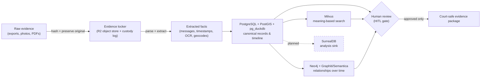

## 1. Title, Executive Summary, and Goals & Non-Goals

> _Byline: Claude Code · Opus 4.8 (1M) · 2026-06-30_
> _Part of: SPEC-1-MCP-Forensic-Evidence-Agent-Platform — Forensic Evidence Database Architecture package._
> _Authority note: Where this section touches locked decisions it cites the governing ADR. On any conflict, the SSOT docs win (`Agno-MCP-Platform/docs/PROJECT_CANON.md` + ADRs)._

---

### 1.1 Title

**SPEC-1 — Forensic Evidence Database Architecture**
**A Provenance-First, Bitemporal, Human-in-the-Loop Data Layer for a Pro Se Family-Law Custody Matter**

Subtitle (operational): *A four-resource persistence design — a unified PostgreSQL + PostGIS + embedded-DuckDB (pg_duckdb) store for relational / analytical / spatial data, Milvus for vectors, Neo4j (Graphiti + Semantica) for graph cognition, and SurrealDB as a deferred analysis sink — that ingests raw evidence under chain-of-custody, normalizes it into auditable canonical records, separates fact from inference from legal conclusion, and produces court-safe, fully-traceable evidence packages with human review gating every sensitive output.*

This is the data-layer specification for **Phase 1 (Evidence custody & normalization)** of the platform, designed forward-compatibly for **Phase 2 (multi-pass behavioral / abuse-pattern analysis)** and **Phase 3 (AI Legal Team reasoning)** described in the platform background (MP §Platform Background). It is **not a green-field design**: it adopts, adapts, and merges the owner's existing ontologies, partial schemas, and prior AI-analysis outputs per the discovery crosswalk (CONTEXT_PACK §3).

---

### 1.2 Executive Summary (plain-language, for a non-technical stakeholder)

**What this is, in one sentence.** This is the blueprint for the "filing cabinet, evidence locker, and timeline board" that sits underneath an AI-assisted system you control, helping you organize the evidence in your custody case so that anything you might one day hand to a court can be trusted, traced back to its original source, and explained.

**Why it exists.** A custody matter generates an overwhelming pile of digital material: text messages, call logs, social-media posts, screenshots, photos with GPS data, location history, emails, PDFs, and notes. Scattered across phones, exports, and cloud accounts, that material is impossible to reason about reliably and dangerous to present in court if you cannot prove where each piece came from or whether a claim is established fact versus your own interpretation. This database is the disciplined, auditable home for all of it.

**The core idea: keep five kinds of "truth" in separate drawers.** The single most important design rule is that the system never blurs these five layers together (Constraints; CONTEXT_PACK §6):

| Layer | Plain-language meaning | Example |
|---|---|---|
| **Raw evidence** | The original, untouched item, byte-for-byte, with a digital fingerprint | The actual SMS-backup XML file, exactly as exported |
| **Extracted fact** | Something a tool pulled *out of* the raw item | The text and timestamp read from inside that SMS file; OCR text from a screenshot; a geocoded address |
| **Inferred fact** | Something the system *calculated* but no one stated directly | "She was likely home that night," derived from GPS clustering |
| **Analytical finding** | A pattern or interpretation produced by analysis | "These messages show a repeating conflict-then-repair cycle" |
| **Legal conclusion** | A claim with legal weight | "This is relevant to the best-interest factors" |

Each higher layer must point back, in writing, to the layer beneath it. Nothing on a higher shelf is ever allowed to quietly become "fact" on a lower one.

**It remembers two kinds of time.** The system is *bitemporal* (MP §Platform Background; ADR-0014/0018/0031). It records both **when something happened** and **when you found out about it**. That lets the system honestly answer "what did I reasonably know at the time?" versus "what only became clear later?" — and preserve how a later discovery changes the meaning of an earlier event, without rewriting history.

**It is fair on purpose.** The design deliberately captures the **whole relationship**, not just the bad moments — affectionate, ordinary, neutral, repair, and "love-bombing"-style interactions are recorded too, because the *contrast and cycling over time* is what makes a pattern meaningful and credible (Constraints). It also records **your own** mistakes, escalations, apologies, and repair attempts in context, so the picture is not one-sided. The goal framing is **"structure, safety, clarity, and child stability,"** not punishment or blame.

**Nothing sensitive ships without a human.** The system can *suggest* sensitive interpretations — words like gaslighting, coercive control, alienation, or weaponization — but it will never put them into a court-facing output on its own. A person (you) must review and approve. Likewise, anything that leaves your control or moves money is gated behind explicit approval (CONTEXT_PACK §4, §6).

**It keeps your originals safe and stays on your own infrastructure.** Every raw file is hashed (a SHA-256 fingerprint) and preserved unchanged; records are append-only and versioned, so earlier interpretations are never overwritten, only superseded (ADR contract; CONTEXT_PACK §3). All evidence stays on owner-controlled infrastructure; raw forensic/abuse content is **never** sent to external cloud AI services (CONTEXT_PACK §4). Local analysis runs on small CPU-only models; large reasoning uses cloud models **only** on non-sensitive material via the gateway (ADR-0015).

**Where it lives (the four lockers), in plain terms.** The data is split into four independent storage systems so that if one breaks, the others keep running (owner-mandated hard constraint; CONTEXT_PACK §1):

| # | The "locker" | What it holds (plain language) |
|---|---|---|
| 1 | **One PostgreSQL database** (with mapping/PostGIS and an embedded analytics engine, pg_duckdb) | The structured records: evidence catalog, messages, events, people, places, claims, the timeline, and the chain-of-custody log |
| 2 | **Milvus** | The "search by meaning" index, so you can find related messages or documents by content, not just keywords |
| 3 | **Neo4j (with Graphiti + Semantica)** | The "who-did-what-to-whom-and-when" relationship map, including how knowledge changed over time |
| 4 | **SurrealDB** *(planned, not yet built)* | A future consolidated analysis workspace |

**Bottom line.** When this is built, you will be able to take any sentence in a future court summary and walk it back — step by step — to the exact original file it came from, the tool and prompt version that processed it, and the human who approved it. That traceability, plus the fact/inference/conclusion separation and the human-review gates, is the entire point.

#### Plain-language data-flow overview

---

### 1.3 Goals and Non-Goals

#### 1.3.1 Goals — what this database system is supposed to do

| # | Goal | Grounding |
|---|---|---|
| G1 | **Ingest raw evidence under chain-of-custody**: accept exports (SMS/MMS/call logs, iMessage/GVoice/Facebook, Snapchat, ChatGPT/Claude transcripts, Google Takeout/location, screenshots, photos, PDFs, emails), hash each raw file (SHA-256), and **preserve the original byte-for-byte**. | MP Phase 1; CONTEXT_PACK §3 (parsers, UUIDv7+SHA-256 custody contract), §6 |
| G2 | **Parse & extract structured data** from raw items using the salvaged parser suite (`enhanced-xml-chunker`, `sms_backup_parser`, GVoice/iMessage-PDF/FB, `chat-export`, location/Takeout, Snapchat, `schema-resolver.ts` for unknown formats). | CONTEXT_PACK §3 |
| G3 | **Normalize into canonical records** across the core domains (evidence, messages, events, people/entities, locations, GPS tracks, claims, relationships, abuse-pattern indicators, legal issues, analysis findings, evidence-gathering tasks, court export packages). | MP §4 Core Data Domains |
| G4 | **Maintain strict layer separation** between raw evidence, extracted facts, inferred facts, analytical findings, and legal conclusions — as distinct, linked record types, never collapsed. | Constraints; CONTEXT_PACK §6 |
| G5 | **Record timestamp precision** for every time value as a class — exact / approximate / inferred / uncertain — a field **missing from all prior schemas** and explicitly added here. | Constraints; CONTEXT_PACK §3 |
| G6 | **Be bitemporal**: capture both valid-time (when it happened) and knowledge-time (when it was learned), and preserve how later discoveries re-interpret earlier events without overwriting. | MP §Platform Background; ADR-0014/0018/0031; CONTEXT_PACK §2 |
| G7 | **Preserve full provenance & lineage** for every derived object back to source evidence, processing run, prompt version, ontology version, schema version, and human-review decision. | Constraints; CONTEXT_PACK §3 (Semantica PROV-O, `source_hash`; doc-intelligence tables incl. `approvals`) |
| G8 | **Model the full relational cycle and both parties' conduct**: positive / neutral / affectionate / ordinary / repair / love-bombing phases, plus the user's own mistakes, escalations, apologies, and repair attempts in temporal context. Track surface tone, inferred intent, relational function, and cycle phase **separately**. | Constraints; CONTEXT_PACK §3 (`positive_behaviors.ttl`), §6 |
| G9 | **Support meaning-based retrieval** via Milvus (one collection per embedder; raw docs remain source of truth) over message bodies, documents, and evidence text. | ADR-0027/0010/0011/0026; CONTEXT_PACK §2, §3 |
| G10 | **Represent entities & relationships over time** in Neo4j via the adopted salem_v3 ontology (Person, Incident/Event, Location, Statement, Evidence; edges WAS_AT, PARTICIPATED_IN, MADE_STATEMENT, CONTRADICTS, etc.), mirrored into PostgreSQL. | CONTEXT_PACK §3 (salem_v3); ADR-0014 |
| G11 | **Persist intermediate work products** — scans, drafts, indexes, classifications, prompt versions, tool-call outputs, generated artifacts — as append-only / versioned records, not just final outputs. | Constraints |
| G12 | **Keep originals & history immutable**: append-only logs or versioned records for anything that may later affect evidence interpretation; never overwrite raw evidence or earlier interpretations. | Constraints; CONTEXT_PACK §6 |
| G13 | **Produce court-ready evidence packages** as review-ready *factual* summaries with confidence tiers (adopting TraceIQ `vw_forensic_evidence_package` HIGH/MED/LOW tiers), each item traceable to source. | CONTEXT_PACK §3; MP Phase 1 |
| G14 | **Enable cross-session resumable memory** so project context (decisions, open questions, prior interpretations) survives across working sessions. | Constraints; CONTEXT_PACK §4 |
| G15 | **Keep all evidence on owner-controlled infrastructure** (PostgreSQL, Milvus, Neo4j, Cloudflare R2), with local CPU-only processing for sensitive content. | CONTEXT_PACK §1, §2, §4; ADR-0007/0015/0030 |
| G16 | **Adopt/adapt the owner's prior work, not start blank**: integrate existing ontologies, partial schemas, case-specific labels, message categories, abuse-pattern notes, event drafts, and prior AI outputs — classified by confidence, usefulness, and review status. | Constraints; CONTEXT_PACK §3 |
| G17 | **Deploy as four independent resources** with no shared lifecycle (separate bind-mounted volumes; one store's crash/restart never tears down the others). | CONTEXT_PACK §1 (owner hard constraint) |

#### 1.3.2 Non-Goals — what this system is *not* supposed to do

| # | Non-Goal | Rationale / grounding |
|---|---|---|
| N1 | **Not a legal-advice engine.** It organizes evidence, builds review workflows, and drafts review-ready factual summaries; it does not give legal advice or make legal determinations. | Constraints ("Avoid legal advice"); MP Phase 3 keeps a human in the loop |
| N2 | **Not an autonomous accuser.** It never presents allegations as established fact and never auto-generates accusations, filings, or court-facing conclusions without human approval. | Constraints; CONTEXT_PACK §6 |
| N3 | **Not a one-sided advocacy tool.** It will not portray the user as perfect/automatically justified, nor the partner as abusive/manipulative without evidence-linked support. | Constraints; CONTEXT_PACK §6 |
| N4 | **Not a fact-promotion machine.** It never silently promotes a hypothesis/inference into a fact, and never overwrites prior evidence or interpretations. | Constraints; CONTEXT_PACK §6 |
| N5 | **Not a negativity-only model.** It does not model only abusive/negative incidents; positive, neutral, and repair interactions are first-class. | Constraints |
| N6 | **Not a single-sentiment classifier.** It does not flatten messages into one tone score; surface tone, inferred intent, relational function, and cycle phase are stored separately. | Constraints |
| N7 | **Not a standalone-DuckDB or standalone-PostGIS deployment.** DuckDB lives only as the pg_duckdb extension inside the single Postgres resource; PostGIS lives inside that same resource. | CONTEXT_PACK §1, §2; ADR-0013 |
| N8 | **Not a shared-lifecycle monolith.** Milvus, Neo4j, and SurrealDB are never co-located into one coupled app. | CONTEXT_PACK §1 |
| N9 | **Not an external-cloud evidence processor.** Raw forensic/abuse evidence is never fed to external/cloud LLM-extracting services (exa, Drive, Lucid, M365, or cloud entity-extraction); large cloud models touch only non-sensitive material. | CONTEXT_PACK §4; ADR-0015 |
| N10 | **Not a from-scratch schema.** It does not ignore or discard the owner's existing ontologies, schemas, labels, and prior AI outputs. | Constraints; CONTEXT_PACK §6 |
| N11 | **Not a destructive store.** No hard deletes of evidence/interpretations; superseded items are versioned/archived with a reason, never erased (mirrors the never-delete→`_stale/` rule). | Constraints; CONTEXT_PACK §2; user global rule |
| N12 | **Not (in this scope) the Phase-2 analysis engine or Phase-3 Legal Team.** This spec is the *data layer*; analysis and legal reasoning consume it but are out of scope here (designed for, not built by, this document). | MP §Platform Background phasing |
| N13 | **Not a real-time / high-frequency transactional system.** It is an evidence-of-record store optimized for auditability and provenance, not low-latency OLTP at scale. | Constraints ("auditability matters"; "normalized, auditable records over vague summaries") |

#### 1.3.3 What should require human review (HITL)

These produce *suggestions/drafts* that a human must explicitly approve before they become canonical or court-facing. Approvals are recorded as first-class, append-only records (doc-intelligence `approvals` table; CONTEXT_PACK §3).

| Trigger | What is gated | Grounding |
|---|---|---|
| **Sensitive labels** — gaslighting, coercive control, alienation, manipulation, weaponization, reactive abuse | Cannot enter court-facing output without review/approval | Constraints; CONTEXT_PACK §6 |
| **Abuse-pattern indicators** (DARVO, MCL A–L patterns from `detection_patterns.py`, `behavioral_patterns.ttl`, `seed-patterns`) | Detector output is a *hypothesis*; review required before relied-upon use | CONTEXT_PACK §3 |
| **Adapted sensitive ontology** — `Vulnerability`, `Tactic`/`BehavioralPattern` nodes | HITL on creation/labeling | CONTEXT_PACK §3 |
| **Hypothesis edges** — `USED_TACTIC`, `EXPLOITED_VULNERABILITY`, `DISPARAGES` | Preserved as hypotheses; HITL before any court use | CONTEXT_PACK §3 |
| **Promotion across layers** — inferred fact → fact, finding → legal conclusion | Each promotion is an explicit, reviewed, logged event | Constraints; CONTEXT_PACK §6 |
| **Legal-relevance / best-interest (MCL 722.23) labels** | Reviewed before attached to evidence for court use | CONTEXT_PACK §3 (`mcl_722_23.ttl`, mcl-factor-mapper) |
| **Court-facing evidence packages & narrative drafts** | Reviewed as factual summaries (not advice) before export | Constraints; G13 |
| **The user's own conduct framing** | Reviewed for fair temporal context (explanation ≠ excuse; contextual harm ≠ proven causation) | Constraints |
| **Private/sensitive message exposure** (`is_private` → review gate) | Reviewed before inclusion | CONTEXT_PACK §3 (V4.1 `messages`) |
| **Geocode disagreements** (dual-provider `disagreement_flag` / `tie_break_reason`) | Surfaced for human tie-break | CONTEXT_PACK §3 (TraceIQ) |
| **Unknown-format field mappings** (`schema-resolver.ts` AI mapping) | AI-proposed mappings reviewed before normalization is trusted | CONTEXT_PACK §3 |

#### 1.3.4 What should never be automated without explicit approval

| # | Action | Why gated | Grounding |
|---|---|---|---|
| A1 | **Any write through the agno-gateway** to canonical/evidence stores | Route via the review-gatekeeper agent; no unattended writes | CONTEXT_PACK §4 |
| A2 | **Any rclone / R2 / bulk cloud transfer** | Cost + data-sweep risk: dry-run + sign-off first; state object count, size, source→dest, $ impact | CONTEXT_PACK §4; user global hard rule |
| A3 | **Coolify deploys / git push / infra changes** to the four data resources | Production data-tier; explicit approval | CONTEXT_PACK §4; user global rule |
| A4 | **Source-code edits** via morph/opencode to schema or pipeline | Reviewed before applying | CONTEXT_PACK §4 |
| A5 | **Sending any raw forensic/abuse evidence to external/cloud LLM tools** | Strictly prohibited — keep evidence local (CPU-only ≤4B) | CONTEXT_PACK §4; ADR-0015 |
| A6 | **Export / release of a court-facing package** | Final human sign-off; nothing leaves without approval | Constraints; G13 |
| A7 | **Generating accusations, filings, or sensitive legal conclusions** | Human approval mandatory (Phase-3 HITL model) | MP §Platform Background |
| A8 | **Deleting or overwriting** raw evidence or prior interpretations | Never automated; supersede/version with reason instead | Constraints; N11 |
| A9 | **Auto-promoting hypotheses to facts / applying sensitive labels** to court output | Requires the §1.3.3 review gate | Constraints; CONTEXT_PACK §6 |

#### 1.3.5 Confidence / risk flags carried on records (design intent)

To satisfy the constraints that the system make explicit "what needs corroboration," "what is emotionally important but maybe not legally useful," and "what could be strategically dangerous without context," every analytical/finding-layer record is designed to carry advisory flags (detailed in later schema sections):

| Flag | Meaning |
|---|---|
| `needs_corroboration` | Not safe to rely on until independently supported |
| `emotionally_important_low_legal_value` | Matters to the user; limited court usefulness |
| `strategically_sensitive` | Could be damaging if presented without surrounding context |
| `selectively_framed_risk` | May have been quoted/framed/weaponized out of context |
| `review_status` | unreviewed / in-review / approved / rejected (links to `approvals`) |
| `confidence_tier` | HIGH / MED / LOW (aligns with TraceIQ evidence-package tiers) |

---

### 1.4 Needs-human-review / open items flagged by this section

- **SurrealDB scope (G-list / locker #4):** ratified but **not deployed** (Phase D; ADR-0024). Stated here as planned-not-built to avoid implying it exists. Confirm whether SPEC-1 court-package outputs may depend on it or must work without it.
- **Cross-section consistency:** the §1.3.5 confidence/risk flag set and the timestamp-precision class (G5) are asserted here as design intent; they must be carried consistently into the canonical-data-model and schema sections so the "what needs corroboration / emotionally-but-not-legally-useful / strategically-dangerous" constraints are actually implemented, not just promised.
