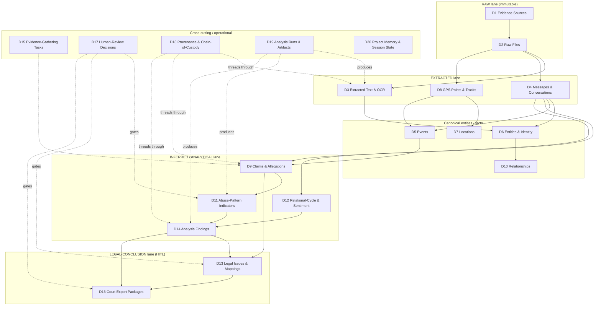

## Core Data Domains

> _Byline: Claude Code · Opus 4.8 (1M) · 2026-06-30_
> Scope of this section: identify and bound the **major data domains** the forensic-evidence
> system must hold — what each domain *is*, the prior work it adopts/adapts, which store owns it,
> its evidentiary **lane** (raw → extracted → inferred → analytical → legal-conclusion), and its
> provenance/temporal characteristics. Concrete tables, columns, keys, and indexes are specified in
> the next section (**Canonical Data Model**); PostgreSQL/DuckDB/PostGIS placement rules are in the
> **Schema Strategy** section. This section is the domain map those build on. Grounded in
> `CONTEXT_PACK.md` (A1–A5 discovery); SSOT docs (`PROJECT_CANON.md`, ADRs) win on any conflict.

---

### 4.0 How to read this section

A **data domain** is a coherent cluster of facts that share an owner, a lifecycle, and a set of
guardrails — not a single table. One domain typically spans several tables (and sometimes more than
one store). The whole design is governed by two cross-cutting axes that every domain must respect.

**Axis 1 — the evidentiary lane** (CONTEXT_PACK §3, §6 and global Constraints 2420). Every record
carries an explicit lane so that raw fact, machine inference, and human/legal judgment are never
silently merged:

| Lane | Meaning | Mutability | Example |
|---|---|---|---|
| **RAW** | Original evidence, byte-preserved, never edited | Immutable / append-only | A `messages.xml` export, a Google Takeout JSON, a screenshot file |
| **EXTRACTED** | Deterministically derived from raw (OCR, parse, geocode, hash) | Append-only, re-derivable | OCR text of a screenshot, geocoded lat/long, parsed SMS rows |
| **INFERRED** | Machine/model-derived, probabilistic | Append-only, versioned by run | "home_base" cluster, overnight stays, anomaly flags, NER entities |
| **ANALYTICAL** | Curated findings/views over the above | Versioned | Confidence-tiered evidence package view, pattern findings |
| **LEGAL-CONCLUSION** | Court-relevance / sensitive labels | HITL-gated, versioned | "MCL 722.23(b) factor", "coercive control" label |

**Axis 2 — the temporal model** (Neo4j/Graphiti bitemporal substrate ADR-0014/0018/0031; SurrealDB
sink ADR-0024) plus a **timestamp precision class** that *every* prior schema was missing
(CONTEXT_PACK §3, §5):

- **valid_time** — when the fact was true in the world (event occurred, message sent).
- **knowledge_time** — when the system learned/recorded it (ingest/run time).
- **precision_class** — `exact | approximate | inferred | uncertain` (Constraints 2421). Stored
  alongside *every* timestamp, never folded into the timestamp itself.

**Provenance is mandatory** for every non-raw object: each EXTRACTED/INFERRED/ANALYTICAL/LEGAL record
links back to its source raw evidence, the processing run, the prompt version, the ontology version,
the schema version, and any human-review decision (Constraints 2422, 2436, 2452). This is the
`UUIDv7 + SHA-256 chain-of-custody` column contract and the Semantica PROV-O model (CONTEXT_PACK §3),
realized via the **Provenance & Chain-of-Custody** domain (D18) that threads through all others.

---

### 4.1 Domain map (overview)



**Store ownership at a glance** (detail in Schema Strategy section; topology is the four-resource
HARD CONSTRAINT, CONTEXT_PACK §1):

| Store (resource) | Domains it primarily owns |
|---|---|
| **PostgreSQL + PostGIS + pg_duckdb** (one unified resource) | D1–D10, D13–D20 system-of-record rows; PostGIS owns geometry in D7/D8; pg_duckdb does analytical scans over R2 raw for D3/D8/D14/D16 |
| **Milvus** (vector, separate resource) | Embeddings/ANN for D3 text, D4 message bodies, D11 patterns, code/KB — 1 collection per embedder (ADR-0026/0027) |
| **Neo4j + Graphiti/Semantica** (graph, separate resource) | Cognition/traversal view of D5/D6/D7/D9/D10 + bitemporal facts; salem_v3 nodes/edges live here, mirrored in PG |
| **SurrealDB** (separate resource, Phase D, ADR-0024) | Consolidated bitemporal analysis sink downstream of PG for D14/D12 (RATIFIED, not yet deployed) |
| **Cloudflare R2** (`nexus`, `casebible-*`, ADR-0007/0030) | The actual bytes for D2 raw files; pg_duckdb/rclone reach |

---

### 4.2 Domain catalog

Each domain below follows: **what it is → lane → prior work adopted (crosswalk) → primary store →
key relationships → confidence/provenance/temporal notes → guardrails.**

#### D1 — Evidence Sources
- **What it is.** The *origin* of evidence: a device, account, export, custodian, or platform from
  which raw files came (e.g., "Pixel SMS backup", "Google Takeout 2024-11", "Facebook DYI archive",
  "screenshot batch from counsel"). One source produces many raw files.
- **Lane.** RAW (descriptive provenance metadata).
- **Adopts.** Semantica `source_hash` provenance model; the chain-of-custody column contract
  (CONTEXT_PACK §3). Google raw-export JSON shape preserved verbatim as the RAW EVIDENCE contract.
- **Store.** PostgreSQL (system of record). Bytes referenced in R2.
- **Relationships.** `1 Source → N Raw Files (D2)`; every downstream object traces here via D18.
- **Confidence/provenance/temporal.** Capture custodian, acquisition method, acquisition timestamp
  (with precision_class — exports often give only a date), tool/version used, and an integrity hash
  of the export container. knowledge_time = ingest.
- **Guardrails.** Source authenticity feeds MRE-authentication later; never overwrite an acquisition
  record — re-acquisitions create a new source version.

#### D2 — Raw Files
- **What it is.** The immutable, byte-preserved artifacts: XML/JSON exports, PDFs, images, audio,
  call-log dumps, chat-export JSONL. The forensic anchor everything else derives from.
- **Lane.** RAW (immutable).
- **Adopts.** `UUIDv7 + SHA-256 chain-of-custody`; `normalized_messages` universal raw-JSON-landing
  design (raw XML → `raw_data` JSON) so any format lands losslessly before typing (CONTEXT_PACK §3).
- **Store.** Bytes in **R2** (ADR-0007/0030); metadata + SHA-256 + pointer rows in **PostgreSQL**;
  pg_duckdb reads file contents directly from R2 for analytical extraction.
- **Relationships.** `N Raw Files → 1 Source (D1)`; `1 Raw File → N Extracted Text / Messages / GPS`.
- **Confidence/provenance/temporal.** SHA-256 at ingest = tamper seal; store MIME, byte size, original
  filename/path, embedded timestamps (EXIF/file mtime) each with precision_class. valid_time often
  absent on a file; knowledge_time = ingest.
- **Guardrails.** Never edit or re-encode; derived/cleaned copies are EXTRACTED, not raw. Never-delete
  → `_stale/`. Raw forensic/abuse bytes stay local / CPU-only — never sent to external cloud
  extractors (CONTEXT_PACK §4).

#### D3 — Extracted Text & OCR
- **What it is.** Deterministic text pulled from raw files: OCR of screenshots, PDF text layers,
  parsed message bodies, transcript text; plus document-intelligence chunking
  (sections/chunks/spans).
- **Lane.** EXTRACTED (re-derivable; OCR confidence carried).
- **Adopts.** `screenshots` (OCR = extracted) from TraceIQ V4.1; **doc-intelligence tables**
  (sections/chunks/spans/entities/findings/approvals); parsers (enhanced-xml-chunker with base64
  images, iMessage/GVoice/FB-PDF parsers, chat-export JSONL) from `extracted-code/MANIFEST.md`.
- **Store.** Text + chunk rows in **PostgreSQL**; **Milvus** holds chunk/body embeddings (1 collection
  per embedder); pg_duckdb may bulk-extract from R2.
- **Relationships.** `N → 1 Raw File (D2)`; feeds D6 entities, D4 messages, D9 claims.
- **Confidence/provenance/temporal.** Carry OCR/parse confidence score, extractor name+version,
  prompt/model version if a model assisted. precision_class on any timestamps recovered from text
  (often `inferred`/`uncertain`). knowledge_time = run time.
- **Guardrails.** Keep extracted text separate from the raw image; preserve the exact extractor
  version so re-runs are comparable, never overwritten (Constraints 2438/2470).

#### D4 — Messages & Conversations
- **What it is.** Normalized communications across platforms (SMS/MMS, iMessage, FB/Messenger, Google
  Voice, Snapchat, chat exports) and the threads/conversations grouping them. Highest-volume,
  highest-value evidentiary domain in this case.
- **Lane.** EXTRACTED (from raw exports) — message *content* is fact; tone/intent is INFERRED (D12).
- **Adopts.** TraceIQ V4.1 `messages` (link to timeline; `is_private` → review gate) + Milvus body
  embeddings; `social_action`. Reconcile typed `messages` with the `normalized_messages`
  universal-landing design (raw XML → `raw_data` JSON, platform-hop reconstruction).
  `sms_backup_parser` blocked-call type 5/6 handling preserved.
- **Store.** Rows in **PostgreSQL**; body embeddings in **Milvus**; thread/contact graph view in Neo4j.
- **Relationships.** `N Messages → 1 Conversation`; `→ 1 Raw File (D2)`; participants → D6 entities;
  links to D5 events and D9 claims; `is_private` flag → D17 review gate.
- **Confidence/provenance/temporal.** Sent/received timestamps with precision_class and source
  timezone; platform-hop provenance (a message forwarded/exported across apps). valid_time = send
  time; knowledge_time = ingest. Direction (inbound/outbound) is a fact, not an inference.
- **Guardrails.** `is_private`/intimate content gated for review before export. Model BOTH parties'
  messages including the user's own; do not pre-filter to one side (Constraints 2431–2433, 2456). Body
  embeddings computed locally (≤4B) for sensitive content.

#### D5 — Events
- **What it is.** Time-anchored occurrences: incidents, visits, calls, meetings, exchanges of the
  child, trips. The temporal spine that messages, locations, and claims attach to.
- **Lane.** Mixed — RAW/EXTRACTED for logged events (a call-log entry), INFERRED for reconstructed
  events (an "overnight stay" inferred from GPS).
- **Adopts.** salem_v3 `Incident`/`Event` (mirrored PG↔Neo4j); TraceIQ `timeline_enriched` →
  **split** into `timeline_event` (raw vs enriched) with TEXT timestamps → `timestamptz` +
  precision_class; raw `visits/activities/paths/trips`.
- **Store.** **PostgreSQL** system-of-record; **Neo4j** for traversal/causal-temporal reasoning;
  SurrealDB downstream for bitemporal analysis (Phase D).
- **Relationships.** Events ↔ D4 messages, ↔ D7 locations, ↔ D8 GPS, ↔ D6 participants, ↔ D9 claims;
  salem edges `WAS_AT`, `PARTICIPATED_IN`.
- **Confidence/provenance/temporal.** Strict split of **raw event** vs **enriched event**; every event
  timestamp carries precision_class; inferred events carry the run + method that produced them.
- **Guardrails.** Inferred events (overnight/home_base/anomaly) must never be presented as logged
  facts; keep the inference lane visible.

#### D6 — Entities & Identity Resolution
- **What it is.** People, organizations, accounts, devices, phone numbers, handles — plus the
  identity-resolution records that merge aliases into a canonical entity (three phone numbers + two FB
  handles = one person).
- **Lane.** EXTRACTED (observed identifiers) + INFERRED (the merge is a model/human judgment).
- **Adopts.** salem_v3 `Person` (MERGE with TraceIQ `people`); `map-entities`/`ontology` skills;
  Semantica NER. Entity aliases + identity-resolution records (CONTEXT_PACK §5).
- **Store.** **PostgreSQL** canonical rows; **Neo4j** as the entity graph (Graphiti substrate);
  optional name embeddings in Milvus for fuzzy match.
- **Relationships.** `1 Entity → N Aliases`; identity-resolution record links N observed identifiers →
  1 canonical entity with a confidence + reviewer; participants join entities to messages/events.
- **Confidence/provenance/temporal.** Merge confidence + method (deterministic key vs model);
  bitemporal — an alias can be valid for a period; merges are versioned, never destructive.
- **Guardrails.** A wrong merge mis-attributes statements; merges above a confidence threshold and any
  merge affecting court output go through D17 review.

#### D7 — Locations
- **What it is.** Canonical places (home, school, the other parent's residence, exchange points) with
  geometry and a dedup key — distinct from raw GPS pings.
- **Lane.** EXTRACTED (geocoded) + canonicalized.
- **Adopts.** salem_v3 `Location` (PostGIS geom); TraceIQ `geocode_resolution` (dual-provider
  `disagreement_flag`/`tie_break_reason`), append-only `geocode_audit`, `location_key` dedup.
- **Store.** **PostgreSQL + PostGIS** (geometry, spatial index); geocode audit append-only in PG.
- **Relationships.** `1 Location → N GPS points (D8)`, ↔ events, ↔ entities (residence-of).
- **Confidence/provenance/temporal.** Dual-provider geocode with disagreement flag + tie-break reason;
  precision_class on coordinates (rooftop vs centroid vs inferred); append-only geocode_audit preserves
  every resolution attempt.
- **Guardrails.** Never collapse a disagreement silently; keep both providers' results.

#### D8 — GPS Points & Tracks
- **What it is.** Raw location pings and the tracks/paths/trips reconstructed from them.
- **Lane.** RAW (the ping) → EXTRACTED (geocoded) → INFERRED (track/trip/home-base/overnight).
- **Adopts.** TraceIQ raw `paths/trips/visits/activities`; Google Takeout JSON shape verbatim;
  inferred `home_base`/overnight/anomaly logic kept in the INFERRED lane.
- **Store.** **PostgreSQL + PostGIS** (point + linestring geometry, GiST index); pg_duckdb for
  large-scan analytics over R2-stored raw location dumps.
- **Relationships.** `N points → 1 track`; tracks → events (D5), → locations (D7).
- **Confidence/provenance/temporal.** Each ping carries accuracy radius + precision_class; tracks carry
  the inference run + parameters; valid_time = ping time, knowledge_time = ingest.
- **Guardrails.** Inferred stays/overnights are hypotheses, not proof of presence; corroboration status
  tracked. Location data is highly sensitive — local processing only.

#### D9 — Claims & Allegations
- **What it is.** Assertions about what happened — both **claims** (a stated fact, by either party,
  with support status) and **allegations** (a contested assertion; allegation ≠ fact). The bridge
  between evidence and legal relevance.
- **Lane.** INFERRED/ANALYTICAL — explicitly *not* fact until corroborated.
- **Adopts.** salem_v3 `Statement` + `MADE_STATEMENT`, and the impeachment edge `CONTRADICTS`;
  PRESERVE-AS-HYPOTHESIS posture for `USED_TACTIC`/`EXPLOITED_VULNERABILITY`/`DISPARAGES`.
- **Store.** **PostgreSQL** rows; **Neo4j** for contradiction/support graph traversal.
- **Relationships.** Claim → supporting/contradicting evidence (D2/D3/D4); claim → events (D5); claim →
  legal issues (D13); `CONTRADICTS` links claims to each other.
- **Confidence/provenance/temporal.** Support status (`unsupported | corroborated | contradicted`), who
  asserted it, when asserted (valid_time) vs when recorded (knowledge_time); every claim links to its
  evidence basis (or explicitly records "no corroboration yet").
- **Guardrails.** Never promote a claim to a fact (Constraints 2469); flag what *requires corroboration
  before use* and what is *emotionally important but may not be legally useful* (2471–2472). Model the
  user's own claims/accountability items too, in temporal context.

#### D10 — Relationships (Relationship Assertions)
- **What it is.** Typed relationships between entities and between facts: parent-of, co-parent,
  resides-with, was-at, participated-in, and the *asserted* relational dynamics.
- **Lane.** EXTRACTED for structural relations (parent-of); INFERRED/HYPOTHESIS for dynamic ones.
- **Adopts.** salem_v3 edges — ADOPT `WAS_AT`, `PARTICIPATED_IN`, `MADE_STATEMENT`, `CONTRADICTS`,
  `EXPOSED_CHILD`, `AFFECTED_PARENTING_ACCESS` (custody, renamed); **SPLIT** vague `RELATED_TO` into
  typed causal/temporal/topical edges; PRESERVE-AS-HYPOTHESIS the sensitive edges.
- **Store.** **Neo4j** (native graph) as primary; mirrored relationship-assertion rows in **PostgreSQL**.
- **Relationships.** Connects D6 entities, D5 events, D9 claims; bitemporal edges in the Graphiti
  substrate.
- **Confidence/provenance/temporal.** Each assertion carries confidence, a valid_time interval (a
  relationship can start/end), and provenance; structural vs dynamic relations kept in separate lanes.
- **Guardrails.** Sensitive/dynamic edges are hypotheses requiring HITL before court use; structural
  edges (parent-of) are facts.

#### D11 — Abuse-Pattern Indicators
- **What it is.** Detected behavioral indicators across messages/events — the *signal* layer beneath
  any sensitive label (DARVO turns, control indicators, MCL-relevant behaviors).
- **Lane.** INFERRED (detector output) → never auto-promoted to LEGAL-CONCLUSION.
- **Adopts.** **The real prior art** from `extracted-code/MANIFEST.md`: `detection_patterns.py`
  (256-pattern, MCL A–L, 18 categories, DARVO), `behavioral_patterns.ttl`, `seed-patterns.ts (~303)` +
  patterns-schema, `hurtlex_loader`; salem `Vulnerability`/`Tactic`/`BehavioralPattern` (ADAPT,
  sensitive). **`positive_behaviors.ttl`** is adopted here too, to satisfy the both-parties /
  full-relational-cycle guardrail — do NOT invent new node types.
- **Store.** **PostgreSQL** finding rows; **Milvus** for pattern-similarity search over message bodies.
- **Relationships.** Indicator → message/event evidence; indicator → pattern finding (D14) → legal
  issue (D13); both negative *and* positive indicators.
- **Confidence/provenance/temporal.** Detector name+version, pattern/ontology version, match confidence,
  exact evidence span; append-only so re-runs with newer detectors are comparable.
- **Guardrails.** Indicators are not labels. The label-promotion step (gaslighting, coercive control,
  alienation, reactive abuse, weaponization) is a **separate LEGAL-CONCLUSION** requiring D17 review
  (Constraints 2448/2464). Must include positive/neutral/affectionate/love-bombing indicators, not only
  abusive ones (2431–2433).

#### D12 — Relational-Cycle & Sentiment (multi-lane tone model)
- **What it is.** The relationship-cycle and tone model: surface tone, inferred intent, relational
  function, and cycle phase (positive / neutral / affectionate / ordinary / love-bombing / tension /
  incident / repair) — modeled **separately**, not as one sentiment score.
- **Lane.** INFERRED/ANALYTICAL.
- **Adopts.** `positive_behaviors.ttl` (full-cycle), behavioral-pattern-analyzer skill; directly
  realizes Constraints 2432–2433 ("support surface tone, inferred intent, relational function, cycle
  phase, and surrounding temporal context separately"). Promoted to its own domain — **flagged**, §4.4.
- **Store.** **PostgreSQL**; SurrealDB downstream for cycle-over-time analysis (Phase D).
- **Relationships.** Attaches to D4 messages and D5 events; feeds D14 findings.
- **Confidence/provenance/temporal.** Each axis scored independently with its own confidence; phase
  assignment carries surrounding temporal-context window; valid_time = message/event time.
- **Guardrails.** Avoid one-sided sentiment; never reduce to a single positive/negative number;
  preserve contrast over time as analytically important.

#### D13 — Legal Issues & Mappings
- **What it is.** The legal-relevance layer: MCL best-interest factors (722.23 A–L), custody/parenting
  issues, and the mapping of evidence/claims/findings → those issues.
- **Lane.** LEGAL-CONCLUSION (HITL-gated).
- **Adopts.** `mcl_722_23.ttl` (12 MCL factors), `mcl-factor-mapper` + `irac-formatter` skills; salem
  `AFFECTED_PARENTING_ACCESS`/`EXPOSED_CHILD` as inputs.
- **Store.** **PostgreSQL** mapping rows; Neo4j for issue↔evidence traversal.
- **Relationships.** Legal issue ← claims (D9), findings (D14), patterns (D11), events (D5); → export
  packages (D16).
- **Confidence/provenance/temporal.** Each mapping records the human reviewer, the rationale, the
  ontology version of the factor set, and the strength of support; versioned.
- **Guardrails.** No factor mapping reaches court output without D17 review; avoid legal advice —
  organize evidence-to-issue, do not opine on outcomes (Constraints 2426/2466). Frame toward
  "structure, safety, clarity, child stability" over blame (2468).

#### D14 — Analysis Findings
- **What it is.** Curated, higher-order findings synthesized from claims, patterns, cycle, and timeline
  — the analyst-facing conclusions (e.g., "pattern of access pressure around exchanges, Q3 2024",
  contradiction clusters, timeline gaps).
- **Lane.** ANALYTICAL.
- **Adopts.** TraceIQ `vw_forensic_evidence_package` (HIGH/MED/LOW confidence tiers); Semantica
  conflict-detection; doc-intelligence `findings`.
- **Store.** **PostgreSQL** (views + materialized finding rows); pg_duckdb for the analytical scans;
  **SurrealDB** as the consolidated bitemporal analysis sink (Phase D, ADR-0024).
- **Relationships.** Finding ← (claims, patterns, cycle, events); finding → legal issue (D13) → export
  (D16); each finding cites its evidence basis.
- **Confidence/provenance/temporal.** HIGH/MED/LOW confidence tier; full lineage to source evidence,
  run, prompt+ontology+schema versions; versioned (re-analysis creates a new version, prior preserved).
- **Guardrails.** Findings are analytical, not legal conclusions; corroboration status explicit;
  preserve prior interpretations, never overwrite (Constraints 2470).

#### D15 — Evidence-Gathering Tasks
- **What it is.** The work-tracking domain: open questions, "need to obtain X", corroboration to-dos,
  follow-ups generated by analysis ("this claim is uncorroborated — obtain the call log").
- **Lane.** Operational (ANALYTICAL-adjacent).
- **Adopts.** New, but driven by D9 corroboration-status and D14 gaps; integrates with the
  casebible-coordination board / autonomy protocol (MEMORY index).
- **Store.** **PostgreSQL**.
- **Relationships.** Task → the claim/finding/gap that spawned it; task → resulting new source (D1).
- **Confidence/provenance/temporal.** Task status, created-by (human/agent + run), due/priority;
  append-only status history.
- **Guardrails.** Tasks capture *what still needs corroboration before use* (Constraints 2471) so gaps
  are explicit rather than silently filled.

#### D16 — Court Export Packages
- **What it is.** Assembled, review-ready, court-facing evidence packages — the system's terminal
  deliverable. A package bundles selected evidence, claims, findings, and legal mappings into a
  citable, provenance-complete export.
- **Lane.** LEGAL-CONCLUSION (HITL-gated, strictest gate).
- **Adopts.** TraceIQ `vw_forensic_evidence_package` (confidence-tiered, HITL); evidence-review /
  mre-authentication / source-audit skills for assembly + authentication checks.
- **Store.** **PostgreSQL** package + manifest rows; rendered artifacts (PDF/bundle) in **R2**.
- **Relationships.** Package ← selected D2/D3/D4/D5/D9/D14/D13 items; every included item must carry
  full D18 provenance and a D17 approval.
- **Confidence/provenance/temporal.** Immutable, versioned snapshot at export time; manifest records
  every included object's hash + lineage; a package is reproducible from its manifest.
- **Guardrails.** Every export passes through the **review-gatekeeper** agent (CONTEXT_PACK §4) and D17
  approval; court-safe language only; no allegation presented as fact; flags what *could be
  strategically dangerous if presented without context* (Constraints 2473). Generated as factual
  summaries, not legal advice (2466).

#### D17 — Human-Review Decisions
- **What it is.** The append-only record of every HITL decision: approvals, rejections, sensitive-label
  sign-offs, identity-merge confirmations, export releases. The audit backbone of every gate.
- **Lane.** Cross-cutting (governs LEGAL/sensitive lanes).
- **Adopts.** doc-intelligence **`approvals`** table; review-gatekeeper agent flow; casebible
  `APPROVALS.md` gating model.
- **Store.** **PostgreSQL** (append-only).
- **Relationships.** A decision references the exact object+version it approved (pattern label, merge,
  factor mapping, export) and the reviewer identity.
- **Confidence/provenance/temporal.** Reviewer, timestamp, decision, rationale, the object version
  reviewed; never updated in place — a reversal is a new decision.
- **Guardrails.** Required before any sensitive label, legal mapping, or court export becomes releasable
  (Constraints 2427/2448). Decisions are themselves evidence of process integrity.

#### D18 — Provenance & Chain-of-Custody
- **What it is.** The connective tissue: every derived object's link back to source evidence, processing
  run, prompt version, ontology version, schema version, and review decision; plus the SHA-256 custody
  chain on raw bytes.
- **Lane.** Cross-cutting (mandatory on all non-RAW objects).
- **Adopts.** `UUIDv7 + SHA-256 chain-of-custody` column contract; Semantica PROV-O model +
  `source_hash` (CONTEXT_PACK §3).
- **Store.** **PostgreSQL** (provenance edges/columns); mirrored as PROV-O in **Neo4j** via Semantica.
- **Relationships.** Threads through D3, D4, D9, D11, D12, D14, D16 — anything derived.
- **Confidence/provenance/temporal.** Append-only lineage; bitemporal (valid + knowledge time); enables
  "trace any final output back to source" (Constraints 2436/2452).
- **Guardrails.** No derived object may exist without provenance; lineage is immutable.

#### D19 — Analysis Runs & Artifacts (intermediate work products)
- **What it is.** Every processing run and its intermediate outputs: scans, drafts, indexes,
  classifications, prompt versions, tool-call outputs, generated artifacts — kept, not discarded.
- **Lane.** Cross-cutting (the "rough work" lane, kept separate from canonical facts).
- **Adopts.** Constraints 2434–2438 / 2450–2455 (persist intermediate work products); analysis-runs +
  artifact-lineage; ties to prompt/ontology/schema-version registries.
- **Store.** **PostgreSQL** run+artifact metadata; large artifacts in **R2**; embeddings (if any) in
  Milvus.
- **Relationships.** Run → the extracted/inferred/analytical objects it produced (D3/D11/D14); artifact
  → its run; run → prompt/ontology/schema versions.
- **Confidence/provenance/temporal.** Run id (UUIDv7), inputs, parameters, model/prompt version,
  start/end, status; append-only.
- **Guardrails.** Do not discard artifacts unless intentionally archived with a reason (Constraints
  2435/2451); keep model-generated interpretations separate from canonical evidence facts (2437/2453).

#### D20 — Project Memory & Session State
- **What it is.** The cross-session memory layer so work resumes without losing context: project facts,
  decisions, handoffs, the recall index — distinct from case evidence.
- **Lane.** Operational (NOT evidence; never mixed into evidentiary lanes).
- **Adopts.** Graphiti KG memory (Neo4j), `.remember` handoffs, auto-memory `MEMORY.md`,
  casebible-coordination board (CLAUDE.md / MEMORY index, CONTEXT_PACK §4).
- **Store.** **Neo4j** (Graphiti) + PostgreSQL/markdown indexes; per the Memory Architecture doc.
- **Relationships.** References decisions/ADRs/sessions; intentionally *isolated* from D1–D18 case data.
- **Confidence/provenance/temporal.** Bitemporal in Graphiti; SSOT docs win on conflict.
- **Guardrails.** Project memory may use the graph cognition substrate, but **raw case evidence is never
  fed to external/cloud entity extractors** (CONTEXT_PACK §4) — keep the memory lane and the evidence
  lane separate.

---

### 4.3 Domain → lane → store → crosswalk summary

| # | Domain | Primary lane(s) | Primary store | Key prior work adopted |
|---|---|---|---|---|
| D1 | Evidence Sources | RAW | PostgreSQL (+R2) | Semantica source_hash; custody contract |
| D2 | Raw Files | RAW (immutable) | R2 bytes + PG meta | UUIDv7+SHA-256; normalized_messages landing |
| D3 | Extracted Text & OCR | EXTRACTED | PG + Milvus | screenshots/OCR; doc-intel; parsers |
| D4 | Messages & Conversations | EXTRACTED | PG + Milvus + Neo4j | TraceIQ V4.1 messages; sms/GVoice/FB parsers |
| D5 | Events | RAW/EXTRACTED/INFERRED | PG + Neo4j | salem Incident/Event; timeline_event split |
| D6 | Entities & Identity | EXTRACTED + INFERRED | PG + Neo4j (+Milvus) | salem Person; TraceIQ people; map-entities |
| D7 | Locations | EXTRACTED | PG + PostGIS | salem Location; geocode_resolution/audit |
| D8 | GPS Points & Tracks | RAW→EXTRACTED→INFERRED | PG + PostGIS (+pg_duckdb) | TraceIQ paths/trips/visits; Takeout shape |
| D9 | Claims & Allegations | INFERRED/ANALYTICAL | PG + Neo4j | salem Statement/CONTRADICTS; hypothesis posture |
| D10 | Relationships | EXTRACTED + HYPOTHESIS | Neo4j + PG | salem edges; SPLIT RELATED_TO |
| D11 | Abuse-Pattern Indicators | INFERRED | PG + Milvus | detection_patterns.py; *.ttl; positive_behaviors |
| D12 | Relational-Cycle & Sentiment | INFERRED/ANALYTICAL | PG (+SurrealDB) | positive_behaviors.ttl; behavioral-pattern-analyzer |
| D13 | Legal Issues & Mappings | LEGAL-CONCLUSION (HITL) | PG + Neo4j | mcl_722_23.ttl; mcl-factor-mapper; irac |
| D14 | Analysis Findings | ANALYTICAL | PG + pg_duckdb + SurrealDB | vw_forensic_evidence_package; Semantica conflict |
| D15 | Evidence-Gathering Tasks | Operational | PostgreSQL | corroboration-driven; coordination board |
| D16 | Court Export Packages | LEGAL-CONCLUSION (HITL) | PG + R2 | vw_forensic_evidence_package; evidence-review |
| D17 | Human-Review Decisions | Cross-cutting (gate) | PostgreSQL (append-only) | doc-intel approvals; review-gatekeeper |
| D18 | Provenance & Chain-of-Custody | Cross-cutting (mandatory) | PG + Neo4j (PROV-O) | UUIDv7+SHA-256; Semantica PROV-O |
| D19 | Analysis Runs & Artifacts | Cross-cutting (rough work) | PG + R2 (+Milvus) | intermediate-work constraints; lineage registry |
| D20 | Project Memory & Session State | Operational (non-evidence) | Neo4j/Graphiti + PG | Graphiti; .remember; MEMORY.md |

**Lane-flow invariant (must hold across all domains):**

```mermaid
flowchart LR
  RAW["RAW<br/>D1 D2 (+D5/D8 logged)"] --> EXTRACTED["EXTRACTED<br/>D3 D4 D6 D7 D8"]
  EXTRACTED --> INFERRED["INFERRED<br/>D5* D9 D10* D11 D12"]
  INFERRED --> ANALYTICAL["ANALYTICAL<br/>D14"]
  ANALYTICAL --> LEGAL["LEGAL-CONCLUSION (HITL)<br/>D13 D16"]
  HITL["D17 Human Review"] -. gates .-> LEGAL
  HITL -. gates .-> INFERRED
  PROV["D18 Provenance"] -. attaches to every non-raw .-> EXTRACTED
  PROV -. .-> INFERRED
  PROV -. .-> ANALYTICAL
  PROV -. .-> LEGAL
```

A record may move *up* lanes only by creating a new, higher-lane object that cites the lower one —
**never** by mutating the original (Constraints 2469/2470).

---

### 4.4 Needs-human-review / gaps flagged in this section

1. **D12 (Relational-Cycle & Sentiment) is promoted to a first-class domain** even though the master
   prompt's domain bullet list (offset 1929) does not name it explicitly. Justification: global
   Constraints 2432–2433 *require* separate modeling of surface tone, inferred intent, relational
   function, and cycle phase, and CONTEXT_PACK §3/§6 require modeling the full relational cycle with
   `positive_behaviors.ttl`. **Reviewer: confirm D12 should stand alone vs. fold into D11.**
2. **`normalized_messages` (universal raw-JSON landing) vs. typed `messages` (TraceIQ V4.1)** must be
   reconciled in the Canonical Data Model — CONTEXT_PACK §3 explicitly leaves this open ("reconcile vs
   typed messages"). Flagged here so the next section resolves it; both are referenced in D2/D4.
3. **SurrealDB-owned domains (parts of D12/D14) are Phase-D / RATIFIED-not-deployed** (ADR-0024). Until
   deployed, those analyses live in PostgreSQL/pg_duckdb; this section assigns ownership but the build
   sequence must not assume SurrealDB is available at MVP.
