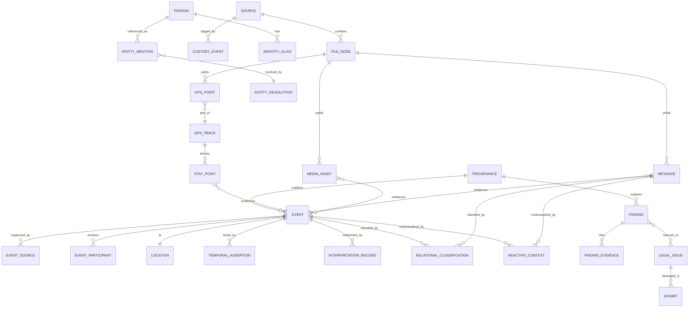

## Canonical Data Model (the big one)

> _Byline: Claude Code · Opus 4.8 (1M) · 2026-06-30_
>
> This is the implementation-grade relational schema for the forensic-evidence DB. It is the
> **single largest deliverable** and the spine the rest of the package hangs from. It lives in the
> **unified relational/analytical/spatial resource** — PostgreSQL 18 + PostGIS + embedded DuckDB via
> `pg_duckdb`, the custom image `agno-postgres:18-duckdb` (**ADR-0013**, supersedes ADR-0003; LIVE).
> Vector bodies/OCR go to **Milvus** (ADR-0027), cognition/edges to **Neo4j+Graphiti** (ADR-0014/0018/0031),
> downstream consolidated analysis to **SurrealDB** (ADR-0024, Phase D). Those projections are described
> in sections 05/06/07; PG is the **system of record** and the only court-export source of truth.
>
> **Not a blank slate.** Every table below adopts/adapts the user's prior work per the A3 crosswalk —
> `salem_v3.py` (Salem v. Kinzel KG ontology), TraceIQ V4.1 (`timeline_enriched`, `messages`, `people`,
> `screenshots`, geocode stack), `normalized_geo_schema_v5`, the chunker parser configs, and the
> Semantica/doc-intelligence provenance pattern. Adoption is cited inline and consolidated in §12.

---

### 0. Design contract (binds every table in this section)

These conventions are assumed in every DDL block; they are stated once here, not repeated per table.

| # | Convention | Rule | Source / rationale |
|---|---|---|---|
| C1 | **Schemas (namespaces)** | Ten PostgreSQL schemas, one per concern: `custody`, `evidence`, `entity`, `timeline`, `temporal`, `geo`, `multimodal`, `analysis`, `legal`, `provenance`. | Mirrors §02 domain catalog D1–D20; one home per concern. |
| C2 | **Primary keys** | Every table PK is `id uuid PRIMARY KEY DEFAULT uuidv7()` (time-ordered, native to the PG18 image). | ADR-0013 native `uuidv7()`; adopts the "UUIDv7 + SHA-256 chain-of-custody column contract" (A3/MANIFEST). |
| C3 | **Evidence-lane tier** | Most rows carry `data_tier evidence_tier NOT NULL`. Enum `evidence_tier = ('raw','extracted','inferred','analytical','legal_conclusion')`. The tier is **structurally enforced** — raw tables only hold `raw`; findings only hold `inferred`/`analytical`/`legal_conclusion`. | Guardrail (CONTEXT_PACK §6; MP Constraints 2420). Lane discipline from A3 §149. |
| C4 | **Timestamp-precision class** | Every business timestamp pairs with `ts_precision precision_class` = `('exact','approximate','inferred','uncertain')` plus an interval window. **This was missing from ALL prior schemas (A3 §152) and is mandatory.** Deep mechanics in §08. | MP 2421; CONTEXT_PACK §3. |
| C5 | **Bitemporal columns** | Interpretable rows carry **valid time** (`valid_from`, `valid_to`) and **transaction time** (`sys_period tstzrange DEFAULT tstzrange(now(),NULL)`), maintained append-only via `temporal.*` (§5) and the `provenance` audit (§10). Never overwrite an interpretation; supersede it. | MP 1659–1663, 592–622; guardrail "preserve prior interpretations." |
| C6 | **Provenance FK** | Every derived (non-`raw`) row has `provenance_id uuid NOT NULL REFERENCES provenance.provenance(id)`. Raw rows anchor provenance through `custody.source`. Nothing derived exists without a traceable chain back to source evidence. | MP 1853, 2422; Semantica `source_hash` pattern (A3 §58). |
| C7 | **Confidence is multi-axis, never one number** | Where relevant a row carries separate `temporal_confidence`, `spatial_confidence`, `evidence_confidence`, `analysis_confidence` (`numeric(4,3)` in `[0,1]`), plus `evidence_strength strength_class`. | MP 1636–1638, 1811, 1863. |
| C8 | **HITL gates** | Sensitive rows carry `requires_human_review boolean`, `review_status review_state` = `('unreviewed','in_review','approved','rejected','needs_more_evidence')`, and `safe_for_legal_use boolean DEFAULT false`. No abuse-label/legal-conclusion row is court-eligible until `review_status='approved' AND safe_for_legal_use`. | MP 1818–1820, 2427/2448; CONTEXT_PACK §6. |
| C9 | **Balanced modeling is built into the model, not a flag** | The relational-cycle (§8.1) and reactive-context (§8.2) tables are **first-class**, not optional add-ons, so positive/neutral/love-bombing/repair and the user's own conduct are representable everywhere a message or event is. | MP 404–497, 500–685; guardrail "model BOTH parties / FULL relational cycle." |
| C10 | **Append-only history** | Anything that can change interpretation (geocode decisions, findings, interpretations, redactions, exports, custody) is append-only / versioned, never updated-in-place. Adopts TraceIQ `geocode_audit` and `original_json` patterns. | MP 2438; A3 §116/§154. |
| C11 | **Raw payload preserved verbatim** | Raw tables keep the untouched source blob in `raw_data jsonb` (or object-store URI for binaries). Google Takeout JSON shape and message-export XML are kept **byte-faithful**. | A3 §126 (Google raw = RAW EVIDENCE contract); CONTEXT_PACK §3. |
| C12 | **Naming** | `snake_case`; tables singular; FK columns `<referent>_id`; enums `*_class`/`*_state`/`*_type`; PostGIS columns `geom`/`geog`. | house style. |

#### 0.1 Shared enumerated types (created once)

```sql
CREATE TYPE evidence_tier   AS ENUM ('raw','extracted','inferred','analytical','legal_conclusion');
CREATE TYPE precision_class AS ENUM ('exact','approximate','inferred','uncertain');
CREATE TYPE strength_class  AS ENUM ('none','weak','moderate','strong','conclusive');
CREATE TYPE review_state    AS ENUM ('unreviewed','in_review','approved','rejected','needs_more_evidence');
CREATE TYPE conduct_party   AS ENUM ('user','partner','child','third_party','institution','unknown'); -- whole-record (MP 518-529)
CREATE TYPE cycle_phase     AS ENUM ('calm','tension_building','conflict','repair','reconciliation',
                                     'love_bombing','withdrawal','escalation','de_escalation','unknown'); -- MP 432-444
```

#### 0.2 Schema-at-a-glance (entity-relationship overview)



> Read order: **acquisition** (`custody`) → **extracted facts** (`evidence`, `geo`, `multimodal`, `entity`)
> → **events + time** (`timeline`, `temporal`) → **inferred/analytical** (`analysis`) → **legal/delivery**
> (`legal`) → **provenance cross-cuts all** (`provenance`). This matches the five lanes in §02.

---

### 1. `custody` — Sources & Chain of Custody (raw-evidence tier)

#### 1.1 `custody.source` — one row per acquired source item

**Purpose.** The custody anchor for every piece of evidence. Adopts/normalizes the provenance fields scattered across TraceIQ (`data_source`, `original_json`, `processed_at`) and the UUIDv7+SHA-256 custody contract (A3 §61). Everything downstream traces here.

| Column | Type | Notes |
|---|---|---|
| `id` | `uuid PK uuidv7()` | Source ID (MP 1549). |
| `source_type` | `text NOT NULL` | MP 1550 — e.g. `google_takeout`, `sms_xml_backup`, `fb_messenger_html`, `imessage_pdf`, `gvoice`, `snapchat`, `screenshot_set`, `security_cam`, `ai_transcript`, `device_extraction`. |
| `original_path` | `text` | Original file path **or** R2/S3 object URI (MP 1551). pg_duckdb reads S3 via account-wide secret (ADR-0030). |
| `object_uri` | `text` | Canonical R2 URI (`r2://nexus/...` or `casebible-*`). |
| `hash_sha256` | `bytea NOT NULL` | Primary content hash (chain-of-custody contract). |
| `hash_md5`, `hash_blake3` | `bytea` | Secondary hashes (MD5 matches Case Bible catalog; A1). |
| `byte_size` | `bigint` | |
| `ingested_at` | `timestamptz NOT NULL DEFAULT now()` | Ingestion timestamp (MP 1553). **Distinct** from evidence-creation time (MP 1658). |
| `evidence_created_at` | `timestamptz` | When the evidence itself was created (capture time). |
| `evidence_created_precision` | `precision_class` | Precision of capture time (C4). |
| `acquisition_method` | `text` | MP 1554 — `manual_export`, `adb_pull`, `cloud_api`, `physical_image`, `screenshot`, `subpoena_return`. |
| `device_origin_id` | `uuid REFERENCES entity.device(id)` | Device of origin (MP 1555). |
| `account_origin_id` | `uuid REFERENCES entity.account(id)` | Account of origin (MP 1555). |
| `custodian_id` | `uuid REFERENCES entity.person(id)` | Custodian (MP 1556). |
| `custody_status` | `text NOT NULL DEFAULT 'acquired'` | MP 1557 — `acquired`→`verified`→`processing`→`held`→`released`. |
| `legal_sensitivity` | `text` | MP 1558 — `none`/`work_product`/`privileged`/`sealed`. |
| `privacy_sensitivity` | `text` | MP 1559 — `none`/`pii`/`minor`/`health`/`intimate`. Drives redaction (§10). |
| `extraction_status` | `text DEFAULT 'pending'` | MP 1560. |
| `processing_status` | `text DEFAULT 'pending'` | MP 1561. |
| `review_status` | `review_state DEFAULT 'unreviewed'` | MP 1562. |
| `export_status` | `text DEFAULT 'not_exported'` | MP 1563. |
| `original_metadata` | `jsonb` | MP 1564 — verbatim source metadata. |
| `derived_metadata` | `jsonb` | MP 1565 — parser/tool-derived metadata. |
| `raw_data` | `jsonb` | C11 verbatim payload when small/JSON; large binaries live in object store. |
| `data_tier` | `evidence_tier NOT NULL DEFAULT 'raw'` | Always `raw` here. |

- **PK:** `id`.
- **FKs:** `device_origin_id`, `account_origin_id`, `custodian_id` → `entity.*`.
- **Indexes:** `UNIQUE(hash_sha256)` (dedup vs Case Bible catalog before ingest); `btree(source_type)`; `btree(ingested_at)`; `gin(original_metadata)`, `gin(derived_metadata)`.
- **Provenance/temporal:** this row *is* the raw-evidence custody anchor; `ingested_at` vs `evidence_created_at` enforce MP 1658.

#### 1.2 `custody.file_node` — recursive file/page/frame/OCR/message tree

**Purpose.** Models MP 1566's "parent-child relationships between files, pages, frames, screenshots, OCR text, messages, and extracted events." A single self-referencing tree so a Takeout zip → JSON file → segment → screenshot → OCR-text node → extracted message → extracted event chain is one navigable hierarchy.

| Column | Type | Notes |
|---|---|---|
| `id` | `uuid PK uuidv7()` | |
| `source_id` | `uuid NOT NULL REFERENCES custody.source(id)` | Root source. |
| `parent_id` | `uuid REFERENCES custody.file_node(id)` | Self-FK; NULL = top-level container. |
| `node_type` | `text NOT NULL` | `archive`/`file`/`page`/`frame`/`screenshot`/`ocr_text`/`segment`/`attachment`/`derived`. |
| `node_role` | `evidence_tier NOT NULL` | `raw` for files/pages/frames; `extracted` for OCR/segment nodes. |
| `relative_path` | `text` | Path within container. |
| `hash_sha256` | `bytea` | Per-node hash where applicable. |
| `mime_type` | `text` | |
| `page_or_frame_no` | `integer` | Page/frame ordinal. |
| `extracted_by_run_id` | `uuid REFERENCES provenance.processing_run(id)` | Which run produced an extracted node. |
| `payload_ref` | `text` | Object-store URI for binary children. |
| `meta` | `jsonb` | |

- **PK:** `id`. **FKs:** `source_id`, `parent_id` (self), `extracted_by_run_id`.
- **Indexes:** `btree(source_id)`; `btree(parent_id)`; `btree(node_type)`. Subtree queries via recursive CTE (or `ltree` materialized path if depth-heavy).
- **Provenance/temporal:** OCR/segment nodes carry `node_role='extracted'` and FK to the run — keeps raw frame distinct from extracted text (lane discipline).

#### 1.3 `custody.custody_event` — append-only chain-of-custody log

**Purpose.** Immutable audit of every custody action (acquire, hash-verify, transfer, hold, redact, export). Append-only (C10).

| Column | Type | Notes |
|---|---|---|
| `id` | `uuid PK uuidv7()` | |
| `source_id` | `uuid NOT NULL REFERENCES custody.source(id)` | |
| `action` | `text NOT NULL` | `acquired`/`hash_verified`/`transferred`/`held`/`redacted`/`exported`/`integrity_failed`. |
| `actor_id` | `uuid REFERENCES entity.person(id)` | Human or service principal. |
| `actor_kind` | `text` | `human`/`service`/`agent`. |
| `hash_before`,`hash_after` | `bytea` | Integrity proof across the action. |
| `occurred_at` | `timestamptz NOT NULL DEFAULT now()` | |
| `note` | `text` | |
| `provenance_id` | `uuid REFERENCES provenance.provenance(id)` | |

- **PK:** `id`. **FK:** `source_id`. **Indexes:** `btree(source_id, occurred_at)`. **Append-only** (no UPDATE/DELETE grants; enforced by trigger + role).

---

### 2. `evidence` — Message-Level Normalization (raw + extracted tiers)

#### 2.1 `evidence.message` — the normalized communication row

**Purpose.** One row per message / serialized communication item across SMS, FB Messenger, iMessage, Google Voice, Snapchat, GChat, email. **Adopts** TraceIQ V4.1 `messages` (A3 §97) and **reconciles** with the `normalized_messages` universal raw-JSON-landing design (A3 §60): the raw export payload is preserved verbatim in `raw_data`, the typed columns are the extracted normalization. Satisfies MP 1568–1602 in full.

| Column | Type | Notes / MP line |
|---|---|---|
| `id` | `uuid PK uuidv7()` | Message ID (1570). |
| `thread_id` | `uuid NOT NULL REFERENCES evidence.thread(id)` | Conversation/thread ID (1571). |
| `platform` | `text NOT NULL` | (1572) `sms`,`fb`,`imessage`,`gvoice`,`snapchat`,`gchat`,`email`. |
| `sender_entity_id` | `uuid REFERENCES entity.person(id)` | Sender (1573) — resolved identity. |
| `sender_raw` | `text` | Verbatim sender token before resolution (handle/number). |
| `source_id` | `uuid NOT NULL REFERENCES custody.source(id)` | Source file (1583). |
| `file_node_id` | `uuid REFERENCES custody.file_node(id)` | Exact node in the custody tree. |
| `screenshot_asset_id` | `uuid REFERENCES multimodal.media_asset(id)` | Screenshot reference if message came from an image (1584). |
| `raw_ts` | `text` | Verbatim timestamp string from export (1578) — never discarded (TraceIQ stores TEXT; A3 §30). |
| `ts_utc` | `timestamptz` | Normalized timestamp (1579). |
| `ts_precision` | `precision_class NOT NULL DEFAULT 'exact'` | (1581) C4. |
| `ts_earliest`,`ts_latest` | `timestamptz` | Window bounds for non-exact (→ §08). |
| `tz` | `text` | Timezone (1580); ambiguity handled per §08.6. |
| `temporal_confidence` | `numeric(4,3)` | (1581). |
| `relative_time_refs` | `jsonb` | Captured "last night"/"that weekend" phrases (1582) → resolved in `temporal.relative_time_expr`. |
| `body` | `text` | Message body (1586). |
| `ocr_text` | `text` | OCR text if from screenshot (1587), `data_tier='extracted'`. |
| `language` | `text` | (1588). |
| `surface_sentiment` | `text` | (1589 / 470) — surface tone ONLY; intent modeled separately. |
| `inferred_intent` | `text` | (1590) — distinct from surface sentiment (MP 456). |
| `topic` | `text` | (1591). |
| `domain_type` | `text` | (1592) — e.g. `parenting`,`finance`,`logistics`,`legal`. |
| `relevance` | `text` | (1593). |
| `custody_relevance` | `text` | (1594). |
| `abuse_pattern_relevance` | `text` | (1595) — **pointer only**; labels live in `analysis.finding` behind HITL. |
| `evidence_strength` | `strength_class` | (1596). |
| `extraction_confidence` | `numeric(4,3)` | (1597). |
| `is_private` | `boolean DEFAULT false` | Adopts TraceIQ `is_private` → **judicial/sensitive-review gate** (A3 §97). |
| `review_status` | `review_state DEFAULT 'unreviewed'` | (1598). |
| `data_tier` | `evidence_tier NOT NULL DEFAULT 'extracted'` | Body from a digital export can be `raw`; from OCR it is `extracted`. |
| `raw_data` | `jsonb` | C11 verbatim export object (normalized_messages landing). |
| `provenance_id` | `uuid NOT NULL REFERENCES provenance.provenance(id)` | C6. |
| `body_embedding_ref` | `text` | Milvus PK for body/OCR vector (ADR-0027); vector NOT stored in PG. |

**Balanced-cycle + reactive-context fields (MP 468–483, 625–656).** Rather than bolt ~40 sparse columns onto `message`, the per-message balanced classification and reactive context are **normalized into `analysis.relational_classification` (§8.1) and `analysis.reactive_context` (§8.2)**, both keyed by a polymorphic `(subject_type,subject_id)` so a message can carry *multiple* simultaneous classifications (MP 446–454: "positive in surface tone, manipulative in inferred intent, relevant to a reconciliation cycle"). The small always-single-valued hints (`surface_sentiment`, `inferred_intent`) stay inline above; everything multi-valued or sensitive is normalized + HITL-gated.

- **PK:** `id`.
- **FKs:** `thread_id`, `sender_entity_id`, `source_id`, `file_node_id`, `screenshot_asset_id`, `provenance_id`.
- **Indexes:** `btree(thread_id, ts_utc)`; `btree(platform)`; `btree(sender_entity_id)`; `btree(ts_utc)`; `gin(to_tsvector('english', coalesce(body,'')||' '||coalesce(ocr_text,'')))` (FTS) + `pg_trgm`; `gin(raw_data)`; partial `btree(id) WHERE is_private` (review queue).
- **Provenance/temporal:** `raw_ts` preserved verbatim alongside normalized `ts_utc`+`ts_precision`; OCR-sourced text flagged `extracted`.

#### 2.2 Supporting message tables

| Table | Purpose | Key fields | PK / FK / index |
|---|---|---|---|
| `evidence.thread` | Conversation/thread registry (1571). | `id`, `platform`, `external_thread_key`, `title`, `participant_count`, `source_id` | PK `id`; FK `source_id`; `UNIQUE(platform, external_thread_key)`. |
| `evidence.message_recipient` | Recipients + third-party participants (1574–1575), many-to-many. | `message_id`, `entity_id`, `role` (`to`/`cc`/`group`/`third_party`) | PK `(message_id,entity_id,role)`; FKs both. |
| `evidence.message_attachment` | Attachment references (1585). | `id`, `message_id`, `media_asset_id`, `attachment_type`, `filename` | PK `id`; FK `message_id`, `media_asset_id`. |
| `evidence.message_link` | Links to inferred events / entities / legal issues / contradictions / corroboration (1599–1602). | `id`, `message_id`, `target_type`, `target_id`, `link_kind` (`evidences`/`contradicts`/`corroborates`/`mentions`/`relevant_to`), `confidence`, `provenance_id` | PK `id`; FK `message_id`; `btree(target_type,target_id)`. **Polymorphic** edge table. |
| `evidence.call_log` | Call & block logs incl. blocked-call type 5/6 from `sms_backup_parser` (A3/D10, MANIFEST). | `id`, `source_id`, `from_entity_id`, `to_entity_id`, `call_type` (`incoming`/`outgoing`/`missed`/`rejected`/`blocked_incoming`/`blocked_outgoing`), `started_at`, `duration_s`, `raw_data` | PK `id`; FK `source_id`; `btree(started_at)`. |
| `evidence.social_action` | Social actions (FRIEND_ADD/FOLLOW/UNFRIEND/BLOCK) — adopts TraceIQ `actions` (A3 §100). | `id`, `actor_entity_id`, `target_entity_id`, `action_type`, `platform`, `occurred_at`, `requires_human_review`, `provenance_id` | PK `id`; FK actor/target; `btree(target_entity_id)`. Behavioral signal → HITL. |

> **Parser provenance.** Bodies arrive via the salvaged parsers (enhanced-xml-chunker, sms_backup_parser, GVoice/iMessage-PDF/FB, Snapchat, schema-resolver.ts for unknown formats — A3 §59). Each parser run is a `provenance.processing_run` row; the chunker `parser_config.{facebook,snapchat,generic}` (A3 §F) is stored as pipeline config, not canonical evidence, because the FB/Snapchat CSS selectors rot.

---

### 3. `entity` — Entity Extraction & Identity Resolution

#### 3.1 Core entity tables

**Purpose.** The canonical registry for every entity type in MP 1665–1694. `entity.person` **merges** TraceIQ `people` with the salem_v3 `Person` node (A3 §98) — the PG row is the system-of-record identity; the Neo4j node mirrors it (same `id`), per CONTEXT_PACK §3.

`entity.entity` is a thin supertype (so polymorphic links and findings can point at "any entity") with typed satellite tables sharing its PK:

| Table | Covers (MP) | Notable fields |
|---|---|---|
| `entity.entity` | supertype for all | `id`, `entity_kind` (`person`/`org`/`court`/`attorney`/`school`/`doctor`/`child_institution`/`device`/`account`/`vehicle`/`address`/`location`/`platform`/`ai_system`/`evidence_source`/`event`/`claim`/`allegation`/`topic`/`legal_issue`/`custody_factor`/`abuse_concept`), `display_name`, `data_tier`, `provenance_id` |
| `entity.person` | People (1669) | `id`→entity, `canonical_name`, `is_minor`, `relationship_type` (adopts TraceIQ), `role_in_case` (`user`/`partner`/`child`/`witness`/`evaluator`/`third_party`), `is_flagged` |
| `entity.phone` | Phone numbers (1671) | `id`, `e164`, `owner_entity_id`, `active_from`,`active_to` (changed numbers) |
| `entity.email` | Emails (1672) | `id`, `address`, `owner_entity_id` |
| `entity.handle` | Social handles / usernames (1673, 1705) | `id`, `platform`, `handle`, `owner_entity_id`, `is_blocked` |
| `entity.device` | Devices (1674) | `id`, `make_model`, `os`, `imei_or_serial`, `owner_entity_id` |
| `entity.account` | Accounts (1675) | `id`, `platform`, `account_key`, `owner_entity_id` |
| `entity.vehicle` | Vehicles (1676) | `id`, `plate`, `make_model`, `owner_entity_id` |
| `entity.organization` | Orgs/courts/schools/doctors/child-institutions/platforms/AI-systems (1679–1686) | `id`, `org_type`, `name`, `jurisdiction` |

- **PK:** each `id`; satellites FK `id → entity.entity(id)` (shared-PK subtype) so any entity is addressable uniformly.
- **Indexes:** `gin(display_name gin_trgm_ops)` for fuzzy lookup (nicknames/misspellings, MP 1698–1707); `btree(entity_kind)`; `UNIQUE(e164)`, `UNIQUE(address)`, `UNIQUE(platform,handle)` where natural.
- **Provenance/temporal:** phones/handles carry `active_from/active_to` so a changed/blocked number is preserved with validity (MP 1701–1702), never overwritten.

#### 3.2 Identity resolution (HITL, with merge/split history)

**Purpose.** Resolve inconsistent references (nicknames, misspellings, changed numbers, blocked accounts, metadata-less screenshots, AI-transcript references, third-party references, partial/ambiguous names — MP 1696–1707) into canonical entities, **with full merge/split history and human approval** (MP 1709–1719).

| Table | Purpose | Key fields | PK / FK / index |
|---|---|---|---|
| `entity.entity_mention` | A raw, unresolved reference as it literally appeared. | `id`, `surface_text`, `mention_kind` (`name`/`phone`/`handle`/`email`/`pronoun`/`partial`), `source_id`, `file_node_id`, `message_id`, `context_snippet`, `data_tier='extracted'` | PK `id`; FK source/file/message; `gin(surface_text gin_trgm_ops)`. |
| `entity.entity_resolution` | A proposed/approved mapping mention→canonical entity. | `id`, `mention_id`, `canonical_entity_id`, `source_specific_id`, `confidence numeric(4,3)`, `requires_human_review`, `review_status`, `resolved_by` (`rule`/`model`/`human`), `provenance_id` | PK `id`; FK `mention_id`,`canonical_entity_id`; `btree(canonical_entity_id)`; `btree(review_status)`. |
| `entity.resolution_evidence` | Evidence **for and against** a merge (MP 1715–1716). | `id`, `resolution_id`, `polarity` (`supports`/`contradicts`), `evidence_ref_type`, `evidence_ref_id`, `weight`, `note` | PK `id`; FK `resolution_id`; `btree(resolution_id,polarity)`. |
| `entity.merge_event` | Append-only merge/split log (MP 1718–1719). | `id`, `op` (`merge`/`split`), `surviving_entity_id`, `merged_entity_id`, `actor_id`, `actor_kind`, `rationale`, `occurred_at`, `reversible_to` | PK `id`; FK both entities; **append-only**. A split records the inverse so any merge is auditable/reversible. |
| `entity.alias` | Canonical alias records per entity (MP 1698, 1713). | `id`, `entity_id`, `alias_text`, `alias_kind`, `confidence` | PK `id`; FK `entity_id`; `gin(alias_text gin_trgm_ops)`. |

- **Provenance/temporal:** resolution is never destructive — `entity_resolution` rows are versioned and `merge_event` is append-only, so identity decisions can be replayed and reversed. Sensitive merges (e.g. attributing an anonymous account to the partner) gate on HITL.
- **Graph projection:** approved resolutions/merges flow to Neo4j; ambiguous ones stay PG-side until reviewed (§06).

---

### 4. `timeline` — Event-Level Timeline (extracted / inferred / finding tiers)

#### 4.1 `timeline.event` — the universal event row

**Purpose.** One model for every event class in MP 1606–1620: exact, approximate, inferred, composite, recurring, disputed, contradictory, multi-source, order-known/date-unknown, anchored, and **events whose interpretation changes after later evidence** (handled by `temporal.interpretation_record`, §5.3). **Adapts** TraceIQ `timeline_enriched` → split into raw segments (§6 raw tables) vs this enriched `timeline_event` (A3 §75), **merges** `normalized_geo_schema_v5.timeline_master` (A3 §110), and **adopts** the V4.1 unified `event_id`/`serial_id` design (A3 §76).

| Column | Type | Notes / MP line |
|---|---|---|
| `id` | `uuid PK uuidv7()` | Event ID (1623). |
| `serial_id` | `bigint GENERATED ALWAYS AS IDENTITY` | Stable ordered serial (adopts TraceIQ `serial_id`). |
| `event_type` | `text NOT NULL` | (1624) — incl. raw-derived (`VISIT`,`ACTIVITY`,`PATH`,`TRIP`) and semantic (`message_exchange`,`exchange_handoff`,`court_date`,`positive_interaction`,`repair_attempt`,`love_bombing`,`escalation`). |
| `event_class` | `text NOT NULL` | `exact`/`approximate`/`inferred`/`composite`/`recurring`/`disputed`/`contradictory` (1606–1615). |
| `description` | `text` | (1625). |
| `location_id` | `uuid REFERENCES geo.location(id)` | Location (1629). |
| `start_ts`,`end_ts` | `timestamptz` | Start/End (1631–1632). |
| `earliest_ts`,`latest_ts` | `timestamptz` | Earliest/latest possible (1633–1634) — window for non-exact. |
| `temporal_precision` | `precision_class NOT NULL` | (1635) C4. |
| `temporal_confidence` | `numeric(4,3)` | (1636). |
| `spatial_confidence` | `numeric(4,3)` | (1637). |
| `evidence_confidence` | `numeric(4,3)` | (1638). |
| `analysis_confidence` | `numeric(4,3)` | (1638). |
| `known_at_time` | `boolean` | Known-at-time status (1639) — what the user knew then. |
| `later_discovered` | `boolean` | Later-discovered status (1640). |
| `device_id` | `uuid REFERENCES entity.device(id)` | Multi-device attribution (adopts TraceIQ `device`,`multi_device_split`). |
| `multi_device_split` | `boolean` | Adopts forensic split signal (A3 §77). |
| `recurrence_rule` | `text` | iCal RRULE for recurring events (1610). |
| `parent_event_id` | `uuid REFERENCES timeline.event(id)` | Composite/anchor parent (1617, 1609). |
| `anchor_event_id` | `uuid REFERENCES timeline.event(id)` | "Anchored to other events" (1617) → §08 anchors. |
| `custody_factor_id` | `uuid REFERENCES legal.custody_factor(id)` | Relevant custody factor/legal issue (1641). |
| `abuse_pattern_finding_id` | `uuid REFERENCES analysis.finding(id)` | Abuse-pattern category pointer (1642) — label lives in `analysis.finding`, HITL-gated. |
| `human_reviewed` | `boolean DEFAULT false` | (1645). |
| `court_export_status` | `text DEFAULT 'not_exported'` | (1646). |
| `data_tier` | `evidence_tier NOT NULL` | `extracted` (parsed from a record) or `inferred` (reconstructed). |
| `original_json` | `jsonb` | Adopts TraceIQ `original_json` raw payload (A3 §83). |
| `provenance_id` | `uuid NOT NULL REFERENCES provenance.provenance(id)` | C6. |

- **PK:** `id`. **FKs:** `location_id`, `device_id`, `parent_event_id`/`anchor_event_id` (self), `custody_factor_id`, `abuse_pattern_finding_id`, `provenance_id`.
- **Indexes:** `btree(start_ts)`; `gist(tstzrange(earliest_ts,latest_ts))` (window-overlap queries); `btree(event_type)`, `btree(event_class)`; `btree(parent_event_id)`; `btree(anchor_event_id)`.
- **Provenance/temporal:** absolute timing is delegated to `temporal.temporal_assertion`/`interpretation_record` (§5) so a single event can hold competing time interpretations without overwriting; `event_class='disputed'/'contradictory'` is reconciled through `timeline.event_source` polarity below.

#### 4.2 Event association tables

| Table | Purpose (MP) | Key fields | PK / FK / index |
|---|---|---|---|
| `timeline.event_source` | Multi-source support + corroboration/contradiction (1615, 1643–1644). | `id`, `event_id`, `source_ref_type` (`message`/`media`/`gps`/`transcript`/`document`), `source_ref_id`, `polarity` (`supports`/`contradicts`), `weight`, `provenance_id` | PK `id`; FK `event_id`; `btree(event_id,polarity)`. **This is how an event is "supported by multiple sources" and how contradictions are recorded.** |
| `timeline.event_participant` | Participants + third-party participants (1626–1627). | `id`, `event_id`, `entity_id`, `role` (`actor`/`subject`/`witness`/`third_party`/`child`), `conduct_party conduct_party` | PK `id`; FK `event_id`,`entity_id`; `btree(entity_id)`. `conduct_party` enables whole-record (both-parties) analysis (MP 518). |
| `timeline.event_sequence` | "Unclear date but known sequence" (1616) + "anchored to other events" (1617). | `id`, `before_event_id`, `after_event_id`, `relation` (`before`/`immediately_before`/`anchored_to`/`same_episode`), `confidence` | PK `id`; FK both events; `btree(before_event_id)`,`btree(after_event_id)`. Powers partial-order reconstruction (§08.4). |
| `timeline.event_inference` | "Events inferred from GPS/messages/photos/AI transcripts" (1618). | `id`, `event_id`, `inferred_from_type`, `inferred_from_id`, `method`, `rationale`, `confidence`, `provenance_id` | PK `id`; FK `event_id`; data_tier of event must be `inferred`. |

---

### 5. `temporal` — Temporal Reconstruction & Bitemporal Interpretation

> The deep mechanics (four clocks, anchor grammar, window arithmetic, worked examples) are in **§08 — Temporal reasoning model**. This subsection defines the **tables** that live in the canonical model and that §08 operates on. They are summarized here so §03 is self-contained; §08 is authoritative on resolution algorithms.

#### 5.1 `temporal.temporal_assertion` — one per timed thing

**Purpose.** A reusable, polymorphic temporal claim attachable to any subject (event, message, finding). Holds the bitemporal valid-time window + precision + the *reason* the estimate was made (MP 1655). Adds the timestamp-precision class missing from all prior schemas (A3 §152).

| Column | Type | Notes / MP |
|---|---|---|
| `id` | `uuid PK uuidv7()` | |
| `subject_type`,`subject_id` | `text`,`uuid` | Polymorphic target (event/message/media/finding). |
| `valid_from`,`valid_to` | `timestamptz` | Valid time — when it was true (1660). |
| `earliest`,`latest` | `timestamptz` | Estimated window (1654). |
| `precision` | `precision_class NOT NULL` | exact/approximate/inferred/uncertain (1656, MP 2421). |
| `temporal_confidence` | `numeric(4,3)` | (1656). |
| `estimation_reason` | `text` | **Why** the estimate was made (1655). |
| `anchor_id` | `uuid REFERENCES temporal.anchor(id)` | Anchoring vague date to a known event (1653). |
| `discovery_ts` | `timestamptz` | Event time vs **discovery time** distinction (1657). |
| `sys_period` | `tstzrange DEFAULT tstzrange(now(),NULL)` | Transaction time (1661) — append-only. |
| `provenance_id` | `uuid NOT NULL REFERENCES provenance.provenance(id)` | |

- **PK:** `id`. **Indexes:** `btree(subject_type,subject_id)`; `gist(tstzrange(earliest,latest))`; `gist(sys_period)`.
- **Provenance/temporal:** superseding an assertion closes the prior `sys_period` (`upper=now()`) and inserts a new row — prior estimate preserved (C5/C10).

#### 5.2 `temporal.anchor` + `temporal.relative_time_expr`

| Table | Purpose | Key fields |
|---|---|---|
| `temporal.anchor` | Registry of known reference events ("court date", "when [PARTY_B] moved", "Thanksgiving", "when [MINOR_1] was sick") — illustrative placeholders only; see assembler appendix note on scrubbing real identifiers from schema examples used to resolve vague dates (MP 1652–1653). | `id`, `anchor_label`, `anchor_event_id`, `anchor_ts`, `anchor_precision`, `provenance_id` |
| `temporal.relative_time_expr` | Captured vague phrases → resolved windows, with audit (MP 1652, 1655). | `id`, `subject_type`, `subject_id`, `raw_phrase` (e.g. "last night","that weekend","after court"), `resolved_earliest`, `resolved_latest`, `resolution_method`, `anchor_id`, `confidence`, `provenance_id` |

- **Indexes:** `btree(anchor_label)`; `btree(subject_type,subject_id)`; `gin(raw_phrase gin_trgm_ops)`.

#### 5.3 `temporal.interpretation_record` (+ `interpretation_version`) — bitemporal, append-only

**Purpose.** The heart of the gaslighting/self-blame/reinterpretation requirement (MP 592–622). Models *how the meaning of an event changed over time* — what the user believed then vs what later evidence revealed — **preserving every prior interpretation side by side**, never overwriting. Directly implements MP 596–609 and the interpretation-state vocabulary (MP 613–621).

`interpretation_record` (the stable subject) + `interpretation_version` (append-only revisions):

| Column (`interpretation_version`) | Type | Notes / MP |
|---|---|---|
| `id` | `uuid PK uuidv7()` | |
| `record_id` | `uuid NOT NULL REFERENCES temporal.interpretation_record(id)` | Stable subject. |
| `subject_type`,`subject_id` | `text`,`uuid` | Event/message/finding being interpreted. |
| `version_no` | `integer NOT NULL` | Monotonic per record. |
| `interpretation_state` | `text NOT NULL` | (613–621) `believed_self_at_fault`/`later_questioned`/`partially_supported`/`manipulation_hypothesis`/`evidence_supported_reframe`/`needs_corroboration`/`human_reviewed`. |
| `believed_at_time` | `text` | What the user believed at the time (598, 615). |
| `later_discovered` | `text` | What was discovered later (599). |
| `interpretation_summary` | `text` | The current reading. |
| `belief_supported` | `text` | Whether prior self-blame appears supported/unsupported/manipulated/exaggerated/partly-accurate (602). |
| `partner_encouraged_self_blame` | `boolean` | (603) — HITL-gated hypothesis. |
| `alternative_interpretations` | `jsonb` | Multiple readings preserved side by side (605, 654). |
| `valid_time` | `tstzrange` | When this interpretation was/is held to be true. |
| `sys_period` | `tstzrange DEFAULT tstzrange(now(),NULL)` | Transaction time — when the system recorded/changed it (1661). |
| `data_tier` | `evidence_tier` | `inferred`/`analytical`; never `raw`. |
| `requires_human_review` | `boolean DEFAULT true` | Reinterpretation of conduct is sensitive (658). |
| `review_status` | `review_state` | Gates court use. |
| `provenance_id` | `uuid NOT NULL REFERENCES provenance.provenance(id)` | Incl. model/prompt version (§10). |

- **PK:** `id`. **FK:** `record_id`, `provenance_id`. **Indexes:** `btree(record_id, version_no)`; `btree(subject_type,subject_id)`; `gist(sys_period)`.
- **Provenance/temporal:** the **append-only** version chain means a later reframe (e.g. "I thought I was the problem → records show blame was shifted") creates a *new* version while the original `believed_self_at_fault` version is retained forever — satisfying MP 609 "preserve earlier interpretations rather than overwrite them" and the bitemporal mandate (MP 1659–1663, 607).

---

### 6. `geo` — Location & GPS (PostGIS, raw + extracted + inferred tiers)

**Purpose.** Extensive GPS tracks and spatial reasoning (MP 1721–1743). **Adopts** the `normalized_geo_schema_v5` stack wholesale (A3 §D): `location_key` dedup, dual-provider `geocode_resolution` with `disagreement_flag`/`tie_break_reason`, append-only `geocode_audit`; **adopts** TraceIQ raw `visits`/`activities`/`timeline_paths`/`memories_trips`; and replaces manual geohash with PostGIS generated columns (A3 §111). PostGIS is **inside** the single PG resource (never standalone — CONTEXT_PACK §1).

| Table | Tier | Purpose (MP) | Key fields | PK / FK / index |
|---|---|---|---|---|
| `geo.gps_point` | raw | Raw GPS points (1727). | `id`, `source_id`, `device_id`, `geog geography(Point,4326)`, `captured_at`, `accuracy_m`, `raw_data jsonb` | PK `id`; FK source/device; `gist(geog)`; `btree(device_id,captured_at)`. |
| `geo.gps_track` | extracted | GPS tracks (1728). Adopts `timeline_paths`. | `id`, `device_id`, `geog geography(LineString)`, `started_at`,`ended_at`, `point_count` | PK `id`; `gist(geog)`. |
| `geo.stay_point` | inferred | Stay points / dwell (1729). | `id`, `track_id`, `location_id`, `geog`, `arrived_at`,`departed_at`, `dwell_s`, `confidence`, `provenance_id` | PK `id`; FK track/location; `gist(geog)`. **Inferred** — labeled as such. |
| `geo.trip` | extracted | Trips (1730). Adopts `memories_trips`. | `id`, `device_id`, `from_location_id`,`to_location_id`, `geog`, `started_at`,`ended_at`, `distance_m` | PK `id`; `gist(geog)`. |
| `geo.geofence` | analytical | Geofences (1731). | `id`, `name`, `geog geography(Polygon)`, `purpose` | PK `id`; `gist(geog)`. |
| `geo.location` | extracted | Significant/canonical places (1732) — adopts `location_key` dedup. | `id`, `name`, `geom geometry(Point,4326)`, `geog`, `geohash9` (generated via PostGIS), `address`, `place_type`, `is_fuzzed` (TraceIQ `location_fuzzy`), `data_tier`, `provenance_id` | PK `id`; `UNIQUE(geohash9, coalesce(name,''))` dedup; `gist(geom)`. |
| `geo.home_base` | inferred | Detected home/base (adopts TraceIQ `home_base`). | `id`, `entity_id`, `location_id`, `confidence`, `typical_schedule jsonb` | PK `id`; FK entity/location. |
| `geo.location_assertion` | inferred/analytical | Location assertions + confidence + provenance + event/message/device linking (1733–1738). | `id`, `subject_type` (`event`/`message`/`person`/`device`), `subject_id`, `location_id`, `asserted_at_ts`, `spatial_confidence`, `assertion_source` (`gps`/`claimed`/`exif`/`ip`/`witness`), `provenance_id` | PK `id`; FK location; `btree(subject_type,subject_id)`. **Polymorphic spatial link.** |
| `geo.location_contradiction` | analytical | Claimed vs observed location conflict (1739) + proximity between participants (1740). | `id`, `claimed_assertion_id`, `observed_assertion_id`, `distance_m`, `disagreement_flag`, `tie_break_reason`, `requires_human_review`, `provenance_id` | PK `id`; FK both assertions. Adopts dual-provider `geocode_resolution` model. |
| `geo.geocode_request` | extracted | Geocode request log (A3 §113). | `id`, `query`, `provider`, `status`, `requested_at` | append-only. |
| `geo.geocode_result` | extracted | Per-provider result (merges TraceIQ caches + v5 results, A3 §114). | `id`, `request_id`, `provider` (`google`/`radar`), `place_id`, `address`, `geom`, `confidence`, `bounds`, `raw_json` | PK `id`; FK request. |
| `geo.geocode_resolution` | extracted | Dual-provider tie-break (A3 §115). | `id`, `request_id`, `preferred_provider`, `distance_m`, `disagreement_flag`, `tie_break_reason` | PK `id`. **Excellent disagreement model — adopted verbatim.** |
| `geo.geocode_audit` | extracted | Append-only geocode action log (A3 §116). | `id`, `request_id`, `action`, `actor_kind`, `occurred_at`, `detail jsonb` | append-only (C10). |

- **Provenance/temporal:** raw `gps_point` vs extracted `gps_track`/`location` vs inferred `stay_point`/`home_base` kept in distinct tables (lane discipline). "Timeline reconstruction using location evidence" (1741) = join `location_assertion` ↔ `timeline.event` via `event_source`. `is_fuzzed` preserves TraceIQ privacy-fuzzed coordinates as such.

---

### 7. `multimodal` — Images, Video, Audio, OCR, Transcripts

**Purpose.** MP 1745–1773. **Adopts** TraceIQ `screenshots` (image + OCR + extracted entities, A3 §99). Preserves original file, extracted text, derived + model-generated descriptions, confidences, review status, and links to events/people/places/claims. Binary bytes live in R2; PG holds metadata + URIs + extracted text; vectors (image/OCR/transcript embeddings) live in Milvus.

| Table | Purpose (MP) | Key fields | PK / FK / index |
|---|---|---|---|
| `multimodal.media_asset` | Images/screenshots/videos/audio/security-cam (1749–1753). Original file preserved (1766). | `id`, `source_id`, `file_node_id`, `media_type` (`image`/`screenshot`/`video`/`audio`/`security_cam`), `object_uri`, `hash_sha256`, `duration_s`, `width`,`height`, `exif jsonb` (1761), `data_tier='raw'`, `provenance_id` | PK `id`; FK source/file; `btree(media_type)`; `gin(exif)`. |
| `multimodal.frame` | Frame-level metadata (1755), video/cam frames. | `id`, `media_asset_id`, `frame_no`, `ts_offset_ms`, `thumbnail_uri`, `geog` (if geotagged) | PK `id`; FK asset; `btree(media_asset_id,frame_no)`. |
| `multimodal.ocr_text` | OCR text (1754) — extracted. | `id`, `media_asset_id`, `frame_id`, `text`, `ocr_engine`, `confidence`, `bbox jsonb`, `data_tier='extracted'`, `provenance_id`, `embedding_ref` (Milvus) | PK `id`; FK asset; `gin(to_tsvector(text))`. |
| `multimodal.transcript` | Audio/video transcripts (1755) — extracted. | `id`, `media_asset_id`, `text`, `language`, `diarization jsonb`, `model`, `confidence`, `data_tier='extracted'`, `provenance_id`, `embedding_ref` | PK `id`; FK asset; `gin(to_tsvector(text))`. |
| `multimodal.detection` | Object/face/person detection refs + scene descriptions (1756–1758). | `id`, `media_asset_id`, `frame_id`, `detection_type` (`object`/`face`/`person`/`scene`), `label`, `model_description` (1769), `confidence`, `entity_id` (if face→person, HITL), `requires_human_review`, `data_tier='inferred'`, `provenance_id` | PK `id`; FK asset; `btree(detection_type)`. **Face/person→identity gates on HITL.** |
| `multimodal.media_link` | Linkage to events/people/places/claims (1773). | `id`, `media_asset_id`, `target_type`, `target_id`, `link_kind`, `confidence`, `provenance_id` | PK `id`; polymorphic. |
| `multimodal.redaction` | Redaction status (1762) + court-export versions (1763, 1770). | `id`, `media_asset_id`, `redaction_type`, `redacted_uri`, `reason`, `applied_by`, `applied_at`, `for_export_id` | PK `id`; FK asset; **append-only** (redaction history, §10). |

- **Provenance/temporal:** original (`raw`) asset, OCR/transcript (`extracted`), detections/scene-descriptions (`inferred`) and redacted court versions are separate rows/tables — the original is **never** mutated (C11; MP 2470). Model-generated descriptions carry `model`+`provenance_id` so machine output is never mistaken for fact.

---

### 8. `analysis` — Balanced-Cycle, Reactive Context, Abuse-Pattern Findings, Claims

> This is where the package's hardest guardrails become schema. All tables below are **inferred/analytical/legal_conclusion tier**, all are **HITL-gated**, and all keep hypotheses separate from facts (MP 2437, 2469).

#### 8.1 `analysis.relational_classification` — the balanced relationship-cycle table (MP 404–497)

**Purpose.** Makes the **full relational cycle** first-class so the model is not one-sidedly negative (MP 430, 2431–2433). Polymorphic (`subject_type` ∈ message/event), **multi-label** (a message can be positive-surface + manipulative-intent + reconciliation-cycle simultaneously, MP 446–454), separating surface tone, inferred intent, relational function, cycle position, and temporal context (MP 456–465). Implements the recommended field list (MP 468–483) verbatim.

| Column | Type | MP line |
|---|---|---|
| `id` | `uuid PK uuidv7()` | |
| `subject_type`,`subject_id` | `text`,`uuid` | message/event. |
| `event_category` | `text` | (434–444) `positive`/`neutral`/`ambiguous`/`negative`/`repair_attempt`/`love_bombing`/`cycle_transition`/`escalation`/`de_escalation`. |
| `surface_sentiment` | `text` | (470). |
| `emotional_tone` | `text` | (471). |
| `relational_function` | `text` | (472). |
| `cycle_phase` | `cycle_phase` | (473). |
| `cycle_transition_type` | `text` | (474). |
| `love_bombing_indicator` | `boolean` | (475). |
| `repair_attempt_indicator` | `boolean` | (476). |
| `cooperation_indicator` | `boolean` | (477). |
| `neutral_context_indicator` | `boolean` | (478). |
| `ordinary_family_life_indicator` | `boolean` | (479). |
| `contrast_with_prior_event` | `uuid REFERENCES timeline.event(id)` | (480). |
| `contrast_with_later_event` | `uuid REFERENCES timeline.event(id)` | (481). |
| `temporal_proximity_to_conflict_s` | `bigint` | (462) — seconds to nearest conflict event. |
| `precedes_concerning_event` / `follows_concerning_event` | `boolean` | (463). |
| `changes_nearby_interpretation` | `boolean` | (464) → may spawn a `temporal.interpretation_version`. |
| `corroborated` | `boolean` | (465). |
| `pattern_relevance` | `text` | (482). |
| `classified_by` | `text` | `rule`/`model`/`human`. |
| `requires_human_review` | `boolean DEFAULT true` | (483, 466). |
| `review_status` | `review_state` | gates use. |
| `data_tier` | `evidence_tier` | `analytical`. |
| `provenance_id` | `uuid NOT NULL` | model/prompt version. |

- **PK:** `id`. **Indexes:** `btree(subject_type,subject_id)`; `btree(event_category)`; `btree(cycle_phase)`. Multiple rows per subject = multi-label.
- **Why a table, not flags:** answers MP 485–494 (what preceded a sudden affectionate period; did apology follow parenting-time obstruction; recurring cycles around court dates/exchanges/holidays) via joins on `timeline.event_sequence` + `temporal_proximity_to_conflict_s`. Ordinary/positive/neutral history is **preserved** because it is contrast/corroboration (MP 496). Detector seeded from `positive_behaviors.ttl` (A3 §56) so positive/repair categories aren't invented.

#### 8.2 `analysis.reactive_context` — whole-record accountability (MP 500–685)

**Purpose.** Models BOTH parties' conduct and the user's reactions **in temporal context** (MP 502–508). Distinguishes what happened / who did what / what happened first / what the user believed / what was discovered later / what is uncertain / explainable-not-excusable / evidence-supported / needs-review (MP 1894–1905, 512–531). Implements the suggested field list (MP 629–656) verbatim and the reactive-conduct timeline (MP 535–565). Sensitive — HITL by default.

| Column | Type | MP line |
|---|---|---|
| `id` | `uuid PK uuidv7()` | |
| `subject_type`,`subject_id` | `text`,`uuid` | message/event (the reaction/conduct). |
| `actor_role` | `text` | (629). |
| `conduct_party` | `conduct_party` | (518–520) user/partner/child/third_party. |
| `user_conduct_flag` | `boolean` | (631). |
| `partner_conduct_flag` | `boolean` | (632). |
| `child_impact_flag` | `boolean` | (633). |
| `triggering_event_ids` | `uuid[]` | (633, 521) → checked against `timeline.event`. |
| `preceding_context_summary` | `text` | (634, 539–541). |
| `following_context_summary` | `text` | (635). |
| `reactive_behavior_indicator` | `boolean` | (636, 522). |
| `defensive_behavior_indicator` | `boolean` | (637, 523). |
| `escalation_indicator` / `deescalation_indicator` | `boolean` | (638–639, 524). |
| `repair_attempt_indicator` | `boolean` | (640, 525). |
| `accountability_required` | `boolean` | (641, 529). |
| `accountability_note` | `text` | (642). |
| `weaponized_reaction_indicator` | `boolean` | (643, 526, 547) — reaction later quoted out of context. |
| `selective_context_risk` / `context_omission_risk` | `boolean` | (644–645). |
| `vulnerability_trigger_type` | `text` | (646, 569–583) e.g. `deceased_mother_reference`/`parental_identity_attack`/`child_as_leverage`. |
| `grief_trigger_indicator` | `boolean` | (647). |
| `parental_identity_attack_indicator` | `boolean` | (648). |
| `child_access_pressure_indicator` | `boolean` | (649). |
| `alienation_context_indicator` | `boolean` | (650). |
| `gaslighting_context_indicator` | `boolean` | (651) — **possible contextual harm indicator, not proven (586)**. |
| `self_blame_indicator` | `boolean` | (652). |
| `later_reinterpretation_indicator` | `boolean` | (653) → links to `temporal.interpretation_record`. |
| `alternative_interpretations` | `jsonb` | (654). |
| `explanation_vs_excuse` | `text` | `explanation`/`unsupported_excuse` (527–528, 2444). |
| `human_review_required` | `boolean DEFAULT true` | (655). |
| `safe_for_legal_use` | `boolean DEFAULT false` | (656). |
| `data_tier` | `evidence_tier` | `analytical`. |
| `provenance_id` | `uuid NOT NULL` | |

- **PK:** `id`. **Indexes:** `btree(subject_type,subject_id)`; `gin(triggering_event_ids)`; `btree(conduct_party)`.
- **Provenance/temporal:** the reactive-conduct chain (Prior Context → Trigger → User Reaction → Consequence → Partner Response → Later Weaponization → Human Review → Contextual Finding, MP 554–563) is reconstructed by joining `triggering_event_ids` + `timeline.event_sequence`; nothing here is court-eligible until reviewed (MP 2440–2448). Explicitly supports MP 662–684 balanced-accountability (records both "user reacted poorly / looks bad without context" AND "occurred after prolonged obstruction").

#### 8.3 `analysis.finding` (+ `finding_version`, `finding_evidence`, `finding_person`) — abuse-pattern & general findings (MP 1775–1821)

**Purpose.** Cautious, evidence-based abuse-pattern analysis. **Adapts** salem_v3 `Tactic`/`Vulnerability` and the salvaged abuse-pattern prior art — `detection_patterns.py` (256-pattern, MCL A–L, 18 categories, DARVO), `behavioral_patterns.ttl`, `seed-patterns.ts (~303)`, `hurtlex_loader` (A3/CONTEXT_PACK §3.57). **All allegations preserved as hypotheses, never facts** (MP 1779, 2469).

| Column (`finding`) | Type | MP |
|---|---|---|
| `id` | `uuid PK uuidv7()` | (1806). |
| `pattern_category` | `text NOT NULL` | (1807) — `coercive_control`/`gatekeeping`/`alienation_indicator`/`gaslighting`/`stonewalling`/`triangulation`/`threats`/`intimidation`/`deception`/`character_assassination`/`isolation`/`financial_or_housing_manipulation`/`substance_child_safety`/`medical_neglect`/`parenting_time_interference`/`false_claims_third_parties`/`court_order_manipulation`/`communication_obstruction`/`pattern_escalation`/`statement_behavior_contradiction` (MP 1783–1802). Mapped to MCL factors via `mcl_722_23.ttl`. |
| `description` | `text` | (1808) — court-safe wording (2449). |
| `confidence` | `numeric(4,3)` | (1811). |
| `severity` | `text` | (1812). |
| `recurrence_count` | `integer` | (1813). |
| `time_span` | `tstzrange` | (1814). |
| `legal_relevance` | `text` | (1816). |
| `custody_relevance` | `text` | (1817). |
| `finding_kind` | `text` | `hypothesis`/`supported`/`legal_conclusion` — keeps hypothesis ≠ fact. |
| `requires_human_review` | `boolean DEFAULT true` | (1818). |
| `review_status` | `review_state` | (1818). |
| `safe_for_legal_use` | `boolean DEFAULT false` | (1819). |
| `more_evidence_needed` | `boolean` | (1820). |
| `followup_steps` | `jsonb` | (1821) — feeds the evidence-gathering plan (§9). |
| `data_tier` | `evidence_tier` | `inferred`/`analytical`/`legal_conclusion`. |
| `detector_provenance_id` | `uuid` | which pattern lib/version flagged it (detection_patterns.py rule id). |
| `provenance_id` | `uuid NOT NULL` | |

| Companion table | Purpose | Key fields |
|---|---|---|
| `analysis.finding_evidence` | Supporting **and contradicting** evidence (1809–1810). | `id`, `finding_id`, `polarity` (`supports`/`contradicts`), `evidence_ref_type`, `evidence_ref_id`, `weight`, `note` |
| `analysis.finding_person` | Affected persons (1815). | `id`, `finding_id`, `entity_id`, `role` (`subject`/`perpetrator_hypothesis`/`affected_child`) |
| `analysis.finding_version` | Append-only revision — preserves prior interpretations (C5/C10). | `id`, `finding_id`, `version_no`, `snapshot jsonb`, `changed_by`, `change_reason`, `sys_period` |

- **Indexes:** `btree(pattern_category)`; `btree(review_status)`; `gist(time_span)`; `btree(finding_id,polarity)` on `finding_evidence`.
- **Provenance/temporal:** every finding cites both-polarity evidence; the `finding_version` chain preserves earlier readings when later evidence shifts the analysis (MP 1619, 2470).

#### 8.4 `analysis.claim_verification` — claimed vs observed (adapts TraceIQ `expected_schedule`)

**Purpose.** Verify assertions ("I was at X", "I had the child that weekend") against observed evidence (GPS, messages, media). **Adapts** TraceIQ `expected_schedule` (claimed vs actual, A3 §102). "Claimed" is allegation until verified — HITL.

| Column | Type | Notes |
|---|---|---|
| `id` | `uuid PK uuidv7()` | |
| `claim_text` | `text` | The assertion. |
| `claimant_entity_id` | `uuid REFERENCES entity.person(id)` | |
| `claim_type` | `text` | `location`/`time`/`custody_time`/`conduct`. |
| `claimed_value` | `jsonb` | |
| `observed_value` | `jsonb` | |
| `verification_result` | `text` | `corroborated`/`contradicted`/`indeterminate`. |
| `discrepancy` | `text` | |
| `confidence` | `numeric(4,3)` | |
| `requires_human_review` | `boolean DEFAULT true` | |
| `provenance_id` | `uuid NOT NULL` | |

- **Indexes:** `btree(claimant_entity_id)`; `btree(verification_result)`. Contradictions surface to `timeline.event_source`/`geo.location_contradiction`.

---

### 9. `legal` — Legal & Custody Relevance, Exhibits, Evidence-Gathering Plan (MP 1823–1849)

**Purpose.** Map evidence to custody-case needs and **output an evidence-gathering plan, not just a timeline** (MP 1849). Custody factors adopt `mcl_722_23.ttl` (the 12 MCL 722.23 best-interest factors, A3/CONTEXT_PACK). Court-facing → HITL throughout.

| Table | Purpose (MP) | Key fields | PK / FK / index |
|---|---|---|---|
| `legal.legal_issue` | Legal issues registry (1825). | `id`, `issue_label`, `issue_type`, `description`, `data_tier='legal_conclusion'`, `provenance_id` | PK `id`. |
| `legal.custody_factor` | Best-interest / MCL 722.23 factors (1830, 1832). | `id`, `factor_code` (`A`..`L`), `factor_name`, `mcl_ref` | PK `id`; `UNIQUE(factor_code)`. Seeded from `mcl_722_23.ttl`. |
| `legal.relevance_map` | Evidence → issue/factor mapping (1825–1832). | `id`, `evidence_ref_type`, `evidence_ref_id`, `legal_issue_id`, `custody_factor_id`, `relevance_kind` (`parenting_time_interference`/`child_safety`/`communication_barrier`/`established_custodial_env`), `usefulness_rating`, `prejudice_risk`, `litigation_risk`, `privacy_redaction_need`, `requires_human_review`, `provenance_id` | PK `id`; polymorphic evidence ref; `btree(legal_issue_id)`,`btree(custody_factor_id)`. Captures MP 1844–1847 (usefulness/prejudice/litigation-risk/redaction). |
| `legal.witness` | Witnesses (1840). | `id`, `entity_id`, `relevance`, `contactability` | PK `id`; FK entity. |
| `legal.discovery_item` | Subpoenas/RFAs/RFPs/Admissions (1841–1843). | `id`, `discovery_type` (`subpoena`/`rfa`/`rfp`/`admission`), `target_entity_id`, `description`, `status`, `provenance_id` | PK `id`. |
| `legal.exhibit` | Court-ready exhibits + evidence packets (1840–1841, 1849). | `id`, `title`, `legal_issue_id`, `draft_factual_assertion` (1842), `required_corroboration` (1843), `court_ready_status`, `redacted_export_id`, `requires_human_review`, `safe_for_legal_use`, `provenance_id` | PK `id`; FK issue/export. |
| `legal.evidence_gathering_task` | The **plan** output (1849, 1821). | `id`, `finding_id`, `legal_issue_id`, `task_description`, `priority`, `status`, `expected_evidence`, `assigned_to` | PK `id`; FK finding/issue. Fed by `analysis.finding.followup_steps`. |

- **Provenance/temporal:** `draft_factual_assertion` rows are explicitly review-ready summaries, **not legal advice** (MP 2426, 2466); they separate emotional truth / factual support / legal usefulness / court-safe wording (MP 2467). Nothing is `court_ready` until `safe_for_legal_use` AND HITL approved.

---

### 10. `provenance` — Provenance, Confidence, Review, Audit, Version, Redaction, Export (MP 1851–1870)

**Purpose.** The cross-cutting traceability spine: every extracted fact/event/relationship/finding traces to source evidence (MP 1853). **Adopts** the Semantica PROV-O / `source_hash` model and the doc-intelligence approvals tables (A3 §58, §61). Deep mechanics in §09; the tables are defined here as part of the canonical model.

| Table | Purpose (MP) | Key fields | PK / FK / index |
|---|---|---|---|
| `provenance.provenance` | The universal provenance record FK'd by every derived row (C6). Source + extraction + model + prompt/version + human-review provenance (1857–1861). | `id`, `derived_ref_type`, `derived_ref_id`, `source_id`, `processing_run_id`, `model_id`, `prompt_version_id`, `method` (`rule`/`model`/`human`/`import`), `source_hash` (bytea), `created_at` | PK `id`; FK source/run/model/prompt; `btree(derived_ref_type,derived_ref_id)`. |
| `provenance.processing_run` | Every scan/run/tool-call (1881–1882; work-product persistence). | `id`, `run_type`, `tool`, `parameters jsonb`, `started_at`,`ended_at`, `status`, `input_refs jsonb`, `output_refs jsonb` | PK `id`. |
| `provenance.model_version` | Model provenance (1859). | `id`, `model_name`, `provider`, `version`, `params jsonb` | PK `id`. e.g. local ≤4B extractor; `glm-5.1` gateway for non-evidence only (CONTEXT_PACK §4). |
| `provenance.prompt_version` | Prompt/version provenance (1860). | `id`, `prompt_name`, `version`, `template`, `hash` | PK `id`. |
| `provenance.review_decision` | Human-review provenance + approvals (1861; doc-intelligence `approvals`). | `id`, `subject_type`, `subject_id`, `reviewer_id`, `decision` (`approve`/`reject`/`needs_more`), `rationale`, `decided_at` | PK `id`; **append-only**; `btree(subject_type,subject_id)`. |
| `provenance.confidence_score` | Multi-axis confidence + evidence-strength (1862–1863). | `id`, `subject_type`, `subject_id`, `axis` (`temporal`/`spatial`/`evidence`/`analysis`), `score numeric(4,3)`, `strength strength_class`, `scored_by`, `provenance_id` | PK `id`. |
| `provenance.contradiction` / `provenance.corroboration` | Contradiction + corroboration tracking (1864–1865) across any two refs. | `id`, `a_ref_type`,`a_ref_id`, `b_ref_type`,`b_ref_id`, `relation`, `confidence`, `note` | PK `id`; `btree(a_ref_type,a_ref_id)`. |
| `provenance.audit_log` | Immutable audit of every write (1866). | `id`, `actor`, `actor_kind`, `action`, `target_type`, `target_id`, `before jsonb`, `after jsonb`, `at` | append-only. |
| `provenance.version_history` | Generic version history for versioned rows (1867). | `id`, `subject_type`, `subject_id`, `version_no`, `snapshot jsonb`, `valid_period`, `sys_period` | bitemporal. |
| `provenance.redaction_history` | Redaction history (1868). | `id`, `subject_type`, `subject_id`, `redaction_type`, `reason`, `applied_by`, `applied_at` | append-only. |
| `provenance.export_history` | Export history + court-readiness (1869–1870). | `id`, `export_id`, `subject_refs jsonb`, `format`, `exported_by`, `exported_at`, `court_ready boolean`, `redaction_applied boolean` | append-only. |

#### 10.1 Work-product persistence (MP 1878–1886, 2434–2439)

Persist the project's **own work product**, not only evidence. `provenance.processing_run` + `provenance.version_history` + the **project/session memory domain (§02 D20)** store every scan, draft, classification, tool result, prompt version, schema version, ontology version, artifact, decision, and review action. Intermediate artifacts are **preserved even when superseded** (status flag, not delete — never-delete→`_stale/` rule). This is what lets work **resume across sessions without losing context** (MP 1884) and lets a final output be traced back to the runs/prompts/schema/ontology versions that produced it (MP 2436). Durable cross-session memory also projects to Graphiti/Neo4j (decisions, owner preferences) per the workspace memory architecture — but PG is the auditable system of record.

---

### 11. Existing-Work Merge & Import Lane (MP 1872–1876, 2428–2430)

**Purpose.** A formal import-and-review pipeline for the user's prior ontologies/schemas/timeline fragments/message labels/abuse categories/case-language notes/prior AI analysis — treated as **valuable domain knowledge, not auto-verified fact**, and supporting preserve / map / adapt / merge / split / deprecate / review before finalizing (MP 1876).

| Table | Purpose | Key fields |
|---|---|---|
| `provenance.import_artifact` | One row per imported prior-work artifact (salem_v3.py, TraceIQ schema, .ttl files, parser configs). | `id`, `artifact_name`, `artifact_type`, `origin_path`, `hash`, `imported_at`, `classification` (`adopt`/`adapt`/`preserve_note`/`preserve_hypothesis`/`merge`/`split`/`deprecate`/`needs_review`), `usefulness`, `confidence`, `review_status`, `staleness_note` |
| `provenance.import_mapping` | Per-field crosswalk row (the A3 crosswalk, made queryable). | `id`, `artifact_id`, `original_name`, `proposed_canonical`, `target_schema_table`, `classification`, `requires_human_review`, `notes` |

- This makes the A3 crosswalk a **live, auditable table**, so adoption decisions are themselves provenance-tracked and reviewable (MP 2430: "classify by confidence, usefulness, and review status").

---

### 12. Field-mapping crosswalk — adopted salem_v3 / TraceIQ → canonical (condensed)

Full crosswalk in `discovery/A3_crosswalk.md`; the schema-relevant adoptions:

| Prior artifact / field | Source | Class | Canonical target (this section) |
|---|---|---|---|
| `Person` entity | salem_v3.py | Adopt | `entity.person` (PG SoR) + Neo4j node §06 |
| `Incident`/`Event` | salem_v3.py | Adopt | `timeline.event` |
| `Location` | salem_v3.py | Adopt | `geo.location` (PostGIS) |
| `Statement` | salem_v3.py | Adopt | `evidence.message` / a `statement` view + Neo4j node |
| `Evidence` (provenance anchor) | salem_v3.py | Adopt | `custody.source` + `provenance.provenance` |
| `Vulnerability`,`Tactic` | salem_v3.py | Adapt (HITL) | `analysis.finding` (sensitive, gated) |
| `USED_TACTIC`,`TARGETED_WOUND`→`EXPLOITED_VULNERABILITY`,`SPREADS_RUMOR`→`DISPARAGES` | salem_v3.py | Preserve-as-Hypothesis | `analysis.finding (finding_kind='hypothesis')` + Neo4j §06 |
| `CONTRADICTS`,`WAS_AT`,`PARTICIPATED_IN`,`MADE_STATEMENT`,`EXPOSED_CHILD`,`AFFECTED_PARENTING_ACCESS` | salem_v3.py | Adopt | `timeline.event_source`/`event_participant`/`geo.location_assertion` + Neo4j edges |
| `RELATED_TO` | salem_v3.py | Split | typed `timeline.event_sequence` + finding links |
| `timeline_enriched` | TraceIQ | Adapt | `timeline.event` (+ raw split §6) |
| `messages` (`is_private`) | TraceIQ V4.1 | Adopt | `evidence.message` (`is_private`→review gate) |
| `people` | TraceIQ V4.1 | Merge | `entity.person` |
| `screenshots` (+OCR) | TraceIQ V4.1 | Adopt | `multimodal.media_asset` + `multimodal.ocr_text` |
| `actions` (FRIEND/BLOCK) | TraceIQ V4.1 | Adopt | `evidence.social_action` + Neo4j edges |
| `home_base`,`expected_schedule` | TraceIQ V4.1 | Adapt | `geo.home_base`, `analysis.claim_verification` |
| `location_key` | geo_v5 | Adopt | `geo.location` dedup |
| `geocode_resolution`/`geocode_audit` | geo_v5 | Adopt | `geo.geocode_resolution`/`geo.geocode_audit` |
| `visits/activities/paths/trips` | TraceIQ | Adopt | `geo.gps_*`/`geo.trip` raw layer |
| `vw_forensic_evidence_package` | TraceIQ | Adopt | `legal.exhibit` + confidence tiers (§13) |
| Google Takeout JSON shape | geo_v5 | Adopt (verbatim) | `custody.source.raw_data` ingestion contract |
| `detection_patterns.py`/`*.ttl`/`seed-patterns.ts`/`hurtlex` | MANIFEST | Adapt | `analysis.finding` detector libs (`detector_provenance_id`) |
| `positive_behaviors.ttl` | MANIFEST | Adopt | `analysis.relational_classification` (positive/repair categories) |
| doc-intelligence `approvals` / Semantica `source_hash` | MANIFEST | Adopt | `provenance.review_decision` / `provenance.provenance.source_hash` |
| chunker `parser_config.*` | Chunker | Adapt | pipeline config (not canonical) |

---

### 13. Confidence tiering, court-export gate, and the lane invariant

- **Confidence → court tier** adopts TraceIQ `vw_forensic_evidence_package` (prob>0.6 HIGH/MED/LOW): a row is court-eligible only when `evidence_confidence` clears the tier threshold **AND** `review_status='approved'` **AND** `safe_for_legal_use` **AND** required corroboration is present. Implemented as a `legal.vw_court_export` view (materialized via pg_duckdb for analytics) over `legal.exhibit`+`legal.relevance_map`+`provenance.confidence_score`.
- **Lane invariant (enforced):** `raw` rows have no `model_id` in provenance; `legal_conclusion` rows MUST have an approved `provenance.review_decision`. A CHECK/trigger pair makes "silently promoting a hypothesis to a fact" (MP 2469) structurally impossible.

---

### 14. Notes, open items, and needs-human-review flags

1. **Ontology gap (carried from A3 §63–67, HITL required):** `salem_v3` models **only adversarial conduct**. The balanced-cycle (`analysis.relational_classification`) and reactive-context (`analysis.reactive_context`) tables here *fill* that gap per MP 404–685 — but the corresponding **Neo4j node/edge additions** (`PositiveInteraction`/`RepairAttempt`/`LoveBombing`, `conduct_party` attribute) must be confirmed with the owner before court-facing graph output (§06). Flagged: do not auto-extend the VIP ontology.
2. **Polymorphic FKs** (`subject_type,subject_id` in `temporal.*`, `analysis.*`, `geo.location_assertion`, `*_link`) trade declarative FK integrity for flexibility. Recommend enforcing via per-target partial FKs or trigger-based referential checks. **Needs-human-review:** acceptable for v1, revisit if integrity drift appears.
3. **Dedup before ingest:** A3 warns prior artifacts exist in 3–7 near-identical copies and `*_api_cache` vs `geocode_result` overlap; `custody.source UNIQUE(hash_sha256)` + the Case Bible catalog dedup must run before bulk load (cost/sweep guardrail).
4. **Timestamp-precision class** is added everywhere (C4) because it was missing from ALL prior schemas (A3 §152) — net-new; validate against real exports.
5. **`normalized_messages` vs typed `message`:** reconciled by keeping verbatim `raw_data` on `evidence.message` (raw landing) + typed columns (extracted). Confirm no platform's payload is lossily dropped.
6. **SurrealDB projection** (§07) of `analysis.*` is Phase D (ADR-0024 ratified, not deployed); PG remains SoR. No analytical finding is court-exported from Surreal.
7. **No raw forensic/abuse evidence to cloud extractors** (CONTEXT_PACK §4): `provenance.model_version` must record local ≤4B models for evidence extraction; `glm-5.1`/cloud only for non-evidence orchestration.
