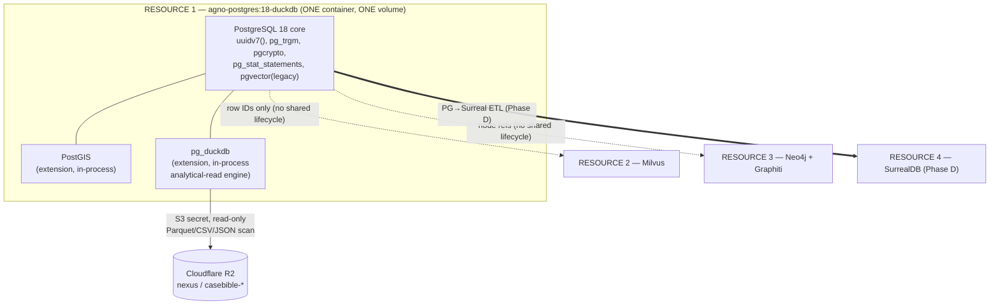
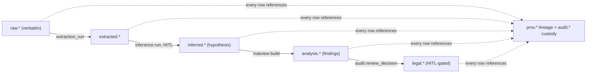

## PostgreSQL / DuckDB / PostGIS Schema Strategy

> _Byline: Claude Code · Opus 4.8 (1M) · 2026-06-30_
> Grounded in CONTEXT_PACK §1–§6, ADR-0013 (supersedes 0003), ADR-0027/0030/0032, the `salem_v3` ontology, the TraceIQ timeline schema, and the already-salvaged `extracted-code/MANIFEST.md` assets. On conflict, SSOT (`Agno-MCP-Platform/docs/PROJECT_CANON.md` + ADRs) wins.

### 0. The non-negotiable shape of this tier (read this first)

This entire section lives inside **ONE** of the platform's four independently-deployable persistence resources. The owner-mandated data-tier topology (CONTEXT_PACK §1, §6) is a **HARD CONSTRAINT**, restated here so nothing below contradicts it:

| # | Resource | What it contains | Lifecycle |
|---|---|---|---|
| **1** | **Relational / Analytical / Spatial** — *this section* | **PostgreSQL 18** + **PostGIS** + **embedded DuckDB via `pg_duckdb`**, all in a **single service/container** (image `agno-postgres:18-duckdb`) | One bind-mounted volume; starts/stops/rebuilds as a unit |
| 2 | Vector / ANN | **Milvus** (ADR-0027) | Separate resource, own volume |
| 3 | Graph cognition | **Neo4j community + Graphiti** (ADR-0014/0018/0031); Semantica is a writer into it | Separate resource, own volume |
| 4 | Analysis sink (Phase D, ratified) | **SurrealDB** (ADR-0024) | Separate resource, own volume |

**Therefore, in this tier:**

- **DuckDB is NOT a standalone deployable.** It is the `pg_duckdb` extension *loaded inside Postgres*. There is no separate DuckDB server, no separate DuckDB container, no separate volume. DuckDB is an in-process **analytical-read execution engine** for the same Postgres process. (This is the correct resolution of the ADR-0003-vs-ADR-0013 conflict: **pg_duckdb-embedded wins**; standalone DuckDB is *not* blessed. The local `casebible.duckdb` file on D: is a pre-existing personal cataloguing tool, not part of this server tier.)
- **PostGIS is NOT a standalone deployable.** It is an extension inside the *same* Postgres. All geometry/geography lives in Postgres tables.
- A crash or restart of Milvus / Neo4j / SurrealDB must never tear down this resource, and vice-versa. Cross-resource reach is by reference (IDs), never by shared lifecycle: `pg_duckdb` reaches **files/S3/relational** (ADR-0030/0032), native **Cypher** reaches Neo4j, the **Milvus SDK** reaches vectors, and a **PG→Surreal** pipeline feeds the analysis sink (ADR-0032).



### 1. Division of labor: PG vs embedded DuckDB vs PostGIS

The master prompt's stack list (MP 1427–1456) assigns *all* of canonical records, source metadata, message/item/event/timeline records, entity references, temporal assertions, location/GPS, provenance, extraction runs, confidence, chain-of-custody, review status, export status, and legal tagging to this one "Relational/Analytical Store." Below is the precise allocation of each concern to PG core, PostGIS, or the pg_duckdb engine.

| Concern | Lives in | Why |
|---|---|---|
| Canonical normalized records (people, messages, items, events, timeline, evidence) | **PG core tables** (row store, ACID, FKs, RLS) | Authoritative system-of-record; needs constraints, transactions, append-only triggers |
| Source / device / extraction-run metadata | **PG core tables** | Provenance must be transactional and FK-referenced by every derived row |
| Temporal assertions (valid-time / knowledge-time + **precision class**) | **PG core tables** (`tstzrange`, enum precision) | Bitemporal correctness; the precision class is missing from ALL prior schemas and is added here |
| Location data, GPS tracks, geocode results, home-base/anomaly geofences | **PostGIS** columns inside PG core tables (`geometry`/`geography`) | Spatial indexing (GiST/SP-GiST) + distance/containment operators |
| Confidence scoring, chain-of-custody (UUIDv7 + SHA-256), review status, export status, legal/evidentiary tags | **PG core tables** | Auditability, RLS gating, append-only history |
| Raw-export payloads (Google Takeout JSON, XML call-logs, message backups) | **PG `JSONB`** column `raw_data` **+** the original file in **R2** | Keep verbatim raw evidence; query shape without reshaping it (RAW EVIDENCE contract) |
| Heavy analytical reads, cross-corpus rollups, ad-hoc OLAP, reading large Parquet/CSV/JSON from R2 | **pg_duckdb engine** (in-process), reading PG tables and/or R2 objects | Vectorized columnar scans + direct S3 reach (ADR-0030/0032) without a second deployable |
| Vector embeddings (message bodies, evidence text, OCR) | **Milvus (Resource 2)** — *not here*; PG stores only the `milvus_pk` reference | ADR-0027: Milvus is the single platform-wide vector store; legacy pgvector stays resident only for migration |
| Entity/relationship cognition, contradiction/causal graph, bitemporal reasoning | **Neo4j+Graphiti (Resource 3)** — mirrored *from* PG | ADR-0014/0031: graph is the cognition substrate; PG holds the source-of-truth rows that are mirrored as nodes |

**Rule of thumb for developers:** *write* through PostgreSQL (ACID, triggers, RLS). *Read big* through `pg_duckdb` (`duckdb.query(...)` / `SET duckdb.force_execution`). *Search vectors* in Milvus by PK. *Reason over relationships* in Neo4j. Geometry never leaves PostGIS.

### 2. Schemas / namespaces

Use PostgreSQL **schemas** as the lane-discipline boundary demanded by the guardrails (raw evidence vs extracted vs inferred vs analytical vs legal-conclusion — CONTEXT_PACK §3, §6). Schemas, not table-name prefixes, so RLS, grants, and `search_path` can enforce the lanes mechanically.

| Schema | Lane | Contents | Mutability |
|---|---|---|---|
| `raw` | **Raw evidence** | Ingested artifacts verbatim: `source_file`, `raw_message`, `raw_export`, `screenshot`, device dumps, `raw_data` JSONB. Original bytes also in R2. | **Append-only**; never updated, never deleted |
| `core` | **Canonical normalized facts** | `person`, `message`, `item`, `event`, `timeline_event`, `evidence`, `location`, `gps_track`, `statement`, temporal assertions | Insert + controlled correction (new version row), append-only history table |
| `extracted` | **Extracted facts** (OCR, geocode, parse) | `ocr_text`, `geocode_resolution`, `geocode_audit`, `message_parsed`, `entity_mention` | Append-only, each tied to an `extraction_run` |
| `inferred` | **Inferred facts** (machine-derived, not observed) | `overnight_stay`, `home_base`, `anomaly`, `trip`, `cycle_phase_assignment`, model-tagged sentiment/intent | Append-only; **HITL** before promotion |
| `analysis` | **Analytical findings / work products** | materialized views, `forensic_evidence_package`, contradiction candidates, pattern hits (DARVO/MCL), rollups | Derived; rebuildable; provenance-stamped |
| `legal` | **Legal-conclusion lane** | `legal_tag`, `relevance_label`, `mcl_factor_link`, export bundles, court-facing drafts | **HITL-gated**, append-only, every row carries reviewer + decision |
| `prov` | **Provenance / lineage / runs** | `extraction_run`, `prompt_version`, `ontology_version`, `schema_version`, `tool_call`, `processing_run`, `artifact_lineage` | Append-only |
| `audit` | **Chain-of-custody & change log** | `custody_event`, `row_history` (per-table), `review_decision`, `access_log` | Append-only, write-once |
| `staging` | Ephemeral landing / dedup scratch | `normalized_messages` universal landing, schema-resolver output, import batches | Truncatable scratch (but never silently drop unarchived work — move to `audit.discarded_artifact` with a reason) |
| `ext` | Extensions home | `pg_duckdb`, `postgis`, `pg_trgm`, `pgcrypto`, `vector` objects | n/a |

`search_path` for application roles = `core, extracted, public`; the `raw`, `legal`, `audit`, `prov` schemas are reached only with explicit qualification and role grants. **RLS** is enabled on `legal`, `inferred`, and any table with an `is_private` / disclosure-tier column (the salvaged `messages.is_private` review gate, CONTEXT_PACK §3).

### 3. Table groupings (adopt/adapt from prior work — not a blank slate)

Citations below mark where each table is **ADOPTED** (kept as-is), **ADAPTED** (modified), or **NEW** (gap filled here). Source-of-truth rows in `core` are *mirrored* into Neo4j nodes (Resource 3) — the column contract is shared so the mirror is mechanical.

#### 3.1 Entity & statement group (`core`) — from `salem_v3`

| Table | Source | Notes |
|---|---|---|
| `core.person` | ADOPT `salem_v3.Person` + MERGE TraceIQ V4.1 `people` | Single person identity; `merge_of UUID[]` to track de-dupes; mirrored to Neo4j `Person` |
| `core.event` (`incident`) | ADOPT `salem_v3.Incident`/`Event` | Generic occurrence; PostGIS `location_id`; links to `timeline_event` |
| `core.statement` | ADOPT `salem_v3.Statement` | Who said what, when, where-recorded; impeachment value via `CONTRADICTS` edge in Neo4j |
| `core.evidence` | ADOPT `salem_v3.Evidence` (**central provenance anchor**) | Every extracted/inferred row FK-references an `evidence_id`; ties to `raw.source_file` + R2 key + SHA-256 |
| `core.location` | ADOPT `salem_v3.Location` | Holds PostGIS `geom`/`geog` (see §6); `location_key` dedup from TraceIQ |

Edges (`WAS_AT`, `PARTICIPATED_IN`, `MADE_STATEMENT`, `CONTRADICTS`, `EXPOSED_CHILD`, `AFFECTED_PARENTING_ACCESS`) live in **Neo4j**; PG keeps an optional `core.relationship_assertion` shadow table (typed, append-only) so relationship history is auditable in the relational lane too. Sensitive/hypothesis edges (`USED_TACTIC`, `EXPLOITED_VULNERABILITY`, `DISPARAGES`, `Vulnerability`, `Tactic`) are **PRESERVE-AS-HYPOTHESIS** → they land in `inferred`/`analysis` with `status='hypothesis'` and never auto-promote (CONTEXT_PACK §3, guardrails MP 2469).

#### 3.2 Message & communication group — TraceIQ V4.1 + salvaged parsers

| Table | Source | Notes |
|---|---|---|
| `raw.raw_export` | ADOPT (Google raw-export JSON contract, keep verbatim) | `raw_data JSONB`, `platform`, `source_file_id`, SHA-256 |
| `staging.normalized_messages` | ADOPT salvaged universal landing design | raw XML→`raw_data` JSON; platform-hop reconstruction; reconcile into typed `core.message` |
| `core.message` | ADAPT TraceIQ V4.1 `messages` | typed canonical message; `is_private`→RLS review gate; body text embedded in **Milvus** (store `milvus_pk` only) |
| `extracted.message_parsed` | NEW (wraps salvaged parsers) | output of enhanced-xml-chunker / sms_backup_parser (blocked-call type 5/6) / GVoice / iMessage-PDF / FB / chat-export; carries `parser_name`, `parser_version` |
| `raw.screenshot` | ADOPT TraceIQ `screenshots` | OCR result → `extracted.ocr_text` (extracted lane) |
| `core.social_action` | ADOPT TraceIQ `social_action` | typed social events |

#### 3.3 Timeline / movement group — TraceIQ B/C/D

| Table | Source | Notes |
|---|---|---|
| `raw.visit`, `raw.activity`, `raw.path`, `raw.trip` | ADOPT TraceIQ raw `visits/activities/paths/trips` | verbatim from Takeout; PostGIS geometry |
| `core.timeline_event` | ADAPT TraceIQ `timeline_enriched` | **SPLIT raw vs enriched**; TEXT timestamps → `timestamptz` + **precision class** (§7); FK to `evidence` |
| `extracted.geocode_resolution` | ADOPT TraceIQ (dual-provider) | `disagreement_flag`, `tie_break_reason`; PostGIS point |
| `extracted.geocode_audit` | ADOPT (append-only) | one row per provider call |
| `inferred.overnight_stay`, `inferred.home_base`, `inferred.anomaly` | ADOPT TraceIQ inferred lane | machine-derived, HITL before legal use |
| `core.location` ←`location_key` | ADOPT TraceIQ dedup | canonical place identity |

#### 3.4 Abuse-pattern / behavioral lane — salvaged TTL/py (CONTEXT_PACK §3)

These satisfy the **both-parties / full-relational-cycle** guardrail (MP 2431–2433). Do **not** invent new node types — adopt the salvaged ontologies.

| Table | Source | Notes |
|---|---|---|
| `analysis.pattern_definition` | ADOPT `behavioral_patterns.ttl`, `positive_behaviors.ttl`, `seed-patterns.ts (~303)`, `detection_patterns.py` (256-pattern, MCL A–L, 18 cat, DARVO) | versioned via `ontology_version`; **includes positive/neutral/love-bombing/repair** phases, not only negative |
| `inferred.pattern_hit` | NEW | a detected instance: `pattern_id`, `evidence_id`, `surface_tone`, `inferred_intent`, `relational_function`, `cycle_phase` (modeled **separately**, MP 2433), `confidence`, `status='hypothesis'` |
| `legal.mcl_factor_link` | ADOPT `mcl_722_23.ttl` (12 MCL factors) | links findings → statutory factor; **HITL-gated** |
| `analysis.cycle_phase_assignment` | NEW | per-interaction phase (positive/neutral/love-bombing/repair/conflict) for relationship-cycling analysis |

#### 3.5 Provenance, custody, doc-intelligence (`prov` / `audit`) — salvaged contract

| Table | Source | Notes |
|---|---|---|
| `prov.extraction_run`, `prov.processing_run` | ADOPT salvaged doc-intelligence | every derived row FK→a run |
| `prov.prompt_version`, `prov.ontology_version`, `prov.schema_version`, `prov.tool_call` | ADOPT/NEW (Constraints MP 2436/2452) | full artifact lineage; prompt/ontology/schema versions persisted |
| `prov.artifact_lineage` | NEW | edge table: `output_id → (source_evidence, run, prompt_ver, ontology_ver, schema_ver, review_decision)` |
| `audit.custody_event` | ADOPT UUIDv7 + SHA-256 chain-of-custody column contract | append-only, write-once |
| `extracted.doc_section`/`chunk`/`span`/`entity_mention`/`finding`/`audit.approval` | ADOPT salvaged doc-intelligence tables | section/chunk/span/entity/finding/**approvals** |

### 4. Partitioning strategy

| Table family | Partition scheme | Key | Rationale |
|---|---|---|---|
| `core.message`, `core.timeline_event`, `raw.visit/activity/path` | **RANGE** by event time | `occurred_at` (or `valid_from`) monthly/quarterly | Time-bounded forensic queries; cheap pruning; old partitions go read-only |
| `raw.raw_export`, `raw.screenshot` | **LIST** by `platform` then RANGE by ingest month | `platform`, `ingested_at` | Per-corpus retention + per-platform parser routing |
| `audit.*`, `prov.*` | **RANGE** by `created_at` (monthly) | — | append-only growth; ancient partitions archivable to R2 Parquet (read back via pg_duckdb) |
| `extracted.geocode_audit` | **RANGE** by month | `created_at` | high-volume append-only |
| `analysis.*` (matviews) | not partitioned | — | rebuildable derivations |

Use **native declarative partitioning** (PG18). Default partition catches stray rows for review (never silently drop). For very large, mostly-cold raw corpora, the recommended pattern is **hot rows in PG partitions, cold partitions detached and exported to R2 Parquet**, then transparently re-read through `pg_duckdb` (§8) — this keeps the single resource's volume bounded without a second deployable.

### 5. Indexing strategy

| Need | Index | Where |
|---|---|---|
| PK / FK joins | B-tree on `id` (UUIDv7 — time-ordered, index-friendly) and on every FK | all tables |
| Time-range scans | B-tree on `occurred_at`, `valid_from`; **BRIN** on append-only time-ordered partitions (`audit`, `geocode_audit`, `raw.*`) | per §4 |
| Fuzzy name/text match | **GIN `pg_trgm`** on `person.name`, message snippets, file names | `core`, `raw` |
| JSONB containment / path | **GIN (jsonb_path_ops)** on `raw_data`, plus targeted **expression B-tree** on hot extracted paths (e.g. `(raw_data->>'thread_id')`) | `raw`, `staging` |
| Full-text search | **GIN on `tsvector`** (generated column) | §7 — `core.message`, `extracted.ocr_text`, `core.statement` |
| Spatial | **GiST** (general geom/geog), **SP-GiST** for point-dense GPS, partial GiST for active geofences | §6 |
| Bitemporal range overlap | **GiST on `tstzrange`** valid-time / knowledge-time | temporal assertion tables |
| Confidence / status filters | partial B-tree (`WHERE status='hypothesis'`, `WHERE review_status='pending'`) | `inferred`, `legal` |
| Vectors | **none in PG** — vectors live in Milvus (ADR-0027); legacy pgvector HNSW remains only on the migration-resident column | n/a |

DuckDB does not need separate indexes — its analytical reads are vectorized full/columnar scans; for repeat heavy reads, materialize (see §9) rather than index.

### 6. PostGIS geometry / geography usage

PostGIS is in-process in this one resource (never standalone). Convention:

| Use | Type | SRID | Index |
|---|---|---|---|
| Canonical place point, geocode result, GPS fix | `geometry(Point, 4326)` for storage/joins | 4326 | GiST |
| Distance / "within N meters" / overnight-stay clustering / home-base | `geography(Point/Polygon, 4326)` (meters, true on-sphere) | 4326 | GiST |
| GPS tracks / paths / trips | `geometry(LineString, 4326)` (+ optional `M` for time-parameterized) | 4326 | GiST |
| Geofences (home_base, anomaly zones, "near child's school") | `geometry(Polygon, 4326)` | 4326 | partial GiST on active zones |

Patterns: dual-provider `geocode_resolution` stores both candidate points + a chosen `geom` with `disagreement_flag` (ADOPT TraceIQ); overnight-stay/home-base inference uses `ST_DWithin`(geography) + temporal clustering and writes to `inferred.*` (HITL). Store SRID 4326 canonically; project to a local UTM/equal-area SRID only inside analytical queries when planar area/length is required. `ST_MakeLine` over time-ordered fixes reconstructs `raw.path`. All spatial inference rows carry `confidence` + `precision class` and link to `evidence`.

### 7. JSONB, full-text search, and timestamp precision

**JSONB** — used for the *RAW EVIDENCE contract*: ingest payloads verbatim into `raw_data JSONB` (Google Takeout, XML call-logs with base64 images, message backups). Never reshape raw; normalize *forward* into typed `core` tables, keeping the JSONB as the immutable witness. `schema-resolver.ts` (AI field-mapping for unknown formats) reads JSONB and proposes a mapping into `staging.normalized_messages` → `core.message`. GIN-index for containment; promote hot paths to generated columns only when query-proven.

**Full-text search (FTS)** — Postgres native `tsvector` for *evidentiary keyword search inside this resource* (semantic/vector search is Milvus's job, ADR-0027; the two are complementary). Pattern: a **generated `tsvector` column** (`to_tsvector('english', coalesce(body,'')||' '||coalesce(ocr_text,''))`) + GIN index on `core.message`, `extracted.ocr_text`, `core.statement`. Use `websearch_to_tsquery` for analyst queries; rank with `ts_rank_cd`. FTS hits feed the contradiction/impeachment workflow; they never auto-label.

**Timestamp precision class (NEW — the gap in ALL prior schemas, CONTEXT_PACK §3, Constraints MP 2421).** Every temporal column is paired with a precision enum so exact/approximate/inferred/uncertain are never conflated:

```sql
CREATE TYPE core.ts_precision AS ENUM
  ('exact','approximate','inferred','uncertain','unknown');
-- e.g. core.timeline_event
--   occurred_at      timestamptz,
--   occurred_at_prec core.ts_precision NOT NULL DEFAULT 'unknown',
--   occurred_tz      text,         -- original-source timezone, preserved
--   valid_time       tstzrange,    -- bitemporal valid-time
--   knowledge_time   tstzrange     -- when we learned/asserted it
```

This mirrors the Neo4j+Graphiti bitemporal model (valid-time + knowledge-time, ADR-0014/0031) so PG and the graph agree on time semantics.

### 8. Analytical-read strategy using embedded DuckDB (`pg_duckdb`)

DuckDB here is **the read engine, not a store** (CONTEXT_PACK §1; ADR-0013/0030/0032). It runs **inside** the Postgres process. Three read paths:

1. **Heavy reads over PG tables** — vectorized OLAP (cross-corpus rollups, timeline aggregations, confidence histograms) via `SET duckdb.force_execution = on` or `duckdb.query($$ ... $$)`. Faster than the PG row executor for scan-heavy analytics; same data, same transaction-visible rows.
2. **Direct R2/S3 reads** — `pg_duckdb` uses the account-wide S3 secret (ADR-0030) to scan Parquet/CSV/JSON in R2 (`nexus`, `casebible-*`) **without** moving data into PG and **without** a second deployable. This is how detached/cold partitions exported to R2 (§4) are re-read transparently, and how the `casebible` corpus is queried in place.
3. **File-federation reach** — per ADR-0032, federation = `pg_duckdb` (files/S3/relational) + native Cypher (Neo4j) + Milvus SDK (vectors). No Multicorn2/neo4j-fdw. So "join a PG timeline against a Parquet export in R2" is a single `pg_duckdb` query; "join against the graph or vectors" is done in the application layer by ID, respecting the no-shared-lifecycle rule.

**Guardrail:** R2/S3 reads via pg_duckdb are reads only; any *transfer* (rclone copy/move/sync) stays approval-gated + dry-run (CONTEXT_PACK §4, global cost rule). Raw forensic/abuse evidence is **never** routed to external LLM-extracting tools — pg_duckdb reads stay inside this resource.

### 9. Materialized views (`analysis` schema)

Materialized views are the **analytical-finding lane** — derived, rebuildable, provenance-stamped, and clearly *not* canonical evidence (Constraints MP 2437).

| Matview | Source | Purpose |
|---|---|---|
| `analysis.mv_forensic_evidence_package` | ADOPT TraceIQ `vw_forensic_evidence_package` | per-event bundle with **HIGH/MED/LOW confidence tiers**; **HITL** before export |
| `analysis.mv_timeline_master` | join `core.timeline_event` + `extracted.geocode_resolution` + `evidence` | unified court-review timeline with precision class shown |
| `analysis.mv_message_thread` | `core.message` + `extracted.message_parsed` | reconstructed threads incl. platform-hops |
| `analysis.mv_pattern_rollup` | `inferred.pattern_hit` + `analysis.pattern_definition` | per-person, per-cycle-phase counts (**both parties**, positive+negative) |
| `analysis.mv_contradiction_candidates` | FTS + statement overlap | impeachment leads (hypothesis status; HITL) |
| `analysis.mv_movement_summary` | PostGIS over `raw.path`/`inferred.overnight_stay` | place-time summary |

Refresh `CONCURRENTLY` on a schedule or post-ingest trigger; each matview row carries `built_from_run_id`, `ontology_version`, `schema_version`, `refreshed_at` so a finding traces back to source. For very large rebuilds, the refresh query can run through `pg_duckdb` (§8). Matviews are **never** treated as evidence; promotion of any matview row into `legal` requires a `audit.review_decision`.

### 10. Audit & versioning strategy

This is the spine of court-safe auditability (Constraints MP 2422–2424, 2434–2438, 2470). Everything is **append-only** or **versioned**; nothing is overwritten or hard-deleted (HARD RULE: never delete → move to `_stale`/`audit.discarded_artifact` with a reason).

| Mechanism | Implementation |
|---|---|
| **Chain of custody** | `audit.custody_event` (append-only): `evidence_id`, `actor`, `action` (ingest/hash/access/export), `sha256`, `prev_hash`, `created_at` — SHA-256 hash chain over UUIDv7 rows (ADOPT salvaged contract) |
| **Row history** | per-table `audit.row_history_*` written by `AFTER INSERT/UPDATE/DELETE` triggers; stores full prior row as JSONB + `op`, `txid`, `changed_by`, `changed_at`. **Corrections create a new version row; the prior interpretation is preserved** (guardrail MP 2470) |
| **Bitemporal versioning** | `valid_time` + `knowledge_time` ranges on assertion tables; supersede by closing `knowledge_time` and inserting the new assertion — never UPDATE-in-place |
| **Soft-delete only** | `deleted_at` + `deleted_reason`; views filter it out; data stays for audit |
| **Artifact lineage** | `prov.artifact_lineage` ties every output → source evidence, run, prompt version, ontology version, schema version, review decision (Constraints MP 2436/2452) |
| **Review / HITL gating** | `audit.review_decision` + `audit.approval`: required before any `inferred`→`legal` promotion, any sensitive label (gaslighting/coercive-control/alienation/weaponization/reactive-abuse), any legal-relevance label, any court-facing export. Enforced by RLS + a `legal.*` BEFORE-INSERT trigger that demands a matching approval row |
| **Schema/ontology/prompt versioning** | `prov.schema_version` (DDL migrations recorded), `prov.ontology_version` (the salvaged TTL/py ontologies are versioned, not edited in place), `prov.prompt_version` (every model prompt persisted) |
| **Intermediate work persisted** | scans, drafts, indexes, classifications, tool-call outputs persist in `staging`/`prov.tool_call`; discarding requires an `audit.discarded_artifact` row with a reason (Constraints MP 2435/2451) |
| **RLS / disclosure tiers** | `is_private` / disclosure-tier columns gate `core.message`, `inferred`, `legal`; mirrors the Neo4j disclosure-tier multi-pass (ADR-0031) |



### 11. Build notes, citations, and flags

- **ADR alignment:** image `agno-postgres:18-duckdb` already ships `uuidv7()`, `pg_duckdb`, PostGIS, pg_trgm, pgcrypto, pg_stat_statements (ADR-0013, LIVE). No new extension deployable is introduced. Vectors → Milvus (0027), graph → Neo4j/Graphiti (0014/0031), S3 reach → pg_duckdb account secret (0030), federation per 0032.
- **Adopted prior work:** `salem_v3` (entities/edges), TraceIQ (timeline/movement/geocode/messages/screenshots/social_action/`vw_forensic_evidence_package`), salvaged TTL/py ontologies (`positive_behaviors`, `behavioral_patterns`, `mcl_722_23`, `detection_patterns.py`, `seed-patterns.ts`), salvaged parsers, `normalized_messages` landing, doc-intelligence tables, UUIDv7+SHA-256 custody contract — all per `extracted-code/MANIFEST.md` (prefer over `Archives/**`).
- **NEW (gaps filled here):** the `core.ts_precision` timestamp-precision class (missing from ALL prior schemas), the schema-as-lane partitioning, `prov.artifact_lineage`, `inferred.pattern_hit` with separated surface-tone/intent/relational-function/cycle-phase, cold-partition→R2-Parquet→pg_duckdb re-read pattern.

**Needs-human-review / gaps:** Reconcile the salvaged universal `normalized_messages` raw-JSON landing design against TraceIQ's *typed* `messages`. This section routes raw→`staging.normalized_messages`→typed `core.message`, but the exact field-merge rules (especially blocked-call type 5/6 and platform-hop reconstruction) need a human pass against the live R5 data model (the richest, but stored as two byte-identical copies — dedupe first) before locking the message DDL.
