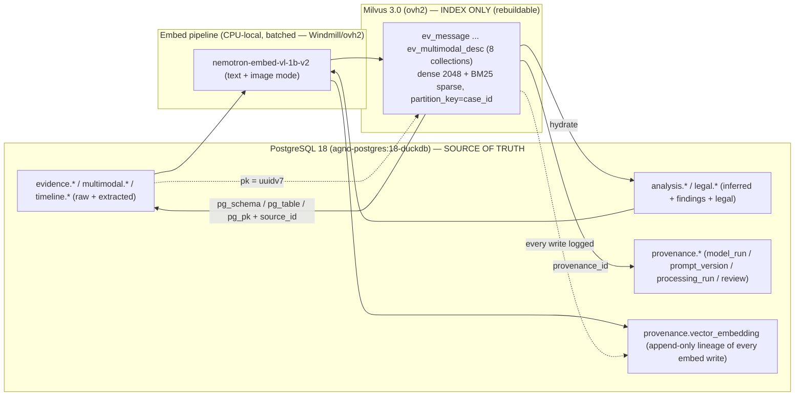

## Milvus Vector Schema (Collections)

> _Byline: Claude Code · Opus 4.8 (1M) · 2026-06-30_
> Scope: the semantic-retrieval (ANN) layer of the forensic-evidence DB. Milvus is the **index, not the source of truth** — raw bytes and canonical rows live in **PostgreSQL** (`agno-postgres:18-duckdb`, ADR-0013) and **Cloudflare R2** (ADR-0007). Every Milvus entity points back to a canonical PG row via a stable join key. This honors ADR-0010's surviving shape rule ("raw docs = truth; one embedding space per embedder"), whose *storage location* moved from pgvector to Milvus per ADR-0027.

### 0. Plain-language summary (for the non-developer)

Milvus is the system's **"search by meaning" engine**. PostgreSQL holds the authoritative, court-quality records; Milvus holds compact mathematical fingerprints ("embeddings") of the *text and pictures* in those records so you can ask questions like *"find every apology message in March"* or *"show photos of that backyard"* and get ranked hits — even when the exact words differ. Three rules make it safe for evidence work:

1. **Milvus never decides truth.** It returns pointers; the real record is always re-fetched from PostgreSQL. If Milvus were deleted tomorrow, it could be fully rebuilt from PostgreSQL.
2. **Nothing is overwritten.** A re-analysis adds a *new* fingerprint and marks the old one `superseded` (kept for audit) — prior interpretations are preserved (Constraints; ADR-0010/0014).
3. **Sensitive labels are gated.** A search by a court-facing user only sees rows a human has approved; abuse-pattern and legal-relevance labels stay hidden until reviewed (HITL).

---

### 1. Design basis — what is locked vs. what this section decides

| Locked input | Source | How it constrains this schema |
|---|---|---|
| Milvus = single platform-wide vector store; **one embedding space per collection**; **hybrid dense + sparse/BM25** | ADR-0026 / ADR-0027 | Every forensic *text* collection uses the **same** dense space (the 2048-d text embedder) so vectors are mutually comparable; a 2048-d and a 4096-d vector never share one collection. |
| **NIM dimension contract** (ADR-0011): text **2048-d** (`nemotron-embed-vl-1b-v2`), code **4096-d** (`nv-embedcode-7b`), CaseBible/code **1536-d** (OpenRouter `codestral-embed-2505`) | ADR-0011 / ADR-0026 | Dimensions are a hard contract — parameterized below as `D_TEXT=2048`, `D_IMG=2048`, `D_CODE=4096`, `D_CB=1536`. A re-dim is a **breaking change** → new ADR + full re-embed, never a silent config tweak. |
| **CPU-only / cloud-primary** (no GPU; local models ≤ 4B; **evidence content stays local**) | ADR-0015 / Hardware memory | Forces the embedder choice in §2: the **1B** text/VL model is small enough to run **locally on CPU** for sensitive evidence; cloud NIM/OpenRouter is reserved for non-sensitive corpora. |
| Index = pointers; **raw docs = truth, in PG** | ADR-0010 | Every Milvus entity carries a PG foreign-key triple (`pg_schema`,`pg_table`,`pg_pk`) + `source_id` (custody anchor). Milvus stores only what filtering/snippet/re-rank needs. |
| Bitemporal, disclosure-tier, multi-pass cognition | ADR-0014/0018/0031 (Neo4j+Graphiti) | `disclosure_tier` is a first-class filterable scalar on every collection; Milvus is **not** the temporal authority (Neo4j/Graphiti + SurrealDB are). |
| Cross-cutting guardrails | Context Pack §6 / MP Constraints | `assertion_type`, `confidence`, `timestamp_certainty`, `review_status`, append-only re-embeds, full relational cycle (not only negatives), HITL before sensitive labels surface, both-parties modeling. |
| Canonical PG tables to link to | Section 03 (Canonical Data Model) | Linkage targets below use the **real** canonical names (`evidence.message`, `multimodal.image`, `analysis.finding`, `legal.legal_issue`, `provenance.work_artifact`, …) — not invented ones. |

**Net rule for this layer:** collections are split by **content type** (for lifecycle, partitioning, retrieval scoping, and HITL policy), but every text collection shares the **same 2048-d dense space**, so the platform's "one embedding space per collection" invariant holds — no collection ever holds two incompatible vector geometries. Cross-modal image vectors reuse the same 2048-d VL space so a *text* query can retrieve *images*. (See §9 reconciliation — flagged for owner sign-off.)

---

### 2. Embedder & the CPU-only / "evidence-stays-local" resolution (ADR-0011 + ADR-0015)

There is a genuine tension between *"NIM = embed/rerank"* (cloud, ADR-0011/0026) and *"evidence content stays local"* (ADR-0015). Resolution adopted here:

| Corpus | Embedder | Dim | Where it runs | Rationale |
|---|---|---|---|---|
| **Forensic evidence text** (messages, OCR, transcripts, event/claim summaries, findings, legal issues, captions) | `nemotron-embed-vl-1b-v2` (**text mode**) | `D_TEXT=2048` | **LOCAL CPU** (1B ≤ 4B cap) | Keeps raw/derived evidence text **off cloud** → satisfies ADR-0015 "stays local" AND the ≤4B CPU limit. Throughput is low → batch/async ingest (§8). |
| **Forensic images** (cross-modal) | `nemotron-embed-vl-1b-v2` (**vision mode**) | `D_IMG=2048` (assumed = `D_TEXT`) | LOCAL CPU | Same VL model maps image pixels into the **same 2048-d space** → text↔image cross-modal retrieval with no second space. |
| Non-sensitive CaseBible / knowledge corpora | OpenRouter `codestral-embed-2505` | `D_CB=1536` | Cloud | Not case-private; cloud is fine. **Symmetric** model (per global rule — avoid NIM asymmetric `input_type`→400s). Out of forensic scope; listed for completeness. |
| Platform code search | `nv-embedcode-7b` | `D_CODE=4096` | Cloud NIM | Out of forensic scope; separate collection, never mixed with evidence. |

> **NEEDS HUMAN REVIEW — BLOCKING.** Confirm whether `nemotron-embed-vl-1b-v2` is actually served **locally on CPU** vs. **only via cloud NIM**. If cloud-only is the sole path, sensitive evidence text MUST instead use a locally hosted symmetric model (e.g., `bge-m3`, 1024-d) and `D_TEXT` re-pinned accordingly — an **ADR-0011 amendment**, not a config change. **Do not ship raw evidence text to a cloud embedder without explicit owner approval** (Context Pack §4: "never feed raw forensic/abuse evidence to external/cloud LLM-extracting tools").

---

### 3. Common entity envelope (every collection inherits this)

All eight collections share one field contract so retrieval, filtering, provenance, and HITL gating behave identically. Type names are Milvus 3.0 field types. **Lean-payload rule:** anything not used for *filtering, snippet display, or re-rank* stays in PG and is fetched on hydrate.

| Field | Milvus type | Role | Notes / lane discipline |
|---|---|---|---|
| `pk` | `VARCHAR` (PK, ≤ 64) | Primary key | The **UUIDv7** of the canonical PG row (ADR-0013 `uuidv7()`), 1:1 with PG. No Milvus auto-id → stable cross-store join. For chunked rows, `pk = "{parent_uuid}:{chunk_seq}"`. |
| `dense` | `FLOAT_VECTOR(D_TEXT)` / `(D_IMG)` | Dense ANN | HNSW, metric `COSINE` (§8). |
| `sparse` | `SPARSE_FLOAT_VECTOR` | Lexical ANN | Produced by a Milvus **BM25 `Function`** over `text` (§8) — no external sparse encoder, CPU-friendly. |
| `text` | `VARCHAR` (≤ 65535, `enable_analyzer=True`) | BM25 input + snippet | The chunk/derived text. Stored for highlight & re-rank; full record stays in PG. |
| `case_id` | `VARCHAR` | **Partition key** | Generalized from the salem_v3 "Salem v. Kinzel" caption → case-scoped (Context Pack §3; §03 note). |
| `disclosure_tier` | `INT8` | Multi-pass filter | Bitemporal disclosure tier (ADR-0018/0031). |
| `assertion_type` | `INT8` (enum) | **Evidence-class guard** | `0 raw_evidence · 1 extracted_fact · 2 inferred_fact · 3 analytical_finding · 4 legal_conclusion` (mirrors PG `assertion_type` enum, §03). |
| `confidence` | `FLOAT` | Ranking / gate | 0–1, re-derived transparently; **never** a hard-coded 0.6 (crosswalk). |
| `timestamp_certainty` | `INT8` (enum) | **Time-trust guard** | `0 exact · 1 approximate · 2 inferred · 3 uncertain` (the precision class missing from ALL prior schemas — Context Pack §3). |
| `event_time_utc` | `INT64` | Valid-time range filter | Epoch ms; `-1` sentinel for non-temporal rows. Full `_raw`+`tz_offset`+precision triple held in PG. |
| `ingested_at_utc` | `INT64` | Knowledge-time | When this vector was written (bitemporal "knowledge time"). |
| `source_id` | `VARCHAR` | Provenance | UUIDv7 of the originating `custody.source` (SHA-256 + UUIDv7 chain, §03 §1.1). |
| `pg_schema` / `pg_table` / `pg_pk` | `VARCHAR` ×3 | **PG linkage triple** | Exact canonical row to re-hydrate. |
| `provenance_id` | `VARCHAR` | Provenance join | → `provenance.provenance` (run/parser/model/prompt/review bundle, §03 §9). |
| `embedding_model` / `embedding_dim` / `embedding_version` | `VARCHAR` / `INT16` / `VARCHAR` | Lineage | Re-embed = new vector + version bump (append-only, §6). |
| `prompt_version` / `ontology_version` / `schema_version` / `run_id` | `VARCHAR` ×4 | Artifact lineage | Trace any derived vector back to the run/prompt/ontology/schema that made it (Constraints). |
| `review_status` | `INT8` (enum) | **HITL gate** | `0 pending · 1 approved · 2 rejected · 3 needs_review`. Court-facing retrieval forces `review_status==1`. |
| `is_sensitive` | `BOOL` | HITL / in-camera | From `is_sensitive` / `requires_in_camera_review` (crosswalk). |
| `is_hypothesis` | `BOOL` | Hypothesis guard | Model-generated interpretation flag — never auto-promoted to fact (Constraints; salem_v3 Preserve-as-Hypothesis edges). |
| `subject_party` | `INT8` (enum) | Both-parties guard | `0 unknown · 1 user · 2 counterparty · 3 child · 4 third_party` — supports modeling the **user's own conduct/reactions**, not only the counterparty's (Constraints; A3 ontology gap). |
| `superseded` | `BOOL` | Soft-delete | Append-only correction: old vector flagged, never overwritten (§6). |

> **Reference field schema (pymilvus 3.x) — the shared envelope.** Per-collection extra scalars (§4) are appended to this base.

```python
from pymilvus import FieldSchema, CollectionSchema, DataType, Function, FunctionType

D_TEXT = 2048  # ADR-0011 text contract — re-pin only via ADR amendment

base_fields = [
    FieldSchema("pk", DataType.VARCHAR, is_primary=True, max_length=64),
    FieldSchema("dense", DataType.FLOAT_VECTOR, dim=D_TEXT),
    FieldSchema("sparse", DataType.SPARSE_FLOAT_VECTOR),                 # filled by BM25 Function
    FieldSchema("text", DataType.VARCHAR, max_length=65535, enable_analyzer=True),
    FieldSchema("case_id", DataType.VARCHAR, max_length=64, is_partition_key=True),
    FieldSchema("disclosure_tier", DataType.INT8),
    FieldSchema("assertion_type", DataType.INT8),
    FieldSchema("confidence", DataType.FLOAT),
    FieldSchema("timestamp_certainty", DataType.INT8),
    FieldSchema("event_time_utc", DataType.INT64),
    FieldSchema("ingested_at_utc", DataType.INT64),
    FieldSchema("source_id", DataType.VARCHAR, max_length=64),
    FieldSchema("pg_schema", DataType.VARCHAR, max_length=32),
    FieldSchema("pg_table", DataType.VARCHAR, max_length=64),
    FieldSchema("pg_pk", DataType.VARCHAR, max_length=64),
    FieldSchema("provenance_id", DataType.VARCHAR, max_length=64),
    FieldSchema("embedding_model", DataType.VARCHAR, max_length=64),
    FieldSchema("embedding_dim", DataType.INT16),
    FieldSchema("embedding_version", DataType.VARCHAR, max_length=24),
    FieldSchema("prompt_version", DataType.VARCHAR, max_length=24),
    FieldSchema("ontology_version", DataType.VARCHAR, max_length=24),
    FieldSchema("schema_version", DataType.VARCHAR, max_length=24),
    FieldSchema("run_id", DataType.VARCHAR, max_length=64),
    FieldSchema("review_status", DataType.INT8),
    FieldSchema("is_sensitive", DataType.BOOL),
    FieldSchema("is_hypothesis", DataType.BOOL),
    FieldSchema("subject_party", DataType.INT8),
    FieldSchema("superseded", DataType.BOOL),
]

bm25 = Function(name="bm25_text_to_sparse", function_type=FunctionType.BM25,
                input_field_names=["text"], output_field_names=["sparse"])
```

---

### 4. The eight collections

All names are case-agnostic (`partition_key=case_id`) and use the text/VL 2048-d space unless noted. The **PG source table** column gives the authoritative `pg_table` for the linkage triple, reconciled to the §03 canonical model.

#### 4.1 `ev_message` — Messages
| Attr | Value |
|---|---|
| **Purpose** | Semantic + lexical search over chat / SMS / DM / call-note message bodies across platforms (FB, Snapchat, SMS, iMessage, GVoice, etc.). |
| **Embedding target** | Message body text (one entity per message; long messages chunked → `chunk_seq`, `parent_pk`). `D_TEXT`. |
| **PG linkage** | `evidence.message` (PK `message_id`; adopted from TraceIQ V4.1 `messages`). `pg_schema='evidence'`, `pg_table='message'`. OCR-derived bodies set `assertion_type=extracted_fact`. |
| **Extra scalars** | `platform`, `direction` (`in/out`), `sender_identity_id`, `thread_id`, `device_id` (multi-device attribution), `linked_location_event_id`, `tone_surface`, `inferred_intent`, `relational_function`, `cycle_phase` (full-cycle: positive / neutral / love-bombing / repair / conflict — **NOT only negatives**). |
| **Partitioning** | Partition key `case_id`; logical sub-scope by `thread_id` via filter. |
| **Hybrid search** | dense(`D_TEXT`) + BM25 sparse(`text`); RRF fuse. Filters: `platform`, `direction`, `event_time_utc` range, `cycle_phase`, `subject_party`. |
| **Use cases** | "find apology/repair messages in window X"; impeachment-context retrieval (pair with graph `CONTRADICTS`); contrast affectionate vs hostile phases over time; locate selectively-quoted lines for re-contextualization (Constraints: weaponization-without-context). |

#### 4.2 `ev_ai_transcript` — AI chat transcript chunks
| Attr | Value |
|---|---|
| **Purpose** | Search prior **AI-analysis sessions / chat transcripts** (intermediate work products) so work resumes across sessions and prior interpretations stay recoverable (Constraints: persist intermediate work; resumable memory layer). |
| **Embedding target** | Transcript **chunks** (token-windowed; `chunk_seq`, `parent_pk` = session id). `D_TEXT`. |
| **PG linkage** | `provenance.work_artifact` (`artifact_kind='ai_transcript'`; §03 §9) joined to `provenance.processing_run` / `provenance.model_run`. `pg_schema='provenance'`, `pg_table='work_artifact'`. **Kept strictly separate from canonical evidence facts.** |
| **Extra scalars** | `model_name`, `prompt_version`, `tool_call_ref`, `session_id`. `is_hypothesis=true` by default (model output). |
| **Partitioning** | Partition key `case_id`; filter by `session_id`. |
| **Hybrid search** | dense + sparse; default filter `assertion_type IN (inferred_fact, analytical_finding)`; results surface with a "model-generated, unverified" badge. |
| **Use cases** | Cross-session memory recall; "did we already analyze this?"; lineage — trace a finding back to the transcript+prompt that produced it; avoid re-deriving. **Never promoted to fact without HITL.** |

#### 4.3 `ev_ocr_text` — OCR text
| Attr | Value |
|---|---|
| **Purpose** | Search text **extracted from screenshots/images** (OCR = *extracted fact*, not raw pixels). |
| **Embedding target** | OCR text span(s) per image region. `D_TEXT`. |
| **PG linkage** | `multimodal.image` (`ocr_text`, `ocr_confidence`) + `multimodal.image_entity` (OCR→source-span link; §03 §7). `pg_schema='multimodal'`, `pg_table='image'`; span via `region_ref` → `image_entity.source_span`. |
| **Extra scalars** | `region_ref`, `ocr_engine`, `ocr_confidence`, `perceptual_hash` (near-dupe screenshots), `linked_message_id`. |
| **Partitioning** | Partition key `case_id`. |
| **Hybrid search** | dense + sparse (**BM25 strong here** — OCR carries names/handles/dates/phone numbers). Filters: `ocr_confidence`, `is_sensitive`. |
| **Use cases** | Find a screenshot by its visible text; corroborate a message with its screenshot; flag low-OCR-confidence rows for human re-read. `assertion_type=extracted_fact`; `timestamp_certainty` usually `approximate`/`inferred` (screenshot capture ≠ original send time). |

#### 4.4 `ev_event_summary` — Event summaries
| Attr | Value |
|---|---|
| **Purpose** | Search the **timeline event spine** by natural-language summary of what happened. |
| **Embedding target** | The human/model summary string of a timeline event. `D_TEXT`. |
| **PG linkage** | `timeline.event` (adapted from TraceIQ `timeline_enriched`; keeps `start_utc`+`_raw`+`tz_offset`+precision; §03 §6). `pg_schema='timeline'`, `pg_table='event'`. |
| **Extra scalars** | `event_type`, `device_id`, `location_id` (→ `geo.location`), `summary_author` (human vs model), `is_inferred`, `multi_device_split`. |
| **Partitioning** | Partition key `case_id`; heavy `event_time_utc` range use. |
| **Hybrid search** | dense + sparse; nearly always combined with a time-range and `event_type` filter. |
| **Use cases** | "what happened around &lt;date&gt; near &lt;place&gt;"; build chronology drafts; anchor messages/images/claims to events. Distinguish exact vs inferred event times via `timestamp_certainty`. |

#### 4.5 `ev_claim` — Claims
| Attr | Value |
|---|---|
| **Purpose** | Search **claimed-vs-observed** assertions (a party's stated claim about where/when/what). |
| **Embedding target** | The claim text (claimed side) and, separately, the observed side — paired via `pair_id`. `D_TEXT`. |
| **PG linkage** | `analysis.claim_verification` (adapted from TraceIQ `expected_schedule`, paired `claimed_*`/`observed_*`; §03 §8). `pg_schema='analysis'`, `pg_table='claim_verification'`. |
| **Extra scalars** | `pair_id`, `claim_side` (`claimed`/`observed`), `claimant_identity_id`, `is_anomaly` (analytical finding, **gated**), `tolerance_ref`, `subject_party`. |
| **Partitioning** | Partition key `case_id`. |
| **Hybrid search** | dense + sparse; filters `claim_side`, `is_anomaly`. |
| **Use cases** | "find claims contradicted by location data"; surface **both sides** for fair presentation (raw claim vs observed); feed graph `CONTRADICTS` with evidence-linked support. Anomaly label never shown court-facing until `review_status==approved` (explanation ≠ proven causation). |

#### 4.6 `ev_pattern_finding` — Pattern findings
| Attr | Value |
|---|---|
| **Purpose** | Search **behavioral-pattern findings** (the ~303-pattern library + the positive-behavior taxonomy), including sensitive abuse-pattern labels. |
| **Embedding target** | Finding description + matched-pattern rationale. `D_TEXT`. |
| **PG linkage** | `analysis.finding` (+ `analysis.finding_version` for append-only history; §03 §8). Seeded from `seed-patterns.ts` (~303), `behavioral_patterns.ttl`, `detection_patterns.py` (256-pattern, MCL A–L, DARVO) **and `positive_behaviors.ttl`** (full-cycle, both parties — Context Pack §3). `pg_schema='analysis'`, `pg_table='finding'`. |
| **Extra scalars** | `pattern_id`, `pattern_polarity` (`negative`/`neutral`/`positive`/`love_bombing`/`repair`), `subject_party` (models the **user's own conduct** too), `cycle_phase`, `sensitive_label` (e.g., `coercive_control` — VARCHAR, **NULL until approved**), `evidence_cite_count` (≥ 1 required). |
| **Partitioning** | Partition key `case_id`. |
| **Hybrid search** | dense + sparse; **court-facing profile forces `review_status==1 AND sensitive_label IS NOT NULL`**; analyst profile additionally shows `pending`/`needs_review`. |
| **Use cases** | Pattern recall across the corpus; **cycle-contrast** analysis (positive vs negative phases); impeachment prep. **HARD HITL:** gaslighting / coercive-control / alienation / weaponization / reactive-abuse labels never reach court-facing output until human-approved (Constraints; Context Pack §6). |

#### 4.7 `ev_legal_issue` — Legal issue summaries
| Attr | Value |
|---|---|
| **Purpose** | Search **legal-issue / best-interest-factor summaries** (e.g., MCL 722.23 factors A–L) and map evidence to issues. |
| **Embedding target** | Issue/factor summary text. `D_TEXT`. |
| **PG linkage** | `legal.legal_issue` (+ `legal.evidence_relevance` for evidence↔issue mapping; §03 §legal). Seeded from `mcl_722_23.ttl` (12 factors). `pg_schema='legal'`, `pg_table='legal_issue'`. |
| **Extra scalars** | `factor_code` (A–L / statute ref), `issue_type`, `legal_relevance_label` (**HITL-gated**), `is_legal_conclusion` (BOOL → `assertion_type=legal_conclusion`). |
| **Partitioning** | Partition key `case_id`. |
| **Hybrid search** | dense + sparse; filter `factor_code`. |
| **Use cases** | "which evidence supports factor C (child's home/school/community record)?"; assemble factor-mapped packages; keep legal-relevance labels as HITL items, never auto-asserted. These are **organizational** summaries, **not legal advice** (Constraints). |

#### 4.8 `ev_multimodal_desc` — Multimodal descriptions
| Attr | Value |
|---|---|
| **Purpose** | Search **natural-language descriptions of non-text media** (image / video-frame / audio captions) AND **cross-modal image retrieval** (text query → image hit). |
| **Embedding target** | Up to **two vectors per item**: (a) the caption/description text → `D_TEXT` (in this collection); (b) the media itself via VL/image mode → `D_IMG` (same 2048-d space). See note below on the two-vector layout. |
| **PG linkage** | `multimodal.scene_description` (model descriptions, `assertion_type='analytical_finding'`) + `multimodal.media`/`image` (raw). `pg_schema='multimodal'`, `pg_table='scene_description'`. The image vector also references `multimodal.media.media_id` via `media_id`. |
| **Extra scalars** | `media_type` (`image`/`screenshot`/`video_frame`/`audio_caption`), `caption_author` (human/model), `media_id`, `frame_ts`, `is_sensitive`, `region_ref`. |
| **Partitioning** | Partition key `case_id`; optional second partition by `media_type` if volume is skewed. |
| **Hybrid search** | dense(text) + BM25 sparse(caption); **dense(image) cross-modal** as a separate request fused by RRF when both are wanted. |
| **Use cases** | "find photos of &lt;scene/object&gt;"; caption-based recall; corroborate event summaries with media. `caption_author=model` ⇒ `assertion_type=inferred_fact`/`analytical_finding`, never asserted as raw (HITL for scene descriptions, §03 §7). |

> **Cross-modal layout decision (needs sign-off, §9):** because Milvus 3.x supports **multiple vector fields per collection**, the cleanest implementation is a single `ev_multimodal_desc` with two `FLOAT_VECTOR` fields — `dense` (caption text, `D_TEXT`) and `dense_img` (image pixels, `D_IMG`) — both `COSINE`, both 2048-d. A text query can search either field; a `hybrid_search` can fuse caption-text + image hits. Alternative (a separate `ev_image` collection) is also viable if image volume dwarfs captions. Default = single collection, two vector fields.

#### Collection summary

| Collection | PG source (`pg_schema.pg_table`) | Dense dim | Primary `assertion_type` | HITL criticality |
|---|---|---|---|---|
| `ev_message` | `evidence.message` | `D_TEXT` 2048 | raw_evidence | in-camera flag |
| `ev_ai_transcript` | `provenance.work_artifact` | `D_TEXT` 2048 | inferred / analytical | **always (model output)** |
| `ev_ocr_text` | `multimodal.image` | `D_TEXT` 2048 | extracted_fact | sensitive flag |
| `ev_event_summary` | `timeline.event` | `D_TEXT` 2048 | raw / extracted | low |
| `ev_claim` | `analysis.claim_verification` | `D_TEXT` 2048 | extracted + analytical | anomaly label |
| `ev_pattern_finding` | `analysis.finding` | `D_TEXT` 2048 | analytical_finding | **HARD (sensitive labels)** |
| `ev_legal_issue` | `legal.legal_issue` | `D_TEXT` 2048 | legal_conclusion | relevance label |
| `ev_multimodal_desc` | `multimodal.scene_description` | `D_TEXT` + `D_IMG` 2048 | inferred (caption) | sensitive media |

---

### 5. PostgreSQL ↔ Milvus linkage



- **Join key:** Milvus `pk` == PG row `uuidv7` (ADR-0013). Retrieval returns `pk` + scalars + snippet; the app **re-hydrates the authoritative record** from PG via `pg_schema/pg_table/pg_pk`, and the originating raw artifact via `source_id` (SHA-256 custody chain, §03 §1).
- **Lineage table — `provenance.vector_embedding` (append-only), aligned to the §03 `provenance` schema** (not a stray `public` table):

  | Column | Purpose |
  |---|---|
  | `vector_embedding_id PK (uuidv7)` | one row per embedding write |
  | `pk` | the Milvus entity pk it produced |
  | `collection` | which collection |
  | `pg_schema/pg_table/pg_pk` | the source canonical row |
  | `embedding_model / embedding_dim / embedding_version` | embedder lineage (ADR-0011) |
  | `model_run_id FK → provenance.model_run` | run that produced it |
  | `prompt_version_id / ontology_version_id / schema_version_id FK` | the prompt/ontology/schema in force |
  | `processing_run_id FK → provenance.processing_run` | batch/run |
  | `ingested_at_utc` | knowledge-time |
  | `superseded_by (nullable)` | the row that replaced it (never overwrite) |

  This lets any retrieval be traced to the **exact** run/model/prompt/ontology/schema that produced it (Constraints: artifact lineage).
- **Consistency model:** PG is authoritative; Milvus is **fully rebuildable** from PG + the embed pipeline (disposable index). A nightly reconcile job diffs PG PKs vs Milvus PKs (per collection, per `case_id`) and re-embeds only the delta. The §03 note "embedding vectors held in Milvus by `embedding_ref`" is satisfied: the PG row's `embedding_ref` = the Milvus `pk`.

---

### 6. Append-only / corrections (never overwrite)

Milvus `upsert` overwrites — which violates *"preserve prior interpretations."* Pattern enforced at the pipeline layer:

1. A correction / re-embed **inserts a NEW entity** with a fresh `embedding_version` (and, for re-derived findings, a fresh `pk` when the PG row itself versioned via `analysis.finding_version`).
2. The prior entity is **soft-deleted**: `superseded=true` (kept queryable for audit), never physically deleted.
3. Default retrieval filters `superseded==false`; an explicit "audit / history" mode includes superseded vectors.
4. Physical deletes only via the never-delete→`_stale` governance, only for true duplicates, with a logged `archived_reason` (`provenance.work_artifact.archived_reason`).

This mirrors the bitemporal substrate (knowledge-time = `ingested_at_utc`; valid-time = `event_time_utc`) **without making Milvus the temporal authority** — Neo4j/Graphiti + SurrealDB remain the bitemporal SSOT (ADR-0014/0024).

---

### 7. Worked hybrid-search example (court-facing profile)

```python
from pymilvus import AnnSearchRequest, RRFRanker

# Court-facing profile = only approved, non-superseded, fact-or-evidence rows.
SAFE = ("review_status == 1 and superseded == false "
        "and assertion_type in [0,1] ")      # raw_evidence | extracted_fact only

dense_req  = AnnSearchRequest(data=[q_vec], anns_field="dense",
                             param={"metric_type": "COSINE", "params": {"ef": 128}},
                             limit=50, expr=SAFE)
sparse_req = AnnSearchRequest(data=[query_text], anns_field="sparse",
                             param={"metric_type": "BM25"}, limit=50, expr=SAFE)

hits = client.hybrid_search(
    collection_name="ev_message",
    reqs=[dense_req, sparse_req],
    ranker=RRFRanker(k=60),              # RRF default; WeightedRanker when dense should dominate
    limit=20,
    partition_names=[case_id],            # physical per-case isolation
    output_fields=["pk","text","pg_schema","pg_table","pg_pk","source_id",
                   "assertion_type","confidence","timestamp_certainty","event_time_utc"],
)
# Every hit returns assertion_type + confidence + timestamp_certainty so the caller
# can never render a hypothesis as established fact. Re-hydrate the authoritative row from PG.
```

- **Analyst profile** drops the `assertion_type`/`review_status` clamp and shows `pending`/`needs_review`/`is_hypothesis` rows, each clearly badged.
- **Sensitive-label search** (`ev_pattern_finding`) additionally forces `sensitive_label IS NOT NULL AND review_status == 1` before any court-facing surface.

---

### 8. Indexing, hybrid retrieval & ops

| Concern | Decision |
|---|---|
| **Dense index** | `HNSW` (`M=16`, `efConstruction=256` as starting point) for the small/medium forensic corpus; metric `COSINE`. Fall back to `IVF_FLAT`/`SCANN` only if RAM-bound. (CPU-only host → keep `ef` modest at query time.) |
| **Sparse index** | `SPARSE_INVERTED_INDEX` driven by the Milvus **BM25 `Function`** over `text` — no external sparse encoder, CPU-friendly, no extra model to host. |
| **Hybrid fusion** | `hybrid_search` with **`RRFRanker`** default; `WeightedRanker` when dense should dominate. Re-rank top-k with the platform reranker (NIM rerank for **non-sensitive**; for **sensitive** evidence keep re-rank **local or skip** — §9). |
| **Partition key** | `case_id` on every collection (Milvus partition-key feature) → physical isolation + fast per-case scoping; multi-case-safe. |
| **Standard filter set** | `disclosure_tier`, `assertion_type`, `review_status`, `event_time_utc` range, `is_sensitive`, `is_hypothesis`, `subject_party`, `superseded`. |
| **Court-facing retrieval profile** | Forced: `review_status==1 AND superseded==false`; sensitive labels require approval; results always carry `assertion_type` + `confidence` + `timestamp_certainty`. |
| **Ingest throughput** | CPU-local 1B embedder is slow → **async / batched** ingest workers (Windmill on ovh2 per memory). Back-pressure acceptable since Milvus is a rebuildable index. |
| **Consistency level** | `Bounded` (default) for analyst search; `Strong` only for the post-write reconcile check. |
| **Hosting** | Self-hosted **Milvus 3.0** (embedded + WoodPecker) + **Attu v3**, on Coolify / **ovh2** (ADR-0026). **Bind-mounted volumes** (owner mandate — never named volumes); Milvus = its **own independently-deployable resource** (Context Pack §1 — a Milvus crash must not affect PG/Neo4j/SurrealDB). |
| **Backup** | Backed up via host bind-mount dirs (owner backup pattern); but since Milvus is rebuildable from PG, the canonical-recovery path is "re-embed from PG", not "restore Milvus volume". |

---

### 9. Reconciliation, gaps & needs-human-review

| # | Item | Status / action |
|---|---|---|
| 1 | **Embedder locality (BLOCKING)** | Verify `nemotron-embed-vl-1b-v2` runs **locally on CPU**, not cloud-only NIM, before any sensitive evidence is embedded. If cloud-only → switch to a local symmetric model (e.g., `bge-m3` 1024-d) and re-pin `D_TEXT` via an **ADR-0011 amendment**. (§2) |
| 2 | **"One embedding space per embedder" vs. eight collections** | RECONCILED, confirm: all eight text collections share the *same* 2048-d space; we split by **content type** for partitioning/lifecycle/HITL — no incompatible geometry is ever co-located. **Confirm the platform team accepts content-type splits within one embedding space.** |
| 3 | **`D_IMG` placeholder** | Assumed = `D_TEXT` (2048) because the VL model shares one space. **Verify the image-mode output dim** before building `ev_multimodal_desc`. |
| 4 | **Two-vector multimodal layout** | Default = single collection with `dense` (text) + `dense_img` (image) fields; alternative = separate `ev_image` collection. **Owner pick** if image volume dominates. (§4.8) |
| 5 | **As-built unknown** | Context Pack §5: no prior report reflects Milvus-as-deployed. Treat **all** dims/index params (`M`, `efConstruction`, `ef`) as placeholders until verified against the live ovh2 instance + Attu. |
| 6 | **Reranker on sensitive content** | NIM rerank is cloud → for sensitive evidence keep re-rank **local or omit**. Owner decision. |
| 7 | **`provenance.vector_embedding` table** | New lineage table proposed here (aligned to §03 `provenance` schema) — confirm it is added to the canonical model rather than a stray `public.vector_lineage`. |
| 8 | **CaseBible/code collections** | Out of forensic scope but share the Milvus instance (ADR-0026/0027). Keep them in **separate collections** with their own dims (1536/4096) — never mix with evidence collections. Documented for completeness only. |

> _Lane discipline carried into this layer (Context Pack §3/§6):_ raw evidence (`ev_message` bodies, image pixels) vs extracted (`ev_ocr_text`, OCR) vs inferred (`is_inferred`, anomalies) vs analytical (`ev_pattern_finding`, scene descriptions) vs legal-conclusion (`ev_legal_issue`) stay distinguishable via `assertion_type` on every entity; timestamp precision via `timestamp_certainty`; both-parties + full-cycle via `subject_party` + `cycle_phase`/`pattern_polarity`; HITL via `review_status` + `sensitive_label` gating.
