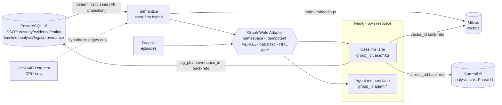
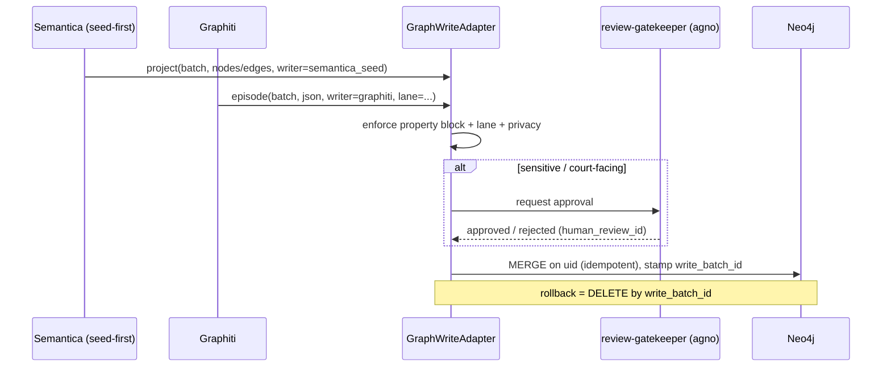
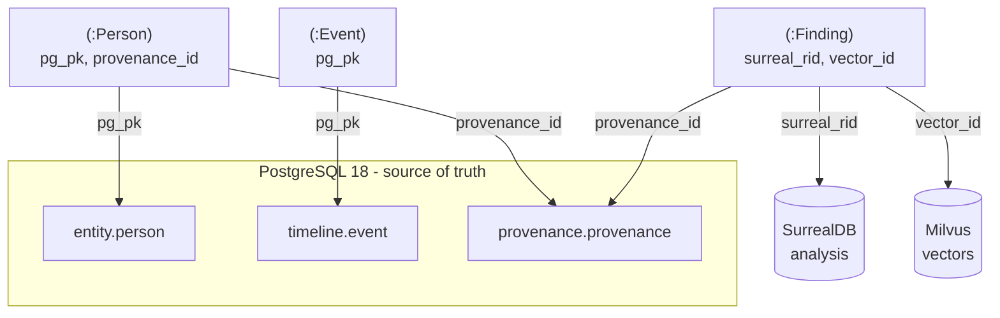

## Neo4j / Graphiti / Semantica Graph Model

> _Byline: Claude Code · Opus 4.8 (1M) · 2026-06-30_
>
> The graph layer is the **relationship and reasoning lane** of the forensic-evidence system. It is **not** the source of truth. The authoritative store is the unified PostgreSQL 18 resource (`agno-postgres:18-duckdb`, ADR-0013) defined in the Canonical Data Model section; Milvus (ADR-0026/0027) holds vectors; SurrealDB (ADR-0024, Phase D) is the consolidated analysis sink. **Neo4j is a derivation/projection** of those stores, optimized for traversal, path explanation, network analysis, contradiction mapping, and evidence-to-issue routing. If Neo4j were wiped, it could be fully rebuilt from PostgreSQL. This is a hard architectural rule: *the graph reads from the relational SSOT and writes nothing the relational store does not already own.*
>
> **Topology (owner-mandated, Context Pack §1).** Neo4j is its **own independently-deployable resource** — separate container, separate bind-mounted volume, independent start/stop/rebuild. A crash of Neo4j must never tear down PostgreSQL, Milvus, or SurrealDB, and vice-versa. Graphiti and Semantica are **writers into** this one Neo4j; they are not separate datastores.
>
> **Two writers, one graph (MP 1478–1520).** Per the master prompt, Neo4j is written by at least two graph-oriented applications:
> 1. **Graphiti** — agent memory, temporal awareness, evolving facts, episode-based construction, provenance-aware context graph (ADR-0014/0018/0031, VIP — never forked, never replaced).
> 2. **Semantica** (the user's Semantica / Hawksight / HawkSite knowledge-graph application) — knowledge-graph construction, context graphs, explainable reasoning, provenance & governance, graph analysis/traversal. **Semantica runs seed-first hybrid and writes OUR Neo4j + Milvus** (ADR ~0035).
>
> Because the exact Semantica implementation may differ from this assumption (MP 1519), all writes flow through a single **Graph Write Adapter** so that Graphiti-origin and Semantica-origin writes stay **traceable, separable, and reversible**.

---

### 1. Lane separation — two graphs sharing one Neo4j instance

The single Neo4j resource carries **two logically distinct lanes**, kept apart by Graphiti's native `group_id` partition key and by a `lane` property on every node and edge. They never silently bleed into each other.

| Lane | Writer | `group_id` namespace | Purpose | Court-grade? | LLM extraction allowed? |
|---|---|---|---|---|---|
| **Case Knowledge Graph (KG)** | Semantica (seed-first) + adapter | `case:<case_id>:kg` | The canonical, evidence-linked case graph: people, events, places, messages, claims, contradictions, patterns, legal issues. A faithful projection of PG canonical facts. | **Yes** — evidence-linked, fully provenanced, HITL-gated | **No cloud LLM on evidence.** Seed phase is deterministic; hybrid enrichment uses a **local ≤4B model only** (Context Pack §4 guardrail) and writes only hypotheses |
| **Agent Cognition / Memory** | Graphiti | `agent:mem`, `agent:session:<id>`, `ingest:run:<id>` | Working memory for the platform's agents: decisions, owner preferences, infra facts, session handoffs, processing-run state, evolving operational facts. | **No** — operational, never an exhibit | Local model only for any content touching the case; cloud extraction permitted **only** for non-case operational chit-chat |

> **CRITICAL guardrail (Context Pack §4).** Graphiti's default pipeline extracts entities/edges with a **cloud LLM**. Raw forensic/abuse evidence and any case-sensitive text **must never** be sent to a cloud extractor. Therefore: (a) the Case KG lane uses **seed-first deterministic projection** (no inference) for canonical facts, and **structured-JSON episodes with pre-resolved entities** when Graphiti machinery is used at all; (b) any inferential enrichment over case content runs on the **local CPU-only ≤4B model**; (c) Graphiti's cloud extractor is reserved for the non-sensitive operational memory lane. This is enforced in the adapter (see §8), not left to operator discipline.



---

### 2. What goes to Neo4j vs. what stays relational

The decision rule: **Neo4j stores the *shape of relationships* and the *identity keys* needed to traverse them; PostgreSQL stores the *content, the bytes, the full provenance record, and the versioned history*.** The graph holds pointers, not payloads.

| Data | Home of record | In Neo4j? | Form in graph |
|---|---|---|---|
| Raw evidence bytes, message bodies, OCR text, GPS points, file custody chain, SHA-256 hashes | **PostgreSQL** (`custody.*`, `evidence.*`, `geo.gps_point`, `multimodal.*`) | No (payload) | Referenced by `pg_pk` from `:Message`/`:Evidence` nodes |
| Embedding vectors (message body, OCR, scene, **node embeddings**) | **Milvus** | No | Referenced by `vector_id` |
| Full provenance record (parser/config/model_run/prompt_version/review) | **PostgreSQL** `provenance.provenance` | No (record) | Each node/edge carries `provenance_id` pointer + a flattened provenance subset |
| Versioned interpretations & finding revisions | **PostgreSQL** `temporal.interpretation_*`, `analysis.finding_version` (append-only) | Current version only, as node props + `version_no` | History stays relational |
| People, organizations, children | PG `entity.person` (SSOT) | **Yes** | `:Person` (+`:Child`) nodes |
| Devices, accounts, identifiers, platforms | PG `entity.device/account/identifier/platform` | **Yes** | `:Device`/`:Account`/`:Identifier`/`:Platform` nodes |
| Person↔person relationships, co-parenting, communication ties | derived | **Yes** | typed edges |
| Events / incidents, participation, event↔event temporal anchors | PG `timeline.event`, `event_participant`, `event_relation` | **Yes** | `:Event` nodes + edges |
| Locations (significant places) | PG `geo.location` (PostGIS geom is SSOT) | **Yes** (label + geohash + ref; **no geometry math in graph**) | `:Location` nodes |
| Statements, claims, allegations | PG `analysis.*` / `evidence.*` | **Yes** | `:Statement`/`:Claim` nodes |
| Contradictions (impeachment) | PG `analysis.contradiction` | **Yes** | `:Contradiction` node **and** `:CONTRADICTS` edge |
| Abuse patterns / tactics / behavioral patterns | PG `analysis.finding`, pattern catalogs (`detection_patterns.py`, `*.ttl`) | **Yes** (HITL-gated, hypothesis) | `:Pattern`/`:Tactic` nodes |
| Vulnerabilities (sensitive) | PG `analysis.*` | **Yes** (HITL, `safe_for_legal_use=false`) | `:Vulnerability` nodes |
| Legal issues, custody factors, evidence-relevance mapping | PG `legal.*` | **Yes** | `:LegalIssue`/`:CustodyFactor` nodes + `:RELEVANT_TO` |
| Relationship/cycle phases (positive/neutral/love-bombing/repair) | PG `analysis.relationship_phase` | **Yes** | `:CyclePhase` nodes (full-cycle modeling, MP 2431–2433) |
| Analytical findings / consolidated cross-store analysis | **SurrealDB** (Phase D) + PG `analysis.finding` | **Yes** (current finding as node; `surreal_rid` back-ref) | `:Finding` nodes |
| Bulk timeline rows, raw visits/activities/paths/trips | **PostgreSQL** (raw layer) | No | Only *significant* events promoted to `:Event` |

**Rule of thumb for promotion to the graph:** a relational row is projected into Neo4j only when it (a) participates in a relationship a human or agent will traverse, or (b) needs network/path/contradiction analysis. High-volume raw rows (every GPS ping, every raw activity segment) stay in PG/DuckDB; only **stay-points, significant events, and resolved entities** reach the graph.

---

### 3. Node labels

Node labels adopt the **salem_v3** case ontology (Context Pack §3 A — HIGHEST VALUE; `salem_v3.py`) and merge it with the canonical PG entity model. salem_v3-origin labels are cited; canonical-PG additions are marked. Sensitive labels carry mandatory HITL gating.

| Label | Origin | Links to PG (`pg_table` · `pg_pk`) | Tier | Notes |
|---|---|---|---|---|
| `:Person` | salem_v3 `Person` (Adopt) + merge TraceIQ `people` | `entity.person` · `person_id` | extracted_fact | `entity_role`, `is_minor`; user + partner + child + third parties |
| `:Child` (co-label `:Person:Child`) | salem_v3 (custody scope) | `entity.person` · `person_id` | extracted_fact | `is_minor=true`; gates custody edges |
| `:Organization` | canonical PG | `entity.person/org` | extracted_fact | agencies, employers, courts, professionals |
| `:Device` | TraceIQ multi-device (Adopt) | `entity.device` · `device_id` | extracted_fact | phones, GrayKey-extracted devices |
| `:Account` | canonical PG | `entity.account` · `account_id` | extracted_fact | platform accounts |
| `:Identifier` | TraceIQ V4.1 (Adopt) | `entity.identifier` · `identifier_id` | extracted_fact | phone/email/handle; bridges raw senders → `:Person` |
| `:Platform` / `:CommunicationChannel` | TraceIQ `platform` | `entity.platform` · `platform_id` | raw_evidence | iMessage, SMS, FB, Snapchat, email, GVoice |
| `:Event` (a.k.a. `:Incident`) | salem_v3 `Incident` (Adopt) + TraceIQ `timeline_enriched` | `timeline.event` · `event_id` | extracted/inferred | `event_type`, `assertion_type`, certainty quintuple via temporal node |
| `:Location` | salem_v3 `Location` (Adopt) + TraceIQ geo | `geo.location` · `location_id` | extracted_fact | holds `geohash8/9`, `place_kind`; **PostGIS geometry stays in PG** |
| `:Statement` | salem_v3 `Statement` (Adopt) | `analysis.statement`/`evidence.*` | raw vs extracted (flagged) | a declaration by a person |
| `:Message` | TraceIQ V4.1 `messages` (Adopt) | `evidence.message` · `message_id` | raw_evidence | body stays in PG; node = pointer + metadata |
| `:Claim` / `:Allegation` | canonical (MP 1507–1509) | `analysis.*` claim rows | extracted/hypothesis | `:Allegation` co-label when not yet corroborated |
| `:Evidence` / `:EvidenceItem` | salem_v3 `Evidence` (Adopt) | `evidence.*` / `custody.file_node` · `evidence_id` | raw_evidence | **central provenance anchor** |
| `:Contradiction` | salem_v3 `CONTRADICTS` reified | `analysis.contradiction` · `contradiction_id` | analytical_finding | reified for n-ary impeachment + review state |
| `:Pattern` / `:BehavioralPattern` | salem_v3 `Tactic` (Adapt) + `behavioral_patterns.ttl`, `detection_patterns.py`, `mcl_722_23.ttl` | `analysis.finding` + pattern catalog | analytical_finding (sensitive) | **HITL**; MCL A–L, DARVO, hurtlex lanes |
| `:Tactic` | salem_v3 `Tactic` (Adapt) | `analysis.finding` | analytical (sensitive) | **HITL** |
| `:Vulnerability` | salem_v3 `Vulnerability` (Adapt) | `analysis.*` | inferred (sensitive) | **HITL**; grief/parental-identity triggers only where evidence supports |
| `:CyclePhase` / `:RelationshipPhase` | salem_v3 extension (Context Pack §3) | `analysis.relationship_phase` · `phase_id` | analytical_finding | calm/tension/escalation/reconciliation/**love_bombing**/separation — full-cycle (MP 2431–2433) |
| `:Finding` | canonical PG | `analysis.finding` · `finding_id` (+`surreal_rid`) | analytical_finding | general analytical output |
| `:LegalIssue` | canonical (MP 1507/1515) | `legal.legal_issue` · `legal_issue_id` | legal_conclusion | review-gated |
| `:CustodyFactor` | `mcl_722_23.ttl` (12 MCL factors) | `legal.custody_factor` | legal_conclusion | best-interest factors A–L |
| `:Exhibit` | canonical PG | `legal.exhibit` · `exhibit_id` | legal_conclusion | court-ready, export-gated |

**Graphiti-managed structural labels** (the agent-memory lane uses Graphiti's native node model; we do not redefine it):

| Label | Managed by | Role |
|---|---|---|
| `:Episodic` | Graphiti | an ingested episode (text / message / json unit) — the provenance unit of agent memory |
| `:Entity` | Graphiti | LLM-or-seed-extracted entity node (local model only for case content) |
| `:Community` | Graphiti | clustered entity community (network-analysis aid) |

> Case-KG-lane nodes carry **both** a domain label (e.g. `:Person`) **and** Graphiti's `:Entity` label when written through Graphiti's JSON-episode path, so Graphiti's bitemporal bookkeeping and our domain ontology coexist on the same node.

---

### 4. Relationship (edge) types

Edges adopt salem_v3 edges (Context Pack §3 A) with the mandated renames and the **`RELATED_TO` split** into typed causal/temporal/topical subtypes. Sensitive/allegation edges are **Preserve-as-Hypothesis**: written with `hypothesis=true` and `safe_for_legal_use=false`, never promoted to fact without HITL (MP 2419/2469, Constraint 2448).

| Edge type | Direction | Origin / classification | Key properties | Tier / gate |
|---|---|---|---|---|
| **Person ↔ Person** | | | | |
| `:RELATED_TO` (abstract — always use a subtype below) | Person→Person | salem_v3 `RELATED_TO` **Split** | `relation_subtype` | — |
| `:PARENT_OF` | Person→Child | canonical | `valid_from/valid_to` | fact |
| `:CO_PARENT_OF` | Person↔Person | canonical (custody) | bitemporal | fact |
| `:PARTNER_OF` / `:FORMER_PARTNER_OF` | Person↔Person | canonical | `valid_from/valid_to` (relationship change, MP 1514) | fact |
| `:FAMILY_OF`, `:PROFESSIONAL_FOR` | Person↔Person | canonical | `role` | fact |
| `:COMMUNICATED_WITH` | Person↔Person | derived from messages | `channel`, `count`, `first_at`, `last_at` | extracted |
| **Person ↔ Event** | | | | |
| `:PARTICIPATED_IN` | Person→Event | salem_v3 (Adopt) | `role` (actor/subject/witness/third_party/child), `confidence` | extracted |
| `:WITNESSED`, `:SUBJECT_OF` | Person→Event | canonical (role refinement) | `confidence` | extracted |
| `:WAS_AT` | Person→Location | salem_v3 (Adopt) | `temporal_assertion_id`, `location_confidence`, `source_provenance` | extracted/inferred |
| **Person ↔ Device / Account** | | | | |
| `:USES_DEVICE` / `:OWNS_DEVICE` | Person→Device | canonical | `valid_from/valid_to`, `confidence` | extracted |
| `:HAS_ACCOUNT` / `:CONTROLS_ACCOUNT` | Person→Account | canonical | `confidence` | extracted |
| `:IDENTIFIED_BY` | Person→Identifier | TraceIQ V4.1 | `confidence`, `valid_from/valid_to` (changed numbers) | extracted; identity-resolution HITL |
| `:HOSTED_ON` | Account→Platform | canonical | — | fact |
| **Message ↔ Claim / Statement** | | | | |
| `:AUTHORED` / `:MADE_STATEMENT` | Person→Message/Statement | salem_v3 `MADE_STATEMENT` (Adopt) | `confidence` | extracted |
| `:ASSERTS` / `:CONTAINS_CLAIM` | Message/Statement→Claim | canonical (MP 2052) | `confidence`, `span` (char offsets into PG body) | extracted |
| `:SENT_TO` / `:RECEIVED_BY` | Message→Person | TraceIQ message_party | `role` | raw |
| **Event ↔ Location** | | | | |
| `:OCCURRED_AT` | Event→Location | canonical (MP 2053) | `location_confidence`, `source_provenance` (gps/message/photo_exif/claim) | extracted/inferred |
| **Event ↔ Event (temporal anchors)** | | | | |
| `:PRECEDED` / `:FOLLOWED` | Event→Event | salem_v3 `RELATED_TO` **Split** (temporal) | `gap_seconds`, `t_certainty` | extracted/inferred |
| `:ANCHORED_TO` | Event→Event | canonical (MP 2054, "known sequence") | `anchor_kind` (before/after/during) | inferred |
| `:CO_OCCURRED` / `:PART_OF` | Event→Event | salem_v3 Split (topical/composite) | `confidence` | inferred |
| `:CAUSED` | Event→Event | salem_v3 Split (causal) | `hypothesis=true` | **hypothesis, HITL** (causation ≠ correlation, Constraint 2445) |
| **Claim ↔ Evidence** | | | | |
| `:SUPPORTED_BY` / `:CORROBORATED_BY` | Claim/Finding→Evidence | salem_v3 + canonical (MP 2055) | `weight`, `corroboration_status` | analytical |
| `:ORIGINATES_FROM` | Claim/Event→Evidence | TraceIQ event_source `origin` | — | raw link |
| **Claim ↔ Contradiction** | | | | |
| `:CONTRADICTS` | Statement/Claim→Statement/Claim | salem_v3 `CONTRADICTS` (Adopt — impeachment) | `basis`, `confidence`, `safe_for_legal_use=false` | analytical, **HITL** |
| `:IMPEACHED_BY` | Person/Claim→Contradiction | canonical reification | — | analytical |
| `:INVOLVES` | Contradiction→Statement | reification edge | `role` (a/b) | analytical |
| **Pattern ↔ Event / Person** | | | | |
| `:INSTANTIATED_BY` / `:EVIDENCED_BY` | Pattern→Event/Message | canonical (MP 2057) | `confidence`, `detector` (e.g. `detection_patterns.py` rule id) | analytical, **HITL** |
| `:EXHIBITS_PATTERN` | Person→Pattern | canonical | `confidence`, `hypothesis=true` | **hypothesis, HITL** |
| `:USED_TACTIC` | Person→Tactic | salem_v3 (**Preserve-as-Hypothesis**) | `hypothesis=true`, `safe_for_legal_use=false`, `target_person_id` | **HITL before court** |
| `:EXPLOITED_VULNERABILITY` (was `TARGETED_WOUND`) | Person→Vulnerability | salem_v3 (**Preserve-as-Hypothesis**, renamed) | `hypothesis=true`, `confidence` (low) | **HITL** |
| `:DISPARAGES` (was `SPREADS_RUMOR`) | Statement→Person | salem_v3 (**Preserve-as-Hypothesis**, renamed) | `hypothesis=true` | **HITL** |
| **Custody-relevant (sensitive)** | | | | |
| `:EXPOSED_CHILD` | Event→Child | salem_v3 (Adopt) | `confidence`, verify `:Child.is_minor` | **HITL** |
| `:AFFECTED_PARENTING_ACCESS` (was `AFFECTED_ACCESS`) | Event→Person | salem_v3 (Adopt, renamed) | `confidence`, `direction` | **HITL** |
| **Legal-issue ↔ Evidence** | | | | |
| `:RELEVANT_TO` | Evidence/Finding/Claim→LegalIssue/CustodyFactor | canonical (MP 2058, 1515) | `usefulness_rating`, `prejudice_risk`, `required_corroboration` | legal, **review-gated** |
| `:SUPPORTS_FACTOR` | Finding→CustodyFactor | `mcl_722_23.ttl` | `confidence` | legal, **review-gated** |
| **Cycle / accountability (both-parties, full-cycle)** | | | | |
| `:DURING_PHASE` | Event→CyclePhase | canonical (MP 2431–2433) | — | analytical |
| `:REACTION_TO` | Event→Event | canonical (reactive context) | `actor_party`; preserves user's own reactions in temporal context (Constraint 2442–2444) | analytical, **HITL** |
| `:CONTRASTS_WITH` | Event→Event | canonical | links positive→later-contradicting conduct (MP 491) | analytical |

> **Both-parties / full-cycle (Constraint 2431–2433, 2440–2444).** The ontology must not be one-sided. `:CyclePhase` (incl. `love_bombing`, `reconciliation`, `calm`), `:REACTION_TO`, and `:CONTRASTS_WITH` exist specifically so the user's own mistakes, escalations, apologies, and repair attempts are modeled with the **same fidelity** as adverse conduct, always with surrounding temporal context. A node/edge that asserts adverse conduct by either party must carry evidence support or it is a `hypothesis`.

---

### 5. Key properties (every node and edge)

A uniform property contract makes the graph auditable and reversible. **Every node and every edge** in either lane carries the following property block (in addition to its domain-specific props above). These mirror the PG `provenance.provenance` and the §0 design contract of the Canonical Data Model.

| Property | Type | Meaning |
|---|---|---|
| `uid` | string | deterministic graph key = `"<Label>:<pg_pk>"` → makes projection **idempotent** (MERGE on `uid`) and reversible |
| `pg_table` | string | source table in PostgreSQL SSOT |
| `pg_pk` | string (uuid) | primary key in that table → the link back to relational truth |
| `provenance_id` | string (uuid) | → `provenance.provenance` (full provenance record stays in PG) |
| `source_id` | string (uuid) | → `custody.source` (root of the custody chain) |
| `surreal_rid` | string (nullable) | → SurrealDB record id for analytical projections (Phase D) |
| `vector_id` | string (nullable) | → Milvus vector (node/body embedding) |
| `assertion_type` | enum | `raw_evidence \| extracted_fact \| inferred_fact \| analytical_finding \| legal_conclusion` (five-tier epistemics — never conflated) |
| `confidence` | float 0–1 | calibrated confidence |
| `hypothesis` | bool | `true` = allegation/inference, **not** an established fact (Constraint 2419/2469) |
| `safe_for_legal_use` | bool | default **false**; only a passed review flips it true |
| `review_status` | enum | `unreviewed \| in_review \| approved \| rejected \| needs_more` |
| `human_review_id` | string (nullable) | → the review decision that gated it |
| `writer` | enum | `semantica_seed \| semantica_hybrid \| graphiti \| adapter_manual` (separability) |
| `write_batch_id` | string (uuid) | the projection/episode batch → **reversibility** (delete by batch) |
| `lane` | enum | `case_kg \| agent_mem` |
| `group_id` | string | Graphiti partition (`case:<case_id>:kg`, `agent:mem`, …) |
| `ontology_version` / `schema_version` / `prompt_version` / `model_run_id` | string | artifact lineage (Constraint 2436) so output traces to ontology/schema/prompt/model versions |
| `valid_from` / `valid_to` | datetime (nullable) | **valid time** — when the fact is/was true in the world |
| `recorded_at` / `invalidated_at` | datetime | **transaction/knowledge time** — when the system learned / stopped believing it |
| `t_precision` / `t_certainty` | enum | timestamp precision class — `exact \| approximate \| inferred \| uncertain` (Constraint 2421; missing from ALL prior schemas, added here) |

---

### 6. Temporal relationship strategy (bitemporal)

The graph is **bitemporal**, aligned with Graphiti's native temporal model and ADR-0014/0018/0031 ("valid + knowledge-time + disclosure-tier multi-pass"). Two independent time axes live on every fact-bearing edge:

| Axis | Properties | Question it answers |
|---|---|---|
| **Valid time** (world time) | `valid_from`, `valid_to` | *When was this true in reality?* (e.g. a phone number belonged to a person Jan–Aug; a `:PARTNER_OF` relationship held over a span) |
| **Transaction / knowledge time** | `recorded_at`, `invalidated_at` | *When did the system come to believe it, and when (if ever) did it stop?* |

Rules:

1. **Append-only, never destructive.** Superseding a fact does **not** delete the old edge; it sets `invalidated_at` on the superseded edge and creates a new edge with a fresh `valid_from`/`recorded_at`. Prior interpretations are preserved side-by-side (Constraint 2470; mirrors PG `temporal.interpretation_version` and `analysis.finding_version`). This is exactly how `:CONTRADICTS` and reinterpretation (the gaslighting/self-blame engine) are represented without rewriting history.
2. **Certainty is first-class.** Every temporal property group carries `t_precision`/`t_certainty`. An event whose time is "sometime that spring" is `inferred`/`uncertain`, anchored via an `:ANCHORED_TO` edge to a known event rather than given a false-precise timestamp. Relative-time expressions resolve through PG `temporal.relative_time_expr` and its `anchor_event_id`.
3. **Event-to-event anchoring.** When absolute time is unknown, order is still captured: `:PRECEDED`/`:FOLLOWED`/`:ANCHORED_TO` edges encode known sequence (MP 2054) with `gap_seconds` where derivable. This lets timeline reasoning proceed on partial information.
4. **Relationship change over time** (MP 1514). `:PARTNER_OF` → `:FORMER_PARTNER_OF`, custody arrangements, changed phone numbers — all modeled as valid-time-bounded edges, so a point-in-time query ("who controlled this account in March?") is answerable.
5. **Graphiti compatibility.** Graphiti already stamps edges with `valid_at`/`invalid_at` (valid time) and `created_at`/`expired_at` (transaction time). The adapter maps our `valid_from/valid_to` ↔ Graphiti `valid_at/invalid_at` and `recorded_at/invalidated_at` ↔ `created_at/expired_at`, so both writers produce one consistent bitemporal model.

```cypher
// Superseding a fact (append-only): old number invalidated, new asserted — nothing deleted
MATCH (p:Person {uid:'Person:...'})-[r:IDENTIFIED_BY]->(old:Identifier {uid:'Identifier:OLD'})
WHERE r.valid_to IS NULL
SET   r.valid_to = date('2025-08-01'), r.invalidated_at = datetime()
WITH  p
MATCH (new:Identifier {uid:'Identifier:NEW'})
MERGE (p)-[r2:IDENTIFIED_BY {write_batch_id:$batch}]->(new)
SET   r2.valid_from = date('2025-08-01'), r2.recorded_at = datetime(),
      r2.confidence = 0.95, r2.t_certainty = 'exact', r2.assertion_type='extracted_fact';
```

---

### 7. Provenance strategy

**Principle: PostgreSQL `provenance.provenance` is the system of record for provenance; the graph carries pointers plus a flattened, queryable subset.** Every derived object traces to source evidence (Constraint 2422, MP 1851–1871).

- **Pointer + flatten.** Each node/edge holds `provenance_id` (→ full PG record) *and* a flattened subset (`source_id`, `model_run_id`, `prompt_version`, `ontology_version`, `schema_version`, `writer`, `confidence`) so common "where did this come from?" queries run in-graph without a PG round-trip, while the canonical record stays relational and append-only.
- **Evidence anchoring.** `:Evidence`/`:EvidenceItem` is the central provenance anchor (salem_v3). Every fact-bearing edge is reachable to evidence via `:SUPPORTED_BY` / `:ORIGINATES_FROM`, so any claim can produce its support path (see explainable reasoning, §10). A `:Finding` or `:Claim` with **no** path to `:Evidence` is, by construction, a `hypothesis`.
- **PROV-O alignment (Semantica governance).** Semantica's writes are modeled on W3C PROV-O: domain nodes map to `prov:Entity`, processing runs to `prov:Activity`, models/people/parsers to `prov:Agent`, related by `prov:wasDerivedFrom` (→ `:ORIGINATES_FROM`), `prov:wasGeneratedBy` (→ `model_run_id`), `prov:wasAttributedTo` (→ `writer`/`human_review_id`). This matches the salvaged **Semantica pipeline** (NER, temporal KG, conflict detection, PROV-O, `source_hash`; Context Pack §3).
- **Artifact lineage** (Constraint 2436). Final court-facing nodes (`:Exhibit`, approved `:Finding`) trace back through `model_run_id` → `prompt_version` → `ontology_version` → `schema_version` → `human_review_id` → `source_id`. Intermediate work products (scans, drafts, classifications, tool outputs) are persisted in PG `provenance.work_artifact` and referenced, never silently discarded (Constraint 2434–2435).
- **No silent promotion.** A `hypothesis=true` edge can only become `hypothesis=false` / `safe_for_legal_use=true` through a logged `human_review_id`; the adapter rejects any write that flips these without one (Constraint 2469).

---

### 8. The Graph Write Adapter (traceable · separable · reversible)

MP 1519 mandates an adapter layer so Graphiti and Semantica-style writes "remain traceable, separable, and reversible." **All** writes to Neo4j — from Graphiti, from Semantica, from manual tooling — pass through one `GraphWriteAdapter`. It is the single chokepoint that enforces the property contract, the lane separation, the privacy guardrail, and the HITL gate.

Adapter responsibilities:

| Concern | Mechanism |
|---|---|
| **Traceability** | Stamps every node/edge with the full §5 property block; refuses writes missing `provenance_id` + `source_id` + `assertion_type` + `writer` |
| **Separability** | Tags `writer` and `group_id`/`lane` on every element; Graphiti-origin vs Semantica-origin vs manual are always distinguishable and queryable |
| **Reversibility** | Tags `write_batch_id` on every element; any batch (a seed run, a Semantica enrichment pass, a Graphiti episode) can be rolled back with one `MATCH ()-[r{write_batch_id:$b}]-() DELETE r` + orphan cleanup — without touching other batches |
| **Idempotency** | `MERGE` on deterministic `uid = "<Label>:<pg_pk>"`; re-projecting the same PG state is a no-op, so PG→graph sync can run repeatedly/safely |
| **Privacy guardrail** | Routes any case-content extraction to the **local ≤4B model**; blocks cloud-LLM extraction on `lane=case_kg`; cloud extraction permitted only for non-case operational memory |
| **HITL gate** | Sensitive labels/edges (`:Tactic`, `:Vulnerability`, `:USED_TACTIC`, `:CONTRADICTS`, `:RELEVANT_TO`, custody edges) are written with `safe_for_legal_use=false`; promotion requires the `agno-gateway` **review-gatekeeper** agent's approval (Context Pack §4 — agno writes route via review-gatekeeper) |
| **Reconciliation with PG** | On project, validates `pg_pk` exists in the named `pg_table`; writes `neo4j_uid` back onto the PG row (optional convenience column) for bidirectional lookup |



Because the adapter is the only writer, **if the real Semantica implementation differs** from the seed-first-hybrid assumption (MP 1519), only the adapter's Semantica binding changes — the graph contract, the PG SSOT, and Graphiti are untouched. This is the reversibility/portability hedge the master prompt asks for.

---

### 9. Graphiti episode strategy

Graphiti is **episode-driven**: every write is an *episode* (a content snippet) from which Graphiti derives entity nodes and fact edges, each stamped with bitemporal metadata and grouped by `group_id`. We use Graphiti two ways, split by lane.

**A. Agent-memory lane (`group_id = agent:*`).** This is Graphiti's home turf and how it is already wired as the `graphiti` MCP server (CLAUDE.md). Episodes record durable operational facts as they are established — decisions, owner preferences, infra/endpoint changes, "X is now Y" corrections, session handoffs, processing-run state. Episode types:

| Episode type | Use | Example |
|---|---|---|
| `text` | free-form agent observation / decision | "Decided Semantica runs seed-first; writes our Neo4j+Milvus (ADR-0035)." |
| `message` | conversation turns (agent ↔ owner) | session handoffs |
| `json` | structured operational state | ingestion-run summary `{run_id, files, status}` |

These episodes power **cross-session resume** (Constraint 2439, 2455): the memory layer reconstructs project context without re-reading everything. This lane may use Graphiti's standard extractor **only** because it contains no raw case evidence.

**B. Case-KG lane (`group_id = case:<case_id>:kg`) — structured-JSON episodes ONLY.** For any case content, we **do not** let Graphiti's LLM infer entities from raw text (privacy guardrail). Instead the adapter feeds Graphiti **`json` episodes whose entities and edges are already resolved in PostgreSQL** — Graphiti is used for its **bitemporal bookkeeping and episode provenance**, not for extraction. Each episode:

- corresponds to one ingestion/projection unit and carries `source_id` + `provenance_id`;
- defines the `valid_at` (valid time) of the facts it asserts and is itself the `:Episodic` provenance node, so every derived edge is traceable to the episode that produced it;
- is append-only — a correction is a **new** episode that invalidates prior facts (never an edit), preserving the audit trail.

> **Episode = provenance unit.** Treating each episode as the atom of provenance is what lets Graphiti's "evolving facts / fact invalidation" feature implement our append-only reinterpretation requirement natively, while the actual evidence and full provenance record remain in PG.

---

### 10. Semantica context-graph strategy (seed-first hybrid)

Semantica is the **case knowledge-graph builder** and runs **seed-first hybrid** (ADR ~0035), writing **our Neo4j + Milvus**. Two phases:

**Phase 1 — SEED (deterministic, no LLM, court-grade).**
The canonical case graph is **projected directly from PostgreSQL foreign keys** — zero inference, zero LLM. Every structural fact already proven in the relational SSOT becomes a node/edge:

| PG source | → Graph |
|---|---|
| `entity.person` / `device` / `account` / `identifier` / `platform` | `:Person`/`:Device`/`:Account`/`:Identifier`/`:Platform` nodes |
| `entity.identity_resolution` (HITL-approved merges) | `:IDENTIFIED_BY` edges |
| `timeline.event` + `event_participant` | `:Event` + `:PARTICIPATED_IN` |
| `timeline.event_relation` (typed) | `:PRECEDED`/`:PART_OF`/`:CAUSED?` |
| `geo.location` + `geo.location_assertion` | `:Location` + `:OCCURRED_AT`/`:WAS_AT` |
| `evidence.message` + `message_party` | `:Message` + `:AUTHORED`/`:SENT_TO` |
| `timeline.event_source` (corroborates/contradicts/origin) | `:SUPPORTED_BY`/`:CONTRADICTS`/`:ORIGINATES_FROM` |
| `analysis.contradiction` | `:Contradiction` + `:CONTRADICTS`/`:INVOLVES` |
| `analysis.relationship_phase` | `:CyclePhase` + `:DURING_PHASE` |
| `legal.evidence_relevance` (approved) | `:RELEVANT_TO`/`:SUPPORTS_FACTOR` |

This phase is fully provenanced, idempotent (MERGE on `uid`), and re-runnable — the graph is always reconstructable from PG.

**Phase 2 — HYBRID (local-model enrichment, hypotheses only).**
On top of the deterministic seed, Semantica proposes **candidate** structure using the **local ≤4B model** and the salvaged abuse-pattern prior art (`detection_patterns.py` 256 patterns / MCL A–L / DARVO, `behavioral_patterns.ttl`, `seed-patterns.ts`, `hurtlex_loader`; Context Pack §3): typed `RELATED_TO` splits, `:EXHIBITS_PATTERN`, `:USED_TACTIC`, contradiction candidates, vulnerability/tactic inferences. **Every Phase-2 write is `hypothesis=true`, `safe_for_legal_use=false`, review-gated.** Nothing here is a fact until a human approves it.

**Context graphs & explainable reasoning (MP 1494–1496, 1517).**
Semantica's value is *explainable* reasoning: for any claim, it returns the **context subgraph** — the minimal evidence path supporting it. Example: "Why does the system associate Event E with custody factor MCL-(c)?" returns `(:CustodyFactor)<-[:SUPPORTS_FACTOR]-(:Finding)-[:INSTANTIATED_BY]->(:Event E)-[:SUPPORTED_BY]->(:Evidence)-[pg_pk]->custody.source`. This is exactly what makes output court-defensible: no conclusion without a visible, provenanced path back to raw evidence.

**Node embeddings → Milvus (ADR ~0035).** Semantica writes node embeddings to Milvus (`vector_id` back-ref on the node) for graph-aware hybrid retrieval (find structurally + semantically similar people/events/messages). Embeddings of case content use the **local/approved embedder** per the embedding contract (ADR-0010/0011/0026); raw evidence never leaves local for embedding.

```cypher
// Explainable support path for a court-facing claim (read-only, returns provenance trail)
MATCH path = (i:LegalIssue {uid:$issue})<-[:RELEVANT_TO]-(f:Finding)
             -[:INSTANTIATED_BY|EVIDENCED_BY]->(e:Event)
             -[:SUPPORTED_BY|ORIGINATES_FROM]->(ev:Evidence)
WHERE f.safe_for_legal_use = true
RETURN path, f.confidence, ev.pg_pk AS evidence_pg_pk, ev.source_id;
```

---

### 11. Required graph-modeling patterns (MP 2049–2059)

Each required relationship pattern, with its concrete graph encoding and the link back to relational truth.

| # | Pattern (MP) | Graph encoding | Notes / gate |
|---|---|---|---|
| 1 | **Person-to-person** | `(:Person)-[:CO_PARENT_OF\|PARTNER_OF\|FORMER_PARTNER_OF\|FAMILY_OF\|COMMUNICATED_WITH]->(:Person)` | bitemporal (`valid_from/valid_to`) for relationship change (MP 1514) |
| 2 | **Person-to-event participation** | `(:Person)-[:PARTICIPATED_IN {role,confidence}]->(:Event)` | role enum incl. `witness`/`child`; from PG `event_participant` |
| 3 | **Person-to-device/account** | `(:Person)-[:USES_DEVICE\|OWNS_DEVICE]->(:Device)`, `(:Person)-[:HAS_ACCOUNT\|CONTROLS_ACCOUNT]->(:Account)`, `(:Person)-[:IDENTIFIED_BY]->(:Identifier)-[:HOSTED_ON]->(:Platform)` | identity resolution is HITL; multi-device attribution preserved |
| 4 | **Message-to-claim** | `(:Person)-[:AUTHORED]->(:Message)-[:ASSERTS {span}]->(:Claim)` | `span` = char offsets into PG message body (body stays in PG) |
| 5 | **Event-to-location** | `(:Event)-[:OCCURRED_AT {location_confidence,source_provenance}]->(:Location)` | geometry math in PostGIS; graph holds geohash + ref |
| 6 | **Event-to-event temporal anchors** | `(:Event)-[:PRECEDED\|FOLLOWED\|ANCHORED_TO\|CO_OCCURRED\|PART_OF]->(:Event)`; `:CAUSED` only as `hypothesis` | enables ordering under uncertain time (causation≠correlation, Constraint 2445) |
| 7 | **Claim-to-evidence support** | `(:Claim\|:Finding)-[:SUPPORTED_BY\|CORROBORATED_BY {weight}]->(:Evidence)` | no support path ⇒ `hypothesis=true` by construction |
| 8 | **Claim-to-contradiction** | `(:Statement\|:Claim)-[:CONTRADICTS {basis,confidence}]->(:Statement\|:Claim)`; reified `(:Contradiction)-[:INVOLVES]->(:Statement)` | impeachment value; `safe_for_legal_use=false`, **HITL** |
| 9 | **Pattern-to-event** | `(:Pattern)-[:INSTANTIATED_BY {detector,confidence}]->(:Event\|:Message)`; `(:Person)-[:EXHIBITS_PATTERN]->(:Pattern)` | abuse-pattern lane; **all HITL**, sensitive-label review before court |
| 10 | **Legal-issue-to-evidence** | `(:Evidence\|:Finding\|:Claim)-[:RELEVANT_TO {usefulness,prejudice_risk,required_corroboration}]->(:LegalIssue\|:CustodyFactor)` | review-gated; carries litigation-risk + corroboration flags (MP 1830–1847) |

Worked seed example (deterministic, court-grade — Person↔Event↔Location with provenance):

```cypher
MERGE (p:Person {uid:'Person:'+$person_id})
  ON CREATE SET p.pg_table='entity.person', p.pg_pk=$person_id,
                p.provenance_id=$prov, p.assertion_type='extracted_fact',
                p.writer='semantica_seed', p.lane='case_kg',
                p.group_id=$gid, p.write_batch_id=$batch
MERGE (e:Event {uid:'Event:'+$event_id})
  ON CREATE SET e.pg_table='timeline.event', e.pg_pk=$event_id,
                e.provenance_id=$prov, e.assertion_type='extracted_fact',
                e.writer='semantica_seed', e.write_batch_id=$batch
MERGE (l:Location {uid:'Location:'+$location_id})
  ON CREATE SET l.pg_table='geo.location', l.pg_pk=$location_id, l.geohash9=$gh9
MERGE (p)-[pi:PARTICIPATED_IN {write_batch_id:$batch}]->(e)
  SET pi.role='subject', pi.confidence=$pc, pi.provenance_id=$prov, pi.assertion_type='extracted_fact'
MERGE (e)-[oa:OCCURRED_AT {write_batch_id:$batch}]->(l)
  SET oa.location_confidence=$lc, oa.source_provenance='gps',
      oa.valid_from=$vfrom, oa.recorded_at=datetime(),
      oa.t_certainty=$tcert, oa.assertion_type=CASE WHEN $lc>=0.6 THEN 'extracted_fact' ELSE 'inferred_fact' END;
```

---

### 12. How graph records link back to PostgreSQL and SurrealDB

| Direction | Mechanism |
|---|---|
| **Graph → PostgreSQL** | Every node/edge carries `pg_table` + `pg_pk` (+ `provenance_id`, `source_id`). Resolve full content/provenance with a keyed lookup. `uid = "<Label>:<pg_pk>"` guarantees a 1:1 deterministic map |
| **PostgreSQL → Graph** | Optional convenience column `neo4j_uid` written back on project; otherwise the graph node is found by constructing `"<Label>:<pk>"`. No data duplicated — just a join key |
| **Graph → SurrealDB** | Analytical nodes/edges (`:Finding`, `:Contradiction`, hybrid hypotheses) carry `surreal_rid` → the SurrealDB record holding the consolidated cross-store analysis (Phase D). Heavy analytical computation lives in SurrealDB/DuckDB, not in graph traversal |
| **Graph → Milvus** | `vector_id` on nodes/messages → Milvus vectors (node + body embeddings) for hybrid graph+semantic retrieval |
| **Rebuild contract** | PG is SSOT. Neo4j = `project(PG)`. SurrealDB = `pipeline(PG)`. Milvus = `embed(PG raw)`. All three are reconstructable from PostgreSQL; none holds an un-backed fact |



---

### 13. Constraints, indexes & operational notes

- **Uniqueness:** `CREATE CONSTRAINT FOR (n:Person) REQUIRE n.uid IS UNIQUE;` (repeat per domain label) — enforces idempotent projection and prevents duplicate identity.
- **Lookup indexes:** btree on `pg_pk`, `provenance_id`, `source_id`, `group_id`, `write_batch_id`, `review_status`, `safe_for_legal_use`, `valid_from`/`valid_to` for time-slice and rollback queries.
- **Graphiti reserved space:** Graphiti owns `:Episodic`/`:Entity`/`:Community` and its own indexes; our domain constraints attach to domain labels only, so the two coexist.
- **Court-facing query default:** any export/exhibit query filters `WHERE n.safe_for_legal_use = true AND n.hypothesis = false` — hypotheses are invisible to court-facing paths until reviewed (Constraint 2427/2469).
- **Backup:** Neo4j on its own bind-mounted volume (Docker mapped-volumes preference, Context Pack §1); rebuildable from PG regardless, but snapshotted independently.
- **Community edition:** Neo4j Community + Graphiti (ADR-0014/0018/0031) — no Enterprise features assumed; multi-database is emulated via `group_id`/`lane` partitioning, not separate Neo4j DBs.

---

### 14. Needs-human-review / open items

1. **salem_v3 is one-sided.** It models only adversarial conduct (`Tactic`, `Vulnerability`, `USED_TACTIC`, `TARGETED_WOUND`). MP 2431–2433/2440–2444 require modeling **both parties**, the **full relational cycle**, and the **user's own reactions in temporal context**. This section adds `:CyclePhase` (incl. `love_bombing`/`reconciliation`/`calm`), `:REACTION_TO`, `:CONTRASTS_WITH`, and a `conduct_party` property — **these additions need owner sign-off** before use (they extend, not replace, the VIP salem_v3 ontology).
2. **Semantica implementation is assumed, not confirmed (ADR ~0035 not yet read in full).** The seed-first-hybrid + writes-our-Neo4j+Milvus model is taken from the Context Pack and the task brief; the adapter layer (§8) is the deliberate hedge so a different real Semantica wiring changes only the adapter binding. **Confirm ADR-0035 specifics.**
3. **Graphiti default extractor is cloud-LLM.** The privacy-safe design here (seed-first + structured-JSON episodes + local ≤4B for any case content) **must be enforced in the adapter and in the Graphiti server config**, not assumed. Verify the deployed `graphiti` MCP server's model binding before any case content is ingested — otherwise raw evidence could be sent to a cloud model (Context Pack §4 hard guardrail).
4. **`:CAUSED` and all hypothesis edges** stay `safe_for_legal_use=false` pending review; causation-vs-correlation and selective-framing checks (Constraint 2445–2446) are review-gatekeeper responsibilities, not encoded in the graph alone.
