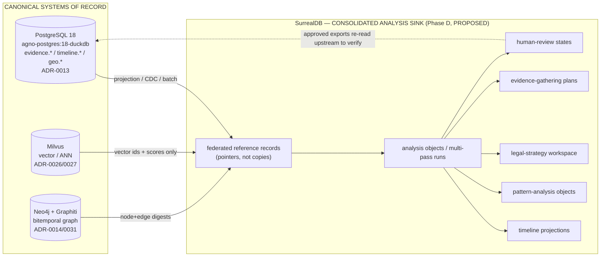
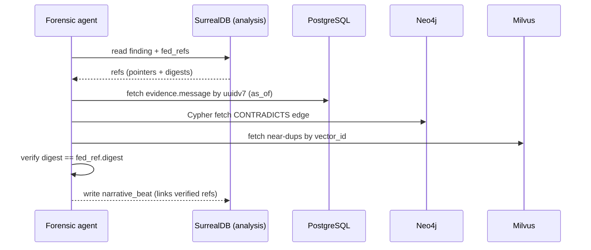
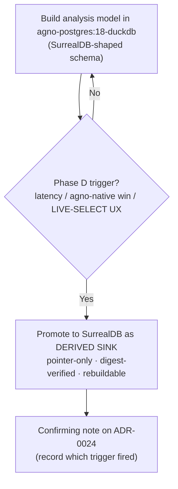

## SurrealDB Consolidated Analysis Model

> _Byline: Claude Code · Opus 4.8 (1M) · 2026-06-30_
>
> **Status banner — read before implementing.** SurrealDB is the *consolidated analysis store* in the SPEC-1 design (MP 1521–1539; section requirement MP 2060–2077). Per the context pack, it is **RATIFIED in principle (ADR-0024, amended by ADR-0027/0032) but NOT YET DEPLOYED — Phase D.** The orchestration brief asks this section to treat SurrealDB as a *proposal* and rule on **adopt vs defer**; that is consistent with the context pack, because the architectural *intent* is locked but the *deployment* decision is still open. This section therefore presents SurrealDB as a **Phase-D proposal whose go/no-go is decided here**, analyzes the duplication and synchronization risk against the cheaper alternative (PostgreSQL materialized views + JSONB), and gives an explicit, conditional recommendation. **Nothing in this section blesses a second system of record** — that would violate the locked stack and the "minimize custom code / off-the-shelf-first" principle.

---

### 1. What this layer is (and is not)

SurrealDB is proposed as a **derived, read-optimized analysis-and-workspace store** that sits *downstream* of the canonical evidence stack. It is the place where already-extracted, already-normalized facts are **re-projected into agent- and human-friendly shapes**: cross-source timelines, multi-pass pattern findings, legal-strategy scratchpads, evidence-gathering plans, and human-review queues.

| It IS | It is NOT |
|---|---|
| A consolidation / projection layer (an **analysis sink**, per ADR-0024) | A system of record for evidence |
| A workspace for hypotheses, drafts, plans, review state | A replacement for PostgreSQL, Milvus, or Neo4j |
| A single multi-model surface (document + graph + KV + live queries) for *agents* | A new place to first-ingest raw evidence |
| Rebuildable from upstream at any time | A store anyone may treat as authoritative on conflict |

**Hard rule (data-classification firewall).** Per cross-cutting guardrails, SurrealDB holds **inferred facts, analytical findings, hypotheses, drafts, and legal conclusions** — it is the natural home for the "softer" tiers. **Raw evidence and extracted facts remain canonical in PostgreSQL** (`agno-postgres:18-duckdb`, ADR-0013) and Neo4j/Graphiti (ADR-0014/0031). Every SurrealDB record that asserts anything about the world MUST carry `assertion_type ∈ {raw, extracted, inferred, analytical, legal_conclusion}`, `confidence`, `timestamp_certainty ∈ {exact, approximate, inferred, uncertain}`, and ≥1 federated evidence citation. This mirrors the salem_v3 extension mandate (context pack §2) and the global Constraints (MP 2420–2421, 2436–2438).

---

### 2. Why SurrealDB is useful here (the case FOR)

1. **Agno-native session/memory + analysis in one engine (ADR-0024).** Agno already targets SurrealDB for store/session/memory. Co-locating the *analysis sink* with agent memory means the 6 forensic agents (agno-gateway, context pack §3) read working state and analysis projections from one place, with one driver, instead of fanning queries across three engines per turn.
2. **Multi-model fit for a multi-shape problem.** The analysis layer is genuinely document-shaped (multi-pass JSON findings, prompt versions, tool-call outputs), graph-shaped (narrative reconstruction, contradiction chains), and KV-shaped (session/resume state). SurrealDB does all three natively, so agents avoid impedance-mismatch glue.
3. **Native bitemporality (ADR-0024) for the workspace tier.** The analysis layer needs *valid time* (when something was true in the relationship) vs *knowledge time* (when we concluded it) — exactly the multi-pass, "preserve prior interpretations, never overwrite" requirement (MP 2438, 2470). This complements (does not replace) Graphiti's bitemporal graph, which remains the substrate for entity/relationship truth (context pack §1).
4. **`LIVE SELECT` for human-review queues.** SurrealDB live queries let the review UI and gatekeeper agent subscribe to changes in the human-review queue without polling — a clean fit for the HITL-on-every-write guardrail.
5. **Record links + graph edges for cross-source narrative.** `RELATE` edges plus record links let a narrative pass stitch a PG message, a Neo4j `CONTRADICTS` edge, and a Milvus-surfaced near-duplicate into one reviewable "narrative beat" object.

**But none of these are free.** §6 quantifies the cost; §7 rules.

---

### 3. Record types (tables)

SurrealDB tables (`DEFINE TABLE ... SCHEMAFULL` recommended for auditability — schemaless is rejected for a court-facing system). Naming uses `surreal.*` conceptually; physical namespace/db = `forensic:analysis`. **All record IDs are stable and traceable**; where a record projects an upstream row it stores the upstream key, never a renumbered surrogate.

#### 3.1 Common envelope (mixin on every assertion-bearing record)

Every analysis/finding/plan record embeds this provenance + classification envelope (enforced via `DEFINE FIELD`):

| Field | Type | Meaning |
|---|---|---|
| `assertion_type` | `string` (enum) | raw / extracted / inferred / analytical / legal_conclusion |
| `confidence` | `float` 0–1 + `confidence_band` enum (HIGH/MED/LOW) | re-derivable, **never hard-coded 0.6** (crosswalk: `vw_forensic_evidence_package` lesson) |
| `timestamp_certainty` | `string` (enum) | exact / approximate / inferred / uncertain |
| `valid_time` | `{start, end}` datetime | when true in the world (bitemporal) |
| `knowledge_time` | `datetime` (set on insert, append-only) | when we asserted it |
| `evidence_refs` | `array<record(fed_ref)>` | ≥1 federated citation (§4); MUST be non-empty for inferred+ tiers |
| `provenance` | `object` | `{run_id, prompt_version, ontology_version, schema_version, model_id, tool_call_id}` (artifact lineage, MP 2436/2452) |
| `review` | `record(review_state)` | link to human-review state (§3.7) |
| `supersedes` | `option<record>` | prior version this revises (append-only; never overwrite, MP 2470) |
| `case_id` | `string` | scope (salem_v3 caption generalized to `case_id`, context pack §2) |

#### 3.2 Core analysis tables

| Table | Purpose | Key fields (beyond envelope) | Adopted/adapted from |
|---|---|---|---|
| `fed_ref` | Federated pointer to a canonical record (no payload copy) | `target_system` (postgres/milvus/neo4j), `target_locator`, `digest` (sha256 of cited content for tamper-evidence), `snapshot_at` | New (federation primitive); custody hash aligns w/ ADR-0013 uuidv7 + SHA-256 chain |
| `analysis_run` | One pass of analysis (multi-pass support) | `pass_no`, `pass_type` (extraction/correlation/pattern/narrative/legal), `inputs[]`, `prompt_version`, `model_id`, `status`, `started/ended`, `parent_run` | New; satisfies "multi-pass analysis records" (MP 2071, 1532) |
| `finding` | An analytical finding produced by a run | `claim`, `finding_type`, `subject` (person/event/location refs), `support[]`→`fed_ref`, `contradicts[]`, `cycle_phase` | salem_v3 findings; `expected_schedule`→claim-vs-evidence (crosswalk ADAPT) |
| `narrative_beat` | A unit of cross-source narrative reconstruction | `summary`, `ordered_refs[]`, `tone_surface`, `inferred_intent`, `relational_function`, `cycle_phase`, `context_before/after` | New; satisfies MP 1531 + sentiment-separation (MP 2433) |
| `timeline_view` | A saved, parameterized timeline projection | `lens` (party/topic/location/device), `event_refs[]`, `interval`, `gap_flags[]` | `timeline_enriched` spine (crosswalk ADOPT) |
| `pattern` | A pattern-analysis object (instance of a library pattern) | `pattern_key` (→303-lib), `phase`, `polarity` (positive/neutral/negative/love-bombing/repair), `instances[]`→`fed_ref`, `recurrence` | 303-pattern lib + `positive_behaviors.ttl` (context pack §2) |
| `legal_strategy` | Legal-strategy workspace object | `issue`, `mcl_factor` (722.23 A–L), `theory`, `supporting_findings[]`, `risks[]`, `court_safe_wording`, `emotional_vs_legal_split` | `mcl_722_23.ttl`; MP 2466–2473 |
| `evidence_plan` | Evidence-gathering plan object | `gap`, `hypothesis_ref`, `needed_evidence`, `source_hint`, `priority`, `status`, `corroboration_target` | New; "make clear what requires corroboration" (MP 2471) |
| `review_state` | Human-review / approval state machine | `state`, `reviewer`, `decision`, `decided_at`, `notes`, `sensitive_label_gate` (bool), `history[]` | review-gatekeeper agent (context pack §3); HITL guardrail |
| `work_product` | Persisted intermediate artifact | `kind` (scan/draft/index/classification/prompt/tool_output), `blob_ref` (R2), `archived` + `archive_reason` | MP 2434–2435 (persist intermediate work) |
| `session_memory` | Cross-session resume state (Agno-native) | `agent`, `task`, `context_blob`, `open_threads[]` | ADR-0024 store/session/memory |

#### 3.3 Sensitive-label gating

`pattern.polarity ∈ {coercive_control, gaslighting, alienation, weaponization, reactive_abuse}` and any `legal_strategy.theory` using those labels **cannot** reach `assertion_type = legal_conclusion` or a court-facing export until `review_state.sensitive_label_gate = true` AND `review_state.state = approved`. Enforced by a `DEFINE EVENT`/permission rule, not just convention (MP 2448, 2464; cross-cutting guardrail). This is the database-level expression of the HITL mandate.

---

### 4. Federated references to PostgreSQL, Milvus, Neo4j

SurrealDB does **not** have production cross-database query federation to PG/Milvus/Neo4j; per ADR-0032 the platform explicitly **dropped FDW-style federation** (Multicorn2/neo4j-fdw) in favor of reach via pg_duckdb + native Cypher + Milvus SDK. Therefore federation here is **reference-by-pointer + orchestrated fetch**, not live join.

The `fed_ref` record is the contract:

| `target_system` | `target_locator` shape | Resolved by | Notes |
|---|---|---|---|
| `postgres` | `{schema, table, pk (uuidv7), as_of}` | forensic-data-agent (validated queries, context pack §3) via pg_duckdb | `as_of` enables point-in-time re-read for audit |
| `neo4j` | `{label/edge, element_id, valid_time, knowledge_time}` | native Cypher (ADR-0032) | bitemporal coords preserved so Graphiti tier stays truth |
| `milvus` | `{collection, embedder, vector_id, score, query_hash}` | Milvus SDK | store id+score only; **never copy vectors** (one collection/embedder, ADR-0010/0026) |
| `r2` | `{bucket, key, sha256, version_id}` | rclone mount / pg_duckdb S3 secret (ADR-0030) | for `work_product` blobs / Iceberg time-travel |

**Tamper-evidence:** `fed_ref.digest` stores the SHA-256 of the cited content at `snapshot_at`. At export time the gatekeeper re-reads upstream and compares digests; a mismatch flags the citation as **stale/changed** rather than silently exporting. This is the chain-of-custody backbone (crosswalk ADOPT: SHA-256 + UUIDv7) projected into the analysis layer.

---

### 5. Edges / graph-like relationships, timeline & analysis views

SurrealDB `RELATE` edges express *analysis-layer* relationships (the entity-truth graph stays in Neo4j/salem_v3). Edges carry the same envelope (assertion_type/confidence/evidence_refs).

| Edge (`RELATE a->edge->b`) | Connects | Meaning | Source |
|---|---|---|---|
| `supports` | `fed_ref → finding` | evidence backs a finding | core |
| `contradicts` | `finding → finding` / `fed_ref → finding` | impeachment / conflict | salem_v3 `CONTRADICTS` (HITL) |
| `instantiates` | `fed_ref → pattern` | an event is an instance of a pattern | 303-lib |
| `preceded` / `part_of` / `caused?` | `narrative_beat → narrative_beat` | temporal/causal (salem `RELATED_TO` split; `caused?` always hypothesis) | crosswalk §2 |
| `reacts_to` | `narrative_beat → narrative_beat` | user's reaction modeled in context (explanation≠excuse) | full-cycle mandate (MP 2442–2444) |
| `repair_attempt` / `love_bombing` | beats | full relational cycle, both parties | full-cycle guardrail |
| `informs` | `finding → legal_strategy` | finding feeds strategy | core |
| `gap_for` | `evidence_plan → finding` | plan addresses a weak/uncorroborated finding | core |
| `gates` | `review_state → (finding/pattern/legal_strategy)` | review controls promotion | HITL |

**Timeline views (MP 2070, 1533).** `timeline_view` records are saved projections (materialized in Surreal, rebuildable from PG `timeline.event` spine). Each event reference keeps the `start_timestamp_raw` + `_utc` + `offset` triple (crosswalk ADOPT) so timestamp-certainty is visible per row; `gap_flags` mark inferred/uncertain intervals. Lenses: per-party, per-topic, per-location, per-device (multi-device attribution, context pack §5 gap). User-facing timelines render *only* approved beats; rough/hypothesis beats are filtered by `review_state`.

**Pattern-analysis objects (MP 2071).** `pattern` records bind to the 303-pattern behavioral library and **`positive_behaviors.ttl`** so the layer models positive/neutral/love-bombing/repair, not just adversarial conduct (full-cycle guardrail, MP 2431–2433). `polarity` + `cycle_phase` are first-class so contrast-over-time is queryable.

---

### 6. The core risk: duplication & synchronization vs PG + views

This is the decisive analysis the brief asks for. SurrealDB introduces a **second engine that holds projections of canonical data**. That is a classic dual-write / cache-coherence problem, and for a *court-facing* system, drift between the analysis store and the system of record is not just a bug — it is an **evidentiary integrity risk** (an export could cite a finding whose underlying PG row has since changed).

#### 6.1 Risk register

| Risk | Mechanism | Severity (court-facing) | Mitigation |
|---|---|---|---|
| **Stale projection** | PG/Neo4j row updated; Surreal copy not refreshed | HIGH | `fed_ref.digest` re-verify at export; reference-by-pointer (don't copy payloads); `as_of` reads |
| **Dual source of truth** | Analysts start treating Surreal as authoritative | HIGH | Firewall (§1): raw/extracted truth lives upstream; Surreal flagged read-derived; "SSOT docs win" |
| **Sync complexity / custom code** | Bespoke ETL/CDC PG→Surreal violates "minimize custom code" | MED | Prefer Agno-native sync; batch projection over real-time; small, declarative jobs |
| **Bitemporal double-bookkeeping** | valid/knowledge time tracked in both Graphiti and Surreal, diverge | MED | Graphiti = entity-truth timeline; Surreal = analysis-workspace timeline; do not duplicate the same facts |
| **Operational surface** | A 4th DB to deploy/back up/secure (no GPU, lean infra, context pack) | MED | Bind-mount volumes (owner rule); defer until Phase D capacity confirmed |
| **Vector duplication** | Copying embeddings into Surreal | HIGH (cost + drift) | Store vector_id+score only; Milvus stays single vector store (ADR-0026) |
| **Maturity** | SurrealDB less battle-tested than PG for forensic guarantees | MED | Keep it derived & rebuildable; never the only copy |

#### 6.2 The cheaper alternative — PostgreSQL views + JSONB

Almost everything in §3–§5 can be built **inside the already-LIVE `agno-postgres:18-duckdb`** with zero new infrastructure:

| SurrealDB feature | PG-native equivalent | Adequacy |
|---|---|---|
| Document/multi-pass JSON | `JSONB` columns + `analysis_run`/`finding` tables | Strong |
| Federated reach | **pg_duckdb** (files/S3/relational) + Cypher + Milvus SDK (ADR-0032) — already the blessed reach | Strong (this is the *current* design) |
| Graph edges | recursive CTEs / `ltree` / pg_trgm; or just keep graph in Neo4j | Adequate for analysis edges |
| Timeline views | materialized views over `timeline.event` | Strong |
| Bitemporality | range types + append-only history tables; or Graphiti for the graph tier | Adequate |
| Vector | Milvus SDK (unchanged) | Identical |
| Live review queue | `LISTEN/NOTIFY` | Adequate (vs Surreal `LIVE SELECT`) |
| Session/memory | agno-gateway is **already Postgres-backed** (context pack §3) | Strong |

**Net:** PG+views covers the functional requirement today with **one fewer engine, no sync layer, and no drift class**. SurrealDB's genuine advantages narrow to: (a) Agno-native single-surface ergonomics for agents, (b) native multi-model + `LIVE SELECT`, (c) native bitemporality for the *workspace* tier. Those are *ergonomic/velocity* wins, not *capability* wins.

---

### 7. Recommendation — DEFER deployment; build the analysis layer in PostgreSQL now, adopt SurrealDB only on a triggered, gated promotion

**Recommendation: DEFER (conditional adopt).** Concretely:

1. **Phase A–C: build the entire consolidated-analysis model (§3–§5) inside `agno-postgres:18-duckdb`** using JSONB + materialized views + the existing pg_duckdb/Cypher/Milvus reach (ADR-0032). This delivers every section-required object (analysis runs, findings, timelines, patterns, legal strategy, evidence plans, review states) with **no new infrastructure, no sync layer, and no drift risk**, honoring off-the-shelf-first / minimize-custom-code.
2. **Design the schema "SurrealDB-shaped" from day one** — the envelope (§3.1), `fed_ref` pointer contract (§4), and edge vocabulary (§5) are deliberately portable. This keeps the ADR-0024 intent alive (SurrealDB stays *ratified*) without paying for it before it pays back.
3. **Promote to SurrealDB in Phase D only if a trigger fires**, e.g.: (a) agent query latency/complexity across 3 engines becomes the bottleneck; (b) Agno's SurrealDB-native session/memory delivers a measurable ergonomic win the PG path can't; (c) `LIVE SELECT` materially improves the review-queue UX. Until then, the cost (4th engine + sync) exceeds the benefit.
4. **If/when adopted, adopt as a pure derived sink only** — reference-by-pointer (never copy payloads/vectors), digest-verified citations, batch projection (not chatty dual-write), rebuildable from upstream, and **never** authoritative on conflict. Require a fresh confirming note on ADR-0024 that records the Phase-D trigger that fired.

This reconciles the locked-but-undeployed status: the *architecture* keeps SurrealDB as the named consolidated analysis store (ADR-0024); the *engineering* avoids standing up a second system of record and its sync tax until there is a demonstrated need — which is exactly the "reversible / re-doable" and "minimize custom code" posture.

---

### 8. Agent-facing query patterns (MP 2075)

Whether backed by PG-now or Surreal-later, agents use the same logical patterns (Surreal `SQL` shown; PG equivalents are direct):

| Pattern | Intent | Sketch |
|---|---|---|
| Resolve findings + verify citations | get a finding and re-check its evidence | `SELECT *, evidence_refs.*.digest FROM finding WHERE case_id=$c AND review.state='approved'` → agent re-reads upstream, compares digest |
| Cross-source narrative | reconstruct a beat across sources | traverse `narrative_beat->preceded->narrative_beat`; expand `ordered_refs` via fed-fetch |
| Cycle/contrast view | show positive vs negative over time | `SELECT cycle_phase, polarity, count() FROM pattern WHERE case_id=$c GROUP BY cycle_phase, polarity` |
| Contradiction sweep | impeachment candidates (HITL) | edges `->contradicts->`; force `review.sensitive_label_gate` before court use |
| Review queue (live) | gatekeeper subscribes to pending items | `LIVE SELECT * FROM review_state WHERE state='pending'` (PG: `LISTEN review_pending`) |
| Evidence-gap plan | what still needs corroboration | `SELECT * FROM evidence_plan WHERE status!='closed' ORDER BY priority` |
| Resume session | rebuild context across sessions | `SELECT * FROM session_memory WHERE agent=$a AND task=$t` |
| Export pre-flight | block unsafe court output | reject if any cited `finding` is `legal_conclusion` with sensitive label and `review.state!='approved'` |

All write patterns are **append-only** (`supersedes` link, never overwrite — MP 2470) and pass through `review_state` before any sensitive promotion or court-facing export (HITL guardrail).

---

### 9. Implementation checklist (developer-facing)

- [ ] Define envelope (§3.1) as a reusable field set; enforce non-empty `evidence_refs` for `assertion_type >= inferred`.
- [ ] Implement `fed_ref` + digest verify against PG (uuidv7), Neo4j (element_id + bitemporal coords), Milvus (vector_id+score), R2 (sha256+version_id).
- [ ] Build §3.2 tables as PG tables/JSONB + materialized views first; keep DDL SurrealDB-portable.
- [ ] Wire `review_state` to the agno-gateway **review-gatekeeper** agent; gate sensitive labels at the DB layer.
- [ ] Persist `work_product` (scans/drafts/prompts/tool outputs) with `archive_reason` — never silent-discard (MP 2434–2435).
- [ ] Carry `prompt_version` + `ontology_version` + `schema_version` on every `analysis_run` for artifact lineage (MP 2436/2452).
- [ ] Add a Phase-D trigger metric dashboard (cross-engine query latency) to inform the adopt decision.

---

### 10. Needs-human-review / open items

- **Status reconciliation (FLAG):** the master prompt and the orchestration brief frame SurrealDB as *new/unratified*, but the context pack says **ratified (ADR-0024) yet undeployed**. Treated here as ratified-intent + open-deployment. An owner should confirm whether ADR-0024's deployment is still genuinely open before Phase D spend.
- **Sync mechanism unspecified (GAP):** no live DDL or PG→Surreal projection job exists yet (context pack §4 "schema-as-DEPLOYED" blind spot). If SurrealDB is adopted, the batch-projection/CDC design needs its own ADR; do not improvise dual-write.
- **Bitemporal boundary (FLAG):** the exact split between Graphiti's bitemporal entity-truth graph and SurrealDB's workspace bitemporality must be drawn explicitly to avoid double-bookkeeping (§6.1) — recommend a short ADR amendment.
