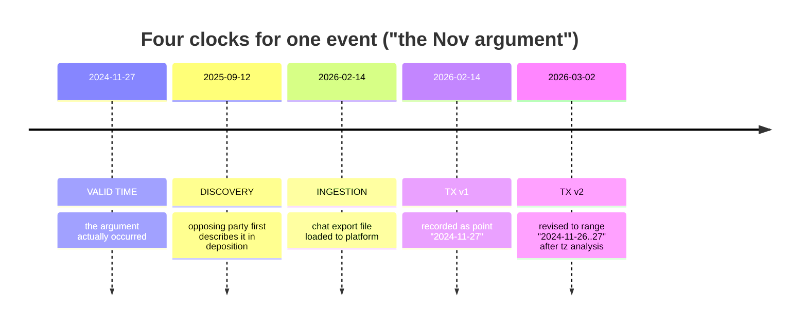
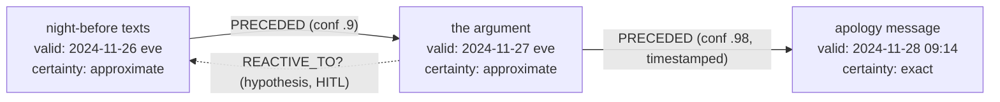
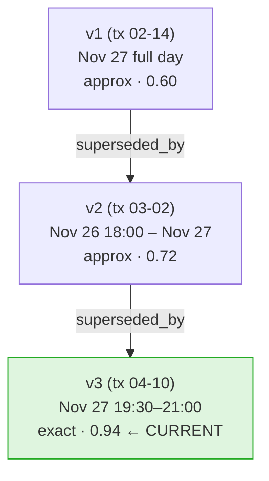
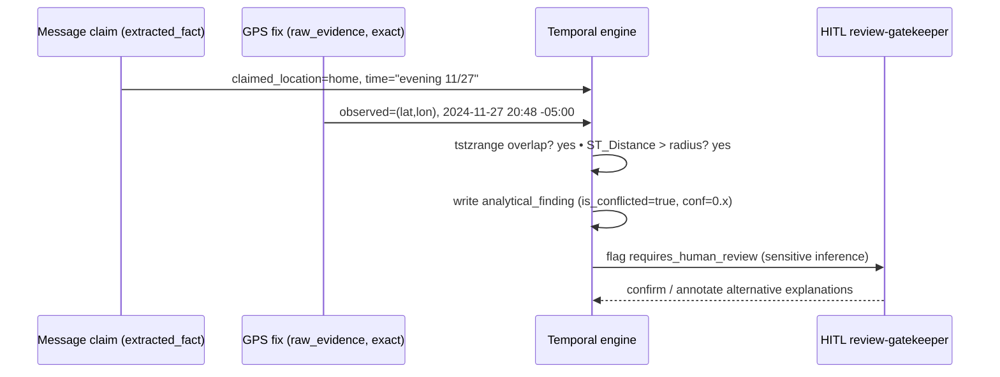
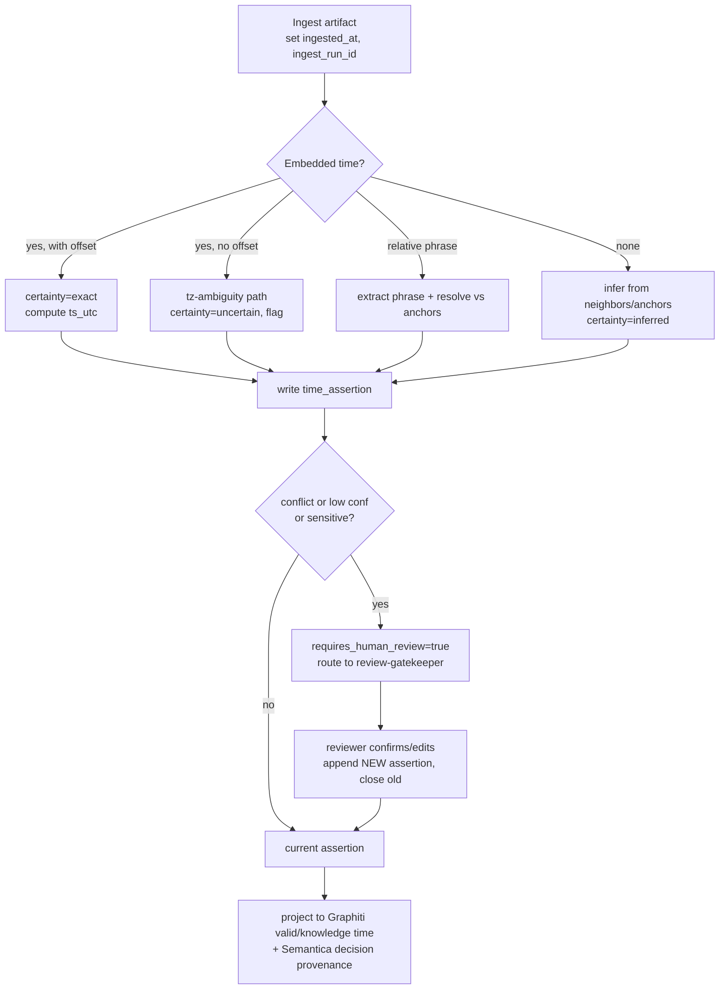

## Temporal reasoning model (bitemporal)

> _Byline: Claude Code · Opus 4.8 (1M) · 2026-06-30_
> Grounded in CONTEXT_PACK §1 (locked stack), §2 (crosswalk), §5 (guardrails). Adopts the `timeline_enriched` raw/UTC/offset triple, the Graphiti bitemporal substrate (ADR-0014/0018/0031), the SurrealDB native-bitemporal analysis sink (ADR-0024), and the Semantica decision/provenance substrate (CANON §5). Nothing here is a blank slate.

### 0. Why temporal modeling is a first-class concern, not a column

In a forensic family-law corpus, **when** something happened is contested as often as **whether** it happened. A message export's timestamp may be in the exporter's phone timezone, not the sender's. A screenshot has no embedded time at all. A witness ("she") describes events as "the weekend after court" or "around Thanksgiving." GPS may place a device somewhere the person swears they were not. And — critically — **our own interpretation of when an event occurred changes over time** as new evidence arrives. A naive `timestamp` column silently overwrites all of that nuance and is fatal to auditability.

The model below therefore separates **four independent clocks** (bitemporal, extended to four time axes) and represents every temporal assertion as a **range with explicit certainty and provenance**, never as a single instant we pretend to know. This directly satisfies the global Constraints: distinguish exact / approximate / inferred / uncertain timestamps; preserve provenance; never overwrite earlier interpretations; keep hypotheses separate from facts.

#### Layering against the locked stack

| Concern | Lives in | Rationale |
|---|---|---|
| Canonical event spine + temporal ranges + certainty | **PostgreSQL 18** (`agno-postgres:18-duckdb`), `timeline.event` | ADR-0013; relational + `range` types + PostGIS for the geo-time join |
| Knowledge-graph time (valid + knowledge/transaction) for entity/edge facts | **Neo4j + Graphiti MCP** | ADR-0014/0018/0031 — bitemporal substrate is the whole point of Graphiti |
| Decision / interpretation provenance (interpretation revision history) | **Semantica** (seed-first) | CANON §5 — decision/provenance bitemporal substrate |
| Analysis sink with native bitemporal store/session memory | **SurrealDB** (Phase D, ratified ADR-0024) | native bitemporal; PG → Surreal analysis sink |
| Raw payloads, append-only audit, time-travel custody | R2 / Iceberg + append-only PG tables | ADR-0007/0030 |

PostgreSQL holds the **authoritative, court-defensible** temporal record (it is LIVE today); Graphiti holds the **graph-native** valid/knowledge-time view for cognition; Semantica/SurrealDB are the Phase-D bitemporal extensions. The Postgres model is the SSOT; the others project from it.

---

### 1. The four clocks (bitemporal+)

Classic bitemporal modeling tracks **valid time** (when a fact was true in the world) and **transaction time** (when the database believed it). Forensic ingestion needs two more, because "when we learned it" and "when we filed it into the system" are themselves evidentiary and frequently differ by months.

| Clock | Definition | Who sets it | Mutable? | Example |
|---|---|---|---|---|
| **Valid time** (`valid_from`, `valid_to`) | When the event/fact was true in the real world | Derived from evidence + reasoning | Re-asserted via new rows, never overwritten | The argument occurred 2024-11-27 evening |
| **Discovery time** (`discovered_at`) | When the *case team* first became aware of the fact (independent of when it entered the DB) | Reviewer / extraction run | No (immutable per assertion) | We learned about the argument when she testified 2025-09-12 |
| **Ingestion time** (`ingested_at`) | When the source artifact was loaded into the platform | Pipeline | No | The chat export was ingested 2026-02-14 03:11 UTC |
| **Transaction time** (`tx_from`, `tx_to` / `asserted_at`, `retracted_at`) | When *this database row* was the believed-current assertion | DB (append-only) | System-versioned; closed by superseding row | We recorded "Nov 27" 2026-02-14; revised to "Nov 26–27 window" 2026-03-02 |

> **Discovery vs ingestion vs transaction** are routinely conflated. Keep them distinct: a fact can be *discovered* (deposition) long before its *ingestion* (we get the transcript file) and before any *transaction* (we write the structured row). Each is independently relevant — e.g. "when did the party first know X" is a litigation question that only the discovery clock answers.



**Append-only rule (CONTEXT_PACK §5):** transaction-time history is *never* mutated in place. A revision inserts a new assertion row and closes the prior one's `tx_to` / sets `retracted_at`; the old row is preserved verbatim. This is how "interpretation revision history" is realized physically.

---

### 2. Valid-time as a range with certainty, never a point

Every temporal assertion stores a **bounded interval** plus a **point estimate** plus a **certainty class**. Even an "exact" timestamp is a (degenerate) range with tight bounds and a known offset.

#### 2.1 Timestamp certainty enum

Adopts the global Constraint vocabulary verbatim (exact / approximate / inferred / uncertain) and extends the `timeline_enriched` raw/UTC/offset triple (CONTEXT_PACK §2).

| `timestamp_certainty` | Meaning | Typical source | Bounds behavior |
|---|---|---|---|
| `exact` | Trustworthy instant with known timezone/offset | EXIF `DateTimeOriginal`+offset, server message ts, GPS fix | `earliest == latest == point` (± device clock skew) |
| `approximate` | Real time known to a coarse window | "around Thanksgiving", export with tz ambiguity | bounds span the window; point = window midpoint or mode |
| `inferred` | No stated time; derived from anchors/ordering | screenshot placed by adjacent messages | bounds = anchor-derived; flagged inferred |
| `uncertain` | Conflicting or unresolved evidence | GPS vs stated location; two exports disagree | bounds = union of candidates; **conflict flag set** |

Plus orthogonal flags carried on every event (per CONTEXT_PACK §5 "assertion lanes"):

- `assertion_type ∈ {raw_evidence, extracted_fact, inferred_fact, analytical_finding, legal_conclusion}`
- `confidence ∈ [0,1]` (calibrated, *not* a hard-coded 0.6 — see `evidence_export` crosswalk)
- `requires_human_review boolean` (HITL gate for sensitive/low-confidence temporal claims)

#### 2.2 Core schema (PostgreSQL 18)

```sql
-- Valid-time + certainty live on the canonical event spine (timeline.event).
-- Bitemporal/transaction history is in a sibling assertion table (append-only).

CREATE TYPE temporal.certainty AS ENUM ('exact','approximate','inferred','uncertain');
CREATE TYPE temporal.assertion_kind AS ENUM
  ('raw_evidence','extracted_fact','inferred_fact','analytical_finding','legal_conclusion');

-- One row = one *interpretation* of when an event occurred (append-only; never UPDATEd).
CREATE TABLE temporal.time_assertion (
  assertion_id      uuid PRIMARY KEY DEFAULT uuidv7(),     -- ADR-0013 native uuidv7
  event_id          uuid NOT NULL REFERENCES timeline.event(event_id),

  -- VALID TIME (real world) — always a range; point is the working best estimate
  valid_earliest    timestamptz NOT NULL,                  -- "no earlier than"
  valid_latest      timestamptz NOT NULL,                  -- "no later than"
  valid_point       timestamptz,                           -- best single estimate (nullable)
  valid_range       tstzrange GENERATED ALWAYS AS
                      (tstzrange(valid_earliest, valid_latest, '[]')) STORED,

  -- raw/UTC/offset triple adopted from timeline_enriched (CONTEXT_PACK §2)
  ts_raw            text,            -- string exactly as it appeared in the source
  ts_utc            timestamptz,     -- normalized to UTC if/when offset is known
  tz_offset_minutes integer,         -- NULL = offset unknown (drives tz-ambiguity logic)
  tz_source         text,            -- 'exif_offset' | 'export_header' | 'assumed_local' | 'unknown'

  -- certainty + assertion lane + confidence (CONTEXT_PACK §5)
  certainty         temporal.certainty NOT NULL,
  assertion_type    temporal.assertion_kind NOT NULL DEFAULT 'extracted_fact',
  confidence        numeric(4,3) CHECK (confidence BETWEEN 0 AND 1),
  is_conflicted     boolean NOT NULL DEFAULT false,        -- set when sources disagree
  requires_human_review boolean NOT NULL DEFAULT false,

  -- DISCOVERY + INGESTION clocks
  discovered_at     timestamptz,        -- when case team first knew
  discovery_source  uuid,               -- evidence/source that triggered discovery
  ingested_at       timestamptz NOT NULL DEFAULT now(),
  ingest_run_id     uuid,               -- processing-run lineage (provenance)

  -- TRANSACTION TIME (system-versioned, append-only)
  asserted_at       timestamptz NOT NULL DEFAULT now(),
  retracted_at      timestamptz,        -- NULL = currently-believed assertion
  superseded_by     uuid REFERENCES temporal.time_assertion(assertion_id),

  -- PROVENANCE + reasoning trail
  derived_from      uuid[] DEFAULT '{}',          -- source evidence/anchor ids
  anchor_refs       uuid[] DEFAULT '{}',          -- temporal.anchor ids used
  reasoning         text,                         -- how the window was computed
  prompt_version    text,                         -- if model-derived (artifact lineage)
  ontology_version  text,
  schema_version    text,
  author            text NOT NULL,                -- 'pipeline:tz-resolver' | 'human:matt' | 'agent:forensic-data'
  CONSTRAINT valid_ordering CHECK (valid_earliest <= valid_latest)
);

-- Exactly one current assertion per event (the believed-now interpretation).
CREATE UNIQUE INDEX one_current_per_event
  ON temporal.time_assertion(event_id) WHERE retracted_at IS NULL;

CREATE INDEX ON temporal.time_assertion USING gist (valid_range);
CREATE INDEX ON temporal.time_assertion (event_id, asserted_at);
```

Notes:
- `valid_range` as a GiST-indexed `tstzrange` makes **overlap / containment / "what else happened that weekend"** queries native (`&&`, `@>`).
- The partial unique index enforces "one current truth, infinite history" — the physical guarantee behind the append-only / never-overwrite constraint.
- `tz_offset_minutes IS NULL` is the single most important signal flag: it routes the row through the timezone-ambiguity workflow (§6.6).

---

### 3. Anchors and relative-time resolution

Relative expressions ("the weekend after court", "after she moved") cannot be resolved without **anchors** — datable reference events. We maintain an explicit anchor registry so resolution is reproducible and auditable, never a one-off model guess.

#### 3.1 Anchor registry

```sql
CREATE TABLE temporal.anchor (
  anchor_id     uuid PRIMARY KEY DEFAULT uuidv7(),
  anchor_key    text UNIQUE,           -- 'court_hearing_2024_11_22', 'move_out_2024'
  label         text NOT NULL,         -- human description
  anchor_type   text NOT NULL,         -- 'docketed_event'|'recurring_holiday'|'life_event'|'derived'
  valid_earliest timestamptz NOT NULL,
  valid_latest   timestamptz NOT NULL,
  certainty     temporal.certainty NOT NULL,
  confidence    numeric(4,3),
  derived_from  uuid[] DEFAULT '{}',   -- evidence backing the anchor itself
  requires_human_review boolean DEFAULT false,
  author        text NOT NULL,
  asserted_at   timestamptz DEFAULT now(),
  retracted_at  timestamptz
);
```

| Anchor type | Examples | Date source |
|---|---|---|
| `docketed_event` | court hearings, filings, service of process | court docket (high certainty, `exact`) |
| `recurring_holiday` | Thanksgiving, Christmas, school breaks | calendar rule per year (US Thanksgiving = 4th Thu Nov) |
| `life_event` | "she moved", "started new job", grief anniversary | corroborated evidence; often `approximate` |
| `derived` | "the argument" referenced relative to other events | computed from another assertion |

> **Guardrail:** an anchor is only as certain as its own evidence. "She moved" used as an anchor must itself carry a valid-time range and confidence; resolving a relative expression against a fuzzy anchor *propagates* that fuzziness into the result (§4). Anchors backing sensitive inferences set `requires_human_review`.

#### 3.2 Relative-expression grammar → window arithmetic

A small, auditable rule table maps natural-language temporal phrases to interval arithmetic over anchors. Phrases are extracted (NER/temporal tagger; spaCy + rules) into a normalized form, then resolved.

| Phrase pattern | Resolution | Resulting certainty |
|---|---|---|
| "the weekend after X" | next Sat 00:00 → next Sun 23:59 (local) following `anchor(X).valid_latest` | `approximate` (2-day window) |
| "after X" (open-ended) | `valid_earliest = anchor(X).valid_latest`; `valid_latest = +∞` (or next bounding event) | `inferred`, wide |
| "around / near Y" (holiday) | `Y ± 3 days` (configurable) | `approximate` |
| "the night before Z" | `[anchor(Z).valid_earliest − 1 day @ 18:00, anchor(Z).valid_earliest @ 06:00)` | `approximate` |
| "a few weeks after X" | `anchor(X).valid_latest + [2w, 5w]` | `uncertain`, wide |
| "last summer" | season window for inferred year | `uncertain` |

The window-arithmetic rules live in a versioned config (`temporal.relative_rules`, `prompt_version`/`ontology_version` stamped) so a later audit can reproduce exactly how "around Thanksgiving" became a specific range.

---

### 4. Earliest/latest windows, event ordering, confidence

#### 4.1 Window propagation (interval arithmetic)

When an event's time derives from anchors, we propagate bounds, not points. Given anchor A with `[a_lo, a_hi]` and an offset rule `+Δ`:

```
result.valid_earliest = a_lo + Δ_min
result.valid_latest   = a_hi + Δ_max
result.valid_point    = midpoint (or mode if a distribution is known)
result.confidence     = f(anchor.confidence, rule.tightness, corroboration_count)
```

`confidence` is a calibrated score (NOT the legacy hard-coded 0.6 — see `vw_forensic_evidence_package` → `evidence_export` crosswalk, which mandates transparent re-derivation). A worked formula we adopt:

```
confidence = clamp01( base[certainty]
                    * anchor.confidence
                    * (1 − window_penalty(valid_latest − valid_earliest))
                    + corroboration_bonus(n_independent_sources) )
```
where `base = {exact:1.0, approximate:0.75, inferred:0.55, uncertain:0.35}`, `window_penalty` grows with window width, and each independent corroborating source adds a diminishing bonus. The function and its constants are versioned and logged in `reasoning`, so any number in a court export can be explained.

#### 4.2 Event ordering (when absolute time is unknown but order is known)

Sometimes we know **A happened before B** ("the night before the argument") without confident absolute times. We model order as graph edges so ordering survives even when timestamps are fuzzy.

- In **PostgreSQL**: an explicit precedence table.
- In **Neo4j/Graphiti**: the `PRECEDED` edge (CONTEXT_PACK §2 — `RELATED_TO` is split into typed `PRECEDED`/`PART_OF`/`CAUSED?`). Graphiti's valid/knowledge time carries the ordering assertion's own history.

```sql
CREATE TABLE temporal.ordering (
  ordering_id uuid PRIMARY KEY DEFAULT uuidv7(),
  before_event uuid NOT NULL REFERENCES timeline.event(event_id),
  after_event  uuid NOT NULL REFERENCES timeline.event(event_id),
  relation     text NOT NULL DEFAULT 'preceded',  -- preceded|same_day|overlaps|caused_hypothesis
  basis        text NOT NULL,                      -- 'narrative:"night before"' | 'timestamp' | 'reasoning'
  confidence   numeric(4,3),
  requires_human_review boolean DEFAULT false,
  derived_from uuid[] DEFAULT '{}',
  author       text NOT NULL,
  asserted_at  timestamptz DEFAULT now(),
  retracted_at timestamptz
);
```

A **topological sort** over `preceded` edges yields a partial order; where absolute windows exist they constrain it (Allen's interval relations: `before`, `meets`, `overlaps`, `during`, `equals`). Contradictions (a cycle, or order conflicting with timestamps) raise a conflict for HITL — they are *signals*, not errors to silently resolve. `caused_hypothesis` is never auto-promoted to fact (matches the `CAUSED?` guardrail).



> The dotted `REACTIVE_TO?` edge models the user's *own* reaction in temporal context (CONTEXT_PACK §5: model both parties; explanation ≠ excuse) — held as a hypothesis pending human review, never asserted as fact.

---

### 5. Interpretation revision history (the heart of the bitemporal model)

Every change of mind about *when* (or *what*) an event was is a new assertion row; the prior row is closed, not deleted. The current view is `WHERE retracted_at IS NULL`; the full history is the unfiltered table. This is reinforced in three places:

1. **PostgreSQL** `temporal.time_assertion` (append-only, system-versioned via `asserted_at`/`retracted_at`).
2. **Graphiti** — facts carry temporal metadata and an *invalidation* mechanism: a superseded fact is marked invalid (knowledge-time), not erased. This is the native graph analogue.
3. **Semantica** (CANON §5) — the decision/provenance substrate records *why* the interpretation changed (which evidence, which reviewer, which prompt version), giving a defensible chain.

#### 5.1 Revision example (transaction-time travel)

| `asserted_at` | `valid_earliest..latest` | `certainty` | `confidence` | `reasoning` | `retracted_at` |
|---|---|---|---|---|---|
| 2026-02-14 03:11 | 2024-11-27 00:00 .. 2024-11-27 23:59 | approximate | 0.60 | initial: export local date only | 2026-03-02 |
| 2026-03-02 10:40 | 2024-11-26 18:00 .. 2024-11-27 23:59 | approximate | 0.72 | export tz = America/Detroit confirmed; "night before" narrative widens lower bound | 2026-04-10 |
| 2026-04-10 14:05 | 2024-11-27 19:30 .. 2024-11-27 21:00 | exact | 0.94 | corroborated by GPS fix + timestamped photo | *(current)* |

**As-of queries** answer "what did we believe on date D?" — essential for explaining a prior court filing:

```sql
-- What was our belief about this event on 2026-03-15?
SELECT valid_earliest, valid_latest, certainty, confidence, reasoning
FROM temporal.time_assertion
WHERE event_id = :id
  AND asserted_at  <= TIMESTAMPTZ '2026-03-15'
  AND (retracted_at > TIMESTAMPTZ '2026-03-15' OR retracted_at IS NULL)
ORDER BY asserted_at DESC
LIMIT 1;
```



> Nothing is overwritten. A non-developer reads this as: "We first thought it was sometime on the 27th; later we narrowed it to that evening as photos and GPS came in — and every step is on the record with the reason."

---

### 6. Worked examples

Each example shows the natural-language input, the source artifact, the resolved assertion row (key fields), and the review disposition. All are illustrative scaffolds, not established facts.

#### 6.1 "The weekend after court"
- **Anchor:** `court_hearing_2024_11_22` (docketed, `exact`, conf 1.0), Fri 2024-11-22.
- **Rule:** "weekend after X" → next Sat 00:00 → Sun 23:59 local.

| Field | Value |
|---|---|
| valid_earliest / latest | 2024-11-23 00:00 −05:00 / 2024-11-24 23:59 −05:00 |
| valid_point | 2024-11-23 12:00 (midpoint) |
| certainty | `approximate` |
| assertion_type | `inferred_fact` |
| confidence | 0.80 |
| anchor_refs | `{court_hearing_2024_11_22}` |
| reasoning | "weekend-after rule applied to docketed hearing 2024-11-22" |
| requires_human_review | false (anchor is hard-docketed) |

#### 6.2 "After she moved"
- **Anchor:** `move_out_2024` is itself fuzzy — corroborated only to "sometime September 2024" (`approximate`, conf 0.55).
- **Rule:** "after X" → `valid_earliest = anchor.valid_latest`, `valid_latest = +∞` (or next bounding event).

| Field | Value |
|---|---|
| valid_earliest / latest | 2024-09-30 23:59 / *(open, +∞)* |
| certainty | `inferred` (open-ended, low precision) |
| assertion_type | `inferred_fact` |
| confidence | 0.45 |
| reasoning | "open-ended 'after' anchored to move-out; upper bound unbounded → flag for narrowing" |
| requires_human_review | **true** (open upper bound + fuzzy anchor) |

> The fuzziness of the "move" anchor propagates: the result is deliberately wide and flagged. We do **not** manufacture precision we don't have.

#### 6.3 "Around Thanksgiving"
- **Anchor:** `recurring_holiday` rule → US Thanksgiving 2024 = 4th Thursday Nov = **2024-11-28**.
- **Rule:** "around Y" → `Y ± 3 days`.

| Field | Value |
|---|---|
| valid_earliest / latest | 2024-11-25 00:00 / 2024-12-01 23:59 |
| valid_point | 2024-11-28 |
| certainty | `approximate` |
| confidence | 0.65 |
| reasoning | "holiday rule: 4th Thu Nov 2024; ±3 day window" |

> **Year-ambiguity trap:** if the speaker's year is unknown, the system enumerates candidate years (2023/2024/2025), sets `certainty = uncertain`, `is_conflicted = true` until a corroborating anchor disambiguates, and flags for review. Never silently pick a year.

#### 6.4 "The night before the argument"
- **Anchor:** `the_argument` (derived) currently valid 2024-11-27 evening.
- **Rule:** "night before Z" → `[Z.valid_earliest − 1 day @ 18:00, Z.valid_earliest @ 06:00)`.

| Field | Value |
|---|---|
| valid_earliest / latest | 2024-11-26 18:00 / 2024-11-27 06:00 |
| certainty | `approximate` |
| confidence | 0.70 |
| ordering | `PRECEDED(this → the_argument)` conf 0.9 |
| reasoning | "night-before rule on derived anchor 'the_argument'; ordering edge added" |

> If `the_argument` is later re-dated (revision §5), this dependent assertion is **recomputed** as a *new* row (old preserved). Dependency is tracked via `derived_from`/`anchor_refs` so cascades are auditable.

#### 6.5 Screenshot with no timestamp
- **Source:** PNG, no EXIF `DateTimeOriginal`, no embedded chat time.
- **Strategy:** triangulate from anchors — filename/export-folder date, surrounding messages whose times *are* known, file system mtime (weak), and any visible UI clock OCR'd from the image.

| Field | Value |
|---|---|
| ts_raw | *(none)* |
| valid_earliest / latest | bounded by nearest known-timestamped neighbors in same thread |
| certainty | `inferred` |
| assertion_type | `inferred_fact` (the *image* is `raw_evidence`; its *time* is inferred) |
| confidence | 0.40–0.60 depending on neighbor tightness |
| derived_from | `{prev_msg_id, next_msg_id, ocr_clock_span_id}` |
| reasoning | "no EXIF; bracketed by msgs at 14:02 and 14:19; OCR UI clock '2:1?' supports" |
| requires_human_review | **true** |

> Separation of lanes (Constraints): the screenshot *content* is raw evidence; the *OCR text* is an extracted fact linked to its source span; the *time* is an inferred fact. File-system mtime is recorded but explicitly down-weighted (it reflects copy/download, not capture).

#### 6.6 Message export with timezone ambiguity
- **Source:** chat export where header timezone is absent; timestamps are wall-clock with **no offset** (`tz_offset_minutes IS NULL`, `tz_source='unknown'`).
- **Risk:** the same wall-clock string is a different real instant in Detroit vs UTC vs the exporter's travel timezone — a window of up to ±some hours, enough to flip "night before" vs "day of."

| Field | Value |
|---|---|
| ts_raw | "11/27/24 9:14 PM" |
| ts_utc | *(NULL until offset resolved)* |
| tz_offset_minutes | NULL |
| valid_earliest / latest | union over candidate offsets: 2024-11-27 21:14 −05:00 .. same wall-clock at the widest plausible offset |
| certainty | `uncertain` (downgraded from any apparent exactness) |
| is_conflicted | true |
| reasoning | "export lacks tz header; candidate zones {America/Detroit, UTC, device-travel}; widened" |
| requires_human_review | **true** |

**Resolution path (logged as revisions):** infer the export device's timezone from device settings / other timestamped artifacts / DST rules; once `tz_source='export_header'` or `'exif_offset'` is established, compute `ts_utc`, set `tz_offset_minutes`, narrow bounds, upgrade `certainty` → `approximate`/`exact`, and **append** a new assertion (old uncertain row retained). DST boundary dates get explicit handling (a wall-clock near a spring-forward/fall-back instant is ambiguous even within one zone).

#### 6.7 GPS evidence contradicting a stated location
This is a **two-dimensional conflict** (space *and* time) and the marquee case for treating contradiction as a first-class uncertainty signal, not an error to paper over. It adopts the geo conflict primitives from the crosswalk: `geocode_resolution`, `disagreement_flag`/`address_mismatch_flag`, and the append-only `geocode_audit` (CONTEXT_PACK §2), joined to time via PostGIS.

- **Stated fact (extracted from a message):** "I was at home all evening" on 2024-11-27 (a *claim* — `analysis.claim_verification`, paired claimed_/observed_, per crosswalk).
- **GPS fact (raw):** device fix at coordinates ~12 km from `home_base`/`analysis.anchor_location` at 2024-11-27 20:48, certainty `exact` (HW timestamp + offset).

| Aspect | Modeling |
|---|---|
| Stated location | `claimed_location = home`, `claimed_time = "evening 11/27"`, assertion_type `extracted_fact` (it's a claim, not proven truth) |
| GPS location | `observed_location = (lat,lon)`, `observed_time = 2024-11-27 20:48`, assertion_type `raw_evidence`, certainty `exact` |
| Spatio-temporal overlap | `valid_range` of claim `&&` GPS fix time → overlap = true |
| Conflict detection | PostGIS distance(home, gps) ≫ plausible radius **AND** times overlap → `is_anomaly = true`, `is_conflicted = true` |
| Disposition | Recorded as **`analytical_finding`** ("claim and GPS are inconsistent for the 11/27 evening window"), confidence from data quality; `requires_human_review = true` |

> **Court-safety (Constraints):** the system does **not** assert "she lied." It records two evidence-linked facts and a finding that they conflict, with the time/space math shown. Before any sensitive framing reaches a court-facing export it passes the review-gatekeeper agent (HITL). Possible innocent explanations (device left at another location, clock skew, geocoding error → `disagreement_flag`) are enumerated, not dismissed — distinguishing *contextual harm* from *proven causation*.



---

### 7. Resolution pipeline (end to end)



Each pipeline run stamps `prompt_version`, `ontology_version`, `schema_version`, and `ingest_run_id` so any assertion traces to the exact processing run and config that produced it (Constraints: artifact lineage; resume across sessions).

---

### 8. Projection to graph + analysis sinks

| Target | What projects | Time semantics |
|---|---|---|
| **Neo4j / Graphiti** | event nodes + `PRECEDED`/`PART_OF`/`CAUSED?` edges, entity facts | valid time + knowledge (transaction) time native; superseded facts marked invalid, not deleted |
| **Semantica** | interpretation revisions, reviewer decisions, why-changed | decision/provenance bitemporal (CANON §5) |
| **SurrealDB** (Phase D) | analysis-sink copy of current assertions + session memory | native bitemporal store; PG→Surreal sink (ADR-0024) |
| **R2 / Iceberg** | raw payloads, append-only `geocode_audit`, snapshots | time-travel custody (ADR-0007/0030) |

PostgreSQL remains SSOT; on any conflict between projections, **PG (and the SSOT docs) win** (CONTEXT_PACK header rule).

---

### 9. Guardrail compliance checklist (this section)

| Guardrail (Constraints / CONTEXT_PACK §5) | How satisfied |
|---|---|
| Distinguish exact/approximate/inferred/uncertain | `temporal.certainty` enum on every assertion |
| Distinguish evidence lanes | `assertion_type` enum; screenshot/OCR/time split in §6.5 |
| Never overwrite earlier interpretations | append-only `time_assertion`; partial unique index; §5 revision history |
| Preserve provenance + lineage | `derived_from`, `anchor_refs`, `ingest_run_id`, `prompt/ontology/schema_version`, `author` |
| Never promote hypothesis to fact | `caused_hypothesis`/`REACTIVE_TO?`/`CAUSED?` held as hypotheses; HITL gate |
| Confidence not hard-coded | calibrated formula §4.1; replaces legacy 0.6 (`evidence_export` crosswalk) |
| Model both parties / user's own reactions in context | ordering edges + `REACTIVE_TO?`; explanation ≠ excuse (§4.2) |
| Court-safe; HITL on sensitive inferences | `requires_human_review`; review-gatekeeper agent on conflicts/sensitive findings |
| Conflict = signal, not error | `is_conflicted`; GPS-vs-stated (§6.7), tz-ambiguity (§6.6), ordering contradictions |
| Resume across sessions | run/version stamping + Semantica/SurrealDB memory projection |

---

### 10. Needs-human-review / gaps flagged

- **Calibration of the confidence formula (§4.1) is unvalidated** — the `base[]` constants and `window_penalty` shape are reasonable defaults, not empirically calibrated against this corpus; a reviewer should tune them before any number appears in a court-facing export.
- **Timezone inference for offset-less exports (§6.6)** depends on device-setting evidence we have not confirmed is present in the corpus; until then those rows stay `uncertain` and flagged.
- **SurrealDB/Semantica bitemporal projection is Phase D (not yet deployed)** — today the bitemporal SSOT is the PostgreSQL `time_assertion` table plus Graphiti; the Surreal/Semantica columns in §8 are forward-looking per ADR-0024 / CANON §5 and should be validated against the as-deployed schema when those substrates land.
