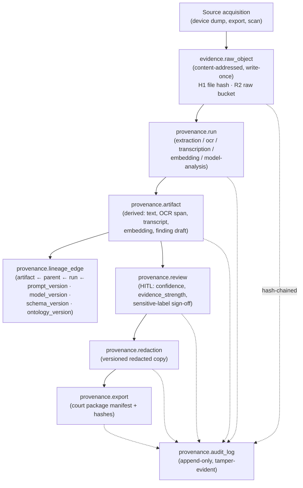
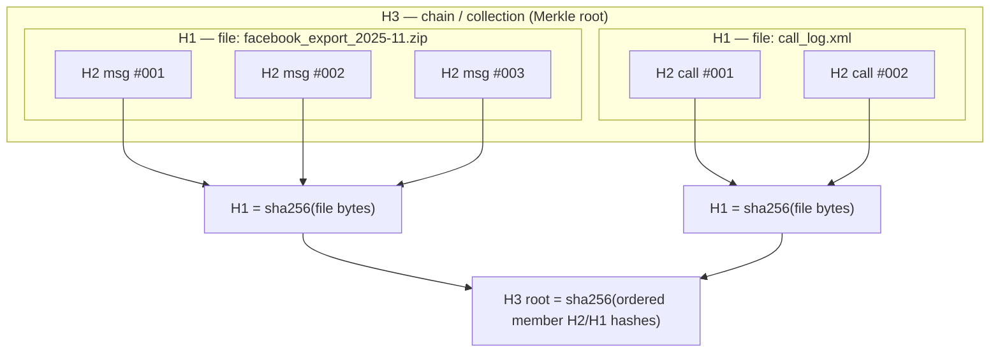

## Provenance & Chain-of-Custody Model

> _Byline: Claude Code · Opus 4.8 (1M) · 2026-06-30_
> Implements master-prompt §11 (Provenance & Chain-of-Custody) and §10 (Provenance, Confidence, and Review). Grounded in CONTEXT_PACK locked stack (ADR-0013 PG18 `uuidv7()`, ADR-0007/0030 R2/pg_duckdb, ADR-0014/0018/0031 Graphiti bitemporal, ADR-0024 SurrealDB sink) and the salem_v3 / TraceIQ V4.1 / `DuckDbVault/duckdb.ts` SHA-256+UUIDv7 custody backbone adopted in the crosswalk.

This section defines how every byte of source evidence and every object derived from it is identified, tracked, hashed, reviewed, redacted, and exported **without ever altering or losing an original**. It is the backbone that makes a court-facing export defensible: from any final sentence in a narrative we can walk a chain of typed, append-only records back to the exact source file, its hash, the processing run that touched it, the prompt/model version that interpreted it, and the human who approved it.

### 0. Plain-language summary (for the non-developer)

Think of the system as an **evidence locker with a logbook that can never be erased**.

- Every file that comes in (a chat export, a screenshot, a call log, a PDF) is photographed, weighed, and fingerprinted the moment it arrives, then sealed. Nothing ever writes back over that sealed copy.
- Everything we *make* from that file — text pulled out of a screenshot, a transcription of a voicemail, an AI summary, a redacted copy for the other side — is a **separate** item in the locker, tagged with a pointer back to exactly what it came from and how it was made.
- The logbook (audit log) records *who/what/when/why* for every action, and it is **append-only**: corrections are added as new lines, never by scribbling out an old line.
- Sensitive interpretations ("this looks like coercive control") are kept in a separate, clearly-labelled drawer marked *hypothesis* and cannot move to the *fact* drawer or into a court export until a human reviewer signs off.

The rest of this section is the technical specification of that locker and logbook.

### 1. Design principles (non-negotiable)

| # | Principle | Mechanism |
|---|---|---|
| P1 | **Originals are immutable.** | Raw objects are content-addressed, write-once; R2 object-lock + DB `CHECK`/trigger forbidding `UPDATE`/`DELETE` on `evidence.raw_object`. |
| P2 | **Everything derived is a first-class, separately-stored object.** | `provenance.artifact` rows + their own R2/DB storage; never an in-place mutation of a parent. |
| P3 | **Lineage is total and queryable.** | `provenance.lineage_edge` DAG links every artifact to its parent(s), the run that produced it, and the prompt/model/schema/ontology versions in force. |
| P4 | **Append-only history; never overwrite an interpretation.** | All mutable-looking tables are versioned (supersession chains) or event-sourced; audit log is insert-only and hash-chained. |
| P5 | **sha256 = identity; md5 = pre-filter only.** | sha256 is the canonical evidence identity and custody hash; md5 is computed only to cheaply dedupe/cross-reference (e.g. against the CaseBible R2 catalog) and is **never** used as proof of integrity. |
| P6 | **Classify, never conflate.** | Every artifact carries `assertion_type` ∈ {raw_evidence, extracted_fact, inferred_fact, analytical_finding, legal_conclusion} and `confidence`/`evidence_strength`/`timestamp_certainty`. |
| P7 | **HITL gates sensitive promotion & export.** | `provenance.review` records + `court_readiness` status; sensitive labels and exports blocked until reviewed (routed through agno-gateway `review-gatekeeper`). |
| P8 | **Provenance survives the model.** | Sensitive evidence content is processed by local ≤4B / on-prem paths where required (CONTEXT_PACK §3); cloud LLM (Ollama `glm-5.1`) runs are themselves logged as provenance with their inputs hashed, so any cloud exposure is itself auditable. |

### 1.1 Naming reconciliation with the canonical data model (§3)

This section is the **deep-dive on the provenance & custody *mechanism***; the canonical-data-model section (03) already declares the namespaced tables. They describe **one** design — the mapping below keeps the package internally consistent. Where this section writes `evidence.raw_object` for readability, it is the **same logical object** as §3's `custody.source`; the recursive file→page→frame→screenshot→OCR→message→event decomposition (MP 1566) lives in `custody.file_node`; the append-only custody-action log is `custody.custody_event`.

| This section (§9) | Canonical model (§3) | Role |
|---|---|---|
| `evidence.raw_object` | `custody.source` (+ `custody.file_node` for the parent-child tree) | sealed write-once original + decomposition |
| `provenance.custody_hash` (H1/H2/H3) | per-node `sha256` on `custody.source`/`custody.file_node` + this hash ledger | tamper-evident hashing |
| `provenance.run` | the act behind `provenance.model_run` + extraction/ocr/asr runs | processing event |
| `provenance.artifact` / `lineage_edge` | the universal `provenance.provenance` record + derived rows' `provenance_id` | derivation graph |
| `provenance.review` | `provenance.review` | HITL decisions |
| `provenance.redaction` | `provenance.redaction_history` | redaction lineage |
| `provenance.export` | `provenance.export` | court-package history |
| `provenance.audit_log` | `provenance.audit_log` | append-only spine |

### 1.2 Coverage matrix — every master-prompt §11 (and §10) requirement

| MP requirement | Where satisfied |
|---|---|
| Raw evidence tracking (§11) + Source custody fields (MP 1545–1566) | §4, `evidence.raw_object`/`custody.source` (§4.3 status quintet) |
| Hashing (§11) | §3 (sha256 canonical, md5 pre-filter, H1/H2/H3) |
| Derived artifact tracking (§11) | §5, `provenance.artifact` + `lineage_edge` |
| Extraction / OCR / Transcription / Embedding / Model-analysis runs (§11) | §5.1 run taxonomy, `provenance.run` |
| Human review records (§11) + Human-review provenance (§10) | §7, `provenance.review` (HITL gate via review-gatekeeper) |
| Redaction records (§11) + Redaction history (§10) | §8, `provenance.redaction` |
| Export records (§11) + Export history / Court-readiness (§10) | §9, `provenance.export` + manifest |
| Audit logs (§11/§10) | §10, hash-chained `provenance.audit_log` |
| Avoid overwriting original evidence (§11) | §4.2 (write-once triggers, R2 object-lock, supersession) |
| Source/Extraction/Model/Prompt-version provenance (§10) | §5.2 envelope + §6.3 version registries + `lineage_edge` |
| Confidence / evidence-strength / contradiction / corroboration (§10) | §5–§7 (`confidence`/`evidence_strength`; `corroborates`/`contradicts` edges) — scoring detail in §13 *Confidence & Review* |
| Version history (§10) | §11 supersession chains |

### 2. The two-axis model: identity (custody) × lineage (derivation)

Two orthogonal structures carry all provenance:

1. **Custody axis (hashing & storage):** answers *"is this the exact thing it claims to be, and where does the unaltered original live?"* → §3–§4.
2. **Lineage axis (derivation graph):** answers *"what produced this, from what, with which model/prompt/schema, and who approved it?"* → §5–§7.



### 3. Hashing model — sha256 canonical, md5 pre-filter, 3-level custody

#### 3.1 Algorithm roles

| Hash | Role | Usage rule | Where stored |
|---|---|---|---|
| **sha256** | **Canonical identity + integrity** | The evidence's permanent identity. All custody assertions, dedupe-of-record, and integrity verification use sha256. Recomputed on read-back to detect drift. | `raw_object.sha256`, `artifact.sha256`, every custody/hash level |
| **md5** | **Pre-filter / cross-reference ONLY** | Cheap first-pass dedupe and matching against the existing CaseBible R2 catalog (which already stores per-object MD5; see `casebible-catalog`). **Never** cited as proof of integrity or identity in any export. | `raw_object.md5_prefilter` (nullable) |
| blake3 (optional, future) | fast streaming verification of large media | additive column `sha256` stays canonical; needs an ADR before becoming load-bearing | reserved |

> **Why this split:** md5 is collision-broken and unfit for custody, but it is fast and is the join key we already have against the CaseBible corpus, so it earns its keep purely as a "have we likely seen this before?" pre-filter. The moment a decision matters (identity, integrity, export), sha256 is authoritative.

#### 3.2 Three-level custody hashing (H1 / H2 / H3)

Per project memory and the `DuckDbVault/duckdb.ts` adopted backbone, custody is hashed at three nested granularities so integrity can be proven at the file level, the individual-record level, and the whole-collection level independently.

| Level | Name | Scope | Definition | Purpose |
|---|---|---|---|---|
| **H1** | **File hash** | one ingested file/blob | sha256 of the exact raw bytes as received (the sealed original) | Proves the stored original is byte-identical to what was acquired. Content-address / dedupe key. |
| **H2** | **Message / record hash** | one logical unit *inside* a file (a single chat message, a call-log row, one screenshot region, one timeline event) | sha256 over the **canonicalized** record payload (stable field ordering + normalized encoding), with its parent H1 and source byte-span/offset folded in | Proves an individual extracted record was not altered and binds it to its exact position in the original. Survives re-export of the parent. |
| **H3** | **Chain / collection hash** | an ordered set (a full conversation thread, a device's timeline, an export package) | A **Merkle-style** root: H3 = sha256 over the ordered list of member H2s (and nested H3s), so any change to any member changes the root | Proves a *collection* is complete and unaltered (no message inserted, deleted, or reordered). This is the chain in "chain of custody." |



**Canonicalization rule (critical for H2/H3 reproducibility):** H2 is computed over a deterministic serialization (e.g. canonical JSON: sorted keys, UTF-8 NFC, fixed timestamp serialization to the `_raw`/`_utc`/`offset` triple, no whitespace). The canonicalization recipe is itself version-stamped (`hash_canon_version`) so a hash can always be reproduced and disputes about "you computed it differently" are resolved by replaying the named recipe. H1 is over **raw bytes** and needs no canonicalization.

#### 3.3 Verification cadence

- **On ingest:** compute H1 (sha256 + md5 pre-filter), then H2 for each parsed record, then H3 for each collection; store all.
- **On read-back / before any run consumes an object:** recompute sha256 and assert `== stored`; mismatch → quarantine + `audit_log` integrity-violation event, run aborts.
- **On export:** recompute H1/H2/H3 for every included object and embed them in the export manifest (§9). The manifest itself is hashed and signed.
- **Scheduled sweep:** periodic background job re-hashes a rolling sample of R2 raw objects to detect silent storage corruption (bit-rot), logging results.

### 4. Raw evidence tracking & the "never overwrite originals" guarantee

#### 4.1 raw(R2) vs D:/Backup provenance rule

There are two physical homes for an original, and the rule about which is authoritative is itself recorded provenance:

| Tier | Location | Role | Authority |
|---|---|---|---|
| **raw (R2)** | Cloudflare R2 `casebible-raw` / `nexus` (ADR-0007/0030), **object-lock / immutable** | The **canonical, version-of-record original** once ingested. Reads via pg_duckdb account-wide S3 secret; file ingest via rclone mount. | **Authoritative.** All custody assertions reference the R2 object. |
| **backup** | `D:/Backup`, `D:/casebible` (local scaffold/cold copy) | Local working/cold-storage copy and pre-ingest staging. Per project memory, local D: is **scaffold only**; the R2 sorted/raw bucket is canonical. | **Corroborating only.** Used to re-seed R2 or verify, never cited as the original-of-record. |

`raw_object.provenance_tier` records whether a given stored original is the R2 canonical copy or a `D:/Backup` corroborating copy, and `raw_object.acquisition_source` records the true upstream origin (device dump, OneDrive/GDrive pull, manual scan). When both exist, sha256 must match across tiers; a mismatch is an integrity event, and **R2 wins** unless a human review explicitly rules the local copy is the true original (recorded as a `review` decision).

#### 4.2 Source-custody fields (MP 1545–1566) carried on every original

Beyond hashes and storage tier, each `evidence.raw_object` / `custody.source` row carries the full custody descriptor required by MP 1545–1566. The four **status** columns are *lifecycle flags maintained by runs* (each transition is an audit event); they never mutate the bytes, only the row's processing state, and a `BEFORE UPDATE` exception is relaxed **only** for these whitelisted status columns (content/hash/storage columns stay write-once).

| Field | Column | Values / note |
|---|---|---|
| Source type | `source_type` | `device_dump \| chat_export \| screenshot \| call_log \| pdf \| media \| takeout \| social_export` |
| Custodian | `custodian` | who holds/controls the original (person or role) |
| Acquisition method | `acquisition_method` | `forensic_image \| manual_export \| cloud_pull \| photograph \| scan` |
| Device / account of origin | `origin_device_id` / `origin_account` | upstream provenance |
| Chain-of-custody status | `custody_status` | `collected \| sealed \| in_processing \| verified \| disputed \| released` (mirrors §3 `custody.source`) |
| Legal sensitivity | `legal_sensitivity` | `none \| privileged \| confidential \| in_camera` |
| Privacy sensitivity | `privacy_sensitivity` | `none \| pii \| minor \| sensitive_pii` (drives redaction need) |
| Extraction status | `extraction_status` | `pending \| running \| done \| failed \| n/a` |
| Processing status | `processing_status` | `pending \| enriched \| analyzed \| failed` |
| Review status | `review_status` | `not_reviewed \| in_review \| reviewed \| flagged` |
| Export status | `export_status` | `not_exported \| in_package \| exported \| withdrawn` |
| Original metadata | `original_metadata jsonb` | as-received (EXIF, headers, export manifest) — never edited |
| Derived metadata | `derived_metadata jsonb` | system-computed (mime sniff, page count) — clearly separated from original |

These status flags are **denormalized convenience state**; the *authoritative* history of each transition is the append-only `provenance.run` + `provenance.audit_log` (§10), so the flags can always be rebuilt from the log if they ever drift.

#### 4.3 How overwriting is structurally impossible

| Threat | Control |
|---|---|
| App code mutates a raw row | `evidence.raw_object` is write-once: a `BEFORE UPDATE OR DELETE` trigger raises an exception; only INSERT permitted. Role-level: app role has `INSERT, SELECT` only. |
| Re-ingest of the same file overwrites | Content-addressed by H1 sha256: re-ingest of identical bytes is a no-op de-dupe (links a new `acquisition` event to the existing object). |
| A "corrected"/re-exported version of source replaces the old | Treated as a **new** raw object with its own H1, linked to the prior via `supersedes_raw_id` + an `assertion`-typed note; both remain. Never an in-place edit. |
| Object-store overwrite/delete | R2 **object-lock (immutable retention)**; lifecycle policy forbids delete within retention; never-delete → move-to-`_stale` org rule applies. |
| Derived edits leak into source | Derived artifacts live in `provenance.artifact` with separate storage; there is **no FK path** by which a derived write can target a raw row. |
| Silent storage corruption | Scheduled re-hash sweep (§3.3) + on-read verification. |

> **Net guarantee:** the only legal operation against an original is *append a new, separately-identified object and link to it*. Originals are read-only for the life of the system.

### 5. Derived-artifact & run model

Every transformation is recorded as a **run** (the *act* of processing) that consumes input artifacts and produces output artifacts, with **lineage edges** binding outputs to inputs and to the exact versions of everything that shaped the result.

#### 5.1 Run taxonomy (master-prompt §11 bullets)

| `run_type` | Produces | Key recorded params (beyond common envelope) | Notes |
|---|---|---|---|
| `extraction` | parsed records (messages, call events, timeline events, social actions) | parser id + `parser.*_html` config version, export-vintage, selector fallback used | Parsers brittle → pin to export vintage (crosswalk). Output timestamps = approximate unless corroborated. |
| `ocr` | text spans from `evidence.image`/screenshots | OCR engine+version, language, DPI, confidence per span | OCR text = `extracted_fact`, linked to source image region (bbox) and parent H2. |
| `transcription` | text from audio/video (voicemail, call recording) | ASR model+version, diarization on/off, language, segment timestamps + confidence | Transcript segments are `extracted_fact`; speaker attribution is `inferred_fact` until reviewed. |
| `embedding` | vectors → Milvus (one collection per embedder) | embedder model+dims (text 2048-d nemotron / code 4096-d / CaseBible 1536-d codestral), normalization, chunker version | Vector rows carry back-pointer to source artifact + run id (ADR-0026/0027). |
| `model_analysis` | drafts: summaries, claim-vs-evidence checks, pattern labels, narrative drafts | LLM id (`glm-5.1` etc.), prompt_version, temperature/seed, tool-call trace, input-hash set | Output `assertion_type` ≥ `analytical_finding`; sensitive labels start as **hypothesis**, never auto-promoted (P7). Cloud exposure logged (P8). |
| `redaction` | redacted copies | redaction policy version, rule set, reviewer | See §8. |
| `export` | court packages | package spec, included-artifact set, manifest hash | See §9. |
| `ingest`/`acquisition` | raw objects | source, tier, hashing recipe version | See §4. |
| `review` (human) | review decisions | reviewer identity, decision, label sign-off | See §7. |

#### 5.2 Common run envelope (every run records)

`run_id (uuidv7)`, `run_type`, `status` (queued/running/succeeded/failed/superseded), `started_at`/`ended_at`, `actor` (service account or human), `code_version` (git SHA of the platform), `input_artifact_ids[]` + their sha256 at consume-time, `params` (jsonb), `prompt_version_id?`, `model_version_id?`, `schema_version`, `ontology_version`, `tool_call_trace` (jsonb, append-only), `cost/cloud_exposure_flag`. A failed or superseded run is **never deleted** — it stays as lineage (P4); a re-run produces new artifacts that *supersede* (not replace) the old via `lineage_edge`.

#### 5.3 Lineage DAG

```mermaid
flowchart LR
    R0[(raw_object H1)] -->|input| RX["run: extraction\nparser v / vintage"]
    RX -->|output| A1["artifact: message\nextracted_fact · H2"]
    A1 -->|input| RE["run: embedding\nnemotron 2048-d"]
    RE -->|output| V1["artifact: vector → Milvus"]
    A1 -->|input| RM["run: model_analysis\nglm-5.1 · prompt v12"]
    RM -->|output| F1["artifact: finding draft\nanalytical_finding · HYPOTHESIS"]
    F1 -->|input| HR["run: review (human)"]
    HR -->|decision| F2["finding: reviewed\nconfidence set · label approved"]
    F2 -->|input| RR["run: redaction policy v3"]
    RR -->|output| RD["artifact: redacted copy"]
    RD -->|input| EX["run: export"]
    EX -->|output| PKG["export package + manifest"]
    classDef hyp fill:#fde,stroke:#a33;
    class F1 hyp;
```



Each edge carries `(child_artifact_id, parent_artifact_id|raw_id, producing_run_id, role)` so the graph is fully traversable in both directions: *forward* (impact analysis: "if this source is excluded, what downstream findings/exports are affected?") and *backward* (court trace: "show me everything behind this sentence"). Lineage is mirrored into Graphiti (bitemporal substrate, ADR-0014/0018/0031) for valid-time/knowledge-time reasoning and disclosure-tier multi-pass, while the SQL tables remain the authoritative store.

### 6. Schema (PostgreSQL 18, `agno-postgres:18-duckdb`)

DDL is implementation-grade and uses native `uuidv7()` (ADR-0013), `pgcrypto`, and append-only constraints. `provenance` is its own schema; it references `evidence.*` and `analysis.*` from the other sections.

```sql
CREATE SCHEMA IF NOT EXISTS provenance;

-- ── 6.1 Raw originals (write-once) ─────────────────────────────────────────
CREATE TABLE evidence.raw_object (
    raw_id            uuid PRIMARY KEY DEFAULT uuidv7(),
    sha256            bytea NOT NULL,                 -- H1 canonical identity
    md5_prefilter     bytea,                          -- pre-filter / CaseBible join ONLY
    byte_size         bigint NOT NULL,
    mime_type         text,
    original_filename text,
    -- storage / custody location
    r2_bucket         text,                           -- e.g. casebible-raw
    r2_key            text,                           -- content-addressed key
    provenance_tier   text NOT NULL                   -- 'r2_canonical' | 'backup_corroborating'
                      CHECK (provenance_tier IN ('r2_canonical','backup_corroborating')),
    local_path        text,                           -- D:/Backup corroborating copy, if any
    acquisition_source text NOT NULL,                 -- device dump | onedrive | gdrive | scan | ...
    acquired_at_raw   text,                           -- as-reported
    acquired_at_utc   timestamptz,                    -- normalized
    acquired_tz_offset text,                          -- timestamp-certainty triple
    hash_canon_version text NOT NULL,                 -- canonicalization recipe id
    supersedes_raw_id uuid REFERENCES evidence.raw_object(raw_id),  -- corrected re-export lineage
    ingested_at       timestamptz NOT NULL DEFAULT now(),
    UNIQUE (sha256)                                   -- content-addressed dedupe
);
-- write-once enforcement
CREATE OR REPLACE FUNCTION provenance.forbid_mutation() RETURNS trigger
  LANGUAGE plpgsql AS $$ BEGIN
    RAISE EXCEPTION 'Originals/append-only rows are immutable (P1/P4): % on %', TG_OP, TG_TABLE_NAME;
  END $$;
CREATE TRIGGER raw_object_immutable BEFORE UPDATE OR DELETE ON evidence.raw_object
  FOR EACH ROW EXECUTE FUNCTION provenance.forbid_mutation();

-- ── 6.2 Custody hashes (H1/H2/H3) ──────────────────────────────────────────
CREATE TABLE provenance.custody_hash (
    hash_id        uuid PRIMARY KEY DEFAULT uuidv7(),
    level          text NOT NULL CHECK (level IN ('H1','H2','H3')),
    sha256         bytea NOT NULL,
    -- subject pointers (exactly one of raw_id / artifact_id; collections via member_set)
    raw_id         uuid REFERENCES evidence.raw_object(raw_id),
    artifact_id    uuid,                              -- FK added after artifact table
    record_locator jsonb,                             -- H2: source byte-span / bbox / offset
    member_hash_ids uuid[],                           -- H3: ordered member H1/H2 ids (Merkle input)
    canon_version  text NOT NULL,
    computed_at    timestamptz NOT NULL DEFAULT now(),
    computed_by_run uuid
);
CREATE TRIGGER custody_hash_immutable BEFORE UPDATE OR DELETE ON provenance.custody_hash
  FOR EACH ROW EXECUTE FUNCTION provenance.forbid_mutation();
CREATE INDEX ON provenance.custody_hash (sha256);
CREATE INDEX ON provenance.custody_hash (level, raw_id);

-- ── 6.3 Version registries (prompt / model / schema / ontology) ────────────
CREATE TABLE provenance.prompt_version (
    prompt_version_id uuid PRIMARY KEY DEFAULT uuidv7(),
    name text NOT NULL, version text NOT NULL,
    body_sha256 bytea NOT NULL, body text NOT NULL,
    created_at timestamptz NOT NULL DEFAULT now(),
    UNIQUE (name, version));
CREATE TABLE provenance.model_version (
    model_version_id uuid PRIMARY KEY DEFAULT uuidv7(),
    provider text, model_id text NOT NULL,           -- glm-5.1, nemotron-embed, nv-embedcode, codestral
    role text NOT NULL,                              -- llm | embedder | reranker | ocr | asr
    dims int, params jsonb, created_at timestamptz NOT NULL DEFAULT now(),
    UNIQUE (model_id, role, version));
-- schema_version / ontology_version registries analogous (salem_v3 graph seed version, MCL ttl version)

-- ── 6.4 Runs ───────────────────────────────────────────────────────────────
CREATE TABLE provenance.run (
    run_id          uuid PRIMARY KEY DEFAULT uuidv7(),
    run_type        text NOT NULL CHECK (run_type IN
        ('acquisition','extraction','ocr','transcription','embedding',
         'model_analysis','redaction','export','review')),
    status          text NOT NULL DEFAULT 'queued',
    actor           text NOT NULL,                    -- service account or person id
    code_version    text,                             -- platform git SHA
    prompt_version_id uuid REFERENCES provenance.prompt_version(prompt_version_id),
    model_version_id  uuid REFERENCES provenance.model_version(model_version_id),
    schema_version  text, ontology_version text,
    params          jsonb,
    input_digest    jsonb,                            -- [{artifact_id, sha256_at_consume}]
    tool_call_trace jsonb,                            -- append-only model tool calls / outputs
    cloud_exposure  boolean NOT NULL DEFAULT false,   -- P8: did inputs leave on-prem?
    supersedes_run  uuid REFERENCES provenance.run(run_id),
    started_at timestamptz, ended_at timestamptz,
    created_at timestamptz NOT NULL DEFAULT now());

-- ── 6.5 Derived artifacts ──────────────────────────────────────────────────
CREATE TABLE provenance.artifact (
    artifact_id     uuid PRIMARY KEY DEFAULT uuidv7(),
    artifact_kind   text NOT NULL,                    -- message|ocr_span|transcript_seg|vector|
                                                      -- summary|finding|narrative_draft|redacted|export_pkg|index
    sha256          bytea NOT NULL,                   -- artifact content hash
    storage_uri     text,                             -- R2/db pointer to artifact bytes
    producing_run   uuid NOT NULL REFERENCES provenance.run(run_id),
    assertion_type  text NOT NULL CHECK (assertion_type IN
        ('raw_evidence','extracted_fact','inferred_fact','analytical_finding','legal_conclusion')),
    confidence      numeric(4,3),                     -- 0..1, NULL until set by run/review
    evidence_strength text,                           -- weak|moderate|strong (re-derivable, no hardcoded 0.6)
    timestamp_certainty text CHECK (timestamp_certainty IN
        ('exact','approximate','inferred','uncertain')),
    is_sensitive    boolean NOT NULL DEFAULT false,   -- requires_in_camera_review / sensitive label
    lifecycle       text NOT NULL DEFAULT 'active',   -- active | superseded | archived(_stale)
    archive_reason  text,                             -- required if archived (no silent discard)
    created_at      timestamptz NOT NULL DEFAULT now());
ALTER TABLE provenance.custody_hash
  ADD CONSTRAINT custody_hash_artifact_fk FOREIGN KEY (artifact_id)
  REFERENCES provenance.artifact(artifact_id);

-- ── 6.6 Lineage DAG ─────────────────────────────────────────────────────────
CREATE TABLE provenance.lineage_edge (
    edge_id        uuid PRIMARY KEY DEFAULT uuidv7(),
    child_artifact uuid NOT NULL REFERENCES provenance.artifact(artifact_id),
    parent_artifact uuid REFERENCES provenance.artifact(artifact_id),
    parent_raw     uuid REFERENCES evidence.raw_object(raw_id),
    producing_run  uuid NOT NULL REFERENCES provenance.run(run_id),
    role           text NOT NULL,                     -- derived_from | supersedes | corroborates | contradicts
    created_at timestamptz NOT NULL DEFAULT now(),
    CHECK (parent_artifact IS NOT NULL OR parent_raw IS NOT NULL));
CREATE INDEX ON provenance.lineage_edge (child_artifact);
CREATE INDEX ON provenance.lineage_edge (parent_artifact);
CREATE TRIGGER lineage_immutable BEFORE UPDATE OR DELETE ON provenance.lineage_edge
  FOR EACH ROW EXECUTE FUNCTION provenance.forbid_mutation();
```

> `contradicts`/`corroborates` lineage roles directly back the master-prompt §10 contradiction/corroboration tracking and the salem_v3 `CONTRADICTS` impeachment primitive (HITL) — modeled as evidence-linked edges, never as auto-promoted fact.

### 7. Human-review records (HITL)

Reviews are runs (`run_type='review'`) that emit immutable decision records. No artifact may change `assertion_type` toward `legal_conclusion`, gain a sensitive label, or enter an export without a passing review.

```sql
CREATE TABLE provenance.review (
    review_id      uuid PRIMARY KEY DEFAULT uuidv7(),
    review_run     uuid NOT NULL REFERENCES provenance.run(run_id),
    artifact_id    uuid NOT NULL REFERENCES provenance.artifact(artifact_id),
    reviewer       text NOT NULL,                     -- human identity (never a model)
    decision       text NOT NULL CHECK (decision IN
        ('approved','rejected','needs_changes','escalated','hold')),
    -- scored at review time (master-prompt §10)
    set_confidence numeric(4,3),
    set_evidence_strength text,
    sensitive_label_decision jsonb,                   -- {label: gaslighting|coercive_control|...,
                                                      --  status: approved|denied|insufficient_evidence}
    court_readiness text NOT NULL DEFAULT 'not_reviewed' CHECK (court_readiness IN
        ('not_reviewed','draft','needs_corroboration','review_passed',
         'court_ready','excluded','strategically_sensitive')),
    requires_corroboration boolean NOT NULL DEFAULT false,
    rationale      text,                              -- court-safe language; explanation != excuse
    reviewed_at    timestamptz NOT NULL DEFAULT now());
CREATE TRIGGER review_immutable BEFORE UPDATE OR DELETE ON provenance.review
  FOR EACH ROW EXECUTE FUNCTION provenance.forbid_mutation();
```

Review workflow is routed through the live **agno-gateway `review-gatekeeper`** agent (CONTEXT_PACK §3) which *enforces the gate* but cannot itself approve sensitive labels — only a human `reviewer` value is accepted. A later re-review is a **new** `review` row (append-only); the artifact's effective status is the latest review by `reviewed_at`, but every prior decision remains visible (P4: "preserve prior interpretations, never overwrite").

| `court_readiness` | Meaning | Gate effect |
|---|---|---|
| `not_reviewed` | freshly produced (often a hypothesis) | blocked from export |
| `draft` / `needs_corroboration` | usable internally; not court-facing | blocked from export |
| `review_passed` | human-approved factual content | exportable as factual summary |
| `court_ready` | approved for court-facing package | exportable |
| `strategically_sensitive` | true but dangerous without context | export only with explicit override + context note |
| `excluded` | deliberately withheld | never exported; reason recorded |

### 8. Redaction records (versioned, non-destructive)

Redaction **never** edits an artifact in place. A redaction run reads a source artifact and produces a **new** redacted artifact (its own sha256, its own H2), linked by `derived_from`. The mapping of what was hidden is stored so redactions are reversible by authorized review and auditable.

```sql
CREATE TABLE provenance.redaction (
    redaction_id    uuid PRIMARY KEY DEFAULT uuidv7(),
    redaction_run   uuid NOT NULL REFERENCES provenance.run(run_id),
    source_artifact uuid NOT NULL REFERENCES provenance.artifact(artifact_id),
    redacted_artifact uuid NOT NULL REFERENCES provenance.artifact(artifact_id),
    policy_version  text NOT NULL,                    -- redaction rule-set version
    redaction_map   jsonb NOT NULL,                   -- [{span/bbox, category: PII|minor|in_camera, reason}]
    reversible      boolean NOT NULL DEFAULT true,
    authorized_by   text NOT NULL,                    -- reviewer who approved the policy application
    created_at timestamptz NOT NULL DEFAULT now());
CREATE TRIGGER redaction_immutable BEFORE UPDATE OR DELETE ON provenance.redaction
  FOR EACH ROW EXECUTE FUNCTION provenance.forbid_mutation();
```

The unredacted original remains the version-of-record; the redacted copy is what flows into exports. DB-layer PII/RLS/redaction at scale is flagged in CONTEXT_PACK §4 as a blind spot — this table is the provenance hook; the enforcement (row-level security, masked views) is specified in the access-control section.

### 9. Export records & court-package manifest

An export is a run that assembles an immutable package of (redacted) `court_ready`/`review_passed` artifacts plus a **manifest** that re-states every included object's H1/H2/H3 and the full lineage so a recipient (or court) can independently verify.

```sql
CREATE TABLE provenance.export (
    export_id      uuid PRIMARY KEY DEFAULT uuidv7(),
    export_run     uuid NOT NULL REFERENCES provenance.run(run_id),
    package_uri    text NOT NULL,                     -- R2 immutable package object
    manifest_sha256 bytea NOT NULL,                   -- hash of the manifest itself
    signature      bytea,                             -- detached signature over manifest (pgcrypto/ext key)
    included_artifacts uuid[] NOT NULL,
    purpose        text,                              -- disclosure | exhibit | client_review
    requested_by   text NOT NULL,
    approved_by    text NOT NULL,                     -- human approver (court-facing gate)
    created_at timestamptz NOT NULL DEFAULT now());
CREATE TRIGGER export_immutable BEFORE UPDATE OR DELETE ON provenance.export
  FOR EACH ROW EXECUTE FUNCTION provenance.forbid_mutation();
```

**Manifest contents (JSON, embedded in package + hashed):** for each included artifact — artifact_id, kind, sha256, H1/H2/H3 chain with `canon_version`, the full backward lineage (run ids + prompt/model/schema/ontology versions), `assertion_type`, final `confidence`/`evidence_strength`/`timestamp_certainty`, `court_readiness`, redaction policy version, and the approving reviewer(s). A verifier recomputes hashes from the package bytes and checks them against the manifest; the manifest hash + signature detect any tampering with the manifest itself. This re-derives the `vw_forensic_evidence_package` HIGH/MED/LOW transparently (crosswalk: no hard-coded 0.6 — strength is recomputed and shown).

### 10. Audit log (append-only, tamper-evident, hash-chained)

Every state-changing operation writes one audit row. The log is insert-only and **hash-chained**: each row includes the sha256 of the prior row, so any deletion or edit of history breaks the chain and is detectable.

```sql
CREATE TABLE provenance.audit_log (
    seq            bigint GENERATED ALWAYS AS IDENTITY PRIMARY KEY,
    event_time     timestamptz NOT NULL DEFAULT now(),
    actor          text NOT NULL,                     -- person or service account
    action         text NOT NULL,                     -- ingest|run_start|run_end|review|redact|export|
                                                      -- integrity_violation|supersede|archive|access
    object_type    text NOT NULL,
    object_id      uuid,
    detail         jsonb,                             -- before/after refs, input hashes, reason
    prev_row_sha256 bytea,                            -- hash of previous audit row (chain)
    row_sha256     bytea NOT NULL);                   -- sha256 of this row's canonical content
CREATE TRIGGER audit_immutable BEFORE UPDATE OR DELETE ON provenance.audit_log
  FOR EACH ROW EXECUTE FUNCTION provenance.forbid_mutation();
```

The audit log records, at minimum: ingestion of each raw object (with H1/tier/source), start/end of every run (with input hashes + cloud_exposure), every review decision and label sign-off, every redaction, every export (with manifest hash + approver), every access to sensitive/`in_camera` artifacts, and every integrity violation. Periodic checkpoints anchor the chain head's hash into Graphiti and/or a signed external note so the whole log is tamper-evident end-to-end. This satisfies master-prompt §10's audit-logs + version-history + redaction-history + export-history requirements as **one** append-only spine.

### 11. Versioning, supersession & "no silent discard"

| Requirement (MP §10/§11) | Mechanism |
|---|---|
| Version history | Every interpretation-bearing object is versioned via `supersedes_*` chains; latest-by-time is "current", all prior remain queryable. |
| Never overwrite an interpretation | No UPDATE on findings/reviews/lineage — corrections are new superseding rows (P4). |
| Persist intermediate work products | Drafts, indexes, classifications, prompt versions, tool-call traces, OCR spans are all `provenance.artifact` rows; nothing transient is dropped. |
| No discard unless intentionally archived with a reason | `artifact.lifecycle='archived'` requires `archive_reason`; physical files move to `_stale/` (never deleted) per org rule; archive is itself an audit event. |
| Hypothesis ≠ fact | `assertion_type` + `is_sensitive` keep model interpretations in the hypothesis lane until a `review` promotes them; promotion is logged. |
| Cross-session resume | The run/artifact/review state IS the resumable project memory; layered with `.remember` handoffs, MEMORY.md index, and Graphiti (MEMORY_ARCHITECTURE.md). SurrealDB analysis sink (ADR-0024, Phase D) will mirror bitemporal state. |

### 12. Worked end-to-end trace (illustrative)

1. A Facebook export `.zip` arrives → `acquisition` run → `raw_object` (H1 sha256, md5 pre-filter matched against CaseBible catalog → not previously seen → ingested to R2 `casebible-raw`, tier `r2_canonical`; `D:/Backup` copy noted as corroborating).
2. `extraction` run (parser `facebook_html` v, vintage 2025-11) → 412 `message` artifacts (`extracted_fact`, each with H2 bound to byte-span); thread H3 root computed.
3. `embedding` run (nemotron 2048-d) → vectors to Milvus, each lineage-linked.
4. `model_analysis` run (`glm-5.1`, prompt v12) drafts a finding: *"pattern consistent with love-bombing→devaluation cycle"* → `analytical_finding`, `is_sensitive=true`, **hypothesis**, `court_readiness='not_reviewed'`; cloud_exposure logged.
5. `review` run: human reviewer marks `needs_corroboration`, denies the "coercive control" label as `insufficient_evidence`, sets `confidence=0.4`. Recorded immutably; the draft is **not** promoted.
6. After corroborating messages are linked (`corroborates` edges), a re-review → `review_passed`, `evidence_strength='moderate'`, court-safe rewording.
7. `redaction` run (policy v3) produces a redacted copy hiding a minor's name.
8. `export` run assembles the redacted artifact into a disclosure package; manifest re-states H1/H2/H3 + lineage + reviewer; manifest hashed + signed. Every step is one audit-log row in the hash chain.

### 13. Needs-human-review / gaps flagged

- **DDL is schema-design, not as-deployed.** CONTEXT_PACK §4 flags live DDL as the highest unknown — this `provenance.*` schema must be reconciled against the actual deployed PG18 catalog before migration (verify `uuidv7()`, trigger privileges, R2 object-lock retention settings).
- **Signing key custody** for export manifests (§9) and audit checkpoint anchoring (§10) is unspecified here — needs an ADR (where the private key lives; HSM vs pgcrypto; rotation).
- **H2 canonicalization recipe** must be authored and version-pinned per source type (FB/Snapchat/call-log/XLSX); brittle parsers mean the recipe and parser-vintage pinning are coupled — owner sign-off needed on the canonical-JSON spec.
- **DB-layer PII/RLS enforcement** (the redaction *enforcement*, not the provenance hook) is a cross-section blind spot deferred to the access-control section.
