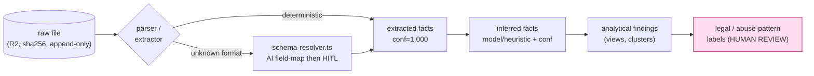
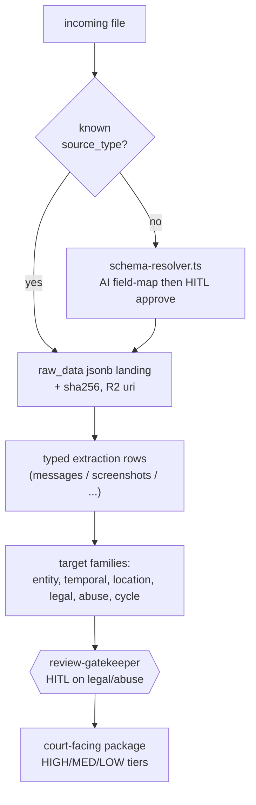

## Extraction Ontology per Source Type

> _Byline: Claude Code · Opus 4.8 (1M) · 2026-06-30_
>
> This section defines **what must be pulled out of each kind of evidence**, how confident the system is allowed to be about each pulled-out fact, and how every extracted value traces back to the original file. It is **not a blank slate**: it adopts and extends the user's prior schemas — TraceIQ V4.1 (`messages`, `screenshots`, `people`, `timeline_event`, `geocode_resolution`), the **salem_v3** case knowledge graph (`Person`/`Incident`/`Location`/`Statement`/`Evidence` + typed edges), the **Semantica** provenance/conflict pipeline (PROV-O, `source_hash`), and the salvaged abuse-pattern corpus (`detection_patterns.py` 256-pattern / DARVO, `behavioral_patterns.ttl`, `positive_behaviors.ttl`, `mcl_722_23.ttl`). Crosswalk authority: A3 + the gap report; stack authority: ADR-0013/0027/0014/0024/0030/0032 (see Context Pack §2). On any conflict the SSOT docs win.

---

### 1. How to read this section (the five-lane rule)

Every value the system records about a piece of evidence is stamped with a **lane** so that, at court time, no one can confuse a machine guess for a fact. The lanes (verbatim from the cross-cutting guardrails, Context Pack §6) are:

| Lane | Meaning | Example | Who may write it |
|---|---|---|---|
| **`raw`** | The byte-exact original, never altered | the `.html` iMessage export, the JPEG, the `.mp4` | ingestion only (append-only) |
| **`extracted`** | Deterministically read out of the raw file | OCR text, EXIF GPS, a parsed `<message>` row, an ASR transcript | parsers / OCR / ASR |
| **`inferred`** | Computed/guessed by a model or heuristic | "overnight stay", "home base", sentiment, sender-of-unknown-number | analysis agents |
| **`analytical`** | A view/finding built from many records | a timeline cluster, a contradiction set, a pattern hit | analysis agents (HITL) |
| **`legal`** | A relevance / abuse-pattern / MCL conclusion | "supports MCL 722.23(b)", "coercive-control candidate" | **human-reviewed only** |

The lane is a **mandatory column on every extracted object** (`evidence_lane ENUM`). The same physical file can produce rows in several lanes; they are never merged. This realizes the "raw vs extracted vs inferred vs analytical vs legal-conclusion" discipline the Context Pack flags as missing from all prior schemas.

#### 1.1 Universal extraction envelope (shared by ALL source types)

Before the per-source tables, these fields are attached to **every** extracted record regardless of source. Per-source tables below list only the *additional* fields and do not repeat these.

| Field | Lane | Type | Required | Notes / prior art |
|---|---|---|---|---|
| `extract_id` | extracted | `uuid` (uuidv7) | ✅ | uuidv7 native (`agno-postgres:18-duckdb`, ADR-0013); time-ordered |
| `evidence_id` | raw | `uuid` FK→`evidence` | ✅ | central provenance anchor = salem_v3 `Evidence` node |
| `evidence_lane` | — | enum(`raw`,`extracted`,`inferred`,`analytical`,`legal`) | ✅ | the five-lane rule |
| `source_type` | — | enum (11 types below) | ✅ | dispatch key for parser/agent |
| `source_sha256` | raw | `char(64)` | ✅ | chain-of-custody hash (UUIDv7+SHA-256 contract, A3); = Semantica `source_hash` |
| `source_uri` | raw | `text` | ✅ | R2 key (`r2://casebible-sorted/...`) reached via pg_duckdb S3 secret (ADR-0030) |
| `ingested_at` | extracted | `timestamptz` | ✅ | knowledge-time (when WE learned it) |
| `extractor_name` | extracted | `text` | ✅ | e.g. `imessage-exporter-html@owner`, `enhanced-xml-chunker.py` |
| `extractor_version` | extracted | `text` | ✅ | artifact-lineage requirement (Constraints) |
| `ontology_version` | extracted | `text` | ✅ | which version of THIS ontology produced the row |
| `prompt_version` | inferred | `text` | ◻ | only when an LLM produced the field (lineage) |
| `model_id` | inferred | `text` | ◻ | e.g. local ≤4B extractor; never external for evidence (Context Pack §4) |
| `processing_run_id` | extracted | `uuid` FK→`processing_run` | ✅ | groups all outputs of one batch (re-run safety) |
| `confidence` | — | `numeric(4,3)` 0–1 | ✅* | required for every `inferred`/`analytical`/`legal` field; `1.000` for deterministic `extracted` |
| `confidence_method` | — | enum(`deterministic`,`model_score`,`heuristic`,`human`) | ✅ | how the number was set |
| `review_status` | — | enum(`unreviewed`,`accepted`,`rejected`,`needs_corroboration`) | ✅ | HITL gate; default `unreviewed` |
| `reviewed_by` / `reviewed_at` | — | `text` / `timestamptz` | ◻ | populated on human review |
| `supersedes_id` | — | `uuid` self-FK | ◻ | append-only correction chain; never overwrite (Context Pack §6) |

`*` `confidence` is always present; for pure `extracted` deterministic reads it is `1.000` with `confidence_method='deterministic'`.

#### 1.2 Timestamp-precision class (mandated addition — missing from ALL prior schemas)

Every temporal value carries a **precision class** alongside the value, so "exact / approximate / inferred / uncertain" (Constraints) is queryable, not prose:

| `ts_precision` | Meaning | Typical source |
|---|---|---|
| `exact` | sub-second/second from the source | EXIF, message DB epoch, ASR frame |
| `approximate` | known to a window (±minutes/hours/day) | "morning", date-only court stamp |
| `inferred` | computed from other evidence | overnight inferred from last+first ping |
| `uncertain` | conflicting or unparseable | two timestamps disagree |

Stored as `(ts_value timestamptz, ts_precision enum, ts_tz_source enum, ts_raw text)` — `ts_raw` preserves the original literal string (TraceIQ stored timestamps as TEXT; we keep that verbatim and ADD the typed/precision pair, per A3).

#### 1.3 Six standard extraction *target* groups

For each source the prompt asks for five target families. We implement them as standard, cross-source target tables so the same entity/timeline/place is reused regardless of which source surfaced it:

| Target family | Resolves into | Prior art adopted |
|---|---|---|
| **Entity targets** | `people` ⇄ salem_v3 `Person` (MERGE), `org`, `device`, `account/handle`, `phone`, `child` | TraceIQ `people`; salem `Person` |
| **Temporal targets** | `timeline_event` (split raw vs enriched) + `ts_precision` | TraceIQ `timeline_event`; ADR-add precision |
| **Location targets** | `location_key` (dedup) + PostGIS `geometry`, `geocode_resolution` (dual-provider disagreement) | TraceIQ `geocode_resolution`/`geocode_audit` |
| **Legal-relevance targets** | `mcl_factor_link` → `mcl_722_23.ttl` (12 factors A–L), `relevance_tag` | `mcl_722_23.ttl`, mcl-factor-mapper skill |
| **Abuse-pattern targets** | `pattern_candidate` → `detection_patterns.py` (256, DARVO), `behavioral_patterns.ttl` | detection_patterns.py, seed-patterns ~303 |
| **Relational-cycle targets** (added) | `cycle_phase` (positive/neutral/love-bomb/repair/escalation), `surface_tone`, `inferred_intent`, `relational_function` | `positive_behaviors.ttl`; Constraints (model BOTH parties + full cycle) |

The **relational-cycle** family is a first-class extraction target (not optional decoration) because the Constraints forbid one-sided sentiment modeling and require positive/neutral/love-bombing phases and BOTH parties' conduct, including the user's own reactions, to be modeled in temporal context. **Sentiment is decomposed into four separate stored fields** — `surface_tone`, `inferred_intent`, `relational_function`, `cycle_phase` — never collapsed into one "abusive/not" score.

> **Universal HITL gate:** any value in the **Legal** or **Abuse-pattern** families, and any sensitive label (`gaslighting`, `coercive_control`, `alienation`, `weaponization`, `reactive_abuse`), is written as a *candidate* with `review_status='unreviewed'` and is **blocked from court-facing export** until a human sets `accepted`. This is enforced by the review-gatekeeper agent (Context Pack §4), not by convention.

---

### 2. Per-source extraction ontology

Each subsection lists: **Required extracted fields**, **Optional extracted fields**, **Confidence fields**, **Provenance fields** (beyond the universal envelope), and the five/six **target families**. Owner-custom formats and known GAPS are flagged inline with a ⚠ marker.

---

#### 2.1 Messages (SMS / MMS / iMessage / Google Voice / Facebook / Snapchat / **call logs**)

Adopts TraceIQ V4.1 `messages` (link to `timeline_event`; `is_private`→review gate) + Milvus body embeddings + `social_action`. Parser corpus: `enhanced-xml-chunker.py` (SMS-vs-calls detection, blocked-call type 5/6, base64 images), `sms_backup_parser`, GVoice / pdf-imessage / facebook(TS) parsers, and ⚠ the **owner-custom `imessage-exporter` HTML format**.

| Class | Field | Lane | Type | Notes |
|---|---|---|---|---|
| **Required** | `thread_key`, `direction`(in/out), `sender_handle`, `recipient_handles[]`, `body_text`, `sent_ts`(+`ts_precision`), `platform`, `is_private` | extracted | — | `is_private` triggers review gate (TraceIQ) |
| **Required** | `message_kind` enum(`sms`,`mms`,`imessage`,`gvoice`,`fb`,`snap`,`call`,`blocked_call`) | extracted | enum | **call-logs are a first-class kind** (gap closed) |
| **Optional** | `subject`, `attachment_refs[]`(→Photos/Video rows), `reaction/tapback`, `edited_flag`, `read_ts`, `delivered_ts`, `group_title`, `call_duration_s`, `call_result`(answered/missed/blocked) | extracted | — | call fields apply to `call`/`blocked_call` |
| **Optional** | `body_embedding_ref` | inferred | Milvus id | one collection/embedder (ADR-0027); body stored raw, embedded for recall |
| **Confidence** | `sender_resolution_conf`, `thread_merge_conf`, `ocr_conf`(image-of-text), `lang_detect_conf` | inferred | 0–1 | unknown-number→person is inferred, never asserted |
| **Provenance** | `raw_record_json` (verbatim source row), `platform_hop_chain` (e.g. GV→SMS), `source_line_no`, `export_tool` | extracted | jsonb | `normalized_messages` raw-JSON landing (see §3) |
| **Entity** | sender/recipient → `people`/`Person` (MERGE); phone/handle/account; device | | | salem `Person` MERGE |
| **Temporal** | `sent/read/delivered` → `timeline_event`; gaps/bursts | | | link to timeline (TraceIQ) |
| **Location** | inline shared-location, "I'm at…" mentions → `location_key` (inferred, low conf) | | | |
| **Legal** | per-message `relevance_tag`, `mcl_factor_link` candidate | legal | | HITL |
| **Abuse-pattern** | `pattern_candidate` (DARVO, threats, monitoring, contact-flooding) + `cycle_phase`/`surface_tone`/`inferred_intent`/`relational_function` | inferred→legal | | model BOTH parties incl. user's own messages |

⚠ **GAP — owner-custom imessage-exporter HTML:** the user runs `imessage-exporter` (ReagentX) into a **custom HTML layout**, not the stock txt/HTML. There is **no parser in `extracted-code/` for this exact layout**. Needs: a dedicated `imessage-exporter-html@owner` extractor (DOM selector map, like the Chunker HTML configs but for this template) producing the rows above. Tapbacks/edits/attachments/threading must be recovered from the HTML structure. **needs-human-review: confirm the exact HTML template + sample file before building selectors.**

⚠ **GAP — Snapchat:** A3 only has the brittle HTML-selector Chunker config; the real source parser (`dial-stack/utilities/parsers/snapchat/`, 112 MB w/ exe) was skipped in salvage. Plan must ingest **Snapchat JSON** natively, not via CSS scraping.

⚠ **GAP — call logs / blocked calls:** absent from the prior `messages` model; recovered via `enhanced-xml-chunker.py` (type 5/6 blocked-call indicators). Now modeled as `message_kind in (call, blocked_call)`.

---

#### 2.2 AI chat transcripts (ChatGPT / Claude / Gemini exports, incl. ⚠ owner transcript-CSV)

Adopts the `chat-export` parser (ChatGPT/Claude JSONL). These are the user's own prior AI-analysis sessions and drafts — **intermediate work products that must be preserved, not discarded** (Constraints), and kept in the `inferred`/`analytical` lanes, never promoted to evidence facts.

| Class | Field | Lane | Type | Notes |
|---|---|---|---|---|
| **Required** | `conversation_id`, `turn_index`, `role`(user/assistant/system/tool), `content_text`, `turn_ts`(+precision), `assistant_model`, `export_tool` | extracted | — | JSONL/CSV rows |
| **Required** | `is_about_case` flag | inferred | bool | separates case-analysis sessions from unrelated chats |
| **Optional** | `tool_call_json`, `tool_result_ref`, `attachment_refs[]`, `system_prompt_text`, `token_usage` | extracted | jsonb | tool-call outputs preserved (Constraints) |
| **Optional** | `claims_extracted[]` (assertions the AI made about the case) | inferred | | each must be re-grounded before use |
| **Confidence** | `claim_grounding_conf`, `case_relevance_conf` | inferred | 0–1 | AI assertions are hypotheses, not facts |
| **Provenance** | `source_export_format`(jsonl/csv/html), `originating_model`, `originating_prompt_version`, `session_export_ts` | extracted | | artifact lineage to prompt/ontology version |
| **Entity** | people/orgs the AI named → linked **as mentions only** (low conf) | inferred | | never auto-MERGE into `Person` from AI text |
| **Temporal** | turn timestamps; any case dates the AI cited → candidate `timeline_event` (unreviewed) | inferred | | |
| **Location** | places the AI mentioned → candidate only | inferred | | |
| **Legal** | prior AI legal-relevance guesses → `relevance_tag` candidate, flagged `ai_generated` | analytical | | **never court-facing without human re-derivation** |
| **Abuse-pattern** | prior AI pattern labels → `pattern_candidate` with `origin='prior_ai'` | analytical | | quarantined from canonical until reviewed |

⚠ **GAP — transcript-CSV:** the owner has AI transcripts exported as **CSV** (column layout TBD), distinct from the JSONL the `chat-export` parser handles. Needs a `transcript-csv@owner` extractor; **route unknown column layouts through `schema-resolver.ts` (AI field-mapping) → HITL confirm** before trusting the mapping (per §3). **needs-human-review: confirm CSV column headers.**

> **Hard rule for this source:** nothing extracted from an AI transcript may enter the `raw`/`extracted` evidence lanes or be promoted to a fact. It lands in `inferred`/`analytical` with `origin='prior_ai'` and must be independently re-grounded against primary evidence (Constraints: "never silently promote a hypothesis into a fact").

---

#### 2.3 Screenshots (image-of-text: chats, call screens, social posts, financial)

Adopts TraceIQ `screenshots` (OCR = `extracted`) + `social_action`. OCR pipeline is a known open parser item.

| Class | Field | Lane | Type | Notes |
|---|---|---|---|---|
| **Required** | `ocr_text`, `ocr_blocks[]`(bbox+text), `image_sha256`, `capture_ts`(+precision), `pixel_w/h` | extracted | — | OCR text is `extracted`, conf<1 |
| **Required** | `depicts_kind` enum(`chat`,`call`,`social_post`,`email`,`doc`,`financial`,`map`,`other`) | inferred | enum | classifier |
| **Optional** | `status_bar_clock`, `status_bar_date`, `app_chrome_detected`(which app), `sender_name_in_ui`, `redaction_regions[]` | inferred | | clock-in-screenshot = independent temporal signal |
| **Optional** | `reconstructed_messages[]` → emit as §2.1 message rows with `source='screenshot'` | inferred | | screenshot→message reconstruction (lower conf than native export) |
| **Confidence** | `ocr_conf`(per block), `depicts_kind_conf`, `clock_read_conf`, `ui_app_conf`, `authenticity_conf` | inferred | 0–1 | low-res/cropped → low authenticity_conf |
| **Provenance** | `exif_present`, `screenshot_software`, `crop/edit_detected_flag` | extracted | | possible-tampering signal → HITL |
| **Entity** | names/handles in OCR → `people` mentions (conf-gated) | inferred | | |
| **Temporal** | on-screen clock/date + file `capture_ts`; **flag disagreement** → `ts_precision='uncertain'` | inferred | | two clocks disagreeing is itself evidence |
| **Location** | map screenshots, location-share UI → `location_key` candidate | inferred | | |
| **Legal** | `relevance_tag`, `mcl_factor_link` candidate | legal | | HITL |
| **Abuse-pattern** | OCR'd threats/monitoring/DARVO → `pattern_candidate`; + cycle/tone fields | inferred→legal | | applies to both parties |

> **Authenticity note:** a screenshot is a *depiction* of other evidence, not the underlying record. `authenticity_conf` and `crop/edit_detected_flag` feed MRE-authentication (skill `mre-authentication`); reconstructed messages from screenshots are always lower-confidence than a native export of the same thread, and contradictions between the two are preserved (salem `CONTRADICTS` edge).

---

#### 2.4 Photos (camera-original images)

| Class | Field | Lane | Type | Notes |
|---|---|---|---|---|
| **Required** | `image_sha256`, `exif_datetime_original`(+precision), `pixel_w/h`, `mime` | extracted | — | EXIF = `exact` when present |
| **Optional** | `exif_gps_lat/lon`, `gps_precision_m`, `camera_make/model`, `lens`, `orientation`, `exif_tz_offset` | extracted | | EXIF GPS → location target |
| **Optional** | `scene_caption`, `objects[]`, `faces_detected_count`, `text_in_image`(incidental OCR), `nsfw/sensitive_flag` | inferred | | local vision ≤4B only (no external; Context Pack §4) |
| **Optional** | `depicts_persons[]`(face match candidate) | inferred | | **never auto-identify a child/person** without HITL |
| **Confidence** | `gps_conf`, `caption_conf`, `face_match_conf`, `datetime_source_conf` | inferred | 0–1 | EXIF-stripped → datetime_source_conf low |
| **Provenance** | `exif_present`, `edited_software`, `c2pa/xmp_present`, `derived_from_sha256`(if re-encoded) | extracted | | original vs re-export lineage |
| **Entity** | depicted persons (candidate) → `people` | inferred | | HITL before naming |
| **Temporal** | `exif_datetime_original`; if absent → `inferred` from filename/album/context | inferred | | precision degrades accordingly |
| **Location** | EXIF GPS → `location_key` + PostGIS point; reverse-geocode via `geocode_resolution` (dual-provider) | extracted→inferred | | adopt `disagreement_flag`/`tie_break_reason` |
| **Legal** | injury/condition-of-home/child-context relevance → `relevance_tag` | legal | | HITL; court-safe framing |
| **Abuse-pattern** | injury photos, damaged property → `pattern_candidate`(physical) | inferred→legal | | corroboration-required flag |

---

#### 2.5 Videos

| Class | Field | Lane | Type | Notes |
|---|---|---|---|---|
| **Required** | `video_sha256`, `duration_s`, `container/codec`, `frame_w/h`, `fps`, `created_ts`(+precision) | extracted | — | container metadata |
| **Required** | `has_audio` flag → spawns §2.6 Audio row for the track | extracted | bool | A/V split |
| **Optional** | `keyframes[]`(ts+sha+caption), `scene_segments[]`, `ocr_on_frames[]`, `gps_track`(if present), `creation_tz` | inferred | | sample frames, not every frame |
| **Optional** | `transcript_ref` → §2.6 ASR of the audio track | inferred | | |
| **Confidence** | `scene_caption_conf`, `keyframe_relevance_conf`, `datetime_source_conf` | inferred | 0–1 | |
| **Provenance** | `edited_software`, `derived_from_sha256`, `segment_offsets`(ms into source) | extracted | | every derived clip cites parent + offset |
| **Entity** | persons/voices (candidate) → `people` (HITL) | inferred | | cross-link to audio speaker |
| **Temporal** | container `created_ts` + per-segment offsets → `timeline_event` | inferred | | |
| **Location** | embedded GPS / recognizable scene → `location_key` (low conf for scene) | inferred | | |
| **Legal** | `relevance_tag`, segment-level `mcl_factor_link` | legal | | HITL |
| **Abuse-pattern** | depicted conduct → `pattern_candidate`; tone/cycle on spoken content | inferred→legal | | both parties; context window |

---

#### 2.6 Audio (voice memos, call recordings, video audio tracks)

ASR transcript = `extracted` (machine), but its *content interpretation* = `inferred`. Local ASR only (no external; evidence stays local).

| Class | Field | Lane | Type | Notes |
|---|---|---|---|---|
| **Required** | `audio_sha256`, `duration_s`, `codec`, `sample_rate`, `created_ts`(+precision) | extracted | — | |
| **Required** | `transcript_text`, `transcript_segments[]`(start_ms,end_ms,text,speaker_label) | extracted | jsonb | word/segment timings |
| **Optional** | `diarization[]`(speaker turns), `language`, `non_speech_events[]`(crying, raised voice, door) | inferred | | acoustic events as separate low-conf signals |
| **Optional** | `prosody_flags[]`(shouting/whisper) | inferred | | descriptive, NOT an emotion verdict |
| **Confidence** | `asr_conf`(per segment), `diarization_conf`, `speaker_id_conf`, `lang_conf` | inferred | 0–1 | |
| **Provenance** | `asr_engine`, `asr_model_version`, `segment_offsets`, `recording_device` | extracted | | re-runnable; versioned |
| **Entity** | speaker → `people`/`Person` (voice match = candidate, HITL) | inferred | | |
| **Temporal** | `created_ts` + per-segment offsets → `timeline_event` | inferred | | |
| **Location** | spoken place mentions; ambient cues → candidate only | inferred | | low conf |
| **Legal** | utterance-level `relevance_tag`, `mcl_factor_link`; ⚠ recording-consent context noted (not advised on) | legal | | HITL; avoid legal advice (Constraints) |
| **Abuse-pattern** | spoken threats/DARVO/coercion → `pattern_candidate`; surface_tone/inferred_intent/relational_function/cycle_phase separated | inferred→legal | | both parties; reactive-abuse handled in context |

---

#### 2.7 Security footage (CCTV / doorbell / dashcam — distinct from §2.5)

Modeled separately from generic video because of **continuous timelines, device clock drift, and motion-event segmentation**.

| Class | Field | Lane | Type | Notes |
|---|---|---|---|---|
| **Required** | `clip_sha256`, `device_id`, `device_clock_ts`(+precision), `duration_s`, `camera_location_label` | extracted | — | device clock ≠ true time → drift field |
| **Required** | `clock_drift_offset_s` | inferred | int | reconciles device clock vs reference; precision drops to `approximate` |
| **Optional** | `motion_events[]`(ts,bbox), `person_count`, `vehicle_events[]`, `continuous_window`(start,end), `fov_geometry` | inferred | | gaps in footage are themselves recorded |
| **Optional** | `entry_exit_events[]`(door open/close) | inferred | | maps to presence/absence at a place |
| **Confidence** | `motion_conf`, `person_detect_conf`, `clock_drift_conf`, `identity_conf` | inferred | 0–1 | identity almost always candidate-only |
| **Provenance** | `dvr_export_tool`, `camera_make/model`, `firmware`, `retention_gap_flag` | extracted | | chain-of-custody for device exports |
| **Entity** | detected persons/vehicles → candidates (HITL); device as `device` entity | inferred | | |
| **Temporal** | device clock + drift → `timeline_event`; **presence/absence windows** | inferred | | strong for who-was-where-when |
| **Location** | fixed camera → known `location_key` w/ PostGIS FOV polygon | extracted | | high-value location anchor |
| **Legal** | corroborates/contradicts other timeline claims → `CONTRADICTS`/`relevance_tag` | legal | | HITL |
| **Abuse-pattern** | depicted incidents → `pattern_candidate` | inferred→legal | | corroboration-strength high (objective camera) |

---

#### 2.8 GPS tracks (phone location history, Takeout, TraceIQ trips)

The richest, most-developed lane — adopts TraceIQ wholesale: raw `visits/activities/paths/trips`, `geocode_resolution` (dual-provider `disagreement_flag`/`tie_break_reason`), append-only `geocode_audit`, `location_key` dedup, and the **Google raw-export JSON shape preserved verbatim as the RAW EVIDENCE contract**.

| Class | Field | Lane | Type | Notes |
|---|---|---|---|---|
| **Required (raw)** | `raw_export_json` (verbatim Takeout/semantic-location), `point_ts`(+precision), `lat`,`lon`,`accuracy_m` | raw/extracted | — | Google JSON kept byte-exact |
| **Required (extracted)** | `visit`/`activity`/`path`/`trip` rows, `place_label`, `activity_type`(walk/drive/still) | extracted | — | adopt TraceIQ tables |
| **Optional (inferred)** | `overnight_stay`, `home_base`, `dwell_minutes`, `co_location`(with another track/person), `anomaly_flag`, `route_polyline` | inferred | | overnight/home_base = **inferred lane**, never asserted |
| **Confidence** | `accuracy_m`→`geo_conf`, `geocode_disagreement_flag`, `tie_break_reason`, `inference_conf`(overnight/home_base), `activity_conf` | inferred | 0–1 | dual-provider geocode disagreement is first-class |
| **Provenance** | `geocode_audit` (append-only: provider, query, response, ts), `provider_a/b`, `source_export_file`, `location_key` | extracted | | append-only audit (Constraints) |
| **Entity** | track owner → device/`Person` (which device = which person is itself reviewable) | inferred | | |
| **Temporal** | per-point ts + dwell windows → `timeline_event` (raw vs enriched split) | extracted→inferred | | core timeline feed |
| **Location** | `location_key` + PostGIS point/geometry; reverse-geocode via `geocode_resolution` | extracted→inferred | | PostGIS lives INSIDE the PG resource (ADR-0013) |
| **Legal** | proximity to child/exchange locations, custody-window presence → `mcl_factor_link` | legal | | HITL; court-safe |
| **Abuse-pattern** | following/surveillance/repeated-proximity → `pattern_candidate`(stalking-type) | inferred→legal | | high bar; corroboration-required; both parties |

> Inference discipline: `overnight_stay`, `home_base`, `co_location`, `anomaly_flag` are the canonical examples of the **`inferred` lane** and must never be rendered as established facts; each carries `inference_conf` and an explainable basis (which raw points produced it).

---

#### 2.9 Court documents (orders, motions, filings, transcripts, PDFs)

Adopts the salvaged **doc-intelligence tables** (`sections/chunks/spans/entities/findings/approvals`) and the iMessage-PDF/`pdf-imessage` + general PDF parsing path; `appellate-formatting`/`irac-formatter` skills available.

| Class | Field | Lane | Type | Notes |
|---|---|---|---|---|
| **Required** | `doc_type`(order/motion/transcript/exhibit/filing), `caption`, `court`, `case_no`, `file_date`(+precision), `pages`, `sections[]`, `chunks[]` | extracted | — | doc-intelligence model |
| **Required** | `text_layer`(or OCR if scanned), `is_scanned` flag | extracted | | OCR conf if scanned |
| **Optional** | `parties[]`, `judge`, `holdings/orders[]`, `deadlines[]`, `exhibit_refs[]`, `citations[]`, `signature_blocks[]` | inferred | | structured legal extraction |
| **Optional** | `findings[]`(doc-intelligence), `cross_refs[]`(to other evidence) | analytical | | |
| **Confidence** | `ocr_conf`, `field_extract_conf`, `party_resolution_conf`, `date_parse_conf` | inferred | 0–1 | |
| **Provenance** | `doc_sha256`, `page_span` per extracted span, `redaction_flag`, `filed_stamp_present` | extracted | | span-level traceability |
| **Entity** | parties/judge/attorneys → `people`/`org` (MERGE w/ salem `Person`) | inferred | | |
| **Temporal** | filing dates, hearing dates, ordered deadlines → `timeline_event` (mostly `approximate`/`exact`) | extracted | | |
| **Location** | court, addresses in filings → `location_key` | extracted | | |
| **Legal** | **highest-density legal lane**: orders/holdings → `relevance_tag`, `mcl_factor_link`; these are *quotations of legal facts*, not our conclusions | legal | | still HITL for our derived tags |
| **Abuse-pattern** | allegations *recorded in* filings → `pattern_candidate` with `origin='court_doc'`, **explicitly allegation≠fact** | analytical→legal | | preserve-as-hypothesis (salem `USED_TACTIC`) |

> Court docs are evidence of *what was filed/ordered*, which is factual, but allegations contained inside them remain allegations — recorded with `origin='court_doc'` and never auto-promoted (salem_v3 PRESERVE-AS-HYPOTHESIS rule).

---

#### 2.10 Notes (the user's own notes, journals, drafts, event drafts, classifications)

These are the user's **prior work products and case-specific labels** the Constraints explicitly require preserving "even when incomplete… classified by confidence, usefulness, and review status." They are first-person and inherently `inferred`/`analytical`, never `raw` evidence of an external fact.

| Class | Field | Lane | Type | Notes |
|---|---|---|---|---|
| **Required** | `note_text`, `authored_by`(=user), `authored_ts`(+precision), `note_kind`(journal/event-draft/label/todo/hypothesis) | extracted | — | |
| **Required** | `is_first_person_account` flag | extracted | bool | distinguishes user recollection from cited fact |
| **Optional** | `referenced_evidence[]`(links to `evidence`), `asserted_events[]`(→candidate `timeline_event`), `user_labels[]`(case-specific) | inferred | | preserve owner's own taxonomy |
| **Optional** | `emotional_content`, `accountability_items[]`(user's own mistakes/apologies) | inferred | | Constraints: model user's own poor reactions/repair |
| **Confidence** | `recall_reliability`(self-reported memory), `corroboration_status`, `relevance_conf` | inferred | 0–1 | uncorroborated recollection flagged |
| **Provenance** | `note_source`(app/file), `version_chain`, `original_label_version` | extracted | | preserve prior interpretations (append-only) |
| **Entity** | people the user names → mentions (already-known `Person` link) | inferred | | |
| **Temporal** | events the user recounts → candidate `timeline_event`, `ts_precision` often `approximate`/`uncertain` | inferred | | memory ≠ exact |
| **Location** | places recounted → candidate `location_key` | inferred | | |
| **Legal** | user's own relevance guesses → `relevance_tag` candidate, flagged `self_authored` | analytical | | needs corroboration before court |
| **Abuse-pattern** | user's own pattern notes → `pattern_candidate` `origin='user_note'`; **also user's self-described reactions/escalations** | inferred→legal | | both-sides; explanation≠excuse; HITL |

> Notes are where the system most carefully separates **emotional truth, factual support, legal usefulness, and court-safe wording** (Constraints) — each note can carry `emotionally_important=true` while `legally_useful=uncertain` and `corroboration_status='required'`, and the system flags items that are "emotionally important but may not be legally useful" and items that "could be strategically dangerous if presented without context."

---

#### 2.11 Social media exports (FB/IG/Snapchat/X account downloads)

Adopts TraceIQ `social_action`; parsers: facebook(TS) structured, ⚠ Snapchat-source (skipped), the three Chunker HTML selector configs (facebook/snapchat/generic). Instagram is "defined not built" (open item).

| Class | Field | Lane | Type | Notes |
|---|---|---|---|---|
| **Required** | `platform`, `action_type`(post/comment/like/dm/story/friend/block), `actor_handle`, `content_text`, `action_ts`(+precision) | extracted | — | `social_action` model |
| **Required** | `visibility`(public/friends/private/dm) | extracted | enum | private/DM → review gate (like `is_private`) |
| **Optional** | `target_handle`, `media_refs[]`(→Photos/Video), `thread_context`, `reactions`, `edit_history`, `geo_tag` | extracted | | |
| **Optional** | `relationship_events[]`(friend/unfriend/block) | extracted | | block/unblock = behavioral signal |
| **Confidence** | `actor_resolution_conf`, `ocr_conf`(media), `content_parse_conf`, `geo_tag_conf` | inferred | 0–1 | |
| **Provenance** | `export_archive_sha256`, `raw_record_json`, `archive_path`, `export_request_ts` | extracted | jsonb | account-export landing |
| **Entity** | actor/target handles → `account`→`Person` (MERGE) | inferred | | handle↔person mapping reviewable |
| **Temporal** | action timestamps → `timeline_event` | extracted | | |
| **Location** | geo-tags, check-ins → `location_key` + PostGIS | extracted | | |
| **Legal** | public posts about case/child → `relevance_tag`, `mcl_factor_link` | legal | | HITL |
| **Abuse-pattern** | disparagement/monitoring/contact-via-proxy → `pattern_candidate`; salem `DISPARAGES` (was SPREADS_RUMOR) = preserve-as-hypothesis | inferred→legal | | HITL; both parties |

⚠ **GAP — Snapchat & Instagram:** Snapchat needs the real source parser (not HTML scraping); Instagram export ingest is "defined not built." Both route through `schema-resolver.ts` for unknown shapes (§3) pending dedicated parsers.

---

### 3. Unknown / unmapped formats — the schema-resolver + raw-JSON landing

Two salvaged assets handle anything the per-source parsers don't recognize, and reconcile the typed-vs-raw tension the gap report flags:

- **`schema-resolver.ts`** (AI field-mapping for unknown formats): when a file's layout is unrecognized (⚠ transcript-CSV, novel export, new app), it proposes a field→ontology mapping. The mapping is written as a **candidate with `review_status='unreviewed'` and HITL confirmation required** before any row it produces is trusted. The proposed mapping itself is versioned (artifact lineage).
- **`normalized_messages` raw-JSON landing** (A5): every source's verbatim record lands in a `raw_data jsonb` column **first** (queryable natively via pg_duckdb in the PG resource), and typed extraction rows are derived *from* it. This preserves the original byte-shape (Constraints: never overwrite original evidence) and enables platform-hop reconstruction (GVoice→SMS).

> **Reconciliation decision (flagged for the schema section, not resolved here):** the gap report notes `normalized_messages` (universal raw-JSON landing) *partially conflicts* with TraceIQ's typed `messages`. The recommended posture is **both**: raw-JSON landing is the `raw`/append-only contract; typed `messages`/`screenshots`/`social_action` are the `extracted` projection over it. **needs-human-review: explicit owner sign-off on the raw-landing-then-typed-projection model vs. one-or-the-other.**

### 4. Confidence & export tiering (adopt TraceIQ `vw_forensic_evidence_package`)

Extraction confidence rolls up into the existing **HIGH / MED / LOW** tiers of TraceIQ's `vw_forensic_evidence_package` (HITL). Export tier is the **min** of: field `confidence`, `review_status` (must be `accepted` for legal/abuse fields), corroboration status, and lane (a `legal`/`abuse` value can never export above the tier its human review granted). Nothing in the `inferred` lane and nothing `origin in (prior_ai, user_note, court_doc-allegation)` may be presented as established fact.

---

### 5. Coverage matrix & open gaps (summary)

| Source | Native parser exists? | Gap |
|---|---|---|
| Messages (SMS/MMS/iMsg DB/GVoice/FB) | yes (xml-chunker, sms_backup, GVoice, pdf-imessage, fb-TS) | — |
| **iMessage-exporter HTML (owner-custom)** | ⚠ **no** | build `imessage-exporter-html@owner` selectors; confirm template |
| Call logs / blocked calls | yes (xml-chunker type 5/6) | wire into `message_kind` |
| AI transcripts (JSONL) | yes (chat-export) | — |
| **AI transcript-CSV (owner)** | ⚠ **no** | `transcript-csv@owner` via schema-resolver; confirm headers |
| Screenshots | partial (OCR pipeline = open item) | finalize OCR pipeline |
| Photos / Videos / Audio | metadata yes; vision/ASR local ≤4B | finalize local vision+ASR runners |
| Security footage | — | model device-clock-drift; DVR export parser |
| GPS | yes (TraceIQ location/Takeout) | richest lane; ready |
| Court docs | yes (doc-intelligence, pdf parsers) | — |
| Notes | yes (generic text) | preserve owner taxonomy/labels |
| **Snapchat (source)** | ⚠ skipped salvage | ingest real Snapchat JSON, not HTML scrape |
| **Instagram export** | ⚠ "defined not built" | build ingest |
| **XLSX** | ⚠ no ingest path (skill present) | build XLSX lane (financials/logs) |
| Unknown formats | yes `schema-resolver.ts` (HITL) | reconcile raw-landing vs typed `messages` |

All abuse-pattern and legal-relevance extraction targets across every source land as **candidates gated by review-gatekeeper HITL**, decomposed sentiment (surface_tone / inferred_intent / relational_function / cycle_phase), model **both parties** including the user's own conduct, and cover the **full relational cycle** (positive/neutral/love-bombing/repair) per `positive_behaviors.ttl` and the Context Pack §6 guardrails.
