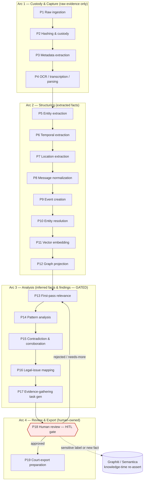
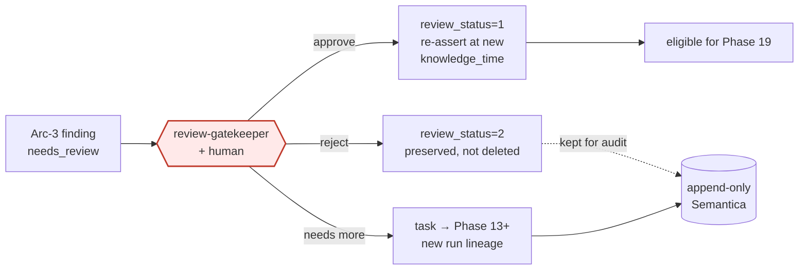

## Multi-pass analysis workflow (19 phases)

> _Byline: Claude Code · Opus 4.8 (1M) · 2026-06-30_
> Scope: the end-to-end **processing pipeline** that turns a raw artifact (an export, a screenshot, a call log) into a reviewed, court-exportable evidence package. This section defines *how* data flows through the stack described elsewhere; the schema sections define *what* each phase reads/writes. Every phase is a **versioned, append-only processing run** — nothing here overwrites canonical evidence, and nothing crosses the human-review gate without a recorded decision.

### 0. Design basis (what is locked, what this section decides)

| Input | Source | How it constrains the workflow |
|---|---|---|
| Custom **PostgreSQL 18** (`agno-postgres:18-duckdb`): `uuidv7()`, pg_duckdb, PostGIS, pgvector, pg_trgm, pgcrypto | ADR-0013 | Canonical store. Every run row, derived fact, and custody record gets a `uuidv7()` id; ingest reads R2/files **through pg_duckdb** (ADR-0030/0032), so Phases 1–4 need no separate ETL service. |
| **Milvus** = single vector store, one collection per embedder, hybrid dense+sparse | ADR-0026/0027 | Phase 11 (vector embedding) target. Index, not truth — vectors carry the PG linkage triple + provenance (see §Phase 11). |
| Embedder dims: text **2048-d** (`llama-nemotron-embed-vl-1b-v2`, run **local CPU** for sensitive evidence), code 4096-d, CaseBible 1536-d | ADR-0011/0015/0026 | "Evidence content stays local" forces Phases 4–5 + 11 LLM/embedding steps onto local CPU models (≤4B) for raw evidence text; cloud `glm-5.1`/NIM only on non-sensitive or de-identified inputs. |
| **Neo4j community + Graphiti MCP** = bitemporal graph (valid + knowledge time, disclosure-tier multi-pass) | ADR-0014/0018/0031 | Phase 12 (graph projection) target; the bitemporal substrate is *why* this is "multi-pass" — each pass can re-assert facts at a new knowledge time without destroying the old. |
| **SurrealDB** store/session/memory + PG→Surreal analysis sink | ADR-0024 (RATIFIED, **not yet deployed**, Phase D) | The **memory layer** that lets a run resume across sessions. Until deployed, the run ledger in PG (§Cross-cutting) is the interim memory of record. |
| **Semantica** decision/provenance bitemporal substrate (seed-first) | CANON §5 | Records *why* a derived fact/label was asserted (prompt+ontology+reviewer), feeding Phases 13–19. |
| **LiteLLM** :4000; **Ollama Cloud `glm-5.1` = PRIMARY LLM**; NIM = embed/rerank; **cloud-primary, no GPU** | ADR-0015 | All LLM-bearing phases (4,5,13,14,15,16,17,19) route through LiteLLM; sensitivity routing (local vs cloud) is enforced per-call (§Cross-cutting). |
| **ContextForge** MCP gateway 0.8.0 | ADR-0025 | Phases that an agent drives (review-gatekeeper, forensic-data-agent) reach tools through the gateway. |
| salem_v3 ontology + 303-pattern library + `mcl_722_23.ttl` + `positive_behaviors.ttl` | CONTEXT_PACK §2 | Seed inputs for Phases 5, 14, 16; **must extend** salem_v3 with full-cycle/both-parties types (§Phase 14). |
| Cross-cutting guardrails (raw vs extracted vs inferred vs finding vs legal; timestamp certainty; HITL on sensitive labels; both parties; full cycle; append-only provenance) | CONTEXT_PACK §5 + MP Constraints | Apply to **every** phase; encoded as the per-run envelope and the enum contract below. |

**Net rule for this layer:** the 19 phases are grouped into **four arcs** — *Custody & Capture* (1–4), *Structuring* (5–12), *Analysis* (13–17), and *Review & Export* (18–19). Arcs 1–2 produce only **raw evidence + extracted facts** (no opinions). Arc 3 produces **inferred facts and analytical findings** and is gated. Arc 4 is **human-owned**: nothing becomes court-facing without Phase 18 sign-off. Every phase is re-runnable; a re-run creates a **new run id** and appends, never mutating prior output (ADR-0018/0031 knowledge-time semantics).

### 1. The four arcs at a glance

**Backflow is normal, not exceptional.** New evidence, a corrected timestamp, a rejected label, or an ontology version bump re-enters the pipeline at the earliest affected phase and replays forward — producing a new run lineage, preserving the old (Constraints: never overwrite earlier interpretations).

### 2. Per-run envelope (every phase emits this)

Every phase execution is a row in `pipeline.processing_run` and every object it produces carries this envelope, so any final output traces to source evidence, run, prompt, ontology, schema, and review decision (Constraints).

| Field | Type | Meaning |
|---|---|---|
| `run_id` | uuidv7 PK | This phase execution. |
| `phase` | INT8 (1–19) | Which phase. |
| `parent_run_id` | uuidv7 NULL | The run that fed this one (lineage chain). |
| `source_evidence_id` | uuidv7 | Originating raw artifact (custody chain, Phase 2). |
| `assertion_type` | INT8 enum | `0 raw_evidence · 1 extracted_fact · 2 inferred_fact · 3 analytical_finding · 4 legal_conclusion`. Arc 1–2 emit 0–1; Arc 3 emits 2–3; legal_conclusion (4) is **human-authored only**. |
| `timestamp_certainty` | INT8 enum | `0 exact · 1 approximate · 2 inferred · 3 uncertain`. |
| `confidence` | FLOAT 0–1 | Re-derived transparently; **never a hard-coded 0.6** (crosswalk). |
| `model` / `prompt_version` / `ontology_version` / `schema_version` | TEXT | LLM + artifact lineage. |
| `sensitivity` | INT8 enum | `0 public · 1 internal · 2 sensitive · 3 in_camera`. Drives local-vs-cloud routing. |
| `review_status` | INT8 enum | `0 pending · 1 approved · 2 rejected · 3 needs_review`. |
| `superseded` | BOOL | Append-only soft-delete; corrections add a new row. |
| `valid_time` / `knowledge_time` | tstzrange / timestamptz | Bitemporal (valid = when the fact was true in the world; knowledge = when we asserted it). Mirrors Graphiti/Semantica. |
| `inputs_digest` | bytea | SHA-256 of inputs → idempotency + reproducibility key. |
| `status` | enum | `queued · running · ok · partial · failed · quarantined`. |

> **Idempotency rule:** a phase keyed on the same `(source_evidence_id, phase, model, prompt_version, ontology_version, inputs_digest)` is skipped (cache hit) unless `--force`. This makes the whole pipeline safe to replay and cost-aware (no re-embedding / re-LLM on unchanged inputs).

---

### Arc 1 — Custody & Capture (Phases 1–4)

These phases are **deterministic and opinion-free**. They establish *what we received and that it is intact*. Output is strictly `assertion_type = raw_evidence`.

#### Phase 1 — Raw ingestion
| Aspect | Detail |
|---|---|
| Goal | Land every artifact byte-for-byte and register it; never parse yet. |
| Inputs | R2 buckets (`nexus`, `casebible-*`), rclone-mounted files, direct uploads (FB/Snapchat/Instagram exports, call-log CSV/XLSX, screenshots, media). |
| Mechanism | pg_duckdb reads R2/S3 via the account-wide secret (ADR-0030); large media stay in R2, only a pointer + byte range is registered. **No mutation of source** (Constraints: never overwrite original evidence). |
| Writes | `evidence.artifact` (raw blob pointer, original filename, container path, export-vintage, MIME, byte size). `raw_payload` kept append-only (crosswalk `original_json`→`raw_payload`). |
| Output class | raw_evidence (0). |
| Failure | Unreadable/partial → `quarantined` (not dropped); logged with reason (never-delete rule). |

#### Phase 2 — Hashing and custody
| Aspect | Detail |
|---|---|
| Goal | Cryptographic chain-of-custody before anything touches the artifact. |
| Mechanism | **SHA-256 + uuidv7** custody chain (adopt DuckDbVault/`duckdb.ts`; aligns with ADR-0013 `uuidv7()`). Hash computed at rest in R2 and re-verified on every read; `prev_custody_id` links the chain. |
| Writes | `custody.event` (append-only): `sha256`, `uuidv7`, `actor`, `action` (received/hashed/read/exported), `at_utc`, `prev_custody_id`, `r2_etag`. |
| Output class | raw_evidence (0). |
| Court note | This phase is the integrity backbone of any Phase 19 export; a broken hash → artifact flagged, downstream runs blocked. |

#### Phase 3 — Metadata extraction
| Aspect | Detail |
|---|---|
| Goal | Pull container/technical metadata **without interpretation**. |
| Mechanism | EXIF (images), file timestamps, export headers, `device_id`, message-export account owner, archive table-of-contents. |
| Writes | `evidence.artifact_metadata` (typed key/value, append-only). `device_id` carried forward for multi-device attribution (crosswalk). |
| Timestamp handling | Capture the **raw string + parsed UTC + offset triple** (`*_raw`, `*_utc`, `offset`) — the timestamp-certainty support adopted from `timeline_enriched`. Container time = `approximate` unless corroborated. |
| Output class | extracted_fact (1) for parsed values; raw_evidence (0) for the verbatim header. |

#### Phase 4 — OCR / transcription / parsing
| Aspect | Detail |
|---|---|
| Goal | Turn bytes into text spans, preserving exact source location. |
| Mechanism | OCR (screenshots → `screenshots`/`evidence.image` text, crosswalk); audio/video → transcript with speaker turns; HTML export parsing via `parser.*_html` configs (FB/Snapchat/Instagram/generic — **selectors are brittle, pinned to export-vintage with fallbacks**, crosswalk Phase 47). |
| Sensitivity routing | Runs on **local CPU** models for `sensitivity ≥ 2` (evidence stays local, ADR-0015); cloud OK only for de-identified/public. |
| Writes | `evidence.text_span` (offset-anchored to the source byte range → every extracted char re-links to the original). `evidence.image` + OCR text. |
| Timestamp handling | Parser-derived timestamps = `approximate` unless corroborated (crosswalk). |
| Output class | extracted_fact (1), each span carrying a back-pointer to its `source_evidence_id` + byte offset. |
| **Needs-human-review** | Low-confidence OCR / parser-fallback spans flagged `needs_review (3)` so they are not silently trusted downstream. |

---

### Arc 2 — Structuring (Phases 5–12)

These phases convert text spans into the canonical schema objects (entities, events, messages, geo) and project them into the vector + graph stores. Output is `extracted_fact (1)`; **resolution and embedding never invent**, they normalize and link.

#### Phase 5 — Entity extraction
| Aspect | Detail |
|---|---|
| Goal | Spot mentions of people, orgs, locations, devices, handles in each span. |
| Mechanism | spaCy NER (local) for `sensitivity ≥ 2`; LLM (`glm-5.1` via LiteLLM) only for de-identified text. Seed entity types from **salem_v3** (`Person`, `Location`, `Evidence`, `Statement`, `Incident`) (crosswalk). |
| Writes | `entity.mention` (span-anchored, **not yet resolved** to a canonical person — that is Phase 10). |
| Output class | extracted_fact (1). A mention is a *fact that this text names X*, not a claim that X did anything. |

#### Phase 6 — Temporal extraction
| Aspect | Detail |
|---|---|
| Goal | Extract every time reference and classify its certainty. |
| Mechanism | Parse explicit timestamps + relative expressions ("last Tuesday"); keep the `*_raw`/`*_utc`/`offset` triple. |
| Certainty mapping | explicit + tz → `exact (0)`; tz-inferred → `approximate (1)`; relative/derived → `inferred (2)`; conflicting/absent → `uncertain (3)`. |
| Writes | `timeline.raw_*` (visits/activities/trips/paths adopted from `timeline_enriched`); feeds Phase 9. |
| Output class | extracted_fact (1) + explicit `timestamp_certainty`. |

#### Phase 7 — Location extraction
| Aspect | Detail |
|---|---|
| Goal | Resolve places to coordinates with conflict-awareness. |
| Mechanism | `location_geokey` / geohash8-9 / r3–r5 rounding → `geo.location` (PostGIS); **multi-provider** `geocode_resolution` with `disagreement_flag` / `address_mismatch_flag` (newest Jan-2026 variant) → provider disagreement = an explicit **uncertainty signal**, not silently resolved (crosswalk). |
| Writes | `geo.location`, append-only `geocode_audit`. |
| Output class | extracted_fact (1); disagreement rows flagged `needs_review (3)`. |

#### Phase 8 — Message normalization
| Aspect | Detail |
|---|---|
| Goal | Put every chat/SMS/social message into one canonical shape. |
| Mechanism | TraceIQ V4.1 `messages` → `evidence.message`: split `message_type` into `channel` + `direction`; keep `is_private` → `requires_in_camera_review` (HITL); keep `linked_location_event_id` correlation primitive (crosswalk). Fold in **call-logs/blocked-call → `call_event`** and Snapchat parser gaps (CONTEXT_PACK §4). |
| Both-parties rule | Direction is captured neutrally (inbound/outbound) — **the user's own messages are normalized identically** to the partner's (Constraints: model both parties). |
| Output class | extracted_fact (1). |

#### Phase 9 — Event creation
| Aspect | Detail |
|---|---|
| Goal | Build the timeline spine from raw temporal + message + location facts. |
| Mechanism | `timeline_enriched` → `timeline.event` spine; each event references its raw rows + message(s) + geo. **An event is still an extracted fact** (something occurred at a time/place per the evidence) — it carries no relational interpretation yet. |
| Full-cycle rule | Events are created for **positive, neutral, ordinary, affectionate, and love-bombing** interactions, not only conflict (Constraints; `positive_behaviors.ttl`). |
| Output class | extracted_fact (1). |

#### Phase 10 — Entity resolution
| Aspect | Detail |
|---|---|
| Goal | Collapse mentions/handles/devices across sources into one canonical `entity.person` (+ graph `Person`). |
| Mechanism | Deterministic keys first (phone, handle, account id, `device_id`), then pg_trgm fuzzy + blocking; **every merge is reversible** and logged (append-only `entity.merge_log`). Multi-device split → attribution on event/message (crosswalk). |
| `people` → `person` (crosswalk): `relationship_type` → typed edge (built in Phase 12); split `is_flagged`. |
| Output class | extracted_fact (1). |
| **Needs-human-review** | Ambiguous cross-platform merges (the noted blind spot — cross-source entity resolution) flagged `needs_review (3)`; never auto-merged at low confidence. |

#### Phase 11 — Vector embedding
| Aspect | Detail |
|---|---|
| Goal | Make every text/image span semantically searchable. |
| Mechanism | **Milvus** hybrid dense+sparse, one collection per embedder (ADR-0026/0027). Forensic evidence text → `llama-nemotron-embed-vl-1b-v2` **2048-d, local CPU** (evidence stays local, ADR-0011/0015); images via the same VL model → same space (cross-modal). Each vector carries the PG linkage triple + full provenance envelope. |
| Append-only | Re-embed = new vector + `embedding_version` bump; old vector `superseded=true`, never deleted. |
| Output class | extracted_fact (1) (an index pointer, not a claim). |

#### Phase 12 — Graph projection
| Aspect | Detail |
|---|---|
| Goal | Project resolved entities + events into Neo4j/Graphiti as the bitemporal cognition layer. |
| Mechanism | Seed with **salem_v3** entities/edges (`WAS_AT`, `PARTICIPATED_IN`, `MADE_STATEMENT`) (crosswalk); write with **valid + knowledge time** (ADR-0014/0018/0031). Sensitive evidence text is **not** shipped to a cloud LLM for extraction — projection uses already-resolved structured facts (CONTEXT_PACK §3 graphiti note). |
| Guardrail | Only `extracted_fact`-class edges are projected here. **Interpretive edges** (`CONTRADICTS`, `USED_TACTIC`, `EXPLOITED_VULNERABILITY`, etc.) are produced in Arc 3 and stay `needs_review` until Phase 18. |
| Output class | extracted_fact (1). |

---

### Arc 3 — Analysis (Phases 13–17) — GATED, opinion-bearing

This arc produces `inferred_fact (2)` and `analytical_finding (3)`. **Everything here is a hypothesis until a human approves it** (Constraints: never silently promote a hypothesis to a fact). Each finding requires ≥1 `Evidence` cite (salem_v3 extension rule) and records its prompt+ontology+model in Semantica.

#### Phase 13 — First-pass relevance analysis
| Aspect | Detail |
|---|---|
| Goal | Triage which events/messages plausibly matter to the case — cheaply, before expensive analysis. |
| Mechanism | Hybrid Milvus retrieval + `glm-5.1` scoring; re-derive HIGH/MED/LOW **transparently** (adopt `vw_forensic_evidence_package` → parameterized `evidence_export`; **no hard-coded 0.6 threshold**, crosswalk). |
| Writes | `analysis.relevance` (inferred_fact, scored, `needs_review`). |
| Output class | inferred_fact (2). Low relevance is **retained, not discarded** (Constraints: don't discard classifications). |

#### Phase 14 — Pattern analysis
| Aspect | Detail |
|---|---|
| Goal | Detect behavioral patterns across the timeline — **both directions, full cycle**. |
| Mechanism | Apply the **303-pattern behavioral library** (`seed-patterns.ts` / `behaviors.yaml`) + `behavioral_patterns.ttl` **and `positive_behaviors.ttl`**. **Must extend salem_v3** (which models only adversarial conduct) with `RelationshipPhase`, `REPAIR_ATTEMPT`, `LOVE_BOMBING`, `REACTIVE_TO` (crosswalk). |
| Both-parties + cycle | Model the user's own escalations/apologies/repair attempts in temporal context; surface tone / inferred intent / relational function / cycle phase / surrounding context are tracked **separately** (Constraints). Distinguish explanation from excuse. |
| Output class | analytical_finding (3); sensitive labels (gaslighting, coercive control, alienation, weaponization, reactive abuse) held `needs_review (3)` — **never auto-promoted** (CONTEXT_PACK §5). |

#### Phase 15 — Contradiction and corroboration analysis
| Aspect | Detail |
|---|---|
| Goal | Find where evidence conflicts or reinforces — the impeachment/credibility layer. |
| Mechanism | `expected_schedule` → `analysis.claim_verification` (paired `claimed_*` / `observed_*`; `is_anomaly` = analytical finding + HITL) models "claim vs evidence" (crosswalk). salem_v3 `CONTRADICTS` edge = impeachment primitive (HITL). Corroboration = ≥2 independent `source_evidence_id`. |
| Court note | Distinguish **contextual harm from proven causation**; flag where a reaction may have been **selectively quoted/weaponized without context** (Constraints). |
| Output class | analytical_finding (3). |

#### Phase 16 — Legal-issue mapping
| Aspect | Detail |
|---|---|
| Goal | Map findings to legal factors — *organization, not legal advice* (Constraints). |
| Mechanism | Map to `mcl_722_23.ttl` (12 best-interest factors) via the `mcl-factor-mapper` skill; produce factor-tagged candidate exhibits. Beyond MCL A–L is a noted blind spot → tagged `needs_review`. |
| Hard line | This phase emits **candidate** mappings (`inferred_fact`/`analytical_finding`); `legal_conclusion (4)` is **human-authored only** in Phase 18/19. |
| Output class | analytical_finding (3). |

#### Phase 17 — Evidence-gathering task generation
| Aspect | Detail |
|---|---|
| Goal | Turn gaps (uncorroborated findings, missing timestamps, single-source claims) into actionable collection tasks. |
| Mechanism | For each finding lacking corroboration or with `timestamp_certainty ≥ 2`, generate a task ("obtain X to corroborate Y"). Adapt `problematic_locations_contacts` → `alert_rule` lane for watchlist-driven prompts (crosswalk). |
| Writes | `analysis.task` (what to gather, why, which finding it strengthens). |
| Output class | analytical_finding (3) — explicitly **labels what requires corroboration before use** and **what is emotionally important but may not be legally useful** (Constraints). |

---

### Arc 4 — Review & Export (Phases 18–19) — human-owned

#### Phase 18 — Human review (the HITL gate)
| Aspect | Detail |
|---|---|
| Goal | A human decides what crosses into court-facing output. **Mandatory** before any sensitive label, legal-relevance label, or export. |
| Mechanism | Driven by the **review-gatekeeper** agent via ContextForge/AgentOS (CONTEXT_PACK §3); reviewer sees the finding + every cited `Evidence` + the full lineage (run, prompt, ontology, schema). Decision recorded in Semantica + `pipeline.review_decision` (append-only). |
| Effects | `approve` → `review_status=1`, finding may be re-asserted at a new **knowledge time** in Graphiti/Semantica (promotion is *explicit and logged*, never silent). `reject` / `needs-more` → routes back to Phase 13+ with a new run; the rejected interpretation is **preserved** (Constraints). A human may author a `legal_conclusion (4)` here. |
| Output class | review decision (sets gate state on referenced objects). |

#### Phase 19 — Court-export preparation
| Aspect | Detail |
|---|---|
| Goal | Assemble an auditable, court-safe evidence package from **approved-only** material. |
| Mechanism | Parameterized `evidence_export` (re-derives tiers transparently, crosswalk) filtered to `review_status==1 AND assertion_type ≤ approved-class`. Each exhibit re-verifies its **SHA-256 custody chain** (Phase 2) before inclusion; `requires_in_camera_review` items split into a sealed annex. |
| Output | Exhibit set + provenance appendix tracing every line back to source evidence, run, prompt, ontology, schema, and reviewer decision (Constraints). Narrative drafts are **review-ready factual summaries, not legal advice**; framing favors "structure, safety, clarity, child stability" over blame (Constraints). |
| Output class | court-facing package (immutable snapshot; a new export = a new version). |

---

### 3. Phase → store → output-class crosswalk

| # | Phase | Primary store written | Reads from | Output class | Gated? |
|---|---|---|---|---|---|
| 1 | Raw ingestion | PG `evidence.artifact` + R2 | R2/files (pg_duckdb) | raw_evidence | no |
| 2 | Hashing & custody | PG `custody.event` | artifact bytes | raw_evidence | no |
| 3 | Metadata extraction | PG `evidence.artifact_metadata` | artifact | extracted_fact | no |
| 4 | OCR/transcription/parsing | PG `evidence.text_span`/`image` | artifact (local CPU) | extracted_fact | partial (low-conf) |
| 5 | Entity extraction | PG `entity.mention` | text_span | extracted_fact | no |
| 6 | Temporal extraction | PG `timeline.raw_*` | text_span | extracted_fact | no |
| 7 | Location extraction | PG/PostGIS `geo.location` | text_span/metadata | extracted_fact | partial (disagree) |
| 8 | Message normalization | PG `evidence.message`/`call_event` | text_span | extracted_fact | no |
| 9 | Event creation | PG `timeline.event` | raw_*/message/geo | extracted_fact | no |
| 10 | Entity resolution | PG `entity.person`/`merge_log` | mention | extracted_fact | partial (ambiguous) |
| 11 | Vector embedding | **Milvus** | text_span/image | extracted_fact | no |
| 12 | Graph projection | **Neo4j/Graphiti** | person/event | extracted_fact | no |
| 13 | First-pass relevance | PG `analysis.relevance` | Milvus + events | inferred_fact | **yes** |
| 14 | Pattern analysis | PG/Graph `analysis.pattern` | events + libraries | analytical_finding | **yes** |
| 15 | Contradiction/corroboration | PG `analysis.claim_verification` | events/messages | analytical_finding | **yes** |
| 16 | Legal-issue mapping | PG `analysis.factor_map` | findings + TTL | analytical_finding | **yes** |
| 17 | Task generation | PG `analysis.task` | findings | analytical_finding | **yes** |
| 18 | Human review | PG/Semantica `review_decision` | all findings + cites | review decision | **gate** |
| 19 | Court-export prep | export snapshot | approved-only | court package | post-gate |

### 4. Orchestration, idempotency & resumability

| Concern | Approach |
|---|---|
| Orchestration | Phases are **independent jobs** keyed by the run envelope; an orchestrator (AgentOS workflow via ContextForge, ADR-0025) advances an artifact phase-by-phase. Arc 1–2 can run unattended; Arc 3 emits to a review queue; Arc 4 blocks on a human. |
| Idempotency | `inputs_digest` cache key (see §2) → safe to replay, cost-aware (no needless cloud LLM / re-embed calls — honors the cost-aware global rule). |
| Resumability across sessions | **SurrealDB** store/session/memory (ADR-0024, Phase D) is the target memory layer; **until deployed, `pipeline.processing_run` in PG is the interim memory of record** so a session can resume from the last completed phase without losing context (Constraints: resume across sessions). |
| Partial failure | Any phase can land `partial`/`quarantined` without blocking siblings; quarantined artifacts are retained with a reason (never-delete rule). |
| Backfill / re-pass | An ontology/prompt/schema version bump triggers a **selective re-pass** from the earliest affected phase; old runs stay queryable (bitemporal). This is the literal meaning of "multi-pass": the same evidence is re-analyzed over time at new knowledge times, and every pass is preserved (ADR-0018/0031). |
| Sensitivity routing | Per-call: `sensitivity ≥ 2` → local CPU model (≤4B); else cloud `glm-5.1`/NIM via LiteLLM. Enforced at the LLM-bearing phases (4,5,13,14,15,16,17,19). Evidence content never leaves local for cloud extraction (ADR-0015). |

### 5. Open items / needs-human-review

| Item | Why it needs a human / ADR |
|---|---|
| **SurrealDB not yet deployed** (ADR-0024, Phase D) | The intended cross-session memory layer is ratified but not live; the interim PG run-ledger must be confirmed sufficient, or Phase D pulled forward. |
| **Confirm local-CPU embedder/LLM path** for sensitive Phases 4/5/11 | If `llama-nemotron-embed-vl-1b-v2` / extraction LLMs are only served via cloud NIM, sensitive evidence routing breaks ADR-0015 → needs a local symmetric model (e.g. `bge-m3`) and an ADR-0011 amendment. (Same blocking flag raised in the Milvus section.) |
| **Parser fragility (Phase 4)** | FB/Snapchat/Instagram selectors are export-vintage-specific; a new export format silently breaks extraction → human must validate parser config per vintage. |
| **Cross-source entity resolution (Phase 10)** + **legal schema beyond MCL A–L (Phase 16)** | Both are noted design blind spots; low-confidence merges and out-of-taxonomy legal mappings are flagged `needs_review`, not auto-applied. |
| **No live DDL verified** | Phase store targets here assume the schema sections; the as-deployed pg_duckdb/Milvus/Neo4j DDL is the highest unknown (CONTEXT_PACK §4) and must be reconciled before the pipeline is wired. |
