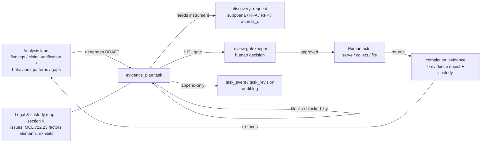
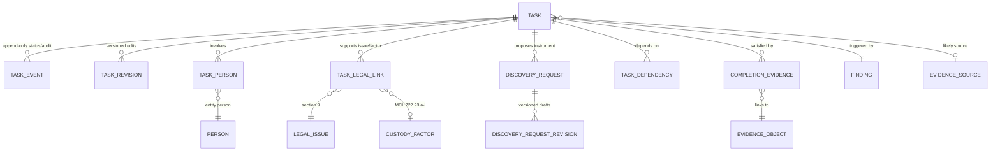
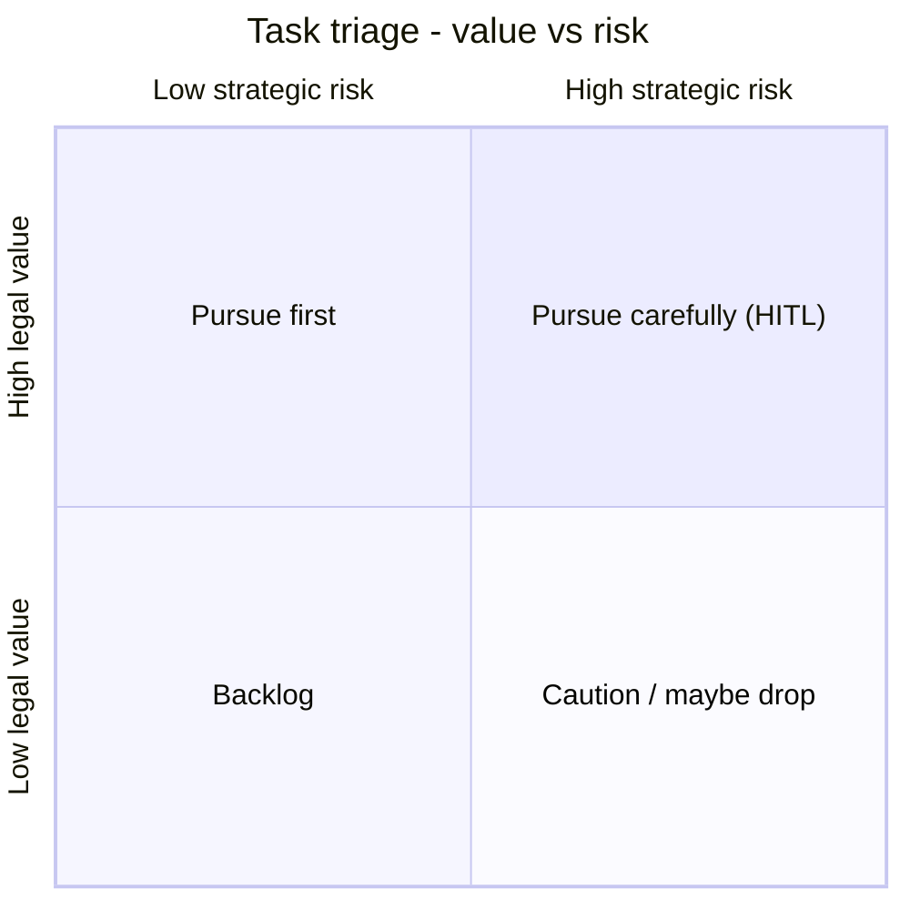
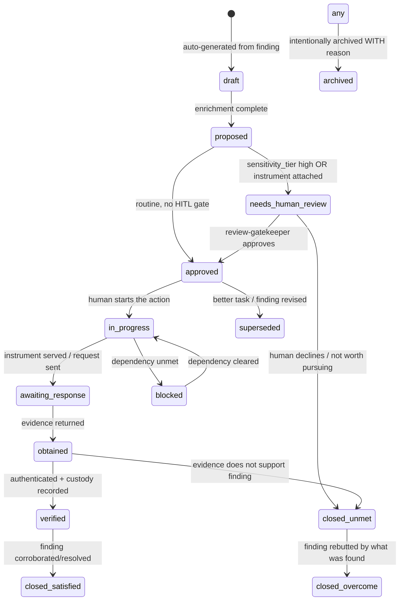
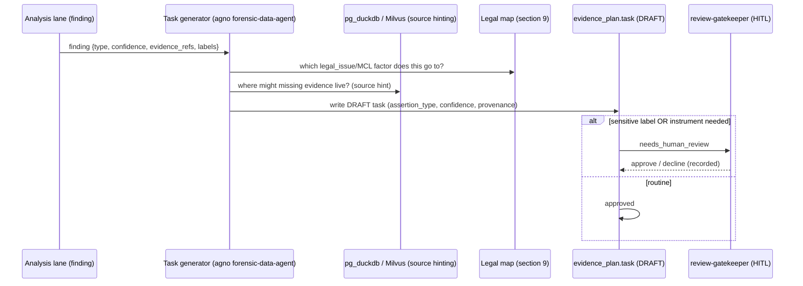

## Evidence-Gathering Plan Model

> _Byline: Claude Code · Opus 4.8 (1M) · 2026-06-30_
> Implements master-prompt §14 ("Evidence-Gathering Plan Model"). Consumes the legal/custody mapping of §9 (MP 1823–1849) and the analysis lane. Grounded in the locked stack (ADR-0013 PG18 `uuidv7()`/`pg_duckdb`, ADR-0014/0018/0031 Neo4j+Graphiti, ADR-0024 SurrealDB, ADR-0026/0027 Milvus) and the salem_v3 ontology + TraceIQ/R5 prior schemas per the Context Pack crosswalk. SSOT docs win on conflict.

### 14.1 Purpose and plain-language overview

The system does not stop at "here is a timeline." It turns each **analytical finding** (a contradiction, an anomaly, a gap, a flagged behavioral pattern, a custody-factor concern) into a **concrete, trackable to-do**: *what evidence is still missing, where it probably lives, who controls it, which legal issue it would support, how urgent it is, how risky it is, and exactly what a human must do next* — including a drafted subpoena, Request for Admission (RFA), Request for Production (RFP), or witness question when one applies.

This is the bridge from the analysis layer to action. It is deliberately built so that:

- **Nothing is invented.** Every task points back to the finding that triggered it and the evidence that supports (or fails to support) that finding (Constraints MP 2418, 2469; Context Pack §5).
- **A non-developer can run it as a checklist**, while a developer has full DDL, enums, and a state machine to implement it.
- **It never auto-files anything.** Every court-facing artifact, every sensitive label, and every discovery instrument is **proposed** by the system and **released only by a human** through the `review-gatekeeper` HITL agent (Context Pack §3; Constraints MP 2427, 2448).
- **It is append-only and fully audited** — task edits, status changes, and human decisions are versioned, never overwritten (Constraints MP 2438, 2470; ADR-0013 custody backbone).



### 14.2 Where this lives in the stack

| Concern | Home | Rationale / ADR |
|---|---|---|
| Canonical task records + relational queries | **PostgreSQL 18** (`agno-postgres:18-duckdb`), schema `evidence_plan` | ADR-0013; `uuidv7()` PKs give time-sortable, custody-friendly IDs |
| Cross-source reach to find candidate evidence (R2 files, exports, relational) | **pg_duckdb** queries over R2/S3 + relational | ADR-0013/0030/0032 — no standalone DuckDB service |
| Task → finding → evidence → legal-issue **graph** (dependency DAG, impeachment chains) | **Neo4j + Graphiti** edges (`GENERATED_TASK`, `SUPPORTS_ISSUE`, `BLOCKS`, `CORROBORATES`) | ADR-0014/0018/0031 — bitemporal, disclosure-tiered |
| Semantic "what other evidence looks like this gap" suggestions | **Milvus** (evidence-text collection) at task-drafting time only | ADR-0026/0027 |
| Bitemporal analysis sink / decision+provenance substrate | **SurrealDB** + **Semantica** when deployed (Phase D) | ADR-0024; CANON §5 |
| Cross-session resumption of the plan (open-task working set, last decision) | append-only `task_event` + `MEMORY.md`/Graphiti handoff | Constraints MP 2439/2455 |
| HITL release of instruments & sensitive labels | **agno-gateway** `review-gatekeeper` agent | Context Pack §3 |

Tasks are **derived objects**, so every row carries the standard provenance quintuple used platform-wide (Context Pack §2): `source_run_id`, `prompt_version`, `ontology_version`, `schema_version`, `review_status`, plus `assertion_type` and `confidence`. They are also append-only: edits create a new `task_revision`, status moves emit a `task_event` (Constraints MP 2436/2438/2452).

### 14.3 Core entity model (ER)



`FINDING`, `EVIDENCE_OBJECT`, `EVIDENCE_SOURCE`, `PERSON`, `LEGAL_ISSUE`, `CUSTODY_FACTOR` are owned by other sections (analysis, evidence/custody, entity, legal §9); this section only references them by FK and never duplicates their content.

### 14.4 The task schema — field-by-field contract

This is the literal mapping of every field required by MP 2194–2207, expanded to be implementation-grade.

| # | Master-prompt field | Column | Type | Notes / guardrail |
|---|---|---|---|---|
| 1 | Task ID | `task_id` | `uuid` PK `DEFAULT uuidv7()` | time-sortable; doubles as stable citation handle |
| — | Human-readable key | `task_key` | `text` UNIQUE | e.g. `EGP-2026-0007` for filings/checklists |
| 2 | Triggering finding | `finding_id` | `uuid` FK→`analysis.finding` | REQUIRED; the analytical basis. Plus `trigger_kind` enum below |
| 3 | Evidence needed | `evidence_needed` | `text` + `evidence_need_kind` enum | what is missing/needed and *why this finding requires it* |
| 4 | Source likely to contain it | `likely_source_id` | `uuid` FK→`evidence.source` (nullable) | + `likely_source_note` free text when source is external/unknown |
| 5 | Person/entity involved | via `task_person` (n:m) | — | role-typed (subject, custodian, witness, child, third party) |
| 6 | Legal issue supported | via `task_legal_link` (n:m) | — | →§9 `legal_issue` + optional MCL 722.23 `custody_factor` |
| 7 | Priority | `priority` | enum | see §14.6 scoring |
| 8 | Risk | `risk` | enum | + `risk_kind[]` + `risk_note` (litigation/prejudice/privacy/safety) |
| 9 | Due date | `due_date` | `date` NULL | optional; `due_basis` records *why* (hearing, statute, discovery deadline) |
| 10 | Status | `status` | enum (state machine §14.7) | current state only; history in `task_event` |
| 11 | Required human action | `human_action` | `text` + `human_action_kind` enum | the explicit next human step |
| 12 | Suggested subpoena/RFA/RFP/witness Q | via `discovery_request` (1:n) | — | DRAFT only; never served by system |
| 13 | Dependencies | via `task_dependency` (DAG) | — | typed: `blocks`, `prereq_of`, `corroborates`, `duplicate_of` |
| 14 | Completion evidence | via `completion_evidence` (1:n) | — | links to the actual `evidence.object` + custody hash |
| — | Assertion type | `assertion_type` | enum | raw / extracted_fact / inferred_fact / analytical_finding / legal_conclusion (Constraints MP 2420) |
| — | Confidence | `confidence` | enum (high/med/low) + `confidence_note` | never a hard-coded 0.6 (Context Pack §2, `evidence_export` rule) |
| — | Sensitivity / HITL | `sensitivity_tier`, `hitl_required`, `hitl_status` | enum/bool | gates court-facing release |
| — | Provenance quintuple | `source_run_id`, `prompt_version`, `ontology_version`, `schema_version`, `review_status` | — | lineage (Constraints MP 2436) |
| — | Scope | `case_id` | `uuid` | generalizes salem_v3 "Salem v. Kinzel" caption → `case_id` (Context Pack §2) |
| — | Provisional flag | `is_hypothesis` | bool | task may rest on a hypothesis; can never silently become fact (MP 2469) |

### 14.4a Legal & custody mapping crosswalk (consumes §9 / MP 1823–1849)

§9 owns the legal/custody schema; this section is its **action consumer**. Every item that §9 (MP 1823–1849) requires the system to map has an explicit hook in the evidence-gathering plan, so a finding mapped to a legal need always lands as a trackable task and (where applicable) a drafted instrument. Nothing in this column is duplicated here — it is referenced by FK into `legal.*` and surfaced through the columns/edges below.

| MP 1823–1849 item | How the plan consumes it | Carrier (this section) |
|---|---|---|
| Legal issues | task ↔ issue link; drives priority weight | `task_legal_link.legal_issue_id` |
| Custody factors | MCL 722.23 (a)–(l) tagging on the link | `task_legal_link.custody_factor` |
| Parenting-time interference | `trigger_kind='custody_factor_concern'` + issue link | task + `task_legal_link` |
| Child safety concerns | `trigger_kind='safety_concern'`; auto `risk_kind+='safety'`, escalates priority | task; §14.6 |
| Communication barriers | `trigger_kind='communication_barrier'` | task |
| Established custodial environment (ECE) concerns | `trigger_kind='established_custodial_environment'` | task |
| Best-interest-factor relevance | `custody_factor` materiality feeds priority score | §14.6 `priority_inputs` |
| Witnesses | role-typed person + witness instruments | `task_person.role='witness'`; `instrument_type` ∈ {`witness_question`,`deposition_topic`,`rog`} |
| Potential subpoenas | drafted instrument | `discovery_request` (`subpoena`/`subpoena_duces_tecum`) |
| RFAs | drafted instrument | `discovery_request` (`rfa`) |
| RFPs | drafted instrument | `discovery_request` (`rfp`) |
| Admissions | RFA draft tied to the discrete fact | `discovery_request` (`rfa`) + `evidence_need_kind='foundation'` |
| Contradictions | impeachment edge + completion outcome | graph `CONTRADICTS`; `completion_evidence.outcome='overcome'` |
| Court-ready exhibits | gated by HITL; produced by export lane (§9 provenance) | `hitl_status`, `human_action_kind='authenticate'`; export handled in §9 |
| Evidence packets | assembled downstream from `verified` tasks | feeds §9 `provenance.export` |
| Draft factual assertions | never auto-promoted; review-ready only | `assertion_type`, `is_hypothesis`, `discovery_request.draft_text` |
| Required corroboration | first-class need kind + flag | `evidence_need_kind='corroboration'`; §9 `review.requires_corroboration` |
| Litigation risk | typed risk facet | `risk_kind+='litigation'` (MP 2473) |
| Usefulness rating | legal-value axis of the value×risk triage | §14.6 quadrant (legal value) |
| Prejudice risk | typed risk facet | `risk_kind+='prejudice'` |
| Privacy / redaction needs | typed risk facet → redaction action | `risk_kind+='privacy_redaction'`; `human_action_kind='redact'` → §9 `redaction` |

> "The system should output an evidence-gathering plan, not just a timeline" (MP 1849) is the literal mandate this section fulfils: the timeline/analysis lanes produce findings; **this** lane turns each into a tracked, prioritized, instrument-bearing, custody-closing task.

### 14.5 Controlled vocabularies (enums)

| Enum | Values | Purpose |
|---|---|---|
| `trigger_kind` | `contradiction`, `anomaly` (claim-vs-evidence), `gap` (missing corroboration), `behavioral_pattern`, `custody_factor_concern`, `safety_concern`, `communication_barrier`, `established_custodial_environment` (ECE concern, MP 1832), `selective_framing` (user reaction quoted out of context, MP 2446), `timeline_hole`, `attribution_uncertainty`, `manual` | classifies *why* the task exists; maps to §9 + analysis lane |
| `evidence_need_kind` | `corroboration`, `original_source` (vs screenshot), `authentication` (MRE 901), `metadata` (timestamps/EXIF/headers), `completeness` (full thread vs excerpt), `chain_of_custody`, `rebuttal`, `foundation`, `impeachment` | what *kind* of evidentiary hole it fills |
| `priority` | `P0_critical`, `P1_high`, `P2_medium`, `P3_low`, `P4_backlog` | derived (§14.6), human-overridable |
| `risk` | `none`, `low`, `medium`, `high` | overall; decomposed by `risk_kind[]` |
| `risk_kind` | `litigation` (strategically dangerous if presented w/o context, MP 2473), `prejudice` (§9 prejudice risk), `privacy_redaction` (§9 privacy/redaction), `safety` (alerts the other party / DV risk), `self_incrimination` (user's own conduct, MP 2442/2458), `cost`, `chain_of_custody` | typed risk facets |
| `status` | `draft`, `proposed`, `needs_human_review`, `approved`, `in_progress`, `awaiting_response`, `blocked`, `obtained`, `verified`, `closed_satisfied`, `closed_unmet`, `closed_overcome`, `superseded`, `archived` | state machine §14.7 |
| `human_action_kind` | `review_label`, `approve_instrument`, `serve_subpoena`, `collect_self` (export/download/photo), `request_from_counsel`, `interview_witness`, `authenticate`, `redact`, `decide_relevance`, `file_motion`, `none_yet` | the explicit human step (avoids legal advice — these are *workflow* actions, MP 2426) |
| `assertion_type` | `raw`, `extracted_fact`, `inferred_fact`, `analytical_finding`, `legal_conclusion` | Constraints MP 2420; mirrors platform standard |
| `instrument_type` | `subpoena`, `subpoena_duces_tecum`, `rfa` (admission), `rfp` (production), `rog` (interrogatory), `witness_question`, `deposition_topic`, `self_collection`, `records_request`, `preservation_letter` | discovery_request kinds |
| `sensitivity_tier` | `routine`, `sensitive` (relational labels), `high` (child, abuse-pattern, DV) | drives `hitl_required` |

> Sensitive-label rule (Constraints MP 2448; Context Pack §5): any task whose finding carries a label in {gaslighting, coercive control, alienation, manipulation, weaponization, reactive abuse} is auto-set `sensitivity_tier='high'`, `hitl_required=true`, and **cannot** reach `approved`/court-facing export until `hitl_status='approved'` by a human. The system stores the label as a **hypothesis on the analysis side**; the task only references it.

### 14.6 Priority and risk scoring (transparent, re-derivable)

Priority is **computed and stored with its inputs**, never a magic number (mirrors the `evidence_export` HIGH/MED/LOW re-derivation rule, Context Pack §2). The score is advisory; `priority_override` + `priority_override_reason` let a human win.

Priority signal = function of:

| Input | Source | Weight intent |
|---|---|---|
| Legal weight of supported issue/factor | §9 `legal_issue.weight`, MCL factor materiality | higher = more urgent |
| Finding confidence & corroboration deficit | analysis `confidence`, gap severity | low corroboration on a high-weight issue = urgent |
| Deadline pressure | `due_date` − today, `due_basis` | imminent hearing/statute = urgent |
| Spoliation / volatility risk | source is ephemeral (Snapchat, deletable chats, device wipe) | volatile source = urgent (preserve first) |
| Dependency fan-out | # tasks blocked by this one | unblocking many = urgent |
| Child-safety flag | `risk_kind` contains `safety` | escalates regardless of other inputs |

`priority` enum is the bucketed result; `priority_score` (numeric) + `priority_inputs` (JSONB snapshot) are persisted so any ranking is auditable and reproducible (Constraints MP 2422/2423/2424).

Risk is scored independently on four axes and stored per axis so the **same task can be high-value AND high-risk** — the planner surfaces both rather than collapsing them (Constraints MP 2467, separating legal usefulness from strategic danger):



### 14.7 Task lifecycle (state machine)



Rules:
- Every transition writes an append-only `task_event` row (`from_status`, `to_status`, `actor`, `actor_kind` ∈ {system, agent, human}, `reason`, `ts`). Nothing is deleted (Constraints MP 2438/2470; "never-delete → archive with reason" Context Pack §5).
- `closed_unmet`/`closed_overcome` are **first-class outcomes** — a task that disproves the user's own framing is recorded, not hidden (Constraints MP 2440/2442/2445).
- `archived` requires a non-null `archive_reason` (Constraints MP 2435/2451).

### 14.8 Postgres DDL (schema `evidence_plan`)

```sql
-- Requires ADR-0013 image: native uuidv7(), pgcrypto. Schema is append-only by convention.
CREATE SCHEMA IF NOT EXISTS evidence_plan;

-- ---- enums (abbreviated; full sets in §14.5) ----
CREATE TYPE evidence_plan.priority_t AS ENUM
  ('P0_critical','P1_high','P2_medium','P3_low','P4_backlog');
CREATE TYPE evidence_plan.risk_t AS ENUM ('none','low','medium','high');
CREATE TYPE evidence_plan.status_t AS ENUM
  ('draft','proposed','needs_human_review','approved','in_progress',
   'awaiting_response','blocked','obtained','verified','closed_satisfied',
   'closed_unmet','closed_overcome','superseded','archived');
CREATE TYPE evidence_plan.assertion_t AS ENUM
  ('raw','extracted_fact','inferred_fact','analytical_finding','legal_conclusion');
CREATE TYPE evidence_plan.confidence_t AS ENUM ('high','medium','low');
CREATE TYPE evidence_plan.instrument_t AS ENUM
  ('subpoena','subpoena_duces_tecum','rfa','rfp','rog','witness_question',
   'deposition_topic','self_collection','records_request','preservation_letter');
CREATE TYPE evidence_plan.sensitivity_t AS ENUM ('routine','sensitive','high');

-- ---- core task ----
CREATE TABLE evidence_plan.task (
  task_id          uuid PRIMARY KEY DEFAULT uuidv7(),
  task_key         text UNIQUE NOT NULL,
  case_id          uuid NOT NULL,                          -- generalizes salem_v3 caption
  finding_id       uuid NOT NULL REFERENCES analysis.finding(finding_id),
  trigger_kind     text NOT NULL,                          -- see enum §14.5
  evidence_needed  text NOT NULL,
  evidence_need_kind text NOT NULL,
  likely_source_id uuid REFERENCES evidence.source(source_id),
  likely_source_note text,
  priority         evidence_plan.priority_t NOT NULL DEFAULT 'P3_low',
  priority_score   numeric,
  priority_inputs  jsonb,                                  -- audit of the score
  priority_override evidence_plan.priority_t,
  priority_override_reason text,
  risk             evidence_plan.risk_t NOT NULL DEFAULT 'none',
  risk_kind        text[] NOT NULL DEFAULT '{}',
  risk_note        text,
  due_date         date,
  due_basis        text,
  status           evidence_plan.status_t NOT NULL DEFAULT 'draft',
  human_action     text,
  human_action_kind text NOT NULL DEFAULT 'none_yet',
  assertion_type   evidence_plan.assertion_t NOT NULL DEFAULT 'analytical_finding',
  confidence       evidence_plan.confidence_t NOT NULL DEFAULT 'low',
  confidence_note  text,
  is_hypothesis    boolean NOT NULL DEFAULT false,
  sensitivity_tier evidence_plan.sensitivity_t NOT NULL DEFAULT 'routine',
  hitl_required    boolean NOT NULL DEFAULT false,
  hitl_status      text NOT NULL DEFAULT 'pending',        -- pending|approved|declined
  -- provenance quintuple (Context Pack §2)
  source_run_id    uuid,
  prompt_version   text,
  ontology_version text,
  schema_version   text,
  review_status    text NOT NULL DEFAULT 'unreviewed',
  created_by       text NOT NULL,                          -- agent id / human id
  created_at       timestamptz NOT NULL DEFAULT now(),
  archive_reason   text
);
CREATE INDEX ON evidence_plan.task (case_id, status);
CREATE INDEX ON evidence_plan.task (finding_id);
CREATE INDEX ON evidence_plan.task (priority, due_date);

-- ---- append-only status / audit log ----
CREATE TABLE evidence_plan.task_event (
  event_id    uuid PRIMARY KEY DEFAULT uuidv7(),
  task_id     uuid NOT NULL REFERENCES evidence_plan.task(task_id),
  from_status evidence_plan.status_t,
  to_status   evidence_plan.status_t NOT NULL,
  actor       text NOT NULL,
  actor_kind  text NOT NULL CHECK (actor_kind IN ('system','agent','human')),
  reason      text,
  ts          timestamptz NOT NULL DEFAULT now()
);

-- ---- versioned edits (never overwrite) ----
CREATE TABLE evidence_plan.task_revision (
  revision_id uuid PRIMARY KEY DEFAULT uuidv7(),
  task_id     uuid NOT NULL REFERENCES evidence_plan.task(task_id),
  snapshot    jsonb NOT NULL,        -- full prior row
  changed_by  text NOT NULL,
  change_note text,
  ts          timestamptz NOT NULL DEFAULT now()
);

-- ---- people involved (role-typed) ----
CREATE TABLE evidence_plan.task_person (
  task_id   uuid NOT NULL REFERENCES evidence_plan.task(task_id),
  person_id uuid NOT NULL REFERENCES entity.person(person_id),
  role      text NOT NULL,           -- subject|custodian|witness|child|third_party|self
  PRIMARY KEY (task_id, person_id, role)
);

-- ---- legal links to section 9 ----
CREATE TABLE evidence_plan.task_legal_link (
  task_id        uuid NOT NULL REFERENCES evidence_plan.task(task_id),
  legal_issue_id uuid NOT NULL REFERENCES legal.legal_issue(legal_issue_id),
  custody_factor text,              -- MCL 722.23 'a'..'l', nullable
  element_note   text,             -- which element of the issue this evidence goes to
  PRIMARY KEY (task_id, legal_issue_id, custody_factor)
);

-- ---- dependency DAG ----
CREATE TABLE evidence_plan.task_dependency (
  task_id      uuid NOT NULL REFERENCES evidence_plan.task(task_id),
  depends_on   uuid NOT NULL REFERENCES evidence_plan.task(task_id),
  dep_kind     text NOT NULL,       -- blocks|prereq_of|corroborates|duplicate_of
  PRIMARY KEY (task_id, depends_on, dep_kind),
  CHECK (task_id <> depends_on)
);

-- ---- proposed discovery instruments (DRAFT ONLY) ----
CREATE TABLE evidence_plan.discovery_request (
  request_id      uuid PRIMARY KEY DEFAULT uuidv7(),
  task_id         uuid NOT NULL REFERENCES evidence_plan.task(task_id),
  instrument_type evidence_plan.instrument_t NOT NULL,
  target_person_id uuid REFERENCES entity.person(person_id),
  target_custodian text,           -- e.g. "Meta Platforms, Records Custodian"
  draft_text      text NOT NULL,   -- generated draft; review-ready, NOT legal advice
  scope_note      text,
  status          text NOT NULL DEFAULT 'draft', -- draft|approved|served|responded|withdrawn
  hitl_status     text NOT NULL DEFAULT 'pending',
  created_by      text NOT NULL,
  created_at      timestamptz NOT NULL DEFAULT now()
);
CREATE TABLE evidence_plan.discovery_request_revision (
  revision_id uuid PRIMARY KEY DEFAULT uuidv7(),
  request_id  uuid NOT NULL REFERENCES evidence_plan.discovery_request(request_id),
  snapshot    jsonb NOT NULL,
  changed_by  text NOT NULL,
  ts          timestamptz NOT NULL DEFAULT now()
);

-- ---- completion evidence (links back to real evidence + custody) ----
CREATE TABLE evidence_plan.completion_evidence (
  completion_id   uuid PRIMARY KEY DEFAULT uuidv7(),
  task_id         uuid NOT NULL REFERENCES evidence_plan.task(task_id),
  evidence_object_id uuid REFERENCES evidence.object(object_id),
  sha256          bytea,           -- chain-of-custody (ADR-0013; DuckDbVault pattern)
  outcome         text NOT NULL,   -- satisfied|unmet|overcome|partial
  outcome_note    text,
  recorded_by     text NOT NULL,
  recorded_at     timestamptz NOT NULL DEFAULT now()
);
```

> Append-only enforcement: a `BEFORE UPDATE` trigger on `task` writes the prior row into `task_revision`; a `BEFORE UPDATE OF status` trigger writes a `task_event`. `task_event`, `task_revision`, and `*_revision` tables get `REVOKE UPDATE, DELETE` from app roles (RLS-friendly; Context Pack §5 never-delete). This satisfies "prefer append-only / versioned records" (Constraints MP 2438/2470).

```sql
-- ---- append-only enforcement (mirrors §9 provenance.forbid_mutation philosophy) ----
-- 1) snapshot every task edit into task_revision before it lands
CREATE OR REPLACE FUNCTION evidence_plan.snapshot_task() RETURNS trigger
  LANGUAGE plpgsql AS $$ BEGIN
    INSERT INTO evidence_plan.task_revision(task_id, snapshot, changed_by, change_note, ts)
    VALUES (OLD.task_id, to_jsonb(OLD),
            COALESCE(current_setting('app.actor', true), 'unknown'),
            'auto-snapshot before UPDATE', now());
    RETURN NEW;
  END $$;
CREATE TRIGGER task_snapshot BEFORE UPDATE ON evidence_plan.task
  FOR EACH ROW EXECUTE FUNCTION evidence_plan.snapshot_task();

-- 2) record every status transition as an append-only task_event
CREATE OR REPLACE FUNCTION evidence_plan.log_status() RETURNS trigger
  LANGUAGE plpgsql AS $$ BEGIN
    IF NEW.status IS DISTINCT FROM OLD.status THEN
      INSERT INTO evidence_plan.task_event(task_id, from_status, to_status, actor, actor_kind, reason, ts)
      VALUES (NEW.task_id, OLD.status, NEW.status,
              COALESCE(current_setting('app.actor', true), 'system'),
              COALESCE(current_setting('app.actor_kind', true), 'system'),
              NEW.archive_reason, now());
      -- never-delete guard: archiving requires a reason (Constraints MP 2435/2451)
      IF NEW.status = 'archived' AND COALESCE(NEW.archive_reason,'') = '' THEN
        RAISE EXCEPTION 'archived status requires archive_reason (no silent discard)';
      END IF;
    END IF;
    RETURN NEW;
  END $$;
CREATE TRIGGER task_status_log BEFORE UPDATE OF status ON evidence_plan.task
  FOR EACH ROW EXECUTE FUNCTION evidence_plan.log_status();

-- 3) history tables are insert-only for the app role
REVOKE UPDATE, DELETE ON evidence_plan.task_event,
                          evidence_plan.task_revision,
                          evidence_plan.discovery_request_revision
  FROM PUBLIC;  -- grant only INSERT/SELECT to the app role in deployment

-- ---- cross-session resumption view (§14.12 "where was I" board) ----
CREATE VIEW evidence_plan.vw_open_tasks AS
SELECT t.task_id, t.task_key, t.case_id, t.status, t.priority, t.priority_score,
       t.due_date, t.due_basis, t.human_action, t.human_action_kind,
       t.sensitivity_tier, t.hitl_required, t.hitl_status, t.confidence,
       t.is_hypothesis,
       (SELECT count(*) FROM evidence_plan.task_dependency d
         WHERE d.depends_on = t.task_id AND d.dep_kind IN ('blocks','prereq_of')) AS blocks_n,
       (SELECT e.to_status FROM evidence_plan.task_event e
         WHERE e.task_id = t.task_id ORDER BY e.ts DESC LIMIT 1)                AS last_event
FROM evidence_plan.task t
WHERE t.status NOT IN ('closed_satisfied','closed_unmet','closed_overcome','superseded','archived')
ORDER BY t.priority, t.priority_score DESC NULLS LAST, t.due_date NULLS LAST;
```

> `current_setting('app.actor')` is set per-connection by the application/agent so the audit trail names the real actor (service account, agno agent id, or human) — the same actor-attribution discipline §9 uses on `provenance.run`. A re-review or status reversal is always a new `task_event`/`task_revision` row; the prior state is never lost (Constraints MP 2438/2470).

### 14.9 How tasks are generated (and why nothing is invented)



Generation rules tied to the guardrails:

1. **A task requires a finding.** No finding ⇒ no auto-task (only `trigger_kind='manual'` tasks may exist without one, and they are flagged). This kills "blank-slate" invention (Constraints MP 2418/2428; Context Pack §5).
2. **Carry the finding's classification forward.** A task born from an `inferred_fact` finding is itself `assertion_type='inferred_fact'`; a task resting on a hypothesis sets `is_hypothesis=true`. Promotion to `analytical_finding`/`legal_conclusion` only happens when corroborating completion-evidence lands and a human verifies (Constraints MP 2469).
3. **Both parties, full cycle.** Findings about the *user's own* conduct (escalations, apologies, repair attempts) generate tasks just like findings about the other party (e.g., "obtain full thread to show context before the user's reply"), and findings about positive/neutral/love-bombing/repair phases are eligible triggers — not only adverse incidents (Constraints MP 2431–2433/2442/2458/2462; Context Pack §5). `evidence_need_kind='completeness'` + `risk_kind='self_incrimination'` are the typical markers here.
4. **Selective-framing tasks.** When analysis flags that a user reaction may have been quoted out of context, a task is auto-created to gather the surrounding messages/timeline so the reaction can be evaluated in temporal context (Constraints MP 2443/2446/2462).
5. **Source hinting uses pg_duckdb + Milvus** to *suggest* `likely_source_id` (e.g., "this gap is the kind of thing usually in the Facebook export / call logs / device backup"), but never asserts the evidence exists — it populates a suggestion, not a fact (ADR-0013/0026).

### 14.10 Graph projection (Neo4j + Graphiti)

For dependency reasoning, impeachment chains, and "what is still blocking the §9 element" queries, tasks and their links project to the graph (ADR-0014/0031), extending the salem_v3 ontology (generalized per Context Pack §2):

| Node | From |
|---|---|
| `Task` | `evidence_plan.task` |
| `Finding`, `Evidence`, `Person`, `LegalIssue`, `CustodyFactor` | existing sections / salem_v3 |

| Edge | Meaning |
|---|---|
| `(Finding)-[:GENERATED_TASK]->(Task)` | provenance of the task |
| `(Task)-[:SEEKS]->(Evidence?)` | target evidence (may be unrealized) |
| `(Task)-[:SUPPORTS_ISSUE]->(LegalIssue)` / `-[:GOES_TO_FACTOR]->(CustodyFactor)` | §9 mapping |
| `(Task)-[:BLOCKS]->(Task)` / `-[:PREREQ_OF]->` | DAG; "critical path to a hearing" queries |
| `(Evidence)-[:CORROBORATES\|CONTRADICTS]->(Finding)` | impeachment primitive (salem_v3 `CONTRADICTS`, HITL) |
| `(Task)-[:INVOLVES {role}]->(Person)` | role-typed |

Every edge carries `assertion_type`, `confidence`, `timestamp_certainty`, and ≥1 `Evidence` cite per the salem_v3 MUST-EXTEND rule (Context Pack §2). Sensitive edges never auto-promote to fact.

### 14.11 Discovery-instrument drafting (subpoena / RFA / RFP / witness Q)

Each `discovery_request` is a **review-ready draft**, generated from the task + the §9 element it serves, and is explicitly *not legal advice* (Constraints MP 2426/2466). Templates are versioned (`prompt_version`) so the same task can regenerate a cleaner draft without losing the prior one.

| Instrument | Triggered when | Draft contains | HITL gate |
|---|---|---|---|
| `preservation_letter` | source is volatile (Snapchat/deletable) and high-priority | custodian, scope, "do not destroy" period | mandatory |
| `subpoena_duces_tecum` | evidence held by a third party/records custodian (carrier, Meta, bank, school) | custodian, records described, date range, relevance hook to §9 | mandatory |
| `rfp` | evidence the opposing party controls | document categories, time scope | mandatory |
| `rfa` | a discrete fact the analysis says should be admittable | the proposed admission statement, tied to the finding | mandatory |
| `rog` | identity/location of witnesses or accounts | the interrogatory text | mandatory |
| `witness_question` / `deposition_topic` | a person can corroborate/contradict a finding | the question(s), the finding they test, the exhibit to confront with | mandatory |
| `self_collection` | the user can lawfully obtain it (own export/photo/download) | step-by-step collection + how to preserve hash/metadata | review optional |

The system **drafts and queues**; the human (via `review-gatekeeper`) approves, and the human serves/files. Status on the instrument and on the task move independently and are both logged.

### 14.12 Cross-session resumption (memory layer)

So planning survives a session boundary (Constraints MP 2439/2455; MEMORY_ARCHITECTURE.md):

- **Working set view** `evidence_plan.vw_open_tasks` = all tasks not in a `closed_*`/`archived`/`superseded` state, ranked by `priority_score`, with their next `human_action` and blocking deps. This is the "where was I" board.
- **Last-decision recall**: the most recent `task_event` per task + any `hitl_status` change is summarized into the Graphiti handoff and the auto-memory `MEMORY.md` index, so a new session recalls open instruments and pending reviews without re-deriving them.
- **Intermediate work products persisted**: generator prompt versions, source-hint query outputs, and rejected draft instruments are retained (in `task_revision`/`discovery_request_revision` and the run store), never silently discarded (Constraints MP 2434/2450).

### 14.13 Worked examples (illustrative — schema shape, not asserted facts)

These show the *shape*; the actual finding/evidence FKs come from the analysis and evidence lanes. They are written court-safe and do not assert wrongdoing.

| Field | Example A (third-party records) | Example B (user's own conduct / context) | Example C (sensitive label, gated) |
|---|---|---|---|
| `task_key` | EGP-2026-0007 | EGP-2026-0012 | EGP-2026-0021 |
| `trigger_kind` | `anomaly` (claim vs evidence) | `selective_framing` (timeline_hole) | `behavioral_pattern` |
| `evidence_needed` | Carrier records to test a claimed location/time | Full message thread surrounding the user's quoted reply | Corroboration for a flagged control-pattern hypothesis |
| `evidence_need_kind` | `corroboration` | `completeness` | `corroboration` |
| `likely_source` | Mobile carrier (subpoena) | Existing FB export (self-collect) | Multiple messages across exports |
| `person` (role) | other party (subject); carrier (custodian) | self (subject) | other party (subject); child (affected) |
| `legal_issue` / factor | parenting-time interference / MCL (c),(j) | credibility/context (defensive) | child safety / MCL (b),(j) |
| `priority` | P1_high (volatile + high weight) | P2_medium | P2_medium |
| `risk` / kind | medium / `chain_of_custody` | medium / `self_incrimination` | high / `prejudice`,`privacy_redaction`,`safety` |
| `assertion_type` | analytical_finding | analytical_finding | analytical_finding (label stays hypothesis) |
| `is_hypothesis` | false | false | true |
| `sensitivity_tier` / HITL | routine / required (instrument) | routine | high / **required, label blocked until approved** |
| `human_action` | approve & serve subpoena_duces_tecum | self-collect full thread, preserve hash | review label; decide relevance; redact child PII |
| `discovery_request` | subpoena_duces_tecum (draft) | self_collection (steps) | none until label cleared |
| `completion_evidence` | carrier PDF + sha256 → verified | thread export → verified context | n/a until approved |
| `outcome` if resolved | `satisfied` or `overcome` | may show context **for or against** user | label confirmed or **withdrawn** |

Example B deliberately models the possibility that the gathered context **undercuts** the user's framing (`closed_overcome`/`closed_unmet`) — the plan does not portray the user as automatically justified (Constraints MP 2440/2444/2445).

### 14.14 Coverage check against MP §14 and global Constraints

| Requirement | Where satisfied |
|---|---|
| All 14 task fields (MP 2194–2207) | §14.4 table (1–14) + DDL §14.8 |
| Maps to §9 legal/custody (MP 1823–1849), item-by-item | §14.4a crosswalk; `task_legal_link` (issue + MCL factor + element); instrument drafting §14.11 |
| Due date + basis (MP 2202) | `task.due_date` + `due_basis`; feeds priority (§14.6) and `vw_open_tasks` |
| Subpoena/RFA/RFP/witness Q | `discovery_request` + §14.11 |
| Dependencies | `task_dependency` DAG + graph `BLOCKS` |
| Completion evidence + custody | `completion_evidence` (sha256, ADR-0013) |
| Raw/extracted/inferred/finding/conclusion distinction | `assertion_type` enum, generation rule 2 |
| Timestamp certainty | carried from finding; `timestamp_certainty` on graph edges |
| Provenance + append-only | quintuple cols, `task_event`/`task_revision`, REVOKE triggers |
| HITL for sensitive labels & court-facing | `sensitivity_tier`/`hitl_required`/`review-gatekeeper`; §14.5 rule |
| Both parties / full cycle / not one-sided | generation rules 3–4; Example B |
| Cross-session resumption | §14.12 |
| Non-dev readable + dev-implementable | §14.1 narrative + §14.8 DDL |
| No legal advice (workflow only) | `human_action_kind` framing; drafts are review-ready, not advice |

### 14.15 Needs-human-review / open gaps

- **External FK contracts not yet frozen.** This section references `analysis.finding`, `evidence.source`, `evidence.object`, `entity.person`, and `legal.legal_issue`/`custody_factor` by FK; their exact column names/PKs must be reconciled with the analysis, evidence/custody, entity, and §9 sections before DDL is applied. Flagged for the integration pass.
- **MCL factor materiality weights** used in priority scoring (§14.6) are policy inputs that a human (or the legal map §9) must set; the system must not hard-code legal weightings.
- **Instrument templates are jurisdiction-shaped.** The draft subpoena/RFA/RFP text templates assume Michigan custody practice (per case scope) and require attorney/human review before any use — this is the strongest HITL gate and is intentionally not automatable.
- **Spoliation/volatility source list** (which sources count as "ephemeral" for priority bump) needs a maintained config; defaulted to Snapchat/deletable-chat per Context Pack §1 gaps but should be human-curated.
