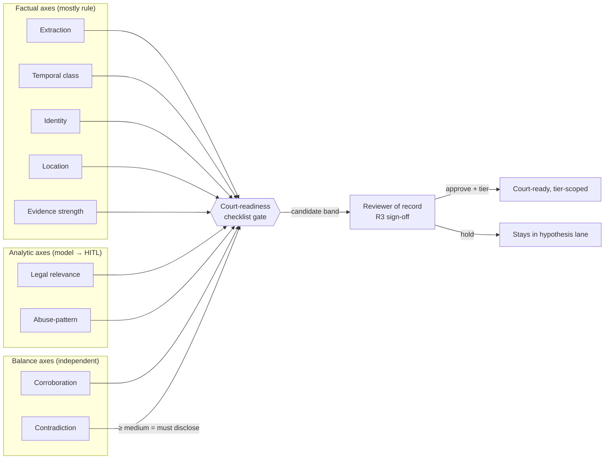
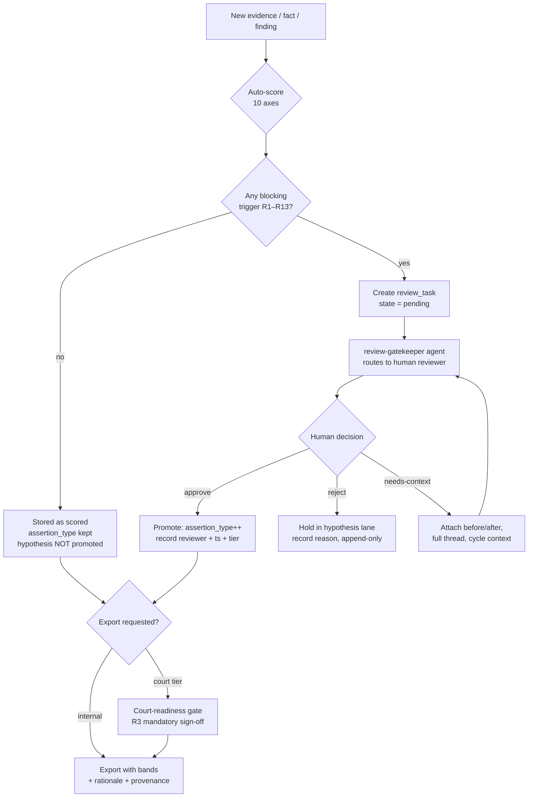

## Confidence, Scoring & Human Review Framework

> _Byline: Claude Code · Opus 4.8 (1M) · 2026-06-30_
> Grounds: CONTEXT_PACK §1 (locked stack), §2 (crosswalk + salem_v3), §5 (guardrails). Adopts the append-only / provenance / assertion-type primitives mandated for every row (CONTEXT_PACK §2 preamble) and the HITL-on-every-write principle (ADR-0025 review-gatekeeper; CONTEXT_PACK §3). Master prompt §15 + global Constraints honored.

---

### 1. Why ten *separate* scores, not one

A single "confidence" number collapses orthogonal failure modes and is indefensible in a court-facing package. A message can be **extracted perfectly** (extraction = 0.99) from an export whose **timestamp is unreliable** (temporal = 0.40), **attributed to an ambiguous sender** (identity = 0.55), carry **high emotional weight but low legal usefulness** (legal-relevance = 0.30), and be **uncorroborated** (corroboration = 0.10). One blended score would hide every one of those. We therefore keep **ten independent score axes**, each with its own provenance, its own method, its own review trigger, and its own decay behavior. They are *never* multiplied into a hidden composite that drives a court export — the composite (Court-Readiness) is itself an explicit, re-derivable, reviewer-gated score (replacing R5's hard-coded `0.6` HIGH/MED/LOW threshold in `vw_forensic_evidence_package`; see CONTEXT_PACK §2 `evidence_export`).

This directly implements the Constraint to **distinguish raw evidence vs extracted facts vs inferred facts vs analytical findings vs legal conclusions** — each layer is scored by a *different* subset of these axes (see §4).

| # | Score axis | Question it answers | Primary layer it attaches to |
|---|---|---|---|
| 1 | **Extraction confidence** | Did we read the bytes/text correctly from the source? | raw → extracted fact |
| 2 | **Temporal confidence** | How sure are we *when* it happened? | extracted fact, timeline event |
| 3 | **Identity confidence** | Are we sure *who* the actor/sender/subject is? | extracted fact, person edge |
| 4 | **Location confidence** | Are we sure *where* it happened? | geo location, timeline event |
| 5 | **Evidence strength** | How probative/authenticable is this item *as evidence*? | evidence item |
| 6 | **Legal relevance** | Does it bear on a recognized legal factor (MCL 722.23 A–L, etc.)? | analytical finding |
| 7 | **Abuse-pattern relevance** | Does it fit a behavioral pattern (303-lib / salem_v3 tactic)? | analytical finding (hypothesis) |
| 8 | **Corroboration strength** | How much independent evidence supports it? | claim / finding / event |
| 9 | **Contradiction strength** | How strongly does other evidence conflict with it? | claim / finding / event |
| 10 | **Court-readiness** | Is the *packaged* item safe to put in front of a court? | export bundle item |

---

### 2. Shared scoring primitives (the `score` value object)

Every score is stored as a **typed value object**, append-only, never overwritten (Constraint: *never overwrite earlier interpretations*; CONTEXT_PACK §5). Re-scoring inserts a new row and supersedes the prior via `valid_to`, mirroring the **bitemporal** pattern already locked for Graphiti / SurrealDB / Semantica (ADR-0014/0024; CONTEXT_PACK §1).

```sql
-- analysis.score : one row per (target, score_type, scoring_run). APPEND-ONLY.
CREATE TABLE analysis.score (
  score_id            uuid PRIMARY KEY DEFAULT uuidv7(),        -- ADR-0013 native uuidv7
  target_kind         text NOT NULL,    -- 'evidence_item' | 'timeline_event' | 'person_edge'
                                         -- | 'claim' | 'finding' | 'export_item' | ...
  target_id           uuid NOT NULL,    -- FK resolved per target_kind
  score_type          text NOT NULL,    -- enum of the 10 axes below
  -- value, always normalized 0.000–1.000 for machine use ...
  value               numeric(4,3) NOT NULL CHECK (value BETWEEN 0 AND 1),
  -- ... plus a human-facing band so non-developers / courts never see a bare float
  band                text NOT NULL,    -- 'very_low'|'low'|'medium'|'high'|'very_high'
  -- HOW the score was produced (auditability) ...
  method              text NOT NULL,    -- 'rule' | 'model' | 'human' | 'hybrid'
  method_detail       jsonb NOT NULL,   -- rule id / weights, model id+version, reviewer id
  -- provenance + lineage (Constraint: preserve provenance for every derived object) ...
  prompt_version      text,             -- if model-derived
  ontology_version    text,             -- salem_v3 tag / 303-lib version
  schema_version      text NOT NULL,
  scoring_run_id      uuid NOT NULL REFERENCES analysis.scoring_run(run_id),
  rationale           text NOT NULL,    -- 1–3 sentence court-safe justification
  evidence_refs       uuid[] NOT NULL,  -- ≥1 cite required for axes 5–10 (salem_v3 rule)
  -- assertion typing (Constraint: distinguish fact vs hypothesis) ...
  assertion_type      text NOT NULL,    -- 'extracted'|'inferred'|'analytical'|'legal_conclusion'
  -- bitemporal supersession ...
  valid_from          timestamptz NOT NULL DEFAULT now(),
  valid_to            timestamptz,                              -- NULL = current
  superseded_by       uuid REFERENCES analysis.score(score_id),
  created_by          text NOT NULL                             -- agent or human principal
);
```

**Band mapping (single source of truth, re-derivable, no magic numbers in views):**

| Band | Numeric range | Court-facing phrasing |
|---|---|---|
| very_low | 0.00–0.19 | "not established / speculative" |
| low | 0.20–0.39 | "weakly supported" |
| medium | 0.40–0.64 | "some support, needs corroboration" |
| high | 0.65–0.84 | "well supported" |
| very_high | 0.85–1.00 | "strongly supported / independently confirmed" |

Thresholds live in `reference.score_band_config` (a versioned table), **not** hard-coded in SQL — so the R5 `0.6` HIGH/MED/LOW cliff becomes an auditable, change-logged parameter (CONTEXT_PACK §2, `vw_forensic_evidence_package` → parameterized `evidence_export`).

**Calibration note:** all model-derived `value`s are stored *raw* and a calibrated value is recorded alongside in `method_detail.calibrated` once a labeled review set exists (see §7 feedback loop). Until calibration data exists, model scores are **capped at `high` band** for any court-export path — a model alone can never assert `very_high`.

**Supporting tables (referenced by §5 and §9; all append-only, `uuidv7()` PKs, in the `agno-postgres:18-duckdb` image, ADR-0013):**

```sql
-- analysis.scoring_run : one row per scoring invocation = the lineage anchor.
CREATE TABLE analysis.scoring_run (
  run_id           uuid PRIMARY KEY DEFAULT uuidv7(),
  agent            text NOT NULL,        -- e.g. 'ingestion' | 'analysis' | 'forensic-data-agent'
  model_id         text,                 -- LiteLLM model id (glm-5.1) or local ≤4B id; NULL if pure-rule
  model_version    text,
  prompt_version   text,                 -- prompt template tag (Constraint: trace prompt versions)
  ontology_version text,                 -- salem_v3 tag / 303-lib / mcl_722_23.ttl version
  schema_version   text NOT NULL,
  inputs_hash      text NOT NULL,        -- SHA-256 of the exact inputs (resumability / dedupe)
  ran_local_only   boolean NOT NULL,     -- TRUE if no cloud LLM touched evidence (ADR-0015 guard)
  started_at       timestamptz NOT NULL DEFAULT now(),
  finished_at      timestamptz,
  status           text NOT NULL DEFAULT 'running'  -- 'running'|'ok'|'error'
);

-- reference.score_band_config : versioned thresholds — NO magic numbers in views (kills R5's 0.6 cliff).
CREATE TABLE reference.score_band_config (
  config_version   text PRIMARY KEY,
  bands            jsonb NOT NULL,       -- [{band, lo, hi, phrasing}, ...]
  effective_from   timestamptz NOT NULL DEFAULT now(),
  changed_by       text NOT NULL,
  rationale        text NOT NULL
);

-- analysis.review_task : one blocking task per fired trigger R1–R13. APPEND-ONLY state log.
CREATE TABLE analysis.review_task (
  task_id          uuid PRIMARY KEY DEFAULT uuidv7(),
  trigger_code     text NOT NULL,        -- 'R1'..'R13'
  target_kind      text NOT NULL,
  target_id        uuid NOT NULL,
  score_ids        uuid[] NOT NULL,      -- exact score snapshot under review
  blocks           text NOT NULL,        -- what transition/export is blocked
  state            text NOT NULL DEFAULT 'pending',  -- 'pending'|'in_review'|'resolved'
  created_at       timestamptz NOT NULL DEFAULT now(),
  created_by       text NOT NULL
);

-- analysis.review_decision : the reviewer-of-record record. APPEND-ONLY, never overwritten.
CREATE TABLE analysis.review_decision (
  decision_id      uuid PRIMARY KEY DEFAULT uuidv7(),
  task_id          uuid NOT NULL REFERENCES analysis.review_task(task_id),
  reviewer         text NOT NULL,        -- human principal of record
  decision         text NOT NULL,        -- 'approve'|'reject'|'needs_context'
  tier_approved    text,                 -- 'internal'|'counsel'|'court' (disclosure tier, ADR-0014/0031)
  score_snapshot   uuid[] NOT NULL,      -- score_id[] exactly as reviewed
  prompt_version   text,
  ontology_version text,
  schema_version   text NOT NULL,
  rationale        text NOT NULL,        -- court-safe justification
  decided_at       timestamptz NOT NULL DEFAULT now()
);
```

---

### 3. The ten axes — definition, inputs, method, and floor rules

Each axis below gives: **definition**, **signal inputs** (from the adopted donors), **default method**, and the **hard floor / cap rules** that protect court-safety.

#### 3.1 Extraction confidence
- **Definition:** fidelity of the bytes→text/structured-fact conversion (OCR, HTML parse, XLSX/CSV ingest, JSON decode).
- **Inputs:** parser identity + version (`parser.*_html` configs, CONTEXT_PACK §2 — selectors brittle, pinned to export-vintage); OCR engine confidence per span (`evidence.image` OCR, from `screenshots`); decode error count; schema-conformance of `raw_payload`; checksum match (SHA-256 custody chain, DuckDbVault, CONTEXT_PACK §2).
- **Method:** `rule` primarily (deterministic parser/OCR self-report + conformance checks); `model` only to flag suspected mis-parses.
- **Floors:** any decode/parse error in the span → cap at `medium`. OCR span below engine threshold → cap at `low` and **auto-flag** for review. Brittle-selector parser on an **unrecognized export vintage** → cap at `medium` and flag (selectors may have silently shifted).

#### 3.2 Temporal confidence
- **Definition:** certainty of *when*. Directly implements the Constraint **exact / approximate / inferred / uncertain** timestamps as a first-class, scored attribute — not a free-text note.
- **Inputs:** the adopted `start_timestamp_raw` + `_utc` + `offset` triple (`timeline_enriched`, CONTEXT_PACK §2 = timestamp-certainty support); presence/absence of timezone; whether time is device-reported vs parser-inferred vs export-rendered (parser timestamps are **approximate unless corroborated**, CONTEXT_PACK §2); cross-source agreement on the same event.

| Timestamp class | Trigger | Default band | `temporal_class` enum |
|---|---|---|---|
| **exact** | source carries true UTC + offset, device-reported | very_high | `exact` |
| **approximate** | offset missing/assumed, or parser-rendered local time | medium | `approximate` |
| **inferred** | derived from ordering/context, no stamp on the item | low | `inferred` |
| **uncertain** | conflicting stamps across sources / known-bad export clock | very_low | `uncertain` |

- **Floors:** missing offset → never above `approximate`. Conflicting stamps across sources → `uncertain` **and** raise a Contradiction score (§3.9) on the temporal claim.

#### 3.3 Identity confidence
- **Definition:** certainty of *who* (sender, actor, subject, account-owner).
- **Inputs:** account handle ↔ `entity.person` resolution; multi-device attribution (`device_id` split, CONTEXT_PACK §2 = attribution on event/message); handle reuse / shared-device risk; graph corroboration (`Person` node, salem_v3); whether attribution is asserted by the platform vs inferred by us. **Cross-platform entity resolution is a flagged blind spot** (CONTEXT_PACK §4) → identity for cross-platform merges starts at `medium` and requires review before promotion.
- **Method:** `hybrid` — deterministic handle match (rule) + graph/embedding similarity (model, Milvus text 2048-d).
- **Floors:** shared/family device with no per-message authentication → cap `medium`. Inferred-only attribution → cap `low`. Any identity used to support an **abuse-pattern** finding against a named party must be ≥ `high` or the finding is held at hypothesis (HITL).

#### 3.4 Location confidence
- **Definition:** certainty of *where*.
- **Inputs:** the adopted geo stack (CONTEXT_PACK §2): `location_geokey` / geohash8-9 / r3–r5 rounding precision; multi-provider `geocode_resolution`; **`disagreement_flag` / `address_mismatch_flag`** (Jan-2026 variant) → provider disagreement = direct uncertainty signal; `geocode_audit` append-only trail.
- **Method:** `rule` (precision tier + provider agreement) with `model` only for free-text place extraction.
- **Floors:** `disagreement_flag = true` → cap `medium` and feed Contradiction score. Coarse rounding (r3) → cap `low` for any pinpoint claim ("was at <address>"); coarse geo can still be `high` for a coarse claim ("was in <city>"). Precision tier and claim granularity must match.

#### 3.5 Evidence strength
- **Definition:** how probative and **authenticable** the item is *as a piece of evidence* (foundation, completeness, custody) — uses the `evidence-review` / `mre-authentication` skill lane (CONTEXT_PACK §3).
- **Inputs:** intact SHA-256 + UUIDv7 chain of custody (CONTEXT_PACK §2); source completeness (full thread vs isolated screenshot — an isolated screenshot scores lower on foundation); presence of original `raw_payload`; whether the item is original vs derived/cropped; corroboration count (links to §3.8).
- **Method:** `rule` scaffold + mandatory human confirmation for `very_high`.
- **Floors:** broken/absent custody chain → cap `low` and **REQUIRE review**. Isolated screenshot with no surrounding thread → cap `medium` (a primary **selective-framing** risk; Constraint: identify selectively framed/quoted material — see §6).

#### 3.6 Legal relevance
- **Definition:** does the item bear on a recognized legal factor. **Analytical finding, never a legal conclusion** (Constraint: avoid legal advice). Maps to MCL 722.23 A–L via the `mcl_722_23.ttl` 12-factor model + `mcl-factor-mapper` skill (CONTEXT_PACK §2/§3).
- **Inputs:** factor-mapper output (which of A–L, with rationale); claim type; whether the link is direct or attenuated. **Legal schema beyond MCL A–L is a blind spot** (CONTEXT_PACK §4) → relevance to non-MCL theories is marked `provisional`.
- **Method:** `model` proposal → **always** human-reviewed before any court-facing use (master prompt §15 + Constraint: human review for legal-relevance labels).
- **Floors:** model-only legal relevance is capped `medium` and `assertion_type='analytical'`; it can **never** be emitted as `legal_conclusion` without a human reviewer of record. Carries the explicit flag **"emotionally important but may not be legally useful"** when emotional weight is high and factor-mapping is weak (Constraint: make this distinction clear).

#### 3.7 Abuse-pattern relevance
- **Definition:** fit to a behavioral pattern. **Hypothesis lane by construction** (CONTEXT_PACK §2 — `Vulnerability`/`Tactic`/sensitive edges are *preserve-as-hypothesis*; never auto-promote).
- **Inputs:** match against the 303-pattern library (`seed-patterns.ts` / `behaviors.yaml`), `behavioral_patterns.ttl`, and **`positive_behaviors.ttl`** (CONTEXT_PACK §2 — mandatory: the full relational cycle, not only adversarial conduct); `behavioral-pattern-analyzer` skill; pattern requires ≥ N supporting episodes over time (cycling is temporal).
- **Method:** `model` proposal scored low by default; **HITL is mandatory** before any sensitive label (gaslighting, coercive control, alienation, manipulation, weaponization, reactive abuse) leaves the hypothesis lane (Constraint + CONTEXT_PACK §5).
- **Floors:** **hard cap `medium`** and `assertion_type='analytical'` until human-approved; sensitive-label patterns are **blocked from court export** entirely until reviewer sign-off (§5 gate). Must score **both parties** including the user's own reactions (`REACTIVE_TO`, `REPAIR_ATTEMPT`, `LOVE_BOMBING`, `RelationshipPhase` — the salem_v3 MUST-EXTEND set, CONTEXT_PACK §2) — a one-sided abuse-pattern score on a single party with no cycle context is itself a review trigger.

#### 3.8 Corroboration strength
- **Definition:** weight of *independent* evidence supporting a claim/finding/event. Implements the `analysis.claim_verification` paired `claimed_*`/`observed_*` model (CONTEXT_PACK §2, from `expected_schedule`).
- **Inputs:** count + independence of corroborating items (independence matters: two screenshots of the same message ≠ two sources); cross-channel agreement (message + location + timeline); `linked_location_event_id` correlation primitive (TraceIQ, CONTEXT_PACK §2).
- **Method:** `rule` (counts independent custody-distinct sources) + graph traversal (Graphiti).
- **Scale:** 0 independent = `very_low`; 1 = `low`; 2 distinct channels = `medium`/`high`; 3+ independent cross-channel = `very_high`.

#### 3.9 Contradiction strength
- **Definition:** weight of evidence that **conflicts** with a claim/finding/event. The impeachment / `CONTRADICTS` primitive from salem_v3 (CONTEXT_PACK §2 — HITL).
- **Inputs:** conflicting timestamps (§3.2), provider geo disagreement (§3.4), `is_anomaly` from claim-verification, opposing statements (`MADE_STATEMENT` + `CONTRADICTS` edges), `disagreement_flag`/`address_mismatch_flag`.
- **Method:** `hybrid` — rule-detected hard conflicts + model-proposed soft conflicts.
- **Rule:** Corroboration and Contradiction are **independent axes**, not endpoints of one scale (an event can be both strongly corroborated *and* strongly contradicted — that is exactly the situation a court needs to see). **Any** Contradiction ≥ `medium` on an item bound for export **REQUIRES** review and a court-safe note of the conflict.

#### 3.10 Court-readiness (the gated composite)
- **Definition:** is the *packaged* item safe to put before a court. The only axis that is an explicit function of the others, and the only one a human **must** sign off before a `court` disclosure-tier export.
- **Inputs (all required ≥ threshold):** Extraction ≥ high; Temporal class declared (any class, but *declared and accurate*); Identity ≥ high (if a named party is implicated); Evidence strength ≥ medium with intact custody; Legal relevance human-reviewed; Abuse-pattern labels (if any) human-approved & court-safe-worded; Contradiction disclosed; selective-framing check passed (§6).
- **Method:** `rule` gate computes a *candidate* band; **human reviewer of record** sets the final value. No path produces a `court`-tier export at `high`/`very_high` court-readiness without a recorded human decision (ADR-0025 review-gatekeeper).
- **Hard rule:** Court-readiness is **never** auto-derived as a silent product of the other nine. It is a checklist gate + human sign-off, stored with the reviewer identity, timestamp, and the disclosure tier it was approved for (Graphiti disclosure-tier multi-pass, ADR-0014/0031).

**How the nine axes feed the gated tenth** (the gate yields only a *candidate* — a human sets the final value):



---

### 4. Which axes apply to which evidence layer

This table operationalizes the Constraint to **distinguish raw evidence / extracted facts / inferred facts / analytical findings / legal conclusions** — each layer is scored only by the axes that are meaningful for it.

| Layer (`assertion_type`) | Ext | Temp | Iden | Loc | Str | Legal | Abuse | Corrob | Contra | Court |
|---|:--:|:--:|:--:|:--:|:--:|:--:|:--:|:--:|:--:|:--:|
| **Raw evidence** (`raw_payload`, custody) | ✔ | – | – | – | ✔ | – | – | – | – | – |
| **Extracted fact** (message, OCR span, event) | ✔ | ✔ | ✔ | ✔ | ✔ | – | – | ✔ | ✔ | – |
| **Inferred fact** (`anchor_location`, ordering) | – | ✔ | ✔ | ✔ | – | – | – | ✔ | ✔ | – |
| **Analytical finding** (claim-verify, pattern) | – | ✔ | ✔ | – | – | ✔ | ✔ | ✔ | ✔ | – |
| **Legal conclusion** (human only) | – | – | – | – | – | ✔ | – | ✔ | ✔ | ✔ |
| **Export bundle item** | inherits min() of constituents | | | | | | | | | ✔ |

An export item's inherited axis = the **minimum** band across its constituents (weakest link governs), surfaced transparently in the package — never hidden.

---

### 5. When human review is REQUIRED (the HITL gate matrix)

HITL is the platform default on every *write* (CONTEXT_PACK §1; ADR-0025 review-gatekeeper agent, CONTEXT_PACK §3). Beyond that baseline, the following are **mandatory, blocking** review triggers — the row cannot advance assertion-type or reach export until a human reviewer of record signs off. Each trigger writes a `review_task` and blocks the downstream transition.

| # | Trigger condition | What is blocked | Reviewer role |
|---|---|---|---|
| R1 | Any **sensitive abuse-pattern label** (gaslighting, coercive control, alienation, manipulation, weaponization, reactive abuse) proposed | promotion out of hypothesis lane; any court output | domain reviewer (owner) |
| R2 | **Legal-relevance** label proposed (MCL factor mapping) | use as `legal_conclusion`; court export | legal-aware reviewer |
| R3 | **Court-readiness** sign-off for any `court` disclosure-tier export | the export itself | reviewer of record |
| R4 | `requires_in_camera_review` / `is_sensitive` / `is_private` flag set (TraceIQ `is_private`, `screenshots.is_sensitive`, CONTEXT_PACK §2) | inclusion in any shared/export bundle | owner |
| R5 | **Contradiction ≥ medium** on an export-bound item | export until conflict disclosed | reviewer |
| R6 | **Custody chain broken/absent** (no SHA-256 match) | evidence-strength > low; export | owner |
| R7 | **Identity < high** but item names/implicates a specific party | abuse/legal findings against that party | reviewer |
| R8 | **Selective-framing risk** detected (isolated screenshot, quote w/o surrounding thread, reaction w/o before/after) | export without context attachment | reviewer |
| R9 | **User's own conduct** (mistake, escalation, apology, repair) being scored or framed | any finding involving the user | owner (anti-self-justification check) |
| R10 | **Watchlist / alert severity** label (`severity`, `reason_flagged` from split `problematic_locations_contacts`, CONTEXT_PACK §2) | promotion of watchlist hypothesis to finding | reviewer |
| R11 | **One-sided cycle modeling** (negative-only pattern with no positive/neutral/repair context for the same dyad over the window) | the finding | reviewer (full-cycle guardrail) |
| R12 | **Model `very_high`** claimed pre-calibration, or model overriding a rule/human score | the score's promotion above `high` | reviewer |
| R13 | **New export disclosure tier** raised (internal → counsel → court) | the tier change | reviewer of record |



**Reviewer-of-record record** (append-only, never overwritten) is stored in `analysis.review_decision` with: reviewer principal, decision, disclosure tier approved, rationale, the exact score snapshot reviewed (`score_id[]`), prompt/ontology/schema versions in force, and timestamp — completing the **artifact lineage** chain (Constraint: trace outputs back to source evidence, runs, prompt versions, ontology versions, schema versions, and human-review decisions).

---

### 6. Selective-framing & both-sides safeguards (scoring-level)

Implements the Constraints on selective framing, contextual harm vs proven causation, and modeling the user's own conduct.

- **Selective-framing detector (feeds R8):** flags items where (a) a screenshot/quote lacks its surrounding thread (`evidence.message` thread completeness), (b) a reaction event has no `before`/`after` neighbors in `timeline.event` (Constraint: evaluate reactions in temporal context), or (c) an item's emotional weight ≫ its corroboration. Flag lowers **Evidence strength** and raises a **court-safety risk note**: *"could be strategically dangerous if presented without context"* (Constraint).
- **Explanation ≠ excuse:** the user's own escalations/apologies/repairs are scored on the **same** axes as the partner's conduct (R9), with `REACTIVE_TO` / `REPAIR_ATTEMPT` edges (salem_v3 extension). No axis grants the user a self-justification bonus; abuse-pattern scoring on the partner that lacks the user-side cycle context is held by R11.
- **Causation discipline:** Abuse-pattern and Legal-relevance scores assert *contextual harm / association*, never *proven causation* — `rationale` must use court-safe associational language ("temporally associated with", not "caused"). Causation claims are `legal_conclusion` (human-only, R2).
- **Emotional vs legal split:** a high emotional-weight / low legal-relevance item is retained, scored, and **labeled** ("emotionally important, may not be legally useful") rather than dropped — and is steered toward the framing *structure, safety, clarity, child stability* over blame (Constraint).

---

### 7. Re-scoring, decay, calibration, and persistence

- **Append-only re-scoring:** any new run inserts new `score` rows and sets `valid_to`/`superseded_by` on the prior — prior interpretations are preserved (Constraint; bitemporal pattern, ADR-0024). Nothing is overwritten.
- **Staleness / decay:** parser-derived Extraction scores and cross-platform Identity scores carry a `recheck_after` (CONTEXT_PACK §4 — brittle selectors pinned to export vintage; cross-platform ER is a blind spot). On schema/ontology/prompt-version bump, affected scores are marked `stale` (not deleted) and queued for re-score. A court-readiness sign-off is **invalidated** if any constituent score is superseded after sign-off (forces re-review, R3).
- **Calibration loop:** human decisions (`review_decision`) are the labeled set. Per model + prompt version we track agreement between model band and human band; until a model reaches calibration threshold on an axis, its scores on that axis are capped at `high` (§2). Calibration metrics are themselves versioned records.
- **Persistence / resumability:** every scoring run is a `scoring_run` row (run id, agent, model+version, prompt version, ontology version, schema version, inputs hash) — intermediate work products (drafts, tool-call outputs, model interpretations) are persisted, not discarded (Constraint), and kept in the **hypothesis lane separate from canonical facts**. Durable facts/decisions are also recorded to Graphiti (CONTEXT_PACK §3) so scoring rationale survives across sessions — *but raw sensitive evidence is never fed to the cloud LLM extraction path* (CONTEXT_PACK §3 caveat; evidence content stays local, ADR-0015).

---

### 8. Worked example (illustrative, schema-grounded)

An isolated screenshot of a hostile message, OCR'd, attributed to the partner's handle, no surrounding thread, timestamp rendered in local time without offset, geo from one provider:

| Axis | Band | Why | Trigger fired |
|---|---|---|---|
| Extraction | high | OCR span above engine threshold, checksum intact | – |
| Temporal | medium (`approximate`) | local time, offset missing | – |
| Identity | medium | handle match but shared-device risk unconfirmed | R7 (names partner) |
| Location | low | single provider, no agreement signal | – |
| Evidence strength | medium → capped | isolated screenshot, no thread foundation | R8 |
| Legal relevance | medium (provisional) | maps weakly to a factor; model-only | R2 |
| Abuse-pattern | medium (hypothesis) | fits a tactic but no cycle context for the dyad | R1, R11 |
| Corroboration | very_low | 0 independent sources | – |
| Contradiction | low | none detected yet | – |
| Court-readiness | **blocked** | fails R3 checklist (R1/R2/R7/R8/R11 open) | R3 |

Outcome: stored, fully scored, preserved with provenance — **not** promoted to fact, **not** exportable to court until the partner-side identity is confirmed, the surrounding thread is attached, the dyad's cycle context (including any user-side reactions) is supplied, and a reviewer of record signs off.

---

### 9. Implementation checklist (developer-facing)

1. Create `analysis.score`, `analysis.scoring_run`, `analysis.review_task`, `analysis.review_decision`, `reference.score_band_config` in the `agno-postgres:18-duckdb` image (ADR-0013); all append-only, `uuidv7()` PKs.
2. Wire the 10 axes as pluggable scorers (rule modules + model calls via LiteLLM :4000 / glm-5.1; embeddings via Milvus per ADR-0026) with the floor/cap rules in §3 enforced as DB CHECK + service-layer guards.
3. Implement triggers R1–R13 as the `review-gatekeeper` agent's blocking gates (ADR-0025); no write that hits a trigger advances assertion-type without a `review_decision`.
4. Replace `vw_forensic_evidence_package`'s hard-coded `0.6` with the parameterized `evidence_export` reading `score_band_config` (CONTEXT_PACK §2).
5. Enforce the §4 layer-axis matrix and the export `min()`-inheritance rule in the export builder.
6. Record run/prompt/ontology/schema versions on every score and decision for full lineage; mark stale on version bumps; invalidate court sign-offs on constituent supersession.

---

### 10. Gaps / needs-human-review flags for this section

- **Calibration is bootstrapped, not proven:** numeric band thresholds (§2) and the floor/cap rules (§3) are reasonable defaults but **must be tuned against a real labeled review set** before any court-tier reliance — owner decision needed on initial thresholds.
- **Cross-platform entity resolution** (Identity axis) remains a CONTEXT_PACK §4 blind spot; the `medium`-cap + R7 gate is a mitigation, not a solution.
- **Legal-relevance beyond MCL 722.23 A–L** is provisional (CONTEXT_PACK §4); any non-MCL legal theory mapping needs a human legal-aware reviewer and a schema extension ADR.
- The minimum-episode count `N` for an abuse-pattern to leave hypothesis (§3.7) is left as an owner-tunable parameter, not fixed here.
