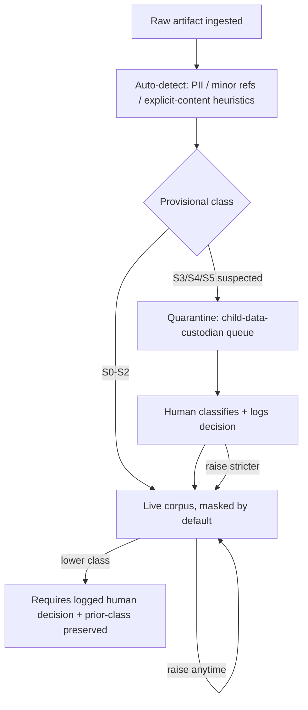
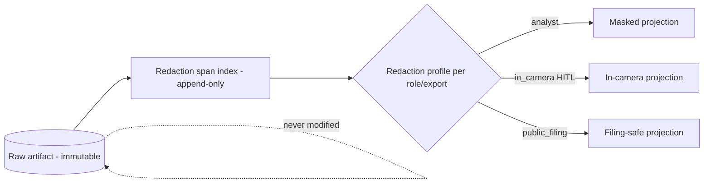
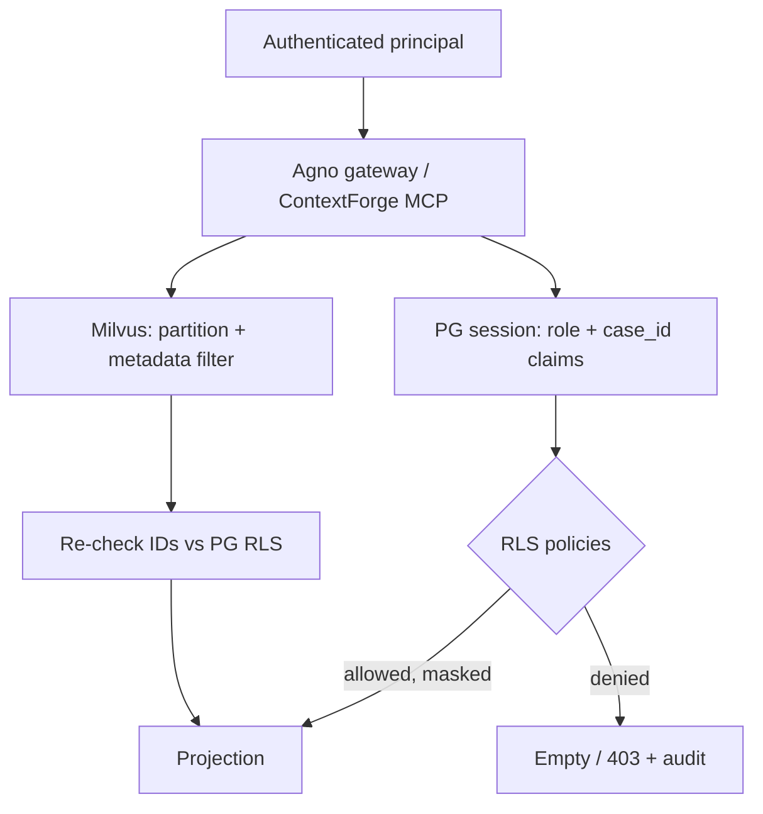
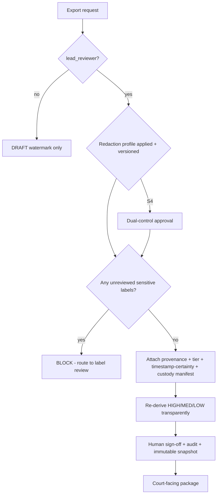
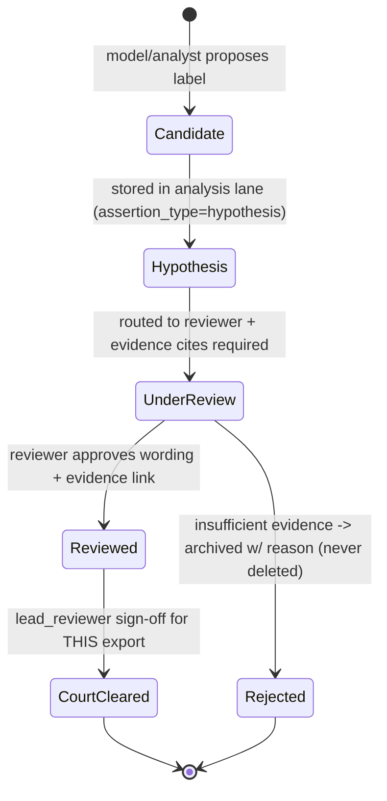

## Security, Privacy & Safety Constraints

> _Byline: Claude Code · Opus 4.8 (1M) · 2026-06-30_
> Grounded in CONTEXT_PACK §1 (locked stack), §2 (crosswalk), §5 (guardrails). SSOT docs (`Agno-MCP-Platform/docs/PROJECT_CANON.md`) win on conflict. ADR references are to the platform ADR set unless noted.

This section is split into two intertwined concerns that the master prompt treats as one: **(A) Security & Privacy** — the technical controls that keep a forensic evidence corpus confidential, intact, and access-governed; and **(B) Safety** — the editorial/analytical controls that keep the system from defaming a party, overstating an allegation, or pushing an un-reviewed sensitive label into a court-facing artifact. Both are *non-negotiable* and both are enforced at the database layer, not only in application code, because the corpus contains **child-related data, intimate-partner conduct, and material that may eventually be filed in a Michigan custody/PPO proceeding**.

A guiding distinction runs through everything below — the five-tier epistemic ladder from the cross-cutting guardrails (CONTEXT_PACK §5):

| Tier | Definition | Example | Court-facing without human review? |
|---|---|---|---|
| **Raw evidence** | Byte-for-byte original artifact | a Facebook HTML export, a screenshot PNG | Yes (it *is* the record), but only via custody-verified export |
| **Extracted fact** | Deterministically parsed from raw | OCR text, a parsed message row, a geocode | Yes, if linked to source span + parser version |
| **Inferred fact** | Derived by rule/heuristic | `home_base`, multi-device attribution | No — flagged inferred |
| **Analytical finding** | Model/analyst interpretation | `is_anomaly`, claim-vs-evidence mismatch | No — HITL required |
| **Legal conclusion** | Maps facts to legal relevance / sensitive label | "coercive control", MCL 722.23 factor | **Never** without explicit human sign-off |

Every control in this section is keyed to *which tier it protects* and *which tier it gates*.

---

### A. Data Classification & Sensitivity Tiers

Nothing can be protected uniformly because the corpus is heterogeneous. We assign every row and object a **sensitivity class** that drives encryption, RBAC, redaction, audit verbosity, and export eligibility. This is stored as a first-class column (`sensitivity_class`), not inferred at query time.

| Class | Covers | Default access floor | Redaction default | Export default |
|---|---|---|---|---|
| `S0_PUBLIC` | Case caption metadata, schema/ontology versions, ADR refs | reviewer | none | allowed |
| `S1_INTERNAL` | Processing runs, prompt versions, tool-call logs, indexes | analyst | none | allowed (work product) |
| `S2_SENSITIVE` | Adult-party messages, timeline events, geo, social actions | analyst | PII tokens masked | gated by export policy |
| `S3_CHILD` | Any record naming/depicting/concerning a **minor** | child-data custodian | minor identifiers tokenized **by default** | **blocked** unless minor-redaction profile applied + HITL |
| `S4_INTIMATE` | Sexual content, medical, `requires_in_camera_review` (`is_private` from TraceIQ), nude/explicit imagery | child-data custodian + lead reviewer | full body redaction, metadata-only preview | **blocked** unless court-order / in-camera profile + dual HITL |
| `S5_LEGAL_PRIV` | Attorney communications, work-product marked privileged | lead reviewer only | sealed | never auto-export |

**Adoption note:** TraceIQ V4.1's `is_private` flag is adopted as `requires_in_camera_review` (CONTEXT_PACK §2); `screenshots.is_sensitive` maps to `S4_INTIMATE` candidacy. Both carry HITL per the crosswalk. The class is **append-only and monotonic toward stricter**: a human may *raise* sensitivity instantly; *lowering* it (e.g., declassifying an image determined not to depict a minor) requires a logged human decision (see §D Audit) and preserves the prior class.

Auto-detection is **fail-safe**: ambiguous artifacts default to the *stricter* provisional class and route to the child-data-custodian quarantine queue (reuses the existing `casebible-quarantine` bucket pattern, CONTEXT_PACK memory: CaseBible R2 route). The cloud LLM (Ollama `glm-5.1` via LiteLLM) is **never** the auto-classifier of record for S3+/explicit content — heuristic detection runs locally; cloud models only see redacted derivatives (see §H).

---

### B. Child-Related Data Safeguards (S3 / S4)

Child data gets the strongest treatment because the harm of leakage or mishandling is irreversible and the legal exposure is highest.

1. **Minor registry & tokenization.** Every identified minor is a row in `entity.minor` with a stable surrogate token (`MINOR_<uuidv7>`, using the native `uuidv7()` from `agno-postgres:18-duckdb`, ADR-0013). Free-text and message bodies referencing the minor are stored raw (never overwrite — guardrail), but a **redaction overlay** (§C) substitutes the token in any rendered/exported view. The mapping table (`security.minor_identity_map`) is itself `S5`-class, encrypted, and accessible only to the child-data custodian role.
2. **Default-deny exposure.** S3 rows are invisible to the `analyst` role's default views; analysts see token-masked projections. Unmasking is an explicit, audited action by a `child_data_custodian`.
3. **No minor data to cloud.** Hard rule (CONTEXT_PACK §1: "evidence content stays local"; ADR-0015 CPU-only/cloud-primary). Minor identifiers, faces, and bodies are stripped/blurred *before* any cloud LLM or cloud embedder (NVIDIA NIM) call. Text embeddings of S3 content use the **local ≤4B** path or are skipped; explicit imagery (S4) is **never** embedded by a cloud vision model.
4. **CSAM tripwire.** If explicit-content heuristics flag possible imagery of a minor, the artifact is **frozen** (no analyst access, no embedding, no export), the custodian is alerted, and the event is written to the immutable audit log. The system surfaces a notice that such material may carry **mandatory-reporting and law-enforcement-handling obligations** — *this is a routing/flagging control, not legal advice* (Constraints: "avoid legal advice"). The platform does not itself transmit such material anywhere.
5. **Best-interest framing.** Per the safety guardrails, child-related analysis is framed around **"structure, safety, clarity, and child stability"** (Constraints L2468), never as ammunition. The `mcl_722_23.ttl` 12-factor mapper (CONTEXT_PACK §2) operates only over reviewed facts and outputs *candidate factor relevance*, never a conclusion.

---

### C. Redaction Architecture

Redaction is **non-destructive and layered** — we never alter the raw artifact (guardrail: "never overwrite original evidence"). Redaction is a *view/derivation*, reversible only by authorized roles, fully audited.

**Model: store-once, redact-on-render.**

| Component | Mechanism | Tier protected |
|---|---|---|
| Raw store | Immutable object in R2 (`nexus`/`casebible-*`), SHA-256 + uuidv7 custody chain (adopted from DuckDbVault, CONTEXT_PACK §2) | raw evidence |
| PII span index | `security.redaction_span` table: `(artifact_id, char_start, char_end, span_type, sensitivity_class, detector, detector_version, confidence, review_status)` — append-only | extracted facts |
| Redaction profile | Named rule set: which span_types to mask for which role/export (e.g., `minor_redaction`, `in_camera`, `public_filing`) | all |
| Render-time engine | Applies profile → produces masked projection; original spans never deleted | all |

**Implementation grounding:** PG `pgcrypto` (present in the custom image, ADR-0013) for deterministic tokenization where format-preservation matters; `pg_trgm` + regex detectors for PII span discovery; PostGIS for geo-redaction (coarsening — see below). Reversal of a token requires the role-appropriate key and writes an audit row.

**Geo-redaction** reuses the adopted geo stack: rather than null-out, we *coarsen* — drop from geohash8-9 to r3-r5 rounding (CONTEXT_PACK §2) for lower-trust viewers, preserving analytic utility while protecting a residence/school address (especially near a minor's location). The original precise geohash stays in the `S2/S3` raw lane.

Every redaction profile is **versioned** (lineage requirement, Constraints L2436/L2452): an export records exactly which profile version produced it, so a later reviewer can reproduce or challenge the redaction.

---

### D. Access Control & Role-Based Permissions (RBAC + RLS)

Access is enforced **at the database layer** via PostgreSQL Row-Level Security (RLS) on the `agno-postgres:18-duckdb` instance, *not* solely in the Agno application tier — so a compromised app or a direct `psql` session cannot bypass it. This closes the "DB-layer PII/RLS/redaction" blind spot called out in CONTEXT_PACK §4.

**Roles** (least-privilege; a person may hold several):

| Role | Can read | Can write | Notes |
|---|---|---|---|
| `viewer` | S0–S1, masked S2 | nothing | external/limited |
| `analyst` | S0–S2 (masked PII), S3 tokenized | hypotheses, draft findings (analysis lane only) | cannot write canonical facts; cannot unmask |
| `reviewer` | + unmasked S2, S3 tokenized | approve/reject findings; promote draft→reviewed | the HITL gate |
| `lead_reviewer` | + S4 (in-camera), S5 | sign-off court-facing exports; manage profiles | dual-control for S4/S5 |
| `child_data_custodian` | + S3 unmask, minor identity map | classify/reclassify minors; CSAM freeze | scarce, named individuals |
| `ingest_service` | write-only to raw + staging | append raw, custody rows | non-human; no read of derived |
| `auditor` | audit logs (read-only) | nothing | cannot read evidence; separation of duties |
| `dba` | schema/operations | DDL, backups | **no decrypted S3/S4 content** (keys held off-box) |

**Enforcement mechanics:**
- RLS policies key off `sensitivity_class`, `case_id` (multi-case scoping — generalize salem_v3's "Salem v. Kinzel" caption into `case_id`, CONTEXT_PACK §2), and the session role/grants.
- Writes to **canonical evidence facts are denied to all human roles**; facts enter only via the validated `forensic-data-agent` path (CONTEXT_PACK §3) which enforces provenance + assertion-type. Humans write to the *analysis/hypothesis* lane, then *promote* via reviewer approval. This operationalizes "HITL on every write" (CONTEXT_PACK §1) and "never silently promote a hypothesis into a fact" (Constraints L2469).
- `pg_duckdb` cross-source reads (files/S3/relational, ADR-0030/0032) inherit the same RLS — a DuckDB-routed query cannot read rows the role can't see, because it executes inside the RLS-governed PG session (not a standalone DuckDB service, per the ADR-0003-survivor rule, CONTEXT_PACK §1.x).
- Milvus (vector store, ADR-0026/0027) has no native RLS; we enforce there by **per-collection partitioning by sensitivity/case** and a metadata filter injected by the gateway — and by **never embedding S4 / minor imagery at all**. Vector hits return IDs that are re-checked against PG RLS before any payload is shown (defense in depth).

---

### E. Audit Logging

Auditability is a first-class requirement ("this system may eventually produce court-facing evidence packages, so auditability matters", Constraints L2424). Audit is **append-only, tamper-evident, and separated from operators**.

**What is logged (every event carries `who / role / what / which rows / when (exact ts) / why / from where`):**

| Event class | Examples |
|---|---|
| Access | reads of S3+/S4 content, unmask actions, exports |
| Mutation | every append to raw, fact promotion, classification change, redaction-profile change |
| Review decisions | approve/reject finding, sensitive-label sign-off, export sign-off, declassification |
| Pipeline | ingest run, parser version, prompt version, model/embedder version, tool-call outputs |
| Security | failed authz, CSAM freeze, key-access, role grant change |

**Tamper-evidence:** the audit table is hash-chained (each row stores `prev_row_hash`, SHA-256 over the canonical row + prev hash — same primitive as the evidence custody chain, CONTEXT_PACK §2). A periodic chain root is anchored externally (object-store write-once + optionally R2/Iceberg time-travel snapshot, CONTEXT_PACK §4 blind spot) so post-hoc edits are detectable. The `auditor` role can read but **not write**; the `dba` can manage storage but inserts are append-only via trigger and the chain would break on tampering. This separation-of-duties is itself part of the chain-of-custody story for a court.

**Lineage = audit's analytic twin.** Beyond security events, we persist full **artifact lineage** (Constraints L2436/L2452): final output → human-review decisions → ontology version → schema version → prompt version → processing run → source evidence. Implemented as append-only `provenance_edge` rows plus the Graphiti/Semantica bitemporal substrate (ADR-0014/0024; CANON §5) so "what did we know and when" is reconstructable (valid-time + knowledge-time).

---

### F. Encryption

| State | Control | Grounding |
|---|---|---|
| **At rest — object store** | R2 server-side encryption for `nexus`/`casebible-*`; S4/S5 objects additionally **client-side encrypted** before upload (envelope encryption) | ADR-0007/0030 |
| **At rest — PG** | Full-volume encryption on the Coolify host (bind-mounted data dir, per the mapped-volumes preference); column-level `pgcrypto` for S3 minor-identity map, S5 privileged content, and token-reversal secrets | ADR-0013; CONTEXT_PACK mem (docker mapped volumes) |
| **At rest — Milvus / Neo4j / SurrealDB** | Volume encryption; **no plaintext S4/minor content stored there at all** (only redacted derivatives / IDs) | ADR-0026/0014/0024 |
| **In transit** | TLS for all service-to-service; Tailscale tailnet for inter-box (Windmill/CaseBible pattern already Tailscale-only) | CONTEXT_PACK mem (Windmill) |
| **Key management** | Keys (pgcrypto master, envelope keys) held in a secrets manager / Doppler, **not** in the DB or repo; `dba` role cannot read S3/S4 plaintext because it lacks the decryption keys (key-operator ≠ data-operator separation) | global tooling; doppler-workflows skill |

**Cloud boundary:** because compute is cloud-primary but **evidence content stays local** (ADR-0015), the in-transit control that matters most is the *content-stripping boundary* at the LiteLLM/NIM egress (see §H), not just TLS. Encryption protects the at-rest corpus; the egress filter protects against the corpus leaving in plaintext.

---

### G. Export Controls

Exports are the highest-risk operation: this is where data leaves the controlled environment and potentially enters a court file. The adopted primitive is the **parameterized `evidence_export`** (replacing TraceIQ's hard-coded `vw_forensic_evidence_package` with its baked-in 0.6 threshold — CONTEXT_PACK §2).

**Export gate (all conditions required):**

1. **Role:** only `lead_reviewer` may finalize a court-facing export; `reviewer` may produce internal drafts watermarked `DRAFT — NOT FOR FILING`.
2. **Redaction profile applied & versioned** (§C); S3 requires `minor_redaction`, S4 requires `in_camera` + **dual control** (two named approvers).
3. **Sensitive-label clearance:** no `S5` content and **no un-reviewed sensitive label** (gaslighting, coercive control, alienation, weaponization, reactive abuse) may appear unless explicitly human-approved for *this* export (§I).
4. **Provenance bundle attached:** every claim in the export carries its tier (raw/extracted/inferred/finding/conclusion), provenance chain, and timestamp-certainty (exact/approximate/inferred/uncertain — Constraints L2421). HIGH/MED/LOW confidence is **re-derived transparently** at export time, never a hard-coded cutoff (CONTEXT_PACK §2).
5. **Custody manifest:** SHA-256 of each included artifact + the audit chain root, so the export is independently verifiable.
6. **Audit + immutable snapshot:** the export, its parameters, profile version, and approver identities are written to the append-only log and snapshotted.

---

### H. Cloud-LLM / Egress Safety Boundary

A dedicated control because the stack is cloud-primary (Ollama `glm-5.1`, NVIDIA NIM via LiteLLM :4000, ADR-0015) yet **evidence content must stay local**.

- **Egress filter at the gateway:** before any prompt/embedding leaves for a cloud endpoint, a local pass strips/tokenizes S3 minor identifiers and refuses S4 content outright. Logged as a security event.
- **Graphiti caution:** do not feed raw sensitive evidence into cloud-LLM-backed extraction (CONTEXT_PACK §3); Graphiti receives **reviewed, redacted facts**, not raw S2–S4 bodies.
- **Local-only lane** for the most sensitive analysis: local ≤4B models for tasks that cannot tolerate egress; if quality is insufficient, the task is queued for human handling rather than sent to cloud.
- **Prompt-injection defense:** evidence text is *data, not instructions*. The forensic agents treat parsed message/OCR content as untrusted input; tool-use is mediated by ContextForge (ADR-0025) with allow-listed tools, so a malicious string inside an exhibit cannot trigger an export or unmask.

---

### I. Safety: Defamation, Misclassification, Overstatement & Sensitive Labels

This is the editorial firewall. The same fact, worded two ways, is either court-safe or defamatory. The architecture enforces *language discipline and review*, not just access control.

**Core rules (from CONTEXT_PACK §5 and Constraints L2440–L2474), each mapped to a mechanism:**

| Safety requirement | Mechanism in the architecture |
|---|---|
| Never present allegation as established fact | `assertion_type` mandatory on every node/edge (salem_v3 extension, CONTEXT_PACK §2); renderer phrases by tier ("reported", "appears", "is established by Exhibit X") |
| Never auto-promote hypothesis → fact | Hypotheses live in the analysis lane; promotion needs reviewer approval (§D); append-only, prior version preserved |
| Sensitive labels need human review | `CONTRADICTS`, `USED_TACTIC`, `EXPLOITED_VULNERABILITY`, `EXPOSED_CHILD`, `DISPARAGED`, etc. are **HITL-gated** and **never auto-promoted to fact** (CONTEXT_PACK §2 salem_v3); blocked from export until signed (§G) |
| Misclassification risk | Every classification stores `detector`, `version`, `confidence`, `review_status`; low-confidence routes to human; reclassification is append-only with prior preserved |
| Overstating allegations | Confidence (HIGH/MED/LOW) re-derived transparently; "what requires corroboration" and "what is emotionally important but may not be legally useful" are explicit fields, not buried (Constraints L2471–L2473) |
| Selective framing / weaponization | `reactive_to` / temporal-context modeling (salem_v3 extension): a reaction is stored *with* its before/after window; the system flags quotes that may have been "selectively framed, quoted, or weaponized without context" (Constraints L2446/L2462) |
| Both-sides fairness | Full relational cycle modeled (`RelationshipPhase`, `REPAIR_ATTEMPT`, `LOVE_BOMBING`, `positive_behaviors.ttl`); the user's own mistakes/apologies are first-class, not omitted (Constraints L2440–L2443; CONTEXT_PACK §5) |
| Explanation ≠ excuse; contextual harm ≠ proven causation | Separate fields for `surface_tone`, `inferred_intent`, `relational_function`, `cycle_phase`, `temporal_context` (Constraints L2433); causation flagged as inferred unless evidence supports |

**Sensitive-label lifecycle (mandatory gate):**

A label can be *cleared for one export and not another* — clearance is scoped, audited, and re-evaluated per filing. Rejected labels are **archived with a reason**, never deleted (never-delete guardrail).

---

### J. Trauma-Informed Language

The corpus documents grief, parental-identity attacks, and child-access pressure (Constraints L2447/L2463). The system's *own* outputs and UI must not re-traumatize or sensationalize.

- **Neutral, court-safe register by default.** Generated narratives are "review-ready factual summaries, not legal advice" (Constraints L2466) framed around "structure, safety, clarity, and child stability" (L2468). Inflammatory adjectives are linted out; the renderer prefers evidence-anchored phrasing.
- **Separation of registers** (Constraints L2467): `emotional_truth`, `factual_support`, `legal_usefulness`, and `court_safe_wording` are stored as **distinct fields**, so a viewer can see the emotional weight without it contaminating the filing-safe text.
- **Vulnerability data is evidence-gated** (L2447): grief triggers and parental-identity attacks are tracked **only where evidence supports**, marked sensitive, and never used to characterize a person absent corroboration.
- **Content warnings & soft-reveal** in any UI surfacing S4/abuse content; metadata-first, body-on-explicit-action.
- **No sentiment one-sidedness** (L2431–L2433): tone modeling is multi-dimensional and applied symmetrically to both parties.

---

### K. Human Approval Before Court-Facing Use (HITL Summary)

The single most important control, stated as the system invariant: **no artifact reaches a court-facing surface without a logged human decision at every tier-crossing.**

| Transition | Approver | Logged? |
|---|---|---|
| hypothesis → reviewed fact | reviewer | yes |
| sensitive label → cleared | reviewer + lead_reviewer | yes (dual) |
| S3 unmask | child_data_custodian | yes |
| S4 access/export | lead_reviewer + 2nd approver (dual) | yes |
| any court-facing export | lead_reviewer | yes (+ immutable snapshot) |
| declassification | role-appropriate + prior class preserved | yes |

This is enforced by the review-gatekeeper agent (CONTEXT_PACK §3) and DB-layer write restrictions (§D), making "HITL on every write" (CONTEXT_PACK §1) structurally true rather than procedural.

---

### Needs-human-review / Gaps flagged

- **DB-layer RLS/redaction is a design-from-scratch area** (CONTEXT_PACK §4 blind spot): no live DDL exists for these policies yet — the RLS policy set, redaction span schema, and minor-identity-map encryption need an owner-approved ADR before build. Likewise Milvus has **no native RLS**, so the partition+re-check pattern (and the rule that S4/minor imagery is never embedded) must be validated against the as-built Milvus on ovh2. CSAM-tripwire handling touches mandatory-reporting/law-enforcement obligations that are explicitly out of scope here (no legal advice) and require human + counsel direction.
