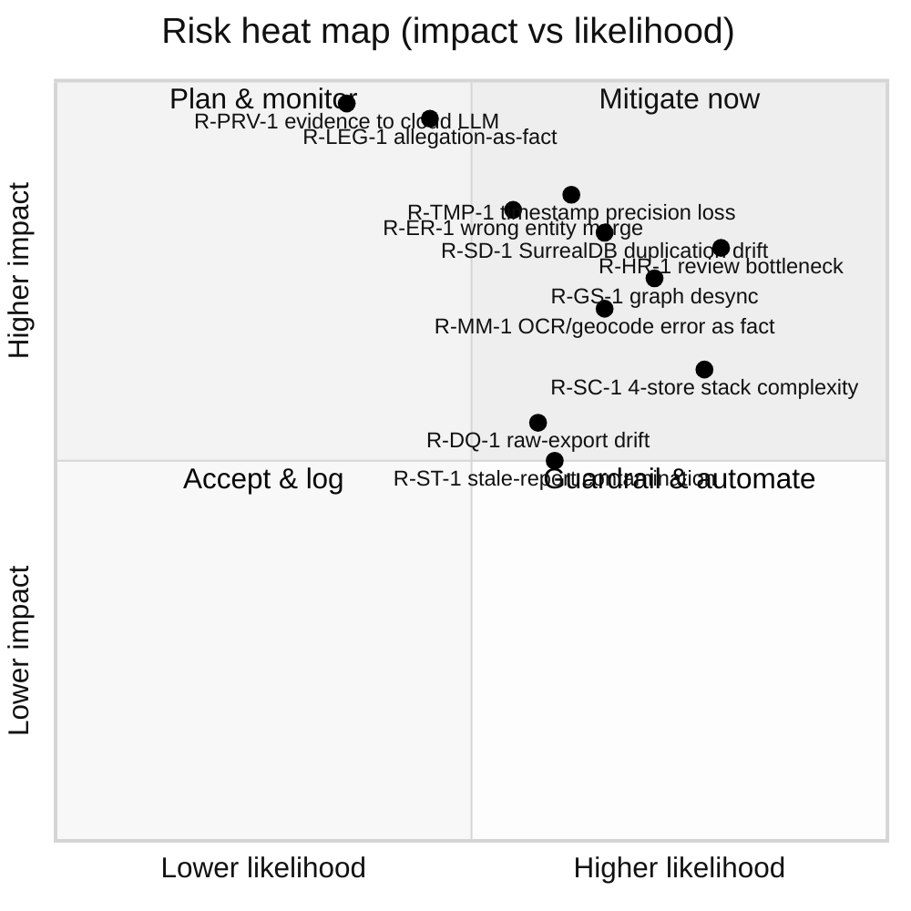
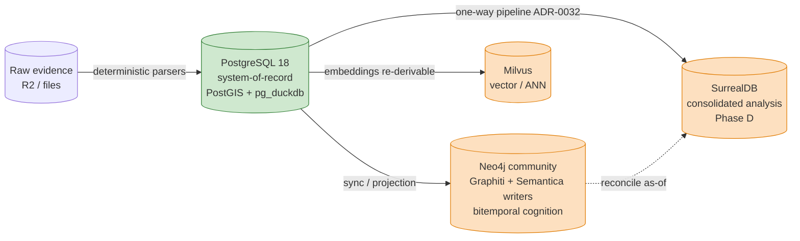

## Risks, Assumptions & Open Questions

> _Byline: Claude Code · Opus 4.8 (1M) · 2026-06-30_
> Grounded in the discovery context pack (A1–A5 + GAP_AND_STALENESS_REPORT) and the locked ADR set. On any conflict, the SSOT docs (`Agno-MCP-Platform/docs/PROJECT_CANON.md` + ADRs) win. This register is **append-only**: rows are never deleted, only superseded (with a dated note), mirroring the chain-of-custody discipline the data tier itself enforces.

This section enumerates the residual risks of the architecture defined in the preceding sections, the assumptions the design rests on, and the open questions that must be closed before this system produces court-facing evidence packages. It is deliberately exhaustive: in a forensic/legal context an unstated assumption or an unmanaged data-quality risk is itself an evidentiary liability.

### How to read this register

- **Impact** = consequence if the risk materializes, rated **Critical / High / Medium / Low**, with explicit attention to whether the consequence is *evidentiary* (could taint or weaken a court-facing package), *operational* (downtime/cost), or *integrity* (silent data corruption).
- **Likelihood** = **High / Medium / Low** given the *current* as-built state (live ADRs, CPU-only constraint, HITL-on-every-write posture).
- **Severity score** (heat map below) = Impact × Likelihood, used only to order mitigation work, never to dismiss a risk — every Critical-impact row is mitigated regardless of likelihood.
- **Owner** = the accountable role. In this single-operator project the human owner is `matt` for all approval-gated and legal-conclusion items; engineering/automation roles (Ingestion Agent, Review-Gatekeeper, Forensic-Data Agent) are named where they hold the *first-line* mitigation, but the human owner remains ultimately accountable for every court-facing assertion.
- **Open question** = the unresolved decision that, until answered, keeps the risk live.

---

### 1. Technical risks

| ID | Risk | Impact | Likelihood | Mitigation | Owner | Open question |
|---|---|---|---|---|---|---|
| R-TEC-1 | **pg_duckdb / PostGIS / pgvector co-resident in ONE Postgres image** (`agno-postgres:18-duckdb`, ADR-0013) — an extension upgrade or a runaway DuckDB analytical query (e.g. a full-corpus S3 scan via the account-wide secret) can OOM/lock the single relational+spatial+analytical container that everything else reads from. | High (operational; this is the system-of-record container) | Medium | Pin the custom image digest; set `duckdb.max_memory` + statement_timeout for the analytical role; run heavy `vw_forensic_evidence_package` / S3 scans on a read-replica or off-hours; keep the four tiers on **independent bind-mounted volumes & lifecycles** (HARD CONSTRAINT) so a Postgres restart never tears down Milvus/Neo4j/SurrealDB. | Forensic-Data Agent → `matt` | What is the safe `duckdb.max_memory` ceiling on the OVH box given no GPU and shared RAM with PostGIS/pgvector? |
| R-TEC-2 | **CPU-only / ≤4B local-model constraint** (ADR-0015) bottlenecks local extraction (NER, OCR, embeddings) — cloud-primary `glm-5.1` cannot see raw evidence (privacy rule), so heavy extraction is stuck on weak local models. | High (throughput + quality) | High | Tier the work: deterministic parsers (enhanced-xml-chunker, sms_backup_parser, schema-resolver.ts) do structure extraction with **no LLM**; reserve ≤4B local models for narrow local NER; batch overnight; cloud LLMs only on **de-identified / non-evidentiary** text. Track per-run model+version in artifact lineage. | Ingestion Agent → `matt` | Which extraction steps can be made fully deterministic (no model) vs. genuinely need a ≤4B model, and where is local quality unacceptable? |
| R-TEC-3 | **Embedding-contract drift** — one-collection-per-embedder (ADR-0010/0011/0026): if an embedder version changes (nemotron-embed-vl-1b-v2 2048-d, nv-embedcode-7b 4096-d, codestral-embed-2505 1536-d) without re-embedding, vectors become silently incomparable. | Medium (retrieval quality) | Medium | Treat raw docs as source of truth (re-embeddable any time); stamp every Milvus collection with embedder id+dim+date; never mix dims in a collection; re-embed on version bump as a logged processing run. | Forensic-Data Agent | Do we freeze embedder versions for the life of the case, or re-embed on upgrade and version the collection? |
| R-TEC-4 | **Federation reach gaps** (ADR-0032 dropped Multicorn2/neo4j-fdw): cross-store joins are now manual (pg_duckdb for files/S3/relational, native Cypher for Neo4j, Milvus SDK for vectors, PG→Surreal pipeline). No single query plane → risk of inconsistent ad-hoc joins. | Medium | Medium | Centralize cross-store access behind the Forensic-Data Agent's typed tools (not free-form SQL); document the canonical join keys (`evidence_id` UUIDv7, `location_key`, `person_id`); forbid hand-rolled cross-store joins in court-facing exports. | Forensic-Data Agent | Is an agent-mediated query layer sufficient, or is a thin read-only federation view eventually required? |
| R-TEC-5 | **Single-operator key-person / bus-factor** — one human owner holds all approvals, infra creds, and case context. | High (continuity) | Medium | Append-only logs + MEMORY.md + Graphiti recall make state resumable across sessions; document runbooks; keep R2 backups (bind-mounted host dirs, ADR docker-volume preference). | `matt` | Is there a documented recovery runbook if the owner is unavailable mid-case? |

---

### 2. Stack-complexity risks (FOUR independent stores)

| ID | Risk | Impact | Likelihood | Mitigation | Owner | Open question |
|---|---|---|---|---|---|---|
| R-SC-1 | **Four independently-deployed stores** (PG+PostGIS+pg_duckdb / Milvus / Neo4j / SurrealDB) multiply operational surface, version matrices, and backup/restore procedures for one operator with no GPU and modest RAM. | High (operational; raises every other risk's likelihood) | Medium-High | Justify each store against a *distinct* job (relational+spatial+analytical / ANN / bitemporal cognition / consolidated analysis) — no store is decorative; off-the-shelf-first & minimize-custom-code (CANON); independent lifecycles isolate failure; **defer SurrealDB to Phase D** so only 3 stores run until consolidation is actually needed. | `matt` | Can SurrealDB's job be met by PG+Neo4j bitemporal modeling for the MVP, deferring the 4th store indefinitely? |
| R-SC-2 | **Operational coupling regression** — the prior single-Coolify-app pattern tore down all six DBs on one crash; repeating that anti-pattern would violate the HARD CONSTRAINT. | High (availability + integrity) | Medium | Enforce separate Coolify apps / separate bind-mounted volumes per store; CI/deploy check that no two of the four share a compose lifecycle; document the split as an ADR. | `matt` | Is the split-into-separate-apps work (previously deferred, blocked on git push) now complete and verified per-store? |
| R-SC-3 | **Backup/restore consistency across heterogeneous stores** — a point-in-time that is consistent across PG, Milvus, Neo4j and (later) Surreal is non-trivial; partial restores can desync the graph from the relational system-of-record. | High (integrity, evidentiary) | Medium | Designate **PG as the system-of-record / replay source**; treat Milvus (re-embeddable) and Neo4j (rebuildable from PG + Graphiti episodes) as **derivable**; snapshot host bind-mount dirs to R2 with manifests; document a rebuild-from-PG runbook. | Forensic-Data Agent → `matt` | What is the canonical rebuild order (PG → Neo4j → Milvus → Surreal) and is it tested end-to-end? |

---

### 3. SurrealDB duplication risks (ADR-0024, ratified, Phase-D, NOT deployed)

| ID | Risk | Impact | Likelihood | Mitigation | Owner | Open question |
|---|---|---|---|---|---|---|
| R-SD-1 | **Data duplication / divergence** — SurrealDB is a *consolidated analysis sink* fed by a one-way PG→Surreal pipeline (ADR-0032). The same evidence facts then exist in PG (system-of-record), Neo4j (cognition), and Surreal (analysis). Without a strict direction-of-truth, Surreal copies can drift from PG and a court-facing export could cite a stale duplicate. | High (evidentiary; contradictory copies undermine credibility) | Medium-High | **PG is the only source of truth**; Surreal is **read-derived & disposable** (rebuildable from PG); never edit evidence in Surreal; stamp every Surreal record with source `evidence_id` + PG row version + pipeline-run id; court exports cite PG/Neo4j, never Surreal directly. | Forensic-Data Agent → `matt` | Is SurrealDB strictly downstream/disposable, or will any analytical fact ever *originate* in Surreal (which would make it a second source-of-truth and is disallowed)? |
| R-SD-2 | **Bitemporal model collision** — both Neo4j+Graphiti (ADR-0014/0018/0031, valid-time + knowledge-time + disclosure-tier) and SurrealDB (native bitemporal, ADR-0024) model time. Two bitemporal engines risk inconsistent "as-of" answers. | High (a timeline that disagrees with itself is fatal in court) | Medium | Make **Neo4j+Graphiti the authoritative bitemporal cognition substrate** (VIP, never replaced); Surreal's bitemporality is for analytical convenience only and must reconcile to Graphiti's valid/knowledge-time; reconciliation test on every pipeline run. | Forensic-Data Agent | If Graphiti and Surreal disagree on an "as-of" query, which wins, and is that documented as an ADR amendment? |
| R-SD-3 | **Premature adoption / sunk complexity** — deploying Surreal before its consolidation job is real adds a 4th store (see R-SC-1) for speculative benefit. | Medium | Medium | Honor the **Phase-D gating**: do not deploy until PG+Neo4j demonstrably cannot serve consolidated analysis; record the trigger condition. | `matt` | What concrete capability gap triggers Surreal deployment vs. extending PG/Neo4j? |

---

### 4. Graph-synchronization risks (PG ⇄ Neo4j ⇄ Surreal; Graphiti + Semantica writers)

| ID | Risk | Impact | Likelihood | Mitigation | Owner | Open question |
|---|---|---|---|---|---|---|
| R-GS-1 | **PG→Neo4j desync** — an evidence row, entity merge, or correction lands in PG but the Neo4j projection lags or fails, so the graph (used for contradiction/`CONTRADICTS` impeachment analysis) reflects a *different* state than the system-of-record. | High (evidentiary; impeachment built on a stale graph is dangerous) | Medium-High | Append-only outbox/CDC from PG; **idempotent, replayable** sync keyed on `evidence_id` UUIDv7; a sync-lag monitor + reconciliation job; mark graph-derived findings with the PG version they were computed against; block court export if sync-lag > 0 for cited nodes. | Forensic-Data Agent → `matt` | Is the PG→Neo4j sync event-driven (CDC/outbox) or batch, and what is the acceptable maximum lag before exports are blocked? |
| R-GS-2 | **Two writers into Neo4j** — Graphiti and Semantica both write the graph; concurrent/overlapping writes can create duplicate or conflicting nodes/edges, or clobber bitemporal validity. | High (integrity) | Medium | Partition write responsibilities (Graphiti = episodic cognition/recall; Semantica = decision/provenance PROV-O substrate); namespacing/labels per writer; never-overwrite — supersede with new valid-time; preserve prior interpretations (guardrail). | Forensic-Data Agent | Where exactly is the Graphiti/Semantica write boundary, and who owns node-identity (MERGE) keys to prevent duplicate `Person`/`Event` nodes? |
| R-GS-3 | **Entity-identity divergence across stores** — `Person` in salem_v3/Neo4j must MERGE with TraceIQ `people` and PG `person` rows; if IDs diverge, the same human appears as two entities in graph vs. relational vs. vector metadata. | High (entity-resolution + evidentiary) | Medium | One canonical `person_id` (UUIDv7) minted in PG and propagated to Neo4j/Milvus/Surreal; all MERGE decisions are HITL and logged; see R-ER-1. | Forensic-Data Agent → `matt` | Single global ID space across all four stores, or per-store IDs with a crosswalk table — and where is the crosswalk authoritative? |
| R-GS-4 | **Re-embedding ⇄ graph drift** — Milvus re-embed (R-TEC-3) changes which text chunks are "similar," shifting analytical findings that the graph references. | Medium | Low-Medium | Stamp findings with embedder version; re-run dependent analyses on re-embed; vectors are derivable, never source-of-truth. | Forensic-Data Agent | Should re-embedding auto-invalidate dependent graph findings, or flag-for-review only? |

---

### 5. Human-review bottleneck risks (HITL on every write; review-gatekeeper)

| ID | Risk | Impact | Likelihood | Mitigation | Owner | Open question |
|---|---|---|---|---|---|---|
| R-HR-1 | **Single-reviewer throughput** — HITL-on-every-write + human review required before *every* sensitive label (gaslighting, coercive control, alienation, weaponization, reactive abuse) reaches court-facing output, with **one** human reviewer. The backlog can stall ingestion and analysis indefinitely. | High (project velocity; risk of pressure to skip review) | High | Tier review by risk: (a) auto-accept deterministic/raw-evidence inserts with audit log; (b) lightweight review for extracted facts (OCR/geocode); (c) **mandatory blocking** review only for sensitive labels, legal-relevance labels, and court-facing exports. Use the doc-intelligence `approvals` table + `vw_forensic_evidence_package` confidence tiers (HIGH/MED/LOW) to **route only MED/LOW and sensitive items** to the human. Persist a review queue with priorities so work resumes across sessions. | Review-Gatekeeper → `matt` | What review SLA/throughput is realistic for one human, and which low-risk classes can be auto-approved with sampling-based QA instead of 100% review? |
| R-HR-2 | **Reviewer fatigue → rubber-stamping** — high volume tempts blanket approval, defeating the safeguard and letting hypotheses silently promote to facts. | Critical (evidentiary integrity; the core guardrail fails) | Medium | Hard gate: sensitive labels and court exports **cannot** auto-approve; record reviewer identity + timestamp + rationale per decision (append-only); periodic audit of approval patterns; surface "promoted to fact" events explicitly. | Review-Gatekeeper → `matt` | Do we require a written rationale per sensitive-label approval, and is a second-look/sampling audit feasible for one operator? |
| R-HR-3 | **Review state not preserved across sessions** — losing the queue/decision context between sessions causes re-review or missed items. | Medium | Low-Medium | Append-only approvals + MEMORY.md/Graphiti recall + handoff (.remember) keep review state resumable (memory-layer guardrail). | Review-Gatekeeper | Is the approvals table the single source of review truth, or is it duplicated in memory layers that could drift? |
| R-HR-4 | **Bottleneck pressure relaxes guardrails** — schedule pressure could erode the "never present allegations as fact" rule. | Critical | Medium | Make the gate technical, not procedural: court-export tooling refuses to emit any node flagged hypothesis/allegation without a logged human promotion. | `matt` | Should the export pipeline hard-fail (not warn) on any unreviewed sensitive label? |

---

### 6. Legal / evidentiary risks

| ID | Risk | Impact | Likelihood | Mitigation | Owner | Open question |
|---|---|---|---|---|---|---|
| R-LEG-1 | **Allegation presented as established fact** — abuse-pattern detectors (detection_patterns.py 256-pattern/DARVO, seed-patterns ~303, behavioral_patterns.ttl, hurtlex) and salem_v3 PRESERVE-AS-HYPOTHESIS edges (`USED_TACTIC`, `EXPLOITED_VULNERABILITY`, `DISPARAGES`) could leak into court output as fact. | Critical | Medium | **Lane discipline** enforced in schema: raw evidence / extracted / inferred / analytical / legal-conclusion kept in distinct, queryable layers; hypothesis edges typed as such; HITL promotion required (R-HR-*); court-safe language only ("structure, safety, clarity, child stability" framing). | Review-Gatekeeper → `matt` | Is there a machine-checkable rule that no hypothesis-typed edge can appear in an export without a promotion record? |
| R-LEG-2 | **One-sided / non-court-safe narrative** — modeling only the partner's negative conduct, or inflammatory labels, undermines credibility and violates the both-parties guardrail. | High | Medium | Adopt **positive_behaviors.ttl** to satisfy the full-relational-cycle guardrail; model BOTH parties incl. the user's own mistakes/repair attempts in temporal context; separate surface tone / inferred intent / relational function / cycle phase. | `matt` | Are positive/neutral/love-bombing/repair interactions being ingested at parity with negative incidents, or is collection itself skewed? |
| R-LEG-3 | **Chain-of-custody / authenticity challenge** — opposing counsel challenges how a record was extracted, transformed, or stored. | Critical (evidence excluded) | Medium | UUIDv7 + **SHA-256 chain-of-custody** column contract; append-only history; preserve raw exports verbatim (Google Takeout JSON shape = RAW EVIDENCE contract); full artifact lineage (source → run → prompt version → ontology version → schema version → review decision). | Forensic-Data Agent → `matt` | Is the hash chain unbroken from raw file to court export for every cited item, and is it independently verifiable? |
| R-LEG-4 | **Selective framing / weaponization of the user's own reactions** — quotes lifted from context. | High | Medium | Always store the surrounding temporal context (before/after); distinguish explanation from excuse, contextual harm from proven causation; flag selectively-framed quotes. | `matt` | Does every reaction record carry enough surrounding context to rebut decontextualized use? |
| R-LEG-5 | **Provenance/version overwrite** — overwriting a prior interpretation destroys the auditable trail. | Critical (integrity) | Low | Append-only / versioned records everywhere; never overwrite original evidence or earlier interpretations (guardrail); supersede with dated note. | Forensic-Data Agent | Are all interpretation tables truly append-only at the DB constraint level (not just by convention)? |

---

### 7. Privacy risks

| ID | Risk | Impact | Likelihood | Mitigation | Owner | Open question |
|---|---|---|---|---|---|---|
| R-PRV-1 | **Raw forensic/abuse evidence sent to an external/cloud LLM or extracting tool** (exa, Drive, Lucid, M365, *and* Graphiti/Agno entity-extraction, cloud `glm-5.1`). | Critical (privacy breach + evidentiary taint; possibly irreversible) | Medium-High (easy to do by accident) | **Hard rule: evidence stays local** (CPU-only ≤4B). Exa = external research only, never case data. Route writes through Review-Gatekeeper. Technical egress guard: forbid evidence tables/buckets from being passed to cloud tool calls; de-identify before any cloud step. | Review-Gatekeeper → `matt` | Is there an enforced allow-list of what may leave the box, or only a convention? Does Graphiti/Agno entity-extraction ever see raw evidence text? |
| R-PRV-2 | **Child / third-party PII exposure** — children, vulnerabilities, grief triggers, parental-identity attacks (salem `EXPOSED_CHILD`, `AFFECTED_PARENTING_ACCESS`). | Critical | Medium | Disclosure-tier tagging in Neo4j (ADR-0031 disclosure-tier multi-pass); `is_private` message gate → review; minimize child data to what evidence supports; redaction layer for exports. | Review-Gatekeeper → `matt` | Is there a redaction/minimization step before any export, and who approves child-related disclosures? |
| R-PRV-3 | **R2/cloud-object exposure** — buckets `casebible-*`/`nexus` hold raw evidence; misconfigured access or an unscoped transfer leaks it. | High | Low-Medium | Account-wide S3 secret scoped read-only for pg_duckdb; rclone transfers are **approval-gated with dry-run** (cost+sweep rule); never broad recursive sync; bind-mount backups under owner control. | `matt` | Are R2 bucket policies least-privilege, and is every transfer dry-run-then-signed-off? |
| R-PRV-4 | **Memory-layer leakage** — Graphiti/MEMORY.md recall could persist sensitive evidence facts into a substrate not meant to hold raw evidence. | High | Medium | Memory layers store *project/operational* facts and decisions, **not raw evidence**; keep evidence in the local DB tier only; SSOT docs win on conflict. | `matt` | What is the explicit boundary between "durable memory" and "evidence," and is it enforced? |

---

### 8. Data-quality risks

| ID | Risk | Impact | Likelihood | Mitigation | Owner | Open question |
|---|---|---|---|---|---|---|
| R-DQ-1 | **Raw-export format drift / parser breakage** — many source formats (SMS backup, GVoice, iMessage-PDF, FB, Snapchat, Takeout, call-logs+base64); a format change silently drops or mangles records. | High (missing/garbled evidence) | Medium | Land raw verbatim first (`normalized_messages` raw-JSON landing, `raw_data` JSON) so parsing is **re-runnable**; `schema-resolver.ts` AI field-mapping for unknown formats (HITL); parser unit tests on known fixtures; record parser version per run. | Ingestion Agent → `matt` | Which formats lack a deterministic parser today and currently depend on AI field-mapping (higher error rate)? |
| R-DQ-2 | **Blocked/system message-type mishandling** — e.g. SMS type 5/6 blocked-call records mis-typed. | Medium | Medium | Preserve raw `type` codes; sms_backup_parser handles blocked-call types; keep raw alongside normalized. | Ingestion Agent | Are all platform-specific type codes catalogued, or only the known ones? |
| R-DQ-3 | **Dedup of byte-identical corpora** — R5 report has two byte-identical copies; extracted-code MANIFEST is deduped/provenance-tracked but Archives/** is not. | Medium | Medium | **Prefer `extracted-code/MANIFEST.md`** over `Archives/**`; dedupe by SHA-256; casebible-catalog skill checks "is this already in the corpus" before push. | Forensic-Data Agent | Is there a single authoritative content-hash index spanning R2 + local + extracted-code? |
| R-DQ-4 | **Confidence tiers not consistently populated** — `vw_forensic_evidence_package` HIGH/MED/LOW depends on upstream fields being set. | Medium | Medium | Make confidence a required, defaulted column; route MED/LOW to review (R-HR-1); never default-to-HIGH. | Forensic-Data Agent | Is confidence computed deterministically or model-assigned, and is the rule documented? |

---

### 9. Temporal-ambiguity risks

| ID | Risk | Impact | Likelihood | Mitigation | Owner | Open question |
|---|---|---|---|---|---|---|
| R-TMP-1 | **Timestamp precision loss** — prior schemas stored TEXT timestamps; conversion to `timestamptz` without a **precision class** (the gap report flags this as missing from ALL prior schemas) silently fabricates precision (e.g. a date-only value rendered as midnight, presented as exact). | High (evidentiary; false precision is impeachable) | Medium-High | Add an explicit **timestamp-precision class** (exact / approximate / inferred / uncertain) to every temporal column; store original raw string + parsed value + precision + source; never display inferred time as exact (Constraint). | Forensic-Data Agent → `matt` | What is the canonical precision-class enum and its mapping rules per source format? |
| R-TMP-2 | **Timezone / DST ambiguity** — multi-platform exports in mixed/again-missing timezones distort sequence and "as-of" answers. | High (a wrong order can invert an impeachment) | Medium | Store UTC + original offset + source tz provenance; flag tz-unknown as uncertain; geocode-derived tz is *inferred*, not exact. | Forensic-Data Agent | When source tz is absent, is local-from-geocode acceptable or must it stay uncertain? |
| R-TMP-3 | **Inferred timeline facts (overnight stays, home_base, anomalies) mixed with observed events.** | High | Medium | Keep `timeline_event` split raw vs enriched; tag inferred rows distinctly (lane discipline); HITL before court use. | Review-Gatekeeper | Are inferred timeline rows ever allowed in an export without HITL promotion? |
| R-TMP-4 | **Bitemporal as-of disagreement** (cross-ref R-SD-2/R-GS-1) — graph vs. analytical store give different "what did we know on date X." | High | Medium | Graphiti is authoritative for valid/knowledge-time; reconciliation test each run. | Forensic-Data Agent | (see R-SD-2) |

---

### 10. Entity-resolution risks

| ID | Risk | Impact | Likelihood | Mitigation | Owner | Open question |
|---|---|---|---|---|---|---|
| R-ER-1 | **Wrong merge / wrong split of people** — salem `Person` ⇄ TraceIQ `people` ⇄ PG `person`; an incorrect MERGE attributes one person's statements/locations to another (or a SPLIT fragments one person), corrupting `MADE_STATEMENT`, `WAS_AT`, `CONTRADICTS`. | High (evidentiary; mis-attribution is fatal) | Medium | Canonical `person_id` minted in PG; **all merge/split decisions HITL + logged + reversible** (append-only, never overwrite); keep alias/identifier evidence linked; never auto-merge on weak signals. | Review-Gatekeeper → `matt` | What is the evidence threshold for an auto-suggested merge vs. mandatory human confirmation? |
| R-ER-2 | **Location dedup errors** — `location_key` collapses distinct places or splits one; dual-provider geocode `disagreement_flag`. | Medium-High | Medium | `geocode_resolution` dual-provider with `disagreement_flag`/`tie_break_reason`; append-only `geocode_audit`; PostGIS geometry for spatial identity; HITL on disagreements. | Forensic-Data Agent | What disagreement distance triggers human review vs. auto tie-break? |
| R-ER-3 | **Cross-store identity divergence** (cross-ref R-GS-3) — same entity, different IDs in PG/Neo4j/Milvus/Surreal. | High | Medium | Single propagated UUIDv7 + crosswalk; see R-GS-3. | Forensic-Data Agent | (see R-GS-3) |
| R-ER-4 | **Vague `RELATED_TO` edges** carried over un-typed lose analytical meaning and can imply unsupported relationships. | Medium | Medium | SPLIT vague `RELATED_TO` → typed causal/temporal/topical edges (crosswalk); never invent new types — reuse adopted ontology. | Forensic-Data Agent | Is the typed-edge taxonomy frozen, and what happens to legacy `RELATED_TO` rows during migration? |

---

### 11. Multimodal-extraction risks

| ID | Risk | Impact | Likelihood | Mitigation | Owner | Open question |
|---|---|---|---|---|---|---|
| R-MM-1 | **OCR / screenshot text error promoted to fact** — `screenshots` OCR = *extracted*, not raw; an OCR mistake (wrong number, name, date) could be cited as evidence. | High (evidentiary) | Medium | Keep extracted OCR in the **extracted lane**, linked to the source image; show confidence; HITL before court use; preserve the original image as raw. | Review-Gatekeeper → `matt` | What OCR-confidence threshold forces human verification before a value is usable? |
| R-MM-2 | **Base64-embedded images in call-logs / XML** mishandled or lost. | Medium | Medium | enhanced-xml-chunker.py extracts call-logs + base64 images; store image bytes with hash + provenance; re-runnable. | Ingestion Agent | Are extracted images hash-linked back to their parent XML record? |
| R-MM-3 | **Social/action & message-body embeddings** (Milvus) surface semantically-similar but factually-unrelated content as if related. | Medium | Medium | Embeddings are retrieval aids, **not** evidence; never assert a relationship from similarity alone; HITL on analytical findings. | Forensic-Data Agent | Is there a rule preventing similarity-only findings from entering analysis without corroboration? |
| R-MM-4 | **PDF/chat-export parsing fidelity** (iMessage-PDF, FB TS, ChatGPT/Claude JSONL) — layout/threading reconstruction errors. | Medium | Medium | Platform-hop reconstruction via `normalized_messages` raw landing; keep raw export verbatim; parser tests. | Ingestion Agent | Which exports lose thread structure and need manual verification? |

---

### 12. Staleness / context-contamination risks (from the gap & staleness report)

These are first-class risks because using a stale doc as authority would silently re-introduce a superseded architecture into a court-facing system.

| ID | Risk | Impact | Likelihood | Mitigation | Owner | Open question |
|---|---|---|---|---|---|---|
| R-ST-1 | **ADR-0003 mislabeled "Accepted"** in README — a reader could treat "PG18 pgvector-only, NO DuckDB" as live and contradict the LIVE ADR-0013/0014/0027 stack. | High (architecture regression) | Medium | Fix README label to **"Superseded by 0013/0014/0027"**; the supersession chain is documented (no-DuckDB→0013, FalkorDB-deferred→0014, pgvector-store→0027); **standalone DuckDB is NOT blessed**. | `matt` | Has the README drift actually been corrected, and is there a check preventing superseded ADRs from being cited? |
| R-ST-2 | **Stale planning/migration docs treated as current** — MIGRATION_PLAN_v8 / `docs/planning/*` describe PG16 / pgvector-hybrid / `uuid_generate_v4`; using them re-introduces the old UUID + vector-store design. | High | Medium | Treat as **build-history only**; current = ADR-0013 (PG18, `uuidv7()`) + Milvus (ADR-0027); never copy schema from planning docs. | Forensic-Data Agent | Are the stale planning docs clearly marked build-history at the top of each file? |
| R-ST-3 | **Jan-dated reports R5–R12 propagate dead tech** — reference Supabase / Chroma / LanceDB / pgvector as targets; R5 is the richest data model but has two byte-identical copies. | Medium-High | Medium | **Re-target** every borrowed model: Supabase/Chroma/LanceDB/pgvector → **PG(+pg_duckdb+PostGIS) / Milvus / R2**; dedupe R5 copies; mine R5 for the data model, not the stack. | Forensic-Data Agent | Has R5's data model been extracted and re-targeted, and the duplicate removed (moved to `_stale/`, never deleted)? |
| R-ST-4 | **Dead absolute paths** — TheBigOne tree is GONE from all three disk roots; every transcript absolute path is dead; osgrep uninstalled. | Medium (wasted effort / wrong file) | High | Resolve all historical paths via **`extracted-code/MANIFEST.md`** (deduped, provenance-tracked); ignore osgrep; 78 `Workspace_Manifest_*.json` are last-resort lookup only. | Forensic-Data Agent | Is there a path-rewrite map from old absolute paths to MANIFEST entries? |
| R-ST-5 | **No prior report reflects live infra** (OVH/Coolify/Milvus/Neo4j-Graphiti/R2) — using reports for "current state" misleads. | Medium | Medium | Use **ADRs + A1 live probes** for as-built state, never the reports; reports inform data model only. | `matt` | (resolved by policy) Are drafters instructed to never cite reports for infra state? |
| R-ST-6 | **Stale indexes / memory** — claude-context not indexed for workspace root; memsearch turn DB stale (Jun 11) though plugin enabled; context-mode outdated build; casebible.duckdb current (Jun 23). | Medium (bad/empty search results) | Medium | Re-index claude-context before code search; treat memsearch results as possibly stale; rebuild indexes are cheap/re-doable (autonomy rule). | Forensic-Data Agent | Should index freshness be checked automatically before any code/evidence search? |

---

### 13. Assumptions (the design rests on these — falsification turns each into a live risk)

| ID | Assumption | If false → which risk goes live | Validation owner |
|---|---|---|---|
| A-1 | **PG is the single source of truth**; Neo4j, Milvus, and SurrealDB are all *derivable/rebuildable* from PG + raw evidence. | R-SD-1, R-GS-1, R-SC-3 | Forensic-Data Agent |
| A-2 | The **four stores have genuinely independent lifecycles** (separate Coolify apps + bind-mounted volumes); no shared-lifecycle coupling remains. | R-SC-2 | `matt` |
| A-3 | **Raw evidence never leaves the local box** to any cloud LLM/tool; cloud `glm-5.1` only sees de-identified/non-evidentiary text. | R-PRV-1, R-PRV-2 | Review-Gatekeeper |
| A-4 | **One human reviewer is sufficient** if review is tiered (auto-accept low-risk, blocking-review only for sensitive/legal/export). | R-HR-1, R-HR-2 | `matt` |
| A-5 | **Deterministic parsers cover the bulk** of extraction so the CPU-only ≤4B constraint is tolerable. | R-TEC-2, R-DQ-1 | Ingestion Agent |
| A-6 | **Graphiti is the authoritative bitemporal substrate**; SurrealDB bitemporality is convenience only and reconciles to it. | R-SD-2, R-TMP-4 | Forensic-Data Agent |
| A-7 | **SurrealDB stays deferred (Phase D)** and disposable until a real consolidation gap appears. | R-SC-1, R-SD-3 | `matt` |
| A-8 | **Append-only is enforced at the constraint level**, not by convention, for all evidence/interpretation tables. | R-LEG-5 | Forensic-Data Agent |
| A-9 | **`extracted-code/MANIFEST.md` is the authoritative resolver** for historical assets/paths (over `Archives/**`). | R-ST-3, R-ST-4 | Forensic-Data Agent |
| A-10 | **Timestamp-precision class is added everywhere** and no inferred time is ever shown as exact. | R-TMP-1, R-TMP-2 | Forensic-Data Agent |
| A-11 | **Both parties + full relational cycle are modeled at parity** (positive_behaviors.ttl adopted), not just negative incidents. | R-LEG-2 | `matt` |
| A-12 | **Hypothesis-typed edges cannot reach exports without a logged human promotion** (machine-checkable). | R-LEG-1, R-HR-4 | Review-Gatekeeper |

---

### 14. Consolidated open-questions register (decision log)

These must be resolved (and recorded as ADRs/ADR-amendments) before first court-facing export. Ordered by blocking severity.

| # | Open question | Blocks | Proposed resolution path | Owner |
|---|---|---|---|---|
| Q-1 | Is there a **machine-checkable export gate** that hard-fails on any hypothesis/sensitive/unpromoted node? | R-LEG-1, R-HR-4, R-PRV-2 | Implement in export tooling; ADR. | `matt` |
| Q-2 | Is **raw evidence egress** enforced by an allow-list (not convention), and does Graphiti/Agno extraction ever see raw text? | R-PRV-1 | Egress guard + audit; ADR. | Review-Gatekeeper |
| Q-3 | Is **PG→Neo4j sync** event-driven with a defined max-lag that blocks exports? | R-GS-1 | CDC/outbox + lag monitor. | Forensic-Data Agent |
| Q-4 | What is the **canonical timestamp-precision enum** and per-format mapping? | R-TMP-1 | Define enum; backfill. | Forensic-Data Agent |
| Q-5 | Is **SurrealDB strictly downstream/disposable**, or can analytical facts originate there? | R-SD-1, R-SD-2 | Confirm one-way; ADR-0024 amendment. | `matt` |
| Q-6 | Is the **four-store lifecycle split** complete and per-store verified (was blocked on git push)? | R-SC-2 | Verify Coolify apps/volumes; ADR. | `matt` |
| Q-7 | What is the **tiered review SLA** and which low-risk classes auto-approve with sampling QA? | R-HR-1 | Define tiers; instrument approvals table. | `matt` |
| Q-8 | What is the **entity-merge evidence threshold** (auto-suggest vs. mandatory human confirm)? | R-ER-1 | Define threshold; HITL log. | Review-Gatekeeper |
| Q-9 | Single **global ID space** across all four stores, or per-store IDs + authoritative crosswalk? | R-GS-3, R-ER-3 | Decide; document join keys. | Forensic-Data Agent |
| Q-10 | Is the **chain-of-custody hash unbroken** raw→export for every cited item, independently verifiable? | R-LEG-3 | Verification tool over UUIDv7+SHA-256. | Forensic-Data Agent |
| Q-11 | Has the **README ADR-0003 mislabel** been corrected and superseded-citation guard added? | R-ST-1 | Edit README; add lint. | `matt` |
| Q-12 | Has **R5's data model been extracted, re-targeted, and the byte-identical duplicate moved to `_stale/`**? | R-ST-3 | Extract + re-target + dedupe. | Forensic-Data Agent |
| Q-13 | What concrete **capability gap triggers SurrealDB deployment** vs. extending PG/Neo4j? | R-SC-1, R-SD-3 | Define trigger; record. | `matt` |
| Q-14 | Is **append-only enforced at the DB-constraint level** for all interpretation tables? | R-LEG-5 | Triggers/permissions; audit. | Forensic-Data Agent |

---

> **Needs-human-review / gap flag:** The single most schedule-dangerous coupling is **R-HR-1/R-HR-2 (one-reviewer bottleneck) feeding back into R-LEG-1 (allegation-as-fact) and R-PRV-1 (evidence egress)** — under volume pressure the human gate is the safeguard most likely to be quietly relaxed, so the mitigations (Q-1, Q-2, Q-7) must be made *technical hard-gates*, not procedural conventions, before any court-facing export. Separately, the **timestamp-precision class (R-TMP-1) is confirmed missing from every prior schema** (gap report) and must be designed in now rather than retrofitted.
