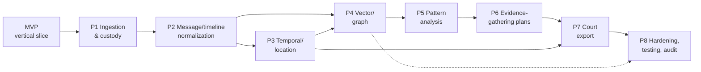

## Implementation roadmap (MVP + Phases 1-8)

> _Byline: Claude Code · Opus 4.8 (1M) · 2026-06-30_

This roadmap is **not a blank-slate build**. A large fraction of the persistence and compute substrate is already deployed and verified; the work below is mostly *schema, ingestion, normalization, and review-workflow* layered on top of that live stack, plus three net-new stores/services (SurrealDB analysis sink, Semantica provenance substrate, and the forensic schema itself). Every phase explicitly labels what is **LIVE (reuse)** versus **NET-NEW (build)**, cites the governing ADR / prior asset where work is adopted rather than invented, and carries the cross-cutting guardrails (lane discipline, timestamp-precision class, HITL before sensitive labels, append-only provenance) into its acceptance criteria.

### Baseline: what is already live (do not rebuild)

These are treated as *fixed inputs* to the roadmap. The roadmap consumes them; it does not re-decide them.

| Capability | Concrete asset (as-built) | ADR | State |
|---|---|---|---|
| Relational + analytical + spatial (ONE resource) | Custom image `agno-postgres:18-duckdb`: `uuidv7()`, **pg_duckdb**, **PostGIS**, pgvector (legacy-resident), pg_trgm, pgcrypto, pg_stat_statements | 0013 (supersedes 0003) | **LIVE** |
| S3/R2 reach from SQL | pg_duckdb account-wide S3 secret (forensic reads); rclone bucket mount (file ingest) | 0030 | **LIVE** |
| Vector / ANN | **Milvus** on ovh2, one collection per embedder, hybrid dense+sparse/BM25 | 0027, 0026 | **LIVE** (Knowledge migration = later phase) |
| Graph cognition | **Neo4j community + Graphiti MCP** bitemporal substrate (VIP, never replaced) | 0014/0018/0031 | **LIVE** |
| Model gateway | **LiteLLM** :4000; **Ollama Cloud `glm-5.1` = PRIMARY**; NVIDIA NIM = embed/rerank/backup; cloud-primary compute (no GPU, local ≤4B) | 0015 | **LIVE** |
| Tool gateway | **IBM ContextForge** MCP gateway, pinned 0.8.0 (off-the-shelf, NOT custom/DIAL) | 0025 | Accepted |
| Object store | **Cloudflare R2** buckets `nexus`, `casebible-*` | 0007 | **LIVE** |
| Agent platform | **agno-gateway**: 6 forensic agents (ingestion, analysis, review-gatekeeper, forensic-data-agent, +2), agentos-db Postgres | CANON | **LIVE** |

**Net-new across the whole roadmap (built in the phases below):**

- The forensic **schema** itself (chain-of-custody columns, `timeline_event`, typed `messages`/`normalized_messages`, `evidence`, geocode lanes, views) — adopted/adapted from **salem_v3**, **TraceIQ**, and **doc-intelligence** tables, never invented from scratch.
- **SurrealDB** analysis sink (ADR-0024, ratified, NOT deployed) — Phase 4/5.
- **Semantica** provenance/conflict substrate (PROV-O, `source_hash`), writer into Neo4j — Phase 1 onward (provenance), maturing through Phase 5.
- Abuse-pattern lane assets from `extracted-code/MANIFEST.md`: `positive_behaviors.ttl`, `behavioral_patterns.ttl`, `mcl_722_23.ttl`, `detection_patterns.py` (256-pattern), `seed-patterns.ts`, `hurtlex_loader` — Phase 5.
- Court-export workflow + audit-readiness tooling — Phases 7-8.

### Roadmap at a glance

| Stage | Theme | Net-new vs reuse | Primary store(s) touched | Headline acceptance gate |
|---|---|---|---|---|
| **MVP** | Thin vertical slice: one source → custody → one timeline row → one review decision | ~70% reuse | PG (pg_duckdb), R2 | One real artifact traceable end-to-end with hash + HITL decision |
| **Phase 1** | Ingestion & chain-of-custody | reuse rclone/R2/pg_duckdb; new custody schema | PG, R2 | SHA-256 + UUIDv7 custody chain on 100% of ingested objects |
| **Phase 2** | Message & timeline normalization | new schema; adopt parsers | PG | Raw→normalized with platform-hop + precision class, lossless to raw |
| **Phase 3** | Temporal & location reasoning | adopt TraceIQ geocode/timeline | PG + PostGIS | Dual-provider geocode w/ disagreement flag; precision-classed timeline |
| **Phase 4** | Vector & graph integration | reuse Milvus/Neo4j; deploy SurrealDB | Milvus, Neo4j, SurrealDB | salem_v3 ontology in Neo4j↔PG mirror; evidence text searchable |
| **Phase 5** | Pattern analysis | adopt 256-pattern + TTLs | PG, Neo4j, SurrealDB | Both-parties + full-cycle modeled; every label HITL-gated |
| **Phase 6** | Evidence-gathering plan generation | new agent workflow | PG, Neo4j | Gap/corroboration plans tied to specific evidence IDs |
| **Phase 7** | Court-export workflow | new; reuse `vw_forensic_evidence_package` | PG | Confidence-tiered export with full lineage + reviewer sign-off |
| **Phase 8** | Hardening, testing, audit readiness | cross-cutting | all four resources | Restore drill, lineage replay, independent-lifecycle proof |

> Phases 3 and 4 can proceed in parallel once Phase 2 lands (timeline rows exist for geocoding *and* for embedding/graphing). Phase 7's minimal export path depends on Phase 3 (timeline + location confidence) but its *richer* export depends on Phases 4-5. Phase 8 is continuous but gated for sign-off at the end.

---

### MVP — thin vertical slice (prove the spine, end-to-end)

**Goal.** Prove the *entire chain of custody and review spine* on one real piece of evidence before scaling breadth: ingest a single source file → register it with a SHA-256 + UUIDv7 custody record → extract exactly one timeline event → route one analytical assertion through the **review-gatekeeper** agent → record one HITL decision. The MVP exists to de-risk the guardrails (lane separation, provenance, HITL), not to deliver volume.

| Aspect | Detail |
|---|---|
| **Reuse (LIVE)** | PG `agno-postgres:18-duckdb`; pg_duckdb reading the raw file from R2 (ADR-0030); rclone mount; agno-gateway ingestion + review-gatekeeper agents; Graphiti for session-memory continuity |
| **Net-new** | Minimal DDL: `evidence`, `chain_of_custody` (append-only), `timeline_event` (single row), `review_decision`; one ingestion runbook; one export-of-one stub |
| **Deliverables** | (1) `evidence` + `chain_of_custody` tables with UUIDv7 PK and SHA-256 columns adopted from the **UUIDv7 + SHA-256 chain-of-custody column contract** in `extracted-code/MANIFEST.md`; (2) one ingested object with a verifiable hash; (3) one `timeline_event` row carrying a **timestamp-precision class** (exact/approx/inferred/uncertain) and a `source_evidence_id` FK; (4) one `review_decision` row (status, reviewer, rationale, timestamp); (5) a Mermaid + README lineage diagram showing object → custody → fact → decision |
| **Dependencies** | LIVE stack only. No SurrealDB, no Milvus, no pattern lane yet. |
| **Acceptance criteria** | • Given the raw file, recomputing SHA-256 matches the stored custody hash (tamper-evidence works). • The single timeline fact can be traced **back** to the raw object and **forward** to a human decision in one query. • Lanes are physically distinct columns/tables (raw vs extracted vs inferred vs analytical vs legal-conclusion). • No analytical assertion reaches a "court-safe" status without a `review_decision`. |
| **Risks** | • *Scope creep* — MVP tempts breadth; mitigate by hard-capping to one source/one fact. • *Custody-contract drift* — if MVP column names diverge from the MANIFEST contract, Phase 1 rework follows; mitigate by adopting the contract verbatim now. • *HITL theater* — a rubber-stamp review proves nothing; the decision row must capture a real rationale field. |

---

### Phase 1 — Ingestion and chain of custody

**Goal.** Turn the MVP stub into a robust, repeatable ingestion pipeline that registers *every* source object (mobile-device exports, PDFs, screenshots, Takeout, call-log XML, chat exports) with immutable provenance, before any extraction. Raw bytes are never mutated; they land in R2 and are referenced, not copied into the DB.

| Aspect | Detail |
|---|---|
| **Reuse (LIVE)** | R2 buckets (`casebible-*`, `nexus`); rclone bucket mount for file ingest; pg_duckdb S3 secret for SQL-side reads of raw objects (ADR-0030); agno-gateway **ingestion** agent; Graphiti to record durable ingestion facts |
| **Net-new** | `ingestion_run` (append-only run ledger: tool version, prompt version, ontology/schema version, operator), `source_object`/`evidence` registry, `chain_of_custody` events table, raw-landing JSON contract (`raw_data` JSONB) adopted from **`normalized_messages`** universal raw-JSON-landing design; **Semantica `source_hash`** provenance fields introduced here |
| **Deliverables** | (1) Ingestion runbook covering each source format with its parser from `extracted-code/MANIFEST.md`: `enhanced-xml-chunker.py` (call-logs + base64 images), `sms_backup_parser` (blocked-call type 5/6), GVoice/iMessage-PDF/FB parsers, `chat-export` (ChatGPT/Claude JSONL), location/Takeout, Snapchat source, plus `schema-resolver.ts` (AI field-mapping for unknown formats). (2) Append-only `chain_of_custody` with `(evidence_id, event_type, actor, sha256_before/after, ts, run_id)`. (3) `ingestion_run` ledger capturing **tool/model/prompt/ontology/schema versions** so any later output is replayable. (4) Google raw-export JSON preserved **verbatim** as the RAW EVIDENCE contract. |
| **Dependencies** | MVP custody tables; R2 + rclone + pg_duckdb (all LIVE). Parser salvage from MANIFEST (PREFER over `Archives/**`). |
| **Acceptance criteria** | • 100% of ingested objects have a SHA-256 + UUIDv7 and at least one custody event. • Re-ingesting an identical object is detected as a duplicate (hash match), not re-landed. • Every `ingestion_run` records tool/model/prompt/ontology/schema versions. • Raw exports are byte-identical to source (diff against original = empty). • An object can be ingested, its DB rows dropped, and **fully reconstructed** from R2 + run ledger. |
| **Risks** | • *Cost/sweep on R2* — any rclone transfer is approval-gated: dry-run + object-count/size/$ sign-off first (HARD RULE); never sweep a whole backup drive. • *External-LLM leakage* — raw forensic/abuse evidence must NOT be fed to exa/Drive/Lucid/M365 or cloud entity-extraction; keep extraction local (≤4B). • *Unknown formats* — `schema-resolver.ts` AI mapping can mis-map fields; route its output through review before it becomes canonical. • *PII at rest* — encryption + access scoping on R2 and PG. |

---

### Phase 2 — Message and timeline normalization

**Goal.** Normalize heterogeneous communications into a typed, lossless, append-only model that preserves the raw and adds structure — without flattening the distinction between raw evidence and extracted facts. This is where the **lane discipline** becomes schema.

| Aspect | Detail |
|---|---|
| **Reuse (LIVE)** | PG (pg_duckdb can read raw JSON in R2 for bulk transforms); ingestion agent |
| **Net-new** | `messages` (typed, V4.1-adopted) reconciled against `normalized_messages` (universal raw-JSON landing); `people` table; `screenshots` (OCR = extracted lane); `social_action`; **timestamp-precision class** column (missing from ALL prior schemas — added here) |
| **Deliverables** | (1) `timeline_event` split into **raw vs enriched** lanes — adapted from TraceIQ `timeline_enriched`→`timeline_event`; TEXT timestamps converted to `timestamptz` **plus** a precision class enum `{exact, approximate, inferred, uncertain}`. (2) Typed `messages` adopted from TraceIQ V4.1 (link to timeline; `is_private` → review gate, not auto-publish) with bodies queued for Milvus embedding (Phase 4). (3) `normalized_messages` raw-JSON landing (raw XML→`raw_data` JSON) enabling **platform-hop reconstruction**; reconcile typed-vs-raw so nothing is lost. (4) `people` MERGED with the salem `Person` entity key (sets up Phase 4 graph join). (5) `screenshots` with OCR text in the *extracted* lane, original image in R2. |
| **Dependencies** | Phase 1 custody + run ledger; parsers from MANIFEST. salem_v3 `Person` key (finalized in Phase 4 but stubbed here). |
| **Acceptance criteria** | • Every normalized message retains a pointer to its raw landing and is reconstructable from it (lossless). • Every timeline row carries an explicit precision class; none default silently to "exact". • Tone/intent/relational-function are **separate** columns (Phase 5 fills them) — schema does not collapse them into one sentiment field. • Both-parties messages present; no source is dropped because it is "positive" or "neutral". • `is_private` messages never auto-surface; they sit behind a review gate. |
| **Risks** | • *Lossy normalization* — over-typing can drop fields; mitigate with the raw-JSON landing as ground truth. • *Identity collision* — merging `people` across platforms can conflate two humans; require HITL on ambiguous merges. • *Timestamp coercion* — forcing TEXT→`timestamptz` without precision class would manufacture false certainty (explicitly guarded). |

---

### Phase 3 — Temporal and location reasoning

**Goal.** Add defensible *where/when* reasoning: dual-provider geocoding with disagreement handling, append-only geocode audit, location dedup, and inferred-fact derivation (overnight stays, home-base, anomalies) — all kept in the **inferred** lane, never silently promoted to fact.

| Aspect | Detail |
|---|---|
| **Reuse (LIVE)** | PG + **PostGIS** (inside the single PG resource — never standalone); pg_duckdb for bulk geo joins over R2-resident Takeout |
| **Net-new** | `geocode_resolution` (dual-provider, `disagreement_flag`, `tie_break_reason`); append-only `geocode_audit`; `location_key` dedup; raw `visits/activities/paths/trips`; inferred-fact tables (overnight/home_base/anomaly) |
| **Deliverables** | (1) ADOPT TraceIQ raw movement tables `visits/activities/paths/trips` verbatim from Google export shape. (2) `geocode_resolution` with **dual-provider** results, `disagreement_flag`, and `tie_break_reason` (extracted lane). (3) Append-only `geocode_audit` (every resolution attempt preserved, never overwritten). (4) `location_key` dedup keyed to a PostGIS `geometry`/`geography` column. (5) Inferred derivations (overnight, home-base, anomaly) written to the **inferred** lane with the rule/version that produced them. (6) Timeline events gain resolved PostGIS geometry where available. |
| **Dependencies** | Phase 2 `timeline_event` + precision class; PostGIS (LIVE in image). |
| **Acceptance criteria** | • Geocodes carry provider, confidence, and a disagreement flag; ties record a `tie_break_reason`. • The geocode audit is append-only — re-running geocoding adds rows, never mutates. • Inferred facts (overnight/home-base) are queryable as *inferred*, with their derivation rule version, and are never returned as raw evidence. • Spatial queries (e.g., "was Person X within N m of Location Y at time T±window") run via PostGIS and respect timestamp precision class (uncertain timestamps widen the window, not narrow it). |
| **Risks** | • *Inference-as-fact* — overnight/home-base derivations are seductive; guardrail keeps them in the inferred lane with provenance. • *Provider drift/cost* — external geocoders cost money and can change; cache results, audit-log, and dry-run bulk runs. • *Spurious precision* — a precise coordinate from an imprecise source; precision class must propagate from the source timestamp/location, not be invented by the geocoder. |

---

### Phase 4 — Vector and graph integration

**Goal.** Make evidence semantically searchable and relationally reasoned: embed message/document/evidence text into Milvus; import the **salem_v3** ontology into Neo4j with a PG mirror; and deploy the **SurrealDB** analysis sink (its own independent resource). This is the phase that activates three of the four data-tier resources together — still with **no shared lifecycle**.

| Aspect | Detail |
|---|---|
| **Reuse (LIVE)** | **Milvus** (one collection per embedder, hybrid dense+sparse — ADR-0027/0026); **Neo4j + Graphiti** (bitemporal, VIP); LiteLLM/NIM embedders (local for evidence text; OpenRouter `codestral-embed-2505` 1536-d only for code/CaseBible per ADR-0011/0026) |
| **Net-new** | salem_v3 ontology load (Neo4j nodes + PG mirror); typed-edge schema; **SurrealDB** deployment (ADR-0024) as a 4th independent resource; PG→Surreal downstream pipeline (ADR-0032) |
| **Deliverables** | (1) ADOPT salem_v3 entities as Neo4j nodes **mirrored in PG**: `Person`, `Incident`/`Event`, `Location` (PostGIS geom), `Statement`, `Evidence` (central provenance anchor). (2) ADOPT edges `WAS_AT`, `PARTICIPATED_IN`, `MADE_STATEMENT`, `CONTRADICTS` (impeachment value), `EXPOSED_CHILD`, `AFFECTED_PARENTING_ACCESS` (renamed custody edge). (3) SPLIT vague `RELATED_TO` into typed causal/temporal/topical edges. (4) Evidence/message text embedded into Milvus collections (bodies queued in Phase 2) using **local** embedders for forensic content. (5) **SurrealDB** stood up as an independent resource (separate bind-mounted volume, independent start/stop) with the PG→Surreal pipeline (ADR-0032). (6) `people`↔`Person` merge finalized. |
| **Dependencies** | Phase 2 (text + people), Phase 3 (location geom for `WAS_AT`/`Location`). Milvus + Neo4j LIVE; SurrealDB ratified-but-undeployed (this phase deploys it). |
| **Acceptance criteria** | • salem_v3 nodes/edges queryable in Neo4j and consistently mirrored in PG (cross-store referential check passes). • Hybrid semantic search returns evidence passages with their `evidence_id` and confidence. • SurrealDB can be stopped/restarted/rebuilt with **zero** impact on PG, Milvus, or Neo4j (independent-lifecycle proof). • No forensic/abuse text was sent to an external embedding service (audit of embedder routing). • `CONTRADICTS` edges surface real statement conflicts for impeachment review. |
| **Risks** | • *Lifecycle coupling regression* — the owner-mandated split must hold; a shared compose file that tears down all stores is a hard fail (ref the single-Coolify-app split decision). • *Embedder misrouting* — sending evidence to cloud embedders violates the local-only rule; enforce per-collection embedder routing. • *Ontology mismatch* — salem_v3 edges that imply conclusions (see Phase 5) must NOT be loaded as facts here. • *SurrealDB maturity* — net-new store; validate backup/restore before relying on it. |

---

### Phase 5 — Pattern analysis

**Goal.** Layer behavioral and relational pattern analysis on the graph + relational model — modeling **both parties** and the **full relational cycle** (positive/neutral/affectionate/love-bombing/repair as well as conflict), with every sensitive label held as a reviewable hypothesis until a human approves it. This phase consumes real prior art; it does not invent a pattern taxonomy.

| Aspect | Detail |
|---|---|
| **Reuse (LIVE)** | Neo4j + Graphiti (multi-pass valid-time/knowledge-time + disclosure-tier — ADR-0014/0018/0031); SurrealDB analysis sink (Phase 4); agno-gateway **analysis** + **review-gatekeeper** agents; behavioral-pattern-analyzer / mcl-factor-mapper / irac-formatter skills |
| **Net-new** | Pattern lane wiring of salvaged assets; tone/intent/relational-function/cycle-phase columns filled; hypothesis tables with HITL state machine |
| **Deliverables** | (1) ADOPT `positive_behaviors.ttl` to satisfy the **both-parties / full-relational-cycle** guardrail (do NOT invent new node types). (2) Wire `behavioral_patterns.ttl`, `mcl_722_23.ttl` (12 MCL best-interest factors), `detection_patterns.py` (256-pattern, MCL A–L, 18 categories, DARVO), `seed-patterns.ts (~303)` + patterns-schema, `hurtlex_loader`. (3) Fill the Phase-2 separated columns: **surface tone**, **inferred intent**, **relational function**, **cycle phase**, each with surrounding temporal context — kept distinct, never collapsed into one sentiment score. (4) PRESERVE-AS-HYPOTHESIS edges (allegation ≠ fact): `USED_TACTIC`, `EXPLOITED_VULNERABILITY` (was TARGETED_WOUND), `DISPARAGES` (was SPREADS_RUMOR); ADAPT sensitive `Vulnerability`, `Tactic`/`BehavioralPattern` under HITL. (5) Model the **user's own** poor reactions, escalations, apologies, repair attempts, accountability items — in temporal context (before/after), distinguishing explanation from excuse, and flagging where reactions may have been selectively framed/quoted/weaponized. |
| **Dependencies** | Phase 4 graph + vectors; Phase 3 temporal context for cycle-phase windows; Semantica conflict detection. |
| **Acceptance criteria** | • Both parties' conduct is represented; positive/neutral/love-bombing/repair phases are present, not only negative incidents. • Every sensitive label (gaslighting, coercive control, alienation, manipulation, weaponization, reactive abuse) is in a **hypothesis** state and cannot reach court-facing status without a `review_decision` (HITL gate enforced in schema, not convention). • Grief triggers / parental-identity attacks / child-access pressure are tracked **only where evidence supports them**. • Tone/intent/relational-function/cycle-phase are independently queryable. • A pattern assertion links to the specific evidence and the pattern-version + prompt-version that produced it. |
| **Risks** | • *Hypothesis→fact promotion* — the single largest legal/ethical risk; mitigated by the hypothesis state machine + HITL + court-safe language guardrail. • *One-sided framing* — guardrail requires modeling the user's own mistakes and the full cycle; a model that only flags the partner fails acceptance. • *Label inflammation* — prefer "structure, safety, clarity, child stability" framing over blame. • *Pattern false positives* — 256-pattern detector output is a signal, not a verdict; always reviewable. |

---

### Phase 6 — Evidence-gathering plan generation

**Goal.** Move from analysis to *action planning*: given the current evidence graph, generate concrete, court-safe plans for what additional evidence to gather, what needs corroboration, and where the gaps/contradictions are — each plan item tied to specific evidence IDs and confidence tiers.

| Aspect | Detail |
|---|---|
| **Reuse (LIVE)** | agno-gateway **analysis** + **forensic-data-agent**; Neo4j (`CONTRADICTS`, gaps) + PG; Graphiti for cross-session plan continuity; mcl-factor-mapper skill |
| **Net-new** | `evidence_gathering_plan` + `plan_item` tables (append-only, versioned); gap/corroboration query set; plan-generation agent workflow |
| **Deliverables** | (1) Gap analysis: facts asserted at LOW/MED confidence that lack corroboration, surfaced as plan items with the specific `evidence_id`(s) and what corroboration would raise the tier. (2) Contradiction worklist driven by `CONTRADICTS` edges (impeachment opportunities + items needing reconciliation). (3) MCL-factor coverage map (`mcl_722_23.ttl`) showing which best-interest factors are well-evidenced vs thin. (4) Each plan item flags: what is **emotionally important but may not be legally useful**, what **requires corroboration before use**, and what could be **strategically dangerous without context**. (5) Plans are versioned/append-only so plan evolution is auditable. |
| **Dependencies** | Phase 5 patterns + confidence tiers; Phase 4 graph; Phase 3 timeline/location confidence. |
| **Acceptance criteria** | • Every plan item references concrete evidence IDs and a confidence tier — no vague "gather more proof". • The plan distinguishes the three caution classes above for each item. • Plans are append-only/versioned; superseded plans are preserved. • No plan item asserts a legal conclusion (avoid legal advice — focus on evidence organization). • Plan generation routes any write through the review-gatekeeper. |
| **Risks** | • *Drift into legal advice* — guardrail keeps output to evidence organization/planning, not legal strategy/advice. • *Over-collection* — plans must respect cost and the never-sweep R2 rule. • *Stale plans* — as evidence changes, old plans mislead; versioning + recency surfacing mitigates. |

---

### Phase 7 — Court-export workflow

**Goal.** Produce review-ready, confidence-tiered evidence packages with complete lineage — *draft factual summaries, not legal advice* — that a human must sign off before anything is labeled court-safe. Reuses the prior `vw_forensic_evidence_package` design rather than inventing an export format.

| Aspect | Detail |
|---|---|
| **Reuse (LIVE)** | PG view `vw_forensic_evidence_package` (HIGH/MED/LOW confidence tiers, HITL) ADOPTED from TraceIQ; review-gatekeeper agent; irac-formatter / evidence-templates / mre-authentication skills |
| **Net-new** | Export builder (PG→packaged artifact), lineage manifest generator, reviewer sign-off ledger, court-safe narrative drafter |
| **Deliverables** | (1) Export packages built from `vw_forensic_evidence_package` with explicit HIGH/MED/LOW confidence tiers. (2) Each exported item carries a **lineage manifest**: source evidence → ingestion run → prompt version → ontology version → schema version → human-review decision (so any exhibit is traceable to raw bytes). (3) **Court-safe narrative drafts** generated as review-ready *factual summaries only* — separating emotional truth, factual support, legal usefulness, and court-safe wording into distinct fields; favoring "structure, safety, clarity, child stability" framing. (4) A reviewer **sign-off ledger** (append-only): no package is "court-safe" without a recorded human approval. (5) Sensitive-label gate: gaslighting/coercive-control/alienation/etc. cannot appear in an export unless their hypothesis was HITL-approved in Phase 5. |
| **Dependencies** | Phase 3 (minimal timeline/location export) at least; richer exports need Phases 4-6; Phase 1 lineage fields throughout. |
| **Acceptance criteria** | • Every exported assertion resolves to raw evidence via the lineage manifest (zero orphan claims). • Confidence tier is shown for every item. • No allegation is presented as established fact; no hypothesis appears without HITL approval. • Narrative drafts contain no legal advice and use court-safe wording. • An export can be regenerated identically from the recorded versions (reproducible). • Reviewer sign-off is mandatory and logged. |
| **Risks** | • *Premature publication* — strongest legal risk; the sign-off ledger + sensitive-label gate are the controls. • *Selective framing* — exports must allow the surrounding temporal context (before/after) so quotes aren't weaponized; mitigated by including context fields. • *Lineage gaps* — any item without full lineage is blocked from export (fail-closed). |

---

### Phase 8 — Hardening, testing, and audit readiness

**Goal.** Make the system durable, reproducible, and defensible: prove the four-resource independent-lifecycle constraint, exercise backup/restore, replay lineage end-to-end, and load-test the read paths — so the platform can credibly produce court-facing evidence. This is cross-cutting (begun earlier) but formally signed off here.

| Aspect | Detail |
|---|---|
| **Reuse (LIVE)** | Bind-mounted volumes (owner backs up via host dirs — always mapped volumes, never named); Coolify (read-only infra view); pg_stat_statements; Graphiti/MEMORY.md for cross-session resume |
| **Net-new** | Test corpora + golden tests; restore drills; lineage-replay harness; audit report; topology-isolation test |
| **Deliverables** | (1) **Independent-lifecycle proof**: stop/restart/rebuild each of the four resources (PG+PostGIS+pg_duckdb / Milvus / Neo4j / SurrealDB) and demonstrate the others stay up — directly validating the owner-mandated HARD CONSTRAINT and closing the historical single-Coolify-app coupling risk. (2) **Backup/restore drill** per resource from bind-mounted volumes + R2; documented RPO/RTO. (3) **Lineage-replay harness**: pick a random exported exhibit and reconstruct it from raw bytes + run/prompt/ontology/schema versions; mismatch = fail. (4) Golden-test suite over ingestion parsers (call-log/SMS/PDF/Takeout) catching regressions. (5) Read-path load/perf test (PostGIS spatial, Milvus hybrid, Neo4j traversal). (6) **Audit-readiness report**: provenance completeness, append-only verification, HITL coverage, encryption/access scoping, and the staleness fixes (README ADR-0003 relabel to "Superseded by 0013/0014/0027"; re-target any Supabase/Chroma/LanceDB/pgvector references to PG/Milvus/R2). |
| **Dependencies** | All prior phases (it tests them). |
| **Acceptance criteria** | • Each resource independently stop/restart/rebuild-able with no cross-impact (demonstrated, not asserted). • A full restore from backup reproduces a working system within documented RTO. • Random exhibit lineage replay reproduces the exhibit byte-for-byte (or flags the exact divergence). • Append-only tables reject in-place mutation (tested). • No court-facing path lacks HITL coverage. • No raw forensic evidence egress to external LLM tools (audited). • Stale-doc drift fixed (ADR-0003 label, re-targeted store references). |
| **Risks** | • *Untested restore* — a backup never restored is not a backup; the drill is mandatory. • *Lifecycle regression under Coolify* — Coolify passes compose labels verbatim and historically coupled apps; explicitly re-verify the split. • *Drift creep* — stale reports (R5–R12, MIGRATION_PLAN_v8, 78 Workspace_Manifest_*.json) can re-pollute decisions; the audit step pins current ADRs as the only authority. |

---

### Cross-phase guardrails carried into every acceptance gate

These are non-negotiable and appear as *blocking* acceptance criteria in the relevant phases above, restated here as a checklist for reviewers:

| Guardrail | Enforced where |
|---|---|
| Lane discipline: raw / extracted / inferred / analytical / legal-conclusion kept physically distinct | MVP, P2, P3, P5 |
| Timestamp-precision class (exact/approx/inferred/uncertain) on every time value | P2 onward |
| Provenance + append-only history for everything; never overwrite prior interpretation | P1 onward |
| Both parties + full relational cycle modeled (incl. user's own mistakes, in temporal context) | P5 |
| Sensitive labels held as hypotheses; HITL approval required before court-facing | P5, P7 |
| Court-safe, evidence-linked language; allegation ≠ fact; no hypothesis→fact promotion | P5, P6, P7 |
| No raw forensic/abuse evidence to external/cloud LLM-extracting tools (local ≤4B only) | P1, P4 (embedders), throughout |
| R2/data-moving ops dry-run + $ sign-off; never sweep unintended data | P1, P3, P6 |
| Four-resource independent lifecycle (no shared lifecycle, separate bind-mounted volumes) | P4 (deploy), P8 (prove) |
| Artifact lineage replayable to source + run/prompt/ontology/schema/review versions | P1 (capture), P7 (export), P8 (replay) |

> **Sequencing note for a non-developer:** think of it as building a courthouse evidence room. The **MVP** proves you can take in one item, tag it, log who touched it, and get a sign-off. **Phase 1** scales that intake. **Phase 2-3** organize *what was said* and *where/when*. **Phase 4-5** connect the dots (who, what pattern) while keeping accusations as clearly-marked hypotheses. **Phase 6** plans what's still missing. **Phase 7** prints review-ready packets — with a human signature required. **Phase 8** stress-tests the whole room so it holds up under scrutiny.
