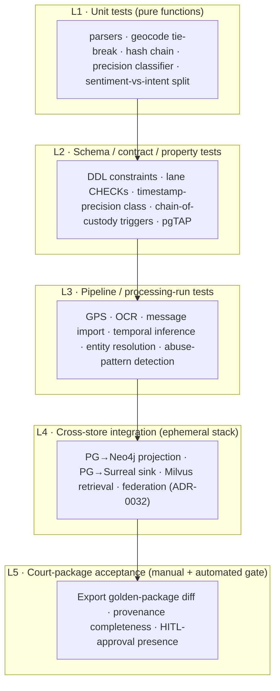
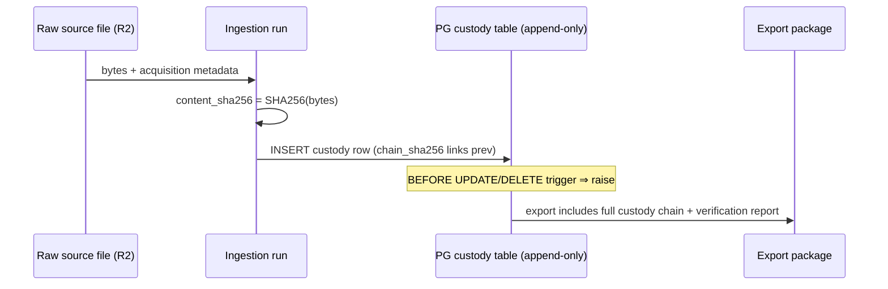
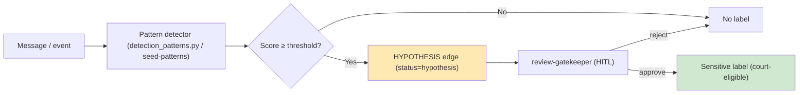
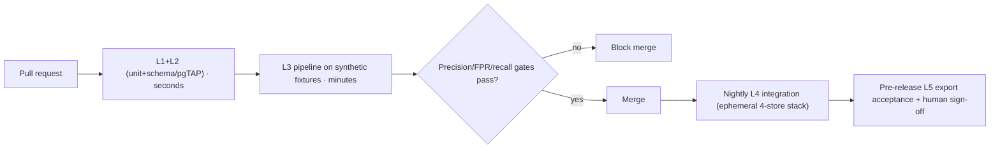

## Testing Strategy

> _Byline: Claude Code · Opus 4.8 (1M) · 2026-06-30_
>
> This section defines how every layer of the forensic-evidence database is proven correct, court-defensible, and regression-protected. It is **not** a blank-slate test plan: it tests the *adopted/adapted* assets from the crosswalk (salem_v3 ontology, TraceIQ timeline, `normalized_messages`, the `.ttl` abuse-pattern lane, Semantica provenance) against the **locked stack** (ADR-0013 pg_duckdb+PostGIS Postgres, ADR-0027 Milvus, ADR-0014/0031 Neo4j+Graphiti, ADR-0024 SurrealDB Phase-D, ADR-0032 federation reach). The non-negotiable through-line is **auditability**: a test failure must point to a specific evidence row, processing run, prompt/ontology/schema version, or human-review decision — because this system may eventually emit court-facing evidence packages.

### 0. Reading guide (for non-developers)

This plan answers one question per topic: *"How do we know this part is right, and how do we prove it stayed right?"* Each test area below states **(a)** what could go wrong, **(b)** the concrete checks, and **(c)** what a failure means in evidence terms. Two principles dominate every area:

1. **Lane discipline is testable.** The five evidence lanes — **raw evidence → extracted facts → inferred facts → analytical findings → legal conclusions** — are not just documentation; tests *assert* that data never silently crosses a lane (e.g. an inferred "home base" must never be stored as a raw GPS fix; an allegation edge must never be queryable as an established fact).
2. **Nothing court-sensitive passes without a human.** Tests verify that sensitive labels (gaslighting, coercive control, alienation, weaponization, reactive abuse) and court-facing exports are **structurally blocked** until a recorded human-review approval exists.

---

### 1. Test taxonomy, pyramid, and tooling

We use a layered pyramid so most defects are caught cheaply and only true integration risks reach the slow, expensive end.

| Layer | What it proves | Primary tooling | Runs where | Speed/Frequency |
|---|---|---|---|---|
| **L1 Unit** | Pure functions: parsers (`enhanced-xml-chunker`, `sms_backup_parser`, `schema-resolver.ts`), geocode tie-break, SHA-256 chaining, timestamp-precision classifier, sentiment/intent split | `pytest` (Python), `vitest` (TS) | dev + CI | seconds, every commit |
| **L2 Schema/contract** | DDL constraints, lane `CHECK`s, append-only triggers, custody-hash triggers, `uuidv7()` defaults, PostGIS SRID, view contracts | **pgTAP** (in-DB), `pytest` + ephemeral PG | CI | seconds–minute, every commit |
| **L3 Pipeline** | A whole processing run is deterministic & provenance-complete (GPS, OCR, import, inference, ER, abuse-pattern) | `pytest` against ephemeral stack + fixtures | CI | minutes, every PR |
| **L4 Integration** | Cross-store correctness: PG→Neo4j projection, PG→Surreal sink, Milvus hybrid retrieval, ADR-0032 federation reach | `pytest` + docker-compose ephemeral stack | CI nightly + pre-release | 10–30 min |
| **L5 Acceptance** | Court package is complete, traceable, and HITL-gated; golden-file diff | golden snapshots + human sign-off | pre-release, manual trigger | manual |

**Environment policy (honoring the data-tier HARD CONSTRAINT):** the test stack mirrors the **four independently-deployable resources** — (1) the unified `agno-postgres:18-duckdb` PG+PostGIS+pg_duckdb container, (2) Milvus, (3) Neo4j, (4) SurrealDB (Phase-D, behind a feature flag) — each as a **separate ephemeral container with its own bind-mounted tmpfs volume**, brought up/down independently. A test that stops Milvus must not tear down PG; an explicit **isolation test** asserts this (kill one container, assert the other three stay healthy and the platform degrades gracefully).

**Test-data isolation & privacy (non-negotiable):** All L1–L4 tests run on **synthetic fixtures only** (Section 16). Real forensic/abuse evidence is **never** fed to external/cloud LLM-extracting tools (exa, Drive, graphiti/agno entity extraction) inside tests; embedding/NER in tests uses the **local CPU-only ≤4B** path or a deterministic stub embedder. CI runs on synthetic data exclusively; any L5 run touching real case data runs **locally / on the tailnet only**, never in cloud CI.

---

### 2. Schema-integrity testing (L2)

**What could go wrong:** a column drifts from its lane; a timestamp loses its precision class; an append-only table gets an `UPDATE`; a foreign key lets an orphan evidence reference exist; `uuidv7()` defaults silently revert to `uuid_generate_v4` (the stale MIGRATION_PLAN_v8 pattern).

We assert the schema **in-database** with **pgTAP** so the contract is tested where it lives, plus Python contract tests for cross-table invariants.

| Check class | Concrete assertions (pgTAP / SQL) | Adopted from |
|---|---|---|
| **Column/lane provenance** | Every fact table has `provenance` columns: `source_evidence_id`, `processing_run_id`, `prompt_version`, `ontology_version`, `schema_version`, `extraction_method` (`raw`/`ocr`/`geocode`/`inferred`/`analytical`). `has_column`, `col_not_null`. | Semantica `source_hash`; doc-intelligence approvals tables |
| **Lane CHECK constraints** | `extraction_method` enum enforced; `timeline_event.lane IN ('raw','enriched')`; analytical objects are **views** not base tables (assert relkind `v`). A raw GPS row cannot carry an `inference_*` field (column simply absent → schema test fails if added without review). | TraceIQ split raw vs enriched |
| **Timestamp-precision class** | **Every** `timestamptz` evidentiary column is paired with a `*_precision` enum `('exact','approximate','inferred','uncertain')` and `*_tz_source` (`device_local`/`utc_asserted`/`derived`). pgTAP loops the catalog: any `timestamptz` in a fact table **without** a sibling precision column = FAIL. | Gap report: "missing from ALL prior schemas" |
| **Identity & keys** | `column_default_is(..., 'uuidv7()')` on all PKs; FK integrity; `location_key` dedup uniqueness; `geocode_audit` is append-only. | TraceIQ `location_key`; ADR-0013 native `uuidv7()` |
| **Append-only enforcement** | A `BEFORE UPDATE/DELETE` trigger raises on custody/audit/timeline-raw/geocode_audit tables; test issues an `UPDATE` and asserts the exception. | Custody contract; never-overwrite guardrail |
| **PostGIS contract** | `Location.geom` has expected SRID (4326), `geometry_type` check, spatial index present (`has_index`). PostGIS is tested **inside** the unified PG resource, never as a standalone (constraint). | salem `Location`; ADR-0013 |
| **pg_duckdb reach** | A pg_duckdb query over a synthetic Parquet/CSV-on-R2 fixture returns expected rows; assert the extension is loaded and DuckDB is embedded (not a standalone endpoint). | ADR-0013/0030/0032 |
| **Migration round-trip** | Apply all migrations forward on empty DB, then a representative down/up; assert schema hash stable. Detects accidental schema drift (e.g. README's stale ADR-0003 labels do not leak into DDL). | db-migrations skill |

**Schema-drift CI gate:** a generated `schema_snapshot.sql` (pg_dump `--schema-only`) is committed; CI fails on un-reviewed diff, forcing schema changes through review + a `schema_version` bump.

---

### 3. Chain-of-custody testing (L1 + L2 + L5) — *required focus*

Chain of custody is the spine of admissibility. We model it as the adopted **UUIDv7 + SHA-256 hash-chain** column contract and test it at three levels.

**Model under test (per evidence object):** `evidence_id (uuidv7)`, `content_sha256`, `prev_link_sha256`, `chain_sha256 = SHA256(content_sha256 ‖ prev_link_sha256 ‖ evidence_id ‖ ingested_at)`, plus an append-only `custody_event` log (`acquired`, `ingested`, `transformed`, `reviewed`, `exported`) each carrying actor, tool/version, and timestamp+precision.

| Test | Assertion | Failure meaning |
|---|---|---|
| **Hash determinism (L1)** | Same bytes ⇒ same `content_sha256`; one flipped bit ⇒ different hash. | Hashing is non-deterministic ⇒ custody unverifiable. |
| **Chain linkage (L1/L2)** | `chain_sha256[n]` correctly incorporates `chain_sha256[n-1]`; recomputing the chain over the table reproduces stored values. | Broken/forgeable chain. |
| **Tamper detection (L2)** | Force-mutate `content_sha256` via superuser in a sandbox copy ⇒ a `verify_custody()` function flags the broken link and identifies the first divergent `evidence_id`. | Silent tampering would pass undetected. |
| **Append-only (L2)** | `UPDATE`/`DELETE` on `custody_event` raises; only inserts allowed. Re-ingesting the same source creates a **new** version row, never overwrites. | Violates never-overwrite guardrail. |
| **Actor & tool provenance (L2)** | Every custody event records actor (human/agent id) + tool name+version + prompt/ontology/schema version where applicable. Null ⇒ FAIL. | Cannot answer "who/what touched this and when." |
| **Re-acquisition idempotency (L3)** | Ingesting an identical file twice is detected by `content_sha256` (via `casebible.duckdb` catalog dedupe pattern) and links as a duplicate, not a fork. | Corpus pollution / double-counting. |
| **Export completeness (L5)** | Every object in an export package resolves to an unbroken custody chain back to a raw source; the package embeds a custody-verification report. **Missing link ⇒ export blocked.** | Court package with a gap = inadmissible. |

---

### 4. Source-provenance & artifact-lineage testing (L2/L3)

Beyond custody of *bytes*, we test lineage of *derivations*: every extracted/inferred/analytical object must trace to source evidence **and** to the run/version that produced it (Constraint: "preserve artifact lineage … source evidence, processing runs, prompt versions, ontology versions, schema versions, human-review decisions").

| Test | Assertion |
|---|---|
| **No orphan derivations** | For every row in extracted/inferred/analytical tables, `source_evidence_id` resolves and `processing_run_id` resolves to a recorded run. A SQL invariant query returning any orphan = FAIL. |
| **Version stamping** | Each derived row carries `prompt_version`, `ontology_version` (e.g. `salem_v3`, `mcl_722_23.ttl@vN`), `schema_version`, `model_id`. Tests assert non-null and that values match an entry in the registry tables. |
| **Lineage reconstruction** | A `lineage(object_id)` recursive query reconstructs the full DAG raw→…→object; golden test compares to expected DAG for a fixture. |
| **Intermediate persistence** | Assert that scans, OCR drafts, classification outputs, tool-call logs, and prompt versions are **persisted** (not discarded) and queryable — per "persist intermediate work products." Deleting an intermediate without an archive reason = FAIL. |
| **Prior-interpretation preservation** | When an interpretation is superseded, the prior version remains retrievable (append-only / bitemporal); test re-analysis and assert old row still present with `valid_to` set, never deleted. |

---

### 5. Temporal-inference testing (L1/L3) — *required focus*

Temporal claims are the most litigated and most error-prone. We separate **timestamp precision** (how well we know *when*) from **temporal inference** (claims we *derive* from timing: overnight stays, home-base, sequence/causation). Both must stay in their lanes.

**5.1 Timestamp-precision classifier (L1).** Property + table-driven tests over the four classes:

| Input situation | Expected class | Expected `tz_source` |
|---|---|---|
| Full ISO-8601 with offset from device/export | `exact` | `device_local` or `utc_asserted` |
| Date present, time missing (e.g. photo EXIF date only) | `approximate` | `derived` |
| Derived from surrounding events (message between two timestamped messages) | `inferred` | `derived` |
| Conflicting/implausible source timestamps | `uncertain` | `derived` |

Tests assert: (a) classifier never upgrades precision (an `inferred` time can never be stored as `exact`); (b) DST/timezone boundary cases (spring-forward gap, fall-back ambiguity) resolve to `uncertain` unless an explicit offset is present; (c) Unix-epoch-0 / 1970 / null-coalesced "magic" timestamps are flagged, not trusted.

**5.2 Temporal-inference rules (L3).** These produce *inferred facts* (e.g. TraceIQ `home_base`, overnight detection, dwell, anomaly). Each rule is tested with synthetic GPS/event tracks of **known ground truth**:

| Inference | Positive test | Negative / false-positive test |
|---|---|---|
| **Overnight stay** | Track parked 22:00–07:00 at one cluster ⇒ overnight flagged, marked `inferred` lane. | Phone left at home while user travels (no GPS movement) ⇒ must **not** infer "stayed home" as established; flagged low-confidence. |
| **Home base** | Repeated nightly cluster over N days ⇒ home_base candidate. | Single weekend at a hotel ⇒ must not become home_base. |
| **Sequence/ordering** | Events A,B,C with `exact` times ⇒ deterministic order. | Two events both `uncertain` / equal-to-the-minute ⇒ order returned as *indeterminate*, **not** a guessed sequence. |
| **Causation guard** | — | An inference engine must never emit a *causal* edge ("A caused B") — only temporal adjacency. Test asserts no causal claim is produced from timing alone (Constraint: "distinguish contextual harm from proven causation"). |
| **Confidence tiering** | Maps to `vw_forensic_evidence_package` HIGH/MED/LOW. | A LOW-confidence inference must not surface in HIGH tier; assert tier assignment matches rule confidence. |

**5.3 Bitemporal correctness (L4, Neo4j/Graphiti + Semantica).** Graphiti is the bitemporal substrate (valid-time + knowledge-time + disclosure-tier, ADR-0014/0031). Tests:

- **As-of queries:** "what did we believe on date X" returns the interpretation valid at that knowledge-time, even after later supersession.
- **Valid-time vs knowledge-time independence:** ingesting a late-discovered fact about a past event sets `valid_time` in the past, `knowledge_time` = now; assert both axes queryable and a retraction sets `invalid_at` without deleting the prior edge.
- **Disclosure-tier filter:** a multi-pass query honors disclosure tier (privileged/sensitive/disclosable) and never leaks a higher-tier fact into a lower-tier export.

---

### 6. Entity-resolution (ER) testing (L1/L3)

ER merges people/locations/devices across sources (salem `Person` ⇄ TraceIQ `people`; `location_key` dedup). Wrong merges are evidentially catastrophic (attributing one person's statement to another).

| Test | Assertion |
|---|---|
| **Deterministic merge (L1)** | Same canonical identifiers (phone, email, handle) ⇒ single entity; golden mapping table. |
| **Conservative non-merge** | Two distinct people with similar names but no shared identifier ⇒ **stay separate** (precision over recall; false-merge is worse than false-split). |
| **Merge is reversible & logged** | Every merge writes a `merge_event` (append-only) with evidence and is **splittable**; test split restores prior entities and their edges. |
| **HITL gate on ambiguous merge** | Below a confidence threshold, merge is proposed, not applied, until human approval; assert no auto-merge crosses the gate. |
| **Cross-store consistency (L3/L4)** | After ER, the PG canonical `person_id` equals the Neo4j node key and the Milvus payload `person_id`; a drift check across all three stores = FAIL if mismatched. |
| **`location_key` dedup** | Same place from two geocoders collapses to one `location_key`; distinct nearby places do not collapse (radius/threshold fixtures). |

---

### 7. GPS / location-processing testing (L1/L3)

Adopts TraceIQ `visits/activities/paths/trips`, dual-provider `geocode_resolution` (`disagreement_flag`, `tie_break_reason`), append-only `geocode_audit`, PostGIS geometry.

| Test | Assertion |
|---|---|
| **Coordinate validity (L1)** | Lat∈[-90,90], lon∈[-180,180]; (0,0) "null island" flagged, not trusted; precision/accuracy radius preserved. |
| **Dual-provider tie-break (L1)** | Given two geocoder results, `tie_break_reason` is recorded and deterministic; disagreement beyond threshold sets `disagreement_flag` and lowers confidence. |
| **Geocode audit append-only (L2)** | Re-geocoding writes a new `geocode_audit` row; prior result never overwritten. |
| **PostGIS spatial ops (L3)** | Distance/within queries match hand-computed haversine on fixtures (tolerance); SRID 4326 consistent. |
| **Raw vs derived lane** | Raw fixes stored verbatim from Google Takeout JSON shape (RAW EVIDENCE contract — kept byte-faithful); visits/home_base are *inferred* and tagged as such. Test asserts a raw fix never carries an inference flag. |
| **Trip reconstruction** | A synthetic ordered path reconstructs the expected trip; gaps produce `uncertain` segments, not interpolated fabrication. |

---

### 8. OCR-extraction testing (L1/L3)

Adopts TraceIQ `screenshots` (OCR=extracted), enhanced-xml-chunker base64 images.

| Test | Assertion |
|---|---|
| **OCR is `extracted` lane** | OCR text stored with `extraction_method='ocr'`, linked to the source image `evidence_id`; never merged into raw bytes. |
| **Confidence preserved** | Per-block OCR confidence retained; low-confidence text flagged for review, not silently trusted. |
| **Determinism / pinned engine** | Same image + pinned OCR engine version ⇒ stable text (golden); engine version recorded in provenance. |
| **No fabrication on illegible input** | Blank/garbled fixture ⇒ empty/low-confidence result, **never** hallucinated text. |
| **Round-trip to source** | Each OCR span links back to image region (bbox) so a reviewer can verify against the original. |

---

### 9. Message-import testing (L1/L3)

Adopts the `normalized_messages` universal raw-JSON-landing design (raw XML/JSON → `raw_data`, platform-hop reconstruction) reconciled vs typed V4.1 `messages`; parsers: `sms_backup_parser` (blocked-call type 5/6), GVoice, iMessage-PDF, FB(TS), Snapchat, chat-export, `schema-resolver.ts` (AI field-mapping for unknown formats).

| Test | Assertion |
|---|---|
| **Raw landing fidelity (L1)** | Original platform payload preserved verbatim in `raw_data`; parsing populates typed fields without mutating raw. Byte-faithful round-trip. |
| **Per-parser golden fixtures** | One known-input/known-output fixture per platform (SMS XML, GVoice, iMessage PDF, FB JSON, Snapchat, ChatGPT/Claude JSONL). Includes edge cases: blocked-call types 5/6, group threads, attachments, base64 inline images, emoji/Unicode, RTL text. |
| **`schema-resolver` mapping (L1)** | An unknown-format fixture maps to canonical fields with a recorded mapping + confidence; low confidence ⇒ quarantine for review, not silent ingest. |
| **Platform-hop reconstruction (L3)** | A message that traversed platforms reconstructs the correct ordered hops; thread/conversation linkage to `timeline_event` correct. |
| **Privacy gate** | `is_private` messages route to a review gate; assert they are **not** auto-exported and not sent to cloud extractors. |
| **De-dup across exports** | Same message in two backups dedupes by content+timestamp, links rather than forks. |
| **Sentiment/intent separation** | Import stores **surface tone, inferred intent, relational function, cycle phase, and temporal context separately** (Constraint) — assert no single collapsed "sentiment" field; one-sided sentiment modeling = FAIL. |

---

### 10. Vector-retrieval testing (L3/L4 · Milvus, ADR-0027)

Single platform-wide Milvus; one collection per embedder; hybrid dense+sparse/BM25.

| Test | Assertion |
|---|---|
| **Embedding contract** | Correct dims per lane (text `nemotron-embed-vl-1b-v2` 2048-d; code `nv-embedcode-7b` 4096-d; Milvus code/CaseBible `codestral-embed-2505` 1536-d). Wrong-dim insert rejected. In CI a **deterministic stub embedder** is used (no cloud), with one nightly real-embedder smoke test on synthetic text. |
| **Recall@k on labeled set** | A synthetic gold query→relevant-doc set yields recall@k above a threshold; regression alert if recall drops vs baseline. |
| **Hybrid fusion** | Dense+sparse fusion outranks either alone on a fixture designed to need both (rare token + semantic). |
| **Payload/provenance round-trip** | Retrieved vectors carry `evidence_id`, `person_id`, lane, disclosure-tier; assert a retrieval result resolves back to the PG source row. |
| **Filtered search** | Metadata filters (date range, person, disclosure-tier) correctly constrain results; no higher-tier leakage. |
| **Source-of-truth rule** | Raw docs remain source of truth (ADR-0010); deleting/rebuilding the Milvus collection from raw reproduces identical retrievable set (rebuild-from-source test). |
| **Isolation** | Killing Milvus does not crash PG queries; platform degrades to non-vector retrieval (HARD-CONSTRAINT isolation test). |

---

### 11. Graph-projection testing (L3/L4 · PG → Neo4j)

salem_v3 entities/edges mirrored PG↔Neo4j; vague `RELATED_TO` split into typed causal/temporal/topical edges.

| Test | Assertion |
|---|---|
| **Projection completeness** | Every PG `Person/Event/Location/Statement/Evidence` projects to exactly one Neo4j node with matching key; counts reconcile. |
| **Edge typing** | Adopted edges (`WAS_AT`, `PARTICIPATED_IN`, `MADE_STATEMENT`, `CONTRADICTS`, `EXPOSED_CHILD`, `AFFECTED_PARENTING_ACCESS`) project with correct type; **no** generic `RELATED_TO` survives (assert zero). |
| **Hypothesis vs fact separation** | `USED_TACTIC`, `EXPLOITED_VULNERABILITY`, `DISPARAGES` project with a `status='hypothesis'` property and are **excluded** from any fact-level/court query until HITL-approved. Test a fact query and assert no hypothesis edge appears. |
| **CONTRADICTS integrity** | An impeachment edge links two real `Statement` nodes from different sources; assert both endpoints resolve and carry provenance. |
| **Idempotent re-projection** | Re-running projection MERGEs (no duplicate nodes/edges); count stable. |
| **Both-parties / full-cycle guarantee** | Using `positive_behaviors.ttl`, assert the graph contains positive/neutral/repair/love-bombing edges for **both** parties — a projection that yields only negative edges = FAIL (Constraint: model the full relational cycle, not only negative incidents; do not portray either party one-sidedly). |

---

### 12. SurrealDB-consolidation testing (L4 · Phase-D, ADR-0024, feature-flagged)

SurrealDB is **ratified but not deployed** (Phase D). Tests exist behind a feature flag so the pipeline is provable when adopted without blocking current builds.

| Test | Assertion |
|---|---|
| **PG→Surreal sink fidelity** | Consolidated records match PG source (row/field reconciliation); no data loss in the downstream copy. |
| **Native bitemporal parity** | Surreal's bitemporal records agree with Graphiti/Semantica valid+knowledge-time for the same facts. |
| **Read-only downstream** | Surreal is an analysis sink, not a write-back source; assert no path writes evidence facts back into PG from Surreal. |
| **Isolation** | Surreal down ⇒ PG/Milvus/Neo4j unaffected (HARD-CONSTRAINT). |
| **Flag-off no-op** | With the flag off, the suite skips cleanly and the rest of the platform is unaffected. |

---

### 13. Human-review-workflow testing (L3/L5) — the HITL gate

HITL on every write (reaffirmed principle); review-gatekeeper agent mediates agno-gateway writes; doc-intelligence `approvals` tables.

| Test | Assertion |
|---|---|
| **Gate enforcement** | Sensitive labels (gaslighting, coercive control, alienation, manipulation, weaponization, reactive abuse) and **all** court-facing exports are blocked at the schema/service layer until an `approval` row (approver, decision, timestamp, rationale) exists. Attempt to export without approval ⇒ rejected. |
| **Approval is append-only & versioned** | Approvals never overwritten; a re-review creates a new approval linked to the prior; assert lineage. |
| **Reviewer scoping** | An approval references the exact object + version it approves; approving v1 does not auto-approve a later v2 (assert re-review required after change). |
| **Hypothesis promotion control** | A hypothesis edge cannot be promoted to fact without a recorded human decision; assert "never silently promote a hypothesis into a fact." |
| **Disclosure-tier on review** | Reviewer can set/lower disclosure tier; assert export honors the latest tier. |
| **Audit of overrides** | Any human override of a system flag is logged with rationale; assert no silent override path. |

---

### 14. Export-generation testing (L5) — court-package acceptance

The terminal lane: review-ready **factual summaries**, not legal advice; "structure, safety, clarity, child stability" framing.

| Test | Assertion |
|---|---|
| **Golden-package diff** | A known synthetic case yields a byte/structure-stable export package; reviewed diffs only. |
| **Provenance completeness** | Every claim in the package links to evidence + custody chain + processing run + versions; an unlinked claim ⇒ export blocked. |
| **HITL presence** | Package builds only over HITL-approved objects; presence of any unapproved sensitive label ⇒ blocked. |
| **Lane labeling in output** | Each statement is tagged raw / extracted / inferred / analytical / legal-conclusion; assert no inferred fact is rendered as established. |
| **Timestamp labeling** | Exact/approximate/inferred/uncertain surfaced per claim; assert uncertain times are not presented as exact. |
| **Court-safe language lint** | An automated lint flags inflammatory/conclusory phrasing and unsupported allegations; assert the package uses evidence-based wording and that emotionally-important-but-not-legally-useful items are marked, and strategically-dangerous-without-context items are flagged. |
| **Both-sides presence** | Package includes the user's own mistakes/reactions/repair attempts in temporal context where relevant; a one-sided package = FAIL. |

---

### 15. Abuse-pattern false-positive testing (L3) — *required focus*

This is the highest-stakes correctness surface: a false abuse label is both evidentially and ethically damaging. We test the adopted abuse-pattern lane (`detection_patterns.py` 256-pattern MCL A–L / 18 categories / DARVO; `seed-patterns.ts` ~303 + patterns-schema; `behavioral_patterns.ttl`; `mcl_722_23.ttl` 12 MCL factors; `hurtlex_loader`; `positive_behaviors.ttl`) **for precision, not just recall.**

**15.1 Negative corpus (must NOT fire).** A curated synthetic "benign/positive/neutral/affectionate/love-bombing" corpus where the correct answer is **no abuse label** or a *neutral* relational-function label:

| Benign fixture class | Why it tempts a false positive | Required outcome |
|---|---|---|
| Affection / repair / apology messages | Emotional intensity, "I'm sorry/I love you" | No coercion label; tagged `repair`/`positive` via `positive_behaviors.ttl` |
| Ordinary logistics with strong words ("you HAVE to pick her up by 5") | Imperative tone ≈ "control" trigger | No coercive-control label; `logistics` |
| Heated-but-mutual argument | Conflict keywords | No "abuse"; mutual conflict, both-parties modeled |
| User's own poor reaction (escalation) | Tempts labeling the *user* as abuser, or excusing it | Recorded as user accountability item in temporal context; **not** auto-labeled, neither excused nor inflated |
| Quoted/forwarded third-party text | Author misattribution | Attributed to true author via ER, not to the partner |
| Sarcasm / hyperbole / song lyrics / memes | Lexicon (`hurtlex`) hits | No label; lexicon hit alone insufficient |
| Selectively-quoted fragment (context stripped) | Looks damning out of context | Flagged "context-dependent — corroboration required"; not promoted |

**Assertions:** the **false-positive rate on the negative corpus stays below a fixed threshold** and is a **regression gate** (any increase fails CI). A single lexicon/keyword hit must **never** alone produce a label — multi-signal + threshold required. Every produced label is a **hypothesis edge**, never a fact, and is **blocked from court output** until HITL (Section 13).

**15.2 Positive corpus (should fire, but only as hypothesis).** Known-pattern fixtures (e.g. DARVO sequence, documented coercive-control indicators) ⇒ detector raises the **hypothesis** with the contributing signals and MCL-factor mapping (`mcl_722_23.ttl`, via mcl-factor-mapper), confidence tier, and a link to evidence. Assert: correct category, signals enumerated, status=hypothesis, MCL factor cited.

**15.3 Both-parties symmetry.** Run the detector on **both** participants' messages; assert it is not hard-wired to label only one party, and that the user's own conduct is surfaced for accountability (Constraint: do not portray the user as perfect; do not portray the partner as abusive without evidence).

**15.4 Calibration tracking.** Maintain a confusion matrix (precision/recall/FPR per category) over the synthetic suite across releases; precision and FPR are **release-gating** metrics (we explicitly prioritize precision). Drift triggers re-review of patterns and thresholds. Vulnerability/grief-trigger/parental-identity/child-access signals are tested to fire **only where evidence supports them** (Constraint), never inferred from absence.

---

### 16. Synthetic test data (fixtures) — *required focus*

All automated testing runs on **synthetic data** so real evidence never enters CI or cloud tooling. The synthetic corpus is a first-class, versioned artifact (`fixtures/` with its own `ontology_version`/`schema_version` stamps).

**16.1 What we generate**

| Fixture family | Contents | Drives which tests |
|---|---|---|
| **Synthetic case "Doe v. Roe"** | A fictional family-law timeline: people, devices, locations, a full **relational cycle** (positive/neutral/affectionate/love-bombing/conflict/repair), some genuine red-flag sequences, and some **benign-but-tempting** sequences | end-to-end L3/L4/L5 |
| **Message fixtures** | Per-platform raw exports (SMS XML incl. blocked-call 5/6, GVoice, iMessage PDF, FB JSON, Snapchat, chat JSONL), with Unicode/RTL/emoji/attachments/group threads | message import (§9), abuse-pattern (§15) |
| **GPS/Takeout fixtures** | Google-export-shaped JSON with known ground-truth visits/overnights/home_base, plus null-island, gaps, phone-left-at-home cases | GPS (§7), temporal inference (§5) |
| **Image/OCR fixtures** | Screenshots with known text + bbox, plus blank/garbled/illegible | OCR (§8) |
| **Timestamp fixtures** | Exact/approximate/inferred/uncertain, DST boundaries, epoch-0, conflicting sources | temporal precision (§5) |
| **Custody fixtures** | Known byte streams with precomputed SHA-256 and an intentionally-tampered variant | chain-of-custody (§3) |
| **Negative/benign abuse corpus** | §15.1 classes with gold "no-label" answers | abuse-pattern FP (§15) |
| **Adversarial / weaponization corpus** | Selectively-quoted, context-stripped, misattributed fragments | §15.1, export context-flagging (§14) |

**16.2 Generation principles**

- **Deterministic & seeded:** generators take a fixed seed; same seed ⇒ same corpus (reproducible CI, golden diffs).
- **Ground-truth labels co-stored:** each fixture ships an expected-output manifest (entities, timeline, labels, confidence, lane) so tests assert against truth, not against the system's own output.
- **Realistic but synthetic:** structurally faithful to real exports (so parsers are genuinely exercised) yet contain **no real PII/evidence**; safe for cloud CI.
- **Coverage targets:** the corpus must include, by construction, at least one case for every lane, every timestamp-precision class, every parser, every adopted edge type, every abuse category **and** its benign near-miss.
- **Versioned & lineage-tracked:** fixtures live under version control with `schema_version`/`ontology_version` tags; when the schema/ontology bumps, a fixture-migration test confirms fixtures still load (or are intentionally archived with a reason — never silently dropped).
- **Privacy red-team check:** an automated scan asserts no real phone numbers/emails/names matching the actual case leak into fixtures.

---

### 17. Regression testing & CI orchestration

| Mechanism | Purpose |
|---|---|
| **Golden files** | Schema snapshot (§2), export packages (§14), graph projections (§11), ER mappings (§6), abuse-pattern confusion matrix (§15). Any un-reviewed change fails CI. |
| **Property-based tests** | `hypothesis`/`fast-check` for parsers, hash chain, timestamp classifier, geocode tie-break — fuzz invariants, not just examples. |
| **Metamorphic tests** | Reordering message-import order must not change canonical output; re-running projection/ER must be idempotent; rebuilding Milvus from raw must reproduce retrieval set. |
| **Confidence/precision gates** | Abuse-pattern FPR and precision, vector recall@k, ER false-merge rate are **release-gating thresholds** with trend tracking. |
| **Migration tests** | Every schema/ontology version bump runs forward-migration + fixture-load + lineage-preservation checks; prior interpretations must survive. |
| **Isolation tests** | Each of the four data resources is killed independently; assert the other three stay healthy (HARD CONSTRAINT). |
| **Drift sentinels** | A test fails if README/ADR labels reintroduce superseded patterns (standalone DuckDB, `uuid_generate_v4`, pgvector-as-primary-store) — guards against the known staleness flags. |

**Coverage & exit criteria (per release):** L1/L2 ≥ high line+branch coverage on parsers/custody/precision logic; **100% of adopted edge types, lanes, timestamp classes, and parsers have at least one fixture**; abuse-pattern FPR ≤ target and non-increasing; zero orphan-provenance rows; zero un-approved sensitive labels reachable by export; all four isolation tests green.

---

### 18. Test-coverage traceability matrix (requirement → tests)

| Required area (MP §19) | Sections | Key gate |
|---|---|---|
| Schema integrity | §2 | pgTAP + schema-snapshot diff |
| Temporal inference | §5 | precision classifier + ground-truth inference + bitemporal as-of |
| Entity resolution | §6 | conservative-merge + cross-store consistency |
| Source provenance | §3, §4 | no-orphan-derivation + lineage DAG |
| Chain-of-custody | §3 | hash-chain verify + append-only + export completeness |
| GPS processing | §7 | dual-provider tie-break + PostGIS + raw/derived lane |
| OCR extraction | §8 | extracted-lane + no-fabrication |
| Message import | §9 | per-parser golden + raw fidelity + sentiment/intent split |
| Vector retrieval | §10 | dim contract + recall@k + rebuild-from-source |
| Graph projection | §11 | typed-edge + hypothesis exclusion + full-cycle |
| SurrealDB consolidation | §12 | sink fidelity + isolation (flagged) |
| Human-review workflow | §13 | gate enforcement + append-only approvals |
| Export generation | §14 | golden package + provenance completeness + HITL presence |
| Regression testing | §17 | golden/property/metamorphic + precision gates |
| Synthetic test data | §16 | seeded, ground-truth, privacy-scanned fixtures |
| Abuse-pattern false-positive | §15 | negative-corpus FPR gate + hypothesis-only + HITL |

---

### 19. Open items / needs-human-review

- **Threshold values** for abuse-pattern FPR/precision, vector recall@k, and ER false-merge rate are placeholders pending a calibration run on the synthetic corpus — owner must set the release-gating numbers.
- **Real-data L5 runs** require an explicit local/tailnet-only runner (never cloud CI); the operational policy for who triggers them and how results are quarantined needs sign-off.
- **pgTAP adoption** is proposed (off-the-shelf, fits minimize-custom-code); confirm it is acceptable to add to the `agno-postgres:18-duckdb` test image, or fall back to Python-only contract tests.
