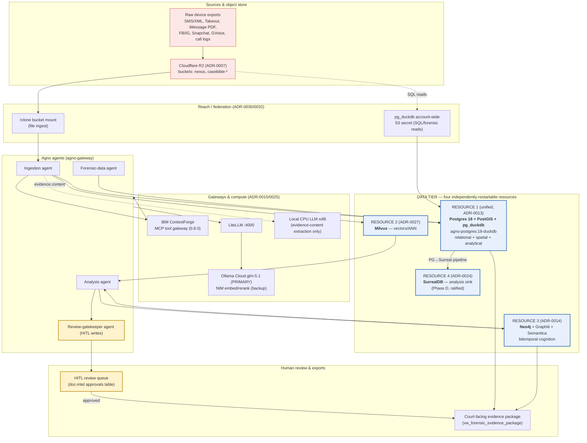
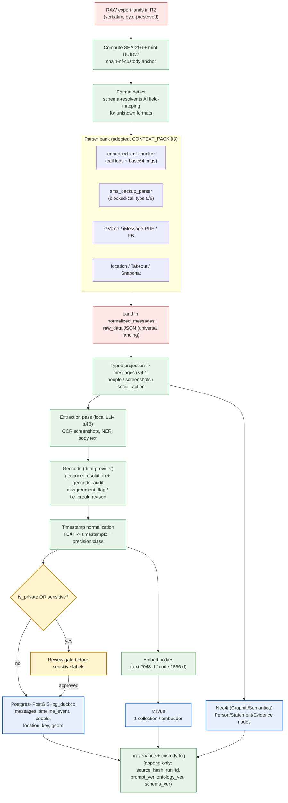
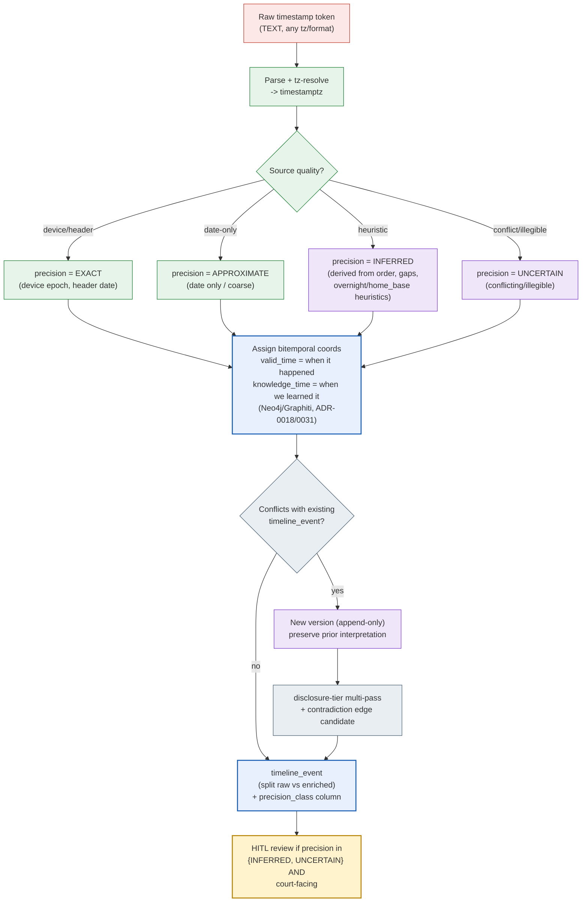
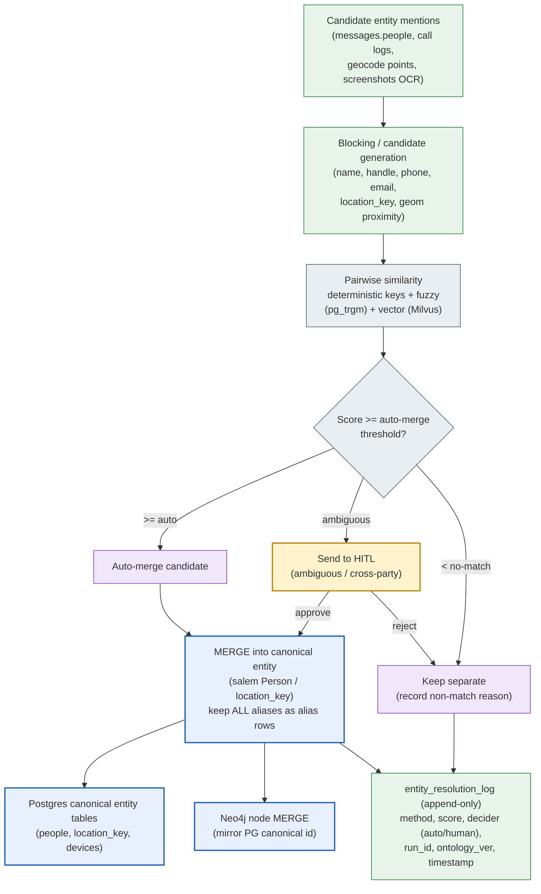
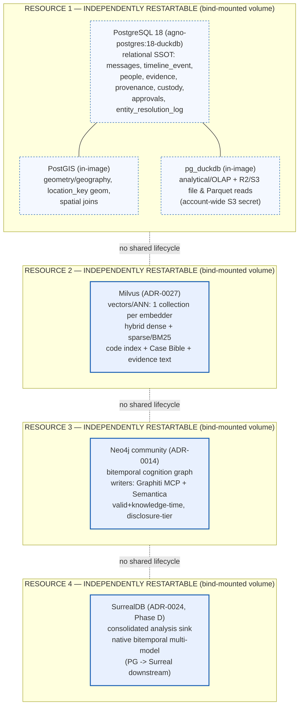
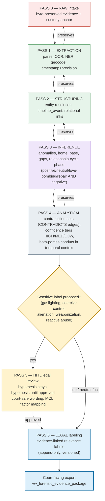
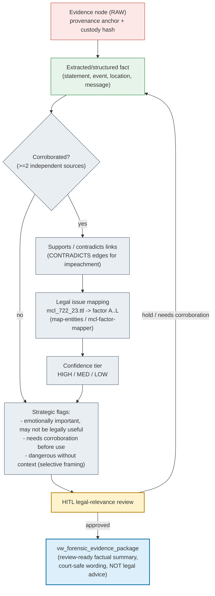

## Diagrams

> _Byline: Claude Code · Opus 4.8 (1M) · 2026-06-30_
>
> All diagrams below are **descriptive of the locked architecture**, not a blank-slate proposal. They visualize decisions already ratified in the ADRs and the crosswalk (see CONTEXT_PACK §2–3): the four-resource data tier (ADR-0013/0027/0014/0024), the Milvus embedding contract (ADR-0010/0011/0026/0027), the Neo4j+Graphiti bitemporal cognition substrate (ADR-0014/0018/0031), the salem_v3 ontology adoption, the TraceIQ timeline/geocode adaptation, and the cross-cutting lane discipline (raw → extracted → inferred → analytical → legal-conclusion). Where a node is adopted from prior work it is annotated with its provenance.
>
> **Reading the diagrams.** Every diagram uses a consistent colour/lane convention so a non-developer can follow the flow and a developer can implement it:
>
> | Lane | Meaning | Mutability | Diagram tag |
> |---|---|---|---|
> | RAW | Original evidence, byte-preserved | Immutable / append-only | `RAW` |
> | EXTRACTED | Machine-derived facts (OCR, geocode, parse) | Append-only, versioned by run | `EXT` |
> | INFERRED | Model/heuristic conclusions (anomalies, home-base, dedup) | Versioned, never overwrites prior | `INF` |
> | ANALYTICAL | Views, scores, contradiction sets | Recomputable from lower lanes | `ANL` |
> | LEGAL | Court-relevance / abuse-pattern labels | **HITL-gated**, append-only | `LEGAL` |
> | HITL | Human-in-the-loop review gate | Blocking | `HITL` |
>
> Mermaid validity note: every label that contains `(`, `+`, `/`, `:` or `,` is wrapped in quotes so the diagrams parse cleanly in mermaid-cli / mermaid.live.

---

### 18.1 System architecture diagram

End-to-end view of the platform: object store → ingestion → the four persistence resources → cognition/analysis → human review → court-facing exports. The four data-tier resources are drawn as **independently restartable** boxes (CONTEXT_PACK §1, the HARD CONSTRAINT).

**Notes.** Evidence *content* is only ever extracted by the **local CPU LLM (≤4B)** — never by cloud LLMs or external entity-extracting tools (CONTEXT_PACK §4, hardware constraint). The cloud `glm-5.1` path is used for orchestration/reasoning over already-extracted, non-sensitive facts. Every agent *write* is routed through the **review-gatekeeper** (HITL on every write).

---

### 18.2 Evidence ingestion pipeline

From a raw device export to durable, provenance-stamped rows across the four stores. The pipeline enforces lane discipline and the **UUIDv7 + SHA-256 chain-of-custody** column contract (adopted from the salvaged doc-intelligence design, CONTEXT_PACK §3).

**Lane mapping.** `A/D` = RAW (never overwritten). `B/C/E/F/G/H/I/L` = EXTRACTED (append-only, stamped with `run_id`). `J/M` = HITL gates. `K1/K2/K3` = the destination resources. Google raw-export JSON shape is preserved verbatim as the RAW evidence contract (CONTEXT_PACK §3).

---

### 18.3 Temporal inference workflow

How a timestamp moves from a raw string to a court-usable temporal fact, carrying its **precision class** (the gap missing from ALL prior schemas — CONTEXT_PACK §3) and its bitemporal coordinates (valid-time + knowledge-time, ADR-0018/0031). Maps the Constraints requirement to distinguish exact / approximate / inferred / uncertain timestamps.

| Precision class | Source signal | Lane | Court use |
|---|---|---|---|
| EXACT | Device epoch / message header | EXTRACTED | Direct |
| APPROXIMATE | Date-only / coarse window | EXTRACTED | Use with stated window |
| INFERRED | Ordering, gap, overnight/home-base heuristic | INFERRED | HITL + corroboration |
| UNCERTAIN | Conflicting or illegible source | INFERRED | Flag; not for standalone assertion |

Inferred timestamps **never overwrite** an earlier interpretation — a new append-only version is written, and the prior remains queryable via knowledge-time (Constraints: "never overwrite earlier interpretations").

---

### 18.4 Entity-resolution workflow

How candidate entities (people, locations, devices) from many sources are merged into canonical entities while preserving every alias and the merge decision. Adopts the salem_v3 `Person` MERGE rule and TraceIQ `location_key` dedup + `people` MERGE (CONTEXT_PACK §3). Merges are **append-only and reversible** — the system records *why* two records were joined, never silently collapsing them.

**Reversibility.** Because every merge is logged with its decider and score, a later human can split a wrongly-merged entity by superseding the merge row — the canonical id is stable but the membership is versioned. Cross-party merges (linking the user and the partner to a shared person/location) are always HITL, since they can carry strategic weight.

---

### 18.5 Data-store responsibility diagram

**This diagram is mandated to show the exact four-resource topology** (CONTEXT_PACK §1 / §6 HARD CONSTRAINT): **ONE unified box** "Postgres + PostGIS + pg_duckdb", and **three separate boxes** Milvus / Neo4j / SurrealDB — each labeled **independently restartable** (no shared lifecycle, separate bind-mounted volumes). DuckDB and PostGIS are drawn *inside* the unified box and are never standalone deployables.

| Resource | Owns (system of record for) | Reads from | Restart blast radius |
|---|---|---|---|
| **1. Postgres + PostGIS + pg_duckdb** (unified) | Relational SSOT, spatial geometry, OLAP/Parquet/R2 SQL reads, provenance & custody, approvals | R2 via pg_duckdb S3 secret | Self only — Milvus/Neo4j/Surreal keep running |
| **2. Milvus** (separate) | Dense+sparse vectors / ANN search | Raw docs (source of truth) | Self only |
| **3. Neo4j** (separate) | Bitemporal cognition graph (entities, edges, contradictions) | PG canonical ids; written by Graphiti + Semantica | Self only |
| **4. SurrealDB** (separate, Phase D) | Consolidated bitemporal analysis sink | PG→Surreal pipeline | Self only |

A crash or rebuild of any one box **must never** tear down the others — this is the corrective to the prior single-Coolify-app coupling (CONTEXT_PACK §1, infra split decision).

---

### 18.6 Multi-pass analysis flow

The disclosure-tier multi-pass model (ADR-0031): evidence is analyzed in escalating passes, each pass adding interpretation **without overwriting** lower passes, and each sensitive escalation gated by human review. Mirrors the lane discipline raw → extracted → inferred → analytical → legal.

**Guarantees encoded here.** (1) Each pass is append-only and points back to the pass it was derived from (`preserves` edges) → full artifact lineage to source evidence, prompt/ontology/schema version, and review decision. (2) The relationship-cycle (positive/neutral/love-bombing/repair) is modeled in Pass 3 alongside negative incidents — sentiment is never one-sided. (3) Both parties' conduct, including the user's own reactions/escalations/apologies, is evaluated in temporal context in Pass 4. (4) No hypothesis becomes a legal label without passing the Pass-5 HITL gate.

---

### 18.7 Evidence-to-legal-issue mapping flow

How a piece of raw evidence becomes a court-facing claim tied to a legal issue (e.g., an MCL 722.23 best-interest factor) — with confidence, corroboration status, and strategic-risk flags surfaced explicitly. Uses the adopted `mcl_722_23.ttl` (12 MCL factors) and `vw_forensic_evidence_package` tiers (CONTEXT_PACK §3).

| Mapping attribute | Source | Purpose |
|---|---|---|
| Legal issue / factor | `mcl_722_23.ttl` (A–L) via mcl-factor-mapper | Ties evidence to a recognized best-interest factor |
| Confidence tier | `vw_forensic_evidence_package` (HIGH/MED/LOW) | Sets weight & disclosure posture |
| Corroboration status | ≥2 independent sources rule | Gates standalone assertion |
| Strategic-risk flag | Analytical pass | Surfaces "emotionally important but not legally useful" and "dangerous without context" |
| Court-safe wording | Pass-5 HITL | Favors "structure, safety, clarity, child stability" framing over blame |

The export is explicitly a **review-ready factual summary, not legal advice** — every mapped claim carries its confidence tier, corroboration status, and the human reviewer's sign-off (append-only), so any court-facing assertion is traceable back to the raw evidence and the decision that approved it.

---

### 18.8 Diagram-to-decision traceability

| Diagram | Primary ADR / source adopted | Key constraint satisfied |
|---|---|---|
| 18.1 System architecture | 0007/0013/0014/0015/0024/0025/0027/0030/0032 | Four-resource tier; cloud vs local-evidence split |
| 18.2 Ingestion pipeline | Salvaged parsers + normalized_messages + UUIDv7/SHA-256 (CONTEXT_PACK §3) | RAW preserved; provenance & custody on every row |
| 18.3 Temporal inference | TraceIQ timeline + ADR-0018/0031 | Exact/approx/inferred/uncertain precision class |
| 18.4 Entity resolution | salem_v3 Person MERGE + TraceIQ location_key | Reversible, logged, alias-preserving merges |
| 18.5 Data-store responsibility | CONTEXT_PACK §1 HARD CONSTRAINT | Unified PG box + 3 separate, independently restartable |
| 18.6 Multi-pass flow | ADR-0031 disclosure-tier + lane discipline | Append-only passes; HITL before sensitive labels |
| 18.7 Evidence→legal mapping | mcl_722_23.ttl + vw_forensic_evidence_package | Court-safe, corroboration-gated, lineage-preserving |
