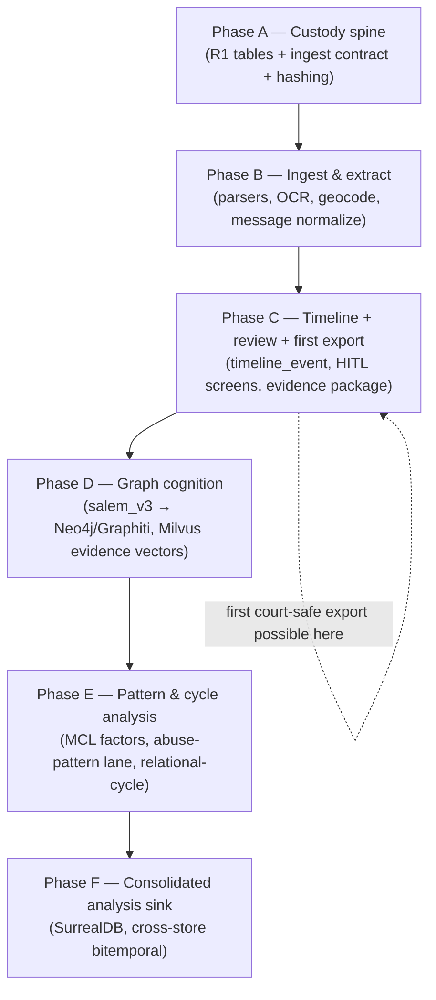
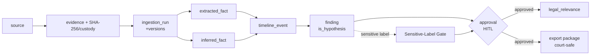

## Final Execution-Ready Plan

> _Byline: Claude Code · Opus 4.8 (1M) · 2026-06-30_
> Closing section. This is the buildable distillation of the whole package: the order to build in, the exact first tables/APIs/jobs/workers/screens/fixtures/export, and what to defer. It is **not a blank slate** — every step adopts named prior work (salem_v3 ontology, TraceIQ timeline, the `extracted-code/MANIFEST.md` salvage, doc-intelligence tables) and cites the ADRs it rests on. On any conflict, the SSOT docs (`Agno-MCP-Platform/docs/PROJECT_CANON.md` + ADRs) win.

### 0. Orientation — what this plan assumes is already true

Four persistence resources already exist or are ratified, with **no shared lifecycle** (separate bind-mounted volumes, independent start/stop/rebuild — owner HARD CONSTRAINT, Context Pack §1):

| # | Resource | Contents | ADR | State at start |
|---|---|---|---|---|
| R1 | **PostgreSQL 18** (`agno-postgres:18-duckdb`) | relational + **PostGIS** + **pg_duckdb** (embedded DuckDB) + pgvector (legacy) + pg_trgm/pgcrypto; native `uuidv7()` | 0013 (supersedes 0003) | LIVE |
| R2 | **Milvus** | all vectors: code index, Case Bible, knowledge, **evidence text/message-body embeddings** | 0026/0027 | LIVE (ovh2) |
| R3 | **Neo4j community + Graphiti** | bitemporal cognition graph (salem_v3 KG, Semantica writer) | 0014/0018/0031 | LIVE |
| R4 | **SurrealDB** | consolidated analysis sink (PG→Surreal downstream) | 0024 | RATIFIED, **not deployed (Phase D)** |

Build everything against **R1 first**. R2/R3 are wired but the forensic schema does not yet exist in them. R4 is deliberately delayed (see §9). DuckDB and PostGIS are never built/described as standalone — they live inside R1.

The **five lanes** must stay physically distinguishable in every table from day one (Context Pack §3, §6): **raw evidence → extracted facts → inferred facts → analytical findings → legal conclusions**, plus the orthogonal **timestamp-precision class** (`exact | approximate | inferred | uncertain`) that is missing from ALL prior schemas and is added here.

---

### 1. Recommended build order

Six phases. Each phase ends at a usable, demoable state and never blocks on R4. Phases A–C are the MVP; D–F are scale-out.

| Phase | Theme | Exit criterion (demoable) | Depends on |
|---|---|---|---|
| **A** | Custody spine | One real file ingested → row in `evidence` with SHA-256 + UUIDv7, provenance + chain-of-custody recorded, retrievable by API | R1 live |
| **B** | Ingest & extract | A Google Takeout export + an SMS/XML backup + a PDF → typed `messages`/`visits`/`screenshots` rows, all lineage-linked back to `evidence` | A |
| **C** | Timeline + review + export | Reviewer can approve/reject extracted facts in a screen; a HIGH-confidence timeline slice exports to a court-safe package | A, B |
| **D** | Graph cognition | salem_v3 entities/edges in Neo4j mirrored to PG; evidence text searchable in Milvus | C |
| **E** | Pattern & cycle | MCL-factor mapping + abuse-pattern hypotheses (HITL) + positive/neutral/love-bombing cycle phases attached to events | D |
| **F** | Consolidated sink | SurrealDB analysis store fed from PG; cross-store bitemporal queries | E |

Guiding rule (owner autonomy rule, MEMORY): reversible, re-ingestible work is done without stopping to ask; anything destructive or court-facing stops for human review.

---

### 2. First tables to create (Phase A — the custody spine)

Build these **in order** in R1. All use `uuidv7()` PKs (native, ADR-0013), `created_at timestamptz default now()`, and append-only discipline. These adopt the **UUIDv7 + SHA-256 chain-of-custody column contract** and the **doc-intelligence tables (sections/chunks/spans/entities/findings/approvals)** named in Context Pack §3.

| Order | Table | Lane | Purpose / key columns | Adopted from |
|---|---|---|---|---|
| 1 | `source` | raw | physical origin: device, account, export bundle. `source_type`, `custodian`, `acquired_at`, `acquired_by` | salem_v3 / Semantica `source_hash` |
| 2 | `evidence` | **raw (central anchor)** | one row per immutable artifact. `sha256` (UNIQUE), `r2_key`, `mime`, `byte_size`, `source_id`, `received_at`, `precision_class` of `received_at` | salem_v3 `Evidence` (central provenance anchor) |
| 3 | `chain_of_custody` | raw (append-only) | every hand-off/transform on an `evidence` row. `actor`, `action`, `at`, `prev_sha256`, `note` — never updated, only inserted | UUIDv7+SHA-256 contract |
| 4 | `ingestion_run` | provenance | one row per pipeline execution. `pipeline`, `pipeline_version`, `prompt_version`, `ontology_version`, `schema_version`, `started_at`, `status` | doc-intelligence + lineage constraints |
| 5 | `processing_artifact` | provenance (append-only) | persisted intermediate work products (scans, drafts, indexes, tool-call outputs, prompt outputs). `run_id`, `kind`, `r2_key`, `parent_artifact_id`, `archived_reason NULL` | Constraint: "persist intermediate work products, not just final records" |
| 6 | `extracted_fact` | extracted | OCR text, geocode, parsed field. `evidence_id`, `run_id`, `fact_type`, `value_jsonb`, `confidence`, `precision_class`, `review_status` | TraceIQ extracted lane |
| 7 | `inferred_fact` | inferred | overnight stays, home_base, anomalies. `derived_from[]` (artifact lineage), `method`, `confidence`, `precision_class`, `review_status` | TraceIQ inferred lane |
| 8 | `finding` | analytical | analyst/model interpretation. `claim`, `supports[]`/`contradicts[]` evidence ids, `confidence`, `is_hypothesis bool default true`, `review_status` | doc-intelligence `findings` |
| 9 | `legal_relevance` | legal-conclusion | MCL factor / legal usefulness tag. **insert-only**, `finding_id`, `factor`, `relevance`, `requires_corroboration bool`, `court_safe_wording`, `review_status` | mcl_722_23.ttl, irac-formatter |
| 10 | `approval` | review (append-only) | one row per human decision. `target_table`, `target_id`, `reviewer`, `decision` (`approved/rejected/needs-changes/escalated`), `at`, `rationale`, `prior_version_id` | doc-intelligence `approvals`, HITL guardrail |
| 11 | `timestamp_assertion` | cross-cutting | normalizes any temporal claim with its `precision_class` + source. Referenced by timeline. **New — fills the gap missing from all prior schemas** | Context Pack §3 gap |

Notes:
- **Append-only enforcement:** `chain_of_custody`, `processing_artifact`, `approval`, `legal_relevance`, and all `*_fact`/`finding` history use insert-only + a `superseded_by uuid` pointer; never `UPDATE`/`DELETE` in place (guardrail: "never overwrite original evidence or earlier interpretations"). A `BEFORE UPDATE/DELETE` trigger raises on these tables.
- **`review_status` enum** everywhere facts/findings live: `unreviewed | approved | rejected | needs-changes | escalated`. Default `unreviewed`. Nothing court-facing may export unless `approved`.
- **`is_hypothesis` defaults true** on `finding` and on every sensitive edge (salem_v3 `USED_TACTIC`, `EXPLOITED_VULNERABILITY`, `DISPARAGES`) — allegation ≠ fact; promotion to fact requires an `approval` row (guardrail: never silently promote a hypothesis).
- Defer the full salem_v3 `Person/Incident/Location/Statement` relational mirror to Phase D; Phase A only needs the custody spine + the lineage backbone.

---

### 3. First APIs to expose (Phase A→B)

Thin REST surface on the **agno-gateway** (forensic-data-agent / ingestion-agent already exist, Context Pack §4). **Writes route through the review-gatekeeper** (approval-gated, Context Pack §4). Reads are open to the analyst UI.

| Order | Endpoint | Verb | Lane / gate | Purpose |
|---|---|---|---|---|
| 1 | `/evidence` | POST | raw, gatekeeper | register artifact: compute SHA-256, write `evidence` + `chain_of_custody` + R2 key. Idempotent on `sha256` |
| 2 | `/evidence/{id}` | GET | read | fetch artifact metadata + custody chain + lineage tree |
| 3 | `/ingestion-run` | POST | provenance, gatekeeper | start a pipeline run; returns `run_id` stamped with prompt/ontology/schema versions |
| 4 | `/facts` | GET | read | list extracted/inferred facts for an evidence id, with `confidence` + `precision_class` + `review_status` |
| 5 | `/review/queue` | GET | read | items where `review_status='unreviewed'` or `escalated`, ordered by sensitivity then confidence |
| 6 | `/review/{target}/{id}` | POST | review, gatekeeper | record an `approval` decision (append-only); never mutates the target, writes `superseded_by` if a new version supersedes |
| 7 | `/timeline` | GET | read | timeline_event slice by date range + confidence tier (Phase C) |
| 8 | `/export/package` | POST | legal, **double-gated** | assemble a court-safe export (Phase C); requires every included item `approved` |

API rules: every response carries `provenance` (evidence ids + run_id + versions); every derived object is traceable to source (lineage guardrail). No endpoint returns a sensitive label (`gaslighting`, `coercive control`, `alienation`, `weaponization`, `reactive abuse`) unless a human `approval` exists for it. **Raw forensic/abuse content is never sent to external/cloud LLM-extracting tools** (exa/Drive/Lucid/M365, and graphiti/agno entity extraction) — local CPU-only ≤4B extraction only (Context Pack §4).

---

### 4. First background jobs (Phase B)

Idempotent, run-scoped (each writes an `ingestion_run` row), re-runnable on the same source without dupes (keyed on `evidence.sha256` + `extracted_fact` natural key). Prefer the salvaged parsers from `extracted-code/MANIFEST.md` over re-implementing (Context Pack §3, off-the-shelf-first principle).

| Order | Job | Input → output | Reuses (MANIFEST salvage) |
|---|---|---|---|
| 1 | `hash-and-land` | new R2 object → `evidence` + custody row + Milvus-deferred | UUIDv7+SHA-256 contract |
| 2 | `takeout-ingest` | Google Takeout JSON → raw `visits/activities/paths/trips`, kept verbatim | location/Takeout parser; Google raw-export = RAW EVIDENCE contract |
| 3 | `message-normalize` | SMS/XML backup, GVoice, iMessage-PDF, FB, Snapchat → `messages` (typed) + `raw_data` JSON landing | enhanced-xml-chunker.py, sms_backup_parser (blocked-call type 5/6), schema-resolver.ts for unknown formats |
| 4 | `ocr-extract` | image/screenshot → `extracted_fact` (text) + `screenshots` row | screenshots/OCR=extracted (TraceIQ) |
| 5 | `geocode-resolve` | raw location → `geocode_resolution` (dual-provider) + append-only `geocode_audit` | TraceIQ `disagreement_flag`/`tie_break_reason` |
| 6 | `embed-evidence` | approved text/message bodies → Milvus (one collection/embedder) | ADR 0010/0011/0026/0027 |

Job discipline: parsers write the **raw JSON verbatim into `raw_data`** (normalized_messages landing design) before typing, so nothing is lost and platform-hops can be reconstructed. `schema-resolver.ts` handles unknown formats via AI field-mapping but its output is `unreviewed` and lands in `extracted_fact`, never directly as canonical.

---

### 5. First analysis workers (Phase C→E)

Workers read facts, write **`finding` rows with `is_hypothesis=true`** and provenance — they never write legal conclusions directly. Sensitive output is gated to a review screen.

| Order | Worker | Reads → writes | Reuses | Gate |
|---|---|---|---|---|
| 1 | `timeline-builder` | extracted/inferred facts → `timeline_event` (split raw vs enriched; TEXT ts → `timestamptz` + `precision_class`) | TraceIQ `timeline_enriched`→`timeline_event` | none (factual) |
| 2 | `confidence-tierer` | timeline_event → `vw_forensic_evidence_package` HIGH/MED/LOW | TraceIQ `vw_forensic_evidence_package` | HITL on MED/LOW |
| 3 | `cycle-phaser` | messages + events → relational-cycle phase (positive/neutral/affectionate/love-bombing/repair), surface tone + inferred intent + relational function as **separate** fields | positive_behaviors.ttl, behavioral_patterns.ttl | HITL |
| 4 | `pattern-detector` | messages/events → abuse-pattern hypotheses (DARVO, 256-pattern, MCL A–L) | detection_patterns.py, seed-patterns.ts (~303), hurtlex_loader | **HITL mandatory** |
| 5 | `mcl-mapper` | findings → `legal_relevance` (12 MCL factors), flags `requires_corroboration` | mcl_722_23.ttl, mcl-factor-mapper skill | **HITL mandatory** |
| 6 | `reaction-contextualizer` | user's own reactions in temporal context (before/after), distinguishes explanation vs excuse; flags possible selective framing/quoting | guardrails §6 | HITL |

Critical balance constraints baked into workers: model **both parties** including the user's own mistakes/apologies/repair attempts; model the **full relational cycle**, not only negative incidents; never portray the user as perfect or the partner as abusive without evidence-linked support. `pattern-detector` and `mcl-mapper` outputs are inadmissible to export until an `approval` exists.

---

### 6. First human-review screens (Phase C)

Off-the-shelf-first: build on an admin-table UI (e.g. Refine/React-admin against the REST API) rather than custom — minimize custom code. Three screens ship in Phase C, the rest follow.

| Order | Screen | Shows | Actions | Why first |
|---|---|---|---|---|
| 1 | **Fact Review Queue** | `unreviewed` extracted/inferred facts with source artifact preview, confidence, precision_class | approve / reject / needs-changes → writes `approval` | unblocks any export |
| 2 | **Evidence Inspector** | one `evidence` row: custody chain, lineage tree, all derived facts/findings | view-only + escalate | auditability |
| 3 | **Sensitive-Label Gate** | abuse-pattern + MCL + relational-cycle hypotheses, with side-by-side evidence and court-safe wording suggestion | approve to fact / keep hypothesis / reject / rewrite wording | guardrail: human review before sensitive labels reach court |
| 4 (next) | **Timeline Review** | timeline_event slice, confidence tiers, disagreement flags | approve slice for export | Phase C export |
| 5 (next) | **Export Builder** | selects only `approved` items, shows what's excluded and why | assemble package (double-gated) | court-safe output |

Every screen surfaces the four separations the Constraints demand: emotional truth vs factual support vs legal usefulness vs court-safe wording; and flags items "emotionally important but maybe not legally useful" and "strategically dangerous without context."

---

### 7. First test fixtures

Synthetic, non-sensitive, checked into the repo. Real evidence never enters fixtures. Each fixture is a small but complete vertical slice so the lane discipline and provenance chain are testable end-to-end.

| Order | Fixture | Covers |
|---|---|---|
| 1 | `fx_single_artifact` | one PNG + its SHA-256, custody chain, R2 key — tests `hash-and-land` idempotency on re-ingest |
| 2 | `fx_takeout_min` | a 3-day Google Takeout slice (visits/activities) — tests raw-verbatim landing + geocode dual-provider disagreement |
| 3 | `fx_sms_thread` | a synthetic SMS/XML backup with a blocked-call type-5 and a love-bombing→conflict→repair arc | tests message-normalize + cycle-phaser + both-parties modeling |
| 4 | `fx_timestamp_classes` | events with one each of exact/approximate/inferred/uncertain timestamps | tests `precision_class` propagation into timeline + export |
| 5 | `fx_hypothesis_gate` | a pattern-detector hit that must NOT export until approved | tests the HITL gate + "never promote hypothesis to fact" |
| 6 | `fx_lineage` | final export item traced back through finding → fact → evidence → source + run/prompt/ontology/schema versions | tests artifact lineage end-to-end |

Golden assertions: re-running any job on a fixture produces zero new `evidence` rows (idempotent); no fixture can reach `/export/package` without `approval` rows; every exported object resolves a full lineage path.

---

### 8. First export format

**A signed, self-describing evidence-package bundle** — review-ready factual summary, never legal advice (Constraint 2466). Produced only from `approved` items.

Structure (one bundle = one R2 object + manifest):

| Part | Content |
|---|---|
| `manifest.json` | bundle id (UUIDv7), generated_at, schema/ontology/prompt versions, list of included items with their `sha256` + lineage + `precision_class` + confidence tier |
| `timeline.md` / `timeline.csv` | court-safe, evidence-linked timeline (HIGH/MED/LOW tier labelled), each row citing evidence id |
| `evidence/` | the underlying approved artifacts (or R2 references + hashes) |
| `provenance.jsonl` | append-only lineage records: source → run → fact → finding → approval for every claim |
| `review_log.jsonl` | every `approval` decision + reviewer + rationale for included items |
| `exclusions.md` | what was deliberately excluded and why (unreviewed, hypothesis-only, "dangerous without context") |
| `bundle.sha256` | hash over the manifest for integrity / chain-of-custody continuation |

Format rules: court-safe, evidence-based language only; favors the framing "structure, safety, clarity, child stability" over blame; sensitive labels appear only if approved and only with their court-safe wording; every claim is corroboration-flagged where required. The whole bundle is itself registered back as an `evidence`/`processing_artifact` (its own SHA-256) so exports are auditable and chainable.

---

### 9. What to delay until later

Deferring these keeps the MVP (Phases A–C) shippable and avoids over-building before the custody spine + review loop prove out.

| Delay | Until | Why safe to defer | Ref |
|---|---|---|---|
| **SurrealDB (R4) deployment** | Phase F | Ratified but not deployed; PG is the system of record, Surreal is a downstream analysis sink — nothing court-facing depends on it | ADR-0024, Phase D-pending |
| **Full salem_v3 → Neo4j/Graphiti graph build** | Phase D | Needs clean approved entities first; Phase A only needs the PG custody spine. Mirror Person/Incident/Location/Statement after facts are reviewable | Context Pack §3 |
| **Milvus evidence-vector search** | end of Phase B / Phase D | Only approved text should be embedded; embed-evidence runs after review exists. Code/CaseBible collections already live and unaffected | ADR 0010/0011/0026/0027 |
| **Federation / cross-store query layer** | Phase F | reach = pg_duckdb + native Cypher + Milvus SDK + PG→Surreal; no single federation engine needed early (Multicorn2/neo4j-fdw dropped) | ADR-0032 |
| **Semantica PROV-O substrate full build** | Phase D–E | `source_hash`/conflict model adopted now as columns; full PROV-O graph after graph cognition lands | CANON §5 |
| **Knowledge-base migration into Milvus** | Phase B/D | orthogonal to forensic MVP | ADR-0027 |
| **Advanced abuse-pattern automation** (auto-promotion, scoring) | post-E | must stay HITL-gated; automate only the queueing, never the conclusion | guardrail §6 |
| **README ADR-0003 label fix** | housekeeping, anytime | doc drift only ("Accepted" → "Superseded by 0013/0014/0027"); not a build blocker | Context Pack §2 |

Do **not** delay: the SHA-256/UUIDv7 custody chain, the five-lane separation, the `precision_class` column, append-only/provenance discipline, and the HITL approval table. These are cheap to add now and prohibitively expensive to retrofit once real evidence is loaded — and they are exactly what makes the eventual output court-defensible.

---

### 10. One-glance critical path

**Build A→E, demo at C, gate everything sensitive at the approval table, export only approved, and never touch R4 or external LLM extraction on raw evidence until the custody spine and review loop are proven.**
