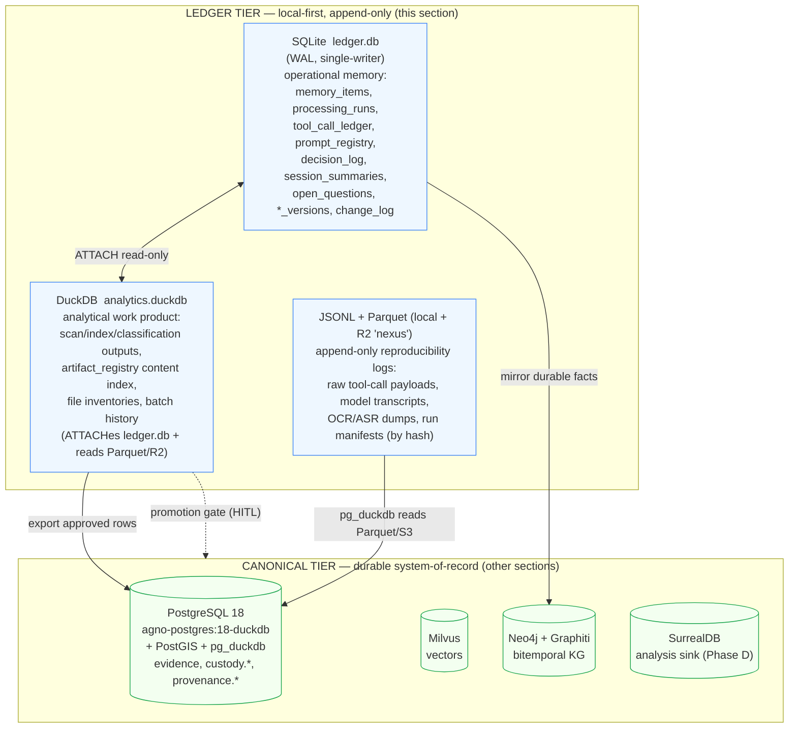
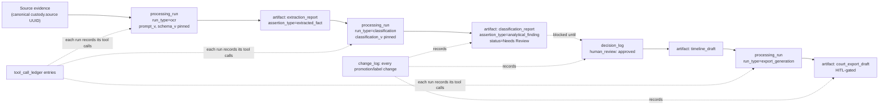
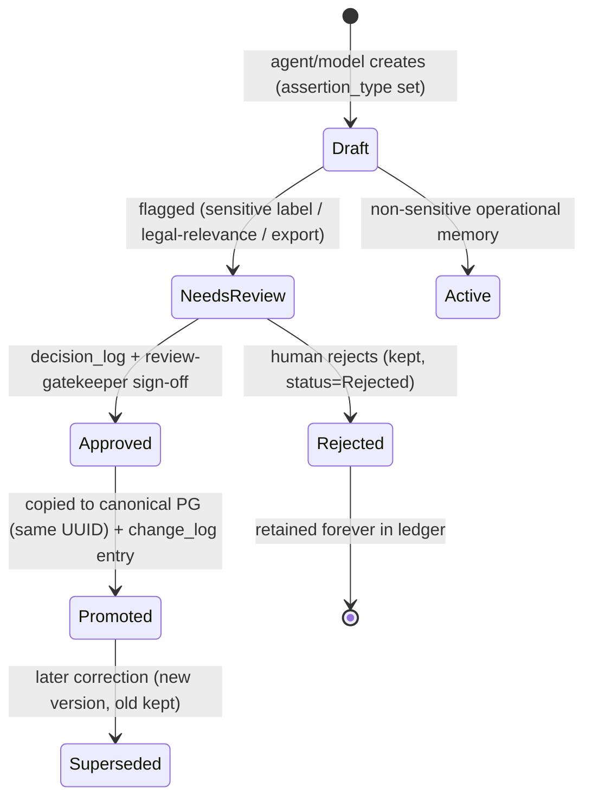

## Persistent Work-Product Ledger & Micro-Memory Design

> _Byline: Claude Code · Opus 4.8 (1M) · 2026-06-30_
> Implements master-prompt §"Persistent Work-Product Ledger and Micro-Memory System" (MP 900–1423) and the 12 mandated minimum tables (MP 1340–1366). Grounded in the CONTEXT_PACK locked stack: ADR-0013 (`agno-postgres:18-duckdb`, native `uuidv7()`, pg_duckdb embedded), ADR-0007/0030 (R2 + pg_duckdb S3 reach), ADR-0027 (Milvus single vector store), ADR-0014/0018/0031 (Neo4j+Graphiti bitemporal), ADR-0024 (SurrealDB Phase-D sink), ADR-0015 (LiteLLM/Ollama `glm-5.1` primary, CPU-only ≤4B local). Reuses the SHA-256 + UUIDv7 chain-of-custody backbone, `assertion_type`/`timestamp_certainty` carry-through, and the `provenance.*`/`custody.*` namespaces declared in §3 (canonical data model) and §9 (provenance & chain-of-custody). On conflict, the SSOT docs win.

This section designs the **project's memory of its own work** — a local-first, append-only ledger that records not just final database records but every intermediate scan, draft, classification run, tool call, prompt version, and decision that produced them. It is deliberately a **separate tier** from the canonical evidence stores so that rough drafts, hypotheses, and model-generated interpretations can be preserved in full without ever polluting the evidence tables. It is the layer that lets the platform stop rediscovering the same facts, resume cleanly across sessions, and — most importantly for a system that may one day produce court-facing exports — answer *"how did we get here, who/what said so, and was a human involved?"* for any conclusion.

### 0. Plain-language summary (for the non-developer)

Think of this as the **project's lab notebook** sitting next to the evidence locker (§9).

- The **evidence locker** holds sealed originals and approved facts. This **lab notebook** holds everything we *did and thought along the way*: "scanned this folder," "ran OCR with this prompt," "drafted this schema, then changed it," "the model guessed X but it needs review."
- The notebook is **append-only**: we never erase a page. When we change our mind, we write a new dated page that points back to the old one and says why.
- The notebook is **clearly fenced off from the evidence locker**. A rough draft or an AI hunch lives in the notebook with a big "DRAFT / NEEDS REVIEW" stamp. It only moves into the evidence locker after a human signs off — and even then the original draft stays in the notebook forever.
- Every final thing we produce (a timeline, a report, a court packet) has a thread in the notebook running all the way back to the raw file it came from, the run that processed it, the prompt version used, and the reviewer who approved it.
- The notebook is small and portable — plain files on the local disk (SQLite + DuckDB + append-only logs) — so it runs on the user's CPU-only machine, survives between sessions, and can be backed up by copying files.

The rest of this section is the technical specification of that notebook.

### 1. Design principles

| # | Principle | Mechanism |
|---|---|---|
| L1 | **Separate tier — never pollute canonical evidence.** | Ledger lives in its own SQLite/DuckDB files + JSONL/Parquet logs, physically distinct from the canonical PG evidence DB. A **promotion gate** (HITL) is the only path from ledger → canonical. |
| L2 | **Append-first, never destructive.** | Mutable-looking rows use supersession chains (`status` + `superseded_by`); every field change is logged to `change_log` (insert-only, hash-chained). No `UPDATE`/`DELETE` of history. |
| L3 | **Total, queryable lineage.** | `artifact_registry` + `processing_runs` + `tool_call_ledger` form a DAG; every final artifact traces to source evidence, runs, prompt/ontology/schema/classification versions, and review decisions. |
| L4 | **Classify, never conflate.** | Every memory/artifact carries `assertion_type` ∈ {raw_evidence, extracted_fact, inferred_fact, analytical_finding, legal_conclusion} + `confidence` + `review_status`, identical to the §9 P6 contract. |
| L5 | **HITL gates sensitive promotion & export.** | Sensitive labels (gaslighting, coercive control, alienation, weaponization, reactive abuse) and any court-facing export are `review_required=1` and blocked until a `decision_log` approval exists; routed through agno-gateway `review-gatekeeper`. |
| L6 | **Inline small, reference large.** | Summaries/metadata stored inline; raw tool payloads, OCR dumps, model transcripts stored by `(hash, path/URI, byte_size)` in JSONL/Parquet/R2 — never pasted into a row (MP 1133). |
| L7 | **Local-first, portable, CPU-only.** | No server needed to read the ledger: single-file SQLite + DuckDB + flat logs. Sensitive content is processed by local ≤4B paths (CONTEXT_PACK §3/§4); cloud runs are themselves logged as provenance. |
| L8 | **Versioned context, not overwritten.** | Prompt, ontology, schema, and classification versions are first-class rows; runs pin the exact version IDs they used so a result is always reproducible against the context that produced it. |

### 2. Recommended store mix

The system uses **all four** persistence patterns the MP offers (MP 979–985), each for what it is best at, with a single hard rule: the ledger tier is **not** the canonical evidence DB.



| Store | File / location | Role in the ledger | Why this store |
|---|---|---|---|
| **SQLite** `ledger.db` | local disk (workspace `.ledger/`), WAL mode | Operational system-of-record for the ledger: run logs, tool-call records, prompt/decision/session/version tables, `change_log`. Single-writer, transactional, zero-ops. | MP 963/981 default; transactional integrity for the audit log; trivially portable and backup-by-copy; one writer matches one orchestration loop. |
| **DuckDB** `analytics.duckdb` | local disk (`.ledger/`) | Analytical work product: bulk scan results, file inventories, classification/extraction output tables, the `artifact_registry` **content index**. `ATTACH`es `ledger.db` read-only and reads the Parquet/JSONL logs and R2 directly. | MP 962/982; columnar analytics over large scan tables; native Parquet/JSONL/S3 reads (the same pg_duckdb engine used canonically, ADR-0013) so queries port to PG unchanged. |
| **PostgreSQL 18** (`agno-postgres:18-duckdb`) | OVH, canonical tier | **Promotion target only.** Approved, normalized records cross the promotion gate into `evidence`/`custody.*`/`provenance.*`. The ledger *references* PG canonical IDs; it does not duplicate canonical authority. | ADR-0013 LIVE; canonical durable state per MP 964/983; `uuidv7()` + PostGIS + pg_duckdb already in the image. |
| **JSONL / Parquet** | local `.ledger/payloads/` + R2 `nexus` bucket | Append-only, immutable, hash-named raw payloads and reproducibility logs (large tool outputs, model transcripts, OCR/ASR dumps, run manifests). Referenced by hash+path from SQLite/DuckDB. | MP 965/984; reproducible, diff-able, cheap, content-addressed; readable by both DuckDB locally and pg_duckdb from S3 (ADR-0030) so a run can be replayed anywhere. |
| **Markdown** | `.ledger/notes/`, session handoffs | Human-readable summaries, decision narratives, session handoffs (mirrors `session_summaries`/`decision_log`). | MP 966; non-developer-readable; already the `.remember`/`MEMORY.md` handoff convention in this workspace. |

**Decision (the named ask, MP 968–985): SQLite + DuckDB + PostgreSQL + JSONL/Parquet — the "good default" combination, not a single store.** SQLite is the operational ledger; DuckDB is the analytical lens over it and the bulk-scan store; canonical PG is the promotion target; JSONL/Parquet are the immutable payload/replay logs. This favors simplicity and auditability (MP 977) — no extra server for memory — while reusing the exact pg_duckdb/Parquet/S3 engine the canonical tier already runs, so nothing has to be rewritten when a ledger record graduates to canonical.

**Identity & keys.** All ledger PKs are **UUIDv7** (time-ordered), generated app-side as `TEXT` in SQLite/DuckDB to match canonical `uuidv7()` (ADR-0013) so an ID minted in the ledger is valid verbatim when promoted to PG. Timestamps are stored as ISO-8601 `TEXT` (UTC) in SQLite and `TIMESTAMPTZ` once in PG; any **evidence-bearing** timestamp also carries a `timestamp_certainty` ∈ {exact, approximate, inferred, uncertain} column, identical to §8/§9.

### 3. The 12 mandated tables (MP 1340–1366)

For each: **store**, **PK**, **append-only?**, **HITL?**, key fields, indexes. Namespace: the SQLite tables are unprefixed in `ledger.db`; when mirrored/queried in DuckDB they live in schema `mem`. Foreign keys to canonical objects use the **same UUID** value but are *soft* references (the ledger must read even if PG is offline — L7).

#### 3.1 `memory_items` — durable project memory (MP 994–1016, 1218–1248)

| Property | Value |
|---|---|
| Store | SQLite (`ledger.db`); mirrored to Neo4j/Graphiti for durable *project/user* facts only (never raw evidence — CONTEXT_PACK §4) |
| PK | `memory_id` (UUIDv7) |
| Append-only | **Versioned** — edits create a new row, old row `status='superseded'`, `superseded_by` set; every change also in `change_log` |
| HITL | Conditional — `review_status` gate when `memory_type ∈ {Hypothesis, Analysis Finding}` or `is_sensitive=1` |

Key fields: `memory_id`, `memory_type` (User Preference \| Project Fact \| Evidence Fact \| Hypothesis \| Analysis Finding \| Design Decision \| Open Question \| Warning \| Artifact Summary \| Run Summary \| Deprecated Memory), `title`, `summary`, `content_inline` (small) **or** `content_uri`+`content_hash` (large, L6), `source_of_memory`, `created_by` (human \| agent id \| model id), `created_at`, `updated_at`, `confidence` (0–1), `assertion_type` (L4), `status` (Active \| Draft \| Needs Review \| Superseded \| Deprecated \| Rejected \| Archived), `superseded_by`, `review_status` (none \| pending \| approved \| rejected), `is_sensitive`, `related_artifact_ids` (JSON), `related_evidence_ids` (JSON, canonical UUIDs), `related_ontology_id`, `related_schema_id`, `tags` (JSON).
Indexes: `(memory_type, status)`, `(status, review_status)`, `(is_sensitive)`, `created_at`; FTS5 virtual table on `title|summary` for recall.

#### 3.2 `artifact_registry` — every generated/imported artifact (MP 1018–1061)

| Property | Value |
|---|---|
| Store | SQLite (metadata) + DuckDB `mem.artifact_registry` (content index for bulk/scan artifacts) |
| PK | `artifact_id` (UUIDv7) |
| Append-only | **Immutable rows** — a changed artifact is a *new* artifact with `parent_artifact_id`/`derived_from_artifact_ids` and the old row `status='superseded'`, `superseded_by` set (P2 parity with §9) |
| HITL | Only for `artifact_type ∈ {court_export_draft, human_review_packet}` (gate at export) |

Key fields: `artifact_id`, `artifact_type` (schema_draft \| final_schema \| ontology_draft \| ontology_crosswalk \| timeline_draft \| evidence_index \| classification_report \| extraction_report \| analysis_report \| mermaid_diagram \| markdown_document \| json_export \| sql_migration \| python_script \| api_specification \| test_fixture \| court_export_draft \| human_review_packet), `title`, `format`, `path_or_uri`, `content_hash` (SHA-256), `byte_size`, `created_by`, `created_at`, `parent_artifact_id`, `derived_from_artifact_ids` (JSON — the lineage edges), `related_source_evidence` (JSON canonical UUIDs), `related_run_id`, `assertion_type`, `status`, `superseded_by`, `summary_md`, `metadata_json`.
Indexes: `(artifact_type, status)`, `parent_artifact_id`, `related_run_id`, `content_hash` (dedupe), `created_at`.

#### 3.3 `processing_runs` — each processing pass (MP 1062–1108)

| Property | Value |
|---|---|
| Store | SQLite |
| PK | `run_id` (UUIDv7) |
| Append-only | **Insert-once**; terminal fields (`finished_at`, `status`, counts) written once on completion, never re-edited (a re-run is a *new* `run_id`) |
| HITL | `human_review_requirement` flag set per run type (e.g. pattern_analysis, legal_issue_mapping ⇒ required) |

Key fields: `run_id`, `run_type` (file_scan \| repository_scan \| evidence_ingestion \| ocr \| transcription \| message_parsing \| entity_extraction \| temporal_extraction \| location_extraction \| gps_processing \| ontology_merge \| schema_generation \| classification \| embedding \| graph_projection \| surreal_consolidation \| pattern_analysis \| legal_issue_mapping \| evidence_task_generation \| export_generation), `run_purpose`, `input_artifact_ids` (JSON), `input_evidence_ids` (JSON), `output_artifact_ids` (JSON), `tool_or_model`, `prompt_version_id` (→ `prompt_registry`), `ontology_version_id`, `schema_version_id`, `classification_version_id`, `parameters_json`, `started_at`, `finished_at`, `status` (running \| ok \| failed \| partial \| cancelled), `error_message`, `summary`, `counts_processed`, `counts_failed`, `confidence_summary_json`, `human_review_requirement`, `replayable` (bool — are all inputs hash-pinned?).
Indexes: `(run_type, status)`, `started_at`, `prompt_version_id`.

#### 3.4 `tool_call_ledger` — all meaningful tool interactions (MP 1110–1133)

| Property | Value |
|---|---|
| Store | SQLite (metadata + summaries) + JSONL/Parquet (raw payloads by reference) |
| PK | `tool_call_id` (UUIDv7) |
| Append-only | **Insert-only** (a tool call is an immutable event) |
| HITL | `human_approval_status` for approval-gated tools (rclone/R2, coolify deploy, git push, agno writes, morph/opencode edits — CONTEXT_PACK §4) |

Key fields: `tool_call_id`, `tool_name`, `tool_category` (read \| analysis \| write \| transfer \| deploy \| llm \| mcp), `run_id` (parent), `input_summary`, `input_payload_uri`+`input_hash` (L6), `output_summary`, `output_payload_uri`+`output_hash`, `created_artifact_ids` (JSON), `updated_record_refs` (JSON), `errors`, `runtime_ms`, `cost_estimate` (nullable), `requested_by` (model/agent id), `human_approval_status` (n/a \| pending \| approved \| denied), `safety_flags` (JSON — e.g. `external_llm`, `sensitive_evidence`, `sweep_risk`), `replayability_status` (replayable \| inputs_lost \| nondeterministic).
Indexes: `(tool_name)`, `(run_id)`, `(human_approval_status)`, `created_at`. **Rule:** large raw responses are stored by `(hash, path)` in `payloads/`, never inline (MP 1133, L6).

#### 3.5 `prompt_registry` — prompts, templates, agent/tone instructions (MP 1135–1158)

| Property | Value |
|---|---|
| Store | SQLite (text inline — prompts are small) |
| PK | `prompt_id` (UUIDv7) + `(prompt_name, prompt_version)` unique |
| Append-only | **Versioned** — a new version is a new row; `superseded_by` chains; old versions never deleted (a run pins the exact `prompt_version_id` it used) |
| HITL | `human_approval_requirement` for prompts that drive classification/court-facing output |

Key fields: `prompt_id`, `prompt_name`, `prompt_version` (semver/int), `prompt_type` (extraction \| classification \| summary \| agent_instruction \| tone_style \| review \| export), `full_prompt_text`, `purpose`, `inputs_expected`, `outputs_expected`, `created_at`, `updated_at`, `used_by_run_ids` (JSON, append), `superseded_by`, `known_limitations`, `safety_constraints`, `tone_style_requirements`, `human_approval_requirement`.
Indexes: `(prompt_name, prompt_version)` unique, `(prompt_type)`. Rationale (MP 1158): prompt changes change extraction/classification behavior, so the version that produced any result must be reconstructable.

#### 3.6 `decision_log` — major design & analysis decisions (MP 1160–1191)

| Property | Value |
|---|---|
| Store | SQLite + Markdown mirror (`.ledger/notes/decisions/`) |
| PK | `decision_id` (UUIDv7) |
| Append-only | **Insert-only**; a reversal is a *new* decision referencing the prior via `supersedes` |
| HITL | `review_status`; sensitive/legal-relevance/export decisions require human owner sign-off |

Key fields: `decision_id`, `decision_title`, `decision_type` (schema \| ontology \| legal_relevance \| evidence_classification \| tooling \| storage \| privacy \| export \| human_review), `context`, `options_considered` (JSON), `decision_made`, `reasoning_summary`, `evidence_or_artifacts_considered` (JSON), `decided_at`, `owner` (human/agent), `reversibility` (reversible \| costly \| irreversible — mirrors the thinking-reversibility lens), `related_risks`, `related_open_questions` (JSON → `open_questions`), `supersedes`, `review_status`.
Indexes: `(decision_type)`, `(review_status)`, `decided_at`. **This table is the ledger's local echo of the ADR set** — architecture decisions reference their ADR number in `context`.

#### 3.7 `session_summaries` — cross-session resume memory (MP 1193–1214)

| Property | Value |
|---|---|
| Store | SQLite + Markdown handoff (mirrors `.remember`/`MEMORY.md`) |
| PK | `session_id` (UUIDv7) |
| Append-only | **Insert-once per session** (closed on session end) |
| HITL | No (operational), but surfaces `important_warnings` for the next session |

Key fields: `session_id`, `session_start`, `session_end`, `user_goal`, `work_completed`, `files_inspected` (JSON), `artifacts_created` (JSON), `decisions_made` (JSON → `decision_log`), `open_questions` (JSON → `open_questions`), `next_actions`, `blockers`, `tone_preference_notes`, `important_warnings`, `related_run_ids` (JSON).
Indexes: `session_start`, FTS on `user_goal|work_completed`. Enables MP 950/2439 "resume without losing context."

#### 3.8 `open_questions` — unresolved issues & discovered gaps (MP 941–942, 1351)

| Property | Value |
|---|---|
| Store | SQLite |
| PK | `question_id` (UUIDv7) |
| Append-only | **Status-versioned** (`open → answered/wont_fix`, never deleted) |
| HITL | Conditional — questions blocking court-facing output flagged `blocks_export=1` |

Key fields: `question_id`, `question_text`, `category` (data_gap \| schema \| ontology \| legal_relevance \| corroboration_needed \| privacy \| technical), `raised_by`, `raised_at`, `status` (open \| investigating \| answered \| wont_fix \| superseded), `answer_summary`, `answered_by`, `answered_at`, `related_run_id`, `related_artifact_ids` (JSON), `blocks_export`, `requires_corroboration` (MP 1471), `priority`.
Indexes: `(status, priority)`, `(category)`, `(blocks_export)`.

#### 3.9–3.11 `schema_versions` / `ontology_versions` / `classification_versions` — pinned context versions (MP 1352–1354)

Three structurally-parallel version tables; runs pin the exact version IDs in force (L8), making any result reproducible against the context that produced it.

| Property | `schema_versions` | `ontology_versions` | `classification_versions` |
|---|---|---|---|
| Store | SQLite | SQLite | SQLite |
| PK | `schema_version_id` (UUIDv7) | `ontology_version_id` | `classification_version_id` |
| Append-only | **Yes — immutable versions**, `supersedes` chain | **Yes** | **Yes** |
| HITL | Migration to canonical PG = decision-gated | Ontology merges = HITL (sensitive edges) | Classification scheme changes = HITL |
| Key fields | `version_label`, `applies_to` (table/namespace), `ddl_uri`+`ddl_hash`, `migration_id`, `created_at`, `created_by`, `supersedes`, `status`, `notes` | `version_label`, `source` (salem_v3 \| TraceIQ_V4.1 \| positive_behaviors.ttl \| behavioral_patterns.ttl \| mcl_722_23.ttl \| merged), `definition_uri`+`hash`, `node_types`(JSON), `edge_types`(JSON), `created_at`, `supersedes`, `review_status`, `notes` | `version_label`, `scheme` (message_category \| abuse_pattern \| MCL_factor \| cycle_phase \| legal_relevance), `label_set`(JSON), `source` (detection_patterns.py \| seed-patterns.ts \| hurtlex \| DARVO \| custom), `definition_uri`+`hash`, `created_at`, `supersedes`, `review_status`, `notes` |

These directly capture the crosswalk's prior art (CONTEXT_PACK §3): the first `ontology_versions` rows are **salem_v3** (`Person`/`Incident`/`Location`/`Statement`/`Evidence` + adopted/adapted/hypothesis edges) and the merged TraceIQ V4.1 + `.ttl` set; the first `classification_versions` rows are the 256-pattern `detection_patterns.py` (MCL A–L, DARVO), `mcl_722_23.ttl` (12 MCL factors), and `positive_behaviors.ttl` (so the both-parties / full-relational-cycle guardrail is a versioned, citable scheme — not an afterthought).
Indexes (each): `(status/review_status)`, `version_label` unique-per-scope, `created_at`.

#### 3.12 `change_log` — append-only change history (MP 1252–1290)

| Property | Value |
|---|---|
| Store | SQLite (insert-only, hash-chained) |
| PK | `change_id` (UUIDv7) |
| Append-only | **Yes — insert-only; the audit spine. No `UPDATE`/`DELETE`** (enforced by trigger) |
| HITL | Records *whether* a change was model-generated or human-approved (it does not itself gate) |

Key fields: `change_id`, `table_name`, `record_id`, `field_name` (nullable for whole-row events), `previous_value`, `new_value`, `change_timestamp`, `actor` (human id \| agent/model id), `reason`, `related_run_id`, `related_decision_id`, `change_origin` (model_generated \| human_approved \| system), `prev_change_hash`, `row_hash` (SHA-256 of canonical row incl. `prev_change_hash` ⇒ tamper-evident chain like §9's hash-chained audit log).
Indexes: `(table_name, record_id)`, `change_timestamp`, `(change_origin)`.

**Enforcement (SQLite):** every other ledger table has `AFTER UPDATE`/`AFTER INSERT` triggers writing the before/after into `change_log`; `change_log` itself has `BEFORE UPDATE`/`BEFORE DELETE` triggers that `RAISE(ABORT,'append-only')`. The MP 1268–1278 "especially important" set (abuse-pattern labels, legal-relevance labels, entity merges, timeline/temporal/location corrections, evidence-strength scores, court-export status, review decisions) are exactly the fields whose changes this table is required to capture, satisfying the eight audit questions (MP 1280–1289).

### 4. Append-only & versioning mechanics

Three append-only strategies, applied per table per its row above:

| Strategy | Tables | How |
|---|---|---|
| **Insert-only event** | `tool_call_ledger`, `change_log`, `session_summaries`, `processing_runs` (terminal-write-once) | Rows are immutable facts; corrections = new rows. |
| **Supersession chain** | `memory_items`, `artifact_registry`, `prompt_registry`, `decision_log`, `open_questions`, all three `*_versions` | Edit ⇒ new row + old `status='superseded'`/`superseded_by=new_id`; queries default to `status='active'`. |
| **Field-level audit** | every table | `change_log` trigger captures `(prev, new, actor, reason, origin)` per the MP 1258–1266 contract. |

This guarantees the MP 2470 rule — *never overwrite original evidence or earlier interpretations without preserving the prior version* — at the storage layer, not by convention.

### 5. Artifact lineage model

Lineage is a DAG over `artifact_registry`, `processing_runs`, `tool_call_ledger`, the `*_versions` tables, and canonical evidence IDs. A final artifact is reachable to its roots by following `derived_from_artifact_ids` → producing `run_id` → run's pinned `prompt/ontology/schema/classification_version_id` and `input_evidence_ids` → review decisions in `decision_log`.



The same UUID flows from ledger artifact → (on approval) canonical PG row, so `vw_lineage(artifact_id)` (a DuckDB view joining the ledger tables) answers MP 1297–1311 for any final product: source evidence, intermediate extractions, runs, tool calls, prompt/ontology/schema/classification versions, review decisions, earlier drafts, superseded versions, and open risks.

### 6. Tool-call & prompt-version persistence (worked contract)

A single classification pass produces, atomically: one `processing_runs` row (pinning `prompt_version_id` + `classification_version_id`); N `tool_call_ledger` rows (each LLM/MCP call, payloads by reference + `safety_flags` incl. `external_llm`/`sensitive_evidence`); one or more `artifact_registry` rows (the report, `assertion_type=analytical_finding`, `status=Needs Review`); zero canonical writes. If the same input is re-classified after a prompt edit, a **new** run pins the **new** `prompt_version_id`; both runs and both artifacts coexist, and `change_log` records the supersession — so "the model's answer changed because the prompt changed" is provable, not guessed (MP 1158, 1284–1287).

### 7. Inline vs. by-reference; summarize vs. preserve-in-full

| Data | Inline (in row) | By reference (hash + URI) | Notes |
|---|---|---|---|
| Memory/decision/run summaries | ✅ | — | Small, searchable (FTS). |
| Prompt text | ✅ | — | Small; versioned. |
| Tool-call **input/output payloads** | summary only | ✅ JSONL/Parquet/R2 (`hash`,`path`,`size`) | MP 1133 — never inline large responses (L6). |
| Raw OCR/ASR/model transcripts | summary | ✅ | Preserve **in full** by reference; never discard (MP 2435). |
| Scan/inventory tables (1000s of files) | — | ✅ DuckDB/Parquet | Columnar, queryable; summary row in `processing_runs`. |
| Mermaid/Markdown artifacts | path + summary | ✅ file | Stored as files, registered in `artifact_registry`. |
| Raw forensic evidence | **never in ledger** | canonical custody.* + R2 | Ledger only holds canonical UUIDs (L1). |

**Summarize vs. preserve-in-full:** *preserve in full, by reference,* everything that could later affect evidence interpretation (raw tool outputs, OCR, transcripts, drafts, classifications, prompt versions, errors — MP 2435/2451); *summarize inline* for recall and resume (the "consumable record" of MP 1369–1423: a cleaned `summary` + `metadata_json` that points back to the full payload and never replaces it). Consumable summaries are themselves `artifact_registry`/`memory_items` rows with `assertion_type` and a back-pointer (`derived_from_artifact_ids`), so a summary can never silently stand in for the raw output (MP 1423).

### 8. Keeping rough work out of canonical evidence — the promotion gate

This is the MP 2367/L1/L5 requirement made mechanical. The ledger is **quarantine-by-default**; nothing reaches canonical evidence tables without crossing an explicit, logged gate.



Gate rules:
- **Default quarantine.** Every model-generated row lands as `Draft`/`Needs Review` with its `assertion_type`. Hypotheses (`assertion_type ∈ {inferred_fact, analytical_finding, legal_conclusion}`) and any sensitive abuse-pattern/legal-relevance label are `review_required=1` (L5, CONTEXT_PACK §6) and **cannot** be promoted without a matching `decision_log` approval row.
- **Promotion = copy, not move.** Approved records are *copied* (same UUIDv7) into canonical PG/`provenance.*`; the ledger row stays as the historical draft. The canonical row carries the originating `run_id`/`artifact_id` back-pointers (parity with §9 provenance). No hypothesis is ever silently promoted to fact (MP 1332/2469).
- **Rejections are preserved** (`status='Rejected'`, MP 934) — the rejected classification and its reason stay in the ledger forever for audit and to avoid re-deriving it.
- **Court-export gate.** `artifact_type ∈ {court_export_draft, human_review_packet}` route through the agno-gateway `review-gatekeeper` (CONTEXT_PACK §4); export is blocked while any linked `open_questions.blocks_export=1`.

### 9. Connection to the broader architecture

The ledger is the **memory tier**; the five canonical stores are the **system-of-record tier**. The ledger references them by ID and feeds them only through the promotion gate.

| Canonical store | Ledger relationship |
|---|---|
| **PostgreSQL 18 + PostGIS + pg_duckdb** (ADR-0013) | Promotion target for approved normalized records. pg_duckdb reads the ledger's Parquet/JSONL replay logs from R2 (ADR-0030), so a canonical row can cite the exact local run that produced it. Ledger UUIDv7 == canonical `uuidv7()` (no re-keying). |
| **Milvus** (ADR-0027) | Ledger records *embedding runs* (`run_type=embedding`) and the resulting `collection`/`row_id` refs; vectors live only in Milvus. Ledger never stores vectors — it stores the provenance of vectorization. |
| **Neo4j + Graphiti** (ADR-0014/0018/0031) | Durable **project/user/decision** facts (`memory_items` of type Project Fact / Design Decision / User Preference) are mirrored to Graphiti for entity/timeline recall — *never raw forensic/abuse evidence* (CONTEXT_PACK §4 hard rule). Graphiti is the bitemporal recall lane; the ledger is the work-history lane; on conflict SSOT docs win. |
| **SurrealDB** (ADR-0024, Phase D) | `run_type=surreal_consolidation` runs are logged here; the ledger is the provenance of what was consolidated, pre-deployment. |
| **R2** (`nexus`, `casebible-*`) (ADR-0007/0030) | Holds the by-reference payloads/logs (L6). Transfers are `tool_call_ledger` entries with `safety_flags=['sweep_risk']` and `human_approval_status` (approval-gated, CONTEXT_PACK §4 cost rule). |

Where this overlaps existing memory: this ledger is the **structured, queryable** complement to the workspace's `.remember`/`MEMORY.md` handoffs and Graphiti KG — `session_summaries` and `decision_log` mirror to Markdown so the existing handoff flow keeps working, while the SQLite/DuckDB tables add the auditable, lineage-bearing backbone the prior flat files lack.

### 10. Bootstrapping: this very workflow run as the first ledger entries

Per the task, the ledger is seeded with **this discovery + architecture workflow** as its first records, demonstrating the model end-to-end. Illustrative seed (UUIDv7s abbreviated):

```sql
-- prompt_registry: the master prompt driving this package
INSERT INTO prompt_registry(prompt_id, prompt_name, prompt_version, prompt_type,
  full_prompt_text, purpose, created_at, human_approval_requirement) VALUES
 ('p-0190..','merged_master_prompt_full_literal','2','agent_instruction',
  '<by-ref: merged_master_prompt_full_literal (2).md>',
  'SPEC-1 forensic-evidence DB architecture package', '2026-06-30T00:00Z', 1);

-- ontology_versions / classification_versions: adopted prior art (CONTEXT_PACK §3)
INSERT INTO ontology_versions(ontology_version_id, version_label, source, review_status) VALUES
 ('o-0190..','salem_v3','salem_v3','pending'),
 ('o-0191..','traceiq_v4.1','TraceIQ_V4.1','pending'),
 ('o-0192..','positive_behaviors','positive_behaviors.ttl','pending');
INSERT INTO classification_versions(classification_version_id, version_label, scheme, source, review_status) VALUES
 ('c-0190..','detection_patterns_256','abuse_pattern','detection_patterns.py','pending'),
 ('c-0191..','mcl_722_23_factors','MCL_factor','mcl_722_23.ttl','pending');

-- processing_runs: the discovery passes A1–A5 that produced CONTEXT_PACK
INSERT INTO processing_runs(run_id, run_type, run_purpose, prompt_version_id,
  started_at, finished_at, status, summary, replayable) VALUES
 ('r-0190..','repository_scan','A1 live-capability + tool probe','p-0190..',
  '2026-06-30T04:40Z','2026-06-30T04:43Z','ok','22 MCP/skill capabilities probed',1),
 ('r-0191..','ontology_merge','A3 adopt/adapt crosswalk (salem_v3/TraceIQ/.ttl)','p-0190..',
  '2026-06-30T04:50Z','2026-06-30T05:05Z','ok','crosswalk + gap report',1);

-- artifact_registry: the discovery + section artifacts (lineage roots for the package)
INSERT INTO artifact_registry(artifact_id, artifact_type, title, format, path_or_uri,
  content_hash, created_by, created_at, related_run_id, assertion_type, status) VALUES
 ('a-0190..','analysis_report','CONTEXT_PACK.md','markdown',
  'discovery/CONTEXT_PACK.md','<sha256>','Claude Code/Opus4.8','2026-06-30T05:11Z',
  'r-0191..','analytical_finding','active'),
 ('a-0191..','schema_draft','20-workproduct-memory.md','markdown',
  'sections/20-workproduct-memory.md','<sha256>','Claude Code/Opus4.8','2026-06-30T05:30Z',
  'r-0191..','analytical_finding','active');

-- decision_log: the locked stack decisions echoed locally (cite ADRs)
INSERT INTO decision_log(decision_id, decision_title, decision_type, decision_made,
  reasoning_summary, decided_at, owner, reversibility, review_status) VALUES
 ('d-0190..','pg_duckdb embedded (not standalone DuckDB)','storage',
  'Adopt ADR-0013 supersession chain over ADR-0003','ADR-0013 LIVE; DuckDB inside PG',
  '2026-06-30T05:11Z','owner','costly','approved'),
 ('d-0191..','Ledger = separate SQLite+DuckDB tier, promotion-gated','storage',
  'Keep rough work out of canonical evidence','MP 2367 + L1','2026-06-30T05:30Z',
  'Claude Code','reversible','pending');

-- open_questions: gaps surfaced during discovery
INSERT INTO open_questions(question_id, question_text, category, status, blocks_export) VALUES
 ('q-0190..','README mislabels ADR-0003 "Accepted" (should be Superseded)','schema','open',0),
 ('q-0191..','normalized_messages (raw-JSON landing) vs typed messages — reconcile','schema','open',0);

-- session_summaries: this session, resumable
INSERT INTO session_summaries(session_id, session_start, user_goal, work_completed,
  open_questions, next_actions) VALUES
 ('s-0190..','2026-06-30T04:34Z','Draft SPEC-1 forensic DB architecture package',
  'Discovery A1–A5 + CONTEXT_PACK + 14 sections drafted','["q-0190..","q-0191.."]',
  'Reconcile README ADR-0003 label; wire ledger DDL into Agno repo');

-- change_log: every insert above is mirrored here (origin=model_generated), hash-chained
```

These rows make the package self-describing: from the final artifact `20-workproduct-memory.md` (`a-0191`) one can trace → run `r-0191` → prompt `p-0190` + ontology/classification versions → the open questions and decisions that shaped it — the exact lineage query (§5) the system promises for court-facing products.

### 11. Implementation notes & open items

- **DDL home:** ship as `Agno-MCP-Platform/db/ledger/*.sql` (SQLite) + `analytics_ledger.sql` (DuckDB) + a tiny `ledger.py` writer (single-writer, WAL). Reuse the existing `casebible.duckdb` pattern (CONTEXT_PACK §4) for the DuckDB side.
- **Backup:** the entire ledger is `cp .ledger/` (files) + the R2-mirrored payloads; no server snapshot needed (L7). Aligns with the owner's bind-mount/host-backup preference.
- **Retention:** nothing is deleted; archival is an explicit `status='Archived'` + reason (MP 2435/2451). `change_log` and JSONL payload logs are write-once.
- **NEEDS-HUMAN-REVIEW / gap:** (1) the `*_versions` seeds (salem_v3, detection_patterns_256, etc.) are entered `review_status='pending'` — a human must confirm the adopted label-sets and edge typings (esp. the sensitive/hypothesis edges) before any run pins them for court-facing classification. (2) **Open reconciliation** carried from CONTEXT_PACK §3/§5, not resolvable here: `normalized_messages` (universal raw-JSON landing) vs typed `messages` schema, and the README ADR-0003 "Accepted"→"Superseded" drift — both filed as `open_questions` above and owned by the canonical-data-model / SSOT sections, not this ledger. (3) Whether `memory_items` Project-Fact mirroring to Graphiti should be automatic or HITL is left to the owner (defaulted to automatic for non-sensitive project facts only, per CONTEXT_PACK §4).
