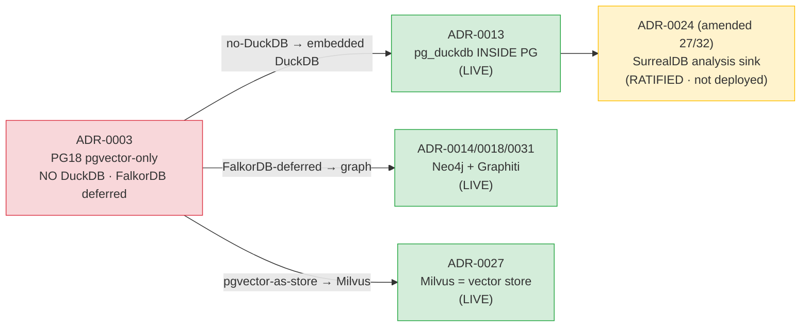
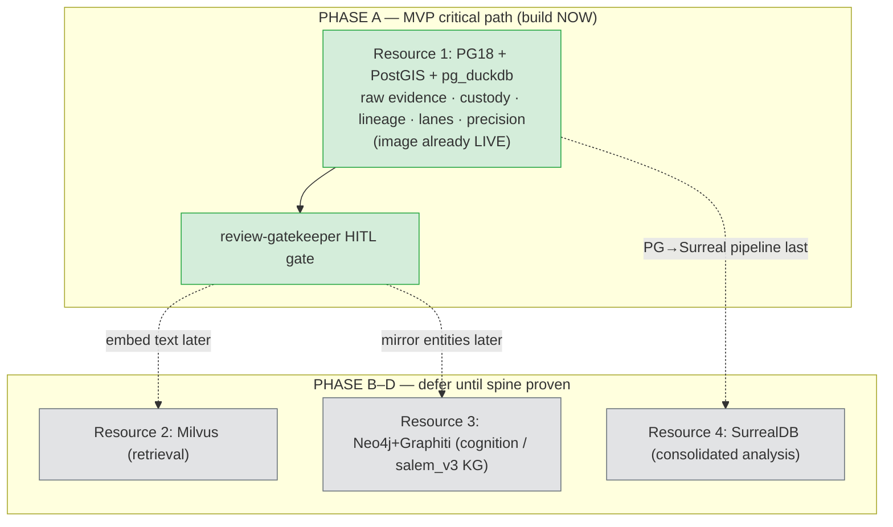
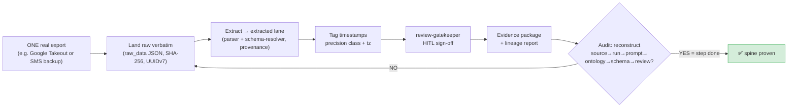

## Final Verdict

> _Byline: Claude Code · Opus 4.8 (1M) · 2026-06-30_
> Grounded in `CONTEXT_PACK.md` (§1–§6) and the SSOT ADRs it cites. On conflict, `Agno-MCP-Platform/docs/PROJECT_CANON.md` + ADRs win over this section.

This section answers the six judgment calls the brief asks for, directly and without hedging: (1) is the architecture coherent, (2) is the stack too complex, (3) what to simplify first, (4) what must precede AI analysis, (5) the highest-risk assumptions, and (6) the next concrete step. It is a synthesis of the preceding sections, not new design — every claim traces to a locked decision (ADR), a salvaged asset, or a guardrail already established in the pack.

---

### 1. Bottom line up front (BLUF)

| Question | Verdict | Confidence |
|---|---|---|
| Is the architecture **coherent**? | **Yes — directionally correct and internally consistent.** The four-tier split (PG+PostGIS+pg_duckdb / Milvus / Neo4j+Graphiti / SurrealDB) is a clean resolution of the ADR-0003↔0013 conflict, and the lane discipline (raw→extracted→inferred→analytical→legal-conclusion) is sound and court-defensible. | High |
| Is the stack **too complex**? | **Yes — for the work that actually has to happen next.** Four data tiers + a model gateway + a tool gateway + 6 agents is the *end-state*, not the *starting line*. Three of the four tiers (Milvus, Neo4j, SurrealDB) are not on the critical path to the first court-usable evidence package. The complexity is justified at horizon, premature at MVP. | High |
| What to **simplify first**? | Defer SurrealDB entirely; defer Milvus and most agent automation; collapse the first build to **one tier (the PG resource) + append-only provenance + HITL review**. | High |
| What must precede **AI analysis**? | The **evidence spine**: canonical raw-evidence store, chain-of-custody (UUIDv7 + SHA-256), timestamp-precision class, the lane separation, provenance/lineage tables, and the human-review gate. No abuse-pattern labelling, no embeddings, no graph inference until this exists. | High |
| Highest-risk assumptions | (a) timestamp/timezone integrity across heterogeneous exports; (b) parser fidelity on adversarial real-world dumps; (c) the four-resource *operational* independence actually holding under Coolify; (d) external-LLM evidence leakage; (e) hypothesis→fact promotion creeping into court output. | — |
| **Next concrete step** | Stand up the PG resource schema migration `0001` (raw-evidence + custody + lineage + precision-class + lane columns) against the **already-LIVE** `agno-postgres:18-duckdb` image, load ONE real export end-to-end through HITL, and prove the audit trail reconstructs. | — |

---

### 2. Is the architecture coherent?

**Yes.** The design is coherent at three levels, and I can defend each against its own ADRs.

**2.1 Topology coherence.** The owner-mandated four-resource split (CONTEXT_PACK §1) is not arbitrary — it is the correct operational reading of the failure mode recorded in the infra notes (six DBs in one Coolify app → one crash tears down all). Putting PostGIS and DuckDB *inside* the single Postgres resource via `pg_duckdb` (ADR-0013, supersedes 0003) while keeping Milvus / Neo4j / SurrealDB as independent lifecycles is the right granularity: co-locate what shares a transactional boundary, isolate what does not.

**2.2 Decision coherence.** The ADR chain that looked like a conflict is actually a clean supersession, and the package resolves it correctly:

ADR-0003 is **superseded, not contradicted** — there is no live conflict to resolve, only a README label to fix ("Accepted" → "Superseded by 0013/0014/0027"). The master prompt's flagging of PostGIS and SurrealDB as "new/unratified" is incorrect: PostGIS is already baked into the `agno-postgres:18-duckdb` image, and SurrealDB is ratified (Phase D). **Only standalone DuckDB would be unblessed, and the design does not use it.** This is coherent.

**2.3 Evidentiary coherence.** The five-lane model (raw evidence → extracted facts → inferred facts → analytical findings → legal conclusions) plus the four-class timestamp model (exact / approximate / inferred / uncertain) plus append-only provenance is the single most important coherence property of the whole package, because it is what makes output court-defensible. Every guardrail in CONTEXT_PACK §6 maps onto a structural feature, not a convention-by-hope. The salem_v3 adoption (Person/Event/Location/Statement/Evidence as the provenance anchor, `CONTRADICTS` for impeachment, allegation-edges preserved-as-hypothesis with HITL) reinforces this rather than fighting it.

**Coherence caveats (the seams):**

| Seam | Issue | Where it's addressed |
|---|---|---|
| `normalized_messages` (universal raw-JSON landing) vs typed `messages` (V4.1) | Two overlapping designs for the same data; must be reconciled, not both adopted verbatim | Schema section — land raw JSON verbatim, project typed `messages` as a view/materialization downstream |
| salem `Person` vs TraceIQ `people` | Two person tables to MERGE | Entity-resolution step, HITL on merge |
| PG `Evidence` anchor vs Neo4j nodes vs Milvus collections | Same logical object in three stores; lineage must tie them | UUIDv7 as the cross-store join key + lineage table |
| Semantica (PROV-O writer into Neo4j) vs Graphiti (bitemporal writer into Neo4j) | Two writers into one graph resource | Acceptable (both are blessed VIP writers) but write-ordering/conflict policy is undocumented → needs-human-review |

None of these break coherence; they are integration work that must be sequenced, not architectural contradictions.

---

### 3. Is the stack too complex?

**For the end-state: appropriately complex. For the next 90 days of work: yes, too complex.** The distinction matters because building all four tiers before the first evidence package exists is the classic failure mode this project can least afford.

**3.1 What the critical path actually needs.** The first court-usable deliverable — a single evidence package with provenance, precision-tagged timestamps, and a human sign-off — requires exactly **one** of the four tiers:

| Tier / component | Needed for first evidence package? | Why |
|---|---|---|
| **PG + PostGIS + pg_duckdb** (Resource 1) | **YES — mandatory** | Holds raw evidence, custody chain, lineage, lanes, precision class, timeline, entities. PostGIS for `Location` geom; pg_duckdb for S3/R2 forensic reads (ADR-0030). This one resource alone delivers an auditable package. |
| **Milvus** (Resource 2) | No (defer) | Semantic search / retrieval is an *analysis convenience*, not a custody requirement. Evidence is found by structured query + provenance first. Wire it in Phase B/D when Knowledge migration happens (ADR-0027). |
| **Neo4j + Graphiti** (Resource 3) | Partial / defer heavy use | The graph is the *cognition* layer. It is LIVE and useful for recall, but salem_v3 KG inference and abuse-pattern edges are analysis, gated behind the spine + HITL. Mirror entities into it later. |
| **SurrealDB** (Resource 4) | **No — defer entirely** | Ratified but not deployed (Phase D). It is a downstream *consolidated-analysis sink* (PG→Surreal). Building it now adds a fourth lifecycle, a second bitemporal model, and a PG→Surreal pipeline before there is anything to consolidate. **Highest-leverage deferral.** |
| LiteLLM gateway (ADR-0015) | Minimal | Needed only when AI extraction starts, and then CPU-only ≤4B local for evidence (NOT cloud glm-5.1 on raw abuse content — see §5). |
| ContextForge tool gateway (ADR-0025) | No (defer) | Off-the-shelf, already accepted; not on the custody path. |
| 6 forensic agents | No (defer 5 of 6) | Only the **review-gatekeeper** gate matters at MVP (it enforces HITL writes). Ingestion/analysis/forensic-data agents come after the spine. |

**3.2 The complexity verdict in one sentence:** the *architecture* is not over-engineered for where the project is going, but the *implementation order implied by drawing all four tiers at once* is over-engineered for where the project is now — and forensic credibility is built bottom-up from custody, not top-down from cognition.

---

### 4. What should be simplified first?

In priority order (highest leverage first):

| # | Simplify | Action | Rationale / ref |
|---|---|---|---|
| 1 | **Drop SurrealDB from the near-term build** | Keep ADR-0024 ratified; explicitly schedule deployment to Phase D after the PG spine produces consolidatable analysis. Do not stand up the lifecycle or the PG→Surreal pipeline yet. | Eliminates a whole resource + a bitemporal duplication; nothing to consolidate until analysis exists. |
| 2 | **Collapse the first build to Resource 1 only** | All MVP tables (raw evidence, custody, lineage, timeline, entities, precision) land in the single PG resource. Mirror to Neo4j / embed to Milvus is a *later* job, not a *prerequisite*. | Milvus/Neo4j are LIVE but not on the custody path (§3.1). |
| 3 | **Reconcile the two message designs into one landing pattern** | Adopt `normalized_messages` raw-JSON landing as the *physical* contract (raw XML/JSON → `raw_data` verbatim), expose typed V4.1 `messages` as a downstream view. Do not maintain both as parallel write targets. | CONTEXT_PACK §3 names this as an open reconciliation; two write paths = two custody stories. |
| 4 | **One person table, resolved with HITL** | MERGE salem `Person` + TraceIQ `people` into a single canonical entity table with an append-only alias/merge log. | Avoids split-brain identity across stores. |
| 5 | **Defer 5 of 6 agents; keep only the review-gatekeeper** | Manual/scripted ingestion of the first export; the only automation that must exist is the HITL write gate. | Guardrail §6 (HITL on every write) is structural; the other agents are throughput, not correctness. |
| 6 | **Fix the ADR-0003 README label as a one-line chore** | "Accepted" → "Superseded by 0013/0014/0027". | Removes the only live documentation drift that makes the stack *look* conflicted. |

What **not** to simplify (these are load-bearing and cheap): the five-lane separation, the four-class timestamp model, UUIDv7+SHA-256 custody, append-only lineage, and the HITL gate. Removing any of these to "move faster" destroys the one property — auditability — that the whole package exists to provide.

---

### 5. What must be built before any advanced AI analysis?

AI analysis (abuse-pattern detection via `detection_patterns.py` 256-pattern / MCL A–L / DARVO, salem_v3 KG inference, embedding-based retrieval, behavioral-pattern labelling) **must not start** until the **evidence spine** below exists and is proven on real data. This ordering is non-negotiable because an analysis built on an un-auditable, mis-timestamped, or provenance-less base produces output that is worse than useless in court — it is impeachable.

**The spine, as an explicit gate checklist:**

| Prerequisite | What it is | Guardrail / asset it satisfies |
|---|---|---|
| **Canonical raw-evidence store** | Verbatim originals (Google Takeout JSON kept byte-for-byte, raw XML in `raw_data`), never mutated | §6 "never overwrite original evidence"; raw-export = RAW EVIDENCE contract |
| **Chain of custody** | UUIDv7 PK + SHA-256 content hash on every artifact | salvaged `UUIDv7 + SHA-256 chain-of-custody` column contract |
| **Timestamp-precision class** | `exact / approximate / inferred / uncertain` + timezone capture on every temporal field | Constraint "distinguish timestamps"; **missing from ALL prior schemas** — must be added, not adopted |
| **Five-lane separation** | raw / extracted / inferred / analytical / legal-conclusion as a first-class column or table boundary | §6 lane discipline; the core court-safety property |
| **Provenance + lineage** | doc-intelligence `sections/chunks/spans/entities/findings/approvals`; lineage ties final object → source evidence → processing run → prompt version → ontology version → schema version → human-review decision | Constraints "preserve artifact lineage"; salvaged doc-intelligence tables |
| **Append-only history** | versioned/append-only for anything that can later affect interpretation; prior interpretations preserved | §6 "preserve append-only history" |
| **HITL review gate** | review-gatekeeper enforces human sign-off before any write reaches canonical/court-facing state; sensitive labels (gaslighting, coercive control, alienation, weaponization, reactive abuse) blocked until reviewed | §6 + Constraints (repeated 2×, deliberately) |
| **Both-parties / full-cycle scaffold** | `positive_behaviors.ttl` adopted so positive/neutral/repair/love-bombing phases are modelled, not only negative incidents | Constraints "do not focus only on negative incidents"; ADOPT positive_behaviors.ttl |
| **Local-only extraction path** | CPU-only ≤4B local models for evidence text; NO raw forensic/abuse content to exa/Drive/Lucid/M365/graphiti-or-agno entity extraction or cloud glm-5.1 | §4 "never feed raw forensic/abuse evidence to external/cloud LLM"; hardware CPU-only constraint |

Only once every row above is satisfied and demonstrated on one real export does analysis become defensible. The abuse-pattern lane then plugs in as a *consumer* of the spine, writing into the **inferred/analytical** lanes (never raw), with allegation-edges preserved-as-hypothesis (`USED_TACTIC`, `EXPLOITED_VULNERABILITY`, `DISPARAGES`) and HITL before any court-facing promotion.

---

### 6. Highest-risk assumptions

Ranked by (likelihood × evidentiary damage). These are the things most likely to quietly invalidate output.

| Rank | Assumption (currently believed true) | Failure mode if false | Mitigation (build into spine) |
|---|---|---|---|
| 1 | **Timestamps and timezones survive ingestion intact** across Takeout, SMS backup, GVoice, iMessage-PDF, FB, Snapchat | Timeline reorders; "X happened before Y" becomes wrong; entire narrative impeachable | Mandatory precision-class + explicit source-timezone capture + `geocode_audit`-style append-only normalization log; never store a bare naive timestamp |
| 2 | **Parsers faithfully extract from adversarial real dumps** (blocked-call type 5/6, base64 images in XML, platform-hops) | Silent data loss / misattribution of who said what | Parser fidelity tests against known-good fixtures; `schema-resolver.ts` AI field-mapping outputs land in *extracted* lane with provenance, never raw; diff raw vs extracted counts |
| 3 | **The four resources are genuinely independent under Coolify** | A repeat of the "one app, all six DBs, one crash kills all" failure | Verify separate bind-mounted volumes + independent start/stop/rebuild *operationally* (not just on paper) before loading real evidence; this is owner-mandated HARD CONSTRAINT (§1) |
| 4 | **No raw evidence leaks to a cloud/external LLM** | Privilege/privacy breach; sensitive abuse content exfiltrated; possibly unrecoverable | Hard egress discipline: evidence extraction CPU-only ≤4B local; gateway routing audited; graphiti/agno entity extraction never fed raw evidence (§4) |
| 5 | **Hypotheses never silently become facts** | Court output presents allegation as established fact → catastrophic credibility loss | Lane boundary enforced in schema (legal-conclusion lane write-gated); preserve-as-hypothesis edges stay hypothesis until HITL; §6 "never promote a hypothesis to a fact" |
| 6 | **Prior salvaged work is correctly classified, not blindly trusted** | Stale Jan-dated R5–R12 model assumptions (Supabase/Chroma/LanceDB/pgvector) leak into the live PG/Milvus/R2 design | Re-target per §5 staleness flags; adopt assets by confidence/usefulness/review-status, not verbatim; dedupe R5's byte-identical copy |
| 7 | **User's own conduct is modelled symmetrically** | One-sided sentiment model is itself impeachable and contradicts §6 | Model both parties; capture user's reactions/apologies/repair in temporal context; surface tone vs inferred intent vs relational function vs cycle phase stored separately |

Risks 1–3 are the ones that destroy *custody* (the foundation); 4–7 destroy *credibility* (the output). Both must be designed in from migration `0001`, not bolted on.

---

### 7. The next concrete implementation step

**Build PG migration `0001` against the already-LIVE `agno-postgres:18-duckdb` image and prove one real export round-trips through HITL with a reconstructable audit trail.** Nothing else — not Milvus wiring, not SurrealDB, not the agent fleet — comes before this.

**Definition of done for the next step (single, testable milestone):**

**Concrete task list for migration `0001` (developer-facing):**

1. Schema migration in the PG resource creating: `evidence_artifact` (UUIDv7 PK, SHA-256, `raw_data` JSONB verbatim, `lane` enum, `source_export` FK), `custody_event` (append-only), `lineage` (object→run→prompt_version→ontology_version→schema_version→review_decision), `timeline_event` (timestamptz + `precision_class` enum exact/approximate/inferred/uncertain + `source_tz`), canonical `person` (salem `Person` ⨝ TraceIQ `people`, append-only alias log), `location` (PostGIS geom + dual-provider geocode audit), `review_decision` (HITL).
2. Adopt `positive_behaviors.ttl` mapping so the full-relational-cycle scaffold exists from day one (no new node types invented).
3. Wire pg_duckdb account-wide S3 secret (ADR-0030) for forensic reads of R2 `casebible-*` — read-only, no transfer (approval-gated per §4).
4. Run ONE real export through: land → parse (local, CPU-only) → precision-tag → review-gatekeeper HITL → emit package.
5. Prove the audit query reconstructs the full lineage chain backwards from the package to the raw source. If it cannot, the step is not done.

**Explicitly NOT in the next step:** SurrealDB, Milvus embedding of evidence, salem_v3 KG inference in Neo4j, abuse-pattern labelling, the 5 non-gatekeeper agents, ContextForge tool routing. All deferred to Phase B–D after the spine is proven.

---

### 8. Needs-human-review / open gaps flagged by this verdict

| Gap | Why it needs a human decision |
|---|---|
| Neo4j dual-writer policy (Semantica PROV-O vs Graphiti bitemporal) | Both are blessed VIP writers into one graph; write-ordering/conflict-resolution policy is undocumented. Not blocking the PG spine, but must be decided before heavy KG use (Phase B/D). |
| `normalized_messages` vs typed `messages` final reconciliation | Recommended here as land-raw + typed-view; owner should confirm this over maintaining both as write targets. |
| Coolify four-resource operational independence | Asserted as satisfied per the split decision, but **must be operationally verified** (separate volumes, independent restart) before real evidence loads — flagged as risk #3, not yet confirmed in this package. |
| ADR-0003 README label drift | Documentation-only fix ("Accepted" → "Superseded by 0013/0014/0027"); trivial but should be owner-acknowledged so the supersession chain is unambiguous. |

---

> **One-line verdict:** The architecture is coherent and the four-tier end-state is justified, but the project should build *only the PG evidence spine + HITL* first, defer SurrealDB/Milvus/most agents, and treat custody-grade provenance and timestamp precision — not AI analysis — as the next concrete step.
