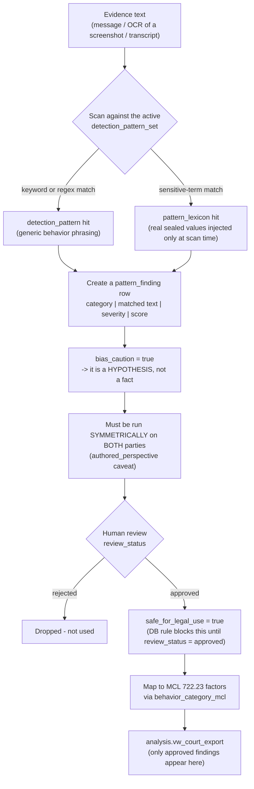
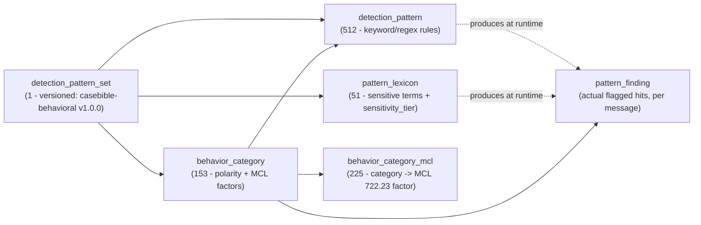

# Behavioral Detection — How It Works (plain-language)

> _Byline: Claude Code · Opus 4.8 · 2026-06-30_
> Companion to migration `0006_behavior_seed.sql`. Explains the two classification dimensions, the flagging workflow, and the court-safety gates. Written for a non-developer owner.

This is a **standard** shape for a behavioral-detection system; the only "custom" part is the *content* (your own patterns, additively merged from 9 scattered sources) plus two deliberate design choices explained below.

## 1. `sensitivity_tier` (on `analysis.pattern_lexicon`) — about SECRECY / PII, not severity
The **lexicon** holds sensitive *vocabulary* (names, slurs, trigger words), kept separate from the behavior patterns so real identifiers are never hardcoded. The tier controls who can see the real term and whether it's auto-redacted.

| Tier | What's in it | Handling |
|---|---|---|
| **public** | Generic, non-sensitive words (plain sentiment terms) | Shown anywhere, no redaction |
| **restricted** | Sensitive but not identifying — derogatory epithets, drug / mental-health / vulnerability triggers | Visible to you/your team; redacted in court exhibits unless you choose to include |
| **sealed** | Actual personal identifiers — child's name, party names, deceased-relative reference, verbatim personal quotes | **Never committed to git** (placeholders in the seed file) — but loaded **in full into your private live DB** and shown normally during research |

> **REDACTION POLICY (owner, 2026-06-30): NO active redaction during work.** `sensitivity_tier` is a **label**, not a switch. It marks *what would need redacting when you later prepare a court document* — it does **not** hide anything from you while researching. During normal work the application shows real names, quotes, and identifiers in full. Redaction is a **deliberate, opt-in export step** applied *only* when generating a court-facing document. The only hard rule is git/GitHub: real PII stays out of committed files (placeholders there); the real values live in the private DB / a local secure store, never in the repo.

## 2. `polarity` (on `analysis.behavior_category`) — about the KIND of behavior (so analysis isn't one-sided)

| Polarity | Meaning | Why it exists |
|---|---|---|
| **negative** (124) | Manipulative / abusive / harmful — gaslighting, coercive control, alienation | The concerning conduct |
| **positive** (13) | Supportive / cooperative / affectionate — apology, cooperative parenting | Full record + detects love-bombing→conflict→repair cycles; keeps *your* good-faith conduct visible |
| **neutral** (8) | Ordinary / logistical — scheduling, factual exchange | Context / timeline |
| **linguistic_marker** (8) | A language *signal* (absolutes "always/never", hedging, intensifiers) — not a behavior itself | Strengthens/qualifies *other* detections; never a standalone finding |

Each pattern also has **severity 0–10** (how serious) and **score 1–10** (custody relevance), and each category links to the **MCL 722.23 best-interest factors** (J = facilitate the relationship, K = domestic violence are the heavy ones).

## 3. How something gets flagged (runtime workflow)

**Key safety property:** nothing is auto-asserted. Every hit is `detect -> hypothesis -> human review -> approve -> court-eligible`. The database *refuses* to set `safe_for_legal_use` unless a human set `review_status='approved'` (an enforced CHECK constraint).

## 4. How the config tables fit together (live counts)

## 5. Worked example
Text: *"that never happened, you're crazy, no one will believe you."*
- Matches 3 `detection_pattern` rows in category **`gaslighting`** (polarity `negative`, severity 8–9) → one `pattern_finding` each, all `bias_caution=true`, `requires_human_review=true`, `safe_for_legal_use=false`.
- Category maps to MCL factor **K** (domestic violence).
- You review → approve → it becomes court-eligible under factor K in `vw_court_export`.
- If the same phrase appeared in *your* messages, the symmetric rule flags it against you too (reactive-abuse / both-parties safeguard).

## 6. Real values (for research) vs redaction (court only)
- **For your research:** load the real sealed/restricted values **into the live DB in full** (a one-time local load that maps onto the `[REDACTED:...]` placeholders by `lexicon_type`). The app then shows everything normally — no redaction, no friction. This loader is a small, not-yet-built step; the values come from a **local** file, never from git.
- **For court:** redaction is a separate, deliberate **export transform** you invoke when building a specific exhibit/filing — it uses `sensitivity_tier` to decide what to mask *at that moment only*. Nothing is masked before then.
- **Git/GitHub:** only the placeholder seed is ever committed; the repo stays PII-free.
