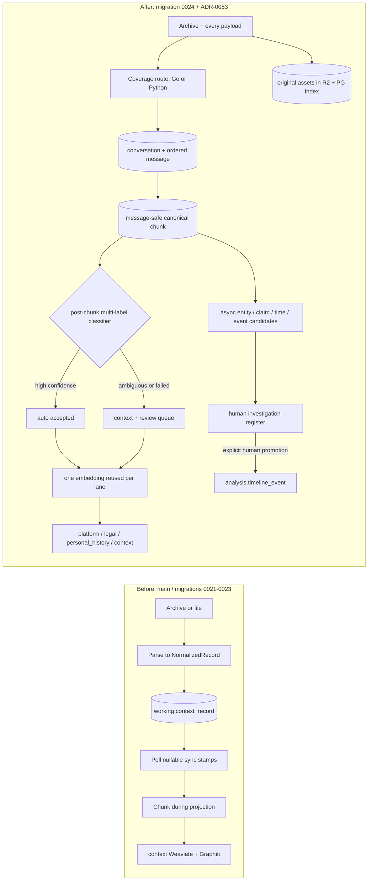
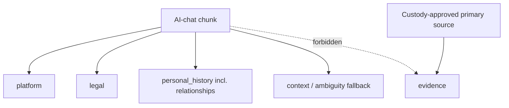

# AI-chat ingestion: before and after ADR-0053

> _Byline: Codex · GPT-5 · 2026-08-13_

The interactive companion is
[`mockups/designs/chat_ingest_comparison/index.html`](../../mockups/designs/chat_ingest_comparison/index.html).

## Workflow

## Schema responsibility shift

| Concern | Before | After |
|---|---|---|
| Raw chat truth | generic `working.context_record` | `chat_conversation` → `chat_message` |
| Ordering | implicit/timestamp | `message_index` |
| Role | retained | retained |
| Participants | optional normalized field | not stored in chat landing |
| Chunk | computed during projection | canonical `chat_chunk` + provenance join |
| Classification | context only | post-chunk multi-label `chat_chunk_lane` |
| Taxonomy | six-lane docs / context implementation | five global lanes; chat uses four |
| Uncertainty | no classification review | selective confidence HITL; context fallback |
| Embedding | repeated by Agno insert calls | once per chunk/embedder, reused across lanes |
| Tags | ad hoc metadata | normalized vocabulary + reviewed assignments |
| Assets | inventoried/basic index | every payload, message links, derivations, OCR state |
| Delivery | polling/sync stamps | per-table outbox + NOTIFY + cursors + dead letter |
| Candidate events | no curated intermediate | human investigation register |
| Horizons | absent from chat rows | still absent; agent retrieval/walk design later |

## Five-lane boundary

The migration is additive and is not applied to a live database by this branch. See
ADR-0053 for the governing decision and the HTML report for expandable table maps.
