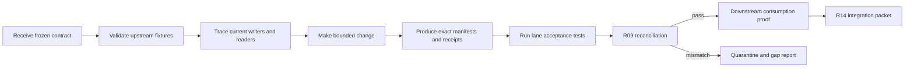

# Agent Handoff Protocol for Reconciliation Lanes

This protocol exists so an agent can complete one bounded lane without silently dropping fields, authority rules, clocks, source links or downstream obligations.

## Assignment rule

Each agent receives exactly one primary R00–R14 guide as its scope. Cross-lane changes require a written contract issue for R14; they are not silently absorbed by the agent.

The assignment must name:

- owned files, schemas, services and external surfaces;
- inputs the lane is allowed to trust;
- outputs and receipts it must produce;
- upstream and downstream lane owners;
- prohibited writes and authority transitions;
- acceptance fixtures and gates;
- migration and rollback boundary.

## Required reading order

1. `docs/PROJECT_CANON.md`
2. `docs/DECISION_LOG.md` entries governing the lane
3. `SYSTEM-ARCHITECTURE.md`
4. `CROSS-DOMAIN-CONTRACT-MATRIX.md`
5. `RECONCILIATION-DOMAIN-WORKSTREAMS.md`
6. The assigned `reconciliation-domains/Rxx-*.md` guide
7. Closest applicable `AGENTS.md`
8. Current schema/code/runtime inventory cited by the guide

If these sources conflict, the agent stops implementation, records the conflict, and asks R14 to resolve it against canon. It does not select whichever contract is easiest to implement.

## Start-of-work declaration

Before changing anything, the lane agent records:

```text
Lane:
Objective:
Owned surfaces:
Explicit non-scope:
Input contract/version:
Output contract/version:
Canonical authority consulted:
Golden fixtures:
Expected receipts/manifests:
Known gaps or assumptions:
```

## No-dropped-fields worksheet

For every emitted field, maintain this matrix in the completion packet:

| Field | Canonical source | Transformation | Destination | Validation | Failure behavior |
|---|---|---|---|---|---|
| Example: `source_available_from` | PG governed clock derivation | Exact copy/canonical encoding | Weaviate/Neo4j/Surreal | Boundary query canary | Quarantine if absent |

Fields with no canonical source or validation are not ready to emit. Fields needed downstream but absent from the source contract become explicit contract issues.

## Source-lineage worksheet

Every candidate, fact, graph edge, search chunk, Surreal object and legal proposition must answer:

- Which canonical PG object authorizes this object?
- Which exact normalized record and source generation does it reference?
- What exact span, structured locator or message identity supports it?
- Which custody/content hashes apply?
- Which review/promotion revision applies?
- Which clocks and horizon predicate apply?
- What supersedes or revokes it?
- Which projection receipt proves the current external representation?

Endpoint provenance does not automatically prove a relationship edge; edges need their own source anchors.

## Agent implementation constraints

- Do not create parallel authored truth stores or horizon lanes.
- Do not weaken the shared eligibility predicate locally.
- Do not let extraction, search, graph analytics, walks or legal drafting establish facts.
- Do not write an external store without a PG outbox event and return receipt.
- Do not put large record arrays or source bytes into Temporal history; pass stable references.
- Do not let n8n perform hashing, custody commits or direct truth/projection writes.
- Do not edit applied migrations.
- Do not permanently delete files or data. Move approved retirement candidates to `to_be_deleted`; only the owner deletes them.

## Handoff sequence



## Completion definition

A lane is not complete merely because its own writer succeeds. It is complete only when:

1. Inputs reconcile to the upstream manifest.
2. Every accepted and omitted item is accounted for.
3. Outputs reconcile by count, ordered membership and content hash.
4. Representative objects resolve to exact canonical sources.
5. The downstream consumer has demonstrated it can consume the versioned contract.
6. Retry, replay, partial failure, supersession and revocation behavior are proven.
7. Horizon/authority contamination tests pass where applicable.
8. R09 accepts the receipt and R14 accepts the completion packet.

## Completion packet template

```markdown
# Rxx Completion Packet

## Outcome
## Scope completed
## Explicit non-scope
## Contract versions
## Changed surfaces
## Writer and reader census
## Input reconciliation
## Output reconciliation
## Source-lineage examples
## Test and live-verification evidence
## Retry/replay/failure behavior
## Supersession/revocation behavior
## Quarantined or unresolved items
## Rollback or forward-correction boundary
## Downstream consumption proof
## Risks and owner decisions
## Exact next-lane handoff
```

## Escalation triggers

The lane agent must stop and escalate when:

- an authority boundary is ambiguous;
- a required source locator cannot be reconstructed reliably;
- a legacy hash tag does not determine its construction;
- a downstream store requires weakening horizon or eligibility rules;
- a proposed repair would rewrite custody, facts, approvals or audit history;
- the change would cross the lane's owned surfaces;
- an external-reader cutover or irreversible gate is required;
- moving a retirement candidate to `to_be_deleted` would be risky or incomplete.

## R14 review questions

R14 rejects the handoff unless it can answer yes to all of these:

- Does the lane preserve PostgreSQL authority?
- Does every external object carry a resolvable canonical anchor?
- Are all clock meanings preserved without collapse?
- Is source availability enforced before ranking?
- Are candidates, facts, beliefs and projections kept semantically distinct?
- Are receipts append-only and exact enough to detect drift?
- Can the destination be rebuilt from canonical PG state?
- Can failures retry without duplicate authority?
- Can revocation/supersession propagate without erasing history?
- Has the downstream consumer actually acknowledged the handoff?

