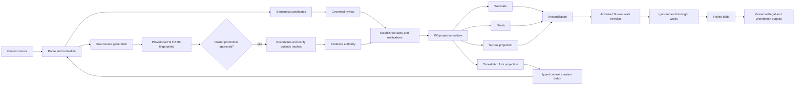

# Cross-Domain Contract Matrix


> _Recovery note: this file was lost (never committed) after being authored in a Codex CLI session on 2026-08-25/26. Reconstructed 2026-09-02 by Claude Code · Sonnet (recovery lane C) from the session's own `apply_patch` tool-call history in `C:\Users\matts\.codex\sessions\2026\08\`, per the method in `RECOVERY-NOTE.md`. All accepted `apply_patch` hunks touching this file located and applied cleanly; full recovery, high confidence._

Status: target architecture and reconciliation contract. This document defines what must cross each domain boundary, who owns it, and how completeness is proven. PostgreSQL is the canonical authority and control plane. Weaviate, Neo4j, SurrealDB, and the maintained Timesketch fork/OpenSearch are rebuildable specialized projections.

## Authority map

| Domain | Authoritative responsibility | Must not become |
|---|---|---|
| PostgreSQL 18 | Source identity, context, normalized records, custody, candidates, governed facts, clocks, geo, outbox, receipts, audit | A collection of parallel authored horizon lanes |
| pg_duckdb | Analytical acceleration over PG-governed data | An independent truth store |
| PostGIS | Canonical raw and normalized geospatial data | A detached geo evidence silo |
| pgvector | Canonical/local vector evaluation and optional vector values | The external search authority |
| Weaviate | Horizon-prefiltered semantic retrieval | Evidence or fact authority |
| Neo4j | Semantica-originated, governed relationship projection | A direct extractor truth sink |
| SurrealDB | Final governed temporal-graph aggregation, walk state, paired analysis | A source of evidentiary truth or an ungoverned scraper |
| Timesketch fork/OpenSearch | Any-context and governed chronology display plus individual/bulk curation client | Canonical timeline truth, evidence authority, or direct PG writer |
| Temporal | Durable workflow sequencing, retries, timeouts, history, pause/resume | Domain truth or business UI |
| n8n | Visual/business orchestration, approvals, notifications, operator coordination | A custody hasher or second durable state machine |

## Canonical lifecycle



## Boundary contracts

| Boundary | Required envelope | Producer | Consumer | Acceptance proof |
|---|---|---|---|---|
| Context intake → normalization | `source_version_id`, immutable blob locator, source fingerprint, media type, byte count, parser routing result, run/activity IDs | R2 | R3 | Byte count and fingerprint match; every accepted or rejected item has a reason |
| Normalization → hashing | `generation_id`, ordered member IDs, canonical tuples, manifest digest, parser/normalizer versions | R3 | R4 | Ordinals are unique and contiguous; source lineage is identical; manifest is immutable |
| Normalization → extraction | Version-pinned record IDs, exact locators/spans, content hashes, source class, clocks | R3 | R6 | Candidate input hash equals normalized content hash; no fabricated participant |
| Context → promotion | Approved request, selected context records/spans, exact generation, expected fingerprint, owner decision | R2/R7 | R4 | Approval is current and scoped; failed verification creates no evidence rows |
| Hash verification → evidence | Verification ID, explicit H1/H2/H3 canon tuple, complete ordered member manifest, expected/actual digests | R4 | R7 | H1, every H2, count, order, and H3 match in one atomic custody commit |
| Extraction → governance | Candidate IDs, candidate type, exact source anchors, extractor/config versions, confidence/method | R6 | R7 | Every candidate resolves to source; candidate remains non-authoritative |
| Governance → projection outbox | Fact/assertion revision, promotion/review decision, authority state, exact anchors, clocks, payload hash, supersession state | R7/R1 | R5/R6/R8/R10 | Transactional outbox: no fact without event and no event without committed fact |
| PG → Weaviate | Eligible chunks/facts, exact citation anchors, horizon fields, embedder generation, projection revision | R1/R7 | R5 | Count, membership, payload/vector hashes and boundary canaries reconcile |
| PG → Neo4j | Governed nodes and edges, independent edge anchors, bitemporal fields, authority revision | R1/R7 | R6 | Zero orphan nodes/edges; properties and membership hashes reconcile |
| PG/PostGIS → Surreal | Governed facts/events/geo plus canonical anchors and projection references | R1/R8 | R10 | SRID, coordinate order, clocks, membership and content hashes reconcile |
| PG → Timesketch fork | Immutable timeline generation/members; stable IDs; point/range time; candidate/governed authority; privacy/dispute/revocation; fork/schema version | R1/R7 | R9 projector/fork | Required Timesketch fields plus bounded attributes reconcile by count/membership/content/read-back hash |
| Timesketch curation → context | Batch/item IDs, actor, expected target/generation versions, typed operation, before/after hashes, rationale, preview hash, atomicity mode | Fork UI | R2/R7 governed API | Itemized accepted/rejected/conflict/no-op receipts; accepted state appears only after PG reprojection |
| Approved timeline edit → governance | Context amendment candidate, exact approved member/fact/citations, proposed change and curation receipt | R2/R7 | R7/R4 | Approved version unchanged; accept/reject review is attributable; acceptance appends governed successor |
| Reconciled projections → Surreal activation | Weaviate/Neo4j/Surreal receipts, manifest IDs, eligibility snapshot hash, cursor high-water marks | R9 | R10 | All required receipts reconciled; mismatch or missing receipt blocks activation |
| Surreal revision → walks | Frozen scope, base/projection revisions, horizon policy, source clocks, retrieval capabilities | R10 | R11 | Planted future fact is absent before availability; same inputs reproduce hashes |
| Walks → legal/Workbench | Walk and checkpoint IDs, belief/retrieval citations, paired-delta manifest, active facts, disclosure state | R11 | R12 | Every proposition resolves to an active governed fact and exact source anchor |
| Domain activity → Temporal/n8n | Reference-only command/result envelope, idempotency key, status, receipt/event refs | R0–R12 | R13 | Retry/replay returns same result or a typed non-retryable conflict |
| All lanes → final integration | Handoff manifest, test evidence, gap register, rollback boundary, unresolved decisions | R0–R13 | R14 | Contract matrix is complete and end-to-end lineage proof passes |

## Universal envelope

Every durable inter-domain event or command must carry the applicable subset of these fields. A lane may add fields but may not redefine their meaning.

| Field family | Required meaning |
|---|---|
| Identity | Event/command ID, contract version, idempotency key, producer build and activity/run identity |
| Authority | Canonical record/candidate/fact/promotion IDs and current authority state |
| Source | Source version, normalized generation, exact record/span/structured locator, custody H1 when applicable |
| Time | `occurred_at`, `source_available_from`, transaction/audit time, realization links where applicable |
| Version | Source, parser, normalizer, extractor, projection, schema and policy revisions |
| Integrity | Canon names, ordered input manifest hash, payload hash, expected output hash |
| Lifecycle | Active, superseded, revoked, quarantined or terminal status with reason code |
| Reconciliation | Expected sink, cursor/sequence, receipt and manifest references |
| Curation | Target type/ID/version, operation, before/after hashes, actor/rationale, item result, amendment/reversal lineage |

## Shared eligibility predicate

A governed object is eligible for evidence projections and Surreal aggregation only when all applicable conditions are true:

1. The context source version and normalized generation are immutable and source-resolvable.
2. Required promotion is approved and its custody verification succeeded for the exact generation.
3. The message/source route is approved and `source_available_from` is complete.
4. The fact/assertion revision is active, reviewed, and not revoked or superseded.
5. Exact source locators and custody/content hashes resolve without ambiguity.
6. The projection contract and target schema versions are supported.

The predicate is defined once in PostgreSQL-governed contracts. Each projection may optimize its local filter, but it may not invent a weaker eligibility rule.

## Clock matrix

| Clock | Meaning | Written by | Used for horizon? |
|---|---|---|---|
| `occurred_at` | When the event/message occurred | Normalization/source representation | No, except first-party availability derives from it |
| `source_available_from` | Earliest time the source could be retrieved by the owner | Governed source-clock derivation | Yes, before ranking in every store |
| realization event time/interval | When a meaning, contradiction, or fact was realized | Governed realization workflow | No; it explains the delta and never backdates availability |
| transaction/audit time | When a row/event was written | PostgreSQL/ops | Never |
| valid/system graph time | When a graph assertion applies and when its revision was recorded | Governed projection | Used for temporal analysis, not as a substitute for source availability |

## Completeness equation

For every source or projection revision:

```text
expected = accepted + quarantined + superseded_or_revoked + rejected
accepted = destination_active + destination_inactive_expected
```

Every term must be backed by ordered membership and content hashes. Counts alone are not sufficient. Every omission requires a retained locator and reason code.

## Prohibited shortcuts

- No Weaviate-to-Surreal or Neo4j-to-Surreal truth pipeline. Surreal consumes PG-authorized events and may reference reconciled surface objects.
- No direct Semantica write to a governed graph. A separate credentialed projector writes governed Semantica-originated outputs.
- No candidate-to-fact implicit promotion.
- No AI-chat-to-evidence promotion, support, citation, or corroboration path.
- No Timesketch/OpenSearch edit replication into canonical tables. Fork edits use typed PG context
  commands, and edits to approved entries create amendment candidates rather than updates.
- No horizon filtering after vector or graph ranking.
- No raw-message lane/horizon stamp.
- No source availability derived from realization time.
- No Temporal payloads containing whole record batches when stable references exist.
- No n8n custody hashing or direct writes to evidence, facts, projections, or receipts.
- No legal fallback to context, candidate, belief, or unreconciled projection data.
