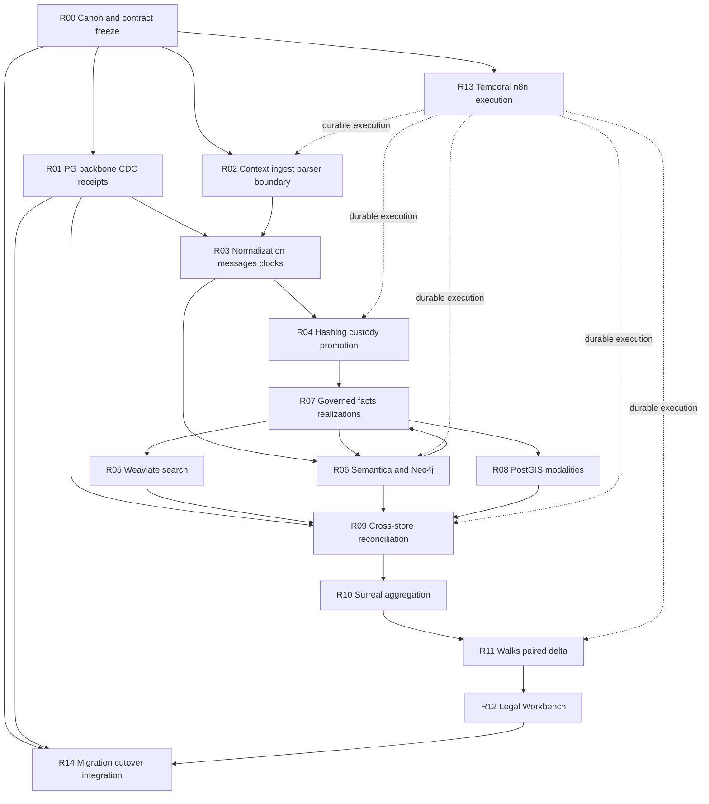
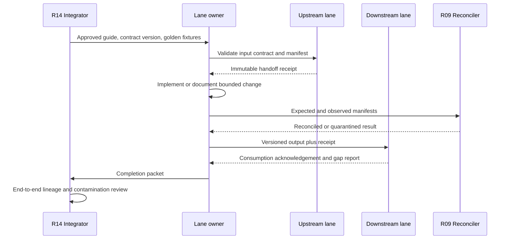

# Reconciliation Program Runbook

This runbook turns the R00–R14 domain guides into a controlled engineering program. It is an architecture and handoff plan, not authorization to change production code, schemas, data, or deployments.

## Program objective

Reconcile the current table-centric implementation with the intended controlled-replay system without losing source lineage, custody history, horizon semantics, or operational behavior. Completion means the full product exists: a version-pinned ignorant walk and hindsight walk over governed evidence, with a reproducible delta whose propositions resolve to exact sources.

## Work breakdown



## Stage gates

| Gate | Required result | Evidence required | Stop condition |
|---|---|---|---|
| G0 Contract freeze | Canonical lifecycle, IDs, clocks, canons, events, receipts and eligibility predicate signed | Contract matrix, decision register, golden source corpus | Any lane uses conflicting field meaning or authority |
| G1 Source round trip | One context source resolves through immutable generation and exact record/span locators | Source manifest, count/hash reconciliation, rejected-item manifest | Missing, duplicated or ambiguous source locator |
| G2 Custody promotion | Approved source recomputes and verifies H1, all H2s and full-generation H3 atomically | Known-answer vectors, tamper/reorder tests, custody manifest | Any evidence write before approval or partial custody commit |
| G3 Governed fact | Candidate review establishes an immutable fact with exact support and supersession behavior | Decision ledger, support graph, revocation test | Candidate bypasses review or evidence support is unresolved |
| G4 Specialized projections | Weaviate, Neo4j and geo projection revisions reconcile to PG | Per-sink receipts/manifests, orphan test, horizon canary | Count-only parity, stale active object or future-fact leak |
| G5 Surreal aggregation | Surreal revision binds canonical facts, time, geo and reconciled surface references | PG↔Surreal manifest and projection guard | Surreal object lacks canonical PG/source anchor |
| G6 Walk product | Ignorant/hindsight runs and paired delta reproduce from the same base | Checkpoint/state/trace hashes and contamination canaries | Post-ranking filter, unpinned base or silent drift |
| G7 Legal output | Every proposition opens the exact active source and invalidates on revocation | Citation matrix, disclosure test, reviewer sign-off | Candidate/belief/unreconciled source appears in output |
| G8 Cutover | Each reader switches independently after live parity and rollback proof | Cutover receipt, observed traffic, old-reader census | Any alternate weaker reader remains accessible |

## Execution waves

### Wave 0 — freeze and census

- Freeze vocabulary, authority boundaries and exact clock definitions.
- Regenerate relation, column, writer, reader, workflow and external-collection inventories.
- Capture row counts, ordered manifests, dependency graphs, active endpoints and service versions.
- Select a small golden corpus containing first-party messages, acquired third-party messages, AI context, documents, geo, contradictions and a planted future fact.
- Record current gaps without interpreting empty tables as implemented capability.

### Wave 1 — additive canonical contracts

- Define stable source versions, sealed normalized generations, exact spans/locators and shared envelopes.
- Define command/result promotion, candidate/support/fact and supersession contracts.
- Define projection outbox, receipt, manifest and reconciliation relations.
- Define Temporal reference-only activity contracts and n8n signal/callback contracts.

No reader cutover occurs in this wave.

### Wave 2 — context, normalization and custody proof

- Prove context-only intake creates no custody authority.
- Prove normalization preserves exact participants, source classes and all clock semantics.
- Prove provisional H2/full-generation H3 construction.
- Prove promotion independently recomputes, verifies and commits custody atomically.
- Backfill only through the same governed promotion path after idempotency and mismatch behavior are demonstrated.

### Wave 3 — extraction and governance

- Run Semantica as a versioned, credential-free Temporal activity producing candidates only.
- Establish exact span/locator coverage for entity, relation, event and claim candidates.
- Prove review/promotion creates immutable established facts and typed support/contradiction/qualification links.
- Prove analytical discoveries re-enter PG as candidates rather than becoming external-store truth.

### Wave 4 — specialized projections

- Build new revision namespaces for Weaviate and Neo4j.
- Project only the shared PG eligibility predicate.
- Preserve independent provenance for every graph edge.
- Project governed geo while retaining canonical PostGIS geometry and SRID.
- Append receipts to PG and reconcile membership, content, clocks, vectors, authority and locators.

### Wave 5 — Surreal and walks

- Replace fixture-only Surreal input with PG-authorized projection events.
- Activate only a revision guarded by reconciled manifests.
- Implement fail-closed horizon queries before graph/search ranking.
- Prove healthy pause/resume separately from terminal seal-and-rewalk.
- Reproduce paired ignorant/hindsight delta from the same base and policy revision.

### Wave 6 — legal outputs and cutover

- Bind Workbench/legal readers to active governed facts and reconciled walk outputs.
- Validate citation round trips and revocation invalidation.
- Switch one reader surface at a time with live observation and rollback.
- Retain old paths read-only until two-release zero-use evidence exists. Any later retirement is moved to `to_be_deleted`; only the owner deletes it.

## Standard lane execution loop



## Mandatory completion packet

Every lane hands R14 one immutable/versioned packet containing:

1. Scope completed and explicit non-scope.
2. Contract/schema versions consumed and emitted.
3. Changed components and current writer/reader census.
4. Input and output manifests with counts, membership and content hashes.
5. Source-lineage proof for representative and edge-case objects.
6. Test evidence, including live verification when implementation work later occurs.
7. Retry, replay, idempotency, revocation and failure-mode results.
8. Reconciliation receipts and unresolved/quarantined items.
9. Rollback or forward-correction boundary.
10. Residual risks, owner decisions and downstream actions.

## Failure handling

| Failure | Required behavior |
|---|---|
| Retryable infrastructure failure | Temporal retries the same idempotent activity; domain receipt prevents duplicate authority |
| Input changed under same operation key | Fail terminally with an input-conflict reason; do not guess or overwrite |
| Hash/custody mismatch | Record pre-custody verification failure; create no evidence authority |
| Partial external projection | Keep revision inactive; retry missing objects; reconcile exact membership before activation |
| Orphan or unresolved source | Quarantine object/revision; never expose it to walks or legal consumers |
| Revocation or supersession | Append authority event, deactivate derived objects, produce new receipts; retain history |
| Mid-walk projection drift | Seal non-resumable snapshot; start a new `rewalk_of` identity with change manifest |
| Unknown legacy hash canon | Return ambiguous/unverifiable until provenance attribution exists; never infer by tag alone |

## Change controls

- Applied migrations are never edited; later implementation uses additive migrations.
- No external projection becomes a reader target before an immutable reconciliation receipt.
- Weaviate alias, Neo4j reader binding and Surreal walk revision are separate activation gates.
- Canonical evidence/fact/audit history is corrected by append/supersede, never destructive rewrite.
- No file or data is permanently deleted. Retirement candidates are exported and moved to `to_be_deleted` only after dependency, restore and owner-approval gates.

## Final acceptance trace

The integrator must select representative Surreal facts, edges, geo events, retrieval hits and delta items and resolve each through:

```text
Surreal object / walk item
  → PG projection receipt and reconciled manifest
  → canonical established fact or governed realization
  → promotion/review decision
  → exact normalized record + span/structured locator
  → sealed source generation
  → custody hashes and immutable original
```

The same trace must show the correct `occurred_at`, `source_available_from`, realization history, projection revision and authority state. A single unresolved or future-leaking path blocks final cutover.

