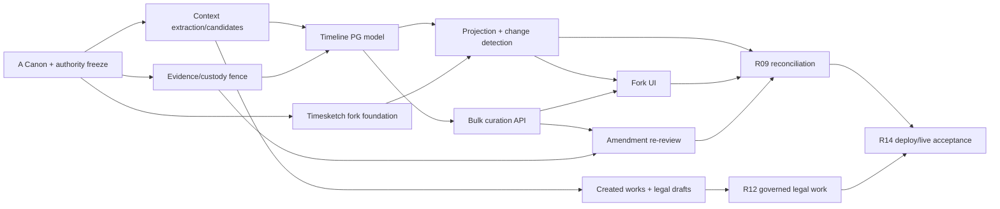

# Semantic Agent Work Packages and TODO Board

> Current execution decomposition · 2026-08-26 · D-082–D-085

This board replaces broad “implement the schema” assignments with bounded semantic authority changes.
Multiple agents may work in parallel only where file ownership and input/output contracts do not overlap.
R00 integrates contracts; R09 reconciles projections; R14 independently verifies production.

## Dependency map

## Work packages

| ID | Semantic domain | Primary lanes | Status | Depends on | Deliverable / acceptance |
|---|---|---|---|---|---|
| WP-A01 | Canon and vocabulary | R00 | Ready | — | Freeze D-082–D-085, source/authority states, candidate vs created-work vocabulary, and Timesketch fork boundary |
| WP-A02 | Legacy writer/reader census | R00/R14 | Ready | A01 | Exact census for chat promotion, candidate tables, investigation register, artifact registry, timelines, Workbench and projections |
| WP-B01 | AI-chat typed fan-out | R02/R03/R07 | Blocked by physical design | A01 | Extraction-run contract and typed claim/event/legal-issue/observation/strategy/created-work outputs with exact chat lineage |
| WP-B02 | Claim chart and investigation register | R07 | Blocked by physical design | B01 | Derived claim-chart view; typed lead/concern/evidence-need register; no second authored claim store |
| WP-C01 | Permanent AI-chat evidence fence | R02/R04/R12/R14 | **Critical** | A01/A02 | Remove or deny Workbench chat-export → evidence path at service/API/DB; live test proves zero custody/evidence rows |
| WP-C02 | Context-to-evidence promotion | R04/R07 | Existing domain blocker | A01/A02 | Promotion accepts eligible non-chat context only and verifies full H1/H2/H3 contract |
| WP-D01 | Canonical timeline membership | R07/R09 | Blocked by physical design | B01/C02 | Collection/member model retaining candidate/governed identity and authority |
| WP-D02 | Projection generation and mapping | R01/R09 | Blocked by D01 | D01 | Immutable membership/hash, Timesketch fields, bounded attributes, clock/uncertainty contract and outbox |
| WP-E01 | Timesketch fork foundation | R09/R14 | Not started | A01 | Pinned upstream fork, extension strategy, retained/disabled DFIR modules, build baseline and security/upstream-sync policy |
| WP-E02 | PG→Timesketch projector | R09 | Not started | D02/E01 | Authenticated importer/projector, stable IDs, core vs annotation change classes, replay and read-back receipts |
| WP-F01 | Context curation ledger/API | R02/R07 | Blocked by physical design | D01 | Batch/item/preview/conflict/partial/atomic/reversal commands and accepted context results |
| WP-F02 | Approved-entry amendment path | R07 | Blocked by F01/C02 | F01/C02 | Every governed edit becomes context amendment candidate; re-review creates successor; original unchanged |
| WP-F03 | Timesketch bulk-curation UI | R09/R14 | Not started | E02/F01 | Authority badges, filters, multi-select, preview, itemized results, conflicts, reversal and source opening |
| WP-G01 | Context-created works | R02/R12 | Blocked by physical design | B01 | Immutable generated-document/code/attachment versions and exact chat/asset lineage |
| WP-G02 | Strategy/legal-work adoption | R12 | Blocked by G01 | G01 | Attributable created-work/strategy adoption into draft work item/product; no authority laundering |
| WP-H01 | Projection reconciliation | R09 | Not started | E02/F02/F03 | Expected/observed manifests, count/hash membership, stale/revoked handling and rebuild equality |
| WP-H02 | Production deployment and live proof | R14 | Not started | C01/H01/G02 | Coolify deploy, auth/least privilege, negative tests, bulk round-trip, rebuild, rollback and signed manifest |

## Parallel assignment groups

After WP-A01/A02 freeze, the root integrator may assign these non-overlapping groups:

1. **Context and extraction agent:** WP-B01/B02; owns candidate/investigation contracts and runtime.
2. **Evidence-boundary agent:** WP-C01/C02; owns promotion fences and custody entry tests.
3. **Timeline-data agent:** WP-D01/D02; owns PG timeline/projection schema and serialization.
4. **Fork-platform agent:** WP-E01/E02; owns the maintained Timesketch fork and projector only.
5. **Curation/governance agent:** WP-F01/F02; owns round-trip commands and amendment re-review.
6. **Fork-UI agent:** WP-F03; owns Timesketch UI bulk workflows and authority presentation.
7. **Created-work/legal agent:** WP-G01/G02; owns artifact adoption and R12 draft governance.
8. **Independent reconciliation agent:** WP-H01; consumes manifests but does not implement producer domains.
9. **Independent production integrator:** WP-H02; owns R14 deployment/live proof, not self-certification.

## Universal TODO rules

- Every work result is persisted in its lane guide and this board, including blocked or partial work.
- Agents edit only assigned files/modules and send cross-domain issues to the root integrator.
- No task is complete from schema presence, local UI, unit tests, or service health alone.
- Applied migrations are never edited; changes use forward reversible migrations.
- Nothing is permanently deleted; approved removals move to `to_be_deleted`, and only the owner deletes.
- Production capability requires Coolify deployment and mandatory live integration proof.
- Each completed checkbox must link its test/receipt/report and name the downstream acknowledgement.

## Immediate next TODOs

- [ ] WP-A01: freeze the final D-082–D-085 field/state/command vocabulary in R00.
- [ ] WP-A02: complete the writer/reader census, including the live Workbench chat-promotion route.
- [ ] WP-C01: hard-fence AI-chat source types from evidence import/promotion/custody.
- [ ] WP-B01/D01/F01/G01: complete the missing enforceable physical contracts before DDL.
- [ ] WP-E01: select the fork repository/placement and pin the upstream Timesketch revision without deleting upstream modules.
- [ ] WP-H02: define the representative live corpus and signed R14 acceptance manifest before implementation begins.
