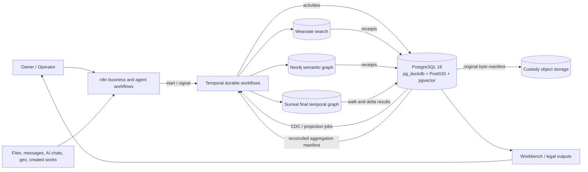
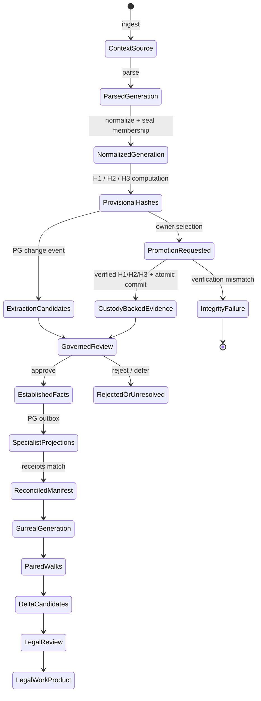
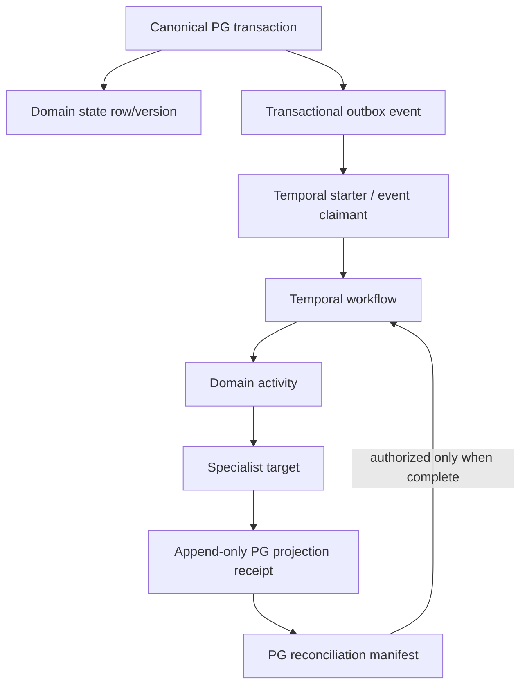
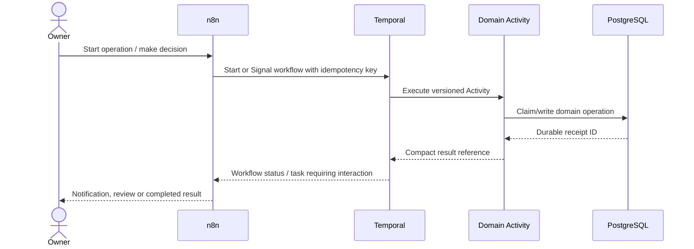
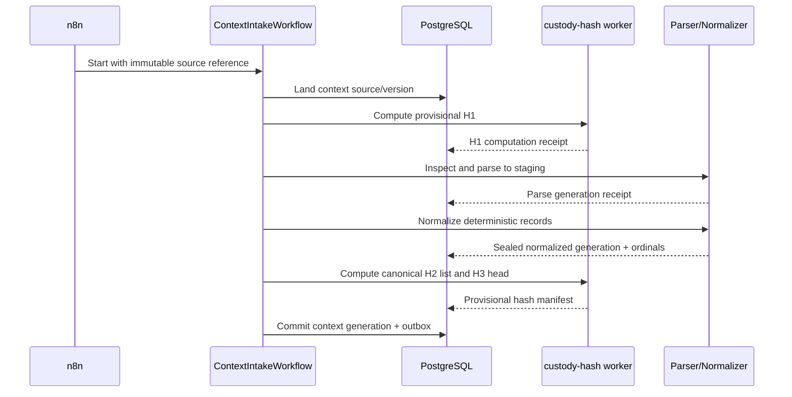
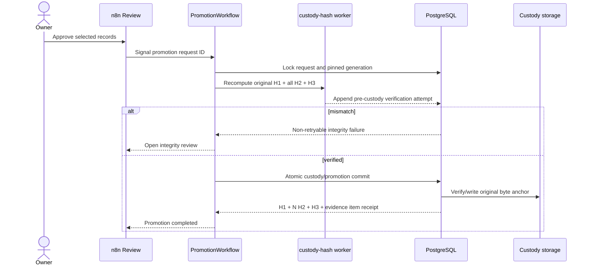
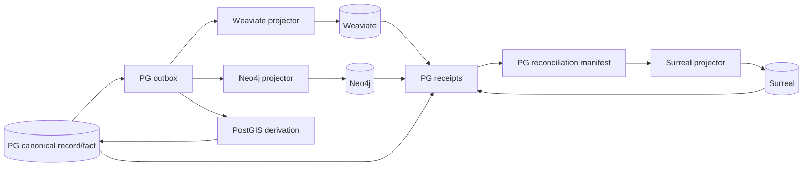
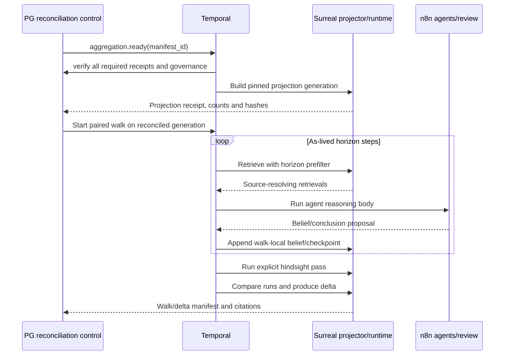

# Whole-system engineering architecture


> _Recovery note: this file was lost (never committed) after being authored in a Codex CLI session on 2026-08-25. Reconstructed 2026-09-02 by Claude Code · Sonnet (recovery lane C) from the session's own `apply_patch` tool-call history in `C:\Users\matts\.codex\sessions\2026\08\`, per the method in `RECOVERY-NOTE.md`. All accepted `apply_patch` hunks touching this file located and applied cleanly; full recovery, high confidence._

> _Current target architecture · owner rulings D-069 through D-081 · 2026-08-25_

## 1. System purpose

The platform ingests all material as context, preserves exact provenance, promotes selected material
into custody-backed evidence, establishes governed facts, projects specialized derived surfaces,
and reconstructs the difference between what was knowable as events unfolded and what hindsight
later established. That paired-walk delta is the analytical product.

The deployment is permanently one owner and one personal case. Existing Matter/CourtCase structures
are compatibility scaffolding, not tenancy architecture.

## 2. System context



## 3. Authority and storage model

| Surface | Primary responsibility | Authority class | Required backward link |
|---|---|---|---|
| PostgreSQL | Context, normalized spine, custody, candidates, facts, clocks, outbox, receipts, governance | Canonical | Self-contained canonical IDs and exact provenance |
| `pg_duckdb` | Analytical and object-store scans executed inside PG authority | Compute accelerator | PG query/run/input manifest |
| PostGIS | Raw geo, normalized geometry, geo derivations | Canonical PG extension | Context source/version and original geo locator |
| pgvector | Canonical/local vector identity, evaluation, parity and reconciliation | Canonical metadata / optional local representation | Record/chunk/embedder generation |
| Custody object storage | Original promoted bytes and verified copies | Original-byte authority | PG source/H1/custody event |
| Weaviate | Chunk/embedding similarity and hybrid search | Rebuildable serving projection | Exact PG chunk, record, source span, promotion and projection revision |
| Neo4j | Semantica-originated semantic candidate and governed relationship graph | Rebuildable graph projection | PG candidate/fact plus source anchor on every node and edge |
| SurrealDB | Reconciled temporal graph, final walks, belief state and delta analysis | Rebuildable final analytical projection | PG aggregation manifest and canonical fact/source IDs |
| Temporal | Durable sequencing, retries, Signals, timers and execution history | Operational control | PG domain receipt for every load-bearing Activity |
| n8n | Visual business/agent flow, integrations, notifications and operator interaction | Coordination | Temporal workflow/run and PG decision IDs |

No derived database establishes truth. Discoveries from Weaviate, Neo4j, or Surreal return to PG as
new candidates and pass through governance before they can re-enter derived projections.

## 4. Canonical lifecycle



## 5. PostgreSQL change-detection backbone



Every outbox event contains a canonical aggregate/version ID, event sequence, payload hash, contract
version and idempotency key. Every receipt names the event, target object/generation, expected and
observed hashes, result status, writer version and reconciliation state.

## 6. n8n and Temporal execution boundary



n8n does not directly invoke load-bearing domain mutations. Temporal history carries compact
references, not source bytes, parser corpora, embedding arrays, or full manifests.

## 7. Context ingestion and hash lifecycle



Hashing is a separate Activity family. Normalization creates the canonical bytes/fields and sealed
order; it does not secretly hash. Context hashes are provisional and create no custody authority.

## 8. Promotion and custody



H3 covers the complete normalized source generation. The promotion selects evidence records; it does
not claim every H3 member is approved evidence.

## 9. Specialized processing and source resolution



### Weaviate citation envelope

Every searchable object/hit must resolve:

```text
Weaviate object
→ PG chunk + exact char/structured locator
→ normalized record version
→ context source/version
→ original locator
→ promotion revision and custody H1 when evidence
```

Required filters are applied before ranking: authority state, revocation, disclosure/access,
`source_available_from <= horizon`, source/projection kind and pinned projection generation.

### Neo4j provenance envelope

Semantica writes candidates to PG. A separately credentialed platform projector writes Neo4j.
Every node and every relationship edge carries its own PG candidate/fact ID, exact source anchor,
extractor/config/run identity, clocks, authority state and projection revision. Endpoint provenance
does not substitute for an assertion edge's provenance.

## 10. Surreal aggregation and final walk



## 11. Three independent time concepts

| Concept | Meaning | May control horizon? | Mutation rule |
|---|---|---:|---|
| `occurred_at` | Event/valid time | No, not alone | Preserved from source; corrections versioned |
| `source_available_from` | Earliest retrieval boundary | Yes | Derived from occurrence/acquisition; never backdated by realization |
| Realization event/link | When the owner understood/found out | Used as experience input, not source availability | Zero-to-many append-only links |
| `knowledge_time` | PG write/audit time | Never | Database-managed audit value |

## 12. Failure and recovery model

| Failure | Required behavior |
|---|---|
| Activity retry after commit | Return existing receipt for same idempotency key/input digest |
| Hash/canon mismatch | Record attempt, fail non-retryably, write no partial custody |
| Projection partial write | Quarantine generation; replay missing objects; do not activate alias/readers |
| Receipt mismatch | Block reconciliation and Surreal projection |
| Revocation/supersession | Append event, deactivate old derived objects, rebuild affected generation |
| Healthy walk pause | Resume same identity after exact checkpoint/projection reconciliation |
| Terminal walk drift/integrity failure | Seal snapshot; create attested `rewalk_of`; never resume old identity |
| Legacy consumer still active | Block cutover until two-release zero-use proof and restore rehearsal |

## 13. Engineering completion definition

A domain is complete only when it is implemented, deployed, and live-verified with:

- Exact backward source resolution.
- Forward projection counts and membership/content hashes.
- Retry/idempotency and failure-injection proof.
- Revocation/supersession proof.
- Horizon contamination canaries where retrieval is involved.
- PG event/job/receipt correlation.
- A signed handoff manifest consumed by the next domain.
