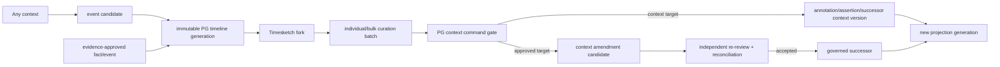

# Timesketch Fork and Round-Trip Context Curation Handoff

> Owner rulings D-082–D-085 · ADR-0060 · documentation/design handoff only

## Outcome

Build and operate a maintained Timesketch fork as the singleton personal-case chronology, review, and
bulk-curation service. It displays both context/candidate and evidence-approved timeline entries.
PostgreSQL remains canonical. Every fork edit returns through an authenticated, typed, version-bound
context command; a change to an approved entry becomes a context amendment candidate for independent
re-review and reconciliation, never an in-place evidence/fact edit.

## Non-negotiable authority flow

## Required PostgreSQL families

| Family | Responsibility | Authority |
|---|---|---|
| `event_candidate` + typed source anchors | Any-context event proposals | Candidate only |
| `timeline_collection`, `timeline_member` | Curated chronology membership without copying source authority | PG canonical curation |
| `timeline_projection_generation/member` | Immutable Timesketch export membership and bounded field mapping | PG projection control |
| `timeline_projection_receipt` | Delivery, read-back, reconciliation, activation and stale-generation state | PG audit/control |
| `timeline_curation_batch/item` | Individual/bulk command, expected versions, before/after hashes, item result | PG command ledger |
| typed context annotations/assertions/revisions | Accepted changes to context-derived objects | PG context authority |
| `timeline_amendment_candidate` | Proposed change to an approved event/fact/timeline member | Context candidate only |
| `timeline_curation_reversal` | Compensating undo lineage | PG audit/control |

Final schema names require R00 review and forward migrations; this handoff freezes responsibilities and
authority, not spelling.

## Timesketch mapping contract

The fork receives `datetime`, `message`, and `timestamp_desc` plus bounded attributes for stable PG
source/version IDs, point/range/uncertain time, entity/participant/location refs, context/candidate/
governed authority, verification/dispute/revocation, privacy/privilege/redaction, and projection
generation/hash. A display timestamp never overwrites a defended interval or creates false precision.

## Bulk-edit contract

Supported operations include tag/classification changes, derived summary proposals, time proposals,
entity merge/split/link assertions, conversation/group membership, timeline inclusion/order/importance,
candidate review state, dispute/verification display, redaction/privacy markings, and analyzer-result
adjudication.

Every batch supplies:

- actor and authorization context;
- idempotency key and client/fork version;
- expected projection generation;
- strict atomic or explicit itemized-partial mode;
- target type, ID and version per item;
- typed operation, rationale, before hash and proposed after hash; and
- preview hash proving the submitted batch matches the reviewed preview.

Every item returns `accepted`, `rejected`, `conflict`, or `no_op` with a receipt. Local OpenSearch state
does not become accepted state. Accepted results appear only after PostgreSQL emits and the fork consumes
a successor projection generation.

## Fork boundary

- Preserve Timesketch chronology/search, annotations, OpenSearch integration, analyzer/aggregator
  extension points, and Vue shell.
- Replace or disable DFIR-specific vocabulary, default views, importers and analyzers through isolated
  extension modules where possible.
- Do not permanently delete upstream files. Retain/disable them or move approved removals to
  `to_be_deleted`; only the owner deletes.
- Keep upstream merge/rebase provenance, license notices, dependency inventory and security-update
  procedure.
- The fork cannot directly write canonical PG tables, Weaviate, Neo4j, Surreal, evidence, facts,
  realizations, or legal releases.

## Implementation handoff by semantic boundary

| Packet | Owner boundary | Inputs | Outputs | Exit evidence |
|---|---|---|---|---|
| TS-00 | D-082 fence | Current Workbench/chat routes | Chat-export promotion denied at API/service/DB boundaries | Live negative test: zero evidence/custody writes |
| TS-01 | Canon/schema | D-082–D-085, current timeline/candidate tables | Reviewed forward PG migrations and typed command contracts | DDL tests, migration/rollback proof, writer census |
| TS-02 | Fork foundation | Pinned upstream Timesketch revision | Maintained fork, upstream-sync policy, neutralized domain surface | Build/test baseline and license/security inventory |
| TS-03 | Projection | PG generation/member/outbox contracts | Authenticated projector/importer and stable mapping | Count/hash/read-back reconciliation and replay |
| TS-04 | Curation API | Curation/amendment schemas | Preview, validate, submit, conflict, partial/atomic, reversal APIs | Concurrency/idempotency/authority integration tests |
| TS-05 | Fork UI | Projection and curation APIs | Authority badges, source opening, filters, bulk selection/edit/results | UI E2E across candidate and governed items |
| TS-06 | Re-review | Amendment candidates + existing R07/R04 governance | Review queue, evidence search, accept/reject/successor flow | Approved row unchanged until successor proof |
| TS-07 | Reconciliation | TS-03–TS-06 receipts | R09 expected/observed manifests and activation attestation | Rebuild and stale-generation/failure tests |
| TS-08 | Production | All prior packets | Coolify deployment, observability, backup/rebuild/rollback | Mandatory live integration and signed R14 manifest |

## Stop gates

- Stop if the current Workbench AI-chat promotion route remains able to reach evidence ingestion.
- Stop if candidate and governed entries are not visually and contractually distinguishable.
- Stop if a fork-local edit can bypass PG command validation or is visible as accepted before reprojection.
- Stop if an approved entry can be updated instead of producing an amendment candidate/successor.
- Stop if bulk partial results can be represented as whole-batch success.
- Stop if raw source content, custody history, established facts, or released work can be overwritten.
- Stop production completion claims until deployment, live negative tests, replay/rebuild and rollback pass.

## Handoff manifest

Each packet returns changed files, schema/API versions, tests executed, live receipts where applicable,
counts and hashes, unresolved risks, compatibility notes, rollback action, exact deployed revision, and
the downstream packet that acknowledged the manifest.
