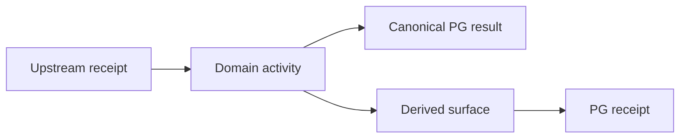
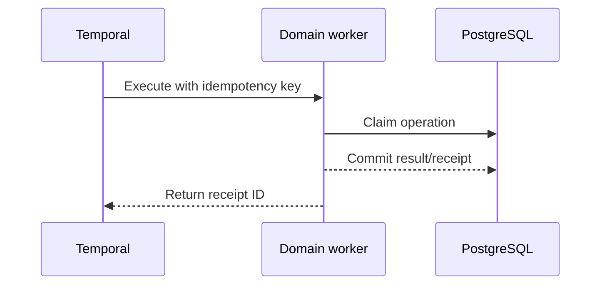

# RXX — Domain name

## Mission and authority

State the domain's single semantic job, canonical authority, derived surfaces, and prohibited
authority transitions.

## Scope

### In scope

- List owned behavior.

### Explicitly out of scope

- List adjacent behavior and its owning workstream.

## Owned engineering surfaces

| Surface | Current path/object | Target owner | Action |
|---|---|---|---|
| PG schema |  | RXX | Keep/reshape/add/quarantine-later |
| Code |  | RXX |  |
| Temporal |  | R13 binding, RXX contract |  |
| n8n |  | R13 coordination |  |
| External store |  | RXX |  |

## Input contract

List immutable IDs, versions, manifests, receipts, authority state and clocks required upstream.

## Output and handoff contract

List PG rows/events/receipts, derived objects, counts/hashes and authorized downstream consumers.

## Flow

## Sequence and failure behavior

## Invariants

Number every invariant so tests and reviews can reference it.

## Current implementation and gaps

| Capability | Current evidence | Gap | Severity |
|---|---|---|---|

## Implementation plan

Use dependency-ordered additive phases with activation and rollback boundaries.

## Test and evidence matrix

| Requirement/invariant | Unit | Integration | Live evidence |
|---|---|---|---|

## Migration, compatibility and rollback

No applied migration is edited. No historical row is rewritten. Retired material eventually moves
to `to_be_deleted`; only the owner deletes it.

## Risks and controls

| Risk | Detection | Prevention/recovery |
|---|---|---|

## Agent execution instructions

List mandatory files to read, discovery commands, owned paths, forbidden edits, and stop conditions.

## Handoff checklist

- [ ] Authority and scope verified.
- [ ] Inventory and consumer census attached.
- [ ] Tests and live evidence attached.
- [ ] Counts/membership/content hashes reconcile.
- [ ] Exceptions retain locators and reason codes.
- [ ] Downstream owner acknowledges the exact manifest.
