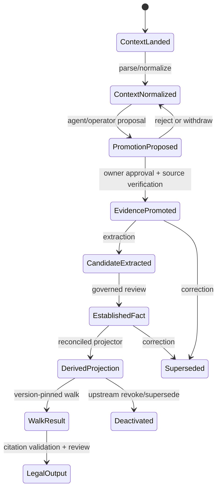
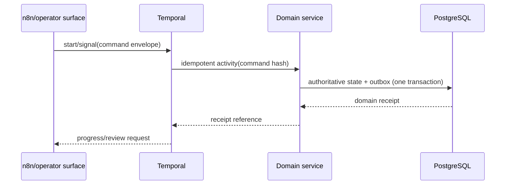

# R00 — Canon and Contract Freeze

> **Lane:** R00 · **Authority:** repository canon and owner rulings · **Execution order:** first
>
> **Governing sources:** `AGENTS.md`, `docs/PROJECT_CANON.md`, `docs/DECISION_LOG.md`
> D-069–D-085, ADR-0060, and `../RECONCILIATION-DOMAIN-WORKSTREAMS.md`.

## Purpose and authority

This lane freezes the meanings that every reconciliation lane must implement before schema
or runtime work begins. It is the contract authority, not a new data authority. PostgreSQL
remains canonical for lifecycle state; this document prevents each projector, workflow, and
agent from inventing its own definition of context, evidence, promotion, source time, fact,
receipt, or completion.

The owner-ruling baseline includes:

- D-069: every intake lands as mutable context; owner promotion starts evidence custody.
- D-070: Graphiti is retired for now; Surreal is the governed analytical/walk projection,
  while Cognee versus Memgraph remains an open graph-engine choice.
- D-071: first-party, acquired-third-party, and AI-chat message shapes stay separate, and
  sender/recipients/participants remain on message records.
- D-072: the product has one owner and one personal case; do not import multi-Matter or
  multi-client complexity into the canonical model.
- D-073: PostgreSQL remains authority; Surreal is the final governed temporal-graph
  aggregation, walk, and analysis projection.
- D-074: Semantica emits extraction candidates and provenance/conflict assistance only; it
  does not establish facts or form walk beliefs.
- D-075: normalization may compute a provisional H2 fingerprint; promotion re-reads the
  original, verifies H1, computes the verified H2, and only that verified value may enter H3.
- D-076: the platform H3 starts at H1 and folds the full ordered normalized-generation H2
  sequence using hex concatenation under `h3-chain-h1genesis-hexconcat-v1`; the SBV H3 is a
  distinct import receipt and never substitutes for the platform chain.
- D-077: n8n owns visual/business coordination, Temporal owns durable sequence/retry/history,
  hashing is a separate Activity family, and orchestration payloads carry references only.
- D-078: PostgreSQL CDC/outbox is universal; every consumer returns its receipt to PG, and
  Surreal consumes only PG-authorized reconciled manifests.
- D-079: raw geo and canonical geometry remain in authoritative PostgreSQL/PostGIS.
- D-080: PG18 with pg_duckdb/PostGIS/pgvector is canonical; Weaviate search, Neo4j semantic
  graph, and Surreal final graph are rebuildable projections.
- D-081: R00–R14 are bounded authority workstreams; cross-lane writes require explicit
  contracts, handoff acceptance, and independent R09/R14 verification.
- D-082: AI chat is permanently context-only, never promotable or evidentiary; extracted claims/
  events enter the claim chart and independent evidence search.
- D-083: AI-chat extraction fans out into typed investigation, observation, strategy, and
  context-created-work lifecycles without gaining factual authority.
- D-084: the timeline product is a maintained Timesketch fork backed by immutable PG projection
  generations; any context may produce candidates and evidence-approved entries are also visible.
- D-085: the fork is a governed individual/bulk context-curation service. Every edit returns through
  typed PG commands; edits to approved entries become context amendment candidates until independent
  re-review/reconciliation appends a successor.

If this guide and a ruling differ, stop: update the guide through review rather than
interpreting around the ruling.

## Scope

### In scope

- Canonical lifecycle states and permitted transitions.
- Versioned inter-domain envelopes and stable identity rules.
- Append/supersede/revoke semantics.
- A single promotion eligibility predicate and reconciliation equation.
- Contract fixtures, compatibility policy, and activation gates.

### Out of scope

- Physical table/column design.
- Parser, workflow, vector, graph, or legal-output implementation.
- Choosing Cognee or Memgraph.
- Rewriting historical custody records or retagging legacy H3 links.

## Owned surfaces

- Canonical contract package and serialized schemas.
- Lifecycle transition specification.
- Contract-version registry and compatibility fixtures.
- Reconciliation reason-code vocabulary.
- Cross-domain envelope validation and contract tests.
- Decision-to-code traceability matrix for D-069–D-081.

## Frozen lifecycle

No transition from context directly to established fact, a governed projection, a walk, or
legal output is permitted. Promotion creates a new evidence identity/version and preserves
the context provenance; it does not relabel the mutable context row in place.

## Upstream and downstream contracts

The following canonical contracts are the only supported cross-domain handoff shapes. Each
producer emits through R01 and each consumer returns a processing/reconciliation receipt.

| Contract | Minimum semantic content | Producer | Consumers |
|---|---|---|---|
| `SourceManifest` | source identity, immutable locator, content fingerprint, media type, byte/record expectations, producer run | intake | normalization, promotion |
| `ContextRecordRef` | context identity/version, source locator/span, provisional fingerprint, parser receipt | normalization | extraction, promotion proposal |
| `CustodyArtifactRef` | evidence identity, H1, custody construction/tag, verified-source locator, promotion decision | promotion/custody | facts, projections, legal |
| `NormalizedRecordRef` | record version, message family, occurred/source-available clocks, exact source span, provisional/verified fingerprint state | normalization/promotion | extraction, search, graph |
| `PromotionDecisionRef` | append-only decision/revision, owner attribution, scope, governed eligibility, evidence refs | promotion | all governed projectors |
| `EstablishedFactRef` | immutable fact revision, candidate lineage, supporting/contradicting spans, review state | facts | projections, walks, legal |
| `ProjectionReceipt` | target/schema generation, pinned inputs, input/output manifests, counts, reconciliation status | each projector | activation, walks, operations |
| `WorkflowReceipt` | workflow/run/activity identities, attempts, command/result hashes, terminal status | Temporal activities | operations, reconciliation |
| `WalkResultRef` | projection pins, horizon policy, checkpoint hashes, belief/retrieval refs, delta pair | walk runtime | legal |
| `LegalOutputRef` | output revision, proposition-to-fact/span map, disclosure review, renderer identity | legal | operator/export |

Every contract is immutable once emitted. Corrections append a new version with an explicit
`supersedes` relationship. Revocation appends authority state and deactivates projections;
it never erases the prior receipt or delivered-output provenance.

## PostgreSQL events and receipts

R00 owns event meanings, not storage layout. The canonical event vocabulary is:

1. `context.source_landed`
2. `context.record_normalized`
3. `promotion.proposed`, `promotion.rejected`, `promotion.approved`
4. `custody.source_verified`, `custody.chain_appended`
5. `fact.candidate_recorded`, `fact.established`, `fact.superseded`
6. `projection.requested`, `projection.completed`, `projection.reconciled`,
   `projection.deactivated`
7. `walk.started`, `walk.checkpointed`, `walk.paused`, `walk.sealed`, `walk.completed`
8. `legal.output_rendered`, `legal.output_reviewed`, `legal.output_superseded`

Events and outbox records commit in the same PostgreSQL transaction as the authoritative
state change. A receipt is evidence that a consumer processed a pinned input; an event is
not itself proof of reconciliation.

## Temporal and n8n responsibilities

- n8n owns agent composition, integrations, operator notifications, and approval UI calls.
- Temporal owns durable sequencing, retries, timeouts, signals, checkpoint identity, and
  activity tracking.
- Domain services own validation and authoritative writes.
- Neither orchestrator may synthesize a promotion, custody, fact, or projection receipt.
- Workflow IDs derive from stable object/command keys; duplicate triggers return the same
  run/result or an explicit conflict, never a second semantic transition.

## Invariants

1. One authored spine; lanes and passes are filters or derived projections, never authored
   copies.
2. `occurred_at`, `source_available_from`, realization time, and row-write audit time remain
   distinct.
3. Horizon enforcement is a prefilter in every store.
4. Extraction may see the full permitted corpus but forms no beliefs.
5. Context fingerprints are not custody hashes.
6. Promotion is owner-authorized and verifies against the original source.
7. Only verified H2 enters a correctly tagged H3 construction.
8. `expected = accepted + quarantined + superseded/revoked`; every omitted item has a
   retained locator and reason code.
9. A projection is consumable only when its immutable receipt is reconciled.
10. Healthy walks resume only against the identical projection; integrity failure seals and
    starts an attested `rewalk_of`.

## Implementation phases

1. **Inventory:** map D-069–D-081 and ADRs to current code, tables, workflows, and tests.
2. **Specify:** publish contract schemas, transition table, reason codes, and examples.
3. **Golden fixtures:** create canonical first-party, acquired-third-party, AI-chat,
   duplicate, corrected, revoked, partial-promotion, and malformed examples.
4. **Adapters:** require all producers/consumers to validate the frozen contracts.
5. **Enforcement:** add transactional outbox and receipt requirements to activation gates.
6. **Freeze:** record contract versions and reject unversioned writes in live services.

## Current implementation and gaps

Repository evidence plus the dated 2026-08-26 read-only live-parity snapshot establishes the
following baseline. The snapshot did not mutate services or prove workflow execution, restart,
deployment, failover, rollback, or current route traffic; it is not a live-production certification:

| Status | Observed implementation or contradiction | Evidence |
|---|---|---|
| Implemented contract fragment | The one-spine, distinct-clock, and paired-delta intent is explicit at the repository entry point. | `AGENTS.md:38-74` |
| Critical contradiction | D-069 says intake is context-only, but the current entry point still describes `Evidence custody -> parse -> normalize`, and the executable Temporal workflow runs custody first. | `AGENTS.md:22-24`; `server/temporal/workflows.py:172-182`; `server/temporal/workflows.py:219-247` |
| Critical contradiction | D-070 retires Graphiti, but agents still receive writable Graphiti MCP tools whenever `GRAPHITI_MCP_URL` is set. The 2026-08-26 snapshot observed Graphiti applications running and exec still carrying `GRAPHITI_MCP_URL`; it did not execute a Graphiti write or inspect authenticated tool policy. | `docs/DECISION_LOG.md:31`; `server/agents/providers.py:194-212`; `../COMPLETE-CODEBASE-AUDIT.md` (read-only live-parity snapshot) |
| High contradiction | D-072 forbids new Matter/CourtCase architecture, while create routes and repository writers remain active code. The 2026-08-26 snapshot did not invoke those routes or establish current traffic, so executable reachability remains source-proven while live use remains unverified. | `docs/DECISION_LOG.md:29`; `server/api/case_management_routes.py:68-82`; `server/case_management/repository.py:511-581` |
| Partial implementation | Source-clock and message-projection constraints exist, but downstream eligibility is not uniformly governed by route, promotion, and custody revisions. | `sql/0026_realization_event.sql:316-334`; `server/evidence/vector_projection.py:150-207` |
| Missing shared contract | Repository census found domain-specific mutable job/status tables and local reconciliation JSON, but no universal immutable `ProjectionReceipt`/aggregation-manifest implementation in PG. | `sql/0026_realization_event.sql:487-507`; `server/evidence/native_activation.py:182-219` |

Lifecycle meanings therefore remain distributed across rulings, ADR amendments, SQL, services,
and runbooks. Exact source-span linkage is not universal, legacy paths predate D-069, and no
decision-to-code freeze can be accepted while the contradictions above remain executable.

### Applicable audit gaps

The deduplicated register assigns these blocking or mandatory findings to R00:
[`GAP-001`](../AUDIT-GAP-REGISTER.md), [`GAP-004`](../AUDIT-GAP-REGISTER.md),
[`GAP-008`](../AUDIT-GAP-REGISTER.md), [`GAP-013`](../AUDIT-GAP-REGISTER.md),
[`GAP-014`](../AUDIT-GAP-REGISTER.md), [`GAP-019`](../AUDIT-GAP-REGISTER.md),
[`GAP-021`](../AUDIT-GAP-REGISTER.md), [`GAP-028`](../AUDIT-GAP-REGISTER.md),
[`GAP-033`](../AUDIT-GAP-REGISTER.md), and [`GAP-034`](../AUDIT-GAP-REGISTER.md).

## Test matrix

| Test | Required proof |
|---|---|
| Contract round-trip | every golden fixture validates and serializes deterministically |
| Compatibility | supported old version upgrades explicitly; unknown version fails closed |
| Transition property tests | every permitted edge succeeds; every undeclared edge fails |
| Idempotency | repeated command yields one semantic event and stable receipt |
| Supersession | old version remains addressable and inactive; new version is linked |
| Reconciliation equation | balanced counts for success, quarantine, revoke, partial scope |
| Horizon leak | future source is absent before ranking in every consumer contract; include native and legacy Weaviate paths |
| Citation round-trip | output ref opens exact original source span |
| Decision-to-code trace | D-069 through D-081 each map to current producer, consumer, test, and explicit implemented/partial/absent/dated-live-snapshot/unverified status |
| Negative surface census | retired Graphiti and new Matter/CourtCase creation are unreachable before freeze activation |

## Live acceptance

- Run contract validation against live read-only samples from every current producer.
- Produce a signed/versioned freeze manifest listing contract versions and decision refs.
- Demonstrate one complete item through every transition with balanced manifests.
- Demonstrate duplicate delivery, rejection, supersession, and revocation live.
- Confirm no unversioned producer remains enabled before downstream cutover.

### Execution and stop gates

- **Start gate:** inventory is pinned to a commit and includes every enabled route, worker,
  projector, migration, and live configuration value; repository defaults are not accepted as
  proof of live state.
- **Stop immediately** if any current-truth document or executable path still contradicts
  D-069, D-070, or D-072, or if a contract field cannot resolve an immutable source/revision.
- **Stop immediately** if a mutable job row or Temporal completion is offered as the immutable
  processing/reconciliation receipt.
- **Do not hand off R00** until the owner-reviewed traceability matrix has zero unexplained
  contradictions and the negative surface census passes in the live deployment.

Local/unit success is necessary but not completion; mandatory live integration tests and
observed writes/reads are required under the repository production rule.

## Migration and rollback

- Introduce validation in observe-only mode and inventory violations.
- Backfill references/receipts without rewriting source facts or historical custody.
- Enable rejection per producer after its violations reach zero.
- Rollback disables the new consumer/validator and restores the prior reader alias; it never
  deletes new events, receipts, or legacy data.
- Contract rollback means publishing a superseding contract version, not mutating the frozen
  schema or relabeling history.

## Risks and mitigations

| Risk | Mitigation |
|---|---|
| Semantic freeze ahead of evidence | Golden fixtures plus owner review before enforcement |
| Two eligibility implementations drift | One versioned predicate/library and parity tests |
| Receipt treated as mutable job state | Separate immutable completion/reconciliation receipt |
| Compatibility adapter hides data loss | Balance manifests and explicit quarantine reasons |
| Open graph choice contaminates canon | Keep engine-neutral graph projection contract |
| Stale executable path survives a documentation freeze | Require route/tool/env census and negative live probes, not text review alone |
| Repository comment is mistaken for current live proof | Label repository-declared history separately and require fresh R14 observation |

## Agent instructions

1. Read root and closest `AGENTS.md`, canon, D-069–D-081, and the master workstream first.
2. Do not design a second authored spine or put horizon state on normalized rows.
3. Do not infer missing owner intent; stop and record a decision gap.
4. Never rewrite applied migrations or custody history.
5. Use append/supersede/deactivate and preserve source locators.
6. Update the traceability matrix and tests in the same change as any contract consumer.
7. Do not declare completion without live evidence and an immutable receipt.

## Exact handoff checklist

- [ ] D-069–D-081 mapped to contract clauses and acceptance tests.
- [ ] Contract version and canonical serializer identified.
- [ ] Producer and consumer owners named.
- [ ] Stable IDs, exact source locator, and source/promotion revision present.
- [ ] Input count/hash manifest attached.
- [ ] Accepted/quarantined/superseded/revoked counts balance.
- [ ] Every omission has a reason code and retained locator.
- [ ] Domain event and transactional outbox record committed together.
- [ ] Immutable processing and reconciliation receipts stored.
- [ ] Retry/idempotency behavior demonstrated.
- [ ] Supersession/revocation propagation demonstrated.
- [ ] Horizon and disclosure behavior tested before ranking.
- [ ] Live sample verified and rollback trigger recorded.
- [ ] Downstream lane explicitly accepts the contract version and receipt.
