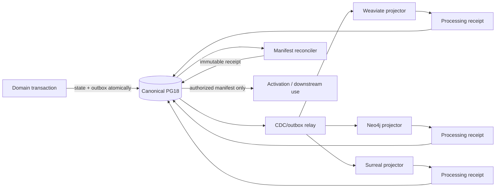
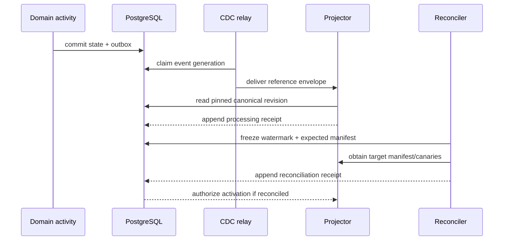

# R01 — PostgreSQL Backbone, CDC, Outbox, and Receipts

> **Lane:** R01 · **Authority:** canonical state transport and reconciliation control
>
> **Depends on:** R00 contract freeze · **Governing rulings:** D-072, D-073, D-077–D-081

## Purpose and authority

Implement PostgreSQL 18 as the one canonical lifecycle backbone and make every downstream
projection provably complete. D-078 makes CDC/outbox universal: an authoritative PG change
and its outbound event commit atomically, every consumer returns an immutable receipt to PG,
and Surreal sees only PG-authorized reconciled manifests. Weaviate, Neo4j, Surreal, and the
maintained Timesketch fork/OpenSearch are rebuildable consumers under D-080/D-084; none may become
an alternate authority.

## Scope

### In scope

- Transactional outbox for all canonical lifecycle domains.
- CDC publication/consumption, delivery leases, retry, quarantine, and replay.
- Immutable consumer processing and reconciliation receipts.
- Input/output manifests, watermarking, balance equations, and activation authorization.
- Projection generation, supersession, revocation, and rebuild controls.
- Operational reconciliation API/report for R00–R14.

### Out of scope

- Domain-specific promotion, custody, fact, vector, graph, walk, or legal decisions.
- Business orchestration logic in n8n.
- Treating Temporal history or a broker offset as the domain ledger.
- Multi-Matter tenancy; D-072 fixes one owner/one personal case.

## Owned surfaces

- PG event envelope and outbox persistence.
- CDC publisher/relay and consumer-registration policy.
- Receipt and reconciliation registry.
- Manifest construction and canonical hashing rules.
- Projection authorization/deactivation commands.
- Replay/quarantine operator tooling and itemized run reports.
- Metrics for lag, missing receipts, duplicate delivery, drift, and terminal failures.

## Upstream and downstream contracts

| Direction | Contract | Requirements |
|---|---|---|
| Upstream → R01 | domain event | event/aggregate ID, aggregate revision, contract version, transaction identity, causation/correlation, payload reference, content hash |
| R01 → consumer | delivery envelope | event reference, target, generation, attempt, manifest/watermark reference; no large/raw payload |
| Consumer → R01 | processing receipt | event/generation, consumer/schema version, input hash, result reference/hash, status, reason code |
| Reconciler → R01 | reconciliation receipt | pinned watermark, expected/output manifests and counts, drift details, canary results |
| R01 → activation | authorization | target generation plus exact reconciled receipt; single-use/idempotent |
| R01 → Surreal | governed manifest ref | PG-authorized promotion/fact set and prerequisite receipts only |

Payloads passed through Temporal and n8n are references. Consumers fetch canonical data from
PG using the pinned revision and fail closed if it no longer matches.

## Flow

## PostgreSQL events and receipts

### Event rules

- Events are append-only facts about canonical transitions, not mutable queue rows.
- Queue/lease state may change, but it points to an immutable event and generation.
- Event creation is in the same transaction as domain state.
- Aggregate revisions are monotonic; consumers reject gaps or quarantine until predecessors
  arrive.
- The outbox supports at-least-once delivery. Semantic idempotency is mandatory.
- Corrections emit supersession/revocation events; physical delete is not propagation.

### Receipt classes

1. **Processing receipt:** one consumer attempt/result for one event generation.
2. **Projection receipt:** deterministic source revision → destination object generation.
3. **Reconciliation receipt:** exact expected and observed manifests under one watermark.
4. **Activation receipt:** operator/system authorization to expose a reconciled generation.
5. **Deactivation receipt:** proof that revoked/superseded content is no longer eligible.

A successful processing receipt does not imply reconciliation. Reconciliation requires
balanced counts and hashes over the entire pinned manifest plus required canaries.

## Temporal and n8n responsibilities

- **Temporal:** sequence relay/reconcile/activate workflows; retry transient activities;
  persist activity history; time out stalled consumers; pause for approval; derive workflow
  IDs from target plus generation; never carry raw source payloads.
- **n8n:** request runs, display itemized progress/drift, notify the operator, submit replay or
  activation approval as a Temporal Signal.
- **PG/domain services:** own event truth, delivery leases, receipts, authorization, and
  idempotency. A green n8n node or completed Temporal activity is not a projection receipt.
- **Hashing:** invoked through the separate R04 Activity family; R01 transports only hash and
  artifact references.

## Invariants

1. No canonical write exists without an atomic outbox event after enforcement cutover.
2. No downstream object is authoritative.
3. Every delivery is at least once; every semantic effect is idempotent.
4. Every receipt names exact input revision, target generation, contract/schema version, and
   producer identity.
5. `expected = accepted + quarantined + superseded/revoked`; missing is never zero by default.
6. A projection generation cannot activate without a reconciled immutable receipt.
7. Surreal consumes only PG-authorized reconciled manifests.
8. Revocation is ordered after the active generation and must produce a deactivation receipt.
9. Replays never mutate the historical event or prior receipt.
10. Geo authority remains PG/PostGIS; downstream geometry is hash-referenced projection only.

## Current implementation and gaps

| Status | Observed implementation or gap | Evidence |
|---|---|---|
| Partial, target-specific | The native vector lane has a durable PG job table, generation, lease fields, retry state, projection hash, and insert/route-change triggers. | `sql/0026_realization_event.sql:487-554` |
| Partial, target-specific | The projector claims jobs with `FOR UPDATE SKIP LOCKED` and records completion/failure in PG, but the row remains mutable operational state rather than a separate immutable receipt. | `server/evidence/vector_projection.py:126-143`; `server/evidence/vector_projection.py:233-269` |
| Partial, noncanonical receipt | Weaviate activation builds independent PG/target manifests and exact hashes, but persists the manifests and reconciliation receipt as local JSON files rather than canonical PG records. | `server/evidence/native_activation.py:182-219` |
| Missing eligibility inputs | The vector projection hash omits original locator/span, promotion revision, custody-generation revision, route decision revision, and revocation basis. | `server/evidence/vector_projection.py:272-290` |
| Direct-store bypass | Context projection inserts directly into Weaviate/Graphiti and only stamps `projected_at`/`projection_ref`; Graphiti acknowledgement confirms queueing, not reconciled graph state. | `server/analysis/context_chat_ingest.py:425-434`; `server/analysis/context_chat_ingest.py:478-543`; `server/analysis/graphiti_case_client.py:144-165` |
| Missing universal backbone | Repository census found no shared immutable processing/reconciliation receipt registry or R09 PG aggregation manifest covering Weaviate, Neo4j, PostGIS, Surreal, and Timesketch/OpenSearch. | Target contract: D-078/D-084/D-085 and ADR-0060; extant vector-only schema: `sql/0026_realization_event.sql:487-541` |
| Dated live snapshot, incomplete | The 2026-08-26 read-only snapshot observed PostgreSQL 18.1 with pg_duckdb 1.1.0, PostGIS 3.6.4 and vector 0.8.6, but exec still connected as superuser `ai` and RLS was enabled on 0 of 143 inspected evidence/working/analysis base tables. Temporal UI/worker health was observed, but current domain table shape/row counts, projection lag, enabled consumers and registered workflow execution were not established. | `deploy/compose.yaml:73`; `deploy/exec.yaml:120`; `../COMPLETE-CODEBASE-AUDIT.md` (read-only live-parity snapshot) |

Not every authoritative writer emits a transactional outbox event, no universal PG gate currently
authorizes Surreal from an R09 manifest, and legacy/direct consumers bypass universal replay and
deactivation.

### Applicable audit gaps

The deduplicated register assigns these blocking or mandatory findings to R01:
[`GAP-004`](../AUDIT-GAP-REGISTER.md), [`GAP-009`](../AUDIT-GAP-REGISTER.md),
[`GAP-012`](../AUDIT-GAP-REGISTER.md), [`GAP-014`](../AUDIT-GAP-REGISTER.md),
[`GAP-015`](../AUDIT-GAP-REGISTER.md), [`GAP-016`](../AUDIT-GAP-REGISTER.md),
[`GAP-019`](../AUDIT-GAP-REGISTER.md), [`GAP-021`](../AUDIT-GAP-REGISTER.md),
[`GAP-026`](../AUDIT-GAP-REGISTER.md), [`GAP-027`](../AUDIT-GAP-REGISTER.md), and
[`GAP-034`](../AUDIT-GAP-REGISTER.md).

## Implementation phases

1. **Inventory writers/consumers:** enumerate every authoritative mutation and destination.
2. **Envelope/registry:** implement R00 event, delivery, and receipt contracts.
3. **Transactional emission:** add outbox emission to one low-risk domain; prove rollback
   atomicity, then expand domain by domain.
4. **Relay:** implement generation leases, ordering, exponential retry, quarantine, and
   idempotent receipt return.
5. **Manifest reconciliation:** canonicalize hash ordering and balance all result classes.
6. **Activation gate:** require reconciled receipt for reader alias or downstream authorization.
7. **Universal adoption:** migrate all R00–R14 producers/consumers; block unregistered paths.
8. **Backfill/replay:** only after live canaries and rollback have passed.

## Test matrix

| Layer | Cases |
|---|---|
| Transaction | state+event commit together; both roll back on failure |
| Delivery | duplicate, out-of-order, gap, lease expiry, worker crash, poison event |
| Idempotency | repeated delivery produces one destination generation and stable receipt |
| Manifest | zero, partial, quarantine, revoke, duplicate, count-match/hash-mismatch |
| Reconciliation | stale watermark, target drift during scan, canary failure, receipt signing |
| Authorization | unreconciled/failed/stale receipt rejected; exact receipt activates once |
| Revocation | active object deactivated everywhere; historic receipt retained |
| Recovery | rebuild empty target from PG, compare manifest, activate, roll back reader |
| Security | forged consumer/receipt, wrong case, wrong contract version, payload-reference swap |
| Current vector seam | job mutation cannot alter an immutable receipt; completion after lease loss deactivates target and reconciles exactly |
| Direct-write census | every destination write has an originating PG event and returned immutable receipt; zero Graphiti/manual bypasses |
| Cross-store manifest | Weaviate, Neo4j, PostGIS, Surreal, and Timesketch/OpenSearch counts/object IDs/content hashes reconcile at one pinned watermark |
| Curation round trip | Timesketch batch/item receipts, accepted PG context results, amendment candidates and successor projection reconcile without direct store writes |

## Live acceptance

- Observe authoritative state plus outbox in the same live PG transaction.
- Kill the relay and a projector mid-write; restart and demonstrate exactly one semantic output.
- Rebuild a disposable versioned target from an exact watermark.
- Store processing and reconciliation receipts in PG and show balanced manifest counts/hashes.
- Prove activation fails before reconciliation and succeeds only with the exact receipt.
- Revoke one promoted item and verify downstream deactivation plus retained history.
- Display the itemized run and drift report through the operator surface.
- Run mandatory live integration tests against PG and at least one real downstream service.

### Execution and stop gates

- **Start gate:** fresh live catalog and writer/consumer census identifies every canonical mutation,
  target write, trigger, job table, receipt table, and enabled worker at a pinned commit/config.
- **Stop immediately** if authoritative state can commit without its outbox event, if a consumer
  writes before validating the referenced revision/hash, or if retry creates a second semantic effect.
- **Stop immediately** if reconciliation output is only a local file, log line, mutable status, or
  workflow result rather than an immutable PG receipt.
- **Do not authorize a reader alias or Surreal generation** until R09 supplies exact count/hash/
  orphan parity for the pinned watermark and R14 independently observes the live gate.

## Migration and rollback

- Begin dual-observe: existing producer behavior remains, new outbox records are audited but
  not consumed.
- Enable one consumer generation behind a versioned target/alias; never overwrite the active
  target during backfill.
- Cut readers only after exact reconciliation and explicit activation.
- Rollback switches the reader to the prior reconciled generation and pauses new deliveries.
- Keep events, receipts, quarantine, and new target intact for diagnosis; delete nothing.
- Resume through a new generation after correction, linked to the failed generation.

## Risks

| Risk | Mitigation |
|---|---|
| CDC ordering differs from business ordering | aggregate revision and predecessor gate |
| Receipt explosion | partition/archive operational views, retain immutable canonical records |
| Poison event blocks stream | scoped quarantine with explicit imbalance, not silent skip |
| Dual-write race | transactional outbox only; no service-level PG+destination dual write |
| Reconciliation over mutable target | versioned target and frozen watermark |
| Orchestrator becomes authority | domain receipt required regardless of workflow status |
| Target-specific job is generalized as the backbone | keep job/lease state separate from immutable domain-neutral receipts and prove a second consumer |
| Historical migration comment is treated as live state | require fresh catalog, row-count, lag, and enabled-worker evidence in every handoff |

## Agent instructions

1. Own only transport, receipts, and reconciliation; do not encode domain truth in the relay.
2. Read R00 and the producing/consuming lane guide before changing an envelope.
3. Keep payloads reference-only and validate fetched revision/hash before processing.
4. Never treat delivery acknowledgement as reconciliation.
5. Preserve every failed attempt, reason, and locator; do not silently skip.
6. Test real crash/retry behavior, not only mocks.
7. Do not activate, deploy, or backfill live without the exact handoff approval.

## Exact handoff checklist

- [ ] Producer domain and authoritative transaction named.
- [ ] Event contract/version and aggregate revision validated.
- [ ] Stable causation, correlation, workflow, and idempotency keys present.
- [ ] Payload is a reference with expected content/revision hash.
- [ ] State and outbox atomicity test attached.
- [ ] Consumer registration, target schema, and generation recorded.
- [ ] Processing receipt returned to PG for every accepted/quarantined item.
- [ ] Expected/accepted/quarantined/revoked counts balance.
- [ ] Input and output manifests use canonical ordering and hash construction.
- [ ] Required boundary/security canaries passed.
- [ ] Immutable reconciliation receipt stored in PG.
- [ ] Activation authorization binds the exact receipt and generation.
- [ ] Revocation/deactivation path demonstrated.
- [ ] Replay and rollback commands tested against a versioned target.
- [ ] Downstream owner accepts the manifest and receipt references.
