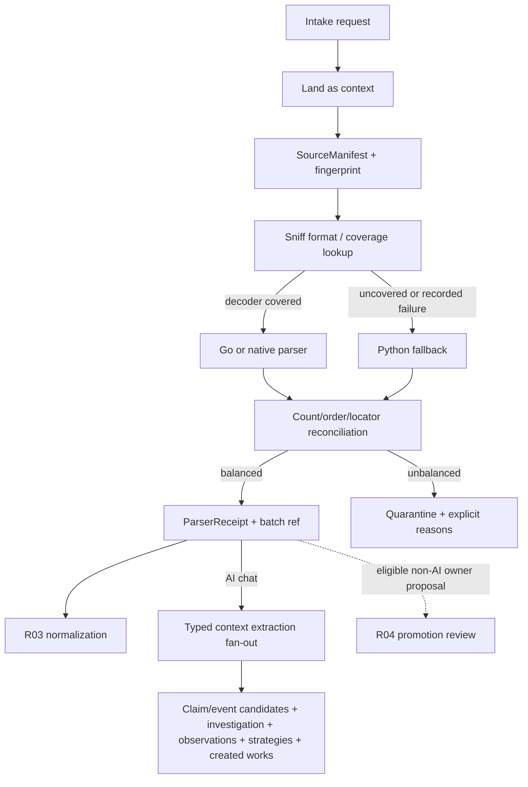
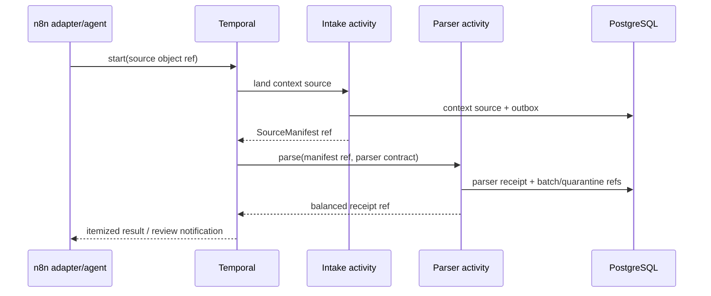

# R02 — Context Ingest and Parser Boundary

> **Lane:** R02 · **Authority:** landing, source identity, parser routing, and context completeness
>
> **Depends on:** R00, R01 · **Governing rulings:** D-069, D-071, D-072, D-077–D-085,
> ADR-0060

## Purpose and authority

Land everything as context without loss, bind every parsed record back to the exact source,
and hand deterministic parser output to normalization. Under D-069, intake never creates
evidence or custody. Hashes computed here are mutable-context fingerprints and integrity aids.
Only owner-approved promotion of an eligible non-AI source in R04 begins evidence custody. D-082 is
a permanent source-class exception to the general promotion path: AI conversations, messages, tool
turns and chat exports remain context-only forever. Their lineage can support extraction and
investigation, but it has zero evidentiary support weight and can never be an evidence anchor,
corroborating source or proof of an event.

This lane is authoritative for what arrived, how it was identified, which parser handled it,
and what the parser emitted or quarantined. It is not authoritative for normalized meaning,
facts, evidence status, or legal use.

## Scope

### In scope

- Intake adapters for files, exports, messages, chats, media, and sister-project references.
- Immutable source landing/reference, media sniffing, source manifests, dedup candidates.
- Coverage-based parser routing, parser/fallback/shadow execution, and parser receipts.
- Preservation of raw record locators, attachments, bodyless records, and failures.
- Context-only lane classification and explicit promotion proposals.
- Permanent `ai_chat` no-promotion classification and exact conversation/message/span/asset lineage.
- Count/hash reconciliation from landed source to parser output/quarantine.

### Out of scope

- Writing `evidence.*`, custody H1/H2/H3, authentication, or legal-use status.
- Normalized message semantics, clocks, participant entity resolution, extraction, or beliefs.
- Size-based Go/Python routing; routing remains decoder-coverage based.
- Treating a duplicate fingerprint as proof that two sources are the same legal artifact.
- Sending an AI-chat source or any derivative copy of one to R04 promotion/custody.
- Establishing facts, selecting legal strategy, or materializing created works as R12 products.

## Owned surfaces

- Context landing records formerly mislocated under evidence-oriented raw naming.
- Source adapter and media/format identification registry.
- Parser gateway and coverage/fallback decision log.
- SourceManifest and ParserReceipt producers.
- Context ingest CLI/API/activity entrypoints.
- Quarantine and exact source-record locator policy.
- AI-chat lane routing as a terminal context authority classification; `evidence` is not a valid
  destination even after owner selection.

## Upstream and downstream contracts

| Direction | Contract | Required semantics |
|---|---|---|
| Source → R02 | intake request | source URI/object ref, acquisition method, claimed media type, operator/source identity |
| R02 → R01 | landing event | SourceManifest ref, intake run, source fingerprint, expected units, disposition |
| R02 → R03 | parser batch | source ref, parser/version, ordered raw records, exact locators, attachments, parser receipt |
| R02 → R04 | promotion proposal | eligible non-AI context source/record refs and scope only; no asserted evidence hash; AI-chat source classes fail closed |
| R02 → extraction | AI-chat/context batch | immutable source generation, actual role/order, exact message/span/asset locators and permanent `context_only` authority |
| Extraction → R07/R12 | typed fan-out references | claim/event candidates, investigation concerns/evidence needs, observation candidates, strategy candidates and created-work versions remain separate families sharing exact context-only lineage |
| R02 → operator | itemized report | accepted, duplicate-candidate, unsupported, quarantined, failed units with reason/locator |

The parser batch must preserve the source's stable order and record identity. It may contain
format-specific fields; R03 owns conversion to normalized contracts.

## Flow

## PostgreSQL events and receipts

Events:

- `context.intake_requested`
- `context.source_landed`
- `context.source_duplicate_suspected`
- `context.parser_selected`
- `context.parse_completed`
- `context.parse_quarantined`
- `context.promotion_proposed`
- `context.extraction_requested`

Receipts:

- **SourceManifest:** acquired object identity, original locator, byte fingerprint, size/media,
  acquisition time/method, adapter/version, expected unit basis.
- **ParserReceipt:** source manifest, parser ID/version/coverage reason, fallback chain, ordered
  emitted record manifest, attachments, rejected records, counts, hashes, duration, attempts.
- **ShadowComparisonReceipt:** primary/shadow equivalence and bounded differences; never grants
  primary authority by itself.

The source byte fingerprint is not custody H1. Preserve it so R04 can later compare/recompute
against the original, but label its lifecycle explicitly as context/provisional.

## Temporal and n8n responsibilities

- **n8n:** source connectors, visual/business intake composition, agent-assisted tagging,
  operator notification, and promotion proposal UI. It passes object/manifest references.
- **Temporal:** durable intake→parse→reconcile sequencing, deterministic workflow identity
  from source key, activity retries/timeouts, and HITL signal waits.
- **Intake/parser activities:** fetch bytes/records, persist context truth, choose parser by
  declared decoder coverage, and write receipts.
- **R04 hashing activities:** not invoked as custody during intake. Promotion later re-opens the
  original through the retained locator.

## Invariants

1. Every incoming item lands as context; no ingest route creates evidence.
2. Every byte/record is accepted, explicitly quarantined, or explicitly identified as a
   duplicate candidate; nothing disappears.
3. A context fingerprint is never labeled H1/H2/H3 custody.
4. Parser routing is coverage-based, never byte-size based.
5. Parser output retains stable source order, exact locators, attachments, empty/bodyless
   records, and parse errors.
6. Fallback requires uncovered format or a recorded primary failure.
7. A parser receipt binds output to one input SourceManifest and parser version.
8. Context classification never auto-routes to evidence.
9. AI-chat source class is permanently context-only: no API, bulk action, owner command, derivative
   copy or created work may promote the conversation/message lineage to evidence.
10. An event candidate may originate from any context source, but source class and authority travel
    separately; a candidate is not a fact.
11. AI-chat extraction is a typed fan-out, not a generic claim blob: created-work bytes/versions,
    claim/event candidates, investigation concerns/evidence needs, observation candidates and
    strategy candidates retain distinct identities and exact source spans/assets.
12. One owner/one case is assumed; adapters must not create speculative tenant/Matter layers.
13. `expected = emitted + quarantined + explicitly ignored-by-contract`, with ignored cases
    reviewed in R00 and reason-coded.

## Current implementation and gaps

| Status | Observed implementation or gap | Evidence |
|---|---|---|
| Critical wrong boundary | `custody_activity` calls `ingest_artifact`, which hashes, copies the blob, and writes the `evidence` schema before parsing or owner promotion. | `server/temporal/activities.py:149-182`; `server/evidence/custody.py:1-13`; `server/evidence/custody.py:173-213` |
| Critical wrong order | `ChatTranscriptIngest` is explicitly `custody -> parse -> store -> knowledge` and executes custody first. | `server/temporal/workflows.py:172-182`; `server/temporal/workflows.py:219-267` |
| High orchestration-payload breach | `parse_activity` returns all parsed records and the workflow passes `parse.records` into `StoreParams`; this carries the record batch through Temporal history rather than immutable references. | `server/temporal/activities.py:220-237`; `server/temporal/workflows.py:242-267` |
| High coarse boundary | `store_activity` combines normalization and persistence through `_store_step_impl`, contrary to the separately versioned normalization-generation target. | `server/temporal/activities.py:253-283`; `server/evidence/workflows.py:385-470` |
| Partial parser routing | The activity resolves registered `parse.transcript` candidates and records attempts/fallback errors, but its result has no uniform immutable SourceManifest/ParserReceipt reference. | `server/temporal/activities.py:185-238` |
| Partial idempotency | Batch storage uses one transaction and explicit first-party classification checks, but it consumes an already custody-backed `ArtifactRef`. | `server/evidence/store.py:250-310` |
| Direct context projection | AI-chat context can still project directly to legacy Weaviate and retired Graphiti without evidence source clocks or universal PG receipts. | `server/analysis/context_chat_ingest.py:478-543` |
| **Critical live/product boundary violation** | The Workbench classifies staged AI-chat exports and its promote service sends them to `/v1/evidence/import` using `workflow=chat-transcript`. The audited live Workbench was healthy on the `workbench/sprint` deployment lineage, so this prohibited route remains part of the deployed product surface; no live negative test proved it disabled. Under D-082 the correct result is context ingest plus typed extraction, never evidence import. | `workbench/api/app/service/detect.py:1-16`; `workbench/api/app/service/promote.py:1-15,112-143`; `workbench/api/app/runtime/promote.py:16-29`; `deploy/workbench.yaml:7-9`; GAP-023/GAP-032 |
| Missing typed fan-out contract | Parser/context outputs do not yet expose one governed extraction envelope that separates claim/event candidates, investigation concerns/evidence needs, observation candidates, strategy candidates and immutable created-work versions while retaining exact chat-span/asset lineage. | D-083; repository/runtime proof still required |
| Missing any-context timeline handoff | No production receipt demonstrates that event candidates from every context family can enter the PG timeline projection with stable source IDs and explicit candidate/context-only authority for ADR-0060. | D-084; ADR-0060 acceptance gate 1 |
| Dated live snapshot, incomplete | The 2026-08-26 read-only snapshot observed Temporal UI/worker health and an authenticated n8n inventory of zero workflows. It did not establish registered production workflow execution, supported-format coverage, source-family row counts, or which direct intake routes were receiving traffic. | Repository target: `docs/DECISION_LOG.md:24`, `docs/DECISION_LOG.md:31-32`; `../COMPLETE-CODEBASE-AUDIT.md` (read-only live-parity snapshot) |

Raw landing structures remain evidence-oriented, parser receipts and balance reports are not uniform
across formats, and original/attachment locator durability varies. SBV remains a separate import
receipt until import-scoped identity and balance are proven.

### Applicable audit gaps

The deduplicated register assigns these blocking or mandatory findings to R02:
[`GAP-002`](../AUDIT-GAP-REGISTER.md), [`GAP-016`](../AUDIT-GAP-REGISTER.md),
[`GAP-017`](../AUDIT-GAP-REGISTER.md), [`GAP-018`](../AUDIT-GAP-REGISTER.md),
[`GAP-021`](../AUDIT-GAP-REGISTER.md), [`GAP-023`](../AUDIT-GAP-REGISTER.md),
[`GAP-025`](../AUDIT-GAP-REGISTER.md), [`GAP-032`](../AUDIT-GAP-REGISTER.md),
[`GAP-033`](../AUDIT-GAP-REGISTER.md), and [`GAP-034`](../AUDIT-GAP-REGISTER.md).

## Implementation phases

1. **Inventory:** enumerate adapters, formats, parser IDs, raw landing paths, and bypasses.
2. **Contracts:** implement SourceManifest, record locator, ParserReceipt, and reason codes.
3. **Landing move:** establish context-owned raw landing while retaining compatibility reads.
4. **Router enforcement:** publish decoder coverage and require recorded fallback reasons.
5. **Reconciliation:** count/hash/order every parser batch and attachment set.
6. **Temporal cutover:** move one CLI-only context ingest into the durable ref-only workflow.
7. **All-format migration:** migrate adapters incrementally; quarantine uncontracted output.
8. **Promotion handoff:** expose scoped proposals, never direct evidence writes.
9. **AI-chat extraction cutover:** replace every AI-chat promote verb/path with context ingest and a
   versioned typed extraction fan-out; hard-deny R04 routing for this source class.
10. **Timeline handoff:** deliver event candidates from every supported context family to the PG
    candidate/timeline contract with stable lineage and authority badges.

## Test matrix

| Area | Cases |
|---|---|
| Source identity | same bytes/different origin, changed bytes/same name, inaccessible original |
| Parser coverage | covered Go decoder, uncovered Python decoder, primary failure fallback |
| Records | empty/bodyless, duplicate timestamp, malformed encoding, huge attachment, multipart |
| Ordering | stable replay order, identical locator generation, missing/extra/reordered output |
| Messages | first-party, acquired third-party, AI chat remain distinguishable |
| Retry | duplicate trigger, crash after landing, crash after parse before receipt |
| Security | archive traversal, decompression limits, MIME spoof, malicious document |
| Balance | success, partial quarantine, unsupported format, attachment-only source |
| Boundary | prove zero evidence/custody rows/events are created by intake |
| AI-chat permanent denial | direct, owner-selected, bulk, renamed-copy and derivative-copy attempts cannot call R04 or create evidence/custody rows |
| Typed extraction | one chat span can fan out to all applicable typed families without identity collapse; absent families remain absent rather than empty pseudo-records |
| Any-context event candidate | AI chat, message, document, calendar/location and manual context candidates retain source class and candidate authority |
| Temporal payload | workflow history contains source/parser/manifest references and bounded summaries, never file paths plus full record batches |
| Current workflow regression | `ChatTranscriptIngest` cannot call `ingest_artifact` or any `evidence.*` writer before promotion |
| Parser receipt | every attempted parser, coverage/fallback reason, record balance, order hash, and locator is stored immutably in PG |

## Live acceptance

- Ingest one live-safe sample from every supported source family through Temporal.
- Show SourceManifest, parser selection, ordered output, quarantine, and balance receipt in PG.
- Re-run the identical intake and prove idempotent landing and no duplicate semantic records.
- Kill/restart the worker between landing and parse and show durable continuation.
- Open a parsed record and attachment through its exact original-source locator.
- Demonstrate an unsupported format is retained/quarantined, not discarded.
- Query evidence/custody surfaces and prove intake created no evidence authority.
- Exercise the live Workbench upload/promote and bulk-promote surfaces with an AI-chat export; prove
  they invoke context ingest/extraction only, and that `/v1/evidence/import` is never called.
- Extract a live-safe AI-chat sample into at least one event/claim candidate, one investigation item
  and one created-work/strategy branch where present; show distinct IDs and exact span/asset lineage.
- Project candidate events from representative non-AI and AI context families into the Timesketch
  fork and verify unmistakable candidate/context-only badges and source opening.
- Run mandatory live integration tests for the actual parser/tool services used.

### Execution and stop gates

- **Start gate:** enumerate every intake entry point, parser, raw table, object locator, and enabled
  worker; select one context-only source family behind a compatibility reader.
- **Stop immediately** if intake writes `evidence.*`, invokes custody, labels fingerprints H1/H2/H3
  custody, or sends full files/record batches through Temporal history.
- **Stop immediately** if any AI-chat action—including Workbench promote/promote-all—reaches an
  evidence-import or custody endpoint, or if a derivative copy is used to evade source-class denial.
- **Stop immediately** if parser output does not balance or any omitted/unsupported record lacks a
  retained locator and reason.
- **Do not cut over a source family** until duplicate/crash replay returns one SourceManifest and
  ParserReceipt, exact source round-trip passes, and R03 explicitly accepts the contract.

## Migration and rollback

- Add context-owned landing and compatibility views/adapters before moving writers.
- Shadow-write manifests/receipts and compare counts without changing current consumers.
- Cut one source family at a time through a stable Temporal workflow ID.
- Rollback restores the prior adapter entrypoint and pauses the new workflow; retained context,
  manifests, and receipts remain available and are not deleted.
- Never move or relabel existing custody history as context. Historical evidence remains
  historical; D-069 governs new lifecycle transitions.

## Risks

| Risk | Mitigation |
|---|---|
| Context becomes an ungoverned evidence bypass | database/service authorization and boundary tests |
| Dedup drops legally distinct source | duplicate-candidate status; never auto-collapse originals |
| Parser drift changes record IDs | versioned parser + deterministic locator fixtures |
| Raw payload enters orchestration history | object/manifest references only |
| Unsupported data silently vanishes | balance equation and mandatory quarantine reason |
| Legacy Weaviate context contaminates search | separate collections/permissions; no governed alias |
| Existing custody-first workflow is extended in place | replace its boundary behind compatibility routing; do not treat refactoring as semantic correction |
| Full parse batch bloats/leaks Temporal history | persist batch in PG/object storage and pass only immutable manifest references |
| Repository parser registry differs from live workers | require fresh worker/task-queue and supported-format census before each cutover |

## Agent instructions

1. Do not write evidence/custody/fact/projection authority from this lane.
2. Preserve all source data and locators; never delete unsupported or malformed input.
3. Use coverage declarations for routing and record all fallbacks.
4. Keep first-party, acquired-third-party, and AI-chat source families explicit.
5. Treat D-082 as a permanent AI-chat prohibition, not a review state that can later be approved.
6. Hand extraction families to their semantic owners: R07 receives claim/event/review candidates;
   R12 receives selected created works and strategies only as drafts/work items.
7. Use `apply_patch`; do not rewrite applied migrations.
8. Coordinate any contract change with R00/R01/R03/R07/R12 and obtain handoff acceptance.
9. Prove behavior on live services before claiming production completion.

## Exact handoff checklist

- [ ] SourceManifest exists and names original retrievable source.
- [ ] Source fingerprint is labeled context/provisional, never custody.
- [ ] Intake workflow/idempotency identity recorded.
- [ ] Parser ID/version and coverage decision recorded.
- [ ] Fallback or shadow reason recorded where applicable.
- [ ] Every emitted record has stable order and exact raw locator.
- [ ] Attachments and bodyless records are represented.
- [ ] Expected/emitted/quarantined/ignored counts balance.
- [ ] Every omission has reason code and retained locator.
- [ ] Parser output manifest/hash and immutable receipt stored in PG.
- [ ] Retry produces no duplicate semantic output.
- [ ] No evidence/custody event or row was created.
- [ ] R03 accepts parser contract/version and source locator semantics.
- [ ] AI-chat classification is permanent context-only and every evidence/custody route denies it.
- [ ] Typed extraction fan-out preserves exact conversation/message/span/asset lineage and branch identity.
- [ ] Event candidates from every supported context family carry candidate/context-only authority into the timeline handoff.
- [ ] R04 promotion proposal contains eligible non-AI references only.
- [ ] Workbench chat-export promote and bulk-promote negative tests prove zero `/v1/evidence/import` calls and zero custody/evidence writes.
- [ ] Live test evidence and rollback trigger attached.
