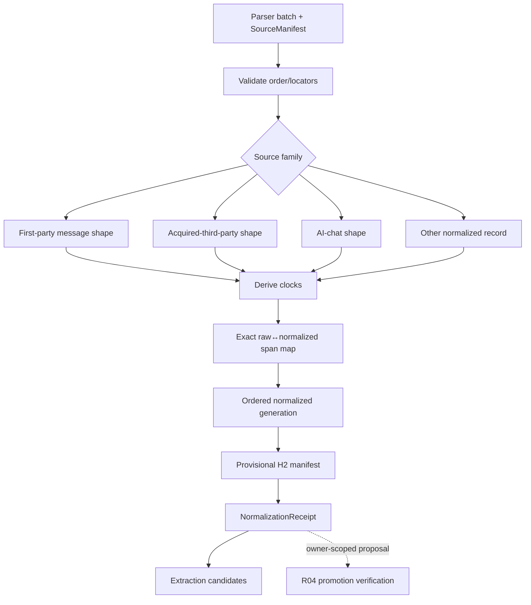
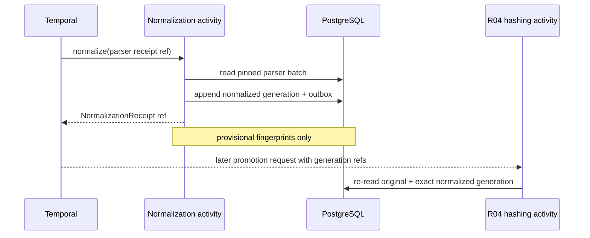

# R03 — Normalization, Message Shapes, and Source Clocks

> **Lane:** R03 · **Authority:** normalized context records, message semantics, and source clocks
>
> **Depends on:** R00–R02 · **Governing rulings:** D-069, D-071, D-072, D-075–D-081

## Purpose and authority

Convert parser output into deterministic, source-linked normalized context records without
asserting evidence, facts, or horizon labels. Preserve the three governed message shapes and
their actual participant semantics. Compute provisional per-record H2 fingerprints for drift
detection and later promotion verification. Model the source clocks needed for safe retrieval;
do not stamp normalized rows with an as-lived/hindsight pass.

## Scope

### In scope

- Deterministic normalized record contracts and version/generation identity.
- Separate first-party, acquired-third-party, and AI-chat message projections/shapes.
- Sender, recipients, participants, roles, and additive entity-resolution links.
- `occurred_at`, `source_available_from`, acquisition, and realization linkage semantics.
- Exact raw locator/span mapping and normalized chunk generation.
- Provisional H2 over the full ordered normalized generation.
- Normalization manifests, conflict/quarantine reporting, and replay.

### Out of scope

- Custody verification, evidence promotion, H3, authentication, legal-use status.
- Claim/fact extraction, entity merge decisions, beliefs, walks, or disclosure passes.
- Replacing sender/recipient fields with a participant join table.
- Inventing the owner as participant in acquired third-party conversations.
- Geo authority beyond preserving raw references; canonical geometry belongs in PG/PostGIS
  under its bounded workstream.

## Owned surfaces

- Import-light normalized record contracts and normalizer adapters.
- Context normalized-record generations and source-span maps.
- Three message-family stores/projections and message route decisions.
- Clock derivation/validation functions.
- Normalized chunks and generation manifests.
- Provisional H2 construction input serializer and receipt.
- Compatibility adapters for existing normalized records.

## Upstream and downstream contracts

| Direction | Contract | Requirements |
|---|---|---|
| R02 → R03 | parser batch | SourceManifest, ordered raw records, exact locators, parser receipt |
| R03 → R01 | normalization event/receipt | generation, contract/normalizer versions, record/chunk manifests, clock completeness, provisional H2 refs |
| R03 → R04 | promotion input | exact source and normalized-generation refs, ordered provisional H2 manifest, clocks, message family/route |
| R03 → extraction | NormalizedRecordRef | content, structure, actual participants, clocks, exact spans; context authority only |
| R03 → projections | only via promotion | no normalized context generation directly enters governed evidence projections |

## Flow

## Message and clock rules

### Message families

- **First-party:** actual sender/recipients/participants are stored on each message. Source
  availability normally equals occurrence because the owner was a participant/source holder,
  subject to an explicit source-specific exception rather than a guessed timestamp.
- **Acquired third-party:** preserve actual sender, recipients, and participants. Never invent
  the owner as participant. `source_available_from` is custody-backed acquisition/availability,
  not the original occurrence time.
- **AI chat:** preserve conversation/message order, role, created works, and attachments. It is
  permanently context-only and cannot enter custody, fact support, evidence citations, or governed
  evidence projections. Its typed event/claim/observation/strategy/created-work outputs retain exact
  chat lineage and zero evidentiary weight.
- **Timeline mapping:** any context representation may yield an event candidate. Preserve point/range
  time, original time text/source, temporal confidence and stable source/version identity so the
  Timesketch `datetime` display value never creates false canonical precision.
- `message_participant → entity` links are additive resolution. They never replace verbatim
  sender/recipient/participant fields or overwrite unresolved addresses.

### Clock semantics

- `occurred_at`: when the represented event/message occurred.
- `source_available_from`: earliest time the source was actually available to the owner/agent.
- acquisition time: custody-backed acquisition event for third-party material.
- realization event: zero-to-many later links describing when meaning was recognized.
- knowledge/write time: database audit time only, never a horizon predicate.

Unknown clocks remain unknown and ineligible for bounded-horizon search; they are never filled
with ingest time merely to pass a gate.

## PostgreSQL events and receipts

Events:

- `context.normalization_started`
- `context.normalized_generation_appended`
- `context.message_route_proposed`
- `context.message_route_approved`
- `context.clock_completed` or `context.clock_corrected`
- `context.normalized_generation_superseded`

Receipts:

- **NormalizationReceipt:** pinned parser receipt, normalizer/contract versions, source and
  output manifests, counts, deterministic ordering, quarantine, span-map hash.
- **ClockDerivationReceipt:** clock rule/version, source values, derived values, completeness,
  exceptions and reviewer decision.
- **ProvisionalFingerprintReceipt:** serializer/version and ordered per-record provisional H2s;
  explicitly non-custodial.
- **RouteDecisionReceipt:** proposed/approved message family/projection with attributable review.

## Temporal and n8n responsibilities

- **Temporal:** durable parse→normalize→reconcile sequence, generation/idempotency identity,
  retry, and waiting for message-route or clock review Signals.
- **n8n:** agent-assisted classification/entity suggestions, operator review surfaces, and
  signal submission. It may propose; it does not author clocks or approve evidence.
- **Normalization activity:** deterministic mapping and canonical PG write.
- **R04 hashing activity:** separate Activity family; computes provisional fingerprints only
  through the frozen serializer and later independently verifies at promotion.
- All orchestration payloads are references to source/parser/generation/receipt records.

## Invariants

1. Normalized data is normalized context, not evidence and not a horizon pass.
2. Three message families remain separate.
3. Verbatim sender/recipients/participants remain on message records.
4. Entity links add resolution and never erase verbatim participant data.
5. The owner is never invented as a third-party participant.
6. Occurrence, source availability, acquisition, realization, and write time are distinct.
7. Every normalized record and chunk resolves to an exact raw source locator/span.
8. Normalization is deterministic for the same source/parser/normalizer versions.
9. Provisional H2 is computed over a declared ordered generation and is not custody.
10. Corrections append a new generation; prior normalized generations remain addressable.
11. Missing clocks fail bounded eligibility closed.
12. No direct normalized-context projection to governed Weaviate/Neo4j/Surreal evidence surfaces.
    Context event candidates may enter a distinct Timesketch timeline generation only with explicit
    `candidate/context-only` authority and the ADR-0060 PG receipt contract.
13. A Timesketch correction never overwrites normalized source content. Accepted context edits append
    annotations/assertions/successor derived versions; approved-entry edits remain amendment candidates.

## Current implementation and gaps

| Status | Observed implementation or gap | Evidence |
|---|---|---|
| Implemented contract fragment | Normalized records retain sender, recipients, message corpus, a source hash, and a stable source key; message projection routes are exclusive and reviewable. | `sql/0026_realization_event.sql:60-86`; `sql/0026_realization_event.sql:111-127` |
| Implemented contract fragment | `source_available_from` fails unapproved routes closed, uses occurrence for first party, and approved acquisition time for acquired third party. | `sql/0026_realization_event.sql:316-334` |
| Implemented constraint fragment | Deferred validation preserves acquired-third-party sender/participant semantics, requires approved human acquisition, and rejects the owner as participant. | `sql/0026_realization_event.sql:355-408` |
| Implemented realization separation | Plural realization events and record links are separate horizon atoms, not source clocks. | `sql/0026_realization_event.sql:262-314`; `sql/0026_realization_event.sql:341-351` |
| High locator gap | Chunks have nullable character offsets and hashes but no mandatory original object/page/message locator or normalized-generation revision. | `sql/0026_realization_event.sql:88-109` |
| Critical consumer gap | Native vector projection reads `route.decision_state` but does not enforce it; any record with non-null availability is emitted as active. | `server/evidence/vector_projection.py:150-179`; `server/evidence/vector_projection.py:187-207` |
| High generation gap | Current `store_activity` combines normalization/storage, and the audited path exposes no immutable full-generation membership/order/normalizer-version receipt before writes. | `server/temporal/activities.py:253-283`; `server/evidence/workflows.py:444-470` |
| Partial family support | Legacy `store_records` only accepts explicit first-party messages and directs acquired data elsewhere; the three-family production receipt shape is not unified. | `server/evidence/store.py:272-310` |
| Dated live snapshot, incomplete | The 2026-08-26 read-only snapshot inspected role/RLS posture but did not census these constraints or rows. Current constraint validation, row conformance, clock completeness, normalized-generation adoption and writer adoption therefore remain unverified. | Tracked contract: `sql/0026_realization_event.sql:60-127`; consumer code: `server/evidence/vector_projection.py:150-179`; `../COMPLETE-CODEBASE-AUDIT.md` (evidence limitations) |

Existing schemas still mix spine rows and derived projections unevenly. Legacy AI-chat/evidence
normalizers have different receipt shapes, some readers still post-filter, and provisional versus
verified H2 is not uniformly encoded or enforced.

### Applicable audit gaps

The deduplicated register assigns these blocking or mandatory findings to R03:
[`GAP-003`](../AUDIT-GAP-REGISTER.md), [`GAP-018`](../AUDIT-GAP-REGISTER.md),
[`GAP-021`](../AUDIT-GAP-REGISTER.md), [`GAP-033`](../AUDIT-GAP-REGISTER.md), and
[`GAP-034`](../AUDIT-GAP-REGISTER.md).

## Implementation phases

1. **Inventory:** enumerate normalizers, message tables, clock derivations, chunks, and readers.
2. **Contract freeze:** implement normalized generation, span, message family, and clock fixtures.
3. **Deterministic adapters:** normalize one source family and prove replay identity.
4. **Message separation:** enforce three shapes and additive entity links.
5. **Clock completion:** implement source-family rules, unknown/quarantine, and review receipts.
6. **Fingerprint generation:** emit ordered provisional H2 manifest through R04 activity.
7. **Compatibility/backfill:** create new generations from retained originals; do not rewrite old.
8. **Consumer gate:** require promotion receipt before governed projections consume records.

## Test matrix

| Area | Cases |
|---|---|
| Determinism | repeated normalization, reordered parser input, normalizer-version change |
| Source round-trip | raw byte/page/message → normalized span → exact original |
| Messages | group chat, missing sender, multiple recipients, aliases, attachment-only, edits |
| Third party | owner absent; occurrence precedes acquisition; participants preserved |
| AI chat | ordered roles, artifacts/attachments, no participant fabrication, context-only |
| Clocks | known occurrence, unknown occurrence, acquisition correction, plural realization |
| Fingerprints | stable serializer, changed record, reordered generation, Unicode normalization |
| Supersession | corrected generation linked; old fingerprint/receipt unchanged |
| Boundary | direct governed projection of context generation rejected |
| Balance | parser count equals normalized + quarantined/contract-excluded |
| Constraint introspection | live constraints/triggers match the tracked contract and contain zero violating rows |
| Generation seal | contiguous deterministic ordinals, exact membership/count/hash, parser and normalizer versions, and immutable receipt |
| Consumer eligibility | unapproved route, missing clock, unpromoted context, superseded generation, and missing locator are rejected before projection |

## Live acceptance

- Normalize live-safe samples of all three message families and one non-message source.
- Show exact original-source round-trip for a message, attachment, and document span.
- Demonstrate first-party versus acquired-third-party clock behavior at a boundary timestamp.
- Confirm actual third-party participants and the owner's absence.
- Re-run identical generation and obtain identical manifest/provisional H2; change one source
  record and observe a new superseding generation.
- Query governed projection outboxes and prove unpromoted context is absent.
- Complete mandatory live integration tests against PG and parser/runtime dependencies.

### Execution and stop gates

- **Start gate:** pin SourceManifest/ParserReceipt and inventory every normalizer, destination table,
  route writer, chunker, clock derivation, and enabled consumer.
- **Stop immediately** on non-deterministic ordering, missing/ambiguous source locator, fabricated
  participant, guessed clock, or any attempt to label provisional H2 as custody.
- **Stop immediately** if a consumer can project a proposed route, incomplete clock, unpromoted
  context record, or superseded generation.
- **Do not hand off to R04/R05/R06** until a live generation round-trips to originals, balances
  exactly, replays identically, and carries an immutable normalization/clock receipt.

## Migration and rollback

- Add versioned normalized generations and compatibility readers before moving writers.
- Backfill only from retained SourceManifest/parser batches; never fabricate locators or clocks.
- Route one source family at a time and compare old/new normalized manifests.
- Keep old message stores readable until consumer parity and promotion gating are proven.
- Rollback switches the writer/reader adapter to the prior generation contract and pauses new
  processing. Preserve all new generations/receipts for analysis; delete nothing.
- Clock/fingerprint corrections append new receipts and supersession edges.

## Risks

| Risk | Mitigation |
|---|---|
| One mega-message table erases semantics | enforce D-071 shapes and family fixtures |
| Entity resolution overwrites source text | additive links plus verbatim-field invariants |
| Ingest time leaks in as availability | explicit clock derivation rules and unknown state |
| Provisional H2 mistaken for custody | distinct type/event/receipt and promotion-only gate |
| Backfill fabricates exact locator | quarantine records that cannot round-trip |
| Normalizer upgrade rewrites history | append generation and supersede |
| Nullable chunk offsets are treated as exact provenance | make original locator/span mandatory for governed consumers; quarantine legacy gaps |
| Route SQL exists but consumer ignores it | parity tests at every projector and one shared eligibility predicate |
| Tracked migration is assumed live/conformant | fresh catalog, constraint, trigger, and violating-row census in R14 |

## Agent instructions

1. Never remove sender, recipient, participant, or verbatim address data.
2. Never invent the owner as a participant.
3. Keep clock meanings separate and fail unknown bounded availability closed.
4. Do not mark a provisional H2 as verified/canonical/custodial.
5. Make every record/chunk open the exact original locator.
6. Append generations; do not rewrite prior normalized output.
7. Coordinate contract changes with R00/R02/R04 and projection lanes.
8. Complete live tests before claiming the lane is production-ready.

## Exact handoff checklist

- [ ] SourceManifest and ParserReceipt revisions pinned.
- [ ] Normalizer and normalized-contract versions recorded.
- [ ] Message family selected with decision/receipt where required.
- [ ] Sender, recipients, participants, role, and attachments preserved verbatim.
- [ ] Entity links are additive and attributable.
- [ ] Occurred/source-available/acquisition/realization semantics are explicit.
- [ ] Unknown clocks are marked incomplete, not guessed.
- [ ] Every record/chunk carries exact raw locator/span.
- [ ] Ordered generation manifest and balance counts reconcile.
- [ ] Provisional H2 serializer/version and receipt recorded.
- [ ] Prior generation linked if superseding.
- [ ] No evidence/custody authority asserted.
- [ ] R04 accepts original-source and generation references.
- [ ] Extraction consumers accept the context-only authority state.
- [ ] Live acceptance evidence and rollback trigger attached.
