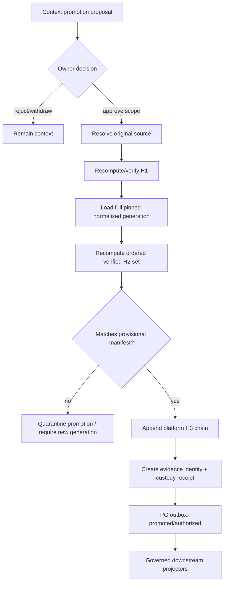
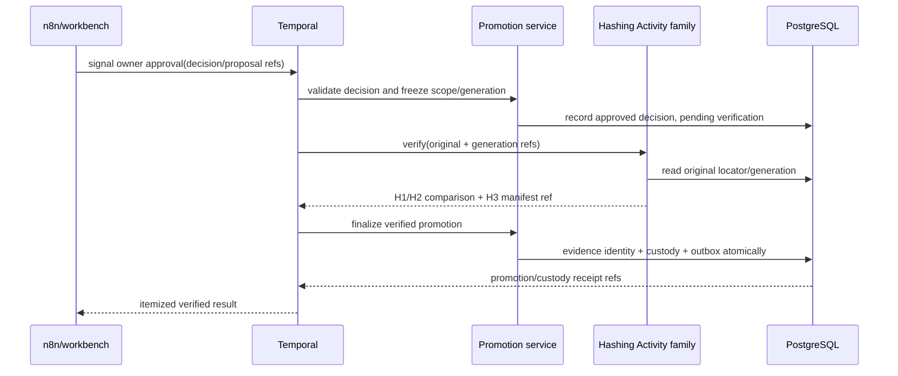

# R04 — Hashing, Custody, and Promotion

> **Lane:** R04 · **Authority:** owner promotion, original-source verification, and custody chain
>
> **Depends on:** R00–R03 · **Governing rulings:** D-069, D-072, D-075–D-081

## Purpose and authority

Implement the only transition from context to evidence. At owner-approved promotion, re-open
the original source, verify/recompute H1, recompute the full ordered normalized generation's
H2 values, compare them with provisional fingerprints, and append the platform H3 chain. This
is where custody begins under D-069. Later integrity checks append reverification records; they
never rewrite the promotion decision or historical chain.

This lane is authoritative for promotion decisions, evidence identity, custody constructions,
verification state, and custody receipts. It is not authoritative for claim establishment,
walk beliefs, search ranking, graph analysis, or legal conclusions.

## Scope

### In scope

- Owner proposal/review/approve/reject/withdraw workflow.
- Promotion scope and provenance from context to new evidence identity.
- H1 recomputation against the retained original.
- Provisional H2 comparison and independent verified H2 recomputation.
- Platform H3 construction/tagging and append-only chain head.
- Later reverification, supersession, revocation, and downstream deactivation events.
- Custody/promotion manifests, signatures/attribution, and R01 receipts.
- Separate custody hashing Temporal Activity family.

### Out of scope

- Intake-time evidence or custody.
- Parser and normalization implementation.
- Automatic agent promotion; agents may propose only.
- Establishing fact claims or marking content safe for legal use by inference.
- Using the SBV chain as the platform H3.
- Rewriting legacy chain tags or applied custody history.

## Owned surfaces

- Promotion decision ledger and owner review service.
- Evidence identity/provenance bridge from context source/generation.
- Original-source resolver and H1 verifier.
- Canonical H2 serializer/hasher integration and comparison report.
- Platform H3 builder/verifier with exact construction tag.
- Custody verification/reverification ledger and chain manifests.
- Promotion/custody Temporal activities and n8n/workbench approval contract.
- Downstream authorization/revocation outbox events.

## Hash constructions

### Context/provisional fingerprint

R03 may compute per-record H2 over the frozen normalized serializer. It is labeled provisional,
mutable-context state and is useful for drift detection only. It is not evidence custody.

### Platform custody chain

At promotion, R04 re-reads the exact original and the complete ordered normalized generation:

```text
H1 = sha256(original source bytes)
H2[i] = sha256(canonical_normalized_record_bytes[i])
H3[0] = H1
H3[i] = sha256(hex(H3[i-1]) || hex(H2[i]))   for i = 1..N
tag = h3-chain-h1genesis-hexconcat-v1
```

The ordering is the frozen normalized-generation order, not query order, promotion subset
order, database physical order, or timestamp sort performed later. The chain binds the full
generation even if downstream disclosure/projector scope exposes only approved spans.

### SBV import receipt

The SBV construction is separate and remains an import receipt. Its genesis-empty/newline
fold and its tag must never be accepted as the platform promotion H3. Legacy ambiguous tags
are disambiguated by writer/history and remain read-only; do not relabel them.

## Upstream and downstream contracts

| Direction | Contract | Requirements |
|---|---|---|
| R02/R03 → R04 | promotion proposal | SourceManifest, original locator, normalized generation/order, provisional H2 manifest, exact approved scope, clocks/routes |
| Owner → R04 | promotion decision | attributable approve/reject, scope, reason, decision revision, review surface/session |
| R04 → R01 | custody events | new evidence identity, verified H1/H2/H3 refs, construction/tag, manifest and decision revision |
| R04 → facts/extraction | promoted evidence ref | exact spans, active authority, verification revision; no assertion that a claim is fact |
| R04 → projectors | eligibility input | active promotion revision plus verified custody manifest and approved scope |
| R04 → legal | custody reference | source-open locator, chain verification and later reverification status |

## Flow





## PostgreSQL events and receipts

Events:

- `promotion.proposed`
- `promotion.approved_pending_verification`
- `promotion.rejected` / `promotion.withdrawn`
- `custody.original_resolved`
- `custody.source_verified` / `custody.verification_failed`
- `custody.chain_appended`
- `promotion.activated`
- `custody.reverified` / `custody.reverification_failed`
- `promotion.superseded` / `promotion.revoked`

Receipts:

- **PromotionDecisionReceipt:** proposal, exact approved scope, owner attribution, reason,
  normalized generation and decision revision.
- **SourceVerificationReceipt:** original locator, prior context fingerprint, recomputed H1,
  resolver/hasher versions, access/acquisition metadata, result.
- **H2VerificationReceipt:** full ordered generation, provisional and verified H2 manifests,
  comparison result and every mismatch locator.
- **H3ChainReceipt:** H1 genesis, ordered H2 manifest, every link or verifiable chain manifest,
  chain head, exact construction tag, writer/version.
- **PromotionActivationReceipt:** evidence identity, custody receipts, scope, eligibility revision,
  and transactional outbox event.
- **ReverificationReceipt:** later observed hashes/chain result linked to, never replacing, the
  original promotion/custody receipts.

## Temporal and n8n responsibilities

- **n8n/workbench:** present context, proposal, source preview, differences, and downstream
  consequences; collect attributable owner approve/reject; send Temporal Signal.
- **Temporal:** durable wait for owner Signal; freeze decision/generation; sequence verification
  and finalization; retry resolvers/hash activities safely; preserve history; fail terminally on
  integrity mismatch. Payloads contain references only.
- **Hashing Activity family:** separately deployed/tested deterministic activities for H1,
  verified H2, H3 construction, and later reverification. It does not approve promotion.
- **Promotion service/PG:** owns decision validation and the atomic evidence/custody/outbox
  transaction. A Temporal success cannot substitute for its receipt.

## Invariants

1. Everything is context until attributable owner promotion succeeds.
2. Promotion creates evidence authority; intake and normalization cannot.
3. Promotion re-opens the original source and recomputes H1.
4. Verified H2 is independently recomputed over the full pinned ordered generation.
5. Provisional/verified mismatch fails closed and identifies every mismatched locator.
6. Platform H3 uses H1 genesis, hex-concat folding, and exactly
   `h3-chain-h1genesis-hexconcat-v1`.
7. SBV H3 is a separate import receipt and never satisfies platform custody.
8. Chain ordering is explicit and stable; no implicit database order is allowed.
9. Promotion decisions, hashes, chains, and reverifications are append-only.
10. Partial downstream approval never exposes an unapproved whole source.
11. Revocation/supersession emits downstream deactivation; historical receipts remain.
12. Agents propose; only owner-authorized decision activates evidence.
13. No custody/reference payload is copied through orchestration histories; references only.
14. D-082 is a permanent eligibility exclusion: AI-chat conversations, messages, chunks, exports,
    and chat-derived created works/candidates are rejected before promotion verification begins.
15. A Timesketch edit to an evidence-approved timeline entry cannot invoke promotion or mutate custody;
    it returns as a context amendment candidate and requires independent re-review/reconciliation.

## Current implementation and gaps

| Status | Observed implementation or gap | Evidence |
|---|---|---|
| Critical wrong boundary | `ingest_artifact` is explicitly the evidence-schema custody gate and writes H1/blob/source state at intake, before promotion. | `server/evidence/custody.py:1-13`; `server/evidence/custody.py:173-213` |
| Critical workflow coupling | Temporal `custody_activity` invokes that writer and the current workflow schedules it before parse/store. | `server/temporal/activities.py:149-182`; `server/temporal/workflows.py:219-267` |
| Critical promotion inversion | The case-management promotion path requires an already custody-backed evidence-lane record, then inserts an evidence item/promotion; it does not start custody by re-opening context. | `server/case_management/repository.py:689-714`; `server/case_management/repository.py:793-872` |
| Critical verification gap | That promotion transaction checks selected provenance/quote and dedupes, but does not independently recompute H1, all ordered H2 values, membership/count, or platform H3 before evidence creation. | `server/case_management/repository.py:793-840`; `server/case_management/repository.py:841-880` |
| Partial hash history | Current custody code documents that linear ingest writes H1 only and that H2/H3 exists only in a separate SBV reconciliation path. | `server/evidence/custody.py:180-198` |
| Critical downstream gap | Native vector projection treats source-clock completeness as active authority without joining active promotion/custody/reverification state. | `server/evidence/vector_projection.py:150-179`; `server/evidence/vector_projection.py:187-207` |
| Missing lifecycle | Repository census found no standalone Temporal H1/H2/H3/reverification Activity family or atomic promotion-time platform-chain finalizer. Current activity registry remains custody/parse/store/knowledge. | `server/temporal/activities.py:323` |
| Dated live snapshot, incomplete | The 2026-08-26 read-only snapshot observed Temporal UI/worker health but did not establish a registered production workflow execution. H3-tag populations, promotion-route traffic, source resolvability, custody-row conformance, enabled workflow versions and promotion-time recomputation remain unverified. | Tracked intake path: `server/evidence/custody.py:173-213`; tracked activity registry: `server/temporal/activities.py:323`; `../COMPLETE-CODEBASE-AUDIT.md` (read-only live-parity snapshot) |

Two valid H3 constructions still require strict tag/writer dispatch. Provisional and verified H2
states are not consistently separated, later reverification is not universal, and current receipts
include mutable job state/local JSON rather than canonical immutable PG receipts.

### Applicable audit gaps

The deduplicated register assigns these blocking or mandatory findings to R04:
[`GAP-002`](../AUDIT-GAP-REGISTER.md), [`GAP-003`](../AUDIT-GAP-REGISTER.md),
[`GAP-004`](../AUDIT-GAP-REGISTER.md), [`GAP-005`](../AUDIT-GAP-REGISTER.md),
[`GAP-012`](../AUDIT-GAP-REGISTER.md), [`GAP-015`](../AUDIT-GAP-REGISTER.md),
[`GAP-017`](../AUDIT-GAP-REGISTER.md), [`GAP-021`](../AUDIT-GAP-REGISTER.md),
[`GAP-022`](../AUDIT-GAP-REGISTER.md), [`GAP-023`](../AUDIT-GAP-REGISTER.md), and
[`GAP-032`](../AUDIT-GAP-REGISTER.md).

## Implementation phases

1. **Freeze algorithms:** publish known-answer vectors for H1, normalized serializer/H2, both
   distinct H3 constructions, tags, and ordering.
2. **Inventory/migration map:** identify intake-time custody writers, promotion paths, legacy
   tags, and downstream eligibility callers.
3. **Hashing activities:** implement deterministic ref-only H1/H2/H3/reverification activities.
4. **Decision gate:** implement owner proposal/Signal/frozen-scope state machine.
5. **Atomic finalization:** create evidence identity, custody receipts, chain, and outbox in one
   canonical transaction after all verification passes.
6. **Downstream predicate:** require active promotion plus exact custody revision everywhere.
7. **Reverification/revocation:** schedule/trigger append-only checks and cascade deactivation.
8. **Legacy coexistence:** keep historical chains readable; never reinterpret or relabel.
9. **Live cutover/backfill:** only new owner promotions use the new path; historical remediation
   requires separately approved replay from originals.

## Test matrix

| Area | Cases |
|---|---|
| Known-answer hashes | empty/binary/Unicode original; normalized canonical serialization |
| H3 platform | H1 genesis, one/many/zero normalized records, order change, hex case/canonicality |
| H3 separation | SBV receipt rejected as platform chain; exact tags enforced |
| Promotion | approve, reject, withdraw, duplicate signal, stale generation, partial scope |
| Verification | missing original, changed original, provisional mismatch, changed normalizer |
| Atomicity | crash before/after hash, chain write, outbox write; no half-promoted evidence |
| Idempotency | same decision/revision returns same evidence/custody result |
| Reverification | pass, fail, later recovery/new promotion, history retained |
| Revocation | all governed projectors deactivate; prior legal/output refs remain auditable |
| Security | forged approval, wrong owner/session, locator substitution, hash algorithm downgrade |
| Current-boundary regression | intake/parse/store create zero new evidence/custody rows; only verified promotion can do so |
| AI-chat permanent exclusion | every Workbench/API/workflow/DB route rejects chat source types with zero evidence/custody writes and an attributable denial receipt |
| Approved timeline edit | creates a context amendment candidate only; original custody/fact/timeline versions remain unchanged until successor governance |
| Full-generation proof | exact H1 + N ordered H2 + one H3, with membership/count/order and known-answer head |
| Existing promotion path | evidence item/promotion insert is impossible unless independent H1/H2/H3 verification receipt is present in the same finalization transaction |
| Downstream eligibility | missing/stale/revoked promotion or custody revision deactivates every projector and returns PG receipts |

## Live acceptance

- Promote a live-safe context source through the actual n8n/workbench→Temporal Signal path.
- Observe original-source H1 recomputation, full-generation verified H2 comparison, and the
  exact tagged platform H3 chain in live PG.
- Independently recompute known-answer chain head from the retained original/generation.
- Show evidence/custody/outbox finalization is atomic and produces immutable PG receipts.
- Demonstrate owner rejection creates no evidence authority.
- Mutate a disposable source copy or normalized generation and prove promotion fails closed.
- Run later reverification and show an appended receipt, not changed history.
- Revoke a test promotion and verify downstream deactivation receipts.
- Run mandatory live integration tests against PG, Temporal, approval surface, object source,
  and every enabled downstream projector.

### Execution and stop gates

- **Start gate:** inventory every intake custody writer, promotion writer, H1/H2/H3 tag/writer,
  original resolver, evidence row, enabled workflow, and downstream eligibility predicate.
- **Stop immediately** if intake creates evidence/custody authority, the retained original cannot be
  re-opened, the full ordered generation is not sealed, or any hash/tag/order differs.
- **Stop immediately** if promotion writes any evidence/custody/outbox row before all independent
  verification receipts pass, or if a retry can create a second evidence identity/chain.
- **Do not enable downstream projection** until eligibility binds the exact active promotion and
  custody/reverification revisions and revocation produces observed deactivation receipts.
- **Do not claim live acceptance** from repository comments, unit vectors, or SBV import receipts;
  require an owner-approved disposable promotion plus independent recomputation and R14 observation.

## Migration and rollback

- Do not rewrite historical evidence or custody tags.
- Disable intake-time custody for new items only after context landing and promotion workflow
  are live and verified.
- Introduce the new platform chain under its exact tag; readers dispatch strictly by tag/writer.
- Shadow-verify candidate promotions before enabling atomic finalization.
- Cut over new promotions in one controlled live move with operator present.
- Rollback pauses new promotions and restores the prior entrypoint only if explicitly approved;
  already finalized evidence/custody remains immutable.
- A failed promotion stays context/quarantined and can retry only as a new verification attempt
  or superseding normalized generation. Delete nothing.

## Risks

| Risk | Mitigation |
|---|---|
| Algorithm/tag ambiguity corrupts custody | exact tags, known-answer vectors, tag-dispatch only |
| Original unavailable at promotion | fail closed; retain proposal and remediation reason |
| Full-generation order changes | frozen generation manifest and deterministic sequence key |
| Agent approval bypass | owner-bound Signal plus promotion-service authorization |
| Partial approval leaks whole source | scope-aware downstream manifests and canaries |
| Retry creates two chains | decision revision/idempotency key and atomic transaction |
| Revocation fails downstream | universal outbox and required deactivation receipts |
| Already-custodied record is mistaken for a valid D-069 promotion | context-origin-only promotion contract and negative tests against evidence-lane prerequisites |
| SBV receipt is accepted as platform chain | strict tag/writer/construction dispatch and cross-construction rejection vectors |
| Promotion succeeds before verification due to workflow retry/order | pending decision is non-authoritative; one atomic PG finalizer owns evidence/custody/outbox |
| Unknown live legacy tags are rewritten during migration | read-only census first; coexistence readers; never retag history |

## Agent instructions

1. Read D-069, D-075, D-076, and this entire guide before touching custody code.
2. Never call a context fingerprint a custody hash.
3. Never use an SBV receipt as platform H3 or retag historical rows.
4. Always pin the original and full ordered normalized generation before hashing.
5. Fail closed on any source, fingerprint, ordering, approval, or revision mismatch.
6. Keep approval, hash computation, and canonical finalization as separate responsibilities.
7. Preserve immutable history; append reverification/supersession/revocation.
8. Coordinate downstream eligibility changes with R01 and every projector lane.
9. Do not claim completion without live independent recomputation and cascade proof.

## Exact handoff checklist

- [ ] Proposal names context source, exact normalized generation, and approved scope.
- [ ] Owner identity, decision, reason, revision, and Signal attribution verified.
- [ ] Original source locator resolves to the intended immutable bytes.
- [ ] H1 recomputed with declared algorithm/version.
- [ ] Full normalized generation order is pinned and balanced.
- [ ] Every verified H2 recomputed from canonical serialized bytes.
- [ ] Provisional versus verified H2 comparison has zero unexplained mismatch.
- [ ] Platform H3 starts with H1 and folds ordered H2 hex values.
- [ ] Exact tag is `h3-chain-h1genesis-hexconcat-v1`.
- [ ] SBV receipt, if present, is separately identified and non-authoritative for promotion.
- [ ] Promotion, custody, chain, and outbox finalized atomically.
- [ ] Evidence identity and exact source/span provenance returned.
- [ ] Processing and reconciliation receipts stored in PG.
- [ ] Downstream eligibility uses this promotion/custody revision and approved scope.
- [ ] Reverification and revoke/deactivate paths tested.
- [ ] Live acceptance evidence, independent recomputation, and rollback trigger attached.
