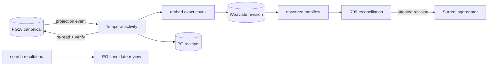

# R05 — Weaviate Search Projection

> Executable lane guide · 2026-08-25 schema reconciliation
>
> Governing inputs: reconciliation master; especially D-069 context-first,
> D-072 one-owner scope, D-077 Temporal/n8n separation, D-078 PG outbox/receipts,
> D-080 PG18 canonical + Weaviate search-only, and D-081 bounded workstreams.
> This lane owns a rebuildable search surface, never evidence authority.

## Purpose and authority

Project governed PostgreSQL records and chunks into native Weaviate collections for
hybrid/vector search. PostgreSQL 18 remains authoritative for source identity,
content generations, promotion, custody, clocks, geometry and receipts. Weaviate may
rank and retrieve; it may not establish facts, promote evidence, change source
availability, or become a recovery source.

## Scope

In scope:

- Native, versioned Weaviate schemas and aliases.
- Deterministic document IDs and projection payloads.
- Embedding generation bound to an exact chunk/source generation.
- Horizon and authority prefilters applied before ranking.
- PG outbox consumption, receipts, reconciliation and rebuild.

Out of scope:

- Intake, parsing, custody, H1/H2/H3, promotion or review.
- Canonical chunks, facts, participants, geo or realization state.
- Semantica extraction and Neo4j graph writes.
- Surreal aggregation and walk-memory policy.

## Owned surfaces

- New native Weaviate collection revision(s), including vector configuration.
- Stable read alias after a separately approved activation.
- The Weaviate projector worker/activity and its tests.
- Weaviate-specific observed manifests. PG receipt tables remain owned by R09.

The lane does not own canonical PG relations or shared event/receipt contracts.

## Contracts

### Upstream input

Consume the ordered PG projection event emitted in the same transaction as the
governed state change. Required envelope:

- event ID/sequence and idempotency key;
- canonical matter, assertion/fact, promotion and source-anchor IDs;
- source generation, chunk generation and exact locator;
- `occurred_at`, `source_available_from`, authority/revocation state;
- content, projection and policy hashes;
- embedding profile/model/version/dimension when embedding is requested.

The projector must re-read canonical payloads from PG by ID and verify their hashes.
It must not trust a notification body as canonical content.

### Downstream output

- A Weaviate object keyed by deterministic projection ID.
- An append-only PG receipt for every attempt and terminal observation.
- An observed-object manifest returned to R09.
- Search hits containing canonical PG IDs and exact source anchors.

Search-derived claims return to the PG candidate/review path. They never flow directly
to Neo4j or Surreal as facts.

## Temporal and n8n responsibilities

Temporal owns durable consumption, idempotency, bounded retry, heartbeat, per-sink
cursor and reconciliation activity invocation. One workflow ID derives from the
projection event/object key. Retryable transport/provider failures retry; schema,
hash, dimension or authority mismatches fail closed and quarantine the revision.

n8n may request projection/reconciliation, display receipts, notify the operator and
submit an approval signal. It does not loop through records, own cursors, retry writes,
move aliases, or calculate authority. Alias activation is a Temporal/operator action
after R09 and final-integrator approval.

## PG events and receipts

Use the common R09 receipt envelope. Weaviate extensions include collection/revision,
object UUID, embedding profile, dimension, expected/observed payload hash, expected/
observed vector hash, active/revoked state and alias observation. Receipts append;
current status is a view. A succeeded API response is not activation evidence.

## Invariants

1. PG is sufficient to rebuild an empty collection.
2. Every object resolves to one canonical source/chunk generation and exact locator.
3. `source_available_from` and authority are typed fields and prefilters, never
   post-top-k filtering.
4. A source/chunk revision creates a new projection identity or explicit supersession;
   stale embeddings cannot remain active.
5. Vectors are self-provided and dimension/version checked.
6. Revoked, unpromoted or future-ineligible content cannot appear in governed reads.
7. Count parity alone cannot activate a revision.
8. No Weaviate write occurs without a PG receipt attempt.

## Evidence-backed current gaps

Evidence labels in this guide mean: **source-proven** was confirmed in tracked code or
configuration; **dated live snapshot** was observed read-only on 2026-08-26 but is not a
mutation, execution, security, or cutover proof; **production-reported** comes only from an
older dated handoff; **stale** contradicts newer source/runtime evidence; and **unverified**
was outside the snapshot or requires an R14 attestation.

- **Critical · source-proven:** both the current and blue/native deployment manifests
  publish Weaviate REST and gRPC on `${BIND_IP}` while enabling anonymous access
  (`deploy/data-weaviate.yaml:16-30`,
  `deploy/data-weaviate-native-v1.yaml:7-16`). The application client accepts an empty
  API key and uses plaintext HTTP/gRPC (`server/core/session.py:115-138`). A reachable
  peer can therefore bypass the audited, horizon-bound API seam and query the store
  directly; absent separately observed RBAC, the write boundary is also unproved.
- **Source-proven positive control:** the native store combines case,
  source-completeness, active-authority, disclosure-tier and
  `source_available_from <= horizon` predicates in the Weaviate query before ranking
  (`server/core/evidence_vector_store.py:344-410`). The agent/operator routes also
  derive their permissions server-side (`server/api/native_evidence_search_routes.py:314-374`).
  These controls do not protect direct datastore access.
- **Critical · source-proven:** the insert trigger enqueues every new normalized
  chunk without checking review, promotion or projection-route eligibility
  (`sql/0026_realization_event.sql:511-541`). Although the projector selects the
  route decision, it never predicates on it and constructs every non-null-availability
  object with `authority_state="active"`
  (`server/evidence/vector_projection.py:145-176,187-217`). Thus the structurally
  correct query prefilter can faithfully return content that should never have become
  active. Promotion/route eligibility must be enforced before write, not assumed from
  the presence of a queue row.
- **High · source-proven:** native activation computes independent PG/Weaviate manifests
  and exact parity, but writes both manifests and the reconciliation receipt to the
  filesystem (`server/evidence/native_activation.py:182-219`) instead of the universal
  append-only PG receipt plane. The vector document contract carries record/chunk and
  custody identifiers but no exact original locator or promotion/review revision
  (`server/core/evidence_vector_store.py:57-121`), so count/hash parity cannot prove the
  required original-span/promotion lineage.
- **High · source-proven:** a Weaviate outage during process boot permanently leaves
  already-built agents and AgentOS knowledge routes without knowledge for that process;
  the background reconnect does not rewire them (`server/api/main.py:269-281,314-322,430-439`).
- **Medium · source-proven, dormant:** the legacy `evidence_search` path applies only a
  case filter before ranking, then filters availability after top-k and compares clock
  strings without parsing (`server/evidence/retrieval.py:180-199`). Its own module
  contract calls missing range-prefilter support an activation hold
  (`server/evidence/retrieval.py:23-30`); no tracked production caller was found.
- **Source-proven:** Semantica's worker contract forbids Weaviate credentials/writes,
  while projector configuration remains approval-gated
  (`server/analysis/semantica_wiring.py:72-100,133-160`).
- **Dated live snapshot, incomplete:** on 2026-08-26 both legacy and native Weaviate
  services were ready on v1.38.7. Exec's `NATIVE_EVIDENCE_ENABLED` value was descriptive
  text and evaluated false in the application parser. The read-only snapshot did not prove
  native alias target, collection RBAC, object/backfill parity, source anchors, horizon
  canaries, direct-store denial, or an approved cutover. Ready endpoints are not activation
  evidence (`../COMPLETE-CODEBASE-AUDIT.md`, read-only live-parity snapshot).
- **Source-proven:** there is no shared production cross-store receipt/reconciliation
  implementation. R09 must precede reader activation.
- **Source-proven scope limit:** tracked pgvector persistence is the context-chat
  embedding cache (`sql/0024_chat_conversation_and_message.sql:187-200`); pg_duckdb's
  tracked runtime use is startup secret creation only (`server/core/session.py:261-291`).
  Neither is current evidence-search authority or a substitute receipt/reconciler.

### Applicable audit gaps

The deduplicated register assigns these blocking or mandatory findings to R05:
[`GAP-005`](../AUDIT-GAP-REGISTER.md), [`GAP-006`](../AUDIT-GAP-REGISTER.md),
[`GAP-009`](../AUDIT-GAP-REGISTER.md), [`GAP-019`](../AUDIT-GAP-REGISTER.md),
[`GAP-020`](../AUDIT-GAP-REGISTER.md), [`GAP-021`](../AUDIT-GAP-REGISTER.md), and
[`GAP-024`](../AUDIT-GAP-REGISTER.md).

## Implementation phases

### Phase 0 — Freeze contract

Adopt R09 event/receipt canonicalization, source-anchor schema, filter vocabulary and
golden corpus. Reject implementation if any required field is ambiguous.

### Phase 1 — Create inactive revision

Create a new native collection with typed timestamps, authority fields, source IDs,
projection revision and self-provided vector configuration. Do not alter the stable
alias.

### Phase 2 — Projector and receipts

Implement the Temporal activity: claim event, re-read PG, verify, chunk/embed, upsert,
read back, hash observed payload and append receipt. Add bounded retry/quarantine.

### Phase 3 — Backfill and continuous catch-up

Freeze a PG high-water mark, backfill ordered events, then consume the tail. Produce
expected and observed manifests at the same sequence.

### Phase 4 — Reconcile and canary

Require exact membership/content/vector-generation parity, zero orphan/unresolved
anchors, and planted-future prefilter canaries.

### Phase 5 — Activate

After operator signal, atomically move the stable alias. Immediately verify alias,
query canaries and receipt the activation. Roll back alias on any mismatch.

## Test matrix

| Test | Proof |
|---|---|
| Deterministic ID | same event replay produces one object |
| Exact anchor | hit resolves through PG generation/locator to original |
| Horizon prefilter | planted future record is absent before boundary |
| Authority | candidate/unpromoted/revoked objects are absent |
| Enqueue eligibility | an unreviewed/unpromoted or denied-route chunk never becomes active |
| Embedding generation | source change cannot reuse stale vector |
| Dimension | wrong dimension quarantines without partial activation |
| Partial batch failure | retry fills only missing objects |
| Manifest | count, membership and content/vector hashes match |
| PG receipt durability | attempt/read-back/activation survives loss of local output files |
| Original locator | every object resolves exact original span and promotion/review revision |
| Rebuild | empty revision rebuilt solely from PG |
| Alias rollback | prior revision restored without data loss |
| Datastore authentication | anonymous REST/gRPC and a wrong store credential are rejected |
| Direct-bypass canary | a planted future object is unavailable through both API and direct client |
| Boot recovery | boot with Weaviate down, reconnect, and prove agent retrieval recovers or process fails readiness |
| Required integration job | CI fails when the Weaviate live suite is skipped or no receipt is produced |

## Live acceptance

- Live integration tests run against PG18 and the production-equivalent Weaviate API.
- One governed fixture is searchable; every hit exposes resolvable canonical IDs.
- One future fixture is excluded at the early horizon and included at the later one.
- One revocation disappears from active search without deleting historical receipts.
- One denied-route and one unpromoted chunk are absent from the collection, not merely
  hidden by the search API.
- Expected/observed manifests match exactly at a named PG event sequence.
- Stable alias switch and rollback are both observed and receipted.
- Direct unauthenticated REST, GraphQL and gRPC calls are rejected; authenticated reader
  and projector identities have distinct least-privilege permissions.
- A boot-down/reconnect exercise proves that agents become usable without silent partial
  recovery, or that orchestration replaces the degraded process before it becomes ready.

### Stop gates

Stop backfill or alias activation while any of the following remains true:

- anonymous/direct datastore access is possible or reader/projector roles are not proven;
- enqueue/projector eligibility can activate an unpromoted or denied-route chunk;
- exact original locator, promotion/review revision or append-only PG receipt is absent;
- planted-future, revocation, boot-recovery or direct-bypass canaries lack live evidence;
- the required integration suite is skipped, stale or produces no named receipt.

## Migration and rollback

All schema work is additive. Build a new collection revision; preserve the old
collection. Rollback moves only the stable alias and stops the new consumer. PG
events/receipts remain append-only. Nothing is deleted; later retirement material
moves to project `to_be_deleted` only under the repository rule.

## Risks

- Silent future leakage from post-ranking filters.
- Stale vectors after content/chunker/embedder changes.
- False success from API acknowledgement without read-back.
- Alias activation before tail catch-up.
- Search results accidentally treated as established facts.
- Anonymous datastore access bypassing every API horizon, audit and actor predicate.
- Misleading background recovery while boot-snapshotted agents remain knowledge-less.
- A dormant post-top-k legacy path being reactivated as an accidental fallback.
- Queue membership being mistaken for promotion eligibility and hardcoded as active.
- Filesystem-only activation proof becoming detached from canonical PG history.
- Exact manifest parity over an object schema that omits original locator/promotion identity.

## Agent instructions

- Read the reconciliation master and latest D-069–D-081 entries first.
- Read closest `AGENTS.md`; never edit an applied migration.
- Work only in the assigned lane files/modules and accommodate concurrent edits.
- No external-store activation, alias movement or live write without explicit gate.
- Report tests as unit vs live integration; config acceptance is not proof.
- Never delete; quarantine future removals in `to_be_deleted`.

## Exact handoff checklist

- [ ] Event and receipt schema/version recorded.
- [ ] Collection schema and canonical serialization attached.
- [ ] Projector module/activity and deployment owner named.
- [ ] PG high-water mark and cursor recorded.
- [ ] Expected and observed manifests attached.
- [ ] Queue predicate and projector both prove promotion/route eligibility.
- [ ] Activation/manifests are durably linked to append-only PG receipts.
- [ ] Every object carries an exact original locator and promotion/review revision.
- [ ] Exact-anchor, horizon, authority and revocation tests pass.
- [ ] Anonymous/direct datastore bypass tests fail closed for REST, GraphQL and gRPC.
- [ ] Reader/projector credentials and least-privilege grants are attached.
- [ ] Boot-outage/reconnect readiness behavior is observed, not inferred.
- [ ] Live read-back and canary evidence attached.
- [ ] Alias unchanged, or approval and activation receipt attached.
- [ ] Rollback revision and command/runbook verified.
- [ ] Residual gaps assigned to a named downstream lane.