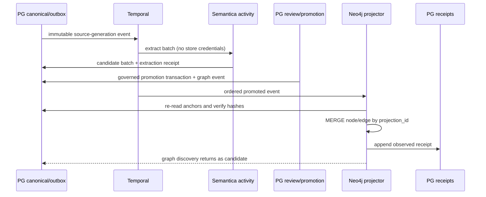

# R06 — Semantica-Originated Neo4j Evidence Graph

> Executable lane guide · 2026-08-25 schema reconciliation
>
> Governing inputs: reconciliation master; especially D-069 context-first,
> D-070 Graphiti retired, D-074 Semantica candidate-only, D-077/D-078 durable
> orchestration and PG receipts, D-080 PG canonical + Neo4j semantic graph, and
> D-081 bounded workstreams. “Semantica-originated” does not grant the extraction
> worker graph credentials: a separate governed projector owns Neo4j writes.

## Purpose and authority

Turn promoted, Semantica-originated entities, claims/events and governed analytical
relationships into a rebuildable Neo4j evidence graph. The graph optimizes traversal,
path, contradiction and network analysis. PG18 owns sources, candidate/fact authority,
promotion, exact anchors, temporal policy and receipts.

## Scope

In scope:

- Semantica immutable input/candidate contract and exact relation locators.
- Governed candidate-to-fact input boundary for graph projection.
- Neo4j labels, relationship types, constraints and projection envelope.
- Separate projector credentials, idempotency, receipts and reconciliation.
- Return of graph discoveries to PG as candidates.

Out of scope:

- Direct Semantica-worker writes to Neo4j.
- Graphiti belief memory; D-070 retires it for now.
- Establishing facts, custody, search vectors or Surreal authority.
- Broad ontology redesign unrelated to the ruled canonical model.

## Owned surfaces

- `server/analysis/semantica_*` extraction boundary changes assigned to this lane.
- The separate Neo4j evidence projector and its deployment identity.
- Neo4j evidence database schema/constraints/indexes and observed manifests.
- Graph-specific receipts extending the common R09 contract.

Shared PG DDL, promotion and receipt tables are upstream-owned and changed only by
their owning lane.

## Contracts

### Semantica candidate input

An immutable normalized/context source generation with content hash, provenance
reference and exact locator. Every emitted entity, relation and event requires:

- source table/ID and generation;
- source content SHA-256;
- extractor/config/method versions;
- exact character/page/message/structured locator and evidence quote;
- deterministic candidate hash;
- temporal proposal with uncertainty preserved.

### Governed projector input

Only a PG projection event for a promoted assertion/fact may enter the governed graph.
It includes promotion/review ID, canonical assertion ID, source anchors, authority,
clocks and supersession state. Candidates may be held in PG review views; they do not
become governed graph assertions.

### Graph object envelope

Every node and every edge independently carries:

- stable `projection_id`, projection schema/revision;
- canonical PG assertion/entity/event ID and promotion ID;
- source-anchor/source-generation IDs, locator hash and custody/content hash;
- assertion/authority/review/hypothesis state;
- `occurred_at`, `source_available_from`, valid/invalid interval;
- extractor/run/config identity and writer batch;
- supersedes/invalidates reference where applicable.

Endpoint provenance never substitutes for edge provenance.

## Temporal and n8n responsibilities

Temporal owns extraction and graph-projection workflow identities, retries, heartbeats,
ordered per-sink cursor, read-back verification and reconciliation invocation. The
Semantica activity and projector are separate activities with separate identities and
credentials. A graph failure never causes extraction to repeat destructively.

n8n may assemble operator review, display candidate/graph context and signal approve,
reject or retry. It may call Temporal and PG-governed APIs. It may not issue Cypher
writes, auto-promote candidates, manage cursors or establish assertions.

## PG events and receipts

Extraction receipts record immutable input manifest, extractor/config version,
candidate membership/content hash and rejections/failures. Graph receipts add database,
node/edge kind, target ID, expected/observed property hash, endpoint IDs, locator hash,
constraint revision and batch high-water mark. All append through the R09 contract.

## Invariants

1. Extraction is horizon-blind and creates candidates only.
2. The extraction worker has no Neo4j/Weaviate/Surreal/custody credentials.
3. The governed graph accepts promoted events only.
4. Every relationship resolves its own exact source anchor.
5. PG can rebuild Neo4j from empty state.
6. Neo4j never becomes the authority for identity, facts or clocks.
7. Graph-derived conclusions re-enter PG as non-authoritative candidates.
8. Supersession/revocation remains append-only and becomes inactive in governed reads.
9. Horizon predicates are applied in Cypher before expansion/ranking.

## Evidence-backed current gaps

Evidence labels: **source-proven** means tracked code/configuration; **dated live snapshot**
means observed read-only on 2026-08-26 but not mutation/execution/security proof;
**production-reported** means an older dated handoff; **stale** conflicts with newer evidence;
and **unverified** was outside the snapshot or still requires R14 attestation.

- **Source-proven:** `SemanticaPatternWorker` executes deterministic, horizon-blind
  candidate extraction (`server/analysis/semantica_worker.py:120-159`), while the host
  repository writes only `working.extraction_run` and
  `working.candidate_entity|candidate_fact|candidate_event`
  (`server/analysis/semantica_candidates.py:217-321,324-333`). Repository caller census
  found tests/manual fixture paths but no production workflow/activity caller.
- **Source-proven positive control:** worker wiring carries no store credentials and
  explicitly forbids Neo4j, Weaviate, Surreal and Graphiti writes; graph/vector
  configuration is held for a separate projector
  (`server/analysis/semantica_wiring.py:133-176`).
- **Critical · source-proven:** the safe candidate-only worker has no tracked production
  runner, governed candidate-to-fact transition, Neo4j evidence projector or returned
  projection receipt. Its module explicitly promises no persistence/projection
  (`server/analysis/semantica_worker.py:1-8`), and the wiring remains
  approval-gated/fixture-only (`server/analysis/semantica_wiring.py:133-160`). The
  existence of deterministic extraction therefore proves a local component, not the
  end-to-end governed graph lane.
- **High · source-proven:** Graphiti is not merely historical code. The case client
  performs unauthenticated MCP calls and exposes `add_memory`
  (`server/analysis/graphiti_case_client.py:32-65,108-164`). The platform and case
  hostfix services publish direct tailnet ports 8071/8073
  (`deploy/data-graphiti.yaml:90-118`, `deploy/data-graphiti-case.yaml:86-97`), while the
  Workbench direct client documents that the same server exposes write/destructive
  tools even though its wrapper selects only reads
  (`workbench/api/app/repo/graphiti_client.py:24-31,76-85`). Client-side tool selection
  and group allowlisting are not server authorization.
- **Medium-high · source-proven:** Neo4j and Graphiti manifests fall back to the known
  `graphiti-dev-password` rather than failing deployment when the secret is absent
  (`deploy/data-neo4j.yaml:54-65`, `deploy/data-graphiti.yaml:68-70`). Existing populated
  Neo4j auth may ignore this initialization value, so the live credential state is
  unknown rather than presumed weak.
- **Critical · source-proven:** context chat classification still creates Graphiti
  projection rows (`server/analysis/context_chat_ingest.py:308-357`) and the drain calls
  `add_memory` for each pending chunk (`server/analysis/context_chat_ingest.py:478-562`).
  Agent provider assembly also attaches the full Graphiti MCP tool surface whenever
  `GRAPHITI_MCP_URL` is set (`server/agents/providers.py:194-212`). These active
  writers/callers directly contradict an unqualified D-070 runtime-retirement claim.
- **Production-reported, not refreshed:** the Aug-24 audit reported zero Semantica candidate
  rows and no evidence-database writer
  (`docs/research/integration-audit-2026-08-24/lane-4-analysis-promotion.md`). The 2026-08-26
  snapshot did not query those relations or Neo4j, so those counts remain historical evidence.
- **Stale:** the statement that Graphiti is simply retired-for-now is inconsistent with
  tracked active clients/deployments above. D-070 remains target authority, not proof of
  runtime retirement.
- **Source-proven:** code candidate names/shapes drift from ADR-0052/0057
  `claim_candidate` and immutable established-fact design; promotion/reconciliation is
  not wired.
- **Dated live snapshot, incomplete:** Graphiti applications were running and exec still
  carried `GRAPHITI_MCP_URL` on 2026-08-26, corroborating runtime exposure risk. Neo4j
  authenticated databases/constraints/users/roles, Graphiti server-side tool authorization,
  candidate counts and the absence of an evidence projector were not directly queried or
  executed (`../COMPLETE-CODEBASE-AUDIT.md`, read-only live-parity snapshot and evidence
  limitations).

### Applicable audit gaps

The deduplicated register assigns these blocking or mandatory findings to R06:
[`GAP-007`](../AUDIT-GAP-REGISTER.md), [`GAP-008`](../AUDIT-GAP-REGISTER.md),
[`GAP-009`](../AUDIT-GAP-REGISTER.md), [`GAP-019`](../AUDIT-GAP-REGISTER.md), and
[`GAP-021`](../AUDIT-GAP-REGISTER.md).

## Implementation phases

### Phase 0 — Resolve contracts

Bind the ruled Neo4j evidence database, canonical candidate/fact names, exact anchor
schema, relationship vocabulary, property serialization and R09 receipt version.

### Phase 1 — Complete candidate fidelity

Add exact locators for relations, immutable source generation and ruled candidate
shape. Wire Semantica as a Temporal activity writing PG candidates only. Prove no graph
credentials in the worker image/environment.

### Phase 2 — Governed promotion dependency

Consume only the upstream immutable established-fact/promotion event. Block graph
implementation from inventing a parallel promotion rule.

### Phase 3 — Inactive graph revision

Create constraints/indexes and the evidence projector against a new graph revision or
inactive namespace. MERGE by stable ID; read back and receipt each batch/object.

### Phase 4 — Backfill/reconcile

Backfill at a frozen PG event sequence, catch up the tail, compare node and edge
membership/property hashes, and require zero orphan/unresolvable anchors.

### Phase 5 — Activate governed reads

Enable the new evidence graph reader only after R09/integrator attestation and planted-
future tests. Preserve old/experimental stores unchanged for rollback.

## Test matrix

| Test | Proof |
|---|---|
| Worker isolation | no external-store credentials/imports available |
| Candidate authority | extraction cannot create a fact/promotion |
| Production dispatch | a tracked Temporal runner is the only candidate extraction entry point |
| Relation anchor | each edge resolves exact source locator independently |
| Idempotent replay | duplicate event creates no duplicate node/edge |
| Typed relationship | fabricated generic `related_to` is rejected |
| Horizon | future node/edge excluded before availability |
| Supersession | old assertion remains historical but inactive |
| Partial failure | retry completes only missing graph objects |
| Orphan scan | zero endpoint/source/promotion orphans |
| Rebuild | empty graph reconstructed solely from PG |
| Direct MCP denial | unauthenticated 8071/8073 read, cross-group and write calls are rejected |
| Credential boundary | Semantica worker cannot resolve graph secrets; projector has only target-db writes |
| Graphiti retirement | runtime caller/deployment census proves disabled, isolated or explicitly sanctioned state |
| Required integration job | CI fails if Neo4j/Semantica live tests are skipped |

## Live acceptance

- Temporal executes a real Semantica fixture through PG candidates and a governed
  promotion; no manual script is the production entry point.
- Promoted fixture appears in Neo4j; unpromoted fixture does not.
- The same run proves candidate receipt, governed fact transition, Neo4j read-back receipt
  and no direct worker graph credential.
- Every returned node/edge resolves to PG promotion and exact original locator/hash.
- Early-horizon traversal excludes planted future assertions before expansion.
- Expected/observed node and edge manifests match exactly.
- Neo4j outage demonstrates PG durability, retry and successful rebuild.
- Direct Graphiti endpoints reject unauthenticated calls and cannot bypass gateway,
  database or group authorization; destructive tools are unavailable to reader identities.
- Live users, databases, grants, constraints and writer identities match the recorded
  authority map; configuration text alone is insufficient.

### Stop gates

Stop candidate activation, graph backfill or reader cutover while any condition holds:

- the production Semantica runner, candidate-to-fact transition or Neo4j projector is absent;
- extraction and projector credentials are not independently denied/proven;
- Graphiti direct ports, context drains or agent tool attachment contradict the ruled state;
- an edge lacks its own exact source anchor or an unpromoted candidate reaches the graph;
- live outage/replay, horizon, cross-group and destructive-tool denial evidence is missing.

## Migration and rollback

Use additive PG migrations and a new graph schema revision/namespace. Never mutate an
applied migration. Reader activation is separate from writes. Rollback disables the
new reader/projector and restores the prior binding; PG events/receipts allow replay.
Do not delete Graphiti or legacy graph material; later removal goes to `to_be_deleted`.

## Risks

- Ambiguous “Semantica writes Neo4j” bypassing PG governance.
- Candidate-to-fact laundering.
- Edge provenance inherited only from endpoints.
- Identity merge destroying source-specific mentions.
- Generic or fabricated relations contaminating court-facing paths.
- Graph query filters applied after traversal.
- Direct unauthenticated Graphiti MCP access bypassing gateway, group and tool policy.
- A known fallback database password silently provisioning a new environment.
- Treating a retirement ruling as proof while clients and deployment surfaces remain active.
- A deterministic local worker being reported as a production Semantica pipeline.
- Context drains or agent MCP tools continuing Graphiti writes after the retirement gate.

## Agent instructions

- Treat latest owner ruling and reconciliation master as authoritative.
- Preserve credential separation between extraction and projection.
- Check closest `AGENTS.md`; edit only assigned files/modules.
- Do not change shared PG contracts without their lane owner.
- Use new migrations only, live-test real services, and attach read-back evidence.
- Never delete or silently rewrite graph history.

## Exact handoff checklist

- [ ] Candidate/fact/anchor contracts and versions named.
- [ ] Worker entry point and Temporal workflow/activity named.
- [ ] Candidate-to-fact transition and Neo4j receipt writer are traced end to end.
- [ ] Worker credential-isolation proof attached.
- [ ] Graph labels/edges/constraints and serialization attached.
- [ ] Projector identity, database and least-privilege grant recorded.
- [ ] Direct MCP endpoint, cross-group and destructive-tool denial evidence attached.
- [ ] Graphiti active/retired exception is reconciled against callers and live deployment.
- [ ] Context projection rows/drains and provider MCP attachment are disabled or explicitly sanctioned.
- [ ] PG event cursor/high-water mark recorded.
- [ ] Node and edge manifests attached separately.
- [ ] Exact-anchor/orphan/horizon/supersession tests pass.
- [ ] Live read-back and outage/rebuild evidence attached.
- [ ] Reader activation unchanged, or approval/receipt attached.
- [ ] All residual gaps have named owners.